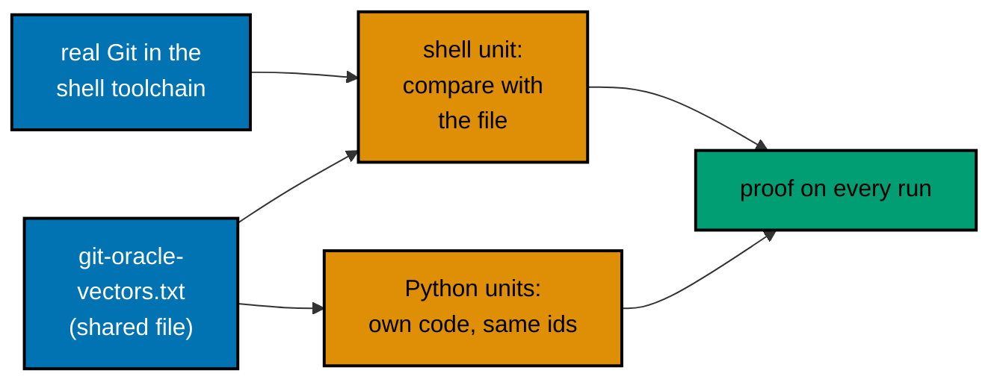

# 004 — Code Harness and Determinism

Every code example, kata, and capstone in the eight courses is a unit that plan 05's harness runs. This
page says which toolchain each course uses, what a unit looks like in each language, how the Git course
proves its hashes against real Git, which two toolchain changes this plan makes, how each language stays
deterministic, and which probes in Phase 2 decide the open technical questions before any course is
written. The contract itself is plan 05's `ayokoding.run/v1`; this page restates only what the courses rely
on (series decisions 30 to 33, restated in [../brd.md](../brd.md#resolved-series-decisions-this-plan-relies-on)).

## The Contract in Brief

- A **unit** is a folder: `learning/code/ex-NN-<slug>/` (an example), `drilling/code/kata-NN-<slug>/` (a
  kata, with `before/` and `after/`), or `learning/capstone/code/` (the capstone). Each has a `run.yaml`
  with `schema: ayokoding.run/v1`, one `toolchain`, and one to twenty `runs`.
- A run is `command` as an argv list (no shell; a script runs as `[bash, run.sh]`), a `timeout`, and an
  `expect` block: `exit`, `stdout` (a `.txt` file compared byte for byte, or `ignore` with an
  `invariant` sentence), and `stderr` (`empty` by default).
- The harness copies the unit's whole code root into `/work`. Files directly under a code root that are
  not units are **shared files**, readable as `../<name>` from a unit. Only files are shared here; no
  course puts a sub-folder under a code root, because a sub-folder that is not a unit may be a layout
  finding.
- A run has no network, a read-only root, `/tmp` as an in-memory filesystem, `HOME=/tmp/home`, `TZ=UTC`,
  `LANG=C.UTF-8`, `SOURCE_DATE_EPOCH=0`, `PYTHONHASHSEED=0`, and runs as the host user.
- **Each run executes twice**, the second time with half the CPU quota; exit status, stdout, and stderr
  must match byte for byte. This is the determinism check, and it shapes the rules below.
- Lessons show code from the files: an anchor line (`**`learning/code/ex-07-.../main.py`**`) followed by a
  fence whose body equals the file; output blocks are anchored to expected files; a fence that is not
  meant to run is marked `<!-- harness: illustration -->`. `examples sync --write` repairs anchored fences.
- A course is green when `ayokoding-cli examples check --course <slug>` exits 0: layout, sync, and every
  run on both executions.

## Toolchain per Course

The catalog ids are those of plan 05's `apps/ayokoding-cli/toolchains/catalog.yaml` as recorded on
2026-10-09; Phase 0 re-checks each against the merged catalog.

| Course                                    | Units use (catalog id)                                                                   | New or changed catalog entry in this plan                         | Other dependency                                                         |
| ----------------------------------------- | ---------------------------------------------------------------------------------------- | ----------------------------------------------------------------- | ------------------------------------------------------------------------ |
| `build-your-own-git`                      | `python` (all but the oracle units); `shell` (the oracle units)                          | None                                                              | None; Python standard library only                                       |
| `compilers-parsers-and-transpilers`       | `dotnet` (F# through `dotnet fsi`)                                                       | None                                                              | None; no NuGet package                                                   |
| `type-systems`                            | `typescript`, `ocaml`, `rust`                                                            | None                                                              | None; compiler and standard library only                                 |
| `just-enough-fsharp`                      | `dotnet` (`dotnet fsi`; a `dotnet run` project only if the offline-restore probe passes) | None                                                              | None                                                                     |
| `lisp`                                    | `racket` (Scheme and Racket macros); `clojure` (Clojure)                                 | **New `clojure` language entry**                                  | None; Clojure core, `spec.alpha`, and `core.specs.alpha` jars            |
| `enterprise-java-and-the-jvm`             | `java` (Java 25, Spring Boot 4.1.1)                                                      | **`java` gains a hash-locked jar install recipe** (derived image) | `jars.lock` with SHA-256 per jar, generated once with Maven              |
| `defensive-security`                      | `python`                                                                                 | None                                                              | `requirements.lock`: PyYAML only                                         |
| `vulnerability-management-and-assessment` | `python`                                                                                 | None                                                              | `requirements.lock`: `mypy` and its dependencies, for the typed capstone |

Every other need is met by a catalog toolchain that exists on 2026-10-09: `python` 3.14.8, `shell`,
`dotnet` SDK 10.0.401 (C# 14, F# 10), `typescript` 7.0.2 on Node 24, `ocaml` 5.5.1, `rust` 1.99.0, `racket`
9.3, and `java` JDK 25 (Temurin).

### If a Toolchain Is Missing

| Case                                                             | What this plan does                                                                                                                                                                                                                                                                                                                              |
| ---------------------------------------------------------------- | ------------------------------------------------------------------------------------------------------------------------------------------------------------------------------------------------------------------------------------------------------------------------------------------------------------------------------------------------ |
| Clojure is not in the catalog                                    | Add it in this PR by plan 05's "Adding a Toolchain": the entry, a `Dockerfile` with SHA-256-checked downloads, a fixture unit under `apps/ayokoding-cli/tests/testdata/courses/`, a row in the toolchain smoke table, `toolchains build clojure`, and the full CI run that any change under `toolchains/` triggers (series decision 33). Phase 2 |
| Java has no dependency install recipe                            | Extend the `java` entry with an `install` recipe and a derived image (below), through the same procedure. Phase 2                                                                                                                                                                                                                                |
| Common Lisp is not in the catalog                                | Not added. The `lisp` course covers it in prose and comparison tables; any Common Lisp snippet is marked `<!-- harness: illustration -->` and says it is not run here. No example depends on a Common Lisp run                                                                                                                                   |
| Haskell is not in the catalog                                    | Not added, and `type-systems` drops Haskell. TypeScript, OCaml, and Rust cover the same ideas with runnable code ([008](./008-decision-records.md#d4--type-systems-uses-typescript-ocaml-and-rust-not-haskell))                                                                                                                                  |
| A probe in Phase 2 shows a catalog toolchain cannot run a design | The fix is a root-cause change to the catalog entry with a fixture and a smoke row (plan 05's M11), in this PR. If no fix exists, the affected courses are BLOCKED and the plan stops for the user at the Phase 6 human stop; no course weakens its code to fit                                                                                  |

## Run Specs by Language

These are the shapes the makers use. Names such as `main` are conventions, not requirements.

**Python** (git, defensive, vulnerability). A script that prints its result and asserts its claims.

```yaml
schema: ayokoding.run/v1
toolchain: python
runs:
  - name: main
    command: [python3, main.py]
    expect:
      exit: 0
      stdout: expected/main.stdout.txt
```

**F#** (`dotnet fsi`). The compiler diagnostics a lesson wants to show go to expected stderr.

```yaml
schema: ayokoding.run/v1
toolchain: dotnet
resources:
  memory: 2g
runs:
  - name: main
    command: [dotnet, fsi, --quiet, --exec, main.fsx]
    timeout: 120s
    env:
      DOTNET_NOLOGO: "1"
      DOTNET_CLI_TELEMETRY_OPTOUT: "1"
      DOTNET_SYSTEM_GLOBALIZATION_INVARIANT: "1"
    expect:
      exit: 0
      stdout: expected/main.stdout.txt
```

**TypeScript** (check, then run). A deliberate type error is its own run that expects `tsc`'s non-zero
exit and its diagnostics on stdout.

```yaml
schema: ayokoding.run/v1
toolchain: typescript
runs:
  - name: typecheck
    kind: check
    command: [tsc, --noEmit, --pretty, "false", -p, .]
    expect:
      exit: 0
      stdout: expected/typecheck.stdout.txt
  - name: main
    command: [node, --disable-warning=ExperimentalWarning, main.ts]
    expect:
      exit: 0
      stdout: expected/main.stdout.txt
```

Node runs `.ts` files by stripping types, so TypeScript units use erasable syntax only (no `enum`, no
namespaces with runtime code, no parameter properties); the shared `tsconfig.base.json` under
`learning/code/` sets `erasableSyntaxOnly`.

**OCaml.** `ocaml main.ml` runs a script; a compile error or a warning is shown with `ocamlc`.

```yaml
schema: ayokoding.run/v1
toolchain: ocaml
runs:
  - name: bad-match
    kind: check
    command: [ocamlc, -w, "+8", -c, bad.ml]
    expect:
      exit: 2
      stdout: ignore
      stderr: expected/bad-match.stderr.txt
      invariant: The compiler rejects the program and says which case is missing.
```

**Rust.** `rustc` compiles to `/tmp`; a script runs it.

```yaml
schema: ayokoding.run/v1
toolchain: rust
runs:
  - name: main
    command: [bash, run.sh]
    expect:
      exit: 0
      stdout: expected/main.stdout.txt
```

where `run.sh` is `set -eu`, then `rustc --edition 2024 --color never -o /tmp/main main.rs`, then `/tmp/main`.

**Racket** and **Clojure.**

```yaml
schema: ayokoding.run/v1
toolchain: racket
runs:
  - name: main
    command: [racket, main.rkt]
    expect:
      exit: 0
      stdout: expected/main.stdout.txt
```

```yaml
schema: ayokoding.run/v1
toolchain: clojure
runs:
  - name: main
    command: [clojure, main.clj]
    timeout: 60s
    expect:
      exit: 0
      stdout: expected/main.stdout.txt
```

**Java with Spring.** Compile with the locked jars, then run with explicit flags.

```yaml
schema: ayokoding.run/v1
toolchain: java
dependencies:
  lockfile: learning/code/jars.lock
resources:
  memory: 2g
runs:
  - name: main
    command: [bash, run.sh]
    timeout: 120s
    expect:
      exit: 0
      stdout: expected/main.stdout.txt
```

where `run.sh` compiles with `javac -parameters -cp "$JARS/*"` into `/tmp/out` and runs `java` with
`-XX:+UseSerialGC -Xshare:auto -XX:TieredStopAtLevel=1 -cp /tmp/out:"$JARS/*"`. Exact flags are fixed by the
Phase 2 probe, then written once into a shared `run-common.sh` under `learning/code/`.

Kata units run `before` in `before/` (expect a non-zero exit and a `FAIL: <reason>` line on stdout, not a
stack trace) and `after` in `after/` (expect exit 0).

## Two Toolchain Changes

### The `clojure` entry

A derived image built from `eclipse-temurin:25-jdk` (the same base as `java`), adding three jars under
`/opt/clojure/` and a wrapper `clojure` on `PATH`:

| Jar                            | Version | Source                                                   |
| ------------------------------ | ------- | -------------------------------------------------------- |
| `org.clojure:clojure`          | 1.12.6  | Maven Central (released 2026-09-02, Java 25 recommended) |
| `org.clojure:spec.alpha`       | 0.5.238 | The versions named by Clojure 1.12.6's POM               |
| `org.clojure:core.specs.alpha` | 0.4.74  | Same                                                     |

The `Dockerfile` downloads each jar from `repo.maven.apache.org` by exact coordinates and checks each with
`sha256sum -c` against a value written in the file. The wrapper runs
`exec java -XX:+UseSerialGC -Xshare:auto -XX:TieredStopAtLevel=1 -cp <the three jars> clojure.main "$@"`. The entry
is `kind: language`, `version: "1.12.6"`, with no `install` recipe (the course uses no third-party Clojure
library). Source for the versions: Maven Central's `org.clojure/clojure/1.12.6` page, accessed 2026-10-09. The
executor re-reads it, records the three SHA-256 values, and bumps nothing without re-recording the course
outputs that print version-specific text (reflection warnings, `macroexpand` output).

### The `java` install recipe

Spring Boot needs a closure of about a hundred jars. The harness's install step runs only while an
environment image is built, with network, from a lockfile whose hashes the toolchain checks. Python, Node,
and Go have recipes; Java has none. The change:

1. The `java` entry becomes a derived image: `FROM eclipse-temurin:25-jdk@sha256:<digest>` plus
   `COPY JarFetch.java /opt/tools/JarFetch.java`. `JarFetch.java` is a single-file Java program, about sixty
   lines, run as `java /opt/tools/JarFetch.java <lockfile> <target-folder>`. For each lock line
   `<group>:<artifact>:<version> <sha256>` it downloads
   `https://repo.maven.apache.org/maven2/<group path>/<artifact>/<version>/<artifact>-<version>.jar` with
   `java.net.http`, computes SHA-256, and fails on any difference or any missing line.
2. The catalog `install` block names the lockfile (`jars.lock`), the install argv (`java /opt/tools/JarFetch.java
/deps/lock/jars.lock /deps/java`), and an environment variable `JARS=/deps/java` for run time.
3. The lock is generated once, in a throwaway container with network: Maven resolves the closure of the
   course's `pom.xml` (Spring Boot 4.1.1 parent), the executor computes each jar's SHA-256, and writes
   `learning/code/jars.lock` with a header recording the Boot version and the direct dependencies.
4. `PomLockCheck.java`, a unit in `learning/code/` (`ex-NN-pom-and-lock-agree`), parses `pom.xml` and fails
   if the direct dependency set or the parent version differs from the lock header. A later dependency edit
   without a regenerated lock then fails the harness.
5. Existing Java units in other courses are unaffected: the image gains one file and the `install`
   block is used only by units that declare `dependencies.lockfile`.

Spring Boot 4.1.1 is the current release (spring.io, accessed 2026-10-09); it builds on Spring Framework 7
and Jackson 3. Boot 4 split its starters and test starters by technology, so the executor reads the Boot 4.1
reference to choose artifact names rather than copying Boot 3 names. Alternative and trade-offs:
[008 D5](./008-decision-records.md#d5--spring-boot-through-a-hash-locked-jar-recipe-on-the-java-toolchain).

**The riskiest item in this plan.** If the recipe or the Boot smoke probe (P9 below) cannot be made to pass,
`enterprise-java-and-the-jvm` is BLOCKED at Phase 2, the plan continues with the other seven courses, and
Phase 6 is a `[HUMAN]` stop where the user chooses (for example a Boot-free Java design, or more time).

## The Git Oracle

`build-your-own-git` is the one course whose truth is another program: real Git. Its Python units can show
the right id only if some unit proves the right id.



- **The shared file** is `learning/code/git-oracle-vectors.txt`, one vector per line:
  `<name> <algorithm> <object id>`, such as `blob-hello sha1 3b18e512dba79e4c8300dd08aeb37f8e728b8dad`.
  It covers blobs, trees (modes `100644`, `100755`, `120000`, `40000`, `160000`; the sort rule for a
  directory and a file sharing a prefix), commits and a tag with fixed identity and time, an index
  checksum, and the SHA-256 equivalents.
- **The shell unit** (`ex-05-ask-real-git`, toolchain `shell`) builds each object with real Git in `/tmp`
  using fixed names, emails, and `1700000000 +0000`, with `GIT_CONFIG_GLOBAL=/dev/null` and
  `GIT_CONFIG_NOSYSTEM=1`, then `diff`s the result against `../git-oracle-vectors.txt`. It exits 0 only
  when every vector matches. Index entries use `git update-index --add --cacheinfo`, so their stat fields
  are zero and the index bytes are reproducible.
- **The Python units** read `../git-oracle-vectors.txt` and compare their own result to the matching
  vector, so a wrong header byte fails the unit.
- **Compressed bytes are never compared.** Object ids do not depend on compression, but a `zlib` output can
  differ between builds, so units print lengths or round-trip equality. Pack fixtures are committed as hex
  text (`fixture-small.pack.hex`) and read by units; the shell unit checks them with `git index-pack` and
  `git verify-pack -v` after converting hex to bytes (`perl` or `basenc`, whichever the Phase 2 probe finds
  in the `shell` image).
- **Version.** The `shell` toolchain's Git version is whatever its pinned Debian snapshot holds, probably
  the 2.47 series. Phase 0 records it. The course never prints the version in an expected file; where a
  feature needs a minimum (SHA-256 repositories need 2.29 or later), a unit checks the minimum with
  `sort -V`.

### The Hash Facts the Course Must Reproduce

Computed on 2026-10-09 with the formula `hash("<type> <size>" + NUL + payload)`:

| Object                                                                          | Algorithm | Id                                                                 |
| ------------------------------------------------------------------------------- | --------- | ------------------------------------------------------------------ |
| Empty blob                                                                      | SHA-1     | `e69de29bb2d1d6434b8b29ae775ad8c2e48c5391`                         |
| Blob `hello world` plus a line feed                                             | SHA-1     | `3b18e512dba79e4c8300dd08aeb37f8e728b8dad`                         |
| Empty tree                                                                      | SHA-1     | `4b825dc642cb6eb9a060e54bf8d69288fbee4904`                         |
| Blob `hello world` plus a line feed, **wrong header** (`\\0` as two characters) | SHA-1     | `3049e353c96f950832cfd662a69d824cbafad47f`                         |
| Empty tree                                                                      | SHA-256   | `6ef19b41225c5369f1c104d45d8d85efa9b057b53b14b4b9b939dd74decc5321` |
| Blob `hello world` plus a line feed                                             | SHA-256   | `0bd69098bd9b9cc5934a610ab65da429b525361147faa7b5b922919e9a23143d` |

### The Known Bug and Its Regression Test

All 79 code files that hash an object today write the header terminator as `b"\\0"`: a backslash followed
by `0`, two characters, instead of the single NUL byte `b"\0"`. They are 78 example files named
`example.py` and `capstone/code/store.py` (lines 10 and 26). Every id they print is wrong, including the
`3049e353…` value above. A bug fix needs a regression test (AGENTS.md); there are two:

1. **The oracle (primary).** Every Python unit that hashes an object compares to the real-Git vector, so
   the wrong header fails the harness on every run. Example 6 (`ex-06-the-nul-trap`) shows the bug
   deliberately and the fix.
2. **A static scan (fast).** A scenario in `filler-course-completion.feature` fails when any `.py` file under
   the course's code folders contains a bytes literal with a backslash followed by another backslash and
   `0` (the two-character form). It runs in `test:quick` and needs no Docker.

## Determinism Rules This Plan Adds

Plan 05's six rules apply to every unit (no clock reads, explicit seeds, no network, no thread-order
output, no hash-map order, no timing in compared streams). The double run adds one rule that plan 05 does
not state and that bites hardest in the JVM and .NET courses.

**Output must not depend on the CPU count.** The second execution runs with half the CPU quota, so any
value derived from the processor count differs between the two executions and fails the check. That
includes `Runtime.availableProcessors()`, `Environment.ProcessorCount`, the default garbage collector the
JVM picks (it chooses the serial collector on fewer than two processors), pool sizes taken from the
processor count, and thread-count-dependent scheduling. Pass explicit values: `-XX:+UseSerialGC` or another
named collector, `-XX:ActiveProcessorCount=N` when an example prints the count, fixed pool sizes.

| Language        | Rules                                                                                                                                                                                                                                                                                                                                                                                                                                                      |
| --------------- | ---------------------------------------------------------------------------------------------------------------------------------------------------------------------------------------------------------------------------------------------------------------------------------------------------------------------------------------------------------------------------------------------------------------------------------------------------------- |
| Python          | `random.Random(seed)` only. Sort sets and directory listings. Print relative paths, never `tempfile` names. Print lengths or round trips of `zlib` output, never its bytes. No `time` or `datetime.now()`; use fixed instants (`1700000000`, `2026-01-15T09:00:00Z`)                                                                                                                                                                                       |
| Shell and Git   | `LC_ALL=C`, `TZ=UTC`, fixed `GIT_AUTHOR_*` and `GIT_COMMITTER_*` names, emails, and dates, `GIT_CONFIG_GLOBAL=/dev/null`, `GIT_CONFIG_NOSYSTEM=1`. Sort `ls` and `find` output. Never print `git --version`                                                                                                                                                                                                                                                |
| F# and .NET     | No `DateTime.Now`, `Guid.NewGuid`, `Environment.ProcessorCount`, or `System.Random` output (the seeded algorithm may change between .NET versions; use a small generator written in the example). `DOTNET_SYSTEM_GLOBALIZATION_INVARIANT=1`. Sort `Map` and `Dictionary` output; compiler warnings are pinned to SDK 10.0.401                                                                                                                              |
| TypeScript      | Diagnostics pinned to TypeScript 7.0.2 with `--pretty false`. No `Date.now()`, `Math.random()`, or `Intl` formatting in compared output                                                                                                                                                                                                                                                                                                                    |
| OCaml           | Warning and error text pinned to OCaml 5.5.1. Sort `Hashtbl` and `Map` bindings before printing. No `Random` output (write a small generator)                                                                                                                                                                                                                                                                                                              |
| Rust            | `rustc --color never`; diagnostics pinned to Rust 1.99.0. Use `BTreeMap`, never `HashMap` iteration (its order is random per process)                                                                                                                                                                                                                                                                                                                      |
| Racket          | No `current-seconds`. `random` only after `random-seed` or a pseudo-random generator with a fixed state. Sort hash tables before printing                                                                                                                                                                                                                                                                                                                  |
| Clojure         | Sort map and set output (`sorted-map`, `(sort ...)`), because hash order is an implementation detail. No `rand` or `System/currentTimeMillis`. Reflection-warning and `macroexpand` text pinned to 1.12.6                                                                                                                                                                                                                                                  |
| Java and Spring | Explicit garbage collector and processor flags (above). `new Random(seed)` is fixed by the Java specification. Sort bean names and map output. Log pattern `%msg%n` with the banner off, so no timestamp or PID prints. JVM-behaviour examples assert invariants (a collection count is above zero, a heap limit is at most the flag), never a duration or a count that depends on timing. No server port, not even on localhost: web examples use MockMvc |

Compiler-diagnostic outputs (TypeScript, OCaml, Rust, F#) are the pinned part of the design: they are
correct for the catalog version recorded on 2026-10-09. When a catalog version bump changes the text, the
bump's PR re-records the affected expected files and reads them (plan 05's M5), as with any expected output.

## Phase 2 Probes

Each probe runs a throwaway unit in `local-tmp/ayokoding-learn/plan-09/probe/` through the real harness and
records the result in `<plan>/evidence/phase-2-probes.md`. The result decides a design before any course
starts.

| #   | Probe                                                                                                                                                                                                                                                                       | If it fails                                                                                                                                                                      |
| --- | --------------------------------------------------------------------------------------------------------------------------------------------------------------------------------------------------------------------------------------------------------------------------- | -------------------------------------------------------------------------------------------------------------------------------------------------------------------------------- |
| P1  | `dotnet fsi --exec` runs a script under the harness isolation (read-only root, `/tmp` tmpfs, arbitrary uid, no network); record start-up time, the `DOTNET_*` variables it needs, and the diagnostic text of FS0025                                                         | Add the variables to each run's `env`; if all four dotnet-using runs need them, add them to the catalog entry with the fixture. If it cannot run, the two F# courses are BLOCKED |
| P2  | `dotnet build` of an F# console project works offline (`FSharp.Core` from the SDK's library packs)                                                                                                                                                                          | The two F# capstones stay `dotnet fsi` scripts with `#load`; nothing else changes                                                                                                |
| P3  | TypeScript: the exit code and stdout of `tsc --noEmit --pretty false` on a file with an error; whether `node main.ts` prints a warning on stderr; `erasableSyntaxOnly` works                                                                                                | Pin the exit code seen; add `--disable-warning=ExperimentalWarning` (already in the specs above) or the flag that works                                                          |
| P4  | OCaml: `ocaml` and `ocamlc` are on the image's `PATH`; `ocamlc -i` and warning 8 print as designed                                                                                                                                                                          | Fix `PATH` in the catalog entry with the fixture (plan 05 M11)                                                                                                                   |
| P5  | Rust: `bash run.sh` with `rustc -o /tmp/main` runs; the E0004, E0277, E0382, and E0117 diagnostics print with `--color never`                                                                                                                                               | Switch to `cargo` with `CARGO_TARGET_DIR=/tmp/target` and `--offline`                                                                                                            |
| P6  | Racket: `racket -l racket/base`, the `r5rs` language, `racket/match`, `syntax/parse`, and `rackunit` all load                                                                                                                                                               | Drop the library that is missing from the designs that use it (a hand-written `check` helper replaces `rackunit`)                                                                |
| P7  | A shared file under a code root is readable as `../<name>` from a unit, including a long hex file; a layout check does not flag it                                                                                                                                          | Put the file inside each unit that needs it, and let a unit-local copy-check keep copies equal                                                                                   |
| P8  | The `shell` image has `git`, `diff`, `sort -V`, and `perl` or `basenc`; record the Git version                                                                                                                                                                              | A missing tool is added to the `shell` entry with the fixture; an old Git version moves the SHA-256 examples to illustration                                                     |
| P9  | **Spring Boot 4.1.1 starts a context** (no web server), runs MockMvc against a controller, runs a JPA repository on H2, and runs `JUnit` through the console launcher, from jars installed by `JarFetch`, under `--network none`, with byte-equal output on both executions | `enterprise-java-and-the-jvm` is BLOCKED; Phase 6 is a `[HUMAN]` stop (see the risk note above)                                                                                  |
| P10 | `toolchains build clojure` succeeds; `clojure main.clj` prints; `*warn-on-reflection*` prints the expected text; record start-up time                                                                                                                                       | Fix the `Dockerfile`; `lisp` is BLOCKED only if no fix exists                                                                                                                    |
| P11 | `requirements.lock` from `uv pip compile --generate-hashes` installs for PyYAML and for `mypy` on both `linux/amd64` and `linux/arm64`                                                                                                                                      | Pin versions that have wheels for both; do not hand-edit hashes                                                                                                                  |

## Migration Steps Applied

Plan 05's steps M1 to M11 apply to each course; the per-course checklists in [../delivery.md](../delivery.md)
cite them as follows.

| Step | Where it appears                                                                                                                            |
| ---- | ------------------------------------------------------------------------------------------------------------------------------------------- |
| M1   | CP-0: baseline `examples validate` and `sync` counts for the course, before any change                                                      |
| M2   | CP-2: the maker's layout (`ex-NN-<slug>/`, `kata-NN-<slug>/{before,after}`, `capstone/code/`); the old flat and `README` files are replaced |
| M3   | Phase 2: toolchain choices and the two changes above                                                                                        |
| M4   | CP-2 for the three courses with a lockfile (java, defensive, vulnerability); nothing is downloaded at run time                              |
| M5   | CP-2: write each `run.yaml`, record missing expected files with `--record`, **read every recorded file**                                    |
| M6   | CP-2: anchor every fence or mark an illustration; `examples sync --write`                                                                   |
| M7   | CP-2 and CP-5: determinism rules above; the double run                                                                                      |
| M8   | Not used: no course here needs `mode: static`                                                                                               |
| M9   | CP-5: `examples check --course <slug>` exits 0, after both gates                                                                            |
| M10  | Phase 9: `examples coverage` shows `covered: true` for all eight                                                                            |
| M11  | A harness defect that blocks a course is fixed in `apps/ayokoding-cli` with a regression test in this PR; a course never weakens its check  |
