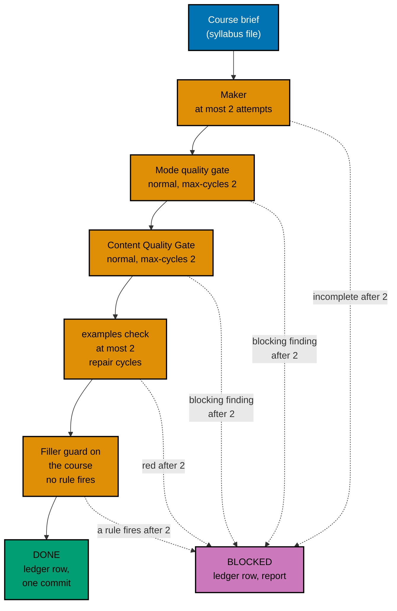

# 006 — Execution Model

Rewriting eight long courses is most of this plan's work. This page says in which order the courses are
written, who writes and checks each one, how every loop is bounded, which checkpoints a course passes, what
happens when a course cannot pass, what happens when the guard finds something unexpected, and where the record
of it all lives.

## Waves in Prerequisite Order

A course is written only after every course it requires (inside these eight) is finished. The maker of a later
course reads the finished earlier courses so it reuses their names and does not re-teach them.

| Level | Courses                                                                                                                          | Requires (inside the eight)  |
| ----- | -------------------------------------------------------------------------------------------------------------------------------- | ---------------------------- |
| L0    | `build-your-own-git`, `type-systems`, `just-enough-fsharp`, `lisp`, `enterprise-java-and-the-jvm`, `defensive-security`          | —                            |
| L1    | `compilers-parsers-and-transpilers` (needs fsharp and type-systems), `vulnerability-management-and-assessment` (needs defensive) | L0 members named in brackets |

Three agents run at a time, so the courses are cut into three waves. A wave starts when every course of the
levels it needs is DONE or BLOCKED; a slot that frees up inside a wave takes the next ready course in the
order below.

| Wave | Courses                                                                        | Why these together                                                                                                                                                                      |
| ---- | ------------------------------------------------------------------------------ | --------------------------------------------------------------------------------------------------------------------------------------------------------------------------------------- |
| 1    | `build-your-own-git`, `just-enough-fsharp`, `defensive-security`               | The F# primer and the defensive course each gate a level-1 course, so they go first. Git is the course with the most unusual proof (the oracle) and benefits from the earliest feedback |
| 2    | `type-systems`, `lisp`, `enterprise-java-and-the-jvm`                          | The remaining level-0 courses. `type-systems` gates compilers. Java's riskiest part (the Spring probe P9) is already decided in Phase 2, before any wave starts                         |
| 3    | `compilers-parsers-and-transpilers`, `vulnerability-management-and-assessment` | Level-1 courses; each reads its finished prerequisites. Two courses leave one slot free for a repair                                                                                    |

Each wave ends with a coordinator check (see [What the Coordinator Checks](#what-the-coordinator-checks-between-waves)).

## Agent Topology

- **Main thread (coordinator).** Owns the execution ledger, every commit, index generation, and every shared
  file: the baseline module, the completion test's course table, the catalog, the skill reference, and every
  phase gate. It keeps its own context free and fills background slots first.
- **At most 3 background agents at any time** (the repository's N+1 model with N = 3). Each runs the pipeline
  below for exactly one course and writes only inside that course's folder
  `apps/ayokoding-www/content/en/learn/courses/<slug>/`, and never the `_index.md` frontmatter (the coordinator
  edits `estimatedHours` and `prerequisites` itself, CP-6).
- **Never shared:** two agents never write the same file. A maker that finds a harness defect reports it to
  the coordinator; it does not fix `apps/ayokoding-cli`.
- **Compute.** Every command runs through `./hippo`, so concurrent harness runs (which start containers)
  wait for admission instead of overloading the machine. Wave 2 puts the JVM course next to two light ones on
  purpose; HIPPO's `heavy` tier is requested for the Java and .NET runs only.
- **Makers:** `apps-ayokoding-www-by-example-maker` for the seven By Example courses and
  `apps-ayokoding-www-primer-maker` for `just-enough-fsharp`.

## The Per-Course Pipeline

Every step is bounded. "Cycle" means one check-then-fix round. The user set the cap on 2026-10-09: every gate
and every maker-checker loop stops after **2 cycles** ("semua jadi 2 aja").

| Step             | Who                                                                                             | Input                                                                                                                                                                                                                                   | Done when                                                                                                                                                                         | Cap                                                                                     |
| ---------------- | ----------------------------------------------------------------------------------------------- | --------------------------------------------------------------------------------------------------------------------------------------------------------------------------------------------------------------------------------------- | --------------------------------------------------------------------------------------------------------------------------------------------------------------------------------- | --------------------------------------------------------------------------------------- |
| 1. Make          | The course's maker agent                                                                        | The course brief, [002](./002-course-modes-and-definition-of-done.md), [003](./003-filler-guard.md), [004](./004-code-harness-and-determinism.md), [005](./005-security-content-and-accuracy.md), and the finished prerequisite courses | Every page and every code unit in the brief exists; `examples validate`, `sync`, and `check --course <slug>` exit 0 on the maker's own run; every recorded expected file was read | 2 attempts. A second attempt continues from the first one's files; it never starts over |
| 2. Mode gate     | The Tutorial By Example (or Tutorial Primer) Quality Gate                                       | `subject` = the course folder, `mode: normal`, `max-cycles: 2`                                                                                                                                                                          | Verdict `PASS` or `PASS_WITH_FINDINGS`                                                                                                                                            | 2 cycles (the gate's own input)                                                         |
| 3. Content gate  | The Content Quality Gate                                                                        | The same inputs                                                                                                                                                                                                                         | Verdict `PASS` or `PASS_WITH_FINDINGS`                                                                                                                                            | 2 cycles                                                                                |
| 4. Harness green | The coordinator runs `examples check --course <slug>`; a repair goes back to the course's maker | The course folder after the gates' fixers                                                                                                                                                                                               | Exit 0                                                                                                                                                                            | 2 repair cycles                                                                         |
| 5. Guard         | The coordinator runs the guard's real-corpus scan                                               | The course folder after step 4                                                                                                                                                                                                          | The course's report shows no rule fired. A fired rule is a content defect: it goes back to the maker                                                                              | 2 repair cycles (shared with step 4's count if the repair also touched code)            |
| 6. Record        | The coordinator                                                                                 | The reports and exit codes                                                                                                                                                                                                              | A ledger row with every field below, the metadata and baseline edits of CP-6, and one commit for the course                                                                       | —                                                                                       |

The harness also runs inside step 1, because a maker must hand over code that works. Step 4 still runs after
the gates, because the gates' fixers may edit lessons or code; it is the step decision 29 names. Step 5 is this
plan's addition: the guard is cheap, and a rule that fires after a gate's fixer edited the course is a signal
that a fixer pasted a repeated paragraph.

A gate verdict of `FAIL` or `BLOCKED` after its second cycle, or any open `needs-decision` finding (the gate
adapter routes an example count under its floor to `needs-decision`), makes the course BLOCKED. No verdict
stops the batch.

## Checkpoints per Course

Each course has a checklist in [../delivery.md](../delivery.md) with these checkpoints. The coordinator ticks
them; the ledger row records the evidence.

| #    | Checkpoint                     | Proof                                                                                                                                                                                                                                                                                                                                                |
| ---- | ------------------------------ | ---------------------------------------------------------------------------------------------------------------------------------------------------------------------------------------------------------------------------------------------------------------------------------------------------------------------------------------------------- |
| CP-0 | Baseline                       | The guard's row for the course (all six measures), the word count, `examples validate` and `sync` finding counts (plan 05's M1), the current `_index.md` frontmatter, and the brief's accuracy notes read                                                                                                                                            |
| CP-1 | Facts re-verified (A3)         | Every fact in the brief's accuracy notes fetched again; value, source, and access date in the ledger; the brief corrected where the world differs                                                                                                                                                                                                    |
| CP-2 | Units green on the maker's run | `ex-NN-*`, `kata-NN-*`, and `capstone/code/` exist as the brief lists; `EX-RECORD` has written only missing expected files and the maker has read every one; `EX-CHECK` exits 0 (both executions agree)                                                                                                                                              |
| CP-3 | Lessons synced                 | Every fence anchored or marked as an illustration; `EX-SYNC` has no finding; `learning/overview.md` has `## Examples by Level` and the concept list; the completion test's counts hold                                                                                                                                                               |
| CP-4 | Gates passed                   | Mode gate and Content Quality Gate reports saved under `generated-reports/`, each `PASS` or `PASS_WITH_FINDINGS`, or the course is BLOCKED                                                                                                                                                                                                           |
| CP-5 | Harness and guard green        | `EX-CHECK` exits 0 after the gates; the guard's row shows no rule fired; the old flat code files, `README.md`, and side pages named in 001 are gone                                                                                                                                                                                                  |
| CP-6 | Metadata and baseline moved    | In one commit: `estimatedHours` copied from the drift test; `prerequisites` edited per [001](./001-current-state.md#prerequisite-changes); the course's entry removed from `FILLER_BASELINE`, the cap lowered by one, and the slug added to `REWRITTEN_FILLER_COURSES`; indexes regenerated; `UNIT-NODE` for the guard and the completion test green |
| CP-7 | Capstone `relies-on` re-read   | Only `defensive-security` and `vulnerability-management-and-assessment`: the capstones' rows searched and compared with the finished course ([005](./005-security-content-and-accuracy.md#capstone-handoff)); any edit made in the same commit                                                                                                       |

## Blocked Courses

A course is **BLOCKED** when any step reaches its cap without passing. Then:

1. The coordinator records it in the ledger with the step, the cycle count, and every open finding.
2. It reports the course to the user in one short message (course, step, top findings) and continues with the
   next course. Dependent courses still run: their makers use the BLOCKED course's brief and whatever the old
   course provides, and the ledger notes that dependency. Level-1 courses depend on only three courses, so a
   blocked prerequisite is visible early.
3. **The BLOCKED course changes nothing on the branch.** Its partial work is saved as a patch under
   `local-tmp/ayokoding-learn/plan-09/blocked/<slug>.patch` (not committed) and the course folder is restored
   to the branch state before the course began. The course stays in `FILLER_BASELINE`, the ratchet stays green,
   and its old (filler) text stays live until a later decision. This differs from plan 06, where unfinished
   courses stay outlines: here the old course is already live and is not made worse by a half-written
   replacement.
4. After the last wave, the plan stops at a `[HUMAN]` decision before the end-state phase, because a BLOCKED
   course would leave a filler course live and plan 14 would find it. The user chooses for each BLOCKED
   course, for example to authorise more cycles for that one course, to change the course's scope, or to
   merge without it. **The plan does not merge with a course still BLOCKED unless the user says so in words.**
   If the user chooses to merge without it, the course remains in the baseline with owner `plan-09` and the
   final report names it, so plan 14 inherits it as an open item.

## Unexpected Guard Findings

Phase 1 computes the baseline from the merged tree. The expected set is the 25 courses in
[003](./003-filler-guard.md#the-25-non-outline-courses-that-fire). Any difference is handled as follows, and
Phase 1 does not complete until each difference is explained:

| Difference                                                               | Handling                                                                                                                                                                                             |
| ------------------------------------------------------------------------ | ---------------------------------------------------------------------------------------------------------------------------------------------------------------------------------------------------- |
| A course rewritten by plans 06 to 08 fires a rule                        | A regression in recent work. Stop, record the course and rule, and report it to the user before baselining. The fix belongs in that course, in this PR only if the user says so                      |
| A course edited by plans 01 to 05 fires a rule it did not fire before    | Read the diff. A rule that now fires because of a deliberate edit (for example a shortened page) is reported; a mechanical edit that produced it is fixed in the guard (a new fixture) or the course |
| A course in the expected 25 no longer fires                              | It was fixed by an earlier plan. Remove its entry; the ratchet requires it                                                                                                                           |
| A new course fires that is not in the 25                                 | It is reported to the user with the rule and values before it is baselined. It is baselined only with an owner and a reason                                                                          |
| A heading the scanner does not recognize makes a course show zero bodies | Add the heading word to the pattern with a fixture, as [003](./003-filler-guard.md#false-positives-and-false-negatives) says, and rerun the calibration                                              |

## The Execution Ledger

The ledger is the running record of the waves. It lives in the execution worktree at
`local-tmp/ayokoding-learn/execution-ledger.md` (gitignored scratch, shared by the series), under a heading
`## Plan 09 — filler rewrites`. One row per course:

| Field             | Example                                                        |
| ----------------- | -------------------------------------------------------------- |
| Course            | `build-your-own-git`                                           |
| Wave, level, mode | 1, L0, by-example                                              |
| Maker agent ID    | the agent ID the harness reports                               |
| Maker attempts    | 1                                                              |
| Facts re-verified | list of fact, value, source, access date                       |
| Mode gate         | 2 cycles, `PASS_WITH_FINDINGS`, report path                    |
| Content gate      | 1 cycle, `PASS`, report path                                   |
| Harness           | exit 0, 0 repair cycles, units 83, runs 166                    |
| Guard             | no rule fired; unique-body 1.00, unique-code 0.97, boiler 0.02 |
| Measures          | 31,240 words, 78 examples, 34 diagrams, 8 katas                |
| Metadata          | `estimatedHours` value; prerequisites change                   |
| Status            | DONE or BLOCKED                                                |
| Open findings     | — or the list                                                  |
| Commit            | the short SHA                                                  |

At the end the coordinator copies the table (without scratch paths) into `<plan>/evidence/execution-summary.md`,
which is committed, so the record survives the worktree's cleanup.

## Commits

One commit per DONE course, made by the coordinator after step 6:
`feat(ayokoding-www): rewrite <slug> course`. It stages only that course's folder, the regenerated `_index.md`
files that belong to it, and the course's baseline and completion-test edits. Indexes are regenerated by the
coordinator once per wave, never by a background agent; the coordinator then confirms with `rtk git status
--short` that nothing under `apps/ayokoding-www/content/id/` changed, and restores those files with
`rtk git checkout -- apps/ayokoding-www/content/id` before committing if something did.

Because the baseline ratchet requires a fixed course to leave the baseline in the same commit, no commit in the
series is red. The first commits of Phase 1 (the guard) and Phase 2 (the toolchain) come before any course.

## What the Coordinator Checks Between Waves

- Every course in the wave is DONE or BLOCKED and has a ledger row.
- `examples check` for every DONE course so far still exits 0 (a later fix must not break an earlier course).
- `rtk git status --short` shows only the wave's course folders, their indexes, and the baseline and test edits.
- The guard's scan shows every DONE course clean and every remaining baseline course still firing.
- The quick suite is not run between waves; it runs at the end of Phase 5 (the last wave) and in the end-state phases. The
  harness and the index validation run after every wave.
