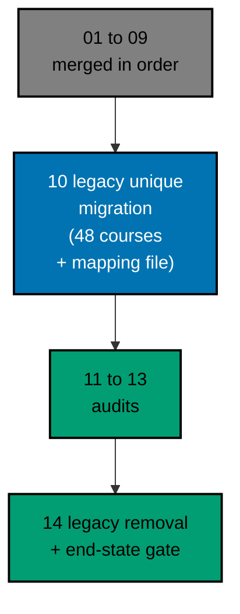

# AyoKoding Learn Revamp 10 — Legacy Unique Migration

> **Status:** Backlog. Do not execute until both are true: the user gives an explicit execution
> command, and plans 01 to 09 of this series have merged to `origin/main`. The 14 plans run strictly
> one after another (series decision 42), so plan 09 is merged, deployed, verified, and cleaned up
> before this plan starts, and plans 11 to 14 start only after this plan has merged.
>
> **Plan quality gate:** not run yet, so no verdict exists. By the user's decision of 2026-10-09 it
> was not run while the plan was written; it runs at the start of execution, as the first item of
> Phase 0 in [delivery.md](./delivery.md#phase-0-worktree-environment-preconditions-and-baseline),
> with `max-cycles` 2.

`apps/ayokoding-www/content/en/learn/legacy/` holds 1,150 Markdown files (about 6.65 million words)
self-described as "kept for reference while the course library fills". On 2026-10-09 this plan
inventoried every one of them against the 181-course library built by plans 01 to 09 and classified
each legacy topic as **covered** by an existing course, **new** (no equivalent exists), or **obsolete**
(a stated reason, not a silent drop). This plan writes the 48 courses that fill the "new" gaps and
records the full classification as a machine-checkable mapping file. It deletes nothing: removing
`learn/legacy/`, adding the 308 redirects, and repointing the 94 `docs/` files that still link into it
is plan 14's job, using this plan's mapping as its only input.

## Scope

- **Inventory every legacy topic** (105 topic-level rows covering all 1,150 files) with files, words,
  disposition, target course(s), and the specific evidence (an existing course's description, a measured
  mention count, a direct title/example comparison, or a stated legal/taxonomy reason) that resolves it.
  See [syllabus/legacy-to-course-mapping.md](./syllabus/legacy-to-course-mapping.md).
- **Write 48 new courses** to the series definition of done (decision 27): each course is in one
  tutorial mode (41 By Example, 7 Annotated-Concept), chosen per course with a reason; it meets its
  mode's targets and has a full drilling page and a capstone; it passes its mode quality gate and the
  Content Quality Gate with no blocking finding; and it runs all its code green in plan 05's example
  harness. See [tech-docs/002](./tech-docs/002-course-modes-and-definition-of-done.md).
- **More than 20 new courses, delivered in one plan with waves.** This plan is deliberately large: 48
  courses in 16 waves of 3, N=3 background agents per wave (series decision 29). The PR-size risk and
  the checkpoint-push strategy that keeps one reviewable PR despite the volume are stated prominently in
  [delivery.md](./delivery.md#wave-strategy-and-pr-size-risk) and are not an afterthought.
- **Fast-changing tools verified at writing time.** The four AI coding-agent courses (Claude Code,
  Hermes Agent, OpenClaw, Pi coding agent) carry an explicit source-and-date policy: every version or
  current-behaviour claim is re-verified against the vendor's own documentation on the day the lesson is
  written, dated, and cited; every runnable example drives a deterministic fixture shim, never the live
  product. See [tech-docs/005](./tech-docs/005-fast-changing-tool-sourcing-policy.md).
- **One new toolchain and two extended entries.** WebAssembly is not in `apps/ayokoding-cli`'s toolchain
  catalog and is added through plan 05's "Adding a Toolchain" procedure (1 course:
  `webassembly-essentials`). Plan 09 merges first and already adds the `clojure` entry and gives `java` a
  hash-locked jar `install` recipe; this plan does not add Clojure again. It extends the merged `clojure`
  entry (and the `kotlin` entry) with that same install recipe so the three Clojure courses
  (`clojure-essentials`, `web-backends-in-clojure-with-pedestal`,
  `database-migrations-with-clojure-and-migratus`) and the two Kotlin courses can pin their libraries, and
  it reuses the `java` recipe unchanged for the Java courses. See
  [tech-docs/003](./tech-docs/003-code-harness-determinism-and-toolchain-additions.md#toolchain-changes).
- **Catalog and metadata.** All 48 courses get plan 03's metadata (`category`, `description`,
  `estimatedHours`, `format`, no `status: outline`); the hard-coded 181-course and per-category catalog
  counts become 229, and every affected test is updated in the same PR. See
  [tech-docs/004](./tech-docs/004-catalog-metadata-and-path-membership.md).
- **No path membership required.** Every new course states "None" in its "In which paths" section with
  a reason (plan 02 closure rule R4 only binds courses that are already path members); assigning any of
  the 48 into a career or skills path manifest is left to a later plan or to the path's own maintainer.
- **Do not delete anything under `learn/legacy/`.** This plan's own commits touch only
  `apps/ayokoding-www/content/en/learn/courses/`, this plan's own `plans/` folder, the catalog/metadata
  code and tests plan 03 built, and `apps/ayokoding-cli`'s toolchain catalog. `learn/legacy/` is read-only
  source material for this plan; plan 14 is the only plan that edits or deletes it.
- **End-state share of the series gate** (decision 40): this plan's own completion gate proves every one
  of the 105 mapping rows is resolved (covered, migrated, or justified obsolete), all 48 new courses are
  filled and green in the harness, and the mapping file validates against the real course catalog and the
  real legacy tree. Plan 14 carries the terminal, series-wide completion gate.

## Non-Goals

- Writing or editing any course content, any app code, or any `docs/` file as part of **authoring this
  plan**. This plan document is written now; its content is not implemented until the user gives an
  explicit execution command ("jangan kerjain/implement plan ini sebelum gw kasih perintah buat eksekusi
  ya").
- Deleting, moving, or editing anything under `learn/legacy/` (plan 14).
- Adding the 308 redirects or repointing the 94 `docs/` files (plan 14); this plan only records the
  mapping those steps consume.
- Auditing or rewriting any of the 181 pre-existing courses (plans 11 to 13), including the courses this
  plan's mapping marks `covered`.
- Assigning any of the 48 new courses to a career or skills path manifest.
- Indonesian content: `content/id/**` stays untouched (decision 35).
- Any change to plan 05's harness beyond the one new toolchain (WebAssembly) and the install-recipe
  extensions of the merged `clojure` and `kotlin` entries (plus the one optional `JarFetch.java` lock
  field they need).

## Flags for the User

These are choices this plan made on its own authority. None needs an answer to start, and each is easy
to change before execution.

1. **48 new courses, not a smaller curated subset.** Every legacy topic without a comparable existing
   course becomes a course, including small, specific topics (a single database-migration tool, a single
   web framework) rather than only the largest ones. Merging related small topics (for example, awk + sed
   - jq into one course) was applied only where an individual topic was below its mode's floor; see
     [tech-docs/009](./tech-docs/009-decision-records.md) for every merge decision and its alternative.
2. **Three architecture-adjacent legacy clusters (the by-example general survey, the C4 model, and the
   three-paradigm DDD/FSM/hexagonal/patterns corpus, together about 1.5 million words) are classified
   `covered`, not `new`.** The underlying subject is already taught by `domain-driven-design`,
   `software-architecture`, `object-oriented-design-and-patterns`, `event-driven-architecture`,
   `system-design`, and `technical-communication`; the legacy corpus's distinctive three-paradigm
   comparative teaching format is recorded as recommended source material for the plan 11 to 13 audits of
   those courses, not migrated as new courses. See
   [tech-docs/009](./tech-docs/009-decision-records.md#decision-d3-the-architecture-corpus-is-covered-not-new).
3. **CliftonStrengths (46 files) and three bare navigation pages are classified `obsolete`.**
   CliftonStrengths is Gallup's proprietary, trademarked assessment framework; the 14-category taxonomy
   has no personal-development category, and reproducing a licensed third-party framework as course
   content carries trademark and licensing risk this plan declines to take on. See
   [tech-docs/009](./tech-docs/009-decision-records.md#decision-d1-cliftonstrengths-is-obsolete).
4. **Cap of 2 cycles** on every gate and loop (the user's instruction of 2026-10-09). Sibling plans 02 to
   04 may still say 3 in places; this plan does not edit them.
5. **No plan quality gate verdict exists yet.** It runs first in Phase 0.

## Dependency and Result

The series runs strictly in order, one plan, one worktree, and one PR at a time (series decision 42), so
plans 01 to 09 are all merged when this plan starts. This plan builds directly on plan 02 (path model,
for the closure rule that lets a course join no path), plan 03 (course metadata and catalog counts), and
plan 05 (the code harness and the toolchain-addition procedure), and on plan 09's merged `clojure` entry
and `java` install recipe, which Phase 0 re-reads before any toolchain work starts. Plans 11 to 13 run after it and may treat
this plan's new courses and its `covered` dispositions as audit input; plan 14 runs last and consumes this
plan's mapping file as its only input for the series-ending deletion and redirect step.

## Series Context

This plan is row 10 of the 14-plan **AyoKoding Learn Revamp** series. Each plan is one PR delivered from
its own worktree, and the plans run strictly in numeric order; the "Depends on" column shows which
earlier plans each one builds on directly. The user resolved the series decisions on 2026-10-09; every
decision this plan relies on is copied into
[brd.md](./brd.md#resolved-series-decisions-this-plan-relies-on).

| NN  | Plan suffix                           | Scope                                                                                                                        | Depends on       |
| --- | ------------------------------------- | ---------------------------------------------------------------------------------------------------------------------------- | ---------------- |
| 01  | `navigation-and-display`              | Strip `NN ·` title prefixes; path position numbers; sidebar auto-scroll; render fixes                                        | —                |
| 02  | `path-model`                          | Phases, goals, `assumes`, outline marker, prerequisite revision, closure checks, career copy                                 | 01               |
| 03  | `catalog-and-metadata`                | Course metadata schema and backfill, categories, catalog page, course landing header                                         | 01               |
| 04  | `learning-experience`                 | Browser progress, phase roadmap page, context bar, mark complete, Learn home                                                 | 02, 03           |
| 05  | `code-harness`                        | `ayokoding-cli`, `run.yaml` contract, runners, Nx target, CI, quality-gate propagation                                       | —                |
| 06  | `accounting-courses`                  | Write 24 accounting courses; restructure both accounting paths in the same PR                                                | 02, 03, 05       |
| 07  | `erp-courses`                         | Write 30 ERP courses; restructure both ERP paths in the same PR                                                              | 06               |
| 08  | `capstone-courses`                    | Rewrite 8 skeleton capstones; give the AI Engineer path its goal                                                             | 02, 03, 05       |
| 09  | `filler-rewrites`                     | Rewrite 8 templated filler courses                                                                                           | 03, 05           |
| 10  | `legacy-unique-migration` (this plan) | Inventory legacy topics vs courses; build 48 new courses for topics without equivalents; record the legacy-to-course mapping | 03, 05           |
| 11  | `audit-languages-and-tooling`         | Audit and fix language and tooling courses                                                                                   | 05               |
| 12  | `audit-cs-systems-and-data`           | Audit and fix CS, systems, concurrency, distributed, database, and data courses                                              | 05               |
| 13  | `audit-product-security-ai`           | Audit and fix web, backend, mobile, security, AI, testing, architecture, product courses                                     | 05               |
| 14  | `legacy-removal`                      | Delete `learn/legacy`, add 308 redirects, repoint `docs/` links, update specs and tests, carry the series-completion gate    | 10 (+11–13 done) |

## How the Work Runs

The 48 courses are written in 16 waves of 3, by at most three background agents at a time. Each course
goes maker → mode quality gate → Content Quality Gate → harness green, and every loop stops after 2
cycles (the user's cap, 2026-10-09: "semua jadi 2 aja"). A course that still fails is marked BLOCKED in
`local-tmp/ayokoding-learn/execution-ledger.md`, reported, and the batch moves on; the wave gate stays
open until the user decides. See [tech-docs/006](./tech-docs/006-execution-model-waves-and-ledger.md).

## Navigation

- [Business requirements](./brd.md)
- [Product requirements, Gherkin, and UI note](./prd.md)
- [Technical design](./tech-docs/README.md)
- [Syllabus corpus (the legacy-to-course mapping and 48 course briefs)](./syllabus/README.md)
- [Delivery checklist](./delivery.md)
- [Execution learnings](./learnings.md)
