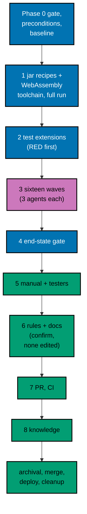

# Delivery Plan — AyoKoding Learn Revamp 10: Legacy Unique Migration

> **Legend** — `[AI]`: an agent performs the step (the default; unmarked steps are `[AI]`).
> `[HUMAN]`: only a human can do it (physical action, out-of-band approval, real-secret or
> privileged-credential handling). `[AI+HUMAN]`: agent prepares, human approves or finishes.

**Do not start** until the user gives an explicit execution command for this plan. That command is
the authorization for this plan's change set (commits, pushes, PR, merge, and deploy described
below). The user said: "jangan kerjain/implement plan ini sebelum gw kasih perintah buat eksekusi
ya". The 14 plans of the series run strictly one after another (series decision 42), so plans 01 to
09 must be merged, deployed, verified, and cleaned up first (see Phase 0).

**Plan quality gate:** not run yet, so no verdict exists. By the user's decision of 2026-10-09 it was
not run while this plan was written; it runs at the start of execution, as the first checkbox of
Phase 0, with `max-cycles` 2. The executor records the verdict line in this section when the gate has
run; until then this section holds no verdict and none is claimed.

Authored 2026-10-09.

## Worktree

- **Execution worktree:** `worktrees/ayokoding-learn-revamp-10-legacy-unique-migration/`
- **Provisioning status:** pending
- **Authoring-worktree exception:** this plan was authored inside the separate authoring worktree
  `.claude/worktrees/ayokoding-update` (branch `worktree-ayokoding-update`), which the user required
  for writing all plans of the AyoKoding Learn Revamp series together. That authoring worktree is
  removed after the plan-docs PR merges and is **never** used for execution. The Provisioned Worktree
  Identity and Delivery Branch Inventory are intentionally omitted until Step 0 below creates them.
- **Step 0 obligation (blocking):** the plan-execution Step 0 gate provisions the execution worktree
  from fresh `origin/main` with
  `rtk git worktree add -b ayokoding-learn-revamp-10-legacy-unique-migration-base worktrees/ayokoding-learn-revamp-10-legacy-unique-migration origin/main`,
  initializes it per
  [Worktree Toolchain Initialization](../../../repo-governance/development/workflow/worktree-setup.md),
  writes the immutable identity and the first inventory row into this section, replaces
  `Provisioning status: pending` with `Provisioning status: provisioned` in the same plan update, and
  syncs with `origin/main` before any delivery packet starts.
- **Cleanup:** after the PR merges, the worktree and its branches come down through
  [Dev Artifact Clean-Up](../../../repo-governance/workflows/maintenance/dev-artifact-clean-up.md)
  (see Plan Archival).
- **Worktree cap:** one worktree for this plan in this repository, reused by every phase.
- **Never leave the worktree:** every command runs from the worktree root. Do not `cd` out of it; a
  session whose working directory drifts outside its bound worktree can be disabled by the tool guard.

## Delivery Mode: worktree-to-pr

`worktree-to-pr` is mandatory in this repository. One branch and **one PR** deliver the whole plan.
The PR opens as a draft at the first checkpoint push (after Wave 1's gate). It needs the exact
current-head/base `Quality gate` from `.github/workflows/pr-quality-gate.yml` and an exact-head posted
`pr-leak-review` `pass` (`leak-review` status). Broad semantic PR review is not run unless the user
asks for it. `[AI]` merges once the hardened merge preconditions (a)–(e) of the
[PR Merge Protocol](../../../repo-governance/development/workflow/pr-merge-protocol.md) hold. The plan
folder moves to `plans/done/` inside this same PR, before the merge (archival-in-PR).

### Delivery Unit

| Unit  | Phases                                      | Safe `main` state after merge                                                                                                                                                                                                                                                                                                                                                                     | Rollback                                                                                                                                                                                                                                   |
| ----- | ------------------------------------------- | ------------------------------------------------------------------------------------------------------------------------------------------------------------------------------------------------------------------------------------------------------------------------------------------------------------------------------------------------------------------------------------------------- | ------------------------------------------------------------------------------------------------------------------------------------------------------------------------------------------------------------------------------------------ |
| DU-10 | 1–8 and Plan Archival (Phase 0 opens no PR) | All 48 new courses are complete and green in the harness; the WebAssembly toolchain is added and the merged `clojure` and `kotlin` entries are extended with the hash-locked jar install recipe, each smoke-tested; the mapping file validates against the real legacy tree and the real catalog; the catalog's total and per-category counts are 229; `learn/legacy/` is byte-for-byte unchanged | Revert the merge commit in a revert PR (the 48 course directories, the WebAssembly toolchain and the two install-recipe extensions, and the test extensions all return together; see [tech-docs/008](./tech-docs/008-testing-strategy.md)) |

There is no feature flag ([tech-docs/README](./tech-docs/README.md)): every new course is additive
content discoverable by its `category`, with no toggle needed. The phases are natural pauses inside
the one branch; no phase is merged on its own.

### Before Phase 0: Promotion

> If the plan is still in `plans/backlog/`, run the plan quality gate first (the first checkbox of
> Phase 0) and only then promote. A gate verdict of `BLOCKED` stops execution before any promotion.

- [ ] [AI] Promote the plan per
      [Starting and Completing Work](../../../repo-governance/conventions/structure/plans/starting-and-completing-work.md):
      a pure move of `plans/backlog/ayokoding-learn-revamp-10-legacy-unique-migration/` to
      `plans/in-progress/ayokoding-learn-revamp-10-legacy-unique-migration/` plus the
      `plans/backlog/README.md` and `plans/in-progress/README.md` index updates, landed on
      `origin/main` through its own PR. Acceptance:
      `rtk git ls-tree -r --name-only origin/main plans/in-progress/ayokoding-learn-revamp-10-legacy-unique-migration/`
      lists this plan's files. This promotion PR is separate from DU-10.

### Execution Packet Defaults

- **Plan path after promotion:** `plans/in-progress/ayokoding-learn-revamp-10-legacy-unique-migration/`
  (written below as `<plan>/`). Evidence goes to `<plan>/evidence/`.
- **Course folder:** `<dir>` means `apps/ayokoding-www/content/en/learn/courses/<slug>` for the
  course in hand.
- **Scratch:** the execution ledger, saved partial work, and probe content live in the execution
  worktree's `local-tmp/ayokoding-learn/` (gitignored). The ledger is
  `local-tmp/ayokoding-learn/execution-ledger.md`; this plan writes only under its heading
  `## Plan 10 — legacy-unique migration`. Saved partial work of a blocked course goes to
  `local-tmp/ayokoding-learn/blocked/<slug>/`. Toolchain probe content goes to
  `local-tmp/ayokoding-learn/probe-content/`.
- **No ad-hoc scripts** for deterministic tasks (series decision 37). Expected `estimatedHours`
  values come only from the `CORPUS-GUARD` failure message; code outputs come only from the harness
  (`EX-RECORD`, then read); counts come from the commands this file states at each use, the same
  commands [tech-docs/002](./tech-docs/002-course-modes-and-definition-of-done.md) and
  [tech-docs/004](./tech-docs/004-catalog-metadata-and-path-membership.md) name.
- **Format before sync.** Run `FORMAT-PY` on Python files and `FORMAT-MD` on lesson files before
  `EX-SYNC-WRITE`, because the pre-commit formatter would otherwise rewrite a fence and the harness
  would report a sync finding. No emoji appears in any code or content file.
- **Evidence hygiene:** evidence files contain repository-relative paths only. Never paste an
  absolute home-directory path, a hostname, a token, or `.env*` content (the PR leak review treats
  machine-specific values as leaks).
- **Never commit** `apps/ayokoding-www/next-env.d.ts` (the dev server and `next build` rewrite it) or
  `.serena/project.yml`. Before every commit run `rtk git status --short` and restore either file with
  `rtk git checkout -- <file>` if it shows as modified.
- **Never touch** `.env.prod` or `.env.stag`. If the dev server needs a variable, copy the key from
  `apps/ayokoding-www/.env.example` into an uncommitted `apps/ayokoding-www/.env.local`.
- **English only.** Nothing under `apps/ayokoding-www/content/id/**` changes. After every
  `GEN-INDEXES`, `rtk git status --short -- apps/ayokoding-www/content/id` prints nothing.
- **Bounded loops:** every maker→checker loop and every quality gate in this plan (mode gate, Content
  Quality Gate, the toolchain procedure's own checks, and every code-review loop) runs at **most 2
  cycles**; a harness repair runs at most 2 attempts. A course, toolchain, or finding still failing
  after the cap is recorded as `BLOCKED` in the execution ledger with its findings, reported to the
  user, and the gate stays open until the user decides. Parallelism stays at N=3 background agents.
  This plan's own text has been grepped for "3 cycles", "three cycles", "max-cycles 3", and "cycle 3"
  and contains none of them, and never writes "whichever lands second rebases".
- **Failure handling:** on any unexpected failure, save the output to the phase evidence file, fix
  the root cause (never skip, retry-until-green, loosen, sleep, or delete a test), rerun the same
  command, and note the fix.
- **If `rtk git` is refused inside the worktree** with a message about session isolation (a known
  `rtk` defect up to version 0.48.0), run the same git command by absolute path (`/usr/bin/git`; find
  it with `which git`). This file writes `rtk git` for brevity.

> **Important**: Fix ALL failures found during quality gates, not just those caused by your
> changes. This follows the root cause orientation principle — proactively fix preexisting
> errors encountered during work.

### Command Reference

Run every command from the execution worktree root. Expected results are stated at each use.

| Name                   | Command                                                                                                                                                                                                                                                    |
| ---------------------- | ---------------------------------------------------------------------------------------------------------------------------------------------------------------------------------------------------------------------------------------------------------- |
| `UNIT-FE <file>`       | `rtk ./hippo run --class ephemeral --resource-tier standard --disk-path . --cwd apps/ayokoding-www -- npx vitest run --project unit-fe <file>`                                                                                                             |
| `UNIT-NODE <file>`     | `rtk ./hippo run --class ephemeral --resource-tier standard --disk-path . --cwd apps/ayokoding-www -- npx vitest run --project unit <file>`                                                                                                                |
| `TYPECHECK`            | `rtk ./hippo run --class ephemeral --resource-tier standard --disk-path . -- npm exec nx -- run ayokoding-www:typecheck`                                                                                                                                   |
| `LINT`                 | `rtk ./hippo run --class ephemeral --resource-tier light --disk-path . -- npm exec nx -- run ayokoding-www:lint`                                                                                                                                           |
| `UNIT`                 | `rtk ./hippo run --class ephemeral --resource-tier standard --disk-path . -- npm exec nx -- run ayokoding-www:test:unit`                                                                                                                                   |
| `QUICK`                | `rtk ./hippo run --class ephemeral --resource-tier standard --disk-path . -- npm exec nx -- run ayokoding-www:test:quick`                                                                                                                                  |
| `E2E-QUICK`            | `rtk ./hippo run --class ephemeral --resource-tier standard --disk-path . -- npm exec nx -- run ayokoding-www-fe-e2e:test:quick`                                                                                                                           |
| `BE-E2E-QUICK`         | `rtk ./hippo run --class ephemeral --resource-tier standard --disk-path . -- npm exec nx -- run ayokoding-www-be-e2e:test:quick`                                                                                                                           |
| `INTEGRATION`          | `rtk ./hippo run --class ephemeral --resource-tier heavy --disk-path . -- npm exec nx -- run ayokoding-www:test:integration`                                                                                                                               |
| `E2E`                  | `rtk ./hippo run --class ephemeral --resource-tier heavy --disk-path . -- npm exec nx -- run ayokoding-www-fe-e2e:test:e2e`                                                                                                                                |
| `BE-E2E`               | `rtk ./hippo run --class ephemeral --resource-tier heavy --disk-path . -- npm exec nx -- run ayokoding-www-be-e2e:test:e2e`                                                                                                                                |
| `GEN-INDEXES`          | `rtk ./hippo run --class transactional --resource-tier standard --disk-path . -- npm exec nx -- run ayokoding-www:generate-indexes`                                                                                                                        |
| `VALIDATE-INDEXES`     | `rtk ./hippo run --class ephemeral --resource-tier standard --disk-path . -- npm exec nx -- run ayokoding-www:validate-indexes`                                                                                                                            |
| `DEV`                  | `rtk ./hippo run --class service --resource-tier standard --disk-path . -- npm exec nx -- dev ayokoding-www` (serves `http://localhost:3101`)                                                                                                              |
| `BUILD`                | `rtk ./hippo run --class ephemeral --resource-tier heavy --disk-path . -- npm exec nx -- run ayokoding-www:build`                                                                                                                                          |
| `START`                | `rtk ./hippo run --class service --resource-tier standard --disk-path . -- npm exec nx -- run ayokoding-www:start` (serves port 3101)                                                                                                                      |
| `HARNESS-GENERATE`     | `rtk ./hippo run --class transactional --resource-tier light --disk-path . -- ./rhino harness adapters generate`                                                                                                                                           |
| `HARNESS-VALIDATE`     | `rtk ./hippo run --class ephemeral --resource-tier light --disk-path . -- ./rhino harness adapters validate`                                                                                                                                               |
| `LINT-MD`              | `rtk npm run lint:md`                                                                                                                                                                                                                                      |
| `CORPUS-GUARD`         | `UNIT-NODE tests/unit/be-steps/course-metadata.steps.ts` (plan 03's real-corpus guard, extended by this plan's Phase 2 to the 48 new slugs and the 229-course totals; prints "Expected estimatedHours for every non-outline course:" on drift)             |
| `MAPPING-GUARD`        | `UNIT-NODE tests/unit/be-steps/legacy-mapping.steps.ts` (this plan's new mapping-completeness and legacy-untouched test)                                                                                                                                   |
| `CLI-BUILD`            | `rtk ./hippo run --class ephemeral --resource-tier standard --disk-path . -- npm exec nx -- run ayokoding-cli:build`                                                                                                                                       |
| `CLI-TEST`             | the as-merged Go test command for `apps/ayokoding-cli`, confirmed at Phase 0 (expected form: `rtk ./hippo run --class ephemeral --resource-tier standard --disk-path . -- npm exec nx -- run ayokoding-cli:test`)                                          |
| `TOOLCHAIN-LIST`       | `rtk ./hippo run --class ephemeral --resource-tier light --disk-path . -- apps/ayokoding-cli/dist/ayokoding-cli toolchains list`                                                                                                                           |
| `TOOLCHAIN-BUILD <id>` | `rtk ./hippo run --class transactional --resource-tier standard --disk-path . -- apps/ayokoding-cli/dist/ayokoding-cli toolchains build <id>`                                                                                                              |
| `SMOKE`                | `rtk ./hippo run --class ephemeral --resource-tier heavy --disk-path . -- apps/ayokoding-cli/dist/ayokoding-cli --content apps/ayokoding-cli/tests/testdata/toolchain-smoke examples check --all` (plan 05's toolchain smoke table, one row per toolchain) |
| `PROBE <args>`         | `rtk ./hippo run --class ephemeral --resource-tier heavy --disk-path . -- apps/ayokoding-cli/dist/ayokoding-cli --content local-tmp/ayokoding-learn/probe-content <args>` (throwaway probe courses; never committed)                                       |
| `EX-VALIDATE [<slug>]` | `rtk ./hippo run --class ephemeral --resource-tier standard --disk-path . -- apps/ayokoding-cli/dist/ayokoding-cli examples validate [--course <slug>]`                                                                                                    |
| `EX-SYNC <slug>`       | `rtk ./hippo run --class ephemeral --resource-tier standard --disk-path . -- apps/ayokoding-cli/dist/ayokoding-cli examples sync --course <slug>`                                                                                                          |
| `EX-SYNC-WRITE <slug>` | `rtk ./hippo run --class transactional --resource-tier standard --disk-path . -- apps/ayokoding-cli/dist/ayokoding-cli examples sync --write --course <slug>`                                                                                              |
| `EX-RUN <slug>`        | `rtk ./hippo run --class ephemeral --resource-tier heavy --disk-path . -- apps/ayokoding-cli/dist/ayokoding-cli examples run --course <slug>`                                                                                                              |
| `EX-RECORD <slug>`     | `rtk ./hippo run --class transactional --resource-tier heavy --disk-path . -- apps/ayokoding-cli/dist/ayokoding-cli examples run --course <slug> --record`                                                                                                 |
| `EX-CHECK <slug>`      | `rtk ./hippo run --class ephemeral --resource-tier heavy --disk-path . -- apps/ayokoding-cli/dist/ayokoding-cli examples check --course <slug>`                                                                                                            |
| `EX-CHECK-ALL`         | `rtk ./hippo run --class ephemeral --resource-tier heavy --disk-path . -- apps/ayokoding-cli/dist/ayokoding-cli examples check --all` (the full run; required once after any change under `toolchains/`, per plan 05's decision 33)                        |
| `EX-CHECK-SINCE`       | `rtk ./hippo run --class ephemeral --resource-tier heavy --disk-path . -- npm exec nx -- run ayokoding-www:examples:check` (selects the opted-in courses changed since `origin/main`)                                                                      |
| `EX-COVERAGE`          | `rtk ./hippo run --class ephemeral --resource-tier standard --disk-path . -- apps/ayokoding-cli/dist/ayokoding-cli examples coverage`                                                                                                                      |
| `FORMAT-PY <files>`    | `rtk ./hippo run --class transactional --resource-tier light --disk-path . -- ruff format --no-cache <files>` (Phase 0 confirms this form)                                                                                                                 |
| `FORMAT-MD <files>`    | `rtk ./hippo run --class transactional --resource-tier light --disk-path . -- npx prettier --write <files>`                                                                                                                                                |

Notes:

- `QUICK` runs typecheck, lint, `test:unit` (99% line threshold), and `test:coverage` (every scenario
  bound once per non-exempt adapter). From Phase 2's RED checkbox onward, `QUICK` is deliberately red
  for the two scenarios that cannot turn green until the 48 courses and the 229-course totals exist;
  the Phase 2 and wave gates name exactly which failures are expected at each point. From the end of
  Phase 4 on, `QUICK` must exit 0.
- The `EX-*` and `TOOLCHAIN-*` commands need a running Docker daemon and a built CLI (`CLI-BUILD`).
  `EX-RECORD` writes only expected files that are missing; it never overwrites one. `EX-CHECK-ALL`
  runs every opted-in course in the repository (229 by the end of this plan), so it takes hours; run
  it in the background and poll every 2 minutes.
- `E2E` builds the app with the fixture manifests in `apps/ayokoding-www-fe-e2e/fixtures/manifests/`
  and runs every scenario in three browsers. `INTEGRATION` depends on `build`, so it is heavy too.
- `DEV` and `START` both bind port 3101: never run them at the same time, and stop each one before
  `E2E` or `BE-E2E` (their Playwright `webServer` also binds 3101).

### Agent Topology

The root coordinator owns the file ledger, integration, every gate, and every commit. Phase 1 runs
serially in the coordinator, because its edits share `catalog.yaml` and `JarFetch.java` (a
shared-output edge); only its read-only probes of the two Clojure framework courses may fan out, to at
most 2 agents, once the `clojure` install recipe is green. Phase 3 fans out to
at most 3 background maker agents per wave, one per course, using the maker for the course's mode
(`apps-ayokoding-www-by-example-maker` or `apps-ayokoding-www-annotated-concept-maker`), then the
mode's checker and quality gate, the Content Quality Gate, and a harness job. Gherkin goes to
`specs-maker` (checked by `specs-checker`); the TypeScript test-extension work of Phase 2 is
delegated to `swe-developer`. Phase 5 uses `swe-web-tester` and `swe-usability-tester` for the tester
gates, and `swe-developer` for fixes. Phase 6 uses `rules-fixer` and `docs-fixer` for confirmation
only (no edit is expected).

### Commit Guidelines

- [ ] Do not stage or commit until the user's execution command has authorized this plan's change
      set; do not extend a commit beyond it.
- [ ] Use the fewest build-valid, independently reviewable and revertible commits, one coherent
      purpose each. The wave commits of Phase 3 each add only complete, gated courses, so every hook
      stays green. Fixes from the tester gates, rules and docs confirmation, evidence, and archival
      are separate commits.
- [ ] Follow Conventional Commits: `<type>(<scope>): <description>`, imperative, no period, header
      at most 100 characters. Planned messages:
  - `feat(ayokoding-cli): extend the Clojure toolchain with an install recipe`,
    `feat(ayokoding-cli): extend the Kotlin toolchain with an install recipe`, and
    `feat(ayokoding-cli): add the WebAssembly toolchain` (Phase 1; the shared `JarFetch.java` change rides
    in the first of them, and a recipe extension for another toolchain gets its own commit only if Phase 0
    finds a course that needs one)
  - `test(ayokoding-www): add the legacy-migration test extensions` (Phase 2)
  - `docs(ayokoding-www): write legacy-migration courses, wave N` (16 commits; the body names the 3 slugs)
  - `fix(ayokoding-www): <finding summary>` (one per tester-gate fix, if any)
  - `docs(plans): record ayokoding-learn-revamp-10 evidence`
  - `chore(plans): move ayokoding-learn-revamp-10-legacy-unique-migration to done`
- [ ] Keep each change with its tests, specs, regenerated indexes, and generated harness routes in
      the same commit; stage explicit paths only, never `git add -A`.
- [ ] Before every commit, run `rtk git status --short` and confirm
      `apps/ayokoding-www/next-env.d.ts` and `.serena/project.yml` are neither staged nor modified.

---

## The Course Loop

Every one of the 48 courses runs this loop in Phase 3. The detailed per-course pipeline (the maker →
mode gate → Content Quality Gate → harness-green sequence, the BLOCKED procedure, and the ledger) is
[tech-docs/006](./tech-docs/006-execution-model-waves-and-ledger.md); this section is the short form
every course checklist in Phase 3 points back to.

| Step                          | What                                                                                                                                                                                                                                                                                                                                               | Pass condition                                                                           |
| ----------------------------- | -------------------------------------------------------------------------------------------------------------------------------------------------------------------------------------------------------------------------------------------------------------------------------------------------------------------------------------------------- | ---------------------------------------------------------------------------------------- |
| S0–S1 Spec and shared pages   | Expand the course brief's worked-example section to one row per `ex-NN`; write the root overview, learning overview, and code README                                                                                                                                                                                                               | `EX-VALIDATE <slug>` shows no layout finding                                             |
| Lock (courses with libraries) | Only courses that use third-party libraries: the eight JVM-hosted ones in [tech-docs/003](./tech-docs/003-code-harness-determinism-and-toolchain-additions.md#toolchain-changes) generate `learning/code/jars.lock` by the [Lock Generation Procedure](#lock-generation-procedure); the Rust, .NET, and Elixir ones use their language's lock file | `EX-VALIDATE <slug>` shows no lock finding; every line has a SHA-256                     |
| S2–S4 Examples                | Level pages (By Example) or theme pages (Annotated-Concept), each example with its unit and recorded output; course map; capstone                                                                                                                                                                                                                  | `EX-RUN <slug>` exits 0 so far; the pages hold exactly the planned example-heading count |
| S5 Drilling                   | The drilling page with its exact five H2 sections and the kata units                                                                                                                                                                                                                                                                               | `EX-RUN <slug>` exits 0; the counts and the 5,000-word floor are met                     |
| S6 Metadata                   | Frontmatter, prerequisites by rubric, `## References`, `GEN-INDEXES`, real `estimatedHours`                                                                                                                                                                                                                                                        | `CORPUS-GUARD` names no row for the course                                               |
| Measure                       | The mode's word floor, diagram floor, and example-heading count ([tech-docs/002](./tech-docs/002-course-modes-and-definition-of-done.md))                                                                                                                                                                                                          | Every number meets its target                                                            |
| Harness pre-check             | `EX-CHECK <slug>` before any gate                                                                                                                                                                                                                                                                                                                  | Exit 0 (at most 2 repair attempts)                                                       |
| Course check                  | The course brief's own "Course-specific checks" section                                                                                                                                                                                                                                                                                            | Each shown in the text or code                                                           |
| Mode gate                     | The mode's tutorial quality gate, `max-cycles` 2                                                                                                                                                                                                                                                                                                   | `PASS` or `PASS_WITH_FINDINGS`; otherwise `BLOCKED`                                      |
| Content gate                  | The Content Quality Gate, `max-cycles` 2                                                                                                                                                                                                                                                                                                           | `PASS` or `PASS_WITH_FINDINGS`; otherwise `BLOCKED`                                      |
| Harness green                 | `EX-CHECK <slug>` on the final text                                                                                                                                                                                                                                                                                                                | Exit 0 (at most 2 repair attempts); otherwise `BLOCKED`                                  |
| Ledger                        | The ledger row                                                                                                                                                                                                                                                                                                                                     | Complete                                                                                 |

Rules that keep it bounded:

- The first failing gate ends the course as `BLOCKED`; the next gate does not run.
- A harness repair runs at most 2 attempts, touching only code, `run.yaml`, expected files, anchored
  fences (through `EX-SYNC-WRITE`), and prose needed to make a stated output true. Anything else needs
  a new gate pass, so the course is `BLOCKED` instead.
- No quiet narrowing: a course is never `DONE` by dropping an example, shrinking a target, or setting
  a Preview status.

**When a course is `BLOCKED`** (full procedure: [tech-docs/006](./tech-docs/006-execution-model-waves-and-ledger.md#blocked-handling)):

- [ ] [AI] Copy the course folder to `local-tmp/ayokoding-learn/blocked/<slug>/` and run
      `diff -r <dir> local-tmp/ayokoding-learn/blocked/<slug>`. Acceptance: no output.
- [ ] [AI] Restore the skeleton: `rtk git restore -- <dir>`, then the dry run
      `rtk git clean -n -d -- <dir>`, read the listed paths, then `rtk git clean -f -d -- <dir>`.
      Acceptance: `rtk git status --short -- <dir>` prints nothing.
- [ ] [AI] Write the ledger row (`BLOCKED`, failing step, open findings, harness output, saved path)
      and report to the user: the course, the step, the blocking findings in short, and the options
      (retry with a changed approach, defer, or stop). Do not choose for the user. The wave gate stays
      open until the user decides.

---

## Phase 0: Worktree, Environment, Preconditions, and Baseline

Phase 0 opens no PR. Its evidence rides the DU-10 PR.

- **Input:** this plan at `<plan>/`; `origin/main` with plans 01 to 09 merged.
- **Outcome:** a verdict from the plan quality gate; a provisioned, initialized worktree; confirmed
  preconditions; the as-merged names of every consumed contract; a reused PostgreSQL lock source; the
  re-validated 1,150-file legacy baseline and 181-course catalog baseline; a recorded green baseline;
  the empty ledger.
- **Proof:** `<plan>/evidence/phase-0-*.md` (named at each step).

- [ ] [AI] **Plan quality gate (deferred from authoring):** run the `plan-quality-gate` workflow on
      this plan with `max-cycles` 2 before any other step below. It was deliberately not run when this
      plan was written, to keep token use even (user decision, 2026-10-09). Acceptance: verdict `PASS`
      or `PASS_WITH_FINDINGS`; record the line `plan-quality-gate: <verdict> (<n> cycles, <k> open)` in
      this file's header section. If the plan is still in `plans/backlog/`, run the gate before the
      promotion PR. A `BLOCKED` verdict stops execution and is reported to the user.
- [ ] [AI] Run the plan-execution Step 0 gate described in [## Worktree](#worktree): provision
      `worktrees/ayokoding-learn-revamp-10-legacy-unique-migration/` from fresh `origin/main`, record
      the Provisioned Worktree Identity and the first Delivery Branch Inventory row in this file, and
      set `Provisioning status: provisioned`. Acceptance: `rtk git worktree list --porcelain` shows
      the worktree on branch `ayokoding-learn-revamp-10-legacy-unique-migration-base`.
- [ ] [AI] From the worktree root, run
      `rtk ./hippo run --class transactional --resource-tier standard --disk-path . -- npm install`.
      Acceptance: exit 0 and Husky hooks installed (`.husky/_` exists).
- [ ] [AI] Run `rtk npm run doctor`. Acceptance: exit 0. Only if it reports a missing or drifted
      toolchain, run
      `rtk ./hippo run --class transactional --resource-tier standard --disk-path . -- ./rhino toolchain provision --apply`
      and then `rtk npm run doctor` again (exit 0).
- [ ] [AI] Create the delivery branch from the synced base:
      `rtk git switch -c ayokoding-learn-revamp-10-legacy-unique-migration` and append it to the
      Delivery Branch Inventory (`worktree-to-pr`, `active`).
- [ ] [AI] Run `rtk git rev-parse HEAD` and record it in `<plan>/evidence/phase-0-contracts.md` as the
      base commit of this plan; every later "since the plan started" comparison uses it.

### Preconditions

- [ ] [AI] Plans 01 to 09 merged and archived: `rtk git ls-tree -d --name-only origin/main plans/done/`
      lists a folder ending in each of `__ayokoding-learn-revamp-01-navigation-and-display`,
      `__ayokoding-learn-revamp-02-path-model`, `__ayokoding-learn-revamp-03-catalog-and-metadata`,
      `__ayokoding-learn-revamp-04-learning-experience`, `__ayokoding-learn-revamp-05-code-harness`,
      `__ayokoding-learn-revamp-06-accounting-courses`, `__ayokoding-learn-revamp-07-erp-courses`,
      `__ayokoding-learn-revamp-08-capstone-courses`, and `__ayokoding-learn-revamp-09-filler-rewrites`.
      Record the nine folder names. Also record whether `plans/done/` or `plans/in-progress/` holds a
      folder for plan 11 (expected: none; plan 11 follows this plan).
- [ ] [AI] Each earlier plan's product is on `origin/main`. Run each command and record its result in
      `<plan>/evidence/phase-0-contracts.md`:
  - plan 02: `rtk git grep -n "R4" origin/main -- apps/ayokoding-www/src/features/course-paths/core`
    shows the closure rule this plan relies on (no path assignment needs R4's stronger rules);
  - plan 03: `rtk git cat-file -e origin/main:apps/ayokoding-www/src/features/content/core/course-metadata.ts`
    and `...course-categories.ts` both exit 0; `rtk git grep -n "COURSE_CATEGORIES" origin/main -- apps/ayokoding-www/src`
    shows the 14-category constant;
  - plan 05: `rtk git grep -n "examples:check" origin/main -- apps/ayokoding-www/project.json` shows
    the Nx target; `rtk git ls-tree -r --name-only origin/main apps/ayokoding-cli` lists the Go
    project; `rtk git grep -n "Adding a Toolchain" origin/main -- apps/ayokoding-cli` locates the
    merged procedure's home (record its as-merged file and heading); `rtk git grep -n "toolchains build\|toolchains list" origin/main -- apps/ayokoding-cli`
    confirms the CLI subcommand names this plan's `TOOLCHAIN-BUILD`/`TOOLCHAIN-LIST` commands use, and
    `rtk git grep -n "^test" origin/main -- apps/ayokoding-cli/project.json` confirms the `CLI-TEST`
    Nx target name. Record every as-merged name (or "same as planned") in
    `<plan>/evidence/phase-0-contracts.md`; a renamed item is used under its merged name from here on.
  - plan 09 (the toolchain contract this plan extends): re-read the merged catalog and confirm what
    [tech-docs/003](./tech-docs/003-code-harness-determinism-and-toolchain-additions.md#toolchain-changes)
    describes. Run `rtk git grep -n "clojure" origin/main -- apps/ayokoding-cli/toolchains/catalog.yaml`
    (the `clojure` entry exists: `kind: language`, version 1.12.6, the `eclipse-temurin:25-jdk` base,
    three SHA-256-checked jars under `/opt/clojure/`, a wrapper on `PATH`, and **no** `install` block);
    `rtk git ls-tree -r --name-only origin/main apps/ayokoding-cli/toolchains/java apps/ayokoding-cli/toolchains/clojure apps/ayokoding-cli/toolchains/kotlin`
    (the `java` directory holds `JarFetch.java`; record the other two directories' files); and read the
    `java` entry's `install` block (the lockfile name `jars.lock`, the install argv
    `java /opt/tools/JarFetch.java /deps/lock/jars.lock /deps/java`, the run-time variable
    `JARS=/deps/java`) and `JarFetch.java`'s lock-line format
    (`<group>:<artifact>:<version> <sha256>`, Maven Central). Record every as-merged name in
    `<plan>/evidence/phase-0-contracts.md`; where a merged name differs from the one in tech-docs/003,
    this plan uses the merged name everywhere from here on (file name, lockfile name, argv, variable,
    base image). Also record, for `kotlin`, `rust`, `dotnet`, and `elixir`, whether the merged catalog
    entry has an `install` block
    (`rtk git grep -n "install:" origin/main -- apps/ayokoding-cli/toolchains/catalog.yaml`); Phase 1's
    AC-5 uses that record.
  - plans 06 to 08: no shared code dependency; their course additions already count toward the
    181-course baseline checked below.
- [ ] [HUMAN] **Only if any check above fails:** stop and report which plan or product is missing. The
      user decides; the series order (decision 42) makes a missing earlier plan an unexpected state.
      Do not continue on an assumption.
- [ ] [AI] Re-probe Vercel MCP: record in `<plan>/evidence/phase-0-baseline.md` whether any Vercel MCP
      tool is listed in this session (`present` or `absent`). Either way this plan uses no Vercel tool
      (it adds no `app` deploy surface); record no Vercel identifiers.
- [ ] [AI] Confirm no API-code boundary is touched: `rtk git grep -n "" origin/main -- apps/ayokoding-www/src/server`
      is read only for context, and this plan's own File-Impact tree
      ([tech-docs/010](./tech-docs/010-file-impact.md)) touches no file under `src/server`. Record the
      line `api-gate: not applicable` in `<plan>/evidence/phase-0-baseline.md` with the reason "this
      plan adds Markdown content and test files only; no tRPC procedure or payload shape changes."
      Phase 5 follows that record (no wire verification needed; only the UI-gate and rule-15 triad run).

### Contracts and Toolchain Lock Source

- [ ] [AI] Confirm the formatter commands: run `FORMAT-PY` on a scratch Python file in
      `local-tmp/ayokoding-learn/probe-content/` and `FORMAT-MD` on a scratch Markdown file.
      Acceptance: both exit 0. If the `ruff` form differs (for example it is wrapped by a repository
      script), record the working command and use it as `FORMAT-PY` from here on.
- [ ] [AI] Run `./rhino md internal-link validate` (or the repository's link check) on this plan
      folder. Acceptance: exit 0.
- [ ] [AI] **Reuse, do not reinvent, the PostgreSQL lock source.** Read plan 06's merged
      `requirements.lock` (or the lock of any plan 06/07 course using a Python PostgreSQL driver).
      Compute `shasum -a 256` of the file, save the file text and the hash in
      `<plan>/evidence/phase-0-lock.md`. This is the lock `database-migrations-with-python-and-alembic`
      reuses. The three JVM-hosted database-migration courses (Java with Liquibase, Java with Spring Data
      JPA, Kotlin with Flyway) plus the Clojure one use the shared hash-locked `jars.lock` recipe; the
      other database-migration courses use their own language's standard lock mechanism (`go.sum`,
      `Cargo.lock`, NuGet `packages.lock.json`, `mix.lock`, npm lockfile), whose install-recipe status
      the Preconditions inventory above records and Phase 1 AC-5 closes if a gap exists.
      Acceptance: the lock text and `sha256` are recorded.
- [ ] [AI] **Toolchain starting point confirmed.** `CLI-BUILD`, then `TOOLCHAIN-LIST`. Acceptance: the
      printed catalog contains `java`, `kotlin`, and `clojure` (plan 09's entry) and does not contain
      `webassembly`. If `webassembly` already exists (an unexpected state, since no earlier plan adds
      it), stop and report to the user before Phase 1; do not silently skip or duplicate the addition.
      Save the list in `<plan>/evidence/phase-0-contracts.md`.

### Baseline and Inventory

- [ ] [AI] **Legacy tree re-count.** `find apps/ayokoding-www/content/en/learn/legacy -type f -name '*.md' | wc -l`.
      Acceptance: `1150`, matching the authoring-time evidence
      ([brd.md](./brd.md#evidence-measured-2026-10-09-at-originmain-bb7f90137)). A different count means
      `learn/legacy/` changed since authoring (it should not have, by every earlier plan's own stated
      boundary): stop and report to the user; do not proceed on a stale mapping.
- [ ] [AI] **Mapping row re-validation.** Re-run the same per-topic recursive walk
      [tech-docs/001](./tech-docs/001-current-state-and-inventory-method.md) describes against every
      row of [syllabus/legacy-to-course-mapping.md](./syllabus/legacy-to-course-mapping.md). Acceptance:
      every row's Files count still matches a fresh walk of its Legacy path; record any mismatch and its
      cause in `<plan>/evidence/phase-0-inventory.md` before proceeding (this is the same consistency
      check `MAPPING-GUARD` makes mechanical in Phase 2; this manual pass is the Phase 0 sanity check
      before the test exists).
- [ ] [AI] **Slug-collision check.** Compare the 48 slugs in
      [syllabus/courses/README.md](./syllabus/courses/README.md) against
      `rtk git ls-tree --name-only origin/main apps/ayokoding-www/content/en/learn/courses/`. Acceptance:
      zero overlap; any collision is an unexpected state (stop and report; a later plan must have
      claimed the same slug).
- [ ] [AI] **Outline baseline.** `grep -l "^status: outline" apps/ayokoding-www/content/en/learn/courses/*/_index.md`.
      Acceptance: 0 files (plans 06 to 09 filled every skeleton; decision 40's share so far). A nonzero
      count is an unexpected state: stop and report to the user rather than assume which course is
      still outline.
- [ ] [AI] **Course-count baseline.** `grep -l "^category: " apps/ayokoding-www/content/en/learn/courses/*/_index.md | wc -l`.
      Acceptance: `181`, matching [tech-docs/004](./tech-docs/004-catalog-metadata-and-path-membership.md#category-totals-after-this-plan)'s
      "Before" column.
- [ ] [AI] Run `QUICK`. Acceptance: exit 0. Save the summary (exit code, test counts, line coverage)
      in `<plan>/evidence/phase-0-baseline.md`.
- [ ] [AI] Run `E2E-QUICK` and `BE-E2E-QUICK`. Acceptance: both exit 0; save the summaries.
- [ ] [AI] Run `INTEGRATION`, then `E2E`, then `BE-E2E`. Acceptance: all exit 0 with every scenario
      passing; save the pass counts. If one fails before any change, fix the root cause first per the
      failure-handling rule.
- [ ] [AI] Run `VALIDATE-INDEXES`. Acceptance: exit 0.
- [ ] [AI] Run `CLI-BUILD`, then `EX-COVERAGE`. Acceptance: exit 0; save the covered and applicable
      counts (the 181 pre-existing courses are covered; the 48 new slugs do not exist yet, so they are
      not yet in the denominator).
- [ ] [AI] Start `DEV` in the background. With Playwright MCP at 1280×800, open
      `http://localhost:3101/en/learn/courses`. Acceptance: the catalog shows 181 courses and the
      "Before" per-category counts of
      [tech-docs/004](./tech-docs/004-catalog-metadata-and-path-membership.md#category-totals-after-this-plan).
      Save `<plan>/evidence/phase-0-before-catalog-en-1280px.png`. Stop `DEV`, then run
      `rtk git status --short` and restore `apps/ayokoding-www/next-env.d.ts` if changed.

### Ledger

- [ ] [AI] Create `local-tmp/ayokoding-learn/execution-ledger.md` if it does not exist, and add the
      heading `## Plan 10 — legacy-unique migration` with the empty ledger table of
      [tech-docs/006](./tech-docs/006-execution-model-waves-and-ledger.md) (48 course rows plus 3
      toolchain rows: the `clojure` install recipe, the `kotlin` install recipe, and the `webassembly`
      toolchain; state `PENDING`). Never overwrite another plan's heading. Acceptance: 51 rows exist.
      Phase 1 adds one row per install-recipe gap its AC-5 finds.

### Phase 0 Gate

> All checks below must pass before starting Phase 1.

- [ ] [AI] The plan quality gate verdict is `PASS` or `PASS_WITH_FINDINGS` and its line is recorded in
      this file's header section.
- [ ] [AI] The preconditions hold, and `<plan>/evidence/phase-0-contracts.md`, `phase-0-lock.md`,
      `phase-0-inventory.md`, and `phase-0-baseline.md` all exist, and `phase-0-contracts.md` records
      the as-merged `clojure` entry, the `java` install recipe (file names, lockfile name, argv,
      variable), and the `install`-block status of `kotlin`, `rust`, `dotnet`, and `elixir`.
- [ ] [AI] `phase-0-baseline.md` records exit 0 for `QUICK`, `E2E-QUICK`, `BE-E2E-QUICK`,
      `INTEGRATION`, `E2E`, `BE-E2E`, and `VALIDATE-INDEXES`, the outline baseline (0), and the
      course-count baseline (181).
- [ ] [AI] The legacy file count is `1150` and the mapping row re-validation found no mismatch (or
      every mismatch is recorded with its resolution).
- [ ] [AI] `rtk git status --short` shows only `<plan>/` changes.

> **Pause Safety**: the worktree is provisioned and green, with no product change yet. Safe to stop.
> To resume: `rtk git -C worktrees/ayokoding-learn-revamp-10-legacy-unique-migration status --short`,
> then rerun `QUICK`.

---

## Phase 1: Toolchain Changes (Jar Install Recipes and WebAssembly) and the Full-Run Baseline

- **Input:** [tech-docs/003](./tech-docs/003-code-harness-determinism-and-toolchain-additions.md#toolchain-changes)
  (plan 05's "Adding a Toolchain" procedure, confirmed as-merged in Phase 0; plan 09's `clojure` entry
  and `java` install recipe, as recorded in `<plan>/evidence/phase-0-contracts.md`).
- **Outcome:** `JarFetch.java` accepts the optional `clojars` repository field; the merged `clojure`
  entry and the `kotlin` entry each carry the hash-locked jar `install` recipe; the new `webassembly`
  toolchain exists; every install-recipe gap Phase 0 found for the other toolchains is closed (or
  recorded as "none found"); each change is smoke-tested; the Pedestal, Migratus, and Ktor-with-Flyway
  library sets are proven by probes; one full `EX-CHECK-ALL` run is green on this branch, recorded
  before any course needing a changed entry starts in Phase 3; the real per-toolchain run time is
  measured against the CI budget.
- **Proof:** `<plan>/evidence/phase-1-toolchains.md` (RED/GREEN outputs),
  `<plan>/evidence/phase-1-probes.md`, and `<plan>/evidence/phase-1-timing.md`.
- _Suggested executor: `swe-go-dev` (the `ayokoding-cli` toolchain catalog and its Go tests)._

Every production-code outcome below keeps RED, GREEN, and REFACTOR as separate steps, per the
plan-authoring contract; this is code (catalog entries, Dockerfiles, `JarFetch.java`, and their smoke
courses and Go tests), not course content. The acceptance criteria run in order, because AC-1 changes
the shared tool that AC-2 and AC-3 copy. Phase 1 generates no course's `jars.lock`; each lock-bearing
course generates its own in Phase 3 by the [Lock Generation Procedure](#lock-generation-procedure)
below. Plan 09's `clojure` entry and `java` install recipe are consumed as merged and are not
re-added; where the steps below say "the merged name", Phase 0's record is the source.

### AC-1 — `JarFetch.java` accepts the optional repository field

- **Input:** the merged `toolchains/java/JarFetch.java`, its catalog `install` block, and plan 09's
  lock-agreement unit; tech-docs/003, change 1.
- **Outcome:** a lock line `<group>:<artifact>:<version> <sha256> [<repository>]` is valid, where
  `<repository>` is `central` (the default, `https://repo.maven.apache.org/maven2/`) or `clojars`
  (`https://repo.clojars.org/`); a two-field line behaves exactly as before; any other repository name,
  and any hash difference, fails the build naming the line.
- [ ] [AI] **RED:** add a smoke course under `apps/ayokoding-cli/tests/testdata/toolchain-smoke/` (plan
      05's layout, as plan 09 used it) with one `java` unit that declares
      `dependencies.lockfile: jars.lock`. The lock holds two lines: a small Maven Central jar, and `migratus:migratus:1.6.8`
      with the `clojars` field (a coordinate that Maven Central does not serve). The unit prints the
      sorted file names found in `$JARS`. Executor records both SHA-256 values from the repositories
      and the access date. Add the course's row to the toolchain smoke table and extend plan 09's
      lock-agreement unit to expect the three-field format and to reject an unknown repository name.
      Run `CLI-TEST` and `TOOLCHAIN-BUILD java` against the smoke course. Acceptance: both fail —
      the merged recipe reads Maven Central only, so the Clojars coordinate cannot be fetched; save the
      output in `<plan>/evidence/phase-1-toolchains.md`.
- [ ] [AI] **GREEN:** edit `toolchains/java/JarFetch.java`: parse the optional third field, map `central`
      and `clojars` to their base URLs, reject any other name, and keep the SHA-256 check unchanged.
      Run `CLI-BUILD`, `TOOLCHAIN-BUILD java`, `CLI-TEST`, and `SMOKE`. Acceptance: all exit 0; the
      smoke unit prints both jar file names on two executions with agreeing output.
- [ ] [AI] **Negative cases:** in scratch copies, (a) change one hash of the smoke lock and rebuild its
      environment; (b) change the third field to `elsewhere` and rebuild. Acceptance: each build fails
      with a message naming the line (hash mismatch, unknown repository) and never starts the unit; save
      both outputs and discard the copies.
- [ ] [AI] **REFACTOR:** comment the field in `JarFetch.java` and in the `java` catalog entry's recipe
      note; no behaviour change. Run `CLI-TEST`. Acceptance: exit 0.

### AC-2 — The merged `clojure` entry gains the install recipe

- **Input:** the Phase 0 record of the merged `clojure` entry (no `install` block); tech-docs/003,
  change 2.
- **Outcome:** the `clojure` entry has an `install` block (lockfile `jars.lock`, argv
  `java /opt/tools/JarFetch.java /deps/lock/jars.lock /deps/clojure`, run-time variable
  `JARS=/deps/clojure`); `toolchains/clojure/` holds a byte-identical copy of `JarFetch.java` and its
  Dockerfile copies it; the `clojure` wrapper builds the class path from the three core jars and then
  every jar in `$JARS` in sorted file-name order as explicit entries (no `*` wildcard).
- [ ] [AI] **RED:** add a smoke course with one `clojure` unit that declares
      `dependencies.lockfile: jars.lock` (one `org.clojure:test.check` 1.1.3 line from Maven Central,
      hash recorded by the executor), requires `clojure.test.check.generators`, and prints a value drawn
      with a fixed seed plus the class-path file names in order. Add its smoke-table row and a Go unit
      that asserts every `JarFetch.java` under `toolchains/` is byte-identical to
      `toolchains/java/JarFetch.java`. Run `CLI-TEST` and `TOOLCHAIN-BUILD clojure` against the smoke
      course. Acceptance: the smoke course fails (a toolchain without an `install` recipe cannot host a
      unit that has a lockfile); save the output.
- [ ] [AI] **GREEN:** add `COPY JarFetch.java /opt/tools/JarFetch.java` and the copy itself to
      `toolchains/clojure/`, rewrite the wrapper's class path as described, and add the catalog
      `install` block. The version stays 1.12.6 and the three core jars stay as plan 09 pinned them. Run
      `CLI-BUILD`, `TOOLCHAIN-BUILD clojure`, `CLI-TEST`, and `SMOKE`. Acceptance: all exit 0; the unit
      passes under `--network none` on two executions with agreeing output, and the printed class path
      lists the three core jars first, then the locked jars in sorted order; the byte-identity unit
      passes.
- [ ] [AI] **REFACTOR:** align the entry's field order, comments, and wrapper style with the `java`
      entry; no behaviour change. Run `CLI-TEST`. Acceptance: exit 0.
- [ ] [AI] Commit AC-1 and AC-2 together (the Clojure recipe is the first user of the field):
      `feat(ayokoding-cli): extend the Clojure toolchain with an install recipe`, explicit paths only.

### AC-3 — The `kotlin` entry gains the same install recipe

- **Input:** the Phase 0 record of the `kotlin` entry (a derived image on the same Temurin 25 base);
  tech-docs/003, change 3. If Phase 0 found an `install` block already on `kotlin`, record it, run only
  the smoke step below, and skip RED, GREEN, and REFACTOR.
- **Outcome:** the `kotlin` entry has the identical `install` block with `JARS=/deps/kotlin`;
  `toolchains/kotlin/` holds a byte-identical `JarFetch.java` and its Dockerfile copies it.
- [ ] [AI] **RED:** add a smoke course with one `kotlin` unit that declares
      `dependencies.lockfile: jars.lock` (one small Maven Central jar), loads one class from it, and prints a fixed line,
      using `$JARS` in the class path the way the merged `java` smoke unit does. Add its smoke-table
      row. Run `CLI-TEST` and `TOOLCHAIN-BUILD kotlin` against the smoke course. Acceptance: the smoke
      course fails for the missing `install` recipe; save the output.
- [ ] [AI] **GREEN:** copy `JarFetch.java` into `toolchains/kotlin/`, add the `COPY` line, and add the
      catalog `install` block. Run `CLI-BUILD`, `TOOLCHAIN-BUILD kotlin`, `CLI-TEST`, and `SMOKE`.
      Acceptance: all exit 0; the unit passes under `--network none` on two executions with agreeing
      output; the byte-identity unit still passes (now three copies).
- [ ] [AI] **REFACTOR:** align comments and field order with the `java` and `clojure` entries. Run
      `CLI-TEST`. Acceptance: exit 0.
- [ ] [AI] Commit: `feat(ayokoding-cli): extend the Kotlin toolchain with an install recipe`, explicit
      paths only.

### AC-4 — The WebAssembly toolchain exists and is smoke-tested

- **Input:** the same procedure; `webassembly-essentials` needs it. This is the only new catalog entry
  in this plan.
- **Outcome:** a `webassembly` entry under `apps/ayokoding-cli/toolchains/webassembly/`: the Rust
  toolchain's WASI compilation target (named `wasm32-wasip1` in current Rust; older text says
  `wasm32-wasi`, so the executor reads the pinned Rust version's target list and records the name)
  plus a pinned, deterministic WASI runtime (no browser, no JIT nondeterminism).
- [ ] [AI] **RED:** add a smoke course with one `webassembly` unit (a small Rust program compiled to
      the WASI target and run under the runtime, printing a fixed line) and a smoke-table row. Run
      `CLI-TEST` and `TOOLCHAIN-BUILD webassembly`. Acceptance: both fail with the unknown-toolchain-id
      reason; save the output.
- [ ] [AI] **GREEN:** add the `webassembly` catalog entry and Dockerfile (the WASI target plus the
      pinned WASI runtime, every download checked with `sha256sum -c` against a value written in the
      file). Run `CLI-BUILD`, `TOOLCHAIN-BUILD webassembly`, `CLI-TEST`, and `SMOKE`. Acceptance: all
      exit 0; `TOOLCHAIN-LIST` now lists `webassembly`; two executions agree.
- [ ] [AI] **REFACTOR:** align naming and comments with the existing `rust` entry (the WASI target is a
      derived variant of it, not a duplicate toolchain definition). Run `CLI-TEST`. Acceptance: exit
      0, no behaviour change.
- [ ] [AI] Commit: `feat(ayokoding-cli): add the WebAssembly toolchain`, explicit paths only.

### AC-5 — Install-recipe gaps for the other toolchains (conditional)

- **Input:** the Phase 0 record of which of `rust`, `dotnet`, and `elixir` have an `install` block;
  [tech-docs/003](./tech-docs/003-code-harness-determinism-and-toolchain-additions.md#install-recipes-for-the-other-toolchains)
  lists the eight courses (Rust: `database-migrations-with-rust-and-sqlx`, `web-backends-in-rust-with-axum`;
  .NET: `database-migrations-with-csharp-and-ef-core`, `web-backends-in-csharp-with-aspnetcore`,
  `database-migrations-with-fsharp-and-dbup`, `web-backends-in-fsharp-with-giraffe`; Elixir:
  `database-migrations-with-elixir-and-ecto`, `web-backends-in-elixir-with-phoenix-and-liveview`).
- **Outcome:** each of the three toolchains that lacks a recipe gets one, built the same way as AC-2
  (a lockfile whose own content hashes are checked at image build, using the toolchain's locked or
  offline mode: `Cargo.lock`, NuGet `packages.lock.json`, or `mix.lock`; network only at image build,
  `--network none` at run time). A toolchain that already has a recipe is left unchanged. If all three
  already have one, the outcome is the line "none found" in `<plan>/evidence/phase-1-toolchains.md`
  with the Phase 0 inventory as proof.
- [ ] [AI] Write the decision for each of the three toolchains (`recipe exists` or `recipe missing`) in
      `<plan>/evidence/phase-1-toolchains.md`, and add one `PENDING` ledger row per missing recipe.
- [ ] [AI] For each toolchain marked `recipe missing`, run its own **RED** (a smoke course with one
      unit that declares `dependencies.lockfile` and fails for the missing recipe), **GREEN** (the
      `install` block, Dockerfile support, and the passing smoke unit under `--network none`, two
      executions agreeing, `SMOKE` green), and **REFACTOR** (align with AC-2, `CLI-TEST` exit 0), then
      commit `feat(ayokoding-cli): extend the <Rust|.NET|Elixir> toolchain with an install recipe`.
      Skip this step for a toolchain marked `recipe exists`.

### Lock Generation Procedure

This procedure is run at each use: by the probes below with scratch locks, and later once per
lock-bearing course in Phase 3 (the course's own `learning/code/jars.lock`, shared by its katas and
capstone). The direct libraries and versions come from the table in
[tech-docs/003](./tech-docs/003-code-harness-determinism-and-toolchain-additions.md#the-clojure-entry-libraries-by-course)
and its Java and Kotlin sibling table; use the merged Spring Boot version for the Spring Data JPA
course.

1. In a throwaway container with network access, resolve the direct libraries with Maven from a scratch
   `pom.xml` (for the Clojure courses, with the Clojars repository added), exactly as plan 09 recorded
   for its Spring lock in `phase-0-contracts.md`. Do not commit the `pom.xml` or the container.
2. For each resolved jar, take the repository that answers for it (Maven Central first, then Clojars),
   download it, and compute its SHA-256 with `shasum -a 256`.
3. Write `learning/code/jars.lock`: a header comment that names the direct libraries and the access
   date, then one sorted line per jar, `<group>:<artifact>:<version> <sha256>`, with a third field
   `clojars` only on lines that Maven Central does not serve. For the Clojure courses, leave out the
   three core jars (`org.clojure:clojure`, `spec.alpha`, `core.specs.alpha`) because `/opt/clojure/`
   already carries them. A coordinate that neither repository serves stops the course as `BLOCKED`.
4. Run `EX-VALIDATE <slug>`. Acceptance: no finding for the lock; the lock-agreement unit parses it.

### Library Probes

These are throwaway runs, not production code, so they carry no RED, GREEN, or REFACTOR labels. Each
runs through the real harness with `PROBE` (see the Command Reference) on a probe course under
`local-tmp/ayokoding-learn/probe-content/`, once to record and once more to compare, with its lock built
by the Lock Generation Procedure. Record each result and the decision it forces in
`<plan>/evidence/phase-1-probes.md`. No probe content is committed.

- [ ] [AI] **PR1 — Pedestal on Clojure 1.12.6.** A unit with `io.pedestal:pedestal.service` and
      `pedestal.jetty` 0.8.2 plus `org.slf4j:slf4j-simple` 2.0.20 (a `simplelogger.properties` on the
      class path that turns timestamps off) starts a service on the harness-chosen loopback port,
      sends one request with `java.net.http`, prints the response, and stops. Acceptance: exit 0 under
      `--network none`, two executions agree, no timestamp or thread name in the output. Record the
      start-up time and how the unit obtains the port. Pedestal declares Clojure 1.12.5; if it fails
      on 1.12.6, record the exact error and report to the user before Phase 3 (do not change the
      `clojure` version here).
- [ ] [AI] **PR2 — Migratus against the PostgreSQL 18 service.** A unit with `migratus:migratus` 1.6.8,
      `com.github.seancorfield:next.jdbc` 1.3.1118, `org.postgresql:postgresql` 42.7.14, and
      `slf4j-simple` runs one `up` and one `down` migration against the harness's `postgres` service.
      Acceptance: exit 0 under `--network none` except for the service, two executions agree, and the
      unit prints the final schema state, not timings. Record the service connection variables the unit
      reads.
- [ ] [AI] **PR3 — A `clojars` lock line end to end.** The PR1 or PR2 lock holds Clojars-served jars.
      Acceptance: the environment image builds with the field, and the same lock with one hash changed
      fails the build with a hash-mismatch message.
- [ ] [AI] **PR4 — Class-path order.** A unit prints the class-path file names. Acceptance: identical
      on the two executions, and equal to the three core jars followed by the sorted locked jars.
- [ ] [AI] **PR5 — `test.check` and `core.async`.** A unit with `org.clojure:test.check` 1.1.3 and
      `org.clojure:core.async` 1.9.865 runs a property test with a fixed seed and a small `core.async`
      pipeline. Acceptance: two executions agree; record anything that is order-dependent and how the
      unit avoids it.
- [ ] [AI] **PR6 — Ktor and Flyway on the `kotlin` recipe.** One unit uses `io.ktor:ktor-server-core`,
      `ktor-server-cio`, and `ktor-server-test-host` 3.6.0 to run `testApplication` with no socket; a
      second uses `org.flywaydb:flyway-core` and `flyway-database-postgresql` 13.10.0 with
      `org.postgresql:postgresql` 42.7.14 against the `postgres` service. Acceptance: both exit 0 under
      `--network none`, two executions agree. Record the `kotlinc` and class-path form that works.
- [ ] [AI] Any probe that fails after at most 2 repair attempts is recorded `BLOCKED` in the ledger
      with its output and reported to the user; the courses that depend on it do not start until the
      user decides. Do not narrow a course to avoid a failing probe.

### The one full run and the timing measurement

- [ ] [AI] Any change under `apps/ayokoding-cli/toolchains/` puts the PR's examples check in full mode
      (series decision 33). After the last toolchain commit, run `EX-CHECK-ALL` in the background now
      (before any course uses a changed entry, so this run's own baseline is clean); poll every 2
      minutes. Acceptance: exit 0 across all 181 pre-existing courses (the 48 new ones do not exist
      yet), which also proves plan 09's Java units and its Clojure smoke unit still pass with the
      changed `JarFetch.java` and images. Save the summary.
- [ ] [AI] **Timing.** From `EX-CHECK-ALL`'s own per-toolchain timing output, plus the probe runs, record
      the real run time for one Clojure unit with a locked jar set, one Kotlin unit with a locked jar
      set, and one WebAssembly unit in `<plan>/evidence/phase-1-timing.md`, the same way plan 08
      measured its own CI budget. Also record the image-build time of each `(toolchain, lockfile)`
      pair a probe built. If the projected full-corpus time (229 courses, after Phase 3) threatens the
      CI job timeout, apply the four-rung response ladder in order: author the remaining examples for
      speed, shard by unit count, raise the timeout, or stop and report to the user. No course is ever
      weakened to fit a time budget.

### Phase 1 Gate

> All checks below must pass before starting Phase 2.

- [ ] [AI] `TOOLCHAIN-LIST` includes `webassembly`, and the catalog's `clojure` and `kotlin` entries
      each have an `install` block (read the as-merged catalog file and record the two blocks).
- [ ] [AI] The byte-identity unit passes over every `JarFetch.java` under `toolchains/`, and
      `CLI-TEST` and `SMOKE` exit 0.
- [ ] [AI] PR1 to PR6 are recorded `PASS` in `phase-1-probes.md`, or each failing one is recorded
      `BLOCKED` and reported (the gate stays open until the user decides).
- [ ] [AI] `EX-CHECK-ALL` exited 0 on this branch, and the timing projection is recorded with either
      "within budget" or a recorded response-ladder action.
- [ ] [AI] `rtk git status --short` shows only the Phase 1 toolchain commits' paths plus `<plan>/`.

> **Pause Safety**: every toolchain change is committed and smoke-tested; no course content exists yet.
> Safe to stop. To resume: `TOOLCHAIN-LIST`, then `CLI-TEST`.

---

## Phase 2: Test Extensions, Test-First (RED)

- **Input:** [prd.md Acceptance Criteria](./prd.md#acceptance-criteria-gherkin); the scenario-to-test
  map in [tech-docs/008](./tech-docs/008-testing-strategy.md#layer-summary-and-scenario-to-test-map).
- **Outcome:** `legacy-mapping.steps.ts` exists and is GREEN (the mapping is already complete at
  authoring time, so this test needs no course content to pass); `course-metadata.steps.ts`'s
  extension and the new `catalog-count-after-migration` scenario exist and are **intentionally RED**
  until Phase 3's waves fill the 48 courses — this is stated here so a reader is not surprised that
  `QUICK` stays red through most of Phase 3.
- **Proof:** `<plan>/evidence/phase-2-tests.md` (RED and GREEN outputs for each AC).
- _Suggested executors: `specs-maker` (Gherkin, checked by `specs-checker`), `swe-developer` (step files)._

### 2.1 Gherkin first

- [ ] [AI] Create `specs/apps/ayokoding/www/behaviours/backend/content/legacy-mapping-completeness.feature`
      with the 3 scenarios of [prd.md](./prd.md#new-backendcontentlegacy-mapping-completenessfeature),
      verbatim.
- [ ] [AI] Create `specs/apps/ayokoding/www/behaviours/backend/content/legacy-migrated-course-completion.feature`
      with the 4 scenarios of [prd.md](./prd.md#new-backendcontentlegacy-migrated-course-completionfeature),
      verbatim.
- [ ] [AI] Create `specs/apps/ayokoding/www/behaviours/frontend/course-paths/catalog-count-after-migration.feature`
      with the 1 scenario of [prd.md](./prd.md#new-frontendcourse-pathscatalog-count-after-migrationfeature),
      verbatim.
- [ ] [AI] Run `specs-checker` on the three new feature files (at most 2 cycles). Acceptance: no open
      blocking finding; each exemption comment sits directly above its tag and names a real target and
      scenario (per the BDD contract).

### AC-6 — Legacy-to-course mapping completeness (RED, then GREEN — no course content needed)

- **Input:** scenario 1–3 of `legacy-mapping-completeness.feature`; the real `learn/legacy` tree; the
  real `syllabus/legacy-to-course-mapping.md` table (already complete at authoring time).
- **Outcome:** `tests/unit/be-steps/legacy-mapping.steps.ts` binds all 3 scenarios and passes, because
  the mapping artifact this plan authored is already complete; this is the one AC in this phase that
  does not wait for Phase 3.
- [ ] [AI] **RED:** write `tests/unit/be-steps/legacy-mapping.steps.ts` (`loadFeature` +
      `describeFeature`), binding scenario 1 (every legacy file matched by exactly one row), scenario 2
      (every row's Target resolves to a real course directory or a dash), and scenario 3 (`learn/legacy`
      is untouched, diffed against the commit where plan 09 merged). Run
      `UNIT-NODE tests/unit/be-steps/legacy-mapping.steps.ts`. Acceptance: it fails only because the
      step file is new and unbound test infrastructure does not exist yet (for example, a missing shared
      word-count helper); save the output.
- [ ] [AI] **GREEN:** implement the shared helpers the step file needs (a legacy-tree walker, a mapping
      table parser, a course-directory existence check, and a branch-diff helper for scenario 3). Rerun
      `MAPPING-GUARD`. Acceptance: all 3 scenarios pass immediately — scenarios 1 and 2 pass because the
      mapping table is already complete and every `new`-disposition slug already has a brief (though not
      yet a course directory: confirm the test's scenario 2 wording checks "a real course or a dash" only
      for `covered` rows at this point in the branch, and is explicitly scoped to not require `new` rows'
      directories to exist until Phase 4 — if the scenario as written in prd.md does require every `new`
      row's directory to exist, mark scenario 2 **also** intentionally RED until Phase 4, and record which
      of the two readings applies in `<plan>/evidence/phase-2-tests.md`); scenario 3 passes because this
      branch has not touched `learn/legacy` yet.
- [ ] [AI] **REFACTOR:** share the mapping-table parser with any later test that also reads
      `syllabus/legacy-to-course-mapping.md` (so the row-format parsing exists in exactly one place). Run
      `TYPECHECK`, `LINT`, and `MAPPING-GUARD`. Acceptance: exit 0, no behaviour change.
- **Proof:** the RED and GREEN outputs in `<plan>/evidence/phase-2-tests.md`.

### AC-7 — Legacy-migrated course completion (RED only — GREEN is Phase 4's job)

- **Input:** the 4 scenarios of `legacy-migrated-course-completion.feature`; the existing
  `tests/unit/be-steps/course-metadata.steps.ts` and its `checkCourseCorpus` helper.
- **Outcome:** the step file is extended to check, for each of the 48 named slugs: no outline status;
  the mode's word floor, capstone, and drilling sections; every code-bearing example/kata/capstone has a
  `run.yaml` with no real network call; the 4 AI-agent courses' References dates are within 30 days of
  the last content commit. **This extension is intentionally RED now** — none of the 48 directories
  exists yet — and turns GREEN incrementally through Phase 3 as each course lands, with full GREEN
  confirmed only at Phase 4's end-state gate.
- [ ] [AI] **RED:** extend `tests/unit/be-steps/course-metadata.steps.ts` to bind the 4 new scenarios
      against the 48 named slugs (the list in
      [syllabus/courses/README.md](./syllabus/courses/README.md)) and the 4 AI-agent slugs' date check.
      Run `CORPUS-GUARD`. Acceptance: it fails, naming all 48 missing course directories; save the
      output in `<plan>/evidence/phase-2-tests.md` as the documented starting RED state.
- [ ] [AI] **(GREEN deferred.)** This extension turns green course by course through Phase 3; its full
      GREEN state is confirmed at [Phase 4](#phase-4-end-state-gate-and-full-local-suites), not here.
- **Proof:** the RED output above; the GREEN confirmation lives in `<plan>/evidence/phase-4-end-state.md`.

### AC-8 — Catalog and category counts after migration (RED only — GREEN is Phase 4's job)

- **Input:** the 1 scenario of `catalog-count-after-migration.feature`; plan 03's corpus-count
  assertions and every per-category count in test code (plans 03, 06, 07, 08, and 09 each touched one).
- **Outcome:** a new binding (in `course-metadata.steps.ts`, alongside AC-7's extension, since both read
  the same real corpus) asserts the total is 229 and each of the 14 categories matches
  [tech-docs/004](./tech-docs/004-catalog-metadata-and-path-membership.md#category-totals-after-this-plan)'s
  "After" column. **Intentionally RED now** (the real corpus is still 181 courses).
- [ ] [AI] **RED:** bind the scenario; update every hard-coded "181" and every stale per-category count
      found by `rtk git grep -rn "\b181\b" tests/ apps/ayokoding-www/src` to the 229 totals in the same
      commit as the binding. Run `CORPUS-GUARD`. Acceptance: it fails, reporting the real count (181) against
      the now-updated expectation (229); save the output.
- [ ] [AI] **(GREEN deferred.)** Confirmed at [Phase 4](#phase-4-end-state-gate-and-full-local-suites).
- **Proof:** the RED output above; the GREEN confirmation lives in `<plan>/evidence/phase-4-end-state.md`.

### Commit

- [ ] [AI] Run `TYPECHECK` and `LINT`. Acceptance: exit 0 (the new step files compile and lint clean
      even while their assertions are red against the current corpus).
- [ ] [AI] Commit `test(ayokoding-www): add the legacy-migration test extensions` (explicit paths: the
      3 new feature files, the new `legacy-mapping.steps.ts`, and the extended
      `course-metadata.steps.ts`).

### Phase 2 Gate

> All checks below must pass before starting Phase 3.

- [ ] [AI] `MAPPING-GUARD` passes (AC-6 is fully GREEN).
- [ ] [AI] `CORPUS-GUARD` fails only for the 48 missing course directories and the 229-vs-181 count
      mismatch — no other failure. This is the expected, documented RED state for Phase 3 to resolve.
- [ ] [AI] `TYPECHECK` and `LINT` exit 0.
- [ ] [AI] `rtk git status --short` shows only `<plan>/` changes (the test-extension commit is made).

> **Pause Safety**: the test commit is the only product change beyond Phase 1's toolchains, and its
> RED state is fully documented. Safe to stop. To resume: rerun `CORPUS-GUARD` and compare against
> `<plan>/evidence/phase-2-tests.md`.

---

## Wave Strategy and PR-Size Risk

**This plan is deliberately large: 48 new courses, far more than the roughly 20-course threshold the
series treats as needing an explicit, stated wave strategy rather than one flat execution list.** The
risk and the mitigation are stated here prominently, not left as an implicit assumption buried inside
Phase 3's course checklists.

**The risk:** 48 course directories, each with 6+ skeleton files, 32 to 87 code-example directories,
and a capstone and drilling tree, add on the order of several thousand files in one PR. GitHub's web
diff view truncates or refuses to render a changeset this size, the same limit plans 06 to 08 already
hit at 24 to 30 courses. A reviewer who tries to read every line of one single enormous commit cannot
do it through GitHub's own UI.

**The mitigation — one commit per course, never one commit per wave:**

1. The 48 courses are grouped into **16 waves of exactly 3**, run by **at most 3 background maker
   agents in parallel per wave** (the repository's N=3 cap, series decision 29).
2. Each course lands as **its own commit** inside its wave's gate step, carrying only that course's
   finished, gated, harness-green directory — never a half-written course, never more than one course
   per commit. A reviewer can check out any single commit and see one complete, self-contained course.
3. **The wave's 3 commits are pushed as soon as the wave gate closes** — not batched until later. The
   draft PR opens at the **first** checkpoint push, right after Wave 1's gate, so CI (`examples:check`
   on the affected courses) runs on every wave's push, catching a regression inside that wave rather
   than after all 48 courses are written.
4. The execution ledger (`local-tmp/ayokoding-learn/execution-ledger.md`) and the committed
   `<plan>/evidence/execution-summary.md` are the reviewable index of the whole PR: one row per course
   with its mode, counts, gate verdicts, and harness result. A reviewer reads this index plus any wave's
   individual commits, rather than one undifferentiated diff of the whole branch.
5. A `BLOCKED` course never blocks its wave's other two courses from landing; it is reported and the
   wave gate stays open on that one row until the user decides, exactly as
   [tech-docs/006](./tech-docs/006-execution-model-waves-and-ledger.md#blocked-handling) describes.

This mitigation is the same shape plans 06 to 08 already used at smaller scale (24 to 30 courses); at
48 courses it is load-bearing rather than a nicety, which is why it is named here instead of only inside
[tech-docs/006](./tech-docs/006-execution-model-waves-and-ledger.md#waves).

---

## Phase 3: Write the 48 Courses

- **Input:** the 48 course briefs in [syllabus/courses/](./syllabus/courses/README.md); [The Course
  Loop](#the-course-loop) above; [tech-docs/002](./tech-docs/002-course-modes-and-definition-of-done.md)
  (targets, layout, drilling, metadata); [tech-docs/003](./tech-docs/003-code-harness-determinism-and-toolchain-additions.md)
  (runtime groups); [tech-docs/006](./tech-docs/006-execution-model-waves-and-ledger.md) (ledger, waves,
  BLOCKED handling).
- **Outcome:** all 48 courses are `DONE` (or `BLOCKED` with the user's decision recorded), committed in
  48 per-course commits across 16 wave gates, with a checkpoint push after every wave (see [Wave
  Strategy and PR-Size Risk](#wave-strategy-and-pr-size-risk)).
- **Proof:** the ledger, the per-course commits, and `<plan>/evidence/execution-summary.md`.
- _Suggested executors: `apps-ayokoding-www-by-example-maker` or `apps-ayokoding-www-annotated-concept-maker`
  per course, checked by the matching tutorial checker and quality gate._

Waves run strictly in order, with at most three courses in parallel inside a wave. A course owns one
slot for its whole wave. Each course checklist below is ticked by the coordinator only after reading
the evidence the step names. The one cross-course dependency
([syllabus/courses/README.md](./syllabus/courses/README.md#dependency-note)): `clojure-essentials`
(Wave 5) must be `DONE` before `database-migrations-with-clojure-and-migratus` (Wave 11) or
`web-backends-in-clojure-with-pedestal` (Wave 14) starts.

Every wave below repeats the same two setup steps before its 3 courses, and the same wave-gate steps
after them; they are written out once per wave so each wave section is self-contained for whichever
coordinator instance runs it.

### Wave template (applied identically in every wave below)

**Before the wave's 3 courses:**

- [ ] [AI] **Sync and read.** `rtk git fetch origin`; if `rtk git rev-list --count HEAD..origin/main`
      is not 0, read the full diff of the new commits (`rtk git log --stat HEAD..origin/main`),
      reconcile any change that touches the course corpus, the catalog, or the harness, then merge
      `origin/main` into the branch (never rebase or force-push a pushed branch). Acceptance: the count
      reads 0 and the reconciliation is noted in the wave's evidence.
- [ ] [AI] **Ledger.** Mark the wave's 3 rows `IN-PROGRESS` in
      `local-tmp/ayokoding-learn/execution-ledger.md` and start one background maker agent per course
      (at most 3 at once). Acceptance: each row shows its agent ID.

**After the wave's 3 courses (Wave N Gate):**

- [ ] [AI] Every course of the wave is `DONE` in the ledger, or `BLOCKED` and reported to the user; a
      `BLOCKED` course keeps the gate open until the user decides (see [BLOCKED
      handling](./tech-docs/006-execution-model-waves-and-ledger.md#blocked-handling)).
- [ ] [AI] `EX-VALIDATE` with no course argument exits 0 for every opted-in course on the branch (a
      static check, no containers), and `QUICK` exits 0 for every assertion **except** the two
      documented-RED scenarios from Phase 2 that have not fully resolved yet (AC-7 and AC-8 turn GREEN
      course by course; after this wave, confirm `CORPUS-GUARD`'s remaining failures name only the
      courses **not yet** `DONE` in the ledger — no other failure is acceptable).
- [ ] [AI] `rtk git status --short` lists only this wave's 3 course directories, the plan folder, and
      nothing under `next-env.d.ts` or `.serena/`. Commit each `DONE` course separately (explicit paths
      per course) with the header `docs(ayokoding-www): write <slug> (legacy migration, wave N)`.
      Acceptance: 3 commits exist (fewer only if a course is `BLOCKED`), and `rtk git status --short` is
      clean for those paths.
- [ ] [AI] Push the branch (`rtk git push`, or `rtk git push -u origin <branch>` on the first wave).
      Wave 1's push opens the draft PR (see [Wave Strategy and PR-Size
      Risk](#wave-strategy-and-pr-size-risk)); every later wave's push updates it. Poll
      `rtk gh pr checks <number>` every 2 minutes for the affected-courses `examples:check` shard on
      this push. Acceptance: green, or a failure fixed at its root cause before the next wave starts.

> **Pause Safety**: every committed course is complete and green; every other course does not exist
> yet, so the branch builds and the site works with 181 + (courses done so far) courses. Safe to stop.
> To resume: re-read the ledger, run `rtk git status --short`, then start the first non-`DONE` course
> of the current wave.

### Per-course checklist template (applied identically to every course below)

- [ ] [AI] **S0–S1.** Expand the brief's "Worked examples" section to one row per `ex-NN` (title,
      level/theme, runtime, task, check, concept refs); write `<dir>/learning/overview.md` and
      `<dir>/learning/code/README.md`. Acceptance: `EX-VALIDATE <slug>` shows no layout finding.
- [ ] [AI] **Lock (only the eight courses whose wave section below says "Lock-bearing").** Generate
      `<dir>/learning/code/jars.lock` by the [Lock Generation Procedure](#lock-generation-procedure)
      from the course's row in tech-docs/003's library tables, point every unit's
      `dependencies.lockfile` at it (the path is course-relative, so the katas and the capstone reuse
      it), and record the lock's direct libraries and access date in the ledger. Acceptance:
      `EX-VALIDATE <slug>` shows no lock finding, and every line carries a SHA-256. A course with no
      library has no lock and skips this step. The Rust, .NET, and Elixir courses name their
      language's own lock file (`Cargo.lock`, `packages.lock.json`, `mix.lock`) in their wave section;
      generate it with that toolchain's standard command in a throwaway container with network, keep
      the content hashes the file already carries, and point `dependencies.lockfile` at it.
- [ ] [AI] **S2–S4.** Write every level or theme page and its units, the course map (a bullet per
      example, linking its heading), and the capstone (`<dir>/learning/capstone/overview.md` at least
      800 words plus `<dir>/learning/capstone/code/` with its `run.yaml`), exactly to the brief's
      "Worked examples" and "Capstone spec" sections. Acceptance: `EX-RUN <slug>` exits 0 and the pages
      hold exactly the planned example-heading count.
- [ ] [AI] **S5.** Write `<dir>/drilling/overview.md` per the brief's "Drilling spec" (the five H2
      sections in this exact order: Recall Q&A, Applied problems, Code katas, Self-check checklist,
      Elaborative interrogation & self-explanation; named katas under
      `<dir>/drilling/code/kata-NN-<slug>/`). Acceptance: `EX-RUN <slug>` exits 0 and
      `grep -n "^## " <dir>/drilling/overview.md` shows the five sections with the brief's counts met.
- [ ] [AI] **S6.** Frontmatter: `category` (from the table below), `description` (one sentence, 20 to
      120 chars, ending with a period), `format` (from the table below), `estimatedHours` from the
      `CORPUS-GUARD` message, no `status: outline`; `prerequisites` re-derived by rubric rules T1 to T4
      and L1 (expected: the brief's "Prior courses" list); `## References` in place of any "Accuracy
      notes"; `GEN-INDEXES`. Acceptance: `CORPUS-GUARD` names no row for `<slug>`.
- [ ] [AI] **Measure.** The mode's word floor, diagram floor, and example-heading count
      ([tech-docs/002](./tech-docs/002-course-modes-and-definition-of-done.md)). Acceptance: all targets
      met, counts recorded in the ledger.
- [ ] [AI] **Harness pre-check.** `EX-CHECK <slug>` exits 0 (at most 2 repair attempts).
- [ ] [AI] **Course check.** The brief's own "Course-specific checks" section holds[, plus the course's
      extra note below if one is listed]. Acceptance: shown in the text or code.
- [ ] [AI] **Mode gate.** `tutorial-<mode>-quality-gate`, subject `<dir>`, `mode` `normal`, `max-cycles` 2. Acceptance: `PASS` or `PASS_WITH_FINDINGS` with no open blocking row; otherwise `BLOCKED`.
- [ ] [AI] **Content gate.**
      [content-quality-gate](../../../repo-governance/workflows/quality/content-quality-gate.md) over
      the published pages of `<dir>`, `mode` `normal`, `max-cycles` 2. Acceptance: no open blocking row;
      otherwise `BLOCKED`.
- [ ] [AI] **Harness green.** `EX-CHECK <slug>` on the final text, with the Measure commands and
      `CORPUS-GUARD` re-run. Acceptance: exit 0 and the summary line saved in the ledger; red after 2
      repair attempts is `BLOCKED`.
- [ ] [AI] **Ledger.** Row `<slug>` in `local-tmp/ayokoding-learn/execution-ledger.md` set to `DONE` or
      `BLOCKED` with the Loop's fields. Acceptance: the row is complete.

`<dir>` = `apps/ayokoding-www/content/en/learn/courses/<slug>/`; `tutorial-<mode>-quality-gate` is
`tutorial-by-example-quality-gate` or `tutorial-annotated-concept-quality-gate` per the course's mode.

### Wave 1: `claude-code-for-engineers`, `hermes-agent-for-engineers`, `openclaw-for-engineers`

- **Needs:** nothing earlier in this plan (first wave).
- Run the [wave template](#wave-template-applied-identically-in-every-wave-below)'s "before" steps.

#### `claude-code-for-engineers` (By Example, `ai-engineering`)

- **Spec:** [syllabus/courses/claude-code-for-engineers.md](./syllabus/courses/claude-code-for-engineers.md).
  **Maker:** `apps-ayokoding-www-by-example-maker`. **Runtime group:** tech-docs/003's "4 AI coding-agent
  courses" row (Python 3.14 fixture shim; no real network, key, or binary).
- Run the [per-course checklist template](#per-course-checklist-template-applied-identically-to-every-course-below).
- **Extra Course check note:** the `## References` access date is within 30 days of this course's last
  content commit (FR5, [tech-docs/005](./tech-docs/005-fast-changing-tool-sourcing-policy.md)).

#### `hermes-agent-for-engineers` (By Example, `ai-engineering`)

- **Spec:** [syllabus/courses/hermes-agent-for-engineers.md](./syllabus/courses/hermes-agent-for-engineers.md).
  **Maker:** `apps-ayokoding-www-by-example-maker`. **Runtime group:** tech-docs/003's "4 AI coding-agent
  courses" row.
- Run the [per-course checklist template](#per-course-checklist-template-applied-identically-to-every-course-below).
- **Extra Course check note:** same References-date check as above (FR5,
  [tech-docs/005](./tech-docs/005-fast-changing-tool-sourcing-policy.md)).

#### `openclaw-for-engineers` (By Example, `ai-engineering`)

- **Spec:** [syllabus/courses/openclaw-for-engineers.md](./syllabus/courses/openclaw-for-engineers.md).
  **Maker:** `apps-ayokoding-www-by-example-maker`. **Runtime group:** tech-docs/003's "4 AI coding-agent
  courses" row.
- Run the [per-course checklist template](#per-course-checklist-template-applied-identically-to-every-course-below).
- **Extra Course check note:** same References-date check as above.

- Run the [wave template](#wave-template-applied-identically-in-every-wave-below)'s "after" (Wave 1
  Gate) steps.

### Wave 2: `pi-coding-agent-for-engineers`, `playwright-end-to-end-testing`, `frontend-unit-testing-with-vitest-and-testing-library`

- **Needs:** the committed `DONE` courses of Wave 1.
- Run the [wave template](#wave-template-applied-identically-in-every-wave-below)'s "before" steps.

#### `pi-coding-agent-for-engineers` (By Example, `ai-engineering`)

- **Spec:** [syllabus/courses/pi-coding-agent-for-engineers.md](./syllabus/courses/pi-coding-agent-for-engineers.md).
  **Maker:** `apps-ayokoding-www-by-example-maker`. **Runtime group:** tech-docs/003's "4 AI coding-agent
  courses" row.
- Run the [per-course checklist template](#per-course-checklist-template-applied-identically-to-every-course-below).
- **Extra Course check note:** same References-date check as Wave 1's three AI-agent courses; plus the
  capstone's sibling-tool comparison is re-verified the same day as every other version-specific claim
  (tech-docs/005, policy item 5).

#### `playwright-end-to-end-testing` (By Example, `tools-and-practices`)

- **Spec:** [syllabus/courses/playwright-end-to-end-testing.md](./syllabus/courses/playwright-end-to-end-testing.md).
  **Maker:** `apps-ayokoding-www-by-example-maker`. **Runtime group:** Node/TypeScript with Playwright
  driving committed fixture HTML pages; no real network call.
- Run the [per-course checklist template](#per-course-checklist-template-applied-identically-to-every-course-below).

#### `frontend-unit-testing-with-vitest-and-testing-library` (By Example, `tools-and-practices`)

- **Spec:** [syllabus/courses/frontend-unit-testing-with-vitest-and-testing-library.md](./syllabus/courses/frontend-unit-testing-with-vitest-and-testing-library.md).
  **Maker:** `apps-ayokoding-www-by-example-maker`. **Runtime group:** Node/TypeScript, Vitest plus
  Testing Library against jsdom; no real network call.
- Run the [per-course checklist template](#per-course-checklist-template-applied-identically-to-every-course-below).

- Run the [wave template](#wave-template-applied-identically-in-every-wave-below)'s "after" (Wave 2
  Gate) steps.

### Wave 3: `github-actions-and-gh-cli`, `text-processing-with-awk-sed-and-jq`, `corporate-finance-essentials`

- **Needs:** the committed `DONE` courses of Wave 2.
- Run the [wave template](#wave-template-applied-identically-in-every-wave-below)'s "before" steps.

#### `github-actions-and-gh-cli` (By Example, `infrastructure-and-operations`)

- **Spec:** [syllabus/courses/github-actions-and-gh-cli.md](./syllabus/courses/github-actions-and-gh-cli.md).
  **Maker:** `apps-ayokoding-www-by-example-maker`. **Runtime group:** tech-docs/003's
  `github-actions-and-gh-cli` row (Shell plus Python validators; workflow YAML schema-validated
  offline; `gh` responses from committed JSON fixtures, never a live call).
- Run the [per-course checklist template](#per-course-checklist-template-applied-identically-to-every-course-below).
- **Extra Course check note:** every `gh` response is a committed JSON fixture
  ([tech-docs/003](./tech-docs/003-code-harness-determinism-and-toolchain-additions.md)).

#### `text-processing-with-awk-sed-and-jq` (Annotated-Concept, `programming-languages`)

- **Spec:** [syllabus/courses/text-processing-with-awk-sed-and-jq.md](./syllabus/courses/text-processing-with-awk-sed-and-jq.md).
  **Maker:** `apps-ayokoding-www-annotated-concept-maker`. **Runtime group:** tech-docs/003's shell row
  (GNU awk, GNU sed, jq pinned; no network).
- Run the [per-course checklist template](#per-course-checklist-template-applied-identically-to-every-course-below).

#### `corporate-finance-essentials` (Annotated-Concept, `accounting`)

- **Spec:** [syllabus/courses/corporate-finance-essentials.md](./syllabus/courses/corporate-finance-essentials.md).
  **Maker:** `apps-ayokoding-www-annotated-concept-maker`. **Runtime group:** Python 3.14, standard
  library only.
- Run the [per-course checklist template](#per-course-checklist-template-applied-identically-to-every-course-below).

- Run the [wave template](#wave-template-applied-identically-in-every-wave-below)'s "after" (Wave 3
  Gate) steps.

### Wave 4: `practical-data-analytics`, `datomic-and-datalog-essentials`, `advanced-shell-scripting-in-depth`

- **Needs:** the committed `DONE` courses of Wave 3.
- Run the [wave template](#wave-template-applied-identically-in-every-wave-below)'s "before" steps.

#### `practical-data-analytics` (Annotated-Concept, `data-and-databases`)

- **Spec:** [syllabus/courses/practical-data-analytics.md](./syllabus/courses/practical-data-analytics.md).
  **Maker:** `apps-ayokoding-www-annotated-concept-maker`. **Runtime group:** Python 3.14, pinned
  libraries, SQL against the catalog's existing Postgres toolchain.
- Run the [per-course checklist template](#per-course-checklist-template-applied-identically-to-every-course-below).

#### `datomic-and-datalog-essentials` (Annotated-Concept, `data-and-databases`)

- **Spec:** [syllabus/courses/datomic-and-datalog-essentials.md](./syllabus/courses/datomic-and-datalog-essentials.md).
  **Maker:** `apps-ayokoding-www-annotated-concept-maker`. **Runtime group:** tech-docs/003's
  `datomic-and-datalog-essentials` row (Python 3.14, an in-process reference datom store and Datalog
  evaluator; no real Datomic server).
- Run the [per-course checklist template](#per-course-checklist-template-applied-identically-to-every-course-below).
- **Extra Course check note:** the course text states explicitly that no real, licensed Datomic server
  is required or run (decision D5,
  [tech-docs/009](./tech-docs/009-decision-records.md#decision-d5-datomic-and-datalog-essentials-uses-a-reference-implementation-not-the-real-datomic-server)).

#### `advanced-shell-scripting-in-depth` (By Example, `programming-languages`)

- **Spec:** [syllabus/courses/advanced-shell-scripting-in-depth.md](./syllabus/courses/advanced-shell-scripting-in-depth.md).
  **Maker:** `apps-ayokoding-www-by-example-maker`. **Runtime group:** tech-docs/003's shell row.
- Run the [per-course checklist template](#per-course-checklist-template-applied-identically-to-every-course-below).

- Run the [wave template](#wave-template-applied-identically-in-every-wave-below)'s "after" (Wave 4
  Gate) steps.

### Wave 5: `clojure-essentials`, `python-in-depth`, `golang-in-depth`

- **Needs:** the committed `DONE` courses of Wave 4. `clojure-essentials` also needs **Phase 1's
  Clojure install-recipe AC (AC-2) to be GREEN** (it already is, by Phase 1's own gate).
- Run the [wave template](#wave-template-applied-identically-in-every-wave-below)'s "before" steps.

#### `clojure-essentials` (By Example, `programming-languages`)

- **Spec:** [syllabus/courses/clojure-essentials.md](./syllabus/courses/clojure-essentials.md).
  **Maker:** `apps-ayokoding-www-by-example-maker`. **Runtime group:** the `clojure` entry plan 09
  added, extended in Phase 1 with the install recipe (tech-docs/003, "The Clojure entry").
- **Lock-bearing:** `org.clojure:test.check` 1.1.3 and `org.clojure:core.async` 1.9.865 with their
  transitive jars, all from Maven Central; only the property-based-testing and `core.async` examples
  use them, and every other example runs on the three core jars alone.
- Run the [per-course checklist template](#per-course-checklist-template-applied-identically-to-every-course-below).
- **Extra Course check note:** this course is itself the prerequisite the Dependency note requires
  before `web-backends-in-clojure-with-pedestal` (Wave 14) and
  `database-migrations-with-clojure-and-migratus` (Wave 11) start
  ([syllabus/courses/README.md](./syllabus/courses/README.md#dependency-note)).

#### `python-in-depth` (By Example, `programming-languages`)

- **Spec:** [syllabus/courses/python-in-depth.md](./syllabus/courses/python-in-depth.md). **Maker:**
  `apps-ayokoding-www-by-example-maker`. **Runtime group:** tech-docs/003's "12 per-language in-depth
  courses" row (Python's pinned toolchain, standard library only).
- Run the [per-course checklist template](#per-course-checklist-template-applied-identically-to-every-course-below).

#### `golang-in-depth` (By Example, `programming-languages`)

- **Spec:** [syllabus/courses/golang-in-depth.md](./syllabus/courses/golang-in-depth.md). **Maker:**
  `apps-ayokoding-www-by-example-maker`. **Runtime group:** tech-docs/003's "12 per-language in-depth
  courses" row.
- Run the [per-course checklist template](#per-course-checklist-template-applied-identically-to-every-course-below).

- Run the [wave template](#wave-template-applied-identically-in-every-wave-below)'s "after" (Wave 5
  Gate) steps.

### Wave 6: `java-in-depth`, `elixir-in-depth`, `typescript-in-depth`

- **Needs:** the committed `DONE` courses of Wave 5.
- Run the [wave template](#wave-template-applied-identically-in-every-wave-below)'s "before" steps.

#### `java-in-depth` (By Example, `programming-languages`)

- **Spec:** [syllabus/courses/java-in-depth.md](./syllabus/courses/java-in-depth.md). **Maker:**
  `apps-ayokoding-www-by-example-maker`. **Runtime group:** tech-docs/003's "12 per-language in-depth
  courses" row.
- Run the [per-course checklist template](#per-course-checklist-template-applied-identically-to-every-course-below).

#### `elixir-in-depth` (By Example, `programming-languages`)

- **Spec:** [syllabus/courses/elixir-in-depth.md](./syllabus/courses/elixir-in-depth.md). **Maker:**
  `apps-ayokoding-www-by-example-maker`. **Runtime group:** tech-docs/003's "12 per-language in-depth
  courses" row.
- Run the [per-course checklist template](#per-course-checklist-template-applied-identically-to-every-course-below).

#### `typescript-in-depth` (By Example, `programming-languages`)

- **Spec:** [syllabus/courses/typescript-in-depth.md](./syllabus/courses/typescript-in-depth.md).
  **Maker:** `apps-ayokoding-www-by-example-maker`. **Runtime group:** tech-docs/003's "12 per-language
  in-depth courses" row.
- Run the [per-course checklist template](#per-course-checklist-template-applied-identically-to-every-course-below).

- Run the [wave template](#wave-template-applied-identically-in-every-wave-below)'s "after" (Wave 6
  Gate) steps.

### Wave 7: `rust-in-depth`, `csharp-in-depth`, `fsharp-in-depth`

- **Needs:** the committed `DONE` courses of Wave 6.
- Run the [wave template](#wave-template-applied-identically-in-every-wave-below)'s "before" steps.

#### `rust-in-depth` (By Example, `programming-languages`)

- **Spec:** [syllabus/courses/rust-in-depth.md](./syllabus/courses/rust-in-depth.md). **Maker:**
  `apps-ayokoding-www-by-example-maker`. **Runtime group:** tech-docs/003's "12 per-language in-depth
  courses" row.
- Run the [per-course checklist template](#per-course-checklist-template-applied-identically-to-every-course-below).

#### `csharp-in-depth` (By Example, `programming-languages`)

- **Spec:** [syllabus/courses/csharp-in-depth.md](./syllabus/courses/csharp-in-depth.md). **Maker:**
  `apps-ayokoding-www-by-example-maker`. **Runtime group:** tech-docs/003's "12 per-language in-depth
  courses" row.
- Run the [per-course checklist template](#per-course-checklist-template-applied-identically-to-every-course-below).

#### `fsharp-in-depth` (By Example, `programming-languages`)

- **Spec:** [syllabus/courses/fsharp-in-depth.md](./syllabus/courses/fsharp-in-depth.md). **Maker:**
  `apps-ayokoding-www-by-example-maker`. **Runtime group:** tech-docs/003's "12 per-language in-depth
  courses" row.
- Run the [per-course checklist template](#per-course-checklist-template-applied-identically-to-every-course-below).

- Run the [wave template](#wave-template-applied-identically-in-every-wave-below)'s "after" (Wave 7
  Gate) steps.

### Wave 8: `kotlin-in-depth`, `dart-in-depth`, `webassembly-essentials`

- **Needs:** the committed `DONE` courses of Wave 7. `webassembly-essentials` also needs **Phase 1's
  WebAssembly toolchain AC (AC-4) to be GREEN** (it already is, by Phase 1's own gate).
- Run the [wave template](#wave-template-applied-identically-in-every-wave-below)'s "before" steps.

#### `kotlin-in-depth` (By Example, `programming-languages`)

- **Spec:** [syllabus/courses/kotlin-in-depth.md](./syllabus/courses/kotlin-in-depth.md). **Maker:**
  `apps-ayokoding-www-by-example-maker`. **Runtime group:** tech-docs/003's "12 per-language in-depth
  courses" row.
- Run the [per-course checklist template](#per-course-checklist-template-applied-identically-to-every-course-below).

#### `dart-in-depth` (By Example, `programming-languages`)

- **Spec:** [syllabus/courses/dart-in-depth.md](./syllabus/courses/dart-in-depth.md). **Maker:**
  `apps-ayokoding-www-by-example-maker`. **Runtime group:** tech-docs/003's "12 per-language in-depth
  courses" row.
- Run the [per-course checklist template](#per-course-checklist-template-applied-identically-to-every-course-below).

#### `webassembly-essentials` (By Example, `programming-languages`)

- **Spec:** [syllabus/courses/webassembly-essentials.md](./syllabus/courses/webassembly-essentials.md).
  **Maker:** `apps-ayokoding-www-by-example-maker`. **Runtime group:** the WebAssembly toolchain added
  in Phase 1 (the only new toolchain: Rust compiled to the WASI target recorded in Phase 1 AC-4,
  executed under the pinned WASI runtime; no real browser).
- Run the [per-course checklist template](#per-course-checklist-template-applied-identically-to-every-course-below).

- Run the [wave template](#wave-template-applied-identically-in-every-wave-below)'s "after" (Wave 8
  Gate) steps.

### Wave 9: `database-migrations-with-python-and-alembic`, `database-migrations-with-java-and-liquibase`, `database-migrations-with-kotlin-and-flyway`

- **Needs:** the committed `DONE` courses of Wave 8.
- Run the [wave template](#wave-template-applied-identically-in-every-wave-below)'s "before" steps.

#### `database-migrations-with-python-and-alembic` (By Example, `data-and-databases`)

- **Spec:** [syllabus/courses/database-migrations-with-python-and-alembic.md](./syllabus/courses/database-migrations-with-python-and-alembic.md).
  **Maker:** `apps-ayokoding-www-by-example-maker`. **Runtime group:** tech-docs/003's "11
  database-migration courses" row (Python toolchain, real pinned PostgreSQL 18 container, reusing
  Phase 0's lock source).
- Run the [per-course checklist template](#per-course-checklist-template-applied-identically-to-every-course-below).
- **Extra Course check note:** the PostgreSQL 18 service container runs for real; no migration step is
  mocked (series decision 32).

#### `database-migrations-with-java-and-liquibase` (By Example, `data-and-databases`)

- **Spec:** [syllabus/courses/database-migrations-with-java-and-liquibase.md](./syllabus/courses/database-migrations-with-java-and-liquibase.md).
  **Maker:** `apps-ayokoding-www-by-example-maker`. **Runtime group:** tech-docs/003's "11
  database-migration courses" row (the merged `java` toolchain, real PostgreSQL 18 container).
- **Lock-bearing:** `org.liquibase:liquibase-core` 5.0.4 and `org.postgresql:postgresql` 42.7.14 with
  their transitive jars, through the merged `java` recipe unchanged (all Maven Central).
- Run the [per-course checklist template](#per-course-checklist-template-applied-identically-to-every-course-below).
- **Extra Course check note:** same real-Postgres note as above.

#### `database-migrations-with-kotlin-and-flyway` (By Example, `data-and-databases`)

- **Spec:** [syllabus/courses/database-migrations-with-kotlin-and-flyway.md](./syllabus/courses/database-migrations-with-kotlin-and-flyway.md).
  **Maker:** `apps-ayokoding-www-by-example-maker`. **Runtime group:** tech-docs/003's "11
  database-migration courses" row (the `kotlin` toolchain with the install recipe Phase 1 AC-3 adds,
  real PostgreSQL 18 container).
- **Lock-bearing:** `org.flywaydb:flyway-core` and `flyway-database-postgresql` 13.10.0 and
  `org.postgresql:postgresql` 42.7.14 with their transitive jars (all Maven Central).
- Run the [per-course checklist template](#per-course-checklist-template-applied-identically-to-every-course-below).
- **Extra Course check note:** same real-Postgres note as above.

- Run the [wave template](#wave-template-applied-identically-in-every-wave-below)'s "after" (Wave 9
  Gate) steps.

### Wave 10: `database-migrations-with-golang-and-goose`, `database-migrations-with-rust-and-sqlx`, `database-migrations-with-csharp-and-ef-core`

- **Needs:** the committed `DONE` courses of Wave 9.
- Run the [wave template](#wave-template-applied-identically-in-every-wave-below)'s "before" steps.

#### `database-migrations-with-golang-and-goose` (By Example, `data-and-databases`)

- **Spec:** [syllabus/courses/database-migrations-with-golang-and-goose.md](./syllabus/courses/database-migrations-with-golang-and-goose.md).
  **Maker:** `apps-ayokoding-www-by-example-maker`. **Runtime group:** tech-docs/003's "11
  database-migration courses" row (Go toolchain, real PostgreSQL 18 container).
- Run the [per-course checklist template](#per-course-checklist-template-applied-identically-to-every-course-below).
- **Extra Course check note:** same real-Postgres note as Wave 9.

#### `database-migrations-with-rust-and-sqlx` (By Example, `data-and-databases`)

- **Spec:** [syllabus/courses/database-migrations-with-rust-and-sqlx.md](./syllabus/courses/database-migrations-with-rust-and-sqlx.md).
  **Maker:** `apps-ayokoding-www-by-example-maker`. **Runtime group:** tech-docs/003's "11
  database-migration courses" row (Rust toolchain, real PostgreSQL 18 container). Uses `Cargo.lock` through whatever `rust` install recipe the merged catalog has or Phase 1 AC-5 adds.
- Run the [per-course checklist template](#per-course-checklist-template-applied-identically-to-every-course-below).
- **Extra Course check note:** same real-Postgres note as Wave 9.

#### `database-migrations-with-csharp-and-ef-core` (By Example, `data-and-databases`)

- **Spec:** [syllabus/courses/database-migrations-with-csharp-and-ef-core.md](./syllabus/courses/database-migrations-with-csharp-and-ef-core.md).
  **Maker:** `apps-ayokoding-www-by-example-maker`. **Runtime group:** tech-docs/003's "11
  database-migration courses" row (.NET toolchain, real PostgreSQL 18 container). Uses `packages.lock.json` through whatever `dotnet` install recipe the merged catalog has or Phase 1 AC-5 adds.
- Run the [per-course checklist template](#per-course-checklist-template-applied-identically-to-every-course-below).
- **Extra Course check note:** same real-Postgres note as Wave 9.

- Run the [wave template](#wave-template-applied-identically-in-every-wave-below)'s "after" (Wave 10
  Gate) steps.

### Wave 11: `database-migrations-with-fsharp-and-dbup`, `database-migrations-with-elixir-and-ecto`, `database-migrations-with-clojure-and-migratus`

- **Needs:** the committed `DONE` courses of Wave 10. `database-migrations-with-clojure-and-migratus`
  also needs **`clojure-essentials` (Wave 5) to be `DONE`**.
- Run the [wave template](#wave-template-applied-identically-in-every-wave-below)'s "before" steps.

#### `database-migrations-with-fsharp-and-dbup` (By Example, `data-and-databases`)

- **Spec:** [syllabus/courses/database-migrations-with-fsharp-and-dbup.md](./syllabus/courses/database-migrations-with-fsharp-and-dbup.md).
  **Maker:** `apps-ayokoding-www-by-example-maker`. **Runtime group:** tech-docs/003's "11
  database-migration courses" row (.NET/F# toolchain, real PostgreSQL 18 container). Uses `packages.lock.json` through whatever `dotnet` install recipe the merged catalog has or Phase 1 AC-5 adds.
- Run the [per-course checklist template](#per-course-checklist-template-applied-identically-to-every-course-below).
- **Extra Course check note:** same real-Postgres note as Wave 9.

#### `database-migrations-with-elixir-and-ecto` (By Example, `data-and-databases`)

- **Spec:** [syllabus/courses/database-migrations-with-elixir-and-ecto.md](./syllabus/courses/database-migrations-with-elixir-and-ecto.md).
  **Maker:** `apps-ayokoding-www-by-example-maker`. **Runtime group:** tech-docs/003's "11
  database-migration courses" row (Elixir toolchain, real PostgreSQL 18 container). Uses `mix.lock` through whatever `elixir` install recipe the merged catalog has or Phase 1 AC-5 adds.
- Run the [per-course checklist template](#per-course-checklist-template-applied-identically-to-every-course-below).
- **Extra Course check note:** same real-Postgres note as Wave 9.

#### `database-migrations-with-clojure-and-migratus` (By Example, `data-and-databases`)

- **Spec:** [syllabus/courses/database-migrations-with-clojure-and-migratus.md](./syllabus/courses/database-migrations-with-clojure-and-migratus.md).
  **Maker:** `apps-ayokoding-www-by-example-maker`. **Runtime group:** the `clojure` entry with the
  install recipe Phase 1 AC-2 adds, real PostgreSQL 18 container.
- **Lock-bearing:** `migratus:migratus` 1.6.8 and `com.github.seancorfield:next.jdbc` 1.3.1118 (both
  Clojars-only, so their lock lines carry the `clojars` field), `org.postgresql:postgresql` 42.7.14 and
  `org.slf4j:slf4j-simple` 2.0.20 (Maven Central), with their transitive jars; Phase 1 probe PR2 already
  proved the set.
- Run the [per-course checklist template](#per-course-checklist-template-applied-identically-to-every-course-below).
- **Extra Course check note:** same real-Postgres note as Wave 9; plus `clojure-essentials` (Wave 5) is
  already `DONE`, per the Dependency note.

- Run the [wave template](#wave-template-applied-identically-in-every-wave-below)'s "after" (Wave 11
  Gate) steps.

### Wave 12: `database-migrations-with-typescript-and-effect-sql`, `database-migrations-with-java-and-spring-data-jpa`, `web-backends-in-go-with-gin`

- **Needs:** the committed `DONE` courses of Wave 11.
- Run the [wave template](#wave-template-applied-identically-in-every-wave-below)'s "before" steps.

#### `database-migrations-with-typescript-and-effect-sql` (By Example, `data-and-databases`)

- **Spec:** [syllabus/courses/database-migrations-with-typescript-and-effect-sql.md](./syllabus/courses/database-migrations-with-typescript-and-effect-sql.md).
  **Maker:** `apps-ayokoding-www-by-example-maker`. **Runtime group:** tech-docs/003's "11
  database-migration courses" row (Node/TypeScript toolchain, real PostgreSQL 18 container).
- Run the [per-course checklist template](#per-course-checklist-template-applied-identically-to-every-course-below).
- **Extra Course check note:** same real-Postgres note as Wave 9.

#### `database-migrations-with-java-and-spring-data-jpa` (By Example, `data-and-databases`)

- **Spec:** [syllabus/courses/database-migrations-with-java-and-spring-data-jpa.md](./syllabus/courses/database-migrations-with-java-and-spring-data-jpa.md).
  **Maker:** `apps-ayokoding-www-by-example-maker`. **Runtime group:** tech-docs/003's "11
  database-migration courses" row (the merged `java` toolchain, real PostgreSQL 18 container).
- **Lock-bearing:** the Spring Boot version plan 09 pins (read from the merged catalog or plan 09's
  lock, not assumed), its data-JPA starter, and `org.postgresql:postgresql` 42.7.14, with their
  transitive jars, in this course's own lock (not plan 09's web closure); the merged `java` recipe is
  reused unchanged. Boot 4 split its starters by technology, so read the Boot reference for the starter
  artifact names at lock time.
- Run the [per-course checklist template](#per-course-checklist-template-applied-identically-to-every-course-below).
- **Extra Course check note:** same real-Postgres note as Wave 9.

#### `web-backends-in-go-with-gin` (By Example, `application-development`)

- **Spec:** [syllabus/courses/web-backends-in-go-with-gin.md](./syllabus/courses/web-backends-in-go-with-gin.md).
  **Maker:** `apps-ayokoding-www-by-example-maker`. **Runtime group:** tech-docs/003's "8 web-backend
  courses" row (Go toolchain, in-process, loopback port chosen by the harness).
- Run the [per-course checklist template](#per-course-checklist-template-applied-identically-to-every-course-below).
- **Extra Course check note:** every example binds a loopback port chosen by the harness; no real
  external network call.

- Run the [wave template](#wave-template-applied-identically-in-every-wave-below)'s "after" (Wave 12
  Gate) steps.

### Wave 13: `web-backends-in-rust-with-axum`, `web-backends-in-csharp-with-aspnetcore`, `web-backends-in-fsharp-with-giraffe`

- **Needs:** the committed `DONE` courses of Wave 12.
- Run the [wave template](#wave-template-applied-identically-in-every-wave-below)'s "before" steps.

#### `web-backends-in-rust-with-axum` (By Example, `application-development`)

- **Spec:** [syllabus/courses/web-backends-in-rust-with-axum.md](./syllabus/courses/web-backends-in-rust-with-axum.md).
  **Maker:** `apps-ayokoding-www-by-example-maker`. **Runtime group:** tech-docs/003's "8 web-backend
  courses" row (Rust toolchain). Uses `Cargo.lock` through whatever `rust` install recipe the merged catalog has or Phase 1 AC-5 adds.
- Run the [per-course checklist template](#per-course-checklist-template-applied-identically-to-every-course-below).
- **Extra Course check note:** same loopback-port note as Wave 12.

#### `web-backends-in-csharp-with-aspnetcore` (By Example, `application-development`)

- **Spec:** [syllabus/courses/web-backends-in-csharp-with-aspnetcore.md](./syllabus/courses/web-backends-in-csharp-with-aspnetcore.md).
  **Maker:** `apps-ayokoding-www-by-example-maker`. **Runtime group:** tech-docs/003's "8 web-backend
  courses" row (.NET toolchain). Uses `packages.lock.json` through whatever `dotnet` install recipe the merged catalog has or Phase 1 AC-5 adds.
- Run the [per-course checklist template](#per-course-checklist-template-applied-identically-to-every-course-below).
- **Extra Course check note:** same loopback-port note as Wave 12.

#### `web-backends-in-fsharp-with-giraffe` (By Example, `application-development`)

- **Spec:** [syllabus/courses/web-backends-in-fsharp-with-giraffe.md](./syllabus/courses/web-backends-in-fsharp-with-giraffe.md).
  **Maker:** `apps-ayokoding-www-by-example-maker`. **Runtime group:** tech-docs/003's "8 web-backend
  courses" row (.NET/F# toolchain). Uses `packages.lock.json` through whatever `dotnet` install recipe the merged catalog has or Phase 1 AC-5 adds.
- Run the [per-course checklist template](#per-course-checklist-template-applied-identically-to-every-course-below).
- **Extra Course check note:** same loopback-port note as Wave 12.

- Run the [wave template](#wave-template-applied-identically-in-every-wave-below)'s "after" (Wave 13
  Gate) steps.

### Wave 14: `web-backends-in-the-jvm-with-vertx`, `web-backends-in-kotlin-with-ktor`, `web-backends-in-clojure-with-pedestal`

- **Needs:** the committed `DONE` courses of Wave 13. `web-backends-in-clojure-with-pedestal` also
  needs **`clojure-essentials` (Wave 5) to be `DONE`**.
- Run the [wave template](#wave-template-applied-identically-in-every-wave-below)'s "before" steps.

#### `web-backends-in-the-jvm-with-vertx` (By Example, `application-development`)

- **Spec:** [syllabus/courses/web-backends-in-the-jvm-with-vertx.md](./syllabus/courses/web-backends-in-the-jvm-with-vertx.md).
  **Maker:** `apps-ayokoding-www-by-example-maker`. **Runtime group:** tech-docs/003's "8 web-backend
  courses" row (the merged `java` toolchain).
- **Lock-bearing:** `io.vertx:vertx-core`, `vertx-web`, and `vertx-web-client` 5.2.1 with their
  transitive jars (all Maven Central), through the merged `java` recipe unchanged.
- Run the [per-course checklist template](#per-course-checklist-template-applied-identically-to-every-course-below).
- **Extra Course check note:** same loopback-port note as Wave 12.

#### `web-backends-in-kotlin-with-ktor` (By Example, `application-development`)

- **Spec:** [syllabus/courses/web-backends-in-kotlin-with-ktor.md](./syllabus/courses/web-backends-in-kotlin-with-ktor.md).
  **Maker:** `apps-ayokoding-www-by-example-maker`. **Runtime group:** tech-docs/003's "8 web-backend
  courses" row (the `kotlin` toolchain with the install recipe Phase 1 AC-3 adds).
- **Lock-bearing:** `io.ktor:ktor-server-core`, `ktor-server-cio`, and `ktor-server-test-host` 3.6.0
  with their transitive jars (all Maven Central).
- Run the [per-course checklist template](#per-course-checklist-template-applied-identically-to-every-course-below).
- **Extra Course check note:** same loopback-port note as Wave 12.

#### `web-backends-in-clojure-with-pedestal` (By Example, `application-development`)

- **Spec:** [syllabus/courses/web-backends-in-clojure-with-pedestal.md](./syllabus/courses/web-backends-in-clojure-with-pedestal.md).
  **Maker:** `apps-ayokoding-www-by-example-maker`. **Runtime group:** the `clojure` entry with the
  install recipe Phase 1 AC-2 adds, in-process.
- **Lock-bearing:** `io.pedestal:pedestal.service` and `pedestal.jetty` 0.8.2 (Clojars-only, so their
  lock lines carry the `clojars` field) and `org.slf4j:slf4j-simple` 2.0.20 (Maven Central), with
  their transitive jars (for example Ring and Jetty 12.0.36); Phase 1 probe PR1 already proved the set
  on Clojure 1.12.6.
- Run the [per-course checklist template](#per-course-checklist-template-applied-identically-to-every-course-below).
- **Extra Course check note:** same loopback-port note as Wave 12; plus `clojure-essentials` (Wave 5)
  is already `DONE`, per the Dependency note.

- Run the [wave template](#wave-template-applied-identically-in-every-wave-below)'s "after" (Wave 14
  Gate) steps.

### Wave 15: `web-backends-in-elixir-with-phoenix-and-liveview`, `flutter-for-the-web`, `cross-platform-mobile-with-react-native`

- **Needs:** the committed `DONE` courses of Wave 14.
- Run the [wave template](#wave-template-applied-identically-in-every-wave-below)'s "before" steps.

#### `web-backends-in-elixir-with-phoenix-and-liveview` (By Example, `application-development`)

- **Spec:** [syllabus/courses/web-backends-in-elixir-with-phoenix-and-liveview.md](./syllabus/courses/web-backends-in-elixir-with-phoenix-and-liveview.md).
  **Maker:** `apps-ayokoding-www-by-example-maker`. **Runtime group:** tech-docs/003's "8 web-backend
  courses" row (Elixir toolchain). Uses `mix.lock` through whatever `elixir` install recipe the merged catalog has or Phase 1 AC-5 adds.
- Run the [per-course checklist template](#per-course-checklist-template-applied-identically-to-every-course-below).
- **Extra Course check note:** same loopback-port note as Wave 12.

#### `flutter-for-the-web` (By Example, `application-development`)

- **Spec:** [syllabus/courses/flutter-for-the-web.md](./syllabus/courses/flutter-for-the-web.md).
  **Maker:** `apps-ayokoding-www-by-example-maker`. **Runtime group:** tech-docs/003's
  `flutter-for-the-web` row (Dart/Flutter widget-test harness, headless, no real browser).
- Run the [per-course checklist template](#per-course-checklist-template-applied-identically-to-every-course-below).

#### `cross-platform-mobile-with-react-native` (By Example, `application-development`)

- **Spec:** [syllabus/courses/cross-platform-mobile-with-react-native.md](./syllabus/courses/cross-platform-mobile-with-react-native.md).
  **Maker:** `apps-ayokoding-www-by-example-maker`. **Runtime group:** tech-docs/003's
  `cross-platform-mobile-with-react-native` row (Node/TypeScript for 7 of 9 anchors; `mode: static`,
  `reason: android` for 2 of 9).
- Run the [per-course checklist template](#per-course-checklist-template-applied-identically-to-every-course-below).
- **Extra Course check note:** exactly 2 of 9 runtime anchors use `mode: static` with `reason: android`
  (the native-module bridge and the build variant); the other 7 run for real (decision D6,
  [tech-docs/009](./tech-docs/009-decision-records.md#decision-d6-two-react-native-examples-use-mode-static-with-reason-android-the-rest-run-for-real)).

- Run the [wave template](#wave-template-applied-identically-in-every-wave-below)'s "after" (Wave 15
  Gate) steps.

### Wave 16: `modern-frontend-meta-frameworks`, `frontend-styling-with-tailwind-and-radix-ui`, `typescript-advanced-tooling-zod-effect-trpc-and-xstate`

- **Needs:** the committed `DONE` courses of Wave 15 (the last wave).
- Run the [wave template](#wave-template-applied-identically-in-every-wave-below)'s "before" steps.

#### `modern-frontend-meta-frameworks` (Annotated-Concept, `application-development`)

- **Spec:** [syllabus/courses/modern-frontend-meta-frameworks.md](./syllabus/courses/modern-frontend-meta-frameworks.md).
  **Maker:** `apps-ayokoding-www-annotated-concept-maker`. **Runtime group:** Node/TypeScript toolchain
  (already in the catalog); no special runtime rule.
- Run the [per-course checklist template](#per-course-checklist-template-applied-identically-to-every-course-below).

#### `frontend-styling-with-tailwind-and-radix-ui` (Annotated-Concept, `application-development`)

- **Spec:** [syllabus/courses/frontend-styling-with-tailwind-and-radix-ui.md](./syllabus/courses/frontend-styling-with-tailwind-and-radix-ui.md).
  **Maker:** `apps-ayokoding-www-annotated-concept-maker`. **Runtime group:** Node/TypeScript toolchain;
  no special runtime rule.
- Run the [per-course checklist template](#per-course-checklist-template-applied-identically-to-every-course-below).

#### `typescript-advanced-tooling-zod-effect-trpc-and-xstate` (Annotated-Concept, `application-development`)

- **Spec:** [syllabus/courses/typescript-advanced-tooling-zod-effect-trpc-and-xstate.md](./syllabus/courses/typescript-advanced-tooling-zod-effect-trpc-and-xstate.md).
  **Maker:** `apps-ayokoding-www-annotated-concept-maker`. **Runtime group:** Node/TypeScript toolchain;
  no special runtime rule.
- Run the [per-course checklist template](#per-course-checklist-template-applied-identically-to-every-course-below).

- Run the [wave template](#wave-template-applied-identically-in-every-wave-below)'s "after" (Wave 16
  Gate) steps. This is the last wave: after this gate closes, proceed to Phase 4.

### Phase 3 Gate

> All checks below must pass before starting Phase 4.

- [ ] [AI] All 48 rows are `DONE` in the ledger, or each `BLOCKED` course has the user's recorded
      decision (retry now `DONE`, defer, or stop). Phase 4 cannot confirm the end state while any new
      course is still missing: if the user defers a course, stop at a `[HUMAN]` checkpoint and let the
      user decide how the mapping's `new` row for that course is resolved.
- [ ] [AI] `grep -l "^status: outline" apps/ayokoding-www/content/en/learn/courses/*/_index.md` lists
      zero files.
- [ ] [AI] `CORPUS-GUARD` and `VALIDATE-INDEXES` exit 0, and
      `rtk git status --short -- apps/ayokoding-www/content/id` prints nothing.
- [ ] [AI] Write `<plan>/evidence/execution-summary.md`: one row per course with its mode, examples,
      diagrams, words, `estimatedHours`, gate verdicts with cycle counts, harness repair attempts, and
      notes. Use repository-relative paths and no scratch paths. Acceptance: 48 rows, matching the
      ledger.
- [ ] [AI] The draft PR is open, and the last checkpoint head has a green `Quality gate`.

> **Pause Safety**: the courses are committed and green. Safe to stop. To resume: `rtk git log
--oneline -20` and the ledger.

---

## Phase 4: End-State Gate and Full Local Suites

- **Input:** [tech-docs/008](./tech-docs/008-testing-strategy.md); this plan's own share of series
  decision 40 ([README.md](./README.md#scope)).
- **Outcome:** decision 40 is measured for this plan's share: all 48 new courses filled and
  harness-green; the mapping file's every row resolved and validated against the real tree and the
  real catalog; the catalog's 229-course total and every per-category count correct; `learn/legacy/`
  byte-for-byte unchanged; every suite green on the final tree.
- **Proof:** `<plan>/evidence/phase-4-end-state.md` and `<plan>/evidence/phase-4-reconciliation.md`.

- [ ] [AI] **Phase 2's deferred GREEN, confirmed now.** Run `CORPUS-GUARD` and `MAPPING-GUARD`.
      Acceptance: both exit 0 — AC-7 (every migrated course complete), AC-8 (229-course and
      per-category totals), and AC-6 (mapping completeness, already green since Phase 2) all pass
      together on the final tree. Save the output as the GREEN half of AC-7 and AC-8's RED/GREEN pair
      in `<plan>/evidence/phase-4-end-state.md`.
- [ ] [AI] **Legacy-untouched proof.** `rtk git diff --stat <plan-base-commit>..HEAD -- apps/ayokoding-www/content/en/learn/legacy`.
      Acceptance: empty output (FR11). This is also what `MAPPING-GUARD`'s scenario 3 checks
      mechanically; this line is the same proof read by a human.
- [ ] [AI] Run `INTEGRATION`, `E2E`, `BE-E2E`, and `BUILD`. Acceptance: all exit 0.
- [ ] [AI] Run `EX-CHECK-ALL` in the background (all 229 courses; expect hours; poll every 2 minutes),
      then `EX-COVERAGE`. Acceptance: exit 0 for both; all 229 courses are listed as covered.
- [ ] [AI] **Reconciliation.** Fill `<plan>/evidence/phase-4-reconciliation.md` with these counts, each
      taken with its command, and compare with the expected value:

  | Item                              | Command (from the worktree root)                                                                   | Expected                                                                                                                  |
  | --------------------------------- | -------------------------------------------------------------------------------------------------- | ------------------------------------------------------------------------------------------------------------------------- |
  | Total courses in the catalog      | `grep -l "^category: " apps/ayokoding-www/content/en/learn/courses/*/_index.md \| wc -l`           | 229                                                                                                                       |
  | Per-category counts (14 rows)     | `grep -l "^category: <id>" ...` for each category                                                  | [tech-docs/004](./tech-docs/004-catalog-metadata-and-path-membership.md#category-totals-after-this-plan)'s "After" column |
  | New courses this plan added       | `comm` of the 229-list against the Phase 0 181-list, or count the 48 named slugs directly          | 48                                                                                                                        |
  | By Example new courses            | `grep -l "^format: by-example"` over the 48 new slugs                                              | 41                                                                                                                        |
  | Annotated-Concept new courses     | `grep -l "^format: annotated-concept"` over the 48 new slugs                                       | 7                                                                                                                         |
  | New courses with `estimatedHours` | `grep -l "^estimatedHours: "` over the 48 new slugs                                                | 48                                                                                                                        |
  | Outline courses in the library    | `grep -l "^status: outline" apps/ayokoding-www/content/en/learn/courses/*/_index.md`               | 0                                                                                                                         |
  | Mapping rows resolved             | `MAPPING-GUARD` (scenarios 1 and 2)                                                                | 105 rows, all resolved                                                                                                    |
  | Legacy files matched              | Same test, scenario 1                                                                              | 1,150                                                                                                                     |
  | Course words per new course       | The word-count commands of [tech-docs/002](./tech-docs/002-course-modes-and-definition-of-done.md) | At or above the floor of its assigned mode                                                                                |
  | AI-agent References dates         | `CORPUS-GUARD`'s date-check scenario, over the 4 AI-agent slugs                                    | All within 30 days of the course's last commit                                                                            |

- [ ] [AI] Confirm the courses that depend on a changed or new toolchain entry pass under it
      specifically. Run `EX-CHECK` for each of `clojure-essentials`,
      `database-migrations-with-clojure-and-migratus`, `web-backends-in-clojure-with-pedestal`
      (the extended `clojure` entry), `database-migrations-with-kotlin-and-flyway`,
      `web-backends-in-kotlin-with-ktor` (the extended `kotlin` entry),
      `database-migrations-with-java-and-liquibase`,
      `database-migrations-with-java-and-spring-data-jpa`, `web-backends-in-the-jvm-with-vertx` (the
      merged `java` recipe), and `webassembly-essentials` (the new toolchain), plus each Rust, .NET, or
      Elixir course whose toolchain Phase 1 AC-5 extended. Acceptance: all exit 0. For each of the eight
      JVM-hosted lock-bearing courses also confirm `learning/code/jars.lock` exists, every line carries a
      SHA-256, and the `clojars` field appears only on the Clojars-only jars of the two Clojure framework
      courses.

### Phase 4 Gate

> All checks below must pass before starting Phase 5.

- [ ] [AI] Every row of `phase-4-end-state.md` and `phase-4-reconciliation.md` passes.
- [ ] [AI] `QUICK`, `INTEGRATION`, `E2E`, `BE-E2E`, `BUILD`, `EX-CHECK-ALL`, and `VALIDATE-INDEXES` exit
      0 (outputs recorded).
- [ ] [AI] `rtk git status --short` shows only `<plan>/` changes.

> **Pause Safety**: the full change is committed locally and green. Safe to stop. To resume: rerun
> `QUICK`.

---

## Phase 5: Manual Verification and Live Tester Gates

- **Input:** [prd.md UI Design Funnel](./prd.md#ui-design-funnel) (not required: no new screen,
  component, route, or interaction); the `api-gate: not applicable` record from Phase 0.
- **Outcome:** the running catalog page and a representative sample of new course pages render
  correctly at 375, 768, and 1280 px in both locales with zero console errors; the rendered production
  build is signed off; the UI quality gate and the rule-15 triad have no open defect.
- **Proof:** screenshots in `<plan>/evidence/` named `phase-5-<what>-<locale>-<width>px.png` and the
  notes in `<plan>/evidence/phase-5-manual.md`.

### Manual Browser Verification

Playwright MCP, all locales × all breakpoints, confirming the catalog renders the new courses and
counts correctly (the reason a manual pass is still done even though the [UI Design
Funnel](./prd.md#ui-design-funnel) states no new screen or component was written).

- [ ] [AI] Confirm the locale set: `SUPPORTED_LOCALES` in
      `apps/ayokoding-www/src/features/i18n/core/config.ts` is `["en", "id"]`. Record it.
- [ ] [AI] Start `DEV` (port 3101). For every page below, at each of 375×800, 768×800, and 1280×800,
      take a `browser_snapshot` (confirm `html[lang]` matches the locale, no untranslated string),
      read `browser_console_messages` (zero errors; hydration warnings count as errors), and capture one
      screenshot per breakpoint.
- [ ] [AI] `/en/learn/courses`: the catalog. Acceptance: 229 total, the 7 changed categories show their
      new counts, each of the 48 new course cards shows a format badge, "About N h", a one-sentence
      description ending with a period, and no Outline badge; no Outline badge renders anywhere on the
      page. Screenshot `phase-5-catalog-en-<width>px.png`.
- [ ] [AI] One course page per representative runtime group, each opened and checked for: the header
      (description, prerequisites as links, estimated time, Start), code and output blocks, Mermaid
      diagrams, every level/theme page in order, the capstone, and the drilling page's five sections:
      `claude-code-for-engineers` (AI-agent fixture shim; `## References` shows a dated entry),
      `text-processing-with-awk-sed-and-jq` (Annotated-Concept themes), one database-migration course
      (for example `database-migrations-with-python-and-alembic`), `clojure-essentials`
      (the extended `clojure` entry) and `webassembly-essentials` (the new toolchain), `datomic-and-datalog-essentials` (the
      Accuracy notes state no real Datomic server is used), and
      `cross-platform-mobile-with-react-native` (its run.yaml-level static-mode split is not expected to
      be reader-visible; confirm the course text itself explains the 7-of-9/2-of-9 split instead).
      Screenshot each as `phase-5-<slug>-en-<width>px.png`.
- [ ] [AI] Indonesian: `/id` and the Phase 0 Indonesian baseline page. Acceptance: `html[lang="id"]`, no
      untranslated new string, no layout regression, and `rtk git status --short -- apps/ayokoding-www/content/id`
      prints nothing. Screenshots `phase-5-id-home-<width>px.png` and `phase-5-id-content-<width>px.png`.
- [ ] [AI] Stop `DEV`; restore `next-env.d.ts` if changed.

### Rendered Production Sign-Off (local production build)

- [ ] [AI] Run `BUILD`, then start `START` in the background (port 3101). At 375 and 1280 px open
      `/en/learn/courses` and `claude-code-for-engineers`. Acceptance: the layout, counts, and content
      match the dev run; zero console errors. Screenshots `phase-5-prodbuild-<what>-en-<width>px.png`.
      Leave `START` running for the tester gates.

### UI Quality Gate and Rule-15 Retest

- [ ] [AI] Run the [UI Web Quality Gate](../../../repo-governance/workflows/quality/ui-web-quality-gate.md)
      against `http://localhost:3101` for the catalog page and one new course page, `mode: normal`,
      `max-cycles` 2. Append each finding as an unchecked checkbox in the follow-ups section below and
      fix it with a regression test.
- [ ] [AI] Run [UX Review Fix Planning](../../../repo-governance/workflows/quality/ux-review-fix-planning.md)
      with `output-mode: delivery` and this plan's path: `swe-web-tester` (exploratory charter),
      `swe-usability-tester`, and `swe-web-tester` (design charter) against the running site in `en` and
      `id`. Each finding is appended to
      [Rule-15 Three-Tester Retest Follow-Ups](#rule-15-three-tester-retest-follow-ups) as an unchecked
      `EWT-###`, `UWT-###`, or `DWT-###` checkbox; `SG-###` spec gaps as their own checkboxes. Fix every
      defect with a regression test.
- [ ] [AI] **Rule-16 API retest: not applicable.** Per Phase 0's `api-gate: not applicable` record,
      this plan changes no tRPC procedure or payload shape; record this line again here with the same
      reason, rather than running a wire check against nothing.
- [ ] [AI] Stop `START`; restore `next-env.d.ts` if changed.
- [ ] [AI] After all fixes, rerun `QUICK`, `INTEGRATION`, `E2E`, and `BE-E2E`. Acceptance: exit 0.
      Commit each fix as `fix(ayokoding-www): <finding summary>` with its test.

### Phase 5 Gate

> All checks below must pass before starting Phase 6.

- [ ] [AI] Every manual acceptance above holds, and every screenshot is referenced in
      `<plan>/evidence/phase-5-manual.md` with a `` line.
- [ ] [AI] Every UI-gate, `EWT`, `UWT`, and `DWT` defect checkbox is ticked (deferral only with
      explicit user permission when a fix is genuinely impossible).

> **Pause Safety**: behaviour is verified by hand and by testers; fixes are committed locally. Safe to
> stop. To resume: rerun `QUICK` and check the follow-ups sections for open boxes.

---

## Phase 6: Rule Impact and Docs Propagation (Confirmation Only)

- **Input:** [tech-docs/011](./tech-docs/011-rule-and-docs-impact.md) (this plan's own rule-impact and
  docs-impact analysis, concluding "none edited" for every row).
- **Outcome:** the "none edited" conclusion is confirmed against the as-built branch, not merely
  asserted at authoring time; if a gap is found, it is fixed here before the PR, not deferred.
- **Proof:** `<plan>/evidence/phase-6-rules-and-docs.md`.

### Automatic Rule-Impact Coverage — repository `ose-public`

- [ ] [AI] **1. Freeze the inputs:** record [tech-docs/011](./tech-docs/011-rule-and-docs-impact.md)'s
      Rule-Impact table exactly, with the current revision of each named surface, in
      `<plan>/evidence/phase-6-rules-and-docs.md`.
- [ ] [AI] **2–4. Confirm "not applicable" still holds:** search `repo-governance/`, `.agents/`, and
      `AGENTS.md` for any hard-coded course or category count
      (`rtk git grep -rn "\b181\b\|\b229\b"`) and for any mention of "Clojure" (missing its install
      recipe) or "WebAssembly" as a "known gap" or "missing toolchain"
      (`rtk git grep -rln "known gap\|missing toolchain" repo-governance .agents`). Acceptance: no rule
      or skill surface states a stale count or a now-closed gap; any hit is a defect fixed in this
      phase's commit, not deferred.
- [ ] [AI] **5–6. Toolchain catalog documentation:** confirm Phase 1's toolchain changes already
      updated any toolchain-catalog reference doc that lists available toolchains or their install
      recipes by name (part of following plan 05's procedure, not a separate rule edit). Acceptance:
      `rtk git grep -ln "clojure\|webassembly\|JarFetch" apps/ayokoding-cli` shows the catalog entries
      and any such reference doc in agreement, including the `clojars` repository field.
- [ ] [AI] **7. Binding generation:** run `HARNESS-GENERATE`, then `HARNESS-VALIDATE`. Acceptance: both
      exit 0; record `rtk git status --short` (expected: none, since no rule or skill text changed).
- [ ] [AI] **8. Verify:** run the
      [Rules Quality Gate](../../../repo-governance/workflows/quality/rules-quality-gate.md) on any
      touched rule surface (`max-cycles` 2; expected: no surface touched, so this step records "not
      triggered"). `LINT-MD` exits 0.
- [ ] [AI] **9. Hand delivery to the caller:** reconcile with `rtk git status --short` and record the
      propagation `status` (`confirmed, no change` or `landed` if a gap was found and fixed).

### Docs Propagation

- [ ] [AI] Search `docs/` for any mention of the 181-course catalog size, and for the 94 files that
      link into `learn/legacy/` (per
      [tech-docs/011](./tech-docs/011-rule-and-docs-impact.md#docs-impact)): confirm none is edited by
      this plan (the repoint is plan 14's job, using this plan's mapping table as its input).
      Acceptance: `rtk git status --short -- docs/` is empty.
- [ ] [AI] **C4 reconciliation:** read `specs/apps/ayokoding/www/architecture.md` against the as-built
      change. Acceptance: record "no change" (no container, component responsibility, relationship, or
      boundary changed; this plan adds content, one toolchain definition, and two install-recipe extensions, not an architectural
      element).
- [ ] [AI] If Automatic Rule-Impact Coverage found and fixed a gap above, commit
      `docs(ayokoding-www): reconcile rules and docs after the legacy migration` with the touched
      paths. If nothing was found (the expected case), make no commit.

### Phase 6 Gate

> All checks below must pass before starting Phase 7.

- [ ] [AI] `HARNESS-VALIDATE` exits 0.
- [ ] [AI] `QUICK` exits 0 and `LINT-MD` exits 0.
- [ ] [AI] The confirmation record states either "no change" for every row, or each found gap is fixed
      and recorded.

> **Pause Safety**: rules, bindings, and docs agree with the code. Safe to stop. To resume: rerun
> `HARNESS-VALIDATE` and `QUICK`.

---

## Phase 7: Local Quality Gates, Push, PR, and CI

- **Input:** the green, committed branch.
- **Outcome:** an open PR whose exact current head has a green `Quality gate` and a posted
  `pr-leak-review` `pass`.
- **Proof:** PR number, head SHA, CI run IDs, and leak-review status in
  `<plan>/evidence/phase-7-pr.md`.

### Local Quality Gates (Before Push)

- [ ] [AI] Run affected typecheck:
      `rtk ./hippo run --class ephemeral --resource-tier standard --disk-path . -- npm exec nx -- affected -t typecheck`.
      Acceptance: exit 0.
- [ ] [AI] Run `rtk npm run affected:lint`. Acceptance: exit 0.
- [ ] [AI] Run `rtk npm run affected:test`. Acceptance: exit 0 (`test:quick` for every affected
      project).
- [ ] [AI] Run affected spec coverage:
      `rtk ./hippo run --class ephemeral --resource-tier standard --disk-path . -- npm exec nx -- affected -t test:coverage:behaviour`.
      Acceptance: exit 0.
- [ ] [AI] Run `INTEGRATION`, `E2E`, `BE-E2E`, and `VALIDATE-INDEXES` once more on the final tree. If
      any course or toolchain file changed after Phase 4
      (`rtk git diff --stat <phase-4-head>..HEAD -- apps/ayokoding-www/content apps/ayokoding-cli`), also
      run `EX-CHECK-SINCE`. Acceptance: exit 0.
- [ ] [AI] Run `LINT-MD`. Acceptance: exit 0.
- [ ] [AI] Fix ALL failures found, including preexisting ones, and rerun until every check above exits 0.

### Push and PR

- [ ] [AI] Commit the evidence gathered so far with the planned `docs(plans)` evidence message
      (explicit `<plan>/` paths).
- [ ] [AI] `rtk git status --short`: confirm `apps/ayokoding-www/next-env.d.ts` and
      `.serena/project.yml` are neither staged nor modified; restore them if they are.
- [ ] [AI] Run the push leak review for the outgoing range per
      [PR Leak Review — Push Review](../../../repo-governance/workflows/quality/pr-leak-review/002-push-review.md).
      Read the commits locally with git: the range is far larger than GitHub's diff view can show.
      Acceptance: no finding (a finding blocks the push until the history is cleaned).
- [ ] [AI] Push the branch (the draft PR already exists, opened at Wave 1's checkpoint); update its
      title to `docs(ayokoding-www): migrate 48 unique legacy topics into new courses` and write the
      body with `gh pr edit <number> --body-file <file>`. The body states the scope (48 courses across
      16 waves, one new toolchain (WebAssembly) and the install-recipe extensions of the merged
      `clojure` and `kotlin` entries, the mapping artifact for plan 14, zero edits under
      `learn/legacy/`), the rollback (revert the merge commit), the new-code cost and benefit (the new
      code is one toolchain definition, two install-recipe extensions with one shared `JarFetch.java`
      field, and two test extensions; the benefit is 48 real courses replacing a tree the
      site itself calls temporary, plus a mechanical migration map; tests exempt from the cost
      statement), the PR size and how to review it (per-course commits inside each wave, the committed
      execution summary, and the mapping table, because GitHub's diff view cannot show a changeset this
      large), the deferred plan-quality-gate fact if it matters, and a link to this plan. Record the PR
      number.
- [ ] [AI] Poll the PR checks every 2 minutes with `rtk gh pr checks <number>` (never `gh run watch`).
      Acceptance: the `Quality gate` from `.github/workflows/pr-quality-gate.yml` is green for the exact
      current head and base, including the full `examples:check` shard this plan's toolchain changes
      trigger. On failure, read the failing log (`rtk gh run view <run-id> --log-failed`), fix the root
      cause, run the push leak review, push, and poll again. A shard that times out is the case Phase
      1's timing measurement warned about: stop and report to the user.
- [ ] [AI] Run [PR Leak Review](../../../repo-governance/workflows/quality/pr-leak-review.md) for the
      exact current head. Acceptance: one posted `ose-pr-leak-review:v1` `pass` and a successful
      `leak-review` status on that head. Any new push needs a new pass.

### Phase 7 Gate

> All checks below must pass before starting Phase 8.

- [ ] [AI] The PR's current head has green `Quality gate` and `leak-review` statuses (recorded with
      run IDs and head SHA).

> **Pause Safety**: the PR is open and green; nothing is merged. Safe to stop. To resume:
> `rtk gh pr checks <number>`.

---

## Phase 8: Knowledge Capture

- [ ] [AI] Apply the litmus test to every `learnings.md` entry — keep only entries where a durable
      surface would catch this automatically next time; discard the rest with a one-line reason.
- [ ] [AI] Apply the **secret/sensitivity gate** to every surviving entry — sanitize to
      `<placeholder>` tokens or discard if the entry cannot be sanitized without losing its meaning.
- [ ] [AI] Apply the **repo-relevance gate** to every surviving entry — infra-private content stays
      private and is never routed into this public repo; public-governance content may route here.
- [ ] [AI] Route each surviving entry to exactly one durable home (`repo-governance/`, `docs/`,
      `.agents/agents/`, `.agents/skills/`, or another owner), landing a small non-code edit inline.
      Create or update a `plans/ideas/<slug>.md` two-pager only when the user has literally authorized
      that plan artifact; otherwise report the follow-up and record
      `Reported without plan authorization` with handoff evidence.
- [ ] [AI] For any entry routed to `plans/ideas/`, scan `plans/ideas/README.md` and the existing
      two-pagers first, after the user literally authorizes an idea artifact; fold into an overlapping
      brief instead of creating a duplicate.
- [ ] [AI] **Code-routing rule**: a learning whose home is `apps/`, `libs/`, or tests never lands
      inline in this PR; it becomes an authorized `plans/ideas/` two-pager or a report. Never create or
      write under `plans/backlog/` for it. A bug that blocks this plan's own scope is fixed inline as
      ordinary root-cause work.
- [ ] [AI] Record the terminal state of every entry (routed inline / authorized two-pager at `<path>` /
      reported without plan authorization with handoff evidence / discarded with reason) in
      `learnings.md`.
- [ ] [AI] If execution surfaced no generalizable learning, record
      `No generalizable learnings — <one-line reason>`.
- [ ] [AI] Report the known follow-ups to the user with handoff evidence: whether the Clojure or
      Kotlin install-recipe extension, the `clojars` field, or the WebAssembly toolchain addition
      needed a procedure correction (Phase 1); whether the
      React Native static-reason split proved sufficient (decision D6); whether the Datomic reference
      implementation reads clearly without the real product (decision D5); the GitHub diff-view limit
      as a risk for any later very large content PR; and, for plans 11 to 14, that this plan's 48
      courses are covered by the harness and that the mapping file is ready for plan 14's consumption.
- [ ] [AI] Commit any routed inline edits and the updated `learnings.md`, run the push leak review,
      push, and poll CI every 2 minutes until the new head is green with a new `leak-review` `pass`.

### Phase 8 Gate

> All checks below must pass before starting Plan Archival.

- [ ] [AI] Every `learnings.md` entry has a terminal state, or the explicit "none" escape is present.
- [ ] [AI] No code-homed learning landed inline.

> **Pause Safety**: all learnings are routed, reported, or discarded. Safe to stop. To resume:
> re-check `learnings.md` for any entry without a terminal-state marker.

---

### Plan Archival

- [ ] Perform the **preliminary** plan-execution end-to-end delivery completeness audit: trace approved
      scope and every PRD requirement (FR1 to FR11 and the non-functional requirements) and every
      Gherkin scenario through the delivery unit, as-built artifacts, automated and manual proof,
      rollback evidence, and Knowledge Capture. Reopen execution at the earliest affected phase for
      every missing or unsupported row; only final-delivery proof may remain pending. Checked boxes
      alone are not proof.
- [ ] Verify ALL delivery checklist items are ticked.
- [ ] Verify ALL quality gates pass (local + CI).
- [ ] Verify ALL manual assertions pass with committed `evidence/` screenshots.
- [ ] Verify ALL supported locales (`en`, `id`) were exercised in UI verification.
- [ ] Verify the rendered production sign-off (Phase 5, local production build as staging) is
      recorded.
- [ ] Verify every rule-15 `EWT`/`UWT`/`DWT` defect finding is fixed (ticked) — deferral requires
      explicit user permission (only when genuinely impossible); `SG-###` proposals may be triaged or
      deferred with written rationale.
- [ ] Verify the rule-16 retest is recorded as not applicable (Phase 5), matching Phase 0's
      `api-gate: not applicable` record.
- [ ] Register the workflow-owned terminal audit task with its post-delivery proof fields: merge
      commit, post-merge `origin/main` CI, production deploy run, and the live production visual check
      below. Do not mark it complete before merge.
- [ ] After every pre-archival gate passes, run `rtk date +%F`; record the output as
      `<completion-date>`.
- [ ] Move the plan via
      `rtk git mv plans/in-progress/ayokoding-learn-revamp-10-legacy-unique-migration/ plans/done/<completion-date>__ayokoding-learn-revamp-10-legacy-unique-migration/`
      (the `evidence/` subfolder and the `syllabus/` corpus move with it).
- [ ] Update `plans/in-progress/README.md` — remove the plan entry.
- [ ] Update `plans/done/README.md` — add the plan entry with the same `<completion-date>`.
- [ ] Update any other README that references this plan.
- [ ] Commit `chore(plans): move ayokoding-learn-revamp-10-legacy-unique-migration to done`, run the
      push leak review, push, and poll every 2 minutes until the new head has a green `Quality gate`
      and a new `leak-review` `pass`.
- [ ] [AI] Flip the PR to ready (`rtk gh pr ready <number>`) and confirm the five preconditions in
      [Before Merging](../../../repo-governance/development/workflow/pr-merge-protocol/before-merging.md):
      (a) `Quality gate` green for the exact current head and base; (b) every pushed commit passed the
      push leak review and the current head has a `pass` record with `leak-review` `success`; (c) the
      branch is current with `main` and has no conflict; (d) every review conversation is resolved or
      dismissed by the user; (e) the UI Web and rule-15 gates passed (rule-16 and the API gate were
      recorded as not applicable). Record each.
- [ ] [AI] Merge the PR once (a)–(e) hold. Record the merge commit.
- [ ] [AI] Confirm post-merge CI on `origin/main` is green (poll every 2 minutes).
- [ ] [AI] Deploy: run `rtk gh workflow run ayokoding-www-test-local-deploy-prod.yml --ref main` (or
      wait for its next scheduled run) and poll it every 2 minutes until it succeeds; it moves `main` to
      `prod-ayokoding-www`, which Vercel builds.
- [ ] [AI] Live production visual sign-off: with Playwright MCP, open
      `https://www.ayokoding.com/en/learn/courses`,
      `https://www.ayokoding.com/en/learn/courses/claude-code-for-engineers`, and
      `https://www.ayokoding.com/en/learn/courses/webassembly-essentials` at 375 and 1280 px; compare
      with the Phase 5 production-build screenshots; read the console. Record the result in the
      plan-execution final report (the plan folder is already archived). A mismatch reopens the work
      per rule 14 as a new fix delivery.
- [ ] Classify every Delivery Branch Inventory entry as delivered, unused, or retained/escalated.
- [ ] Remove the worktree per
      [Dev Artifact Clean-Up](../../../repo-governance/workflows/maintenance/dev-artifact-clean-up.md),
      after the checks in
      `repo-governance/development/workflow/worktree-and-artifact-cleanup/mandatory-pre-removal-checks.md`:
      `rtk git worktree remove worktrees/ayokoding-learn-revamp-10-legacy-unique-migration`.
- [ ] Complete branch cleanup for every branch this plan created per
      `repo-governance/development/workflow/worktree-and-artifact-cleanup/branch-cleanup.md`, then run
      `rtk git worktree prune`; remove this plan's own scratch
      (`local-tmp/ayokoding-learn/blocked/`, `probe-content/`; the shared ledger file stays for the
      later plans); reconcile local `main` until
      `rtk git rev-list --left-right --count HEAD...origin/main` reads `0 0`.

---

## Rule-15 Three-Tester Retest Follow-Ups

Findings from the UI Web Quality Gate and the rule-15 triad (`swe-web-tester` exploratory,
`swe-usability-tester`, `swe-web-tester` design) across `/en/` and `/id/` are appended here during
Phase 5, one unchecked checkbox each, in the form
`- [ ] EWT-001: <defect> (source: <tester>, <locale>, <page>) — fix before archival`. Every defect is
fixed with a regression test and ticked before archival. `SG-###` spec gaps are appended as their own
checkboxes and folded into the `specs/` steps.

- [ ] Rule-15 triad has run in `en` and `id` and every finding is listed above this line (replace this
      line with "No findings" if none).

## Rule-16 API Exploratory-Test Retest Follow-Ups

Not applicable: Phase 0 recorded `api-gate: not applicable` (this plan changes no tRPC procedure or
payload shape), and Phase 5 recorded the same determination again before the tester gates ran. No
`AET-###` finding is expected; if the determination is later found wrong, reopen Phase 5 and run the
full API HTTP Quality Gate and rule-16 retest before archival.

- [ ] Confirmed not applicable in both Phase 0 and Phase 5; no `AET-###` finding is open.
