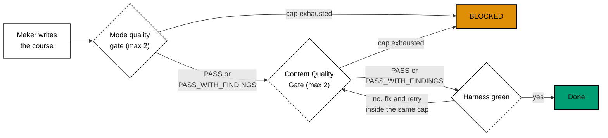

# 006 — Execution Model: Waves and Ledger

## Per-course pipeline (series decision 29)



Every cap in this plan is **2 cycles** (the user's instruction, 2026-10-09: "semua jadi 2 aja"). This
plan's own text has been grepped for "3 cycles", "three cycles", "max-cycles 3", and "cycle 3" and
contains none.

## Waves

48 courses, 16 waves of 3, N=3 background agents in parallel per wave (series decision 29's repo-default
N+1 model, applied the same way plans 06 to 09 did). The exact wave assignment, grouped so related
subjects are authored and reviewed together, is in
[syllabus/courses/README.md](../syllabus/courses/README.md). The one cross-course dependency
(`clojure-essentials` before its two Clojure-stack dependents) is scheduled so the prerequisite lands in
an earlier wave than either dependent; see that file's Dependency note.

Each wave:

1. Three background agents each take one course from the wave's list.
2. Each course runs the full per-course pipeline above, independently.
3. The wave does not close until every course in it is either Done or BLOCKED and reported.
4. A checkpoint commit (one commit per course, not one commit per wave) is pushed after the wave closes,
   so the branch's history stays reviewable course by course even across 48 courses.

## BLOCKED handling

A course that exhausts its cap at either gate is marked BLOCKED, not shipped with a known defect:

1. Partial work is saved to `local-tmp/ayokoding-learn/blocked/<slug>/` (a local, uncommitted scratch
   location; this plan never links to it from a committed document, per the repository's `local-tmp`
   rule).
2. The course's skeleton (frontmatter, `_index.md`, empty `learning/`/`drilling/` folders) is restored so
   the branch does not carry a half-written course.
3. A row is written to `local-tmp/ayokoding-learn/execution-ledger.md` under the heading
   `## Plan 10 — legacy-unique migration`, naming the course, the gate it blocked at, the cycle count, and
   the specific finding that blocked it.
4. The user is told directly (not only recorded in the ledger).
5. The wave's gate stays open (the wave is not reported closed) until the user decides whether to retry,
   descope, or accept the course as BLOCKED for this PR.

## Wave gate (every wave)

**Commands:**

```bash
rtk ./hippo run --class ephemeral --resource-tier standard --disk-path . -- npm exec nx -- run ayokoding-www:examples:check --courses=<the wave's 3 slugs>
rtk ./hippo run --class ephemeral --resource-tier standard --disk-path . -- npm exec nx -- run ayokoding-www:test:quick
```

**Expected observation:** both commands exit 0 for every course in the wave that is not BLOCKED; the
ledger has a row for every course in the wave (Done courses get a Done row too, not only BLOCKED ones, so
the ledger is a complete per-course audit trail); the wave's 3 commits are pushed.

## Parallelism and resource budget

At most 3 background agents run at once, matching the per-course pipeline's own independence (no course
in a wave depends on another course in the same wave). All compute runs through
`rtk ./hippo run --class <class> --resource-tier <tier> --disk-path . -- <command>`; HIPPO's own admission
control serializes overlapping resource budgets, so running 3 agents at once does not require this plan to
invent its own additional throttling.
