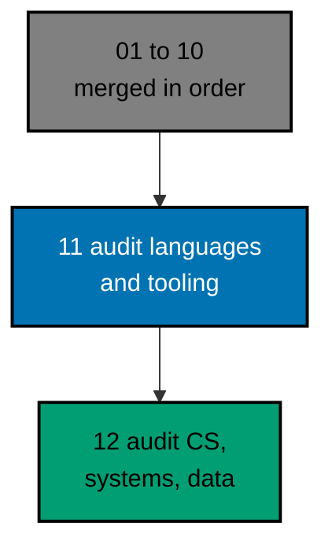

# AyoKoding Learn Revamp 11 — Audit of Language and Tooling Courses

> **Status:** Backlog. Do not execute until both are true: the user gives an explicit execution
> command, and plans 01 to 10 of this series have merged to `origin/main`. The 14 plans run strictly
> one after another (series decision 42), so plan 10 is merged, deployed, verified, and cleaned up
> before this plan starts.
>
> **Plan quality gate:** not run yet, so no verdict exists. By the user's decision of 2026-10-09 it
> was not run while the plan was written; it runs at the start of execution, as the first item of
> Phase 0 in [delivery.md](./delivery.md#phase-0-worktree-environment-preconditions-and-baseline),
> with `max-cycles` 2.

AyoKoding has 32 courses on programming languages, engineering tools, and infrastructure that are real
courses, already on learning paths, but that do not meet the series definition of done. On 2026-10-09 they
held 705,141 words and 3,071 code files. 21 of them were short of their word floor by 305,207 words
in all. None had a `run.yaml`, so nothing proved that any example runs. 1,368 code fences and
792 output blocks were not tied to a file, and 494 anchors disagreed with the files
they point at. This plan audits all 32 and fixes them in place, so that every course is complete, checked by
its mode's quality gate and the Content Quality Gate, and green in plan 05's code harness.

## Scope

- **Audit and fix 32 existing courses** to the series definition of done (decisions 26 to 29): 10 in
  tools and practices, 14 programming-language primers, and 8 in infrastructure and operations. Each keeps its
  slug, mode, and place in every path; each meets its mode's floors for words, examples, diagrams, "Why It
  Matters", annotation, and a five-section drilling page of at least 5,000 words. See
  [tech-docs/002](./tech-docs/002-definition-of-done-and-targets.md).
- **Bring every example green in the harness.** 2,571 units (826 to create, 1,745 to convert)
  get a deterministic `run.yaml` and recorded output; lessons are tied to their files. Tools the sandbox cannot
  host are modelled or checked statically, and the lesson says so. 18 small spikes prove the hard cases first.
  See [tech-docs/003](./tech-docs/003-harness-conversion-design.md).
- **Fit the CI budget.** The plan's own load is the largest in the series. It measures the cost, carries a
  response ladder (more shards, a longer timeout), and adds no toolchain unless a budget rule passes. See
  [tech-docs/004](./tech-docs/004-toolchain-additions-and-ci-cost.md).
- **Keep prerequisites and the AI path correct.** Plan 02's lists are re-checked per course; three courses sit
  in the AI Engineer core, and a change that would alter that core is raised to the user, not made. See
  [tech-docs/005](./tech-docs/005-prerequisites-ai-core-and-integrity.md).
- **Guard the end state** (decision 40): a new content-shape test with a registry of audited courses keeps the
  mechanical floors, five courses leave plan 09's filler baseline, and `ayokoding-www:examples:check` keeps the
  code green. Harness coverage is recorded: 31 of 31 applicable courses covered.

## Non-Goals

- New courses and new topics (plans 06 to 10), and the other pre-existing courses (plans 12 and 13).
- The four courses of the three categories that other plans own: `build-your-own-git`, `just-enough-fsharp`,
  `lisp` (plan 09), and `capstone-concurrency-and-systems` (plan 08).
- Any path manifest, phase, or membership change, except the AI manifest on the exception in
  [tech-docs/005](./tech-docs/005-prerequisites-ai-core-and-integrity.md#the-ai-engineer-path-core).
- Any toolchain addition by default, any change to plan 05's contract, and any weakening of a harness check.
- Indonesian content: `content/id/**` stays untouched (decision 35).

## Dependency and Result

The series runs strictly in order, one plan, one worktree, and one PR at a time (series decision 42), so
plans 01 to 10 are all merged when this plan starts. This plan builds directly on plan 03 (course metadata) and
plan 05 (the code harness), and it respects plan 02's prerequisites and path integrity, plan 08's AI path and CI
ladder, and plan 09's filler guard.

## Series Context

This plan is row 11 of the 14-plan **AyoKoding Learn Revamp** series. Each plan is one PR delivered from its
own worktree, and the plans run strictly in numeric order; the "Depends on" column shows which earlier plans
each one builds on. The user resolved the series decisions on 2026-10-09; every decision this plan relies on is
copied into [brd.md](./brd.md#resolved-series-decisions-this-plan-relies-on).

| NN  | Plan suffix                               | Scope                                                                                        | Depends on       |
| --- | ----------------------------------------- | -------------------------------------------------------------------------------------------- | ---------------- |
| 01  | `navigation-and-display`                  | Strip `NN ·` title prefixes; path position numbers; sidebar auto-scroll; render fixes        | —                |
| 02  | `path-model`                              | Phases, goals, `assumes`, outline marker, prerequisite revision, closure checks, career copy | 01               |
| 03  | `catalog-and-metadata`                    | Course metadata schema and backfill, categories, catalog page, course landing header         | 01               |
| 04  | `learning-experience`                     | Browser progress, phase roadmap page, context bar, mark complete, Learn home                 | 02, 03           |
| 05  | `code-harness`                            | `ayokoding-cli`, `run.yaml` contract, runners, Nx target, CI, quality-gate propagation       | —                |
| 06  | `accounting-courses`                      | Write 24 accounting courses; restructure both accounting paths in the same PR                | 02, 03, 05       |
| 07  | `erp-courses`                             | Write 30 ERP courses; restructure both ERP paths in the same PR                              | 06               |
| 08  | `capstone-courses`                        | Rewrite 8 skeleton capstones                                                                 | 02, 03, 05       |
| 09  | `filler-rewrites`                         | Rewrite 8 templated filler courses                                                           | 03, 05           |
| 10  | `legacy-unique-migration`                 | Build courses for legacy topics without an equivalent; record the legacy-to-course map       | 03, 05           |
| 11  | `audit-languages-and-tooling` (this plan) | Audit and fix language and tooling courses                                                   | 03, 05           |
| 12  | `audit-cs-systems-and-data`               | Audit and fix CS, systems, concurrency, distributed, database, and data courses              | 05               |
| 13  | `audit-product-security-ai`               | Audit and fix web, backend, mobile, security, AI, testing, architecture, product courses     | 05               |
| 14  | `legacy-removal`                          | Delete `learn/legacy`, add 308 redirects, repoint `docs/` links, update specs and tests      | 10 (+11–13 done) |

## How the Work Runs

The 32 courses are audited in 11 waves in prerequisite order, by at most three background agents at a time.
Each course goes audit, fix, mode quality gate, Content Quality Gate, and harness green, and every loop stops
after 2 cycles (the user's cap, 2026-10-09: "semua jadi 2 aja"). A course that still fails is marked BLOCKED,
restored to its baseline, reported, and the wave moves on; the user decides whether to retry, defer, or stop.
Each finished course is one commit, and the branch is pushed four times, with a draft PR from the first push,
so CI problems surface early. See [tech-docs/006](./tech-docs/006-execution-model.md).

## Navigation

- [Business requirements](./brd.md)
- [Product requirements, Gherkin, and UI design funnel](./prd.md)
- [Technical design](./tech-docs/README.md)
- [Syllabus corpus (32 course briefs and a path note)](./syllabus/README.md)
- [Delivery checklist](./delivery.md)
- [Execution learnings](./learnings.md)
