# Delivery Plan — AyoKoding Learn Revamp 11: Audit of Language and Tooling Courses

> **Legend** — `[AI]`: an agent performs the step (the default; unmarked steps are `[AI]`).
> `[HUMAN]`: only a human can do it (physical action, out-of-band approval, real-secret or
> privileged-credential handling). `[AI+HUMAN]`: agent prepares, human approves or finishes.

**Do not start** until both are true: (1) the user gives an explicit execution command for this
plan — that command authorizes this plan's change set (commits, pushes, PR, merge, and the deploy
described below); (2) plans 01 to 10 of this series have merged to `origin/main`, deployed, been
verified, and had their worktrees cleaned up. The series runs strictly one plan at a time (series
decision 42), so no other series plan runs while this one does, and no rebase between plans is
needed. The user's words (2026-10-09): "jangan kerjain/implement plan ini sebelum gw
kasih perintah buat eksekusi ya" (do not implement this plan until I give the command to execute it).

**Plan quality gate:** not run yet, so no verdict exists. By the user's decision of 2026-10-09 it was
not run while the plan was written. It runs at the start of execution, as the first item of
[Phase 0](#phase-0-worktree-environment-preconditions-and-baseline), with `max-cycles` 2; its verdict
line is recorded here only then.

## Worktree

- **Execution worktree:** `worktrees/ayokoding-learn-revamp-11-audit-languages-and-tooling/`
- **Provisioning command** (from the repository root, at Step 0):
  `claude --worktree ayokoding-learn-revamp-11-audit-languages-and-tooling`, or the equivalent
  `rtk git worktree add -b ayokoding-learn-revamp-11-audit-languages-and-tooling-base worktrees/ayokoding-learn-revamp-11-audit-languages-and-tooling origin/main`.
- **Provisioning status:** pending
- **Authoring-worktree exception:** this plan was authored inside the separate authoring worktree
  `.claude/worktrees/ayokoding-update` (branch `worktree-ayokoding-update`). The user required that
  session to write all plans of the AyoKoding Learn Revamp series together and not to execute any of
  them before the user's command. That authoring worktree is **never** used for execution. The
  Provisioned Worktree Identity and the Delivery Branch Inventory are intentionally omitted until
  Step 0 creates them.
- **Step 0 obligation (blocking):** Phase 0's first outcome after the plan quality gate provisions
  the execution worktree from
  fresh `origin/main` per the
  [Worktree Path Convention](../../../repo-governance/conventions/structure/worktree-path.md),
  initializes it per
  [Worktree Toolchain Initialization](../../../repo-governance/development/workflow/worktree-setup.md),
  writes the immutable identity and the first inventory row into this section, replaces
  `Provisioning status: pending` with `Provisioning status: provisioned`, and syncs with
  `origin/main`. No implementation step may start while the status is pending.
- **Cleanup:** after the PR merges, the worktree, its branches, and this plan's scratch come down
  through [Dev Artifact Clean-Up](../../../repo-governance/workflows/maintenance/dev-artifact-clean-up.md)
  (Phase 11).
- **Worktree cap:** one worktree for this plan in this repository, reused by every phase.

The plan never records an absolute or machine-specific path. Resolve the declared route at runtime
and reconcile it with `rtk git worktree list --porcelain`.

## Delivery Mode: worktree-to-pr

`worktree-to-pr` is mandatory in this repository. One branch and **one PR** deliver the whole plan
(the series rule "one plan = one PR"). The PR is opened as a **draft** at the first checkpoint push (Phase 2),
and marked ready in Phase 11. It needs the exact current-head/base `Quality gate` from
`.github/workflows/pr-quality-gate.yml` and an exact-head posted `pr-leak-review` `pass` (`leak-review`
status). Broad semantic PR review is not run unless the user asks for it. `[AI]` merges once the hardened
merge preconditions hold.

## Parallelization Model

The 32 courses are audited in 11 waves of at most three courses
([tech-docs/006](./tech-docs/006-execution-model.md)). Inside a wave, up to three background agents each own one
course; a wave starts only when every course of the waves it needs is DONE or BLOCKED. Every shared file
(registry, filler baseline, indexes, the harness and workflow, the ledger, every commit) is touched by the
coordinator alone.

```mermaid
%% Color Palette: Blue #0173B2, Orange #DE8F05, Teal #029E73, Purple #CC78BC
flowchart TD
  accTitle: Plan 11 execution order
  accDescr: Phase 0 sets up and records a baseline. Phase 1 scaffolds the completion test, runs the harness spikes, and measures the CI cost. Phases 2 to 5 audit the courses in eleven waves of up to three agents, with a checkpoint push after waves 3, 6, 9, and 11. A human stop resolves blocked courses. Then rules and docs, the end-state gate, manual verification, knowledge capture, and the delivery boundary run in order.
  P0["0 setup and baseline"] --> P1["1 completion test,<br/>spikes, CI<br/>measurement"]
  P1 --> P2["2 waves 1-3<br/>push 1 (draft PR)"]
  P2 --> P3["3 waves 4-6<br/>push 2"]
  P3 --> P4["4 waves 7-9<br/>push 3"]
  P4 --> P5["5 waves 10-11<br/>push 4"]
  P5 --> P6["6 human stop:<br/>BLOCKED and<br/>decisions"]
  P6 --> P7["7 registry complete,<br/>rules, docs, C4"]
  P7 --> P8["8 end-state gate"]
  P8 --> P9["9 manual<br/>verification"]
  P9 --> P10["10 knowledge capture"]
  P10 --> P11["11 boundary:<br/>archive, PR,<br/>merge, cleanup"]

  classDef serial fill:#0173B2,stroke:#000000,color:#FFFFFF,stroke-width:2px
  classDef parallel fill:#CC78BC,stroke:#000000,color:#000000,stroke-width:2px
  classDef human fill:#DE8F05,stroke:#000000,color:#000000,stroke-width:2px
  classDef gate fill:#029E73,stroke:#000000,color:#000000,stroke-width:2px
  classDef default fill:#FFFFFF,stroke:#000000,color:#000000
  class P0,P1,P7 serial
  class P2,P3,P4,P5 parallel
  class P6 human
  class P8,P9,P10,P11 gate
```

### Delivery Boundaries

| Phase(s) | Natural cohesive seam                                                          | Worktree                                                           | Branch                                                  | Delivery opportunity                                            | Exact resulting `main` / rollback / feature-flag evidence                                                                                                                                                                                                                                                                                                                 |
| -------- | ------------------------------------------------------------------------------ | ------------------------------------------------------------------ | ------------------------------------------------------- | --------------------------------------------------------------- | ------------------------------------------------------------------------------------------------------------------------------------------------------------------------------------------------------------------------------------------------------------------------------------------------------------------------------------------------------------------------- |
| 0        | — (setup and baseline)                                                         | —                                                                  | —                                                       | none                                                            | No resulting state change; no PR; flag not applicable                                                                                                                                                                                                                                                                                                                     |
| 1–11     | Audited courses with their harness units, guard, and rules (one delivery unit) | `worktrees/ayokoding-learn-revamp-11-audit-languages-and-tooling/` | `ayokoding-learn-revamp-11-audit-languages-and-tooling` | Draft PR opened at Phase 2 push 1; ready and merged in Phase 11 | `main` gets the audited courses (up to 32), their units, the completion test and registry, the five filler-baseline removals, rules TC1 and TC2, and any CI ladder change together. Rollback: revert the merge commit in a revert PR; every course returns to its pre-audit state. Feature-flag lifecycle: not applicable, because no flag is created; nothing to remove. |

### Agent Topology

- **Main thread (coordinator):** owns the execution ledger, every gate record, every commit, index generation,
  and every shared file. It keeps itself free and fills background slots first.
- **At most 3 background agents at any time** (N = 3):
  - Phases 2–5: per course, a mode checker for CP-1, the maker named in each course block
    (`apps-ayokoding-www-by-example-maker`, `-primer-maker`, or `-annotated-concept-maker`) for authoring
    gaps, `swe-developer` for units, `run.yaml`, expected files, and determinism, and the mode's fixer for gate
    findings. The gates run the checker and fixer agents their workflows name. Each agent writes only inside
    `apps/ayokoding-www/content/en/learn/courses/<slug>/`.
  - Phase 1: `swe-developer` for the completion test, the spikes, and any ladder change (Go and workflow);
    `specs-maker` for the Gherkin.
  - Phase 7: `rules-maker`, then `docs-fixer` and `readme-fixer`.
- Record every agent ID, its file set, its step, and its cycle count in the execution ledger.

### Execution Packet Defaults

- **Plan path after promotion:** `plans/in-progress/ayokoding-learn-revamp-11-audit-languages-and-tooling/`
  (written below as `<plan>/`). Evidence goes to `<plan>/evidence/`.
- **Execution ledger:** `local-tmp/ayokoding-learn/execution-ledger.md` in the execution worktree,
  under the heading `## Plan 11 — audit languages and tooling`, with the fields in
  [tech-docs/006](./tech-docs/006-execution-model.md#the-execution-ledger). Other scratch (raw output, spike
  units, the saved partial work of BLOCKED courses) lives in `local-tmp/ayokoding-learn/plan-11/` and
  `local-tmp/ayokoding-learn/blocked/` (gitignored).
- **No ad-hoc scripts (series decision 37).** Checks run through the app's tests and `ayokoding-cli`.
  Read-only inspection with `rtk git grep`, `rtk git diff`, `rtk git ls-tree`, and `rtk wc -w` is fine.
- **Evidence hygiene:** evidence files contain repository-relative paths only. Never paste an
  absolute home-directory path, a hostname, a token, or `.env*` content.
- **Never commit** `apps/ayokoding-www/next-env.d.ts` (the dev server rewrites it) or
  `.serena/project.yml`. Before every commit run `rtk git status --short` and restore either file with
  `rtk git checkout -- <file>` if it shows as modified.
- **Indonesian content stays untouched (decision 35).** `GEN-INDEXES` and `DEV` regenerate indexes for
  both locales. After each run, `rtk git status --short -- apps/ayokoding-www/content/id` must be
  empty; if not, run `rtk git checkout -- apps/ayokoding-www/content/id`.
- **Never touch** `.env.prod` or `.env.stag`. If the dev server needs a variable, copy the key from
  `apps/ayokoding-www/.env.example` into an uncommitted `apps/ayokoding-www/.env.local`.
- **No git identity changes.** Never run `git config user.*`. Never use a bare `git stash`.
- **Bounded loops (user, 2026-10-09: "semua jadi 2 aja"):** every quality gate runs with
  `max-cycles: 2`, and every maker→checker loop runs at most 2 cycles. A course still failing after
  its second cycle is **BLOCKED**: restore it, record it in the ledger, report it to the user, and move on. Any
  other file still failing after its second cycle is recorded as BLOCKED and the phase gate stays open
  until the user decides.
- **Failure handling:** on any unexpected failure, save the output to the phase evidence file, fix the
  root cause (never skip, retry-until-green, loosen, widen, quarantine, or delete a test), rerun the same
  command, and note the fix. A harness defect is fixed in `apps/ayokoding-cli` with a regression test
  (plan 05's M11), never by weakening a course check.
- **Planning figures are not estimates.** Every CI minute in this plan is a planning figure with invented
  per-invocation seconds. Phase 1 replaces them with measurements, and every ladder decision is taken on the
  measured numbers.

> **Important**: Fix ALL failures found during quality gates, not just those caused by your
> changes. This follows the root cause orientation principle — proactively fix preexisting
> errors encountered during work.

### Command Reference

Run every command from the execution worktree root. Expected results are stated at each use.

| Name                               | Command                                                                                                                                                                                                                                                                                                                                                                                                                                           |
| ---------------------------------- | ------------------------------------------------------------------------------------------------------------------------------------------------------------------------------------------------------------------------------------------------------------------------------------------------------------------------------------------------------------------------------------------------------------------------------------------------- |
| `UNIT-FE <file>`                   | `rtk ./hippo run --class ephemeral --resource-tier standard --disk-path . --cwd apps/ayokoding-www -- npx vitest run --project unit-fe <file>`                                                                                                                                                                                                                                                                                                    |
| `UNIT-NODE <files>`                | `rtk ./hippo run --class ephemeral --resource-tier standard --disk-path . --cwd apps/ayokoding-www -- npx vitest run --project unit <files>`                                                                                                                                                                                                                                                                                                      |
| `COMPLETION`                       | `UNIT-NODE tests/unit/be-steps/audited-course-completion.steps.ts`                                                                                                                                                                                                                                                                                                                                                                                |
| `COMPLETION-PROBE <slug> <format>` | `rtk ./hippo run --class ephemeral --resource-tier standard --disk-path . --cwd apps/ayokoding-www -- env AUDIT_PROBE=<slug>:<format> npx vitest run --project unit tests/unit/be-steps/audited-course-completion.steps.ts` (adds one probe row for this run only)                                                                                                                                                                                |
| `FILLER`                           | `UNIT-NODE tests/unit/be-steps/course-filler.steps.ts` (plan 09's guard; the verbose reporter prints the metrics table for every course)                                                                                                                                                                                                                                                                                                          |
| `PATH-TESTS`                       | `UNIT-NODE tests/unit/features/course-paths/manifests/path-model-integrity.unit.test.ts tests/unit/features/course-paths/manifests/manifest-membership.unit.test.ts tests/unit/features/course-paths/manifests/careers/careers-ai-manifest.unit.test.ts tests/unit/features/course-paths/manifests/careers/career-goals.unit.test.ts tests/unit/features/content/course-frontmatter.unit.test.ts` (use the merged file names recorded in Phase 0) |
| `QUICK`                            | `rtk ./hippo run --class ephemeral --resource-tier standard --disk-path . -- npm exec nx -- run ayokoding-www:test:quick`                                                                                                                                                                                                                                                                                                                         |
| `INTEGRATION`                      | `rtk ./hippo run --class ephemeral --resource-tier heavy --disk-path . -- npm exec nx -- run ayokoding-www:test:integration`                                                                                                                                                                                                                                                                                                                      |
| `BEHAVIOUR`                        | `rtk ./hippo run --class ephemeral --resource-tier standard --disk-path . -- npm exec nx -- run ayokoding-www:test:coverage:behaviour`                                                                                                                                                                                                                                                                                                            |
| `E2E-BEHAVIOUR`                    | `rtk ./hippo run --class ephemeral --resource-tier standard --disk-path . -- npm exec nx -- run ayokoding-www-fe-e2e:test:coverage:behaviour`                                                                                                                                                                                                                                                                                                     |
| `BE-E2E-BEHAVIOUR`                 | `rtk ./hippo run --class ephemeral --resource-tier standard --disk-path . -- npm exec nx -- run ayokoding-www-be-e2e:test:coverage:behaviour`                                                                                                                                                                                                                                                                                                     |
| `E2E-QUICK`                        | `rtk ./hippo run --class ephemeral --resource-tier standard --disk-path . -- npm exec nx -- run ayokoding-www-fe-e2e:test:quick`                                                                                                                                                                                                                                                                                                                  |
| `E2E`                              | `rtk ./hippo run --class ephemeral --resource-tier heavy --disk-path . -- npm exec nx -- run ayokoding-www-fe-e2e:test:e2e`                                                                                                                                                                                                                                                                                                                       |
| `BUILD`                            | `rtk ./hippo run --class ephemeral --resource-tier heavy --disk-path . -- npm exec nx -- run ayokoding-www:build`                                                                                                                                                                                                                                                                                                                                 |
| `GEN-INDEXES`                      | `rtk ./hippo run --class transactional --resource-tier standard --disk-path . -- npm exec nx -- run ayokoding-www:generate-indexes`                                                                                                                                                                                                                                                                                                               |
| `VALIDATE-INDEXES`                 | `rtk ./hippo run --class ephemeral --resource-tier standard --disk-path . -- npm exec nx -- run ayokoding-www:validate-indexes`                                                                                                                                                                                                                                                                                                                   |
| `DEV`                              | `rtk ./hippo run --class service --resource-tier standard --disk-path . -- npm exec nx -- dev ayokoding-www` (serves `http://localhost:3101`)                                                                                                                                                                                                                                                                                                     |
| `LINT-MD`                          | `rtk npm run lint:md`                                                                                                                                                                                                                                                                                                                                                                                                                             |
| `CLI-BUILD`                        | `rtk ./hippo run --class ephemeral --resource-tier standard --disk-path . -- npm exec nx -- run ayokoding-cli:build`                                                                                                                                                                                                                                                                                                                              |
| `CLI-QUICK`                        | `rtk ./hippo run --class ephemeral --resource-tier standard --disk-path . -- npm exec nx -- run ayokoding-cli:test:quick`                                                                                                                                                                                                                                                                                                                         |
| `CLI-E2E`                          | `rtk ./hippo run --class ephemeral --resource-tier heavy --disk-path . -- npm exec nx -- run ayokoding-cli:test:e2e`                                                                                                                                                                                                                                                                                                                              |
| `CLI <args>`                       | `rtk ./hippo run --class ephemeral --resource-tier heavy --disk-path . -- apps/ayokoding-cli/dist/ayokoding-cli <args>`                                                                                                                                                                                                                                                                                                                           |
| `FIXTURE <args>`                   | `CLI --content apps/ayokoding-cli/tests/testdata/courses <args>`                                                                                                                                                                                                                                                                                                                                                                                  |
| `SMOKE`                            | `CLI --content apps/ayokoding-cli/tests/testdata/toolchain-smoke examples check --all`                                                                                                                                                                                                                                                                                                                                                            |
| `TC-LIST`                          | `CLI toolchains list`                                                                                                                                                                                                                                                                                                                                                                                                                             |
| `TC-BUILD <id>`                    | `CLI toolchains build <id>`                                                                                                                                                                                                                                                                                                                                                                                                                       |
| `EX-VALIDATE <slug>`               | `CLI examples validate --course <slug>`                                                                                                                                                                                                                                                                                                                                                                                                           |
| `EX-SYNC <slug>`                   | `CLI examples sync --course <slug>`                                                                                                                                                                                                                                                                                                                                                                                                               |
| `EX-SYNC-WRITE <slug>`             | `CLI examples sync --course <slug> --write` (repairs anchored fences from their files)                                                                                                                                                                                                                                                                                                                                                            |
| `EX-RECORD <slug>`                 | `CLI examples run --course <slug> --record` (writes only missing expected files)                                                                                                                                                                                                                                                                                                                                                                  |
| `EX-CHECK <slug>`                  | `CLI examples check --course <slug>`                                                                                                                                                                                                                                                                                                                                                                                                              |
| `EX-COVERAGE`                      | `CLI --output json examples coverage`                                                                                                                                                                                                                                                                                                                                                                                                             |
| `EXAMPLES`                         | `rtk ./hippo run --class ephemeral --resource-tier heavy --disk-path . -- npm exec nx -- run ayokoding-www:examples:check` (add `--configuration=full` for a full run)                                                                                                                                                                                                                                                                            |
| `RUFF <files>`                     | `rtk ./hippo run --class ephemeral --resource-tier standard --disk-path . -- ruff format --no-cache <files>`                                                                                                                                                                                                                                                                                                                                      |
| `FORMAT <lang> <files>`            | The repository formatter for the language, as the commit hook runs it (`gofmt`, `rustfmt`, `csharpier`, `shfmt`, `stylua`, `clang-format`, `tofu fmt`, Prettier), through `rtk ./hippo run --class ephemeral --resource-tier standard --disk-path . -- <formatter> <files>`; Phase 0 records the exact invocation for each language                                                                                                               |
| `UV-LOCK <slug>`                   | `rtk ./hippo run --class transactional --resource-tier standard --disk-path . -- uv pip compile --generate-hashes apps/ayokoding-www/content/en/learn/courses/<slug>/learning/code/requirements.in -o apps/ayokoding-www/content/en/learn/courses/<slug>/learning/code/requirements.lock`                                                                                                                                                         |
| `ADAPTERS-GEN`                     | `rtk ./hippo run --class transactional --resource-tier standard --disk-path . -- ./rhino harness adapters generate`                                                                                                                                                                                                                                                                                                                               |
| `ADAPTERS-VALIDATE`                | `rtk ./hippo run --class ephemeral --resource-tier standard --disk-path . -- ./rhino harness adapters validate`                                                                                                                                                                                                                                                                                                                                   |

`UNIT-FE` runs files under `tests/unit/fe-steps/` and `tests/unit/features/**/*.test.{ts,tsx}`;
`UNIT-NODE` runs `*.unit.test.ts` files and `tests/unit/be-steps/`. Paths after these commands are
relative to `apps/ayokoding-www/`. `CLI` uses the default content root
`apps/ayokoding-www/content/en/learn/courses`; build it with `CLI-BUILD` after any CLI or catalog
change (the catalog is embedded). Every `EX-*` command accepts more than one `--course`. Lockfile commands for
Go (`go.sum`), Rust (`Cargo.lock`), and any other locked language are recorded in the Phase 1 spike evidence
and used by the packets. If Phase 0 records different merged names for any target or command, use the merged
names everywhere below.

### Commit Guidelines

- [ ] [AI] Do not stage or commit until the user's execution command has authorized this plan's
      change set; do not extend a commit beyond it.
- [ ] [AI] Use the fewest build-valid, independently reviewable and revertible commits, one coherent
      purpose each: one for the completion test scaffold, **one per DONE course**
      (`fix(ayokoding-www): audit <slug> course`), one each for a harness or workflow ladder change, the
      complete registry, and the rules and docs, then evidence and the archival move.
- [ ] [AI] Follow Conventional Commits: `<type>(<scope>): <description>`, imperative, no period.
- [ ] [AI] Keep each change with its tests, specs, regenerated indexes, docs, and generated harness
      routes in the same commit; stage explicit paths only, never `git add -A`.

### Files Changed

The full root-relative tree with `[E]`/`[N]`/`[D]`/`[G]`/`[C]` markers is in
[tech-docs/009](./tech-docs/009-file-impact.md). In short: the 32 course folders (lessons, drilling, code units,
`run.yaml`, and expected files, with each `_index.md` changed in frontmatter only); the filler baseline
(five entries removed, the cap lowered by five); the completion test, its registry, and its feature file; the
two skill modules and the gate adapter pointers for rules TC1 and TC2 with their generated routes; the
behaviours README; conditionally the CLI shard rule, the workflow timeout, and the AI manifest; and `<plan>/`
with its evidence.

### Recovery

- **Interrupted session.** The ledger is the source of truth for the waves. Reconcile it with
  `rtk git status --short` and `rtk git log --oneline origin/main..HEAD`: a course with a commit is
  DONE; a course folder with uncommitted changes and no BLOCKED row is in progress. Resume that
  course at the step and cycle the ledger shows; never reset a cycle count, and never start a new
  attempt that would exceed 2.
- **A packet agent stopped mid-course.** Its files stay in the course folder. The next attempt (if
  the course has one left) continues from those files
  ([tech-docs/006](./tech-docs/006-execution-model.md#resuming)). A course folder with an unfinished set of
  units is never committed.
- **A wrong commit.** Revert it with a new commit (`rtk git revert <sha>`); never rewrite pushed
  history.
- **After merge.** Revert the merge commit in a revert PR; every course returns to its pre-audit state.

### Before Phase 0: Promotion

The plan is still in `plans/backlog/` at this point, so the plan quality gate (the first item of
Phase 0) runs first, here; promote only after its verdict is `PASS` or `PASS_WITH_FINDINGS`.

- [ ] [AI] Promote the plan per
      [Starting and Completing Work](../../../repo-governance/conventions/structure/plans/starting-and-completing-work.md):
      a pure move of `plans/backlog/ayokoding-learn-revamp-11-audit-languages-and-tooling/` to
      `plans/in-progress/ayokoding-learn-revamp-11-audit-languages-and-tooling/` plus the `plans/backlog/README.md`
      and `plans/in-progress/README.md` index updates, landed on `origin/main` through its own PR.
      Acceptance: `rtk git ls-tree -r --name-only origin/main plans/in-progress/ayokoding-learn-revamp-11-audit-languages-and-tooling/`
      lists this plan's files. This promotion PR is separate from the delivery unit.

---

## Phase 0: Worktree, Environment, Preconditions, and Baseline

Phase 0 opens no PR. Its evidence rides the delivery PR.

- **Input:** the promotion on `origin/main`; this plan at `<plan>/`;
  [tech-docs/README.md](./tech-docs/README.md#cross-plan-assumptions).
- **Outcome:** a provisioned, initialized worktree; confirmed preconditions and merged names; a recorded
  baseline for all 32 courses; a verified `java` and `kotlin` image; a recorded CI shape; an initialized ledger.
- **Proof:** `<plan>/evidence/phase-0-baseline.md`.

- [ ] [AI] **Plan quality gate (deferred from authoring):** run the `plan-quality-gate` workflow on this
      plan with `max-cycles` 2 before any other step below. It was deliberately not run when this plan was
      written, to keep token use even (user decision, 2026-10-09). Acceptance: verdict `PASS` or
      `PASS_WITH_FINDINGS`; record the line `plan-quality-gate: <verdict> (<n> cycles, <k> open)` in this
      file's header section. If the plan is still in `plans/backlog/`, run the gate before the promotion PR.
      A `BLOCKED` verdict stops execution and is reported to the user.
- [ ] [AI] **Step 0 (blocking first outcome):** from the repository root, provision the execution
      worktree with the command in [## Worktree](#worktree). Record the Provisioned Worktree Identity
      (declared route `worktrees/ayokoding-learn-revamp-11-audit-languages-and-tooling/`, initial branch
      `ayokoding-learn-revamp-11-audit-languages-and-tooling-base`, creator, UTC creation time) and the first
      Delivery Branch Inventory row (`provisioned`, `active`, proof `git worktree add` at the
      timestamp) in [## Worktree](#worktree). Set `Provisioning status: provisioned`. Acceptance:
      `rtk git worktree list --porcelain` lists the worktree on the base branch.
- [ ] [AI] From the worktree root, run
      `rtk ./hippo run --class transactional --resource-tier standard --disk-path . -- npm install`.
      Acceptance: exit 0 and Husky hooks installed (`.husky/_` exists).
- [ ] [AI] Run `rtk npm run doctor`. Acceptance: exit 0. Only if it reports a missing or drifted
      toolchain, run
      `rtk ./hippo run --class transactional --resource-tier standard --disk-path . -- ./rhino toolchain provision --apply`
      and then `rtk npm run doctor` again (exit 0).
- [ ] [AI] Sync and branch: `rtk git fetch origin`, `rtk git merge --ff-only origin/main`, then
      `rtk git switch -c ayokoding-learn-revamp-11-audit-languages-and-tooling`. Append the branch to the
      inventory (`worktree-to-pr`, `active`). Acceptance: `rtk git status` shows the new branch, clean.
- [ ] [AI] **Preconditions — plans 01 to 10 merged, plan 12 not started:** run
      `rtk git ls-tree -d --name-only origin/main plans/done/`. Acceptance: the output contains folders ending
      in `__ayokoding-learn-revamp-01-navigation-and-display` through
      `__ayokoding-learn-revamp-10-legacy-unique-migration` (all ten suffixes in the series list). Then run
      `rtk git ls-tree -d --name-only origin/main plans/in-progress/`. Acceptance: no folder for plans 12, 13,
      or 14. If any precondition fails, stop and report to the user.
- [ ] [AI] **Name reconciliation:** for each name below, run `rtk git grep -n "<name>" origin/main -- apps specs .agents repo-governance .github`
      and record the merged file and spelling in a name map in the baseline evidence:
      `checkPathModelIntegrity`, `path-model-integrity.unit.test.ts`, `manifest-membership.unit.test.ts`,
      `course-frontmatter.unit.test.ts`, `careers-ai-manifest.unit.test.ts`, `career-goals.unit.test.ts`,
      `course-metadata.steps.ts`, `Expected estimatedHours for every non-outline course`, the tRPC procedure that
      returns the catalog with `estimatedHours`, `outlineCourseIds`, `examples:check`, `examples-plan`,
      `FILLER_BASELINE`, `FILLER_BASELINE_CAP`, `REWRITTEN_FILLER_COURSES`, `course-filler.steps.ts`,
      `course-filler-guard.feature`, `course-quality-guards.md`, `code-example-harness.md`, and
      `accounting-course-completion.feature` (the pattern this plan copies). Then run `CLI-BUILD` and `TC-LIST`.
      Acceptance: every name is found (or its merged replacement is recorded); the catalog lists the ids in
      [tech-docs/004](./tech-docs/004-toolchain-additions-and-ci-cost.md#what-the-catalog-gives). A missing name
      with no replacement stops the plan.
- [ ] [AI] **Plan 09's filler baseline:** open `apps/ayokoding-www/src/features/content/core/course-filler-baseline.ts`
      on `origin/main`. Acceptance: record the number of entries and the cap (expected 17 and 17 after plan 09),
      and that these five slugs are listed with owner `plan-11`: `just-enough-cpp`, `just-enough-go`,
      `just-enough-java`, `building-production-cli-tools`, `cicd-and-release-engineering`, each with the rules
      in [tech-docs/007](./tech-docs/007-testing-strategy.md#the-filler-baseline-ratchet). Record any
      difference (an owner re-tag, a different cap, a course that already left). Run `FILLER`.
      Acceptance: exit 0 on `origin/main`, and the printed metrics table shows no fired rule for the other 27
      courses of this plan. A fired rule on one of them is a regression in earlier work: report it to the user
      before it is baselined or fixed.
- [ ] [AI] **Plan 09's toolchain changes and probe P9:** read the merged `java`, `kotlin`, and `clojure`
      catalog entries and, in plan 09's archived folder under `plans/done/`, the evidence of its probe P9 (Spring
      Boot 4.1.1 offline). Run `TC-BUILD java`, `TC-BUILD kotlin`, and `SMOKE`. Acceptance: both images build
      and the smoke fixtures for `java` and `kotlin` pass; record whether the `java` entry has the jar install
      recipe, whether `kotlin` can use it, and what plan 09 recorded for P9. If an image fails to build or its
      smoke fixture fails, stop and report: `just-enough-java` and `just-enough-kotlin` cannot start, and no
      course is weakened to fit. A failed P9 alone does not stop this plan (none of the 32 uses Spring).
- [ ] [AI] **Plan 08's AI path and CI rule:** read `careers/immediately-effective/ai-engineer.json` and its
      test. Acceptance: record the goal, the 12-course core, the four `assumes`, and that `just-enough-python`
      (1), `software-testing` (3), and `software-engineering-practices` (4) are core. Read the merged
      `examples-plan` job and the reusable examples workflow. Acceptance: record the shard rule (courses or
      units), the shard counts, and the `since` and `all` timeouts, and say which rungs of the
      [response ladder](./tech-docs/004-toolchain-additions-and-ci-cost.md#the-response-ladder) are already in
      place.
- [ ] [AI] **Plan 02's prerequisites:** compare the merged `prerequisites` of each of the 32 courses with the
      table in [tech-docs/005](./tech-docs/005-prerequisites-ai-core-and-integrity.md#plan-02s-result-for-the-32-courses).
      Acceptance: a list of differences (possibly empty) in the baseline evidence; each difference is also
      written into [syllabus/paths/README.md](./syllabus/paths/README.md#differences-from-plan-02s-and-plan-08s-specifications),
      and 005 and the affected briefs are corrected in this branch.
- [ ] [AI] **Drift check — the 32 courses:** run
      `rtk git diff --stat bb7f90137 origin/main -- <the 32 course folders under apps/ayokoding-www/content/en/learn/courses>`
      (the slugs are in [syllabus/courses/README.md](./syllabus/courses/README.md)). For every listed file,
      open its diff and name the plan that made it. Acceptance: every change comes from plans 01 to 10 (for
      example title-prefix removal, `category`, `description`, `format`, `prerequisites`), and none adds teaching
      content; record the list. Otherwise stop and report the difference to the user, because the briefs'
      measured numbers would no longer hold.
- [ ] [AI] **Catalog and formatter facts:** from `TC-LIST` record the pin of every id this plan uses, and run
      each repository formatter on one file of its language to record the exact `FORMAT` invocation. Acceptance:
      every pin matches [tech-docs/004](./tech-docs/004-toolchain-additions-and-ci-cost.md#what-the-catalog-gives)
      or the difference is recorded and the affected briefs are corrected; every language of
      [tech-docs/003](./tech-docs/003-harness-conversion-design.md#authoring-workflow-for-one-unit) has a recorded
      invocation, or is recorded as having no repository formatter.
- [ ] [AI] **Vercel MCP re-probe:** check this session's available tools for a Vercel MCP server and
      record "present", "present but unauthenticated", or "absent". The plan uses no Vercel tool either
      way. Record no Vercel identifiers.
- [ ] [AI] **Harness baseline (plan 05's M1):** run `EX-VALIDATE` and `EX-SYNC` once each for every one of
      the 32 slugs (an explicit `--course` works before a course opts in). Acceptance: record the finding counts
      per course and compare the totals with [tech-docs/001](./tech-docs/001-current-state-and-partition.md#totals)
      (3,980 fences, 1,368 unanchored, 494 mismatched anchors); explain any difference
      that comes from a plan 01 to 10 change.
- [ ] [AI] **CI shape and FULL-run projection:** from the merged units of every course that has a `run.yaml`
      (plans 06 to 10 and earlier), compute the number of units and runs of a full run, and project the longest
      shard with the conservative per-course figure in
      [tech-docs/004](./tech-docs/004-toolchain-additions-and-ci-cost.md#the-ci-budget). Acceptance: the figures
      are in the baseline evidence, labelled as planning figures.
- [ ] [AI] Run `QUICK`, `BEHAVIOUR`, `E2E-BEHAVIOUR`, `BE-E2E-BEHAVIOUR`, `INTEGRATION`, `VALIDATE-INDEXES`,
      `EXAMPLES`, `E2E-QUICK`, and `E2E`. Acceptance: each exits 0; record the counts. If anything fails before
      any change, fix the root cause first.
- [ ] [AI] Run `BUILD` once. Acceptance: exit 0; record the duration and the generated page count as the
      build baseline (Phase 9 compares).
- [ ] [AI] Start `DEV` in the background. With Playwright MCP at 375×800 and 1280×800 open `/en/learn/courses`,
      the landing pages of `just-enough-go`, `version-control-and-git`, `containers-and-orchestration`, and
      `platform-engineering-and-devex`, a learning page and the drilling page of `just-enough-java`, and `/id`.
      Acceptance: screenshots `<plan>/evidence/phase-0-before-<page>-<locale>-<bp>px.png` exist; record what each
      shows. Run the catalog tRPC procedure recorded in the name map (the batch URL form of
      `apps/ayokoding-www-fe-e2e/tests/e2e/steps/backend-helpers.ts`). Acceptance: status 200; record the number
      of `outlineCourseIds` (the baseline B) and the `estimatedHours` of `just-enough-go`, `version-control-and-git`,
      and `containers-and-orchestration`. Stop `DEV`; then confirm
      `rtk git status --short -- apps/ayokoding-www/content/id` is empty (restore if not).
- [ ] [AI] Create the ledger section `## Plan 11 — audit languages and tooling` with one `PENDING` row per
      course, ordered by wave as in [tech-docs/006](./tech-docs/006-execution-model.md#waves-in-prerequisite-order),
      and an empty second section for CI figures.

### Phase 0 Gate

> All checks below must pass before starting Phase 1.

- [ ] [AI] The plan quality gate verdict line is recorded in this file's header, with verdict `PASS`
      or `PASS_WITH_FINDINGS` after at most 2 cycles.
- [ ] [AI] `Provisioning status: provisioned` with identity and inventory recorded.
- [ ] [AI] `<plan>/evidence/phase-0-baseline.md` records: the ten merged plans, plan 12 not started, the name
      map, the filler baseline result, the `java` and `kotlin` result and plan 09's P9 result, the AI path
      result, the prerequisite differences, the drift check, the catalog pins and formatter invocations, the
      Vercel probe, the M1 counts, the CI shape and projection, every baseline exit code, the build baseline,
      and B.
- [ ] [AI] `rtk git status --short` shows only `<plan>/` changes.

> **Pause Safety**: the worktree is provisioned and green, the baseline is recorded, and no product
> file has changed. Safe to stop. To resume:
> `rtk git -C worktrees/ayokoding-learn-revamp-11-audit-languages-and-tooling status --short`, then `QUICK`.

---

## Phase 1: Completion Test, Spikes, and CI Measurement

- **Input:** [tech-docs/003](./tech-docs/003-harness-conversion-design.md#phase-1-spikes),
  [tech-docs/004](./tech-docs/004-toolchain-additions-and-ci-cost.md),
  [tech-docs/007](./tech-docs/007-testing-strategy.md); the Phase 0 baseline.
- **Outcome:** the completion test exists and can fail (seven scenarios, an empty registry, a probe row); the 18
  spikes have a recorded result; the per-invocation seconds are measured; the ladder rungs and the toolchain
  decisions are taken on measured figures; any needed harness or workflow change is made test-first.
- **Proof:** `<plan>/evidence/phase-1-spikes.md` and `<plan>/evidence/harness-measurements.md`.
- _Suggested executors: `specs-maker` (Gherkin), `swe-developer` (tests, spikes, Go, workflow)._

### AC-1.1 — Gherkin first: the completion feature

- [ ] [AI] Create `specs/apps/ayokoding/www/behaviours/backend/content/audited-course-completion.feature` with
      the feature header and the first seven scenarios of
      [prd.md](./prd.md#new-backendcontentaudited-course-completionfeature), with their exemption comments and
      tags (the eighth scenario is added in Phase 7). List it in the folder's `README.md`. Run `BEHAVIOUR`.
      Acceptance: it fails and names exactly the new scenarios as missing unit bindings. Run `E2E-BEHAVIOUR` and
      `BE-E2E-BEHAVIOUR`. Acceptance: exit 0 (the exemptions hold).

### AC-1.2 — RED then GREEN: the step file and the registry

- [ ] [AI] Create `apps/ayokoding-www/tests/unit/be-steps/audited-courses.ts` exporting an empty
      `AUDITED_COURSES` (`{ slug, format }` rows), an empty `DEFERRED_BY_USER`, and the probe reader for
      `AUDIT_PROBE=<slug>:<format>`. Create `tests/unit/be-steps/audited-course-completion.steps.ts` binding the
      seven scenarios with the counting rules of
      [tech-docs/007](./tech-docs/007-testing-strategy.md#new-feature-audited-course-completion): words outside
      `code/` folders without `_index.md`, example headings in the mode's form, Mermaid fences, the "Why It
      Matters" block, the five exact drilling `##` sections, and `run.yaml` in every code unit; the floors table
      equals the one in [tech-docs/002](./tech-docs/002-definition-of-done-and-targets.md#targets-by-mode).
- [ ] [AI] Run `COMPLETION-PROBE just-enough-java primer`. Acceptance: the word, example, "Why It Matters", and
      code-unit scenarios fail and name the course (save the output as the RED proof). Run
      `COMPLETION-PROBE just-enough-bash primer` and `COMPLETION-PROBE platform-engineering-and-devex annotated-concept-no-code`.
      Acceptance: record which scenarios fail for each, so the step file is shown to tell courses apart. Run
      `COMPLETION` with no probe. Acceptance: exit 0 (an empty registry).
- [ ] [AI] Run `BEHAVIOUR`, `E2E-BEHAVIOUR`, `BE-E2E-BEHAVIOUR`, and `QUICK`. Acceptance: each exits 0. Commit
      `test(ayokoding-www): add audited course completion test`.

### AC-1.3 — Spikes

Each spike is a throwaway unit under `local-tmp/ayokoding-learn/plan-11/probe/<spike>/`, run through the real
harness twice with `CLI --content local-tmp/ayokoding-learn/plan-11/probe examples run --course <probe> --record`
and then without `--record`. A spike that tests a toolchain candidate (SP6 to SP9) adds the candidate to a scratch
copy of the catalog in the worktree, builds it with `TC-BUILD <id>`, measures it, and then discards the catalog
change with `rtk git restore -- apps/ayokoding-cli/toolchains`; a catalog change is committed only on a GO below.
A failed spike does not stop the plan: it selects the fallback named in its entry, and the briefs of the
affected courses already describe it.

- [ ] [AI] **SP1 · Neovim keystroke replay:** Does `nvim -u NONE -i NONE -n --headless` replay five keystroke shapes (motion, change, `:s`, search, macro) and print the buffer, with byte-identical output on a double run? Acceptance: the result `pass` or `fail`, the measured seconds, and the course(s) it serves (`capstone-forge-ready`, `extending-neovim`, `just-enough-nvim`) are in `<plan>/evidence/phase-1-spikes.md`. On `fail`, the fallback is selected: The replay shapes that fail become labelled illustrations; at most 10 percent of `just-enough-nvim` (9 transcripts) may stay unreplayed.
- [ ] [AI] **SP2 · Neovim offline plugin seam:** Can `vim.pack.add` load plugins from `file://` fixture repositories or a vendored path inside the sandbox (needs `git` in the image)? Acceptance: the result `pass` or `fail`, the measured seconds, and the course(s) it serves (`capstone-forge-ready`, `extending-neovim`) are in `<plan>/evidence/phase-1-spikes.md`. On `fail`, the fallback is selected: The plugin step is a stub seam and the install line is a launch illustration.
- [ ] [AI] **SP3 · Locked wheels that bundle tools:** Do hash-locked PyPI wheels (`rust-just`, `shellcheck-py`, `shfmt-py`, `ruff`, `check-jsonschema`) install from `dependencies.lockfile` with the network off and give identical output on two runs? Acceptance: the result `pass` or `fail`, the measured seconds, and the course(s) it serves (`browser-automation-with-cdp`, `build-automation-and-task-runners`, `software-engineering-practices`, `just-enough-bash`, `just-enough-python`, `just-enough-typescript`, `bare-metal-virtualization`, `cicd-and-release-engineering`, `containers-and-orchestration`, `self-hosting-essentials`) are in `<plan>/evidence/phase-1-spikes.md`. On `fail`, the fallback is selected: Those examples become Python models, with the tool line as an illustration.
- [ ] [AI] **SP4 · `gcc` image completeness:** Does the `gcc` image have Make and CMake, and does AddressSanitizer run with `ASAN_OPTIONS=detect_leaks=0`? Acceptance: the result `pass` or `fail`, the measured seconds, and the course(s) it serves (`build-automation-and-task-runners`, `just-enough-c`, `just-enough-cpp`) are in `<plan>/evidence/phase-1-spikes.md`. On `fail`, the fallback is selected: CMake units become Makefile builds that teach the same idea; CMake files stay as illustrations (decision D5).
- [ ] [AI] **SP5 · .NET start-up cost:** What does one `dotnet` invocation cost with `DOTNET_CLI_TELEMETRY_OPTOUT`, `DOTNET_NOLOGO`, release configuration, and `--no-restore`, and is the output identical on two runs? Acceptance: the result `pass` or `fail`, the measured seconds, and the course(s) it serves (`just-enough-csharp`) are in `<plan>/evidence/phase-1-spikes.md`. On `fail`, the fallback is selected: If the C# course cannot fit a shard, rung 4 of the ladder applies.
- [ ] [AI] **SP6 · Kotlin coroutines library:** Can the coroutine preview use a pinned `kotlinx-coroutines` jar, installed through plan 09's hash-locked jar recipe (a lockfile in the course, no catalog change) or baked into the `kotlin` image (a catalog change, budget-gated), and give identical output on a double run? Acceptance: the result `pass` or `fail`, the measured seconds, and the course(s) it serves (`just-enough-kotlin`) are in `<plan>/evidence/phase-1-spikes.md`. On `fail`, the fallback is selected: Option b (default, decision D7): standard `kotlin.coroutines` primitives and `sequence`; the library lines are illustrations.
- [ ] [AI] **SP7 · Gradle toolchain:** Would a `gradle` toolchain (Temurin 25 plus the Gradle distribution, SHA256-checked, `--offline`) fit the budget rule in 004 and give identical output? Acceptance: the result `pass` or `fail`, the measured seconds, and the course(s) it serves (`build-automation-and-task-runners`, `just-enough-kotlin`) are in `<plan>/evidence/phase-1-spikes.md`. On `fail`, the fallback is selected: Default (decision D6): a Python task-graph model, with the Groovy and Kotlin DSL shown as illustrations.
- [ ] [AI] **SP8 · Caddy validation:** Would `caddy validate` as a toolchain fit the budget rule (about 13 units)? Acceptance: the result `pass` or `fail`, the measured seconds, and the course(s) it serves (`self-hosting-essentials`) are in `<plan>/evidence/phase-1-spikes.md`. On `fail`, the fallback is selected: Default: a Python structure check, labelled as a model.
- [ ] [AI] **SP9 · systemd validation:** Would `systemd-analyze verify` as a toolchain fit the budget rule (about 14 units)? Acceptance: the result `pass` or `fail`, the measured seconds, and the course(s) it serves (`self-hosting-essentials`) are in `<plan>/evidence/phase-1-spikes.md`. On `fail`, the fallback is selected: Default: an INI parse with the unit-file rules the lesson teaches, labelled as a model.
- [ ] [AI] **SP10 · Git determinism:** With `GIT_AUTHOR_*`, `GIT_COMMITTER_*`, `GIT_CONFIG_GLOBAL`, a fixed default branch, `GIT_PAGER=cat`, and `GIT_EDITOR=true`, are commit hashes and `git bisect` runs identical on two runs? Acceptance: the result `pass` or `fail`, the measured seconds, and the course(s) it serves (`debugging-and-profiling`, `software-engineering-practices`, `version-control-and-git`) are in `<plan>/evidence/phase-1-spikes.md`. On `fail`, the fallback is selected: Hashes are masked by a documented filter, and the lesson says why (last resort).
- [ ] [AI] **SP11 · Offline Go and Rust modules:** Do locked Cobra and clap crates build offline (`go.sum`, `Cargo.lock`, an environment image per lockfile) within the planning seconds? Acceptance: the result `pass` or `fail`, the measured seconds, and the course(s) it serves (`building-production-cli-tools`, `just-enough-go`, `just-enough-rust`) are in `<plan>/evidence/phase-1-spikes.md`. On `fail`, the fallback is selected: Units that need the crates use only the standard library, with the library lines as illustrations.
- [ ] [AI] **SP12 · OpenTofu providers offline:** With at most two providers baked from one shared lockfile, does `tofu init` and `tofu validate` work offline, and what is the image size? Acceptance: the result `pass` or `fail`, the measured seconds, and the course(s) it serves (`bare-metal-virtualization`, `cloud-and-iac`) are in `<plan>/evidence/phase-1-spikes.md`. On `fail`, the fallback is selected: Fewer providers, or the configuration shown as an illustration with a validated fragment.
- [ ] [AI] **SP13 · Pact in the double run:** Does the `pact` native library start a loopback mock server and give identical output on two runs? Acceptance: the result `pass` or `fail`, the measured seconds, and the course(s) it serves (`software-testing`) are in `<plan>/evidence/phase-1-spikes.md`. On `fail`, the fallback is selected: The Pact examples become a Python model of the contract, labelled as a model.
- [ ] [AI] **SP14 · Privileged profilers:** Which profiler examples (`py-spy`, `perf`, `gdb`, `lldb`) have a deterministic model (call counts, a collapsed-stack file), so only the launch lines are illustrations? Acceptance: the result `pass` or `fail`, the measured seconds, and the course(s) it serves (`debugging-and-profiling`) are in `<plan>/evidence/phase-1-spikes.md`. On `fail`, the fallback is selected: More examples become illustrations; the budget in the brief caps them.
- [ ] [AI] **SP15 · Mobile-adjacent code:** Which Dart and Swift examples are `flutter test` units or `swift-parse` static units (reason `ios`), and which are illustrations? Acceptance: the result `pass` or `fail`, the measured seconds, and the course(s) it serves (`just-enough-dart`, `just-enough-swift`) are in `<plan>/evidence/phase-1-spikes.md`. On `fail`, the fallback is selected: The remainder become illustrations within the budget.
- [ ] [AI] **SP16 · Elixir determinism:** Do scripts run with `elixir main.exs` (no Mix) print identical output on two runs when processes message in a fixed order? Acceptance: the result `pass` or `fail`, the measured seconds, and the course(s) it serves (`just-enough-elixir`) are in `<plan>/evidence/phase-1-spikes.md`. On `fail`, the fallback is selected: Units that depend on scheduling are rewritten to a fixed message order.
- [ ] [AI] **SP17 · Lua runtimes:** Do `luajit`, `lua` 5.5, and `neovim` give the output the lessons show, and does each unit declare its runtime? Acceptance: the result `pass` or `fail`, the measured seconds, and the course(s) it serves (`just-enough-lua`) are in `<plan>/evidence/phase-1-spikes.md`. On `fail`, the fallback is selected: Version-difference examples become prose with a recorded unit per runtime.
- [ ] [AI] **SP18 · Offline Kubernetes schemas:** Does `kubeconform -strict` validate manifests with offline schemas (static, reason `cluster`)? Acceptance: the result `pass` or `fail`, the measured seconds, and the course(s) it serves (`containers-and-orchestration`, `self-managed-kubernetes-and-gitops`) are in `<plan>/evidence/phase-1-spikes.md`. On `fail`, the fallback is selected: Manifests are shown as illustrations next to a Python structure check.

### AC-1.4 — Markdown formatter round trip

- [ ] [AI] In a probe course add a lesson with anchored `python`, `go`, and `rust` fences and their files. Run
      `CLI --content local-tmp/ayokoding-learn/plan-11/probe examples sync --course <probe> --write`, then
      `rtk npx prettier --write` on the lesson, then the same sync without `--write`. Acceptance: exit 0, which
      proves the commit hook's formatter leaves anchored code fences byte-identical. If it fails, fix the
      formatter configuration for `apps/ayokoding-www/content/**/*.md` code fences at the root, with a regression
      check, and record the fix. Delete the probe course (scratch only).

### AC-1.5 — Measure and decide the CI ladder

- [ ] [AI] From the spike runs and the CLI's smoke fixtures, record in `<plan>/evidence/harness-measurements.md`
      the measured seconds per container invocation for `python`, `shell`, `gcc`, `go`, `rust`, `node`,
      `typescript`, `java`, `kotlin`, `dotnet`, `elixir`, `lua`, `luajit`, `neovim`, `swift`, `dart`,
      `opentofu`, and `kubeconform`, and any environment-image build time. (Read the per-run durations from the
      CLI's `--output json` report; if the merged CLI does not report them, record the wall time of each
      command.)
- [ ] [AI] Recompute each course's minutes as runs × 2 × measured seconds plus environment builds, rebuild the
      shard table of [tech-docs/004](./tech-docs/004-toolchain-additions-and-ci-cost.md#the-ci-budget) for the
      four checkpoint pushes (sorted-slug round-robin and the best possible split, with 4 and 8 shards), and add
      the merged courses of plans 06 to 10 for the FULL case. Acceptance: the table is in the evidence with the
      binding rule (longest shard at most 75 percent of the applicable timeout) applied to each push.
- [ ] [AI] Decide the rungs of the response ladder on those figures and write each decision, with the figures
      that required it, in the ledger and the evidence: rung 1 (author for speed, always), rung 2 (already merged
      by plan 08, or make it under M11), rung 2b (scale the shard count to 8), rung 2c (weighted split), rung 3
      (`since` timeout 60 to 120). If the projection still exceeds the rule after rung 3, record that the
      heaviest course will be marked BLOCKED with the cause "does not fit the CI budget" and report it to the
      user before any wave starts.
- [ ] [AI] **Conditional — rung 2b or 2c (Go change, test first).** Only if decided above. Write the two selection
      scenarios of [prd.md](./prd.md#conditional-modified-cli-selection-scenarios) into plan 05's CLI selection
      feature as merged; write the Go tests first. Acceptance (RED): 813 units over 9 courses return four
      shards. Make the change where Phase 0 found the rule (the workflow step or the CLI's `affected` output).
      Acceptance (GREEN): 813 units return eight, 800 return four, 120 return one; for 2c, the split is by unit
      count with no overlap and no gap across `1..N`. Run `CLI-QUICK` and `CLI-E2E`. Update
      `apps/ayokoding-cli/README.md` if it states the shard rule. Commit
      `fix(ayokoding-cli): scale examples shards with the number of units`.
- [ ] [AI] **Conditional — rung 3.** Only if decided above. In the reusable examples workflow raise
      `timeout-minutes` for `selection: since` from 60 to 120 and record the reason in the workflow comment.
      Acceptance: the workflow file changes only that value and its comment; the draft PR's own run at push 1
      finishes inside the new timeout. Commit `ci(ayokoding-www): allow 120 minutes for the changed-course examples check`.
- [ ] [AI] **Toolchain decisions.** For each of the four candidates (`gradle`, a Kotlin coroutine jar, `caddy`,
      `systemd-analyze`) apply the [budget rule](./tech-docs/004-toolchain-additions-and-ci-cost.md#the-toolchain-budget-rule)
      to the measured figures and record GO or NO-GO (default NO-GO; an unmeasured item is a no). A Kotlin jar
      installed through plan 09's lock recipe with no catalog change is not an addition and needs no GO. Acceptance:
      four rows in the evidence. On any GO, land all GO entries together in one early commit
      (`feat(ayokoding-cli): add <ids> toolchains`) with the fixture units, smoke rows, and `TC-BUILD` proof, and
      tell the user that every later push of this PR runs the full examples check. Update the affected briefs
      in this branch.

### Phase 1 Gate

> All checks below must pass before starting Phase 2.

- [ ] [AI] `CLI-QUICK`, `SMOKE`, `BEHAVIOUR`, `E2E-BEHAVIOUR`, `BE-E2E-BEHAVIOUR`, `QUICK`, and `EXAMPLES` exit 0.
- [ ] [AI] All 18 spikes have a recorded result and, for each failure, the selected fallback.
- [ ] [AI] The ladder rungs and the four toolchain decisions are recorded with their measured figures.
- [ ] [AI] `rtk git status --short` lists only the feature file, the behaviours README, the two test files, any
      ladder change with its tests, any GO toolchain entry, and `<plan>/`.

> **Pause Safety**: the completion test and any harness change are committed and green; no course changed.
> Safe to stop. To resume: `CLI-BUILD`, `SMOKE`, then `QUICK`.

---

## How Every Course Runs (Phases 2–5)

Each course block below repeats the same six checkpoints. They follow
[tech-docs/006](./tech-docs/006-execution-model.md#the-per-course-pipeline); the definition of done is
[tech-docs/002](./tech-docs/002-definition-of-done-and-targets.md#the-definition-of-done).

| Checkpoint | Done when                                                                                                                                                                                                                                                                                                                                                                                                                                                                                                                                                                                                                                      |
| ---------- | ---------------------------------------------------------------------------------------------------------------------------------------------------------------------------------------------------------------------------------------------------------------------------------------------------------------------------------------------------------------------------------------------------------------------------------------------------------------------------------------------------------------------------------------------------------------------------------------------------------------------------------------------- |
| **CP-1**   | The audit: `EX-VALIDATE`, `EX-SYNC`, the mode checker, the probe run of the completion test (RED), and the prerequisite re-check are recorded in the ledger, and the brief is corrected where the findings differ materially.                                                                                                                                                                                                                                                                                                                                                                                                                  |
| **CP-2**   | The coordinator starts the course's packets as background agents. Each packet prompt holds the course and mode, the inputs (the brief, the definition of done, the harness design, and the folders of the finished prerequisite courses), the task, the write set (the course folder only, never `_index.md` frontmatter, never `content/id/**`), the commands, the forbidden actions, and the report to return. Within 2 attempts per packet every page and unit in the brief exists and the packet owner's own `EX-VALIDATE`, `EX-SYNC`, and `EX-CHECK` exit 0, and `FILLER` shows no fired rule for the course. Otherwise BLOCKED at "fix". |
| **CP-3**   | The mode gate — [Tutorial By Example](../../../repo-governance/workflows/quality/tutorial-by-example-quality-gate.md), [Primer](../../../repo-governance/workflows/quality/tutorial-primer-quality-gate.md), or [Annotated Concept](../../../repo-governance/workflows/quality/tutorial-annotated-concept-quality-gate.md) — runs with `subject` = the course folder, `mode: normal`, `max-cycles: 2`. Verdict `PASS` or `PASS_WITH_FINDINGS` with no open `needs-decision` row. Otherwise BLOCKED at "mode gate".                                                                                                                             |
| **CP-4**   | The [Content Quality Gate](../../../repo-governance/workflows/quality/content-quality-gate.md) runs with `subject` = the course's Markdown pages, `mode: normal`, `max-cycles: 2`. Same verdict rule. Otherwise BLOCKED at "content gate".                                                                                                                                                                                                                                                                                                                                                                                                     |
| **CP-5**   | The coordinator runs `EX-CHECK <slug>` after the gates' fixers. Exit 0. A failure goes back to the course's `swe-developer` packet with the output, at most 2 repair cycles, each followed by `EX-CHECK`. Otherwise BLOCKED at "harness".                                                                                                                                                                                                                                                                                                                                                                                                      |
| **CP-6**   | `estimatedHours` recomputed and set; any `prerequisites` change made with the path tests green; the registry row added and `COMPLETION` green; for the five filler-baseline courses the entry removed and the cap lowered; the ledger row complete; one commit `fix(ayokoding-www): audit <slug> course` with explicit paths only. A BLOCKED course follows [Blocked Courses](./tech-docs/006-execution-model.md#blocked-courses): saved, restored, recorded, reported, and left out of every commit.                                                                                                                                          |

Per wave, the coordinator starts at most 3 courses at once. After every course of a wave is DONE or BLOCKED it
runs the wave gate. `status: outline` is not involved: none of the 32 courses is an outline.

---

## Phase 2: Waves 1–3 and Push 1

- **Input:** the briefs of the nine courses; [tech-docs/002](./tech-docs/002-definition-of-done-and-targets.md),
  [tech-docs/003](./tech-docs/003-harness-conversion-design.md), [tech-docs/006](./tech-docs/006-execution-model.md);
  the Phase 1 spike results. The completion scenarios in
  [prd.md](./prd.md#new-backendcontentaudited-course-completionfeature) describe the end state each course
  must reach.
- **Outcome:** nine courses DONE or BLOCKED; the branch pushed; the draft PR open; CI green on the pushed head.
- **Proof:** the ledger rows and `<plan>/evidence/phase-2-courses.md` (one line per course: status, commit,
  gate verdicts, harness result, measured minutes).

### Wave 1

Courses: `just-enough-python` (slot 1), `just-enough-bash` (slot 2), `just-enough-go` (slot 3). Target units 272; planning figure 31.4 minutes of examples check (replaced by the measured minutes after each course). The wave starts when every wave it needs is DONE or BLOCKED.

#### W1.1 · `just-enough-python` — Primer, size S

- **Brief:** [just-enough-python](./syllabus/courses/just-enough-python.md). **Today:** 27,234 words against a floor of 28,000 (gap 766), drilling 6,411 words, 84 examples against a floor of 75. **To do:** about 766 words to write and 93 units (0 to create, 93 to convert).
- **Harness:** Real mode, `python`. Toolchain ids: python (3.14); pytest locked. Phase 1 spikes: SP3.
- **AI Engineer core course:** the expected CP-1 result is `prerequisites` unchanged; a change follows rule AI-1 ([tech-docs/005](./tech-docs/005-prerequisites-ai-core-and-integrity.md#the-ai-engineer-path-core)), and a change that would alter the closure becomes a `needs-decision` row, not an edit.
- [ ] [AI] CP-1 Audit: add `just-enough-python` to the ledger as IN-PROGRESS; run `EX-VALIDATE just-enough-python` and `EX-SYNC just-enough-python` and save the finding counts; run `tutorial-primer-checker` over the course folder; run `COMPLETION-PROBE just-enough-python primer` and save which scenarios fail (RED); re-check `prerequisites` ([tech-docs/005](./tech-docs/005-prerequisites-ai-core-and-integrity.md#the-re-check-at-the-start-of-each-course)); compare the findings with the brief's expected classes and edit the brief where they differ materially.
- [ ] [AI] CP-2 Fix (S): one packet per defect group (mechanical fixes, then prose fixes); no page split; `apps-ayokoding-www-primer-maker` writes the gaps, `swe-developer` writes the units, `run.yaml`, and expected files (84 examples, 8 katas, 1 capstone), classes X1, X4, X8, X9, X13, X16, X18. Each unit follows the author workflow (edit, format, `EX-SYNC-WRITE`, `EX-RECORD`, read every recorded file). The illustration budget in the brief holds. Run `FILLER` and read the row for `just-enough-python`: no rule fires. Within 2 attempts per packet `EX-VALIDATE`, `EX-SYNC`, and `EX-CHECK` for `just-enough-python` exit 0.
- [ ] [AI] CP-3 Tutorial Primer Quality Gate: `subject` = the course folder, `mode: normal`, `max-cycles: 2`. Acceptance: `PASS` or `PASS_WITH_FINDINGS`, no open `needs-decision` row. Record cycles, verdict, and report path.
- [ ] [AI] CP-4 Content Quality Gate: same inputs and acceptance.
- [ ] [AI] CP-5 `EX-CHECK just-enough-python` exits 0 (at most 2 repair cycles, each followed by `EX-CHECK`). Record the measured minutes.
- [ ] [AI] CP-6 Record: read the expected `estimatedHours` from the drift test (`UNIT-NODE tests/unit/be-steps/course-metadata.steps.ts`) and set it, with any `prerequisites` change, in `_index.md`; add the `just-enough-python` row (`primer`) to `AUDITED_COURSES`; run `COMPLETION` (GREEN) and, after a `prerequisites` change, the path tests (`PATH-TESTS`). Complete the ledger row. Commit `fix(ayokoding-www): audit just-enough-python course` with explicit paths only. If a step reached its cap, follow [Blocked Courses](./tech-docs/006-execution-model.md#blocked-courses) instead and report to the user.

#### W1.2 · `just-enough-bash` — Primer, size S

- **Brief:** [just-enough-bash](./syllabus/courses/just-enough-bash.md). **Today:** 32,786 words against a floor of 28,000 (gap 0), drilling 6,818 words, 83 examples against a floor of 75. **To do:** about 0 words to write and 92 units (0 to create, 92 to convert).
- **Harness:** Real mode, `shell` (and `python` for the two lint tools). Toolchain ids: shell (bash, coreutils, git, jq, sqlite3); python plus locked `shellcheck-py` and `shfmt-py` wheels for the lint examples. Phase 1 spikes: SP3.
- **Assumed by the AI Engineer path:** a prerequisite change is checked against the AI manifest tests (rule AI-1).
- [ ] [AI] CP-1 Audit: add `just-enough-bash` to the ledger as IN-PROGRESS; run `EX-VALIDATE just-enough-bash` and `EX-SYNC just-enough-bash` and save the finding counts; run `tutorial-primer-checker` over the course folder; run `COMPLETION-PROBE just-enough-bash primer` and save which scenarios fail (RED); re-check `prerequisites` ([tech-docs/005](./tech-docs/005-prerequisites-ai-core-and-integrity.md#the-re-check-at-the-start-of-each-course)); compare the findings with the brief's expected classes and edit the brief where they differ materially.
- [ ] [AI] CP-2 Fix (S): one packet per defect group (mechanical fixes, then prose fixes); no page split; `apps-ayokoding-www-primer-maker` writes the gaps, `swe-developer` writes the units, `run.yaml`, and expected files (83 examples, 8 katas, 1 capstone), classes X1, X4, X8, X15, X17, X18. Each unit follows the author workflow (edit, format, `EX-SYNC-WRITE`, `EX-RECORD`, read every recorded file). The illustration budget in the brief holds. Run `FILLER` and read the row for `just-enough-bash`: no rule fires. Within 2 attempts per packet `EX-VALIDATE`, `EX-SYNC`, and `EX-CHECK` for `just-enough-bash` exit 0.
- [ ] [AI] CP-3 Tutorial Primer Quality Gate: `subject` = the course folder, `mode: normal`, `max-cycles: 2`. Acceptance: `PASS` or `PASS_WITH_FINDINGS`, no open `needs-decision` row. Record cycles, verdict, and report path.
- [ ] [AI] CP-4 Content Quality Gate: same inputs and acceptance.
- [ ] [AI] CP-5 `EX-CHECK just-enough-bash` exits 0 (at most 2 repair cycles, each followed by `EX-CHECK`). Record the measured minutes.
- [ ] [AI] CP-6 Record: read the expected `estimatedHours` from the drift test (`UNIT-NODE tests/unit/be-steps/course-metadata.steps.ts`) and set it, with any `prerequisites` change, in `_index.md`; add the `just-enough-bash` row (`primer`) to `AUDITED_COURSES`; run `COMPLETION` (GREEN) and, after a `prerequisites` change, the path tests (`PATH-TESTS`). Complete the ledger row. Commit `fix(ayokoding-www): audit just-enough-bash course` with explicit paths only. If a step reached its cap, follow [Blocked Courses](./tech-docs/006-execution-model.md#blocked-courses) instead and report to the user.

#### W1.3 · `just-enough-go` — Primer, size M

- **Brief:** [just-enough-go](./syllabus/courses/just-enough-go.md). **Today:** 19,201 words against a floor of 28,000 (gap 8,799), drilling 345 words, 78 examples against a floor of 75. **To do:** about 8,799 words to write and 87 units (3 to create, 84 to convert).
- **Harness:** Real mode, `go`. Toolchain ids: go (1.27; standard library only). Phase 1 spikes: SP11.
- **Filler baseline (plan 09, owner `plan-11`):** fires FG6 (repeated-paragraph share 0.55 against the limit 0.25; near-duplicate share 0.37). The entry leaves `FILLER_BASELINE` and the cap falls by one in the course's commit.
- [ ] [AI] CP-1 Audit: add `just-enough-go` to the ledger as IN-PROGRESS; run `EX-VALIDATE just-enough-go` and `EX-SYNC just-enough-go` and save the finding counts; run `tutorial-primer-checker` over the course folder; run `COMPLETION-PROBE just-enough-go primer` and save which scenarios fail (RED); re-check `prerequisites` ([tech-docs/005](./tech-docs/005-prerequisites-ai-core-and-integrity.md#the-re-check-at-the-start-of-each-course)); compare the findings with the brief's expected classes and edit the brief where they differ materially.
- [ ] [AI] CP-2 Fix (M): one packet per defect group plus one authoring packet for the word gap; `apps-ayokoding-www-primer-maker` writes the gaps, `swe-developer` writes the units, `run.yaml`, and expected files (78 examples, 8 katas, 1 capstone), classes X1, X7, X9, X11, X13, X14. Each unit follows the author workflow (edit, format, `EX-SYNC-WRITE`, `EX-RECORD`, read every recorded file). The illustration budget in the brief holds. Run `FILLER` and read the row for `just-enough-go`: no rule fires. Within 2 attempts per packet `EX-VALIDATE`, `EX-SYNC`, and `EX-CHECK` for `just-enough-go` exit 0.
- [ ] [AI] CP-3 Tutorial Primer Quality Gate: `subject` = the course folder, `mode: normal`, `max-cycles: 2`. Acceptance: `PASS` or `PASS_WITH_FINDINGS`, no open `needs-decision` row. Record cycles, verdict, and report path.
- [ ] [AI] CP-4 Content Quality Gate: same inputs and acceptance.
- [ ] [AI] CP-5 `EX-CHECK just-enough-go` exits 0 (at most 2 repair cycles, each followed by `EX-CHECK`). Record the measured minutes.
- [ ] [AI] CP-6 Record: read the expected `estimatedHours` from the drift test (`UNIT-NODE tests/unit/be-steps/course-metadata.steps.ts`) and set it, with any `prerequisites` change, in `_index.md`; add the `just-enough-go` row (`primer`) to `AUDITED_COURSES`; run `COMPLETION` (GREEN) and, after a `prerequisites` change, the path tests (`PATH-TESTS`). Delete the `just-enough-go` entry from `FILLER_BASELINE` and lower `FILLER_BASELINE_CAP` by one in the same commit; run `FILLER` (exit 0, no entry needed). Complete the ledger row. Commit `fix(ayokoding-www): audit just-enough-go course` with explicit paths only. If a step reached its cap, follow [Blocked Courses](./tech-docs/006-execution-model.md#blocked-courses) instead and report to the user.

#### Wave 1 gate

- [ ] [AI] Every course of the wave is DONE (committed) or BLOCKED (restored, reported, ledger row complete).
- [ ] [AI] `GEN-INDEXES`, then confirm `rtk git status --short -- apps/ayokoding-www/content/id` is empty (restore with `rtk git checkout -- apps/ayokoding-www/content/id` if not); `VALIDATE-INDEXES` exits 0.
- [ ] [AI] `CLI examples check --course just-enough-python --course just-enough-bash --course just-enough-go` (only the DONE courses) exits 0.
- [ ] [AI] `COMPLETION` and `FILLER` exit 0.
- [ ] [AI] The ledger shows the measured minutes of each DONE course. If the measured projection of the longest shard for the next push is above 75 percent of the applicable timeout, apply the next rung of the [response ladder](./tech-docs/004-toolchain-additions-and-ci-cost.md#the-response-ladder) now, with its regression test, and record it.
- [ ] [AI] `rtk git status --short` shows only this wave's course folders, shared files the coordinator edited, and `<plan>/`; `apps/ayokoding-www/next-env.d.ts` and `.serena/project.yml` are not modified.

### Wave 2

Courses: `just-enough-rust` (slot 1), `just-enough-typescript` (slot 2), `just-enough-nvim` (slot 3). Target units 278; planning figure 45.3 minutes of examples check (replaced by the measured minutes after each course). The wave starts when every wave it needs is DONE or BLOCKED.

#### W2.1 · `just-enough-rust` — Primer, size XL

- **Brief:** [just-enough-rust](./syllabus/courses/just-enough-rust.md). **Today:** 4,710 words against a floor of 28,000 (gap 23,290), drilling 265 words, 78 examples against a floor of 75. **To do:** about 23,290 words to write and 87 units (86 to create, 1 to convert).
- **Harness:** Real mode, `rust`. Toolchain ids: rust (1.99; `rustc` for single files, `cargo` only for locked crates). Phase 1 spikes: SP11.
- [ ] [AI] CP-1 Audit: add `just-enough-rust` to the ledger as IN-PROGRESS; run `EX-VALIDATE just-enough-rust` and `EX-SYNC just-enough-rust` and save the finding counts; run `tutorial-primer-checker` over the course folder; run `COMPLETION-PROBE just-enough-rust primer` and save which scenarios fail (RED); re-check `prerequisites` ([tech-docs/005](./tech-docs/005-prerequisites-ai-core-and-integrity.md#the-re-check-at-the-start-of-each-course)); compare the findings with the brief's expected classes and edit the brief where they differ materially.
- [ ] [AI] CP-2 Fix (XL): authoring split by learning page and again by blocks of at most 15 examples, then one packet per remaining defect group; the course folder is committed only when every unit exists; `apps-ayokoding-www-primer-maker` writes the gaps, `swe-developer` writes the units, `run.yaml`, and expected files (78 examples, 8 katas, 1 capstone), classes X2, X5, X8, X9, X11, X13. Each unit follows the author workflow (edit, format, `EX-SYNC-WRITE`, `EX-RECORD`, read every recorded file). The illustration budget in the brief holds. Run `FILLER` and read the row for `just-enough-rust`: no rule fires. Within 2 attempts per packet `EX-VALIDATE`, `EX-SYNC`, and `EX-CHECK` for `just-enough-rust` exit 0.
- [ ] [AI] CP-3 Tutorial Primer Quality Gate: `subject` = the course folder, `mode: normal`, `max-cycles: 2`. Acceptance: `PASS` or `PASS_WITH_FINDINGS`, no open `needs-decision` row. Record cycles, verdict, and report path.
- [ ] [AI] CP-4 Content Quality Gate: same inputs and acceptance.
- [ ] [AI] CP-5 `EX-CHECK just-enough-rust` exits 0 (at most 2 repair cycles, each followed by `EX-CHECK`). Record the measured minutes.
- [ ] [AI] CP-6 Record: read the expected `estimatedHours` from the drift test (`UNIT-NODE tests/unit/be-steps/course-metadata.steps.ts`) and set it, with any `prerequisites` change, in `_index.md`; add the `just-enough-rust` row (`primer`) to `AUDITED_COURSES`; run `COMPLETION` (GREEN) and, after a `prerequisites` change, the path tests (`PATH-TESTS`). Complete the ledger row. Commit `fix(ayokoding-www): audit just-enough-rust course` with explicit paths only. If a step reached its cap, follow [Blocked Courses](./tech-docs/006-execution-model.md#blocked-courses) instead and report to the user.

#### W2.2 · `just-enough-typescript` — Primer, size S

- **Brief:** [just-enough-typescript](./syllabus/courses/just-enough-typescript.md). **Today:** 30,362 words against a floor of 28,000 (gap 0), drilling 8,004 words, 82 examples against a floor of 75. **To do:** about 0 words to write and 91 units (0 to create, 91 to convert).
- **Harness:** Real mode, `typescript` and `node`. Toolchain ids: typescript (7.0, derived from node 24); eslint and prettier locked. Phase 1 spikes: SP3.
- [ ] [AI] CP-1 Audit: add `just-enough-typescript` to the ledger as IN-PROGRESS; run `EX-VALIDATE just-enough-typescript` and `EX-SYNC just-enough-typescript` and save the finding counts; run `tutorial-primer-checker` over the course folder; run `COMPLETION-PROBE just-enough-typescript primer` and save which scenarios fail (RED); re-check `prerequisites` ([tech-docs/005](./tech-docs/005-prerequisites-ai-core-and-integrity.md#the-re-check-at-the-start-of-each-course)); compare the findings with the brief's expected classes and edit the brief where they differ materially.
- [ ] [AI] CP-2 Fix (S): one packet per defect group (mechanical fixes, then prose fixes); no page split; `apps-ayokoding-www-primer-maker` writes the gaps, `swe-developer` writes the units, `run.yaml`, and expected files (82 examples, 8 katas, 1 capstone), classes X1, X3, X8, X9, X16. Each unit follows the author workflow (edit, format, `EX-SYNC-WRITE`, `EX-RECORD`, read every recorded file). The illustration budget in the brief holds. Run `FILLER` and read the row for `just-enough-typescript`: no rule fires. Within 2 attempts per packet `EX-VALIDATE`, `EX-SYNC`, and `EX-CHECK` for `just-enough-typescript` exit 0.
- [ ] [AI] CP-3 Tutorial Primer Quality Gate: `subject` = the course folder, `mode: normal`, `max-cycles: 2`. Acceptance: `PASS` or `PASS_WITH_FINDINGS`, no open `needs-decision` row. Record cycles, verdict, and report path.
- [ ] [AI] CP-4 Content Quality Gate: same inputs and acceptance.
- [ ] [AI] CP-5 `EX-CHECK just-enough-typescript` exits 0 (at most 2 repair cycles, each followed by `EX-CHECK`). Record the measured minutes.
- [ ] [AI] CP-6 Record: read the expected `estimatedHours` from the drift test (`UNIT-NODE tests/unit/be-steps/course-metadata.steps.ts`) and set it, with any `prerequisites` change, in `_index.md`; add the `just-enough-typescript` row (`primer`) to `AUDITED_COURSES`; run `COMPLETION` (GREEN) and, after a `prerequisites` change, the path tests (`PATH-TESTS`). Complete the ledger row. Commit `fix(ayokoding-www): audit just-enough-typescript course` with explicit paths only. If a step reached its cap, follow [Blocked Courses](./tech-docs/006-execution-model.md#blocked-courses) instead and report to the user.

#### W2.3 · `just-enough-nvim` — Primer, size S

- **Brief:** [just-enough-nvim](./syllabus/courses/just-enough-nvim.md). **Today:** 28,547 words against a floor of 28,000 (gap 0), drilling 4,522 words, 91 examples against a floor of 75. **To do:** about 478 words to write and 100 units (0 to create, 100 to convert).
- **Harness:** Real mode, `neovim`; 91 example units, 8 kata units, 1 capstone unit. Toolchain ids: neovim (headless keystroke replay). Phase 1 spikes: SP1.
- [ ] [AI] CP-1 Audit: add `just-enough-nvim` to the ledger as IN-PROGRESS; run `EX-VALIDATE just-enough-nvim` and `EX-SYNC just-enough-nvim` and save the finding counts; run `tutorial-primer-checker` over the course folder; run `COMPLETION-PROBE just-enough-nvim primer` and save which scenarios fail (RED); re-check `prerequisites` ([tech-docs/005](./tech-docs/005-prerequisites-ai-core-and-integrity.md#the-re-check-at-the-start-of-each-course)); compare the findings with the brief's expected classes and edit the brief where they differ materially.
- [ ] [AI] CP-2 Fix (S): one packet per defect group (mechanical fixes, then prose fixes); no page split; `apps-ayokoding-www-primer-maker` writes the gaps, `swe-developer` writes the units, `run.yaml`, and expected files (91 examples, 8 katas, 1 capstone), classes X1, X3, X17, X18. Each unit follows the author workflow (edit, format, `EX-SYNC-WRITE`, `EX-RECORD`, read every recorded file). The illustration budget in the brief holds. Run `FILLER` and read the row for `just-enough-nvim`: no rule fires. Within 2 attempts per packet `EX-VALIDATE`, `EX-SYNC`, and `EX-CHECK` for `just-enough-nvim` exit 0.
- [ ] [AI] CP-3 Tutorial Primer Quality Gate: `subject` = the course folder, `mode: normal`, `max-cycles: 2`. Acceptance: `PASS` or `PASS_WITH_FINDINGS`, no open `needs-decision` row. Record cycles, verdict, and report path.
- [ ] [AI] CP-4 Content Quality Gate: same inputs and acceptance.
- [ ] [AI] CP-5 `EX-CHECK just-enough-nvim` exits 0 (at most 2 repair cycles, each followed by `EX-CHECK`). Record the measured minutes.
- [ ] [AI] CP-6 Record: read the expected `estimatedHours` from the drift test (`UNIT-NODE tests/unit/be-steps/course-metadata.steps.ts`) and set it, with any `prerequisites` change, in `_index.md`; add the `just-enough-nvim` row (`primer`) to `AUDITED_COURSES`; run `COMPLETION` (GREEN) and, after a `prerequisites` change, the path tests (`PATH-TESTS`). Complete the ledger row. Commit `fix(ayokoding-www): audit just-enough-nvim course` with explicit paths only. If a step reached its cap, follow [Blocked Courses](./tech-docs/006-execution-model.md#blocked-courses) instead and report to the user.

#### Wave 2 gate

- [ ] [AI] Every course of the wave is DONE (committed) or BLOCKED (restored, reported, ledger row complete).
- [ ] [AI] `GEN-INDEXES`, then confirm `rtk git status --short -- apps/ayokoding-www/content/id` is empty (restore with `rtk git checkout -- apps/ayokoding-www/content/id` if not); `VALIDATE-INDEXES` exits 0.
- [ ] [AI] `CLI examples check --course just-enough-rust --course just-enough-typescript --course just-enough-nvim` (only the DONE courses) exits 0.
- [ ] [AI] `COMPLETION` and `FILLER` exit 0.
- [ ] [AI] The ledger shows the measured minutes of each DONE course. If the measured projection of the longest shard for the next push is above 75 percent of the applicable timeout, apply the next rung of the [response ladder](./tech-docs/004-toolchain-additions-and-ci-cost.md#the-response-ladder) now, with its regression test, and record it.
- [ ] [AI] `rtk git status --short` shows only this wave's course folders, shared files the coordinator edited, and `<plan>/`; `apps/ayokoding-www/next-env.d.ts` and `.serena/project.yml` are not modified.

### Wave 3

Courses: `just-enough-kotlin` (slot 1), `just-enough-java` (slot 2), `just-enough-dart` (slot 3). Target units 263; planning figure 65.0 minutes of examples check (replaced by the measured minutes after each course). The wave starts when every wave it needs is DONE or BLOCKED.

#### W3.1 · `just-enough-kotlin` — Primer, size L

- **Brief:** [just-enough-kotlin](./syllabus/courses/just-enough-kotlin.md). **Today:** 10,966 words against a floor of 28,000 (gap 17,034), drilling 1,204 words, 78 examples against a floor of 75. **To do:** about 17,034 words to write and 87 units (86 to create, 1 to convert).
- **Harness:** Real mode, `kotlin`. Toolchain ids: kotlin (2.4; `kotlinc`, derived from the `java` image that plan 09 changes); coroutine library by decision D7 and spike SP6. Phase 1 spikes: SP6, SP7.
- **Toolchain candidate (default NO-GO):** kotlinx-coroutines jar (through plan 09's lock recipe if `kotlin` can use it, otherwise budget-gated). The packet uses the fallback in the brief unless the Phase 1 ledger records GO.
- [ ] [AI] CP-1 Audit: add `just-enough-kotlin` to the ledger as IN-PROGRESS; run `EX-VALIDATE just-enough-kotlin` and `EX-SYNC just-enough-kotlin` and save the finding counts; run `tutorial-primer-checker` over the course folder; run `COMPLETION-PROBE just-enough-kotlin primer` and save which scenarios fail (RED); re-check `prerequisites` ([tech-docs/005](./tech-docs/005-prerequisites-ai-core-and-integrity.md#the-re-check-at-the-start-of-each-course)); compare the findings with the brief's expected classes and edit the brief where they differ materially.
- [ ] [AI] CP-2 Fix (L): authoring split by learning page (one packet per page), then one packet per remaining defect group; `apps-ayokoding-www-primer-maker` writes the gaps, `swe-developer` writes the units, `run.yaml`, and expected files (78 examples, 8 katas, 1 capstone), classes X2, X6, X7, X12, X13, X16. Each unit follows the author workflow (edit, format, `EX-SYNC-WRITE`, `EX-RECORD`, read every recorded file). The illustration budget in the brief holds. Run `FILLER` and read the row for `just-enough-kotlin`: no rule fires. Within 2 attempts per packet `EX-VALIDATE`, `EX-SYNC`, and `EX-CHECK` for `just-enough-kotlin` exit 0.
- [ ] [AI] CP-3 Tutorial Primer Quality Gate: `subject` = the course folder, `mode: normal`, `max-cycles: 2`. Acceptance: `PASS` or `PASS_WITH_FINDINGS`, no open `needs-decision` row. Record cycles, verdict, and report path.
- [ ] [AI] CP-4 Content Quality Gate: same inputs and acceptance.
- [ ] [AI] CP-5 `EX-CHECK just-enough-kotlin` exits 0 (at most 2 repair cycles, each followed by `EX-CHECK`). Record the measured minutes.
- [ ] [AI] CP-6 Record: read the expected `estimatedHours` from the drift test (`UNIT-NODE tests/unit/be-steps/course-metadata.steps.ts`) and set it, with any `prerequisites` change, in `_index.md`; add the `just-enough-kotlin` row (`primer`) to `AUDITED_COURSES`; run `COMPLETION` (GREEN) and, after a `prerequisites` change, the path tests (`PATH-TESTS`). Complete the ledger row. Commit `fix(ayokoding-www): audit just-enough-kotlin course` with explicit paths only. If a step reached its cap, follow [Blocked Courses](./tech-docs/006-execution-model.md#blocked-courses) instead and report to the user.

#### W3.2 · `just-enough-java` — Primer, size XL

- **Brief:** [just-enough-java](./syllabus/courses/just-enough-java.md). **Today:** 6,315 words against a floor of 28,000 (gap 21,685), drilling 361 words, 80 examples against a floor of 75. **To do:** about 21,685 words to write and 89 units (8 to create, 81 to convert).
- **Harness:** Real mode, `java`. Toolchain ids: java (Temurin 25; single-file source launch; the image is the one plan 09 changes with a jar recipe, which this course does not use).
- **Filler baseline (plan 09, owner `plan-11`):** fires FG2, FG3, and FG4 (unique-code ratio 0.34 against the floor 0.5; near-duplicate share 1.00; stub share 0.95). The entry leaves `FILLER_BASELINE` and the cap falls by one in the course's commit.
- [ ] [AI] CP-1 Audit: add `just-enough-java` to the ledger as IN-PROGRESS; run `EX-VALIDATE just-enough-java` and `EX-SYNC just-enough-java` and save the finding counts; run `tutorial-primer-checker` over the course folder; run `COMPLETION-PROBE just-enough-java primer` and save which scenarios fail (RED); re-check `prerequisites` ([tech-docs/005](./tech-docs/005-prerequisites-ai-core-and-integrity.md#the-re-check-at-the-start-of-each-course)); compare the findings with the brief's expected classes and edit the brief where they differ materially.
- [ ] [AI] CP-2 Fix (XL): authoring split by learning page and again by blocks of at most 15 examples, then one packet per remaining defect group; the course folder is committed only when every unit exists; `apps-ayokoding-www-primer-maker` writes the gaps, `swe-developer` writes the units, `run.yaml`, and expected files (80 examples, 8 katas, 1 capstone), classes X1, X5, X6, X11, X13. Each unit follows the author workflow (edit, format, `EX-SYNC-WRITE`, `EX-RECORD`, read every recorded file). The illustration budget in the brief holds. Run `FILLER` and read the row for `just-enough-java`: no rule fires. Within 2 attempts per packet `EX-VALIDATE`, `EX-SYNC`, and `EX-CHECK` for `just-enough-java` exit 0.
- [ ] [AI] CP-3 Tutorial Primer Quality Gate: `subject` = the course folder, `mode: normal`, `max-cycles: 2`. Acceptance: `PASS` or `PASS_WITH_FINDINGS`, no open `needs-decision` row. Record cycles, verdict, and report path.
- [ ] [AI] CP-4 Content Quality Gate: same inputs and acceptance.
- [ ] [AI] CP-5 `EX-CHECK just-enough-java` exits 0 (at most 2 repair cycles, each followed by `EX-CHECK`). Record the measured minutes.
- [ ] [AI] CP-6 Record: read the expected `estimatedHours` from the drift test (`UNIT-NODE tests/unit/be-steps/course-metadata.steps.ts`) and set it, with any `prerequisites` change, in `_index.md`; add the `just-enough-java` row (`primer`) to `AUDITED_COURSES`; run `COMPLETION` (GREEN) and, after a `prerequisites` change, the path tests (`PATH-TESTS`). Delete the `just-enough-java` entry from `FILLER_BASELINE` and lower `FILLER_BASELINE_CAP` by one in the same commit; run `FILLER` (exit 0, no entry needed). Complete the ledger row. Commit `fix(ayokoding-www): audit just-enough-java course` with explicit paths only. If a step reached its cap, follow [Blocked Courses](./tech-docs/006-execution-model.md#blocked-courses) instead and report to the user.

#### W3.3 · `just-enough-dart` — Primer, size L

- **Brief:** [just-enough-dart](./syllabus/courses/just-enough-dart.md). **Today:** 14,110 words against a floor of 28,000 (gap 13,890), drilling 785 words, 78 examples against a floor of 75. **To do:** about 13,890 words to write and 87 units (86 to create, 1 to convert).
- **Harness:** Real mode, `dart`. Toolchain ids: dart (3.13); flutter only if a widget test is kept. Phase 1 spikes: SP15.
- [ ] [AI] CP-1 Audit: add `just-enough-dart` to the ledger as IN-PROGRESS; run `EX-VALIDATE just-enough-dart` and `EX-SYNC just-enough-dart` and save the finding counts; run `tutorial-primer-checker` over the course folder; run `COMPLETION-PROBE just-enough-dart primer` and save which scenarios fail (RED); re-check `prerequisites` ([tech-docs/005](./tech-docs/005-prerequisites-ai-core-and-integrity.md#the-re-check-at-the-start-of-each-course)); compare the findings with the brief's expected classes and edit the brief where they differ materially.
- [ ] [AI] CP-2 Fix (L): authoring split by learning page (one packet per page), then one packet per remaining defect group; `apps-ayokoding-www-primer-maker` writes the gaps, `swe-developer` writes the units, `run.yaml`, and expected files (78 examples, 8 katas, 1 capstone), classes X3, X11, X13, X18, X19. Each unit follows the author workflow (edit, format, `EX-SYNC-WRITE`, `EX-RECORD`, read every recorded file). The illustration budget in the brief holds. Run `FILLER` and read the row for `just-enough-dart`: no rule fires. Within 2 attempts per packet `EX-VALIDATE`, `EX-SYNC`, and `EX-CHECK` for `just-enough-dart` exit 0.
- [ ] [AI] CP-3 Tutorial Primer Quality Gate: `subject` = the course folder, `mode: normal`, `max-cycles: 2`. Acceptance: `PASS` or `PASS_WITH_FINDINGS`, no open `needs-decision` row. Record cycles, verdict, and report path.
- [ ] [AI] CP-4 Content Quality Gate: same inputs and acceptance.
- [ ] [AI] CP-5 `EX-CHECK just-enough-dart` exits 0 (at most 2 repair cycles, each followed by `EX-CHECK`). Record the measured minutes.
- [ ] [AI] CP-6 Record: read the expected `estimatedHours` from the drift test (`UNIT-NODE tests/unit/be-steps/course-metadata.steps.ts`) and set it, with any `prerequisites` change, in `_index.md`; add the `just-enough-dart` row (`primer`) to `AUDITED_COURSES`; run `COMPLETION` (GREEN) and, after a `prerequisites` change, the path tests (`PATH-TESTS`). Complete the ledger row. Commit `fix(ayokoding-www): audit just-enough-dart course` with explicit paths only. If a step reached its cap, follow [Blocked Courses](./tech-docs/006-execution-model.md#blocked-courses) instead and report to the user.

#### Wave 3 gate

- [ ] [AI] Every course of the wave is DONE (committed) or BLOCKED (restored, reported, ledger row complete).
- [ ] [AI] `GEN-INDEXES`, then confirm `rtk git status --short -- apps/ayokoding-www/content/id` is empty (restore with `rtk git checkout -- apps/ayokoding-www/content/id` if not); `VALIDATE-INDEXES` exits 0.
- [ ] [AI] `CLI examples check --course just-enough-kotlin --course just-enough-java --course just-enough-dart` (only the DONE courses) exits 0.
- [ ] [AI] `COMPLETION` and `FILLER` exit 0.
- [ ] [AI] The ledger shows the measured minutes of each DONE course. If the measured projection of the longest shard for the next push is above 75 percent of the applicable timeout, apply the next rung of the [response ladder](./tech-docs/004-toolchain-additions-and-ci-cost.md#the-response-ladder) now, with its regression test, and record it.
- [ ] [AI] `rtk git status --short` shows only this wave's course folders, shared files the coordinator edited, and `<plan>/`; `apps/ayokoding-www/next-env.d.ts` and `.serena/project.yml` are not modified.

### Push 1 — Open the Draft PR

- [ ] [AI] `rtk git status --short`: confirm `apps/ayokoding-www/next-env.d.ts` and `.serena/project.yml` are
      not staged or modified; restore them if they are.
- [ ] [AI] Run `QUICK`, `BEHAVIOUR`, `E2E-BEHAVIOUR`, `BE-E2E-BEHAVIOUR`, and `EXAMPLES`. Acceptance: each
      exits 0.
- [ ] [AI] `rtk git fetch origin`. If `origin/main` moved, read the full diff of the new commits, reconcile, and
      merge (not rebase) so pushed history stays stable; rerun the checks above.
- [ ] [AI] Run the push leak review for the outgoing range per
      [PR Leak Review — Push Review](../../../repo-governance/workflows/quality/pr-leak-review/002-push-review.md).
      Acceptance: no finding (a finding blocks the push until the history is cleaned).
- [ ] [AI] Push the branch and open a **draft** PR against `main` with
      `gh pr create --draft --base main --title "fix(ayokoding-www): audit 32 language, tooling, and infrastructure courses" --body-file <file>`.
      The body states scope, the ledger so far, the CI rungs taken, rollback (revert the merge), and the
      cost/benefit of new code (one test file, one registry, two rules, and any CI change; tests exempt). Record
      the PR number and append the branch's PR to the Delivery Branch Inventory.
- [ ] [AI] **PR-size probe.** Open the PR's Files changed page and its files API listing and record what they show
      (the changed-file count, and whether the listing is truncated at 3,000 files). Acceptance: the observation
      is in `<plan>/evidence/phase-2-courses.md`, and `pr-quality-gate.yml` ran on the head (it reads git SHAs, not
      the listing).
- [ ] [AI] Poll the PR checks every 2 minutes with `rtk gh pr checks <number>` (never `gh run watch`).
      Acceptance: the `Quality gate` is green for the exact current head and base, including the examples check.
      On failure, fix the root cause (a CI-only problem such as amd64 wheel hashes or a shard timeout belongs
      here), commit, rerun the push leak review, push, and poll again.
- [ ] [AI] Record the CI minutes per shard of this run in the ledger's CI section and compare them with the
      projection. If the longest shard is above 75 percent of the timeout, apply the next rung of the ladder
      before wave 4.
- [ ] [AI] Send the user a short checkpoint report: courses DONE and BLOCKED, any `needs-decision` rows, CI status,
      the rungs taken, and the PR-size observation.

### Phase 2 Gate

> All checks below must pass before starting Phase 3.

- [ ] [AI] Each of the nine courses is DONE (committed) or BLOCKED (reported, in the ledger).
- [ ] [AI] The draft PR is open and the `Quality gate` is green on its head.
- [ ] [AI] `<plan>/evidence/phase-2-courses.md` lists the nine courses and the PR-size observation.

> **Pause Safety**: every DONE course is committed and pushed; BLOCKED files are restored and listed. Safe to
> stop. To resume: read the ledger, then [Recovery](#recovery).

---

## Phase 3: Waves 4–6 and Push 2

- **Input:** as Phase 2, plus the DONE courses of waves 1–3.
- **Outcome:** nine more courses DONE or BLOCKED; push 2 green.
- **Proof:** the ledger rows and `<plan>/evidence/phase-3-courses.md`.

### Wave 4

Courses: `software-testing` (slot 1), `version-control-and-git` (slot 2), `browser-automation-with-cdp` (slot 3). Target units 270; planning figure 20.1 minutes of examples check (replaced by the measured minutes after each course). The wave starts when every wave it needs is DONE or BLOCKED.

#### W4.1 · `software-testing` — By Example, size S

- **Brief:** [software-testing](./syllabus/courses/software-testing.md). **Today:** 63,837 words against a floor of 28,000 (gap 0), drilling 5,623 words, 86 examples against a floor of 75. **To do:** about 0 words to write and 95 units (8 to create, 87 to convert).
- **Harness:** Real mode, `python` for 84 units and `typescript` for 2; 86 example units, 8 kata units, 1 capstone unit. Toolchain ids: python (pytest, hypothesis, pytest-bdd, fastapi stack locked); node/typescript for 2 files. Phase 1 spikes: SP13.
- **AI Engineer core course:** the expected CP-1 result is `prerequisites` unchanged; a change follows rule AI-1 ([tech-docs/005](./tech-docs/005-prerequisites-ai-core-and-integrity.md#the-ai-engineer-path-core)), and a change that would alter the closure becomes a `needs-decision` row, not an edit.
- [ ] [AI] CP-1 Audit: add `software-testing` to the ledger as IN-PROGRESS; run `EX-VALIDATE software-testing` and `EX-SYNC software-testing` and save the finding counts; run `tutorial-by-example-checker` over the course folder; run `COMPLETION-PROBE software-testing by-example` and save which scenarios fail (RED); re-check `prerequisites` ([tech-docs/005](./tech-docs/005-prerequisites-ai-core-and-integrity.md#the-re-check-at-the-start-of-each-course)); compare the findings with the brief's expected classes and edit the brief where they differ materially.
- [ ] [AI] CP-2 Fix (S): one packet per defect group (mechanical fixes, then prose fixes); no page split; `apps-ayokoding-www-by-example-maker` writes the gaps, `swe-developer` writes the units, `run.yaml`, and expected files (86 examples, 8 katas, 1 capstone), classes X1, X3, X8, X11, X16, X17. Each unit follows the author workflow (edit, format, `EX-SYNC-WRITE`, `EX-RECORD`, read every recorded file). The illustration budget in the brief holds. Run `FILLER` and read the row for `software-testing`: no rule fires. Within 2 attempts per packet `EX-VALIDATE`, `EX-SYNC`, and `EX-CHECK` for `software-testing` exit 0.
- [ ] [AI] CP-3 Tutorial By Example Quality Gate: `subject` = the course folder, `mode: normal`, `max-cycles: 2`. Acceptance: `PASS` or `PASS_WITH_FINDINGS`, no open `needs-decision` row. Record cycles, verdict, and report path.
- [ ] [AI] CP-4 Content Quality Gate: same inputs and acceptance.
- [ ] [AI] CP-5 `EX-CHECK software-testing` exits 0 (at most 2 repair cycles, each followed by `EX-CHECK`). Record the measured minutes.
- [ ] [AI] CP-6 Record: read the expected `estimatedHours` from the drift test (`UNIT-NODE tests/unit/be-steps/course-metadata.steps.ts`) and set it, with any `prerequisites` change, in `_index.md`; add the `software-testing` row (`by-example`) to `AUDITED_COURSES`; run `COMPLETION` (GREEN) and, after a `prerequisites` change, the path tests (`PATH-TESTS`). Complete the ledger row. Commit `fix(ayokoding-www): audit software-testing course` with explicit paths only. If a step reached its cap, follow [Blocked Courses](./tech-docs/006-execution-model.md#blocked-courses) instead and report to the user.

#### W4.2 · `version-control-and-git` — By Example, size S

- **Brief:** [version-control-and-git](./syllabus/courses/version-control-and-git.md). **Today:** 46,221 words against a floor of 28,000 (gap 0), drilling 6,977 words, 82 examples against a floor of 75. **To do:** about 0 words to write and 91 units (0 to create, 91 to convert).
- **Harness:** Real mode, `shell`; 82 example units, 8 kata units, 1 capstone unit. Toolchain ids: shell (bash, git, coreutils, jq, sqlite3). Phase 1 spikes: SP10.
- [ ] [AI] CP-1 Audit: add `version-control-and-git` to the ledger as IN-PROGRESS; run `EX-VALIDATE version-control-and-git` and `EX-SYNC version-control-and-git` and save the finding counts; run `tutorial-by-example-checker` over the course folder; run `COMPLETION-PROBE version-control-and-git by-example` and save which scenarios fail (RED); re-check `prerequisites` ([tech-docs/005](./tech-docs/005-prerequisites-ai-core-and-integrity.md#the-re-check-at-the-start-of-each-course)); compare the findings with the brief's expected classes and edit the brief where they differ materially.
- [ ] [AI] CP-2 Fix (S): one packet per defect group (mechanical fixes, then prose fixes); no page split; `apps-ayokoding-www-by-example-maker` writes the gaps, `swe-developer` writes the units, `run.yaml`, and expected files (82 examples, 8 katas, 1 capstone), classes X1, X3, X9, X15, X18. Each unit follows the author workflow (edit, format, `EX-SYNC-WRITE`, `EX-RECORD`, read every recorded file). The illustration budget in the brief holds. Run `FILLER` and read the row for `version-control-and-git`: no rule fires. Within 2 attempts per packet `EX-VALIDATE`, `EX-SYNC`, and `EX-CHECK` for `version-control-and-git` exit 0.
- [ ] [AI] CP-3 Tutorial By Example Quality Gate: `subject` = the course folder, `mode: normal`, `max-cycles: 2`. Acceptance: `PASS` or `PASS_WITH_FINDINGS`, no open `needs-decision` row. Record cycles, verdict, and report path.
- [ ] [AI] CP-4 Content Quality Gate: same inputs and acceptance.
- [ ] [AI] CP-5 `EX-CHECK version-control-and-git` exits 0 (at most 2 repair cycles, each followed by `EX-CHECK`). Record the measured minutes.
- [ ] [AI] CP-6 Record: read the expected `estimatedHours` from the drift test (`UNIT-NODE tests/unit/be-steps/course-metadata.steps.ts`) and set it, with any `prerequisites` change, in `_index.md`; add the `version-control-and-git` row (`by-example`) to `AUDITED_COURSES`; run `COMPLETION` (GREEN) and, after a `prerequisites` change, the path tests (`PATH-TESTS`). Complete the ledger row. Commit `fix(ayokoding-www): audit version-control-and-git course` with explicit paths only. If a step reached its cap, follow [Blocked Courses](./tech-docs/006-execution-model.md#blocked-courses) instead and report to the user.

#### W4.3 · `browser-automation-with-cdp` — By Example, size XL

- **Brief:** [browser-automation-with-cdp](./syllabus/courses/browser-automation-with-cdp.md). **Today:** 6,898 words against a floor of 28,000 (gap 21,102), drilling 443 words, 75 examples against a floor of 75. **To do:** about 21,102 words to write and 84 units (25 to create, 59 to convert).
- **Harness:** Real mode, `python`, 75 example units, 8 kata units, 1 capstone unit. Toolchain ids: python (standard library only). Phase 1 spikes: SP3.
- **AI Engineer extension course:** the generic integrity tests are enough.
- **Simulation:** units follow plan 05's simulation convention (S1 to S9): virtual clock, seeded faults, a fixed seed set, `simulation: true`.
- [ ] [AI] CP-1 Audit: add `browser-automation-with-cdp` to the ledger as IN-PROGRESS; run `EX-VALIDATE browser-automation-with-cdp` and `EX-SYNC browser-automation-with-cdp` and save the finding counts; run `tutorial-by-example-checker` over the course folder; run `COMPLETION-PROBE browser-automation-with-cdp by-example` and save which scenarios fail (RED); re-check `prerequisites` ([tech-docs/005](./tech-docs/005-prerequisites-ai-core-and-integrity.md#the-re-check-at-the-start-of-each-course)); compare the findings with the brief's expected classes and edit the brief where they differ materially.
- [ ] [AI] CP-2 Fix (XL): authoring split by learning page and again by blocks of at most 15 examples, then one packet per remaining defect group; the course folder is committed only when every unit exists; `apps-ayokoding-www-by-example-maker` writes the gaps, `swe-developer` writes the units, `run.yaml`, and expected files (75 examples, 8 katas, 1 capstone), classes X5, X8, X11, X18, X19, X20. Each unit follows the author workflow (edit, format, `EX-SYNC-WRITE`, `EX-RECORD`, read every recorded file). The illustration budget in the brief holds. Run `FILLER` and read the row for `browser-automation-with-cdp`: no rule fires. Within 2 attempts per packet `EX-VALIDATE`, `EX-SYNC`, and `EX-CHECK` for `browser-automation-with-cdp` exit 0.
- [ ] [AI] CP-3 Tutorial By Example Quality Gate: `subject` = the course folder, `mode: normal`, `max-cycles: 2`. Acceptance: `PASS` or `PASS_WITH_FINDINGS`, no open `needs-decision` row. Record cycles, verdict, and report path.
- [ ] [AI] CP-4 Content Quality Gate: same inputs and acceptance.
- [ ] [AI] CP-5 `EX-CHECK browser-automation-with-cdp` exits 0 (at most 2 repair cycles, each followed by `EX-CHECK`). Record the measured minutes.
- [ ] [AI] CP-6 Record: read the expected `estimatedHours` from the drift test (`UNIT-NODE tests/unit/be-steps/course-metadata.steps.ts`) and set it, with any `prerequisites` change, in `_index.md`; add the `browser-automation-with-cdp` row (`by-example`) to `AUDITED_COURSES`; run `COMPLETION` (GREEN) and, after a `prerequisites` change, the path tests (`PATH-TESTS`). Complete the ledger row. Commit `fix(ayokoding-www): audit browser-automation-with-cdp course` with explicit paths only. If a step reached its cap, follow [Blocked Courses](./tech-docs/006-execution-model.md#blocked-courses) instead and report to the user.

#### Wave 4 gate

- [ ] [AI] Every course of the wave is DONE (committed) or BLOCKED (restored, reported, ledger row complete).
- [ ] [AI] `GEN-INDEXES`, then confirm `rtk git status --short -- apps/ayokoding-www/content/id` is empty (restore with `rtk git checkout -- apps/ayokoding-www/content/id` if not); `VALIDATE-INDEXES` exits 0.
- [ ] [AI] `CLI examples check --course software-testing --course version-control-and-git --course browser-automation-with-cdp` (only the DONE courses) exits 0.
- [ ] [AI] `COMPLETION` and `FILLER` exit 0.
- [ ] [AI] The ledger shows the measured minutes of each DONE course. If the measured projection of the longest shard for the next push is above 75 percent of the applicable timeout, apply the next rung of the [response ladder](./tech-docs/004-toolchain-additions-and-ci-cost.md#the-response-ladder) now, with its regression test, and record it.
- [ ] [AI] `rtk git status --short` shows only this wave's course folders, shared files the coordinator edited, and `<plan>/`; `apps/ayokoding-www/next-env.d.ts` and `.serena/project.yml` are not modified.

### Wave 5

Courses: `just-enough-c` (slot 1), `just-enough-elixir` (slot 2), `just-enough-lua` (slot 3). Target units 267; planning figure 29.2 minutes of examples check (replaced by the measured minutes after each course). The wave starts when every wave it needs is DONE or BLOCKED.

#### W5.1 · `just-enough-c` — Primer, size M

- **Brief:** [just-enough-c](./syllabus/courses/just-enough-c.md). **Today:** 21,567 words against a floor of 28,000 (gap 6,433), drilling 696 words, 78 examples against a floor of 75. **To do:** about 6,433 words to write and 87 units (8 to create, 79 to convert).
- **Harness:** Real mode, `gcc`. Toolchain ids: gcc (C17, Make). Phase 1 spikes: SP4.
- [ ] [AI] CP-1 Audit: add `just-enough-c` to the ledger as IN-PROGRESS; run `EX-VALIDATE just-enough-c` and `EX-SYNC just-enough-c` and save the finding counts; run `tutorial-primer-checker` over the course folder; run `COMPLETION-PROBE just-enough-c primer` and save which scenarios fail (RED); re-check `prerequisites` ([tech-docs/005](./tech-docs/005-prerequisites-ai-core-and-integrity.md#the-re-check-at-the-start-of-each-course)); compare the findings with the brief's expected classes and edit the brief where they differ materially.
- [ ] [AI] CP-2 Fix (M): one packet per defect group plus one authoring packet for the word gap; `apps-ayokoding-www-primer-maker` writes the gaps, `swe-developer` writes the units, `run.yaml`, and expected files (78 examples, 8 katas, 1 capstone), classes X3, X6, X11, X13, X14, X18. Each unit follows the author workflow (edit, format, `EX-SYNC-WRITE`, `EX-RECORD`, read every recorded file). The illustration budget in the brief holds. Run `FILLER` and read the row for `just-enough-c`: no rule fires. Within 2 attempts per packet `EX-VALIDATE`, `EX-SYNC`, and `EX-CHECK` for `just-enough-c` exit 0.
- [ ] [AI] CP-3 Tutorial Primer Quality Gate: `subject` = the course folder, `mode: normal`, `max-cycles: 2`. Acceptance: `PASS` or `PASS_WITH_FINDINGS`, no open `needs-decision` row. Record cycles, verdict, and report path.
- [ ] [AI] CP-4 Content Quality Gate: same inputs and acceptance.
- [ ] [AI] CP-5 `EX-CHECK just-enough-c` exits 0 (at most 2 repair cycles, each followed by `EX-CHECK`). Record the measured minutes.
- [ ] [AI] CP-6 Record: read the expected `estimatedHours` from the drift test (`UNIT-NODE tests/unit/be-steps/course-metadata.steps.ts`) and set it, with any `prerequisites` change, in `_index.md`; add the `just-enough-c` row (`primer`) to `AUDITED_COURSES`; run `COMPLETION` (GREEN) and, after a `prerequisites` change, the path tests (`PATH-TESTS`). Complete the ledger row. Commit `fix(ayokoding-www): audit just-enough-c course` with explicit paths only. If a step reached its cap, follow [Blocked Courses](./tech-docs/006-execution-model.md#blocked-courses) instead and report to the user.

#### W5.2 · `just-enough-elixir` — Primer, size L

- **Brief:** [just-enough-elixir](./syllabus/courses/just-enough-elixir.md). **Today:** 8,405 words against a floor of 28,000 (gap 19,595), drilling 448 words, 78 examples against a floor of 75. **To do:** about 19,595 words to write and 87 units (8 to create, 79 to convert).
- **Harness:** Real mode, `elixir`. Toolchain ids: elixir (1.20 on OTP 29, standard library and OTP only). Phase 1 spikes: SP16.
- [ ] [AI] CP-1 Audit: add `just-enough-elixir` to the ledger as IN-PROGRESS; run `EX-VALIDATE just-enough-elixir` and `EX-SYNC just-enough-elixir` and save the finding counts; run `tutorial-primer-checker` over the course folder; run `COMPLETION-PROBE just-enough-elixir primer` and save which scenarios fail (RED); re-check `prerequisites` ([tech-docs/005](./tech-docs/005-prerequisites-ai-core-and-integrity.md#the-re-check-at-the-start-of-each-course)); compare the findings with the brief's expected classes and edit the brief where they differ materially.
- [ ] [AI] CP-2 Fix (L): authoring split by learning page (one packet per page), then one packet per remaining defect group; `apps-ayokoding-www-primer-maker` writes the gaps, `swe-developer` writes the units, `run.yaml`, and expected files (78 examples, 8 katas, 1 capstone), classes X1, X6, X10, X11, X13. Each unit follows the author workflow (edit, format, `EX-SYNC-WRITE`, `EX-RECORD`, read every recorded file). The illustration budget in the brief holds. Run `FILLER` and read the row for `just-enough-elixir`: no rule fires. Within 2 attempts per packet `EX-VALIDATE`, `EX-SYNC`, and `EX-CHECK` for `just-enough-elixir` exit 0.
- [ ] [AI] CP-3 Tutorial Primer Quality Gate: `subject` = the course folder, `mode: normal`, `max-cycles: 2`. Acceptance: `PASS` or `PASS_WITH_FINDINGS`, no open `needs-decision` row. Record cycles, verdict, and report path.
- [ ] [AI] CP-4 Content Quality Gate: same inputs and acceptance.
- [ ] [AI] CP-5 `EX-CHECK just-enough-elixir` exits 0 (at most 2 repair cycles, each followed by `EX-CHECK`). Record the measured minutes.
- [ ] [AI] CP-6 Record: read the expected `estimatedHours` from the drift test (`UNIT-NODE tests/unit/be-steps/course-metadata.steps.ts`) and set it, with any `prerequisites` change, in `_index.md`; add the `just-enough-elixir` row (`primer`) to `AUDITED_COURSES`; run `COMPLETION` (GREEN) and, after a `prerequisites` change, the path tests (`PATH-TESTS`). Complete the ledger row. Commit `fix(ayokoding-www): audit just-enough-elixir course` with explicit paths only. If a step reached its cap, follow [Blocked Courses](./tech-docs/006-execution-model.md#blocked-courses) instead and report to the user.

#### W5.3 · `just-enough-lua` — Primer, size S

- **Brief:** [just-enough-lua](./syllabus/courses/just-enough-lua.md). **Today:** 28,205 words against a floor of 28,000 (gap 0), drilling 6,779 words, 84 examples against a floor of 75. **To do:** about 0 words to write and 93 units (0 to create, 93 to convert).
- **Harness:** Real mode, `luajit`, `lua`, and `neovim`. Toolchain ids: luajit by default, neovim for `vim.*` units, lua 5.5 for version-difference units. Phase 1 spikes: SP17.
- [ ] [AI] CP-1 Audit: add `just-enough-lua` to the ledger as IN-PROGRESS; run `EX-VALIDATE just-enough-lua` and `EX-SYNC just-enough-lua` and save the finding counts; run `tutorial-primer-checker` over the course folder; run `COMPLETION-PROBE just-enough-lua primer` and save which scenarios fail (RED); re-check `prerequisites` ([tech-docs/005](./tech-docs/005-prerequisites-ai-core-and-integrity.md#the-re-check-at-the-start-of-each-course)); compare the findings with the brief's expected classes and edit the brief where they differ materially.
- [ ] [AI] CP-2 Fix (S): one packet per defect group (mechanical fixes, then prose fixes); no page split; `apps-ayokoding-www-primer-maker` writes the gaps, `swe-developer` writes the units, `run.yaml`, and expected files (84 examples, 8 katas, 1 capstone), classes X1, X3, X8, X9, X18. Each unit follows the author workflow (edit, format, `EX-SYNC-WRITE`, `EX-RECORD`, read every recorded file). The illustration budget in the brief holds. Run `FILLER` and read the row for `just-enough-lua`: no rule fires. Within 2 attempts per packet `EX-VALIDATE`, `EX-SYNC`, and `EX-CHECK` for `just-enough-lua` exit 0.
- [ ] [AI] CP-3 Tutorial Primer Quality Gate: `subject` = the course folder, `mode: normal`, `max-cycles: 2`. Acceptance: `PASS` or `PASS_WITH_FINDINGS`, no open `needs-decision` row. Record cycles, verdict, and report path.
- [ ] [AI] CP-4 Content Quality Gate: same inputs and acceptance.
- [ ] [AI] CP-5 `EX-CHECK just-enough-lua` exits 0 (at most 2 repair cycles, each followed by `EX-CHECK`). Record the measured minutes.
- [ ] [AI] CP-6 Record: read the expected `estimatedHours` from the drift test (`UNIT-NODE tests/unit/be-steps/course-metadata.steps.ts`) and set it, with any `prerequisites` change, in `_index.md`; add the `just-enough-lua` row (`primer`) to `AUDITED_COURSES`; run `COMPLETION` (GREEN) and, after a `prerequisites` change, the path tests (`PATH-TESTS`). Complete the ledger row. Commit `fix(ayokoding-www): audit just-enough-lua course` with explicit paths only. If a step reached its cap, follow [Blocked Courses](./tech-docs/006-execution-model.md#blocked-courses) instead and report to the user.

#### Wave 5 gate

- [ ] [AI] Every course of the wave is DONE (committed) or BLOCKED (restored, reported, ledger row complete).
- [ ] [AI] `GEN-INDEXES`, then confirm `rtk git status --short -- apps/ayokoding-www/content/id` is empty (restore with `rtk git checkout -- apps/ayokoding-www/content/id` if not); `VALIDATE-INDEXES` exits 0.
- [ ] [AI] `CLI examples check --course just-enough-c --course just-enough-elixir --course just-enough-lua` (only the DONE courses) exits 0.
- [ ] [AI] `COMPLETION` and `FILLER` exit 0.
- [ ] [AI] The ledger shows the measured minutes of each DONE course. If the measured projection of the longest shard for the next push is above 75 percent of the applicable timeout, apply the next rung of the [response ladder](./tech-docs/004-toolchain-additions-and-ci-cost.md#the-response-ladder) now, with its regression test, and record it.
- [ ] [AI] `rtk git status --short` shows only this wave's course folders, shared files the coordinator edited, and `<plan>/`; `apps/ayokoding-www/next-env.d.ts` and `.serena/project.yml` are not modified.

### Wave 6

Courses: `just-enough-csharp` (slot 1), `just-enough-swift` (slot 2), `building-production-cli-tools` (slot 3). Target units 261; planning figure 87.6 minutes of examples check (replaced by the measured minutes after each course). The wave starts when every wave it needs is DONE or BLOCKED.

#### W6.1 · `just-enough-csharp` — Primer, size XL

- **Brief:** [just-enough-csharp](./syllabus/courses/just-enough-csharp.md). **Today:** 7,874 words against a floor of 28,000 (gap 20,126), drilling 403 words, 78 examples against a floor of 75. **To do:** about 20,126 words to write and 87 units (3 to create, 84 to convert).
- **Harness:** Real mode, `dotnet`. Toolchain ids: dotnet (SDK 10, C# 14); xunit locked. Phase 1 spikes: SP5.
- [ ] [AI] CP-1 Audit: add `just-enough-csharp` to the ledger as IN-PROGRESS; run `EX-VALIDATE just-enough-csharp` and `EX-SYNC just-enough-csharp` and save the finding counts; run `tutorial-primer-checker` over the course folder; run `COMPLETION-PROBE just-enough-csharp primer` and save which scenarios fail (RED); re-check `prerequisites` ([tech-docs/005](./tech-docs/005-prerequisites-ai-core-and-integrity.md#the-re-check-at-the-start-of-each-course)); compare the findings with the brief's expected classes and edit the brief where they differ materially.
- [ ] [AI] CP-2 Fix (XL): authoring split by learning page and again by blocks of at most 15 examples, then one packet per remaining defect group; the course folder is committed only when every unit exists; `apps-ayokoding-www-primer-maker` writes the gaps, `swe-developer` writes the units, `run.yaml`, and expected files (78 examples, 8 katas, 1 capstone), classes X1, X6, X7, X9, X11, X16, X18. Each unit follows the author workflow (edit, format, `EX-SYNC-WRITE`, `EX-RECORD`, read every recorded file). The illustration budget in the brief holds. Run `FILLER` and read the row for `just-enough-csharp`: no rule fires. Within 2 attempts per packet `EX-VALIDATE`, `EX-SYNC`, and `EX-CHECK` for `just-enough-csharp` exit 0.
- [ ] [AI] CP-3 Tutorial Primer Quality Gate: `subject` = the course folder, `mode: normal`, `max-cycles: 2`. Acceptance: `PASS` or `PASS_WITH_FINDINGS`, no open `needs-decision` row. Record cycles, verdict, and report path.
- [ ] [AI] CP-4 Content Quality Gate: same inputs and acceptance.
- [ ] [AI] CP-5 `EX-CHECK just-enough-csharp` exits 0 (at most 2 repair cycles, each followed by `EX-CHECK`). Record the measured minutes.
- [ ] [AI] CP-6 Record: read the expected `estimatedHours` from the drift test (`UNIT-NODE tests/unit/be-steps/course-metadata.steps.ts`) and set it, with any `prerequisites` change, in `_index.md`; add the `just-enough-csharp` row (`primer`) to `AUDITED_COURSES`; run `COMPLETION` (GREEN) and, after a `prerequisites` change, the path tests (`PATH-TESTS`). Complete the ledger row. Commit `fix(ayokoding-www): audit just-enough-csharp course` with explicit paths only. If a step reached its cap, follow [Blocked Courses](./tech-docs/006-execution-model.md#blocked-courses) instead and report to the user.

#### W6.2 · `just-enough-swift` — Primer, size L

- **Brief:** [just-enough-swift](./syllabus/courses/just-enough-swift.md). **Today:** 8,488 words against a floor of 28,000 (gap 19,512), drilling 1,197 words, 78 examples against a floor of 75. **To do:** about 19,512 words to write and 87 units (86 to create, 1 to convert).
- **Harness:** Real mode, `swift`, with `swift-parse` static units for UI-only code. Toolchain ids: swift (6.4, Linux) real; swift-parse static (reason `ios`) for UI code. Phase 1 spikes: SP15.
- **Static units:** the lesson says in one plain sentence that the configuration is validated, not applied (rule TC1); `static.reason` is one the catalog allows (D14).
- [ ] [AI] CP-1 Audit: add `just-enough-swift` to the ledger as IN-PROGRESS; run `EX-VALIDATE just-enough-swift` and `EX-SYNC just-enough-swift` and save the finding counts; run `tutorial-primer-checker` over the course folder; run `COMPLETION-PROBE just-enough-swift primer` and save which scenarios fail (RED); re-check `prerequisites` ([tech-docs/005](./tech-docs/005-prerequisites-ai-core-and-integrity.md#the-re-check-at-the-start-of-each-course)); compare the findings with the brief's expected classes and edit the brief where they differ materially.
- [ ] [AI] CP-2 Fix (L): authoring split by learning page (one packet per page), then one packet per remaining defect group; `apps-ayokoding-www-primer-maker` writes the gaps, `swe-developer` writes the units, `run.yaml`, and expected files (78 examples, 8 katas, 1 capstone), classes X6, X7, X11, X13, X18. Each unit follows the author workflow (edit, format, `EX-SYNC-WRITE`, `EX-RECORD`, read every recorded file). The illustration budget in the brief holds. Run `FILLER` and read the row for `just-enough-swift`: no rule fires. Within 2 attempts per packet `EX-VALIDATE`, `EX-SYNC`, and `EX-CHECK` for `just-enough-swift` exit 0.
- [ ] [AI] CP-3 Tutorial Primer Quality Gate: `subject` = the course folder, `mode: normal`, `max-cycles: 2`. Acceptance: `PASS` or `PASS_WITH_FINDINGS`, no open `needs-decision` row. Record cycles, verdict, and report path.
- [ ] [AI] CP-4 Content Quality Gate: same inputs and acceptance.
- [ ] [AI] CP-5 `EX-CHECK just-enough-swift` exits 0 (at most 2 repair cycles, each followed by `EX-CHECK`). Record the measured minutes.
- [ ] [AI] CP-6 Record: read the expected `estimatedHours` from the drift test (`UNIT-NODE tests/unit/be-steps/course-metadata.steps.ts`) and set it, with any `prerequisites` change, in `_index.md`; add the `just-enough-swift` row (`primer`) to `AUDITED_COURSES`; run `COMPLETION` (GREEN) and, after a `prerequisites` change, the path tests (`PATH-TESTS`). Complete the ledger row. Commit `fix(ayokoding-www): audit just-enough-swift course` with explicit paths only. If a step reached its cap, follow [Blocked Courses](./tech-docs/006-execution-model.md#blocked-courses) instead and report to the user.

#### W6.3 · `building-production-cli-tools` — By Example, size L

- **Brief:** [building-production-cli-tools](./syllabus/courses/building-production-cli-tools.md). **Today:** 10,764 words against a floor of 28,000 (gap 17,236), drilling 516 words, 78 examples against a floor of 75. **To do:** about 17,236 words to write and 87 units (8 to create, 79 to convert).
- **Harness:** Real mode, `go` and `rust`; 78 example units, 8 kata units, 1 capstone unit. Toolchain ids: go and rust (standard library first; cobra and clap locked). Phase 1 spikes: SP11.
- **Filler baseline (plan 09, owner `plan-11`):** fires FG6 (repeated-paragraph share 0.49 against the limit 0.25). The entry leaves `FILLER_BASELINE` and the cap falls by one in the course's commit.
- [ ] [AI] CP-1 Audit: add `building-production-cli-tools` to the ledger as IN-PROGRESS; run `EX-VALIDATE building-production-cli-tools` and `EX-SYNC building-production-cli-tools` and save the finding counts; run `tutorial-by-example-checker` over the course folder; run `COMPLETION-PROBE building-production-cli-tools by-example` and save which scenarios fail (RED); re-check `prerequisites` ([tech-docs/005](./tech-docs/005-prerequisites-ai-core-and-integrity.md#the-re-check-at-the-start-of-each-course)); compare the findings with the brief's expected classes and edit the brief where they differ materially.
- [ ] [AI] CP-2 Fix (L): authoring split by learning page (one packet per page), then one packet per remaining defect group; `apps-ayokoding-www-by-example-maker` writes the gaps, `swe-developer` writes the units, `run.yaml`, and expected files (78 examples, 8 katas, 1 capstone), classes X1, X3, X7, X9, X11, X16, X20. Each unit follows the author workflow (edit, format, `EX-SYNC-WRITE`, `EX-RECORD`, read every recorded file). The illustration budget in the brief holds. Run `FILLER` and read the row for `building-production-cli-tools`: no rule fires. Within 2 attempts per packet `EX-VALIDATE`, `EX-SYNC`, and `EX-CHECK` for `building-production-cli-tools` exit 0.
- [ ] [AI] CP-3 Tutorial By Example Quality Gate: `subject` = the course folder, `mode: normal`, `max-cycles: 2`. Acceptance: `PASS` or `PASS_WITH_FINDINGS`, no open `needs-decision` row. Record cycles, verdict, and report path.
- [ ] [AI] CP-4 Content Quality Gate: same inputs and acceptance.
- [ ] [AI] CP-5 `EX-CHECK building-production-cli-tools` exits 0 (at most 2 repair cycles, each followed by `EX-CHECK`). Record the measured minutes.
- [ ] [AI] CP-6 Record: read the expected `estimatedHours` from the drift test (`UNIT-NODE tests/unit/be-steps/course-metadata.steps.ts`) and set it, with any `prerequisites` change, in `_index.md`; add the `building-production-cli-tools` row (`by-example`) to `AUDITED_COURSES`; run `COMPLETION` (GREEN) and, after a `prerequisites` change, the path tests (`PATH-TESTS`). Delete the `building-production-cli-tools` entry from `FILLER_BASELINE` and lower `FILLER_BASELINE_CAP` by one in the same commit; run `FILLER` (exit 0, no entry needed). Complete the ledger row. Commit `fix(ayokoding-www): audit building-production-cli-tools course` with explicit paths only. If a step reached its cap, follow [Blocked Courses](./tech-docs/006-execution-model.md#blocked-courses) instead and report to the user.

#### Wave 6 gate

- [ ] [AI] Every course of the wave is DONE (committed) or BLOCKED (restored, reported, ledger row complete).
- [ ] [AI] `GEN-INDEXES`, then confirm `rtk git status --short -- apps/ayokoding-www/content/id` is empty (restore with `rtk git checkout -- apps/ayokoding-www/content/id` if not); `VALIDATE-INDEXES` exits 0.
- [ ] [AI] `CLI examples check --course just-enough-csharp --course just-enough-swift --course building-production-cli-tools` (only the DONE courses) exits 0.
- [ ] [AI] `COMPLETION` and `FILLER` exit 0.
- [ ] [AI] The ledger shows the measured minutes of each DONE course. If the measured projection of the longest shard for the next push is above 75 percent of the applicable timeout, apply the next rung of the [response ladder](./tech-docs/004-toolchain-additions-and-ci-cost.md#the-response-ladder) now, with its regression test, and record it.
- [ ] [AI] `rtk git status --short` shows only this wave's course folders, shared files the coordinator edited, and `<plan>/`; `apps/ayokoding-www/next-env.d.ts` and `.serena/project.yml` are not modified.

### Push 2

- [ ] [AI] Repeat the steps of [Push 1](#push-1--open-the-draft-pr) except the PR creation and the size probe:
      status check, `QUICK`, `BEHAVIOUR`, `E2E-BEHAVIOUR`, `BE-E2E-BEHAVIOUR`, `EXAMPLES`, merge `origin/main` if
      it moved, push leak review, `rtk git push`, poll every 2 minutes. Acceptance: the `Quality gate` is green
      for the current head.
- [ ] [AI] Record the CI minutes per shard of this run and compare them with the projection for the rest of the
      plan; apply the next rung of the ladder before wave 7 if the projection exceeds the rule.
- [ ] [AI] Send the user the checkpoint report.

### Phase 3 Gate

> All checks below must pass before starting Phase 4.

- [ ] [AI] Each of the nine courses is DONE or BLOCKED.
- [ ] [AI] Push 2 is green; the CI figures and any rung are recorded.

> **Pause Safety**: every DONE course is committed and pushed. Safe to stop. To resume: read the ledger, then
> [Recovery](#recovery).

---

## Phase 4: Waves 7–9 and Push 3

- **Input:** as Phase 2, plus the DONE courses of waves 1–6.
- **Outcome:** nine more courses DONE or BLOCKED; push 3 green.
- **Proof:** the ledger rows and `<plan>/evidence/phase-4-courses.md`.

### Wave 7

Courses: `containers-and-orchestration` (slot 1), `self-hosting-essentials` (slot 2), `just-enough-cpp` (slot 3). Target units 263; planning figure 32.2 minutes of examples check (replaced by the measured minutes after each course). The wave starts when every wave it needs is DONE or BLOCKED.

#### W7.1 · `containers-and-orchestration` — By Example, size L

- **Brief:** [containers-and-orchestration](./syllabus/courses/containers-and-orchestration.md). **Today:** 37,622 words against a floor of 28,000 (gap 0), drilling 659 words, 83 examples against a floor of 75. **To do:** about 4,341 words to write and 92 units (90 to create, 2 to convert).
- **Harness:** Real mode with `python`; static mode (reason `cluster`) with `kubeconform`. Toolchain ids: kubeconform (static, reason cluster) for manifests; python models and parsers for Dockerfiles and Compose. Phase 1 spikes: SP3, SP18.
- **AI Engineer extension course:** the generic integrity tests are enough.
- **Static units:** the lesson says in one plain sentence that the configuration is validated, not applied (rule TC1); `static.reason` is one the catalog allows (D14).
- [ ] [AI] CP-1 Audit: add `containers-and-orchestration` to the ledger as IN-PROGRESS; run `EX-VALIDATE containers-and-orchestration` and `EX-SYNC containers-and-orchestration` and save the finding counts; run `tutorial-by-example-checker` over the course folder; run `COMPLETION-PROBE containers-and-orchestration by-example` and save which scenarios fail (RED); re-check `prerequisites` ([tech-docs/005](./tech-docs/005-prerequisites-ai-core-and-integrity.md#the-re-check-at-the-start-of-each-course)); compare the findings with the brief's expected classes and edit the brief where they differ materially.
- [ ] [AI] CP-2 Fix (L): authoring split by learning page (one packet per page), then one packet per remaining defect group; `apps-ayokoding-www-by-example-maker` writes the gaps, `swe-developer` writes the units, `run.yaml`, and expected files (83 examples, 8 katas, 1 capstone), classes X11, X17, X19. Each unit follows the author workflow (edit, format, `EX-SYNC-WRITE`, `EX-RECORD`, read every recorded file). The illustration budget in the brief holds. Run `FILLER` and read the row for `containers-and-orchestration`: no rule fires. Within 2 attempts per packet `EX-VALIDATE`, `EX-SYNC`, and `EX-CHECK` for `containers-and-orchestration` exit 0.
- [ ] [AI] CP-3 Tutorial By Example Quality Gate: `subject` = the course folder, `mode: normal`, `max-cycles: 2`. Acceptance: `PASS` or `PASS_WITH_FINDINGS`, no open `needs-decision` row. Record cycles, verdict, and report path.
- [ ] [AI] CP-4 Content Quality Gate: same inputs and acceptance.
- [ ] [AI] CP-5 `EX-CHECK containers-and-orchestration` exits 0 (at most 2 repair cycles, each followed by `EX-CHECK`). Record the measured minutes.
- [ ] [AI] CP-6 Record: read the expected `estimatedHours` from the drift test (`UNIT-NODE tests/unit/be-steps/course-metadata.steps.ts`) and set it, with any `prerequisites` change, in `_index.md`; add the `containers-and-orchestration` row (`by-example`) to `AUDITED_COURSES`; run `COMPLETION` (GREEN) and, after a `prerequisites` change, the path tests (`PATH-TESTS`). Complete the ledger row. Commit `fix(ayokoding-www): audit containers-and-orchestration course` with explicit paths only. If a step reached its cap, follow [Blocked Courses](./tech-docs/006-execution-model.md#blocked-courses) instead and report to the user.

#### W7.2 · `self-hosting-essentials` — By Example, size S

- **Brief:** [self-hosting-essentials](./syllabus/courses/self-hosting-essentials.md). **Today:** 29,436 words against a floor of 28,000 (gap 0), drilling 4,057 words, 78 examples against a floor of 75. **To do:** about 943 words to write and 87 units (4 to create, 83 to convert).
- **Harness:** Real mode, `shell` and `python`; budget-gated `caddy` and `systemd-analyze` validators. Toolchain ids: shell (scripts with stub binaries) and python; caddy and systemd validators budget-gated. Phase 1 spikes: SP3, SP8, SP9.
- **Toolchain candidate (default NO-GO):** caddy (budget-gated), systemd-analyze (budget-gated). The packet uses the fallback in the brief unless the Phase 1 ledger records GO.
- **Models:** every modelled tool is named as a model beside its fence, and the launch line of the real tool is an illustration (rule TC1).
- [ ] [AI] CP-1 Audit: add `self-hosting-essentials` to the ledger as IN-PROGRESS; run `EX-VALIDATE self-hosting-essentials` and `EX-SYNC self-hosting-essentials` and save the finding counts; run `tutorial-by-example-checker` over the course folder; run `COMPLETION-PROBE self-hosting-essentials by-example` and save which scenarios fail (RED); re-check `prerequisites` ([tech-docs/005](./tech-docs/005-prerequisites-ai-core-and-integrity.md#the-re-check-at-the-start-of-each-course)); compare the findings with the brief's expected classes and edit the brief where they differ materially.
- [ ] [AI] CP-2 Fix (S): one packet per defect group (mechanical fixes, then prose fixes); no page split; `apps-ayokoding-www-by-example-maker` writes the gaps, `swe-developer` writes the units, `run.yaml`, and expected files (78 examples, 8 katas, 1 capstone), classes X1, X3, X8, X9, X15, X18, X20. Each unit follows the author workflow (edit, format, `EX-SYNC-WRITE`, `EX-RECORD`, read every recorded file). The illustration budget in the brief holds. Run `FILLER` and read the row for `self-hosting-essentials`: no rule fires. Within 2 attempts per packet `EX-VALIDATE`, `EX-SYNC`, and `EX-CHECK` for `self-hosting-essentials` exit 0.
- [ ] [AI] CP-3 Tutorial By Example Quality Gate: `subject` = the course folder, `mode: normal`, `max-cycles: 2`. Acceptance: `PASS` or `PASS_WITH_FINDINGS`, no open `needs-decision` row. Record cycles, verdict, and report path.
- [ ] [AI] CP-4 Content Quality Gate: same inputs and acceptance.
- [ ] [AI] CP-5 `EX-CHECK self-hosting-essentials` exits 0 (at most 2 repair cycles, each followed by `EX-CHECK`). Record the measured minutes.
- [ ] [AI] CP-6 Record: read the expected `estimatedHours` from the drift test (`UNIT-NODE tests/unit/be-steps/course-metadata.steps.ts`) and set it, with any `prerequisites` change, in `_index.md`; add the `self-hosting-essentials` row (`by-example`) to `AUDITED_COURSES`; run `COMPLETION` (GREEN) and, after a `prerequisites` change, the path tests (`PATH-TESTS`). Complete the ledger row. Commit `fix(ayokoding-www): audit self-hosting-essentials course` with explicit paths only. If a step reached its cap, follow [Blocked Courses](./tech-docs/006-execution-model.md#blocked-courses) instead and report to the user.

#### W7.3 · `just-enough-cpp` — Primer, size M

- **Brief:** [just-enough-cpp](./syllabus/courses/just-enough-cpp.md). **Today:** 24,759 words against a floor of 28,000 (gap 3,241), drilling 413 words, 75 examples against a floor of 75. **To do:** about 4,587 words to write and 84 units (9 to create, 75 to convert).
- **Harness:** Real mode, `gcc`. Toolchain ids: gcc (C++17, Make, CMake only if present). Phase 1 spikes: SP4.
- **Filler baseline (plan 09, owner `plan-11`):** fires FG3 and FG6 (near-duplicate share 0.95; repeated-paragraph share 0.67). The entry leaves `FILLER_BASELINE` and the cap falls by one in the course's commit.
- [ ] [AI] CP-1 Audit: add `just-enough-cpp` to the ledger as IN-PROGRESS; run `EX-VALIDATE just-enough-cpp` and `EX-SYNC just-enough-cpp` and save the finding counts; run `tutorial-primer-checker` over the course folder; run `COMPLETION-PROBE just-enough-cpp primer` and save which scenarios fail (RED); re-check `prerequisites` ([tech-docs/005](./tech-docs/005-prerequisites-ai-core-and-integrity.md#the-re-check-at-the-start-of-each-course)); compare the findings with the brief's expected classes and edit the brief where they differ materially.
- [ ] [AI] CP-2 Fix (M): one packet per defect group plus one authoring packet for the word gap; `apps-ayokoding-www-primer-maker` writes the gaps, `swe-developer` writes the units, `run.yaml`, and expected files (75 examples, 8 katas, 1 capstone), classes X7, X11, X13, X14, X17. Each unit follows the author workflow (edit, format, `EX-SYNC-WRITE`, `EX-RECORD`, read every recorded file). The illustration budget in the brief holds. Run `FILLER` and read the row for `just-enough-cpp`: no rule fires. Within 2 attempts per packet `EX-VALIDATE`, `EX-SYNC`, and `EX-CHECK` for `just-enough-cpp` exit 0.
- [ ] [AI] CP-3 Tutorial Primer Quality Gate: `subject` = the course folder, `mode: normal`, `max-cycles: 2`. Acceptance: `PASS` or `PASS_WITH_FINDINGS`, no open `needs-decision` row. Record cycles, verdict, and report path.
- [ ] [AI] CP-4 Content Quality Gate: same inputs and acceptance.
- [ ] [AI] CP-5 `EX-CHECK just-enough-cpp` exits 0 (at most 2 repair cycles, each followed by `EX-CHECK`). Record the measured minutes.
- [ ] [AI] CP-6 Record: read the expected `estimatedHours` from the drift test (`UNIT-NODE tests/unit/be-steps/course-metadata.steps.ts`) and set it, with any `prerequisites` change, in `_index.md`; add the `just-enough-cpp` row (`primer`) to `AUDITED_COURSES`; run `COMPLETION` (GREEN) and, after a `prerequisites` change, the path tests (`PATH-TESTS`). Delete the `just-enough-cpp` entry from `FILLER_BASELINE` and lower `FILLER_BASELINE_CAP` by one in the same commit; run `FILLER` (exit 0, no entry needed). Complete the ledger row. Commit `fix(ayokoding-www): audit just-enough-cpp course` with explicit paths only. If a step reached its cap, follow [Blocked Courses](./tech-docs/006-execution-model.md#blocked-courses) instead and report to the user.

#### Wave 7 gate

- [ ] [AI] Every course of the wave is DONE (committed) or BLOCKED (restored, reported, ledger row complete).
- [ ] [AI] `GEN-INDEXES`, then confirm `rtk git status --short -- apps/ayokoding-www/content/id` is empty (restore with `rtk git checkout -- apps/ayokoding-www/content/id` if not); `VALIDATE-INDEXES` exits 0.
- [ ] [AI] `CLI examples check --course containers-and-orchestration --course self-hosting-essentials --course just-enough-cpp` (only the DONE courses) exits 0.
- [ ] [AI] `COMPLETION` and `FILLER` exit 0.
- [ ] [AI] The ledger shows the measured minutes of each DONE course. If the measured projection of the longest shard for the next push is above 75 percent of the applicable timeout, apply the next rung of the [response ladder](./tech-docs/004-toolchain-additions-and-ci-cost.md#the-response-ladder) now, with its regression test, and record it.
- [ ] [AI] `rtk git status --short` shows only this wave's course folders, shared files the coordinator edited, and `<plan>/`; `apps/ayokoding-www/next-env.d.ts` and `.serena/project.yml` are not modified.

### Wave 8

Courses: `debugging-and-profiling` (slot 1), `extending-neovim` (slot 2), `site-reliability-engineering` (slot 3). Target units 214; planning figure 19.4 minutes of examples check (replaced by the measured minutes after each course). The wave starts when every wave it needs is DONE or BLOCKED.

#### W8.1 · `debugging-and-profiling` — By Example, size S

- **Brief:** [debugging-and-profiling](./syllabus/courses/debugging-and-profiling.md). **Today:** 78,115 words against a floor of 28,000 (gap 0), drilling 4,987 words, 80 examples against a floor of 75. **To do:** about 13 words to write and 89 units (8 to create, 81 to convert).
- **Harness:** Real mode, `python` for most units and `shell` for bisect units; 80 example units, 8 kata units, 1 capstone unit. Toolchain ids: python (debugpy, hypothesis locked), shell for git bisect. Phase 1 spikes: SP10, SP14.
- **Models:** every modelled tool is named as a model beside its fence, and the launch line of the real tool is an illustration (rule TC1).
- [ ] [AI] CP-1 Audit: add `debugging-and-profiling` to the ledger as IN-PROGRESS; run `EX-VALIDATE debugging-and-profiling` and `EX-SYNC debugging-and-profiling` and save the finding counts; run `tutorial-by-example-checker` over the course folder; run `COMPLETION-PROBE debugging-and-profiling by-example` and save which scenarios fail (RED); re-check `prerequisites` ([tech-docs/005](./tech-docs/005-prerequisites-ai-core-and-integrity.md#the-re-check-at-the-start-of-each-course)); compare the findings with the brief's expected classes and edit the brief where they differ materially.
- [ ] [AI] CP-2 Fix (S): one packet per defect group (mechanical fixes, then prose fixes); no page split; `apps-ayokoding-www-by-example-maker` writes the gaps, `swe-developer` writes the units, `run.yaml`, and expected files (80 examples, 8 katas, 1 capstone), classes X1, X3, X9, X11, X15, X17. Each unit follows the author workflow (edit, format, `EX-SYNC-WRITE`, `EX-RECORD`, read every recorded file). The illustration budget in the brief holds. Run `FILLER` and read the row for `debugging-and-profiling`: no rule fires. Within 2 attempts per packet `EX-VALIDATE`, `EX-SYNC`, and `EX-CHECK` for `debugging-and-profiling` exit 0.
- [ ] [AI] CP-3 Tutorial By Example Quality Gate: `subject` = the course folder, `mode: normal`, `max-cycles: 2`. Acceptance: `PASS` or `PASS_WITH_FINDINGS`, no open `needs-decision` row. Record cycles, verdict, and report path.
- [ ] [AI] CP-4 Content Quality Gate: same inputs and acceptance.
- [ ] [AI] CP-5 `EX-CHECK debugging-and-profiling` exits 0 (at most 2 repair cycles, each followed by `EX-CHECK`). Record the measured minutes.
- [ ] [AI] CP-6 Record: read the expected `estimatedHours` from the drift test (`UNIT-NODE tests/unit/be-steps/course-metadata.steps.ts`) and set it, with any `prerequisites` change, in `_index.md`; add the `debugging-and-profiling` row (`by-example`) to `AUDITED_COURSES`; run `COMPLETION` (GREEN) and, after a `prerequisites` change, the path tests (`PATH-TESTS`). Complete the ledger row. Commit `fix(ayokoding-www): audit debugging-and-profiling course` with explicit paths only. If a step reached its cap, follow [Blocked Courses](./tech-docs/006-execution-model.md#blocked-courses) instead and report to the user.

#### W8.2 · `extending-neovim` — By Example, size S

- **Brief:** [extending-neovim](./syllabus/courses/extending-neovim.md). **Today:** 34,423 words against a floor of 28,000 (gap 0), drilling 6,077 words, 80 examples against a floor of 75. **To do:** about 0 words to write and 89 units (0 to create, 89 to convert).
- **Harness:** Real mode, `neovim`; 80 example units, 8 kata units, 1 capstone unit. Toolchain ids: neovim (headless), python for 2 helper files. Phase 1 spikes: SP1, SP2.
- [ ] [AI] CP-1 Audit: add `extending-neovim` to the ledger as IN-PROGRESS; run `EX-VALIDATE extending-neovim` and `EX-SYNC extending-neovim` and save the finding counts; run `tutorial-by-example-checker` over the course folder; run `COMPLETION-PROBE extending-neovim by-example` and save which scenarios fail (RED); re-check `prerequisites` ([tech-docs/005](./tech-docs/005-prerequisites-ai-core-and-integrity.md#the-re-check-at-the-start-of-each-course)); compare the findings with the brief's expected classes and edit the brief where they differ materially.
- [ ] [AI] CP-2 Fix (S): one packet per defect group (mechanical fixes, then prose fixes); no page split; `apps-ayokoding-www-by-example-maker` writes the gaps, `swe-developer` writes the units, `run.yaml`, and expected files (80 examples, 8 katas, 1 capstone), classes X1, X3, X8, X15, X18. Each unit follows the author workflow (edit, format, `EX-SYNC-WRITE`, `EX-RECORD`, read every recorded file). The illustration budget in the brief holds. Run `FILLER` and read the row for `extending-neovim`: no rule fires. Within 2 attempts per packet `EX-VALIDATE`, `EX-SYNC`, and `EX-CHECK` for `extending-neovim` exit 0.
- [ ] [AI] CP-3 Tutorial By Example Quality Gate: `subject` = the course folder, `mode: normal`, `max-cycles: 2`. Acceptance: `PASS` or `PASS_WITH_FINDINGS`, no open `needs-decision` row. Record cycles, verdict, and report path.
- [ ] [AI] CP-4 Content Quality Gate: same inputs and acceptance.
- [ ] [AI] CP-5 `EX-CHECK extending-neovim` exits 0 (at most 2 repair cycles, each followed by `EX-CHECK`). Record the measured minutes.
- [ ] [AI] CP-6 Record: read the expected `estimatedHours` from the drift test (`UNIT-NODE tests/unit/be-steps/course-metadata.steps.ts`) and set it, with any `prerequisites` change, in `_index.md`; add the `extending-neovim` row (`by-example`) to `AUDITED_COURSES`; run `COMPLETION` (GREEN) and, after a `prerequisites` change, the path tests (`PATH-TESTS`). Complete the ledger row. Commit `fix(ayokoding-www): audit extending-neovim course` with explicit paths only. If a step reached its cap, follow [Blocked Courses](./tech-docs/006-execution-model.md#blocked-courses) instead and report to the user.

#### W8.3 · `site-reliability-engineering` — Annotated Concept, size L

- **Brief:** [site-reliability-engineering](./syllabus/courses/site-reliability-engineering.md). **Today:** 4,522 words against a floor of 22,000 (gap 17,478), drilling 710 words, 0 examples against a floor of 45. **To do:** about 17,478 words to write and 36 units (35 to create, 1 to convert).
- **Harness:** Real mode, `python`; simulation runs (`simulation: true`). Toolchain ids: python (typed, deterministic simulations).
- **AI Engineer extension course:** the generic integrity tests are enough.
- **Simulation:** units follow plan 05's simulation convention (S1 to S9): virtual clock, seeded faults, a fixed seed set, `simulation: true`. The 43.2-minute error budget and burn rates 14.4, 6, and 1 stay exactly as they are (plan 08 copies them).
- [ ] [AI] CP-1 Audit: add `site-reliability-engineering` to the ledger as IN-PROGRESS; run `EX-VALIDATE site-reliability-engineering` and `EX-SYNC site-reliability-engineering` and save the finding counts; run `tutorial-annotated-concept-checker` over the course folder; run `COMPLETION-PROBE site-reliability-engineering annotated-concept` and save which scenarios fail (RED); re-check `prerequisites` ([tech-docs/005](./tech-docs/005-prerequisites-ai-core-and-integrity.md#the-re-check-at-the-start-of-each-course)); compare the findings with the brief's expected classes and edit the brief where they differ materially.
- [ ] [AI] CP-2 Fix (L): authoring split by learning page (one packet per page), then one packet per remaining defect group; `apps-ayokoding-www-annotated-concept-maker` writes the gaps, `swe-developer` writes the units, `run.yaml`, and expected files (30 examples, 5 katas, 1 capstone), classes X1, X11, X13, X18, X20. Each unit follows the author workflow (edit, format, `EX-SYNC-WRITE`, `EX-RECORD`, read every recorded file). The illustration budget in the brief holds. Run `FILLER` and read the row for `site-reliability-engineering`: no rule fires. Within 2 attempts per packet `EX-VALIDATE`, `EX-SYNC`, and `EX-CHECK` for `site-reliability-engineering` exit 0.
- [ ] [AI] CP-3 Tutorial Annotated Concept Quality Gate: `subject` = the course folder, `mode: normal`, `max-cycles: 2`. Acceptance: `PASS` or `PASS_WITH_FINDINGS`, no open `needs-decision` row. Record cycles, verdict, and report path.
- [ ] [AI] CP-4 Content Quality Gate: same inputs and acceptance.
- [ ] [AI] CP-5 `EX-CHECK site-reliability-engineering` exits 0 (at most 2 repair cycles, each followed by `EX-CHECK`). Record the measured minutes.
- [ ] [AI] CP-6 Record: read the expected `estimatedHours` from the drift test (`UNIT-NODE tests/unit/be-steps/course-metadata.steps.ts`) and set it, with any `prerequisites` change, in `_index.md`; add the `site-reliability-engineering` row (`annotated-concept`) to `AUDITED_COURSES`; run `COMPLETION` (GREEN) and, after a `prerequisites` change, the path tests (`PATH-TESTS`). Complete the ledger row. Commit `fix(ayokoding-www): audit site-reliability-engineering course` with explicit paths only. If a step reached its cap, follow [Blocked Courses](./tech-docs/006-execution-model.md#blocked-courses) instead and report to the user.

#### Wave 8 gate

- [ ] [AI] Every course of the wave is DONE (committed) or BLOCKED (restored, reported, ledger row complete).
- [ ] [AI] `GEN-INDEXES`, then confirm `rtk git status --short -- apps/ayokoding-www/content/id` is empty (restore with `rtk git checkout -- apps/ayokoding-www/content/id` if not); `VALIDATE-INDEXES` exits 0.
- [ ] [AI] `CLI examples check --course debugging-and-profiling --course extending-neovim --course site-reliability-engineering` (only the DONE courses) exits 0.
- [ ] [AI] `COMPLETION` and `FILLER` exit 0.
- [ ] [AI] The ledger shows the measured minutes of each DONE course. If the measured projection of the longest shard for the next push is above 75 percent of the applicable timeout, apply the next rung of the [response ladder](./tech-docs/004-toolchain-additions-and-ci-cost.md#the-response-ladder) now, with its regression test, and record it.
- [ ] [AI] `rtk git status --short` shows only this wave's course folders, shared files the coordinator edited, and `<plan>/`; `apps/ayokoding-www/next-env.d.ts` and `.serena/project.yml` are not modified.

### Wave 9

Courses: `build-automation-and-task-runners` (slot 1), `cicd-and-release-engineering` (slot 2), `cloud-and-iac` (slot 3). Target units 217; planning figure 25.5 minutes of examples check (replaced by the measured minutes after each course). The wave starts when every wave it needs is DONE or BLOCKED.

#### W9.1 · `build-automation-and-task-runners` — By Example, size L

- **Brief:** [build-automation-and-task-runners](./syllabus/courses/build-automation-and-task-runners.md). **Today:** 15,571 words against a floor of 28,000 (gap 12,429), drilling 204 words, 80 examples against a floor of 75. **To do:** about 12,429 words to write and 89 units (10 to create, 79 to convert).
- **Harness:** Real mode: `gcc` for Make, `node` for npm scripts, `python` for `just` and the models; Gradle as above. Toolchain ids: gcc (Make), node (npm scripts), python (just and Starlark checks); gradle only if the budget rule allows. Phase 1 spikes: SP3, SP4, SP7.
- **Toolchain candidate (default NO-GO):** gradle (budget-gated). The packet uses the fallback in the brief unless the Phase 1 ledger records GO.
- [ ] [AI] CP-1 Audit: add `build-automation-and-task-runners` to the ledger as IN-PROGRESS; run `EX-VALIDATE build-automation-and-task-runners` and `EX-SYNC build-automation-and-task-runners` and save the finding counts; run `tutorial-by-example-checker` over the course folder; run `COMPLETION-PROBE build-automation-and-task-runners by-example` and save which scenarios fail (RED); re-check `prerequisites` ([tech-docs/005](./tech-docs/005-prerequisites-ai-core-and-integrity.md#the-re-check-at-the-start-of-each-course)); compare the findings with the brief's expected classes and edit the brief where they differ materially.
- [ ] [AI] CP-2 Fix (L): authoring split by learning page (one packet per page), then one packet per remaining defect group; `apps-ayokoding-www-by-example-maker` writes the gaps, `swe-developer` writes the units, `run.yaml`, and expected files (80 examples, 8 katas, 1 capstone), classes X2, X3, X11, X13, X17, X19. Each unit follows the author workflow (edit, format, `EX-SYNC-WRITE`, `EX-RECORD`, read every recorded file). The illustration budget in the brief holds. Run `FILLER` and read the row for `build-automation-and-task-runners`: no rule fires. Within 2 attempts per packet `EX-VALIDATE`, `EX-SYNC`, and `EX-CHECK` for `build-automation-and-task-runners` exit 0.
- [ ] [AI] CP-3 Tutorial By Example Quality Gate: `subject` = the course folder, `mode: normal`, `max-cycles: 2`. Acceptance: `PASS` or `PASS_WITH_FINDINGS`, no open `needs-decision` row. Record cycles, verdict, and report path.
- [ ] [AI] CP-4 Content Quality Gate: same inputs and acceptance.
- [ ] [AI] CP-5 `EX-CHECK build-automation-and-task-runners` exits 0 (at most 2 repair cycles, each followed by `EX-CHECK`). Record the measured minutes.
- [ ] [AI] CP-6 Record: read the expected `estimatedHours` from the drift test (`UNIT-NODE tests/unit/be-steps/course-metadata.steps.ts`) and set it, with any `prerequisites` change, in `_index.md`; add the `build-automation-and-task-runners` row (`by-example`) to `AUDITED_COURSES`; run `COMPLETION` (GREEN) and, after a `prerequisites` change, the path tests (`PATH-TESTS`). Complete the ledger row. Commit `fix(ayokoding-www): audit build-automation-and-task-runners course` with explicit paths only. If a step reached its cap, follow [Blocked Courses](./tech-docs/006-execution-model.md#blocked-courses) instead and report to the user.

#### W9.2 · `cicd-and-release-engineering` — By Example, size M

- **Brief:** [cicd-and-release-engineering](./syllabus/courses/cicd-and-release-engineering.md). **Today:** 20,410 words against a floor of 28,000 (gap 7,590), drilling 533 words, 83 examples against a floor of 75. **To do:** about 7,590 words to write and 92 units (8 to create, 84 to convert).
- **Harness:** Real mode, `python`. Toolchain ids: python (PyYAML, check-jsonschema locked). Phase 1 spikes: SP3.
- **AI Engineer extension course:** the generic integrity tests are enough.
- **Filler baseline (plan 09, owner `plan-11`):** fires FG6 (repeated-paragraph share 0.42 against the limit 0.25). The entry leaves `FILLER_BASELINE` and the cap falls by one in the course's commit.
- [ ] [AI] CP-1 Audit: add `cicd-and-release-engineering` to the ledger as IN-PROGRESS; run `EX-VALIDATE cicd-and-release-engineering` and `EX-SYNC cicd-and-release-engineering` and save the finding counts; run `tutorial-by-example-checker` over the course folder; run `COMPLETION-PROBE cicd-and-release-engineering by-example` and save which scenarios fail (RED); re-check `prerequisites` ([tech-docs/005](./tech-docs/005-prerequisites-ai-core-and-integrity.md#the-re-check-at-the-start-of-each-course)); compare the findings with the brief's expected classes and edit the brief where they differ materially.
- [ ] [AI] CP-2 Fix (M): one packet per defect group plus one authoring packet for the word gap; `apps-ayokoding-www-by-example-maker` writes the gaps, `swe-developer` writes the units, `run.yaml`, and expected files (83 examples, 8 katas, 1 capstone), classes X1, X3, X11, X14, X17. Each unit follows the author workflow (edit, format, `EX-SYNC-WRITE`, `EX-RECORD`, read every recorded file). The illustration budget in the brief holds. Run `FILLER` and read the row for `cicd-and-release-engineering`: no rule fires. Within 2 attempts per packet `EX-VALIDATE`, `EX-SYNC`, and `EX-CHECK` for `cicd-and-release-engineering` exit 0.
- [ ] [AI] CP-3 Tutorial By Example Quality Gate: `subject` = the course folder, `mode: normal`, `max-cycles: 2`. Acceptance: `PASS` or `PASS_WITH_FINDINGS`, no open `needs-decision` row. Record cycles, verdict, and report path.
- [ ] [AI] CP-4 Content Quality Gate: same inputs and acceptance.
- [ ] [AI] CP-5 `EX-CHECK cicd-and-release-engineering` exits 0 (at most 2 repair cycles, each followed by `EX-CHECK`). Record the measured minutes.
- [ ] [AI] CP-6 Record: read the expected `estimatedHours` from the drift test (`UNIT-NODE tests/unit/be-steps/course-metadata.steps.ts`) and set it, with any `prerequisites` change, in `_index.md`; add the `cicd-and-release-engineering` row (`by-example`) to `AUDITED_COURSES`; run `COMPLETION` (GREEN) and, after a `prerequisites` change, the path tests (`PATH-TESTS`). Delete the `cicd-and-release-engineering` entry from `FILLER_BASELINE` and lower `FILLER_BASELINE_CAP` by one in the same commit; run `FILLER` (exit 0, no entry needed). Complete the ledger row. Commit `fix(ayokoding-www): audit cicd-and-release-engineering course` with explicit paths only. If a step reached its cap, follow [Blocked Courses](./tech-docs/006-execution-model.md#blocked-courses) instead and report to the user.

#### W9.3 · `cloud-and-iac` — Annotated Concept, size L

- **Brief:** [cloud-and-iac](./syllabus/courses/cloud-and-iac.md). **Today:** 8,642 words against a floor of 22,000 (gap 13,358), drilling 441 words, 53 examples against a floor of 45. **To do:** about 13,358 words to write and 36 units (11 to create, 25 to convert).
- **Harness:** Static mode (reason `cloud`) with `opentofu` for cloud-provider configuration, and real mode with `opentofu` and the local providers. Toolchain ids: opentofu (static, reason cloud) and shell/python models. Phase 1 spikes: SP12.
- **Static units:** the lesson says in one plain sentence that the configuration is validated, not applied (rule TC1); `static.reason` is one the catalog allows (D14).
- [ ] [AI] CP-1 Audit: add `cloud-and-iac` to the ledger as IN-PROGRESS; run `EX-VALIDATE cloud-and-iac` and `EX-SYNC cloud-and-iac` and save the finding counts; run `tutorial-annotated-concept-checker` over the course folder; run `COMPLETION-PROBE cloud-and-iac annotated-concept` and save which scenarios fail (RED); re-check `prerequisites` ([tech-docs/005](./tech-docs/005-prerequisites-ai-core-and-integrity.md#the-re-check-at-the-start-of-each-course)); compare the findings with the brief's expected classes and edit the brief where they differ materially.
- [ ] [AI] CP-2 Fix (L): authoring split by learning page (one packet per page), then one packet per remaining defect group; `apps-ayokoding-www-annotated-concept-maker` writes the gaps, `swe-developer` writes the units, `run.yaml`, and expected files (30 examples, 5 katas, 1 capstone), classes X1, X3, X8, X9, X11, X18, X20. Each unit follows the author workflow (edit, format, `EX-SYNC-WRITE`, `EX-RECORD`, read every recorded file). The illustration budget in the brief holds. Run `FILLER` and read the row for `cloud-and-iac`: no rule fires. Within 2 attempts per packet `EX-VALIDATE`, `EX-SYNC`, and `EX-CHECK` for `cloud-and-iac` exit 0.
- [ ] [AI] CP-3 Tutorial Annotated Concept Quality Gate: `subject` = the course folder, `mode: normal`, `max-cycles: 2`. Acceptance: `PASS` or `PASS_WITH_FINDINGS`, no open `needs-decision` row. Record cycles, verdict, and report path.
- [ ] [AI] CP-4 Content Quality Gate: same inputs and acceptance.
- [ ] [AI] CP-5 `EX-CHECK cloud-and-iac` exits 0 (at most 2 repair cycles, each followed by `EX-CHECK`). Record the measured minutes.
- [ ] [AI] CP-6 Record: read the expected `estimatedHours` from the drift test (`UNIT-NODE tests/unit/be-steps/course-metadata.steps.ts`) and set it, with any `prerequisites` change, in `_index.md`; add the `cloud-and-iac` row (`annotated-concept`) to `AUDITED_COURSES`; run `COMPLETION` (GREEN) and, after a `prerequisites` change, the path tests (`PATH-TESTS`). Complete the ledger row. Commit `fix(ayokoding-www): audit cloud-and-iac course` with explicit paths only. If a step reached its cap, follow [Blocked Courses](./tech-docs/006-execution-model.md#blocked-courses) instead and report to the user.

#### Wave 9 gate

- [ ] [AI] Every course of the wave is DONE (committed) or BLOCKED (restored, reported, ledger row complete).
- [ ] [AI] `GEN-INDEXES`, then confirm `rtk git status --short -- apps/ayokoding-www/content/id` is empty (restore with `rtk git checkout -- apps/ayokoding-www/content/id` if not); `VALIDATE-INDEXES` exits 0.
- [ ] [AI] `CLI examples check --course build-automation-and-task-runners --course cicd-and-release-engineering --course cloud-and-iac` (only the DONE courses) exits 0.
- [ ] [AI] `COMPLETION` and `FILLER` exit 0.
- [ ] [AI] The ledger shows the measured minutes of each DONE course. If the measured projection of the longest shard for the next push is above 75 percent of the applicable timeout, apply the next rung of the [response ladder](./tech-docs/004-toolchain-additions-and-ci-cost.md#the-response-ladder) now, with its regression test, and record it.
- [ ] [AI] `rtk git status --short` shows only this wave's course folders, shared files the coordinator edited, and `<plan>/`; `apps/ayokoding-www/next-env.d.ts` and `.serena/project.yml` are not modified.

### Push 3

- [ ] [AI] Repeat the steps of Push 2. Acceptance: the `Quality gate` is green for the current head.
- [ ] [AI] Record the CI minutes per shard; apply the next ladder rung before wave 10 if needed.
- [ ] [AI] Send the user the checkpoint report.

### Phase 4 Gate

> All checks below must pass before starting Phase 5.

- [ ] [AI] Each of the nine courses is DONE or BLOCKED.
- [ ] [AI] Push 3 is green; the CI figures and any rung are recorded.

> **Pause Safety**: every DONE course is committed and pushed. Safe to stop. To resume: read the ledger, then
> [Recovery](#recovery).

---

## Phase 5: Waves 10–11 and Push 4

- **Input:** as Phase 2, plus the DONE courses of waves 1–9.
- **Outcome:** the last five courses DONE or BLOCKED; push 4 green on the head that holds every course.
- **Proof:** the ledger rows and `<plan>/evidence/phase-5-courses.md`.

### Wave 10

Courses: `bare-metal-virtualization` (slot 1), `capstone-forge-ready` (slot 2), `software-engineering-practices` (slot 3). Target units 175; planning figure 14.4 minutes of examples check (replaced by the measured minutes after each course). The wave starts when every wave it needs is DONE or BLOCKED.

#### W10.1 · `bare-metal-virtualization` — By Example, size L

- **Brief:** [bare-metal-virtualization](./syllabus/courses/bare-metal-virtualization.md). **Today:** 13,668 words against a floor of 28,000 (gap 14,332), drilling 227 words, 80 examples against a floor of 75. **To do:** about 14,332 words to write and 89 units (89 to create, 0 to convert).
- **Harness:** Real mode, `shell` and `python`; static mode with `opentofu` for HCL. Toolchain ids: shell and python models; opentofu (static, reason cloud) for Terraform HCL. Phase 1 spikes: SP3, SP12.
- **Static units:** the lesson says in one plain sentence that the configuration is validated, not applied (rule TC1); `static.reason` is one the catalog allows (D14).
- **Models:** every modelled tool is named as a model beside its fence, and the launch line of the real tool is an illustration (rule TC1).
- [ ] [AI] CP-1 Audit: add `bare-metal-virtualization` to the ledger as IN-PROGRESS; run `EX-VALIDATE bare-metal-virtualization` and `EX-SYNC bare-metal-virtualization` and save the finding counts; run `tutorial-by-example-checker` over the course folder; run `COMPLETION-PROBE bare-metal-virtualization by-example` and save which scenarios fail (RED); re-check `prerequisites` ([tech-docs/005](./tech-docs/005-prerequisites-ai-core-and-integrity.md#the-re-check-at-the-start-of-each-course)); compare the findings with the brief's expected classes and edit the brief where they differ materially.
- [ ] [AI] CP-2 Fix (L): authoring split by learning page (one packet per page), then one packet per remaining defect group; `apps-ayokoding-www-by-example-maker` writes the gaps, `swe-developer` writes the units, `run.yaml`, and expected files (80 examples, 8 katas, 1 capstone), classes X5, X8, X11, X13, X17. Each unit follows the author workflow (edit, format, `EX-SYNC-WRITE`, `EX-RECORD`, read every recorded file). The illustration budget in the brief holds. Run `FILLER` and read the row for `bare-metal-virtualization`: no rule fires. Within 2 attempts per packet `EX-VALIDATE`, `EX-SYNC`, and `EX-CHECK` for `bare-metal-virtualization` exit 0.
- [ ] [AI] CP-3 Tutorial By Example Quality Gate: `subject` = the course folder, `mode: normal`, `max-cycles: 2`. Acceptance: `PASS` or `PASS_WITH_FINDINGS`, no open `needs-decision` row. Record cycles, verdict, and report path.
- [ ] [AI] CP-4 Content Quality Gate: same inputs and acceptance.
- [ ] [AI] CP-5 `EX-CHECK bare-metal-virtualization` exits 0 (at most 2 repair cycles, each followed by `EX-CHECK`). Record the measured minutes.
- [ ] [AI] CP-6 Record: read the expected `estimatedHours` from the drift test (`UNIT-NODE tests/unit/be-steps/course-metadata.steps.ts`) and set it, with any `prerequisites` change, in `_index.md`; add the `bare-metal-virtualization` row (`by-example`) to `AUDITED_COURSES`; run `COMPLETION` (GREEN) and, after a `prerequisites` change, the path tests (`PATH-TESTS`). Complete the ledger row. Commit `fix(ayokoding-www): audit bare-metal-virtualization course` with explicit paths only. If a step reached its cap, follow [Blocked Courses](./tech-docs/006-execution-model.md#blocked-courses) instead and report to the user.

#### W10.2 · `capstone-forge-ready` — Capstone (Annotated Concept, standard), size XL

- **Brief:** [capstone-forge-ready](./syllabus/courses/capstone-forge-ready.md). **Today:** 1,977 words against a floor of 23,000 (gap 21,023), drilling 0 words, 0 examples against a floor of 45. **To do:** about 21,023 words to write and 51 units (50 to create, 1 to convert).
- **Harness:** Real mode, `neovim` for the Lua and keystroke units and `python` for the sample project; 45 example units, 5 kata units, 1 capstone unit. Toolchain ids: neovim (headless) and python. Phase 1 spikes: SP1, SP2.
- [ ] [AI] CP-1 Audit: add `capstone-forge-ready` to the ledger as IN-PROGRESS; run `EX-VALIDATE capstone-forge-ready` and `EX-SYNC capstone-forge-ready` and save the finding counts; run `tutorial-annotated-concept-checker` over the course folder; run `COMPLETION-PROBE capstone-forge-ready capstone` and save which scenarios fail (RED); re-check `prerequisites` ([tech-docs/005](./tech-docs/005-prerequisites-ai-core-and-integrity.md#the-re-check-at-the-start-of-each-course)); compare the findings with the brief's expected classes and edit the brief where they differ materially.
- [ ] [AI] CP-2 Fix (XL): authoring split by learning page and again by blocks of at most 15 examples, then one packet per remaining defect group; the course folder is committed only when every unit exists; `apps-ayokoding-www-annotated-concept-maker` writes the gaps, `swe-developer` writes the units, `run.yaml`, and expected files (45 examples, 5 katas, 1 capstone), classes X2, X13, X15, X18, X20. Each unit follows the author workflow (edit, format, `EX-SYNC-WRITE`, `EX-RECORD`, read every recorded file). The illustration budget in the brief holds. Run `FILLER` and read the row for `capstone-forge-ready`: no rule fires. Within 2 attempts per packet `EX-VALIDATE`, `EX-SYNC`, and `EX-CHECK` for `capstone-forge-ready` exit 0.
- [ ] [AI] CP-3 Tutorial Annotated Concept Quality Gate: `subject` = the course folder, `mode: normal`, `max-cycles: 2`. Acceptance: `PASS` or `PASS_WITH_FINDINGS`, no open `needs-decision` row. Record cycles, verdict, and report path.
- [ ] [AI] CP-4 Content Quality Gate: same inputs and acceptance.
- [ ] [AI] CP-5 `EX-CHECK capstone-forge-ready` exits 0 (at most 2 repair cycles, each followed by `EX-CHECK`). Record the measured minutes.
- [ ] [AI] CP-6 Record: read the expected `estimatedHours` from the drift test (`UNIT-NODE tests/unit/be-steps/course-metadata.steps.ts`) and set it, with any `prerequisites` change, in `_index.md`; add the `capstone-forge-ready` row (`capstone`) to `AUDITED_COURSES`; run `COMPLETION` (GREEN) and, after a `prerequisites` change, the path tests (`PATH-TESTS`). Complete the ledger row. Commit `fix(ayokoding-www): audit capstone-forge-ready course` with explicit paths only. If a step reached its cap, follow [Blocked Courses](./tech-docs/006-execution-model.md#blocked-courses) instead and report to the user.

#### W10.3 · `software-engineering-practices` — Annotated Concept, size S

- **Brief:** [software-engineering-practices](./syllabus/courses/software-engineering-practices.md). **Today:** 39,794 words against a floor of 22,000 (gap 0), drilling 7,474 words, 54 examples against a floor of 45. **To do:** about 0 words to write and 35 units (6 to create, 29 to convert).
- **Harness:** Real mode, `shell` and `python`; 29 example units (the code-bearing worked examples), 5 kata units, 1 capstone unit. Toolchain ids: shell (git), python (pytest, ruff locked). Phase 1 spikes: SP3, SP10.
- **AI Engineer core course:** the expected CP-1 result is `prerequisites` unchanged; a change follows rule AI-1 ([tech-docs/005](./tech-docs/005-prerequisites-ai-core-and-integrity.md#the-ai-engineer-path-core)), and a change that would alter the closure becomes a `needs-decision` row, not an edit.
- [ ] [AI] CP-1 Audit: add `software-engineering-practices` to the ledger as IN-PROGRESS; run `EX-VALIDATE software-engineering-practices` and `EX-SYNC software-engineering-practices` and save the finding counts; run `tutorial-annotated-concept-checker` over the course folder; run `COMPLETION-PROBE software-engineering-practices annotated-concept` and save which scenarios fail (RED); re-check `prerequisites` ([tech-docs/005](./tech-docs/005-prerequisites-ai-core-and-integrity.md#the-re-check-at-the-start-of-each-course)); compare the findings with the brief's expected classes and edit the brief where they differ materially.
- [ ] [AI] CP-2 Fix (S): one packet per defect group (mechanical fixes, then prose fixes); no page split; `apps-ayokoding-www-annotated-concept-maker` writes the gaps, `swe-developer` writes the units, `run.yaml`, and expected files (29 examples, 5 katas, 1 capstone), classes X3, X6, X8, X11, X15, X17, X20. Each unit follows the author workflow (edit, format, `EX-SYNC-WRITE`, `EX-RECORD`, read every recorded file). The illustration budget in the brief holds. Run `FILLER` and read the row for `software-engineering-practices`: no rule fires. Within 2 attempts per packet `EX-VALIDATE`, `EX-SYNC`, and `EX-CHECK` for `software-engineering-practices` exit 0.
- [ ] [AI] CP-3 Tutorial Annotated Concept Quality Gate: `subject` = the course folder, `mode: normal`, `max-cycles: 2`. Acceptance: `PASS` or `PASS_WITH_FINDINGS`, no open `needs-decision` row. Record cycles, verdict, and report path.
- [ ] [AI] CP-4 Content Quality Gate: same inputs and acceptance.
- [ ] [AI] CP-5 `EX-CHECK software-engineering-practices` exits 0 (at most 2 repair cycles, each followed by `EX-CHECK`). Record the measured minutes.
- [ ] [AI] CP-6 Record: read the expected `estimatedHours` from the drift test (`UNIT-NODE tests/unit/be-steps/course-metadata.steps.ts`) and set it, with any `prerequisites` change, in `_index.md`; add the `software-engineering-practices` row (`annotated-concept`) to `AUDITED_COURSES`; run `COMPLETION` (GREEN) and, after a `prerequisites` change, the path tests (`PATH-TESTS`). Complete the ledger row. Commit `fix(ayokoding-www): audit software-engineering-practices course` with explicit paths only. If a step reached its cap, follow [Blocked Courses](./tech-docs/006-execution-model.md#blocked-courses) instead and report to the user.

#### Wave 10 gate

- [ ] [AI] Every course of the wave is DONE (committed) or BLOCKED (restored, reported, ledger row complete).
- [ ] [AI] `GEN-INDEXES`, then confirm `rtk git status --short -- apps/ayokoding-www/content/id` is empty (restore with `rtk git checkout -- apps/ayokoding-www/content/id` if not); `VALIDATE-INDEXES` exits 0.
- [ ] [AI] `CLI examples check --course bare-metal-virtualization --course capstone-forge-ready --course software-engineering-practices` (only the DONE courses) exits 0.
- [ ] [AI] `COMPLETION` and `FILLER` exit 0.
- [ ] [AI] The ledger shows the measured minutes of each DONE course. If the measured projection of the longest shard for the next push is above 75 percent of the applicable timeout, apply the next rung of the [response ladder](./tech-docs/004-toolchain-additions-and-ci-cost.md#the-response-ladder) now, with its regression test, and record it.
- [ ] [AI] `rtk git status --short` shows only this wave's course folders, shared files the coordinator edited, and `<plan>/`; `apps/ayokoding-www/next-env.d.ts` and `.serena/project.yml` are not modified.

### Wave 11

Courses: `platform-engineering-and-devex` (slot 1), `self-managed-kubernetes-and-gitops` (slot 2). Target units 91; planning figure 8.4 minutes of examples check (replaced by the measured minutes after each course). The wave starts when every wave it needs is DONE or BLOCKED.

#### W11.1 · `platform-engineering-and-devex` — Annotated Concept, no-code, size M

- **Brief:** [platform-engineering-and-devex](./syllabus/courses/platform-engineering-and-devex.md). **Today:** 7,719 words against a floor of 18,000 (gap 10,281), drilling 586 words, 26 examples against a floor of 20. **To do:** about 10,281 words to write and no units (the course has no code).
- **Harness:** Not applicable (no code). Toolchain ids: none (no code, no run.yaml).
- [ ] [AI] CP-1 Audit: add `platform-engineering-and-devex` to the ledger as IN-PROGRESS; run `EX-VALIDATE platform-engineering-and-devex` and `EX-SYNC platform-engineering-and-devex` and save the finding counts; run `tutorial-annotated-concept-checker` over the course folder; run `COMPLETION-PROBE platform-engineering-and-devex annotated-concept-no-code` and save which scenarios fail (RED); re-check `prerequisites` ([tech-docs/005](./tech-docs/005-prerequisites-ai-core-and-integrity.md#the-re-check-at-the-start-of-each-course)); compare the findings with the brief's expected classes and edit the brief where they differ materially.
- [ ] [AI] CP-2 Fix (M): one packet per defect group plus one authoring packet for the word gap; `apps-ayokoding-www-annotated-concept-maker` writes the gaps and `tutorial-annotated-concept-fixer` closes findings; classes X8, X11, X12, X13, X20; no `swe-developer` packet (no code). Run `FILLER` and read the row for `platform-engineering-and-devex`: no rule fires.
- [ ] [AI] CP-3 Tutorial Annotated Concept Quality Gate: `subject` = the course folder, `mode: normal`, `max-cycles: 2`. Acceptance: `PASS` or `PASS_WITH_FINDINGS`, no open `needs-decision` row. Record cycles, verdict, and report path.
- [ ] [AI] CP-4 Content Quality Gate: same inputs and acceptance.
- [ ] [AI] CP-5 `EX-VALIDATE platform-engineering-and-devex` reports the course as not applicable (no code folder, no fence).
- [ ] [AI] CP-6 Record: read the expected `estimatedHours` from the drift test (`UNIT-NODE tests/unit/be-steps/course-metadata.steps.ts`) and set it, with any `prerequisites` change, in `_index.md`; add the `platform-engineering-and-devex` row (`annotated-concept-no-code`) to `AUDITED_COURSES`; run `COMPLETION` (GREEN) and, after a `prerequisites` change, the path tests (`PATH-TESTS`). Complete the ledger row. Commit `fix(ayokoding-www): audit platform-engineering-and-devex course` with explicit paths only. If a step reached its cap, follow [Blocked Courses](./tech-docs/006-execution-model.md#blocked-courses) instead and report to the user.

#### W11.2 · `self-managed-kubernetes-and-gitops` — By Example, size XL

- **Brief:** [self-managed-kubernetes-and-gitops](./syllabus/courses/self-managed-kubernetes-and-gitops.md). **Today:** 11,993 words against a floor of 28,000 (gap 16,007), drilling 252 words, 82 examples against a floor of 75. **To do:** about 16,007 words to write and 91 units (91 to create, 0 to convert).
- **Harness:** Real mode, `shell` and `python`; static mode (reason `cluster`) with `kubeconform`. Toolchain ids: shell/jq and python models; kubeconform (static, reason cluster). Phase 1 spikes: SP18.
- **Static units:** the lesson says in one plain sentence that the configuration is validated, not applied (rule TC1); `static.reason` is one the catalog allows (D14).
- **Models:** every modelled tool is named as a model beside its fence, and the launch line of the real tool is an illustration (rule TC1).
- [ ] [AI] CP-1 Audit: add `self-managed-kubernetes-and-gitops` to the ledger as IN-PROGRESS; run `EX-VALIDATE self-managed-kubernetes-and-gitops` and `EX-SYNC self-managed-kubernetes-and-gitops` and save the finding counts; run `tutorial-by-example-checker` over the course folder; run `COMPLETION-PROBE self-managed-kubernetes-and-gitops by-example` and save which scenarios fail (RED); re-check `prerequisites` ([tech-docs/005](./tech-docs/005-prerequisites-ai-core-and-integrity.md#the-re-check-at-the-start-of-each-course)); compare the findings with the brief's expected classes and edit the brief where they differ materially.
- [ ] [AI] CP-2 Fix (XL): authoring split by learning page and again by blocks of at most 15 examples, then one packet per remaining defect group; the course folder is committed only when every unit exists; `apps-ayokoding-www-by-example-maker` writes the gaps, `swe-developer` writes the units, `run.yaml`, and expected files (82 examples, 8 katas, 1 capstone), classes X5, X8, X11, X13, X17, X20. Each unit follows the author workflow (edit, format, `EX-SYNC-WRITE`, `EX-RECORD`, read every recorded file). The illustration budget in the brief holds. Run `FILLER` and read the row for `self-managed-kubernetes-and-gitops`: no rule fires. Within 2 attempts per packet `EX-VALIDATE`, `EX-SYNC`, and `EX-CHECK` for `self-managed-kubernetes-and-gitops` exit 0.
- [ ] [AI] CP-3 Tutorial By Example Quality Gate: `subject` = the course folder, `mode: normal`, `max-cycles: 2`. Acceptance: `PASS` or `PASS_WITH_FINDINGS`, no open `needs-decision` row. Record cycles, verdict, and report path.
- [ ] [AI] CP-4 Content Quality Gate: same inputs and acceptance.
- [ ] [AI] CP-5 `EX-CHECK self-managed-kubernetes-and-gitops` exits 0 (at most 2 repair cycles, each followed by `EX-CHECK`). Record the measured minutes.
- [ ] [AI] CP-6 Record: read the expected `estimatedHours` from the drift test (`UNIT-NODE tests/unit/be-steps/course-metadata.steps.ts`) and set it, with any `prerequisites` change, in `_index.md`; add the `self-managed-kubernetes-and-gitops` row (`by-example`) to `AUDITED_COURSES`; run `COMPLETION` (GREEN) and, after a `prerequisites` change, the path tests (`PATH-TESTS`). Complete the ledger row. Commit `fix(ayokoding-www): audit self-managed-kubernetes-and-gitops course` with explicit paths only. If a step reached its cap, follow [Blocked Courses](./tech-docs/006-execution-model.md#blocked-courses) instead and report to the user.

#### Wave 11 gate

- [ ] [AI] Every course of the wave is DONE (committed) or BLOCKED (restored, reported, ledger row complete).
- [ ] [AI] `GEN-INDEXES`, then confirm `rtk git status --short -- apps/ayokoding-www/content/id` is empty (restore with `rtk git checkout -- apps/ayokoding-www/content/id` if not); `VALIDATE-INDEXES` exits 0.
- [ ] [AI] `CLI examples check --course self-managed-kubernetes-and-gitops` (only the DONE courses) exits 0.
- [ ] [AI] `COMPLETION` and `FILLER` exit 0.
- [ ] [AI] The ledger shows the measured minutes of each DONE course. If the measured projection of the longest shard for the next push is above 75 percent of the applicable timeout, apply the next rung of the [response ladder](./tech-docs/004-toolchain-additions-and-ci-cost.md#the-response-ladder) now, with its regression test, and record it.
- [ ] [AI] `rtk git status --short` shows only this wave's course folders, shared files the coordinator edited, and `<plan>/`; `apps/ayokoding-www/next-env.d.ts` and `.serena/project.yml` are not modified.

### Push 4

- [ ] [AI] Repeat the steps of Push 2. Acceptance: the `Quality gate` is green for the current head, which now
      holds every DONE course. This is the largest check of the plan: record the CI minutes per shard and compare
      them with the final-PR projection of [tech-docs/004](./tech-docs/004-toolchain-additions-and-ci-cost.md#the-ci-budget).
- [ ] [AI] Send the user the checkpoint report, with every BLOCKED course and open `needs-decision` row.

### Phase 5 Gate

> All checks below must pass before starting Phase 6.

- [ ] [AI] Each of the 32 courses is DONE or BLOCKED, and the ledger has a complete row for each.
- [ ] [AI] Push 4 is green.

> **Pause Safety**: every DONE course is committed and pushed. Safe to stop. To resume: read the ledger, then
> [Recovery](#recovery).

---

## Phase 6: Human Stop — BLOCKED Courses and Open Decisions

- **Input:** the ledger; [tech-docs/006 Blocked Courses](./tech-docs/006-execution-model.md#blocked-courses);
  the `needs-decision` rows (rule AI-1 and any other).
- **Outcome:** no BLOCKED course and no open `needs-decision` row remains unresolved; each was decided by the
  user and carried out.
- **Proof:** `<plan>/evidence/phase-6-human-stop.md`.

This stop always happens, even with zero BLOCKED courses, because the user must see the summary before the
plan closes.

- [ ] [AI] Write the summary for the user: every BLOCKED course with its step, cycle counts, and open findings
      (and the path of its saved partial work), every `needs-decision` row with its evidence, the ladder rungs
      taken, and the filler baseline state.
- [ ] [AI+HUMAN] For each BLOCKED course the user chooses **Retry** (with a changed approach and fresh budgets),
      **Defer** (the course keeps its pre-audit state and the PR ships without it), or **Stop**. Record the
      decision, the user's words, and the date. Carry out an authorized retry through the course's pipeline
      until it is DONE or BLOCKED again. For a deferral, add the slug to `DEFERRED_BY_USER` in the registry with
      the user's decision in the commit message; tell the user that the plan's share of decision 40 is then below
      32 of 32 and that plan 14's terminal gate must hear about it.
- [ ] [AI+HUMAN] For each `needs-decision` row the user chooses to keep the edge or to update the AI manifest in
      this PR. If the manifest is updated, follow plan 08's recomputation (RED on R6 printing the expected core,
      reconcile the manifest, `assumes`, test, and path copy, GREEN), and record it.
- [ ] [AI] If a deferred or retried course changed anything, rerun its pipeline's gates, `COMPLETION`, `FILLER`,
      and `PATH-TESTS`.

### Phase 6 Gate

> All checks below must pass before starting Phase 7.

- [ ] [AI] The ledger shows every course DONE, or BLOCKED with a recorded user decision (Defer or Stop).
- [ ] [AI] No `needs-decision` row is open.

> **Pause Safety**: all decisions are recorded and every DONE course is committed. Safe to stop. To resume:
> `QUICK`.

---

## Phase 7: Registry Complete, Rules, Docs, and Architecture

- **Input:** [tech-docs/007](./tech-docs/007-testing-strategy.md), [tech-docs/010](./tech-docs/010-rule-and-docs-impact.md),
  [tech-docs/009](./tech-docs/009-file-impact.md); decisions D12 and D13; the Phase 0 name map.
- **Outcome:** the eighth scenario guards the registry; rules TC1 and TC2 have a durable home with recorded
  enforcement; generated routes are regenerated; the READMEs and the architecture record match the change.
- **Proof:** `<plan>/evidence/phase-7-rules-and-docs.md` and the placement record
  `local-tmp/ayokoding-learn/plan-11/rules-placement.md`.
- _Suggested executors: `specs-maker` and `swe-developer` (scenario), `rules-maker` (rules), `docs-fixer` and
  `readme-fixer` (docs)._

### AC-7.1 — The eighth scenario, Gherkin first

- [ ] [AI] Add "The registry lists every course of this plan" to the feature file, with its exemption comment
      and tags. Run `BEHAVIOUR`. Acceptance: it fails and names exactly that scenario as a missing unit binding.
- [ ] [AI] Bind it in the step file with the 32 slugs, `AUDITED_COURSES`, and `DEFERRED_BY_USER`. Temporarily
      delete one row from `audited-courses.ts`, run `COMPLETION`, and save the failing output (exit 1, the slug
      named); restore with `rtk git checkout -- apps/ayokoding-www/tests/unit/be-steps/audited-courses.ts`, rerun,
      and save the passing output (exit 0).
- [ ] [AI] Run `BEHAVIOUR`, `E2E-BEHAVIOUR`, `BE-E2E-BEHAVIOUR`, and `QUICK`. Acceptance: each exits 0. Commit
      `test(ayokoding-www): require every audited course in the completion registry`.

### Automatic Rule-Impact Coverage — repository `ose-public`, action: create rules TC1 and TC2

- [ ] [AI] **Inventory (freeze inputs):** record TC1 and TC2 as in tech-docs/010, each with its reason, strength
      (MUST), scope, and intended enforcement, plus the current revision and the uncommitted paths, in the
      placement record. Acceptance: two rows, one obligation each.
- [ ] [AI] **Conflict scan:** search `repo-governance/`, `.agents/`, and `AGENTS.md` by term (`illustration`,
      `model`, `static`, `audited`, `registry`, `floor`), by verb, and by surface
      (`content/en/learn/courses`). Check the result against plan 05's `code-example-harness.md`, plan 09's
      `course-quality-guards.md`, and the content and tutorial gate adapters. Acceptance: the record lists each
      hit and states no contradiction, or routes one per
      [Statement and Conflict](../../../repo-governance/workflows/quality/rules-propagation/001-statement-and-conflict.md).
- [ ] [AI] **Placement:** per
      [Placement](../../../repo-governance/workflows/quality/rules-propagation/002-placement.md), confirm the
      homes in tech-docs/010 under the merged module names recorded in Phase 0 (if a module is absent, create
      `.agents/skills/apps-ayokoding-www-developing-content/reference/audited-courses.md` for both rules and link
      it from `SKILL.md` and `reference/README.md`). Acceptance: the record names the home and the reach of each
      rule.
- [ ] [AI] **Canonical edits:** add TC1 to `code-example-harness.md` and TC2 to `course-quality-guards.md` in the
      rule form the skill already uses (statement, reason, violating and conforming example, enforcement line),
      with the exact text of tech-docs/010 and no link into `plans/`; extend the two pointer sentences in
      `repo-governance/development/quality/gate-adapters/ayokoding-www.md` by one clause each. Acceptance: the
      skill and the adapter stay within their word budgets.
- [ ] [AI] **Enforcement disposition:** TC2 → **Gated** by `audited-course-completion.feature`; TC1 →
      **Unenforced by decision** (judged by the Content Quality Gate; reason in tech-docs/010). Prove TC2 both
      ways per [tech-docs/010 Enforcement Proof](./tech-docs/010-rule-and-docs-impact.md#enforcement-proof-both-ways):
      make each of the five breaks on a registered course, run `COMPLETION` (exit 1), undo it with
      `rtk git checkout -- <file>`, rerun (exit 0), and save all outputs. Prove TC1 with one negative Content
      Quality Gate run on a modelled example whose sentence was removed (it must report a finding), then restore
      the file.
- [ ] [AI] **Check the filler rules still hold:** run `FILLER`. Acceptance: exit 0 (the five entries are gone).

### Shared steps

- [ ] [AI] **Binding generation:** run `ADAPTERS-GEN`, then `ADAPTERS-VALIDATE`. Acceptance: both exit 0; record
      the generated paths from `rtk git status --short` (none is expected, since no skill `name` or `description`
      changed). Never edit a generated route by hand.
- [ ] [AI] **Propagation verification:** per
      [Enforcement and Verification](../../../repo-governance/workflows/quality/rules-propagation/003-enforcement-and-verification.md):
      run `LINT-MD` and `QUICK` judged by exit code, read the changed rule text once for closure, and reconcile
      the placement record with `rtk git status --short` (every changed path accounted for). Acceptance: all
      exit 0 and no unexplained path.
- [ ] [AI] **Rules Quality Gate:** run the
      [Rules Quality Gate](../../../repo-governance/workflows/quality/rules-quality-gate.md) on the changed rule
      surfaces with `mode: normal`, `max-cycles: 2`. Acceptance: `PASS` or `PASS_WITH_FINDINGS`, no open blocking
      finding.
- [ ] [AI] **Final status:** record `landed` with each rule's home and disposition in the placement record, and
      copy a summary into the phase evidence.

### Docs Propagation

- [ ] [AI] Run [Docs Propagation](../../../repo-governance/workflows/quality/docs-propagation.md) for the
      branch's change, covering at least the files in
      [tech-docs/010 Docs Propagation](./tech-docs/010-rule-and-docs-impact.md#docs-propagation). Search `docs/`
      and `apps/ayokoding-www/README.md` for statements about the number of audited courses, harness coverage,
      the CI shard count, and the timeout. Acceptance: every stale normative statement fixed; `status` recorded;
      `LINT-MD` exits 0.

### Architecture (C4) Reconciliation

- [ ] [AI] Read `specs/apps/ayokoding/www/architecture.md` and any C4 document plan 05 added for
      `ayokoding-cli` against the as-built change. Acceptance: record "no change" with the reason in
      [tech-docs/009](./tech-docs/009-file-impact.md#architecture-documents) (no new container, component
      responsibility, relationship, or boundary; one test-support file; at most a shard count and a timeout in
      existing workflow and CLI code). If a document is stale, edit it and record the edit.
- [ ] [AI] Commit `docs(ayokoding-www): add model-labelling and audited-course rules`.

### Phase 7 Gate

> All checks below must pass before starting Phase 8.

- [ ] [AI] `ADAPTERS-VALIDATE`, `QUICK`, `BEHAVIOUR`, and `LINT-MD` exit 0.
- [ ] [AI] The five TC2 break-and-restore outputs and the TC1 negative run are saved.

> **Pause Safety**: rules, bindings, and docs match the code. Safe to stop. To resume: rerun `ADAPTERS-VALIDATE`
> and `QUICK`.

---

## Phase 8: End-State Gate

- **Input:** decision 40; [tech-docs/002 Definition of Done](./tech-docs/002-definition-of-done-and-targets.md#the-definition-of-done);
  [tech-docs/007 The Filler Baseline Ratchet](./tech-docs/007-testing-strategy.md#the-filler-baseline-ratchet).
- **Outcome:** proof that every audited course meets the definition of done, that harness coverage is complete
  for this plan's share, and that no filler entry owned by this plan remains.
- **Proof:** `<plan>/evidence/phase-8-end-state.md` and `<plan>/evidence/execution-summary.md`.

- [ ] [AI] Run `COMPLETION`. Acceptance: all eight scenarios pass for every registered course (32, or 32 minus
      the deferred ones).
- [ ] [AI] Run `EX-COVERAGE` and save the JSON. Acceptance: each of the 31 courses with code has
      `covered: true` (less any deferred course), `platform-engineering-and-devex` is "not applicable", and the
      illustration count per course is within its brief's budget (252 in all).
- [ ] [AI] Run `EX-SYNC` for all 32 slugs. Acceptance: exit 0 for each, meaning zero mismatched anchors, zero
      missing-file anchors, zero unanchored `Output` blocks, and unanchored code fences only as illustrations.
- [ ] [AI] Run `EXAMPLES --configuration=full`. Acceptance: exit 0 (every opted-in course in the repository,
      including the audited ones, green on two executions each).
- [ ] [AI] **Filler baseline — this plan's share.** Run `FILLER`. Acceptance: exit 0 with the verbose table
      showing no fired rule for any of the 32 slugs. Then run
      `rtk git grep -n "plan-11" -- apps/ayokoding-www/src/features/content/core/course-filler-baseline.ts`.
      Acceptance: no output (no entry carries the owner tag `plan-11`). Open the file: none of the five slugs
      (`just-enough-cpp`, `just-enough-go`, `just-enough-java`, `building-production-cli-tools`,
      `cicd-and-release-engineering`) is listed, `FILLER_BASELINE_CAP` equals the number of entries (12 if no
      other plan has changed the list), and no slug is in both `FILLER_BASELINE` and `REWRITTEN_FILLER_COURSES`.
      A deferred course that is one of the five keeps its entry; record it.
- [ ] [AI] Run `PATH-TESTS` and the drift test (`UNIT-NODE tests/unit/be-steps/course-metadata.steps.ts`).
      Acceptance: pass with zero problems; `estimatedHours` of every audited course equals the expected value.
- [ ] [AI] Run `rtk git diff --stat origin/main -- apps/ayokoding-www/src/features/course-paths/manifests` and
      `rtk git status --short -- apps/ayokoding-www/content/id`. Acceptance: no manifest changed (except an AI
      manifest edit the user approved in Phase 6), and `content/id` is empty.
- [ ] [AI] Copy the ledger table (without scratch paths) to `<plan>/evidence/execution-summary.md`.
      Acceptance: 32 rows, each DONE (or BLOCKED with the user's decision), each with agent IDs, attempts, cycle
      counts within 2, verdicts, harness result, measured minutes, and commit; plus the CI section with the
      rungs taken.
- [ ] [AI] Commit the evidence (`docs(plans): record language and tooling audit evidence`).

### Phase 8 Gate

> All checks below must pass before starting Phase 9.

- [ ] [AI] Every check above holds.

> **Pause Safety**: the end state is proven. Safe to stop. To resume: rerun `COMPLETION` and `FILLER`.

---

## Phase 9: Manual Verification

- **Input:** every prd.md requirement and scenario;
  [tech-docs/007 Manual Verification](./tech-docs/007-testing-strategy.md#manual-verification).
- **Outcome:** the running site shows the audited courses correctly at 375 and 1280 px in English with zero
  console errors, the Indonesian pages are unchanged, the wire data is as documented, and the build still
  works.
- **Proof:** screenshots `<plan>/evidence/phase-9-<page>-<locale>-<bp>px.png` and
  `<plan>/evidence/phase-9-manual.md`.

### Manual UI Verification (Playwright MCP)

- [ ] [AI] Confirm the locale set: `SUPPORTED_LOCALES` in
      `apps/ayokoding-www/src/features/i18n/core/config.ts` is `["en", "id"]`.
- [ ] [AI] Start `DEV` (port 3101). For every page below use `browser_resize` to 375×800 and 1280×800, check
      `browser_snapshot` for `html[lang]` matching the locale, read `browser_console_messages` (zero errors;
      hydration warnings count as errors), and take one screenshot per breakpoint.
- [ ] [AI] The landing, a learning page, the drilling page, and the capstone page of `just-enough-go` (language),
      `version-control-and-git` (tools), and `containers-and-orchestration` (infrastructure, static units).
      Acceptance: examples render in order with their code and `Output` blocks; the sentence that names a model
      or a static check is beside its fence where the course has one; Mermaid diagrams render; `
`
      blocks in drilling open; long code scrolls sideways at 375 without widening the page; no "Outline" badge.
- [ ] [AI] `platform-engineering-and-devex` (no code). Acceptance: the Worked Scenarios and the five design
      exercises render; no code or `Output` block is expected.
- [ ] [AI] `/en/learn/courses`. Acceptance: each audited card shows its format and an estimated time, and no
      Outline badge.
- [ ] [AI] One course path that holds audited courses (for example a software-engineer path) and one path page
      of the AI Engineer path. Acceptance: membership and order are unchanged from the Phase 0 record.
- [ ] [AI] Indonesian: `/id` and the Phase 0 Indonesian pages. Acceptance: the same as the Phase 0 baseline;
      `html[lang="id"]`; zero console errors; `rtk git status --short -- apps/ayokoding-www/content/id` empty.
- [ ] [AI] Reference every screenshot in `<plan>/evidence/phase-9-manual.md` with a relative Markdown image
      link and alt text.

### Manual API Wire Verification (tRPC over HTTP)

The commands use the batch URL format of `apps/ayokoding-www-fe-e2e/tests/e2e/steps/backend-helpers.ts`.

- [ ] [AI] With `DEV` running, call the catalog procedure recorded in the Phase 0 name map, with
      `rtk curl -sS -D local-tmp/ayokoding-learn/plan-11/trpc-en.headers -o local-tmp/ayokoding-learn/plan-11/trpc-en.json '<batch url>'`.
      Acceptance: status `200`; `content-type: application/json`; `outlineCourseIds` has exactly B entries and none
      of the 32 slugs; `estimatedHours` of `just-enough-go`, `version-control-and-git`, and
      `containers-and-orchestration` equal their frontmatter and differ from the Phase 0 values.
- [ ] [AI] Repeat with locale `id` (files `trpc-id.*`). Acceptance: status `200` and the same B.
- [ ] [AI] Run the failure command with locale `xx` (files `trpc-bad.*`). Acceptance: status `400`;
      `[0].error.json.data.code` is `BAD_REQUEST`.
- [ ] [AI] Record one sanitized row per case (status line, header names, asserted fields) in
      `<plan>/evidence/phase-9-manual.md`; delete the raw bodies.

### Build and UI Quality Gate

- [ ] [AI] Stop `DEV`. Run `BUILD`. Acceptance: exit 0; record the duration and generated page count against the
      Phase 0 baseline; a build that is more than the baseline by a margin that threatens the host's limits is
      reported to the user, not ignored.
- [ ] [AI] Run the [UI Web Quality Gate](../../../repo-governance/workflows/quality/ui-web-quality-gate.md) on three
      rendered pages (a long-code learning page of `just-enough-rust`, a Mermaid-heavy page of
      `site-reliability-engineering`, and a drilling page), `mode: normal`, `max-cycles: 2`. Append each finding
      here as an unchecked checkbox and repair it through
      [UI Web Propagation](../../../repo-governance/workflows/quality/ui-web-propagation.md) with a reproducing
      test.
- [ ] [AI] Tester triad (`swe-web-tester`, `swe-usability-tester`) and the API exploratory retest: not applicable.
      This plan changes no interactive surface and no API contract; the wire checks above cover the data.
- [ ] [AI] Rerun `QUICK` and `E2E` after any fix. Acceptance: exit 0.

### Phase 9 Gate

> All checks below must pass before starting Phase 10.

- [ ] [AI] Every manual acceptance above holds and every screenshot is referenced.
- [ ] [AI] Every UI-gate defect checkbox is ticked (deferral only with explicit user permission).

> **Pause Safety**: behaviour is verified by hand. Safe to stop. To resume: `QUICK`.

---

## Phase 10: Knowledge Capture

- [ ] [AI] Apply the litmus test to every `learnings.md` entry — keep only entries where a durable
      surface would catch this automatically next time; discard the rest with a one-line reason.
- [ ] [AI] Apply the **secret/sensitivity gate** to every surviving entry — sanitize to
      `<placeholder>` tokens or discard if the entry cannot be sanitized without losing its meaning.
- [ ] [AI] Apply the **repo-relevance gate** to every surviving entry — infra-private content stays
      private and is never routed into this public repo; public-governance content may route here.
- [ ] [AI] Route each surviving entry to exactly one durable home (`repo-governance/`, `docs/`,
      `.agents/agents/`, `.agents/skills/`, a post-mortem, or another owner), landing a small non-code
      edit inline. Create or update a `plans/ideas/<slug>.md` two-pager only when the user has
      literally authorized that plan artifact; otherwise report the follow-up and record
      `Reported without plan authorization` with handoff evidence.
- [ ] [AI] **Code-routing rule**: a learning whose home is `apps/`, `libs/`, or tests never lands
      inline in this PR; it becomes an authorized `plans/ideas/` two-pager or a report. Never create or
      write under `plans/backlog/` for it. A bug that blocks this plan's own scope is fixed inline as
      ordinary root-cause work.
- [ ] [AI] Record the terminal state of every entry in `learnings.md`, or record
      `No generalizable learnings — <one-line reason>`.
- [ ] [AI] Report the cross-plan handoffs to the user, with the merge commit once known: plans 12 and 13 reuse
      the audited-course registry (`audited-courses.ts`) and the completion feature, add their courses to it,
      follow the harness conversion design, spike results, and CI decisions recorded in the evidence, and remove
      their own filler-baseline entries (owners `plan-12` and `plan-13`); plan 14 inherits a filler baseline of
      12 entries, this plan's coverage share, any deferred course, and the question whether the floors become a
      rule for every course.

### Phase 10 Gate

> All checks below must pass before starting Phase 11.

- [ ] [AI] Every `learnings.md` entry has a terminal state, or the explicit "none" escape is present.
- [ ] [AI] No code-homed learning landed inline.

> **Pause Safety**: all learnings are routed, reported, or discarded. Safe to stop. To resume: re-check
> `learnings.md` for any entry without a terminal-state marker.

---

## Phase 11: Delivery Boundary — Archival, PR, Merge, Deploy, and Cleanup

This is the only phase that marks the PR ready and merges it. (The branch was pushed at the checkpoints of
Phases 2 to 5.)

### Local Quality Gates (Before Final Push)

- [ ] [AI] Run affected typecheck:
      `rtk ./hippo run --class transactional --resource-tier standard --disk-path . -- npm exec nx -- affected -t typecheck`.
      Acceptance: exit 0.
- [ ] [AI] Run `rtk npm run affected:lint`. Acceptance: exit 0.
- [ ] [AI] Run `rtk npm run affected:test`. Acceptance: exit 0.
- [ ] [AI] Run affected spec coverage:
      `rtk ./hippo run --class ephemeral --resource-tier standard --disk-path . -- npm exec nx -- affected -t test:coverage:behaviour`.
      Acceptance: exit 0.
- [ ] [AI] Run `INTEGRATION`, `E2E`, `VALIDATE-INDEXES`, `CLI-QUICK`, and `EXAMPLES --configuration=full` once
      more. Acceptance: exit 0.
- [ ] [AI] Run `LINT-MD`. Acceptance: exit 0.
- [ ] [AI] Fix ALL failures found, including preexisting ones, and rerun until every check above exits 0.

### Plan Archival

- [ ] [AI] Perform the **preliminary** plan-execution end-to-end delivery completeness audit: trace approved
      scope and every canonical PRD requirement (FR1 to FR13) and scenario (eight new, two conditional) through
      the delivery unit, as-built artifacts, automated and manual proof, rollback evidence, and Knowledge
      Capture. Reopen execution at the earliest affected phase for every missing or unsupported row; only
      final-delivery proof may remain pending. Checked boxes alone are not proof.
- [ ] [AI] Verify ALL delivery checklist items are ticked.
- [ ] [AI] Verify ALL quality gates pass (local now; CI below).
- [ ] [AI] Verify ALL manual assertions pass with committed `evidence/` screenshots and the tRPC rows.
- [ ] [AI] Verify ALL supported locales (`en`, `id`) were exercised in UI verification.
- [ ] [AI] Verify every UI-gate defect finding is fixed (ticked) — deferral requires explicit user permission
      (only when genuinely impossible).
- [ ] [AI] Register the workflow-owned terminal audit task with its post-delivery proof fields: merge
      commit, post-merge `origin/main` CI, the deploy run, and the live production check below. Do not
      mark it complete before merge.
- [ ] [AI] After every pre-archival gate passes, run `rtk date +%F`; record the output as
      `<completion-date>`.
- [ ] [AI] Move the plan via
      `rtk git mv plans/in-progress/ayokoding-learn-revamp-11-audit-languages-and-tooling/ plans/done/<completion-date>__ayokoding-learn-revamp-11-audit-languages-and-tooling/`
      (the `evidence/` subfolder and the `syllabus/` corpus move with it: corpus disposition
      `archive-with-plan`).
- [ ] [AI] Update `plans/in-progress/README.md` — remove the plan entry.
- [ ] [AI] Update `plans/done/README.md` — add the plan entry with the same `<completion-date>`.
- [ ] [AI] Update any other README or live plan that links into this plan's folder or `syllabus/`
      (corpus custody branch (a)); rewrite each link to the archived path.
- [ ] [AI] Commit `chore(plans): move ayokoding-learn-revamp-11-audit-languages-and-tooling to done`.

### Final Push and PR

- [ ] [AI] `rtk git status --short`: confirm `apps/ayokoding-www/next-env.d.ts` and
      `.serena/project.yml` are not staged or modified; restore them if they are.
- [ ] [AI] Run the push leak review for the outgoing range per
      [PR Leak Review — Push Review](../../../repo-governance/workflows/quality/pr-leak-review/002-push-review.md).
      Acceptance: no finding.
- [ ] [AI] `rtk git fetch origin`; if `origin/main` moved, read the full diff of the new commits, reconcile, and
      merge (not rebase). Push the branch.
- [ ] [AI] Update the PR title and body (`gh pr edit`) with the final scope, the execution summary, any deferral
      and the user's decision, the CI rungs taken, rollback (revert the merge), and the cost/benefit of new code
      (tests exempt). Mark the PR ready with `gh pr ready <number>`.

### Post-Push Verification

- [ ] [AI] Poll the PR checks every 2 minutes with `rtk gh pr checks <number>` (never `gh run watch`).
      Acceptance: the `Quality gate` from `.github/workflows/pr-quality-gate.yml` is green for the exact current
      head and base, including the examples check. On failure, fix the root cause, commit, rerun the push leak
      review, push, and poll again.
- [ ] [AI] Run [PR Leak Review](../../../repo-governance/workflows/quality/pr-leak-review.md) for the exact
      current head. Acceptance: one posted `ose-pr-leak-review:v1` `pass` and a successful `leak-review` status
      on that head. Any new push needs a new pass.

### Merge, Deploy, and Live Check

- [ ] [AI] Merge the PR once the hardened preconditions of the
      [PR Merge Protocol](../../../repo-governance/development/workflow/pr-merge-protocol.md) hold
      (exact-head CI green, leak-review pass, surface gates done). Record the merge commit and the
      reviewed 40-character head SHA in the Delivery Branch Inventory (`delivered`).
- [ ] [AI] Confirm post-merge CI on `origin/main` is green (poll every 2 minutes).
- [ ] [AI] Deploy: run `rtk gh workflow run ayokoding-www-test-local-deploy-prod.yml --ref main` (or
      wait for the next scheduled run) and poll it until it succeeds; it moves `main` to
      `prod-ayokoding-www` for Vercel.
- [ ] [AI] Live production check with Playwright MCP at 375 and 1280 px:
      `https://www.ayokoding.com/en/learn/courses/just-enough-go`,
      `https://www.ayokoding.com/en/learn/courses/version-control-and-git`,
      `https://www.ayokoding.com/en/learn/courses/containers-and-orchestration`, and
      `https://www.ayokoding.com/en/learn/courses/platform-engineering-and-devex`.
      Acceptance: matches Phase 9. Record the result in the plan-execution final report (the plan folder
      is already archived). A mismatch reopens the plan.

### Cleanup

- [ ] [AI] Classify every Delivery Branch Inventory entry as delivered, unused, or retained/escalated;
      an ambiguous entry is escalated, never deleted.
- [ ] [AI] Remove the worktree per
      [Dev Artifact Clean-Up](../../../repo-governance/workflows/maintenance/dev-artifact-clean-up.md),
      after the checks in
      `repo-governance/development/workflow/worktree-and-artifact-cleanup/mandatory-pre-removal-checks.md`:
      `rtk git worktree remove worktrees/ayokoding-learn-revamp-11-audit-languages-and-tooling`.
- [ ] [AI] Complete branch cleanup for every branch this plan created per
      `repo-governance/development/workflow/worktree-and-artifact-cleanup/branch-cleanup.md`, then run
      `rtk git worktree prune`; remove this plan's scratch `local-tmp/ayokoding-learn/plan-11/` and its
      ledger section; keep `local-tmp/ayokoding-learn/blocked/` until the user has decided every BLOCKED
      course; reconcile local `main` until `rtk git rev-list --left-right --count HEAD...origin/main` reads
      `0 0`.

### Phase 11 Gate

- [ ] [AI] The PR is merged, post-merge CI and the deploy run are green, the live check matches, and
      the Dev Artifact Clean-Up verification holds (worktree and branches gone, divergence `0 0`).

> **Pause Safety**: before merge, the PR is open and green and nothing on `main` changed; after merge,
> `main` holds the complete change and a revert PR restores the previous state. Safe to stop at either
> point. To resume: `rtk gh pr view <number>` and the Delivery Branch Inventory.
