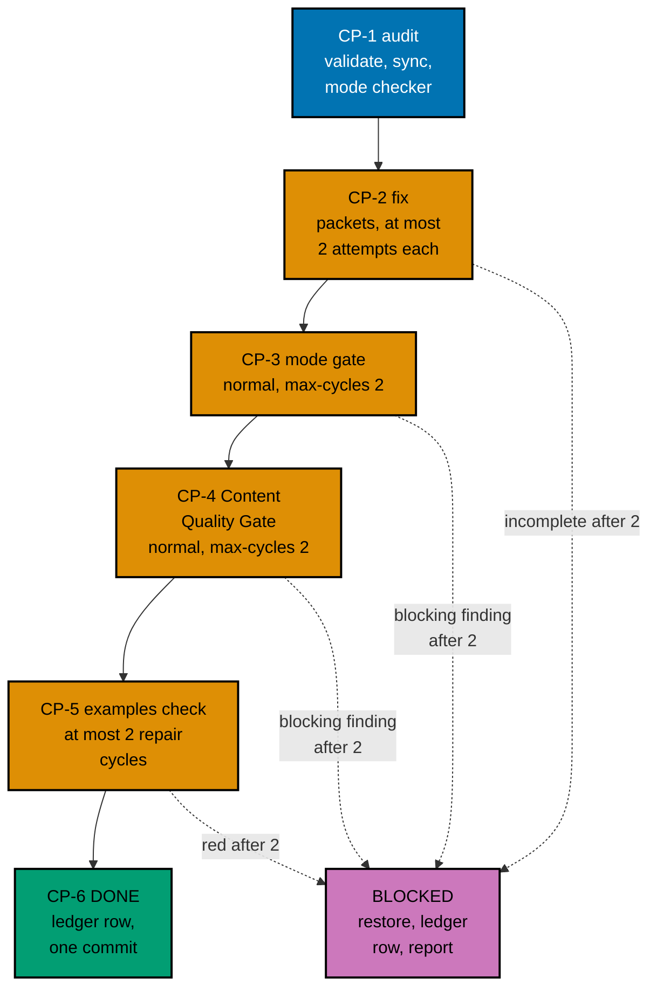
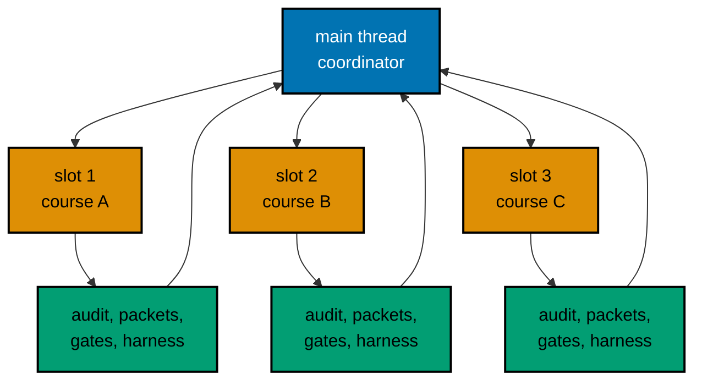

# 006 — Execution Model

Auditing 32 courses is most of this plan's work. This page says in what order the courses are audited, who
works on each one, how every loop is bounded, what happens to a course that cannot pass, where the record of
it all lives, and how the work reaches `origin/main` in commits and pushes. Execution starts only after the
user's command and after plans 01 to 10 have merged (series decision 42).

## Roles and Slots

The repository runs `N+1` agents with `N = 3`: up to three background workers and one main thread that
orchestrates and stays free.

- **Main thread (the coordinator).** Starts jobs, reads their reports, runs the cheap commands, writes the
  ledger, makes every commit, edits every shared file, and talks to the user. It does not write course
  content.
- **Slot.** One of three background-agent places. A wave has at most three courses, so each course owns a slot
  for its whole stay in the wave.
- **Job.** One background agent run. A course passes through these jobs in its slot, one at a time:
  1. an **audit job** (CP-1): the mode checker over the course folder;
  2. one or more **packet jobs** (CP-2): `apps-ayokoding-www-<mode>-maker` for authoring gaps,
     `swe-developer` for units, `run.yaml`, expected files, and determinism, `tutorial-<mode>-fixer` for
     findings;
  3. per gate cycle, a **checker job** and, if it finds blocking rows, a **fixer job** (the gate workflows
     define both);
  4. a **harness job** (CP-5) on the final text.

Quality gates run only when someone asks for them by name. Executing this plan, once the user has given the
command, is that request. The gates' own ledgers under `local-tmp/quality/` are never committed; the plan's
ledger below records every verdict line.

## Waves in Prerequisite Order

A course is audited only after every course it requires (inside these 32) is finished. The 32 courses fall
into 11 waves of at most three; the order below was checked against the prerequisite table in
[005](./005-prerequisites-ai-core-and-integrity.md#order-inside-the-plan). Within the constraint, each wave
mixes heavy and light courses, so a wave's three slots finish at similar times and no wave is three of the
largest.

| Wave | Courses (slot order)                                                                           | Planning minutes | Target units | Cumulative units | Cumulative runs | Cumulative minutes | Checkpoint                  |
| ---- | ---------------------------------------------------------------------------------------------- | ---------------- | ------------ | ---------------- | --------------- | ------------------ | --------------------------- |
| 1    | 1. `just-enough-python`; 2. `just-enough-bash`; 3. `just-enough-go`                            | 31.4             | 272          | 272              | 302             | 31.4               |                             |
| 2    | 1. `just-enough-rust`; 2. `just-enough-typescript`; 3. `just-enough-nvim`                      | 45.3             | 278          | 550              | 610             | 76.7               |                             |
| 3    | 1. `just-enough-kotlin`; 2. `just-enough-java`; 3. `just-enough-dart`                          | 65.0             | 263          | 813              | 903             | 141.7              | push 1 (opens the draft PR) |
| 4    | 1. `software-testing`; 2. `version-control-and-git`; 3. `browser-automation-with-cdp`          | 20.1             | 270          | 1,083            | 1,204           | 161.8              |                             |
| 5    | 1. `just-enough-c`; 2. `just-enough-elixir`; 3. `just-enough-lua`                              | 29.2             | 267          | 1,350            | 1,501           | 191.0              |                             |
| 6    | 1. `just-enough-csharp`; 2. `just-enough-swift`; 3. `building-production-cli-tools`            | 87.6             | 261          | 1,611            | 1,793           | 278.6              | push 2                      |
| 7    | 1. `containers-and-orchestration`; 2. `self-hosting-essentials`; 3. `just-enough-cpp`          | 32.2             | 263          | 1,874            | 2,087           | 310.8              |                             |
| 8    | 1. `debugging-and-profiling`; 2. `extending-neovim`; 3. `site-reliability-engineering`         | 19.4             | 214          | 2,088            | 2,330           | 330.2              |                             |
| 9    | 1. `build-automation-and-task-runners`; 2. `cicd-and-release-engineering`; 3. `cloud-and-iac`  | 25.5             | 217          | 2,305            | 2,576           | 355.7              | push 3                      |
| 10   | 1. `bare-metal-virtualization`; 2. `capstone-forge-ready`; 3. `software-engineering-practices` | 14.4             | 175          | 2,480            | 2,777           | 370.1              |                             |
| 11   | 1. `platform-engineering-and-devex`; 2. `self-managed-kubernetes-and-gitops`                   | 8.4              | 91           | 2,571            | 2,878           | 378.5              | push 4 (final)              |

Why the order is this one:

- **Wave 1** holds the three prerequisites that most courses need and that are the healthiest to start with:
  `just-enough-python`, `just-enough-bash`, and `just-enough-go`. They are also the first real test of the
  harness conversion, with the fewest surprises.
- **Waves 2 and 3** finish the primers that other courses require (`just-enough-rust`,
  `just-enough-typescript`, `just-enough-nvim`, `just-enough-kotlin`, `just-enough-java`, `just-enough-dart`).
  The courses that create the most units (Rust, Kotlin, and Dart, 86 new units each) and the second-largest
  gap-fill (Java) start early, so that any CI-budget finding arrives before the later waves depend on it.
  Push 1 follows wave 3.
- **Wave 4** needs `just-enough-python` (testing, CDP) and `just-enough-bash` (Git).
- **Waves 5 and 6** finish the languages whose prerequisites are done. Wave 6 holds the heaviest planning
  cost (`just-enough-csharp`, `just-enough-swift`, `building-production-cli-tools`); push 2 follows it.
- **Waves 7 to 9** run the infrastructure courses after `containers-and-orchestration` (wave 7), then the
  tools that need the earlier waves (`debugging-and-profiling` needs `software-testing`;
  `build-automation-and-task-runners` needs `just-enough-typescript`; `cicd-and-release-engineering` needs
  `containers-and-orchestration`).
- **Waves 10 and 11** hold the courses with the most prerequisites: `bare-metal-virtualization`
  (needs `cloud-and-iac`), `capstone-forge-ready` (needs `extending-neovim`), `platform-engineering-and-devex`
  and `self-managed-kubernetes-and-gitops` (need `bare-metal-virtualization` and `cicd-and-release-engineering`).

A wave starts when every course in the waves it needs is **DONE** or **BLOCKED** (see below). A BLOCKED
prerequisite does not stop its dependents: their makers use the BLOCKED course's brief and the pages it has,
and the ledger notes the dependency.

## The Per-Course Pipeline

Every step is bounded. "Cycle" means one check-then-fix round. The user set the cap on 2026-10-09: every
quality gate and every maker-checker loop stops after **2 cycles** ("semua jadi 2 aja").

| Step               | Who                                                                                                                                                       | Input                                                                                                                                      | Done when                                                                                                                                                                                                                     | Cap                                                                          |
| ------------------ | --------------------------------------------------------------------------------------------------------------------------------------------------------- | ------------------------------------------------------------------------------------------------------------------------------------------ | ----------------------------------------------------------------------------------------------------------------------------------------------------------------------------------------------------------------------------- | ---------------------------------------------------------------------------- |
| CP-1 Audit         | The coordinator runs `EX-VALIDATE` and `EX-SYNC`; the mode checker (`tutorial-by-example-checker`, `-primer-`, or `-annotated-concept-`) reads the course | The course folder, the brief, [002](./002-definition-of-done-and-targets.md), the completion test run with the course as a probe row (RED) | Finding counts are in the ledger; the brief's expected classes are confirmed or the brief is edited where they differ materially; the prerequisite re-check ([005](./005-prerequisites-ai-core-and-integrity.md)) is recorded | One audit; a second only if the first was interrupted                        |
| CP-2 Fix           | Makers, `swe-developer`, and mode fixers, per the size class                                                                                              | The brief, 002, [003](./003-harness-conversion-design.md), and the finished prerequisite courses                                           | Every defect class of the brief is closed; `EX-VALIDATE`, `EX-SYNC`, and `EX-CHECK` exit 0 on the packet owner's own run; every recorded expected file was read                                                               | 2 attempts per packet. A second attempt continues from the first one's files |
| CP-3 Mode gate     | The Tutorial By Example, Primer, or Annotated Concept Quality Gate                                                                                        | `subject` = the course folder, `mode: normal`, `max-cycles: 2`                                                                             | Verdict `PASS` or `PASS_WITH_FINDINGS`, with no open `needs-decision` row                                                                                                                                                     | 2 cycles (the gate's own input)                                              |
| CP-4 Content gate  | The Content Quality Gate                                                                                                                                  | The same inputs                                                                                                                            | Verdict `PASS` or `PASS_WITH_FINDINGS`, with no open `needs-decision` row                                                                                                                                                     | 2 cycles                                                                     |
| CP-5 Harness green | The coordinator runs `EX-CHECK <slug>`; a repair goes back to the course's `swe-developer` packet                                                         | The course folder after the gates' fixers                                                                                                  | `EX-CHECK` exits 0 (for the no-code course, `EX-VALIDATE` reports it not applicable)                                                                                                                                          | 2 repair cycles                                                              |
| CP-6 Record        | The coordinator                                                                                                                                           | The reports and exit codes                                                                                                                 | `estimatedHours` recomputed; the course's registry row added and the completion test green; for the five filler-baseline courses the entry removed; a ledger row with every field below; one commit for the course            | -                                                                            |

The harness also runs inside CP-2, because a packet owner must hand over code that works. CP-5 still runs
after the gates, because the gates' fixers may edit lessons or code; it is the step decision 27 names.

A gate verdict of `FAIL` or `BLOCKED` after its second cycle, or any open `needs-decision` finding (the gate
adapter routes an example count under its floor to `needs-decision`), makes the course BLOCKED. No verdict
stops the wave.

### Completion Test First

CP-1 runs the completion test ([007](./007-testing-strategy.md)) with the course as a **probe row**: an
environment variable adds the course and its format to the registry for that run only, so nothing red is ever
written to the working tree. The probe run is **RED** for every course that does not yet meet its shape, and
the failing scenarios are recorded in the ledger. CP-2 to CP-5 make the probe **GREEN**. At CP-6 the coordinator
adds the real registry row and runs the test without the probe; it is committed together with the course, so no
commit has a red test, and a BLOCKED course leaves no row behind. This is the TDD loop for content.

### Rules That Keep the Loop Bounded

1. **No new mode.** A maker may not switch a course's mode. A course that does not fit its mode after 2
   cycles is BLOCKED and the question goes to the user (decision D2).
2. **No loosened check.** Never retry, sleep, widen, loosen, skip, or quarantine to get green. A flaky unit is
   fixed at its root cause. A harness defect is fixed in `apps/ayokoding-cli` with a regression test first
   (plan 05's M11), as its own commit, and the CLI is rebuilt before the course continues.
3. **Gate fixers touch the course folder only.** If a fixer's change breaks a unit, CP-5 catches it; the
   repair cycle goes to a `swe-developer` packet.
4. **Order of gates is fixed.** Mode gate, then Content Quality Gate, then the harness. A text change after
   CP-5 (for example from a late finding) re-runs `EX-SYNC` and `EX-CHECK`.
5. **The filler guard binds.** The guard that plan 09 added (`course-filler-guard`) runs in `test:quick`;
   a rewritten course must pass its six rules, and the five courses in the baseline owned by this plan are
   removed from it at CP-6 (see [007](./007-testing-strategy.md#the-filler-baseline-ratchet)).

### Packet Template

Every packet prompt contains the same fields, so a packet can be run cold:

| Field           | Content                                                                                                                                      |
| --------------- | -------------------------------------------------------------------------------------------------------------------------------------------- |
| Course and mode | The slug, the mode, the wave and slot                                                                                                        |
| Inputs          | The brief path in the plan, the definition of done (A1 to A10), the harness design (003), and the paths of the finished prerequisite courses |
| Task            | The defect classes and units this packet owns (from the brief's checklist and the size class)                                                |
| Write set       | Files inside `apps/ayokoding-www/content/en/learn/courses/<slug>/` only; never any `_index.md` frontmatter, never `content/id/**`            |
| Commands        | The `EX-*` commands, the formatter order, and the HIPPO tier for each                                                                        |
| Forbidden       | Staging, committing, pushing; weakening a check; a new mode, slug, or topic; a link into `local-tmp/` or `plans/`                            |
| Return          | The files written, the findings left open, the `EX-*` exit codes, and the measured seconds of the slowest unit                               |

## Blocked Courses

A course is **BLOCKED** when a step reaches its cap without passing. The coordinator handles it in this order
and then reports to the user. The wave does not stop: the other courses continue.

1. **Save the partial work.** Copy the course folder to `local-tmp/ayokoding-learn/blocked/<slug>/` and run
   `diff -r` between the two folders; the diff must print nothing before the next step.
2. **Restore the baseline.** `rtk git restore -- <dir>` for tracked files; then a dry run
   `rtk git clean -n -d -- <dir>`, read the listed paths, and only then `rtk git clean -f -d -- <dir>` for the
   untracked ones. `rtk git status --short -- <dir>` prints nothing.
3. **Write the ledger row**: state `BLOCKED`, the failing step, the open findings (the gate's ledger path and
   the blocking rows), the harness output, and the path of the saved partial work.
4. **Report to the user**: the course, the step that failed, the blocking findings in short, and the options
   below. The coordinator does not choose for them.
5. **The wave gate stays open** (the wave's last checklist items stay unticked) until the user decides.

Options the user can choose:

- **Retry** with a changed approach (a smaller example plan, a different design for the failing unit, or a
  repair of the cause in a shared kit). The course re-enters the pipeline with fresh budgets, and the decision
  is recorded in the ledger.
- **Defer** the course to a follow-up plan. Unlike an outline course, an existing course is already usable and
  on its paths, so deferral does not break a path, and the PR stays shippable. It does mean decision 40's
  share for this plan is below 32 of 32, so the user decides explicitly whether the PR ships without the
  course, and plan 14's terminal gate must hear about it. The plan does not pre-decide.
- **Stop** the plan.

The plan never narrows quietly: no lowered target recorded as done, no skipped gate, no unpublished course.
A course that depends on a BLOCKED course can still be audited (its prerequisite list is metadata).

## The Execution Ledger

The ledger is the running record of the waves. It lives in the execution worktree at
`local-tmp/ayokoding-learn/execution-ledger.md` (gitignored scratch, shared by the series), under the heading
`## Plan 11 — audit languages and tooling`. Phase 0 creates one `PENDING` row per course, in wave order.

| Course                         | Wave and slot | Mode   | Maker agent IDs | CP-1 findings        | Fix cycles | Mode gate                      | Content gate    | Harness                    | Words / examples / diagrams | Status | Open findings | Commit    |
| ------------------------------ | ------------- | ------ | --------------- | -------------------- | ---------- | ------------------------------ | --------------- | -------------------------- | --------------------------- | ------ | ------------- | --------- |
| `just-enough-python` (example) | 1.1           | primer | agent IDs       | validate 3, sync 184 | 1          | 2 cycles, `PASS_WITH_FINDINGS` | 1 cycle, `PASS` | exit 0, units 92, runs 103 | 28,400 / 84 / -             | DONE   | -             | short SHA |

Row states: `PENDING`, `IN-PROGRESS` (with the step and the cycle count), `DONE`, and `BLOCKED`. A second
section of the ledger holds the CI figures: the spike seconds, the ladder rungs taken, and the measured
`EX-CHECK` minutes per finished course. At the end the coordinator copies the table (without scratch paths)
into `<plan>/evidence/execution-summary.md`, which is committed, so the record survives the worktree's
cleanup.

### Resuming

A new session, or the same session after its context was compacted, resumes like this:

1. Read the ledger and `rtk git status --short`; reconcile them (a `DONE` row must have its commit; an
   `IN-PROGRESS` row must have an uncommitted course folder).
2. For each `IN-PROGRESS` row, read the packet owner's report if the agent ID is still readable; otherwise run
   `EX-VALIDATE`, `EX-SYNC`, and `EX-CHECK` for the slug and the completion test to see how far the course
   got, and restart from the first step that fails.
3. A course folder with an unfinished set of units is never committed: an opted-in course is all or nothing.
4. Never reset a cycle count, and never start an attempt that would exceed 2.

## Commits and Checkpoint Pushes

- **Course commits.** One commit per DONE course, made by the coordinator after CP-6, with the header
  `fix(ayokoding-www): audit <slug> course`. It stages explicit paths only: the course folder, the course's
  `_index.md` (for `prerequisites` and `estimatedHours`), the completion-test registry row, and, for the five
  courses the filler baseline lists, the baseline entry and its cap. A BLOCKED course is never in a commit.
  Plan 07 commits once per wave; this plan commits once per course because every course is independent,
  already shipping, and may be BLOCKED or deferred on its own, so a per-course commit keeps each one
  revertible (decision D4).
- **Harness commits.** A harness or workflow change (the ladder's rungs 2b and 3, an M11 fix) is its own
  commit, `fix(ayokoding-cli): ...` or `ci(ayokoding-www): ...`, with its regression test.
- **Checkpoint pushes.** After waves 3, 6, 9, and 11 the branch is pushed. The first push opens a **draft**
  pull request. Each push first passes the per-commit push leak review. The current head's CI must be green
  before the next wave starts, so a harness or lockfile problem on the CI runner (for example amd64 wheel
  hashes) surfaces at wave 3 and not at the end. CI is polled every 2 minutes; `gh run watch` is not used.
- **Merging `origin/main`.** Before each wave, fetch and, if `origin/main` moved, read the full diff of the
  new commits, reconcile, and merge (not rebase) so pushed history is stable. The series runs plans strictly
  one after another, so a moved `origin/main` is a hotfix or a bot, not another plan.
- **PR size.** The PR will change about 8,000 to 10,000 files (a planning estimate: 2,571 units at about
  3 files each, plus the lesson pages), far above the 3,000 files that GitHub's pull-request files view and
  files API list. The PR gate reads git base and head SHAs and formats every changed path, so the gate is not
  limited by that listing. Reviewers read commit by commit: one commit per course keeps each review small.
  Phase 2 probes the limits when it opens the draft PR at push 1 and records what the page shows.

## Agent Topology

- **Never shared.** Two agents never write the same file. A slot writes only inside its course folder. The
  coordinator alone edits shared files: each `_index.md`, the completion-test registry, the filler baseline,
  the harness workflow and CLI, the ledger, and every commit.
- **Compute.** Every command runs through `rtk ./hippo run ...` with the tier in the Command Reference of
  [../delivery.md](../delivery.md). Independent compute from different slots overlaps only through HIPPO
  admission. The dependency, shared-output, byte-identity, and correctness edges stay serial: the lockfile
  bytes of one course, one environment image per lockfile, the recording of one unit's expected files, the
  ledger, and the course commit.
- **What the coordinator checks between waves.** Every course in the wave is DONE or BLOCKED with a ledger
  row; `EX-CHECK` still exits 0 for every DONE course of the wave; `rtk git status --short` shows only the
  wave's course folders and shared files; `rtk git status --short -- apps/ayokoding-www/content/id` is empty
  (restore with `rtk git checkout -- apps/ayokoding-www/content/id` if not); the quick suite runs at each
  checkpoint push.
