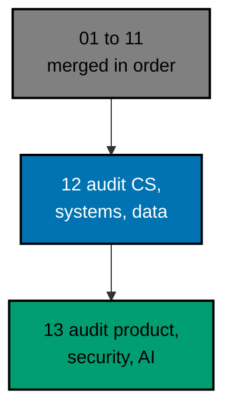

# AyoKoding Learn Revamp 12 — Audit of Computer Science, Systems, and Data Courses

> **Status:** Backlog. Do not execute until both are true: the user gives an explicit execution command
> ("jangan kerjain/implement plan ini sebelum gw kasih perintah buat eksekusi ya"), and plans 01 to 11 of this series
> have merged to `origin/main`. The 14 plans run strictly one after another (series decision 42), so plan 11 is
> merged, deployed, verified, and cleaned up before this plan starts.
>
> **Plan quality gate:** not run yet, so no verdict exists. By the user's decision of 2026-10-09 it was not run while
> the plan was written; it runs at the start of execution, as the first item of Phase 0 in
> [delivery.md](./delivery.md#phase-0-worktree-environment-preconditions-and-baseline), with `max-cycles` 2.

AyoKoding has 34 courses on computer science, systems and networking, databases and data, and architecture and
distributed systems that are real courses, already on learning paths, but that do not meet the series definition of
done. On 2026-10-09 they held 1,544,294 words and 3,566 code files. 14 of them were short of their word floor, and
the shortfall was 257,144 words in all. None had a `run.yaml`, so nothing proved that any example runs. 1,110 code
fences and 2,345 output blocks were not tied to a file, and 634 anchors disagreed with the files they point at. This
plan audits all 34 and fixes them in place, so that every course is complete, checked by its mode's quality gate and
the Content Quality Gate, and green in plan 05's code harness.

**This is not only an audit.** About 14 to 16 of the 34 courses need real authoring, not repair. Fourteen need 3,000
or more words written, 270,187 words in all; six of them are templated filler that plan 09
baselined for this plan and that are rewritten from scratch (`build-your-own-database`, `build-your-own-raft`,
`csp-style-concurrency`, `linux-os`, `system-programming`, `windows-os`). Two more, `computer-architecture` and
`advanced-networking`, keep their word counts but need most of their code units rewritten, because timings and real
network calls cannot run in the sandbox. The rest of the courses are repairs. The size of the plan follows from that:
2,863 harness units, of which 712 are written new.

## Scope

- **Audit and fix 34 existing courses** to the series definition of done (decisions 26 to 29): 10 in computer science,
  7 in systems and networking, 10 in data and databases, and 7 in architecture and distributed systems; 28 By Example,
  5 Annotated Concept, and 1 capstone. Each keeps its slug, mode, and place in every path; each meets its mode's floors
  for words, examples, diagrams, "Why It Matters", annotation, and a five-section drilling page of at least 5,000
  words. See [tech-docs/002](./tech-docs/002-definition-of-done-and-audit-method.md).
- **Bring every example green in the harness.** 2,863 units get a deterministic `run.yaml` and
  recorded output; lessons are tied to their files. Concurrency, distributed, and database-internals courses run as
  seeded simulations; networking runs on loopback with fixtures and models; hardware examples print counts from
  models; Windows code is checked statically; the rest runs for real. Thirteen small spikes prove the hard cases
  first. See [tech-docs/003](./tech-docs/003-harness-modes-simulation-and-determinism.md).
- **Add seven toolchain ids, each only if it earns it.** `valkey`, `mongodb`, `cassandra`, `dynamodb-local`,
  `timescaledb`, `gremlin`, and `neo4j-gds` are added only after a spike passes and at least five code units name
  them; each has a model fallback and nothing is BLOCKED if one fails. See
  [tech-docs/004](./tech-docs/004-toolchain-additions-and-ci-budget.md).
- **Fit the CI budget.** The plan's own load is the largest in the series and a toolchain change would put every push
  in a full run. The plan measures the cost first and carries a response ladder whose first rung is toolchain-aware
  selection. See [tech-docs/004](./tech-docs/004-toolchain-additions-and-ci-budget.md#the-response-ladder).
- **Bring `capstone-solid-core` to the capstone contract** of plan 08 (45 worked examples in five themes, a capstone
  page, a `relies-on` table, no top-level `code/`). See
  [tech-docs/006](./tech-docs/006-prerequisites-metadata-and-closure.md#capstone-solid-core).
- **Keep prerequisites and the AI path correct.** Plan 02's lists are re-checked per course; none of the 34 is in the
  AI Engineer core, and a change that would alter that core is raised to the user, not made. See
  [tech-docs/006](./tech-docs/006-prerequisites-metadata-and-closure.md).
- **Guard the end state** (decision 40): plan 11's completion test gains 34 rows and a ninth scenario, six courses leave
  plan 09's filler baseline in the same commits that fix them, and `ayokoding-www:examples:check` keeps the code
  green. Harness coverage is recorded: 34 of 34 courses covered.

## Non-Goals

- New courses and new topics (plans 06 to 10), and the other pre-existing courses (plans 11 and 13).
- The five courses of these four categories that other plans own: `capstone-concurrency-showdown`,
  `capstone-data-pipeline`, and `capstone-real-world-delivery` (plan 08), and `compilers-parsers-and-transpilers` and
  `type-systems` (plan 09).
- Any path manifest, phase, or membership change, except the AI manifest on the exception in
  [tech-docs/006](./tech-docs/006-prerequisites-metadata-and-closure.md#the-ai-engineer-path).
- Plan 09's `clojure` entry and `java` jar recipe (neither is used here), a ClickHouse or `pg_stat_statements` image
  (below the value floor), any change to plan 05's contract, and any weakening of a harness check.
- Indonesian content: `content/id/**` stays untouched (decision 35).

## For the User to Know Before Saying "Go"

These are the decisions the plan took on your behalf, each recorded so you can reverse it
([tech-docs/008](./tech-docs/008-decision-records.md)). None is an open question.

- **The effort is mostly authoring for 14 to 16 courses**, not auditing. The plan says so in its business case, and a
  course that cannot be finished in 2 cycles is BLOCKED and reported to you, never shortened.
- **Seven toolchain ids are planned, with fallbacks.** They change how the CI check chooses courses (rung 2t, a small
  edit to plan 05's selection code, tests first). If that edit cannot be built, no id is added, every course still
  meets the definition of done on models, and nothing is BLOCKED.
- **The PR is very large** (about 9,000 to 11,000 changed files, a planning estimate), reviewed commit by commit: one
  commit per course. It is pushed four times, with a draft PR from the first push.
- **`capstone-solid-core` is restructured**, and `capstone-real-world-delivery` (plan 08) leans on it. The plan re-reads
  that dependency; plan 13 owes a matching duty for `capstone-first-working-software`.
- **The plan quality gate has not been run** (see the status above), and CI figures in the plan are planning figures
  until Phase 1 measures them.

## Dependency and Result

The series runs strictly in order, one plan, one worktree, and one PR at a time (series decision 42), so plans 01 to
11 are all merged when this plan starts. This plan builds directly on plan 03 (course metadata) and plan 05 (the code
harness), and it respects plan 02's prerequisites and path integrity, plan 08's capstone contract, plan 09's filler
guard, and plan 11's completion test and CI ladder.

## Series Context

This plan is row 12 of the 14-plan **AyoKoding Learn Revamp** series. Each plan is one PR delivered from its own
worktree, and the plans run strictly in numeric order; the "Depends on" column shows which earlier plans each one
builds on. The user resolved the series decisions on 2026-10-09; every decision this plan relies on is copied into
[brd.md](./brd.md#resolved-series-decisions-this-plan-relies-on).

| NN  | Plan suffix                             | Scope                                                                                        | Depends on       |
| --- | --------------------------------------- | -------------------------------------------------------------------------------------------- | ---------------- |
| 01  | `navigation-and-display`                | Strip `NN ·` title prefixes; path position numbers; sidebar auto-scroll; render fixes        | —                |
| 02  | `path-model`                            | Phases, goals, `assumes`, outline marker, prerequisite revision, closure checks, career copy | 01               |
| 03  | `catalog-and-metadata`                  | Course metadata schema and backfill, categories, catalog page, course landing header         | 01               |
| 04  | `learning-experience`                   | Browser progress, phase roadmap page, context bar, mark complete, Learn home                 | 02, 03           |
| 05  | `code-harness`                          | `ayokoding-cli`, `run.yaml` contract, runners, Nx target, CI, quality-gate propagation       | —                |
| 06  | `accounting-courses`                    | Write 24 accounting courses; restructure both accounting paths in the same PR                | 02, 03, 05       |
| 07  | `erp-courses`                           | Write 30 ERP courses; restructure both ERP paths in the same PR                              | 06               |
| 08  | `capstone-courses`                      | Rewrite 8 skeleton capstones                                                                 | 02, 03, 05       |
| 09  | `filler-rewrites`                       | Rewrite 8 templated filler courses                                                           | 03, 05           |
| 10  | `legacy-unique-migration`               | Build courses for legacy topics without an equivalent; record the legacy-to-course map       | 03, 05           |
| 11  | `audit-languages-and-tooling`           | Audit and fix language and tooling courses                                                   | 03, 05           |
| 12  | `audit-cs-systems-and-data` (this plan) | Audit and fix CS, systems, concurrency, distributed, database, and data courses              | 05               |
| 13  | `audit-product-security-ai`             | Audit and fix web, backend, mobile, security, AI, testing, architecture, product courses     | 05               |
| 14  | `legacy-removal`                        | Delete `learn/legacy`, add 308 redirects, repoint `docs/` links, update specs and tests      | 10 (+11–13 done) |

## How the Work Runs

The 34 courses are audited in 12 waves in prerequisite order, by at most three background agents at a time. Each course
goes audit, fix, mode quality gate, Content Quality Gate, and harness green, and every loop stops after 2 cycles (the
user's cap, 2026-10-09: "semua jadi 2 aja"). A course that still fails is marked BLOCKED, restored to its baseline,
reported, and the wave moves on; the user decides whether to retry, defer, or stop. Each finished course is one
commit, and the branch is pushed four times, with a draft PR from the first push, so CI problems surface early. See
[tech-docs/005](./tech-docs/005-execution-model-waves-and-ledger.md).

## Navigation

- [Business requirements](./brd.md)
- [Product requirements, Gherkin, and UI design funnel](./prd.md)
- [Technical design](./tech-docs/README.md)
- [Syllabus corpus (34 course briefs)](./syllabus/README.md)
- [Delivery checklist](./delivery.md)
- [Execution learnings](./learnings.md)
