# Delivery Plan — AyoKoding Learn Revamp 12: Audit of Computer Science, Systems, and Data Courses

> **Legend** — `[AI]`: an agent performs the step (the default; unmarked steps are `[AI]`).
> `[HUMAN]`: only a human can do it (physical action, out-of-band approval, real-secret or
> privileged-credential handling). `[AI+HUMAN]`: agent prepares, human approves or finishes.

**Do not start** until both are true: (1) the user gives an explicit execution command for this
plan — that command authorizes this plan's change set (commits, pushes, PR, merge, and the deploy
described below); (2) plans 01 to 11 of this series have merged to `origin/main`, deployed, been
verified, and had their worktrees cleaned up. The series runs strictly one plan at a time (series
decision 42), so no other series plan runs while this one does, and no rebase between plans is
needed. The user's words (2026-10-09): "jangan kerjain/implement plan ini sebelum gw
kasih perintah buat eksekusi ya" (do not implement this plan until I give the command to execute it).

**Plan quality gate:** not run yet, so no verdict exists. By the user's decision of 2026-10-09 it was
not run while the plan was written ("plans quality gate gak usah kita lakuin sekarang. nanti aja pas
eksekusi"). It runs at the start of execution, as the first item of
[Phase 0](#phase-0-worktree-environment-preconditions-and-baseline), with `max-cycles` 2; its verdict
line is recorded here only then.

## Worktree

- **Execution worktree:** `worktrees/ayokoding-learn-revamp-12-audit-cs-systems-and-data/`
- **Provisioning command** (from the repository root, at Step 0):
  `claude --worktree ayokoding-learn-revamp-12-audit-cs-systems-and-data`, or the equivalent
  `rtk git worktree add -b ayokoding-learn-revamp-12-audit-cs-systems-and-data-base worktrees/ayokoding-learn-revamp-12-audit-cs-systems-and-data origin/main`.
- **Provisioning status:** pending
- **Authoring-worktree exception:** this plan was authored inside the separate authoring worktree
  `.claude/worktrees/ayokoding-update` (branch `worktree-ayokoding-update`). The user required that
  session to write all plans of the AyoKoding Learn Revamp series together and not to execute any of
  them before the user's command. That authoring worktree is **never** used for execution. The
  Provisioned Worktree Identity and the Delivery Branch Inventory are intentionally omitted until
  Step 0 creates them.
- **Step 0 obligation (blocking):** Phase 0's first outcome after the plan quality gate provisions
  the execution worktree from
  fresh `origin/main` per the
  [Worktree Path Convention](../../../repo-governance/conventions/structure/worktree-path.md),
  initializes it per
  [Worktree Toolchain Initialization](../../../repo-governance/development/workflow/worktree-setup.md),
  writes the immutable identity and the first inventory row into this section, replaces
  `Provisioning status: pending` with `Provisioning status: provisioned`, and syncs with
  `origin/main`. No implementation step may start while the status is pending.
- **Cleanup:** after the PR merges, the worktree, its branches, and this plan's scratch come down
  through [Dev Artifact Clean-Up](../../../repo-governance/workflows/maintenance/dev-artifact-clean-up.md)
  (Phase 11).
- **Worktree cap:** one worktree for this plan in this repository, reused by every phase.

The plan never records an absolute or machine-specific path. Resolve the declared route at runtime
and reconcile it with `rtk git worktree list --porcelain`.

## Delivery Mode: worktree-to-pr

`worktree-to-pr` is mandatory in this repository. One branch and **one PR** deliver the whole plan
(the series rule "one plan = one PR"). The PR is opened as a **draft** at the first checkpoint push (Phase 2),
and marked ready in Phase 11. It needs the exact current-head/base `Quality gate` from
`.github/workflows/pr-quality-gate.yml` and an exact-head posted `pr-leak-review` `pass` (`leak-review`
status). Broad semantic PR review is not run unless the user asks for it. `[AI]` merges once the hardened
merge preconditions hold.

## Parallelization Model

The 34 courses are audited in 12 waves of at most three courses
([tech-docs/005](./tech-docs/005-execution-model-waves-and-ledger.md#waves-in-prerequisite-order)). Inside a wave, up to three background agents each own one
course; a wave starts only when every course of the waves it needs is DONE or BLOCKED. Wave 12 holds one
course, so its three slots work on three packets of that course. Every shared file (registry, filler
baseline, indexes, the harness, workflow, and catalog, the ledger, every commit) is touched by the
coordinator alone.

```mermaid
%% Color Palette: Blue #0173B2, Orange #DE8F05, Teal #029E73, Purple #CC78BC
flowchart TD
  accTitle: Plan 12 execution order
  accDescr: Phase 0 sets up and records a baseline. Phase 1 runs the spikes, builds any needed selection rung, adds the toolchains that earn it, and measures the CI cost. Phases 2 to 5 audit the courses in twelve waves of up to three agents, with a checkpoint push after waves 3, 6, 9, and 12. A human stop resolves blocked courses. Then the ninth scenario with rules and docs, the end-state gate, manual verification, knowledge capture, and the delivery boundary run in order.
  P0["0 setup and baseline"] --> P1["1 spikes, selection<br/>rung, toolchains,<br/>CI measurement"]
  P1 --> P2["2 waves 1-3<br/>push 1 (draft PR)"]
  P2 --> P3["3 waves 4-6<br/>push 2"]
  P3 --> P4["4 waves 7-9<br/>push 3"]
  P4 --> P5["5 waves 10-12<br/>push 4"]
  P5 --> P6["6 human stop:<br/>BLOCKED and<br/>decisions"]
  P6 --> P7["7 ninth scenario,<br/>rules, docs, C4"]
  P7 --> P8["8 end-state gate"]
  P8 --> P9["9 manual<br/>verification"]
  P9 --> P10["10 knowledge capture"]
  P10 --> P11["11 boundary:<br/>archive, PR,<br/>merge, cleanup"]

  classDef serial fill:#0173B2,stroke:#000000,color:#FFFFFF,stroke-width:2px
  classDef parallel fill:#CC78BC,stroke:#000000,color:#000000,stroke-width:2px
  classDef human fill:#DE8F05,stroke:#000000,color:#000000,stroke-width:2px
  classDef gate fill:#029E73,stroke:#000000,color:#000000,stroke-width:2px
  classDef default fill:#FFFFFF,stroke:#000000,color:#000000
  class P0,P1,P7 serial
  class P2,P3,P4,P5 parallel
  class P6 human
  class P8,P9,P10,P11 gate
```

### Delivery Boundaries

| Phase(s) | Natural cohesive seam                                                                                                     | Worktree                                                         | Branch                                                | Delivery opportunity                                            | Exact resulting `main` / rollback / feature-flag evidence                                                                                                                                                                                                                                                                                                                                                                                           |
| -------- | ------------------------------------------------------------------------------------------------------------------------- | ---------------------------------------------------------------- | ----------------------------------------------------- | --------------------------------------------------------------- | --------------------------------------------------------------------------------------------------------------------------------------------------------------------------------------------------------------------------------------------------------------------------------------------------------------------------------------------------------------------------------------------------------------------------------------------------- |
| 0        | — (setup and baseline)                                                                                                    | —                                                                | —                                                     | none                                                            | No resulting state change; no PR; flag not applicable                                                                                                                                                                                                                                                                                                                                                                                               |
| 1–11     | Audited courses with their harness units, guard rows, rules, and any selection rung and toolchain ids (one delivery unit) | `worktrees/ayokoding-learn-revamp-12-audit-cs-systems-and-data/` | `ayokoding-learn-revamp-12-audit-cs-systems-and-data` | Draft PR opened at Phase 2 push 1; ready and merged in Phase 11 | `main` gets the audited courses (up to 34), their units, 34 registry rows and the ninth scenario, the six filler-baseline removals, rules AU1 to AU3, up to seven catalog entries, and any CI ladder change together. Rollback: revert the merge commit in a revert PR; every course returns to its pre-audit state and the catalog to its previous entries. Feature-flag lifecycle: not applicable, because no flag is created; nothing to remove. |

### Agent Topology

- **Main thread (coordinator):** owns the execution ledger, every gate record, every commit, index generation,
  and every shared file. It keeps itself free and fills background slots first.
- **At most 3 background agents at any time** (N = 3):
  - Phases 2–5: per course, a mode checker for CP-1, the maker named in each course block
    (`apps-ayokoding-www-by-example-maker` or `apps-ayokoding-www-annotated-concept-maker`) for authoring gaps,
    `swe-developer` for units, `run.yaml`, expected files, determinism, and the simulation kit, and the mode's
    fixer (`tutorial-by-example-fixer` or `tutorial-annotated-concept-fixer`) for gate findings. The gates run the
    checker and fixer agents their workflows name. Each agent writes only inside
    `apps/ayokoding-www/content/en/learn/courses/<slug>/`.
  - Phase 1: `swe-developer` for the spikes, the toolchain entries and images, and any selection or workflow
    change (Go and workflow); `specs-maker` for the Gherkin of a built rung.
  - Phase 7: `specs-maker` and `swe-developer` for the ninth scenario, `rules-maker` for AU1 to AU3, then
    `docs-fixer` and `readme-fixer`.
- Record every agent ID, its file set, its step, and its cycle count in the execution ledger.

### Execution Packet Defaults

- **Plan path after promotion:** `plans/in-progress/ayokoding-learn-revamp-12-audit-cs-systems-and-data/`
  (written below as `<plan>/`). Evidence goes to `<plan>/evidence/`.
- **Execution ledger:** `local-tmp/ayokoding-learn/execution-ledger.md` in the execution worktree,
  under the heading `## Plan 12 — audit CS, systems, and data`, with the fields in
  [tech-docs/005](./tech-docs/005-execution-model-waves-and-ledger.md#the-execution-ledger). Other scratch (raw output, spike
  units, the saved partial work of BLOCKED courses) lives in `local-tmp/ayokoding-learn/plan-12/` and
  `local-tmp/ayokoding-learn/blocked/` (gitignored).
- **No ad-hoc scripts (series decision 37).** Checks run through the app's tests and `ayokoding-cli`.
  Read-only inspection with `rtk git grep`, `rtk git diff`, `rtk git ls-tree`, and `rtk wc -w` is fine.
- **Evidence hygiene:** evidence files contain repository-relative paths only. Never paste an
  absolute home-directory path, a hostname, a token, or `.env*` content.
- **Never commit** `apps/ayokoding-www/next-env.d.ts` (the dev server rewrites it) or
  `.serena/project.yml`. Before every commit run `rtk git status --short` and restore either file with
  `rtk git checkout -- <file>` if it shows as modified.
- **Indonesian content stays untouched (decision 35).** `GEN-INDEXES` and `DEV` regenerate indexes for
  both locales. After each run, `rtk git status --short -- apps/ayokoding-www/content/id` must be
  empty; if not, run `rtk git checkout -- apps/ayokoding-www/content/id`.
- **Never touch** `.env.prod` or `.env.stag`. If the dev server needs a variable, copy the key from
  `apps/ayokoding-www/.env.example` into an uncommitted `apps/ayokoding-www/.env.local`.
- **No git identity changes.** Never run `git config user.*`. Never use a bare `git stash`.
- **Bounded loops (user, 2026-10-09: "semua jadi 2 aja"):** every quality gate runs with
  `max-cycles: 2`, and every maker→checker loop runs at most 2 cycles. A course still failing after
  its second cycle is **BLOCKED**: restore it, record it in the ledger, report it to the user, and move on. Any
  other file still failing after its second cycle is recorded as BLOCKED and the phase gate stays open
  until the user decides.
- **Failure handling:** on any unexpected failure, save the output to the phase evidence file, fix the
  root cause (never skip, retry-until-green, loosen, widen, quarantine, or delete a test), rerun the same
  command, and note the fix. A harness defect is fixed in `apps/ayokoding-cli` with a regression test
  (plan 05's M11), never by weakening a course check.
- **A failed addition is not a failure of the plan.** A toolchain or service id whose spike fails is not added;
  its units become labelled models ([tech-docs/004](./tech-docs/004-toolchain-additions-and-ci-budget.md#this-plans-own-additions)), and the ledger records it.
- **Waiting.** CI is polled every 2 minutes with `rtk gh pr checks`; `gh run watch` is never used. While the
  coordinator only waits on CI or on background agents, it updates the user every 5 minutes.
- **Planning figures are not estimates.** Every CI minute in this plan is a planning figure with invented
  per-invocation seconds. Phase 1 replaces them with measurements, and every ladder decision is taken on the
  measured numbers. The plan makes no estimate of how long any course or wave takes.

> **Important**: Fix ALL failures found during quality gates, not just those caused by your
> changes. This follows the root cause orientation principle — proactively fix preexisting
> errors encountered during work.

### Command Reference

Run every command from the execution worktree root. Expected results are stated at each use.

| Name                               | Command                                                                                                                                                                                                                                                                                                                                                                                                                                           |
| ---------------------------------- | ------------------------------------------------------------------------------------------------------------------------------------------------------------------------------------------------------------------------------------------------------------------------------------------------------------------------------------------------------------------------------------------------------------------------------------------------- |
| `UNIT-FE <file>`                   | `rtk ./hippo run --class ephemeral --resource-tier standard --disk-path . --cwd apps/ayokoding-www -- npx vitest run --project unit-fe <file>`                                                                                                                                                                                                                                                                                                    |
| `UNIT-NODE <files>`                | `rtk ./hippo run --class ephemeral --resource-tier standard --disk-path . --cwd apps/ayokoding-www -- npx vitest run --project unit <files>`                                                                                                                                                                                                                                                                                                      |
| `COMPLETION`                       | `UNIT-NODE tests/unit/be-steps/audited-course-completion.steps.ts` (plan 11's file; use the merged name from Phase 0)                                                                                                                                                                                                                                                                                                                             |
| `COMPLETION-PROBE <slug> <format>` | `rtk ./hippo run --class ephemeral --resource-tier standard --disk-path . --cwd apps/ayokoding-www -- env AUDIT_PROBE=<slug>:<format> npx vitest run --project unit tests/unit/be-steps/audited-course-completion.steps.ts` (adds one probe row for this run only; the variable name is the merged one)                                                                                                                                           |
| `FILLER`                           | `UNIT-NODE tests/unit/be-steps/course-filler.steps.ts` (plan 09's guard; the verbose reporter prints the metrics table for every course)                                                                                                                                                                                                                                                                                                          |
| `PATH-TESTS`                       | `UNIT-NODE tests/unit/features/course-paths/manifests/path-model-integrity.unit.test.ts tests/unit/features/course-paths/manifests/manifest-membership.unit.test.ts tests/unit/features/course-paths/manifests/careers/careers-ai-manifest.unit.test.ts tests/unit/features/course-paths/manifests/careers/career-goals.unit.test.ts tests/unit/features/content/course-frontmatter.unit.test.ts` (use the merged file names recorded in Phase 0) |
| `DRIFT`                            | `UNIT-NODE tests/unit/be-steps/course-metadata.steps.ts` (prints "Expected estimatedHours for every non-outline course")                                                                                                                                                                                                                                                                                                                          |
| `QUICK`                            | `rtk ./hippo run --class ephemeral --resource-tier standard --disk-path . -- npm exec nx -- run ayokoding-www:test:quick`                                                                                                                                                                                                                                                                                                                         |
| `INTEGRATION`                      | `rtk ./hippo run --class ephemeral --resource-tier heavy --disk-path . -- npm exec nx -- run ayokoding-www:test:integration`                                                                                                                                                                                                                                                                                                                      |
| `BEHAVIOUR`                        | `rtk ./hippo run --class ephemeral --resource-tier standard --disk-path . -- npm exec nx -- run ayokoding-www:test:coverage:behaviour`                                                                                                                                                                                                                                                                                                            |
| `E2E-BEHAVIOUR`                    | `rtk ./hippo run --class ephemeral --resource-tier standard --disk-path . -- npm exec nx -- run ayokoding-www-fe-e2e:test:coverage:behaviour`                                                                                                                                                                                                                                                                                                     |
| `BE-E2E-BEHAVIOUR`                 | `rtk ./hippo run --class ephemeral --resource-tier standard --disk-path . -- npm exec nx -- run ayokoding-www-be-e2e:test:coverage:behaviour`                                                                                                                                                                                                                                                                                                     |
| `E2E-QUICK`                        | `rtk ./hippo run --class ephemeral --resource-tier standard --disk-path . -- npm exec nx -- run ayokoding-www-fe-e2e:test:quick`                                                                                                                                                                                                                                                                                                                  |
| `E2E`                              | `rtk ./hippo run --class ephemeral --resource-tier heavy --disk-path . -- npm exec nx -- run ayokoding-www-fe-e2e:test:e2e`                                                                                                                                                                                                                                                                                                                       |
| `BUILD`                            | `rtk ./hippo run --class ephemeral --resource-tier heavy --disk-path . -- npm exec nx -- run ayokoding-www:build`                                                                                                                                                                                                                                                                                                                                 |
| `GEN-INDEXES`                      | `rtk ./hippo run --class transactional --resource-tier standard --disk-path . -- npm exec nx -- run ayokoding-www:generate-indexes`                                                                                                                                                                                                                                                                                                               |
| `VALIDATE-INDEXES`                 | `rtk ./hippo run --class ephemeral --resource-tier standard --disk-path . -- npm exec nx -- run ayokoding-www:validate-indexes`                                                                                                                                                                                                                                                                                                                   |
| `DEV`                              | `rtk ./hippo run --class service --resource-tier standard --disk-path . -- npm exec nx -- dev ayokoding-www` (serves `http://localhost:3101`)                                                                                                                                                                                                                                                                                                     |
| `LINT-MD`                          | `rtk npm run lint:md`                                                                                                                                                                                                                                                                                                                                                                                                                             |
| `CLI-BUILD`                        | `rtk ./hippo run --class ephemeral --resource-tier standard --disk-path . -- npm exec nx -- run ayokoding-cli:build`                                                                                                                                                                                                                                                                                                                              |
| `CLI-QUICK`                        | `rtk ./hippo run --class ephemeral --resource-tier standard --disk-path . -- npm exec nx -- run ayokoding-cli:test:quick`                                                                                                                                                                                                                                                                                                                         |
| `CLI-E2E`                          | `rtk ./hippo run --class ephemeral --resource-tier heavy --disk-path . -- npm exec nx -- run ayokoding-cli:test:e2e`                                                                                                                                                                                                                                                                                                                              |
| `CLI <args>`                       | `rtk ./hippo run --class ephemeral --resource-tier heavy --disk-path . -- apps/ayokoding-cli/dist/ayokoding-cli <args>`                                                                                                                                                                                                                                                                                                                           |
| `FIXTURE <args>`                   | `CLI --content apps/ayokoding-cli/tests/testdata/courses <args>`                                                                                                                                                                                                                                                                                                                                                                                  |
| `SMOKE`                            | `CLI --content apps/ayokoding-cli/tests/testdata/toolchain-smoke examples check --all`                                                                                                                                                                                                                                                                                                                                                            |
| `TC-LIST`                          | `CLI toolchains list`                                                                                                                                                                                                                                                                                                                                                                                                                             |
| `TC-BUILD <id>`                    | `CLI toolchains build <id>`                                                                                                                                                                                                                                                                                                                                                                                                                       |
| `EX-VALIDATE <slug>`               | `CLI examples validate --course <slug>`                                                                                                                                                                                                                                                                                                                                                                                                           |
| `EX-SYNC <slug>`                   | `CLI examples sync --course <slug>`                                                                                                                                                                                                                                                                                                                                                                                                               |
| `EX-SYNC-WRITE <slug>`             | `CLI examples sync --course <slug> --write` (repairs anchored fences from their files)                                                                                                                                                                                                                                                                                                                                                            |
| `EX-RECORD <slug>`                 | `CLI examples run --course <slug> --record` (writes only missing expected files)                                                                                                                                                                                                                                                                                                                                                                  |
| `EX-CHECK <slug>`                  | `CLI examples check --course <slug>`                                                                                                                                                                                                                                                                                                                                                                                                              |
| `EX-CHECK-ALL`                     | `CLI examples check` with one `--course <slug>` per slug of the 34 (the list is in [syllabus/courses/README.md](./syllabus/courses/README.md)); it may be run as four commands, one per category                                                                                                                                                                                                                                                  |
| `EX-COVERAGE`                      | `CLI --output json examples coverage`                                                                                                                                                                                                                                                                                                                                                                                                             |
| `EXAMPLES`                         | `rtk ./hippo run --class ephemeral --resource-tier heavy --disk-path . -- npm exec nx -- run ayokoding-www:examples:check` (add `--configuration=full` for a full run)                                                                                                                                                                                                                                                                            |
| `AU3-SCAN <slug>`                  | `rtk git grep -nE "[0-9]+\.[0-9]+\.[0-9]+\.[0-9]+" -- apps/ayokoding-www/content/en/learn/courses/<slug>/` and `rtk git grep -nE "[a-z0-9-]+\.(com\|org\|net\|io\|dev)" -- apps/ayokoding-www/content/en/learn/courses/<slug>/` — a reading aid for rule AU3 that lists addresses and host names; the reader classifies each as documentation, loopback, or real; it is never a pass or fail by itself                                            |
| `RUFF <files>`                     | `rtk ./hippo run --class ephemeral --resource-tier standard --disk-path . -- ruff format --no-cache <files>`                                                                                                                                                                                                                                                                                                                                      |
| `FORMAT <lang> <files>`            | The repository formatter for the language, as the commit hook runs it (`gofmt`, `rustfmt`, `clang-format`, `shfmt`, `csharpier`, `mix format`, Prettier), through `rtk ./hippo run --class ephemeral --resource-tier standard --disk-path . -- <formatter> <files>`; Phase 0 records the exact invocation for each language, or records that none exists                                                                                          |
| `UV-LOCK <slug>`                   | `rtk ./hippo run --class transactional --resource-tier standard --disk-path . -- uv pip compile --generate-hashes apps/ayokoding-www/content/en/learn/courses/<slug>/learning/code/requirements.in -o apps/ayokoding-www/content/en/learn/courses/<slug>/learning/code/requirements.lock`                                                                                                                                                         |
| `ADAPTERS-GEN`                     | `rtk ./hippo run --class transactional --resource-tier standard --disk-path . -- ./rhino harness adapters generate`                                                                                                                                                                                                                                                                                                                               |
| `ADAPTERS-VALIDATE`                | `rtk ./hippo run --class ephemeral --resource-tier standard --disk-path . -- ./rhino harness adapters validate`                                                                                                                                                                                                                                                                                                                                   |

`UNIT-FE` runs files under `tests/unit/fe-steps/` and `tests/unit/features/**/*.test.{ts,tsx}`;
`UNIT-NODE` runs `*.unit.test.ts` files and `tests/unit/be-steps/`. Paths after these commands are
relative to `apps/ayokoding-www/`. `CLI` uses the default content root
`apps/ayokoding-www/content/en/learn/courses`; build it with `CLI-BUILD` after any CLI or catalog
change (the catalog is embedded). Every `EX-*` command accepts more than one `--course`. If Phase 0 records
different merged names for any target or command, use the merged names everywhere below.

### Commit Guidelines

- [ ] [AI] Do not stage or commit until the user's execution command has authorized this plan's
      change set; do not extend a commit beyond it.
- [ ] [AI] Use the fewest build-valid, independently reviewable and revertible commits, one coherent
      purpose each: **one per DONE course** (`fix(ayokoding-www): audit <slug> course`; the filler six and
      `capstone-solid-core` use their own headers, see [tech-docs/005](./tech-docs/005-execution-model-waves-and-ledger.md#commits-and-checkpoint-pushes)),
      one for the toolchain additions, one each for a selection or workflow ladder change, one for the ninth
      scenario, one for the rules and docs, then evidence and the archival move.
- [ ] [AI] Follow Conventional Commits: `<type>(<scope>): <description>`, imperative, no period.
- [ ] [AI] Keep each change with its tests, specs, regenerated indexes, docs, and generated harness
      routes in the same commit; stage explicit paths only, never `git add -A`.

### Files Changed

The full root-relative tree with `[E]`/`[N]`/`[D]`/`[G]`/`[C]` markers is in
[tech-docs/009](./tech-docs/009-file-impact.md). In short: the 34 course folders (lessons, drilling, code units,
`run.yaml`, and expected files, with each `_index.md` changed in frontmatter only); the filler baseline
(six entries removed, the cap lowered by six); 34 registry rows, the ninth scenario, and its step; the
`code-example-harness.md` skill module and the gate adapter pointer for rules AU1 to AU3 with any generated
routes; conditionally up to seven catalog entries with two derived-image folders, fixture units, and smoke
rows, the CLI's selection and shard code, the workflow timeout, plan 08's capstone step file, and the AI
manifest; and `<plan>/` with its evidence.

### Recovery

- **Interrupted session.** The ledger is the source of truth for the waves. Reconcile it with
  `rtk git status --short` and `rtk git log --oneline origin/main..HEAD`: a course with a commit is
  DONE; a course folder with uncommitted changes and no BLOCKED row is in progress. Resume that
  course at the step and cycle the ledger shows; never reset a cycle count, and never start a new
  attempt that would exceed 2.
- **A packet agent stopped mid-course.** Its files stay in the course folder. The next attempt (if
  the course has one left) continues from those files
  ([tech-docs/005](./tech-docs/005-execution-model-waves-and-ledger.md#resuming)). A course folder with an unfinished set of
  units is never committed.
- **A wrong commit.** Revert it with a new commit (`rtk git revert <sha>`); never rewrite pushed
  history.
- **After merge.** Revert the merge commit in a revert PR; every course returns to its pre-audit state.

### Before Phase 0: Promotion

The plan is still in `plans/backlog/` at this point, so the plan quality gate (the first item of
Phase 0) runs first, here; promote only after its verdict is `PASS` or `PASS_WITH_FINDINGS`.

- [ ] [AI] Promote the plan per
      [Starting and Completing Work](../../../repo-governance/conventions/structure/plans/starting-and-completing-work.md):
      a pure move of `plans/backlog/ayokoding-learn-revamp-12-audit-cs-systems-and-data/` to
      `plans/in-progress/ayokoding-learn-revamp-12-audit-cs-systems-and-data/` plus the `plans/backlog/README.md`
      and `plans/in-progress/README.md` index updates, landed on `origin/main` through its own PR.
      Acceptance: `rtk git ls-tree -r --name-only origin/main plans/in-progress/ayokoding-learn-revamp-12-audit-cs-systems-and-data/`
      lists this plan's files. This promotion PR is separate from the delivery unit.

---

## Phase 0: Worktree, Environment, Preconditions, and Baseline

Phase 0 opens no PR. Its evidence rides the delivery PR.

- **Input:** the promotion on `origin/main`; this plan at `<plan>/`;
  [tech-docs/README.md](./tech-docs/README.md#cross-plan-assumptions).
- **Outcome:** a provisioned, initialized worktree; confirmed preconditions and merged names; a recorded
  baseline for all 34 courses; a read of the merged catalog, filler baseline, selection rule, and AI closure; a
  recorded CI shape; an initialized ledger.
- **Proof:** `<plan>/evidence/phase-0-baseline.md`.

- [ ] [AI] **Plan quality gate (deferred from authoring):** run the `plan-quality-gate` workflow on this
      plan with `max-cycles` 2 before any other step below. It was deliberately not run when this plan was
      written, to keep token use even (user decision, 2026-10-09). Acceptance: verdict `PASS` or
      `PASS_WITH_FINDINGS`; record the line `plan-quality-gate: <verdict> (<n> cycles, <k> open)` in this
      file's header section. If the plan is still in `plans/backlog/`, run the gate before the promotion PR.
      A `BLOCKED` verdict stops execution and is reported to the user.
- [ ] [AI] **Step 0 (blocking first outcome):** from the repository root, provision the execution
      worktree with the command in [## Worktree](#worktree). Record the Provisioned Worktree Identity
      (declared route `worktrees/ayokoding-learn-revamp-12-audit-cs-systems-and-data/`, initial branch
      `ayokoding-learn-revamp-12-audit-cs-systems-and-data-base`, creator, UTC creation time) and the first
      Delivery Branch Inventory row (`provisioned`, `active`, proof `git worktree add` at the
      timestamp) in [## Worktree](#worktree). Set `Provisioning status: provisioned`. Acceptance:
      `rtk git worktree list --porcelain` lists the worktree on the base branch.
- [ ] [AI] From the worktree root, run
      `rtk ./hippo run --class transactional --resource-tier standard --disk-path . -- npm install`.
      Acceptance: exit 0 and Husky hooks installed (`.husky/_` exists).
- [ ] [AI] Run `rtk npm run doctor`. Acceptance: exit 0. Only if it reports a missing or drifted
      toolchain, run
      `rtk ./hippo run --class transactional --resource-tier standard --disk-path . -- ./rhino toolchain provision --apply`
      and then `rtk npm run doctor` again (exit 0).
- [ ] [AI] Sync and branch: `rtk git fetch origin`, `rtk git merge --ff-only origin/main`, then
      `rtk git switch -c ayokoding-learn-revamp-12-audit-cs-systems-and-data`. Append the branch to the
      inventory (`worktree-to-pr`, `active`). Acceptance: `rtk git status` shows the new branch, clean.
- [ ] [AI] **Preconditions — plans 01 to 11 merged, plans 13 and 14 not started:** run
      `rtk git ls-tree -d --name-only origin/main plans/done/`. Acceptance: the output contains folders ending
      in `__ayokoding-learn-revamp-01-navigation-and-display` through
      `__ayokoding-learn-revamp-11-audit-languages-and-tooling` (all eleven suffixes in the series list). Then run
      `rtk git ls-tree -d --name-only origin/main plans/in-progress/`. Acceptance: the only series folder is this
      plan's, and there is none for plans 13 or 14. If any precondition fails, stop and report to the user.
- [ ] [AI] **Name reconciliation:** for each name below, run `rtk git grep -n "<name>" origin/main -- apps specs .agents repo-governance .github`
      and record the merged file and spelling in a name map in the baseline evidence. Plan 11's design:
      `audited-course-completion.feature` and its eight scenario titles, `audited-course-completion.steps.ts`,
      `audited-courses.ts`, `AUDITED_COURSES` (the row shape and the format values: `by-example`,
      `annotated-concept`, `capstone`), `DEFERRED_BY_USER`, the probe variable (`AUDIT_PROBE`), the constant of
      plan 11's 32 slugs, the floors table, and whether it has a row for `capstone`. Plan 09's:
      `FILLER_BASELINE`, `FILLER_BASELINE_CAP`, `REWRITTEN_FILLER_COURSES`, `course-filler.steps.ts`,
      `course-filler-guard.feature`, `course-quality-guards.md`. Plan 08's: the capstone content-shape test and
      step file, and how it finds its courses (by name, by glob, or by `format: capstone`). Plans 02 and 03's:
      `checkPathModelIntegrity`, `path-model-integrity.unit.test.ts`, `manifest-membership.unit.test.ts`,
      `course-frontmatter.unit.test.ts`, `careers-ai-manifest.unit.test.ts`, `career-goals.unit.test.ts`,
      `course-metadata.steps.ts`, `Expected estimatedHours for every non-outline course`, the tRPC procedure that
      returns the catalog with `estimatedHours`, and `outlineCourseIds`. Plan 05's: `examples:check`,
      `examples-plan`, the CLI selection package and its feature file, the `--shard` code, `code-example-harness.md`.
      Plan 11's rules TC1 and TC2 and their homes. Then run `CLI-BUILD` and `TC-LIST`. Acceptance: every name is
      found (or its merged replacement is recorded); the catalog lists the ids in
      [tech-docs/004](./tech-docs/004-toolchain-additions-and-ci-budget.md#what-the-catalog-gives). A missing name with no replacement stops the plan.
- [ ] [AI] **Plan 11's registry and counts:** open the merged registry and step file. Acceptance: record the
      number of rows (expected 32), the shape of the 32-slug constant, the eight scenario titles exactly, and that
      `COMPLETION` exits 0. If plan 11 merged a different design (for example one constant per plan in a separate
      file), record it and follow it ([tech-docs/007](./tech-docs/007-testing-strategy.md#extending-the-audited-course-completion-feature)).
- [ ] [AI] **Plan 09's filler baseline:** open `apps/ayokoding-www/src/features/content/core/course-filler-baseline.ts`
      on `origin/main`. Acceptance: record the number of entries and the cap (expected 12 and 12 after plans 09 and
      11), and that these six slugs are listed with owner `plan-12`: `build-your-own-database`, `build-your-own-raft`, `linux-os`, `system-programming`, `windows-os`, `csp-style-concurrency`, with the rules in
      [tech-docs/007](./tech-docs/007-testing-strategy.md#the-filler-baseline-ratchet) and [tech-docs/001](./tech-docs/001-current-state-and-partition.md#the-six-courses-in-plan-09s-filler-baseline). Record any
      difference (an owner re-tag, a different cap, a course that already left, an extra entry). Run `FILLER`.
      Acceptance: exit 0 on `origin/main`, and the printed metrics table shows no fired rule for the other 28
      courses of this plan. A fired rule on one of them is a regression in earlier work: report it to the user
      before it is baselined or fixed (FILL2 forbids a new entry).
- [ ] [AI] **Plan 09's toolchain changes and probe P9; ids this plan adds:** read the merged `java` and `clojure`
      catalog entries, plan 06's `psql` entry, and in plan 09's archived folder under `plans/done/` the evidence of its
      probe P9 (Spring Boot 4.1.1 offline). Run `TC-LIST`. Acceptance: record whether the `java` entry has the jar
      install recipe, the Temurin 25 base digest it pins (the `gremlin` image reuses that digest), and what plan 09
      recorded for P9. A failed P9 does not stop this plan (none of the 34 uses Spring, `java`, or a `jars.lock`; see
      [tech-docs/004](./tech-docs/004-toolchain-additions-and-ci-budget.md#what-plan-09-changes-and-probe-p9)). If the `java` entry was reverted or changed, take the
      digest from whatever the merged entry pins. Then check each of `valkey`, `mongodb`, `cassandra`,
      `dynamodb-local`, `timescaledb`, `gremlin`, and `neo4j-gds` against the catalog: an id that a plan before this
      one already added is reused, not added again, and the affected briefs are corrected.
- [ ] [AI] **Plan 08's AI path and capstone contract; CI rule:** read `careers/immediately-effective/ai-engineer.json`
      and its test. Acceptance: record the goal, the 12-course core, the four `assumes` (`api-design`,
      `backend-essentials`, `just-enough-bash`, `sql-essentials`), and compute the closure the way rule R6 does.
      Acceptance: list which of the 34 courses it contains (expected: none; `sql-essentials` is assumed, and
      `data-structures-and-algorithms-essentials`, `computer-architecture`, and `data-engineering` are extension
      courses, see [tech-docs/006](./tech-docs/006-prerequisites-metadata-and-closure.md#the-ai-engineer-path)). A non-empty intersection is reported to the user before any course
      starts. Read plan 08's capstone content-shape test and step file; record how it finds its courses, and run
      `rtk git grep -n "capstone-solid-core" origin/main -- apps/ayokoding-www/content/en/learn/courses` limited to
      `capstone-*/learning/overview.md`; record the `relies-on` row that names `capstone-solid-core` (expected: one
      row, in `capstone-real-world-delivery`). Read the merged `examples-plan` job and the reusable examples
      workflow. Acceptance: record the shard rule (courses or units), the shard counts, the `since` and `all`
      timeouts, the rule by which a change under `apps/ayokoding-cli/toolchains/` selects courses, and which rungs of
      the [response ladder](./tech-docs/004-toolchain-additions-and-ci-budget.md#the-response-ladder) (2b, 2c, 3) plan 11 already merged.
- [ ] [AI] **Plan 02's prerequisites:** compare the merged `prerequisites` of each of the 34 courses with the
      table in [tech-docs/006](./tech-docs/006-prerequisites-metadata-and-closure.md#plan-02s-result-for-the-34-courses). Acceptance: a list of differences
      (possibly empty) in the baseline evidence; each difference is also written into
      [syllabus/README.md](./syllabus/README.md#differences-from-plan-02s-specification) (the course, the edge, which
      side is right, and why), and 006, the order table, and the affected briefs are corrected in this branch. Check
      that every in-plan prerequisite still sits in a strictly earlier wave; if a merged edge breaks the wave order,
      reorder the waves in 005 and below before any wave starts.
- [ ] [AI] **Drift check — the 34 courses:** run
      `rtk git diff --stat bb7f90137 origin/main -- <the 34 course folders under apps/ayokoding-www/content/en/learn/courses>`
      (the slugs are in [syllabus/courses/README.md](./syllabus/courses/README.md)). For every listed file,
      open its diff and name the plan that made it. Acceptance: every change comes from plans 01 to 11 (for
      example title-prefix removal, `category`, `description`, `format`, `prerequisites`), and none adds teaching
      content; record the list. Otherwise stop and report the difference to the user, because the briefs'
      measured numbers would no longer hold.
- [ ] [AI] **Catalog and formatter facts:** from `TC-LIST` record the pin of every id this plan uses, and run
      each repository formatter on one file of its language (Python, Go, Rust, C, Elixir, shell, C#, PowerShell,
      and Prettier for Markdown) to record the exact `FORMAT` invocation. Acceptance: every pin matches
      [tech-docs/004](./tech-docs/004-toolchain-additions-and-ci-budget.md#what-the-catalog-gives) or the difference is recorded and the affected briefs are
      corrected; every language has a recorded invocation, or is recorded as having no repository formatter.
- [ ] [AI] **Vercel MCP re-probe:** check this session's available tools for a Vercel MCP server and
      record "present", "present but unauthenticated", or "absent". The plan uses no Vercel tool either
      way. Record no Vercel identifiers.
- [ ] [AI] **Harness baseline (plan 05's M1):** run `EX-VALIDATE` and `EX-SYNC` once each for every one of
      the 34 slugs (an explicit `--course` works before a course opts in). Acceptance: record the finding counts
      per course and compare the totals with [tech-docs/001](./tech-docs/001-current-state-and-partition.md#totals) (1,110 unanchored code fences, 2,345
      unanchored output blocks, 634 anchor differences); explain any difference that comes from a plan 01 to 11
      change.
- [ ] [AI] **CI shape and FULL-run projection:** from the merged units of every course that has a `run.yaml`
      (plans 06 to 11 and earlier), compute the number of units and runs of a full run, and project the longest
      shard with the conservative per-course figure in
      [tech-docs/004](./tech-docs/004-toolchain-additions-and-ci-budget.md#the-ci-budget). Acceptance: the figures
      are in the baseline evidence, labelled as planning figures (expected: about 850 planning minutes before this
      plan and about 1,315 after).
- [ ] [AI] Run `QUICK`, `BEHAVIOUR`, `E2E-BEHAVIOUR`, `BE-E2E-BEHAVIOUR`, `CLI-QUICK`, `INTEGRATION`,
      `VALIDATE-INDEXES`, `EXAMPLES`, `E2E-QUICK`, and `E2E`. Acceptance: each exits 0; record the counts. If
      anything fails before any change, fix the root cause first.
- [ ] [AI] Run `BUILD` once. Acceptance: exit 0; record the duration and the generated page count as the
      build baseline (Phase 9 compares).
- [ ] [AI] Start `DEV` in the background. With Playwright MCP at 375×800 and 1280×800 open `/en/learn/courses`,
      the landing pages of `computer-science-foundations`, `linux-os`, `graph-databases`, `build-your-own-raft`,
      `capstone-solid-core`, and `windows-os`, a learning page and the drilling page of `linux-os`, and `/id`.
      Acceptance: screenshots `<plan>/evidence/phase-0-before-<page>-<locale>-<bp>px.png` exist; record what each
      shows. Run the catalog tRPC procedure recorded in the name map (the batch URL form of
      `apps/ayokoding-www-fe-e2e/tests/e2e/steps/backend-helpers.ts`). Acceptance: status 200; record the number
      of `outlineCourseIds` (the baseline B) and the `estimatedHours` of `linux-os`, `graph-databases`, and
      `capstone-solid-core`. Stop `DEV`; then confirm
      `rtk git status --short -- apps/ayokoding-www/content/id` is empty (restore if not).
- [ ] [AI] Create the ledger section `## Plan 12 — audit CS, systems, and data` with one `PENDING` row per
      course, ordered by wave as in [tech-docs/005](./tech-docs/005-execution-model-waves-and-ledger.md#waves-in-prerequisite-order),
      and an empty second section for CI figures. Create `local-tmp/ayokoding-learn/plan-12/`.

### Phase 0 Gate

> All checks below must pass before starting Phase 1.

- [ ] [AI] The plan quality gate verdict line is recorded in this file's header, with verdict `PASS`
      or `PASS_WITH_FINDINGS` after at most 2 cycles.
- [ ] [AI] `Provisioning status: provisioned` with identity and inventory recorded.
- [ ] [AI] `<plan>/evidence/phase-0-baseline.md` records: the eleven merged plans, plans 13 and 14 not started,
      the name map, plan 11's registry design, the filler baseline result (entries, cap, the six `plan-12`
      entries), the `java`, `clojure`, and `psql` entries with the Temurin digest and plan 09's P9 result, the
      state of each of the seven ids in the catalog, the AI path result and the closure intersection, the
      `capstone-solid-core` search result, the prerequisite differences, the drift check, the catalog pins and
      formatter invocations, the Vercel probe, the M1 counts, the CI shape (shard rule, timeouts, merged rungs,
      the toolchain-change selection rule) and projection, every baseline exit code, the build baseline, and B.
- [ ] [AI] `rtk git status --short` shows only `<plan>/` changes.

> **Pause Safety**: the worktree is provisioned and green, the baseline is recorded, and no product
> file has changed. Safe to stop. To resume:
> `rtk git -C worktrees/ayokoding-learn-revamp-12-audit-cs-systems-and-data status --short`, then `QUICK`.

---

## Phase 1: Spikes, Selection Rung, Toolchain Additions, and CI Measurement

- **Input:** [tech-docs/004](./tech-docs/004-toolchain-additions-and-ci-budget.md); [tech-docs/003](./tech-docs/003-harness-modes-simulation-and-determinism.md); [tech-docs/007](./tech-docs/007-testing-strategy.md); the Phase 0 baseline.
- **Outcome:** the completion test is shown able to fail for the three registry formats of this plan; the
  Phase 1 spikes (SP1 to SP5 and the first SP12 measurements) have a recorded result; the per-invocation seconds
  are measured; the ladder rungs and the toolchain decisions are taken on measured figures; any needed selection
  rung is built test-first before any toolchain is added; the ids that earned it are added in one commit.
- **Proof:** `<plan>/evidence/phase-1-spikes.md` and `<plan>/evidence/harness-measurements.md`.
- _Suggested executors: `swe-developer` (spikes, catalog, Go, workflow), `specs-maker` (Gherkin for a built rung)._

### AC-1.1 — Probe check: the existing test can fail for these courses

This plan adds no new test file in this phase. Plan 11's completion test is the test; this step shows that it fails
for the formats of this plan before any course is touched.

- [ ] [AI] Run `COMPLETION` with no probe. Acceptance: exit 0 (the 32 rows of plan 11).
- [ ] [AI] Run `COMPLETION-PROBE linux-os by-example`, `COMPLETION-PROBE computer-science-foundations annotated-concept`,
      and `COMPLETION-PROBE capstone-solid-core capstone`. Acceptance: save the output of each; the word, example,
      "Why It Matters", drilling, and code-unit scenarios fail and name the course (the RED proof). If the merged
      step file rejects the format `capstone`, or has no floors row for it, record that: the first row that needs it
      (`capstone-solid-core`, wave 7) adds the row in its own commit, test first
      ([tech-docs/007](./tech-docs/007-testing-strategy.md#extending-the-audited-course-completion-feature)).

### AC-1.2 — Spikes

Each spike is a throwaway unit under `local-tmp/ayokoding-learn/plan-12/probe/<spike>/`, run through the real
harness twice with `CLI --content local-tmp/ayokoding-learn/plan-12/probe examples run --course <probe> --record`
and then without `--record`. A spike that tests a toolchain candidate (SP2 to SP4) adds the candidate to a scratch
copy of the catalog in the worktree, builds it with `TC-BUILD <id>`, measures it, and then discards the catalog
change with `rtk git restore -- apps/ayokoding-cli/toolchains`; a catalog change is committed only on a GO in AC-1.6.
A failed spike does not stop the plan: it selects the fallback named in its entry, and the briefs of the
affected courses already describe it. The spikes below run now. SP2 gives one verdict per store (`valkey`,
`mongodb`, `cassandra`, `dynamodb-local`, `timescaledb`). SP12 starts here: it records the seconds per container
invocation, and the rest of its measurements arrive with the courses.

- [ ] [AI] **SP1:** Do the hash-locked Python locks resolve and install offline, on Python 3.14 and both architectures? Pass: Every package of every course lock has a cp314 wheel (or a pure-Python wheel) for amd64 and arm64, installs with `--require-hashes` and no network, and one lock serves both architectures. Result and measured seconds, with the courses it serves (16 courses, the first being `sql-essentials`), go in `<plan>/evidence/phase-1-spikes.md`. On `FAIL` the fallback is: Replace a package with the standard library where the lesson allows, rewrite the unit otherwise; record the architecture split.
- [ ] [AI] **SP2:** Does each NoSQL store pass the five admission tests (AU2)? Pass: Digest recorded; no secret; ready inside `readyTimeout` (at most 60 s); byte-identical output on the double run for a fixture unit; shard cost fits the ladder. Result and measured seconds, with the courses it serves (`nosql-databases`), go in `<plan>/evidence/phase-1-spikes.md`. On `FAIL` the fallback is: The store is not added; its units become labelled models.
- [ ] [AI] **SP3:** Does a derived `neo4j-gds` image run GDS procedures deterministically on Community Edition? Pass: The plugin jar checks by SHA-256; procedures run with `concurrency: 1` and a `randomSeed`; double run byte-equal at half CPU; the licence statement is recorded. Result and measured seconds, with the courses it serves (`graph-databases`), go in `<plan>/evidence/phase-1-spikes.md`. On `FAIL` the fallback is: GDS units become Python models.
- [ ] [AI] **SP4:** Does a derived `gremlin` image run a Groovy script against an in-memory TinkerGraph offline? Pass: The console zip checks by SHA-256; `gremlin.sh` runs a script non-interactively; the start cost per unit is recorded; double run byte-equal. Result and measured seconds, with the courses it serves (`graph-databases`), go in `<plan>/evidence/phase-1-spikes.md`. On `FAIL` the fallback is: Gremlin units become Python traversal models.
- [ ] [AI] **SP5:** Can `pg_stat_statements` be loaded for one unit? Pass: The merged service contract has an `args` (or equivalent) field that passes `shared_preload_libraries`, and the unit's output is stable. Result and measured seconds, with the courses it serves (`advanced-sql-and-query-performance`), go in `<plan>/evidence/phase-1-spikes.md`. On `FAIL` the fallback is: Example 82 is a labelled illustration within the course's budget.
- [ ] [AI] **SP12:** What do the planning figures become when measured? Pass: Seconds per invocation for each toolchain and service, environment build minutes per lock, and the shard table recomputed; the ladder decision written down. Result and measured seconds, with the courses it serves (34 courses, the first being `sql-essentials`), go in `<plan>/evidence/phase-1-spikes.md`. On `FAIL` the fallback is: Rungs of the ladder in order.

The other spikes run inside the wave that first reaches the course that needs them, as a `swe-developer` job in
that course's CP-0, with the same recording rule; a result is reused by later courses and is not repeated:

| Spike | Question                                                                                                                    | First needed                                 | Courses                                                                                                                                                                            |
| ----- | --------------------------------------------------------------------------------------------------------------------------- | -------------------------------------------- | ---------------------------------------------------------------------------------------------------------------------------------------------------------------------------------- |
| SP6   | Is output independent of the CPU count with the pins this plan names?                                                       | Wave 4, `concurrency-and-parallelism` (CP-0) | `actor-model-concurrency`, `concurrency-and-parallelism`, `csp-style-concurrency`, `computer-architecture`, `modern-system-programming`, `data-engineering`, `build-your-own-raft` |
| SP7   | Do loopback sockets and a throwaway TLS key work under `--network none`?                                                    | Wave 6, `networking-essentials` (CP-0)       | `advanced-networking`, `networking-essentials`                                                                                                                                     |
| SP8   | Does the `gcc` image support `-std=c23`, sanitizers, and the process calls `linux-os` and `system-programming` teach?       | Wave 3, `linux-os` (CP-0)                    | `computer-architecture`, `linux-os`, `system-programming`                                                                                                                          |
| SP9   | Does Rust 1.99.0 build offline with single files and a lock-free `cargo` project?                                           | Wave 4, `modern-system-programming` (CP-0)   | `modern-system-programming`                                                                                                                                                        |
| SP10  | Does Go 1.27.2 run `testing/synctest` and modules offline, with a pinned `GOMAXPROCS`?                                      | Wave 9, `csp-style-concurrency` (CP-0)       | `csp-style-concurrency`, `build-your-own-raft`                                                                                                                                     |
| SP11  | Does the `windows-static` validator accept the course's Win32 C, PowerShell, and .NET, and how is a sample output anchored? | Wave 12, `windows-os` (CP-0)                 | `windows-os`                                                                                                                                                                       |
| SP13  | Does the capstone fit one or two toolchains per unit with an ASGI test client, linters, and git?                            | Wave 7, `capstone-solid-core` (CP-0)         | `capstone-solid-core`                                                                                                                                                              |

### AC-1.3 — Markdown formatter round trip for the fence languages of this plan

- [ ] [AI] In a probe course add a lesson with anchored `c`, `go`, `rust`, `elixir`, `sql`, `cypher`, `bash`, and
      `powershell` fences and their files. Run
      `CLI --content local-tmp/ayokoding-learn/plan-12/probe examples sync --course <probe> --write`, then
      `rtk npx prettier --write` on the lesson, then the same sync without `--write`. Acceptance: exit 0, which
      proves the commit hook's formatter leaves anchored code fences byte-identical for these languages too. If it
      fails, fix the formatter configuration for `apps/ayokoding-www/content/**/*.md` code fences at the root, with a
      regression check, and record the fix. Delete the probe course (scratch only).

### AC-1.4 — Measure and decide the CI ladder

- [ ] [AI] From the spike runs and the CLI's smoke fixtures, record in `<plan>/evidence/harness-measurements.md`
      the measured seconds per container invocation for `python`, `shell`, `gcc`, `go`, `rust`, `elixir`,
      `windows-static`, `postgres` (with `psql`), `neo4j`, and each candidate service or derived image, and any
      environment-image build time (the hash-locked Python wheels of 16 courses). Read the per-run durations from
      the CLI's `--output json` report; if the merged CLI does not report them, record the wall time of each
      command.
- [ ] [AI] Recompute each course's minutes as runs × 2 × measured seconds plus environment builds, rebuild the
      shard table of [tech-docs/004](./tech-docs/004-toolchain-additions-and-ci-budget.md#the-ci-budget) for the four checkpoint
      pushes (sorted-slug round-robin and the best possible split, with 4 and 8 shards), and add the merged courses of
      plans 06 to 11 for the FULL case. Acceptance: the table is in the evidence with the binding rule (longest
      shard at most 75 percent of the applicable timeout) applied to each push.
- [ ] [AI] Decide the rungs of the [response ladder](./tech-docs/004-toolchain-additions-and-ci-budget.md#the-response-ladder) on those figures, in this order, and write each
      decision, with the figures that required it, in the ledger and the evidence: rung 2t (needed only if at least
      one id passed its spike and the budget rule), rung 1 (author for speed, always), rung 2b and rung 2c (already
      merged by plan 11, or make them under M11), rung 3 (`since` timeout 60 to 120), and rung 2d (a course whose
      measured minutes alone exceed two-thirds of the limit; at planning figures `graph-databases`). If the
      projection still exceeds the rule after every rung, record that the heaviest course will be marked BLOCKED with
      the cause "does not fit the CI budget" and report it to the user before any wave starts.
- [ ] [AI] **If no id passed its spike:** record that no toolchain is added, rung 2t is not built, the PR never
      enters FULL mode, and every unit that needed an id is written as a labelled model; skip AC-1.5 and AC-1.6.

### AC-1.5 — Conditional rung 2t: toolchain-aware selection (Go change, tests first)

Only if at least one id passed its spike and AC-1.4 decided the rung. The rung comes before the additions, so the
additions never put a push into FULL mode.

- [ ] [AI] Find where plan 05's selection decides FULL mode for a change under `apps/ayokoding-cli/toolchains/`
      (the Phase 0 record) and how it maps a changed path or catalog entry to an id (a folder per id, or an entry
      in a shared file). Write the two scenarios of [prd.md](./prd.md#conditional-cli-selection-scenarios) for rung
      2t into plan 05's CLI selection feature as merged, with the exemptions that feature already uses, and write the
      Go tests first (RED). Acceptance (RED): a changed-path set that adds `toolchains/valkey/**` and one catalog
      entry selects every opted-in course; a change to the `python` Dockerfile selects every opted-in course.
- [ ] [AI] Make the change in the selection package so that a changed per-id folder or entry selects the courses
      whose `run.yaml` declares that id (`toolchain` or `services`) plus the courses changed by path, a new id with no
      declaring course selects nothing extra, and a change to a shared file (the catalog schema, a base Dockerfile
      fragment) keeps FULL. Acceptance (GREEN): the same tests pass; run `CLI-QUICK` and `CLI-E2E` (exit 0). Update
      `apps/ayokoding-cli/README.md` if it states the rule. Commit
      `fix(ayokoding-cli): select only the courses that use a changed toolchain`.
- [ ] [AI] **If the rung cannot be built** (the selection resists the change or its tests cannot be made to pass):
      stop AC-1.6, add no id, record the decision (D4 and D10 of [tech-docs/008](./tech-docs/008-decision-records.md)) and the cause in the
      ledger, and continue. This is not BLOCKED.

### AC-1.6 — Conditional rungs 2b, 2c, 3 (reuse), and the toolchain additions

- [ ] [AI] **Rungs 2b, 2c, and 3.** For each rung the Phase 0 record shows as merged by plan 11, run its tests as
      regression tests only (`CLI-QUICK`). For a rung not merged and decided in AC-1.4, make it exactly as
      [tech-docs/004](./tech-docs/004-toolchain-additions-and-ci-budget.md#the-response-ladder) states, test first: 813 units over 9 courses return four shards (RED), eight (GREEN);
      800 return four; 120 return one; for 2c the split is by unit count with no overlap and no gap across `1..N`.
      Commit `fix(ayokoding-cli): scale examples shards with the number of units` for 2b and 2c, and
      `ci(ayokoding-www): allow 120 minutes for the changed-course examples check` for rung 3 (only the
      `timeout-minutes` value and its comment change).
- [ ] [AI] **Toolchain decisions.** For each of the seven ids (`valkey`, `mongodb`, `cassandra`, `dynamodb-local`,
      `timescaledb`, `gremlin`, `neo4j-gds`) apply the [budget rule](./tech-docs/004-toolchain-additions-and-ci-budget.md#the-toolchain-budget-rule) to the spike
      result and the measured figures and record GO or NO-GO (default NO-GO; an unmeasured item is a no).
      Acceptance: seven rows in the evidence, each with the unit count that names the id and the effect on the
      longest shard.
- [ ] [AI] **Land every GO together** by plan 05's "Adding a Toolchain" procedure: a catalog entry (image reference
      with a digest, `ready` argv, `readyTimeout` of at most 60 seconds, resources), a `Dockerfile` under
      `apps/ayokoding-cli/toolchains/<id>/` for `gremlin` and `neo4j-gds` with every download checked by SHA-256,
      one fixture unit and one smoke row per id, then `TC-BUILD <id>` and `SMOKE`. Acceptance: each id builds, its
      fixture unit's double run at half the CPU quota is byte-identical, and the build time and image size are
      recorded. For a NO-GO id nothing is written, and the ledger records the fallback of
      [tech-docs/004](./tech-docs/004-toolchain-additions-and-ci-budget.md#this-plans-own-additions). Commit
      `feat(ayokoding-cli): add NoSQL, Gremlin, and GDS toolchains` (rename the commit to name the ids that
      landed). Update the CLI's toolchain list or catalog reference with the ids and the licence statement each spike
      recorded, and update the affected briefs (`nosql-databases`, `graph-databases`) in this branch with the
      outcome.
- [ ] [AI] Run `SMOKE` and then `EXAMPLES` on the branch. Acceptance: both exit 0, and the selection printed for
      the toolchain commit holds only the courses that declare a changed id (rung 2t). Record the number of
      courses selected.

### AC-1.7 — Conditional rung 2d: split a heavy course by unit

Only if AC-1.4 decided it (at planning figures `graph-databases`: about 86 minutes alone against a limit of 90).
It may instead be decided at Push 3 on the measured Neo4j seconds; the steps are the same.

- [ ] [AI] Write the third scenario of [prd.md](./prd.md#conditional-cli-selection-scenarios) into the CLI
      selection feature and the Go tests first. Acceptance (RED): a course of 99 units selected into eight shards
      appears in one shard. Make the change in the `--shard K/N` code: the units of that course divide across
      shards (sorted by path, round-robin, each unit in exactly one shard), and the course-level checks run in
      shard 1 only. Acceptance (GREEN): it appears in at least two shards, every unit runs exactly once, and the
      course-level checks run once. Run `CLI-QUICK` and `CLI-E2E`. Commit
      `fix(ayokoding-cli): divide the units of one heavy course across shards`.

### Phase 1 Gate

> All checks below must pass before starting Phase 2.

- [ ] [AI] `CLI-QUICK`, `SMOKE`, `BEHAVIOUR`, `E2E-BEHAVIOUR`, `BE-E2E-BEHAVIOUR`, `QUICK`, and `EXAMPLES` exit 0.
- [ ] [AI] SP1 to SP5 and the first SP12 measurements have a recorded result and, for each failure, the selected
      fallback; the in-wave spikes SP6 to SP11 and SP13 are listed with the wave that runs them.
- [ ] [AI] The ladder rungs and the seven toolchain decisions are recorded with their measured figures.
- [ ] [AI] `rtk git status --short` lists only the ladder changes with their tests, the toolchain entries with
      their folders, fixtures, and smoke rows, and `<plan>/`.

> **Pause Safety**: harness and catalog changes are committed and green; no course changed. Safe to stop. To
> resume: `CLI-BUILD`, `SMOKE`, then `QUICK`.

---

## How Every Course Runs (Phases 2–5)

Each course block below repeats the same checkpoints. They follow
[tech-docs/005](./tech-docs/005-execution-model-waves-and-ledger.md#the-per-course-pipeline); the definition of done is
[tech-docs/002](./tech-docs/002-definition-of-done-and-audit-method.md#the-definition-of-done).

| Checkpoint | Done when                                                                                                                                                                                                                                                                                                                                                                                                                                                                                                                                                                                                                                                                                                                               |
| ---------- | --------------------------------------------------------------------------------------------------------------------------------------------------------------------------------------------------------------------------------------------------------------------------------------------------------------------------------------------------------------------------------------------------------------------------------------------------------------------------------------------------------------------------------------------------------------------------------------------------------------------------------------------------------------------------------------------------------------------------------------- |
| **CP-0**   | Readiness: every in-plan prerequisite of the course is DONE or BLOCKED in the ledger; the spikes the brief names are recorded (an in-wave spike is run now by a `swe-developer` job); for a service course the image it needs is built in Phase 1 or its fallback is recorded.                                                                                                                                                                                                                                                                                                                                                                                                                                                          |
| **CP-1**   | The audit: `EX-VALIDATE`, `EX-SYNC`, the mode checker in report-only form, the probe run of the completion test (RED), the `FILLER` row, and the prerequisite re-check ([tech-docs/006](./tech-docs/006-prerequisites-metadata-and-closure.md#the-re-check-at-the-start-of-each-course)) are recorded in the ledger, and the brief is corrected where the findings differ materially.                                                                                                                                                                                                                                                                                                                                                   |
| **CP-2**   | The coordinator starts the course's packets as background agents. Each packet prompt holds the course and mode, the inputs (the brief, the definition of done, the harness design, and the folders of the finished prerequisite courses), the task, the write set (the course folder only, never `_index.md` frontmatter, never `content/id/**`), the commands, the forbidden actions, and the report to return ([packet template](./tech-docs/005-execution-model-waves-and-ledger.md#packet-template)). Within 2 attempts per packet every page and unit in the brief exists and the packet owner's own `EX-VALIDATE`, `EX-SYNC`, and `EX-CHECK` exit 0, and `FILLER` shows no fired rule for the course. Otherwise BLOCKED at "fix". |
| **CP-2b**  | Six courses only: the coordinator removes the course's entry from `FILLER_BASELINE` and lowers `FILLER_BASELINE_CAP` by one, in the course's commit ([tech-docs/007](./tech-docs/007-testing-strategy.md#the-filler-baseline-ratchet)).                                                                                                                                                                                                                                                                                                                                                                                                                                                                                                 |
| **CP-3**   | The mode gate — [Tutorial By Example](../../../repo-governance/workflows/quality/tutorial-by-example-quality-gate.md) or [Tutorial Annotated Concept](../../../repo-governance/workflows/quality/tutorial-annotated-concept-quality-gate.md) — runs with `subject` = the course folder, `mode: normal`, `max-cycles: 2`. Verdict `PASS` or `PASS_WITH_FINDINGS` with no open `needs-decision` row. Otherwise BLOCKED at "mode gate".                                                                                                                                                                                                                                                                                                    |
| **CP-4**   | The [Content Quality Gate](../../../repo-governance/workflows/quality/content-quality-gate.md) runs with `subject` = the course's Markdown pages, `mode: normal`, `max-cycles: 2`. Same verdict rule. Otherwise BLOCKED at "content gate".                                                                                                                                                                                                                                                                                                                                                                                                                                                                                              |
| **CP-5**   | The coordinator runs `EX-CHECK <slug>` after the gates' fixers. Exit 0. A failure goes back to the course's `swe-developer` packet with the output, at most 2 repair cycles, each followed by `EX-CHECK`. Otherwise BLOCKED at "harness".                                                                                                                                                                                                                                                                                                                                                                                                                                                                                               |
| **CP-6**   | Record: `estimatedHours` recomputed from the `DRIFT` output and set; any `prerequisites` change made with `PATH-TESTS` green; the registry row added and `COMPLETION` green; `FILLER` green (and, for the six, the baseline edit made).                                                                                                                                                                                                                                                                                                                                                                                                                                                                                                 |
| **CP-7**   | The ledger row is complete and the course is one commit with explicit paths only. A BLOCKED course follows [Blocked Courses](./tech-docs/005-execution-model-waves-and-ledger.md#blocked-courses): saved, restored, recorded, reported, and left out of every commit.                                                                                                                                                                                                                                                                                                                                                                                                                                                                   |

Per wave, the coordinator starts at most 3 courses at once. After every course of a wave is DONE or BLOCKED it
runs the wave gate. `status: outline` is not involved: none of the 34 courses is an outline.

---

## Phase 2: Waves 1–3 and Push 1

- **Input:** the briefs of the 9 courses; [tech-docs/002](./tech-docs/002-definition-of-done-and-audit-method.md), [tech-docs/003](./tech-docs/003-harness-modes-simulation-and-determinism.md), [tech-docs/005](./tech-docs/005-execution-model-waves-and-ledger.md); the Phase 1 results. The completion scenarios in [prd.md](./prd.md#audited-course-completion-the-ninth-scenario) and the definition of done describe the end state each course must reach.
- **Outcome:** 9 courses DONE or BLOCKED; the branch pushed; the draft PR open; push 1 green.
- **Proof:** the ledger rows and `<plan>/evidence/phase-2-courses.md` (one line per course: status, commit, gate verdicts, harness result, measured minutes; the PR-size observation).

### Wave 1

Courses: `sql-essentials` (slot 1), `data-structures-and-algorithms-essentials` (slot 2), `object-oriented-programming-essentials` (slot 3). Target units 269; planning figure 23.9 minutes of examples check (replaced by the measured minutes after each course). Needs waves: none. The wave starts when every wave it needs is DONE or BLOCKED. Wave 1 holds the three courses with no in-plan prerequisite that most others need. `sql-essentials` is the By Example exemplar that plans 06 and 07 cite, so it must not regress; its engine stays SQLite (decision D14).

- [ ] [AI] Wave start: `rtk git fetch origin`; if `origin/main` moved, read the full diff of the new commits, reconcile, and merge (not rebase). Confirm the ledger shows every course of the waves this wave needs as DONE or BLOCKED, mark the wave's rows IN-PROGRESS, and start at most 3 background agents.

#### W1.1 · `sql-essentials` — By Example, size M

- **Brief:** [sql-essentials](./syllabus/courses/sql-essentials.md). **Today:** 51,835 words against a floor of 28,000 (gap 0), drilling 8,502 words, 80 examples against a floor of 75. **To do:** no word gap to close (prose fixes only) and 0 units to author (80 existing example folders or files to convert).
- **Harness:** Real mode. Toolchain ids: `shell`, `python`. Spikes: SP1 (Phase 1), SP12 (Phase 1). Illustration budget: at most 3 fences. Planning CI figure: about 7.3 minutes of examples check (replaced by the measured minutes).
- **Prerequisites:** none in this plan; outside it `just-enough-python` (plan 11, final before this plan). Dependents in this plan: `advanced-sql-and-query-performance` (wave 2), `database-internals-and-storage-engines` (wave 5), `data-access-orms-and-query-builders` (wave 7), `search-and-information-retrieval` (wave 7), `build-your-own-orm-and-query-builder` (wave 8), `build-your-own-database` (wave 9), `nosql-databases` (wave 10), `graph-databases` (wave 11), `data-engineering` (wave 11).
- **AI Engineer path:** the path assumes this course after plan 08. A change to its own prerequisites cannot change the core, but CP-6 still runs `PATH-TESTS` and the AI manifest test ([tech-docs/006](./tech-docs/006-prerequisites-metadata-and-closure.md#the-ai-engineer-path)).
- **Obligation (C11):** Exemplar guard: the counts that pass today (80 examples, 80 Why It Matters blocks, 80 takeaways, 5 exact drilling sections, 8 katas) are floors that no edit may lower.
- [ ] [AI] CP-0 Readiness: no in-plan prerequisite to wait for; add `sql-essentials` to the ledger as IN-PROGRESS.
- [ ] [AI] CP-1 Audit: run `EX-VALIDATE sql-essentials` and `EX-SYNC sql-essentials` and save the finding counts; run `tutorial-by-example-checker` over the course folder in report-only form (not a gate cycle); run `COMPLETION-PROBE sql-essentials by-example` and save which scenarios fail (RED); run `FILLER` and read the row for `sql-essentials`; re-check `prerequisites` ([tech-docs/006](./tech-docs/006-prerequisites-metadata-and-closure.md#the-re-check-at-the-start-of-each-course)); compare the findings with the brief's expected classes (DC2, DC3, DC4, DC6, DC7, DC13, DC14) and edit the brief where they differ materially.
- [ ] [AI] CP-2 Fix (M): one packet per defect group (anchors and sync, annotation and density, drilling and katas); `apps-ayokoding-www-by-example-maker` fixes the prose findings (no word gap), `swe-developer` writes the units, `run.yaml`, and expected files (80 examples, 8 katas, 1 capstone unit), classes DC2, DC3, DC4, DC6, DC7, DC13, DC14. Each unit follows the author workflow (edit, format, `EX-SYNC-WRITE`, `EX-RECORD`, read every recorded file). No value derived from the CPU count reaches output (rule AU1). The illustration budget in the brief holds. Run `FILLER` and read the row for `sql-essentials`: no rule fires. Within 2 attempts per packet `EX-VALIDATE`, `EX-SYNC`, and `EX-CHECK` for `sql-essentials` exit 0.
- [ ] [AI] CP-3 Tutorial By Example Quality Gate: `subject` = the course folder, `mode: normal`, `max-cycles: 2`. Acceptance: `PASS` or `PASS_WITH_FINDINGS`, no open `needs-decision` row. Record cycles, verdict, and report path.
- [ ] [AI] CP-4 Content Quality Gate: same inputs and acceptance.
- [ ] [AI] CP-5 `EX-CHECK sql-essentials` exits 0 (at most 2 repair cycles, each followed by `EX-CHECK`). Record the measured minutes.
- [ ] [AI] CP-6 Record: read the expected `estimatedHours` from `DRIFT` after the last text edit and set it, with any `prerequisites` change, in `_index.md`; add the `sql-essentials` row (`by-example`) to `AUDITED_COURSES`; run `COMPLETION` (GREEN), `FILLER`, and, after a `prerequisites` change, `PATH-TESTS` (the AI manifest test included; rule AI-1).
- [ ] [AI] CP-7 Ledger and commit: complete the ledger row. Commit `fix(ayokoding-www): audit sql-essentials course` with explicit paths only: the course folder, its `_index.md`, its `AUDITED_COURSES` row, and any metadata file CP-6 changed. If a step reached its cap, follow [Blocked Courses](./tech-docs/005-execution-model-waves-and-ledger.md#blocked-courses) instead and report to the user.

#### W1.2 · `data-structures-and-algorithms-essentials` — By Example, size M

- **Brief:** [data-structures-and-algorithms-essentials](./syllabus/courses/data-structures-and-algorithms-essentials.md). **Today:** 56,936 words against a floor of 28,000 (gap 0), drilling 9,667 words, 82 examples against a floor of 75. **To do:** no word gap to close (prose fixes only) and 8 units to author (82 existing example folders or files to convert).
- **Harness:** Real mode. Toolchain ids: `python`. Spikes: SP1 (Phase 1), SP12 (Phase 1). Illustration budget: at most 3 fences. Planning CI figure: about 8.4 minutes of examples check (replaced by the measured minutes).
- **Prerequisites:** none in this plan; outside it `just-enough-python` (plan 11, final before this plan). Dependents in this plan: `computer-science-foundations` (wave 2), `concurrency-and-parallelism` (wave 4), `functional-programming` (wave 5), `advanced-algorithms` (wave 6), `search-and-information-retrieval` (wave 7).
- **AI Engineer path:** the course is an extension course of the path (not in the core). The expected CP-1 result is `prerequisites` unchanged; a change follows rule AI-1 ([tech-docs/006](./tech-docs/006-prerequisites-metadata-and-closure.md#the-ai-engineer-path)), and a change that would alter the closure becomes a `needs-decision` row, not an edit.
- **Obligation (C11):** No example may print a measured time; every cost claim is an operation count the run reproduces.
- [ ] [AI] CP-0 Readiness: no in-plan prerequisite to wait for; add `data-structures-and-algorithms-essentials` to the ledger as IN-PROGRESS.
- [ ] [AI] CP-1 Audit: run `EX-VALIDATE data-structures-and-algorithms-essentials` and `EX-SYNC data-structures-and-algorithms-essentials` and save the finding counts; run `tutorial-by-example-checker` over the course folder in report-only form (not a gate cycle); run `COMPLETION-PROBE data-structures-and-algorithms-essentials by-example` and save which scenarios fail (RED); run `FILLER` and read the row for `data-structures-and-algorithms-essentials`; re-check `prerequisites` ([tech-docs/006](./tech-docs/006-prerequisites-metadata-and-closure.md#the-re-check-at-the-start-of-each-course)); compare the findings with the brief's expected classes (DC2, DC3, DC6, DC7, DC10, DC11, DC12, DC13) and edit the brief where they differ materially.
- [ ] [AI] CP-2 Fix (M): one packet per defect group (anchors and sync, annotation and density, drilling and katas); `apps-ayokoding-www-by-example-maker` fixes the prose findings (no word gap), `swe-developer` writes the units, `run.yaml`, and expected files (82 examples, 8 katas, 1 capstone unit), classes DC2, DC3, DC6, DC7, DC10, DC11, DC12, DC13. Each unit follows the author workflow (edit, format, `EX-SYNC-WRITE`, `EX-RECORD`, read every recorded file). No value derived from the CPU count reaches output (rule AU1). The illustration budget in the brief holds. Run `FILLER` and read the row for `data-structures-and-algorithms-essentials`: no rule fires. Within 2 attempts per packet `EX-VALIDATE`, `EX-SYNC`, and `EX-CHECK` for `data-structures-and-algorithms-essentials` exit 0.
- [ ] [AI] CP-3 Tutorial By Example Quality Gate: `subject` = the course folder, `mode: normal`, `max-cycles: 2`. Acceptance: `PASS` or `PASS_WITH_FINDINGS`, no open `needs-decision` row. Record cycles, verdict, and report path.
- [ ] [AI] CP-4 Content Quality Gate: same inputs and acceptance.
- [ ] [AI] CP-5 `EX-CHECK data-structures-and-algorithms-essentials` exits 0 (at most 2 repair cycles, each followed by `EX-CHECK`). Record the measured minutes.
- [ ] [AI] CP-6 Record: read the expected `estimatedHours` from `DRIFT` after the last text edit and set it, with any `prerequisites` change, in `_index.md`; add the `data-structures-and-algorithms-essentials` row (`by-example`) to `AUDITED_COURSES`; run `COMPLETION` (GREEN), `FILLER`, and, after a `prerequisites` change, `PATH-TESTS` (the AI manifest test included; rule AI-1).
- [ ] [AI] CP-7 Ledger and commit: complete the ledger row. Commit `fix(ayokoding-www): audit data-structures-and-algorithms-essentials course` with explicit paths only: the course folder, its `_index.md`, its `AUDITED_COURSES` row, and any metadata file CP-6 changed. If a step reached its cap, follow [Blocked Courses](./tech-docs/005-execution-model-waves-and-ledger.md#blocked-courses) instead and report to the user.

#### W1.3 · `object-oriented-programming-essentials` — By Example, size M

- **Brief:** [object-oriented-programming-essentials](./syllabus/courses/object-oriented-programming-essentials.md). **Today:** 47,714 words against a floor of 28,000 (gap 0), drilling 6,321 words, 80 examples against a floor of 75. **To do:** no word gap to close (prose fixes only) and 0 units to author (80 existing example folders or files to convert).
- **Harness:** Real mode. Toolchain ids: `python`. Spikes: SP1 (Phase 1), SP12 (Phase 1). Illustration budget: at most 3 fences. Planning CI figure: about 8.2 minutes of examples check (replaced by the measured minutes).
- **Prerequisites:** none in this plan; outside it `just-enough-python` (plan 11, final before this plan). Dependents in this plan: `object-oriented-design-and-patterns` (wave 2), `programming-paradigms` (wave 3).
- **Obligation (C11):** No default `repr` with a memory address and no `id()` value reaches an expected file.
- [ ] [AI] CP-0 Readiness: no in-plan prerequisite to wait for; add `object-oriented-programming-essentials` to the ledger as IN-PROGRESS.
- [ ] [AI] CP-1 Audit: run `EX-VALIDATE object-oriented-programming-essentials` and `EX-SYNC object-oriented-programming-essentials` and save the finding counts; run `tutorial-by-example-checker` over the course folder in report-only form (not a gate cycle); run `COMPLETION-PROBE object-oriented-programming-essentials by-example` and save which scenarios fail (RED); run `FILLER` and read the row for `object-oriented-programming-essentials`; re-check `prerequisites` ([tech-docs/006](./tech-docs/006-prerequisites-metadata-and-closure.md#the-re-check-at-the-start-of-each-course)); compare the findings with the brief's expected classes (DC2, DC3, DC6, DC7, DC12, DC13, DC14) and edit the brief where they differ materially.
- [ ] [AI] CP-2 Fix (M): one packet per defect group (anchors and sync, annotation and density, drilling and katas); `apps-ayokoding-www-by-example-maker` fixes the prose findings (no word gap), `swe-developer` writes the units, `run.yaml`, and expected files (80 examples, 8 katas, 1 capstone unit), classes DC2, DC3, DC6, DC7, DC12, DC13, DC14. Each unit follows the author workflow (edit, format, `EX-SYNC-WRITE`, `EX-RECORD`, read every recorded file). No value derived from the CPU count reaches output (rule AU1). The illustration budget in the brief holds. Run `FILLER` and read the row for `object-oriented-programming-essentials`: no rule fires. Within 2 attempts per packet `EX-VALIDATE`, `EX-SYNC`, and `EX-CHECK` for `object-oriented-programming-essentials` exit 0.
- [ ] [AI] CP-3 Tutorial By Example Quality Gate: `subject` = the course folder, `mode: normal`, `max-cycles: 2`. Acceptance: `PASS` or `PASS_WITH_FINDINGS`, no open `needs-decision` row. Record cycles, verdict, and report path.
- [ ] [AI] CP-4 Content Quality Gate: same inputs and acceptance.
- [ ] [AI] CP-5 `EX-CHECK object-oriented-programming-essentials` exits 0 (at most 2 repair cycles, each followed by `EX-CHECK`). Record the measured minutes.
- [ ] [AI] CP-6 Record: read the expected `estimatedHours` from `DRIFT` after the last text edit and set it, with any `prerequisites` change, in `_index.md`; add the `object-oriented-programming-essentials` row (`by-example`) to `AUDITED_COURSES`; run `COMPLETION` (GREEN), `FILLER`, and, after a `prerequisites` change, `PATH-TESTS`.
- [ ] [AI] CP-7 Ledger and commit: complete the ledger row. Commit `fix(ayokoding-www): audit object-oriented-programming-essentials course` with explicit paths only: the course folder, its `_index.md`, its `AUDITED_COURSES` row, and any metadata file CP-6 changed. If a step reached its cap, follow [Blocked Courses](./tech-docs/005-execution-model-waves-and-ledger.md#blocked-courses) instead and report to the user.

#### Wave 1 gate

- [ ] [AI] Every course of the wave is DONE (committed) or BLOCKED (restored, reported, ledger row complete).
- [ ] [AI] `GEN-INDEXES`, then confirm `rtk git status --short -- apps/ayokoding-www/content/id` is empty (restore with `rtk git checkout -- apps/ayokoding-www/content/id` if not); `VALIDATE-INDEXES` exits 0.
- [ ] [AI] `CLI examples check --course sql-essentials --course data-structures-and-algorithms-essentials --course object-oriented-programming-essentials` (only the DONE courses) exits 0.
- [ ] [AI] `COMPLETION` and `FILLER` exit 0.
- [ ] [AI] The ledger shows the measured minutes of each DONE course. If the measured projection of the longest shard for the next push is above 75 percent of the applicable timeout, apply the next rung of the [response ladder](./tech-docs/004-toolchain-additions-and-ci-budget.md#the-response-ladder) now, with its regression test, and record it.
- [ ] [AI] `rtk git status --short` shows only this wave's course folders, shared files the coordinator edited, and `<plan>/`; `apps/ayokoding-www/next-env.d.ts` and `.serena/project.yml` are not modified.

### Wave 2

Courses: `advanced-sql-and-query-performance` (slot 1), `computer-science-foundations` (slot 2), `object-oriented-design-and-patterns` (slot 3). Target units 248; planning figure 47.2 minutes of examples check (replaced by the measured minutes after each course). Needs waves: 1. The wave starts when every wave it needs is DONE or BLOCKED. `advanced-sql-and-query-performance` is the first PostgreSQL service course, so the first checkpoint push exercises the service lifecycle on CI. A defect in the service contract is a harness defect: fix it in `apps/ayokoding-cli` with a regression test, as its own commit (plan 05's M11).

- [ ] [AI] Wave start: `rtk git fetch origin`; if `origin/main` moved, read the full diff of the new commits, reconcile, and merge (not rebase). Confirm the ledger shows every course of the waves this wave needs as DONE or BLOCKED, mark the wave's rows IN-PROGRESS, and start at most 3 background agents.

#### W2.1 · `advanced-sql-and-query-performance` — By Example, size M

- **Brief:** [advanced-sql-and-query-performance](./syllabus/courses/advanced-sql-and-query-performance.md). **Today:** 90,061 words against a floor of 28,000 (gap 0), drilling 12,845 words, 85 examples against a floor of 75. **To do:** no word gap to close (prose fixes only) and 0 units to author (85 existing example folders or files to convert).
- **Harness:** Real mode with a PostgreSQL service. Toolchain ids: `psql`, `python`; services: `postgres`. Spikes: SP1 (Phase 1), SP5 (Phase 1), SP12 (Phase 1). Illustration budget: at most 3 fences. Planning CI figure: about 32.9 minutes of examples check (replaced by the measured minutes).
- **Prerequisites:** in this plan `sql-essentials` (wave 1); outside it `just-enough-python` (plan 11, final before this plan), `backend-essentials` (plan 13, unchanged until plan 13; read at the level of its overview only). Dependents in this plan: `database-internals-and-storage-engines` (wave 5), `capstone-solid-core` (wave 7), `data-access-orms-and-query-builders` (wave 7), `build-your-own-orm-and-query-builder` (wave 8), `system-design` (wave 11), `data-engineering` (wave 11).
- **Service:** the catalog's `postgres` service (and plan 06's `psql`); no id is added for it. Example 82 needs `pg_stat_statements` (SP5): a service argument if the merged contract has one, otherwise a labelled illustration within the budget.
- **Obligation (C11):** Every `EXPLAIN` in an expected file is deterministic for the pinned digest: `COSTS OFF` after `ANALYZE`, or an analyzed plan with timing and buffers removed.
- [ ] [AI] CP-0 Readiness: confirm `sql-essentials` is DONE or BLOCKED in the ledger; add `advanced-sql-and-query-performance` to the ledger as IN-PROGRESS.
- [ ] [AI] CP-1 Audit: run `EX-VALIDATE advanced-sql-and-query-performance` and `EX-SYNC advanced-sql-and-query-performance` and save the finding counts; run `tutorial-by-example-checker` over the course folder in report-only form (not a gate cycle); run `COMPLETION-PROBE advanced-sql-and-query-performance by-example` and save which scenarios fail (RED); run `FILLER` and read the row for `advanced-sql-and-query-performance`; re-check `prerequisites` ([tech-docs/006](./tech-docs/006-prerequisites-metadata-and-closure.md#the-re-check-at-the-start-of-each-course)); compare the findings with the brief's expected classes (DC2, DC3, DC4, DC6, DC12, DC13, DC14) and edit the brief where they differ materially.
- [ ] [AI] CP-2 Fix (M): one packet per defect group (anchors and sync, annotation and density, drilling and katas); `apps-ayokoding-www-by-example-maker` fixes the prose findings (no word gap), `swe-developer` writes the units, `run.yaml`, and expected files (85 examples, 8 katas, 1 capstone unit), classes DC2, DC3, DC4, DC6, DC12, DC13, DC14. Each unit follows the author workflow (edit, format, `EX-SYNC-WRITE`, `EX-RECORD`, read every recorded file). Units declare `services` in `run.yaml` ([tech-docs/003](./tech-docs/003-harness-modes-simulation-and-determinism.md#service-backed-units)): own schema or keyspace per unit, fixed data, ordered output, no clock or sequence in output. No value derived from the CPU count reaches output (rule AU1). The illustration budget in the brief holds. Run `FILLER` and read the row for `advanced-sql-and-query-performance`: no rule fires. Within 2 attempts per packet `EX-VALIDATE`, `EX-SYNC`, and `EX-CHECK` for `advanced-sql-and-query-performance` exit 0.
- [ ] [AI] CP-3 Tutorial By Example Quality Gate: `subject` = the course folder, `mode: normal`, `max-cycles: 2`. Acceptance: `PASS` or `PASS_WITH_FINDINGS`, no open `needs-decision` row. Record cycles, verdict, and report path.
- [ ] [AI] CP-4 Content Quality Gate: same inputs and acceptance. The checker reads the expected files for host names other than the catalog's service alias or loopback.
- [ ] [AI] CP-5 `EX-CHECK advanced-sql-and-query-performance` exits 0 (at most 2 repair cycles, each followed by `EX-CHECK`). Record the measured minutes.
- [ ] [AI] CP-6 Record: read the expected `estimatedHours` from `DRIFT` after the last text edit and set it, with any `prerequisites` change, in `_index.md`; add the `advanced-sql-and-query-performance` row (`by-example`) to `AUDITED_COURSES`; run `COMPLETION` (GREEN), `FILLER`, and, after a `prerequisites` change, `PATH-TESTS`.
- [ ] [AI] CP-7 Ledger and commit: complete the ledger row. Commit `fix(ayokoding-www): audit advanced-sql-and-query-performance course` with explicit paths only: the course folder, its `_index.md`, its `AUDITED_COURSES` row, and any metadata file CP-6 changed. If a step reached its cap, follow [Blocked Courses](./tech-docs/005-execution-model-waves-and-ledger.md#blocked-courses) instead and report to the user.

#### W2.2 · `computer-science-foundations` — Annotated Concept, size M

- **Brief:** [computer-science-foundations](./syllabus/courses/computer-science-foundations.md). **Today:** 50,712 words against a floor of 22,000 (gap 0), drilling 4,899 words, 55 examples against a floor of 45. **To do:** about 101 words to write and 5 units to author (55 existing example folders or files to convert).
- **Harness:** Real mode. Toolchain ids: `python`. Spikes: SP12 (Phase 1). Illustration budget: at most 3 fences. Planning CI figure: about 5.7 minutes of examples check (replaced by the measured minutes).
- **Prerequisites:** in this plan `data-structures-and-algorithms-essentials` (wave 1); outside it `just-enough-python` (plan 11, final before this plan). Dependents in this plan: `computer-architecture` (wave 4), `capstone-solid-core` (wave 7).
- **Obligation (C11):** Worked examples that are tables or diagrams carry no code unit; every code-bearing worked example has a unit.
- [ ] [AI] CP-0 Readiness: confirm `data-structures-and-algorithms-essentials` is DONE or BLOCKED in the ledger; add `computer-science-foundations` to the ledger as IN-PROGRESS.
- [ ] [AI] CP-1 Audit: run `EX-VALIDATE computer-science-foundations` and `EX-SYNC computer-science-foundations` and save the finding counts; run `tutorial-annotated-concept-checker` over the course folder in report-only form (not a gate cycle); run `COMPLETION-PROBE computer-science-foundations annotated-concept` and save which scenarios fail (RED); run `FILLER` and read the row for `computer-science-foundations`; re-check `prerequisites` ([tech-docs/006](./tech-docs/006-prerequisites-metadata-and-closure.md#the-re-check-at-the-start-of-each-course)); compare the findings with the brief's expected classes (DC2, DC3, DC5, DC6, DC10, DC11, DC12) and edit the brief where they differ materially.
- [ ] [AI] CP-2 Fix (M): one packet per defect group (anchors and sync, annotation and density, drilling and katas); `apps-ayokoding-www-annotated-concept-maker` writes the gaps (about 101 words), `swe-developer` writes the units, `run.yaml`, and expected files (55 examples, 5 katas, 1 capstone unit), classes DC2, DC3, DC5, DC6, DC10, DC11, DC12. Each unit follows the author workflow (edit, format, `EX-SYNC-WRITE`, `EX-RECORD`, read every recorded file). Worked examples use the heading `### Worked Example N: Title` and at least 10 Mermaid diagrams. No value derived from the CPU count reaches output (rule AU1). The illustration budget in the brief holds. Run `FILLER` and read the row for `computer-science-foundations`: no rule fires. Within 2 attempts per packet `EX-VALIDATE`, `EX-SYNC`, and `EX-CHECK` for `computer-science-foundations` exit 0.
- [ ] [AI] CP-3 Tutorial Annotated Concept Quality Gate: `subject` = the course folder, `mode: normal`, `max-cycles: 2`. Acceptance: `PASS` or `PASS_WITH_FINDINGS`, no open `needs-decision` row. Record cycles, verdict, and report path.
- [ ] [AI] CP-4 Content Quality Gate: same inputs and acceptance.
- [ ] [AI] CP-5 `EX-CHECK computer-science-foundations` exits 0 (at most 2 repair cycles, each followed by `EX-CHECK`). Record the measured minutes.
- [ ] [AI] CP-6 Record: read the expected `estimatedHours` from `DRIFT` after the last text edit and set it, with any `prerequisites` change, in `_index.md`; add the `computer-science-foundations` row (`annotated-concept`) to `AUDITED_COURSES`; run `COMPLETION` (GREEN), `FILLER`, and, after a `prerequisites` change, `PATH-TESTS`.
- [ ] [AI] CP-7 Ledger and commit: complete the ledger row. Commit `fix(ayokoding-www): audit computer-science-foundations course` with explicit paths only: the course folder, its `_index.md`, its `AUDITED_COURSES` row, and any metadata file CP-6 changed. If a step reached its cap, follow [Blocked Courses](./tech-docs/005-execution-model-waves-and-ledger.md#blocked-courses) instead and report to the user.

#### W2.3 · `object-oriented-design-and-patterns` — By Example, size M

- **Brief:** [object-oriented-design-and-patterns](./syllabus/courses/object-oriented-design-and-patterns.md). **Today:** 90,032 words against a floor of 28,000 (gap 0), drilling 10,123 words, 84 examples against a floor of 75. **To do:** no word gap to close (prose fixes only) and 0 units to author (84 existing example folders or files to convert).
- **Harness:** Real mode. Toolchain ids: `python`. Spikes: SP1 (Phase 1), SP12 (Phase 1). Illustration budget: at most 3 fences. Planning CI figure: about 8.6 minutes of examples check (replaced by the measured minutes).
- **Prerequisites:** in this plan `object-oriented-programming-essentials` (wave 1); outside it `just-enough-python` (plan 11, final before this plan). Dependents in this plan: `software-architecture` (wave 3), `domain-driven-design` (wave 5), `capstone-solid-core` (wave 7).
- **Obligation (C11):** No example output contains an object address or a hash-order dependent line.
- [ ] [AI] CP-0 Readiness: confirm `object-oriented-programming-essentials` is DONE or BLOCKED in the ledger; add `object-oriented-design-and-patterns` to the ledger as IN-PROGRESS.
- [ ] [AI] CP-1 Audit: run `EX-VALIDATE object-oriented-design-and-patterns` and `EX-SYNC object-oriented-design-and-patterns` and save the finding counts; run `tutorial-by-example-checker` over the course folder in report-only form (not a gate cycle); run `COMPLETION-PROBE object-oriented-design-and-patterns by-example` and save which scenarios fail (RED); run `FILLER` and read the row for `object-oriented-design-and-patterns`; re-check `prerequisites` ([tech-docs/006](./tech-docs/006-prerequisites-metadata-and-closure.md#the-re-check-at-the-start-of-each-course)); compare the findings with the brief's expected classes (DC2, DC3, DC6, DC7, DC12, DC13, DC14) and edit the brief where they differ materially.
- [ ] [AI] CP-2 Fix (M): one packet per defect group (anchors and sync, annotation and density, drilling and katas); `apps-ayokoding-www-by-example-maker` fixes the prose findings (no word gap), `swe-developer` writes the units, `run.yaml`, and expected files (84 examples, 8 katas, 1 capstone unit), classes DC2, DC3, DC6, DC7, DC12, DC13, DC14. Each unit follows the author workflow (edit, format, `EX-SYNC-WRITE`, `EX-RECORD`, read every recorded file). No value derived from the CPU count reaches output (rule AU1). The illustration budget in the brief holds. Run `FILLER` and read the row for `object-oriented-design-and-patterns`: no rule fires. Within 2 attempts per packet `EX-VALIDATE`, `EX-SYNC`, and `EX-CHECK` for `object-oriented-design-and-patterns` exit 0.
- [ ] [AI] CP-3 Tutorial By Example Quality Gate: `subject` = the course folder, `mode: normal`, `max-cycles: 2`. Acceptance: `PASS` or `PASS_WITH_FINDINGS`, no open `needs-decision` row. Record cycles, verdict, and report path.
- [ ] [AI] CP-4 Content Quality Gate: same inputs and acceptance.
- [ ] [AI] CP-5 `EX-CHECK object-oriented-design-and-patterns` exits 0 (at most 2 repair cycles, each followed by `EX-CHECK`). Record the measured minutes.
- [ ] [AI] CP-6 Record: read the expected `estimatedHours` from `DRIFT` after the last text edit and set it, with any `prerequisites` change, in `_index.md`; add the `object-oriented-design-and-patterns` row (`by-example`) to `AUDITED_COURSES`; run `COMPLETION` (GREEN), `FILLER`, and, after a `prerequisites` change, `PATH-TESTS`.
- [ ] [AI] CP-7 Ledger and commit: complete the ledger row. Commit `fix(ayokoding-www): audit object-oriented-design-and-patterns course` with explicit paths only: the course folder, its `_index.md`, its `AUDITED_COURSES` row, and any metadata file CP-6 changed. If a step reached its cap, follow [Blocked Courses](./tech-docs/005-execution-model-waves-and-ledger.md#blocked-courses) instead and report to the user.

#### Wave 2 gate

- [ ] [AI] Every course of the wave is DONE (committed) or BLOCKED (restored, reported, ledger row complete).
- [ ] [AI] `GEN-INDEXES`, then confirm `rtk git status --short -- apps/ayokoding-www/content/id` is empty (restore with `rtk git checkout -- apps/ayokoding-www/content/id` if not); `VALIDATE-INDEXES` exits 0.
- [ ] [AI] `CLI examples check --course advanced-sql-and-query-performance --course computer-science-foundations --course object-oriented-design-and-patterns` (only the DONE courses) exits 0.
- [ ] [AI] `COMPLETION` and `FILLER` exit 0.
- [ ] [AI] The ledger shows the measured minutes of each DONE course. If the measured projection of the longest shard for the next push is above 75 percent of the applicable timeout, apply the next rung of the [response ladder](./tech-docs/004-toolchain-additions-and-ci-budget.md#the-response-ladder) now, with its regression test, and record it.
- [ ] [AI] `rtk git status --short` shows only this wave's course folders, shared files the coordinator edited, and `<plan>/`; `apps/ayokoding-www/next-env.d.ts` and `.serena/project.yml` are not modified.

### Wave 3

Courses: `software-architecture` (slot 1), `programming-paradigms` (slot 2), `linux-os` (slot 3). Target units 234; planning figure 24.3 minutes of examples check (replaced by the measured minutes after each course). Needs waves: 1, 2. The wave starts when every wave it needs is DONE or BLOCKED. `linux-os` is the first of the six filler-baseline courses and the first C course; its CP-0 runs SP8, which `system-programming` (wave 8) reuses.

- [ ] [AI] Wave start: `rtk git fetch origin`; if `origin/main` moved, read the full diff of the new commits, reconcile, and merge (not rebase). Confirm the ledger shows every course of the waves this wave needs as DONE or BLOCKED, mark the wave's rows IN-PROGRESS, and start at most 3 background agents.

#### W3.1 · `software-architecture` — Annotated Concept, size L

- **Brief:** [software-architecture](./syllabus/courses/software-architecture.md). **Today:** 6,989 words against a floor of 22,000 (gap 15,011), drilling 327 words, 52 examples against a floor of 45. **To do:** about 15,011 words to write and 16 units to author (20 existing example folders or files to convert).
- **Harness:** Real mode. Toolchain ids: `python`. Spikes: SP12 (Phase 1). Illustration budget: at most 3 fences. Planning CI figure: about 5.4 minutes of examples check (replaced by the measured minutes).
- **Prerequisites:** in this plan `object-oriented-design-and-patterns` (wave 2); outside it `backend-essentials` (plan 13, unchanged until plan 13; read at the level of its overview only). Dependents in this plan: `domain-driven-design` (wave 5), `event-driven-architecture` (wave 6).
- **Simulation:** units that use the convention: The partition-behaviour and consistency examples (about 6 of 52) run a small replica model. Seeds: 1 to 64 (the convention's floor is 32).
- **Obligation (C11):** Every diagram and table worked example states the decision and its cost; no worked example is a list of definitions.
- [ ] [AI] CP-0 Readiness: confirm `object-oriented-design-and-patterns` is DONE or BLOCKED in the ledger; add `software-architecture` to the ledger as IN-PROGRESS.
- [ ] [AI] CP-1 Audit: run `EX-VALIDATE software-architecture` and `EX-SYNC software-architecture` and save the finding counts; run `tutorial-annotated-concept-checker` over the course folder in report-only form (not a gate cycle); run `COMPLETION-PROBE software-architecture annotated-concept` and save which scenarios fail (RED); run `FILLER` and read the row for `software-architecture`; re-check `prerequisites` ([tech-docs/006](./tech-docs/006-prerequisites-metadata-and-closure.md#the-re-check-at-the-start-of-each-course)); compare the findings with the brief's expected classes (DC1, DC2, DC3, DC4, DC6, DC9, DC10, DC11, DC12, DC13) and edit the brief where they differ materially.
- [ ] [AI] CP-2 Fix (L): authoring split by learning page (one packet per page), then one packet per remaining defect group; `apps-ayokoding-www-annotated-concept-maker` writes the gaps (about 15,011 words; a block is not handed on until `FILLER` shows no fired rule for it), `swe-developer` writes the units, `run.yaml`, and expected files (52 examples, 5 katas, 1 capstone unit), classes DC1, DC2, DC3, DC4, DC6, DC9, DC10, DC11, DC12, DC13. Each unit follows the author workflow (edit, format, `EX-SYNC-WRITE`, `EX-RECORD`, read every recorded file). Worked examples use the heading `### Worked Example N: Title` and at least 10 Mermaid diagrams. Every simulation unit follows S1 to S9 ([tech-docs/003](./tech-docs/003-harness-modes-simulation-and-determinism.md#simulation-convention)): virtual clock, one seeded generator, seeds 1 to 64, invariants after every step, the `seeds:` summary line, `AYOKODING_SEED` replay; a deliberately broken variant fails on a named seed with exit 1 and says so in its `invariant` sentence. No value derived from the CPU count reaches output (rule AU1). The illustration budget in the brief holds. Run `FILLER` and read the row for `software-architecture`: no rule fires. Within 2 attempts per packet `EX-VALIDATE`, `EX-SYNC`, and `EX-CHECK` for `software-architecture` exit 0.
- [ ] [AI] CP-3 Tutorial Annotated Concept Quality Gate: `subject` = the course folder, `mode: normal`, `max-cycles: 2`. Acceptance: `PASS` or `PASS_WITH_FINDINGS`, no open `needs-decision` row. Record cycles, verdict, and report path.
- [ ] [AI] CP-4 Content Quality Gate: same inputs and acceptance.
- [ ] [AI] CP-5 `EX-CHECK software-architecture` exits 0 (at most 2 repair cycles, each followed by `EX-CHECK`). Record the measured minutes.
- [ ] [AI] CP-6 Record: read the expected `estimatedHours` from `DRIFT` after the last text edit and set it, with any `prerequisites` change, in `_index.md`; add the `software-architecture` row (`annotated-concept`) to `AUDITED_COURSES`; run `COMPLETION` (GREEN), `FILLER`, and, after a `prerequisites` change, `PATH-TESTS`.
- [ ] [AI] CP-7 Ledger and commit: complete the ledger row. Commit `fix(ayokoding-www): audit software-architecture course` with explicit paths only: the course folder, its `_index.md`, its `AUDITED_COURSES` row, and any metadata file CP-6 changed. If a step reached its cap, follow [Blocked Courses](./tech-docs/005-execution-model-waves-and-ledger.md#blocked-courses) instead and report to the user.

#### W3.2 · `programming-paradigms` — By Example, size L

- **Brief:** [programming-paradigms](./syllabus/courses/programming-paradigms.md). **Today:** 68,983 words against a floor of 28,000 (gap 0), drilling 8,126 words, 80 examples against a floor of 75. **To do:** no word gap to close (prose fixes only) and 0 units to author (80 existing example folders or files to convert).
- **Harness:** Real mode. Toolchain ids: `python`. Spikes: SP1 (Phase 1), SP12 (Phase 1). Illustration budget: at most 3 fences. Planning CI figure: about 8.6 minutes of examples check (replaced by the measured minutes).
- **Prerequisites:** in this plan `object-oriented-programming-essentials` (wave 1); outside it `just-enough-python` (plan 11, final before this plan). Dependents in this plan: `concurrency-and-parallelism` (wave 4), `capstone-solid-core` (wave 7).
- **Obligation (C11):** Each paradigm pair prints identical results from the two implementations, so the lesson's claim of equivalence is checked by the run.
- [ ] [AI] CP-0 Readiness: confirm `object-oriented-programming-essentials` is DONE or BLOCKED in the ledger; add `programming-paradigms` to the ledger as IN-PROGRESS.
- [ ] [AI] CP-1 Audit: run `EX-VALIDATE programming-paradigms` and `EX-SYNC programming-paradigms` and save the finding counts; run `tutorial-by-example-checker` over the course folder in report-only form (not a gate cycle); run `COMPLETION-PROBE programming-paradigms by-example` and save which scenarios fail (RED); run `FILLER` and read the row for `programming-paradigms`; re-check `prerequisites` ([tech-docs/006](./tech-docs/006-prerequisites-metadata-and-closure.md#the-re-check-at-the-start-of-each-course)); compare the findings with the brief's expected classes (DC2, DC3, DC4, DC6, DC7, DC12, DC13) and edit the brief where they differ materially.
- [ ] [AI] CP-2 Fix (L): one packet per learning page (unit conversion, anchors, and annotation for that page), then one packet per remaining defect group; `apps-ayokoding-www-by-example-maker` fixes the prose findings (no word gap), `swe-developer` writes the units, `run.yaml`, and expected files (80 examples, 8 katas, 1 capstone unit), classes DC2, DC3, DC4, DC6, DC7, DC12, DC13. Each unit follows the author workflow (edit, format, `EX-SYNC-WRITE`, `EX-RECORD`, read every recorded file). No value derived from the CPU count reaches output (rule AU1). The illustration budget in the brief holds. Run `FILLER` and read the row for `programming-paradigms`: no rule fires. Within 2 attempts per packet `EX-VALIDATE`, `EX-SYNC`, and `EX-CHECK` for `programming-paradigms` exit 0.
- [ ] [AI] CP-3 Tutorial By Example Quality Gate: `subject` = the course folder, `mode: normal`, `max-cycles: 2`. Acceptance: `PASS` or `PASS_WITH_FINDINGS`, no open `needs-decision` row. Record cycles, verdict, and report path.
- [ ] [AI] CP-4 Content Quality Gate: same inputs and acceptance.
- [ ] [AI] CP-5 `EX-CHECK programming-paradigms` exits 0 (at most 2 repair cycles, each followed by `EX-CHECK`). Record the measured minutes.
- [ ] [AI] CP-6 Record: read the expected `estimatedHours` from `DRIFT` after the last text edit and set it, with any `prerequisites` change, in `_index.md`; add the `programming-paradigms` row (`by-example`) to `AUDITED_COURSES`; run `COMPLETION` (GREEN), `FILLER`, and, after a `prerequisites` change, `PATH-TESTS`.
- [ ] [AI] CP-7 Ledger and commit: complete the ledger row. Commit `fix(ayokoding-www): audit programming-paradigms course` with explicit paths only: the course folder, its `_index.md`, its `AUDITED_COURSES` row, and any metadata file CP-6 changed. If a step reached its cap, follow [Blocked Courses](./tech-docs/005-execution-model-waves-and-ledger.md#blocked-courses) instead and report to the user.

#### W3.3 · `linux-os` — By Example, size XL

- **Brief:** [linux-os](./syllabus/courses/linux-os.md). **Today:** 8,319 words against a floor of 28,000 (gap 19,681), drilling 286 words, 78 examples against a floor of 75. **To do:** about 19,681 words to write and 87 units to author (every unit is written new).
- **Harness:** Real mode in a Linux container. Toolchain ids: `gcc`, `shell`. Spikes: SP8 (in-wave, first needed here), SP12 (Phase 1). Illustration budget: at most 3 fences. Planning CI figure: about 10.3 minutes of examples check (replaced by the measured minutes).
- **Prerequisites:** none in this plan; outside it `just-enough-c` (plan 11, final before this plan), `just-enough-bash` (plan 11, final before this plan). Dependents in this plan: `system-programming` (wave 8).
- **Filler baseline (plan 09, owner `plan-12`):** fires FG2 (unique-code ratio 0.12). In this course's commit the entry leaves `FILLER_BASELINE` and `FILLER_BASELINE_CAP` falls by one (expected 12 to 11 if no other plan changed the list; Phase 0 recorded the real values). The course is not added to `REWRITTEN_FILLER_COURSES` (decision D12). Every unit is a distinct program; write each example with at least four code lines, and write each closing sentence from the example's own code and output, never from a template.
- **Obligation (C11):** The course leaves the filler baseline in the commit that fixes it; every unit is a distinct program (guard FG2 passes).
- [ ] [AI] CP-0 Readiness: no in-plan prerequisite to wait for; run SP8 now through a `swe-developer` job and record it in `<plan>/evidence/harness-measurements.md` (definitions in [tech-docs/004](./tech-docs/004-toolchain-additions-and-ci-budget.md#phase-1-spikes)); add `linux-os` to the ledger as IN-PROGRESS.
- [ ] [AI] CP-1 Audit: run `EX-VALIDATE linux-os` and `EX-SYNC linux-os` and save the finding counts; run `tutorial-by-example-checker` over the course folder in report-only form (not a gate cycle); run `COMPLETION-PROBE linux-os by-example` and save which scenarios fail (RED); run `FILLER` and read the row for `linux-os` (record the fired rules and values; they should match the brief's FG2); re-check `prerequisites` ([tech-docs/006](./tech-docs/006-prerequisites-metadata-and-closure.md#the-re-check-at-the-start-of-each-course)); compare the findings with the brief's expected classes (DC2, DC3, DC5, DC6, DC7, DC9, DC10, DC11, DC12, DC13, DC16) and edit the brief where they differ materially.
- [ ] [AI] CP-2 Fix (XL): authoring split by learning page and by blocks of at most 15 examples, units by `swe-developer` in blocks of 10 (test first), then one packet per remaining defect group; `apps-ayokoding-www-by-example-maker` writes the gaps (about 19,681 words; a block is not handed on until `FILLER` shows no fired rule for it), `swe-developer` writes the units, `run.yaml`, and expected files (78 examples, 8 katas, 1 capstone unit), classes DC2, DC3, DC5, DC6, DC7, DC9, DC10, DC11, DC12, DC13, DC16. Each unit follows the author workflow (edit, format, `EX-SYNC-WRITE`, `EX-RECORD`, read every recorded file). No value derived from the CPU count reaches output (rule AU1). The illustration budget in the brief holds. Run `FILLER` and read the row for `linux-os`: no rule fires. Within 2 attempts per packet `EX-VALIDATE`, `EX-SYNC`, and `EX-CHECK` for `linux-os` exit 0.
- [ ] [AI] CP-3 Tutorial By Example Quality Gate: `subject` = the course folder, `mode: normal`, `max-cycles: 2`. Acceptance: `PASS` or `PASS_WITH_FINDINGS`, no open `needs-decision` row. Record cycles, verdict, and report path.
- [ ] [AI] CP-4 Content Quality Gate: same inputs and acceptance.
- [ ] [AI] CP-5 `EX-CHECK linux-os` exits 0 (at most 2 repair cycles, each followed by `EX-CHECK`). Record the measured minutes.
- [ ] [AI] CP-6 Record: read the expected `estimatedHours` from `DRIFT` after the last text edit and set it, with any `prerequisites` change, in `_index.md`; add the `linux-os` row (`by-example`) to `AUDITED_COURSES`; run `COMPLETION` (GREEN), `FILLER`, and, after a `prerequisites` change, `PATH-TESTS`. Delete the `linux-os` entry from `FILLER_BASELINE` and lower `FILLER_BASELINE_CAP` by one in the same commit; run `FILLER` (exit 0 with no baseline entry for the course).
- [ ] [AI] CP-7 Ledger and commit: complete the ledger row. Commit `fix(ayokoding-www): rewrite linux-os course and leave the filler baseline` with explicit paths only: the course folder, its `_index.md`, its `AUDITED_COURSES` row, the baseline edit (the entry and the cap), and any metadata file CP-6 changed. If a step reached its cap, follow [Blocked Courses](./tech-docs/005-execution-model-waves-and-ledger.md#blocked-courses) instead and report to the user (the BLOCKED procedure restores the baseline file too).

#### Wave 3 gate

- [ ] [AI] Every course of the wave is DONE (committed) or BLOCKED (restored, reported, ledger row complete).
- [ ] [AI] `GEN-INDEXES`, then confirm `rtk git status --short -- apps/ayokoding-www/content/id` is empty (restore with `rtk git checkout -- apps/ayokoding-www/content/id` if not); `VALIDATE-INDEXES` exits 0.
- [ ] [AI] `CLI examples check --course software-architecture --course programming-paradigms --course linux-os` (only the DONE courses) exits 0.
- [ ] [AI] `COMPLETION` and `FILLER` exit 0. `FILLER_BASELINE_CAP` equals the number of entries, and `linux-os` is not listed (a BLOCKED one keeps its entry).
- [ ] [AI] The ledger shows the measured minutes of each DONE course. If the measured projection of the longest shard for the next push is above 75 percent of the applicable timeout, apply the next rung of the [response ladder](./tech-docs/004-toolchain-additions-and-ci-budget.md#the-response-ladder) now, with its regression test, and record it.
- [ ] [AI] `rtk git status --short` shows only this wave's course folders, shared files the coordinator edited, and `<plan>/`; `apps/ayokoding-www/next-env.d.ts` and `.serena/project.yml` are not modified.

### Push 1 — Open the Draft PR

- [ ] [AI] `rtk git status --short`: confirm `apps/ayokoding-www/next-env.d.ts` and `.serena/project.yml` are
      not staged or modified; restore them if they are.
- [ ] [AI] Run `QUICK`, `BEHAVIOUR`, `E2E-BEHAVIOUR`, `BE-E2E-BEHAVIOUR`, `CLI-QUICK`, and `EXAMPLES`. Acceptance:
      each exits 0.
- [ ] [AI] `rtk git fetch origin`. If `origin/main` moved, read the full diff of the new commits, reconcile, and
      merge (not rebase) so pushed history stays stable; rerun the checks above.
- [ ] [AI] Run the push leak review for the outgoing range per
      [PR Leak Review — Push Review](../../../repo-governance/workflows/quality/pr-leak-review/002-push-review.md).
      Acceptance: no finding (a finding blocks the push until the history is cleaned).
- [ ] [AI] Push the branch and open a **draft** PR against `main` with
      `gh pr create --draft --base main --title "fix(ayokoding-www): audit 34 computer science, systems, data, and architecture courses" --body-file <file>`.
      The body states scope, the ledger so far, the CI rungs taken, the toolchain ids added, rollback (revert the
      merge), and the cost/benefit of new code (one registry extension, one scenario, three rules, up to seven
      catalog entries, and any CI change; tests exempt). Record the PR number and append the branch's PR to the
      Delivery Branch Inventory.
- [ ] [AI] **PR-size probe.** Open the PR's Files changed page and its files API listing and record what they show
      (the changed-file count, and whether the listing is truncated at 3,000 files). Acceptance: the observation
      is in `<plan>/evidence/phase-2-courses.md`, and `pr-quality-gate.yml` ran on the head (it reads git SHAs, not
      the listing).
- [ ] [AI] Poll the PR checks every 2 minutes with `rtk gh pr checks <number>` (never `gh run watch`).
      Acceptance: the `Quality gate` is green for the exact current head and base, including the examples check
      and the service-backed course of wave 2. On failure, fix the root cause (a CI-only problem such as amd64
      wheel hashes, a service that starts slowly on the runner, or a shard timeout belongs here), commit, rerun the
      push leak review, push, and poll again.
- [ ] [AI] Record the CI minutes per shard of this run in the ledger's CI section and compare them with the
      projection. If the longest shard is above 75 percent of the timeout, apply the next rung of the ladder
      before wave 4.
- [ ] [AI] Send the user a short checkpoint report: courses DONE and BLOCKED, any `needs-decision` rows, CI status,
      the rungs taken, the toolchain ids added or replaced by models, and the PR-size observation.

### Phase 2 Gate

> All checks below must pass before starting Phase 3.

- [ ] [AI] Each of the 9 courses is DONE (committed) or BLOCKED (reported, in the ledger).
- [ ] [AI] The draft PR is open and the `Quality gate` is green on its head.
- [ ] [AI] `<plan>/evidence/phase-2-courses.md` lists the 9 courses and the PR-size observation.

> **Pause Safety**: every DONE course is committed and pushed; BLOCKED files are restored and listed. Safe to stop. To resume: read the ledger, then [Recovery](#recovery).

---

## Phase 3: Waves 4–6 and Push 2

- **Input:** the briefs of the 9 courses; [tech-docs/002](./tech-docs/002-definition-of-done-and-audit-method.md), [tech-docs/003](./tech-docs/003-harness-modes-simulation-and-determinism.md), [tech-docs/005](./tech-docs/005-execution-model-waves-and-ledger.md); the Phase 1 results and the DONE courses of waves 1–3. The completion scenarios in [prd.md](./prd.md#audited-course-completion-the-ninth-scenario) and the definition of done describe the end state each course must reach.
- **Outcome:** 9 courses DONE or BLOCKED; push 2 green.
- **Proof:** the ledger rows and `<plan>/evidence/phase-3-courses.md` (one line per course: status, commit, gate verdicts, harness result, measured minutes).

### Wave 4

Courses: `concurrency-and-parallelism` (slot 1), `computer-architecture` (slot 2), `modern-system-programming` (slot 3). Target units 272; planning figure 39.9 minutes of examples check (replaced by the measured minutes after each course). Needs waves: 1, 2, 3. The wave starts when every wave it needs is DONE or BLOCKED. `concurrency-and-parallelism`, `computer-architecture`, and `modern-system-programming` carry the CPU-count rule (AU1): SP6 proves it before the units are written.

- [ ] [AI] Wave start: `rtk git fetch origin`; if `origin/main` moved, read the full diff of the new commits, reconcile, and merge (not rebase). Confirm the ledger shows every course of the waves this wave needs as DONE or BLOCKED, mark the wave's rows IN-PROGRESS, and start at most 3 background agents.

#### W4.1 · `concurrency-and-parallelism` — By Example, size L

- **Brief:** [concurrency-and-parallelism](./syllabus/courses/concurrency-and-parallelism.md). **Today:** 90,432 words against a floor of 28,000 (gap 0), drilling 13,387 words, 87 examples against a floor of 75. **To do:** no word gap to close (prose fixes only) and 0 units to author (87 existing example folders or files to convert).
- **Harness:** Real mode with the simulation convention. Toolchain ids: `python`. Spikes: SP1 (Phase 1), SP6 (in-wave, first needed here), SP12 (Phase 1). Illustration budget: at most 3 fences. Planning CI figure: about 9.9 minutes of examples check (replaced by the measured minutes).
- **Prerequisites:** in this plan `data-structures-and-algorithms-essentials` (wave 1), `programming-paradigms` (wave 3); outside it `just-enough-python` (plan 11, final before this plan). Dependents in this plan: `capstone-solid-core` (wave 7), `distributed-systems` (wave 8), `actor-model-concurrency` (wave 9), `csp-style-concurrency` (wave 9).
- **Simulation:** units that use the convention: The race, deadlock, starvation, bounded-buffer, reader-writer, semaphore, and cancellation examples (about 14 of 87) run on a cooperative scheduler model inside the unit, with a virtual clock and a seeded SplitMix64 choice of the next runnable task. Seeds: 1 to 64.
- **Obligation (C11):** No real-thread unit depends on scheduling order for its output; every ordering claim is shown by a model unit with a printed `seeds: N passed, 0 failed (of 64)` line.
- [ ] [AI] CP-0 Readiness: confirm `data-structures-and-algorithms-essentials`, `programming-paradigms` are DONE or BLOCKED in the ledger; run SP6 now through a `swe-developer` job and record it in `<plan>/evidence/harness-measurements.md` (definitions in [tech-docs/004](./tech-docs/004-toolchain-additions-and-ci-budget.md#phase-1-spikes)); add `concurrency-and-parallelism` to the ledger as IN-PROGRESS.
- [ ] [AI] CP-1 Audit: run `EX-VALIDATE concurrency-and-parallelism` and `EX-SYNC concurrency-and-parallelism` and save the finding counts; run `tutorial-by-example-checker` over the course folder in report-only form (not a gate cycle); run `COMPLETION-PROBE concurrency-and-parallelism by-example` and save which scenarios fail (RED); run `FILLER` and read the row for `concurrency-and-parallelism`; re-check `prerequisites` ([tech-docs/006](./tech-docs/006-prerequisites-metadata-and-closure.md#the-re-check-at-the-start-of-each-course)); compare the findings with the brief's expected classes (DC2, DC3, DC4, DC6, DC7, DC12, DC13) and edit the brief where they differ materially.
- [ ] [AI] CP-2 Fix (L): one packet per learning page (unit conversion, anchors, and annotation for that page), then one packet per remaining defect group; `apps-ayokoding-www-by-example-maker` fixes the prose findings (no word gap), `swe-developer` writes the units, `run.yaml`, and expected files (87 examples, 8 katas, 1 capstone unit), classes DC2, DC3, DC4, DC6, DC7, DC12, DC13. Each unit follows the author workflow (edit, format, `EX-SYNC-WRITE`, `EX-RECORD`, read every recorded file). Every simulation unit follows S1 to S9 ([tech-docs/003](./tech-docs/003-harness-modes-simulation-and-determinism.md#simulation-convention)): virtual clock, one seeded generator, seeds 1 to 64, invariants after every step, the `seeds:` summary line, `AYOKODING_SEED` replay; a deliberately broken variant fails on a named seed with exit 1 and says so in its `invariant` sentence. No value derived from the CPU count reaches output (rule AU1). The illustration budget in the brief holds. Run `FILLER` and read the row for `concurrency-and-parallelism`: no rule fires. Within 2 attempts per packet `EX-VALIDATE`, `EX-SYNC`, and `EX-CHECK` for `concurrency-and-parallelism` exit 0.
- [ ] [AI] CP-3 Tutorial By Example Quality Gate: `subject` = the course folder, `mode: normal`, `max-cycles: 2`. Acceptance: `PASS` or `PASS_WITH_FINDINGS`, no open `needs-decision` row. Record cycles, verdict, and report path.
- [ ] [AI] CP-4 Content Quality Gate: same inputs and acceptance.
- [ ] [AI] CP-5 `EX-CHECK concurrency-and-parallelism` exits 0 (at most 2 repair cycles, each followed by `EX-CHECK`). Record the measured minutes.
- [ ] [AI] CP-6 Record: read the expected `estimatedHours` from `DRIFT` after the last text edit and set it, with any `prerequisites` change, in `_index.md`; add the `concurrency-and-parallelism` row (`by-example`) to `AUDITED_COURSES`; run `COMPLETION` (GREEN), `FILLER`, and, after a `prerequisites` change, `PATH-TESTS`.
- [ ] [AI] CP-7 Ledger and commit: complete the ledger row. Commit `fix(ayokoding-www): audit concurrency-and-parallelism course` with explicit paths only: the course folder, its `_index.md`, its `AUDITED_COURSES` row, and any metadata file CP-6 changed. If a step reached its cap, follow [Blocked Courses](./tech-docs/005-execution-model-waves-and-ledger.md#blocked-courses) instead and report to the user.

#### W4.2 · `computer-architecture` — By Example, size L

- **Brief:** [computer-architecture](./syllabus/courses/computer-architecture.md). **Today:** 100,135 words against a floor of 28,000 (gap 0), drilling 5,542 words, 80 examples against a floor of 75. **To do:** no word gap to close (prose fixes only) and 8 units to author (80 existing example folders or files to convert).
- **Harness:** Real mode with deterministic models. Toolchain ids: `gcc`, `python`. Spikes: SP6 (recorded earlier in wave 4), SP8 (recorded earlier in wave 3), SP12 (Phase 1). Illustration budget: at most 3 fences. Planning CI figure: about 10.6 minutes of examples check (replaced by the measured minutes).
- **Prerequisites:** in this plan `computer-science-foundations` (wave 2); outside it `just-enough-python` (plan 11, final before this plan). Dependents in this plan: none.
- **AI Engineer path:** the course is an extension course of the path (not in the core). The expected CP-1 result is `prerequisites` unchanged; a change follows rule AI-1 ([tech-docs/006](./tech-docs/006-prerequisites-metadata-and-closure.md#the-ai-engineer-path)), and a change that would alter the closure becomes a `needs-decision` row, not an edit.
- **Simulation:** units that use the convention: Cache-miss sweeps, branch prediction, pipeline hazards, TLB behaviour, and false sharing (about 30 of 80) run on a software model of the hardware effect (a set-associative cache simulator, a two-bit predictor, a pipeline hazard counter) fed by seeded or fixed traces. Seeds: 1 to 64 for generated traces.
- **Obligation (C11):** No expected file contains a measured duration, a cycle counter read, or a host-specific cache size.
- [ ] [AI] CP-0 Readiness: confirm `computer-science-foundations` is DONE or BLOCKED in the ledger; add `computer-architecture` to the ledger as IN-PROGRESS.
- [ ] [AI] CP-1 Audit: run `EX-VALIDATE computer-architecture` and `EX-SYNC computer-architecture` and save the finding counts; run `tutorial-by-example-checker` over the course folder in report-only form (not a gate cycle); run `COMPLETION-PROBE computer-architecture by-example` and save which scenarios fail (RED); run `FILLER` and read the row for `computer-architecture`; re-check `prerequisites` ([tech-docs/006](./tech-docs/006-prerequisites-metadata-and-closure.md#the-re-check-at-the-start-of-each-course)); compare the findings with the brief's expected classes (DC1, DC2, DC3, DC7, DC10, DC11, DC12, DC13) and edit the brief where they differ materially.
- [ ] [AI] CP-2 Fix (L): one packet per learning page (unit conversion, anchors, and annotation for that page), then one packet per remaining defect group; `apps-ayokoding-www-by-example-maker` fixes the prose findings (no word gap), `swe-developer` writes the units, `run.yaml`, and expected files (80 examples, 8 katas, 1 capstone unit), classes DC1, DC2, DC3, DC7, DC10, DC11, DC12, DC13. Each unit follows the author workflow (edit, format, `EX-SYNC-WRITE`, `EX-RECORD`, read every recorded file). Every simulation unit follows S1 to S9 ([tech-docs/003](./tech-docs/003-harness-modes-simulation-and-determinism.md#simulation-convention)): virtual clock, one seeded generator, seeds 1 to 64, invariants after every step, the `seeds:` summary line, `AYOKODING_SEED` replay; a deliberately broken variant fails on a named seed with exit 1 and says so in its `invariant` sentence. No value derived from the CPU count reaches output (rule AU1). The illustration budget in the brief holds. Run `FILLER` and read the row for `computer-architecture`: no rule fires. Within 2 attempts per packet `EX-VALIDATE`, `EX-SYNC`, and `EX-CHECK` for `computer-architecture` exit 0.
- [ ] [AI] CP-3 Tutorial By Example Quality Gate: `subject` = the course folder, `mode: normal`, `max-cycles: 2`. Acceptance: `PASS` or `PASS_WITH_FINDINGS`, no open `needs-decision` row. Record cycles, verdict, and report path.
- [ ] [AI] CP-4 Content Quality Gate: same inputs and acceptance.
- [ ] [AI] CP-5 `EX-CHECK computer-architecture` exits 0 (at most 2 repair cycles, each followed by `EX-CHECK`). Record the measured minutes.
- [ ] [AI] CP-6 Record: read the expected `estimatedHours` from `DRIFT` after the last text edit and set it, with any `prerequisites` change, in `_index.md`; add the `computer-architecture` row (`by-example`) to `AUDITED_COURSES`; run `COMPLETION` (GREEN), `FILLER`, and, after a `prerequisites` change, `PATH-TESTS` (the AI manifest test included; rule AI-1).
- [ ] [AI] CP-7 Ledger and commit: complete the ledger row. Commit `fix(ayokoding-www): audit computer-architecture course` with explicit paths only: the course folder, its `_index.md`, its `AUDITED_COURSES` row, and any metadata file CP-6 changed. If a step reached its cap, follow [Blocked Courses](./tech-docs/005-execution-model-waves-and-ledger.md#blocked-courses) instead and report to the user.

#### W4.3 · `modern-system-programming` — By Example, size XL

- **Brief:** [modern-system-programming](./syllabus/courses/modern-system-programming.md). **Today:** 2,211 words against a floor of 28,000 (gap 25,789), drilling 275 words, no `### Example N: Title` headings against a floor of 75. **To do:** about 25,789 words to write and 8 units to author (78 existing example folders or files to convert).
- **Harness:** Real mode. Toolchain ids: `rust`. Spikes: SP6 (recorded earlier in wave 4), SP9 (in-wave, first needed here), SP12 (Phase 1). Illustration budget: at most 3 fences. Planning CI figure: about 19.4 minutes of examples check (replaced by the measured minutes).
- **Prerequisites:** none in this plan; outside it `just-enough-rust` (plan 11, final before this plan). Dependents in this plan: none.
- **Obligation (C11):** Every compile-failure example records the compiler's diagnostic and error code in an expected file read by the maker.
- [ ] [AI] CP-0 Readiness: no in-plan prerequisite to wait for; run SP9 now through a `swe-developer` job and record it in `<plan>/evidence/harness-measurements.md` (definitions in [tech-docs/004](./tech-docs/004-toolchain-additions-and-ci-budget.md#phase-1-spikes)); add `modern-system-programming` to the ledger as IN-PROGRESS.
- [ ] [AI] CP-1 Audit: run `EX-VALIDATE modern-system-programming` and `EX-SYNC modern-system-programming` and save the finding counts; run `tutorial-by-example-checker` over the course folder in report-only form (not a gate cycle); run `COMPLETION-PROBE modern-system-programming by-example` and save which scenarios fail (RED); run `FILLER` and read the row for `modern-system-programming`; re-check `prerequisites` ([tech-docs/006](./tech-docs/006-prerequisites-metadata-and-closure.md#the-re-check-at-the-start-of-each-course)); compare the findings with the brief's expected classes (DC1, DC2, DC5, DC7, DC8, DC9, DC10, DC11, DC12, DC13, DC14) and edit the brief where they differ materially.
- [ ] [AI] CP-2 Fix (XL): authoring split by learning page and by blocks of at most 15 examples, units by `swe-developer` in blocks of 10 (test first), then one packet per remaining defect group; `apps-ayokoding-www-by-example-maker` writes the gaps (about 25,789 words; a block is not handed on until `FILLER` shows no fired rule for it), `swe-developer` writes the units, `run.yaml`, and expected files (78 examples, 8 katas, 1 capstone unit), classes DC1, DC2, DC5, DC7, DC8, DC9, DC10, DC11, DC12, DC13, DC14. Each unit follows the author workflow (edit, format, `EX-SYNC-WRITE`, `EX-RECORD`, read every recorded file). No value derived from the CPU count reaches output (rule AU1). The illustration budget in the brief holds. Run `FILLER` and read the row for `modern-system-programming`: no rule fires. Within 2 attempts per packet `EX-VALIDATE`, `EX-SYNC`, and `EX-CHECK` for `modern-system-programming` exit 0.
- [ ] [AI] CP-3 Tutorial By Example Quality Gate: `subject` = the course folder, `mode: normal`, `max-cycles: 2`. Acceptance: `PASS` or `PASS_WITH_FINDINGS`, no open `needs-decision` row. Record cycles, verdict, and report path.
- [ ] [AI] CP-4 Content Quality Gate: same inputs and acceptance.
- [ ] [AI] CP-5 `EX-CHECK modern-system-programming` exits 0 (at most 2 repair cycles, each followed by `EX-CHECK`). Record the measured minutes.
- [ ] [AI] CP-6 Record: read the expected `estimatedHours` from `DRIFT` after the last text edit and set it, with any `prerequisites` change, in `_index.md`; add the `modern-system-programming` row (`by-example`) to `AUDITED_COURSES`; run `COMPLETION` (GREEN), `FILLER`, and, after a `prerequisites` change, `PATH-TESTS`.
- [ ] [AI] CP-7 Ledger and commit: complete the ledger row. Commit `fix(ayokoding-www): audit modern-system-programming course` with explicit paths only: the course folder, its `_index.md`, its `AUDITED_COURSES` row, and any metadata file CP-6 changed. If a step reached its cap, follow [Blocked Courses](./tech-docs/005-execution-model-waves-and-ledger.md#blocked-courses) instead and report to the user.

#### Wave 4 gate

- [ ] [AI] Every course of the wave is DONE (committed) or BLOCKED (restored, reported, ledger row complete).
- [ ] [AI] `GEN-INDEXES`, then confirm `rtk git status --short -- apps/ayokoding-www/content/id` is empty (restore with `rtk git checkout -- apps/ayokoding-www/content/id` if not); `VALIDATE-INDEXES` exits 0.
- [ ] [AI] `CLI examples check --course concurrency-and-parallelism --course computer-architecture --course modern-system-programming` (only the DONE courses) exits 0.
- [ ] [AI] `COMPLETION` and `FILLER` exit 0.
- [ ] [AI] The ledger shows the measured minutes of each DONE course. If the measured projection of the longest shard for the next push is above 75 percent of the applicable timeout, apply the next rung of the [response ladder](./tech-docs/004-toolchain-additions-and-ci-budget.md#the-response-ladder) now, with its regression test, and record it.
- [ ] [AI] `rtk git status --short` shows only this wave's course folders, shared files the coordinator edited, and `<plan>/`; `apps/ayokoding-www/next-env.d.ts` and `.serena/project.yml` are not modified.

### Wave 5

Courses: `domain-driven-design` (slot 1), `functional-programming` (slot 2), `database-internals-and-storage-engines` (slot 3). Target units 267; planning figure 25.1 minutes of examples check (replaced by the measured minutes after each course). Needs waves: 1, 2, 3. The wave starts when every wave it needs is DONE or BLOCKED. `domain-driven-design` is a 23,000-word authoring course; `database-internals-and-storage-engines` is the first database simulation course.

- [ ] [AI] Wave start: `rtk git fetch origin`; if `origin/main` moved, read the full diff of the new commits, reconcile, and merge (not rebase). Confirm the ledger shows every course of the waves this wave needs as DONE or BLOCKED, mark the wave's rows IN-PROGRESS, and start at most 3 background agents.

#### W5.1 · `domain-driven-design` — By Example, size L

- **Brief:** [domain-driven-design](./syllabus/courses/domain-driven-design.md). **Today:** 4,477 words against a floor of 28,000 (gap 23,523), drilling 282 words, 80 examples against a floor of 75. **To do:** about 23,523 words to write and 8 units to author (80 existing example folders or files to convert).
- **Harness:** Real mode. Toolchain ids: `python`. Spikes: SP12 (Phase 1). Illustration budget: at most 3 fences. Planning CI figure: about 8.2 minutes of examples check (replaced by the measured minutes).
- **Prerequisites:** in this plan `object-oriented-design-and-patterns` (wave 2), `software-architecture` (wave 3). Dependents in this plan: none.
- **Obligation (C11):** Each aggregate example has a run that shows the invariant held and a run (or kata `before`) that shows it broken.
- [ ] [AI] CP-0 Readiness: confirm `object-oriented-design-and-patterns`, `software-architecture` are DONE or BLOCKED in the ledger; add `domain-driven-design` to the ledger as IN-PROGRESS.
- [ ] [AI] CP-1 Audit: run `EX-VALIDATE domain-driven-design` and `EX-SYNC domain-driven-design` and save the finding counts; run `tutorial-by-example-checker` over the course folder in report-only form (not a gate cycle); run `COMPLETION-PROBE domain-driven-design by-example` and save which scenarios fail (RED); run `FILLER` and read the row for `domain-driven-design`; re-check `prerequisites` ([tech-docs/006](./tech-docs/006-prerequisites-metadata-and-closure.md#the-re-check-at-the-start-of-each-course)); compare the findings with the brief's expected classes (DC2, DC5, DC6, DC9, DC10, DC11, DC12, DC13) and edit the brief where they differ materially.
- [ ] [AI] CP-2 Fix (L): authoring split by learning page (one packet per page), then one packet per remaining defect group; `apps-ayokoding-www-by-example-maker` writes the gaps (about 23,523 words; a block is not handed on until `FILLER` shows no fired rule for it), `swe-developer` writes the units, `run.yaml`, and expected files (80 examples, 8 katas, 1 capstone unit), classes DC2, DC5, DC6, DC9, DC10, DC11, DC12, DC13. Each unit follows the author workflow (edit, format, `EX-SYNC-WRITE`, `EX-RECORD`, read every recorded file). No value derived from the CPU count reaches output (rule AU1). The illustration budget in the brief holds. Run `FILLER` and read the row for `domain-driven-design`: no rule fires. Within 2 attempts per packet `EX-VALIDATE`, `EX-SYNC`, and `EX-CHECK` for `domain-driven-design` exit 0.
- [ ] [AI] CP-3 Tutorial By Example Quality Gate: `subject` = the course folder, `mode: normal`, `max-cycles: 2`. Acceptance: `PASS` or `PASS_WITH_FINDINGS`, no open `needs-decision` row. Record cycles, verdict, and report path.
- [ ] [AI] CP-4 Content Quality Gate: same inputs and acceptance.
- [ ] [AI] CP-5 `EX-CHECK domain-driven-design` exits 0 (at most 2 repair cycles, each followed by `EX-CHECK`). Record the measured minutes.
- [ ] [AI] CP-6 Record: read the expected `estimatedHours` from `DRIFT` after the last text edit and set it, with any `prerequisites` change, in `_index.md`; add the `domain-driven-design` row (`by-example`) to `AUDITED_COURSES`; run `COMPLETION` (GREEN), `FILLER`, and, after a `prerequisites` change, `PATH-TESTS`.
- [ ] [AI] CP-7 Ledger and commit: complete the ledger row. Commit `fix(ayokoding-www): audit domain-driven-design course` with explicit paths only: the course folder, its `_index.md`, its `AUDITED_COURSES` row, and any metadata file CP-6 changed. If a step reached its cap, follow [Blocked Courses](./tech-docs/005-execution-model-waves-and-ledger.md#blocked-courses) instead and report to the user.

#### W5.2 · `functional-programming` — By Example, size L

- **Brief:** [functional-programming](./syllabus/courses/functional-programming.md). **Today:** 64,175 words against a floor of 28,000 (gap 0), drilling 9,947 words, 80 examples against a floor of 75. **To do:** no word gap to close (prose fixes only) and 0 units to author (80 existing example folders or files to convert).
- **Harness:** Real mode. Toolchain ids: `python`. Spikes: SP1 (Phase 1), SP12 (Phase 1). Illustration budget: at most 3 fences. Planning CI figure: about 8.2 minutes of examples check (replaced by the measured minutes).
- **Prerequisites:** in this plan `data-structures-and-algorithms-essentials` (wave 1); outside it `just-enough-python` (plan 11, final before this plan). Dependents in this plan: `capstone-solid-core` (wave 7).
- **Obligation (C11):** Every purity claim is checked by a run that calls the function twice and compares, or by a test that shows the impure version failing.
- [ ] [AI] CP-0 Readiness: confirm `data-structures-and-algorithms-essentials` is DONE or BLOCKED in the ledger; add `functional-programming` to the ledger as IN-PROGRESS.
- [ ] [AI] CP-1 Audit: run `EX-VALIDATE functional-programming` and `EX-SYNC functional-programming` and save the finding counts; run `tutorial-by-example-checker` over the course folder in report-only form (not a gate cycle); run `COMPLETION-PROBE functional-programming by-example` and save which scenarios fail (RED); run `FILLER` and read the row for `functional-programming`; re-check `prerequisites` ([tech-docs/006](./tech-docs/006-prerequisites-metadata-and-closure.md#the-re-check-at-the-start-of-each-course)); compare the findings with the brief's expected classes (DC2, DC3, DC4, DC6, DC7, DC12, DC13) and edit the brief where they differ materially.
- [ ] [AI] CP-2 Fix (L): one packet per learning page (unit conversion, anchors, and annotation for that page), then one packet per remaining defect group; `apps-ayokoding-www-by-example-maker` fixes the prose findings (no word gap), `swe-developer` writes the units, `run.yaml`, and expected files (80 examples, 8 katas, 1 capstone unit), classes DC2, DC3, DC4, DC6, DC7, DC12, DC13. Each unit follows the author workflow (edit, format, `EX-SYNC-WRITE`, `EX-RECORD`, read every recorded file). No value derived from the CPU count reaches output (rule AU1). The illustration budget in the brief holds. Run `FILLER` and read the row for `functional-programming`: no rule fires. Within 2 attempts per packet `EX-VALIDATE`, `EX-SYNC`, and `EX-CHECK` for `functional-programming` exit 0.
- [ ] [AI] CP-3 Tutorial By Example Quality Gate: `subject` = the course folder, `mode: normal`, `max-cycles: 2`. Acceptance: `PASS` or `PASS_WITH_FINDINGS`, no open `needs-decision` row. Record cycles, verdict, and report path.
- [ ] [AI] CP-4 Content Quality Gate: same inputs and acceptance.
- [ ] [AI] CP-5 `EX-CHECK functional-programming` exits 0 (at most 2 repair cycles, each followed by `EX-CHECK`). Record the measured minutes.
- [ ] [AI] CP-6 Record: read the expected `estimatedHours` from `DRIFT` after the last text edit and set it, with any `prerequisites` change, in `_index.md`; add the `functional-programming` row (`by-example`) to `AUDITED_COURSES`; run `COMPLETION` (GREEN), `FILLER`, and, after a `prerequisites` change, `PATH-TESTS`.
- [ ] [AI] CP-7 Ledger and commit: complete the ledger row. Commit `fix(ayokoding-www): audit functional-programming course` with explicit paths only: the course folder, its `_index.md`, its `AUDITED_COURSES` row, and any metadata file CP-6 changed. If a step reached its cap, follow [Blocked Courses](./tech-docs/005-execution-model-waves-and-ledger.md#blocked-courses) instead and report to the user.

#### W5.3 · `database-internals-and-storage-engines` — By Example, size L

- **Brief:** [database-internals-and-storage-engines](./syllabus/courses/database-internals-and-storage-engines.md). **Today:** 71,340 words against a floor of 28,000 (gap 0), drilling 8,667 words, 80 examples against a floor of 75. **To do:** no word gap to close (prose fixes only) and 0 units to author (80 existing example folders or files to convert).
- **Harness:** Real mode with the simulation convention. Toolchain ids: `python`. Spikes: SP1 (Phase 1), SP12 (Phase 1). Illustration budget: at most 3 fences. Planning CI figure: about 8.6 minutes of examples check (replaced by the measured minutes).
- **Prerequisites:** in this plan `sql-essentials` (wave 1), `advanced-sql-and-query-performance` (wave 2). Dependents in this plan: `build-your-own-database` (wave 9).
- **Simulation:** units that use the convention: Crash and recovery, group commit, lock schedules, and anomaly examples (about 20 of 80) run a storage model with a crash injected at a chosen or seeded step, files in `/tmp`, and a virtual clock. Seeds: 1 to 64 for workloads; crash points are enumerated exhaustively for the short logs.
- **Obligation (C11):** Every durability or atomicity claim is proved by a crash-injection run, not by a statement.
- [ ] [AI] CP-0 Readiness: confirm `sql-essentials`, `advanced-sql-and-query-performance` are DONE or BLOCKED in the ledger; add `database-internals-and-storage-engines` to the ledger as IN-PROGRESS.
- [ ] [AI] CP-1 Audit: run `EX-VALIDATE database-internals-and-storage-engines` and `EX-SYNC database-internals-and-storage-engines` and save the finding counts; run `tutorial-by-example-checker` over the course folder in report-only form (not a gate cycle); run `COMPLETION-PROBE database-internals-and-storage-engines by-example` and save which scenarios fail (RED); run `FILLER` and read the row for `database-internals-and-storage-engines`; re-check `prerequisites` ([tech-docs/006](./tech-docs/006-prerequisites-metadata-and-closure.md#the-re-check-at-the-start-of-each-course)); compare the findings with the brief's expected classes (DC2, DC3, DC4, DC6, DC7, DC12, DC14) and edit the brief where they differ materially.
- [ ] [AI] CP-2 Fix (L): one packet per learning page (unit conversion, anchors, and annotation for that page), then one packet per remaining defect group; `apps-ayokoding-www-by-example-maker` fixes the prose findings (no word gap), `swe-developer` writes the units, `run.yaml`, and expected files (80 examples, 8 katas, 1 capstone unit), classes DC2, DC3, DC4, DC6, DC7, DC12, DC14. Each unit follows the author workflow (edit, format, `EX-SYNC-WRITE`, `EX-RECORD`, read every recorded file). Every simulation unit follows S1 to S9 ([tech-docs/003](./tech-docs/003-harness-modes-simulation-and-determinism.md#simulation-convention)): virtual clock, one seeded generator, seeds 1 to 64, invariants after every step, the `seeds:` summary line, `AYOKODING_SEED` replay; a deliberately broken variant fails on a named seed with exit 1 and says so in its `invariant` sentence. No value derived from the CPU count reaches output (rule AU1). The illustration budget in the brief holds. Run `FILLER` and read the row for `database-internals-and-storage-engines`: no rule fires. Within 2 attempts per packet `EX-VALIDATE`, `EX-SYNC`, and `EX-CHECK` for `database-internals-and-storage-engines` exit 0.
- [ ] [AI] CP-3 Tutorial By Example Quality Gate: `subject` = the course folder, `mode: normal`, `max-cycles: 2`. Acceptance: `PASS` or `PASS_WITH_FINDINGS`, no open `needs-decision` row. Record cycles, verdict, and report path.
- [ ] [AI] CP-4 Content Quality Gate: same inputs and acceptance.
- [ ] [AI] CP-5 `EX-CHECK database-internals-and-storage-engines` exits 0 (at most 2 repair cycles, each followed by `EX-CHECK`). Record the measured minutes.
- [ ] [AI] CP-6 Record: read the expected `estimatedHours` from `DRIFT` after the last text edit and set it, with any `prerequisites` change, in `_index.md`; add the `database-internals-and-storage-engines` row (`by-example`) to `AUDITED_COURSES`; run `COMPLETION` (GREEN), `FILLER`, and, after a `prerequisites` change, `PATH-TESTS`.
- [ ] [AI] CP-7 Ledger and commit: complete the ledger row. Commit `fix(ayokoding-www): audit database-internals-and-storage-engines course` with explicit paths only: the course folder, its `_index.md`, its `AUDITED_COURSES` row, and any metadata file CP-6 changed. If a step reached its cap, follow [Blocked Courses](./tech-docs/005-execution-model-waves-and-ledger.md#blocked-courses) instead and report to the user.

#### Wave 5 gate

- [ ] [AI] Every course of the wave is DONE (committed) or BLOCKED (restored, reported, ledger row complete).
- [ ] [AI] `GEN-INDEXES`, then confirm `rtk git status --short -- apps/ayokoding-www/content/id` is empty (restore with `rtk git checkout -- apps/ayokoding-www/content/id` if not); `VALIDATE-INDEXES` exits 0.
- [ ] [AI] `CLI examples check --course domain-driven-design --course functional-programming --course database-internals-and-storage-engines` (only the DONE courses) exits 0.
- [ ] [AI] `COMPLETION` and `FILLER` exit 0.
- [ ] [AI] The ledger shows the measured minutes of each DONE course. If the measured projection of the longest shard for the next push is above 75 percent of the applicable timeout, apply the next rung of the [response ladder](./tech-docs/004-toolchain-additions-and-ci-budget.md#the-response-ladder) now, with its regression test, and record it.
- [ ] [AI] `rtk git status --short` shows only this wave's course folders, shared files the coordinator edited, and `<plan>/`; `apps/ayokoding-www/next-env.d.ts` and `.serena/project.yml` are not modified.

### Wave 6

Courses: `event-driven-architecture` (slot 1), `networking-essentials` (slot 2), `advanced-algorithms` (slot 3). Target units 269; planning figure 26.6 minutes of examples check (replaced by the measured minutes after each course). Needs waves: 1, 3. The wave starts when every wave it needs is DONE or BLOCKED. `networking-essentials` is the first loopback-and-fixture course: SP7 proves loopback sockets and a throwaway TLS key under `--network none` before any network unit is written, and rule AU3 applies from here.

- [ ] [AI] Wave start: `rtk git fetch origin`; if `origin/main` moved, read the full diff of the new commits, reconcile, and merge (not rebase). Confirm the ledger shows every course of the waves this wave needs as DONE or BLOCKED, mark the wave's rows IN-PROGRESS, and start at most 3 background agents.

#### W6.1 · `event-driven-architecture` — By Example, size XL

- **Brief:** [event-driven-architecture](./syllabus/courses/event-driven-architecture.md). **Today:** 11,289 words against a floor of 28,000 (gap 16,711), drilling 925 words, 80 examples against a floor of 75. **To do:** about 16,711 words to write and 88 units to author (0 existing example folders or files to convert).
- **Harness:** Real mode with the simulation convention. Toolchain ids: `python`. Spikes: SP12 (Phase 1). Illustration budget: at most 3 fences. Planning CI figure: about 8.6 minutes of examples check (replaced by the measured minutes).
- **Prerequisites:** in this plan `software-architecture` (wave 3); outside it `backend-essentials` (plan 13, unchanged until plan 13; read at the level of its overview only). Dependents in this plan: none.
- **Simulation:** units that use the convention: About 50 of the 80 units (delivery semantics, partitions and consumer groups, outbox, saga, retry and dead-letter, replay) run a broker model with a virtual clock and seeded delivery faults (drop, duplicate, reorder, consumer crash before and after acknowledgement). Seeds: 1 to 64.
- **Obligation (C11):** Every delivery-guarantee claim is shown by a seeded run that prints the loss and duplicate counts, not by a statement.
- [ ] [AI] CP-0 Readiness: confirm `software-architecture` is DONE or BLOCKED in the ledger; add `event-driven-architecture` to the ledger as IN-PROGRESS.
- [ ] [AI] CP-1 Audit: run `EX-VALIDATE event-driven-architecture` and `EX-SYNC event-driven-architecture` and save the finding counts; run `tutorial-by-example-checker` over the course folder in report-only form (not a gate cycle); run `COMPLETION-PROBE event-driven-architecture by-example` and save which scenarios fail (RED); run `FILLER` and read the row for `event-driven-architecture`; re-check `prerequisites` ([tech-docs/006](./tech-docs/006-prerequisites-metadata-and-closure.md#the-re-check-at-the-start-of-each-course)); compare the findings with the brief's expected classes (DC1, DC2, DC3, DC6, DC9, DC10, DC11, DC12, DC14) and edit the brief where they differ materially.
- [ ] [AI] CP-2 Fix (XL): authoring split by learning page and by blocks of at most 15 examples, units by `swe-developer` in blocks of 10 (test first), then one packet per remaining defect group; `apps-ayokoding-www-by-example-maker` writes the gaps (about 16,711 words; a block is not handed on until `FILLER` shows no fired rule for it), `swe-developer` writes the units, `run.yaml`, and expected files (80 examples, 8 katas, 1 capstone unit), classes DC1, DC2, DC3, DC6, DC9, DC10, DC11, DC12, DC14. Each unit follows the author workflow (edit, format, `EX-SYNC-WRITE`, `EX-RECORD`, read every recorded file). Every simulation unit follows S1 to S9 ([tech-docs/003](./tech-docs/003-harness-modes-simulation-and-determinism.md#simulation-convention)): virtual clock, one seeded generator, seeds 1 to 64, invariants after every step, the `seeds:` summary line, `AYOKODING_SEED` replay; a deliberately broken variant fails on a named seed with exit 1 and says so in its `invariant` sentence. No value derived from the CPU count reaches output (rule AU1). The illustration budget in the brief holds. Run `FILLER` and read the row for `event-driven-architecture`: no rule fires. Within 2 attempts per packet `EX-VALIDATE`, `EX-SYNC`, and `EX-CHECK` for `event-driven-architecture` exit 0.
- [ ] [AI] CP-3 Tutorial By Example Quality Gate: `subject` = the course folder, `mode: normal`, `max-cycles: 2`. Acceptance: `PASS` or `PASS_WITH_FINDINGS`, no open `needs-decision` row. Record cycles, verdict, and report path.
- [ ] [AI] CP-4 Content Quality Gate: same inputs and acceptance.
- [ ] [AI] CP-5 `EX-CHECK event-driven-architecture` exits 0 (at most 2 repair cycles, each followed by `EX-CHECK`). Record the measured minutes.
- [ ] [AI] CP-6 Record: read the expected `estimatedHours` from `DRIFT` after the last text edit and set it, with any `prerequisites` change, in `_index.md`; add the `event-driven-architecture` row (`by-example`) to `AUDITED_COURSES`; run `COMPLETION` (GREEN), `FILLER`, and, after a `prerequisites` change, `PATH-TESTS`.
- [ ] [AI] CP-7 Ledger and commit: complete the ledger row. Commit `fix(ayokoding-www): audit event-driven-architecture course` with explicit paths only: the course folder, its `_index.md`, its `AUDITED_COURSES` row, and any metadata file CP-6 changed. If a step reached its cap, follow [Blocked Courses](./tech-docs/005-execution-model-waves-and-ledger.md#blocked-courses) instead and report to the user.

#### W6.2 · `networking-essentials` — By Example, size L

- **Brief:** [networking-essentials](./syllabus/courses/networking-essentials.md). **Today:** 55,329 words against a floor of 28,000 (gap 0), drilling 4,579 words, 82 examples against a floor of 75. **To do:** about 421 words to write and 8 units to author (82 existing example folders or files to convert).
- **Harness:** Real mode on loopback with fixtures and models. Toolchain ids: `python`, `shell`. Spikes: SP7 (in-wave, first needed here), SP12 (Phase 1). Illustration budget: at most 3 fences. Planning CI figure: about 9.4 minutes of examples check (replaced by the measured minutes).
- **Prerequisites:** none in this plan; outside it `just-enough-python` (plan 11, final before this plan). Dependents in this plan: `distributed-systems` (wave 8), `advanced-networking` (wave 10).
- **Rule AU3:** no example reaches a real host. `AU3-SCAN networking-essentials` runs in CP-2 (by the maker) and in CP-4 (by the checker) as a reading aid; every address and name in an expected file or an `**Output**` block must be a documentation value or loopback, and a port appears only when the unit chose it ([tech-docs/010](./tech-docs/010-rule-and-docs-impact.md#rule-inventory)).
- **Simulation:** units that use the convention: Packet loss, retransmission, window growth, and DNS cache expiry (about 12 of 82) run on a virtual network model with a virtual clock and seeded loss. Seeds: 1 to 64.
- **Obligation (C11):** No expected file contains a real public address, a hostname other than a documentation name, a port number chosen by the OS, or a time.
- [ ] [AI] CP-0 Readiness: no in-plan prerequisite to wait for; run SP7 now through a `swe-developer` job and record it in `<plan>/evidence/harness-measurements.md` (definitions in [tech-docs/004](./tech-docs/004-toolchain-additions-and-ci-budget.md#phase-1-spikes)); add `networking-essentials` to the ledger as IN-PROGRESS.
- [ ] [AI] CP-1 Audit: run `EX-VALIDATE networking-essentials` and `EX-SYNC networking-essentials` and save the finding counts; run `tutorial-by-example-checker` over the course folder in report-only form (not a gate cycle); run `COMPLETION-PROBE networking-essentials by-example` and save which scenarios fail (RED); run `FILLER` and read the row for `networking-essentials`; re-check `prerequisites` ([tech-docs/006](./tech-docs/006-prerequisites-metadata-and-closure.md#the-re-check-at-the-start-of-each-course)); compare the findings with the brief's expected classes (DC2, DC3, DC6, DC7, DC10, DC11, DC12, DC13, DC14) and edit the brief where they differ materially.
- [ ] [AI] CP-2 Fix (L): authoring split by learning page (one packet per page), then one packet per remaining defect group; `apps-ayokoding-www-by-example-maker` writes the gaps (about 421 words), `swe-developer` writes the units, `run.yaml`, and expected files (82 examples, 8 katas, 1 capstone unit), classes DC2, DC3, DC6, DC7, DC10, DC11, DC12, DC13, DC14. Each unit follows the author workflow (edit, format, `EX-SYNC-WRITE`, `EX-RECORD`, read every recorded file). Every simulation unit follows S1 to S9 ([tech-docs/003](./tech-docs/003-harness-modes-simulation-and-determinism.md#simulation-convention)): virtual clock, one seeded generator, seeds 1 to 64, invariants after every step, the `seeds:` summary line, `AYOKODING_SEED` replay; a deliberately broken variant fails on a named seed with exit 1 and says so in its `invariant` sentence. Run `AU3-SCAN networking-essentials` on the expected files and `**Output**` blocks and classify every hit. No value derived from the CPU count reaches output (rule AU1). The illustration budget in the brief holds. Run `FILLER` and read the row for `networking-essentials`: no rule fires. Within 2 attempts per packet `EX-VALIDATE`, `EX-SYNC`, and `EX-CHECK` for `networking-essentials` exit 0.
- [ ] [AI] CP-3 Tutorial By Example Quality Gate: `subject` = the course folder, `mode: normal`, `max-cycles: 2`. Acceptance: `PASS` or `PASS_WITH_FINDINGS`, no open `needs-decision` row. Record cycles, verdict, and report path.
- [ ] [AI] CP-4 Content Quality Gate: same inputs and acceptance. The checker also runs `AU3-SCAN networking-essentials` as a reading aid and judges rule AU3.
- [ ] [AI] CP-5 `EX-CHECK networking-essentials` exits 0 (at most 2 repair cycles, each followed by `EX-CHECK`). Record the measured minutes.
- [ ] [AI] CP-6 Record: read the expected `estimatedHours` from `DRIFT` after the last text edit and set it, with any `prerequisites` change, in `_index.md`; add the `networking-essentials` row (`by-example`) to `AUDITED_COURSES`; run `COMPLETION` (GREEN), `FILLER`, and, after a `prerequisites` change, `PATH-TESTS`.
- [ ] [AI] CP-7 Ledger and commit: complete the ledger row. Commit `fix(ayokoding-www): audit networking-essentials course` with explicit paths only: the course folder, its `_index.md`, its `AUDITED_COURSES` row, and any metadata file CP-6 changed. If a step reached its cap, follow [Blocked Courses](./tech-docs/005-execution-model-waves-and-ledger.md#blocked-courses) instead and report to the user.

#### W6.3 · `advanced-algorithms` — By Example, size L

- **Brief:** [advanced-algorithms](./syllabus/courses/advanced-algorithms.md). **Today:** 92,244 words against a floor of 28,000 (gap 0), drilling 9,467 words, 80 examples against a floor of 75. **To do:** no word gap to close (prose fixes only) and 0 units to author (80 existing example folders or files to convert).
- **Harness:** Real mode. Toolchain ids: `python`. Spikes: SP1 (Phase 1), SP12 (Phase 1). Illustration budget: at most 3 fences. Planning CI figure: about 8.6 minutes of examples check (replaced by the measured minutes).
- **Prerequisites:** in this plan `data-structures-and-algorithms-essentials` (wave 1); outside it `just-enough-python` (plan 11, final before this plan). Dependents in this plan: `capstone-solid-core` (wave 7).
- **Obligation (C11):** No example prints a measured time; the diagram count reaches the band.
- [ ] [AI] CP-0 Readiness: confirm `data-structures-and-algorithms-essentials` is DONE or BLOCKED in the ledger; add `advanced-algorithms` to the ledger as IN-PROGRESS.
- [ ] [AI] CP-1 Audit: run `EX-VALIDATE advanced-algorithms` and `EX-SYNC advanced-algorithms` and save the finding counts; run `tutorial-by-example-checker` over the course folder in report-only form (not a gate cycle); run `COMPLETION-PROBE advanced-algorithms by-example` and save which scenarios fail (RED); run `FILLER` and read the row for `advanced-algorithms`; re-check `prerequisites` ([tech-docs/006](./tech-docs/006-prerequisites-metadata-and-closure.md#the-re-check-at-the-start-of-each-course)); compare the findings with the brief's expected classes (DC2, DC3, DC4, DC6, DC7, DC12) and edit the brief where they differ materially.
- [ ] [AI] CP-2 Fix (L): one packet per learning page (unit conversion, anchors, and annotation for that page), then one packet per remaining defect group; `apps-ayokoding-www-by-example-maker` fixes the prose findings (no word gap), `swe-developer` writes the units, `run.yaml`, and expected files (80 examples, 8 katas, 1 capstone unit), classes DC2, DC3, DC4, DC6, DC7, DC12. Each unit follows the author workflow (edit, format, `EX-SYNC-WRITE`, `EX-RECORD`, read every recorded file). No value derived from the CPU count reaches output (rule AU1). The illustration budget in the brief holds. Run `FILLER` and read the row for `advanced-algorithms`: no rule fires. Within 2 attempts per packet `EX-VALIDATE`, `EX-SYNC`, and `EX-CHECK` for `advanced-algorithms` exit 0.
- [ ] [AI] CP-3 Tutorial By Example Quality Gate: `subject` = the course folder, `mode: normal`, `max-cycles: 2`. Acceptance: `PASS` or `PASS_WITH_FINDINGS`, no open `needs-decision` row. Record cycles, verdict, and report path.
- [ ] [AI] CP-4 Content Quality Gate: same inputs and acceptance.
- [ ] [AI] CP-5 `EX-CHECK advanced-algorithms` exits 0 (at most 2 repair cycles, each followed by `EX-CHECK`). Record the measured minutes.
- [ ] [AI] CP-6 Record: read the expected `estimatedHours` from `DRIFT` after the last text edit and set it, with any `prerequisites` change, in `_index.md`; add the `advanced-algorithms` row (`by-example`) to `AUDITED_COURSES`; run `COMPLETION` (GREEN), `FILLER`, and, after a `prerequisites` change, `PATH-TESTS`.
- [ ] [AI] CP-7 Ledger and commit: complete the ledger row. Commit `fix(ayokoding-www): audit advanced-algorithms course` with explicit paths only: the course folder, its `_index.md`, its `AUDITED_COURSES` row, and any metadata file CP-6 changed. If a step reached its cap, follow [Blocked Courses](./tech-docs/005-execution-model-waves-and-ledger.md#blocked-courses) instead and report to the user.

#### Wave 6 gate

- [ ] [AI] Every course of the wave is DONE (committed) or BLOCKED (restored, reported, ledger row complete).
- [ ] [AI] `GEN-INDEXES`, then confirm `rtk git status --short -- apps/ayokoding-www/content/id` is empty (restore with `rtk git checkout -- apps/ayokoding-www/content/id` if not); `VALIDATE-INDEXES` exits 0.
- [ ] [AI] `CLI examples check --course event-driven-architecture --course networking-essentials --course advanced-algorithms` (only the DONE courses) exits 0.
- [ ] [AI] `COMPLETION` and `FILLER` exit 0.
- [ ] [AI] The ledger shows the measured minutes of each DONE course. If the measured projection of the longest shard for the next push is above 75 percent of the applicable timeout, apply the next rung of the [response ladder](./tech-docs/004-toolchain-additions-and-ci-budget.md#the-response-ladder) now, with its regression test, and record it.
- [ ] [AI] `rtk git status --short` shows only this wave's course folders, shared files the coordinator edited, and `<plan>/`; `apps/ayokoding-www/next-env.d.ts` and `.serena/project.yml` are not modified.

### Push 2

- [ ] [AI] Repeat the steps of [Push 1](#push-1--open-the-draft-pr) except the PR creation and the size probe: status check, `QUICK`, `BEHAVIOUR`, `E2E-BEHAVIOUR`, `BE-E2E-BEHAVIOUR`, `CLI-QUICK`, `EXAMPLES`, merge `origin/main` if it moved, push leak review, `rtk git push`, poll every 2 minutes. Acceptance: the `Quality gate` is green for the current head.
- [ ] [AI] Record the CI minutes per shard of this run in the ledger's CI section and compare them with the projection for the rest of the plan; apply the next rung of the ladder before wave 7 if the projection exceeds the rule.
- [ ] [AI] Send the user the checkpoint report.

### Phase 3 Gate

> All checks below must pass before starting Phase 4.

- [ ] [AI] Each of the 9 courses is DONE (committed) or BLOCKED (reported, in the ledger).
- [ ] [AI] Push 2 is green; the CI figures and any rung are recorded.
- [ ] [AI] `<plan>/evidence/phase-3-courses.md` lists the 9 courses.

> **Pause Safety**: every DONE course is committed and pushed; BLOCKED files are restored and listed. Safe to stop. To resume: read the ledger, then [Recovery](#recovery).

---

## Phase 4: Waves 7–9 and Push 3

- **Input:** the briefs of the 9 courses; [tech-docs/002](./tech-docs/002-definition-of-done-and-audit-method.md), [tech-docs/003](./tech-docs/003-harness-modes-simulation-and-determinism.md), [tech-docs/005](./tech-docs/005-execution-model-waves-and-ledger.md); the Phase 1 results and the DONE courses of waves 1–6. The completion scenarios in [prd.md](./prd.md#audited-course-completion-the-ninth-scenario) and the definition of done describe the end state each course must reach.
- **Outcome:** 9 courses DONE or BLOCKED; push 3 green.
- **Proof:** the ledger rows and `<plan>/evidence/phase-4-courses.md` (one line per course: status, commit, gate verdicts, harness result, measured minutes).

### Wave 7

Courses: `capstone-solid-core` (slot 1), `data-access-orms-and-query-builders` (slot 2), `search-and-information-retrieval` (slot 3). Target units 227; planning figure 43.1 minutes of examples check (replaced by the measured minutes after each course). Needs waves: 1, 2, 3, 4, 5, 6. The wave starts when every wave it needs is DONE or BLOCKED. Before this wave, SP13 (the capstone toolchain) is run and recorded. `capstone-solid-core` needs seven courses from waves 2 to 6 and is leaned on by `capstone-real-world-delivery` (plan 08).

- [ ] [AI] Wave start: `rtk git fetch origin`; if `origin/main` moved, read the full diff of the new commits, reconcile, and merge (not rebase). Confirm the ledger shows every course of the waves this wave needs as DONE or BLOCKED, mark the wave's rows IN-PROGRESS, and start at most 3 background agents.

#### W7.1 · `capstone-solid-core` — Capstone (Annotated Concept, standard mode), size L

- **Brief:** [capstone-solid-core](./syllabus/courses/capstone-solid-core.md). **Today:** one 15,009-word `overview.md` page with no `learning/` or `drilling/` tree and 35 files in a root `code/` folder, against a floor of 23,000 words and 45 worked examples. **To do:** about 19,800 words to write and about 51 units to author (45 worked examples, 5 katas, 1 capstone unit).
- **Harness:** Real mode. Toolchain ids: `python`, `shell`. Spikes: SP1 (Phase 1), SP12 (Phase 1), SP13 (in-wave, first needed here). Illustration budget: at most 3 fences. Planning CI figure: about 5.8 minutes of examples check (replaced by the measured minutes).
- **Prerequisites:** in this plan `computer-science-foundations` (wave 2), `object-oriented-design-and-patterns` (wave 2), `programming-paradigms` (wave 3), `functional-programming` (wave 5), `concurrency-and-parallelism` (wave 4), `advanced-algorithms` (wave 6), `advanced-sql-and-query-performance` (wave 2); outside it `engineering-management` (plan 13, unchanged until plan 13; read at the level of its overview only), `capstone-first-working-software` (plan 13, unchanged until plan 13; read at the level of its overview only), `software-engineering-practices` (plan 11, final before this plan), `software-product-engineering` (plan 13, unchanged until plan 13; read at the level of its overview only). Dependents in this plan: none. Dependent outside this plan: `capstone-real-world-delivery` (plan 08) lists it in its `prerequisites` and its `relies-on` table.
- **Obligation (C11):** The six required capstone sections exist, the `relies-on` table names only concepts present in the current text of the prerequisite courses, and the course has no top-level `code/` folder.
- **Capstone contract (plan 08):** the mode sentence "This is an annotated-concept course (standard mode) with 45 worked examples in five themes." is the first sentence under `## How this course is organized`; `learning/capstone/overview.md` has the six H2 sections in order (project brief, milestones, acceptance criteria, rubric, evidence to keep, extensions); `learning/overview.md` holds a `## What this course relies on` table with one row per `prerequisites` entry (rule CL4, seeded from [tech-docs/006](./tech-docs/006-prerequisites-metadata-and-closure.md#what-it-relies-on)); no top-level `code/` remains.
- [ ] [AI] CP-0 Readiness: confirm `computer-science-foundations`, `object-oriented-design-and-patterns`, `programming-paradigms`, `functional-programming`, `concurrency-and-parallelism`, `advanced-algorithms`, `advanced-sql-and-query-performance` are DONE or BLOCKED in the ledger; run SP13 now through a `swe-developer` job and record it in `<plan>/evidence/harness-measurements.md` (definitions in [tech-docs/004](./tech-docs/004-toolchain-additions-and-ci-budget.md#phase-1-spikes)); add `capstone-solid-core` to the ledger as IN-PROGRESS.
- [ ] [AI] CP-0 Capstone readiness: SP13 is recorded (it runs before this wave); read plan 08's capstone content-shape test and step file as recorded in Phase 0 and note whether it finds capstones by name, by glob, or by `format: capstone`; search `capstone-*/learning/overview.md` for `capstone-solid-core` and record every `relies-on` row found (expected: one, in `capstone-real-world-delivery`).
- [ ] [AI] CP-1 Audit: run `EX-VALIDATE capstone-solid-core` and `EX-SYNC capstone-solid-core` and save the finding counts; run `tutorial-annotated-concept-checker` over the course folder in report-only form (not a gate cycle); run `COMPLETION-PROBE capstone-solid-core capstone` and save which scenarios fail (RED); run `FILLER` and read the row for `capstone-solid-core`; re-check `prerequisites` ([tech-docs/006](./tech-docs/006-prerequisites-metadata-and-closure.md#the-re-check-at-the-start-of-each-course)); compare the findings with the brief's expected classes (DC17, DC2, DC3, DC5, DC6, DC8, DC9, DC10, DC11, DC12, DC13) and edit the brief where they differ materially.
- [ ] [AI] CP-1 Floors row: if the merged step file has no row for the format `capstone` (23,000 words, 45 worked examples in five themes, 10 diagrams, 5 katas, the capstone page's six sections), add it before the probe run, test first (the unknown format fails the probe, then the row is added), and keep the edit for this course's commit ([tech-docs/007](./tech-docs/007-testing-strategy.md#extending-the-audited-course-completion-feature)).
- [ ] [AI] CP-2 Fix (L): authoring split by learning page (one packet per page), then one packet per remaining defect group; `apps-ayokoding-www-annotated-concept-maker` writes the five theme pages, the learning overview, the capstone page, and the drilling page (about 19,800 words), `swe-developer` writes the units, `run.yaml`, and expected files (45 examples, 5 katas, 1 capstone unit), classes DC17, DC2, DC3, DC5, DC6, DC8, DC9, DC10, DC11, DC12, DC13. Each unit follows the author workflow (edit, format, `EX-SYNC-WRITE`, `EX-RECORD`, read every recorded file). Worked examples use the heading `### Worked Example N: Title` and at least 10 Mermaid diagrams. No value derived from the CPU count reaches output (rule AU1). The illustration budget in the brief holds. Run `FILLER` and read the row for `capstone-solid-core`: no rule fires. Within 2 attempts per packet `EX-VALIDATE`, `EX-SYNC`, and `EX-CHECK` for `capstone-solid-core` exit 0.
- [ ] [AI] CP-3 Tutorial Annotated Concept Quality Gate: `subject` = the course folder, `mode: normal`, `max-cycles: 2`. Acceptance: `PASS` or `PASS_WITH_FINDINGS`, no open `needs-decision` row. Record cycles, verdict, and report path.
- [ ] [AI] CP-4 Content Quality Gate: same inputs and acceptance.
- [ ] [AI] CP-5 `EX-CHECK capstone-solid-core` exits 0 (at most 2 repair cycles, each followed by `EX-CHECK`). Record the measured minutes.
- [ ] [AI] CP-6 Record: read the expected `estimatedHours` from `DRIFT` after the last text edit and set it, with any `prerequisites` change, in `_index.md`; add the `capstone-solid-core` row (`capstone`) to `AUDITED_COURSES`; run `COMPLETION` (GREEN), `FILLER`, and, after a `prerequisites` change, `PATH-TESTS`.
- [ ] [AI] CP-6 Capstone closure: run plan 08's capstone content-shape test (the six sections, the `relies-on` table, course-level links) and the byte-identity rows of its step file; if a file is shared between two toolchains, add the CC6 pair row to the step file, the failing byte comparison first (RED) and the identical copy second (GREEN); if the step file lists capstones by name, add `capstone-solid-core` to it, Gherkin first. Re-read the `relies-on` rows that name this course in other capstones (`capstone-real-world-delivery`) and confirm every concept they name is still taught here ([tech-docs/006](./tech-docs/006-prerequisites-metadata-and-closure.md#who-leans-on-it)); edit the row and its restating paragraph in the same commit if one is not. Check that the Start link of the course resolves to `learning/overview.md`.
- [ ] [AI] CP-7 Ledger and commit: complete the ledger row. Commit `feat(ayokoding-www): restructure capstone-solid-core to the capstone contract` with explicit paths only: the course folder, its `_index.md`, its `AUDITED_COURSES` row, the plan 08 step-file edit and the floors row if made, and any metadata file CP-6 changed. If a step reached its cap, follow [Blocked Courses](./tech-docs/005-execution-model-waves-and-ledger.md#blocked-courses) instead and report to the user.

#### W7.2 · `data-access-orms-and-query-builders` — By Example, size M

- **Brief:** [data-access-orms-and-query-builders](./syllabus/courses/data-access-orms-and-query-builders.md). **Today:** 90,222 words against a floor of 28,000 (gap 0), drilling 8,714 words, 78 examples against a floor of 75. **To do:** no word gap to close (prose fixes only) and 2 units to author (78 existing example folders or files to convert).
- **Harness:** Real mode with a PostgreSQL service. Toolchain ids: `python`; services: `postgres`. Spikes: SP1 (Phase 1), SP12 (Phase 1). Illustration budget: at most 3 fences. Planning CI figure: about 29.1 minutes of examples check (replaced by the measured minutes).
- **Prerequisites:** in this plan `advanced-sql-and-query-performance` (wave 2), `sql-essentials` (wave 1). Dependents in this plan: `build-your-own-orm-and-query-builder` (wave 8).
- **Service:** the catalog's `postgres` service (and plan 06's `psql`); no id is added for it. Each unit uses its own schema and fixed data with ordered output.
- **Obligation (C11):** Every example that prints SQL shows the statement text the driver received, with parameters, in a stable order.
- [ ] [AI] CP-0 Readiness: confirm `advanced-sql-and-query-performance`, `sql-essentials` are DONE or BLOCKED in the ledger; add `data-access-orms-and-query-builders` to the ledger as IN-PROGRESS.
- [ ] [AI] CP-1 Audit: run `EX-VALIDATE data-access-orms-and-query-builders` and `EX-SYNC data-access-orms-and-query-builders` and save the finding counts; run `tutorial-by-example-checker` over the course folder in report-only form (not a gate cycle); run `COMPLETION-PROBE data-access-orms-and-query-builders by-example` and save which scenarios fail (RED); run `FILLER` and read the row for `data-access-orms-and-query-builders`; re-check `prerequisites` ([tech-docs/006](./tech-docs/006-prerequisites-metadata-and-closure.md#the-re-check-at-the-start-of-each-course)); compare the findings with the brief's expected classes (DC2, DC3, DC10, DC11, DC12, DC13) and edit the brief where they differ materially.
- [ ] [AI] CP-2 Fix (M): one packet per defect group (anchors and sync, annotation and density, drilling and katas); `apps-ayokoding-www-by-example-maker` fixes the prose findings (no word gap), `swe-developer` writes the units, `run.yaml`, and expected files (78 examples, 8 katas, 1 capstone unit), classes DC2, DC3, DC10, DC11, DC12, DC13. Each unit follows the author workflow (edit, format, `EX-SYNC-WRITE`, `EX-RECORD`, read every recorded file). Units declare `services` in `run.yaml` ([tech-docs/003](./tech-docs/003-harness-modes-simulation-and-determinism.md#service-backed-units)): own schema or keyspace per unit, fixed data, ordered output, no clock or sequence in output. No value derived from the CPU count reaches output (rule AU1). The illustration budget in the brief holds. Run `FILLER` and read the row for `data-access-orms-and-query-builders`: no rule fires. Within 2 attempts per packet `EX-VALIDATE`, `EX-SYNC`, and `EX-CHECK` for `data-access-orms-and-query-builders` exit 0.
- [ ] [AI] CP-3 Tutorial By Example Quality Gate: `subject` = the course folder, `mode: normal`, `max-cycles: 2`. Acceptance: `PASS` or `PASS_WITH_FINDINGS`, no open `needs-decision` row. Record cycles, verdict, and report path.
- [ ] [AI] CP-4 Content Quality Gate: same inputs and acceptance. The checker reads the expected files for host names other than the catalog's service alias or loopback.
- [ ] [AI] CP-5 `EX-CHECK data-access-orms-and-query-builders` exits 0 (at most 2 repair cycles, each followed by `EX-CHECK`). Record the measured minutes.
- [ ] [AI] CP-6 Record: read the expected `estimatedHours` from `DRIFT` after the last text edit and set it, with any `prerequisites` change, in `_index.md`; add the `data-access-orms-and-query-builders` row (`by-example`) to `AUDITED_COURSES`; run `COMPLETION` (GREEN), `FILLER`, and, after a `prerequisites` change, `PATH-TESTS`.
- [ ] [AI] CP-7 Ledger and commit: complete the ledger row. Commit `fix(ayokoding-www): audit data-access-orms-and-query-builders course` with explicit paths only: the course folder, its `_index.md`, its `AUDITED_COURSES` row, and any metadata file CP-6 changed. If a step reached its cap, follow [Blocked Courses](./tech-docs/005-execution-model-waves-and-ledger.md#blocked-courses) instead and report to the user.

#### W7.3 · `search-and-information-retrieval` — By Example, size L

- **Brief:** [search-and-information-retrieval](./syllabus/courses/search-and-information-retrieval.md). **Today:** 80,822 words against a floor of 28,000 (gap 0), drilling 6,433 words, 80 examples against a floor of 75. **To do:** no word gap to close (prose fixes only) and 8 units to author (80 existing example folders or files to convert).
- **Harness:** Real mode. Toolchain ids: `python`. Spikes: SP12 (Phase 1). Illustration budget: at most 3 fences. Planning CI figure: about 8.2 minutes of examples check (replaced by the measured minutes).
- **Prerequisites:** in this plan `sql-essentials` (wave 1), `data-structures-and-algorithms-essentials` (wave 1). Dependents in this plan: none.
- **Obligation (C11):** Ranking examples print scores with an explicit tie-break so that equal scores have a fixed order.
- [ ] [AI] CP-0 Readiness: confirm `sql-essentials`, `data-structures-and-algorithms-essentials` are DONE or BLOCKED in the ledger; add `search-and-information-retrieval` to the ledger as IN-PROGRESS.
- [ ] [AI] CP-1 Audit: run `EX-VALIDATE search-and-information-retrieval` and `EX-SYNC search-and-information-retrieval` and save the finding counts; run `tutorial-by-example-checker` over the course folder in report-only form (not a gate cycle); run `COMPLETION-PROBE search-and-information-retrieval by-example` and save which scenarios fail (RED); run `FILLER` and read the row for `search-and-information-retrieval`; re-check `prerequisites` ([tech-docs/006](./tech-docs/006-prerequisites-metadata-and-closure.md#the-re-check-at-the-start-of-each-course)); compare the findings with the brief's expected classes (DC2, DC3, DC4, DC7, DC11, DC12, DC13, DC14) and edit the brief where they differ materially.
- [ ] [AI] CP-2 Fix (L): one packet per learning page (unit conversion, anchors, and annotation for that page), then one packet per remaining defect group; `apps-ayokoding-www-by-example-maker` fixes the prose findings (no word gap), `swe-developer` writes the units, `run.yaml`, and expected files (80 examples, 8 katas, 1 capstone unit), classes DC2, DC3, DC4, DC7, DC11, DC12, DC13, DC14. Each unit follows the author workflow (edit, format, `EX-SYNC-WRITE`, `EX-RECORD`, read every recorded file). No value derived from the CPU count reaches output (rule AU1). The illustration budget in the brief holds. Run `FILLER` and read the row for `search-and-information-retrieval`: no rule fires. Within 2 attempts per packet `EX-VALIDATE`, `EX-SYNC`, and `EX-CHECK` for `search-and-information-retrieval` exit 0.
- [ ] [AI] CP-3 Tutorial By Example Quality Gate: `subject` = the course folder, `mode: normal`, `max-cycles: 2`. Acceptance: `PASS` or `PASS_WITH_FINDINGS`, no open `needs-decision` row. Record cycles, verdict, and report path.
- [ ] [AI] CP-4 Content Quality Gate: same inputs and acceptance.
- [ ] [AI] CP-5 `EX-CHECK search-and-information-retrieval` exits 0 (at most 2 repair cycles, each followed by `EX-CHECK`). Record the measured minutes.
- [ ] [AI] CP-6 Record: read the expected `estimatedHours` from `DRIFT` after the last text edit and set it, with any `prerequisites` change, in `_index.md`; add the `search-and-information-retrieval` row (`by-example`) to `AUDITED_COURSES`; run `COMPLETION` (GREEN), `FILLER`, and, after a `prerequisites` change, `PATH-TESTS`.
- [ ] [AI] CP-7 Ledger and commit: complete the ledger row. Commit `fix(ayokoding-www): audit search-and-information-retrieval course` with explicit paths only: the course folder, its `_index.md`, its `AUDITED_COURSES` row, and any metadata file CP-6 changed. If a step reached its cap, follow [Blocked Courses](./tech-docs/005-execution-model-waves-and-ledger.md#blocked-courses) instead and report to the user.

#### Wave 7 gate

- [ ] [AI] Every course of the wave is DONE (committed) or BLOCKED (restored, reported, ledger row complete).
- [ ] [AI] `GEN-INDEXES`, then confirm `rtk git status --short -- apps/ayokoding-www/content/id` is empty (restore with `rtk git checkout -- apps/ayokoding-www/content/id` if not); `VALIDATE-INDEXES` exits 0.
- [ ] [AI] `CLI examples check --course capstone-solid-core --course data-access-orms-and-query-builders --course search-and-information-retrieval` (only the DONE courses) exits 0.
- [ ] [AI] `COMPLETION` and `FILLER` exit 0.
- [ ] [AI] The ledger shows the measured minutes of each DONE course. If the measured projection of the longest shard for the next push is above 75 percent of the applicable timeout, apply the next rung of the [response ladder](./tech-docs/004-toolchain-additions-and-ci-budget.md#the-response-ladder) now, with its regression test, and record it.
- [ ] [AI] `rtk git status --short` shows only this wave's course folders, shared files the coordinator edited, and `<plan>/`; `apps/ayokoding-www/next-env.d.ts` and `.serena/project.yml` are not modified.

### Wave 8

Courses: `system-programming` (slot 1), `distributed-systems` (slot 2), `build-your-own-orm-and-query-builder` (slot 3). Target units 268; planning figure 27.1 minutes of examples check (replaced by the measured minutes after each course). Needs waves: 1, 2, 3, 4, 6, 7. The wave starts when every wave it needs is DONE or BLOCKED. `system-programming` is the second C filler rewrite; it reuses SP8 from wave 3.

- [ ] [AI] Wave start: `rtk git fetch origin`; if `origin/main` moved, read the full diff of the new commits, reconcile, and merge (not rebase). Confirm the ledger shows every course of the waves this wave needs as DONE or BLOCKED, mark the wave's rows IN-PROGRESS, and start at most 3 background agents.

#### W8.1 · `system-programming` — By Example, size XL

- **Brief:** [system-programming](./syllabus/courses/system-programming.md). **Today:** 3,564 words against a floor of 28,000 (gap 24,436), drilling 356 words, no `### Example N: Title` headings against a floor of 75. **To do:** about 24,436 words to write and 87 units to author (every unit is written new).
- **Harness:** Real mode. Toolchain ids: `gcc`, `shell`. Spikes: SP8 (recorded earlier in wave 3), SP12 (Phase 1). Illustration budget: at most 3 fences. Planning CI figure: about 10.3 minutes of examples check (replaced by the measured minutes).
- **Prerequisites:** in this plan `linux-os` (wave 3); outside it `just-enough-c` (plan 11, final before this plan). Dependents in this plan: none.
- **Filler baseline (plan 09, owner `plan-12`):** fires FG2 (unique-code ratio 0.01; 0 bodies). In this course's commit the entry leaves `FILLER_BASELINE` and `FILLER_BASELINE_CAP` falls by one (expected 11 to 10 if no other plan changed the list; Phase 0 recorded the real values). The course is not added to `REWRITTEN_FILLER_COURSES` (decision D12). Every unit is a distinct program; write each example with at least four code lines, and write each closing sentence from the example's own code and output, never from a template.
- **Obligation (C11):** The course leaves the filler baseline in the commit that fixes it; every unit is a distinct program (guard FG2 passes).
- [ ] [AI] CP-0 Readiness: confirm `linux-os` is DONE or BLOCKED in the ledger; add `system-programming` to the ledger as IN-PROGRESS.
- [ ] [AI] CP-1 Audit: run `EX-VALIDATE system-programming` and `EX-SYNC system-programming` and save the finding counts; run `tutorial-by-example-checker` over the course folder in report-only form (not a gate cycle); run `COMPLETION-PROBE system-programming by-example` and save which scenarios fail (RED); run `FILLER` and read the row for `system-programming` (record the fired rules and values; they should match the brief's FG2); re-check `prerequisites` ([tech-docs/006](./tech-docs/006-prerequisites-metadata-and-closure.md#the-re-check-at-the-start-of-each-course)); compare the findings with the brief's expected classes (DC1, DC2, DC3, DC5, DC7, DC8, DC9, DC10, DC11, DC12, DC13, DC16) and edit the brief where they differ materially.
- [ ] [AI] CP-2 Fix (XL): authoring split by learning page and by blocks of at most 15 examples, units by `swe-developer` in blocks of 10 (test first), then one packet per remaining defect group; `apps-ayokoding-www-by-example-maker` writes the gaps (about 24,436 words; a block is not handed on until `FILLER` shows no fired rule for it), `swe-developer` writes the units, `run.yaml`, and expected files (78 examples, 8 katas, 1 capstone unit), classes DC1, DC2, DC3, DC5, DC7, DC8, DC9, DC10, DC11, DC12, DC13, DC16. Each unit follows the author workflow (edit, format, `EX-SYNC-WRITE`, `EX-RECORD`, read every recorded file). No value derived from the CPU count reaches output (rule AU1). The illustration budget in the brief holds. Run `FILLER` and read the row for `system-programming`: no rule fires. Within 2 attempts per packet `EX-VALIDATE`, `EX-SYNC`, and `EX-CHECK` for `system-programming` exit 0.
- [ ] [AI] CP-3 Tutorial By Example Quality Gate: `subject` = the course folder, `mode: normal`, `max-cycles: 2`. Acceptance: `PASS` or `PASS_WITH_FINDINGS`, no open `needs-decision` row. Record cycles, verdict, and report path.
- [ ] [AI] CP-4 Content Quality Gate: same inputs and acceptance.
- [ ] [AI] CP-5 `EX-CHECK system-programming` exits 0 (at most 2 repair cycles, each followed by `EX-CHECK`). Record the measured minutes.
- [ ] [AI] CP-6 Record: read the expected `estimatedHours` from `DRIFT` after the last text edit and set it, with any `prerequisites` change, in `_index.md`; add the `system-programming` row (`by-example`) to `AUDITED_COURSES`; run `COMPLETION` (GREEN), `FILLER`, and, after a `prerequisites` change, `PATH-TESTS`. Delete the `system-programming` entry from `FILLER_BASELINE` and lower `FILLER_BASELINE_CAP` by one in the same commit; run `FILLER` (exit 0 with no baseline entry for the course).
- [ ] [AI] CP-7 Ledger and commit: complete the ledger row. Commit `fix(ayokoding-www): rewrite system-programming course and leave the filler baseline` with explicit paths only: the course folder, its `_index.md`, its `AUDITED_COURSES` row, the baseline edit (the entry and the cap), and any metadata file CP-6 changed. If a step reached its cap, follow [Blocked Courses](./tech-docs/005-execution-model-waves-and-ledger.md#blocked-courses) instead and report to the user (the BLOCKED procedure restores the baseline file too).

#### W8.2 · `distributed-systems` — By Example, size L

- **Brief:** [distributed-systems](./syllabus/courses/distributed-systems.md). **Today:** 10,450 words against a floor of 28,000 (gap 17,550), drilling 318 words, 85 examples against a floor of 75. **To do:** about 17,550 words to write and 9 units to author (85 existing example folders or files to convert).
- **Harness:** Real mode with the simulation convention (all units). Toolchain ids: `python`. Spikes: SP12 (Phase 1). Illustration budget: at most 3 fences. Planning CI figure: about 9.0 minutes of examples check (replaced by the measured minutes).
- **Prerequisites:** in this plan `networking-essentials` (wave 6), `concurrency-and-parallelism` (wave 4). Dependents in this plan: `build-your-own-raft` (wave 10).
- **Simulation:** units that use the convention: About 70 of the 85 units run a cluster model: a single-threaded event loop, a virtual clock, one seeded SplitMix64 generator for delay, loss, duplication, reordering, and crash choices, pure node state machines, and invariants checked after every step. The remaining units are pure functions (clocks, quorum arithmetic). Seeds: 1 to 64 (the convention's floor is 32). Demonstrated bugs (split brain, stale read below quorum, FLP non-termination, 2PC blocking) name a failing seed and expect exit 1 on that run only.
- **Obligation (C11):** Every unit follows S1 to S9: no real network, clock, thread, or unseeded random; at least 32 seeds; the summary line; and a replay by `AYOKODING_SEED`.
- [ ] [AI] CP-0 Readiness: confirm `networking-essentials`, `concurrency-and-parallelism` are DONE or BLOCKED in the ledger; add `distributed-systems` to the ledger as IN-PROGRESS.
- [ ] [AI] CP-1 Audit: run `EX-VALIDATE distributed-systems` and `EX-SYNC distributed-systems` and save the finding counts; run `tutorial-by-example-checker` over the course folder in report-only form (not a gate cycle); run `COMPLETION-PROBE distributed-systems by-example` and save which scenarios fail (RED); run `FILLER` and read the row for `distributed-systems`; re-check `prerequisites` ([tech-docs/006](./tech-docs/006-prerequisites-metadata-and-closure.md#the-re-check-at-the-start-of-each-course)); compare the findings with the brief's expected classes (DC1, DC2, DC3, DC6, DC7, DC9, DC10, DC11, DC12) and edit the brief where they differ materially.
- [ ] [AI] CP-2 Fix (L): authoring split by learning page (one packet per page), then one packet per remaining defect group; `apps-ayokoding-www-by-example-maker` writes the gaps (about 17,550 words; a block is not handed on until `FILLER` shows no fired rule for it), `swe-developer` writes the units, `run.yaml`, and expected files (85 examples, 8 katas, 1 capstone unit), classes DC1, DC2, DC3, DC6, DC7, DC9, DC10, DC11, DC12. Each unit follows the author workflow (edit, format, `EX-SYNC-WRITE`, `EX-RECORD`, read every recorded file). Every simulation unit follows S1 to S9 ([tech-docs/003](./tech-docs/003-harness-modes-simulation-and-determinism.md#simulation-convention)): virtual clock, one seeded generator, seeds 1 to 64, invariants after every step, the `seeds:` summary line, `AYOKODING_SEED` replay; a deliberately broken variant fails on a named seed with exit 1 and says so in its `invariant` sentence. No value derived from the CPU count reaches output (rule AU1). The illustration budget in the brief holds. Run `FILLER` and read the row for `distributed-systems`: no rule fires. Within 2 attempts per packet `EX-VALIDATE`, `EX-SYNC`, and `EX-CHECK` for `distributed-systems` exit 0.
- [ ] [AI] CP-3 Tutorial By Example Quality Gate: `subject` = the course folder, `mode: normal`, `max-cycles: 2`. Acceptance: `PASS` or `PASS_WITH_FINDINGS`, no open `needs-decision` row. Record cycles, verdict, and report path.
- [ ] [AI] CP-4 Content Quality Gate: same inputs and acceptance.
- [ ] [AI] CP-5 `EX-CHECK distributed-systems` exits 0 (at most 2 repair cycles, each followed by `EX-CHECK`). Record the measured minutes.
- [ ] [AI] CP-6 Record: read the expected `estimatedHours` from `DRIFT` after the last text edit and set it, with any `prerequisites` change, in `_index.md`; add the `distributed-systems` row (`by-example`) to `AUDITED_COURSES`; run `COMPLETION` (GREEN), `FILLER`, and, after a `prerequisites` change, `PATH-TESTS`.
- [ ] [AI] CP-7 Ledger and commit: complete the ledger row. Commit `fix(ayokoding-www): audit distributed-systems course` with explicit paths only: the course folder, its `_index.md`, its `AUDITED_COURSES` row, and any metadata file CP-6 changed. If a step reached its cap, follow [Blocked Courses](./tech-docs/005-execution-model-waves-and-ledger.md#blocked-courses) instead and report to the user.

#### W8.3 · `build-your-own-orm-and-query-builder` — By Example, size M

- **Brief:** [build-your-own-orm-and-query-builder](./syllabus/courses/build-your-own-orm-and-query-builder.md). **Today:** 81,041 words against a floor of 28,000 (gap 0), drilling 9,590 words, 78 examples against a floor of 75. **To do:** no word gap to close (prose fixes only) and 0 units to author (78 existing example folders or files to convert).
- **Harness:** Real mode. Toolchain ids: `python`. Spikes: SP1 (Phase 1), SP12 (Phase 1). Illustration budget: at most 3 fences. Planning CI figure: about 7.8 minutes of examples check (replaced by the measured minutes).
- **Prerequisites:** in this plan `data-access-orms-and-query-builders` (wave 7), `sql-essentials` (wave 1), `advanced-sql-and-query-performance` (wave 2); outside it `just-enough-python` (plan 11, final before this plan). Dependents in this plan: none.
- **Obligation (C11):** The SQL each builder emits is compared to an expected file, so a regression in the builder fails the run.
- [ ] [AI] CP-0 Readiness: confirm `data-access-orms-and-query-builders`, `sql-essentials`, `advanced-sql-and-query-performance` are DONE or BLOCKED in the ledger; add `build-your-own-orm-and-query-builder` to the ledger as IN-PROGRESS.
- [ ] [AI] CP-1 Audit: run `EX-VALIDATE build-your-own-orm-and-query-builder` and `EX-SYNC build-your-own-orm-and-query-builder` and save the finding counts; run `tutorial-by-example-checker` over the course folder in report-only form (not a gate cycle); run `COMPLETION-PROBE build-your-own-orm-and-query-builder by-example` and save which scenarios fail (RED); run `FILLER` and read the row for `build-your-own-orm-and-query-builder`; re-check `prerequisites` ([tech-docs/006](./tech-docs/006-prerequisites-metadata-and-closure.md#the-re-check-at-the-start-of-each-course)); compare the findings with the brief's expected classes (DC2, DC3, DC6, DC7, DC12, DC13) and edit the brief where they differ materially.
- [ ] [AI] CP-2 Fix (M): one packet per defect group (anchors and sync, annotation and density, drilling and katas); `apps-ayokoding-www-by-example-maker` fixes the prose findings (no word gap), `swe-developer` writes the units, `run.yaml`, and expected files (78 examples, 8 katas, 1 capstone unit), classes DC2, DC3, DC6, DC7, DC12, DC13. Each unit follows the author workflow (edit, format, `EX-SYNC-WRITE`, `EX-RECORD`, read every recorded file). No value derived from the CPU count reaches output (rule AU1). The illustration budget in the brief holds. Run `FILLER` and read the row for `build-your-own-orm-and-query-builder`: no rule fires. Within 2 attempts per packet `EX-VALIDATE`, `EX-SYNC`, and `EX-CHECK` for `build-your-own-orm-and-query-builder` exit 0.
- [ ] [AI] CP-3 Tutorial By Example Quality Gate: `subject` = the course folder, `mode: normal`, `max-cycles: 2`. Acceptance: `PASS` or `PASS_WITH_FINDINGS`, no open `needs-decision` row. Record cycles, verdict, and report path.
- [ ] [AI] CP-4 Content Quality Gate: same inputs and acceptance.
- [ ] [AI] CP-5 `EX-CHECK build-your-own-orm-and-query-builder` exits 0 (at most 2 repair cycles, each followed by `EX-CHECK`). Record the measured minutes.
- [ ] [AI] CP-6 Record: read the expected `estimatedHours` from `DRIFT` after the last text edit and set it, with any `prerequisites` change, in `_index.md`; add the `build-your-own-orm-and-query-builder` row (`by-example`) to `AUDITED_COURSES`; run `COMPLETION` (GREEN), `FILLER`, and, after a `prerequisites` change, `PATH-TESTS`.
- [ ] [AI] CP-7 Ledger and commit: complete the ledger row. Commit `fix(ayokoding-www): audit build-your-own-orm-and-query-builder course` with explicit paths only: the course folder, its `_index.md`, its `AUDITED_COURSES` row, and any metadata file CP-6 changed. If a step reached its cap, follow [Blocked Courses](./tech-docs/005-execution-model-waves-and-ledger.md#blocked-courses) instead and report to the user.

#### Wave 8 gate

- [ ] [AI] Every course of the wave is DONE (committed) or BLOCKED (restored, reported, ledger row complete).
- [ ] [AI] `GEN-INDEXES`, then confirm `rtk git status --short -- apps/ayokoding-www/content/id` is empty (restore with `rtk git checkout -- apps/ayokoding-www/content/id` if not); `VALIDATE-INDEXES` exits 0.
- [ ] [AI] `CLI examples check --course system-programming --course distributed-systems --course build-your-own-orm-and-query-builder` (only the DONE courses) exits 0.
- [ ] [AI] `COMPLETION` and `FILLER` exit 0. `FILLER_BASELINE_CAP` equals the number of entries, and `system-programming` is not listed (a BLOCKED one keeps its entry).
- [ ] [AI] The ledger shows the measured minutes of each DONE course. If the measured projection of the longest shard for the next push is above 75 percent of the applicable timeout, apply the next rung of the [response ladder](./tech-docs/004-toolchain-additions-and-ci-budget.md#the-response-ladder) now, with its regression test, and record it.
- [ ] [AI] `rtk git status --short` shows only this wave's course folders, shared files the coordinator edited, and `<plan>/`; `apps/ayokoding-www/next-env.d.ts` and `.serena/project.yml` are not modified.

### Wave 9

Courses: `actor-model-concurrency` (slot 1), `build-your-own-database` (slot 2), `csp-style-concurrency` (slot 3). Target units 261; planning figure 34.9 minutes of examples check (replaced by the measured minutes after each course). Needs waves: 1, 4, 5. The wave starts when every wave it needs is DONE or BLOCKED. Three simulation courses run in one wave: the actor model on Elixir, the crash-injected database, and CSP on Go with `testing/synctest` (SP10).

- [ ] [AI] Wave start: `rtk git fetch origin`; if `origin/main` moved, read the full diff of the new commits, reconcile, and merge (not rebase). Confirm the ledger shows every course of the waves this wave needs as DONE or BLOCKED, mark the wave's rows IN-PROGRESS, and start at most 3 background agents.

#### W9.1 · `actor-model-concurrency` — By Example, size L

- **Brief:** [actor-model-concurrency](./syllabus/courses/actor-model-concurrency.md). **Today:** 9,315 words against a floor of 28,000 (gap 18,685), drilling 275 words, 78 examples against a floor of 75. **To do:** about 18,685 words to write and 3 units to author (78 existing example folders or files to convert).
- **Harness:** Real mode with the simulation convention for interleaving. Toolchain ids: `elixir`. Spikes: SP6 (recorded earlier in wave 4), SP12 (Phase 1). Illustration budget: at most 3 fences. Planning CI figure: about 12.9 minutes of examples check (replaced by the measured minutes).
- **Prerequisites:** in this plan `concurrency-and-parallelism` (wave 4); outside it `just-enough-elixir` (plan 11, final before this plan). Dependents in this plan: none.
- **Simulation:** units that use the convention: Mailbox ordering, scheduling fairness, supervisor restart intensity, link and monitor delivery (about 12 of 78) run a pure Elixir scheduler model with a seeded SplitMix64 choice of the next process and a virtual clock. The other units are linear message exchanges on the real BEAM. Seeds: 1 to 64.
- **Obligation (C11):** Real-process units print nothing that depends on scheduling order; every ordering claim is shown by a model unit with the summary line.
- [ ] [AI] CP-0 Readiness: confirm `concurrency-and-parallelism` is DONE or BLOCKED in the ledger; add `actor-model-concurrency` to the ledger as IN-PROGRESS.
- [ ] [AI] CP-1 Audit: run `EX-VALIDATE actor-model-concurrency` and `EX-SYNC actor-model-concurrency` and save the finding counts; run `tutorial-by-example-checker` over the course folder in report-only form (not a gate cycle); run `COMPLETION-PROBE actor-model-concurrency by-example` and save which scenarios fail (RED); run `FILLER` and read the row for `actor-model-concurrency`; re-check `prerequisites` ([tech-docs/006](./tech-docs/006-prerequisites-metadata-and-closure.md#the-re-check-at-the-start-of-each-course)); compare the findings with the brief's expected classes (DC1, DC2, DC3, DC5, DC6, DC7, DC9, DC10, DC11, DC12) and edit the brief where they differ materially.
- [ ] [AI] CP-2 Fix (L): authoring split by learning page (one packet per page), then one packet per remaining defect group; `apps-ayokoding-www-by-example-maker` writes the gaps (about 18,685 words; a block is not handed on until `FILLER` shows no fired rule for it), `swe-developer` writes the units, `run.yaml`, and expected files (78 examples, 8 katas, 1 capstone unit), classes DC1, DC2, DC3, DC5, DC6, DC7, DC9, DC10, DC11, DC12. Each unit follows the author workflow (edit, format, `EX-SYNC-WRITE`, `EX-RECORD`, read every recorded file). Every simulation unit follows S1 to S9 ([tech-docs/003](./tech-docs/003-harness-modes-simulation-and-determinism.md#simulation-convention)): virtual clock, one seeded generator, seeds 1 to 64, invariants after every step, the `seeds:` summary line, `AYOKODING_SEED` replay; a deliberately broken variant fails on a named seed with exit 1 and says so in its `invariant` sentence. No value derived from the CPU count reaches output (rule AU1). The illustration budget in the brief holds. Run `FILLER` and read the row for `actor-model-concurrency`: no rule fires. Within 2 attempts per packet `EX-VALIDATE`, `EX-SYNC`, and `EX-CHECK` for `actor-model-concurrency` exit 0.
- [ ] [AI] CP-3 Tutorial By Example Quality Gate: `subject` = the course folder, `mode: normal`, `max-cycles: 2`. Acceptance: `PASS` or `PASS_WITH_FINDINGS`, no open `needs-decision` row. Record cycles, verdict, and report path.
- [ ] [AI] CP-4 Content Quality Gate: same inputs and acceptance.
- [ ] [AI] CP-5 `EX-CHECK actor-model-concurrency` exits 0 (at most 2 repair cycles, each followed by `EX-CHECK`). Record the measured minutes.
- [ ] [AI] CP-6 Record: read the expected `estimatedHours` from `DRIFT` after the last text edit and set it, with any `prerequisites` change, in `_index.md`; add the `actor-model-concurrency` row (`by-example`) to `AUDITED_COURSES`; run `COMPLETION` (GREEN), `FILLER`, and, after a `prerequisites` change, `PATH-TESTS`.
- [ ] [AI] CP-7 Ledger and commit: complete the ledger row. Commit `fix(ayokoding-www): audit actor-model-concurrency course` with explicit paths only: the course folder, its `_index.md`, its `AUDITED_COURSES` row, and any metadata file CP-6 changed. If a step reached its cap, follow [Blocked Courses](./tech-docs/005-execution-model-waves-and-ledger.md#blocked-courses) instead and report to the user.

#### W9.2 · `build-your-own-database` — By Example, size XL

- **Brief:** [build-your-own-database](./syllabus/courses/build-your-own-database.md). **Today:** 2,755 words against a floor of 28,000 (gap 25,245), drilling 202 words, 78 examples against a floor of 75. **To do:** about 25,245 words to write and 87 units to author (every unit is written new).
- **Harness:** Real mode with crash-injection simulation. Toolchain ids: `python`. Spikes: SP12 (Phase 1). Illustration budget: at most 3 fences. Planning CI figure: about 9.1 minutes of examples check (replaced by the measured minutes).
- **Prerequisites:** in this plan `database-internals-and-storage-engines` (wave 5), `sql-essentials` (wave 1). Dependents in this plan: none.
- **Filler baseline (plan 09, owner `plan-12`):** fires FG2 (unique-code ratio 0.04). In this course's commit the entry leaves `FILLER_BASELINE` and `FILLER_BASELINE_CAP` falls by one (expected 10 to 9 if no other plan changed the list; Phase 0 recorded the real values). The course is not added to `REWRITTEN_FILLER_COURSES` (decision D12). Every unit is a distinct program; write each example with at least four code lines, and write each closing sentence from the example's own code and output, never from a template.
- **Simulation:** units that use the convention: Every WAL, recovery, and B-tree unit (about 40 of 78) runs the engine on an in-memory page file and a log file under `/tmp`, with a crash injected after each log record (exhaustively for short logs, seeded for long ones). Seeds: 1 to 64 for workloads.
- **Obligation (C11):** The course leaves the filler baseline in the commit that fixes it, and the capstone passes the crash-point sweep for every record of its test log.
- [ ] [AI] CP-0 Readiness: confirm `database-internals-and-storage-engines`, `sql-essentials` are DONE or BLOCKED in the ledger; add `build-your-own-database` to the ledger as IN-PROGRESS.
- [ ] [AI] CP-1 Audit: run `EX-VALIDATE build-your-own-database` and `EX-SYNC build-your-own-database` and save the finding counts; run `tutorial-by-example-checker` over the course folder in report-only form (not a gate cycle); run `COMPLETION-PROBE build-your-own-database by-example` and save which scenarios fail (RED); run `FILLER` and read the row for `build-your-own-database` (record the fired rules and values; they should match the brief's FG2); re-check `prerequisites` ([tech-docs/006](./tech-docs/006-prerequisites-metadata-and-closure.md#the-re-check-at-the-start-of-each-course)); compare the findings with the brief's expected classes (DC2, DC5, DC6, DC7, DC9, DC10, DC11, DC13, DC16) and edit the brief where they differ materially.
- [ ] [AI] CP-2 Fix (XL): authoring split by learning page and by blocks of at most 15 examples, units by `swe-developer` in blocks of 10 (test first), then one packet per remaining defect group; `apps-ayokoding-www-by-example-maker` writes the gaps (about 25,245 words; a block is not handed on until `FILLER` shows no fired rule for it), `swe-developer` writes the units, `run.yaml`, and expected files (78 examples, 8 katas, 1 capstone unit), classes DC2, DC5, DC6, DC7, DC9, DC10, DC11, DC13, DC16. Each unit follows the author workflow (edit, format, `EX-SYNC-WRITE`, `EX-RECORD`, read every recorded file). Every simulation unit follows S1 to S9 ([tech-docs/003](./tech-docs/003-harness-modes-simulation-and-determinism.md#simulation-convention)): virtual clock, one seeded generator, seeds 1 to 64, invariants after every step, the `seeds:` summary line, `AYOKODING_SEED` replay; a deliberately broken variant fails on a named seed with exit 1 and says so in its `invariant` sentence. No value derived from the CPU count reaches output (rule AU1). The illustration budget in the brief holds. Run `FILLER` and read the row for `build-your-own-database`: no rule fires. Within 2 attempts per packet `EX-VALIDATE`, `EX-SYNC`, and `EX-CHECK` for `build-your-own-database` exit 0.
- [ ] [AI] CP-3 Tutorial By Example Quality Gate: `subject` = the course folder, `mode: normal`, `max-cycles: 2`. Acceptance: `PASS` or `PASS_WITH_FINDINGS`, no open `needs-decision` row. Record cycles, verdict, and report path.
- [ ] [AI] CP-4 Content Quality Gate: same inputs and acceptance.
- [ ] [AI] CP-5 `EX-CHECK build-your-own-database` exits 0 (at most 2 repair cycles, each followed by `EX-CHECK`). Record the measured minutes.
- [ ] [AI] CP-6 Record: read the expected `estimatedHours` from `DRIFT` after the last text edit and set it, with any `prerequisites` change, in `_index.md`; add the `build-your-own-database` row (`by-example`) to `AUDITED_COURSES`; run `COMPLETION` (GREEN), `FILLER`, and, after a `prerequisites` change, `PATH-TESTS`. Delete the `build-your-own-database` entry from `FILLER_BASELINE` and lower `FILLER_BASELINE_CAP` by one in the same commit; run `FILLER` (exit 0 with no baseline entry for the course).
- [ ] [AI] CP-7 Ledger and commit: complete the ledger row. Commit `fix(ayokoding-www): rewrite build-your-own-database course and leave the filler baseline` with explicit paths only: the course folder, its `_index.md`, its `AUDITED_COURSES` row, the baseline edit (the entry and the cap), and any metadata file CP-6 changed. If a step reached its cap, follow [Blocked Courses](./tech-docs/005-execution-model-waves-and-ledger.md#blocked-courses) instead and report to the user (the BLOCKED procedure restores the baseline file too).

#### W9.3 · `csp-style-concurrency` — By Example, size M

- **Brief:** [csp-style-concurrency](./syllabus/courses/csp-style-concurrency.md). **Today:** 24,319 words against a floor of 28,000 (gap 3,681), drilling 85 words, 78 examples against a floor of 75. **To do:** about 4,915 words to write and 3 units to author (78 existing example folders or files to convert).
- **Harness:** Real mode with `testing/synctest` virtual time and the simulation convention. Toolchain ids: `go`. Spikes: SP6 (recorded earlier in wave 4), SP10 (in-wave, first needed here), SP12 (Phase 1). Illustration budget: at most 3 fences. Planning CI figure: about 12.9 minutes of examples check (replaced by the measured minutes).
- **Prerequisites:** in this plan `concurrency-and-parallelism` (wave 4); outside it `just-enough-go` (plan 11, final before this plan). Dependents in this plan: none.
- **Filler baseline (plan 09, owner `plan-12`):** fires FG6 (repeated-paragraph share 0.49). In this course's commit the entry leaves `FILLER_BASELINE` and `FILLER_BASELINE_CAP` falls by one (expected 9 to 8 if no other plan changed the list; Phase 0 recorded the real values). The course is not added to `REWRITTEN_FILLER_COURSES` (decision D12). Every unit is a distinct program; write each example with at least four code lines, and write each closing sentence from the example's own code and output, never from a template.
- **Simulation:** units that use the convention: Timer, timeout, ticker, backoff, and rate-limit examples (about 12 of 78) run in a `testing/synctest` bubble with a virtual clock; fairness and fan-in order examples (about 8) run a seeded scheduler model. Seeds: 1 to 64 for the scheduler-model units.
- **Obligation (C11):** The course leaves the filler baseline in the commit that fixes it; no goroutine outlives its example's bubble.
- [ ] [AI] CP-0 Readiness: confirm `concurrency-and-parallelism` is DONE or BLOCKED in the ledger; run SP10 now through a `swe-developer` job and record it in `<plan>/evidence/harness-measurements.md` (definitions in [tech-docs/004](./tech-docs/004-toolchain-additions-and-ci-budget.md#phase-1-spikes)); add `csp-style-concurrency` to the ledger as IN-PROGRESS.
- [ ] [AI] CP-1 Audit: run `EX-VALIDATE csp-style-concurrency` and `EX-SYNC csp-style-concurrency` and save the finding counts; run `tutorial-by-example-checker` over the course folder in report-only form (not a gate cycle); run `COMPLETION-PROBE csp-style-concurrency by-example` and save which scenarios fail (RED); run `FILLER` and read the row for `csp-style-concurrency` (record the fired rules and values; they should match the brief's FG6); re-check `prerequisites` ([tech-docs/006](./tech-docs/006-prerequisites-metadata-and-closure.md#the-re-check-at-the-start-of-each-course)); compare the findings with the brief's expected classes (DC2, DC3, DC5, DC6, DC7, DC9, DC10, DC11, DC12, DC16) and edit the brief where they differ materially.
- [ ] [AI] CP-2 Fix (M): one packet per defect group (anchors and sync, annotation and density, drilling and katas) plus one authoring packet for the word gap; `apps-ayokoding-www-by-example-maker` writes the gaps (about 4,915 words; a block is not handed on until `FILLER` shows no fired rule for it), `swe-developer` writes the units, `run.yaml`, and expected files (78 examples, 8 katas, 1 capstone unit), classes DC2, DC3, DC5, DC6, DC7, DC9, DC10, DC11, DC12, DC16. Each unit follows the author workflow (edit, format, `EX-SYNC-WRITE`, `EX-RECORD`, read every recorded file). Every simulation unit follows S1 to S9 ([tech-docs/003](./tech-docs/003-harness-modes-simulation-and-determinism.md#simulation-convention)): virtual clock, one seeded generator, seeds 1 to 64, invariants after every step, the `seeds:` summary line, `AYOKODING_SEED` replay; a deliberately broken variant fails on a named seed with exit 1 and says so in its `invariant` sentence. No value derived from the CPU count reaches output (rule AU1). The illustration budget in the brief holds. Run `FILLER` and read the row for `csp-style-concurrency`: no rule fires. Within 2 attempts per packet `EX-VALIDATE`, `EX-SYNC`, and `EX-CHECK` for `csp-style-concurrency` exit 0.
- [ ] [AI] CP-3 Tutorial By Example Quality Gate: `subject` = the course folder, `mode: normal`, `max-cycles: 2`. Acceptance: `PASS` or `PASS_WITH_FINDINGS`, no open `needs-decision` row. Record cycles, verdict, and report path.
- [ ] [AI] CP-4 Content Quality Gate: same inputs and acceptance.
- [ ] [AI] CP-5 `EX-CHECK csp-style-concurrency` exits 0 (at most 2 repair cycles, each followed by `EX-CHECK`). Record the measured minutes.
- [ ] [AI] CP-6 Record: read the expected `estimatedHours` from `DRIFT` after the last text edit and set it, with any `prerequisites` change, in `_index.md`; add the `csp-style-concurrency` row (`by-example`) to `AUDITED_COURSES`; run `COMPLETION` (GREEN), `FILLER`, and, after a `prerequisites` change, `PATH-TESTS`. Delete the `csp-style-concurrency` entry from `FILLER_BASELINE` and lower `FILLER_BASELINE_CAP` by one in the same commit; run `FILLER` (exit 0 with no baseline entry for the course).
- [ ] [AI] CP-7 Ledger and commit: complete the ledger row. Commit `fix(ayokoding-www): rewrite csp-style-concurrency course and leave the filler baseline` with explicit paths only: the course folder, its `_index.md`, its `AUDITED_COURSES` row, the baseline edit (the entry and the cap), and any metadata file CP-6 changed. If a step reached its cap, follow [Blocked Courses](./tech-docs/005-execution-model-waves-and-ledger.md#blocked-courses) instead and report to the user (the BLOCKED procedure restores the baseline file too).

#### Wave 9 gate

- [ ] [AI] Every course of the wave is DONE (committed) or BLOCKED (restored, reported, ledger row complete).
- [ ] [AI] `GEN-INDEXES`, then confirm `rtk git status --short -- apps/ayokoding-www/content/id` is empty (restore with `rtk git checkout -- apps/ayokoding-www/content/id` if not); `VALIDATE-INDEXES` exits 0.
- [ ] [AI] `CLI examples check --course actor-model-concurrency --course build-your-own-database --course csp-style-concurrency` (only the DONE courses) exits 0.
- [ ] [AI] `COMPLETION` and `FILLER` exit 0. `FILLER_BASELINE_CAP` equals the number of entries, and none of `build-your-own-database`, `csp-style-concurrency` is listed (a BLOCKED one keeps its entry).
- [ ] [AI] The ledger shows the measured minutes of each DONE course. If the measured projection of the longest shard for the next push is above 75 percent of the applicable timeout, apply the next rung of the [response ladder](./tech-docs/004-toolchain-additions-and-ci-budget.md#the-response-ladder) now, with its regression test, and record it.
- [ ] [AI] `rtk git status --short` shows only this wave's course folders, shared files the coordinator edited, and `<plan>/`; `apps/ayokoding-www/next-env.d.ts` and `.serena/project.yml` are not modified.

### Push 3

- [ ] [AI] Repeat the steps of [Push 1](#push-1--open-the-draft-pr) except the PR creation and the size probe: status check, `QUICK`, `BEHAVIOUR`, `E2E-BEHAVIOUR`, `BE-E2E-BEHAVIOUR`, `CLI-QUICK`, `EXAMPLES`, merge `origin/main` if it moved, push leak review, `rtk git push`, poll every 2 minutes. Acceptance: the `Quality gate` is green for the current head.
- [ ] [AI] Record the CI minutes per shard of this run in the ledger's CI section and compare them with the projection for the rest of the plan; apply the next rung of the ladder before wave 10 if the projection exceeds the rule.
- [ ] [AI] Re-decide rung 2d on the measured seconds of the Neo4j and PostgreSQL service courses finished so far and on SP12: if `graph-databases` is projected above two-thirds of the limit that applies (60 minutes under 90), build the rung now ([AC-1.7](#ac-17--conditional-rung-2d-split-a-heavy-course-by-unit)) before wave 11.
- [ ] [AI] Send the user the checkpoint report.

### Phase 4 Gate

> All checks below must pass before starting Phase 5.

- [ ] [AI] Each of the 9 courses is DONE (committed) or BLOCKED (reported, in the ledger).
- [ ] [AI] Push 3 is green; the CI figures and any rung are recorded.
- [ ] [AI] `<plan>/evidence/phase-4-courses.md` lists the 9 courses.

> **Pause Safety**: every DONE course is committed and pushed; BLOCKED files are restored and listed. Safe to stop. To resume: read the ledger, then [Recovery](#recovery).

---

## Phase 5: Waves 10–12 and Push 4

- **Input:** the briefs of the 7 courses; [tech-docs/002](./tech-docs/002-definition-of-done-and-audit-method.md), [tech-docs/003](./tech-docs/003-harness-modes-simulation-and-determinism.md), [tech-docs/005](./tech-docs/005-execution-model-waves-and-ledger.md); the Phase 1 results and the DONE courses of waves 1–9. The completion scenarios in [prd.md](./prd.md#audited-course-completion-the-ninth-scenario) and the definition of done describe the end state each course must reach.
- **Outcome:** 7 courses DONE or BLOCKED; push 4 green on the head that holds every course.
- **Proof:** the ledger rows and `<plan>/evidence/phase-5-courses.md` (one line per course: status, commit, gate verdicts, harness result, measured minutes).

### Wave 10

Courses: `build-your-own-raft` (slot 1), `advanced-networking` (slot 2), `nosql-databases` (slot 3). Target units 255; planning figure 64.4 minutes of examples check (replaced by the measured minutes after each course). Needs waves: 1, 6, 8. The wave starts when every wave it needs is DONE or BLOCKED. `nosql-databases` carries the five service ids of this plan; each is a Phase 1 verdict, so a NO-GO store is already a labelled model by now.

- [ ] [AI] Wave start: `rtk git fetch origin`; if `origin/main` moved, read the full diff of the new commits, reconcile, and merge (not rebase). Confirm the ledger shows every course of the waves this wave needs as DONE or BLOCKED, mark the wave's rows IN-PROGRESS, and start at most 3 background agents.

#### W10.1 · `build-your-own-raft` — By Example, size XL

- **Brief:** [build-your-own-raft](./syllabus/courses/build-your-own-raft.md). **Today:** 2,578 words against a floor of 28,000 (gap 25,422), drilling 168 words, 78 examples against a floor of 75. **To do:** about 25,422 words to write and 87 units to author (every unit is written new).
- **Harness:** Real mode with the simulation convention (all units). Toolchain ids: `go`. Spikes: SP6 (recorded earlier in wave 4), SP10 (recorded earlier in wave 9), SP12 (Phase 1). Illustration budget: at most 3 fences. Planning CI figure: about 12.9 minutes of examples check (replaced by the measured minutes).
- **Prerequisites:** in this plan `distributed-systems` (wave 8); outside it `just-enough-go` (plan 11, final before this plan). Dependents in this plan: none.
- **Filler baseline (plan 09, owner `plan-12`):** fires FG2 and FG4 (unique-code ratio 0.01; stub share 1.0). In this course's commit the entry leaves `FILLER_BASELINE` and `FILLER_BASELINE_CAP` falls by one (expected 8 to 7 if no other plan changed the list; Phase 0 recorded the real values). The course is not added to `REWRITTEN_FILLER_COURSES` (decision D12). Every unit is a distinct program; write each example with at least four code lines, and write each closing sentence from the example's own code and output, never from a template.
- **Simulation:** units that use the convention: Every election, replication, and failure unit runs the Raft core (`Step(message) -> messages`, no goroutines, no sockets) inside a cluster simulator with a virtual clock and seeded faults (drop, delay, duplicate, partition, crash and restart). The early units (types, terms, timers) are plain functions. Seeds: 1 to 64 per unit that injects faults; the capstone runs 64 seeds of 5 nodes with crash and partition schedules. A bug demonstration (committing an old-term entry by counting replicas, the figure 8 case) expects exit 1 on its named seed.
- **Obligation (C11):** The course leaves the filler baseline in the commit that fixes it; the capstone passes 64 seeds; every safety invariant is checked after every step.
- [ ] [AI] CP-0 Readiness: confirm `distributed-systems` is DONE or BLOCKED in the ledger; add `build-your-own-raft` to the ledger as IN-PROGRESS.
- [ ] [AI] CP-1 Audit: run `EX-VALIDATE build-your-own-raft` and `EX-SYNC build-your-own-raft` and save the finding counts; run `tutorial-by-example-checker` over the course folder in report-only form (not a gate cycle); run `COMPLETION-PROBE build-your-own-raft by-example` and save which scenarios fail (RED); run `FILLER` and read the row for `build-your-own-raft` (record the fired rules and values; they should match the brief's FG2 and FG4); re-check `prerequisites` ([tech-docs/006](./tech-docs/006-prerequisites-metadata-and-closure.md#the-re-check-at-the-start-of-each-course)); compare the findings with the brief's expected classes (DC2, DC5, DC6, DC9, DC10, DC11, DC16) and edit the brief where they differ materially.
- [ ] [AI] CP-2 Fix (XL): authoring split by learning page and by blocks of at most 15 examples, units by `swe-developer` in blocks of 10 (test first), then one packet per remaining defect group; `apps-ayokoding-www-by-example-maker` writes the gaps (about 25,422 words; a block is not handed on until `FILLER` shows no fired rule for it), `swe-developer` writes the units, `run.yaml`, and expected files (78 examples, 8 katas, 1 capstone unit), classes DC2, DC5, DC6, DC9, DC10, DC11, DC16. Each unit follows the author workflow (edit, format, `EX-SYNC-WRITE`, `EX-RECORD`, read every recorded file). Every simulation unit follows S1 to S9 ([tech-docs/003](./tech-docs/003-harness-modes-simulation-and-determinism.md#simulation-convention)): virtual clock, one seeded generator, seeds 1 to 64, invariants after every step, the `seeds:` summary line, `AYOKODING_SEED` replay; a deliberately broken variant fails on a named seed with exit 1 and says so in its `invariant` sentence. No value derived from the CPU count reaches output (rule AU1). The illustration budget in the brief holds. Run `FILLER` and read the row for `build-your-own-raft`: no rule fires. Within 2 attempts per packet `EX-VALIDATE`, `EX-SYNC`, and `EX-CHECK` for `build-your-own-raft` exit 0.
- [ ] [AI] CP-3 Tutorial By Example Quality Gate: `subject` = the course folder, `mode: normal`, `max-cycles: 2`. Acceptance: `PASS` or `PASS_WITH_FINDINGS`, no open `needs-decision` row. Record cycles, verdict, and report path.
- [ ] [AI] CP-4 Content Quality Gate: same inputs and acceptance.
- [ ] [AI] CP-5 `EX-CHECK build-your-own-raft` exits 0 (at most 2 repair cycles, each followed by `EX-CHECK`). Record the measured minutes.
- [ ] [AI] CP-6 Record: read the expected `estimatedHours` from `DRIFT` after the last text edit and set it, with any `prerequisites` change, in `_index.md`; add the `build-your-own-raft` row (`by-example`) to `AUDITED_COURSES`; run `COMPLETION` (GREEN), `FILLER`, and, after a `prerequisites` change, `PATH-TESTS`. Delete the `build-your-own-raft` entry from `FILLER_BASELINE` and lower `FILLER_BASELINE_CAP` by one in the same commit; run `FILLER` (exit 0 with no baseline entry for the course).
- [ ] [AI] CP-7 Ledger and commit: complete the ledger row. Commit `fix(ayokoding-www): rewrite build-your-own-raft course and leave the filler baseline` with explicit paths only: the course folder, its `_index.md`, its `AUDITED_COURSES` row, the baseline edit (the entry and the cap), and any metadata file CP-6 changed. If a step reached its cap, follow [Blocked Courses](./tech-docs/005-execution-model-waves-and-ledger.md#blocked-courses) instead and report to the user (the BLOCKED procedure restores the baseline file too).

#### W10.2 · `advanced-networking` — Annotated Concept, size L

- **Brief:** [advanced-networking](./syllabus/courses/advanced-networking.md). **Today:** 49,227 words against a floor of 22,000 (gap 0), drilling 6,459 words, 62 examples against a floor of 45. **To do:** no word gap to close (prose fixes only) and 28 units to author (39 existing example folders or files to convert).
- **Harness:** Real mode on loopback with fixtures and models. Toolchain ids: `python`, `shell`. Spikes: SP7 (recorded earlier in wave 6), SP12 (Phase 1). Illustration budget: at most 3 fences. Planning CI figure: about 7.5 minutes of examples check (replaced by the measured minutes).
- **Prerequisites:** in this plan `networking-essentials` (wave 6); outside it `just-enough-python` (plan 11, final before this plan). Dependents in this plan: `system-design` (wave 11).
- **Rule AU3:** no example reaches a real host. `AU3-SCAN advanced-networking` runs in CP-2 (by the maker) and in CP-4 (by the checker) as a reading aid; every address and name in an expected file or an `**Output**` block must be a documentation value or loopback, and a port appears only when the unit chose it ([tech-docs/010](./tech-docs/010-rule-and-docs-impact.md#rule-inventory)).
- **Simulation:** units that use the convention: TCP flow control, congestion control, QUIC loss recovery, and the WireGuard handshake state (about 10 of 62) run on a virtual network model. Seeds: 1 to 64.
- **Obligation (C11):** No lesson shows a trace that the unit cannot reproduce; recorded captures are named as fixtures and their origin is stated.
- [ ] [AI] CP-0 Readiness: confirm `networking-essentials` is DONE or BLOCKED in the ledger; add `advanced-networking` to the ledger as IN-PROGRESS.
- [ ] [AI] CP-1 Audit: run `EX-VALIDATE advanced-networking` and `EX-SYNC advanced-networking` and save the finding counts; run `tutorial-annotated-concept-checker` over the course folder in report-only form (not a gate cycle); run `COMPLETION-PROBE advanced-networking annotated-concept` and save which scenarios fail (RED); run `FILLER` and read the row for `advanced-networking`; re-check `prerequisites` ([tech-docs/006](./tech-docs/006-prerequisites-metadata-and-closure.md#the-re-check-at-the-start-of-each-course)); compare the findings with the brief's expected classes (DC2, DC3, DC5, DC6, DC7, DC11, DC12, DC13, DC14) and edit the brief where they differ materially.
- [ ] [AI] CP-2 Fix (L): one packet per learning page (unit conversion, anchors, and annotation for that page), then one packet per remaining defect group; `apps-ayokoding-www-annotated-concept-maker` fixes the prose findings (no word gap), `swe-developer` writes the units, `run.yaml`, and expected files (62 examples, 5 katas, 1 capstone unit), classes DC2, DC3, DC5, DC6, DC7, DC11, DC12, DC13, DC14. Each unit follows the author workflow (edit, format, `EX-SYNC-WRITE`, `EX-RECORD`, read every recorded file). Worked examples use the heading `### Worked Example N: Title` and at least 10 Mermaid diagrams. Every simulation unit follows S1 to S9 ([tech-docs/003](./tech-docs/003-harness-modes-simulation-and-determinism.md#simulation-convention)): virtual clock, one seeded generator, seeds 1 to 64, invariants after every step, the `seeds:` summary line, `AYOKODING_SEED` replay; a deliberately broken variant fails on a named seed with exit 1 and says so in its `invariant` sentence. Run `AU3-SCAN advanced-networking` on the expected files and `**Output**` blocks and classify every hit. No value derived from the CPU count reaches output (rule AU1). The illustration budget in the brief holds. Run `FILLER` and read the row for `advanced-networking`: no rule fires. Within 2 attempts per packet `EX-VALIDATE`, `EX-SYNC`, and `EX-CHECK` for `advanced-networking` exit 0.
- [ ] [AI] CP-3 Tutorial Annotated Concept Quality Gate: `subject` = the course folder, `mode: normal`, `max-cycles: 2`. Acceptance: `PASS` or `PASS_WITH_FINDINGS`, no open `needs-decision` row. Record cycles, verdict, and report path.
- [ ] [AI] CP-4 Content Quality Gate: same inputs and acceptance. The checker also runs `AU3-SCAN advanced-networking` as a reading aid and judges rule AU3.
- [ ] [AI] CP-5 `EX-CHECK advanced-networking` exits 0 (at most 2 repair cycles, each followed by `EX-CHECK`). Record the measured minutes.
- [ ] [AI] CP-6 Record: read the expected `estimatedHours` from `DRIFT` after the last text edit and set it, with any `prerequisites` change, in `_index.md`; add the `advanced-networking` row (`annotated-concept`) to `AUDITED_COURSES`; run `COMPLETION` (GREEN), `FILLER`, and, after a `prerequisites` change, `PATH-TESTS`.
- [ ] [AI] CP-7 Ledger and commit: complete the ledger row. Commit `fix(ayokoding-www): audit advanced-networking course` with explicit paths only: the course folder, its `_index.md`, its `AUDITED_COURSES` row, and any metadata file CP-6 changed. If a step reached its cap, follow [Blocked Courses](./tech-docs/005-execution-model-waves-and-ledger.md#blocked-courses) instead and report to the user.

#### W10.3 · `nosql-databases` — By Example, size L

- **Brief:** [nosql-databases](./syllabus/courses/nosql-databases.md). **Today:** 95,523 words against a floor of 28,000 (gap 0), drilling 6,588 words, 91 examples against a floor of 75. **To do:** no word gap to close (prose fixes only) and 8 units to author (91 existing example folders or files to convert).
- **Harness:** Real mode with services and models (decision D4). Toolchain ids: `python`, `shell`; services: `valkey`, `mongodb`, `cassandra`, `dynamodb-local`, `timescaledb`. Spikes: SP1 (Phase 1), SP2 (Phase 1), SP12 (Phase 1). Illustration budget: at most 6 fences. Planning CI figure: about 44.0 minutes of examples check (replaced by the measured minutes).
- **Prerequisites:** in this plan `sql-essentials` (wave 1); outside it `just-enough-python` (plan 11, final before this plan). Dependents in this plan: none.
- **Services:** `valkey`, `mongodb`, `cassandra`, `dynamodb-local`, and `timescaledb` (this plan's additions, one verdict each in Phase 1). A store that was NO-GO is replaced by a labelled in-process model for its units, within an illustration budget of 6 fences ([tech-docs/004](./tech-docs/004-toolchain-additions-and-ci-budget.md#this-plans-own-additions), decision D4).
- **Simulation:** units that use the convention: LSM write path, leaderless and leader-follower replication, quorum math, vector clocks, CRDTs, and failover (about 18 of 91) run in-process models with a virtual clock and seeded faults. Seeds: 1 to 64.
- **Obligation (C11):** Every unit that names a store either runs that store or says in one sentence that it runs a model of it.
- [ ] [AI] CP-0 Readiness: confirm `sql-essentials` is DONE or BLOCKED in the ledger; for each of `valkey`, `mongodb`, `cassandra`, `dynamodb-local`, `timescaledb` confirm the Phase 1 verdict (GO and built, or NO-GO and the fallback recorded); add `nosql-databases` to the ledger as IN-PROGRESS.
- [ ] [AI] CP-1 Audit: run `EX-VALIDATE nosql-databases` and `EX-SYNC nosql-databases` and save the finding counts; run `tutorial-by-example-checker` over the course folder in report-only form (not a gate cycle); run `COMPLETION-PROBE nosql-databases by-example` and save which scenarios fail (RED); run `FILLER` and read the row for `nosql-databases`; re-check `prerequisites` ([tech-docs/006](./tech-docs/006-prerequisites-metadata-and-closure.md#the-re-check-at-the-start-of-each-course)); compare the findings with the brief's expected classes (DC2, DC3, DC4, DC7, DC11, DC12, DC13, DC14) and edit the brief where they differ materially.
- [ ] [AI] CP-2 Fix (L): one packet per learning page (unit conversion, anchors, and annotation for that page), then one packet per remaining defect group; `apps-ayokoding-www-by-example-maker` fixes the prose findings (no word gap), `swe-developer` writes the units, `run.yaml`, and expected files (91 examples, 8 katas, 1 capstone unit), classes DC2, DC3, DC4, DC7, DC11, DC12, DC13, DC14. Each unit follows the author workflow (edit, format, `EX-SYNC-WRITE`, `EX-RECORD`, read every recorded file). Every simulation unit follows S1 to S9 ([tech-docs/003](./tech-docs/003-harness-modes-simulation-and-determinism.md#simulation-convention)): virtual clock, one seeded generator, seeds 1 to 64, invariants after every step, the `seeds:` summary line, `AYOKODING_SEED` replay; a deliberately broken variant fails on a named seed with exit 1 and says so in its `invariant` sentence. Units declare `services` in `run.yaml` ([tech-docs/003](./tech-docs/003-harness-modes-simulation-and-determinism.md#service-backed-units)): own schema or keyspace per unit, fixed data, ordered output, no clock or sequence in output. No value derived from the CPU count reaches output (rule AU1). The illustration budget in the brief holds. Run `FILLER` and read the row for `nosql-databases`: no rule fires. Within 2 attempts per packet `EX-VALIDATE`, `EX-SYNC`, and `EX-CHECK` for `nosql-databases` exit 0.
- [ ] [AI] CP-3 Tutorial By Example Quality Gate: `subject` = the course folder, `mode: normal`, `max-cycles: 2`. Acceptance: `PASS` or `PASS_WITH_FINDINGS`, no open `needs-decision` row. Record cycles, verdict, and report path.
- [ ] [AI] CP-4 Content Quality Gate: same inputs and acceptance. The checker reads the expected files for host names other than the catalog's service alias or loopback.
- [ ] [AI] CP-5 `EX-CHECK nosql-databases` exits 0 (at most 2 repair cycles, each followed by `EX-CHECK`). Record the measured minutes.
- [ ] [AI] CP-6 Record: read the expected `estimatedHours` from `DRIFT` after the last text edit and set it, with any `prerequisites` change, in `_index.md`; add the `nosql-databases` row (`by-example`) to `AUDITED_COURSES`; run `COMPLETION` (GREEN), `FILLER`, and, after a `prerequisites` change, `PATH-TESTS`.
- [ ] [AI] CP-7 Ledger and commit: complete the ledger row. Commit `fix(ayokoding-www): audit nosql-databases course` with explicit paths only: the course folder, its `_index.md`, its `AUDITED_COURSES` row, and any metadata file CP-6 changed. If a step reached its cap, follow [Blocked Courses](./tech-docs/005-execution-model-waves-and-ledger.md#blocked-courses) instead and report to the user.

#### Wave 10 gate

- [ ] [AI] Every course of the wave is DONE (committed) or BLOCKED (restored, reported, ledger row complete).
- [ ] [AI] `GEN-INDEXES`, then confirm `rtk git status --short -- apps/ayokoding-www/content/id` is empty (restore with `rtk git checkout -- apps/ayokoding-www/content/id` if not); `VALIDATE-INDEXES` exits 0.
- [ ] [AI] `CLI examples check --course build-your-own-raft --course advanced-networking --course nosql-databases` (only the DONE courses) exits 0.
- [ ] [AI] `COMPLETION` and `FILLER` exit 0. `FILLER_BASELINE_CAP` equals the number of entries, and `build-your-own-raft` is not listed (a BLOCKED one keeps its entry).
- [ ] [AI] The ledger shows the measured minutes of each DONE course. If the measured projection of the longest shard for the next push is above 75 percent of the applicable timeout, apply the next rung of the [response ladder](./tech-docs/004-toolchain-additions-and-ci-budget.md#the-response-ladder) now, with its regression test, and record it.
- [ ] [AI] `rtk git status --short` shows only this wave's course folders, shared files the coordinator edited, and `<plan>/`; `apps/ayokoding-www/next-env.d.ts` and `.serena/project.yml` are not modified.

### Wave 11

Courses: `system-design` (slot 1), `graph-databases` (slot 2), `data-engineering` (slot 3). Target units 206; planning figure 97.4 minutes of examples check (replaced by the measured minutes after each course). Needs waves: 1, 2, 10. The wave starts when every wave it needs is DONE or BLOCKED. `graph-databases` is the heaviest course of the plan in CI minutes. Before its CP-5, decide rung 2d on the measured Neo4j seconds if Push 3 did not already decide it.

- [ ] [AI] Wave start: `rtk git fetch origin`; if `origin/main` moved, read the full diff of the new commits, reconcile, and merge (not rebase). Confirm the ledger shows every course of the waves this wave needs as DONE or BLOCKED, mark the wave's rows IN-PROGRESS, and start at most 3 background agents.

#### W11.1 · `system-design` — Annotated Concept, size L

- **Brief:** [system-design](./syllabus/courses/system-design.md). **Today:** 6,175 words against a floor of 22,000 (gap 15,825), drilling 418 words, 53 examples against a floor of 45. **To do:** about 15,825 words to write and 10 units to author (25 existing example folders or files to convert).
- **Harness:** Real mode with deterministic load models. Toolchain ids: `python`. Spikes: SP12 (Phase 1). Illustration budget: at most 3 fences. Planning CI figure: about 5.5 minutes of examples check (replaced by the measured minutes).
- **Prerequisites:** in this plan `advanced-networking` (wave 10), `advanced-sql-and-query-performance` (wave 2); outside it `backend-at-scale` (plan 13, unchanged until plan 13; read at the level of its overview only). Dependents in this plan: none.
- **Simulation:** units that use the convention: Load-balancing policies, cache hit ratios, token buckets, consistent hashing, and queue back-pressure (about 12 of 53) run models driven by a seeded load generator and a virtual clock. Seeds: 1 to 64.
- **Obligation (C11):** Every constructed figure is labelled constructed, and every real figure has a source and date.
- [ ] [AI] CP-0 Readiness: confirm `advanced-networking`, `advanced-sql-and-query-performance` are DONE or BLOCKED in the ledger; add `system-design` to the ledger as IN-PROGRESS.
- [ ] [AI] CP-1 Audit: run `EX-VALIDATE system-design` and `EX-SYNC system-design` and save the finding counts; run `tutorial-annotated-concept-checker` over the course folder in report-only form (not a gate cycle); run `COMPLETION-PROBE system-design annotated-concept` and save which scenarios fail (RED); run `FILLER` and read the row for `system-design`; re-check `prerequisites` ([tech-docs/006](./tech-docs/006-prerequisites-metadata-and-closure.md#the-re-check-at-the-start-of-each-course)); compare the findings with the brief's expected classes (DC1, DC2, DC6, DC9, DC10, DC11, DC12) and edit the brief where they differ materially.
- [ ] [AI] CP-2 Fix (L): authoring split by learning page (one packet per page), then one packet per remaining defect group; `apps-ayokoding-www-annotated-concept-maker` writes the gaps (about 15,825 words; a block is not handed on until `FILLER` shows no fired rule for it), `swe-developer` writes the units, `run.yaml`, and expected files (53 examples, 5 katas, 1 capstone unit), classes DC1, DC2, DC6, DC9, DC10, DC11, DC12. Each unit follows the author workflow (edit, format, `EX-SYNC-WRITE`, `EX-RECORD`, read every recorded file). Worked examples use the heading `### Worked Example N: Title` and at least 10 Mermaid diagrams. Every simulation unit follows S1 to S9 ([tech-docs/003](./tech-docs/003-harness-modes-simulation-and-determinism.md#simulation-convention)): virtual clock, one seeded generator, seeds 1 to 64, invariants after every step, the `seeds:` summary line, `AYOKODING_SEED` replay; a deliberately broken variant fails on a named seed with exit 1 and says so in its `invariant` sentence. No value derived from the CPU count reaches output (rule AU1). The illustration budget in the brief holds. Run `FILLER` and read the row for `system-design`: no rule fires. Within 2 attempts per packet `EX-VALIDATE`, `EX-SYNC`, and `EX-CHECK` for `system-design` exit 0.
- [ ] [AI] CP-3 Tutorial Annotated Concept Quality Gate: `subject` = the course folder, `mode: normal`, `max-cycles: 2`. Acceptance: `PASS` or `PASS_WITH_FINDINGS`, no open `needs-decision` row. Record cycles, verdict, and report path.
- [ ] [AI] CP-4 Content Quality Gate: same inputs and acceptance.
- [ ] [AI] CP-5 `EX-CHECK system-design` exits 0 (at most 2 repair cycles, each followed by `EX-CHECK`). Record the measured minutes.
- [ ] [AI] CP-6 Record: read the expected `estimatedHours` from `DRIFT` after the last text edit and set it, with any `prerequisites` change, in `_index.md`; add the `system-design` row (`annotated-concept`) to `AUDITED_COURSES`; run `COMPLETION` (GREEN), `FILLER`, and, after a `prerequisites` change, `PATH-TESTS`.
- [ ] [AI] CP-7 Ledger and commit: complete the ledger row. Commit `fix(ayokoding-www): audit system-design course` with explicit paths only: the course folder, its `_index.md`, its `AUDITED_COURSES` row, and any metadata file CP-6 changed. If a step reached its cap, follow [Blocked Courses](./tech-docs/005-execution-model-waves-and-ledger.md#blocked-courses) instead and report to the user.

#### W11.2 · `graph-databases` — By Example, size M

- **Brief:** [graph-databases](./syllabus/courses/graph-databases.md). **Today:** 49,420 words against a floor of 28,000 (gap 0), drilling 8,782 words, 80 examples against a floor of 75. **To do:** no word gap to close (prose fixes only) and 1 unit to author (80 existing example folders or files to convert).
- **Harness:** Real mode with a Neo4j service. Toolchain ids: `python`, `shell`, `gremlin`; services: `neo4j`, `neo4j-gds`. Spikes: SP1 (Phase 1), SP3 (Phase 1), SP4 (Phase 1), SP12 (Phase 1). Illustration budget: at most 3 fences. Planning CI figure: about 85.8 minutes of examples check (replaced by the measured minutes).
- **Prerequisites:** in this plan `sql-essentials` (wave 1); outside it `just-enough-python` (plan 11, final before this plan). Dependents in this plan: none.
- **Services and images:** `neo4j` (in the catalog), `neo4j-gds` and `gremlin` (this plan's additions, each only if Phase 1 recorded GO). If `gremlin` or `neo4j-gds` was NO-GO, the units that needed it are labelled Python models, the illustration budget rises from 3 to 8 at most, and the ledger records the fallback ([tech-docs/004](./tech-docs/004-toolchain-additions-and-ci-budget.md#this-plans-own-additions)). The five relational-contrast units run on `sqlite3` and declare no service.
- **Obligation (C11):** No expected file contains an internal graph id, a timestamp, or an unordered result.
- [ ] [AI] CP-0 Readiness: confirm `sql-essentials` is DONE or BLOCKED in the ledger; for each of `gremlin`, `neo4j-gds` confirm the Phase 1 verdict (GO and built, or NO-GO and the fallback recorded); add `graph-databases` to the ledger as IN-PROGRESS.
- [ ] [AI] CP-1 Audit: run `EX-VALIDATE graph-databases` and `EX-SYNC graph-databases` and save the finding counts; run `tutorial-by-example-checker` over the course folder in report-only form (not a gate cycle); run `COMPLETION-PROBE graph-databases by-example` and save which scenarios fail (RED); run `FILLER` and read the row for `graph-databases`; re-check `prerequisites` ([tech-docs/006](./tech-docs/006-prerequisites-metadata-and-closure.md#the-re-check-at-the-start-of-each-course)); compare the findings with the brief's expected classes (DC2, DC3, DC4, DC6, DC7, DC11, DC12, DC13, DC14) and edit the brief where they differ materially.
- [ ] [AI] CP-2 Fix (M): one packet per defect group (anchors and sync, annotation and density, drilling and katas); `apps-ayokoding-www-by-example-maker` fixes the prose findings (no word gap), `swe-developer` writes the units, `run.yaml`, and expected files (80 examples, 8 katas, 1 capstone unit), classes DC2, DC3, DC4, DC6, DC7, DC11, DC12, DC13, DC14. Each unit follows the author workflow (edit, format, `EX-SYNC-WRITE`, `EX-RECORD`, read every recorded file). Units declare `services` in `run.yaml` ([tech-docs/003](./tech-docs/003-harness-modes-simulation-and-determinism.md#service-backed-units)): own schema or keyspace per unit, fixed data, ordered output, no clock or sequence in output. No value derived from the CPU count reaches output (rule AU1). The illustration budget in the brief holds. Run `FILLER` and read the row for `graph-databases`: no rule fires. Within 2 attempts per packet `EX-VALIDATE`, `EX-SYNC`, and `EX-CHECK` for `graph-databases` exit 0.
- [ ] [AI] CP-3 Tutorial By Example Quality Gate: `subject` = the course folder, `mode: normal`, `max-cycles: 2`. Acceptance: `PASS` or `PASS_WITH_FINDINGS`, no open `needs-decision` row. Record cycles, verdict, and report path.
- [ ] [AI] CP-4 Content Quality Gate: same inputs and acceptance. The checker reads the expected files for host names other than the catalog's service alias or loopback.
- [ ] [AI] CP-5 `EX-CHECK graph-databases` exits 0 (at most 2 repair cycles, each followed by `EX-CHECK`). Record the measured minutes.
- [ ] [AI] CP-6 Record: read the expected `estimatedHours` from `DRIFT` after the last text edit and set it, with any `prerequisites` change, in `_index.md`; add the `graph-databases` row (`by-example`) to `AUDITED_COURSES`; run `COMPLETION` (GREEN), `FILLER`, and, after a `prerequisites` change, `PATH-TESTS`.
- [ ] [AI] CP-7 Ledger and commit: complete the ledger row. Commit `fix(ayokoding-www): audit graph-databases course` with explicit paths only: the course folder, its `_index.md`, its `AUDITED_COURSES` row, and any metadata file CP-6 changed. If a step reached its cap, follow [Blocked Courses](./tech-docs/005-execution-model-waves-and-ledger.md#blocked-courses) instead and report to the user.

#### W11.3 · `data-engineering` — Annotated Concept, size S

- **Brief:** [data-engineering](./syllabus/courses/data-engineering.md). **Today:** 50,255 words against a floor of 22,000 (gap 0), drilling 4,954 words, 52 examples against a floor of 45. **To do:** about 46 words to write and 5 units to author (52 existing example folders or files to convert).
- **Harness:** Real mode with the simulation convention for streaming. Toolchain ids: `python`. Spikes: SP1 (Phase 1), SP6 (recorded earlier in wave 4), SP12 (Phase 1). Illustration budget: at most 3 fences. Planning CI figure: about 6.1 minutes of examples check (replaced by the measured minutes).
- **Prerequisites:** in this plan `sql-essentials` (wave 1), `advanced-sql-and-query-performance` (wave 2); outside it `just-enough-python` (plan 11, final before this plan). Dependents in this plan: none.
- **AI Engineer path:** the course is an extension course of the path (not in the core). The expected CP-1 result is `prerequisites` unchanged; a change follows rule AI-1 ([tech-docs/006](./tech-docs/006-prerequisites-metadata-and-closure.md#the-ai-engineer-path)), and a change that would alter the closure becomes a `needs-decision` row, not an edit.
- **Simulation:** units that use the convention: Late data, watermarks, and replay examples (about 8 of 52) run a stream model over a virtual event-time clock with seeded arrival order. Seeds: 1 to 64.
- **Obligation (C11):** Every idempotence claim is proved by running the step twice in one unit and comparing the target.
- [ ] [AI] CP-0 Readiness: confirm `sql-essentials`, `advanced-sql-and-query-performance` are DONE or BLOCKED in the ledger; add `data-engineering` to the ledger as IN-PROGRESS.
- [ ] [AI] CP-1 Audit: run `EX-VALIDATE data-engineering` and `EX-SYNC data-engineering` and save the finding counts; run `tutorial-annotated-concept-checker` over the course folder in report-only form (not a gate cycle); run `COMPLETION-PROBE data-engineering annotated-concept` and save which scenarios fail (RED); run `FILLER` and read the row for `data-engineering`; re-check `prerequisites` ([tech-docs/006](./tech-docs/006-prerequisites-metadata-and-closure.md#the-re-check-at-the-start-of-each-course)); compare the findings with the brief's expected classes (DC2, DC3, DC6, DC10, DC11, DC12, DC13, DC14) and edit the brief where they differ materially.
- [ ] [AI] CP-2 Fix (S): one packet for the whole course; `apps-ayokoding-www-annotated-concept-maker` writes the gaps (about 46 words), `swe-developer` writes the units, `run.yaml`, and expected files (52 examples, 5 katas, 1 capstone unit), classes DC2, DC3, DC6, DC10, DC11, DC12, DC13, DC14. Each unit follows the author workflow (edit, format, `EX-SYNC-WRITE`, `EX-RECORD`, read every recorded file). Worked examples use the heading `### Worked Example N: Title` and at least 10 Mermaid diagrams. Every simulation unit follows S1 to S9 ([tech-docs/003](./tech-docs/003-harness-modes-simulation-and-determinism.md#simulation-convention)): virtual clock, one seeded generator, seeds 1 to 64, invariants after every step, the `seeds:` summary line, `AYOKODING_SEED` replay; a deliberately broken variant fails on a named seed with exit 1 and says so in its `invariant` sentence. No value derived from the CPU count reaches output (rule AU1). The illustration budget in the brief holds. Run `FILLER` and read the row for `data-engineering`: no rule fires. Within 2 attempts per packet `EX-VALIDATE`, `EX-SYNC`, and `EX-CHECK` for `data-engineering` exit 0.
- [ ] [AI] CP-3 Tutorial Annotated Concept Quality Gate: `subject` = the course folder, `mode: normal`, `max-cycles: 2`. Acceptance: `PASS` or `PASS_WITH_FINDINGS`, no open `needs-decision` row. Record cycles, verdict, and report path.
- [ ] [AI] CP-4 Content Quality Gate: same inputs and acceptance.
- [ ] [AI] CP-5 `EX-CHECK data-engineering` exits 0 (at most 2 repair cycles, each followed by `EX-CHECK`). Record the measured minutes.
- [ ] [AI] CP-6 Record: read the expected `estimatedHours` from `DRIFT` after the last text edit and set it, with any `prerequisites` change, in `_index.md`; add the `data-engineering` row (`annotated-concept`) to `AUDITED_COURSES`; run `COMPLETION` (GREEN), `FILLER`, and, after a `prerequisites` change, `PATH-TESTS` (the AI manifest test included; rule AI-1).
- [ ] [AI] CP-7 Ledger and commit: complete the ledger row. Commit `fix(ayokoding-www): audit data-engineering course` with explicit paths only: the course folder, its `_index.md`, its `AUDITED_COURSES` row, and any metadata file CP-6 changed. If a step reached its cap, follow [Blocked Courses](./tech-docs/005-execution-model-waves-and-ledger.md#blocked-courses) instead and report to the user.

#### Wave 11 gate

- [ ] [AI] Every course of the wave is DONE (committed) or BLOCKED (restored, reported, ledger row complete).
- [ ] [AI] `GEN-INDEXES`, then confirm `rtk git status --short -- apps/ayokoding-www/content/id` is empty (restore with `rtk git checkout -- apps/ayokoding-www/content/id` if not); `VALIDATE-INDEXES` exits 0.
- [ ] [AI] `CLI examples check --course system-design --course graph-databases --course data-engineering` (only the DONE courses) exits 0.
- [ ] [AI] `COMPLETION` and `FILLER` exit 0.
- [ ] [AI] The ledger shows the measured minutes of each DONE course. If the measured projection of the longest shard for the next push is above 75 percent of the applicable timeout, apply the next rung of the [response ladder](./tech-docs/004-toolchain-additions-and-ci-budget.md#the-response-ladder) now, with its regression test, and record it.
- [ ] [AI] `rtk git status --short` shows only this wave's course folders, shared files the coordinator edited, and `<plan>/`; `apps/ayokoding-www/next-env.d.ts` and `.serena/project.yml` are not modified.

### Wave 12

Courses: `windows-os` (slot 1). Target units 87; planning figure 11.3 minutes of examples check (replaced by the measured minutes after each course). Needs waves: none. The wave starts when every wave it needs is DONE or BLOCKED. `windows-os` is the only static course and the lightest CI load, so the last push carries the least new risk. It has no in-plan prerequisite or dependent; its three slots work on three packets of one course.

- [ ] [AI] Wave start: `rtk git fetch origin`; if `origin/main` moved, read the full diff of the new commits, reconcile, and merge (not rebase). Confirm the ledger shows every course of the waves this wave needs as DONE or BLOCKED, mark the wave's rows IN-PROGRESS, and start at most 3 background agents.

#### W12.1 · `windows-os` — By Example, size XL

- **Brief:** [windows-os](./syllabus/courses/windows-os.md). **Today:** 10,406 words against a floor of 28,000 (gap 17,594), drilling 394 words, 78 examples against a floor of 75. **To do:** about 17,594 words to write and 87 units to author (every unit is written new).
- **Harness:** Static mode, reason `windows`. Toolchain ids: `windows-static`. Spikes: SP11 (in-wave, first needed here), SP12 (Phase 1). Illustration budget: none (0 fences). Planning CI figure: about 11.3 minutes of examples check (replaced by the measured minutes).
- **Prerequisites:** none in this plan; outside it `just-enough-c` (plan 11, final before this plan). Dependents in this plan: none.
- **Filler baseline (plan 09, owner `plan-12`):** fires FG2, FG3, and FG6 (unique-code ratio 0.18; near-duplicate share 0.73; repeated-paragraph share 0.68). In this course's commit the entry leaves `FILLER_BASELINE` and `FILLER_BASELINE_CAP` falls by one (expected 7 to 6 if no other plan changed the list; Phase 0 recorded the real values). The course is not added to `REWRITTEN_FILLER_COURSES` (decision D12). Every unit is a distinct program; write each example with at least four code lines, and write each closing sentence from the example's own code and output, never from a template.
- **Static mode:** reason `windows`; every unit compiles or parses and nothing is executed; no lesson presents a static run as proof of runtime behaviour. SP11 settles how a sample output is anchored. The illustration budget is 0.
- **Obligation (C11):** The course leaves the filler baseline in the commit that fixes it, and no lesson presents a static run as proof of runtime behaviour.
- [ ] [AI] CP-0 Readiness: no in-plan prerequisite to wait for; run SP11 now through a `swe-developer` job and record it in `<plan>/evidence/harness-measurements.md` (definitions in [tech-docs/004](./tech-docs/004-toolchain-additions-and-ci-budget.md#phase-1-spikes)); add `windows-os` to the ledger as IN-PROGRESS.
- [ ] [AI] CP-1 Audit: run `EX-VALIDATE windows-os` and `EX-SYNC windows-os` and save the finding counts; run `tutorial-by-example-checker` over the course folder in report-only form (not a gate cycle); run `COMPLETION-PROBE windows-os by-example` and save which scenarios fail (RED); run `FILLER` and read the row for `windows-os` (record the fired rules and values; they should match the brief's FG2, FG3, and FG6); re-check `prerequisites` ([tech-docs/006](./tech-docs/006-prerequisites-metadata-and-closure.md#the-re-check-at-the-start-of-each-course)); compare the findings with the brief's expected classes (DC2, DC3, DC5, DC6, DC7, DC9, DC10, DC11, DC12, DC13, DC16) and edit the brief where they differ materially.
- [ ] [AI] CP-2 Fix (XL): authoring split by learning page and by blocks of at most 15 examples, units by `swe-developer` in blocks of 10 (test first), then one packet per remaining defect group; `apps-ayokoding-www-by-example-maker` writes the gaps (about 17,594 words; a block is not handed on until `FILLER` shows no fired rule for it), `swe-developer` writes the units, `run.yaml`, and expected files (78 examples, 8 katas, 1 capstone unit), classes DC2, DC3, DC5, DC6, DC7, DC9, DC10, DC11, DC12, DC13, DC16. Each unit follows the author workflow (edit, format, `EX-SYNC-WRITE`, `EX-RECORD`, read every recorded file). No value derived from the CPU count reaches output (rule AU1). The illustration budget in the brief holds. Run `FILLER` and read the row for `windows-os`: no rule fires. Within 2 attempts per packet `EX-VALIDATE`, `EX-SYNC`, and `EX-CHECK` for `windows-os` exit 0.
- [ ] [AI] CP-3 Tutorial By Example Quality Gate: `subject` = the course folder, `mode: normal`, `max-cycles: 2`. Acceptance: `PASS` or `PASS_WITH_FINDINGS`, no open `needs-decision` row. Record cycles, verdict, and report path.
- [ ] [AI] CP-4 Content Quality Gate: same inputs and acceptance.
- [ ] [AI] CP-5 `EX-CHECK windows-os` exits 0 (at most 2 repair cycles, each followed by `EX-CHECK`). Record the measured minutes.
- [ ] [AI] CP-6 Record: read the expected `estimatedHours` from `DRIFT` after the last text edit and set it, with any `prerequisites` change, in `_index.md`; add the `windows-os` row (`by-example`) to `AUDITED_COURSES`; run `COMPLETION` (GREEN), `FILLER`, and, after a `prerequisites` change, `PATH-TESTS`. Delete the `windows-os` entry from `FILLER_BASELINE` and lower `FILLER_BASELINE_CAP` by one in the same commit; run `FILLER` (exit 0 with no baseline entry for the course).
- [ ] [AI] CP-7 Ledger and commit: complete the ledger row. Commit `fix(ayokoding-www): rewrite windows-os course and leave the filler baseline` with explicit paths only: the course folder, its `_index.md`, its `AUDITED_COURSES` row, the baseline edit (the entry and the cap), and any metadata file CP-6 changed. If a step reached its cap, follow [Blocked Courses](./tech-docs/005-execution-model-waves-and-ledger.md#blocked-courses) instead and report to the user (the BLOCKED procedure restores the baseline file too).

#### Wave 12 gate

- [ ] [AI] Every course of the wave is DONE (committed) or BLOCKED (restored, reported, ledger row complete).
- [ ] [AI] `GEN-INDEXES`, then confirm `rtk git status --short -- apps/ayokoding-www/content/id` is empty (restore with `rtk git checkout -- apps/ayokoding-www/content/id` if not); `VALIDATE-INDEXES` exits 0.
- [ ] [AI] `CLI examples check --course windows-os` (only the DONE courses) exits 0.
- [ ] [AI] `COMPLETION` and `FILLER` exit 0. `FILLER_BASELINE_CAP` equals the number of entries, and `windows-os` is not listed (a BLOCKED one keeps its entry).
- [ ] [AI] The ledger shows the measured minutes of each DONE course. If the measured projection of the longest shard for the next push is above 75 percent of the applicable timeout, apply the next rung of the [response ladder](./tech-docs/004-toolchain-additions-and-ci-budget.md#the-response-ladder) now, with its regression test, and record it.
- [ ] [AI] `rtk git status --short` shows only this wave's course folders, shared files the coordinator edited, and `<plan>/`; `apps/ayokoding-www/next-env.d.ts` and `.serena/project.yml` are not modified.

### Push 4

- [ ] [AI] Repeat the steps of [Push 1](#push-1--open-the-draft-pr) except the PR creation and the size probe: status check, `QUICK`, `BEHAVIOUR`, `E2E-BEHAVIOUR`, `BE-E2E-BEHAVIOUR`, `CLI-QUICK`, `EXAMPLES`, merge `origin/main` if it moved, push leak review, `rtk git push`, poll every 2 minutes. Acceptance: the `Quality gate` is green for the current head, which now holds every DONE course. This is the largest check of the plan.
- [ ] [AI] Record the CI minutes per shard of this run in the ledger's CI section and compare them with the final-PR projection; Phase 8 records the monthly-run projection.
- [ ] [AI] Compare the measured minutes per shard with the final-PR projection of [tech-docs/004](./tech-docs/004-toolchain-additions-and-ci-budget.md#the-ci-budget). If the longest shard is still above 75 percent of the timeout after every rung, apply rung 4: mark the heaviest course BLOCKED with the cause "does not fit the CI budget" and report it (a course is never weakened to fit).
- [ ] [AI] Send the user the checkpoint report, with every BLOCKED course and open `needs-decision` row.

### Phase 5 Gate

> All checks below must pass before starting Phase 6.

- [ ] [AI] Each of the 7 courses is DONE (committed) or BLOCKED (reported, in the ledger).
- [ ] [AI] Each of the 34 courses is DONE or BLOCKED, and the ledger has a complete row for each.
- [ ] [AI] Push 4 is green; the CI figures and any rung are recorded.
- [ ] [AI] `<plan>/evidence/phase-5-courses.md` lists the 7 courses.

> **Pause Safety**: every DONE course is committed and pushed; BLOCKED files are restored and listed. Safe to stop. To resume: read the ledger, then [Recovery](#recovery).

---

## Phase 6: Human Stop — BLOCKED Courses and Open Decisions

- **Input:** the ledger; [tech-docs/005 Blocked Courses](./tech-docs/005-execution-model-waves-and-ledger.md#blocked-courses);
  the `needs-decision` rows (rule AI-1 and any other).
- **Outcome:** no BLOCKED course and no open `needs-decision` row remains unresolved; each was decided by the
  user and carried out.
- **Proof:** `<plan>/evidence/phase-6-human-stop.md`.

This stop always happens, even with zero BLOCKED courses, because the user must see the summary before the
plan closes.

- [ ] [AI] Write the summary for the user: every BLOCKED course with its step, cycle counts, and open findings
      (and the path of its saved partial work), every `needs-decision` row with its evidence, the ladder rungs
      taken, each toolchain id that was added or replaced by a model, and the filler baseline state (entries left
      and the cap).
- [ ] [AI+HUMAN] For each BLOCKED course the user chooses **Retry** (with a changed approach and fresh budgets),
      **Defer** (the course keeps its pre-audit state and the PR ships without it), or **Stop**. Record the
      decision, the user's words, and the date. Carry out an authorized retry through the course's pipeline
      until it is DONE or BLOCKED again. For a deferral, add the slug to `DEFERRED_BY_USER` in the registry with
      the user's decision in the commit message; tell the user that the plan's share of decision 40 is then below
      34 of 34 and that plan 14's terminal gate must hear about it. A deferred filler-baseline course keeps its
      entry, so the baseline stays above 6 until plan 13 and the series end state is affected; say so.
- [ ] [AI+HUMAN] For each `needs-decision` row the user chooses to keep the edge or to update the AI manifest in
      this PR. If the manifest is updated, follow plan 08's recomputation (RED on R6 printing the expected core,
      reconcile the manifest, `assumes`, test, and path copy, GREEN), and record it.
- [ ] [AI] If a deferred or retried course changed anything, rerun its pipeline's gates, `COMPLETION`, `FILLER`,
      and `PATH-TESTS`.

### Phase 6 Gate

> All checks below must pass before starting Phase 7.

- [ ] [AI] The ledger shows every course DONE, or BLOCKED with a recorded user decision (Defer or Stop).
- [ ] [AI] No `needs-decision` row is open.

> **Pause Safety**: all decisions are recorded and every DONE course is committed. Safe to stop. To resume:
> `QUICK`.

---

## Phase 7: The Ninth Scenario, Rules, Docs, and Architecture

- **Input:** [tech-docs/007](./tech-docs/007-testing-strategy.md), [tech-docs/010](./tech-docs/010-rule-and-docs-impact.md), [tech-docs/009](./tech-docs/009-file-impact.md); decisions D12 and D15 of
  [tech-docs/008](./tech-docs/008-decision-records.md); the Phase 0 name map.
- **Outcome:** the ninth scenario guards the registry; rules AU1 to AU3 have a durable home with recorded
  enforcement; generated routes are regenerated; the READMEs and the architecture record match the change.
- **Proof:** `<plan>/evidence/phase-7-rules-and-docs.md` and the placement record
  `local-tmp/ayokoding-learn/plan-12/rules-placement.md`.
- _Suggested executors: `specs-maker` and `swe-developer` (scenario), `rules-maker` (rules), `docs-fixer` and
  `readme-fixer` (docs)._

### AC-7.1 — The ninth scenario, Gherkin first

- [ ] [AI] Add "The registry lists every course audited by plan 12" to `audited-course-completion.feature` after
      plan 11's eighth scenario, with the two exemption comments and the tags of
      [prd.md](./prd.md#audited-course-completion-the-ninth-scenario). Run `BEHAVIOUR`. Acceptance: it fails and
      names exactly that scenario as a missing unit binding.
- [ ] [AI] Bind it in the step file: a constant of the 34 slugs next to plan 11's constant of its 32 (the shape
      recorded in Phase 0), the planned format of each slug (28 `by-example`, 5 `annotated-concept`, 1 `capstone`),
      `AUDITED_COURSES`, and `DEFERRED_BY_USER`. Make two breaks in turn and run `COMPLETION` after each: delete
      the `windows-os` row from `audited-courses.ts` (exit 1, the slug named), then change one registered format
      (exit 1, the slug and the planned format named). After each, restore with
      `rtk git checkout -- apps/ayokoding-www/tests/unit/be-steps/audited-courses.ts`, rerun, and save the failing
      and the passing outputs (exit 0 after the restore).
- [ ] [AI] Run `BEHAVIOUR`, `E2E-BEHAVIOUR`, `BE-E2E-BEHAVIOUR`, and `QUICK`. Acceptance: each exits 0 and the
      registry holds 66 rows (plan 11's 32 and these 34, less any course the user deferred). Commit
      `test(ayokoding-www): require every course of plan 12 in the completion registry`.

### Automatic Rule-Impact Coverage — repository `ose-public`, action: create rules AU1 to AU3

- [ ] [AI] **Inventory (freeze inputs):** record AU1, AU2, and AU3 as in
      [tech-docs/010](./tech-docs/010-rule-and-docs-impact.md#rule-inventory), each with its reason, strength (MUST), scope, and intended
      enforcement, plus the current revision and the uncommitted paths, in the placement record. Also record the
      rules this plan applies without changing them (HC1 to HC8, S1 to S9, CL1 to CL4, CC1 to CC7, FILL1, FILL2,
      TC1, TC2; SEC1 is not applicable). Acceptance: three new rows, one obligation each.
- [ ] [AI] **Conflict scan:** search `repo-governance/`, `.agents/`, and `AGENTS.md` by term (`processor`, `cpu`,
      `scheduler`, `service`, `digest`, `readyTimeout`, `network`, `loopback`, `documentation address`, `host`), by
      verb, and by surface (`content/en/learn/courses`). Check the result against plan 05's
      `code-example-harness.md` (its determinism and service sections), plan 09's `course-quality-guards.md` (read
      the merged SEC1 wording: if it already says what AU3 says, record AU3 as an extension that cites it), plan
      11's TC1 and TC2, and the content and tutorial gate adapters. Acceptance: the record lists each hit and states
      no contradiction, or routes one per
      [Statement and Conflict](../../../repo-governance/workflows/quality/rules-propagation/001-statement-and-conflict.md).
- [ ] [AI] **Placement:** per
      [Placement](../../../repo-governance/workflows/quality/rules-propagation/002-placement.md), confirm the
      homes in [tech-docs/010](./tech-docs/010-rule-and-docs-impact.md#placement) under the merged module names recorded in Phase 0 (if the module
      is absent under that name, use its merged name; if none exists, create
      `.agents/skills/apps-ayokoding-www-developing-content/reference/offline-examples.md` for the three rules and
      link it from `SKILL.md` and `reference/README.md`). Acceptance: the record names the home and the reach of
      each rule.
- [ ] [AI] **Canonical edits:** add the new section "Offline examples: processor count, services, and network" to
      `code-example-harness.md` in the rule form the skill already uses (statement, reason, violating and conforming
      example, enforcement line), with the exact text of [tech-docs/010](./tech-docs/010-rule-and-docs-impact.md#exact-text-changes) and no link into
      `plans/`; extend the "Example Harness" pointer sentence in
      `repo-governance/development/quality/gate-adapters/ayokoding-www.md` by the one clause given there. If the
      merged text of TC2 states a count of registered courses, replace the count with the words "the courses in
      the registry". Acceptance: the skill and the adapter stay within their word budgets.
- [ ] [AI] **Enforcement disposition and proof:** AU1 → **Gated** by the double run; AU2 → **Gated in part** by the
      fixture unit and smoke row of each added id (test 5, the budget, is **Unenforced by decision**, recorded in
      the ledger); AU3 → **Unenforced by decision** (judged by the Content Quality Gate, with `AU3-SCAN` as a
      reading aid). Prove each both ways per
      [tech-docs/010 Enforcement Proof](./tech-docs/010-rule-and-docs-impact.md#enforcement-proof-both-ways) and save all outputs: - AU1: check whether plan 05's suite has a fixture unit whose output depends on the CPU count; if not, add one
      (RED: a unit that prints `os.cpu_count()` makes `examples check` exit non-zero with an output diff; GREEN: a
      unit with a fixed pool size passes). Run `CLI-QUICK` (exit 1 with the break, then 0 after
      `rtk git checkout -- <file>`). - AU2: remove the digest from one added service entry (or its smoke row) and run `CLI-QUICK` (exit 1), then
      restore it (exit 0). If no service id was added, use the existing `postgres` entry's fixture. - AU3: run one negative Content Quality Gate on a networking unit whose expected file holds a public address
      (it must report a finding), then restore the file.
- [ ] [AI] **Check the filler rules still hold:** run `FILLER`. Acceptance: exit 0 (the six entries are gone).

### Shared steps

- [ ] [AI] **Binding generation:** run `ADAPTERS-GEN`, then `ADAPTERS-VALIDATE`. Acceptance: both exit 0; record
      the generated paths from `rtk git status --short` (none is expected, since no skill `name` or `description`
      changed). Never edit a generated route by hand.
- [ ] [AI] **Propagation verification:** per
      [Enforcement and Verification](../../../repo-governance/workflows/quality/rules-propagation/003-enforcement-and-verification.md):
      run `LINT-MD` and `QUICK` judged by exit code, read the changed rule text once for closure, and reconcile
      the placement record with `rtk git status --short` (every changed path accounted for). Acceptance: all
      exit 0 and no unexplained path.
- [ ] [AI] **Rules Quality Gate:** run the
      [Rules Quality Gate](../../../repo-governance/workflows/quality/rules-quality-gate.md) on the changed rule
      surfaces with `mode: normal`, `max-cycles: 2`. Acceptance: `PASS` or `PASS_WITH_FINDINGS`, no open blocking
      finding.
- [ ] [AI] **Final status:** record `landed` with each rule's home and disposition in the placement record, and
      copy a summary into the phase evidence.

### Docs Propagation

- [ ] [AI] Run [Docs Propagation](../../../repo-governance/workflows/quality/docs-propagation.md) for the
      branch's change, covering at least the files in
      [tech-docs/010 Docs Propagation](./tech-docs/010-rule-and-docs-impact.md#docs-propagation). Search `docs/` and
      `apps/ayokoding-www/README.md` for statements about the number of audited courses, harness coverage, the
      toolchain list, and the CI shard count and timeout. Acceptance: every stale normative statement fixed;
      `status` recorded; `LINT-MD` exits 0.

### Architecture (C4) Reconciliation

- [ ] [AI] Read `specs/apps/ayokoding/www/architecture.md` and any C4 document plan 05 added for
      `ayokoding-cli` against the as-built change. Acceptance: record "no change" with the reason in
      [tech-docs/009](./tech-docs/009-file-impact.md#architecture-documents) (no new container, component responsibility, relationship, or
      boundary: content and data, catalog entries, two selection behaviours in an existing component, and
      test-support code). If rung 2t or 2d changed how the CLI's selection component decides what to run in a way
      a document describes, edit that sentence in the same commit and record the edit instead.
- [ ] [AI] Commit `docs(ayokoding-www): add offline-example rules AU1 to AU3`.

### Phase 7 Gate

> All checks below must pass before starting Phase 8.

- [ ] [AI] `ADAPTERS-VALIDATE`, `QUICK`, `BEHAVIOUR`, `CLI-QUICK`, and `LINT-MD` exit 0.
- [ ] [AI] The ninth scenario's break-and-restore outputs, the AU1 and AU2 proofs, and the AU3 negative run are
      saved.

> **Pause Safety**: rules, bindings, and docs match the code. Safe to stop. To resume: rerun `ADAPTERS-VALIDATE`
> and `QUICK`.

---

## Phase 8: End-State Gate

- **Input:** decision 40; [tech-docs/002 Definition of Done](./tech-docs/002-definition-of-done-and-audit-method.md#the-definition-of-done);
  [tech-docs/007 The Filler Baseline Ratchet](./tech-docs/007-testing-strategy.md#the-filler-baseline-ratchet).
- **Outcome:** proof that every audited course meets the definition of done, that harness coverage is complete
  for this plan's share (34 of 34), and that no filler entry owned by this plan remains.
- **Proof:** `<plan>/evidence/phase-8-end-state.md` and `<plan>/evidence/execution-summary.md`.

- [ ] [AI] Run `COMPLETION`. Acceptance: all nine scenarios pass for every registered course (66 rows, or 66 minus
      the deferred ones).
- [ ] [AI] Run `EX-COVERAGE` and save the JSON. Acceptance: each of the 34 courses has `covered: true` (less any
      deferred course), `windows-os` is covered in static mode, none is "not applicable", and the illustration count
      per course is within its brief's budget (3 fences; 6 for `nosql-databases`; 0 for `windows-os`; at most 102 in
      all, more only for a recorded `graph-databases` fallback). Record this plan's share for decision 40: 34 of 34.
- [ ] [AI] Run `EX-SYNC` for all 34 slugs. Acceptance: exit 0 for each, meaning zero mismatched anchors, zero
      missing-file anchors, zero unanchored `Output` blocks, and unanchored code fences only as illustrations.
- [ ] [AI] Run `EX-CHECK-ALL`. Acceptance: exit 0 (all 34 courses green on two executions each, the second at half
      the CPU quota); record the measured minutes per category. Then run `EXAMPLES` for the branch's selection and
      confirm it exits 0.
- [ ] [AI] **Filler baseline — this plan's share.** Run `FILLER`. Acceptance: exit 0 with the verbose table
      showing no fired rule for any of the 34 slugs. Then run
      `rtk git grep -n "plan-12" -- apps/ayokoding-www/src/features/content/core/course-filler-baseline.ts`.
      Acceptance: no output (no entry carries the owner tag `plan-12`). Open the file: none of the six slugs
      (`build-your-own-database`, `build-your-own-raft`, `linux-os`, `system-programming`, `windows-os`, `csp-style-concurrency`) is listed, `FILLER_BASELINE_CAP` equals the number of entries (6, all tagged `plan-13`, if no
      other plan has changed the list), and no slug is in both `FILLER_BASELINE` and `REWRITTEN_FILLER_COURSES`. A
      deferred course that is one of the six keeps its entry; record it.
- [ ] [AI] Run `PATH-TESTS` and `DRIFT`. Acceptance: pass with zero problems; `estimatedHours` of every audited
      course equals the expected value.
- [ ] [AI] Run `rtk git diff --stat origin/main -- apps/ayokoding-www/src/features/course-paths/manifests` and
      `rtk git status --short -- apps/ayokoding-www/content/id`. Acceptance: no manifest changed (except an AI
      manifest edit the user approved in Phase 6), the AI core is unchanged, and `content/id` is empty.
- [ ] [AI] **CI record.** Copy the measured minutes per shard of Push 4, the rungs taken, and the toolchain ids
      added or replaced by models into the ledger's CI section. Recompute the monthly `all` run from the measured
      seconds (eight shards; the limit is 75 percent of 300, 225 minutes) and record whether it fits; if it does
      not, report it to the user with the figures (plan 05's revisit trigger).
- [ ] [AI] Copy the ledger table (without scratch paths) to `<plan>/evidence/execution-summary.md`.
      Acceptance: 34 rows, each DONE (or BLOCKED with the user's decision), each with agent IDs, attempts, cycle
      counts within 2, verdicts, harness result, measured minutes, and commit; plus the CI section with the rungs
      taken, the coverage report, and the baseline state.
- [ ] [AI] Commit the evidence (`docs(plans): record computer science, systems, and data audit evidence`).

### Phase 8 Gate

> All checks below must pass before starting Phase 9.

- [ ] [AI] Every check above holds.

> **Pause Safety**: the end state is proven. Safe to stop. To resume: rerun `COMPLETION` and `FILLER`.

---

## Phase 9: Manual Verification

- **Input:** every prd.md requirement and scenario;
  [tech-docs/007 Manual Verification](./tech-docs/007-testing-strategy.md#manual-verification).
- **Outcome:** the running site shows the audited courses correctly at 375 and 1280 px in English with zero
  console errors, the Indonesian pages are unchanged, the wire data is as documented, and the build still
  works.
- **Proof:** screenshots `<plan>/evidence/phase-9-<page>-<locale>-<bp>px.png` and
  `<plan>/evidence/phase-9-manual.md`.

### Manual UI Verification (Playwright MCP)

- [ ] [AI] Confirm the locale set: `SUPPORTED_LOCALES` in
      `apps/ayokoding-www/src/features/i18n/core/config.ts` is `["en", "id"]`.
- [ ] [AI] Start `DEV` (port 3101). For every page below use `browser_resize` to 375×800 and 1280×800, check
      `browser_snapshot` for `html[lang]` matching the locale, read `browser_console_messages` (zero errors;
      hydration warnings count as errors), and take one screenshot per breakpoint.
- [ ] [AI] The landing, a learning page, and the drilling page of `computer-science-foundations` (computer
      science, Annotated Concept), `linux-os` (systems and networking, a filler rewrite), `graph-databases` (data
      and databases, service units), and `build-your-own-raft` (architecture and distributed systems, simulation
      units). Acceptance: examples render in order with their code and `Output` blocks; the sentence that names a
      model, a simulation, or a static check is beside its fence where the course has one; Mermaid diagrams render;
      `
` blocks in drilling open; long code scrolls sideways at 375 without widening the page; no
      "Outline" badge.
- [ ] [AI] `capstone-solid-core`: the course landing, its Start link (it resolves to `learning/overview.md`), the
      learning overview with its `relies-on` table, one theme page, the capstone page with its six sections, and
      the drilling page. Acceptance: the mode sentence is the first sentence under "How this course is organized";
      the six sections are in order; the table links resolve to course URLs.
- [ ] [AI] `windows-os` (static mode). Acceptance: the landing, a learning page, and the drilling page render; the
      static-check statement is beside the fences; no sample output is presented as a run on Windows.
- [ ] [AI] `/en/learn/courses`. Acceptance: each audited card shows its format and an estimated time, and no
      Outline badge.
- [ ] [AI] One software-engineer path page and the AI Engineer path page. Acceptance: membership and order are
      unchanged from the Phase 0 record, and `capstone-solid-core` sits at its Phase 0 position.
- [ ] [AI] Indonesian: `/id` and the Phase 0 Indonesian pages. Acceptance: the same as the Phase 0 baseline;
      `html[lang="id"]`; zero console errors; `rtk git status --short -- apps/ayokoding-www/content/id` empty.
- [ ] [AI] Reference every screenshot in `<plan>/evidence/phase-9-manual.md` with a relative Markdown image
      link and alt text.

### Manual Harness Verification

- [ ] [AI] Run `EX-CHECK` directly for three sampled courses: one with a service (`advanced-sql-and-query-performance`),
      one simulation (`build-your-own-raft`), and one static (`windows-os`). Acceptance: exit 0 each; read one
      expected file per course against its lesson fence. Read the `EX-COVERAGE` report once more: 34 of 34
      covered.

### Manual API Wire Verification (tRPC over HTTP)

The commands use the batch URL format of `apps/ayokoding-www-fe-e2e/tests/e2e/steps/backend-helpers.ts`.

- [ ] [AI] With `DEV` running, call the catalog procedure recorded in the Phase 0 name map, with
      `rtk curl -sS -D local-tmp/ayokoding-learn/plan-12/trpc-en.headers -o local-tmp/ayokoding-learn/plan-12/trpc-en.json '<batch url>'`.
      Acceptance: status `200`; `content-type: application/json`; `outlineCourseIds` has exactly B entries and none
      of the 34 slugs; `estimatedHours` of `linux-os`, `graph-databases`, and `capstone-solid-core` equal their
      frontmatter and differ from the Phase 0 values.
- [ ] [AI] Repeat with locale `id` (files `trpc-id.*`). Acceptance: status `200` and the same B.
- [ ] [AI] Run the failure command with locale `xx` (files `trpc-bad.*`). Acceptance: status `400`;
      `[0].error.json.data.code` is `BAD_REQUEST`.
- [ ] [AI] Record one sanitized row per case (status line, header names, asserted fields) in
      `<plan>/evidence/phase-9-manual.md`; delete the raw bodies.

### Build and UI Quality Gate

- [ ] [AI] Stop `DEV`. Run `BUILD`. Acceptance: exit 0; record the duration and generated page count against the
      Phase 0 baseline; a build that is more than the baseline by a margin that threatens the host's limits is
      reported to the user, not ignored.
- [ ] [AI] Run the [UI Web Quality Gate](../../../repo-governance/workflows/quality/ui-web-quality-gate.md) on three
      rendered pages (a long-code learning page of `linux-os`, a Mermaid-heavy page of `system-design`, and a
      drilling page of `graph-databases`), `mode: normal`, `max-cycles: 2`. Append each finding
      here as an unchecked checkbox and repair it through
      [UI Web Propagation](../../../repo-governance/workflows/quality/ui-web-propagation.md) with a reproducing
      test.
- [ ] [AI] Tester triad (`swe-web-tester`, `swe-usability-tester`) and the API exploratory retest: not applicable.
      This plan changes no interactive surface and no API contract; the wire checks above cover the data.
- [ ] [AI] Rerun `QUICK` and `E2E` after any fix. Acceptance: exit 0.

### Phase 9 Gate

> All checks below must pass before starting Phase 10.

- [ ] [AI] Every manual acceptance above holds and every screenshot is referenced.
- [ ] [AI] Every UI-gate defect checkbox is ticked (deferral only with explicit user permission).

> **Pause Safety**: behaviour is verified by hand. Safe to stop. To resume: `QUICK`.

---

## Phase 10: Knowledge Capture

- [ ] [AI] Apply the litmus test to every `learnings.md` entry — keep only entries where a durable
      surface would catch this automatically next time; discard the rest with a one-line reason.
- [ ] [AI] Apply the **secret/sensitivity gate** to every surviving entry — sanitize to
      `<placeholder>` tokens or discard if the entry cannot be sanitized without losing its meaning.
- [ ] [AI] Apply the **repo-relevance gate** to every surviving entry — infra-private content stays
      private and is never routed into this public repo; public-governance content may route here.
- [ ] [AI] Route each surviving entry to exactly one durable home (`repo-governance/`, `docs/`,
      `.agents/agents/`, `.agents/skills/`, a post-mortem, or another owner), landing a small non-code
      edit inline. Create or update a `plans/ideas/<slug>.md` two-pager only when the user has
      literally authorized that plan artifact; otherwise report the follow-up and record
      `Reported without plan authorization` with handoff evidence.
- [ ] [AI] **Code-routing rule**: a learning whose home is `apps/`, `libs/`, or tests never lands
      inline in this PR; it becomes an authorized `plans/ideas/` two-pager or a report. Never create or
      write under `plans/backlog/` for it. A bug that blocks this plan's own scope is fixed inline as
      ordinary root-cause work.
- [ ] [AI] Record the terminal state of every entry in `learnings.md`, or record
      `No generalizable learnings — <one-line reason>`.
- [ ] [AI] Report the cross-plan handoffs to the user, with the merge commit once known: plan 13 reuses the
      audited-course registry (`audited-courses.ts`) and the completion feature, adds its courses and its tenth
      scenario, follows the harness conversion design, the simulation convention, the toolchain outcomes, and the
      CI decisions recorded in the evidence, applies rules AU1 to AU3, and removes its own six filler-baseline
      entries (owner `plan-13`); plan 13 also owes `capstone-solid-core` the matching duty for
      `capstone-first-working-software` (keep the app shape the `relies-on` row names, or update the row in the same
      commit). Plan 14 inherits a filler baseline of 6 entries (0 after plan 13), this plan's coverage share of 34
      courses, any deferred course, the seven toolchain outcomes, and the question whether the floors become a rule
      for every course.

### Phase 10 Gate

> All checks below must pass before starting Phase 11.

- [ ] [AI] Every `learnings.md` entry has a terminal state, or the explicit "none" escape is present.
- [ ] [AI] No code-homed learning landed inline.

> **Pause Safety**: all learnings are routed, reported, or discarded. Safe to stop. To resume: re-check
> `learnings.md` for any entry without a terminal-state marker.

---

## Phase 11: Delivery Boundary — Archival, PR, Merge, Deploy, and Cleanup

This is the only phase that marks the PR ready and merges it. (The branch was pushed at the checkpoints of
Phases 2 to 5.)

### Local Quality Gates (Before Final Push)

- [ ] [AI] Run affected typecheck:
      `rtk ./hippo run --class transactional --resource-tier standard --disk-path . -- npm exec nx -- affected -t typecheck`.
      Acceptance: exit 0.
- [ ] [AI] Run `rtk npm run affected:lint`. Acceptance: exit 0.
- [ ] [AI] Run `rtk npm run affected:test`. Acceptance: exit 0.
- [ ] [AI] Run affected spec coverage:
      `rtk ./hippo run --class ephemeral --resource-tier standard --disk-path . -- npm exec nx -- affected -t test:coverage:behaviour`.
      Acceptance: exit 0.
- [ ] [AI] Run `INTEGRATION`, `E2E`, `VALIDATE-INDEXES`, `CLI-QUICK`, and `CLI-E2E` once more, and `EXAMPLES` for the
      branch's selection. Acceptance: exit 0 (the full 34-course check was `EX-CHECK-ALL` in Phase 8; the repository-wide
      full run is the monthly workflow's and is not repeated locally).
- [ ] [AI] Run `LINT-MD`. Acceptance: exit 0.
- [ ] [AI] Fix ALL failures found, including preexisting ones, and rerun until every check above exits 0.

### Plan Archival

- [ ] [AI] Perform the **preliminary** plan-execution end-to-end delivery completeness audit: trace approved
      scope and every canonical PRD requirement (FR1 to FR17) and scenario (the ninth, and the three conditional
      ones if built) through the delivery unit, as-built artifacts, automated and manual proof, rollback evidence,
      and Knowledge Capture. Reopen execution at the earliest affected phase for every missing or unsupported row;
      only final-delivery proof may remain pending. Checked boxes alone are not proof.
- [ ] [AI] Verify ALL delivery checklist items are ticked.
- [ ] [AI] Verify ALL quality gates pass (local now; CI below).
- [ ] [AI] Verify ALL manual assertions pass with committed `evidence/` screenshots and the tRPC rows.
- [ ] [AI] Verify ALL supported locales (`en`, `id`) were exercised in UI verification.
- [ ] [AI] Verify every UI-gate defect finding is fixed (ticked) — deferral requires explicit user permission
      (only when genuinely impossible).
- [ ] [AI] Register the workflow-owned terminal audit task with its post-delivery proof fields: merge
      commit, post-merge `origin/main` CI, the deploy run, and the live production check below. Do not
      mark it complete before merge.
- [ ] [AI] After every pre-archival gate passes, run `rtk date +%F`; record the output as
      `<completion-date>`.
- [ ] [AI] Move the plan via
      `rtk git mv plans/in-progress/ayokoding-learn-revamp-12-audit-cs-systems-and-data/ plans/done/<completion-date>__ayokoding-learn-revamp-12-audit-cs-systems-and-data/`
      (the `evidence/` subfolder and the `syllabus/` corpus move with it: corpus disposition
      `archive-with-plan`).
- [ ] [AI] Update `plans/in-progress/README.md` — remove the plan entry.
- [ ] [AI] Update `plans/done/README.md` — add the plan entry with the same `<completion-date>`.
- [ ] [AI] Update any other README or live plan that links into this plan's folder or `syllabus/`
      (corpus custody branch (a)); rewrite each link to the archived path.
- [ ] [AI] Commit `chore(plans): move ayokoding-learn-revamp-12-audit-cs-systems-and-data to done`.

### Final Push and PR

- [ ] [AI] `rtk git status --short`: confirm `apps/ayokoding-www/next-env.d.ts` and
      `.serena/project.yml` are not staged or modified; restore them if they are.
- [ ] [AI] Run the push leak review for the outgoing range per
      [PR Leak Review — Push Review](../../../repo-governance/workflows/quality/pr-leak-review/002-push-review.md).
      Acceptance: no finding.
- [ ] [AI] `rtk git fetch origin`; if `origin/main` moved, read the full diff of the new commits, reconcile, and
      merge (not rebase). Push the branch.
- [ ] [AI] Update the PR title and body (`gh pr edit`) with the final scope, the execution summary, any deferral
      and the user's decision, the CI rungs taken, the toolchain ids added or replaced by models, rollback (revert
      the merge), and the cost/benefit of new code (tests exempt). Mark the PR ready with `gh pr ready <number>`.

### Post-Push Verification

- [ ] [AI] Poll the PR checks every 2 minutes with `rtk gh pr checks <number>` (never `gh run watch`).
      Acceptance: the `Quality gate` from `.github/workflows/pr-quality-gate.yml` is green for the exact current
      head and base, including the examples check. On failure, fix the root cause, commit, rerun the push leak
      review, push, and poll again.
- [ ] [AI] Run [PR Leak Review](../../../repo-governance/workflows/quality/pr-leak-review.md) for the exact
      current head. Acceptance: one posted `ose-pr-leak-review:v1` `pass` and a successful `leak-review` status
      on that head. Any new push needs a new pass.

### Merge, Deploy, and Live Check

- [ ] [AI] Merge the PR once the hardened preconditions of the
      [PR Merge Protocol](../../../repo-governance/development/workflow/pr-merge-protocol.md) hold
      (exact-head CI green, leak-review pass, surface gates done). Record the merge commit and the
      reviewed 40-character head SHA in the Delivery Branch Inventory (`delivered`).
- [ ] [AI] Confirm post-merge CI on `origin/main` is green (poll every 2 minutes).
- [ ] [AI] Deploy: run `rtk gh workflow run ayokoding-www-test-local-deploy-prod.yml --ref main` (or
      wait for the next scheduled run) and poll it until it succeeds; it moves `main` to
      `prod-ayokoding-www` for Vercel.
- [ ] [AI] Live production check with Playwright MCP at 375 and 1280 px:
      `https://www.ayokoding.com/en/learn/courses/linux-os`,
      `https://www.ayokoding.com/en/learn/courses/graph-databases`,
      `https://www.ayokoding.com/en/learn/courses/capstone-solid-core`, and
      `https://www.ayokoding.com/en/learn/courses/windows-os`.
      Acceptance: matches Phase 9. Record the result in the plan-execution final report (the plan folder
      is already archived). A mismatch reopens the plan.

### Cleanup

- [ ] [AI] Classify every Delivery Branch Inventory entry as delivered, unused, or retained/escalated;
      an ambiguous entry is escalated, never deleted.
- [ ] [AI] Remove the worktree per
      [Dev Artifact Clean-Up](../../../repo-governance/workflows/maintenance/dev-artifact-clean-up.md),
      after the checks in
      `repo-governance/development/workflow/worktree-and-artifact-cleanup/mandatory-pre-removal-checks.md`:
      `rtk git worktree remove worktrees/ayokoding-learn-revamp-12-audit-cs-systems-and-data`.
- [ ] [AI] Complete branch cleanup for every branch this plan created per
      `repo-governance/development/workflow/worktree-and-artifact-cleanup/branch-cleanup.md`, then run
      `rtk git worktree prune`; remove this plan's scratch `local-tmp/ayokoding-learn/plan-12/` and its
      ledger section; keep `local-tmp/ayokoding-learn/blocked/` until the user has decided every BLOCKED
      course; reconcile local `main` until `rtk git rev-list --left-right --count HEAD...origin/main` reads
      `0 0`.

### Phase 11 Gate

- [ ] [AI] The PR is merged, post-merge CI and the deploy run are green, the live check matches, and
      the Dev Artifact Clean-Up verification holds (worktree and branches gone, divergence `0 0`).

> **Pause Safety**: before merge, the PR is open and green and nothing on `main` changed; after merge,
> `main` holds the complete change and a revert PR restores the previous state. Safe to stop at either
> point. To resume: `rtk gh pr view <number>` and the Delivery Branch Inventory.
