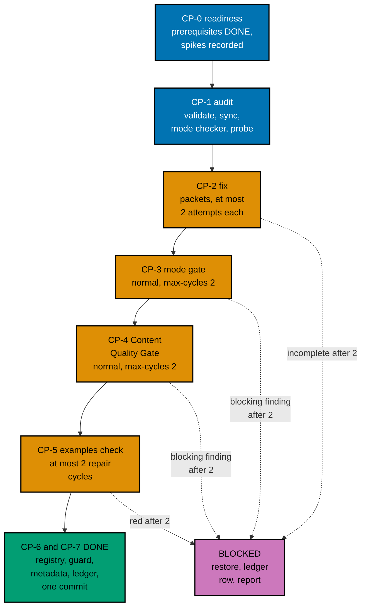
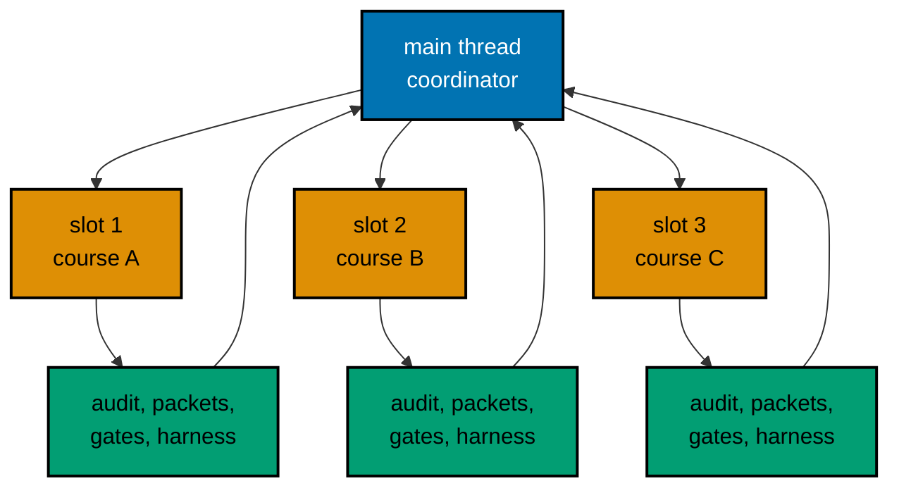

# 005 — Execution Model, Waves, and Ledger

Auditing 34 courses, and writing about 14 of them nearly from scratch, is most of this plan's work. This page
says in what order the courses are done, who works on each one, how every loop is bounded, what happens to a
course that cannot pass, where the record of it all lives, and how the work reaches `origin/main` in commits and
pushes. Execution starts only after the user's command and after plans 01 to 11 have merged (series decision 42).

## Roles and Slots

The repository runs `N+1` agents with `N = 3`: up to three background workers and one main thread that
orchestrates and stays free.

- **Main thread (the coordinator).** Starts jobs, reads their reports, runs the cheap commands, writes the ledger,
  makes every commit, edits every shared file, and talks to the user. It does not write course content.
- **Slot.** One of three background-agent places. A wave has at most three courses, so each course owns a slot for
  its whole stay in the wave. Wave 12 holds one course; its three slots work on three packets of that course.
- **Job.** One background agent run. A course passes through these jobs in its slot, one at a time:
  1. an **audit job** (CP-1): the mode checker over the course folder;
  2. one or more **packet jobs** (CP-2): `apps-ayokoding-www-by-example-maker` or
     `apps-ayokoding-www-annotated-concept-maker` for authoring gaps, `swe-developer` for units, `run.yaml`,
     expected files, determinism, and the simulation kit, and `tutorial-by-example-fixer` or
     `tutorial-annotated-concept-fixer` for findings;
  3. per gate cycle, a **checker job** and, if it finds blocking rows, a **fixer job** (the gate workflows define
     both);
  4. a **harness job** (CP-5) on the final text.
- **Spike jobs.** Phase 1 spikes (SP1 to SP5, SP12) and the in-wave spikes (SP6 to SP11, SP13) are run by
  `swe-developer` jobs and recorded by the coordinator ([004](./004-toolchain-additions-and-ci-budget.md#phase-1-spikes)).

Quality gates run only when someone asks for them by name. Executing this plan, once the user has given the
command, is that request. The gates' own ledgers under `local-tmp/quality/` are never committed; the plan's
ledger below records every verdict line.

The size classes ([002](./002-definition-of-done-and-audit-method.md#size-class-rule)) decide how a course is split into
packets. The plan makes no estimate of how long any course or wave will take; the ledger records measured time as
history only.

## Waves in Prerequisite Order

A course is audited only after every course it requires (inside these 34) is finished. The 34 courses fall into 12
waves of at most three, in the order below, derived from plan 02's revised prerequisites
([006](./006-prerequisites-metadata-and-closure.md#order-inside-the-plan)). Within the constraint, each wave mixes
heavy and light courses where the graph allows it, so a wave's slots finish at similar times.

| Wave | Courses                                                                                                                                  | Examples | Agents in parallel | Needs waves      | Checkpoint push after |
| ---- | ---------------------------------------------------------------------------------------------------------------------------------------- | -------- | ------------------ | ---------------- | --------------------- |
| 1    | `sql-essentials` (data); `data-structures-and-algorithms-essentials` (computer); `object-oriented-programming-essentials` (computer)     | 242      | 3                  | none             | no                    |
| 2    | `advanced-sql-and-query-performance` (data); `computer-science-foundations` (computer); `object-oriented-design-and-patterns` (computer) | 224      | 3                  | 1                | no                    |
| 3    | `software-architecture` (architecture); `programming-paradigms` (computer); `linux-os` (systems)                                         | 210      | 3                  | 1, 2             | yes                   |
| 4    | `concurrency-and-parallelism` (computer); `computer-architecture` (systems); `modern-system-programming` (systems)                       | 245      | 3                  | 1, 2, 3          | no                    |
| 5    | `domain-driven-design` (architecture); `functional-programming` (computer); `database-internals-and-storage-engines` (data)              | 240      | 3                  | 1, 2, 3          | no                    |
| 6    | `event-driven-architecture` (architecture); `networking-essentials` (systems); `advanced-algorithms` (computer)                          | 242      | 3                  | 1, 3             | yes                   |
| 7    | `capstone-solid-core` (architecture); `data-access-orms-and-query-builders` (data); `search-and-information-retrieval` (data)            | 203      | 3                  | 1, 2, 3, 4, 5, 6 | no                    |
| 8    | `system-programming` (systems); `distributed-systems` (architecture); `build-your-own-orm-and-query-builder` (data)                      | 241      | 3                  | 1, 2, 3, 4, 6, 7 | no                    |
| 9    | `actor-model-concurrency` (computer); `build-your-own-database` (data); `csp-style-concurrency` (computer)                               | 234      | 3                  | 1, 4, 5          | yes                   |
| 10   | `build-your-own-raft` (architecture); `advanced-networking` (systems); `nosql-databases` (data)                                          | 231      | 3                  | 1, 6, 8          | no                    |
| 11   | `system-design` (architecture); `graph-databases` (data); `data-engineering` (data)                                                      | 185      | 3                  | 1, 2, 10         | no                    |
| 12   | `windows-os` (systems)                                                                                                                   | 78       | 1                  | none             | yes                   |

Work by wave:

| Wave | Size classes | Words to write | Units to author |
| ---- | ------------ | -------------- | --------------- |
| 1    | M, M, M      | 0              | 8               |
| 2    | M, M, M      | 101            | 5               |
| 3    | L, L, XL     | 34,692         | 103             |
| 4    | L, L, XL     | 25,789         | 16              |
| 5    | L, L, L      | 23,523         | 8               |
| 6    | XL, L, L     | 17,132         | 96              |
| 7    | L, M, L      | 19,800         | 61              |
| 8    | XL, L, M     | 41,986         | 96              |
| 9    | L, XL, M     | 48,845         | 93              |
| 10   | XL, L, L     | 25,422         | 123             |
| 11   | L, M, S      | 15,871         | 16              |
| 12   | XL           | 17,594         | 87              |

The CI load by wave and the shard projection at each checkpoint are in
[004](./004-toolchain-additions-and-ci-budget.md#the-ci-budget).

Why the order is this one:

- **Wave 1** holds the three courses with no in-plan prerequisite that most others need: `sql-essentials` (nine
  courses require it), `data-structures-and-algorithms-essentials` (five), and
  `object-oriented-programming-essentials` (two). They are Python courses that need no service, so they are the
  first real test of the harness conversion with the fewest surprises.
- **Wave 2** adds the first service-backed course, `advanced-sql-and-query-performance` (PostgreSQL, required by
  six courses), which exercises the service lifecycle on CI at push 1; `computer-science-foundations` (the first
  Annotated Concept course, with its heading rename and diagram floor); and `object-oriented-design-and-patterns`.
- **Wave 3** holds `software-architecture` (needs the OO design course), `programming-paradigms`, and `linux-os`, the
  first of the six filler-baseline courses and the first C course, which proves the C sandbox rules (SP8) for
  `system-programming` in wave 8. Push 1 follows wave 3.
- **Waves 4 and 5** finish the courses whose prerequisites are done: concurrency (needs data structures and
  paradigms), computer architecture (needs the foundations), Rust systems programming, domain-driven design,
  functional programming, and database internals.
- **Wave 6** holds event-driven architecture, networking essentials (the first loopback-and-fixture course, SP7), and
  advanced algorithms. Push 2 follows it.
- **Waves 7 and 8** hold the courses with the most prerequisites: `capstone-solid-core` needs seven courses from
  waves 2 to 6; `distributed-systems` needs networking essentials and concurrency; `system-programming` needs
  `linux-os`; the ORM builder needs the ORM course.
- **Wave 9** holds actor model, build-your-own-database, and CSP: three simulation courses that need concurrency or
  database internals. Push 3 follows it.
- **Waves 10 and 11** hold the courses that depend on late waves and the heaviest CI load: Raft (needs distributed
  systems), advanced networking (needs networking essentials), NoSQL, system design (needs advanced networking and
  advanced SQL), graph databases, and data engineering.
- **Wave 12** holds `windows-os` alone. It has no in-plan prerequisite and no in-plan dependent, it is the only static
  course (SP11), and it is the lightest CI load, so the last push carries the least new risk.

**Why the NoSQL and graph courses are late.** They carry the new services and images, and the CI-heaviest load.
The new images are proved before any wave by their spikes and by fixture units in the CLI's own smoke course
(Phase 1), and the service lifecycle itself is exercised at wave 2 by PostgreSQL, so putting the two courses late
loses no early signal. Putting the heaviest CI courses at the end means their measured minutes replace the planning
figures last; the ladder is therefore decided in Phase 1 on the spike seconds and re-decided before every push.

A wave starts when every course in the waves it needs is **DONE** or **BLOCKED** (see below). A BLOCKED
prerequisite does not stop its dependents: their makers use the BLOCKED course's brief and the pages it has, and the
ledger notes the dependency.

## The Per-Course Pipeline

Every step is bounded. "Cycle" means one check-then-fix round. The user set the cap on 2026-10-09: every quality gate
and every maker-checker loop stops after **2 cycles** ("semua jadi 2 aja").

| Step                  | Who                                                                                                                                                                                        | Done when                                                                                                                                                                                                                                                                             | Cap                                                                          |
| --------------------- | ------------------------------------------------------------------------------------------------------------------------------------------------------------------------------------------ | ------------------------------------------------------------------------------------------------------------------------------------------------------------------------------------------------------------------------------------------------------------------------------------- | ---------------------------------------------------------------------------- |
| CP-0 Readiness        | The coordinator                                                                                                                                                                            | Every in-plan prerequisite is DONE or BLOCKED in the ledger; the spikes the brief names are recorded; for a service course the images it needs are built or its fallback is chosen                                                                                                    | -                                                                            |
| CP-1 Audit            | The coordinator runs `EX-VALIDATE` and `EX-SYNC`; the mode checker (`tutorial-by-example-checker` or `tutorial-annotated-concept-checker`) reads the course; the completion probe runs RED | Finding counts are in the ledger; the brief's expected classes are confirmed or the brief is edited where they differ materially; the prerequisite re-check ([006](./006-prerequisites-metadata-and-closure.md)) is recorded; for the six filler courses the `FILLER` row is recorded | One audit; a second only if the first was interrupted                        |
| CP-2 Fix              | Makers, `swe-developer`, and mode fixers, per the size class                                                                                                                               | Every defect class of the brief is closed; `EX-VALIDATE`, `EX-SYNC`, and `EX-CHECK` exit 0 on the packet owner's own run; every recorded expected file was read; `FILLER` shows no fired rule for the course                                                                          | 2 attempts per packet. A second attempt continues from the first one's files |
| CP-2b Filler baseline | The coordinator, six courses only                                                                                                                                                          | The course's entry is removed from `FILLER_BASELINE` and `FILLER_BASELINE_CAP` is lowered by one, in the course's commit; `REWRITTEN_FILLER_COURSES` is left alone (D12)                                                                                                              | -                                                                            |
| CP-3 Mode gate        | The Tutorial By Example or Annotated Concept Quality Gate                                                                                                                                  | `subject` = the course folder, `mode: normal`, `max-cycles: 2`; verdict `PASS` or `PASS_WITH_FINDINGS`, with no open `needs-decision` row                                                                                                                                             | 2 cycles (the gate's own input)                                              |
| CP-4 Content gate     | The Content Quality Gate                                                                                                                                                                   | The same inputs and rule                                                                                                                                                                                                                                                              | 2 cycles                                                                     |
| CP-5 Harness green    | The coordinator runs `EX-CHECK <slug>`; a repair goes back to the course's `swe-developer` packet                                                                                          | `EX-CHECK` exits 0                                                                                                                                                                                                                                                                    | 2 repair cycles                                                              |
| CP-6 Record           | The coordinator                                                                                                                                                                            | `estimatedHours` recomputed; `prerequisites` re-derived; the course's registry row added and `COMPLETION` green; `FILLER` green; path tests green after a prerequisite change                                                                                                         | -                                                                            |
| CP-7 Ledger, commit   | The coordinator                                                                                                                                                                            | A ledger row with every field below; one commit for the course                                                                                                                                                                                                                        | -                                                                            |

The harness also runs inside CP-2, because a packet owner must hand over code that works. CP-5 still runs after the
gates, because the gates' fixers may edit lessons or code; it is the step decision 27 names.

A gate verdict of `FAIL` or `BLOCKED` after its second cycle, or any open `needs-decision` finding (the gate adapter
routes an example count under its floor to `needs-decision`), makes the course BLOCKED. No verdict stops the wave.

### Completion Test First

CP-1 runs plan 11's completion test ([007](./007-testing-strategy.md)) with the course as a **probe row**: the
environment variable `AUDIT_PROBE=<slug>:<format>` adds the course to the registry for that run only, so nothing red
is ever written to the working tree. The probe run is **RED** for every course that does not yet meet its shape, and
the failing scenarios are recorded in the ledger. CP-2 to CP-5 make the probe **GREEN**. At CP-6 the coordinator adds
the real registry row and runs the test without the probe; it is committed together with the course, so no commit has
a red test, and a BLOCKED course leaves no row behind. This is the TDD loop for content. Phase 0 reads plan 11's
merged step files and uses their merged names for the registry, the probe variable, and the formats.

### Rules That Keep the Loop Bounded

1. **No new mode.** A maker may not switch a course's mode. A course that does not fit its mode after 2 cycles is
   BLOCKED and the question goes to the user (decision D11 keeps `advanced-networking` in Annotated Concept).
2. **No loosened check.** Never retry, sleep, widen, loosen, skip, or quarantine to get green. A flaky unit is fixed at
   its root cause. A harness defect is fixed in `apps/ayokoding-cli` with a regression test first (plan 05's M11), as
   its own commit, and the CLI is rebuilt before the course continues.
3. **Gate fixers touch the course folder only.** If a fixer's change breaks a unit, CP-5 catches it; the repair
   cycle goes to a `swe-developer` packet.
4. **Order of gates is fixed.** Mode gate, then Content Quality Gate, then the harness. A text change after CP-5 (for
   example from a late finding) re-runs `EX-SYNC` and `EX-CHECK`.
5. **The filler guard binds.** Plan 09's guard runs in `test:quick` (rules FILL1, FILL2, and SEC1 in the skill module
   `reference/course-quality-guards.md`; SEC1 does not apply to these courses). A rewritten course must pass its six
   rules, and the six courses in the baseline owned by this plan are removed from it at CP-2b ([007](./007-testing-strategy.md#the-filler-baseline-ratchet)).
6. **A fallback is not a block.** A store or image whose spike fails does not make the course BLOCKED: the units it
   needed become labelled models within the course's illustration budget, and the ledger records the fallback
   ([004](./004-toolchain-additions-and-ci-budget.md#this-plans-own-additions)).
7. **A simulation proves the model, not the world.** A model's lesson says so (rule TC1 of plan 11) and a unit that
   injects faults carries the invariants and seeds of its brief; a simulation unit with fewer than 32 seeds, no
   invariant, or an unlabelled model is a blocking finding.
8. **Authoring is split, not rushed.** An XL course is authored by learning page and again by blocks of at most 15
   examples; the course folder is committed only when every page and unit exists. A block is not handed on until
   `FILLER` shows no fired rule for it.

### Packet Template

Every packet prompt contains the same fields, so a packet can be run cold:

| Field           | Content                                                                                                                                           |
| --------------- | ------------------------------------------------------------------------------------------------------------------------------------------------- |
| Course and mode | The slug, the mode, the wave and slot                                                                                                             |
| Inputs          | The brief path in the plan, the definition of done (C1 to C11), the harness design (003), and the paths of the finished prerequisite courses      |
| Task            | The defect classes and units this packet owns (from the brief's checklist and the size class), including the seeds and invariants for simulations |
| Write set       | Files inside `apps/ayokoding-www/content/en/learn/courses/<slug>/` only; never any `_index.md` frontmatter, never `content/id/**`                 |
| Commands        | The `EX-*` commands, the formatter order, and the HIPPO tier for each                                                                             |
| Forbidden       | Staging, committing, pushing; weakening a check; a new mode, slug, or topic; a link into `local-tmp/` or `plans/`; a real network address         |
| Return          | The files written, the findings left open, the `EX-*` exit codes, and the measured seconds of the slowest unit                                    |

## Blocked Courses

A course is **BLOCKED** when a step reaches its cap without passing. The coordinator handles it in this order and then
reports to the user. The wave does not stop: the other courses continue.

1. **Save the partial work.** Copy the course folder to `local-tmp/ayokoding-learn/blocked/<slug>/` and run `diff -r`
   between the two folders; the diff must print nothing before the next step.
2. **Restore the baseline.** `rtk git restore -- <dir>` for tracked files; then a dry run `rtk git clean -n -d -- <dir>`,
   read the listed paths, and only then `rtk git clean -f -d -- <dir>` for the untracked ones. `rtk git status --short -- <dir>`
   prints nothing. For a filler-baseline course the baseline file is restored too (the entry and the cap).
3. **Write the ledger row**: state `BLOCKED`, the failing step, the open findings (the gate's ledger path and the
   blocking rows), the harness output, and the path of the saved partial work.
4. **Report to the user**: the course, the step that failed, the blocking findings in short, and the options below.
   The coordinator does not choose for them.
5. **The wave gate stays open** (the wave's last checklist items stay unticked) until the user decides.

Options the user can choose:

- **Retry** with a changed approach (a smaller example plan, a different design for the failing unit, or a repair of
  the cause in a shared kit). The course re-enters the pipeline with fresh budgets, and the decision is recorded in the
  ledger.
- **Defer** the course to a follow-up plan. Unlike an outline course, an existing course is already usable and on its
  paths, so deferral does not break a path, and the PR stays shippable. A deferred filler-baseline course keeps its
  entry, so the filler baseline then stays above 6 until plan 13 and the series end state is affected. It also means
  decision 40's share for this plan is below 34 of 34, so the user decides explicitly whether the PR ships without the
  course, and plan 14's terminal gate must hear about it. The plan does not pre-decide.
- **Stop** the plan.

The plan never narrows quietly: no lowered target recorded as done, no skipped gate, no unpublished course. A course
that depends on a BLOCKED course can still be audited (its prerequisite list is metadata).

## The Execution Ledger

The ledger is the running record of the waves. It lives in the execution worktree at
`local-tmp/ayokoding-learn/execution-ledger.md` (gitignored scratch, shared by the series), under the heading
`## Plan 12 — audit CS, systems, and data`. Phase 0 creates one `PENDING` row per course, in wave order.

| Field                       | Content                                                                                            |
| --------------------------- | -------------------------------------------------------------------------------------------------- |
| Wave and slot, course, mode | For example `3.3`, `linux-os`, By Example                                                          |
| State                       | `PENDING`, `IN-PROGRESS` (with the step and the cycle count), `DONE`, or `BLOCKED`                 |
| Agent IDs                   | Every audit, packet, checker, and fixer agent                                                      |
| Audit (counts)              | `EX-VALIDATE` and `EX-SYNC` findings, the mode checker's counts, and the probe's failing scenarios |
| Mode gate, content gate     | Verdict and cycle count of each                                                                    |
| Harness                     | `EX-CHECK` exit code, repair cycles, and the measured minutes                                      |
| Guard row                   | The course's row in the printed `FILLER` metrics table; for the six, the baseline edit             |
| Words, examples, diagrams   | The final counts                                                                                   |
| `estimatedHours`            | The recomputed value                                                                               |
| Fallbacks and spikes        | Any service or image that fell back, with the spike measurement                                    |
| Commit and notes            | Short SHA; open findings; a BLOCKED course's saved path                                            |

A second section of the ledger holds the CI figures: the spike seconds, the ladder rungs taken, and the measured
`EX-CHECK` minutes per finished course. At the end the coordinator copies the table (without scratch paths) into
`<plan>/evidence/execution-summary.md`, which is committed, so the record survives the worktree's cleanup.

### Resuming

A new session, or the same session after its context was compacted, resumes like this:

1. Read the ledger and `rtk git status --short`; reconcile them (a `DONE` row must have its commit; an `IN-PROGRESS`
   row must have an uncommitted course folder).
2. For each `IN-PROGRESS` row, read the packet owner's report if the agent ID is still readable; otherwise run
   `EX-VALIDATE`, `EX-SYNC`, and `EX-CHECK` for the slug and the completion test to see how far the course got, and
   restart from the first step that fails.
3. A course folder with an unfinished set of units is never committed: an opted-in course is all or nothing.
4. Never reset a cycle count, and never start an attempt that would exceed 2.

## Commits and Checkpoint Pushes

- **Course commits.** One commit per DONE course, made by the coordinator after CP-7, with the header
  `fix(ayokoding-www): audit <slug> course`. It stages explicit paths only: the course folder, the course's
  `_index.md` (for `prerequisites` and `estimatedHours`), the completion-test registry row, and any other metadata file
  CP-6 changed (a prerequisite edge or the AI manifest). A BLOCKED course is never in a commit. Plan 07 commits once
  per wave; this plan commits once per course because every course is independent, already shipping, and may be
  BLOCKED or deferred on its own, so a per-course commit keeps each one revertible (decision D2).
  - **The six filler-baseline courses** use the header `fix(ayokoding-www): rewrite <slug> course and leave the filler baseline`
    and also stage the baseline edit (the entry and the cap).
  - **`capstone-solid-core`** uses the header `feat(ayokoding-www): restructure capstone-solid-core to the capstone contract`.
- **Harness commits.** A harness or workflow change (the ladder's rungs 2t, 2b, 2c, 3, 2d, or an M11 fix) is its own
  commit, `fix(ayokoding-cli): ...` or `ci(ayokoding-www): ...`, with its regression test. The toolchain additions
  are one commit, `feat(ayokoding-cli): add NoSQL, Gremlin, and GDS toolchains`, made in Phase 1 before the first
  push.
- **Checkpoint pushes.** After waves 3, 6, 9, and 12 the branch is pushed. The first push opens a **draft** pull
  request. Each push first passes the per-commit push leak review. The current head's CI must be green before the
  next wave starts, so a harness or lockfile problem on the CI runner (for example amd64 versus arm64 wheel hashes
  for the course locks, or a service that starts slowly on the runner) surfaces at wave 3 and not at the end. CI is
  polled every 2 minutes; `gh run watch` is not used.
- **Merging `origin/main`.** Before each wave, fetch and, if `origin/main` moved, read the full diff of the new
  commits, reconcile, and merge (not rebase) so pushed history is stable. The series runs plans strictly one after
  another, so a moved `origin/main` is a hotfix or a bot, not another plan.
- **PR size.** The PR will change about 9,000 to 11,000 files (a planning estimate: 2,863 units at about
  3 files each, plus 367 lesson pages and indexes), far above the 3,000 files that GitHub's pull-request files view
  and files API list. The PR gate reads git base and head SHAs and formats every changed path, so the gate is not
  limited by that listing. Reviewers read commit by commit: one commit per course keeps each review small. Phase 2
  probes the limits when it opens the draft PR at push 1 and records what the page shows.
- **CI time.** Each push runs the examples check on every finished course; the longest-shard projection for each push
  is in [004](./004-toolchain-additions-and-ci-budget.md#the-ci-budget), and the ladder is re-decided before every
  push on measured minutes.

## Agent Topology

- **Never shared.** Two agents never write the same file. A slot writes only inside its course folder. The coordinator
  alone edits shared files: each `_index.md`, the completion-test registry, the filler baseline, the harness workflow
  and CLI, the toolchain catalog, the ledger, and every commit.
- **Compute.** Every command runs through `rtk ./hippo run ...` with the tier in the Command Reference of
  [../delivery.md](../delivery.md). Independent compute from different slots overlaps only through HIPPO admission.
  The dependency, shared-output, byte-identity, and correctness edges stay serial: the lockfile bytes of one course,
  one environment image per lockfile, one service image build, the recording of one unit's expected files, the
  ledger, and the course commit.
- **What the coordinator checks between waves.** Every course in the wave is DONE or BLOCKED with a ledger row;
  `EX-CHECK` still exits 0 for every DONE course of the wave; `rtk git status --short` shows only the wave's course
  folders and shared files; `rtk git status --short -- apps/ayokoding-www/content/id` is empty (restore with
  `rtk git checkout -- apps/ayokoding-www/content/id` if not); the quick suite runs at each checkpoint push.
