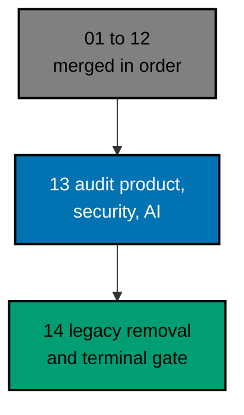

# AyoKoding Learn Revamp 13 — Audit of Product, Security, and AI Courses

> **Status:** Backlog. Do not execute until both are true: the user gives an explicit execution command, and plans 01
> to 12 of this series have merged to `origin/main`. The 14 plans run strictly one after another (series decision 42),
> so plan 12 is merged, deployed, verified, and cleaned up before this plan starts.
>
> **Plan quality gate:** not run yet, so no verdict exists. By the user's decision of 2026-10-09 it was not run while
> the plan was written; it runs at the start of execution, as the first item of Phase 0 in
> [delivery.md](./delivery.md#phase-0-worktree-environment-preconditions-and-baseline), with `max-cycles` 2.

AyoKoding has 45 courses on application development, AI engineering, product and leadership, interview preparation,
and security that are real courses, already on learning paths, but that do not meet the series definition of done. On
2026-10-09 they held 1,136,652 words and 2,328 code files. 27 of them were short of their word
floor by 476,972 words in all. None had a `run.yaml`, so nothing proved that any example runs. 755 code fences
and 1,064 output blocks were not tied to a file, and 326 anchors disagreed with the files they point
at. This is the last audit plan of the series. It audits all 45 and fixes them in place, so that every course is
complete, checked by its mode's quality gate and the Content Quality Gate, and green in plan 05's code harness, and it
proves the series end state for them: harness coverage complete and the filler baseline empty.

## Scope

- **Audit and fix 45 existing courses** to the series definition of done (decisions 26 to 29): 16 in application
  development, 14 in AI engineering, 5 in product and leadership, 5 in interview preparation, and 5 in security.
  Each keeps its slug and its place in every path; each meets its mode's floors for words, examples, diagrams, "Why It
  Matters", annotation, and a five-section drilling page of at least 5,000 words. The audit is measured and in place,
  not a rewrite. See [tech-docs/002](./tech-docs/002-definition-of-done-and-targets.md).
- **Bring every example green in the harness.** 2,831 units (1,007 to create, 1,824 to convert) get a
  deterministic `run.yaml` and recorded output; lessons are tied to their files. Three mobile and desktop courses use
  `mode: static` for code that needs Android, Apple, or Windows frameworks, and say what the static run proves. Thirteen
  small spikes prove the hard cases first. See [tech-docs/003](./tech-docs/003-harness-conversion-design.md).
- **Keep AI examples offline and AI facts honest.** The 13 AI courses with code run on a scripted model and stored
  responses, with no key and no network; every changeable fact is dated and sourced at fix time, and a freshness pass
  re-checks the oldest at the end. See [tech-docs/011](./tech-docs/011-ai-fixtures-and-sourcing-policy.md).
- **Keep security examples safe.** Six courses run attacks, detections, and sandboxes in process on synthetic data
  behind a stated boundary, and a tested scan keeps them free of sockets, shells, and real addresses. See
  [tech-docs/012](./tech-docs/012-safe-lab-and-content-safety-rules.md).
- **Fit the CI budget.** The plan measures its cost, carries a response ladder (more shards, a longer timeout), and
  adds no toolchain unless a budget rule passes. See
  [tech-docs/004](./tech-docs/004-toolchain-additions-and-ci-cost.md).
- **Keep prerequisites, the AI path, and the capstones correct.** Plan 02's lists are re-checked per course; eight
  courses sit in the AI Engineer core, and a change that would alter that core is raised to the user, not made. Six
  capstones name 14 of these courses, so every `## What this course relies on` row is re-read. Two of the three capstones
  of this plan gain a `learning/` folder. See
  [tech-docs/005](./tech-docs/005-prerequisites-ai-path-and-capstone-integrity.md).
- **Guard the end state** (decision 40): the audited-course completion test gains its tenth scenario, a new content
  safety feature has four scenarios, six courses leave plan 09's filler baseline (which ends empty), and the series
  harness coverage gate is proved: 37 of 37 applicable courses covered, 8 no-code courses accounted for. See
  [tech-docs/007](./tech-docs/007-testing-strategy.md).

## Non-Goals

- New courses and new topics (plans 06 to 10), and the other pre-existing courses (plans 11 and 12).
- The seven courses of these categories that plans 08 and 09 own, listed in
  [tech-docs/001](./tech-docs/001-current-state-and-partition.md#the-partition).
- Any path manifest, phase, or membership change, except the AI manifest on the exception in
  [tech-docs/005](./tech-docs/005-prerequisites-ai-path-and-capstone-integrity.md#the-ai-engineer-path-core).
- Any toolchain addition by default, any change to plan 05's contract, and any weakening of a harness check.
- A CI step that runs the coverage gate on every pull request (an optional ratchet, decision D18).
- Deleting `learn/legacy`, redirects, and link repointing: plan 14 owns them.
- Indonesian content: `content/id/**` stays untouched (decision 35).

## Dependency and Result

The series runs strictly in order, one plan, one worktree, and one PR at a time (series decision 42), so plans 01 to 12
are all merged when this plan starts. It builds directly on plan 03 (course metadata) and plan 05 (the code harness),
and it respects plan 02's prerequisites and path integrity, plan 08's AI path and capstone contract, plan 09's filler
guard and safe-lab rules, and the registry, completion test, and CI decisions of plans 11 and 12.

## Series Context

This plan is row 13 of the 14-plan **AyoKoding Learn Revamp** series. Each plan is one PR delivered from its own
worktree, and the plans run strictly in numeric order; the "Depends on" column shows which earlier plans each one builds
on. The user resolved the series decisions on 2026-10-09; every decision this plan relies on is copied into
[brd.md](./brd.md#resolved-series-decisions-this-plan-relies-on).

| NN  | Plan suffix                             | Scope                                                                                        | Depends on                     |
| --- | --------------------------------------- | -------------------------------------------------------------------------------------------- | ------------------------------ |
| 01  | `navigation-and-display`                | Strip `NN ·` title prefixes; path position numbers; sidebar auto-scroll; render fixes        | —                              |
| 02  | `path-model`                            | Phases, goals, `assumes`, outline marker, prerequisite revision, closure checks, career copy | 01                             |
| 03  | `catalog-and-metadata`                  | Course metadata schema and backfill, categories, catalog page, course landing header         | 01                             |
| 04  | `learning-experience`                   | Browser progress, phase roadmap page, context bar, mark complete, Learn home                 | 02, 03                         |
| 05  | `code-harness`                          | `ayokoding-cli`, `run.yaml` contract, runners, Nx target, CI, quality-gate propagation       | —                              |
| 06  | `accounting-courses`                    | Write 24 accounting courses; restructure both accounting paths in the same PR                | 02, 03, 05                     |
| 07  | `erp-courses`                           | Write 30 ERP courses; restructure both ERP paths in the same PR                              | 06                             |
| 08  | `capstone-courses`                      | Rewrite 8 skeleton capstones                                                                 | 02, 03, 05                     |
| 09  | `filler-rewrites`                       | Rewrite 8 templated filler courses                                                           | 03, 05                         |
| 10  | `legacy-unique-migration`               | Build courses for legacy topics without an equivalent; record the legacy-to-course map       | 03, 05                         |
| 11  | `audit-languages-and-tooling`           | Audit and fix language and tooling courses                                                   | 03, 05                         |
| 12  | `audit-cs-systems-and-data`             | Audit and fix CS, systems, concurrency, distributed, database, and data courses              | 05                             |
| 13  | `audit-product-security-ai` (this plan) | Audit and fix web, backend, mobile, security, AI, testing, architecture, product courses     | 03, 05 (01 to 12 merged first) |
| 14  | `legacy-removal`                        | Delete `learn/legacy`, add 308 redirects, repoint `docs/` links, update specs and tests      | 10 (+11–13 done)               |

## How the Work Runs

The 45 courses are audited in 15 waves in prerequisite order, by at most three background agents at a time. Each
course goes audit, fix, mode quality gate, Content Quality Gate, and harness green, and every loop stops after 2 cycles
(the user's cap, 2026-10-09: "semua jadi 2 aja"). A course that still fails is marked BLOCKED, restored to its
baseline, reported, and the wave moves on; the user decides whether to retry, defer, or stop. A safety finding in a
security course is never waived by the cap. Each finished course is one commit, and the branch is pushed five times, with
a draft PR from the first push, so CI problems surface early. See
[tech-docs/006](./tech-docs/006-execution-model.md).

## Flags for the User

These are choices the plan made and documented; none needs an answer before execution, and each can be reversed.

- **Scale.** The plan writes about 487,871 words and 2,831 units across 45 courses (13 of them size XL),
  in one PR of an estimated 9,000 to 11,000 changed files. The plan reports this and keeps the waves as the seam if you
  prefer a split into several PRs (decision D7).
- **Two interview courses change format.** `behavioral-and-leadership-interviews` and `system-design-interview` are
  recorded as Annotated Concept but have no code, so they become no-code Annotated Concept (decision D3).
- **No toolchain is added by default.** A headless Chromium for `frontend-essentials`, a Python type checker, a headless
  GUI toolkit, and the Android SDK are written down as candidates with fallbacks and are NO-GO unless a measured budget
  rule passes (decisions D5 and D9).
- **Static means parsed, not built.** Android, iOS, and Windows code that needs platform frameworks is checked
  statically, and the lessons say so beside each file.
- **One end-to-end binding may be exempted.** When the last course without a `learning/` folder gains one, the E2E case
  of "Start falls back to the course overview" has no real course left to open; the plan exempts that binding with a
  reason and keeps its Unit proof (decision D15).
- **Plan 08's capstone test gains three slugs**, and the full-stack capstone adds one byte-identity pair for its API
  contract (decision D8).
- **A new test file guards safety.** `course-content-safety.feature` has four scenarios; it extends plan 09's
  reserved-address rule to six courses through a scenario of its own, without editing plan 09's feature (decision D13).
- **AI facts age after merge.** The plan dates and sources each changeable claim and runs a freshness pass, but it
  cannot promise a claim is still true after the merge; a follow-up refresh is the place for that.
- **The coverage ratchet is not built.** The plan proves the series coverage gate with the existing command; a CI step
  that runs it on every pull request is a product decision you can take after plan 14 (decision D18).
- **No plan quality gate verdict exists.** The gate runs first in Phase 0 at execution time.

## Navigation

- [Business requirements](./brd.md)
- [Product requirements, Gherkin, and UI design funnel](./prd.md)
- [Technical design](./tech-docs/README.md)
- [Syllabus corpus (45 course briefs and a path note)](./syllabus/README.md)
- [Delivery checklist](./delivery.md)
- [Execution learnings](./learnings.md)
