# Delivery Plan — AyoKoding Learn Revamp 13: Audit of Product, Security, and AI Courses

> **Legend** — `[AI]`: an agent performs the step (the default; unmarked steps are `[AI]`).
> `[HUMAN]`: only a human can do it (physical action, out-of-band approval, real-secret or
> privileged-credential handling). `[AI+HUMAN]`: agent prepares, human approves or finishes.

**Do not start** until both are true: (1) the user gives an explicit execution command for this
plan — that command authorizes this plan's change set (commits, pushes, PR, merge, and the deploy
described below); (2) plans 01 to 12 of this series have merged to `origin/main`, deployed, been
verified, and had their worktrees cleaned up. The series runs strictly one plan at a time (series
decision 42), so no other series plan runs while this one does, and no rebase between plans is
needed. The user's words (2026-10-09): "jangan kerjain/implement plan ini sebelum gw
kasih perintah buat eksekusi ya" (do not implement this plan until I give the command to execute it).

**Plan quality gate:** not run yet, so no verdict exists. By the user's decision of 2026-10-09 it was
not run while the plan was written. It runs at the start of execution, as the first item of
[Phase 0](#phase-0-worktree-environment-preconditions-and-baseline), with `max-cycles` 2; its verdict
line is recorded here only then.

## Worktree

- **Execution worktree:** `worktrees/ayokoding-learn-revamp-13-audit-product-security-ai/`
- **Provisioning command** (from the repository root, at Step 0):
  `claude --worktree ayokoding-learn-revamp-13-audit-product-security-ai`, or the equivalent
  `rtk git worktree add -b ayokoding-learn-revamp-13-audit-product-security-ai-base worktrees/ayokoding-learn-revamp-13-audit-product-security-ai origin/main`.
- **Provisioning status:** pending
- **Authoring-worktree exception:** this plan was authored inside the separate authoring worktree
  `.claude/worktrees/ayokoding-update` (branch `worktree-ayokoding-update`). The user required that
  session to write all plans of the AyoKoding Learn Revamp series together and not to execute any of
  them before the user's command. That authoring worktree is **never** used for execution. The
  Provisioned Worktree Identity and the Delivery Branch Inventory are intentionally omitted until
  Step 0 creates them.
- **Step 0 obligation (blocking):** Phase 0's first outcome after the plan quality gate provisions
  the execution worktree from
  fresh `origin/main` per the
  [Worktree Path Convention](../../../repo-governance/conventions/structure/worktree-path.md),
  initializes it per
  [Worktree Toolchain Initialization](../../../repo-governance/development/workflow/worktree-setup.md),
  writes the immutable identity and the first inventory row into this section, replaces
  `Provisioning status: pending` with `Provisioning status: provisioned`, and syncs with
  `origin/main`. No implementation step may start while the status is pending.
- **Cleanup:** after the PR merges, the worktree, its branches, and this plan's scratch come down
  through [Dev Artifact Clean-Up](../../../repo-governance/workflows/maintenance/dev-artifact-clean-up.md)
  (Phase 12).
- **Worktree cap:** one worktree for this plan in this repository, reused by every phase.

The plan never records an absolute or machine-specific path. Resolve the declared route at runtime
and reconcile it with `rtk git worktree list --porcelain`.

## Delivery Mode: worktree-to-pr

`worktree-to-pr` is mandatory in this repository. One branch and **one PR** deliver the whole plan
(the series rule "one plan = one PR"). The PR is opened as a **draft** at the first checkpoint push (Phase 2),
and marked ready in Phase 12. It needs the exact current-head/base `Quality gate` from
`.github/workflows/pr-quality-gate.yml` and an exact-head posted `pr-leak-review` `pass` (`leak-review`
status). Broad semantic PR review is not run unless the user asks for it. `[AI]` merges once the hardened
merge preconditions hold.

## Parallelization Model

The 45 courses are audited in 15 waves of at most three courses
([tech-docs/006](./tech-docs/006-execution-model.md)). Inside a wave, up to three background agents each own one
course; a wave starts only when every course of the waves it needs is DONE or BLOCKED. Every shared file
(registry, filler baseline, capstone constant, safety scan, indexes, the harness and workflow, the ledger, every commit)
is touched by the coordinator alone.

```mermaid
%% Color Palette: Blue #0173B2, Orange #DE8F05, Teal #029E73, Purple #CC78BC
flowchart TD
  accTitle: Plan 13 execution order
  accDescr: Phase 0 sets up and records a baseline. Phase 1 scaffolds the content-safety test, runs the harness spikes, and measures the CI cost. Phases 2 to 6 audit the courses in fifteen waves of up to three agents, with a checkpoint push after waves 3, 6, 9, 12, and 15. A human stop resolves blocked courses. Then the registry, rules, and docs are completed, the end-state gate proves the series coverage share, and manual verification, knowledge capture, and the delivery boundary run in order.
  P0["0 setup and baseline"] --> P1["1 safety test,<br/>spikes, CI<br/>measurement"]
  P1 --> P2["2 waves 1-3<br/>push 1 (draft PR)"]
  P2 --> P3["3 waves 4-6<br/>push 2"]
  P3 --> P4["4 waves 7-9<br/>push 3"]
  P4 --> P5["5 waves 10-12<br/>push 4"]
  P5 --> P6["6 waves 13-15<br/>push 5"]
  P6 --> P7["7 human stop:<br/>BLOCKED and<br/>decisions"]
  P7 --> P8["8 registry complete,<br/>rules, docs"]
  P8 --> P9["9 end-state gate"]
  P9 --> P10["10 manual<br/>verification"]
  P10 --> P11["11 knowledge capture"]
  P11 --> P12["12 boundary:<br/>archive, PR,<br/>merge, cleanup"]

  classDef serial fill:#0173B2,stroke:#000000,color:#FFFFFF,stroke-width:2px
  classDef parallel fill:#CC78BC,stroke:#000000,color:#000000,stroke-width:2px
  classDef human fill:#DE8F05,stroke:#000000,color:#000000,stroke-width:2px
  classDef gate fill:#029E73,stroke:#000000,color:#000000,stroke-width:2px
  classDef default fill:#FFFFFF,stroke:#000000,color:#000000
  class P0,P1,P8 serial
  class P2,P3,P4,P5,P6 parallel
  class P7 human
  class P9,P10,P11,P12 gate
```

### Delivery Boundaries

| Phase(s) | Natural cohesive seam                                                           | Worktree                                                         | Branch                                                | Delivery opportunity                                            | Exact resulting `main` / rollback / feature-flag evidence                                                                                                                                                                                                                                                                                                                                                                                                                                                          |
| -------- | ------------------------------------------------------------------------------- | ---------------------------------------------------------------- | ----------------------------------------------------- | --------------------------------------------------------------- | ------------------------------------------------------------------------------------------------------------------------------------------------------------------------------------------------------------------------------------------------------------------------------------------------------------------------------------------------------------------------------------------------------------------------------------------------------------------------------------------------------------------ |
| 0        | — (setup and baseline)                                                          | —                                                                | —                                                     | none                                                            | No resulting state change; no PR; flag not applicable                                                                                                                                                                                                                                                                                                                                                                                                                                                              |
| 1–12     | Audited courses with their harness units, guards, and rules (one delivery unit) | `worktrees/ayokoding-learn-revamp-13-audit-product-security-ai/` | `ayokoding-learn-revamp-13-audit-product-security-ai` | Draft PR opened at Phase 2 push 1; ready and merged in Phase 12 | `main` gets the audited courses (up to 45), their units, the tenth completion scenario and registry rows, the content-safety test, the six filler-baseline removals (the baseline ends empty), rules AF1, AF2, SF1, and SF2, the capstone constant additions, any Start-button exemption, and any CI ladder change together. Rollback: revert the merge commit in a revert PR; every course returns to its pre-audit state. Feature-flag lifecycle: not applicable, because no flag is created; nothing to remove. |

### Agent Topology

- **Main thread (coordinator):** owns the execution ledger, every gate record, every commit, index generation,
  and every shared file. It keeps itself free and fills background slots first.
- **At most 3 background agents at any time** (N = 3):
  - Phases 2–6: per course, a mode checker for CP-1 (`tutorial-by-example-checker` or
    `tutorial-annotated-concept-checker`), the maker named in each course block
    (`apps-ayokoding-www-by-example-maker` or `apps-ayokoding-www-annotated-concept-maker`) for authoring gaps,
    `swe-developer` for units, `run.yaml`, expected files, fixtures, and determinism, and the mode's fixer
    (`tutorial-by-example-fixer` or `tutorial-annotated-concept-fixer`) for gate findings. The gates run the
    checker and fixer agents their workflows name, then `content-checker` and `content-fixer`. Each agent writes
    only inside `apps/ayokoding-www/content/en/learn/courses/<slug>/`.
  - Phase 1: `swe-developer` for the content-safety test, the scanner, the spikes, and any ladder change (Go and
    workflow); `specs-maker` for the Gherkin.
  - Phase 8: `rules-maker`, then `docs-fixer` and `readme-fixer`.
- Record every agent ID, its file set, its step, and its cycle count in the execution ledger.

### Execution Packet Defaults

- **Plan path after promotion:** `plans/in-progress/ayokoding-learn-revamp-13-audit-product-security-ai/`
  (written below as `<plan>/`). Evidence goes to `<plan>/evidence/`.
- **Execution ledger:** `local-tmp/ayokoding-learn/execution-ledger.md` in the execution worktree,
  under the heading `## Plan 13 — audit product, security, and AI`, with the fields in
  [tech-docs/006](./tech-docs/006-execution-model.md#the-execution-ledger). Other scratch (raw output, spike
  units, the saved partial work of BLOCKED courses) lives in `local-tmp/ayokoding-learn/plan-13/` and
  `local-tmp/ayokoding-learn/blocked/` (gitignored).
- **No ad-hoc scripts (series decision 37).** Checks run through the app's tests and `ayokoding-cli`.
  Read-only inspection with `rtk git grep`, `rtk git diff`, `rtk git ls-tree`, and `rtk wc -w` is fine.
- **Evidence hygiene:** evidence files contain repository-relative paths only. Never paste an
  absolute home-directory path, a hostname, a token, or `.env*` content.
- **Never commit** `apps/ayokoding-www/next-env.d.ts` (the dev server rewrites it) or
  `.serena/project.yml`. Before every commit run `rtk git status --short` and restore either file with
  `rtk git checkout -- <file>` if it shows as modified.
- **Indonesian content stays untouched (decision 35).** `GEN-INDEXES` and `DEV` regenerate indexes for
  both locales. After each run, `rtk git status --short -- apps/ayokoding-www/content/id` must be
  empty; if not, run `rtk git checkout -- apps/ayokoding-www/content/id`.
- **Never touch** `.env.prod` or `.env.stag`. If the dev server needs a variable, copy the key from
  `apps/ayokoding-www/.env.example` into an uncommitted `apps/ayokoding-www/.env.local`.
- **No git identity changes.** Never run `git config user.*`. Never use a bare `git stash`.
- **No real network, model, credential, or target.** A packet never calls a hosted model, never reads a credential,
  and never touches a real host. AI units use the scripted model of
  [tech-docs/011](./tech-docs/011-ai-fixtures-and-sourcing-policy.md); security units follow
  [tech-docs/012](./tech-docs/012-safe-lab-and-content-safety-rules.md). Fact-checking an AI claim against its primary
  source on the day it is written is the one place a packet reads the web, and it records the source and the date.
- **Bounded loops (user, 2026-10-09: "semua jadi 2 aja"):** every quality gate runs with
  `max-cycles: 2`, and every maker→checker loop runs at most 2 cycles. A course still failing after
  its second cycle is **BLOCKED**: restore it, record it in the ledger, report it to the user, and move on. Any
  other file still failing after its second cycle is recorded as BLOCKED and the phase gate stays open
  until the user decides. A safety finding in a security course is never waived by the cap.
- **Failure handling:** on any unexpected failure, save the output to the phase evidence file, fix the
  root cause (never skip, retry-until-green, loosen, widen, quarantine, or delete a test), rerun the same
  command, and note the fix. A harness defect is fixed in `apps/ayokoding-cli` with a regression test
  (plan 05's M11), never by weakening a course check.
- **Planning figures are not estimates.** Every CI minute in this plan is a planning figure with invented
  per-invocation seconds. Phase 1 replaces them with measurements, and every ladder decision is taken on the
  measured numbers.

> **Important**: Fix ALL failures found during quality gates, not just those caused by your
> changes. This follows the root cause orientation principle — proactively fix preexisting
> errors encountered during work.

### Command Reference

Run every command from the execution worktree root. Expected results are stated at each use.

| Name                               | Command                                                                                                                                                                                                                                                                                                                                                                                                                                           |
| ---------------------------------- | ------------------------------------------------------------------------------------------------------------------------------------------------------------------------------------------------------------------------------------------------------------------------------------------------------------------------------------------------------------------------------------------------------------------------------------------------- |
| `UNIT-FE <file>`                   | `rtk ./hippo run --class ephemeral --resource-tier standard --disk-path . --cwd apps/ayokoding-www -- npx vitest run --project unit-fe <file>`                                                                                                                                                                                                                                                                                                    |
| `UNIT-NODE <files>`                | `rtk ./hippo run --class ephemeral --resource-tier standard --disk-path . --cwd apps/ayokoding-www -- npx vitest run --project unit <files>`                                                                                                                                                                                                                                                                                                      |
| `COMPLETION`                       | `UNIT-NODE tests/unit/be-steps/audited-course-completion.steps.ts`                                                                                                                                                                                                                                                                                                                                                                                |
| `COMPLETION-PROBE <slug> <format>` | `rtk ./hippo run --class ephemeral --resource-tier standard --disk-path . --cwd apps/ayokoding-www -- env AUDIT_PROBE=<slug>:<format> npx vitest run --project unit tests/unit/be-steps/audited-course-completion.steps.ts` (adds one probe row for this run only)                                                                                                                                                                                |
| `SAFETY`                           | `UNIT-NODE tests/unit/be-steps/course-content-safety.steps.ts tests/unit/be-steps/course-safety-scan.unit.test.ts` (the four safety scenarios and the scanner's helper test)                                                                                                                                                                                                                                                                      |
| `SAFETY-PROBE <slug> <format>`     | `rtk ./hippo run --class ephemeral --resource-tier standard --disk-path . --cwd apps/ayokoding-www -- env AUDIT_PROBE=<slug>:<format> npx vitest run --project unit tests/unit/be-steps/course-content-safety.steps.ts` (adds one probe row for this run only)                                                                                                                                                                                    |
| `CAPSTONE-SHAPE`                   | `UNIT-NODE tests/unit/be-steps/capstone-course-completion.steps.ts` (plan 08's capstone content-shape test; use the merged name recorded in Phase 0)                                                                                                                                                                                                                                                                                              |
| `LANDING-HEADER`                   | `UNIT-FE tests/unit/fe-steps/course-landing-header.steps.tsx` (the Unit binding of the Start-button cases)                                                                                                                                                                                                                                                                                                                                        |
| `FILLER`                           | `UNIT-NODE tests/unit/be-steps/course-filler.steps.ts` (plan 09's guard; the verbose reporter prints the metrics table for every course)                                                                                                                                                                                                                                                                                                          |
| `PATH-TESTS`                       | `UNIT-NODE tests/unit/features/course-paths/manifests/path-model-integrity.unit.test.ts tests/unit/features/course-paths/manifests/manifest-membership.unit.test.ts tests/unit/features/course-paths/manifests/careers/careers-ai-manifest.unit.test.ts tests/unit/features/course-paths/manifests/careers/career-goals.unit.test.ts tests/unit/features/content/course-frontmatter.unit.test.ts` (use the merged file names recorded in Phase 0) |
| `META`                             | `UNIT-NODE tests/unit/be-steps/course-metadata.steps.ts` (plan 03's drift test; prints the expected `estimatedHours` and checks `format` values)                                                                                                                                                                                                                                                                                                  |
| `QUICK`                            | `rtk ./hippo run --class ephemeral --resource-tier standard --disk-path . -- npm exec nx -- run ayokoding-www:test:quick`                                                                                                                                                                                                                                                                                                                         |
| `INTEGRATION`                      | `rtk ./hippo run --class ephemeral --resource-tier heavy --disk-path . -- npm exec nx -- run ayokoding-www:test:integration`                                                                                                                                                                                                                                                                                                                      |
| `BEHAVIOUR`                        | `rtk ./hippo run --class ephemeral --resource-tier standard --disk-path . -- npm exec nx -- run ayokoding-www:test:coverage:behaviour`                                                                                                                                                                                                                                                                                                            |
| `E2E-BEHAVIOUR`                    | `rtk ./hippo run --class ephemeral --resource-tier standard --disk-path . -- npm exec nx -- run ayokoding-www-fe-e2e:test:coverage:behaviour`                                                                                                                                                                                                                                                                                                     |
| `BE-E2E-BEHAVIOUR`                 | `rtk ./hippo run --class ephemeral --resource-tier standard --disk-path . -- npm exec nx -- run ayokoding-www-be-e2e:test:coverage:behaviour`                                                                                                                                                                                                                                                                                                     |
| `E2E-QUICK`                        | `rtk ./hippo run --class ephemeral --resource-tier standard --disk-path . -- npm exec nx -- run ayokoding-www-fe-e2e:test:quick`                                                                                                                                                                                                                                                                                                                  |
| `E2E`                              | `rtk ./hippo run --class ephemeral --resource-tier heavy --disk-path . -- npm exec nx -- run ayokoding-www-fe-e2e:test:e2e`                                                                                                                                                                                                                                                                                                                       |
| `BUILD`                            | `rtk ./hippo run --class ephemeral --resource-tier heavy --disk-path . -- npm exec nx -- run ayokoding-www:build`                                                                                                                                                                                                                                                                                                                                 |
| `GEN-INDEXES`                      | `rtk ./hippo run --class transactional --resource-tier standard --disk-path . -- npm exec nx -- run ayokoding-www:generate-indexes`                                                                                                                                                                                                                                                                                                               |
| `VALIDATE-INDEXES`                 | `rtk ./hippo run --class ephemeral --resource-tier standard --disk-path . -- npm exec nx -- run ayokoding-www:validate-indexes`                                                                                                                                                                                                                                                                                                                   |
| `DEV`                              | `rtk ./hippo run --class service --resource-tier standard --disk-path . -- npm exec nx -- dev ayokoding-www` (serves `http://localhost:3101`)                                                                                                                                                                                                                                                                                                     |
| `LINT-MD`                          | `rtk npm run lint:md`                                                                                                                                                                                                                                                                                                                                                                                                                             |
| `CLI-BUILD`                        | `rtk ./hippo run --class ephemeral --resource-tier standard --disk-path . -- npm exec nx -- run ayokoding-cli:build`                                                                                                                                                                                                                                                                                                                              |
| `CLI-QUICK`                        | `rtk ./hippo run --class ephemeral --resource-tier standard --disk-path . -- npm exec nx -- run ayokoding-cli:test:quick`                                                                                                                                                                                                                                                                                                                         |
| `CLI-E2E`                          | `rtk ./hippo run --class ephemeral --resource-tier heavy --disk-path . -- npm exec nx -- run ayokoding-cli:test:e2e`                                                                                                                                                                                                                                                                                                                              |
| `CLI <args>`                       | `rtk ./hippo run --class ephemeral --resource-tier heavy --disk-path . -- apps/ayokoding-cli/dist/ayokoding-cli <args>`                                                                                                                                                                                                                                                                                                                           |
| `FIXTURE <args>`                   | `CLI --content apps/ayokoding-cli/tests/testdata/courses <args>`                                                                                                                                                                                                                                                                                                                                                                                  |
| `SMOKE`                            | `CLI --content apps/ayokoding-cli/tests/testdata/toolchain-smoke examples check --all`                                                                                                                                                                                                                                                                                                                                                            |
| `TC-LIST`                          | `CLI toolchains list`                                                                                                                                                                                                                                                                                                                                                                                                                             |
| `TC-BUILD <id>`                    | `CLI toolchains build <id>`                                                                                                                                                                                                                                                                                                                                                                                                                       |
| `EX-VALIDATE <slug>`               | `CLI examples validate --course <slug>`                                                                                                                                                                                                                                                                                                                                                                                                           |
| `EX-SYNC <slug>`                   | `CLI examples sync --course <slug>`                                                                                                                                                                                                                                                                                                                                                                                                               |
| `EX-SYNC-WRITE <slug>`             | `CLI examples sync --course <slug> --write` (repairs anchored fences from their files)                                                                                                                                                                                                                                                                                                                                                            |
| `EX-RECORD <slug>`                 | `CLI examples run --course <slug> --record` (writes only missing expected files)                                                                                                                                                                                                                                                                                                                                                                  |
| `EX-CHECK <slug>`                  | `CLI examples check --course <slug>`                                                                                                                                                                                                                                                                                                                                                                                                              |
| `EX-COVERAGE`                      | `CLI --output json examples coverage`                                                                                                                                                                                                                                                                                                                                                                                                             |
| `COVERAGE-COURSE <slug>`           | `CLI examples coverage --course <slug> --min-percent 100` (if the merged CLI has no `--course` on `coverage`, read the course's entry in the `EX-COVERAGE` JSON instead and record the difference)                                                                                                                                                                                                                                                |
| `COVERAGE-ALL`                     | `CLI examples coverage --min-percent 100`                                                                                                                                                                                                                                                                                                                                                                                                         |
| `EXAMPLES`                         | `rtk ./hippo run --class ephemeral --resource-tier heavy --disk-path . -- npm exec nx -- run ayokoding-www:examples:check` (add `--configuration=full` for a full run)                                                                                                                                                                                                                                                                            |
| `RUFF <files>`                     | `rtk ./hippo run --class ephemeral --resource-tier standard --disk-path . -- ruff format --no-cache <files>`                                                                                                                                                                                                                                                                                                                                      |
| `FORMAT <lang> <files>`            | The repository formatter for the language, as the commit hook runs it (`ruff`, `shfmt`, `csharpier`, Prettier), through `rtk ./hippo run --class ephemeral --resource-tier standard --disk-path . -- <formatter> <files>`; Phase 0 records the exact invocation for each language, and records that Kotlin, Swift, and Dart have none                                                                                                             |
| `UV-LOCK <slug>`                   | `rtk ./hippo run --class transactional --resource-tier standard --disk-path . -- uv pip compile --generate-hashes apps/ayokoding-www/content/en/learn/courses/<slug>/learning/code/requirements.in -o apps/ayokoding-www/content/en/learn/courses/<slug>/learning/code/requirements.lock`                                                                                                                                                         |
| `NPM-LOCK <slug>`                  | `rtk ./hippo run --class transactional --resource-tier standard --disk-path . --cwd apps/ayokoding-www/content/en/learn/courses/<slug>/learning/code -- npm install --package-lock-only` (Phase 1's SP1 records the exact form for the jsdom stack)                                                                                                                                                                                               |
| `ADAPTERS-GEN`                     | `rtk ./hippo run --class transactional --resource-tier standard --disk-path . -- ./rhino harness adapters generate`                                                                                                                                                                                                                                                                                                                               |
| `ADAPTERS-VALIDATE`                | `rtk ./hippo run --class ephemeral --resource-tier standard --disk-path . -- ./rhino harness adapters validate`                                                                                                                                                                                                                                                                                                                                   |

`UNIT-FE` runs files under `tests/unit/fe-steps/` and `tests/unit/features/**/*.test.{ts,tsx}`;
`UNIT-NODE` runs `*.unit.test.ts` files and `tests/unit/be-steps/`. Paths after these commands are
relative to `apps/ayokoding-www/`. `CLI` uses the default content root
`apps/ayokoding-www/content/en/learn/courses`; build it with `CLI-BUILD` after any CLI or catalog
change (the catalog is embedded). Every `EX-*` command accepts more than one `--course`. Lockfile commands for
Python, Node, and Dart (`requirements.lock`, `package-lock.json`, `pubspec.lock`) are recorded in the Phase 1
spike evidence and used by the packets. If Phase 0 records different merged names for any target or command, use the
merged names everywhere below.

### Commit Guidelines

- [ ] [AI] Do not stage or commit until the user's execution command has authorized this plan's
      change set; do not extend a commit beyond it.
- [ ] [AI] Use the fewest build-valid, independently reviewable and revertible commits, one coherent
      purpose each: one for the content-safety test and scanner, **one per DONE course**
      (`fix(ayokoding-www): audit <slug> course`), one each for a harness or workflow ladder change, the
      tenth completion scenario, and the rules and docs, then evidence and the archival move.
- [ ] [AI] Follow Conventional Commits: `<type>(<scope>): <description>`, imperative, no period.
- [ ] [AI] Keep each change with its tests, specs, regenerated indexes, docs, and generated harness
      routes in the same commit; stage explicit paths only, never `git add -A`.

### Files Changed

The full root-relative tree with `[E]`/`[N]`/`[D]`/`[G]`/`[C]` markers is in
[tech-docs/009](./tech-docs/009-file-impact.md). In short: the 45 course folders (lessons, drilling, code units,
`run.yaml`, expected files, and a scripted-model kit in each AI course, with each `_index.md` changed in frontmatter
only); the filler baseline (six entries removed, the cap lowered to 0); the completion test's registry and tenth
scenario; the new content-safety feature, step file, scanner, and helper test; three slugs and one byte-identity pair in
plan 08's capstone test; any stale capstone relies-on row; the two skill modules and the gate adapter pointers for rules
AF1, AF2, SF1, and SF2 with their generated routes; the behaviours README; conditionally the Start-button exemption, the
CLI shard rule, the workflow timeout, and the AI manifest; and `<plan>/` with its evidence.

### Recovery

- **Interrupted session.** The ledger is the source of truth for the waves. Reconcile it with
  `rtk git status --short` and `rtk git log --oneline origin/main..HEAD`: a course with a commit is
  DONE; a course folder with uncommitted changes and no BLOCKED row is in progress. Resume that
  course at the step and cycle the ledger shows; never reset a cycle count, and never start a new
  attempt that would exceed 2.
- **A packet agent stopped mid-course.** Its files stay in the course folder. The next attempt (if
  the course has one left) continues from those files
  ([tech-docs/006](./tech-docs/006-execution-model.md#resuming)). A course folder with an unfinished set of
  units is never committed.
- **A wrong commit.** Revert it with a new commit (`rtk git revert <sha>`); never rewrite pushed
  history.
- **After merge.** Revert the merge commit in a revert PR; every course returns to its pre-audit state.

### Before Phase 0: Promotion

The plan is still in `plans/backlog/` at this point, so the plan quality gate (the first item of
Phase 0) runs first, here; promote only after its verdict is `PASS` or `PASS_WITH_FINDINGS`.

- [ ] [AI] Promote the plan per
      [Starting and Completing Work](../../../repo-governance/conventions/structure/plans/starting-and-completing-work.md):
      a pure move of `plans/backlog/ayokoding-learn-revamp-13-audit-product-security-ai/` to
      `plans/in-progress/ayokoding-learn-revamp-13-audit-product-security-ai/` plus the `plans/backlog/README.md`
      and `plans/in-progress/README.md` index updates, landed on `origin/main` through its own PR.
      Acceptance: `rtk git ls-tree -r --name-only origin/main plans/in-progress/ayokoding-learn-revamp-13-audit-product-security-ai/`
      lists this plan's files. This promotion PR is separate from the delivery unit.

---

## Phase 0: Worktree, Environment, Preconditions, and Baseline

Phase 0 opens no PR. Its evidence rides the delivery PR.

- **Input:** the promotion on `origin/main`; this plan at `<plan>/`;
  [tech-docs/README.md](./tech-docs/README.md#cross-plan-assumptions).
- **Outcome:** a provisioned, initialized worktree; confirmed preconditions and merged names; a recorded
  baseline for all 45 courses; verified `java` and `kotlin` images; a recorded CI shape; an initialized ledger.
- **Proof:** `<plan>/evidence/phase-0-baseline.md`.

- [ ] [AI] **Plan quality gate (deferred from authoring):** run the `plan-quality-gate` workflow on this
      plan with `max-cycles` 2 before any other step below. It was deliberately not run when this plan was
      written, to keep token use even (user decision, 2026-10-09). Acceptance: verdict `PASS` or
      `PASS_WITH_FINDINGS`; record the line `plan-quality-gate: <verdict> (<n> cycles, <k> open)` in this
      file's header section. If the plan is still in `plans/backlog/`, run the gate before the promotion PR.
      A `BLOCKED` verdict stops execution and is reported to the user.
- [ ] [AI] **Step 0 (blocking first outcome):** from the repository root, provision the execution
      worktree with the command in [## Worktree](#worktree). Record the Provisioned Worktree Identity
      (declared route `worktrees/ayokoding-learn-revamp-13-audit-product-security-ai/`, initial branch
      `ayokoding-learn-revamp-13-audit-product-security-ai-base`, creator, UTC creation time) and the first
      Delivery Branch Inventory row (`provisioned`, `active`, proof `git worktree add` at the
      timestamp) in [## Worktree](#worktree). Set `Provisioning status: provisioned`. Acceptance:
      `rtk git worktree list --porcelain` lists the worktree on the base branch.
- [ ] [AI] From the worktree root, run
      `rtk ./hippo run --class transactional --resource-tier standard --disk-path . -- npm install`.
      Acceptance: exit 0 and Husky hooks installed (`.husky/_` exists).
- [ ] [AI] Run `rtk npm run doctor`. Acceptance: exit 0. Only if it reports a missing or drifted
      toolchain, run
      `rtk ./hippo run --class transactional --resource-tier standard --disk-path . -- ./rhino toolchain provision --apply`
      and then `rtk npm run doctor` again (exit 0).
- [ ] [AI] Sync and branch: `rtk git fetch origin`, `rtk git merge --ff-only origin/main`, then
      `rtk git switch -c ayokoding-learn-revamp-13-audit-product-security-ai`. Append the branch to the
      inventory (`worktree-to-pr`, `active`). Acceptance: `rtk git status` shows the new branch, clean.
- [ ] [AI] **Preconditions — plans 01 to 12 merged, plan 14 not started:** run
      `rtk git ls-tree -d --name-only origin/main plans/done/`. Acceptance: the output contains folders ending
      in `__ayokoding-learn-revamp-01-navigation-and-display` through
      `__ayokoding-learn-revamp-12-audit-cs-systems-and-data` (all twelve suffixes in the series list). Then run
      `rtk git ls-tree -d --name-only origin/main plans/in-progress/`. Acceptance: no folder for plan 14 and no
      other series plan except this one. If any precondition fails, stop and report to the user.
- [ ] [AI] **Name reconciliation:** for each name below, run `rtk git grep -n "<name>" origin/main -- apps specs .agents repo-governance .github`
      and record the merged file and spelling in a name map in the baseline evidence:
      `checkPathModelIntegrity`, `path-model-integrity.unit.test.ts`, `manifest-membership.unit.test.ts`,
      `course-frontmatter.unit.test.ts`, `careers-ai-manifest.unit.test.ts`, `career-goals.unit.test.ts`,
      `course-metadata.steps.ts`, `Expected estimatedHours for every non-outline course`, the tRPC procedure that
      returns the catalog with `estimatedHours` and `format`, `outlineCourseIds`, `examples:check`, `examples-plan`,
      `FILLER_BASELINE`, `FILLER_BASELINE_CAP`, `REWRITTEN_FILLER_COURSES`, `course-filler.steps.ts`,
      `course-filler-guard.feature`, `course-quality-guards.md`, `code-example-harness.md`,
      `audited-course-completion.feature`, `audited-course-completion.steps.ts`, `audited-courses.ts`,
      `AUDITED_COURSES`, `DEFERRED_BY_USER`, `AUDIT_PROBE`, the scenario titles of the first nine scenarios,
      `capstone-course-completion.steps.ts` and its slug constant, `course-landing-header.feature`,
      `course-landing-header.steps.tsx`, and `course-landing-header.steps.ts`. Then run `CLI-BUILD` and `TC-LIST`, and
      `CLI examples coverage --help`. Acceptance: every name is found (or its merged replacement is recorded); the
      catalog lists the ids in [tech-docs/004](./tech-docs/004-toolchain-additions-and-ci-cost.md#what-the-catalog-gives);
      the help text shows `--min-percent` and whether `--course` is accepted. A missing name with no replacement stops
      the plan.
- [ ] [AI] **Plan 09's filler baseline:** open `apps/ayokoding-www/src/features/content/core/course-filler-baseline.ts`
      on `origin/main`. Acceptance: record the number of entries and the cap (expected 6 and 6 after plan 12), and that
      these six slugs are listed with owner `plan-13`: `agent-permissions-and-sandboxing`, `android-app-development`,
      `build-your-own-reactive-ui`, `information-architecture-and-seo`, `linux-app-development`,
      `windows-app-development`, each with the rules in
      [tech-docs/007](./tech-docs/007-testing-strategy.md#the-filler-baseline-ratchet). Record any difference (an owner
      re-tag, a different cap, a course that already left); an extra course that plan 09's calibration did not list is
      reported to the user and is not baselined by this plan. Run `FILLER`. Acceptance: exit 0 on `origin/main`, and the
      printed metrics table shows no fired rule for the other 39 courses of this plan. A fired rule on one of them is a
      regression in earlier work: report it to the user before it is baselined or fixed.
- [ ] [AI] **Plans 11 and 12 — the registry, the completion test, and the ladder:** read the merged
      `audited-courses.ts`, `audited-course-completion.steps.ts`, and the feature. Acceptance: record the registry's
      exports, the probe variable, the floors table (and whether it has rows for `capstone` and
      `annotated-concept-no-code`), the scenario titles as merged, and the count of registered courses (expected 66).
      Read the merged `examples-plan` job and the reusable examples workflow. Acceptance: record the shard rule (courses
      or units), the shard counts, the `since` and `all` timeouts, and which of rungs 2b, 2c, 2t, 2d, and 3 of the
      [response ladder](./tech-docs/004-toolchain-additions-and-ci-cost.md#the-response-ladder) are already merged.
- [ ] [AI] **Plan 08's AI path, capstone test, and Start-button case:** read
      `careers/immediately-effective/ai-engineer.json` and its test. Acceptance: record the goal, the 12-course core,
      the four `assumes`, and that eight courses of this plan are core courses (positions 2, 5, 6, 7, 8, 9, 10, and 11).
      Read `capstone-course-completion.steps.ts`. Acceptance: record the constant's name and shape, or that the list is
      derived from folder names. Run `rtk git grep -n "What this course relies on" -- 'apps/ayokoding-www/content/en/learn/courses/capstone-*/learning/overview.md'`
      and read each row that names a course of this plan (the 14 courses of
      [tech-docs/005](./tech-docs/005-prerequisites-ai-path-and-capstone-integrity.md#capstone-relies-on-rows-cp-7)).
      Read the Start-button feature and its three bindings, and confirm the Unit binding of "Start falls back to the
      course overview" is fixture-based. List the courses with no `learning/` folder with `rtk git ls-tree` over the course
      folders. Acceptance: the set is exactly `capstone-first-working-software` and `capstone-full-stack-app` (record any
      other course, which changes the exemption path in W11.3).
- [ ] [AI] **Plan 02's prerequisites:** compare the merged `prerequisites` of each of the 45 courses with the
      table in [tech-docs/005](./tech-docs/005-prerequisites-ai-path-and-capstone-integrity.md#plan-02s-result-for-the-45-courses).
      Acceptance: a list of differences (possibly empty) in the baseline evidence; each difference is also
      written into [syllabus/paths/README.md](./syllabus/paths/README.md#differences-from-plan-02s-and-plan-08s-specifications),
      and 005 and the affected briefs are corrected in this branch.
- [ ] [AI] **Plan 09's toolchain changes (the `java` and `kotlin` images):** `android-app-development` uses `kotlin`,
      which derives from `java`. Run `TC-BUILD java`, `TC-BUILD kotlin`, and `SMOKE`. Acceptance: both images build and
      the smoke fixtures for `java` and `kotlin` pass. If an image fails to build or its smoke fixture fails, stop and
      report: `android-app-development` cannot start, and no course is weakened to fit.
- [ ] [AI] **Drift check — the 45 courses:** run
      `rtk git diff --stat bb7f90137 origin/main -- <the 45 course folders under apps/ayokoding-www/content/en/learn/courses>`
      (the slugs are in [syllabus/courses/README.md](./syllabus/courses/README.md)). For every listed file,
      open its diff and name the plan that made it. Acceptance: every change comes from plans 01 to 12 (for
      example title-prefix removal, `category`, `description`, `format`, `prerequisites`, a capstone relies-on row), and
      none adds teaching content; record the list. Otherwise stop and report the difference to the user, because the
      briefs' measured numbers would no longer hold.
- [ ] [AI] **Safety and AI baseline:** run `rtk git grep -n "Safety boundary" -- <the six safety-scanned course folders>`
      and `rtk git grep -n -E "import (openai|anthropic)|from (openai|anthropic)|API_KEY" -- <the 13 AI course folders>`
      and record the hits. Acceptance: the counts are in the baseline evidence; they are the starting point of the Phase 1
      red runs and are not fixed here.
- [ ] [AI] **Catalog and formatter facts:** from `TC-LIST` record the pin of every id this plan uses (`python`,
      `shell`, `typescript`, `kotlin`, `ktlint`, `swift`, `swift-parse`, `dart`, `flutter`, `dotnet`,
      `windows-static`), and run each repository formatter on one file of its language to record the exact `FORMAT`
      invocation. Acceptance: every pin matches
      [tech-docs/004](./tech-docs/004-toolchain-additions-and-ci-cost.md#what-the-catalog-gives) or the difference is
      recorded and the affected briefs are corrected; every language of
      [tech-docs/003](./tech-docs/003-harness-conversion-design.md#authoring-workflow-for-one-unit) has a recorded
      invocation, or is recorded as having no repository formatter.
- [ ] [AI] **Vercel MCP re-probe:** check this session's available tools for a Vercel MCP server and
      record "present", "present but unauthenticated", or "absent". The plan uses no Vercel tool either
      way. Record no Vercel identifiers.
- [ ] [AI] **Harness baseline (plan 05's M1):** run `EX-VALIDATE` and `EX-SYNC` once each for every one of
      the 45 slugs (an explicit `--course` works before a course opts in). Acceptance: record the finding counts
      per course and compare the totals with [tech-docs/001](./tech-docs/001-current-state-and-partition.md#how-the-numbers-were-measured)
      (755 unanchored code fences, 1,064 unanchored output blocks, 326 anchors to repair); explain any
      difference that comes from a plan 01 to 12 change.
- [ ] [AI] **CI shape and FULL-run projection:** from the merged units of every course that has a `run.yaml`
      (plans 06 to 12 and earlier), compute the number of units and runs of a full run, and project the longest
      shard with the conservative per-course figure in
      [tech-docs/004](./tech-docs/004-toolchain-additions-and-ci-cost.md#the-ci-budget). Acceptance: the figures
      are in the baseline evidence, labelled as planning figures.
- [ ] [AI] Run `QUICK`, `BEHAVIOUR`, `E2E-BEHAVIOUR`, `BE-E2E-BEHAVIOUR`, `INTEGRATION`, `VALIDATE-INDEXES`,
      `EXAMPLES`, `E2E-QUICK`, and `E2E`. Acceptance: each exits 0; record the counts. If anything fails before
      any change, fix the root cause first.
- [ ] [AI] Run `BUILD` once. Acceptance: exit 0; record the duration and the generated page count as the
      build baseline (Phase 10 compares).
- [ ] [AI] Start `DEV` in the background. With Playwright MCP at 375×800 and 1280×800 open `/en/learn/courses`,
      the landing pages of `frontend-essentials`, `agent-tools-and-mcp`, `offensive-security`,
      `system-design-interview`, `android-app-development`, and `capstone-full-stack-app`, a learning page and
      the drilling page of `agent-tools-and-mcp`, and `/id`. Acceptance: screenshots
      `<plan>/evidence/phase-0-before-<page>-<locale>-<bp>px.png` exist; record what each shows. Run the catalog tRPC
      procedure recorded in the name map (the batch URL form of
      `apps/ayokoding-www-fe-e2e/tests/e2e/steps/backend-helpers.ts`). Acceptance: status 200; record the number
      of `outlineCourseIds` (the baseline B), the `estimatedHours` of `frontend-essentials`, `agent-tools-and-mcp`,
      and `offensive-security`, and the `format` of `behavioral-and-leadership-interviews` and
      `system-design-interview`. Stop `DEV`; then confirm
      `rtk git status --short -- apps/ayokoding-www/content/id` is empty (restore if not).
- [ ] [AI] Create the ledger section `## Plan 13 — audit product, security, and AI` with one `PENDING` row per
      course, ordered by wave as in [tech-docs/006](./tech-docs/006-execution-model.md#waves-in-prerequisite-order),
      an empty second section for CI figures, and an empty third section for `needs-decision` rows.

### Phase 0 Gate

> All checks below must pass before starting Phase 1.

- [ ] [AI] The plan quality gate verdict line is recorded in this file's header, with verdict `PASS`
      or `PASS_WITH_FINDINGS` after at most 2 cycles.
- [ ] [AI] `Provisioning status: provisioned` with identity and inventory recorded.
- [ ] [AI] `<plan>/evidence/phase-0-baseline.md` records: the twelve merged plans, plan 14 not started, the name
      map, the filler baseline result, the registry and ladder result, the AI path and capstone result (including the
      learning-folder set), the prerequisite differences, the `java` and `kotlin` result, the drift check, the safety
      and AI baseline, the catalog pins and formatter invocations, the Vercel probe, the M1 counts, the CI shape and
      projection, every baseline exit code, the build baseline, and B.
- [ ] [AI] `rtk git status --short` shows only `<plan>/` changes.

> **Pause Safety**: the worktree is provisioned and green, the baseline is recorded, and no product
> file has changed. Safe to stop. To resume:
> `rtk git -C worktrees/ayokoding-learn-revamp-13-audit-product-security-ai status --short`, then `QUICK`.

---

## Phase 1: Safety Guards, Spikes, and CI Measurement

- **Input:** [tech-docs/003](./tech-docs/003-harness-conversion-design.md#phase-1-spikes),
  [tech-docs/004](./tech-docs/004-toolchain-additions-and-ci-cost.md),
  [tech-docs/007](./tech-docs/007-testing-strategy.md#new-feature-course-content-safety),
  [tech-docs/011](./tech-docs/011-ai-fixtures-and-sourcing-policy.md),
  [tech-docs/012](./tech-docs/012-safe-lab-and-content-safety-rules.md); the Phase 0 baseline.
- **Outcome:** the content-safety test exists and can fail (four scenarios, a scanner with a helper test, an empty
  effective scope); the 13 spikes have a recorded result; the per-invocation seconds are measured; the ladder rungs
  and the toolchain decisions are taken on measured figures; any needed harness or workflow change is made test-first.
- **Proof:** `<plan>/evidence/phase-1-spikes.md` and `<plan>/evidence/harness-measurements.md`.
- _Suggested executors: `specs-maker` (Gherkin), `swe-developer` (tests, scanner, spikes, Go, workflow)._

### AC-1.1 — Gherkin first: the content-safety feature

- [ ] [AI] Create `specs/apps/ayokoding/www/behaviours/backend/content/course-content-safety.feature` with the feature
      header and the four scenarios of
      [prd.md](./prd.md#new-backendcontentcourse-content-safetyfeature), with their exemption comments and tags.
      List it in the folder's `README.md`. Run `BEHAVIOUR`. Acceptance: it fails and names exactly the four new
      scenarios as missing unit bindings. Run `E2E-BEHAVIOUR` and `BE-E2E-BEHAVIOUR`. Acceptance: exit 0 (the
      exemptions hold).

### AC-1.2 — RED then GREEN: the scanner, the step file, and the scope

- [ ] [AI] Write the helper test first: `apps/ayokoding-www/tests/unit/be-steps/course-safety-scan.unit.test.ts` over an
      in-memory course tree, covering a tree with a `socket` import, an `openai` import, a public IPv4 address, and a
      missing `## Safety boundary` section (each must be reported), a clean tree (must pass), and the exceptions list
      (each entry names a file that exists, a pattern that still occurs in it, and a reason of at least 10 characters).
      Run it with `UNIT-NODE`. Acceptance (RED): it fails because the scanner does not exist; save the output.
- [ ] [AI] Create `tests/unit/be-steps/course-safety-scan.ts` (the scanner, the two scope constants — the six
      safety-scanned courses and the 13 AI courses with code —, the banned lists of
      [tech-docs/012](./tech-docs/012-safe-lab-and-content-safety-rules.md#the-three-checks) and
      [tech-docs/011](./tech-docs/011-ai-fixtures-and-sourcing-policy.md#ai1-to-ai7), and an empty `SAFETY_EXCEPTIONS`)
      and `tests/unit/be-steps/course-content-safety.steps.ts` binding the four scenarios, with scope = the constant
      intersected with `AUDITED_COURSES` and the probe row. Run the helper test. Acceptance (GREEN): exit 0.
- [ ] [AI] Run `SAFETY` with no probe. Acceptance: exit 0 (no course of the two constants is registered yet, so the
      effective scope is empty). Run `SAFETY-PROBE offensive-security by-example`, `SAFETY-PROBE security-essentials by-example`,
      and `SAFETY-PROBE agentic-ai by-example`. Acceptance: record which scenarios fail for each, so the step file is
      shown to tell courses apart; scenario 1 must fail for the two security courses (neither has the section today).
- [ ] [AI] Run `BEHAVIOUR`, `E2E-BEHAVIOUR`, `BE-E2E-BEHAVIOUR`, and `QUICK`. Acceptance: each exits 0. Commit
      `test(ayokoding-www): add course content safety test`.

### AC-1.3 — Spikes

Each spike is a throwaway unit under `local-tmp/ayokoding-learn/plan-13/probe/<spike>/`, run through the real
harness twice with `CLI --content local-tmp/ayokoding-learn/plan-13/probe examples run --course <probe> --record`
and then without `--record`. A spike that tests a toolchain candidate (SP2, SP7, SP9, and SP13) adds the candidate to a
scratch copy of the catalog in the worktree, builds it with `TC-BUILD <id>`, measures it, and then discards the catalog
change with `rtk git restore -- apps/ayokoding-cli/toolchains`; a catalog change is committed only on a GO below.
A failed spike does not stop the plan: it selects the fallback named in its entry, and the briefs of the
affected courses already describe it.

- [ ] [AI] **SP1 · Locked jsdom test stack:** Does a hash-locked `package-lock.json` (jsdom, a test runner, and the DOM testing library) install from `dependencies.lockfile` with the network off under `typescript` and give byte-identical output on two runs for five DOM shapes (click events, form submit, focus order, an async state update, an accessibility-tree query)? Acceptance: the result `pass` or `fail`, the measured seconds, and the course(s) it serves (`advanced-frontend`, `build-your-own-reactive-ui`, `capstone-full-stack-app`, `frontend-essentials`) are in `<plan>/evidence/phase-1-spikes.md`. On `pass`: DOM-semantic examples run for real in jsdom; no catalog change. On `fail`, the fallback is selected: The DOM examples become Node models of the DOM subset they teach, labelled as models, and the browser launch lines are illustrations.
- [ ] [AI] **SP2 · Headless Chromium cost (decision D5):** What would a headless Chromium toolchain cost (image size, start-up per unit, build time) and is computed layout byte-identical across two runs and two CPU quotas? The result feeds the [toolchain budget rule](./tech-docs/004-toolchain-additions-and-ci-cost.md#the-toolchain-budget-rule); it does not add the toolchain by itself. Acceptance: the result `pass` or `fail`, the measured seconds, and the course(s) it serves (`frontend-essentials`) are in `<plan>/evidence/phase-1-spikes.md`. On `pass`: Only if the budget rule also passes, candidate C1 becomes GO and the layout models are replaced by real runs. On `fail`, the fallback is selected: Default: about 14 layout examples become Node models of the CSS algorithm they teach (box sizes, flex distribution, grid tracks, breakpoints), labelled as models.
- [ ] [AI] **SP3 · Locked numeric and crypto wheels:** Do hash-locked cp314 wheels for `numpy`, `scipy`, `scikit-learn`, `statsmodels`, `cryptography`, and `argon2-cffi` install offline on amd64 and arm64 and give identical output with `OMP_NUM_THREADS=1`? Acceptance: the result `pass` or `fail`, the measured seconds, and the course(s) it serves (`capstone-first-working-software`, `statistics-for-evaluation`, `it-and-application-security`) are in `<plan>/evidence/phase-1-spikes.md`. On `pass`: Statistics, crypto, and password examples run for real from a course lock. On `fail`, the fallback is selected: Standard-library implementations (`statistics`, `hashlib`, `hmac`) where the lesson allows; the library call is an illustration within the budget.
- [ ] [AI] **SP4 · Locked FastAPI stack:** Do hash-locked cp314 wheels for `fastapi`, `starlette`, `pydantic`, `flask`, `httpx`, `aiosqlite`, `pytest`, and `pytest-asyncio` install offline on both architectures, and does one lock content serve every course that uses the stack (one environment image)? Acceptance: the result `pass` or `fail`, the measured seconds, and the course(s) it serves (`async-python-and-fastapi-services`, `backend-essentials`, `capstone-first-working-software`, `capstone-full-stack-app`, `security-essentials`) are in `<plan>/evidence/phase-1-spikes.md`. On `pass`: In-process service examples run for real; one environment image per distinct lock content. On `fail`, the fallback is selected: A package without a cp314 wheel is replaced by the standard library where the lesson allows, or the unit is rewritten; the architecture split is recorded.
- [ ] [AI] **SP5 · Flutter start-up and determinism:** What does one `flutter test` invocation cost offline from a `pubspec.lock`, and is the output identical on two runs? Which examples are pure Dart (`dart`) and which need the widget binding (`flutter`)? Acceptance: the result `pass` or `fail`, the measured seconds, and the course(s) it serves (`hybrid-app-development`) are in `<plan>/evidence/phase-1-spikes.md`. On `pass`: Widget and state examples are `flutter test` units; the measured seconds replace the planning figure. On `fail`, the fallback is selected: Widget examples become pure Dart models of the widget tree, labelled as models; the `flutter` launch lines are illustrations.
- [ ] [AI] **SP6 · Swift on Linux: real or static:** Which `ios-app-development` examples compile and run for real under `swift` 6.4 on Linux (Foundation, concurrency, Codable, view-model logic), and which import SwiftUI, UIKit, or Combine and fall to `swift-parse`? Acceptance: the result `pass` or `fail`, the measured seconds, and the course(s) it serves (`ios-app-development`) are in `<plan>/evidence/phase-1-spikes.md`. On `pass`: A list that sorts all 78 examples into real units and static units. On `fail`, the fallback is selected: Examples that neither run nor parse become illustrations within the budget of 12; any excess is reported to the user.
- [ ] [AI] **SP7 · ktlint parse-only and Kotlin logic:** Does `ktlint` with its standard rules off fail on a syntax error and pass valid Compose and androidx files, and does `kotlinc` compile the framework-free logic units, with identical output on two runs? Acceptance: the result `pass` or `fail`, the measured seconds, and the course(s) it serves (`android-app-development`) are in `<plan>/evidence/phase-1-spikes.md`. On `pass`: Compose and androidx files are static units (reason `android`); logic units run for real. On `fail`, the fallback is selected: Compose files become illustrations next to a Kotlin model of the state logic; the budget rise is recorded and reported (a stronger Android validator stays a known gap).
- [ ] [AI] **SP8 · Windows validators:** Which Windows example files can the merged `windows-static` validator and `dotnet` with `-p:EnableWindowsTargeting=true` check (Win32 C, PowerShell, WPF, WinForms, WinUI project and XAML files), what does each run prove, and is the output identical on two runs? Acceptance: the result `pass` or `fail`, the measured seconds, and the course(s) it serves (`windows-app-development`) are in `<plan>/evidence/phase-1-spikes.md`. On `pass`: Project and XAML units are static (reason `windows`) with a note that says what the run proves. On `fail`, the fallback is selected: A well-formedness and required-property check under `python` (still `mode: static`, reason `windows`); the build claim leaves the lesson.
- [ ] [AI] **SP9 · Wheel-bundled Python type checker:** Does a type checker that ships as a wheel (first `basedpyright`, which bundles its Node runtime, then `mypy`) run offline from a hash-locked lock as a `kind: check` run with byte-identical output on two runs and two CPU quotas? (`pyright` itself downloads Node at first use and is not in the catalog.) Acceptance: the result `pass` or `fail`, the measured seconds, and the course(s) it serves (`api-design`, `backend-at-scale`, `backend-essentials`, `build-your-own-web-framework`) are in `<plan>/evidence/phase-1-spikes.md`. On `pass`: The `# pyright: strict` directive lines have a real check behind them in the units that teach typing. On `fail`, the fallback is selected: The check line is an illustration within the budget, and the directive lines are removed from the files that no checker reads.
- [ ] [AI] **SP10 · Property-test determinism:** With `derandomize=True` and no example database, are Hypothesis runs identical on two runs and two CPU quotas? Acceptance: the result `pass` or `fail`, the measured seconds, and the course(s) it serves (`capstone-first-working-software`) are in `<plan>/evidence/phase-1-spikes.md`. On `pass`: Property-based examples run for real with a fixed seed. On `fail`, the fallback is selected: The examples use a seeded generator written in the unit (a hand-rolled property loop).
- [ ] [AI] **SP11 · In-process attacks and the safety scan:** Can every security and permission example run its target in process (a framework test client or a model), with no listening socket, under `--network none`, and does the banned-API and address scan of [012](./tech-docs/012-safe-lab-and-content-safety-rules.md#the-three-checks) pass on the converted units? Acceptance: the result `pass` or `fail`, the measured seconds, and the course(s) it serves (`capstone-first-working-software`, `agent-permissions-and-sandboxing`, `detection-engineering-and-siem-operations`, `it-and-application-security`, `offensive-security`, `security-essentials`) are in `<plan>/evidence/phase-1-spikes.md`. On `pass`: Safe-lab rules SL1 to SL4 hold for every unit. On `fail`, the fallback is selected: The example becomes a data-table model of the attack's observable effect, and the scan list records the reason.
- [ ] [AI] **SP12 · Shared scripted fake model:** Does one shared kit (a scripted `FakeModel` with a response queue and a recorded-response lookup, a counter clock, and a fixed-seed tool set) serve the agent loop, tool call, memory, orchestration, permission, and evaluation examples of the 14 AI courses with byte-identical output and no key or network? How big is the kit, and how many examples need a second fixture shape? Acceptance: the result `pass` or `fail`, the measured seconds, and the course(s) it serves (`agent-context-and-memory`, `agent-orchestration-subagents-and-observability`, `agent-permissions-and-sandboxing`, `agent-tools-and-mcp`, `agentic-ai`, `agentic-coding`, `creating-ai-powered-apps`, `evaluating-ai-output-essentials`, `evaluating-ai-systems-in-depth`, `fine-tuning-and-adaptation`, `inference-serving-and-model-deployment`, `the-agent-loop`) are in `<plan>/evidence/phase-1-spikes.md`. On `pass`: One kit per course under `learning/code/`, imported with `PYTHONPATH=..`; policy AI1 to AI6 holds. On `fail`, the fallback is selected: A per-unit scripted function (no kit), or a pure-function model of the mechanism; the kit's absence is recorded.
- [ ] [AI] **SP13 · Linux application model:** Which `linux-app-development` examples run for real in the container (argument parsing, streams, files, in-process signals, `AF_UNIX` sockets under `/tmp`, subprocesses of `python3`, `echo`, and `cat`), and which need a model (a systemd unit, a GUI toolkit, a desktop launch)? Acceptance: the result `pass` or `fail`, the measured seconds, and the course(s) it serves (`linux-app-development`) are in `<plan>/evidence/phase-1-spikes.md`. On `pass`: A list of real and modelled examples; the models state what they do not prove. On `fail`, the fallback is selected: More examples become models; C3 (a headless GUI toolkit) stays NO-GO.

### AC-1.4 — Markdown formatter round trip

- [ ] [AI] In a probe course add a lesson with anchored `python`, `typescript`, and `shell` fences and their files.
      Run `CLI --content local-tmp/ayokoding-learn/plan-13/probe examples sync --course <probe> --write`, then
      `rtk npx prettier --write` on the lesson, then the same sync without `--write`. Acceptance: exit 0, which
      proves the commit hook's formatter leaves anchored code fences byte-identical. If it fails, fix the
      formatter configuration for `apps/ayokoding-www/content/**/*.md` code fences at the root, with a regression
      check, and record the fix. Delete the probe course (scratch only).

### AC-1.5 — Measure and decide the CI ladder

- [ ] [AI] From the spike runs and the CLI's smoke fixtures, record in `<plan>/evidence/harness-measurements.md`
      the measured seconds per container invocation for `python`, `shell`, `typescript`, `kotlin`, `ktlint`, `swift`,
      `swift-parse`, `dart`, `flutter`, `dotnet`, and `windows-static`, and the environment-image build time for each
      distinct lock content (the FastAPI stack, the numeric stack, the crypto pair, the jsdom stack, the type-checker
      lock, and Flutter's `pubspec.lock`). (Read the per-run durations from the CLI's `--output json` report; if
      the merged CLI does not report them, record the wall time of each command.)
- [ ] [AI] Recompute each course's minutes as runs × 2 × measured seconds plus environment builds, rebuild the
      shard table of [tech-docs/004](./tech-docs/004-toolchain-additions-and-ci-cost.md#the-ci-budget) for the
      five checkpoint pushes (sorted-slug round-robin and the best possible split, with 4 and 8 shards), and add
      the merged courses of plans 06 to 12 for the FULL case. Acceptance: the table is in the evidence with the
      binding rule (longest shard at most 75 percent of the applicable timeout) applied to each push.
- [ ] [AI] Decide the rungs of the response ladder on those figures and write each decision, with the figures
      that required it, in the ledger and the evidence: rung 1 (author for speed, always), rung 2 (already merged
      by plan 08, or make it under M11), rung 2b (scale the shard count to 8), rung 2c (weighted split), rung 2t
      and rung 2d (plan 12's, only if merged or needed for `windows-app-development`), rung 3 (`since` timeout 60 to
      120). Record which rungs plans 11 and 12 already merged (Phase 0). If the projection still exceeds the rule
      after rung 3, record that the heaviest course will be marked BLOCKED with the cause "does not fit the CI budget"
      and report it to the user before any wave starts.
- [ ] [AI] **Conditional — rungs 2b, 2c, 2t, and 2d (Go change, test first).** Only for a rung decided above and not
      already merged. Write the scenarios of that rung from
      [prd.md](./prd.md#conditional-cli-selection-scenarios) into plan 05's CLI selection feature as merged; write the
      Go tests first. Acceptance (RED): the failing case of the rung's row in
      [tech-docs/007](./tech-docs/007-testing-strategy.md#conditional-harness-tests) fails. Make the change where
      Phase 0 found the rule (the workflow step or the CLI's `affected` output). Acceptance (GREEN): the rung's
      GREEN case passes. Run `CLI-QUICK` and `CLI-E2E`. Update `apps/ayokoding-cli/README.md` if it states the shard
      or selection rule. Commit `fix(ayokoding-cli): scale examples shards with the number of units` (or the message
      that fits the rung).
- [ ] [AI] **Conditional — rung 3.** Only if decided above and not already merged. In the reusable examples workflow
      raise `timeout-minutes` for `selection: since` from 60 to 120 and record the reason in the workflow comment.
      Acceptance: the workflow file changes only that value and its comment; the draft PR's own run at push 1
      finishes inside the new timeout. Commit `ci(ayokoding-www): allow 120 minutes for the changed-course examples check`.
- [ ] [AI] **Toolchain decisions.** For each of the four candidates (C1 `chromium`, C2 a Python type checker, C3 a
      headless GUI toolkit, C4 the Android Gradle and SDK) apply the
      [budget rule](./tech-docs/004-toolchain-additions-and-ci-cost.md#the-toolchain-budget-rule) to the measured
      figures and record GO or NO-GO (default NO-GO; an unmeasured item is a no). C2 as a wheel in a course lock is not
      an addition and needs no GO. Acceptance: four rows in the evidence. On any GO, land all GO entries together in
      one early commit (`feat(ayokoding-cli): add <ids> toolchains`) with the fixture units, smoke rows, and
      `TC-BUILD` proof, and tell the user that every later push of this PR runs the full examples check unless rung 2t is
      merged. Update the affected briefs in this branch.
- [ ] [AI] **Scripted-model kit design (SP12).** Record the kit's file name, line count (under 150), the three code
      roots that receive an identical copy, and the shapes that need a second fixture, in
      `<plan>/evidence/phase-1-spikes.md`. Acceptance: the AI packets receive this record as input.

### Phase 1 Gate

> All checks below must pass before starting Phase 2.

- [ ] [AI] `CLI-QUICK`, `SMOKE`, `BEHAVIOUR`, `E2E-BEHAVIOUR`, `BE-E2E-BEHAVIOUR`, `QUICK`, `SAFETY`, and `EXAMPLES`
      exit 0.
- [ ] [AI] All 13 spikes have a recorded result and, for each failure, the selected fallback.
- [ ] [AI] The ladder rungs and the four toolchain decisions are recorded with their measured figures.
- [ ] [AI] `rtk git status --short` lists only the safety feature file, the behaviours README, the three test files, any
      ladder change with its tests, any GO toolchain entry, and `<plan>/`.

> **Pause Safety**: the content-safety test and any harness change are committed and green; no course changed.
> Safe to stop. To resume: `CLI-BUILD`, `SMOKE`, then `QUICK`.

---

## How Every Course Runs (Phases 2–6)

Each course block below repeats the same checkpoints. They follow
[tech-docs/006](./tech-docs/006-execution-model.md#the-per-course-pipeline); the definition of done is
[tech-docs/002](./tech-docs/002-definition-of-done-and-targets.md#the-definition-of-done). CP-7 is listed last because
it runs after CP-5 and before the commit of CP-6.

| Checkpoint | Done when                                                                                                                                                                                                                                                                                                                                                                                                                                                                                                                                                                                                                                                                                                                                                                                          |
| ---------- | -------------------------------------------------------------------------------------------------------------------------------------------------------------------------------------------------------------------------------------------------------------------------------------------------------------------------------------------------------------------------------------------------------------------------------------------------------------------------------------------------------------------------------------------------------------------------------------------------------------------------------------------------------------------------------------------------------------------------------------------------------------------------------------------------- |
| **CP-0**   | The wave start check (written once per wave below): every in-plan prerequisite is DONE or BLOCKED; the spikes the briefs name are recorded; for an AI course the scripted-model kit design of SP12 is recorded; for a security course `SAFETY` passes on the repository.                                                                                                                                                                                                                                                                                                                                                                                                                                                                                                                           |
| **CP-1**   | The audit: `EX-VALIDATE`, `EX-SYNC`, the mode checker, the probe run of the completion test (RED), and the prerequisite re-check are recorded in the ledger, and the brief is corrected where the findings differ materially. For an AI course the list of changeable claims is started ([tech-docs/011](./tech-docs/011-ai-fixtures-and-sourcing-policy.md)); for the six filler courses the `FILLER` row is recorded.                                                                                                                                                                                                                                                                                                                                                                            |
| **CP-2**   | The coordinator starts the course's packets as background agents. Each packet prompt holds the course and mode, the inputs (the brief, the definition of done, the harness design, and the folders of the finished prerequisite courses; for an AI course the policy of tech-docs/011; for a security course the rules of tech-docs/012), the task, the write set (the course folder only, never `_index.md` frontmatter, never `content/id/**`), the commands, the forbidden actions, and the report to return. Within 2 attempts per packet every page and unit in the brief exists and the packet owner's own `EX-VALIDATE`, `EX-SYNC`, and `EX-CHECK` exit 0, `FILLER` shows no fired rule for the course, and for a security course the three safety checks pass. Otherwise BLOCKED at "fix". |
| **CP-3**   | The mode gate — [Tutorial By Example](../../../repo-governance/workflows/quality/tutorial-by-example-quality-gate.md) or [Annotated Concept](../../../repo-governance/workflows/quality/tutorial-annotated-concept-quality-gate.md) — runs with `subject` = the course folder, `mode: normal`, `max-cycles: 2`. Verdict `PASS` or `PASS_WITH_FINDINGS` with no open `needs-decision` row. Otherwise BLOCKED at "mode gate".                                                                                                                                                                                                                                                                                                                                                                        |
| **CP-4**   | The [Content Quality Gate](../../../repo-governance/workflows/quality/content-quality-gate.md) runs with `subject` = the course's Markdown pages, `mode: normal`, `max-cycles: 2`. Same verdict rule. For an AI course the checker reads tech-docs/011; for a security course it reads tech-docs/012, and an open safety finding is never accepted. Otherwise BLOCKED at "content gate".                                                                                                                                                                                                                                                                                                                                                                                                           |
| **CP-5**   | The coordinator runs `EX-CHECK <slug>` and `EX-COVERAGE` after the gates' fixers. Exit 0 and `covered: true`; for a no-code course `EX-VALIDATE` reports it not applicable. A failure goes back to the course's `swe-developer` packet with the output, at most 2 repair cycles, each followed by `EX-CHECK`. Otherwise BLOCKED at "harness".                                                                                                                                                                                                                                                                                                                                                                                                                                                      |
| **CP-6**   | `estimatedHours` recomputed and set; any `prerequisites` change made with the path tests green (and `format` for the two corrected courses); the registry row added and `COMPLETION` green; `SAFETY` green for a course in its scope; for the six filler-baseline courses the entry removed and the cap lowered; for the three capstones the slug added to plan 08's constant; the ledger row complete, including the sources checked; one commit `fix(ayokoding-www): audit <slug> course` with explicit paths only. A BLOCKED course follows [Blocked Courses](./tech-docs/006-execution-model.md#blocked-courses): saved, restored, recorded, reported, and left out of every commit.                                                                                                           |
| **CP-7**   | Every capstone that lists the course ([tech-docs/005](./tech-docs/005-prerequisites-ai-path-and-capstone-integrity.md#capstone-relies-on-rows-cp-7)) has an honest `## What this course relies on` row after the course's last text change; a stale row is corrected in the same commit; plan 08's content-shape test is green.                                                                                                                                                                                                                                                                                                                                                                                                                                                                    |

Per wave, the coordinator starts at most 3 courses at once. After every course of a wave is DONE or BLOCKED it
runs the wave gate. `status: outline` is not involved: none of the 45 courses is an outline.

---

## Phase 2: Waves 1–3 and Push 1

- **Input:** the briefs of the nine courses; [tech-docs/002](./tech-docs/002-definition-of-done-and-targets.md),
  [tech-docs/003](./tech-docs/003-harness-conversion-design.md), [tech-docs/006](./tech-docs/006-execution-model.md);
  the Phase 1 spike results. The completion scenarios in
  [prd.md](./prd.md#audited-course-completion-the-tenth-scenario) and the safety scenarios in
  [prd.md](./prd.md#new-backendcontentcourse-content-safetyfeature) describe the end state each course must reach.
- **Outcome:** nine courses DONE or BLOCKED; the branch pushed; the draft PR open; CI green on the pushed head.
- **Proof:** the ledger rows and `<plan>/evidence/phase-2-courses.md` (one line per course: status, commit,
  gate verdicts, harness result, measured minutes).

### Wave 1

Courses: `backend-essentials` (slot 1), `frontend-essentials` (slot 2), `coding-interview` (slot 3). Target units 262; planning figure 29.4 minutes of examples check (replaced by the measured minutes after each course).

- [ ] [AI] CP-0 Start check: the wave needs no earlier course of this plan; the spikes the briefs name are recorded (SP1, SP2, SP4, SP9).

#### W1.1 · `backend-essentials` — By Example, size S

- **Brief:** [backend-essentials](./syllabus/courses/backend-essentials.md). **Today:** 87,306 words against a floor of 28,000 (gap 0), drilling 10,674 words, 80 examples against a floor of 75. **To do:** about 0 words to write and 89 units (0 to create, 89 to convert).
- **Harness:** Real mode: `python` with a hash-locked FastAPI/Flask stack; in-process calls; SQLite. Toolchain ids: python (fastapi, flask, pydantic, starlette, pytest from a hash-locked lockfile). Phase 1 spikes: SP4, SP9.
- **Prerequisite re-check (part of CP-1):** the expected result is in the brief's [Prerequisite re-check](./syllabus/courses/backend-essentials.md#prerequisite-re-check); the ledger records "unchanged" or the edit, and the re-check runs again after the last text change.
- **Assumed by the AI Engineer path:** a prerequisite change is checked against the AI manifest tests (rule AI-1, [tech-docs/005](./tech-docs/005-prerequisites-ai-path-and-capstone-integrity.md#the-ai-engineer-path-core)); the path's `assumes` list must stay exact.
- **Type-checker candidate (no catalog change):** C2, a wheel-bundled checker in the course lock (spike SP9); the packet uses the fallback in the brief unless SP9 passes.
- [ ] [AI] CP-1 Audit: `EX-VALIDATE` and `EX-SYNC` for `backend-essentials` (plan 05 step M1) with the finding counts saved in the ledger; `tutorial-by-example-checker` over the course folder; `AUDIT_PROBE=backend-essentials:by-example` with `UNIT-NODE tests/unit/be-steps/audited-course-completion.steps.ts` to record the scenarios the course fails; compare the findings with the expected classes in the brief and edit the brief if they differ materially.
- [ ] [AI] CP-2 Fix (S): one packet per defect group (mechanical fixes, then prose fixes); no page split. Classes: X1, X3, X4, X8, X11, X15, X16, X18.
- [ ] [AI] Filler guard: `UNIT-NODE tests/unit/be-steps/course-filler.steps.ts` prints no fired rule (FG1 to FG6) in the row for `backend-essentials`; a course that fires is fixed, never baselined.
- [ ] [AI] Units: 80 example units, 8 kata units, 1 capstone unit (create 0, convert 89); author workflow: edit, format, `EX-SYNC-WRITE`, `EX-RECORD`, read every recorded file.
- [ ] [AI] Illustration budget kept: at most 10 (`curl`, `uvicorn`, and multi-process launch lines).
- [ ] [AI] CP-3 `tutorial-by-example-quality-gate` (`mode: normal`, `max-cycles: 2`) ends `PASS` or `PASS_WITH_FINDINGS` with no open `needs-decision` row.
- [ ] [AI] CP-4 Content Quality Gate (`mode: normal`, `max-cycles: 2`), same rule.
- [ ] [AI] CP-5 `EX-CHECK` for `backend-essentials` exits 0 (at most 2 repair cycles); `EX-COVERAGE` shows `covered: true` for `backend-essentials`.
- [ ] [AI] CP-6 The registry row for `backend-essentials` is green in the completion test; `estimatedHours` recomputed after the last edit; ledger row complete; one commit `fix(ayokoding-www): audit backend-essentials course` with explicit paths only: the course folder with its `_index.md`, the registry row.
- [ ] [AI] CP-7 Capstone relies-on: `rtk git grep -n "backend-essentials" -- 'apps/ayokoding-www/content/en/learn/courses/capstone-*/learning/overview.md'` shows no capstone row for this course today; if the search finds one at execution time, handle it as in the other courses and note it in the ledger.

#### W1.2 · `frontend-essentials` — By Example, size S

- **Brief:** [frontend-essentials](./syllabus/courses/frontend-essentials.md). **Today:** 54,122 words against a floor of 28,000 (gap 0), drilling 4,871 words, 80 examples against a floor of 75. **To do:** about 129 words to write and 89 units (8 to create, 81 to convert).
- **Harness:** Real mode: `typescript` with a locked jsdom stack (default); layout examples are models. Candidate: a Chromium toolchain only if decision D9's rule gives GO. Toolchain ids: typescript (jsdom from a hash-locked `package-lock.json`). Phase 1 spikes: SP1, SP2.
- **Prerequisite re-check (part of CP-1):** the expected result is in the brief's [Prerequisite re-check](./syllabus/courses/frontend-essentials.md#prerequisite-re-check); the ledger records "unchanged" or the edit, and the re-check runs again after the last text change.
- **AI Engineer extension course:** a prerequisite change is checked against the AI manifest tests (rule AI-1).
- **Toolchain candidate (default NO-GO):** C1 `chromium` (about 14 layout examples); the packet uses the Node models of the brief unless the Phase 1 evidence records GO (decision D5).
- [ ] [AI] CP-1 Audit: `EX-VALIDATE` and `EX-SYNC` for `frontend-essentials` (plan 05 step M1) with the finding counts saved in the ledger; `tutorial-by-example-checker` over the course folder; `AUDIT_PROBE=frontend-essentials:by-example` with `UNIT-NODE tests/unit/be-steps/audited-course-completion.steps.ts` to record the scenarios the course fails; compare the findings with the expected classes in the brief and edit the brief if they differ materially.
- [ ] [AI] CP-2 Fix (S): one packet per defect group (mechanical fixes, then prose fixes); no page split. Classes: X1, X3, X4, X8, X9, X11, X16, X17.
- [ ] [AI] Filler guard: `UNIT-NODE tests/unit/be-steps/course-filler.steps.ts` prints no fired rule (FG1 to FG6) in the row for `frontend-essentials`; a course that fires is fixed, never baselined.
- [ ] [AI] Units: 80 example units, 8 kata units, 1 capstone unit (create 8, convert 81); author workflow: edit, format, `EX-SYNC-WRITE`, `EX-RECORD`, read every recorded file.
- [ ] [AI] Illustration budget kept: at most 8 (Playwright launch lines and browser DevTools steps).
- [ ] [AI] CP-3 `tutorial-by-example-quality-gate` (`mode: normal`, `max-cycles: 2`) ends `PASS` or `PASS_WITH_FINDINGS` with no open `needs-decision` row.
- [ ] [AI] CP-4 Content Quality Gate (`mode: normal`, `max-cycles: 2`), same rule.
- [ ] [AI] CP-5 `EX-CHECK` for `frontend-essentials` exits 0 (at most 2 repair cycles); `EX-COVERAGE` shows `covered: true` for `frontend-essentials`.
- [ ] [AI] CP-6 The registry row for `frontend-essentials` is green in the completion test; `estimatedHours` recomputed after the last edit; ledger row complete; one commit `fix(ayokoding-www): audit frontend-essentials course` with explicit paths only: the course folder with its `_index.md`, the registry row.
- [ ] [AI] CP-7 Capstone relies-on: `rtk git grep -n "frontend-essentials" -- 'apps/ayokoding-www/content/en/learn/courses/capstone-*/learning/overview.md'` shows no capstone row for this course today; if the search finds one at execution time, handle it as in the other courses and note it in the ledger.

#### W1.3 · `coding-interview` — By Example, size XL

- **Brief:** [coding-interview](./syllabus/courses/coding-interview.md). **Today:** 5,232 words against a floor of 28,000 (gap 22,768), drilling 354 words, 75 examples against a floor of 75. **To do:** about 22,768 words to write and 84 units (83 to create, 1 to convert).
- **Harness:** Real mode: `python`, standard library only. Toolchain ids: python. Phase 1 spikes: none.
- **Prerequisite re-check (part of CP-1):** the expected result is in the brief's [Prerequisite re-check](./syllabus/courses/coding-interview.md#prerequisite-re-check); the ledger records "unchanged" or the edit, and the re-check runs again after the last text change.
- [ ] [AI] CP-1 Audit: `EX-VALIDATE` and `EX-SYNC` for `coding-interview` (plan 05 step M1) with the finding counts saved in the ledger; `tutorial-by-example-checker` over the course folder; `AUDIT_PROBE=coding-interview:by-example` with `UNIT-NODE tests/unit/be-steps/audited-course-completion.steps.ts` to record the scenarios the course fails; compare the findings with the expected classes in the brief and edit the brief if they differ materially.
- [ ] [AI] CP-2 Fix (XL): authoring split by learning page and again by blocks of at most 15 examples, then one packet per remaining defect group; the course folder is committed only when every unit exists. Classes: X1, X3, X5, X7, X11, X13, X15, X19, X20.
- [ ] [AI] Filler guard: `UNIT-NODE tests/unit/be-steps/course-filler.steps.ts` prints no fired rule (FG1 to FG6) in the row for `coding-interview`; a course that fires is fixed, never baselined.
- [ ] [AI] Units: 75 example units, 8 kata units, 1 capstone unit (create 83, convert 1); author workflow: edit, format, `EX-SYNC-WRITE`, `EX-RECORD`, read every recorded file.
- [ ] [AI] Illustration budget kept: at most 4 (online-judge submission screens and editor settings).
- [ ] [AI] CP-3 `tutorial-by-example-quality-gate` (`mode: normal`, `max-cycles: 2`) ends `PASS` or `PASS_WITH_FINDINGS` with no open `needs-decision` row.
- [ ] [AI] CP-4 Content Quality Gate (`mode: normal`, `max-cycles: 2`), same rule.
- [ ] [AI] CP-5 `EX-CHECK` for `coding-interview` exits 0 (at most 2 repair cycles); `EX-COVERAGE` shows `covered: true` for `coding-interview`.
- [ ] [AI] CP-6 The registry row for `coding-interview` is green in the completion test; `estimatedHours` recomputed after the last edit; ledger row complete; one commit `fix(ayokoding-www): audit coding-interview course` with explicit paths only: the course folder with its `_index.md`, the registry row.
- [ ] [AI] CP-7 Capstone relies-on: `rtk git grep -n "coding-interview" -- 'apps/ayokoding-www/content/en/learn/courses/capstone-*/learning/overview.md'` shows no capstone row for this course today; if the search finds one at execution time, handle it as in the other courses and note it in the ledger.

#### Wave 1 gate

- [ ] [AI] Every course of the wave is DONE (committed) or BLOCKED (restored, reported, ledger row complete).
- [ ] [AI] `GEN-INDEXES`, then confirm `rtk git status --short -- apps/ayokoding-www/content/id` is empty (restore with `rtk git checkout -- apps/ayokoding-www/content/id` if not); `VALIDATE-INDEXES` exits 0.
- [ ] [AI] `CLI examples check --course backend-essentials --course frontend-essentials --course coding-interview` (only the DONE courses) exits 0, and `EX-COVERAGE` shows `covered: true` for each of them.
- [ ] [AI] `COMPLETION` and `FILLER` exit 0.
- [ ] [AI] If any course of the wave changed `prerequisites` or `format`, `PATH-TESTS` exits 0 (the course commit already ran it; this is the wave-level repeat).
- [ ] [AI] The ledger shows the measured minutes of each DONE course. If the measured projection of the longest shard for the next push is above 75 percent of the applicable timeout, apply the next rung of the [response ladder](./tech-docs/004-toolchain-additions-and-ci-cost.md#the-response-ladder) now, with its regression test, and record it.
- [ ] [AI] `rtk git status --short` shows only this wave's course folders, shared files the coordinator edited, and `<plan>/`; `apps/ayokoding-www/next-env.d.ts` and `.serena/project.yml` are not modified.

### Wave 2

Courses: `api-design` (slot 1), `security-essentials` (slot 2), `advanced-frontend` (slot 3). Target units 267; planning figure 29.7 minutes of examples check (replaced by the measured minutes after each course).

- [ ] [AI] CP-0 Start check: every course the wave needs is DONE or BLOCKED in the ledger (`api-design` needs `backend-essentials` (wave 1); `security-essentials` needs `backend-essentials` (wave 1); `advanced-frontend` needs `frontend-essentials` (wave 1)); a BLOCKED prerequisite does not stop the wave, its dependents use its brief and the pages it has, and the ledger notes the dependency; the spikes the briefs name are recorded (SP1, SP4, SP9, SP11); SP11 is recorded and `SAFETY` passes on the repository before any safety-scanned course starts.

#### W2.1 · `api-design` — By Example, size S

- **Brief:** [api-design](./syllabus/courses/api-design.md). **Today:** 61,178 words against a floor of 28,000 (gap 0), drilling 8,942 words, 80 examples against a floor of 75. **To do:** about 0 words to write and 89 units (2 to create, 87 to convert).
- **Harness:** Real mode: `python`, standard library only, plus an optional `kind: check` run for the type checker (SP9). Toolchain ids: python. Phase 1 spikes: SP9.
- **Prerequisite re-check (part of CP-1):** the expected result is in the brief's [Prerequisite re-check](./syllabus/courses/api-design.md#prerequisite-re-check); the ledger records "unchanged" or the edit, and the re-check runs again after the last text change.
- **Assumed by the AI Engineer path:** a prerequisite change is checked against the AI manifest tests (rule AI-1, [tech-docs/005](./tech-docs/005-prerequisites-ai-path-and-capstone-integrity.md#the-ai-engineer-path-core)); the path's `assumes` list must stay exact.
- **Type-checker candidate (no catalog change):** C2, a wheel-bundled checker in the course lock (spike SP9); the packet uses the fallback in the brief unless SP9 passes.
- [ ] [AI] CP-1 Audit: `EX-VALIDATE` and `EX-SYNC` for `api-design` (plan 05 step M1) with the finding counts saved in the ledger; `tutorial-by-example-checker` over the course folder; `AUDIT_PROBE=api-design:by-example` with `UNIT-NODE tests/unit/be-steps/audited-course-completion.steps.ts` to record the scenarios the course fails; compare the findings with the expected classes in the brief and edit the brief if they differ materially.
- [ ] [AI] CP-2 Fix (S): one packet per defect group (mechanical fixes, then prose fixes); no page split. Classes: X1, X3, X4, X9, X11, X14, X17, X18, X20.
- [ ] [AI] Filler guard: `UNIT-NODE tests/unit/be-steps/course-filler.steps.ts` prints no fired rule (FG1 to FG6) in the row for `api-design`; a course that fires is fixed, never baselined.
- [ ] [AI] Units: 80 example units, 8 kata units, 1 capstone unit (create 2, convert 87); author workflow: edit, format, `EX-SYNC-WRITE`, `EX-RECORD`, read every recorded file.
- [ ] [AI] Illustration budget kept: at most 6 (`curl` lines and the type-checker invocation if SP9 fails).
- [ ] [AI] CP-3 `tutorial-by-example-quality-gate` (`mode: normal`, `max-cycles: 2`) ends `PASS` or `PASS_WITH_FINDINGS` with no open `needs-decision` row.
- [ ] [AI] CP-4 Content Quality Gate (`mode: normal`, `max-cycles: 2`), same rule.
- [ ] [AI] CP-5 `EX-CHECK` for `api-design` exits 0 (at most 2 repair cycles); `EX-COVERAGE` shows `covered: true` for `api-design`.
- [ ] [AI] CP-6 The registry row for `api-design` is green in the completion test; `estimatedHours` recomputed after the last edit; ledger row complete; one commit `fix(ayokoding-www): audit api-design course` with explicit paths only: the course folder with its `_index.md`, the registry row.
- [ ] [AI] CP-7 Capstone relies-on: `rtk git grep -n "api-design" -- 'apps/ayokoding-www/content/en/learn/courses/capstone-*/learning/overview.md'` shows no capstone row for this course today; if the search finds one at execution time, handle it as in the other courses and note it in the ledger.

#### W2.2 · `security-essentials` — By Example, size S

- **Brief:** [security-essentials](./syllabus/courses/security-essentials.md). **Today:** 102,328 words against a floor of 28,000 (gap 0), drilling 8,364 words, 80 examples against a floor of 75. **To do:** about 0 words to write and 89 units (8 to create, 81 to convert).
- **Harness:** Real mode: `python` with a hash-locked FastAPI stack; `shell` for 2 scripts; in-process calls only. Toolchain ids: python (fastapi, pydantic from a hash-locked lockfile); shell. Phase 1 spikes: SP4, SP11.
- **Prerequisite re-check (part of CP-1):** the expected result is in the brief's [Prerequisite re-check](./syllabus/courses/security-essentials.md#prerequisite-re-check); the ledger records "unchanged" or the edit, and the re-check runs again after the last text change.
- [ ] [AI] CP-1 Audit: `EX-VALIDATE` and `EX-SYNC` for `security-essentials` (plan 05 step M1) with the finding counts saved in the ledger; `tutorial-by-example-checker` over the course folder; `AUDIT_PROBE=security-essentials:by-example` with `UNIT-NODE tests/unit/be-steps/audited-course-completion.steps.ts` to record the scenarios the course fails; compare the findings with the expected classes in the brief and edit the brief if they differ materially.
- [ ] [AI] CP-2 Fix (S): one packet per defect group (mechanical fixes, then prose fixes); no page split. Classes: X1, X3, X4, X7, X8, X9, X11, X15, X16, X17, X18, X20.
- [ ] [AI] Filler guard: `UNIT-NODE tests/unit/be-steps/course-filler.steps.ts` prints no fired rule (FG1 to FG6) in the row for `security-essentials`; a course that fires is fixed, never baselined.
- [ ] [AI] Units: 80 example units, 8 kata units, 1 capstone unit (create 8, convert 81); author workflow: edit, format, `EX-SYNC-WRITE`, `EX-RECORD`, read every recorded file.
- [ ] [AI] Illustration budget kept: at most 10 (`openssl`, `curl`, and `docker` lines).
- [ ] [AI] Safe lab: the security-course safety scan (S1 to S7, SL1 to SL4, tech-docs/012) finds no unexplained hit; the SEC1 address scan is clean; the `## Safety boundary` section is present in the learning overview; the Content Quality Gate is told to read it.
- [ ] [AI] CP-3 `tutorial-by-example-quality-gate` (`mode: normal`, `max-cycles: 2`) ends `PASS` or `PASS_WITH_FINDINGS` with no open `needs-decision` row.
- [ ] [AI] CP-4 Content Quality Gate (`mode: normal`, `max-cycles: 2`), same rule.
- [ ] [AI] CP-5 `EX-CHECK` for `security-essentials` exits 0 (at most 2 repair cycles); `EX-COVERAGE` shows `covered: true` for `security-essentials`.
- [ ] [AI] CP-6 The registry row for `security-essentials` is green in the completion test; `estimatedHours` recomputed after the last edit; ledger row complete; one commit `fix(ayokoding-www): audit security-essentials course` with explicit paths only: the course folder with its `_index.md`, the registry row.
- [ ] [AI] CP-7 Capstone relies-on: `rtk git grep -n "security-essentials" -- 'apps/ayokoding-www/content/en/learn/courses/capstone-*/learning/overview.md'` lists `capstone-build-your-own-pentest-engine`, `capstone-secure-service`; read each `## What this course relies on` row for this course and confirm the audited course still teaches the named concepts at definition level; edit the row and the capstone paragraph that restates it in the same commit if not. The content-shape test (CL1, CL4) must stay green.

#### W2.3 · `advanced-frontend` — By Example, size S

- **Brief:** [advanced-frontend](./syllabus/courses/advanced-frontend.md). **Today:** 54,025 words against a floor of 28,000 (gap 0), drilling 4,252 words, 80 examples against a floor of 75. **To do:** about 748 words to write and 89 units (2 to create, 87 to convert).
- **Harness:** Real mode: `typescript` with a locked jsdom test stack for DOM examples; models for browser measurements. Toolchain ids: typescript (jsdom, vitest, testing-library from a hash-locked `package-lock.json`). Phase 1 spikes: SP1.
- **Prerequisite re-check (part of CP-1):** the expected result is in the brief's [Prerequisite re-check](./syllabus/courses/advanced-frontend.md#prerequisite-re-check); the ledger records "unchanged" or the edit, and the re-check runs again after the last text change.
- [ ] [AI] CP-1 Audit: `EX-VALIDATE` and `EX-SYNC` for `advanced-frontend` (plan 05 step M1) with the finding counts saved in the ledger; `tutorial-by-example-checker` over the course folder; `AUDIT_PROBE=advanced-frontend:by-example` with `UNIT-NODE tests/unit/be-steps/audited-course-completion.steps.ts` to record the scenarios the course fails; compare the findings with the expected classes in the brief and edit the brief if they differ materially.
- [ ] [AI] CP-2 Fix (S): one packet per defect group (mechanical fixes, then prose fixes); no page split. Classes: X1, X3, X4, X8, X9, X11, X15, X16, X17, X20.
- [ ] [AI] Filler guard: `UNIT-NODE tests/unit/be-steps/course-filler.steps.ts` prints no fired rule (FG1 to FG6) in the row for `advanced-frontend`; a course that fires is fixed, never baselined.
- [ ] [AI] Units: 80 example units, 8 kata units, 1 capstone unit (create 2, convert 87); author workflow: edit, format, `EX-SYNC-WRITE`, `EX-RECORD`, read every recorded file.
- [ ] [AI] Illustration budget kept: at most 8 (launch lines for a bundler or dev server and the browser DevTools steps).
- [ ] [AI] CP-3 `tutorial-by-example-quality-gate` (`mode: normal`, `max-cycles: 2`) ends `PASS` or `PASS_WITH_FINDINGS` with no open `needs-decision` row.
- [ ] [AI] CP-4 Content Quality Gate (`mode: normal`, `max-cycles: 2`), same rule.
- [ ] [AI] CP-5 `EX-CHECK` for `advanced-frontend` exits 0 (at most 2 repair cycles); `EX-COVERAGE` shows `covered: true` for `advanced-frontend`.
- [ ] [AI] CP-6 The registry row for `advanced-frontend` is green in the completion test; `estimatedHours` recomputed after the last edit; ledger row complete; one commit `fix(ayokoding-www): audit advanced-frontend course` with explicit paths only: the course folder with its `_index.md`, the registry row.
- [ ] [AI] CP-7 Capstone relies-on: `rtk git grep -n "advanced-frontend" -- 'apps/ayokoding-www/content/en/learn/courses/capstone-*/learning/overview.md'` shows no capstone row for this course today; if the search finds one at execution time, handle it as in the other courses and note it in the ledger.

#### Wave 2 gate

- [ ] [AI] Every course of the wave is DONE (committed) or BLOCKED (restored, reported, ledger row complete).
- [ ] [AI] `GEN-INDEXES`, then confirm `rtk git status --short -- apps/ayokoding-www/content/id` is empty (restore with `rtk git checkout -- apps/ayokoding-www/content/id` if not); `VALIDATE-INDEXES` exits 0.
- [ ] [AI] `CLI examples check --course api-design --course security-essentials --course advanced-frontend` (only the DONE courses) exits 0, and `EX-COVERAGE` shows `covered: true` for each of them.
- [ ] [AI] `COMPLETION`, `FILLER`, and `SAFETY` exit 0.
- [ ] [AI] If any course of the wave changed `prerequisites` or `format`, `PATH-TESTS` exits 0 (the course commit already ran it; this is the wave-level repeat).
- [ ] [AI] The ledger shows the measured minutes of each DONE course. If the measured projection of the longest shard for the next push is above 75 percent of the applicable timeout, apply the next rung of the [response ladder](./tech-docs/004-toolchain-additions-and-ci-cost.md#the-response-ladder) now, with its regression test, and record it.
- [ ] [AI] `rtk git status --short` shows only this wave's course folders, shared files the coordinator edited, and `<plan>/`; `apps/ayokoding-www/next-env.d.ts` and `.serena/project.yml` are not modified.

### Wave 3

Courses: `creating-ai-powered-apps` (slot 1), `backend-at-scale` (slot 2), `behavioral-and-leadership-interviews` (slot 3). Target units 178; planning figure 13.2 minutes of examples check (replaced by the measured minutes after each course).

- [ ] [AI] CP-0 Start check: every course the wave needs is DONE or BLOCKED in the ledger (`creating-ai-powered-apps` needs `backend-essentials` (wave 1), `api-design` (wave 2); `backend-at-scale` needs `backend-essentials` (wave 1), `security-essentials` (wave 2)); a BLOCKED prerequisite does not stop the wave, its dependents use its brief and the pages it has, and the ledger notes the dependency; the spikes the briefs name are recorded (SP9, SP12); the scripted-model kit design of SP12 is recorded.

#### W3.1 · `creating-ai-powered-apps` — By Example, size XL

- **Brief:** [creating-ai-powered-apps](./syllabus/courses/creating-ai-powered-apps.md). **Today:** 4,778 words against a floor of 28,000 (gap 23,222), drilling 203 words, 80 examples against a floor of 75. **To do:** about 23,222 words to write and 89 units (8 to create, 81 to convert).
- **Harness:** Real mode: `python`, standard library only. Toolchain ids: python. Phase 1 spikes: SP12.
- **Prerequisite re-check (part of CP-1):** the expected result is in the brief's [Prerequisite re-check](./syllabus/courses/creating-ai-powered-apps.md#prerequisite-re-check); the ledger records "unchanged" or the edit, and the re-check runs again after the last text change.
- **AI Engineer core course:** the expected CP-1 result is `prerequisites` unchanged; a change follows rule AI-1 ([tech-docs/005](./tech-docs/005-prerequisites-ai-path-and-capstone-integrity.md#the-ai-engineer-path-core)), and a change that would alter the closure becomes a `needs-decision` row, not an edit.
- [ ] [AI] CP-1 Audit: `EX-VALIDATE` and `EX-SYNC` for `creating-ai-powered-apps` (plan 05 step M1) with the finding counts saved in the ledger; `tutorial-by-example-checker` over the course folder; `AUDIT_PROBE=creating-ai-powered-apps:by-example` with `UNIT-NODE tests/unit/be-steps/audited-course-completion.steps.ts` to record the scenarios the course fails; compare the findings with the expected classes in the brief and edit the brief if they differ materially.
- [ ] [AI] CP-2 Fix (XL): authoring split by learning page and again by blocks of at most 15 examples, then one packet per remaining defect group; the course folder is committed only when every unit exists. Classes: X1, X3, X5, X7, X8, X9, X11, X13, X15, X18, X20.
- [ ] [AI] Filler guard: `UNIT-NODE tests/unit/be-steps/course-filler.steps.ts` prints no fired rule (FG1 to FG6) in the row for `creating-ai-powered-apps`; a course that fires is fixed, never baselined.
- [ ] [AI] Units: 80 example units, 8 kata units, 1 capstone unit (create 8, convert 81); author workflow: edit, format, `EX-SYNC-WRITE`, `EX-RECORD`, read every recorded file.
- [ ] [AI] Illustration budget kept: at most 8 (hosted SDK calls and `pip install` lines, shown with a dated Reference).
- [ ] [AI] AI fixtures: every unit uses the shared `FakeModel` and recorded responses (AI1 to AI6); `rtk git grep -n -E "api_key|API_KEY|openai|anthropic|requests|urllib|socket" -- <course>/learning/code <course>/drilling/code <course>/learning/capstone/code` shows no unexplained hit; every product, model, protocol, or price claim has a dated Reference within 30 days of the commit (AI7).
- [ ] [AI] CP-3 `tutorial-by-example-quality-gate` (`mode: normal`, `max-cycles: 2`) ends `PASS` or `PASS_WITH_FINDINGS` with no open `needs-decision` row.
- [ ] [AI] CP-4 Content Quality Gate (`mode: normal`, `max-cycles: 2`), same rule.
- [ ] [AI] CP-5 `EX-CHECK` for `creating-ai-powered-apps` exits 0 (at most 2 repair cycles); `EX-COVERAGE` shows `covered: true` for `creating-ai-powered-apps`.
- [ ] [AI] CP-6 The registry row for `creating-ai-powered-apps` is green in the completion test; `estimatedHours` recomputed after the last edit; ledger row complete; one commit `fix(ayokoding-www): audit creating-ai-powered-apps course` with explicit paths only: the course folder with its `_index.md`, the registry row.
- [ ] [AI] CP-7 Capstone relies-on: `rtk git grep -n "creating-ai-powered-apps" -- 'apps/ayokoding-www/content/en/learn/courses/capstone-*/learning/overview.md'` lists `capstone-data-pipeline`; read each `## What this course relies on` row for this course and confirm the audited course still teaches the named concepts at definition level; edit the row and the capstone paragraph that restates it in the same commit if not. The content-shape test (CL1, CL4) must stay green.

#### W3.2 · `backend-at-scale` — By Example, size S

- **Brief:** [backend-at-scale](./syllabus/courses/backend-at-scale.md). **Today:** 47,278 words against a floor of 28,000 (gap 0), drilling 4,433 words, 80 examples against a floor of 75. **To do:** about 567 words to write and 89 units (2 to create, 87 to convert).
- **Harness:** Real mode: `python`, standard library only; in-memory fakes for queues and caches. Toolchain ids: python. Phase 1 spikes: SP9.
- **Prerequisite re-check (part of CP-1):** the expected result is in the brief's [Prerequisite re-check](./syllabus/courses/backend-at-scale.md#prerequisite-re-check); the ledger records "unchanged" or the edit, and the re-check runs again after the last text change.
- **AI Engineer extension course:** a prerequisite change is checked against the AI manifest tests (rule AI-1).
- **Type-checker candidate (no catalog change):** C2, a wheel-bundled checker in the course lock (spike SP9); the packet uses the fallback in the brief unless SP9 passes.
- [ ] [AI] CP-1 Audit: `EX-VALIDATE` and `EX-SYNC` for `backend-at-scale` (plan 05 step M1) with the finding counts saved in the ledger; `tutorial-by-example-checker` over the course folder; `AUDIT_PROBE=backend-at-scale:by-example` with `UNIT-NODE tests/unit/be-steps/audited-course-completion.steps.ts` to record the scenarios the course fails; compare the findings with the expected classes in the brief and edit the brief if they differ materially.
- [ ] [AI] CP-2 Fix (S): one packet per defect group (mechanical fixes, then prose fixes); no page split. Classes: X1, X3, X4, X8, X9, X11, X14, X15, X17, X18, X20.
- [ ] [AI] Filler guard: `UNIT-NODE tests/unit/be-steps/course-filler.steps.ts` prints no fired rule (FG1 to FG6) in the row for `backend-at-scale`; a course that fires is fixed, never baselined.
- [ ] [AI] Units: 80 example units, 8 kata units, 1 capstone unit (create 2, convert 87); author workflow: edit, format, `EX-SYNC-WRITE`, `EX-RECORD`, read every recorded file.
- [ ] [AI] Illustration budget kept: at most 6 (Redis, broker, and load-test launch lines).
- [ ] [AI] CP-3 `tutorial-by-example-quality-gate` (`mode: normal`, `max-cycles: 2`) ends `PASS` or `PASS_WITH_FINDINGS` with no open `needs-decision` row.
- [ ] [AI] CP-4 Content Quality Gate (`mode: normal`, `max-cycles: 2`), same rule.
- [ ] [AI] CP-5 `EX-CHECK` for `backend-at-scale` exits 0 (at most 2 repair cycles); `EX-COVERAGE` shows `covered: true` for `backend-at-scale`.
- [ ] [AI] CP-6 The registry row for `backend-at-scale` is green in the completion test; `estimatedHours` recomputed after the last edit; ledger row complete; one commit `fix(ayokoding-www): audit backend-at-scale course` with explicit paths only: the course folder with its `_index.md`, the registry row.
- [ ] [AI] CP-7 Capstone relies-on: `rtk git grep -n "backend-at-scale" -- 'apps/ayokoding-www/content/en/learn/courses/capstone-*/learning/overview.md'` lists `capstone-data-pipeline`, `capstone-real-world-delivery`, `capstone-secure-service`; read each `## What this course relies on` row for this course and confirm the audited course still teaches the named concepts at definition level; edit the row and the capstone paragraph that restates it in the same commit if not. The content-shape test (CL1, CL4) must stay green.

#### W3.3 · `behavioral-and-leadership-interviews` — Annotated Concept, no-code, size L

- **Brief:** [behavioral-and-leadership-interviews](./syllabus/courses/behavioral-and-leadership-interviews.md). **Today:** 5,299 words against a floor of 18,000 (gap 12,701), drilling 345 words, 0 worked scenarios in the mode's form against a floor of 20. **To do:** about 12,701 words to write and no units (the course has no code).
- **Harness:** not applicable (no code): the course has no `code/` folder, no `run.yaml`, and no non-prose fence, and the coverage report lists it as not applicable.
- **Prerequisite re-check (part of CP-1):** the expected result is in the brief's [Prerequisite re-check](./syllabus/courses/behavioral-and-leadership-interviews.md#prerequisite-re-check); the ledger records "unchanged" or the edit, and the re-check runs again after the last text change.
- **Format correction (decision D3):** plan 03 recorded `annotated-concept`; the course has no code folder, no code fence, and no program, so its `format` becomes `annotated-concept-no-code` in the course index and the registry row of the same commit (the probe row already carries the new format).
- [ ] [AI] CP-1 Audit: `EX-VALIDATE` and `EX-SYNC` for `behavioral-and-leadership-interviews` (plan 05 step M1) with the finding counts saved in the ledger; `tutorial-annotated-concept-checker` over the course folder; `AUDIT_PROBE=behavioral-and-leadership-interviews:annotated-concept-no-code` with `UNIT-NODE tests/unit/be-steps/audited-course-completion.steps.ts` to record the scenarios the course fails; compare the findings with the expected classes in the brief and edit the brief if they differ materially.
- [ ] [AI] CP-2 Fix (L): authoring split by learning page (one packet per page), then one packet per remaining defect group. Classes: X6, X11, X12, X13, X18, X20.
- [ ] [AI] Filler guard: `UNIT-NODE tests/unit/be-steps/course-filler.steps.ts` prints no fired rule (FG1 to FG6) in the row for `behavioral-and-leadership-interviews`; a course that fires is fixed, never baselined.
- [ ] [AI] CP-3 `tutorial-annotated-concept-quality-gate` (`mode: normal`, `max-cycles: 2`) ends `PASS` or `PASS_WITH_FINDINGS` with no open `needs-decision` row.
- [ ] [AI] CP-4 Content Quality Gate (`mode: normal`, `max-cycles: 2`), same rule.
- [ ] [AI] CP-5 `EX-VALIDATE` for the slug reports the course as not applicable (no code folder with files, no non-prose fence); `EX-COVERAGE` lists it under not applicable.
- [ ] [AI] CP-6 The registry row for `behavioral-and-leadership-interviews` is green in the completion test; `estimatedHours` recomputed after the last edit; ledger row complete; one commit `fix(ayokoding-www): audit behavioral-and-leadership-interviews course` with explicit paths only: the course folder with its `_index.md`, the registry row. Change `format` to `annotated-concept-no-code` in the course index and the registry row in this same commit.
- [ ] [AI] CP-7 Capstone relies-on: `rtk git grep -n "behavioral-and-leadership-interviews" -- 'apps/ayokoding-www/content/en/learn/courses/capstone-*/learning/overview.md'` shows no capstone row for this course today; if the search finds one at execution time, handle it as in the other courses and note it in the ledger.

#### Wave 3 gate

- [ ] [AI] Every course of the wave is DONE (committed) or BLOCKED (restored, reported, ledger row complete).
- [ ] [AI] `GEN-INDEXES`, then confirm `rtk git status --short -- apps/ayokoding-www/content/id` is empty (restore with `rtk git checkout -- apps/ayokoding-www/content/id` if not); `VALIDATE-INDEXES` exits 0.
- [ ] [AI] `CLI examples check --course creating-ai-powered-apps --course backend-at-scale` (only the DONE courses) exits 0, and `EX-COVERAGE` shows `covered: true` for each of them.
- [ ] [AI] `behavioral-and-leadership-interviews`: `EX-VALIDATE` reports the course as not applicable (no code), and `EX-COVERAGE` lists it under not applicable.
- [ ] [AI] `COMPLETION`, `FILLER`, and `SAFETY` exit 0.
- [ ] [AI] If any course of the wave changed `prerequisites` or `format`, `PATH-TESTS` exits 0 (the course commit already ran it; this is the wave-level repeat).
- [ ] [AI] The ledger shows the measured minutes of each DONE course. If the measured projection of the longest shard for the next push is above 75 percent of the applicable timeout, apply the next rung of the [response ladder](./tech-docs/004-toolchain-additions-and-ci-cost.md#the-response-ladder) now, with its regression test, and record it.
- [ ] [AI] `rtk git status --short` shows only this wave's course folders, shared files the coordinator edited, and `<plan>/`; `apps/ayokoding-www/next-env.d.ts` and `.serena/project.yml` are not modified.

### Push 1 — Open the Draft PR

- [ ] [AI] `rtk git status --short`: confirm `apps/ayokoding-www/next-env.d.ts` and `.serena/project.yml` are
      not staged or modified; restore them if they are.
- [ ] [AI] Run `QUICK`, `BEHAVIOUR`, `E2E-BEHAVIOUR`, `BE-E2E-BEHAVIOUR`, `SAFETY`, and `EXAMPLES`. Acceptance: each
      exits 0.
- [ ] [AI] `rtk git fetch origin`. If `origin/main` moved, read the full diff of the new commits, reconcile, and
      merge (not rebase) so pushed history stays stable; rerun the checks above.
- [ ] [AI] Run the push leak review for the outgoing range per
      [PR Leak Review — Push Review](../../../repo-governance/workflows/quality/pr-leak-review/002-push-review.md).
      Acceptance: no finding (a finding blocks the push until the history is cleaned).
- [ ] [AI] Push the branch and open a **draft** PR against `main` with
      `gh pr create --draft --base main --title "fix(ayokoding-www): audit 45 product, security, and AI courses" --body-file <file>`.
      The body states scope, the ledger so far, the CI rungs taken, rollback (revert the merge), and the
      cost/benefit of new code (two test files, one scanner, one registry extension, four rules, and any CI change;
      tests exempt). Record the PR number and append the branch's PR to the Delivery Branch Inventory.
- [ ] [AI] **PR-size probe.** Open the PR's Files changed page and its files API listing and record what they show
      (the changed-file count, and whether the listing is truncated at 3,000 files). Acceptance: the observation
      is in `<plan>/evidence/phase-2-courses.md`, and `pr-quality-gate.yml` ran on the head (it reads git SHAs, not
      the listing).
- [ ] [AI] Poll the PR checks every 2 minutes with `rtk gh pr checks <number>` (never `gh run watch`).
      Acceptance: the `Quality gate` is green for the exact current head and base, including the examples check.
      On failure, fix the root cause (a CI-only problem such as amd64 wheel hashes for the numeric and crypto wheels
      or a shard timeout belongs here), commit, rerun the push leak review, push, and poll again.
- [ ] [AI] Record the CI minutes per shard of this run in the ledger's CI section and compare them with the
      projection. If the longest shard is above 75 percent of the timeout, apply the next rung of the ladder
      before wave 4.
- [ ] [AI] Send the user a short checkpoint report: courses DONE and BLOCKED, any `needs-decision` rows, CI status,
      the rungs taken, and the PR-size observation.

### Phase 2 Gate

> All checks below must pass before starting Phase 3.

- [ ] [AI] Each of the nine courses is DONE (committed) or BLOCKED (reported, in the ledger).
- [ ] [AI] The draft PR is open and the `Quality gate` is green on its head.
- [ ] [AI] `<plan>/evidence/phase-2-courses.md` lists the nine courses and the PR-size observation.

> **Pause Safety**: every DONE course is committed and pushed; BLOCKED files are restored and listed. Safe to
> stop. To resume: read the ledger, then [Recovery](#recovery).

---

## Phase 3: Waves 4–6 and Push 2

- **Input:** as Phase 2, plus the DONE courses of waves 1–3.
- **Outcome:** nine more courses DONE or BLOCKED; push 2 green. `android-app-development` (wave 6) is the first static
  course and the first of the six filler-baseline removals.
- **Proof:** the ledger rows and `<plan>/evidence/phase-3-courses.md`.

### Wave 4

Courses: `agentic-ai` (slot 1), `evaluating-ai-output-essentials` (slot 2), `it-and-application-security` (slot 3). Target units 171; planning figure 13.0 minutes of examples check (replaced by the measured minutes after each course).

- [ ] [AI] CP-0 Start check: every course the wave needs is DONE or BLOCKED in the ledger (`agentic-ai` needs `creating-ai-powered-apps` (wave 3); `evaluating-ai-output-essentials` needs `creating-ai-powered-apps` (wave 3); `it-and-application-security` needs `security-essentials` (wave 2), `backend-at-scale` (wave 3)); a BLOCKED prerequisite does not stop the wave, its dependents use its brief and the pages it has, and the ledger notes the dependency; the spikes the briefs name are recorded (SP3, SP11, SP12); the scripted-model kit design of SP12 is recorded; SP11 is recorded and `SAFETY` passes on the repository before any safety-scanned course starts.

#### W4.1 · `agentic-ai` — By Example, size XL

- **Brief:** [agentic-ai](./syllabus/courses/agentic-ai.md). **Today:** 3,759 words against a floor of 28,000 (gap 24,241), drilling 134 words, 80 examples against a floor of 75. **To do:** about 24,241 words to write and 89 units (9 to create, 80 to convert).
- **Harness:** Real mode: `python`, standard library only. Toolchain ids: python. Phase 1 spikes: SP12.
- **Prerequisite re-check (part of CP-1):** the expected result is in the brief's [Prerequisite re-check](./syllabus/courses/agentic-ai.md#prerequisite-re-check); the ledger records "unchanged" or the edit, and the re-check runs again after the last text change.
- **AI Engineer core course:** the expected CP-1 result is `prerequisites` unchanged; a change follows rule AI-1 ([tech-docs/005](./tech-docs/005-prerequisites-ai-path-and-capstone-integrity.md#the-ai-engineer-path-core)), and a change that would alter the closure becomes a `needs-decision` row, not an edit.
- [ ] [AI] CP-1 Audit: `EX-VALIDATE` and `EX-SYNC` for `agentic-ai` (plan 05 step M1) with the finding counts saved in the ledger; `tutorial-by-example-checker` over the course folder; `AUDIT_PROBE=agentic-ai:by-example` with `UNIT-NODE tests/unit/be-steps/audited-course-completion.steps.ts` to record the scenarios the course fails; compare the findings with the expected classes in the brief and edit the brief if they differ materially.
- [ ] [AI] CP-2 Fix (XL): authoring split by learning page and again by blocks of at most 15 examples, then one packet per remaining defect group; the course folder is committed only when every unit exists. Classes: X1, X5, X7, X8, X11, X13, X15, X18, X20.
- [ ] [AI] Filler guard: `UNIT-NODE tests/unit/be-steps/course-filler.steps.ts` prints no fired rule (FG1 to FG6) in the row for `agentic-ai`; a course that fires is fixed, never baselined.
- [ ] [AI] Units: 80 example units, 8 kata units, 1 capstone unit (create 9, convert 80); author workflow: edit, format, `EX-SYNC-WRITE`, `EX-RECORD`, read every recorded file.
- [ ] [AI] Illustration budget kept: at most 8 (framework and hosted-agent calls, shown with a dated Reference).
- [ ] [AI] AI fixtures: every unit uses the shared `FakeModel` and recorded responses (AI1 to AI6); `rtk git grep -n -E "api_key|API_KEY|openai|anthropic|requests|urllib|socket" -- <course>/learning/code <course>/drilling/code <course>/learning/capstone/code` shows no unexplained hit; every product, model, protocol, or price claim has a dated Reference within 30 days of the commit (AI7).
- [ ] [AI] CP-3 `tutorial-by-example-quality-gate` (`mode: normal`, `max-cycles: 2`) ends `PASS` or `PASS_WITH_FINDINGS` with no open `needs-decision` row.
- [ ] [AI] CP-4 Content Quality Gate (`mode: normal`, `max-cycles: 2`), same rule.
- [ ] [AI] CP-5 `EX-CHECK` for `agentic-ai` exits 0 (at most 2 repair cycles); `EX-COVERAGE` shows `covered: true` for `agentic-ai`.
- [ ] [AI] CP-6 The registry row for `agentic-ai` is green in the completion test; `estimatedHours` recomputed after the last edit; ledger row complete; one commit `fix(ayokoding-www): audit agentic-ai course` with explicit paths only: the course folder with its `_index.md`, the registry row.
- [ ] [AI] CP-7 Capstone relies-on: `rtk git grep -n "agentic-ai" -- 'apps/ayokoding-www/content/en/learn/courses/capstone-*/learning/overview.md'` lists `capstone-build-your-own-pentest-engine`; read each `## What this course relies on` row for this course and confirm the audited course still teaches the named concepts at definition level; edit the row and the capstone paragraph that restates it in the same commit if not. The content-shape test (CL1, CL4) must stay green.

#### W4.2 · `evaluating-ai-output-essentials` — Annotated Concept, size S

- **Brief:** [evaluating-ai-output-essentials](./syllabus/courses/evaluating-ai-output-essentials.md). **Today:** 43,634 words against a floor of 22,000 (gap 0), drilling 3,759 words, 46 examples against a floor of 45. **To do:** about 1,241 words to write and 49 units (5 to create, 44 to convert).
- **Harness:** Real mode: `python`, standard library only. Toolchain ids: python. Phase 1 spikes: SP12.
- **Prerequisite re-check (part of CP-1):** the expected result is in the brief's [Prerequisite re-check](./syllabus/courses/evaluating-ai-output-essentials.md#prerequisite-re-check); the ledger records "unchanged" or the edit, and the re-check runs again after the last text change.
- **AI Engineer extension course:** a prerequisite change is checked against the AI manifest tests (rule AI-1).
- [ ] [AI] CP-1 Audit: `EX-VALIDATE` and `EX-SYNC` for `evaluating-ai-output-essentials` (plan 05 step M1) with the finding counts saved in the ledger; `tutorial-annotated-concept-checker` over the course folder; `AUDIT_PROBE=evaluating-ai-output-essentials:annotated-concept` with `UNIT-NODE tests/unit/be-steps/audited-course-completion.steps.ts` to record the scenarios the course fails; compare the findings with the expected classes in the brief and edit the brief if they differ materially.
- [ ] [AI] CP-2 Fix (S): one packet per defect group (mechanical fixes, then prose fixes); no page split. Classes: X1, X3, X4, X11, X15, X18, X20.
- [ ] [AI] Filler guard: `UNIT-NODE tests/unit/be-steps/course-filler.steps.ts` prints no fired rule (FG1 to FG6) in the row for `evaluating-ai-output-essentials`; a course that fires is fixed, never baselined.
- [ ] [AI] Units: 43 example units, 5 kata units, 1 capstone unit (create 5, convert 44); author workflow: edit, format, `EX-SYNC-WRITE`, `EX-RECORD`, read every recorded file.
- [ ] [AI] Illustration budget kept: at most 4 (hosted evaluation-service screenshots and CLI lines).
- [ ] [AI] AI fixtures: every unit uses the shared `FakeModel` and recorded responses (AI1 to AI6); `rtk git grep -n -E "api_key|API_KEY|openai|anthropic|requests|urllib|socket" -- <course>/learning/code <course>/drilling/code <course>/learning/capstone/code` shows no unexplained hit; every product, model, protocol, or price claim has a dated Reference within 30 days of the commit (AI7).
- [ ] [AI] CP-3 `tutorial-annotated-concept-quality-gate` (`mode: normal`, `max-cycles: 2`) ends `PASS` or `PASS_WITH_FINDINGS` with no open `needs-decision` row.
- [ ] [AI] CP-4 Content Quality Gate (`mode: normal`, `max-cycles: 2`), same rule.
- [ ] [AI] CP-5 `EX-CHECK` for `evaluating-ai-output-essentials` exits 0 (at most 2 repair cycles); `EX-COVERAGE` shows `covered: true` for `evaluating-ai-output-essentials`.
- [ ] [AI] CP-6 The registry row for `evaluating-ai-output-essentials` is green in the completion test; `estimatedHours` recomputed after the last edit; ledger row complete; one commit `fix(ayokoding-www): audit evaluating-ai-output-essentials course` with explicit paths only: the course folder with its `_index.md`, the registry row.
- [ ] [AI] CP-7 Capstone relies-on: `rtk git grep -n "evaluating-ai-output-essentials" -- 'apps/ayokoding-www/content/en/learn/courses/capstone-*/learning/overview.md'` shows no capstone row for this course today; if the search finds one at execution time, handle it as in the other courses and note it in the ledger.

#### W4.3 · `it-and-application-security` — Annotated Concept, size L

- **Brief:** [it-and-application-security](./syllabus/courses/it-and-application-security.md). **Today:** 7,016 words against a floor of 22,000 (gap 14,984), drilling 325 words, 52 examples against a floor of 45. **To do:** about 14,984 words to write and 33 units (32 to create, 1 to convert).
- **Harness:** Real mode: `python` with a hash-locked `cryptography` and `argon2-cffi` lockfile. Toolchain ids: python (cryptography, argon2-cffi from a hash-locked lockfile). Phase 1 spikes: SP3, SP11.
- **Prerequisite re-check (part of CP-1):** the expected result is in the brief's [Prerequisite re-check](./syllabus/courses/it-and-application-security.md#prerequisite-re-check); the ledger records "unchanged" or the edit, and the re-check runs again after the last text change.
- [ ] [AI] CP-1 Audit: `EX-VALIDATE` and `EX-SYNC` for `it-and-application-security` (plan 05 step M1) with the finding counts saved in the ledger; `tutorial-annotated-concept-checker` over the course folder; `AUDIT_PROBE=it-and-application-security:annotated-concept` with `UNIT-NODE tests/unit/be-steps/audited-course-completion.steps.ts` to record the scenarios the course fails; compare the findings with the expected classes in the brief and edit the brief if they differ materially.
- [ ] [AI] CP-2 Fix (L): authoring split by learning page (one packet per page), then one packet per remaining defect group. Classes: X1, X2, X5, X8, X11, X13, X16, X17, X18, X19, X20.
- [ ] [AI] Filler guard: `UNIT-NODE tests/unit/be-steps/course-filler.steps.ts` prints no fired rule (FG1 to FG6) in the row for `it-and-application-security`; a course that fires is fixed, never baselined.
- [ ] [AI] Units: 27 example units, 5 kata units, 1 capstone unit (create 32, convert 1); author workflow: edit, format, `EX-SYNC-WRITE`, `EX-RECORD`, read every recorded file.
- [ ] [AI] Illustration budget kept: at most 4 (cloud console and identity-provider screens).
- [ ] [AI] Safe lab: the security-course safety scan (S1 to S7, SL1 to SL4, tech-docs/012) finds no unexplained hit; the SEC1 address scan is clean; the `## Safety boundary` section is present in the learning overview; the Content Quality Gate is told to read it.
- [ ] [AI] CP-3 `tutorial-annotated-concept-quality-gate` (`mode: normal`, `max-cycles: 2`) ends `PASS` or `PASS_WITH_FINDINGS` with no open `needs-decision` row.
- [ ] [AI] CP-4 Content Quality Gate (`mode: normal`, `max-cycles: 2`), same rule.
- [ ] [AI] CP-5 `EX-CHECK` for `it-and-application-security` exits 0 (at most 2 repair cycles); `EX-COVERAGE` shows `covered: true` for `it-and-application-security`.
- [ ] [AI] CP-6 The registry row for `it-and-application-security` is green in the completion test; `estimatedHours` recomputed after the last edit; ledger row complete; one commit `fix(ayokoding-www): audit it-and-application-security course` with explicit paths only: the course folder with its `_index.md`, the registry row.
- [ ] [AI] CP-7 Capstone relies-on: `rtk git grep -n "it-and-application-security" -- 'apps/ayokoding-www/content/en/learn/courses/capstone-*/learning/overview.md'` lists `capstone-real-world-delivery`, `capstone-secure-service`; read each `## What this course relies on` row for this course and confirm the audited course still teaches the named concepts at definition level; edit the row and the capstone paragraph that restates it in the same commit if not. The content-shape test (CL1, CL4) must stay green.

#### Wave 4 gate

- [ ] [AI] Every course of the wave is DONE (committed) or BLOCKED (restored, reported, ledger row complete).
- [ ] [AI] `GEN-INDEXES`, then confirm `rtk git status --short -- apps/ayokoding-www/content/id` is empty (restore with `rtk git checkout -- apps/ayokoding-www/content/id` if not); `VALIDATE-INDEXES` exits 0.
- [ ] [AI] `CLI examples check --course agentic-ai --course evaluating-ai-output-essentials --course it-and-application-security` (only the DONE courses) exits 0, and `EX-COVERAGE` shows `covered: true` for each of them.
- [ ] [AI] `COMPLETION`, `FILLER`, and `SAFETY` exit 0.
- [ ] [AI] If any course of the wave changed `prerequisites` or `format`, `PATH-TESTS` exits 0 (the course commit already ran it; this is the wave-level repeat).
- [ ] [AI] The ledger shows the measured minutes of each DONE course. If the measured projection of the longest shard for the next push is above 75 percent of the applicable timeout, apply the next rung of the [response ladder](./tech-docs/004-toolchain-additions-and-ci-cost.md#the-response-ladder) now, with its regression test, and record it.
- [ ] [AI] `rtk git status --short` shows only this wave's course folders, shared files the coordinator edited, and `<plan>/`; `apps/ayokoding-www/next-env.d.ts` and `.serena/project.yml` are not modified.

### Wave 5

Courses: `the-agent-loop` (slot 1), `statistics-for-evaluation` (slot 2), `system-design-interview` (slot 3). Target units 135; planning figure 12.4 minutes of examples check (replaced by the measured minutes after each course).

- [ ] [AI] CP-0 Start check: every course the wave needs is DONE or BLOCKED in the ledger (`the-agent-loop` needs `agentic-ai` (wave 4); `statistics-for-evaluation` needs `evaluating-ai-output-essentials` (wave 4); `system-design-interview` needs `backend-essentials` (wave 1)); a BLOCKED prerequisite does not stop the wave, its dependents use its brief and the pages it has, and the ledger notes the dependency; the spikes the briefs name are recorded (SP3, SP12); the scripted-model kit design of SP12 is recorded.

#### W5.1 · `the-agent-loop` — By Example, size XL

- **Brief:** [the-agent-loop](./syllabus/courses/the-agent-loop.md). **Today:** 1,244 words against a floor of 28,000 (gap 26,756), drilling 104 words, 48 examples against a floor of 75. **To do:** about 26,756 words to write and 84 units (36 to create, 48 to convert).
- **Harness:** Real mode: `python`, standard library only. Toolchain ids: python. Phase 1 spikes: SP12.
- **Prerequisite re-check (part of CP-1):** the expected result is in the brief's [Prerequisite re-check](./syllabus/courses/the-agent-loop.md#prerequisite-re-check); the ledger records "unchanged" or the edit, and the re-check runs again after the last text change.
- **AI Engineer core course:** the expected CP-1 result is `prerequisites` unchanged; a change follows rule AI-1 ([tech-docs/005](./tech-docs/005-prerequisites-ai-path-and-capstone-integrity.md#the-ai-engineer-path-core)), and a change that would alter the closure becomes a `needs-decision` row, not an edit.
- [ ] [AI] CP-1 Audit: `EX-VALIDATE` and `EX-SYNC` for `the-agent-loop` (plan 05 step M1) with the finding counts saved in the ledger; `tutorial-by-example-checker` over the course folder; `AUDIT_PROBE=the-agent-loop:by-example` with `UNIT-NODE tests/unit/be-steps/audited-course-completion.steps.ts` to record the scenarios the course fails; compare the findings with the expected classes in the brief and edit the brief if they differ materially.
- [ ] [AI] CP-2 Fix (XL): authoring split by learning page and again by blocks of at most 15 examples, then one packet per remaining defect group; the course folder is committed only when every unit exists. Classes: X1, X5, X7, X11, X13, X15, X18, X19, X20.
- [ ] [AI] Filler guard: `UNIT-NODE tests/unit/be-steps/course-filler.steps.ts` prints no fired rule (FG1 to FG6) in the row for `the-agent-loop`; a course that fires is fixed, never baselined.
- [ ] [AI] Units: 75 example units, 8 kata units, 1 capstone unit (create 36, convert 48); author workflow: edit, format, `EX-SYNC-WRITE`, `EX-RECORD`, read every recorded file.
- [ ] [AI] Illustration budget kept: at most 4 (hosted API calls).
- [ ] [AI] AI fixtures: every unit uses the shared `FakeModel` and recorded responses (AI1 to AI6); `rtk git grep -n -E "api_key|API_KEY|openai|anthropic|requests|urllib|socket" -- <course>/learning/code <course>/drilling/code <course>/learning/capstone/code` shows no unexplained hit; every product, model, protocol, or price claim has a dated Reference within 30 days of the commit (AI7).
- [ ] [AI] CP-3 `tutorial-by-example-quality-gate` (`mode: normal`, `max-cycles: 2`) ends `PASS` or `PASS_WITH_FINDINGS` with no open `needs-decision` row.
- [ ] [AI] CP-4 Content Quality Gate (`mode: normal`, `max-cycles: 2`), same rule.
- [ ] [AI] CP-5 `EX-CHECK` for `the-agent-loop` exits 0 (at most 2 repair cycles); `EX-COVERAGE` shows `covered: true` for `the-agent-loop`.
- [ ] [AI] CP-6 The registry row for `the-agent-loop` is green in the completion test; `estimatedHours` recomputed after the last edit; ledger row complete; one commit `fix(ayokoding-www): audit the-agent-loop course` with explicit paths only: the course folder with its `_index.md`, the registry row.
- [ ] [AI] CP-7 Capstone relies-on: `rtk git grep -n "the-agent-loop" -- 'apps/ayokoding-www/content/en/learn/courses/capstone-*/learning/overview.md'` lists `capstone-build-your-own-coding-agent`, `capstone-build-your-own-pentest-engine`; read each `## What this course relies on` row for this course and confirm the audited course still teaches the named concepts at definition level; edit the row and the capstone paragraph that restates it in the same commit if not. The content-shape test (CL1, CL4) must stay green.

#### W5.2 · `statistics-for-evaluation` — Annotated Concept, size S

- **Brief:** [statistics-for-evaluation](./syllabus/courses/statistics-for-evaluation.md). **Today:** 54,047 words against a floor of 22,000 (gap 0), drilling 5,170 words, 46 examples against a floor of 45. **To do:** about 0 words to write and 51 units (5 to create, 46 to convert).
- **Harness:** Real mode: `python` with a hash-locked numeric stack (numpy, scipy, scikit-learn, statsmodels). Toolchain ids: python (numpy, scipy, scikit-learn, statsmodels from a hash-locked lockfile). Phase 1 spikes: SP3.
- **Prerequisite re-check (part of CP-1):** the expected result is in the brief's [Prerequisite re-check](./syllabus/courses/statistics-for-evaluation.md#prerequisite-re-check); the ledger records "unchanged" or the edit, and the re-check runs again after the last text change.
- **AI Engineer extension course:** a prerequisite change is checked against the AI manifest tests (rule AI-1).
- [ ] [AI] CP-1 Audit: `EX-VALIDATE` and `EX-SYNC` for `statistics-for-evaluation` (plan 05 step M1) with the finding counts saved in the ledger; `tutorial-annotated-concept-checker` over the course folder; `AUDIT_PROBE=statistics-for-evaluation:annotated-concept` with `UNIT-NODE tests/unit/be-steps/audited-course-completion.steps.ts` to record the scenarios the course fails; compare the findings with the expected classes in the brief and edit the brief if they differ materially.
- [ ] [AI] CP-2 Fix (S): one packet per defect group (mechanical fixes, then prose fixes); no page split. Classes: X1, X3, X4, X8, X9, X11, X15, X16, X18, X20.
- [ ] [AI] Filler guard: `UNIT-NODE tests/unit/be-steps/course-filler.steps.ts` prints no fired rule (FG1 to FG6) in the row for `statistics-for-evaluation`; a course that fires is fixed, never baselined.
- [ ] [AI] Units: 45 example units, 5 kata units, 1 capstone unit (create 5, convert 46); author workflow: edit, format, `EX-SYNC-WRITE`, `EX-RECORD`, read every recorded file.
- [ ] [AI] Illustration budget kept: at most 2 (`pip install` lines).
- [ ] [AI] CP-3 `tutorial-annotated-concept-quality-gate` (`mode: normal`, `max-cycles: 2`) ends `PASS` or `PASS_WITH_FINDINGS` with no open `needs-decision` row.
- [ ] [AI] CP-4 Content Quality Gate (`mode: normal`, `max-cycles: 2`), same rule.
- [ ] [AI] CP-5 `EX-CHECK` for `statistics-for-evaluation` exits 0 (at most 2 repair cycles); `EX-COVERAGE` shows `covered: true` for `statistics-for-evaluation`.
- [ ] [AI] CP-6 The registry row for `statistics-for-evaluation` is green in the completion test; `estimatedHours` recomputed after the last edit; ledger row complete; one commit `fix(ayokoding-www): audit statistics-for-evaluation course` with explicit paths only: the course folder with its `_index.md`, the registry row.
- [ ] [AI] CP-7 Capstone relies-on: `rtk git grep -n "statistics-for-evaluation" -- 'apps/ayokoding-www/content/en/learn/courses/capstone-*/learning/overview.md'` shows no capstone row for this course today; if the search finds one at execution time, handle it as in the other courses and note it in the ledger.

#### W5.3 · `system-design-interview` — Annotated Concept, no-code, size M

- **Brief:** [system-design-interview](./syllabus/courses/system-design-interview.md). **Today:** 8,520 words against a floor of 18,000 (gap 9,480), drilling 439 words, 0 worked scenarios in the mode's form against a floor of 20. **To do:** about 9,480 words to write and no units (the course has no code).
- **Harness:** not applicable (no code): the course has no `code/` folder, no `run.yaml`, and no non-prose fence, and the coverage report lists it as not applicable.
- **Prerequisite re-check (part of CP-1):** the expected result is in the brief's [Prerequisite re-check](./syllabus/courses/system-design-interview.md#prerequisite-re-check); the ledger records "unchanged" or the edit, and the re-check runs again after the last text change.
- **Format correction (decision D3):** plan 03 recorded `annotated-concept`; the course has no code folder, no code fence, and no program, so its `format` becomes `annotated-concept-no-code` in the course index and the registry row of the same commit (the probe row already carries the new format).
- [ ] [AI] CP-1 Audit: `EX-VALIDATE` and `EX-SYNC` for `system-design-interview` (plan 05 step M1) with the finding counts saved in the ledger; `tutorial-annotated-concept-checker` over the course folder; `AUDIT_PROBE=system-design-interview:annotated-concept-no-code` with `UNIT-NODE tests/unit/be-steps/audited-course-completion.steps.ts` to record the scenarios the course fails; compare the findings with the expected classes in the brief and edit the brief if they differ materially.
- [ ] [AI] CP-2 Fix (M): one packet per defect group plus one authoring packet for the word gap. Classes: X6, X11, X12, X13, X17, X18, X20.
- [ ] [AI] Filler guard: `UNIT-NODE tests/unit/be-steps/course-filler.steps.ts` prints no fired rule (FG1 to FG6) in the row for `system-design-interview`; a course that fires is fixed, never baselined.
- [ ] [AI] CP-3 `tutorial-annotated-concept-quality-gate` (`mode: normal`, `max-cycles: 2`) ends `PASS` or `PASS_WITH_FINDINGS` with no open `needs-decision` row.
- [ ] [AI] CP-4 Content Quality Gate (`mode: normal`, `max-cycles: 2`), same rule.
- [ ] [AI] CP-5 `EX-VALIDATE` for the slug reports the course as not applicable (no code folder with files, no non-prose fence); `EX-COVERAGE` lists it under not applicable.
- [ ] [AI] CP-6 The registry row for `system-design-interview` is green in the completion test; `estimatedHours` recomputed after the last edit; ledger row complete; one commit `fix(ayokoding-www): audit system-design-interview course` with explicit paths only: the course folder with its `_index.md`, the registry row. Change `format` to `annotated-concept-no-code` in the course index and the registry row in this same commit.
- [ ] [AI] CP-7 Capstone relies-on: `rtk git grep -n "system-design-interview" -- 'apps/ayokoding-www/content/en/learn/courses/capstone-*/learning/overview.md'` shows no capstone row for this course today; if the search finds one at execution time, handle it as in the other courses and note it in the ledger.

#### Wave 5 gate

- [ ] [AI] Every course of the wave is DONE (committed) or BLOCKED (restored, reported, ledger row complete).
- [ ] [AI] `GEN-INDEXES`, then confirm `rtk git status --short -- apps/ayokoding-www/content/id` is empty (restore with `rtk git checkout -- apps/ayokoding-www/content/id` if not); `VALIDATE-INDEXES` exits 0.
- [ ] [AI] `CLI examples check --course the-agent-loop --course statistics-for-evaluation` (only the DONE courses) exits 0, and `EX-COVERAGE` shows `covered: true` for each of them.
- [ ] [AI] `system-design-interview`: `EX-VALIDATE` reports the course as not applicable (no code), and `EX-COVERAGE` lists it under not applicable.
- [ ] [AI] `COMPLETION`, `FILLER`, and `SAFETY` exit 0.
- [ ] [AI] If any course of the wave changed `prerequisites` or `format`, `PATH-TESTS` exits 0 (the course commit already ran it; this is the wave-level repeat).
- [ ] [AI] The ledger shows the measured minutes of each DONE course. If the measured projection of the longest shard for the next push is above 75 percent of the applicable timeout, apply the next rung of the [response ladder](./tech-docs/004-toolchain-additions-and-ci-cost.md#the-response-ladder) now, with its regression test, and record it.
- [ ] [AI] `rtk git status --short` shows only this wave's course folders, shared files the coordinator edited, and `<plan>/`; `apps/ayokoding-www/next-env.d.ts` and `.serena/project.yml` are not modified.

### Wave 6

Courses: `agent-tools-and-mcp` (slot 1), `android-app-development` (slot 2), `project-management` (slot 3). Target units 171; planning figure 27.0 minutes of examples check (replaced by the measured minutes after each course).

- [ ] [AI] CP-0 Start check: every course the wave needs is DONE or BLOCKED in the ledger (`agent-tools-and-mcp` needs `the-agent-loop` (wave 5); `android-app-development` needs `frontend-essentials` (wave 1), `advanced-frontend` (wave 2)); a BLOCKED prerequisite does not stop the wave, its dependents use its brief and the pages it has, and the ledger notes the dependency; the spikes the briefs name are recorded (SP7, SP12); the scripted-model kit design of SP12 is recorded.

#### W6.1 · `agent-tools-and-mcp` — By Example, size XL

- **Brief:** [agent-tools-and-mcp](./syllabus/courses/agent-tools-and-mcp.md). **Today:** 3,796 words against a floor of 28,000 (gap 24,204), drilling 209 words, 54 examples against a floor of 75. **To do:** about 24,204 words to write and 84 units (30 to create, 54 to convert).
- **Harness:** Real mode: `python`, standard library only. Toolchain ids: python. Phase 1 spikes: SP12.
- **Prerequisite re-check (part of CP-1):** the expected result is in the brief's [Prerequisite re-check](./syllabus/courses/agent-tools-and-mcp.md#prerequisite-re-check); the ledger records "unchanged" or the edit, and the re-check runs again after the last text change.
- **AI Engineer core course:** the expected CP-1 result is `prerequisites` unchanged; a change follows rule AI-1 ([tech-docs/005](./tech-docs/005-prerequisites-ai-path-and-capstone-integrity.md#the-ai-engineer-path-core)), and a change that would alter the closure becomes a `needs-decision` row, not an edit.
- [ ] [AI] CP-1 Audit: `EX-VALIDATE` and `EX-SYNC` for `agent-tools-and-mcp` (plan 05 step M1) with the finding counts saved in the ledger; `tutorial-by-example-checker` over the course folder; `AUDIT_PROBE=agent-tools-and-mcp:by-example` with `UNIT-NODE tests/unit/be-steps/audited-course-completion.steps.ts` to record the scenarios the course fails; compare the findings with the expected classes in the brief and edit the brief if they differ materially.
- [ ] [AI] CP-2 Fix (XL): authoring split by learning page and again by blocks of at most 15 examples, then one packet per remaining defect group; the course folder is committed only when every unit exists. Classes: X1, X5, X7, X8, X11, X13, X15, X17, X18, X19, X20.
- [ ] [AI] Filler guard: `UNIT-NODE tests/unit/be-steps/course-filler.steps.ts` prints no fired rule (FG1 to FG6) in the row for `agent-tools-and-mcp`; a course that fires is fixed, never baselined.
- [ ] [AI] Units: 75 example units, 8 kata units, 1 capstone unit (create 30, convert 54); author workflow: edit, format, `EX-SYNC-WRITE`, `EX-RECORD`, read every recorded file.
- [ ] [AI] Illustration budget kept: at most 8 (real SDK server and client lines, and client configuration files, shown with a dated Reference).
- [ ] [AI] AI fixtures: every unit uses the shared `FakeModel` and recorded responses (AI1 to AI6); `rtk git grep -n -E "api_key|API_KEY|openai|anthropic|requests|urllib|socket" -- <course>/learning/code <course>/drilling/code <course>/learning/capstone/code` shows no unexplained hit; every product, model, protocol, or price claim has a dated Reference within 30 days of the commit (AI7).
- [ ] [AI] CP-3 `tutorial-by-example-quality-gate` (`mode: normal`, `max-cycles: 2`) ends `PASS` or `PASS_WITH_FINDINGS` with no open `needs-decision` row.
- [ ] [AI] CP-4 Content Quality Gate (`mode: normal`, `max-cycles: 2`), same rule.
- [ ] [AI] CP-5 `EX-CHECK` for `agent-tools-and-mcp` exits 0 (at most 2 repair cycles); `EX-COVERAGE` shows `covered: true` for `agent-tools-and-mcp`.
- [ ] [AI] CP-6 The registry row for `agent-tools-and-mcp` is green in the completion test; `estimatedHours` recomputed after the last edit; ledger row complete; one commit `fix(ayokoding-www): audit agent-tools-and-mcp course` with explicit paths only: the course folder with its `_index.md`, the registry row.
- [ ] [AI] CP-7 Capstone relies-on: `rtk git grep -n "agent-tools-and-mcp" -- 'apps/ayokoding-www/content/en/learn/courses/capstone-*/learning/overview.md'` lists `capstone-build-your-own-coding-agent`, `capstone-build-your-own-pentest-engine`; read each `## What this course relies on` row for this course and confirm the audited course still teaches the named concepts at definition level; edit the row and the capstone paragraph that restates it in the same commit if not. The content-shape test (CL1, CL4) must stay green.

#### W6.2 · `android-app-development` — By Example, size M

- **Brief:** [android-app-development](./syllabus/courses/android-app-development.md). **Today:** 18,911 words against a floor of 28,000 (gap 9,089), drilling 1,680 words, 78 examples against a floor of 75. **To do:** about 9,089 words to write and 87 units (2 to create, 85 to convert).
- **Harness:** Mixed: `kotlin` for logic units (real), `ktlint` for Compose and androidx units (static, reason `android`). Toolchain ids: kotlin; ktlint (static, reason android). Phase 1 spikes: SP7.
- **Prerequisite re-check (part of CP-1):** the expected result is in the brief's [Prerequisite re-check](./syllabus/courses/android-app-development.md#prerequisite-re-check); the ledger records "unchanged" or the edit, and the re-check runs again after the last text change.
- **Static mode (reason `android`):** The `ktlint` run proves each Compose or androidx file is syntactically valid Kotlin. It does not prove that `androidx.*` symbols resolve, that the module builds, or that the screen renders or survives a configuration change. The lesson repeats the sentence beside each static fence.
- **Toolchain candidate (default NO-GO):** C4 (Android Gradle and SDK); the `ktlint` static units plus `kotlin` logic units are the plan of record.
- [ ] [AI] CP-1 Audit: `EX-VALIDATE` and `EX-SYNC` for `android-app-development` (plan 05 step M1) with the finding counts saved in the ledger; `tutorial-by-example-checker` over the course folder; `AUDIT_PROBE=android-app-development:by-example` with `UNIT-NODE tests/unit/be-steps/audited-course-completion.steps.ts` to record the scenarios the course fails; compare the findings with the expected classes in the brief and edit the brief if they differ materially.
- [ ] [AI] CP-2 Fix (M): one packet per defect group plus one authoring packet for the word gap. Classes: X1, X8, X9, X10, X11, X13, X14, X16, X17, X20.
- [ ] [AI] Filler guard: `UNIT-NODE tests/unit/be-steps/course-filler.steps.ts` prints no fired rule (FG1 to FG6) in the row for `android-app-development`; a course that fires is fixed, never baselined.
- [ ] [AI] Units: 78 example units, 8 kata units, 1 capstone unit (create 2, convert 85); author workflow: edit, format, `EX-SYNC-WRITE`, `EX-RECORD`, read every recorded file.
- [ ] [AI] Illustration budget kept: at most 12 (Android Studio, emulator, Gradle, and device install lines).
- [ ] [AI] Static units: each `mode: static` unit's `static.reason` is in the closed set and its `static.note` states what the run proves (the sentence in the brief's static section).
- [ ] [AI] CP-3 `tutorial-by-example-quality-gate` (`mode: normal`, `max-cycles: 2`) ends `PASS` or `PASS_WITH_FINDINGS` with no open `needs-decision` row.
- [ ] [AI] CP-4 Content Quality Gate (`mode: normal`, `max-cycles: 2`), same rule.
- [ ] [AI] CP-5 `EX-CHECK` for `android-app-development` exits 0 (at most 2 repair cycles); `EX-COVERAGE` shows `covered: true` for `android-app-development`.
- [ ] [AI] CP-6 The registry row for `android-app-development` is green in the completion test; `estimatedHours` recomputed after the last edit; ledger row complete; one commit `fix(ayokoding-www): audit android-app-development course` with explicit paths only: the course folder with its `_index.md`, the registry row. Delete the `android-app-development` entry from `FILLER_BASELINE` and lower `FILLER_BASELINE_CAP` by one in the same commit; `course-filler.steps.ts` stays green without the entry.
- [ ] [AI] CP-7 Capstone relies-on: `rtk git grep -n "android-app-development" -- 'apps/ayokoding-www/content/en/learn/courses/capstone-*/learning/overview.md'` shows no capstone row for this course today; if the search finds one at execution time, handle it as in the other courses and note it in the ledger.

#### W6.3 · `project-management` — Annotated Concept, no-code, size S

- **Brief:** [project-management](./syllabus/courses/project-management.md). **Today:** 24,158 words against a floor of 18,000 (gap 0), drilling 4,155 words, 25 worked scenarios in the mode's form against a floor of 20. **To do:** about 845 words to write and no units (the course has no code).
- **Harness:** not applicable (no code): the course has no `code/` folder, no `run.yaml`, and no non-prose fence, and the coverage report lists it as not applicable.
- **Prerequisite re-check (part of CP-1):** the expected result is in the brief's [Prerequisite re-check](./syllabus/courses/project-management.md#prerequisite-re-check); the ledger records "unchanged" or the edit, and the re-check runs again after the last text change.
- [ ] [AI] CP-1 Audit: `EX-VALIDATE` and `EX-SYNC` for `project-management` (plan 05 step M1) with the finding counts saved in the ledger; `tutorial-annotated-concept-checker` over the course folder; `AUDIT_PROBE=project-management:annotated-concept-no-code` with `UNIT-NODE tests/unit/be-steps/audited-course-completion.steps.ts` to record the scenarios the course fails; compare the findings with the expected classes in the brief and edit the brief if they differ materially.
- [ ] [AI] CP-2 Fix (S): one packet per defect group (mechanical fixes, then prose fixes); no page split. Classes: X11, X18, X20.
- [ ] [AI] Filler guard: `UNIT-NODE tests/unit/be-steps/course-filler.steps.ts` prints no fired rule (FG1 to FG6) in the row for `project-management`; a course that fires is fixed, never baselined.
- [ ] [AI] CP-3 `tutorial-annotated-concept-quality-gate` (`mode: normal`, `max-cycles: 2`) ends `PASS` or `PASS_WITH_FINDINGS` with no open `needs-decision` row.
- [ ] [AI] CP-4 Content Quality Gate (`mode: normal`, `max-cycles: 2`), same rule.
- [ ] [AI] CP-5 `EX-VALIDATE` for the slug reports the course as not applicable (no code folder with files, no non-prose fence); `EX-COVERAGE` lists it under not applicable.
- [ ] [AI] CP-6 The registry row for `project-management` is green in the completion test; `estimatedHours` recomputed after the last edit; ledger row complete; one commit `fix(ayokoding-www): audit project-management course` with explicit paths only: the course folder with its `_index.md`, the registry row.
- [ ] [AI] CP-7 Capstone relies-on: `rtk git grep -n "project-management" -- 'apps/ayokoding-www/content/en/learn/courses/capstone-*/learning/overview.md'` shows no capstone row for this course today; if the search finds one at execution time, handle it as in the other courses and note it in the ledger.

#### Wave 6 gate

- [ ] [AI] Every course of the wave is DONE (committed) or BLOCKED (restored, reported, ledger row complete).
- [ ] [AI] `GEN-INDEXES`, then confirm `rtk git status --short -- apps/ayokoding-www/content/id` is empty (restore with `rtk git checkout -- apps/ayokoding-www/content/id` if not); `VALIDATE-INDEXES` exits 0.
- [ ] [AI] `CLI examples check --course agent-tools-and-mcp --course android-app-development` (only the DONE courses) exits 0, and `EX-COVERAGE` shows `covered: true` for each of them.
- [ ] [AI] `project-management`: `EX-VALIDATE` reports the course as not applicable (no code), and `EX-COVERAGE` lists it under not applicable.
- [ ] [AI] `COMPLETION`, `FILLER`, and `SAFETY` exit 0.
- [ ] [AI] If any course of the wave changed `prerequisites` or `format`, `PATH-TESTS` exits 0 (the course commit already ran it; this is the wave-level repeat).
- [ ] [AI] Filler baseline: after `android-app-development` the cap reads 5 if the course is DONE; a BLOCKED course keeps its entry (record the number left).
- [ ] [AI] The ledger shows the measured minutes of each DONE course. If the measured projection of the longest shard for the next push is above 75 percent of the applicable timeout, apply the next rung of the [response ladder](./tech-docs/004-toolchain-additions-and-ci-cost.md#the-response-ladder) now, with its regression test, and record it.
- [ ] [AI] `rtk git status --short` shows only this wave's course folders, shared files the coordinator edited, and `<plan>/`; `apps/ayokoding-www/next-env.d.ts` and `.serena/project.yml` are not modified.

### Push 2

- [ ] [AI] Repeat the steps of [Push 1](#push-1--open-the-draft-pr) except the PR creation and the size probe:
      status check, `QUICK`, `BEHAVIOUR`, `E2E-BEHAVIOUR`, `BE-E2E-BEHAVIOUR`, `SAFETY`, `EXAMPLES`, merge `origin/main` if
      it moved, push leak review, `rtk git push`, poll every 2 minutes. Acceptance: the `Quality gate` is green
      for the current head.
- [ ] [AI] Record the CI minutes per shard of this run and compare them with the projection for the rest of the
      plan; apply the next rung of the ladder before wave 7 if the projection exceeds the rule.
- [ ] [AI] Send the user the checkpoint report, with any `needs-decision` row raised so far (rule AI-1).

### Phase 3 Gate

> All checks below must pass before starting Phase 4.

- [ ] [AI] Each of the nine courses is DONE or BLOCKED.
- [ ] [AI] Push 2 is green; the CI figures and any rung are recorded.

> **Pause Safety**: every DONE course is committed and pushed. Safe to stop. To resume: read the ledger, then
> [Recovery](#recovery).

---

## Phase 4: Waves 7–9 and Push 3

- **Input:** as Phase 2, plus the DONE courses of waves 1–6.
- **Outcome:** nine more courses DONE or BLOCKED; push 3 green. The agent chain is finished here
  (`agent-context-and-memory`, `agent-permissions-and-sandboxing`, and `agent-orchestration-subagents-and-observability`),
  with the second filler removal (`agent-permissions-and-sandboxing`).
- **Proof:** the ledger rows and `<plan>/evidence/phase-4-courses.md`.

### Wave 7

Courses: `take-home-and-live-coding` (slot 1), `inference-serving-and-model-deployment` (slot 2), `evaluating-ai-systems-in-depth` (slot 3). Target units 257; planning figure 19.2 minutes of examples check (replaced by the measured minutes after each course).

- [ ] [AI] CP-0 Start check: every course the wave needs is DONE or BLOCKED in the ledger (`take-home-and-live-coding` needs `coding-interview` (wave 1); `inference-serving-and-model-deployment` needs `creating-ai-powered-apps` (wave 3), `backend-at-scale` (wave 3); `evaluating-ai-systems-in-depth` needs `evaluating-ai-output-essentials` (wave 4), `statistics-for-evaluation` (wave 5)); a BLOCKED prerequisite does not stop the wave, its dependents use its brief and the pages it has, and the ledger notes the dependency; the spikes the briefs name are recorded (SP12); the scripted-model kit design of SP12 is recorded.

#### W7.1 · `take-home-and-live-coding` — By Example, size XL

- **Brief:** [take-home-and-live-coding](./syllabus/courses/take-home-and-live-coding.md). **Today:** 5,251 words against a floor of 28,000 (gap 22,749), drilling 749 words, 0 examples against a floor of 75. **To do:** about 22,749 words to write and 84 units (84 to create, 0 to convert).
- **Harness:** Real mode: `python`, standard library only; `shell` for command lines. Toolchain ids: python; shell. Phase 1 spikes: none.
- **Prerequisite re-check (part of CP-1):** the expected result is in the brief's [Prerequisite re-check](./syllabus/courses/take-home-and-live-coding.md#prerequisite-re-check); the ledger records "unchanged" or the edit, and the re-check runs again after the last text change.
- [ ] [AI] CP-1 Audit: `EX-VALIDATE` and `EX-SYNC` for `take-home-and-live-coding` (plan 05 step M1) with the finding counts saved in the ledger; `tutorial-by-example-checker` over the course folder; `AUDIT_PROBE=take-home-and-live-coding:by-example` with `UNIT-NODE tests/unit/be-steps/audited-course-completion.steps.ts` to record the scenarios the course fails; compare the findings with the expected classes in the brief and edit the brief if they differ materially.
- [ ] [AI] CP-2 Fix (XL): authoring split by learning page and again by blocks of at most 15 examples, then one packet per remaining defect group; the course folder is committed only when every unit exists. Classes: X1, X2, X3, X5, X7, X11, X13, X18, X19, X20.
- [ ] [AI] Filler guard: `UNIT-NODE tests/unit/be-steps/course-filler.steps.ts` prints no fired rule (FG1 to FG6) in the row for `take-home-and-live-coding`; a course that fires is fixed, never baselined.
- [ ] [AI] Units: 75 example units, 8 kata units, 1 capstone unit (create 84, convert 0); author workflow: edit, format, `EX-SYNC-WRITE`, `EX-RECORD`, read every recorded file.
- [ ] [AI] Illustration budget kept: at most 4 (editor screens and video-call settings).
- [ ] [AI] CP-3 `tutorial-by-example-quality-gate` (`mode: normal`, `max-cycles: 2`) ends `PASS` or `PASS_WITH_FINDINGS` with no open `needs-decision` row.
- [ ] [AI] CP-4 Content Quality Gate (`mode: normal`, `max-cycles: 2`), same rule.
- [ ] [AI] CP-5 `EX-CHECK` for `take-home-and-live-coding` exits 0 (at most 2 repair cycles); `EX-COVERAGE` shows `covered: true` for `take-home-and-live-coding`.
- [ ] [AI] CP-6 The registry row for `take-home-and-live-coding` is green in the completion test; `estimatedHours` recomputed after the last edit; ledger row complete; one commit `fix(ayokoding-www): audit take-home-and-live-coding course` with explicit paths only: the course folder with its `_index.md`, the registry row.
- [ ] [AI] CP-7 Capstone relies-on: `rtk git grep -n "take-home-and-live-coding" -- 'apps/ayokoding-www/content/en/learn/courses/capstone-*/learning/overview.md'` shows no capstone row for this course today; if the search finds one at execution time, handle it as in the other courses and note it in the ledger.

#### W7.2 · `inference-serving-and-model-deployment` — By Example, size S

- **Brief:** [inference-serving-and-model-deployment](./syllabus/courses/inference-serving-and-model-deployment.md). **Today:** 48,109 words against a floor of 28,000 (gap 0), drilling 4,478 words, 75 examples against a floor of 75. **To do:** about 522 words to write and 84 units (8 to create, 76 to convert).
- **Harness:** Real mode: `python`, standard library only. Toolchain ids: python. Phase 1 spikes: SP12.
- **Prerequisite re-check (part of CP-1):** the expected result is in the brief's [Prerequisite re-check](./syllabus/courses/inference-serving-and-model-deployment.md#prerequisite-re-check); the ledger records "unchanged" or the edit, and the re-check runs again after the last text change.
- **AI Engineer extension course:** a prerequisite change is checked against the AI manifest tests (rule AI-1).
- [ ] [AI] CP-1 Audit: `EX-VALIDATE` and `EX-SYNC` for `inference-serving-and-model-deployment` (plan 05 step M1) with the finding counts saved in the ledger; `tutorial-by-example-checker` over the course folder; `AUDIT_PROBE=inference-serving-and-model-deployment:by-example` with `UNIT-NODE tests/unit/be-steps/audited-course-completion.steps.ts` to record the scenarios the course fails; compare the findings with the expected classes in the brief and edit the brief if they differ materially.
- [ ] [AI] CP-2 Fix (S): one packet per defect group (mechanical fixes, then prose fixes); no page split. Classes: X1, X4, X8, X11, X15, X17, X18, X20.
- [ ] [AI] Filler guard: `UNIT-NODE tests/unit/be-steps/course-filler.steps.ts` prints no fired rule (FG1 to FG6) in the row for `inference-serving-and-model-deployment`; a course that fires is fixed, never baselined.
- [ ] [AI] Units: 75 example units, 8 kata units, 1 capstone unit (create 8, convert 76); author workflow: edit, format, `EX-SYNC-WRITE`, `EX-RECORD`, read every recorded file.
- [ ] [AI] Illustration budget kept: at most 4 (`vllm serve` and Kubernetes manifests).
- [ ] [AI] AI fixtures: every unit uses the shared `FakeModel` and recorded responses (AI1 to AI6); `rtk git grep -n -E "api_key|API_KEY|openai|anthropic|requests|urllib|socket" -- <course>/learning/code <course>/drilling/code <course>/learning/capstone/code` shows no unexplained hit; every product, model, protocol, or price claim has a dated Reference within 30 days of the commit (AI7).
- [ ] [AI] CP-3 `tutorial-by-example-quality-gate` (`mode: normal`, `max-cycles: 2`) ends `PASS` or `PASS_WITH_FINDINGS` with no open `needs-decision` row.
- [ ] [AI] CP-4 Content Quality Gate (`mode: normal`, `max-cycles: 2`), same rule.
- [ ] [AI] CP-5 `EX-CHECK` for `inference-serving-and-model-deployment` exits 0 (at most 2 repair cycles); `EX-COVERAGE` shows `covered: true` for `inference-serving-and-model-deployment`.
- [ ] [AI] CP-6 The registry row for `inference-serving-and-model-deployment` is green in the completion test; `estimatedHours` recomputed after the last edit; ledger row complete; one commit `fix(ayokoding-www): audit inference-serving-and-model-deployment course` with explicit paths only: the course folder with its `_index.md`, the registry row.
- [ ] [AI] CP-7 Capstone relies-on: `rtk git grep -n "inference-serving-and-model-deployment" -- 'apps/ayokoding-www/content/en/learn/courses/capstone-*/learning/overview.md'` shows no capstone row for this course today; if the search finds one at execution time, handle it as in the other courses and note it in the ledger.

#### W7.3 · `evaluating-ai-systems-in-depth` — By Example, size S

- **Brief:** [evaluating-ai-systems-in-depth](./syllabus/courses/evaluating-ai-systems-in-depth.md). **Today:** 81,047 words against a floor of 28,000 (gap 0), drilling 4,929 words, 80 examples against a floor of 75. **To do:** about 71 words to write and 89 units (8 to create, 81 to convert).
- **Harness:** Real mode: `python`, standard library only. Toolchain ids: python. Phase 1 spikes: SP12.
- **Prerequisite re-check (part of CP-1):** the expected result is in the brief's [Prerequisite re-check](./syllabus/courses/evaluating-ai-systems-in-depth.md#prerequisite-re-check); the ledger records "unchanged" or the edit, and the re-check runs again after the last text change.
- **AI Engineer extension course:** a prerequisite change is checked against the AI manifest tests (rule AI-1).
- [ ] [AI] CP-1 Audit: `EX-VALIDATE` and `EX-SYNC` for `evaluating-ai-systems-in-depth` (plan 05 step M1) with the finding counts saved in the ledger; `tutorial-by-example-checker` over the course folder; `AUDIT_PROBE=evaluating-ai-systems-in-depth:by-example` with `UNIT-NODE tests/unit/be-steps/audited-course-completion.steps.ts` to record the scenarios the course fails; compare the findings with the expected classes in the brief and edit the brief if they differ materially.
- [ ] [AI] CP-2 Fix (S): one packet per defect group (mechanical fixes, then prose fixes); no page split. Classes: X1, X3, X4, X11, X15, X18, X20.
- [ ] [AI] Filler guard: `UNIT-NODE tests/unit/be-steps/course-filler.steps.ts` prints no fired rule (FG1 to FG6) in the row for `evaluating-ai-systems-in-depth`; a course that fires is fixed, never baselined.
- [ ] [AI] Units: 80 example units, 8 kata units, 1 capstone unit (create 8, convert 81); author workflow: edit, format, `EX-SYNC-WRITE`, `EX-RECORD`, read every recorded file.
- [ ] [AI] Illustration budget kept: at most 4 (hosted judge-model calls).
- [ ] [AI] AI fixtures: every unit uses the shared `FakeModel` and recorded responses (AI1 to AI6); `rtk git grep -n -E "api_key|API_KEY|openai|anthropic|requests|urllib|socket" -- <course>/learning/code <course>/drilling/code <course>/learning/capstone/code` shows no unexplained hit; every product, model, protocol, or price claim has a dated Reference within 30 days of the commit (AI7).
- [ ] [AI] CP-3 `tutorial-by-example-quality-gate` (`mode: normal`, `max-cycles: 2`) ends `PASS` or `PASS_WITH_FINDINGS` with no open `needs-decision` row.
- [ ] [AI] CP-4 Content Quality Gate (`mode: normal`, `max-cycles: 2`), same rule.
- [ ] [AI] CP-5 `EX-CHECK` for `evaluating-ai-systems-in-depth` exits 0 (at most 2 repair cycles); `EX-COVERAGE` shows `covered: true` for `evaluating-ai-systems-in-depth`.
- [ ] [AI] CP-6 The registry row for `evaluating-ai-systems-in-depth` is green in the completion test; `estimatedHours` recomputed after the last edit; ledger row complete; one commit `fix(ayokoding-www): audit evaluating-ai-systems-in-depth course` with explicit paths only: the course folder with its `_index.md`, the registry row.
- [ ] [AI] CP-7 Capstone relies-on: `rtk git grep -n "evaluating-ai-systems-in-depth" -- 'apps/ayokoding-www/content/en/learn/courses/capstone-*/learning/overview.md'` shows no capstone row for this course today; if the search finds one at execution time, handle it as in the other courses and note it in the ledger.

#### Wave 7 gate

- [ ] [AI] Every course of the wave is DONE (committed) or BLOCKED (restored, reported, ledger row complete).
- [ ] [AI] `GEN-INDEXES`, then confirm `rtk git status --short -- apps/ayokoding-www/content/id` is empty (restore with `rtk git checkout -- apps/ayokoding-www/content/id` if not); `VALIDATE-INDEXES` exits 0.
- [ ] [AI] `CLI examples check --course take-home-and-live-coding --course inference-serving-and-model-deployment --course evaluating-ai-systems-in-depth` (only the DONE courses) exits 0, and `EX-COVERAGE` shows `covered: true` for each of them.
- [ ] [AI] `COMPLETION`, `FILLER`, and `SAFETY` exit 0.
- [ ] [AI] If any course of the wave changed `prerequisites` or `format`, `PATH-TESTS` exits 0 (the course commit already ran it; this is the wave-level repeat).
- [ ] [AI] The ledger shows the measured minutes of each DONE course. If the measured projection of the longest shard for the next push is above 75 percent of the applicable timeout, apply the next rung of the [response ladder](./tech-docs/004-toolchain-additions-and-ci-cost.md#the-response-ladder) now, with its regression test, and record it.
- [ ] [AI] `rtk git status --short` shows only this wave's course folders, shared files the coordinator edited, and `<plan>/`; `apps/ayokoding-www/next-env.d.ts` and `.serena/project.yml` are not modified.

### Wave 8

Courses: `agent-context-and-memory` (slot 1), `software-product-engineering` (slot 2), `detection-engineering-and-siem-operations` (slot 3). Target units 141; planning figure 10.6 minutes of examples check (replaced by the measured minutes after each course).

- [ ] [AI] CP-0 Start check: every course the wave needs is DONE or BLOCKED in the ledger (`agent-context-and-memory` needs `the-agent-loop` (wave 5); `software-product-engineering` needs `backend-essentials` (wave 1), `frontend-essentials` (wave 1)); a BLOCKED prerequisite does not stop the wave, its dependents use its brief and the pages it has, and the ledger notes the dependency; the spikes the briefs name are recorded (SP11, SP12); the scripted-model kit design of SP12 is recorded; SP11 is recorded and `SAFETY` passes on the repository before any safety-scanned course starts.

#### W8.1 · `agent-context-and-memory` — Annotated Concept, size XL

- **Brief:** [agent-context-and-memory](./syllabus/courses/agent-context-and-memory.md). **Today:** 1,700 words against a floor of 22,000 (gap 20,300), drilling 93 words, 48 examples against a floor of 45. **To do:** about 20,300 words to write and 54 units (6 to create, 48 to convert).
- **Harness:** Real mode: `python`, standard library only. Toolchain ids: python. Phase 1 spikes: SP12.
- **Prerequisite re-check (part of CP-1):** the expected result is in the brief's [Prerequisite re-check](./syllabus/courses/agent-context-and-memory.md#prerequisite-re-check); the ledger records "unchanged" or the edit, and the re-check runs again after the last text change.
- **AI Engineer core course:** the expected CP-1 result is `prerequisites` unchanged; a change follows rule AI-1 ([tech-docs/005](./tech-docs/005-prerequisites-ai-path-and-capstone-integrity.md#the-ai-engineer-path-core)), and a change that would alter the closure becomes a `needs-decision` row, not an edit.
- [ ] [AI] CP-1 Audit: `EX-VALIDATE` and `EX-SYNC` for `agent-context-and-memory` (plan 05 step M1) with the finding counts saved in the ledger; `tutorial-annotated-concept-checker` over the course folder; `AUDIT_PROBE=agent-context-and-memory:annotated-concept` with `UNIT-NODE tests/unit/be-steps/audited-course-completion.steps.ts` to record the scenarios the course fails; compare the findings with the expected classes in the brief and edit the brief if they differ materially.
- [ ] [AI] CP-2 Fix (XL): authoring split by learning page and again by blocks of at most 15 examples, then one packet per remaining defect group; the course folder is committed only when every unit exists. Classes: X1, X5, X6, X7, X11, X13, X15, X18, X20.
- [ ] [AI] Filler guard: `UNIT-NODE tests/unit/be-steps/course-filler.steps.ts` prints no fired rule (FG1 to FG6) in the row for `agent-context-and-memory`; a course that fires is fixed, never baselined.
- [ ] [AI] Units: 48 example units, 5 kata units, 1 capstone unit (create 6, convert 48); author workflow: edit, format, `EX-SYNC-WRITE`, `EX-RECORD`, read every recorded file.
- [ ] [AI] Illustration budget kept: at most 8 (real SDK calls for hosted memory features, shown with a dated Reference).
- [ ] [AI] AI fixtures: every unit uses the shared `FakeModel` and recorded responses (AI1 to AI6); `rtk git grep -n -E "api_key|API_KEY|openai|anthropic|requests|urllib|socket" -- <course>/learning/code <course>/drilling/code <course>/learning/capstone/code` shows no unexplained hit; every product, model, protocol, or price claim has a dated Reference within 30 days of the commit (AI7).
- [ ] [AI] CP-3 `tutorial-annotated-concept-quality-gate` (`mode: normal`, `max-cycles: 2`) ends `PASS` or `PASS_WITH_FINDINGS` with no open `needs-decision` row.
- [ ] [AI] CP-4 Content Quality Gate (`mode: normal`, `max-cycles: 2`), same rule.
- [ ] [AI] CP-5 `EX-CHECK` for `agent-context-and-memory` exits 0 (at most 2 repair cycles); `EX-COVERAGE` shows `covered: true` for `agent-context-and-memory`.
- [ ] [AI] CP-6 The registry row for `agent-context-and-memory` is green in the completion test; `estimatedHours` recomputed after the last edit; ledger row complete; one commit `fix(ayokoding-www): audit agent-context-and-memory course` with explicit paths only: the course folder with its `_index.md`, the registry row.
- [ ] [AI] CP-7 Capstone relies-on: `rtk git grep -n "agent-context-and-memory" -- 'apps/ayokoding-www/content/en/learn/courses/capstone-*/learning/overview.md'` lists `capstone-build-your-own-coding-agent`, `capstone-build-your-own-pentest-engine`; read each `## What this course relies on` row for this course and confirm the audited course still teaches the named concepts at definition level; edit the row and the capstone paragraph that restates it in the same commit if not. The content-shape test (CL1, CL4) must stay green.

#### W8.2 · `software-product-engineering` — Annotated Concept, no-code, size S

- **Brief:** [software-product-engineering](./syllabus/courses/software-product-engineering.md). **Today:** 27,440 words against a floor of 18,000 (gap 0), drilling 5,024 words, 30 worked scenarios in the mode's form against a floor of 20. **To do:** about 0 words to write and no units (the course has no code).
- **Harness:** not applicable (no code): the course has no `code/` folder, no `run.yaml`, and no non-prose fence, and the coverage report lists it as not applicable.
- **Prerequisite re-check (part of CP-1):** the expected result is in the brief's [Prerequisite re-check](./syllabus/courses/software-product-engineering.md#prerequisite-re-check); the ledger records "unchanged" or the edit, and the re-check runs again after the last text change.
- **AI Engineer extension course:** a prerequisite change is checked against the AI manifest tests (rule AI-1).
- [ ] [AI] CP-1 Audit: `EX-VALIDATE` and `EX-SYNC` for `software-product-engineering` (plan 05 step M1) with the finding counts saved in the ledger; `tutorial-annotated-concept-checker` over the course folder; `AUDIT_PROBE=software-product-engineering:annotated-concept-no-code` with `UNIT-NODE tests/unit/be-steps/audited-course-completion.steps.ts` to record the scenarios the course fails; compare the findings with the expected classes in the brief and edit the brief if they differ materially.
- [ ] [AI] CP-2 Fix (S): one packet per defect group (mechanical fixes, then prose fixes); no page split. Classes: X11, X18, X20.
- [ ] [AI] Filler guard: `UNIT-NODE tests/unit/be-steps/course-filler.steps.ts` prints no fired rule (FG1 to FG6) in the row for `software-product-engineering`; a course that fires is fixed, never baselined.
- [ ] [AI] CP-3 `tutorial-annotated-concept-quality-gate` (`mode: normal`, `max-cycles: 2`) ends `PASS` or `PASS_WITH_FINDINGS` with no open `needs-decision` row.
- [ ] [AI] CP-4 Content Quality Gate (`mode: normal`, `max-cycles: 2`), same rule.
- [ ] [AI] CP-5 `EX-VALIDATE` for the slug reports the course as not applicable (no code folder with files, no non-prose fence); `EX-COVERAGE` lists it under not applicable.
- [ ] [AI] CP-6 The registry row for `software-product-engineering` is green in the completion test; `estimatedHours` recomputed after the last edit; ledger row complete; one commit `fix(ayokoding-www): audit software-product-engineering course` with explicit paths only: the course folder with its `_index.md`, the registry row.
- [ ] [AI] CP-7 Capstone relies-on: `rtk git grep -n "software-product-engineering" -- 'apps/ayokoding-www/content/en/learn/courses/capstone-*/learning/overview.md'` shows no capstone row for this course today; if the search finds one at execution time, handle it as in the other courses and note it in the ledger.

#### W8.3 · `detection-engineering-and-siem-operations` — By Example, size L

- **Brief:** [detection-engineering-and-siem-operations](./syllabus/courses/detection-engineering-and-siem-operations.md). **Today:** 9,085 words against a floor of 28,000 (gap 18,915), drilling 225 words, 78 examples against a floor of 75. **To do:** about 18,915 words to write and 87 units (87 to create, 0 to convert).
- **Harness:** Real mode: `python` for the lab script and `shell` for `check-lab.sh`; XML rules are parsed by the lab. Toolchain ids: python; shell. Phase 1 spikes: SP11.
- **Prerequisite re-check (part of CP-1):** the expected result is in the brief's [Prerequisite re-check](./syllabus/courses/detection-engineering-and-siem-operations.md#prerequisite-re-check); the ledger records "unchanged" or the edit, and the re-check runs again after the last text change.
- [ ] [AI] CP-1 Audit: `EX-VALIDATE` and `EX-SYNC` for `detection-engineering-and-siem-operations` (plan 05 step M1) with the finding counts saved in the ledger; `tutorial-by-example-checker` over the course folder; `AUDIT_PROBE=detection-engineering-and-siem-operations:by-example` with `UNIT-NODE tests/unit/be-steps/audited-course-completion.steps.ts` to record the scenarios the course fails; compare the findings with the expected classes in the brief and edit the brief if they differ materially.
- [ ] [AI] CP-2 Fix (L): authoring split by learning page (one packet per page), then one packet per remaining defect group. Classes: X1, X2, X3, X5, X7, X11, X13, X17, X18, X19, X20.
- [ ] [AI] Filler guard: `UNIT-NODE tests/unit/be-steps/course-filler.steps.ts` prints no fired rule (FG1 to FG6) in the row for `detection-engineering-and-siem-operations`; a course that fires is fixed, never baselined.
- [ ] [AI] Units: 78 example units, 8 kata units, 1 capstone unit (create 87, convert 0); author workflow: edit, format, `EX-SYNC-WRITE`, `EX-RECORD`, read every recorded file.
- [ ] [AI] Illustration budget kept: at most 6 (SIEM console screens and collector configuration shown as text).
- [ ] [AI] Safe lab: the security-course safety scan (S1 to S7, SL1 to SL4, tech-docs/012) finds no unexplained hit; the SEC1 address scan is clean; the `## Safety boundary` section is present in the learning overview; the Content Quality Gate is told to read it.
- [ ] [AI] CP-3 `tutorial-by-example-quality-gate` (`mode: normal`, `max-cycles: 2`) ends `PASS` or `PASS_WITH_FINDINGS` with no open `needs-decision` row.
- [ ] [AI] CP-4 Content Quality Gate (`mode: normal`, `max-cycles: 2`), same rule.
- [ ] [AI] CP-5 `EX-CHECK` for `detection-engineering-and-siem-operations` exits 0 (at most 2 repair cycles); `EX-COVERAGE` shows `covered: true` for `detection-engineering-and-siem-operations`.
- [ ] [AI] CP-6 The registry row for `detection-engineering-and-siem-operations` is green in the completion test; `estimatedHours` recomputed after the last edit; ledger row complete; one commit `fix(ayokoding-www): audit detection-engineering-and-siem-operations course` with explicit paths only: the course folder with its `_index.md`, the registry row.
- [ ] [AI] CP-7 Capstone relies-on: `rtk git grep -n "detection-engineering-and-siem-operations" -- 'apps/ayokoding-www/content/en/learn/courses/capstone-*/learning/overview.md'` lists `capstone-build-your-own-pentest-engine`; read each `## What this course relies on` row for this course and confirm the audited course still teaches the named concepts at definition level; edit the row and the capstone paragraph that restates it in the same commit if not. The content-shape test (CL1, CL4) must stay green.

#### Wave 8 gate

- [ ] [AI] Every course of the wave is DONE (committed) or BLOCKED (restored, reported, ledger row complete).
- [ ] [AI] `GEN-INDEXES`, then confirm `rtk git status --short -- apps/ayokoding-www/content/id` is empty (restore with `rtk git checkout -- apps/ayokoding-www/content/id` if not); `VALIDATE-INDEXES` exits 0.
- [ ] [AI] `CLI examples check --course agent-context-and-memory --course detection-engineering-and-siem-operations` (only the DONE courses) exits 0, and `EX-COVERAGE` shows `covered: true` for each of them.
- [ ] [AI] `software-product-engineering`: `EX-VALIDATE` reports the course as not applicable (no code), and `EX-COVERAGE` lists it under not applicable.
- [ ] [AI] `COMPLETION`, `FILLER`, and `SAFETY` exit 0.
- [ ] [AI] If any course of the wave changed `prerequisites` or `format`, `PATH-TESTS` exits 0 (the course commit already ran it; this is the wave-level repeat).
- [ ] [AI] The ledger shows the measured minutes of each DONE course. If the measured projection of the longest shard for the next push is above 75 percent of the applicable timeout, apply the next rung of the [response ladder](./tech-docs/004-toolchain-additions-and-ci-cost.md#the-response-ladder) now, with its regression test, and record it.
- [ ] [AI] `rtk git status --short` shows only this wave's course folders, shared files the coordinator edited, and `<plan>/`; `apps/ayokoding-www/next-env.d.ts` and `.serena/project.yml` are not modified.

### Wave 9

Courses: `agent-permissions-and-sandboxing` (slot 1), `agent-orchestration-subagents-and-observability` (slot 2), `ios-app-development` (slot 3). Target units 223; planning figure 24.8 minutes of examples check (replaced by the measured minutes after each course).

- [ ] [AI] CP-0 Start check: every course the wave needs is DONE or BLOCKED in the ledger (`agent-permissions-and-sandboxing` needs `the-agent-loop` (wave 5); `agent-orchestration-subagents-and-observability` needs `agent-tools-and-mcp` (wave 6), `agent-context-and-memory` (wave 8); `ios-app-development` needs `frontend-essentials` (wave 1), `android-app-development` (wave 6)); a BLOCKED prerequisite does not stop the wave, its dependents use its brief and the pages it has, and the ledger notes the dependency; the spikes the briefs name are recorded (SP6, SP11, SP12); the scripted-model kit design of SP12 is recorded; SP11 is recorded and `SAFETY` passes on the repository before any safety-scanned course starts.

#### W9.1 · `agent-permissions-and-sandboxing` — By Example, size XL

- **Brief:** [agent-permissions-and-sandboxing](./syllabus/courses/agent-permissions-and-sandboxing.md). **Today:** 2,861 words against a floor of 28,000 (gap 25,139), drilling 147 words, 52 examples against a floor of 75. **To do:** about 25,139 words to write and 84 units (32 to create, 52 to convert).
- **Harness:** Real mode: `python`, standard library only; the container is the real sandbox, and the examples model policy on data. Toolchain ids: python. Phase 1 spikes: SP11, SP12.
- **Prerequisite re-check (part of CP-1):** the expected result is in the brief's [Prerequisite re-check](./syllabus/courses/agent-permissions-and-sandboxing.md#prerequisite-re-check); the ledger records "unchanged" or the edit, and the re-check runs again after the last text change.
- **AI Engineer core course:** the expected CP-1 result is `prerequisites` unchanged; a change follows rule AI-1 ([tech-docs/005](./tech-docs/005-prerequisites-ai-path-and-capstone-integrity.md#the-ai-engineer-path-core)), and a change that would alter the closure becomes a `needs-decision` row, not an edit.
- [ ] [AI] CP-1 Audit: `EX-VALIDATE` and `EX-SYNC` for `agent-permissions-and-sandboxing` (plan 05 step M1) with the finding counts saved in the ledger; `tutorial-by-example-checker` over the course folder; `AUDIT_PROBE=agent-permissions-and-sandboxing:by-example` with `UNIT-NODE tests/unit/be-steps/audited-course-completion.steps.ts` to record the scenarios the course fails; compare the findings with the expected classes in the brief and edit the brief if they differ materially.
- [ ] [AI] CP-2 Fix (XL): authoring split by learning page and again by blocks of at most 15 examples, then one packet per remaining defect group; the course folder is committed only when every unit exists. Classes: X1, X5, X7, X11, X13, X14, X15, X18, X19, X20.
- [ ] [AI] Filler guard: `UNIT-NODE tests/unit/be-steps/course-filler.steps.ts` prints no fired rule (FG1 to FG6) in the row for `agent-permissions-and-sandboxing`; a course that fires is fixed, never baselined.
- [ ] [AI] Units: 75 example units, 8 kata units, 1 capstone unit (create 32, convert 52); author workflow: edit, format, `EX-SYNC-WRITE`, `EX-RECORD`, read every recorded file.
- [ ] [AI] Illustration budget kept: at most 8 (real `bubblewrap`, `seccomp`, and container commands, shown as illustrations with the safety banner).
- [ ] [AI] AI fixtures: every unit uses the shared `FakeModel` and recorded responses (AI1 to AI6); `rtk git grep -n -E "api_key|API_KEY|openai|anthropic|requests|urllib|socket" -- <course>/learning/code <course>/drilling/code <course>/learning/capstone/code` shows no unexplained hit; every product, model, protocol, or price claim has a dated Reference within 30 days of the commit (AI7).
- [ ] [AI] Safe lab: the safety scan (rules SL1 to SL3, tech-docs/012) finds no unexplained hit in `learning/code`, `drilling/code`, and `learning/capstone/code`; every sandbox and permission example acts on a fake filesystem, a fake process table, and a fake network, and the reserved-address scan is clean; the `## Safety boundary` section is present in the learning overview; the Content Quality Gate is told to read tech-docs/012.
- [ ] [AI] CP-3 `tutorial-by-example-quality-gate` (`mode: normal`, `max-cycles: 2`) ends `PASS` or `PASS_WITH_FINDINGS` with no open `needs-decision` row.
- [ ] [AI] CP-4 Content Quality Gate (`mode: normal`, `max-cycles: 2`), same rule.
- [ ] [AI] CP-5 `EX-CHECK` for `agent-permissions-and-sandboxing` exits 0 (at most 2 repair cycles); `EX-COVERAGE` shows `covered: true` for `agent-permissions-and-sandboxing`.
- [ ] [AI] CP-6 The registry row for `agent-permissions-and-sandboxing` is green in the completion test; `estimatedHours` recomputed after the last edit; ledger row complete; one commit `fix(ayokoding-www): audit agent-permissions-and-sandboxing course` with explicit paths only: the course folder with its `_index.md`, the registry row. Delete the `agent-permissions-and-sandboxing` entry from `FILLER_BASELINE` and lower `FILLER_BASELINE_CAP` by one in the same commit; `course-filler.steps.ts` stays green without the entry.
- [ ] [AI] CP-7 Capstone relies-on: `rtk git grep -n "agent-permissions-and-sandboxing" -- 'apps/ayokoding-www/content/en/learn/courses/capstone-*/learning/overview.md'` lists `capstone-build-your-own-coding-agent`, `capstone-build-your-own-pentest-engine`; read each `## What this course relies on` row for this course and confirm the audited course still teaches the named concepts at definition level; edit the row and the capstone paragraph that restates it in the same commit if not. The content-shape test (CL1, CL4) must stay green.

#### W9.2 · `agent-orchestration-subagents-and-observability` — Annotated Concept, size L

- **Brief:** [agent-orchestration-subagents-and-observability](./syllabus/courses/agent-orchestration-subagents-and-observability.md). **Today:** 2,917 words against a floor of 22,000 (gap 19,083), drilling 178 words, 46 examples against a floor of 45. **To do:** about 19,083 words to write and 52 units (6 to create, 46 to convert).
- **Harness:** Real mode: `python`, standard library only. Toolchain ids: python. Phase 1 spikes: SP12.
- **Prerequisite re-check (part of CP-1):** the expected result is in the brief's [Prerequisite re-check](./syllabus/courses/agent-orchestration-subagents-and-observability.md#prerequisite-re-check); the ledger records "unchanged" or the edit, and the re-check runs again after the last text change.
- **AI Engineer core course:** the expected CP-1 result is `prerequisites` unchanged; a change follows rule AI-1 ([tech-docs/005](./tech-docs/005-prerequisites-ai-path-and-capstone-integrity.md#the-ai-engineer-path-core)), and a change that would alter the closure becomes a `needs-decision` row, not an edit.
- [ ] [AI] CP-1 Audit: `EX-VALIDATE` and `EX-SYNC` for `agent-orchestration-subagents-and-observability` (plan 05 step M1) with the finding counts saved in the ledger; `tutorial-annotated-concept-checker` over the course folder; `AUDIT_PROBE=agent-orchestration-subagents-and-observability:annotated-concept` with `UNIT-NODE tests/unit/be-steps/audited-course-completion.steps.ts` to record the scenarios the course fails; compare the findings with the expected classes in the brief and edit the brief if they differ materially.
- [ ] [AI] CP-2 Fix (L): authoring split by learning page (one packet per page), then one packet per remaining defect group. Classes: X1, X5, X6, X8, X11, X13, X15, X18, X20.
- [ ] [AI] Filler guard: `UNIT-NODE tests/unit/be-steps/course-filler.steps.ts` prints no fired rule (FG1 to FG6) in the row for `agent-orchestration-subagents-and-observability`; a course that fires is fixed, never baselined.
- [ ] [AI] Units: 46 example units, 5 kata units, 1 capstone unit (create 6, convert 46); author workflow: edit, format, `EX-SYNC-WRITE`, `EX-RECORD`, read every recorded file.
- [ ] [AI] Illustration budget kept: at most 8 (product-specific hook and skill configuration files, shown with a dated Reference).
- [ ] [AI] AI fixtures: every unit uses the shared `FakeModel` and recorded responses (AI1 to AI6); `rtk git grep -n -E "api_key|API_KEY|openai|anthropic|requests|urllib|socket" -- <course>/learning/code <course>/drilling/code <course>/learning/capstone/code` shows no unexplained hit; every product, model, protocol, or price claim has a dated Reference within 30 days of the commit (AI7).
- [ ] [AI] CP-3 `tutorial-annotated-concept-quality-gate` (`mode: normal`, `max-cycles: 2`) ends `PASS` or `PASS_WITH_FINDINGS` with no open `needs-decision` row.
- [ ] [AI] CP-4 Content Quality Gate (`mode: normal`, `max-cycles: 2`), same rule.
- [ ] [AI] CP-5 `EX-CHECK` for `agent-orchestration-subagents-and-observability` exits 0 (at most 2 repair cycles); `EX-COVERAGE` shows `covered: true` for `agent-orchestration-subagents-and-observability`.
- [ ] [AI] CP-6 The registry row for `agent-orchestration-subagents-and-observability` is green in the completion test; `estimatedHours` recomputed after the last edit; ledger row complete; one commit `fix(ayokoding-www): audit agent-orchestration-subagents-and-observability course` with explicit paths only: the course folder with its `_index.md`, the registry row.
- [ ] [AI] CP-7 Capstone relies-on: `rtk git grep -n "agent-orchestration-subagents-and-observability" -- 'apps/ayokoding-www/content/en/learn/courses/capstone-*/learning/overview.md'` lists `capstone-build-your-own-coding-agent`, `capstone-build-your-own-pentest-engine`; read each `## What this course relies on` row for this course and confirm the audited course still teaches the named concepts at definition level; edit the row and the capstone paragraph that restates it in the same commit if not. The content-shape test (CL1, CL4) must stay green.

#### W9.3 · `ios-app-development` — By Example, size L

- **Brief:** [ios-app-development](./syllabus/courses/ios-app-development.md). **Today:** 11,289 words against a floor of 28,000 (gap 16,711), drilling 853 words, 78 examples against a floor of 75. **To do:** about 16,711 words to write and 87 units (79 to create, 8 to convert).
- **Harness:** Mixed: `swift` for Foundation and logic units (real), `swift-parse` for UI units (static, reason `ios`). Toolchain ids: swift; swift-parse (static, reason ios). Phase 1 spikes: SP6.
- **Prerequisite re-check (part of CP-1):** the expected result is in the brief's [Prerequisite re-check](./syllabus/courses/ios-app-development.md#prerequisite-re-check); the ledger records "unchanged" or the edit, and the re-check runs again after the last text change.
- **Static mode (reason `ios`):** The `swift-parse` run (`swiftc -parse`) proves each UI file is syntactically valid Swift. It does not prove that SwiftUI or UIKit symbols exist, that types check, or that a screen renders or behaves; those frameworks exist only on Apple platforms. The lesson repeats the sentence beside each static fence.
- [ ] [AI] CP-1 Audit: `EX-VALIDATE` and `EX-SYNC` for `ios-app-development` (plan 05 step M1) with the finding counts saved in the ledger; `tutorial-by-example-checker` over the course folder; `AUDIT_PROBE=ios-app-development:by-example` with `UNIT-NODE tests/unit/be-steps/audited-course-completion.steps.ts` to record the scenarios the course fails; compare the findings with the expected classes in the brief and edit the brief if they differ materially.
- [ ] [AI] CP-2 Fix (L): authoring split by learning page (one packet per page), then one packet per remaining defect group. Classes: X1, X3, X5, X7, X11, X13, X17, X19, X20.
- [ ] [AI] Filler guard: `UNIT-NODE tests/unit/be-steps/course-filler.steps.ts` prints no fired rule (FG1 to FG6) in the row for `ios-app-development`; a course that fires is fixed, never baselined.
- [ ] [AI] Units: 78 example units, 8 kata units, 1 capstone unit (create 79, convert 8); author workflow: edit, format, `EX-SYNC-WRITE`, `EX-RECORD`, read every recorded file.
- [ ] [AI] Illustration budget kept: at most 12 (Xcode, simulator, TestFlight, and device lines).
- [ ] [AI] Static units: each `mode: static` unit's `static.reason` is in the closed set and its `static.note` states what the run proves (the sentence in the brief's static section).
- [ ] [AI] CP-3 `tutorial-by-example-quality-gate` (`mode: normal`, `max-cycles: 2`) ends `PASS` or `PASS_WITH_FINDINGS` with no open `needs-decision` row.
- [ ] [AI] CP-4 Content Quality Gate (`mode: normal`, `max-cycles: 2`), same rule.
- [ ] [AI] CP-5 `EX-CHECK` for `ios-app-development` exits 0 (at most 2 repair cycles); `EX-COVERAGE` shows `covered: true` for `ios-app-development`.
- [ ] [AI] CP-6 The registry row for `ios-app-development` is green in the completion test; `estimatedHours` recomputed after the last edit; ledger row complete; one commit `fix(ayokoding-www): audit ios-app-development course` with explicit paths only: the course folder with its `_index.md`, the registry row.
- [ ] [AI] CP-7 Capstone relies-on: `rtk git grep -n "ios-app-development" -- 'apps/ayokoding-www/content/en/learn/courses/capstone-*/learning/overview.md'` shows no capstone row for this course today; if the search finds one at execution time, handle it as in the other courses and note it in the ledger.

#### Wave 9 gate

- [ ] [AI] Every course of the wave is DONE (committed) or BLOCKED (restored, reported, ledger row complete).
- [ ] [AI] `GEN-INDEXES`, then confirm `rtk git status --short -- apps/ayokoding-www/content/id` is empty (restore with `rtk git checkout -- apps/ayokoding-www/content/id` if not); `VALIDATE-INDEXES` exits 0.
- [ ] [AI] `CLI examples check --course agent-permissions-and-sandboxing --course agent-orchestration-subagents-and-observability --course ios-app-development` (only the DONE courses) exits 0, and `EX-COVERAGE` shows `covered: true` for each of them.
- [ ] [AI] `COMPLETION`, `FILLER`, and `SAFETY` exit 0.
- [ ] [AI] If any course of the wave changed `prerequisites` or `format`, `PATH-TESTS` exits 0 (the course commit already ran it; this is the wave-level repeat).
- [ ] [AI] Filler baseline: after `agent-permissions-and-sandboxing` the cap reads 4 if the course is DONE; a BLOCKED course keeps its entry (record the number left).
- [ ] [AI] The ledger shows the measured minutes of each DONE course. If the measured projection of the longest shard for the next push is above 75 percent of the applicable timeout, apply the next rung of the [response ladder](./tech-docs/004-toolchain-additions-and-ci-cost.md#the-response-ladder) now, with its regression test, and record it.
- [ ] [AI] `rtk git status --short` shows only this wave's course folders, shared files the coordinator edited, and `<plan>/`; `apps/ayokoding-www/next-env.d.ts` and `.serena/project.yml` are not modified.

### Push 3

- [ ] [AI] Repeat the steps of Push 2. Acceptance: the `Quality gate` is green for the current head. At planning figures
      this is the first push where four shards miss the 45-minute rule, so confirm that the rung decided in Phase 1
      (rung 2b, 2c, or 3) is in place before the push.
- [ ] [AI] Record the CI minutes per shard; apply the next ladder rung before wave 10 if needed.
- [ ] [AI] Send the user the checkpoint report.

### Phase 4 Gate

> All checks below must pass before starting Phase 5.

- [ ] [AI] Each of the nine courses is DONE or BLOCKED.
- [ ] [AI] Push 3 is green; the CI figures and any rung are recorded.

> **Pause Safety**: every DONE course is committed and pushed. Safe to stop. To resume: read the ledger, then
> [Recovery](#recovery).

---

## Phase 5: Waves 10–12 and Push 4

- **Input:** as Phase 2, plus the DONE courses of waves 1–9.
- **Outcome:** nine more courses DONE or BLOCKED; push 4 green. The last security course with code
  (`offensive-security`) and both new-folder capstones (`capstone-full-stack-app` and `capstone-first-working-software`)
  are done here, with the Start-button exemption, the capstone constant additions, and the third to fifth filler
  removals (`information-architecture-and-seo`, `linux-app-development`, and `build-your-own-reactive-ui`).
- **Proof:** the ledger rows and `<plan>/evidence/phase-5-courses.md`.

### Wave 10

Courses: `offensive-security` (slot 1), `capstone-full-stack-app` (slot 2), `information-architecture-and-seo` (slot 3). Target units 197; planning figure 18.6 minutes of examples check (replaced by the measured minutes after each course).

- [ ] [AI] CP-0 Start check: every course the wave needs is DONE or BLOCKED in the ledger (`offensive-security` needs `it-and-application-security` (wave 4), `security-essentials` (wave 2); `capstone-full-stack-app` needs `backend-essentials` (wave 1), `frontend-essentials` (wave 1), `security-essentials` (wave 2); `information-architecture-and-seo` needs `frontend-essentials` (wave 1), `advanced-frontend` (wave 2)); a BLOCKED prerequisite does not stop the wave, its dependents use its brief and the pages it has, and the ledger notes the dependency; the spikes the briefs name are recorded (SP1, SP4, SP11); SP11 is recorded and `SAFETY` passes on the repository before any safety-scanned course starts; `CAPSTONE-SHAPE` is green and the Phase 0 name map for plan 08's constant is in the ledger.

#### W10.1 · `offensive-security` — By Example, size XL

- **Brief:** [offensive-security](./syllabus/courses/offensive-security.md). **Today:** 3,889 words against a floor of 28,000 (gap 24,111), drilling 233 words, 78 examples against a floor of 75. **To do:** about 24,111 words to write and 87 units (87 to create, 0 to convert).
- **Harness:** Real mode: `python` and `shell`; every target is a model. Toolchain ids: python; shell. Phase 1 spikes: SP11.
- **Prerequisite re-check (part of CP-1):** the expected result is in the brief's [Prerequisite re-check](./syllabus/courses/offensive-security.md#prerequisite-re-check); the ledger records "unchanged" or the edit, and the re-check runs again after the last text change.
- [ ] [AI] CP-1 Audit: `EX-VALIDATE` and `EX-SYNC` for `offensive-security` (plan 05 step M1) with the finding counts saved in the ledger; `tutorial-by-example-checker` over the course folder; `AUDIT_PROBE=offensive-security:by-example` with `UNIT-NODE tests/unit/be-steps/audited-course-completion.steps.ts` to record the scenarios the course fails; compare the findings with the expected classes in the brief and edit the brief if they differ materially.
- [ ] [AI] CP-2 Fix (XL): authoring split by learning page and again by blocks of at most 15 examples, then one packet per remaining defect group; the course folder is committed only when every unit exists. Classes: X1, X3, X5, X6, X7, X11, X13, X15, X17, X18, X19, X20.
- [ ] [AI] Filler guard: `UNIT-NODE tests/unit/be-steps/course-filler.steps.ts` prints no fired rule (FG1 to FG6) in the row for `offensive-security`; a course that fires is fixed, never baselined.
- [ ] [AI] Units: 78 example units, 8 kata units, 1 capstone unit (create 87, convert 0); author workflow: edit, format, `EX-SYNC-WRITE`, `EX-RECORD`, read every recorded file.
- [ ] [AI] Illustration budget kept: at most 10 (tool command lines (shown with the authorization banner) and lab-setup steps).
- [ ] [AI] Safe lab: the security-course safety scan (S1 to S7, SL1 to SL4, tech-docs/012) finds no unexplained hit; the SEC1 address scan is clean; the `## Safety boundary` section is present in the learning overview; the Content Quality Gate is told to read it.
- [ ] [AI] CP-3 `tutorial-by-example-quality-gate` (`mode: normal`, `max-cycles: 2`) ends `PASS` or `PASS_WITH_FINDINGS` with no open `needs-decision` row.
- [ ] [AI] CP-4 Content Quality Gate (`mode: normal`, `max-cycles: 2`), same rule.
- [ ] [AI] CP-5 `EX-CHECK` for `offensive-security` exits 0 (at most 2 repair cycles); `EX-COVERAGE` shows `covered: true` for `offensive-security`.
- [ ] [AI] CP-6 The registry row for `offensive-security` is green in the completion test; `estimatedHours` recomputed after the last edit; ledger row complete; one commit `fix(ayokoding-www): audit offensive-security course` with explicit paths only: the course folder with its `_index.md`, the registry row.
- [ ] [AI] CP-7 Capstone relies-on: `rtk git grep -n "offensive-security" -- 'apps/ayokoding-www/content/en/learn/courses/capstone-*/learning/overview.md'` lists `capstone-build-your-own-pentest-engine`, `capstone-real-world-delivery`, `capstone-secure-service`; read each `## What this course relies on` row for this course and confirm the audited course still teaches the named concepts at definition level; edit the row and the capstone paragraph that restates it in the same commit if not. The content-shape test (CL1, CL4) must stay green.

#### W10.2 · `capstone-full-stack-app` — Capstone, size L

- **Brief:** [capstone-full-stack-app](./syllabus/courses/capstone-full-stack-app.md). **Today:** 7,614 words against a floor of 23,000 (gap 15,386), drilling 0 words, 0 examples against a floor of 45. **To do:** about 15,386 words to write and 51 units (50 to create, 1 to convert).
- **Harness:** Real mode: `python` for the capstone unit and backend examples; `typescript` with jsdom for the frontend examples. Toolchain ids: python (fastapi stack); typescript (jsdom, vitest, testing-library). Phase 1 spikes: SP1, SP4.
- **Prerequisite re-check (part of CP-1):** the expected result is in the brief's [Prerequisite re-check](./syllabus/courses/capstone-full-stack-app.md#prerequisite-re-check); the ledger records "unchanged" or the edit, and the re-check runs again after the last text change.
- [ ] [AI] CP-1 Audit: `EX-VALIDATE` and `EX-SYNC` for `capstone-full-stack-app` (plan 05 step M1) with the finding counts saved in the ledger; `tutorial-annotated-concept-checker` over the course folder; `AUDIT_PROBE=capstone-full-stack-app:capstone` with `UNIT-NODE tests/unit/be-steps/audited-course-completion.steps.ts` to record the scenarios the course fails; compare the findings with the expected classes in the brief and edit the brief if they differ materially.
- [ ] [AI] CP-2 Fix (L): authoring split by learning page (one packet per page), then one packet per remaining defect group. Classes: X1, X2, X4, X11, X12, X13, X16, X17, X18, X19, X20.
- [ ] [AI] Filler guard: `UNIT-NODE tests/unit/be-steps/course-filler.steps.ts` prints no fired rule (FG1 to FG6) in the row for `capstone-full-stack-app`; a course that fires is fixed, never baselined.
- [ ] [AI] Units: 45 example units, 5 kata units, 1 capstone unit (create 50, convert 1); author workflow: edit, format, `EX-SYNC-WRITE`, `EX-RECORD`, read every recorded file.
- [ ] [AI] Illustration budget kept: at most 6 (dev-server and `npm install` lines).
- [ ] [AI] CP-3 `tutorial-annotated-concept-quality-gate` (`mode: normal`, `max-cycles: 2`) ends `PASS` or `PASS_WITH_FINDINGS` with no open `needs-decision` row.
- [ ] [AI] CP-4 Content Quality Gate (`mode: normal`, `max-cycles: 2`), same rule.
- [ ] [AI] CP-5 `EX-CHECK` for `capstone-full-stack-app` exits 0 (at most 2 repair cycles); `EX-COVERAGE` shows `covered: true` for `capstone-full-stack-app`.
- [ ] [AI] CP-6 The registry row for `capstone-full-stack-app` is green in the completion test; `estimatedHours` recomputed after the last edit; ledger row complete; one commit `fix(ayokoding-www): audit capstone-full-stack-app course` with explicit paths only: the course folder with its `_index.md`, the registry row, the slug added to plan 08's capstone content-shape constant (after the probe is GREEN), and the byte-identity pair for `contract/openapi.json` in that step file (rule CC6; `UNIT-NODE tests/unit/be-steps/capstone-course-completion.steps.ts` stays green).
- [ ] [AI] CP-7 Capstone relies-on: `rtk git grep -n "capstone-full-stack-app" -- 'apps/ayokoding-www/content/en/learn/courses/capstone-*/learning/overview.md'` shows no capstone row for this course today; if the search finds one at execution time, handle it as in the other courses and note it in the ledger.

#### W10.3 · `information-architecture-and-seo` — Annotated Concept, size L

- **Brief:** [information-architecture-and-seo](./syllabus/courses/information-architecture-and-seo.md). **Today:** 6,948 words against a floor of 22,000 (gap 15,052), drilling 181 words, 53 examples against a floor of 45. **To do:** about 15,052 words to write and 59 units (6 to create, 53 to convert).
- **Harness:** Real mode: `python`, standard library only (the single `node:http` file becomes a Python check). Toolchain ids: python. Phase 1 spikes: none.
- **Prerequisite re-check (part of CP-1):** the expected result is in the brief's [Prerequisite re-check](./syllabus/courses/information-architecture-and-seo.md#prerequisite-re-check); the ledger records "unchanged" or the edit, and the re-check runs again after the last text change.
- [ ] [AI] CP-1 Audit: `EX-VALIDATE` and `EX-SYNC` for `information-architecture-and-seo` (plan 05 step M1) with the finding counts saved in the ledger; `tutorial-annotated-concept-checker` over the course folder; `AUDIT_PROBE=information-architecture-and-seo:annotated-concept` with `UNIT-NODE tests/unit/be-steps/audited-course-completion.steps.ts` to record the scenarios the course fails; compare the findings with the expected classes in the brief and edit the brief if they differ materially.
- [ ] [AI] CP-2 Fix (L): authoring split by learning page (one packet per page), then one packet per remaining defect group. Classes: X1, X3, X5, X6, X8, X9, X10, X11, X13, X14, X20.
- [ ] [AI] Filler guard: `UNIT-NODE tests/unit/be-steps/course-filler.steps.ts` prints no fired rule (FG1 to FG6) in the row for `information-architecture-and-seo`; a course that fires is fixed, never baselined.
- [ ] [AI] Units: 53 example units, 5 kata units, 1 capstone unit (create 6, convert 53); author workflow: edit, format, `EX-SYNC-WRITE`, `EX-RECORD`, read every recorded file.
- [ ] [AI] Illustration budget kept: at most 6 (search-console and browser-extension steps).
- [ ] [AI] CP-3 `tutorial-annotated-concept-quality-gate` (`mode: normal`, `max-cycles: 2`) ends `PASS` or `PASS_WITH_FINDINGS` with no open `needs-decision` row.
- [ ] [AI] CP-4 Content Quality Gate (`mode: normal`, `max-cycles: 2`), same rule.
- [ ] [AI] CP-5 `EX-CHECK` for `information-architecture-and-seo` exits 0 (at most 2 repair cycles); `EX-COVERAGE` shows `covered: true` for `information-architecture-and-seo`.
- [ ] [AI] CP-6 The registry row for `information-architecture-and-seo` is green in the completion test; `estimatedHours` recomputed after the last edit; ledger row complete; one commit `fix(ayokoding-www): audit information-architecture-and-seo course` with explicit paths only: the course folder with its `_index.md`, the registry row. Delete the `information-architecture-and-seo` entry from `FILLER_BASELINE` and lower `FILLER_BASELINE_CAP` by one in the same commit; `course-filler.steps.ts` stays green without the entry.
- [ ] [AI] CP-7 Capstone relies-on: `rtk git grep -n "information-architecture-and-seo" -- 'apps/ayokoding-www/content/en/learn/courses/capstone-*/learning/overview.md'` shows no capstone row for this course today; if the search finds one at execution time, handle it as in the other courses and note it in the ledger.

#### Wave 10 gate

- [ ] [AI] Every course of the wave is DONE (committed) or BLOCKED (restored, reported, ledger row complete).
- [ ] [AI] `GEN-INDEXES`, then confirm `rtk git status --short -- apps/ayokoding-www/content/id` is empty (restore with `rtk git checkout -- apps/ayokoding-www/content/id` if not); `VALIDATE-INDEXES` exits 0.
- [ ] [AI] `CLI examples check --course offensive-security --course capstone-full-stack-app --course information-architecture-and-seo` (only the DONE courses) exits 0, and `EX-COVERAGE` shows `covered: true` for each of them.
- [ ] [AI] `COMPLETION`, `FILLER`, `SAFETY`, and `CAPSTONE-SHAPE` exit 0.
- [ ] [AI] If any course of the wave changed `prerequisites` or `format`, `PATH-TESTS` exits 0 (the course commit already ran it; this is the wave-level repeat).
- [ ] [AI] Filler baseline: after `information-architecture-and-seo` the cap reads 3 if the course is DONE; a BLOCKED course keeps its entry (record the number left).
- [ ] [AI] The ledger shows the measured minutes of each DONE course. If the measured projection of the longest shard for the next push is above 75 percent of the applicable timeout, apply the next rung of the [response ladder](./tech-docs/004-toolchain-additions-and-ci-cost.md#the-response-ladder) now, with its regression test, and record it.
- [ ] [AI] `rtk git status --short` shows only this wave's course folders, shared files the coordinator edited, and `<plan>/`; `apps/ayokoding-www/next-env.d.ts` and `.serena/project.yml` are not modified.

### Wave 11

Courses: `linux-app-development` (slot 1), `hybrid-app-development` (slot 2), `capstone-first-working-software` (slot 3). Target units 225; planning figure 40.1 minutes of examples check (replaced by the measured minutes after each course).

- [ ] [AI] CP-0 Start check: every course the wave needs is DONE or BLOCKED in the ledger (`hybrid-app-development` needs `frontend-essentials` (wave 1); `capstone-first-working-software` needs `security-essentials` (wave 2), `backend-essentials` (wave 1)); a BLOCKED prerequisite does not stop the wave, its dependents use its brief and the pages it has, and the ledger notes the dependency; the spikes the briefs name are recorded (SP3, SP4, SP5, SP10, SP11, SP13); SP11 is recorded and `SAFETY` passes on the repository before any safety-scanned course starts; `CAPSTONE-SHAPE` is green and the Phase 0 name map for plan 08's constant is in the ledger.

#### W11.1 · `linux-app-development` — By Example, size XL

- **Brief:** [linux-app-development](./syllabus/courses/linux-app-development.md). **Today:** 5,071 words against a floor of 28,000 (gap 22,929), drilling 313 words, 78 examples against a floor of 75. **To do:** about 22,929 words to write and 87 units (8 to create, 79 to convert).
- **Harness:** Real mode: `python` (and `shell` for shell scripts); a systemd unit and a GUI are models. Toolchain ids: python; shell. Phase 1 spikes: SP13.
- **Prerequisite re-check (part of CP-1):** the expected result is in the brief's [Prerequisite re-check](./syllabus/courses/linux-app-development.md#prerequisite-re-check); the ledger records "unchanged" or the edit, and the re-check runs again after the last text change.
- **Toolchain candidate (default NO-GO):** C3 (a headless GUI toolkit, 4 units); the packet uses the Python models of the brief.
- [ ] [AI] CP-1 Audit: `EX-VALIDATE` and `EX-SYNC` for `linux-app-development` (plan 05 step M1) with the finding counts saved in the ledger; `tutorial-by-example-checker` over the course folder; `AUDIT_PROBE=linux-app-development:by-example` with `UNIT-NODE tests/unit/be-steps/audited-course-completion.steps.ts` to record the scenarios the course fails; compare the findings with the expected classes in the brief and edit the brief if they differ materially.
- [ ] [AI] CP-2 Fix (XL): authoring split by learning page and again by blocks of at most 15 examples, then one packet per remaining defect group; the course folder is committed only when every unit exists. Classes: X1, X3, X5, X7, X9, X10, X11, X13, X14, X15, X17, X20.
- [ ] [AI] Filler guard: `UNIT-NODE tests/unit/be-steps/course-filler.steps.ts` prints no fired rule (FG1 to FG6) in the row for `linux-app-development`; a course that fires is fixed, never baselined.
- [ ] [AI] Units: 78 example units, 8 kata units, 1 capstone unit (create 8, convert 79); author workflow: edit, format, `EX-SYNC-WRITE`, `EX-RECORD`, read every recorded file.
- [ ] [AI] Illustration budget kept: at most 8 (`systemctl`, package-manager, and desktop-launch lines).
- [ ] [AI] CP-3 `tutorial-by-example-quality-gate` (`mode: normal`, `max-cycles: 2`) ends `PASS` or `PASS_WITH_FINDINGS` with no open `needs-decision` row.
- [ ] [AI] CP-4 Content Quality Gate (`mode: normal`, `max-cycles: 2`), same rule.
- [ ] [AI] CP-5 `EX-CHECK` for `linux-app-development` exits 0 (at most 2 repair cycles); `EX-COVERAGE` shows `covered: true` for `linux-app-development`.
- [ ] [AI] CP-6 The registry row for `linux-app-development` is green in the completion test; `estimatedHours` recomputed after the last edit; ledger row complete; one commit `fix(ayokoding-www): audit linux-app-development course` with explicit paths only: the course folder with its `_index.md`, the registry row. Delete the `linux-app-development` entry from `FILLER_BASELINE` and lower `FILLER_BASELINE_CAP` by one in the same commit; `course-filler.steps.ts` stays green without the entry.
- [ ] [AI] CP-7 Capstone relies-on: `rtk git grep -n "linux-app-development" -- 'apps/ayokoding-www/content/en/learn/courses/capstone-*/learning/overview.md'` shows no capstone row for this course today; if the search finds one at execution time, handle it as in the other courses and note it in the ledger.

#### W11.2 · `hybrid-app-development` — By Example, size L

- **Brief:** [hybrid-app-development](./syllabus/courses/hybrid-app-development.md). **Today:** 13,649 words against a floor of 28,000 (gap 14,351), drilling 785 words, 78 examples against a floor of 75. **To do:** about 14,351 words to write and 87 units (86 to create, 1 to convert).
- **Harness:** Real mode: `dart` for logic units and `flutter` for widget tests; no static mode is needed. Toolchain ids: dart; flutter (pubspec.lock). Phase 1 spikes: SP5.
- **Prerequisite re-check (part of CP-1):** the expected result is in the brief's [Prerequisite re-check](./syllabus/courses/hybrid-app-development.md#prerequisite-re-check); the ledger records "unchanged" or the edit, and the re-check runs again after the last text change.
- [ ] [AI] CP-1 Audit: `EX-VALIDATE` and `EX-SYNC` for `hybrid-app-development` (plan 05 step M1) with the finding counts saved in the ledger; `tutorial-by-example-checker` over the course folder; `AUDIT_PROBE=hybrid-app-development:by-example` with `UNIT-NODE tests/unit/be-steps/audited-course-completion.steps.ts` to record the scenarios the course fails; compare the findings with the expected classes in the brief and edit the brief if they differ materially.
- [ ] [AI] CP-2 Fix (L): authoring split by learning page (one packet per page), then one packet per remaining defect group. Classes: X1, X3, X5, X8, X9, X11, X13, X17, X19.
- [ ] [AI] Filler guard: `UNIT-NODE tests/unit/be-steps/course-filler.steps.ts` prints no fired rule (FG1 to FG6) in the row for `hybrid-app-development`; a course that fires is fixed, never baselined.
- [ ] [AI] Units: 78 example units, 8 kata units, 1 capstone unit (create 86, convert 1); author workflow: edit, format, `EX-SYNC-WRITE`, `EX-RECORD`, read every recorded file.
- [ ] [AI] Illustration budget kept: at most 12 (`flutter create`, emulator, device, and store-packaging lines).
- [ ] [AI] CP-3 `tutorial-by-example-quality-gate` (`mode: normal`, `max-cycles: 2`) ends `PASS` or `PASS_WITH_FINDINGS` with no open `needs-decision` row.
- [ ] [AI] CP-4 Content Quality Gate (`mode: normal`, `max-cycles: 2`), same rule.
- [ ] [AI] CP-5 `EX-CHECK` for `hybrid-app-development` exits 0 (at most 2 repair cycles); `EX-COVERAGE` shows `covered: true` for `hybrid-app-development`.
- [ ] [AI] CP-6 The registry row for `hybrid-app-development` is green in the completion test; `estimatedHours` recomputed after the last edit; ledger row complete; one commit `fix(ayokoding-www): audit hybrid-app-development course` with explicit paths only: the course folder with its `_index.md`, the registry row.
- [ ] [AI] CP-7 Capstone relies-on: `rtk git grep -n "hybrid-app-development" -- 'apps/ayokoding-www/content/en/learn/courses/capstone-*/learning/overview.md'` shows no capstone row for this course today; if the search finds one at execution time, handle it as in the other courses and note it in the ledger.

#### W11.3 · `capstone-first-working-software` — Capstone, size L

- **Brief:** [capstone-first-working-software](./syllabus/courses/capstone-first-working-software.md). **Today:** 9,754 words against a floor of 23,000 (gap 13,246), drilling 0 words, 0 examples against a floor of 45. **To do:** about 13,246 words to write and 51 units (50 to create, 1 to convert).
- **Harness:** Real mode: `python` with a hash-locked FastAPI and Hypothesis stack; SQLite; in-process requests; fixed Hypothesis seed (SP10). Toolchain ids: python (fastapi, pydantic, hypothesis, argon2-cffi, pytest from a hash-locked lockfile). Phase 1 spikes: SP3, SP4, SP10, SP11.
- **Prerequisite re-check (part of CP-1):** the expected result is in the brief's [Prerequisite re-check](./syllabus/courses/capstone-first-working-software.md#prerequisite-re-check); the ledger records "unchanged" or the edit, and the re-check runs again after the last text change.
- [ ] [AI] CP-1 Audit: `EX-VALIDATE` and `EX-SYNC` for `capstone-first-working-software` (plan 05 step M1) with the finding counts saved in the ledger; `tutorial-annotated-concept-checker` over the course folder; `AUDIT_PROBE=capstone-first-working-software:capstone` with `UNIT-NODE tests/unit/be-steps/audited-course-completion.steps.ts` to record the scenarios the course fails; compare the findings with the expected classes in the brief and edit the brief if they differ materially.
- [ ] [AI] CP-2 Fix (L): authoring split by learning page (one packet per page), then one packet per remaining defect group. Classes: X1, X2, X3, X4, X11, X12, X13, X15, X16, X18, X19, X20.
- [ ] [AI] Filler guard: `UNIT-NODE tests/unit/be-steps/course-filler.steps.ts` prints no fired rule (FG1 to FG6) in the row for `capstone-first-working-software`; a course that fires is fixed, never baselined.
- [ ] [AI] Units: 45 example units, 5 kata units, 1 capstone unit (create 50, convert 1); author workflow: edit, format, `EX-SYNC-WRITE`, `EX-RECORD`, read every recorded file.
- [ ] [AI] Illustration budget kept: at most 6 (install and `uvicorn` launch lines).
- [ ] [AI] Safe lab: the safety scan (S1 to S7, SL1 to SL4, tech-docs/012) finds no unexplained hit in `learning/capstone/code`, the example units, and the katas; the reserved-address scan is clean; the `## Safety boundary` section is present in the course `overview.md`; the Content Quality Gate is told to read it.
- [ ] [AI] CP-3 `tutorial-annotated-concept-quality-gate` (`mode: normal`, `max-cycles: 2`) ends `PASS` or `PASS_WITH_FINDINGS` with no open `needs-decision` row.
- [ ] [AI] CP-4 Content Quality Gate (`mode: normal`, `max-cycles: 2`), same rule.
- [ ] [AI] CP-5 `EX-CHECK` for `capstone-first-working-software` exits 0 (at most 2 repair cycles); `EX-COVERAGE` shows `covered: true` for `capstone-first-working-software`.
- [ ] [AI] CP-6 The registry row for `capstone-first-working-software` is green in the completion test; `estimatedHours` recomputed after the last edit; ledger row complete; one commit `fix(ayokoding-www): audit capstone-first-working-software course` with explicit paths only: the course folder with its `_index.md`, the registry row, the slug added to plan 08's capstone content-shape constant (after the probe is GREEN; `UNIT-NODE tests/unit/be-steps/capstone-course-completion.steps.ts` stays green), and the shape-3 Start-button exemption (the `@e2e-exempt` tag and comment in `course-landing-header.feature`, and the removal of the E2E step bound to this course) because no course without a `learning/` folder remains; if Phase 0 or this wave finds another course without one, rebind the E2E step to it instead (tech-docs/005).
- [ ] [AI] CP-7 Capstone relies-on: `rtk git grep -n "capstone-first-working-software" -- 'apps/ayokoding-www/content/en/learn/courses/capstone-*/learning/overview.md'` shows no capstone row for this course today; if the search finds one at execution time, handle it as in the other courses and note it in the ledger.
- [ ] [AI] **Shape-3 Start-button case (part of this course's commit; [tech-docs/005](./tech-docs/005-prerequisites-ai-path-and-capstone-integrity.md#capstones-that-gain-a-learning-folder)).** `capstone-first-working-software` is the second and last course of this plan to gain a `learning/` folder.
  - [ ] [AI] Re-run the Phase 0 listing: `rtk git ls-tree -d --name-only HEAD apps/ayokoding-www/content/en/learn/courses/<each course>/learning` (or the Phase 0 command) for every course. Acceptance: no course other than the ones already given a folder lacks one. If one remains, rebind the E2E step of "Start falls back to the course overview" to that course instead of exempting it, and record the course in the ledger.
  - [ ] [AI] If none remains: in `specs/apps/ayokoding/www/behaviours/frontend/course-paths/course-landing-header.feature` add the `@e2e-exempt` tag and the `# Exemption(e2e)` comment with the reason of [prd.md](./prd.md#conditional-frontendcourse-pathscourse-landing-headerfeature-plan-03s-file), and move the integration exemption's alternative proof to `ayokoding-www:test:unit`; remove the step bound to `capstone-first-working-software` from `apps/ayokoding-www-fe-e2e/tests/e2e/steps/course-landing-header.steps.ts`. The scenario text and its Unit binding do not change.
  - [ ] [AI] Run `LANDING-HEADER`, `BEHAVIOUR`, `E2E-BEHAVIOUR`, and `BE-E2E-BEHAVIOUR`. Acceptance: each exits 0 (the Unit proof still runs the fixture trees of all three shapes). Stage the feature file and the E2E steps file with this course's commit.
  - [ ] [AI] Tell the user in the next checkpoint report that one end-to-end binding was exempted, and why.

#### Wave 11 gate

- [ ] [AI] Every course of the wave is DONE (committed) or BLOCKED (restored, reported, ledger row complete).
- [ ] [AI] `GEN-INDEXES`, then confirm `rtk git status --short -- apps/ayokoding-www/content/id` is empty (restore with `rtk git checkout -- apps/ayokoding-www/content/id` if not); `VALIDATE-INDEXES` exits 0.
- [ ] [AI] `CLI examples check --course linux-app-development --course hybrid-app-development --course capstone-first-working-software` (only the DONE courses) exits 0, and `EX-COVERAGE` shows `covered: true` for each of them.
- [ ] [AI] `COMPLETION`, `FILLER`, `SAFETY`, and `CAPSTONE-SHAPE` exit 0.
- [ ] [AI] If any course of the wave changed `prerequisites` or `format`, `PATH-TESTS` exits 0 (the course commit already ran it; this is the wave-level repeat).
- [ ] [AI] Filler baseline: after `linux-app-development` the cap reads 2 if the course is DONE; a BLOCKED course keeps its entry (record the number left).
- [ ] [AI] The ledger shows the measured minutes of each DONE course. If the measured projection of the longest shard for the next push is above 75 percent of the applicable timeout, apply the next rung of the [response ladder](./tech-docs/004-toolchain-additions-and-ci-cost.md#the-response-ladder) now, with its regression test, and record it.
- [ ] [AI] `rtk git status --short` shows only this wave's course folders, shared files the coordinator edited, and `<plan>/`; `apps/ayokoding-www/next-env.d.ts` and `.serena/project.yml` are not modified.

### Wave 12

Courses: `analytics-and-experimentation` (slot 1), `build-your-own-reactive-ui` (slot 2), `it-governance-grc` (slot 3). Target units 173; planning figure 16.2 minutes of examples check (replaced by the measured minutes after each course).

- [ ] [AI] CP-0 Start check: every course the wave needs is DONE or BLOCKED in the ledger (`build-your-own-reactive-ui` needs `advanced-frontend` (wave 2); `it-governance-grc` needs `it-and-application-security` (wave 4)); a BLOCKED prerequisite does not stop the wave, its dependents use its brief and the pages it has, and the ledger notes the dependency; the spikes the briefs name are recorded (SP1).

#### W12.1 · `analytics-and-experimentation` — By Example, size XL

- **Brief:** [analytics-and-experimentation](./syllabus/courses/analytics-and-experimentation.md). **Today:** 5,618 words against a floor of 28,000 (gap 22,382), drilling 1,007 words, 0 examples against a floor of 75. **To do:** about 22,382 words to write and 84 units (83 to create, 1 to convert).
- **Harness:** Real mode: `python`, standard library only (SQLite, `random`, `statistics`). Toolchain ids: python. Phase 1 spikes: none.
- **Prerequisite re-check (part of CP-1):** the expected result is in the brief's [Prerequisite re-check](./syllabus/courses/analytics-and-experimentation.md#prerequisite-re-check); the ledger records "unchanged" or the edit, and the re-check runs again after the last text change.
- [ ] [AI] CP-1 Audit: `EX-VALIDATE` and `EX-SYNC` for `analytics-and-experimentation` (plan 05 step M1) with the finding counts saved in the ledger; `tutorial-by-example-checker` over the course folder; `AUDIT_PROBE=analytics-and-experimentation:by-example` with `UNIT-NODE tests/unit/be-steps/audited-course-completion.steps.ts` to record the scenarios the course fails; compare the findings with the expected classes in the brief and edit the brief if they differ materially.
- [ ] [AI] CP-2 Fix (XL): authoring split by learning page and again by blocks of at most 15 examples, then one packet per remaining defect group; the course folder is committed only when every unit exists. Classes: X1, X2, X3, X5, X7, X11, X13, X15, X17, X19, X20.
- [ ] [AI] Filler guard: `UNIT-NODE tests/unit/be-steps/course-filler.steps.ts` prints no fired rule (FG1 to FG6) in the row for `analytics-and-experimentation`; a course that fires is fixed, never baselined.
- [ ] [AI] Units: 75 example units, 8 kata units, 1 capstone unit (create 83, convert 1); author workflow: edit, format, `EX-SYNC-WRITE`, `EX-RECORD`, read every recorded file.
- [ ] [AI] Illustration budget kept: at most 4 (vendor analytics dashboards and SQL for a warehouse).
- [ ] [AI] CP-3 `tutorial-by-example-quality-gate` (`mode: normal`, `max-cycles: 2`) ends `PASS` or `PASS_WITH_FINDINGS` with no open `needs-decision` row.
- [ ] [AI] CP-4 Content Quality Gate (`mode: normal`, `max-cycles: 2`), same rule.
- [ ] [AI] CP-5 `EX-CHECK` for `analytics-and-experimentation` exits 0 (at most 2 repair cycles); `EX-COVERAGE` shows `covered: true` for `analytics-and-experimentation`.
- [ ] [AI] CP-6 The registry row for `analytics-and-experimentation` is green in the completion test; `estimatedHours` recomputed after the last edit; ledger row complete; one commit `fix(ayokoding-www): audit analytics-and-experimentation course` with explicit paths only: the course folder with its `_index.md`, the registry row.
- [ ] [AI] CP-7 Capstone relies-on: `rtk git grep -n "analytics-and-experimentation" -- 'apps/ayokoding-www/content/en/learn/courses/capstone-*/learning/overview.md'` shows no capstone row for this course today; if the search finds one at execution time, handle it as in the other courses and note it in the ledger.

#### W12.2 · `build-your-own-reactive-ui` — By Example, size M

- **Brief:** [build-your-own-reactive-ui](./syllabus/courses/build-your-own-reactive-ui.md). **Today:** 19,247 words against a floor of 28,000 (gap 8,753), drilling 415 words, 80 examples against a floor of 75. **To do:** about 8,753 words to write and 89 units (8 to create, 81 to convert).
- **Harness:** Real mode: `typescript`; a `run.sh` compiles to `/tmp` and runs `node`. Toolchain ids: typescript. Phase 1 spikes: SP1.
- **Prerequisite re-check (part of CP-1):** the expected result is in the brief's [Prerequisite re-check](./syllabus/courses/build-your-own-reactive-ui.md#prerequisite-re-check); the ledger records "unchanged" or the edit, and the re-check runs again after the last text change.
- [ ] [AI] CP-1 Audit: `EX-VALIDATE` and `EX-SYNC` for `build-your-own-reactive-ui` (plan 05 step M1) with the finding counts saved in the ledger; `tutorial-by-example-checker` over the course folder; `AUDIT_PROBE=build-your-own-reactive-ui:by-example` with `UNIT-NODE tests/unit/be-steps/audited-course-completion.steps.ts` to record the scenarios the course fails; compare the findings with the expected classes in the brief and edit the brief if they differ materially.
- [ ] [AI] CP-2 Fix (M): one packet per defect group plus one authoring packet for the word gap. Classes: X1, X3, X4, X11, X13, X14, X17, X20.
- [ ] [AI] Filler guard: `UNIT-NODE tests/unit/be-steps/course-filler.steps.ts` prints no fired rule (FG1 to FG6) in the row for `build-your-own-reactive-ui`; a course that fires is fixed, never baselined.
- [ ] [AI] Units: 80 example units, 8 kata units, 1 capstone unit (create 8, convert 81); author workflow: edit, format, `EX-SYNC-WRITE`, `EX-RECORD`, read every recorded file.
- [ ] [AI] Illustration budget kept: at most 6 (browser mount lines).
- [ ] [AI] CP-3 `tutorial-by-example-quality-gate` (`mode: normal`, `max-cycles: 2`) ends `PASS` or `PASS_WITH_FINDINGS` with no open `needs-decision` row.
- [ ] [AI] CP-4 Content Quality Gate (`mode: normal`, `max-cycles: 2`), same rule.
- [ ] [AI] CP-5 `EX-CHECK` for `build-your-own-reactive-ui` exits 0 (at most 2 repair cycles); `EX-COVERAGE` shows `covered: true` for `build-your-own-reactive-ui`.
- [ ] [AI] CP-6 The registry row for `build-your-own-reactive-ui` is green in the completion test; `estimatedHours` recomputed after the last edit; ledger row complete; one commit `fix(ayokoding-www): audit build-your-own-reactive-ui course` with explicit paths only: the course folder with its `_index.md`, the registry row. Delete the `build-your-own-reactive-ui` entry from `FILLER_BASELINE` and lower `FILLER_BASELINE_CAP` by one in the same commit; `course-filler.steps.ts` stays green without the entry.
- [ ] [AI] CP-7 Capstone relies-on: `rtk git grep -n "build-your-own-reactive-ui" -- 'apps/ayokoding-www/content/en/learn/courses/capstone-*/learning/overview.md'` shows no capstone row for this course today; if the search finds one at execution time, handle it as in the other courses and note it in the ledger.

#### W12.3 · `it-governance-grc` — Annotated Concept, no-code, size M

- **Brief:** [it-governance-grc](./syllabus/courses/it-governance-grc.md). **Today:** 10,085 words against a floor of 18,000 (gap 7,915), drilling 776 words, 30 worked scenarios in the mode's form against a floor of 20. **To do:** about 7,915 words to write and no units (the course has no code).
- **Harness:** not applicable (no code): the course has no `code/` folder, no `run.yaml`, and no non-prose fence, and the coverage report lists it as not applicable.
- **Prerequisite re-check (part of CP-1):** the expected result is in the brief's [Prerequisite re-check](./syllabus/courses/it-governance-grc.md#prerequisite-re-check); the ledger records "unchanged" or the edit, and the re-check runs again after the last text change.
- [ ] [AI] CP-1 Audit: `EX-VALIDATE` and `EX-SYNC` for `it-governance-grc` (plan 05 step M1) with the finding counts saved in the ledger; `tutorial-annotated-concept-checker` over the course folder; `AUDIT_PROBE=it-governance-grc:annotated-concept-no-code` with `UNIT-NODE tests/unit/be-steps/audited-course-completion.steps.ts` to record the scenarios the course fails; compare the findings with the expected classes in the brief and edit the brief if they differ materially.
- [ ] [AI] CP-2 Fix (M): one packet per defect group plus one authoring packet for the word gap. Classes: X11, X13, X18, X20.
- [ ] [AI] Filler guard: `UNIT-NODE tests/unit/be-steps/course-filler.steps.ts` prints no fired rule (FG1 to FG6) in the row for `it-governance-grc`; a course that fires is fixed, never baselined.
- [ ] [AI] CP-3 `tutorial-annotated-concept-quality-gate` (`mode: normal`, `max-cycles: 2`) ends `PASS` or `PASS_WITH_FINDINGS` with no open `needs-decision` row.
- [ ] [AI] CP-4 Content Quality Gate (`mode: normal`, `max-cycles: 2`), same rule.
- [ ] [AI] CP-5 `EX-VALIDATE` for the slug reports the course as not applicable (no code folder with files, no non-prose fence); `EX-COVERAGE` lists it under not applicable.
- [ ] [AI] CP-6 The registry row for `it-governance-grc` is green in the completion test; `estimatedHours` recomputed after the last edit; ledger row complete; one commit `fix(ayokoding-www): audit it-governance-grc course` with explicit paths only: the course folder with its `_index.md`, the registry row.
- [ ] [AI] CP-7 Capstone relies-on: `rtk git grep -n "it-governance-grc" -- 'apps/ayokoding-www/content/en/learn/courses/capstone-*/learning/overview.md'` shows no capstone row for this course today; if the search finds one at execution time, handle it as in the other courses and note it in the ledger.

#### Wave 12 gate

- [ ] [AI] Every course of the wave is DONE (committed) or BLOCKED (restored, reported, ledger row complete).
- [ ] [AI] `GEN-INDEXES`, then confirm `rtk git status --short -- apps/ayokoding-www/content/id` is empty (restore with `rtk git checkout -- apps/ayokoding-www/content/id` if not); `VALIDATE-INDEXES` exits 0.
- [ ] [AI] `CLI examples check --course analytics-and-experimentation --course build-your-own-reactive-ui` (only the DONE courses) exits 0, and `EX-COVERAGE` shows `covered: true` for each of them.
- [ ] [AI] `it-governance-grc`: `EX-VALIDATE` reports the course as not applicable (no code), and `EX-COVERAGE` lists it under not applicable.
- [ ] [AI] `COMPLETION` and `FILLER` exit 0.
- [ ] [AI] If any course of the wave changed `prerequisites` or `format`, `PATH-TESTS` exits 0 (the course commit already ran it; this is the wave-level repeat).
- [ ] [AI] Filler baseline: after `build-your-own-reactive-ui` the cap reads 1 if the course is DONE; a BLOCKED course keeps its entry (record the number left).
- [ ] [AI] The ledger shows the measured minutes of each DONE course. If the measured projection of the longest shard for the next push is above 75 percent of the applicable timeout, apply the next rung of the [response ladder](./tech-docs/004-toolchain-additions-and-ci-cost.md#the-response-ladder) now, with its regression test, and record it.
- [ ] [AI] `rtk git status --short` shows only this wave's course folders, shared files the coordinator edited, and `<plan>/`; `apps/ayokoding-www/next-env.d.ts` and `.serena/project.yml` are not modified.

### Push 4

- [ ] [AI] Repeat the steps of Push 2, and add `CAPSTONE-SHAPE` and `LANDING-HEADER`. Acceptance: the `Quality gate` is
      green for the current head, including any change of the Start-button feature. At planning figures this push needs
      rung 2c (a weighted split) or rung 3 (a 120-minute timeout) on top of eight shards; confirm the rung decided in
      Phase 1 is in place, record the CI minutes per shard, and compare them with the projection.
- [ ] [AI] Send the user the checkpoint report, with the Start-button exemption (if taken) named as a flag.

### Phase 5 Gate

> All checks below must pass before starting Phase 6.

- [ ] [AI] Each of the nine courses is DONE or BLOCKED.
- [ ] [AI] Push 4 is green; the CI figures and any rung are recorded.
- [ ] [AI] The Start-button case is either exempted with a recorded reason or rebound to a course that still lacks a
      `learning/` folder, and `LANDING-HEADER` and `BEHAVIOUR` exit 0.

> **Pause Safety**: every DONE course is committed and pushed. Safe to stop. To resume: read the ledger, then
> [Recovery](#recovery).

---

## Phase 6: Waves 13–15 and Push 5

- **Input:** as Phase 2, plus the DONE courses of waves 1–12.
- **Outcome:** the last nine courses DONE or BLOCKED; push 5 green on the head that holds every course. The last
  filler removal is here (`windows-app-development`, whose 42.0 planning minutes set the CI floor), so the baseline
  reaches 0 if the course is DONE.
- **Proof:** the ledger rows and `<plan>/evidence/phase-6-courses.md`.

### Wave 13

Courses: `build-your-own-web-framework` (slot 1), `windows-app-development` (slot 2), `agentic-coding` (slot 3). Target units 209; planning figure 51.9 minutes of examples check (replaced by the measured minutes after each course).

- [ ] [AI] CP-0 Start check: every course the wave needs is DONE or BLOCKED in the ledger (`build-your-own-web-framework` needs `backend-essentials` (wave 1)); a BLOCKED prerequisite does not stop the wave, its dependents use its brief and the pages it has, and the ledger notes the dependency; the spikes the briefs name are recorded (SP8, SP9, SP12); the scripted-model kit design of SP12 is recorded.

#### W13.1 · `build-your-own-web-framework` — By Example, size XL

- **Brief:** [build-your-own-web-framework](./syllabus/courses/build-your-own-web-framework.md). **Today:** 6,652 words against a floor of 28,000 (gap 21,348), drilling 387 words, 80 examples against a floor of 75. **To do:** about 21,348 words to write and 89 units (8 to create, 81 to convert).
- **Harness:** Real mode: `python`, standard library only; WSGI and ASGI shapes run through in-process callables. Toolchain ids: python. Phase 1 spikes: SP9.
- **Prerequisite re-check (part of CP-1):** the expected result is in the brief's [Prerequisite re-check](./syllabus/courses/build-your-own-web-framework.md#prerequisite-re-check); the ledger records "unchanged" or the edit, and the re-check runs again after the last text change.
- **Type-checker candidate (no catalog change):** C2, a wheel-bundled checker in the course lock (spike SP9); the packet uses the fallback in the brief unless SP9 passes.
- [ ] [AI] CP-1 Audit: `EX-VALIDATE` and `EX-SYNC` for `build-your-own-web-framework` (plan 05 step M1) with the finding counts saved in the ledger; `tutorial-by-example-checker` over the course folder; `AUDIT_PROBE=build-your-own-web-framework:by-example` with `UNIT-NODE tests/unit/be-steps/audited-course-completion.steps.ts` to record the scenarios the course fails; compare the findings with the expected classes in the brief and edit the brief if they differ materially.
- [ ] [AI] CP-2 Fix (XL): authoring split by learning page and again by blocks of at most 15 examples, then one packet per remaining defect group; the course folder is committed only when every unit exists. Classes: X1, X5, X7, X11, X13, X15, X20.
- [ ] [AI] Filler guard: `UNIT-NODE tests/unit/be-steps/course-filler.steps.ts` prints no fired rule (FG1 to FG6) in the row for `build-your-own-web-framework`; a course that fires is fixed, never baselined.
- [ ] [AI] Units: 80 example units, 8 kata units, 1 capstone unit (create 8, convert 81); author workflow: edit, format, `EX-SYNC-WRITE`, `EX-RECORD`, read every recorded file.
- [ ] [AI] Illustration budget kept: at most 6 (server launch lines).
- [ ] [AI] CP-3 `tutorial-by-example-quality-gate` (`mode: normal`, `max-cycles: 2`) ends `PASS` or `PASS_WITH_FINDINGS` with no open `needs-decision` row.
- [ ] [AI] CP-4 Content Quality Gate (`mode: normal`, `max-cycles: 2`), same rule.
- [ ] [AI] CP-5 `EX-CHECK` for `build-your-own-web-framework` exits 0 (at most 2 repair cycles); `EX-COVERAGE` shows `covered: true` for `build-your-own-web-framework`.
- [ ] [AI] CP-6 The registry row for `build-your-own-web-framework` is green in the completion test; `estimatedHours` recomputed after the last edit; ledger row complete; one commit `fix(ayokoding-www): audit build-your-own-web-framework course` with explicit paths only: the course folder with its `_index.md`, the registry row.
- [ ] [AI] CP-7 Capstone relies-on: `rtk git grep -n "build-your-own-web-framework" -- 'apps/ayokoding-www/content/en/learn/courses/capstone-*/learning/overview.md'` shows no capstone row for this course today; if the search finds one at execution time, handle it as in the other courses and note it in the ledger.

#### W13.2 · `windows-app-development` — By Example, size S

- **Brief:** [windows-app-development](./syllabus/courses/windows-app-development.md). **Today:** 27,577 words against a floor of 28,000 (gap 423), drilling 1,512 words, 78 examples against a floor of 75. **To do:** about 3,488 words to write and 87 units (3 to create, 84 to convert).
- **Harness:** Mixed: `dotnet` for logic units (real), `windows-static` for project and XAML units (static, reason `windows`). Toolchain ids: dotnet; windows-static (static, reason windows). Phase 1 spikes: SP8.
- **Prerequisite re-check (part of CP-1):** the expected result is in the brief's [Prerequisite re-check](./syllabus/courses/windows-app-development.md#prerequisite-re-check); the ledger records "unchanged" or the edit, and the re-check runs again after the last text change.
- **Static mode (reason `windows`):** The `windows-static` run proves that a WPF or WinForms project compiles against the Windows targeting pack and that WinUI project files and XAML are well formed and carry the required properties. It does not run any window, prove WinUI 3 compilation, or exercise the Windows message loop. The lesson repeats the sentence beside each static fence.
- [ ] [AI] CP-1 Audit: `EX-VALIDATE` and `EX-SYNC` for `windows-app-development` (plan 05 step M1) with the finding counts saved in the ledger; `tutorial-by-example-checker` over the course folder; `AUDIT_PROBE=windows-app-development:by-example` with `UNIT-NODE tests/unit/be-steps/audited-course-completion.steps.ts` to record the scenarios the course fails; compare the findings with the expected classes in the brief and edit the brief if they differ materially.
- [ ] [AI] CP-2 Fix (S): one packet per defect group (mechanical fixes, then prose fixes); no page split. Classes: X1, X2, X3, X9, X11, X13, X14, X17.
- [ ] [AI] Filler guard: `UNIT-NODE tests/unit/be-steps/course-filler.steps.ts` prints no fired rule (FG1 to FG6) in the row for `windows-app-development`; a course that fires is fixed, never baselined.
- [ ] [AI] Units: 78 example units, 8 kata units, 1 capstone unit (create 3, convert 84); author workflow: edit, format, `EX-SYNC-WRITE`, `EX-RECORD`, read every recorded file.
- [ ] [AI] Illustration budget kept: at most 10 (`dotnet new winui`, Visual Studio, and MSIX packaging lines).
- [ ] [AI] Static units: each `mode: static` unit's `static.reason` is in the closed set and its `static.note` states what the run proves (the sentence in the brief's static section).
- [ ] [AI] CP-3 `tutorial-by-example-quality-gate` (`mode: normal`, `max-cycles: 2`) ends `PASS` or `PASS_WITH_FINDINGS` with no open `needs-decision` row.
- [ ] [AI] CP-4 Content Quality Gate (`mode: normal`, `max-cycles: 2`), same rule.
- [ ] [AI] CP-5 `EX-CHECK` for `windows-app-development` exits 0 (at most 2 repair cycles); `EX-COVERAGE` shows `covered: true` for `windows-app-development`.
- [ ] [AI] CP-6 The registry row for `windows-app-development` is green in the completion test; `estimatedHours` recomputed after the last edit; ledger row complete; one commit `fix(ayokoding-www): audit windows-app-development course` with explicit paths only: the course folder with its `_index.md`, the registry row. Delete the `windows-app-development` entry from `FILLER_BASELINE` and lower `FILLER_BASELINE_CAP` by one in the same commit; `course-filler.steps.ts` stays green without the entry.
- [ ] [AI] CP-7 Capstone relies-on: `rtk git grep -n "windows-app-development" -- 'apps/ayokoding-www/content/en/learn/courses/capstone-*/learning/overview.md'` shows no capstone row for this course today; if the search finds one at execution time, handle it as in the other courses and note it in the ledger.

#### W13.3 · `agentic-coding` — Annotated Concept, size M

- **Brief:** [agentic-coding](./syllabus/courses/agentic-coding.md). **Today:** 43,188 words against a floor of 22,000 (gap 0), drilling 3,825 words, 54 examples against a floor of 45. **To do:** about 1,175 words to write and 33 units (16 to create, 17 to convert).
- **Harness:** Real mode: `python` (most units), `typescript` (4), `shell` (1). Toolchain ids: python; typescript; shell. Phase 1 spikes: SP12.
- **Prerequisite re-check (part of CP-1):** the expected result is in the brief's [Prerequisite re-check](./syllabus/courses/agentic-coding.md#prerequisite-re-check); the ledger records "unchanged" or the edit, and the re-check runs again after the last text change.
- [ ] [AI] CP-1 Audit: `EX-VALIDATE` and `EX-SYNC` for `agentic-coding` (plan 05 step M1) with the finding counts saved in the ledger; `tutorial-annotated-concept-checker` over the course folder; `AUDIT_PROBE=agentic-coding:annotated-concept` with `UNIT-NODE tests/unit/be-steps/audited-course-completion.steps.ts` to record the scenarios the course fails; compare the findings with the expected classes in the brief and edit the brief if they differ materially.
- [ ] [AI] CP-2 Fix (M): one packet per defect group plus one authoring packet for the word gap. Classes: X1, X3, X4, X8, X9, X10, X11, X15, X17, X18, X19, X20.
- [ ] [AI] Filler guard: `UNIT-NODE tests/unit/be-steps/course-filler.steps.ts` prints no fired rule (FG1 to FG6) in the row for `agentic-coding`; a course that fires is fixed, never baselined.
- [ ] [AI] Units: 27 example units, 5 kata units, 1 capstone unit (create 16, convert 17); author workflow: edit, format, `EX-SYNC-WRITE`, `EX-RECORD`, read every recorded file.
- [ ] [AI] Illustration budget kept: at most 24 (agent prompts, JSON tool traces, and diffs that no file stands behind).
- [ ] [AI] AI fixtures: every unit uses the shared `FakeModel` and recorded responses (AI1 to AI6); `rtk git grep -n -E "api_key|API_KEY|openai|anthropic|requests|urllib|socket" -- <course>/learning/code <course>/drilling/code <course>/learning/capstone/code` shows no unexplained hit; every product, model, protocol, or price claim has a dated Reference within 30 days of the commit (AI7).
- [ ] [AI] CP-3 `tutorial-annotated-concept-quality-gate` (`mode: normal`, `max-cycles: 2`) ends `PASS` or `PASS_WITH_FINDINGS` with no open `needs-decision` row.
- [ ] [AI] CP-4 Content Quality Gate (`mode: normal`, `max-cycles: 2`), same rule.
- [ ] [AI] CP-5 `EX-CHECK` for `agentic-coding` exits 0 (at most 2 repair cycles); `EX-COVERAGE` shows `covered: true` for `agentic-coding`.
- [ ] [AI] CP-6 The registry row for `agentic-coding` is green in the completion test; `estimatedHours` recomputed after the last edit; ledger row complete; one commit `fix(ayokoding-www): audit agentic-coding course` with explicit paths only: the course folder with its `_index.md`, the registry row.
- [ ] [AI] CP-7 Capstone relies-on: `rtk git grep -n "agentic-coding" -- 'apps/ayokoding-www/content/en/learn/courses/capstone-*/learning/overview.md'` shows no capstone row for this course today; if the search finds one at execution time, handle it as in the other courses and note it in the ledger.

#### Wave 13 gate

- [ ] [AI] Every course of the wave is DONE (committed) or BLOCKED (restored, reported, ledger row complete).
- [ ] [AI] `GEN-INDEXES`, then confirm `rtk git status --short -- apps/ayokoding-www/content/id` is empty (restore with `rtk git checkout -- apps/ayokoding-www/content/id` if not); `VALIDATE-INDEXES` exits 0.
- [ ] [AI] `CLI examples check --course build-your-own-web-framework --course windows-app-development --course agentic-coding` (only the DONE courses) exits 0, and `EX-COVERAGE` shows `covered: true` for each of them.
- [ ] [AI] `COMPLETION`, `FILLER`, and `SAFETY` exit 0.
- [ ] [AI] If any course of the wave changed `prerequisites` or `format`, `PATH-TESTS` exits 0 (the course commit already ran it; this is the wave-level repeat).
- [ ] [AI] Filler baseline: after `windows-app-development` the cap reads 0 if the course is DONE; a BLOCKED course keeps its entry (record the number left).
- [ ] [AI] The ledger shows the measured minutes of each DONE course. If the measured projection of the longest shard for the next push is above 75 percent of the applicable timeout, apply the next rung of the [response ladder](./tech-docs/004-toolchain-additions-and-ci-cost.md#the-response-ladder) now, with its regression test, and record it.
- [ ] [AI] `rtk git status --short` shows only this wave's course folders, shared files the coordinator edited, and `<plan>/`; `apps/ayokoding-www/next-env.d.ts` and `.serena/project.yml` are not modified.

### Wave 14

Courses: `capstone-interview-loop` (slot 1), `engineering-management` (slot 2), `product-patterns-for-probabilistic-systems` (slot 3). Target units 51; planning figure 3.9 minutes of examples check (replaced by the measured minutes after each course).

- [ ] [AI] CP-0 Start check: every course the wave needs is DONE or BLOCKED in the ledger (`capstone-interview-loop` needs `coding-interview` (wave 1), `take-home-and-live-coding` (wave 7), `system-design-interview` (wave 5), `behavioral-and-leadership-interviews` (wave 3); `engineering-management` needs `software-product-engineering` (wave 8), `project-management` (wave 6); `product-patterns-for-probabilistic-systems` needs `creating-ai-powered-apps` (wave 3), `evaluating-ai-output-essentials` (wave 4), `software-product-engineering` (wave 8), `frontend-essentials` (wave 1)); a BLOCKED prerequisite does not stop the wave, its dependents use its brief and the pages it has, and the ledger notes the dependency; the spikes the briefs name are recorded (none are named); `CAPSTONE-SHAPE` is green and the Phase 0 name map for plan 08's constant is in the ledger.

#### W14.1 · `capstone-interview-loop` — Capstone, size XL

- **Brief:** [capstone-interview-loop](./syllabus/courses/capstone-interview-loop.md). **Today:** 2,266 words against a floor of 23,000 (gap 20,734), drilling 424 words, 0 examples against a floor of 45. **To do:** about 20,734 words to write and 51 units (50 to create, 1 to convert).
- **Harness:** Real mode: `python`, standard library only. Toolchain ids: python. Phase 1 spikes: none.
- **Prerequisite re-check (part of CP-1):** the expected result is in the brief's [Prerequisite re-check](./syllabus/courses/capstone-interview-loop.md#prerequisite-re-check); the ledger records "unchanged" or the edit, and the re-check runs again after the last text change.
- [ ] [AI] CP-1 Audit: `EX-VALIDATE` and `EX-SYNC` for `capstone-interview-loop` (plan 05 step M1) with the finding counts saved in the ledger; `tutorial-annotated-concept-checker` over the course folder; `AUDIT_PROBE=capstone-interview-loop:capstone` with `UNIT-NODE tests/unit/be-steps/audited-course-completion.steps.ts` to record the scenarios the course fails; compare the findings with the expected classes in the brief and edit the brief if they differ materially.
- [ ] [AI] CP-2 Fix (XL): authoring split by learning page and again by blocks of at most 15 examples, then one packet per remaining defect group; the course folder is committed only when every unit exists. Classes: X1, X2, X3, X11, X12, X13, X19, X20.
- [ ] [AI] Filler guard: `UNIT-NODE tests/unit/be-steps/course-filler.steps.ts` prints no fired rule (FG1 to FG6) in the row for `capstone-interview-loop`; a course that fires is fixed, never baselined.
- [ ] [AI] Units: 45 example units, 5 kata units, 1 capstone unit (create 50, convert 1); author workflow: edit, format, `EX-SYNC-WRITE`, `EX-RECORD`, read every recorded file.
- [ ] [AI] Illustration budget kept: at most 4 (video-call and whiteboard tool screens).
- [ ] [AI] CP-3 `tutorial-annotated-concept-quality-gate` (`mode: normal`, `max-cycles: 2`) ends `PASS` or `PASS_WITH_FINDINGS` with no open `needs-decision` row.
- [ ] [AI] CP-4 Content Quality Gate (`mode: normal`, `max-cycles: 2`), same rule.
- [ ] [AI] CP-5 `EX-CHECK` for `capstone-interview-loop` exits 0 (at most 2 repair cycles); `EX-COVERAGE` shows `covered: true` for `capstone-interview-loop`.
- [ ] [AI] CP-6 The registry row for `capstone-interview-loop` is green in the completion test; `estimatedHours` recomputed after the last edit; ledger row complete; one commit `fix(ayokoding-www): audit capstone-interview-loop course` with explicit paths only: the course folder with its `_index.md`, the registry row, and the slug added to plan 08's capstone content-shape constant (after the probe is GREEN; `UNIT-NODE tests/unit/be-steps/capstone-course-completion.steps.ts` stays green).
- [ ] [AI] CP-7 Capstone relies-on: `rtk git grep -n "capstone-interview-loop" -- 'apps/ayokoding-www/content/en/learn/courses/capstone-*/learning/overview.md'` shows no capstone row for this course today; if the search finds one at execution time, handle it as in the other courses and note it in the ledger.

#### W14.2 · `engineering-management` — Annotated Concept, no-code, size S

- **Brief:** [engineering-management](./syllabus/courses/engineering-management.md). **Today:** 25,124 words against a floor of 18,000 (gap 0), drilling 4,031 words, 27 worked scenarios in the mode's form against a floor of 20. **To do:** about 969 words to write and no units (the course has no code).
- **Harness:** not applicable (no code): the course has no `code/` folder, no `run.yaml`, and no non-prose fence, and the coverage report lists it as not applicable.
- **Prerequisite re-check (part of CP-1):** the expected result is in the brief's [Prerequisite re-check](./syllabus/courses/engineering-management.md#prerequisite-re-check); the ledger records "unchanged" or the edit, and the re-check runs again after the last text change.
- [ ] [AI] CP-1 Audit: `EX-VALIDATE` and `EX-SYNC` for `engineering-management` (plan 05 step M1) with the finding counts saved in the ledger; `tutorial-annotated-concept-checker` over the course folder; `AUDIT_PROBE=engineering-management:annotated-concept-no-code` with `UNIT-NODE tests/unit/be-steps/audited-course-completion.steps.ts` to record the scenarios the course fails; compare the findings with the expected classes in the brief and edit the brief if they differ materially.
- [ ] [AI] CP-2 Fix (S): one packet per defect group (mechanical fixes, then prose fixes); no page split. Classes: X11, X18, X20.
- [ ] [AI] Filler guard: `UNIT-NODE tests/unit/be-steps/course-filler.steps.ts` prints no fired rule (FG1 to FG6) in the row for `engineering-management`; a course that fires is fixed, never baselined.
- [ ] [AI] CP-3 `tutorial-annotated-concept-quality-gate` (`mode: normal`, `max-cycles: 2`) ends `PASS` or `PASS_WITH_FINDINGS` with no open `needs-decision` row.
- [ ] [AI] CP-4 Content Quality Gate (`mode: normal`, `max-cycles: 2`), same rule.
- [ ] [AI] CP-5 `EX-VALIDATE` for the slug reports the course as not applicable (no code folder with files, no non-prose fence); `EX-COVERAGE` lists it under not applicable.
- [ ] [AI] CP-6 The registry row for `engineering-management` is green in the completion test; `estimatedHours` recomputed after the last edit; ledger row complete; one commit `fix(ayokoding-www): audit engineering-management course` with explicit paths only: the course folder with its `_index.md`, the registry row.
- [ ] [AI] CP-7 Capstone relies-on: `rtk git grep -n "engineering-management" -- 'apps/ayokoding-www/content/en/learn/courses/capstone-*/learning/overview.md'` lists `capstone-lead-at-altitude`; read each `## What this course relies on` row for this course and confirm the audited course still teaches the named concepts at definition level; edit the row and the capstone paragraph that restates it in the same commit if not. The content-shape test (CL1, CL4) must stay green.

#### W14.3 · `product-patterns-for-probabilistic-systems` — Annotated Concept, no-code, size S

- **Brief:** [product-patterns-for-probabilistic-systems](./syllabus/courses/product-patterns-for-probabilistic-systems.md). **Today:** 30,210 words against a floor of 18,000 (gap 0), drilling 4,127 words, 44 worked scenarios in the mode's form against a floor of 20. **To do:** about 873 words to write and no units (the course has no code).
- **Harness:** not applicable (no code): the course has no `code/` folder, no `run.yaml`, and no non-prose fence, and the coverage report lists it as not applicable.
- **Prerequisite re-check (part of CP-1):** the expected result is in the brief's [Prerequisite re-check](./syllabus/courses/product-patterns-for-probabilistic-systems.md#prerequisite-re-check); the ledger records "unchanged" or the edit, and the re-check runs again after the last text change.
- **AI Engineer extension course:** a prerequisite change is checked against the AI manifest tests (rule AI-1).
- [ ] [AI] CP-1 Audit: `EX-VALIDATE` and `EX-SYNC` for `product-patterns-for-probabilistic-systems` (plan 05 step M1) with the finding counts saved in the ledger; `tutorial-annotated-concept-checker` over the course folder; `AUDIT_PROBE=product-patterns-for-probabilistic-systems:annotated-concept-no-code` with `UNIT-NODE tests/unit/be-steps/audited-course-completion.steps.ts` to record the scenarios the course fails; compare the findings with the expected classes in the brief and edit the brief if they differ materially.
- [ ] [AI] CP-2 Fix (S): one packet per defect group (mechanical fixes, then prose fixes); no page split. Classes: X11, X18, X20.
- [ ] [AI] Filler guard: `UNIT-NODE tests/unit/be-steps/course-filler.steps.ts` prints no fired rule (FG1 to FG6) in the row for `product-patterns-for-probabilistic-systems`; a course that fires is fixed, never baselined.
- [ ] [AI] CP-3 `tutorial-annotated-concept-quality-gate` (`mode: normal`, `max-cycles: 2`) ends `PASS` or `PASS_WITH_FINDINGS` with no open `needs-decision` row.
- [ ] [AI] CP-4 Content Quality Gate (`mode: normal`, `max-cycles: 2`), same rule.
- [ ] [AI] CP-5 `EX-VALIDATE` for the slug reports the course as not applicable (no code folder with files, no non-prose fence); `EX-COVERAGE` lists it under not applicable.
- [ ] [AI] CP-6 The registry row for `product-patterns-for-probabilistic-systems` is green in the completion test; `estimatedHours` recomputed after the last edit; ledger row complete; one commit `fix(ayokoding-www): audit product-patterns-for-probabilistic-systems course` with explicit paths only: the course folder with its `_index.md`, the registry row.
- [ ] [AI] CP-7 Capstone relies-on: `rtk git grep -n "product-patterns-for-probabilistic-systems" -- 'apps/ayokoding-www/content/en/learn/courses/capstone-*/learning/overview.md'` shows no capstone row for this course today; if the search finds one at execution time, handle it as in the other courses and note it in the ledger.

#### Wave 14 gate

- [ ] [AI] Every course of the wave is DONE (committed) or BLOCKED (restored, reported, ledger row complete).
- [ ] [AI] `GEN-INDEXES`, then confirm `rtk git status --short -- apps/ayokoding-www/content/id` is empty (restore with `rtk git checkout -- apps/ayokoding-www/content/id` if not); `VALIDATE-INDEXES` exits 0.
- [ ] [AI] `CLI examples check --course capstone-interview-loop` (only the DONE courses) exits 0, and `EX-COVERAGE` shows `covered: true` for each of them.
- [ ] [AI] `engineering-management`, `product-patterns-for-probabilistic-systems`: `EX-VALIDATE` reports the course as not applicable (no code), and `EX-COVERAGE` lists it under not applicable.
- [ ] [AI] `COMPLETION`, `FILLER`, and `CAPSTONE-SHAPE` exit 0.
- [ ] [AI] If any course of the wave changed `prerequisites` or `format`, `PATH-TESTS` exits 0 (the course commit already ran it; this is the wave-level repeat).
- [ ] [AI] The ledger shows the measured minutes of each DONE course. If the measured projection of the longest shard for the next push is above 75 percent of the applicable timeout, apply the next rung of the [response ladder](./tech-docs/004-toolchain-additions-and-ci-cost.md#the-response-ladder) now, with its regression test, and record it.
- [ ] [AI] `rtk git status --short` shows only this wave's course folders, shared files the coordinator edited, and `<plan>/`; `apps/ayokoding-www/next-env.d.ts` and `.serena/project.yml` are not modified.

### Wave 15

Courses: `technical-communication` (slot 1), `fine-tuning-and-adaptation` (slot 2), `async-python-and-fastapi-services` (slot 3). Target units 171; planning figure 16.0 minutes of examples check (replaced by the measured minutes after each course).

- [ ] [AI] CP-0 Start check: every course the wave needs is DONE or BLOCKED in the ledger (`technical-communication` needs `project-management` (wave 6); `fine-tuning-and-adaptation` needs `creating-ai-powered-apps` (wave 3), `evaluating-ai-systems-in-depth` (wave 7), `statistics-for-evaluation` (wave 5), `inference-serving-and-model-deployment` (wave 7); `async-python-and-fastapi-services` needs `backend-essentials` (wave 1)); a BLOCKED prerequisite does not stop the wave, its dependents use its brief and the pages it has, and the ledger notes the dependency; the spikes the briefs name are recorded (SP4, SP12); the scripted-model kit design of SP12 is recorded.

#### W15.1 · `technical-communication` — Annotated Concept, no-code, size S

- **Brief:** [technical-communication](./syllabus/courses/technical-communication.md). **Today:** 24,848 words against a floor of 18,000 (gap 0), drilling 4,391 words, 25 worked scenarios in the mode's form against a floor of 20. **To do:** about 609 words to write and no units (the course has no code).
- **Harness:** not applicable (no code): the course has no `code/` folder, no `run.yaml`, and no non-prose fence, and the coverage report lists it as not applicable.
- **Prerequisite re-check (part of CP-1):** the expected result is in the brief's [Prerequisite re-check](./syllabus/courses/technical-communication.md#prerequisite-re-check); the ledger records "unchanged" or the edit, and the re-check runs again after the last text change.
- [ ] [AI] CP-1 Audit: `EX-VALIDATE` and `EX-SYNC` for `technical-communication` (plan 05 step M1) with the finding counts saved in the ledger; `tutorial-annotated-concept-checker` over the course folder; `AUDIT_PROBE=technical-communication:annotated-concept-no-code` with `UNIT-NODE tests/unit/be-steps/audited-course-completion.steps.ts` to record the scenarios the course fails; compare the findings with the expected classes in the brief and edit the brief if they differ materially.
- [ ] [AI] CP-2 Fix (S): one packet per defect group (mechanical fixes, then prose fixes); no page split. Classes: X11, X18.
- [ ] [AI] Filler guard: `UNIT-NODE tests/unit/be-steps/course-filler.steps.ts` prints no fired rule (FG1 to FG6) in the row for `technical-communication`; a course that fires is fixed, never baselined.
- [ ] [AI] CP-3 `tutorial-annotated-concept-quality-gate` (`mode: normal`, `max-cycles: 2`) ends `PASS` or `PASS_WITH_FINDINGS` with no open `needs-decision` row.
- [ ] [AI] CP-4 Content Quality Gate (`mode: normal`, `max-cycles: 2`), same rule.
- [ ] [AI] CP-5 `EX-VALIDATE` for the slug reports the course as not applicable (no code folder with files, no non-prose fence); `EX-COVERAGE` lists it under not applicable.
- [ ] [AI] CP-6 The registry row for `technical-communication` is green in the completion test; `estimatedHours` recomputed after the last edit; ledger row complete; one commit `fix(ayokoding-www): audit technical-communication course` with explicit paths only: the course folder with its `_index.md`, the registry row.
- [ ] [AI] CP-7 Capstone relies-on: `rtk git grep -n "technical-communication" -- 'apps/ayokoding-www/content/en/learn/courses/capstone-*/learning/overview.md'` shows no capstone row for this course today; if the search finds one at execution time, handle it as in the other courses and note it in the ledger.

#### W15.2 · `fine-tuning-and-adaptation` — By Example, size S

- **Brief:** [fine-tuning-and-adaptation](./syllabus/courses/fine-tuning-and-adaptation.md). **Today:** 74,436 words against a floor of 28,000 (gap 0), drilling 4,915 words, 75 examples against a floor of 75. **To do:** about 85 words to write and 84 units (10 to create, 74 to convert).
- **Harness:** Real mode: `python`, standard library only; models of training, not training. Toolchain ids: python. Phase 1 spikes: SP12.
- **Prerequisite re-check (part of CP-1):** the expected result is in the brief's [Prerequisite re-check](./syllabus/courses/fine-tuning-and-adaptation.md#prerequisite-re-check); the ledger records "unchanged" or the edit, and the re-check runs again after the last text change.
- **AI Engineer extension course:** a prerequisite change is checked against the AI manifest tests (rule AI-1).
- [ ] [AI] CP-1 Audit: `EX-VALIDATE` and `EX-SYNC` for `fine-tuning-and-adaptation` (plan 05 step M1) with the finding counts saved in the ledger; `tutorial-by-example-checker` over the course folder; `AUDIT_PROBE=fine-tuning-and-adaptation:by-example` with `UNIT-NODE tests/unit/be-steps/audited-course-completion.steps.ts` to record the scenarios the course fails; compare the findings with the expected classes in the brief and edit the brief if they differ materially.
- [ ] [AI] CP-2 Fix (S): one packet per defect group (mechanical fixes, then prose fixes); no page split. Classes: X1, X3, X4, X6, X11, X17, X18, X19, X20.
- [ ] [AI] Filler guard: `UNIT-NODE tests/unit/be-steps/course-filler.steps.ts` prints no fired rule (FG1 to FG6) in the row for `fine-tuning-and-adaptation`; a course that fires is fixed, never baselined.
- [ ] [AI] Units: 75 example units, 8 kata units, 1 capstone unit (create 10, convert 74); author workflow: edit, format, `EX-SYNC-WRITE`, `EX-RECORD`, read every recorded file.
- [ ] [AI] Illustration budget kept: at most 8 (hosted fine-tuning API calls and GPU launch lines).
- [ ] [AI] AI fixtures: every unit uses the shared `FakeModel` and recorded responses (AI1 to AI6); `rtk git grep -n -E "api_key|API_KEY|openai|anthropic|requests|urllib|socket" -- <course>/learning/code <course>/drilling/code <course>/learning/capstone/code` shows no unexplained hit; every product, model, protocol, or price claim has a dated Reference within 30 days of the commit (AI7).
- [ ] [AI] CP-3 `tutorial-by-example-quality-gate` (`mode: normal`, `max-cycles: 2`) ends `PASS` or `PASS_WITH_FINDINGS` with no open `needs-decision` row.
- [ ] [AI] CP-4 Content Quality Gate (`mode: normal`, `max-cycles: 2`), same rule.
- [ ] [AI] CP-5 `EX-CHECK` for `fine-tuning-and-adaptation` exits 0 (at most 2 repair cycles); `EX-COVERAGE` shows `covered: true` for `fine-tuning-and-adaptation`.
- [ ] [AI] CP-6 The registry row for `fine-tuning-and-adaptation` is green in the completion test; `estimatedHours` recomputed after the last edit; ledger row complete; one commit `fix(ayokoding-www): audit fine-tuning-and-adaptation course` with explicit paths only: the course folder with its `_index.md`, the registry row.
- [ ] [AI] CP-7 Capstone relies-on: `rtk git grep -n "fine-tuning-and-adaptation" -- 'apps/ayokoding-www/content/en/learn/courses/capstone-*/learning/overview.md'` shows no capstone row for this course today; if the search finds one at execution time, handle it as in the other courses and note it in the ledger.

#### W15.3 · `async-python-and-fastapi-services` — By Example, size S

- **Brief:** [async-python-and-fastapi-services](./syllabus/courses/async-python-and-fastapi-services.md). **Today:** 44,146 words against a floor of 28,000 (gap 0), drilling 5,831 words, 78 examples against a floor of 75. **To do:** about 0 words to write and 87 units (0 to create, 87 to convert).
- **Harness:** Real mode: `python` with a hash-locked FastAPI stack; ASGI calls in process. Toolchain ids: python (fastapi, pydantic, httpx, aiosqlite, pytest-asyncio from a hash-locked lockfile). Phase 1 spikes: SP4.
- **Prerequisite re-check (part of CP-1):** the expected result is in the brief's [Prerequisite re-check](./syllabus/courses/async-python-and-fastapi-services.md#prerequisite-re-check); the ledger records "unchanged" or the edit, and the re-check runs again after the last text change.
- **AI Engineer core course:** the expected CP-1 result is `prerequisites` unchanged; a change follows rule AI-1 ([tech-docs/005](./tech-docs/005-prerequisites-ai-path-and-capstone-integrity.md#the-ai-engineer-path-core)), and a change that would alter the closure becomes a `needs-decision` row, not an edit.
- [ ] [AI] CP-1 Audit: `EX-VALIDATE` and `EX-SYNC` for `async-python-and-fastapi-services` (plan 05 step M1) with the finding counts saved in the ledger; `tutorial-by-example-checker` over the course folder; `AUDIT_PROBE=async-python-and-fastapi-services:by-example` with `UNIT-NODE tests/unit/be-steps/audited-course-completion.steps.ts` to record the scenarios the course fails; compare the findings with the expected classes in the brief and edit the brief if they differ materially.
- [ ] [AI] CP-2 Fix (S): one packet per defect group (mechanical fixes, then prose fixes); no page split. Classes: X1, X3, X4, X8, X9, X15, X16, X17, X18, X20.
- [ ] [AI] Filler guard: `UNIT-NODE tests/unit/be-steps/course-filler.steps.ts` prints no fired rule (FG1 to FG6) in the row for `async-python-and-fastapi-services`; a course that fires is fixed, never baselined.
- [ ] [AI] Units: 78 example units, 8 kata units, 1 capstone unit (create 0, convert 87); author workflow: edit, format, `EX-SYNC-WRITE`, `EX-RECORD`, read every recorded file.
- [ ] [AI] Illustration budget kept: at most 8 (`uvicorn`, `uv`, and `docker` launch lines).
- [ ] [AI] CP-3 `tutorial-by-example-quality-gate` (`mode: normal`, `max-cycles: 2`) ends `PASS` or `PASS_WITH_FINDINGS` with no open `needs-decision` row.
- [ ] [AI] CP-4 Content Quality Gate (`mode: normal`, `max-cycles: 2`), same rule.
- [ ] [AI] CP-5 `EX-CHECK` for `async-python-and-fastapi-services` exits 0 (at most 2 repair cycles); `EX-COVERAGE` shows `covered: true` for `async-python-and-fastapi-services`.
- [ ] [AI] CP-6 The registry row for `async-python-and-fastapi-services` is green in the completion test; `estimatedHours` recomputed after the last edit; ledger row complete; one commit `fix(ayokoding-www): audit async-python-and-fastapi-services course` with explicit paths only: the course folder with its `_index.md`, the registry row.
- [ ] [AI] CP-7 Capstone relies-on: `rtk git grep -n "async-python-and-fastapi-services" -- 'apps/ayokoding-www/content/en/learn/courses/capstone-*/learning/overview.md'` lists `capstone-build-your-own-coding-agent`; read each `## What this course relies on` row for this course and confirm the audited course still teaches the named concepts at definition level; edit the row and the capstone paragraph that restates it in the same commit if not. The content-shape test (CL1, CL4) must stay green.

#### Wave 15 gate

- [ ] [AI] Every course of the wave is DONE (committed) or BLOCKED (restored, reported, ledger row complete).
- [ ] [AI] `GEN-INDEXES`, then confirm `rtk git status --short -- apps/ayokoding-www/content/id` is empty (restore with `rtk git checkout -- apps/ayokoding-www/content/id` if not); `VALIDATE-INDEXES` exits 0.
- [ ] [AI] `CLI examples check --course fine-tuning-and-adaptation --course async-python-and-fastapi-services` (only the DONE courses) exits 0, and `EX-COVERAGE` shows `covered: true` for each of them.
- [ ] [AI] `technical-communication`: `EX-VALIDATE` reports the course as not applicable (no code), and `EX-COVERAGE` lists it under not applicable.
- [ ] [AI] `COMPLETION`, `FILLER`, and `SAFETY` exit 0.
- [ ] [AI] If any course of the wave changed `prerequisites` or `format`, `PATH-TESTS` exits 0 (the course commit already ran it; this is the wave-level repeat).
- [ ] [AI] The ledger shows the measured minutes of each DONE course. If the measured projection of the longest shard for the next push is above 75 percent of the applicable timeout, apply the next rung of the [response ladder](./tech-docs/004-toolchain-additions-and-ci-cost.md#the-response-ladder) now, with its regression test, and record it.
- [ ] [AI] `rtk git status --short` shows only this wave's course folders, shared files the coordinator edited, and `<plan>/`; `apps/ayokoding-www/next-env.d.ts` and `.serena/project.yml` are not modified.

### Push 5

- [ ] [AI] Repeat the steps of Push 2. Acceptance: the `Quality gate` is green for the current head, which now holds
      every DONE course. This is the largest check of the plan: record the CI minutes per shard and compare them with
      the final-PR projection of [tech-docs/004](./tech-docs/004-toolchain-additions-and-ci-cost.md#the-ci-budget).
- [ ] [AI] Send the user the checkpoint report, with every BLOCKED course and open `needs-decision` row.

### Phase 6 Gate

> All checks below must pass before starting Phase 7.

- [ ] [AI] Each of the 45 courses is DONE or BLOCKED, and the ledger has a complete row for each.
- [ ] [AI] Push 5 is green.

> **Pause Safety**: every DONE course is committed and pushed. Safe to stop. To resume: read the ledger, then
> [Recovery](#recovery).

---

## Phase 7: Human Stop — BLOCKED Courses and Open Decisions

- **Input:** the ledger; [tech-docs/006 Blocked Courses](./tech-docs/006-execution-model.md#blocked-courses);
  the `needs-decision` rows (rule AI-1, a capstone row that needs a scope change, and any other).
- **Outcome:** no BLOCKED course and no open `needs-decision` row remains unresolved; each was decided by the
  user and carried out.
- **Proof:** `<plan>/evidence/phase-7-human-stop.md`.

This stop always happens, even with zero BLOCKED courses, because the user must see the summary before the
plan closes.

- [ ] [AI] Write the summary for the user: every BLOCKED course with its step, cycle counts, and open findings
      (and the path of its saved partial work), every `needs-decision` row with its evidence, the ladder rungs
      taken, the Start-button exemption, the sources and freshness state of the AI courses, and the filler baseline
      state.
- [ ] [AI+HUMAN] For each BLOCKED course the user chooses **Retry** (with a changed approach and fresh budgets),
      **Defer** (the course keeps its pre-audit state and the PR ships without it), or **Stop**. Record the
      decision, the user's words, and the date. Carry out an authorized retry through the course's pipeline
      until it is DONE or BLOCKED again. For a deferral, add the slug to `DEFERRED_BY_USER` in the registry with
      the user's decision in the commit message; tell the user that the plan's share of decision 40 is then below
      45 of 45 courses (and below 37 of 37 for the harness coverage gate if the course has code), that a deferred
      filler course keeps its baseline entry, and that plan 14's terminal gate must hear about it. A course
      BLOCKED by a safety finding is never shipped with the finding open.
- [ ] [AI+HUMAN] For each `needs-decision` row the user chooses to keep the edge or to update the AI manifest in
      this PR. If the manifest is updated, follow plan 08's recomputation (RED on R6 printing the expected core,
      reconcile the manifest, `assumes`, test, and path copy, GREEN), and record it. For a capstone row, the user
      chooses between changing the row and changing the capstone's scope.
- [ ] [AI] If a deferred or retried course changed anything, rerun its pipeline's gates, `COMPLETION`, `SAFETY`,
      `FILLER`, and `PATH-TESTS`.

### Phase 7 Gate

> All checks below must pass before starting Phase 8.

- [ ] [AI] The ledger shows every course DONE, or BLOCKED with a recorded user decision (Defer or Stop).
- [ ] [AI] No `needs-decision` row is open.

> **Pause Safety**: all decisions are recorded and every DONE course is committed. Safe to stop. To resume:
> `QUICK`.

---

## Phase 8: Registry Complete, Rules, Docs, and Architecture

- **Input:** [tech-docs/007](./tech-docs/007-testing-strategy.md), [tech-docs/010](./tech-docs/010-rule-and-docs-impact.md),
  [tech-docs/009](./tech-docs/009-file-impact.md); decisions D13 and D18; the Phase 0 name map.
- **Outcome:** the tenth scenario guards the registry; rules AF1, AF2, SF1, and SF2 have a durable home with recorded
  enforcement; generated routes are regenerated; the READMEs and the architecture record match the change.
- **Proof:** `<plan>/evidence/phase-8-rules-and-docs.md` and the placement record
  `local-tmp/ayokoding-learn/plan-13/rules-placement.md`.
- _Suggested executors: `specs-maker` and `swe-developer` (scenario), `rules-maker` (rules), `docs-fixer` and
  `readme-fixer` (docs)._

### AC-8.1 — The tenth scenario, Gherkin first

- [ ] [AI] Add "The registry lists every course audited by plan 13" to the audited-course completion feature after the
      ninth scenario, with its exemption comments and tags (the text is in
      [prd.md](./prd.md#audited-course-completion-the-tenth-scenario)). Run `BEHAVIOUR`. Acceptance: it fails and names
      exactly that scenario as a missing unit binding.
- [ ] [AI] Bind it in the step file with the 45 slugs and their planned formats (27 `by-example`, 7 `annotated-concept`,
      8 `annotated-concept-no-code`, 3 `capstone`), `AUDITED_COURSES`, and `DEFERRED_BY_USER`. Temporarily delete one row
      from `audited-courses.ts`, run `COMPLETION`, and save the failing output (exit 1, the slug named); restore with
      `rtk git checkout -- apps/ayokoding-www/tests/unit/be-steps/audited-courses.ts`, rerun, and save the passing
      output (exit 0).
- [ ] [AI] Run `BEHAVIOUR`, `E2E-BEHAVIOUR`, `BE-E2E-BEHAVIOUR`, and `QUICK`. Acceptance: each exits 0. Commit
      `test(ayokoding-www): require every course audited by plan 13 in the completion registry`.

### Automatic Rule-Impact Coverage — repository `ose-public`, action: create rules AF1, AF2, SF1, and SF2

- [ ] [AI] **Inventory (freeze inputs):** record AF1, AF2, SF1, and SF2 as in
      [tech-docs/010](./tech-docs/010-rule-and-docs-impact.md#rule-inventory), each with its reason, strength (MUST),
      scope, and intended enforcement, plus the current revision and the uncommitted paths, in the placement record.
      Acceptance: four rows, one obligation each.
- [ ] [AI] **Conflict scan:** search `repo-governance/`, `.agents/`, and `AGENTS.md` by term (`scripted model`,
      `offline`, `safety boundary`, `reserved address`, `as of`, `API key`, `sandbox`), by verb, and by surface
      (`content/en/learn/courses`). Check the result against plan 05's `code-example-harness.md` (HC1 to HC8, TC1),
      plan 08's CC5, plan 09's `course-quality-guards.md` (FILL1, FILL2, SEC1, the safe-lab rules S1 to S7 and accuracy
      rules A1 to A7), plan 11's TC1 and TC2, plan 12's AU1 to AU3, and the content and tutorial gate adapters.
      Acceptance: the record lists each hit and states no contradiction, or routes one per
      [Statement and Conflict](../../../repo-governance/workflows/quality/rules-propagation/001-statement-and-conflict.md).
      The name clash between plan 09's `S1` to `S7` and plan 05's `S1` to `S9` is written as stated in tech-docs/010 and
      no bare `S1` is added.
- [ ] [AI] **Placement:** per
      [Placement](../../../repo-governance/workflows/quality/rules-propagation/002-placement.md), confirm the
      homes in tech-docs/010 under the merged module names recorded in Phase 0 (AF1 and AF2 in
      `code-example-harness.md`; SF1 and SF2 in `course-quality-guards.md`; if a module is absent, create
      `.agents/skills/apps-ayokoding-www-developing-content/reference/audited-courses.md` for all four rules and link
      it from `SKILL.md` and `reference/README.md`). Acceptance: the record names the home and the reach of each rule.
- [ ] [AI] **Canonical edits:** add AF1 and AF2 to `code-example-harness.md` and SF1 and SF2 to
      `course-quality-guards.md` in the rule form the skill already uses (statement, reason, violating and conforming
      example, enforcement line), with the exact text of tech-docs/010 and no link into `plans/`; extend the two
      pointer sentences in `repo-governance/development/quality/gate-adapters/ayokoding-www.md` by one clause each. If
      the merged TC2 text states a count of registered courses, replace the count with the words "the courses in the
      registry". Acceptance: the skill and the adapter stay within their word budgets.
- [ ] [AI] **Enforcement disposition:** AF1, SF1, and SF2 → **Gated** by `course-content-safety.feature`; AF2 →
      **Unenforced by decision** (judged by the Content Quality Gate and `docs-validating-factual-accuracy`; reason in
      tech-docs/010). Prove the gated rules both ways per
      [tech-docs/010 Enforcement Proof](./tech-docs/010-rule-and-docs-impact.md#enforcement-proof-both-ways): make each
      break of the table on a registered course (an `import openai` in an AI unit, a read of an `API_KEY` variable, the
      removal of `## Safety boundary`, an `import socket` in a security unit, a line with `8.8.8.8` in an expected
      file, an exception with an empty reason and one for a missing file, a removed registry row, and a baseline entry put
      back), run the command (exit 1), undo it with `rtk git checkout -- <file>`, rerun (exit 0), and save all outputs.
      Prove AF2 with one negative Content Quality Gate run on a lesson of an AI course whose Reference line was removed
      (it must report a finding), then restore the file.
- [ ] [AI] **Check the filler rules still hold:** run `FILLER`. Acceptance: exit 0 (the six entries are gone).

### Shared steps

- [ ] [AI] **Binding generation:** run `ADAPTERS-GEN`, then `ADAPTERS-VALIDATE`. Acceptance: both exit 0; record
      the generated paths from `rtk git status --short` (none is expected, since no skill `name` or `description`
      changed). Never edit a generated route by hand.
- [ ] [AI] **Propagation verification:** per
      [Enforcement and Verification](../../../repo-governance/workflows/quality/rules-propagation/003-enforcement-and-verification.md):
      run `LINT-MD` and `QUICK` judged by exit code, read the changed rule text once for closure, and reconcile
      the placement record with `rtk git status --short` (every changed path accounted for). Acceptance: all
      exit 0 and no unexplained path.
- [ ] [AI] **Rules Quality Gate:** run the
      [Rules Quality Gate](../../../repo-governance/workflows/quality/rules-quality-gate.md) on the changed rule
      surfaces with `mode: normal`, `max-cycles: 2`. Acceptance: `PASS` or `PASS_WITH_FINDINGS`, no open blocking
      finding.
- [ ] [AI] **Final status:** record `landed` with each rule's home and disposition in the placement record, and
      copy a summary into the phase evidence.

### Docs Propagation

- [ ] [AI] Run [Docs Propagation](../../../repo-governance/workflows/quality/docs-propagation.md) for the
      branch's change, covering at least the files in
      [tech-docs/010 Docs Propagation](./tech-docs/010-rule-and-docs-impact.md#docs-propagation). Search `docs/`
      and `apps/ayokoding-www/README.md` for statements about the number of audited courses, harness coverage,
      the number of toolchains, the CI shard count, and the timeout, and `docs/reference/` for the words "AI examples",
      "safe lab", and "reserved addresses". Acceptance: every stale normative statement fixed; `status` recorded;
      `LINT-MD` exits 0.

### Architecture (C4) Reconciliation

- [ ] [AI] Read `specs/apps/ayokoding/www/architecture.md` and any C4 document plan 05 added for
      `ayokoding-cli` against the as-built change. Acceptance: record "no change" with the reason in
      [tech-docs/009](./tech-docs/009-file-impact.md#architecture-documents) (no new container, component
      responsibility, relationship, or boundary; test-support files; at most a shard count and a timeout in
      existing workflow and CLI code). If a document is stale, edit it and record the edit.
- [ ] [AI] Commit `docs(ayokoding-www): add offline AI and safe lab rules`.

### Phase 8 Gate

> All checks below must pass before starting Phase 9.

- [ ] [AI] `ADAPTERS-VALIDATE`, `QUICK`, `BEHAVIOUR`, `SAFETY`, and `LINT-MD` exit 0.
- [ ] [AI] The break-and-restore outputs of the gated rules and the AF2 negative run are saved.

> **Pause Safety**: rules, bindings, and docs match the code. Safe to stop. To resume: rerun `ADAPTERS-VALIDATE`
> and `QUICK`.

---

## Phase 9: End-State Gate

- **Input:** decision 40; [tech-docs/002 Definition of Done](./tech-docs/002-definition-of-done-and-targets.md#the-definition-of-done);
  [tech-docs/007 The Series Harness Coverage Gate](./tech-docs/007-testing-strategy.md#the-series-harness-coverage-gate);
  [tech-docs/007 The Filler Baseline Ratchet](./tech-docs/007-testing-strategy.md#the-filler-baseline-ratchet).
- **Outcome:** proof that every audited course meets the definition of done, that the series harness coverage gate is
  met for this plan's share, that no filler entry owned by this plan remains (so the baseline is empty), and that AI
  facts are fresh.
- **Proof:** `<plan>/evidence/phase-9-end-state.md`, `<plan>/evidence/phase-9-coverage.json`, and
  `<plan>/evidence/execution-summary.md`.

### The course and rule gates

- [ ] [AI] Run `COMPLETION`. Acceptance: all ten scenarios pass for every registered course (45, or 45 minus the
      deferred ones).
- [ ] [AI] Run `SAFETY`. Acceptance: the four safety scenarios and the scanner's helper test pass, and the scope holds
      every course of the two constants that is registered (the six safety-scanned courses and the 13 AI courses with
      code). Save the exceptions list with its reasons; each entry names a live file and pattern.
- [ ] [AI] Run `CAPSTONE-SHAPE`. Acceptance: exit 0 with the slugs of `capstone-first-working-software`,
      `capstone-full-stack-app`, and `capstone-interview-loop` in plan 08's constant (or covered by the merged
      derivation), and the byte-identity pair of the full-stack contract passing.
- [ ] [AI] Run `EX-SYNC` for all 45 slugs. Acceptance: exit 0 for each, meaning zero mismatched anchors, zero
      missing-file anchors, zero unanchored `Output` blocks, and unanchored code fences only as illustrations.
- [ ] [AI] Read the illustration count per course from `EX-COVERAGE`. Acceptance: each course is within its brief's
      budget (274 in all).
- [ ] [AI] **Filler baseline — this plan's share, and the series end.** Run `FILLER`. Acceptance: exit 0 with the
      verbose table showing no fired rule for any of the 45 slugs. Then run
      `rtk git grep -n "plan-13" -- apps/ayokoding-www/src/features/content/core/course-filler-baseline.ts`.
      Acceptance: no output (no entry carries the owner tag `plan-13`). Open the file: none of the six slugs
      (`android-app-development`, `agent-permissions-and-sandboxing`, `information-architecture-and-seo`, `linux-app-development`, `build-your-own-reactive-ui`, `windows-app-development`) is listed, `FILLER_BASELINE` is empty, `FILLER_BASELINE_CAP` is 0, and no slug is in both
      `FILLER_BASELINE` and `REWRITTEN_FILLER_COURSES`. A deferred course that is one of the six keeps its entry; record
      it, and record that plan 14's empty-baseline requirement is then unmet until it is DONE.
- [ ] [AI] Run `PATH-TESTS` and `META`. Acceptance: pass with zero problems; `estimatedHours` of every audited course
      equals the expected value, and `format` of `behavioral-and-leadership-interviews` and `system-design-interview`
      is `annotated-concept-no-code` in the course index and the registry.
- [ ] [AI] Run `rtk git diff --stat origin/main -- apps/ayokoding-www/src/features/course-paths/manifests` and
      `rtk git status --short -- apps/ayokoding-www/content/id`. Acceptance: no manifest changed (except an AI
      manifest edit the user approved in Phase 7), and `content/id` is empty.

### The series harness coverage gate

This is the exact proof of decision 40 for this plan's share (37 applicable courses, 8 not applicable); plan 14 repeats
it on the finished series. Run it on one commit and record `rtk git rev-parse HEAD` in the evidence.

- [ ] [AI] Run `EX-COVERAGE` and save the JSON as `<plan>/evidence/phase-9-coverage.json`. Acceptance: each of the 37
      applicable courses of
      [tech-docs/007](./tech-docs/007-testing-strategy.md#the-series-harness-coverage-gate) has `covered: true` (less
      any deferred course), and no course of this plan reports a unit without a `run.yaml`.
- [ ] [AI] **No-code accounting.** Acceptance: the courses of this plan that the report lists as not applicable are
      exactly these eight, no more and no fewer: `product-patterns-for-probabilistic-systems`, `engineering-management`, `project-management`, `software-product-engineering`, `technical-communication`, `behavioral-and-leadership-interviews`, `system-design-interview`, `it-governance-grc`. A code course reported not applicable would hide
      an unconverted course; a no-code course reported applicable would mean code crept in.
- [ ] [AI] **Per course, the share of the gate.** For each applicable course run `COVERAGE-COURSE <slug>`. Acceptance:
      each exits 0.

- [ ] [AI] `COVERAGE-COURSE advanced-frontend` exits 0.
- [ ] [AI] `COVERAGE-COURSE android-app-development` exits 0.
- [ ] [AI] `COVERAGE-COURSE api-design` exits 0.
- [ ] [AI] `COVERAGE-COURSE async-python-and-fastapi-services` exits 0.
- [ ] [AI] `COVERAGE-COURSE backend-at-scale` exits 0.
- [ ] [AI] `COVERAGE-COURSE backend-essentials` exits 0.
- [ ] [AI] `COVERAGE-COURSE build-your-own-reactive-ui` exits 0.
- [ ] [AI] `COVERAGE-COURSE build-your-own-web-framework` exits 0.
- [ ] [AI] `COVERAGE-COURSE capstone-first-working-software` exits 0.
- [ ] [AI] `COVERAGE-COURSE capstone-full-stack-app` exits 0.
- [ ] [AI] `COVERAGE-COURSE frontend-essentials` exits 0.
- [ ] [AI] `COVERAGE-COURSE hybrid-app-development` exits 0.
- [ ] [AI] `COVERAGE-COURSE information-architecture-and-seo` exits 0.
- [ ] [AI] `COVERAGE-COURSE ios-app-development` exits 0.
- [ ] [AI] `COVERAGE-COURSE linux-app-development` exits 0.
- [ ] [AI] `COVERAGE-COURSE windows-app-development` exits 0.
- [ ] [AI] `COVERAGE-COURSE agent-context-and-memory` exits 0.
- [ ] [AI] `COVERAGE-COURSE agent-orchestration-subagents-and-observability` exits 0.
- [ ] [AI] `COVERAGE-COURSE agent-permissions-and-sandboxing` exits 0.
- [ ] [AI] `COVERAGE-COURSE agent-tools-and-mcp` exits 0.
- [ ] [AI] `COVERAGE-COURSE agentic-ai` exits 0.
- [ ] [AI] `COVERAGE-COURSE agentic-coding` exits 0.
- [ ] [AI] `COVERAGE-COURSE creating-ai-powered-apps` exits 0.
- [ ] [AI] `COVERAGE-COURSE evaluating-ai-output-essentials` exits 0.
- [ ] [AI] `COVERAGE-COURSE evaluating-ai-systems-in-depth` exits 0.
- [ ] [AI] `COVERAGE-COURSE fine-tuning-and-adaptation` exits 0.
- [ ] [AI] `COVERAGE-COURSE inference-serving-and-model-deployment` exits 0.
- [ ] [AI] `COVERAGE-COURSE statistics-for-evaluation` exits 0.
- [ ] [AI] `COVERAGE-COURSE the-agent-loop` exits 0.
- [ ] [AI] `COVERAGE-COURSE analytics-and-experimentation` exits 0.
- [ ] [AI] `COVERAGE-COURSE capstone-interview-loop` exits 0.
- [ ] [AI] `COVERAGE-COURSE coding-interview` exits 0.
- [ ] [AI] `COVERAGE-COURSE take-home-and-live-coding` exits 0.
- [ ] [AI] `COVERAGE-COURSE detection-engineering-and-siem-operations` exits 0.
- [ ] [AI] `COVERAGE-COURSE it-and-application-security` exits 0.
- [ ] [AI] `COVERAGE-COURSE offensive-security` exits 0.
- [ ] [AI] `COVERAGE-COURSE security-essentials` exits 0.

- [ ] [AI] **Repository-wide.** Run `COVERAGE-ALL`. Acceptance: exit 0. If it exits non-zero because of a course that is
      not one of this plan's 45 (a course a user deferred in plan 11 or 12, or a course another plan left), save the
      output, name the owner in the evidence, and record that this plan's share is met while the series claim is open;
      report it to the user. `--min-percent` is never lowered to make it pass.
- [ ] [AI] **A green full run on the same commit.** Run `EXAMPLES --configuration=full`. Acceptance: exit 0 (every
      opted-in course in the repository, including the audited ones, green on two executions each). Where the full run
      cannot finish inside a runner timeout, run it as the monthly workflow would (all courses, eight shards, weighted
      split) and record the longest shard.
- [ ] [AI] **Hand-off to plan 14.** Write into the evidence: the commit hash of the coverage and full-run results, this
      plan's share (37 of 37 applicable, 8 not applicable), any deferred course with code (which keeps the series gate
      red until it is DONE), the full-run projection from the merged units and the measured seconds
      ([tech-docs/004](./tech-docs/004-toolchain-additions-and-ci-cost.md#the-monthly-full-run)), and the one-line
      command of the optional ratchet (`CLI examples coverage --min-percent 100` as a pull-request step), which this
      plan does not build (decision D18).

### Freshness pass and evidence

- [ ] [AI] **AI freshness pass.** Read the ledger's oldest access date for each of the 14 AI courses. Acceptance: the
      oldest date of each is recorded. For a course whose oldest date is more than 60 days old today, run one
      re-verification packet for its top claims (one cycle), then the Content Quality Gate once more; record the date and
      the result in the ledger. Claims keep aging after the merge; the dates tell the reader how old a claim is.
- [ ] [AI] Copy the ledger table (without scratch paths) to `<plan>/evidence/execution-summary.md`.
      Acceptance: 45 rows, each DONE (or BLOCKED with the user's decision), each with agent IDs, attempts, cycle
      counts within 2, verdicts, harness result, sources checked, measured minutes, and commit; plus the CI section
      with the rungs taken and the coverage hand-off.
- [ ] [AI] Commit the evidence (`docs(plans): record product, security, and AI audit evidence`).

### Phase 9 Gate

> All checks below must pass before starting Phase 10.

- [ ] [AI] Every check above holds.

> **Pause Safety**: the end state is proven. Safe to stop. To resume: rerun `COMPLETION`, `SAFETY`, and `FILLER`.

---

## Phase 10: Manual Verification

- **Input:** every prd.md requirement and scenario;
  [tech-docs/007 Manual Verification](./tech-docs/007-testing-strategy.md#manual-verification).
- **Outcome:** the running site shows the audited courses correctly at 375 and 1280 px in English with zero
  console errors, the Indonesian pages are unchanged, the wire data is as documented, the harness reads as proven, and
  the build still works.
- **Proof:** screenshots `<plan>/evidence/phase-10-<page>-<locale>-<bp>px.png` and
  `<plan>/evidence/phase-10-manual.md`.

### Manual UI Verification (Playwright MCP)

- [ ] [AI] Confirm the locale set: `SUPPORTED_LOCALES` in
      `apps/ayokoding-www/src/features/i18n/core/config.ts` is `["en", "id"]`.
- [ ] [AI] Start `DEV` (port 3101). For every page below use `browser_resize` to 375×800 and 1280×800, check
      `browser_snapshot` for `html[lang]` matching the locale, read `browser_console_messages` (zero errors;
      hydration warnings count as errors), and take one screenshot per breakpoint.
- [ ] [AI] The landing, a learning page, and the drilling page of `frontend-essentials` (application development),
      `agent-tools-and-mcp` (AI engineering), `engineering-management` (product and leadership, no code),
      `system-design-interview` (interview preparation, no code), and `offensive-security` (security).
      Acceptance: examples render in order with their code and `Output` blocks; Mermaid diagrams render; `
`
      blocks in drilling open; long code scrolls sideways at 375 without widening the page; no "Outline" badge; the AI
      course shows "as of" dates and References near its claims and says beside a scripted example that the model is
      scripted; the safety boundary of `offensive-security` is visible near the top of its learning overview; the
      no-code courses show Worked Scenarios or Worked Examples and the five design exercises, and no code or `Output`
      block.
- [ ] [AI] The static course `android-app-development`: landing, a learning page with a static fence, and the drilling
      page. Acceptance: the sentence that says what the `ktlint` run proves (and does not prove) is beside each static
      fence; logic units show recorded output.
- [ ] [AI] Both new-folder capstones, `capstone-full-stack-app` and `capstone-first-working-software`: the landing, the
      learning overview, the capstone page, and the drilling page. Acceptance: **Start** on each opens
      `learning/overview`; the six capstone headings and the `## What this course relies on` table render; the
      `## Safety boundary` section of `capstone-first-working-software` is visible.
- [ ] [AI] `/en/learn/courses`. Acceptance: each audited card shows its format and an estimated time, and no Outline
      badge.
- [ ] [AI] One course path that holds audited courses (for example a software-engineer path) and the AI Engineer path
      page. Acceptance: membership and order are unchanged from the Phase 0 record.
- [ ] [AI] Indonesian: `/id` and the Phase 0 Indonesian pages. Acceptance: the same as the Phase 0 baseline;
      `html[lang="id"]`; zero console errors; `rtk git status --short -- apps/ayokoding-www/content/id` empty.
- [ ] [AI] Reference every screenshot in `<plan>/evidence/phase-10-manual.md` with a relative Markdown image
      link and alt text.

### Manual API Wire Verification (tRPC over HTTP)

The commands use the batch URL format of `apps/ayokoding-www-fe-e2e/tests/e2e/steps/backend-helpers.ts`.

- [ ] [AI] With `DEV` running, call the catalog procedure recorded in the Phase 0 name map, with
      `rtk curl -sS -D local-tmp/ayokoding-learn/plan-13/trpc-en.headers -o local-tmp/ayokoding-learn/plan-13/trpc-en.json '<batch url>'`.
      Acceptance: status `200`; `content-type: application/json`; `outlineCourseIds` has exactly B entries and none
      of the 45 slugs; `estimatedHours` of `frontend-essentials`, `agent-tools-and-mcp`, and `offensive-security`
      equal their frontmatter and differ from the Phase 0 values; `format` of `behavioral-and-leadership-interviews`
      and `system-design-interview` is `annotated-concept-no-code`.
- [ ] [AI] Repeat with locale `id` (files `trpc-id.*`). Acceptance: status `200` and the same B.
- [ ] [AI] Run the failure command with locale `xx` (files `trpc-bad.*`). Acceptance: status `400`;
      `[0].error.json.data.code` is `BAD_REQUEST`.
- [ ] [AI] Record one sanitized row per case (status line, header names, asserted fields) in
      `<plan>/evidence/phase-10-manual.md`; delete the raw bodies.

### Harness spot check

- [ ] [AI] Run `EX-CHECK` directly for three sampled courses: one AI course (`agent-tools-and-mcp`), one static course
      (`android-app-development`), and one capstone (`capstone-full-stack-app`), and read `EX-COVERAGE` again.
      Acceptance: each exits 0; the report shows 37 of 37 applicable courses covered and 8 not applicable; record this
      plan's share of the series total for plan 14.

### Build and UI Quality Gate

- [ ] [AI] Stop `DEV`. Run `BUILD`. Acceptance: exit 0; record the duration and generated page count against the
      Phase 0 baseline; a build that is more than the baseline by a margin that threatens the host's limits is
      reported to the user, not ignored.
- [ ] [AI] Run the [UI Web Quality Gate](../../../repo-governance/workflows/quality/ui-web-quality-gate.md) on three
      rendered pages (a long-code learning page of `frontend-essentials`, a Mermaid-heavy page of
      `system-design-interview`, and the drilling page of `offensive-security`), `mode: normal`, `max-cycles: 2`.
      Append each finding here as an unchecked checkbox and repair it through
      [UI Web Propagation](../../../repo-governance/workflows/quality/ui-web-propagation.md) with a reproducing
      test.
- [ ] [AI] Tester triad (`swe-web-tester`, `swe-usability-tester`) and the API exploratory retest: not applicable.
      This plan changes no interactive surface and no API contract; the wire checks above cover the data.
- [ ] [AI] Rerun `QUICK` and `E2E` after any fix. Acceptance: exit 0.

### Phase 10 Gate

> All checks below must pass before starting Phase 11.

- [ ] [AI] Every manual acceptance above holds and every screenshot is referenced.
- [ ] [AI] Every UI-gate defect checkbox is ticked (deferral only with explicit user permission).

> **Pause Safety**: behaviour is verified by hand. Safe to stop. To resume: `QUICK`.

---

## Phase 11: Knowledge Capture

- [ ] [AI] Apply the litmus test to every `learnings.md` entry — keep only entries where a durable
      surface would catch this automatically next time; discard the rest with a one-line reason.
- [ ] [AI] Apply the **secret/sensitivity gate** to every surviving entry — sanitize to
      `<placeholder>` tokens or discard if the entry cannot be sanitized without losing its meaning.
- [ ] [AI] Apply the **repo-relevance gate** to every surviving entry — infra-private content stays
      private and is never routed into this public repo; public-governance content may route here.
- [ ] [AI] Route each surviving entry to exactly one durable home (`repo-governance/`, `docs/`,
      `.agents/agents/`, `.agents/skills/`, a post-mortem, or another owner), landing a small non-code
      edit inline. Create or update a `plans/ideas/<slug>.md` two-pager only when the user has
      literally authorized that plan artifact; otherwise report the follow-up and record
      `Reported without plan authorization` with handoff evidence.
- [ ] [AI] **Code-routing rule**: a learning whose home is `apps/`, `libs/`, or tests never lands
      inline in this PR; it becomes an authorized `plans/ideas/` two-pager or a report. Never create or
      write under `plans/backlog/` for it. A bug that blocks this plan's own scope is fixed inline as
      ordinary root-cause work.
- [ ] [AI] Record the terminal state of every entry in `learnings.md`, or record
      `No generalizable learnings — <one-line reason>`.
- [ ] [AI] Report the cross-plan hand-off to the user, with the merge commit once known: plan 14 inherits an empty
      filler baseline (or the entries of any deferred course), this plan's harness coverage share (37 of 37 applicable
      courses, 8 not applicable) and the commit it was measured on, the open series claim if another plan's course kept
      it open, any deferred course, the full-run CI projection, the optional coverage ratchet command, the question
      whether the floors become a rule for every course, and the question whether the scripted-model and safe-lab
      practices that this plan kept plan-local should become rules.

### Phase 11 Gate

> All checks below must pass before starting Phase 12.

- [ ] [AI] Every `learnings.md` entry has a terminal state, or the explicit "none" escape is present.
- [ ] [AI] No code-homed learning landed inline.

> **Pause Safety**: all learnings are routed, reported, or discarded. Safe to stop. To resume: re-check
> `learnings.md` for any entry without a terminal-state marker.

---

## Phase 12: Delivery Boundary — Archival, PR, Merge, Deploy, and Cleanup

This is the only phase that marks the PR ready and merges it. (The branch was pushed at the checkpoints of
Phases 2 to 6.)

### Local Quality Gates (Before Final Push)

- [ ] [AI] Run affected typecheck:
      `rtk ./hippo run --class transactional --resource-tier standard --disk-path . -- npm exec nx -- affected -t typecheck`.
      Acceptance: exit 0.
- [ ] [AI] Run `rtk npm run affected:lint`. Acceptance: exit 0.
- [ ] [AI] Run `rtk npm run affected:test`. Acceptance: exit 0.
- [ ] [AI] Run affected spec coverage:
      `rtk ./hippo run --class ephemeral --resource-tier standard --disk-path . -- npm exec nx -- affected -t test:coverage:behaviour`.
      Acceptance: exit 0.
- [ ] [AI] Run `INTEGRATION`, `E2E`, `VALIDATE-INDEXES`, `CLI-QUICK`, `SAFETY`, and `EXAMPLES --configuration=full`
      once more. Acceptance: exit 0.
- [ ] [AI] Run `LINT-MD`. Acceptance: exit 0.
- [ ] [AI] Fix ALL failures found, including preexisting ones, and rerun until every check above exits 0.

### Plan Archival

- [ ] [AI] Perform the **preliminary** plan-execution end-to-end delivery completeness audit: trace approved
      scope and every canonical PRD requirement (FR1 to FR18) and scenario (the tenth completion scenario, four safety
      scenarios, and the conditional selection and Start-button scenarios) through the delivery unit, as-built
      artifacts, automated and manual proof, rollback evidence, and Knowledge Capture. Reopen execution at the
      earliest affected phase for every missing or unsupported row; only final-delivery proof may remain pending.
      Checked boxes alone are not proof.
- [ ] [AI] Verify ALL delivery checklist items are ticked.
- [ ] [AI] Verify ALL quality gates pass (local now; CI below).
- [ ] [AI] Verify ALL manual assertions pass with committed `evidence/` screenshots and the tRPC rows.
- [ ] [AI] Verify ALL supported locales (`en`, `id`) were exercised in UI verification.
- [ ] [AI] Verify every UI-gate defect finding is fixed (ticked) — deferral requires explicit user permission
      (only when genuinely impossible).
- [ ] [AI] Register the workflow-owned terminal audit task with its post-delivery proof fields: merge
      commit, post-merge `origin/main` CI, the deploy run, and the live production check below. Do not
      mark it complete before merge.
- [ ] [AI] After every pre-archival gate passes, run `rtk date +%F`; record the output as
      `<completion-date>`.
- [ ] [AI] Move the plan via
      `rtk git mv plans/in-progress/ayokoding-learn-revamp-13-audit-product-security-ai/ plans/done/<completion-date>__ayokoding-learn-revamp-13-audit-product-security-ai/`
      (the `evidence/` subfolder and the `syllabus/` corpus move with it: corpus disposition
      `archive-with-plan`).
- [ ] [AI] Update `plans/in-progress/README.md` — remove the plan entry.
- [ ] [AI] Update `plans/done/README.md` — add the plan entry with the same `<completion-date>`.
- [ ] [AI] Update any other README or live plan that links into this plan's folder or `syllabus/`
      (corpus custody branch (a)); rewrite each link to the archived path.
- [ ] [AI] Commit `chore(plans): move ayokoding-learn-revamp-13-audit-product-security-ai to done`.

### Final Push and PR

- [ ] [AI] `rtk git status --short`: confirm `apps/ayokoding-www/next-env.d.ts` and
      `.serena/project.yml` are not staged or modified; restore them if they are.
- [ ] [AI] Run the push leak review for the outgoing range per
      [PR Leak Review — Push Review](../../../repo-governance/workflows/quality/pr-leak-review/002-push-review.md).
      Acceptance: no finding.
- [ ] [AI] `rtk git fetch origin`; if `origin/main` moved, read the full diff of the new commits, reconcile, and
      merge (not rebase). Push the branch.
- [ ] [AI] Update the PR title and body (`gh pr edit`) with the final scope, the execution summary, any deferral
      and the user's decision, the CI rungs taken, the coverage hand-off, the flags of the README (format corrections,
      the Start-button exemption, the capstone constant additions), rollback (revert the merge), and the cost/benefit
      of new code (tests exempt). Mark the PR ready with `gh pr ready <number>`.

### Post-Push Verification

- [ ] [AI] Poll the PR checks every 2 minutes with `rtk gh pr checks <number>` (never `gh run watch`).
      Acceptance: the `Quality gate` from `.github/workflows/pr-quality-gate.yml` is green for the exact current
      head and base, including the examples check. On failure, fix the root cause, commit, rerun the push leak
      review, push, and poll again.
- [ ] [AI] Run [PR Leak Review](../../../repo-governance/workflows/quality/pr-leak-review.md) for the exact
      current head. Acceptance: one posted `ose-pr-leak-review:v1` `pass` and a successful `leak-review` status
      on that head. Any new push needs a new pass.

### Merge, Deploy, and Live Check

- [ ] [AI] Merge the PR once the hardened preconditions of the
      [PR Merge Protocol](../../../repo-governance/development/workflow/pr-merge-protocol.md) hold
      (exact-head CI green, leak-review pass, surface gates done). Record the merge commit and the
      reviewed 40-character head SHA in the Delivery Branch Inventory (`delivered`).
- [ ] [AI] Confirm post-merge CI on `origin/main` is green (poll every 2 minutes).
- [ ] [AI] Deploy: run `rtk gh workflow run ayokoding-www-test-local-deploy-prod.yml --ref main` (or
      wait for the next scheduled run) and poll it until it succeeds; it moves `main` to
      `prod-ayokoding-www` for Vercel.
- [ ] [AI] Live production check with Playwright MCP at 375 and 1280 px:
      `https://www.ayokoding.com/en/learn/courses/frontend-essentials`,
      `https://www.ayokoding.com/en/learn/courses/agent-tools-and-mcp`,
      `https://www.ayokoding.com/en/learn/courses/offensive-security`,
      `https://www.ayokoding.com/en/learn/courses/system-design-interview`, and
      `https://www.ayokoding.com/en/learn/courses/capstone-full-stack-app`.
      Acceptance: matches Phase 10. Record the result in the plan-execution final report (the plan folder
      is already archived). A mismatch reopens the plan.

### Cleanup

- [ ] [AI] Classify every Delivery Branch Inventory entry as delivered, unused, or retained/escalated;
      an ambiguous entry is escalated, never deleted.
- [ ] [AI] Remove the worktree per
      [Dev Artifact Clean-Up](../../../repo-governance/workflows/maintenance/dev-artifact-clean-up.md),
      after the checks in
      `repo-governance/development/workflow/worktree-and-artifact-cleanup/mandatory-pre-removal-checks.md`:
      `rtk git worktree remove worktrees/ayokoding-learn-revamp-13-audit-product-security-ai`.
- [ ] [AI] Complete branch cleanup for every branch this plan created per
      `repo-governance/development/workflow/worktree-and-artifact-cleanup/branch-cleanup.md`, then run
      `rtk git worktree prune`; remove this plan's scratch `local-tmp/ayokoding-learn/plan-13/` and its
      ledger section; keep `local-tmp/ayokoding-learn/blocked/` until the user has decided every BLOCKED
      course; reconcile local `main` until `rtk git rev-list --left-right --count HEAD...origin/main` reads
      `0 0`.

### Phase 12 Gate

- [ ] [AI] The PR is merged, post-merge CI and the deploy run are green, the live check matches, and
      the Dev Artifact Clean-Up verification holds (worktree and branches gone, divergence `0 0`).

> **Pause Safety**: before merge, the PR is open and green and nothing on `main` changed; after merge,
> `main` holds the complete change and a revert PR restores the previous state. Safe to stop at either
> point. To resume: `rtk gh pr view <number>` and the Delivery Branch Inventory.
