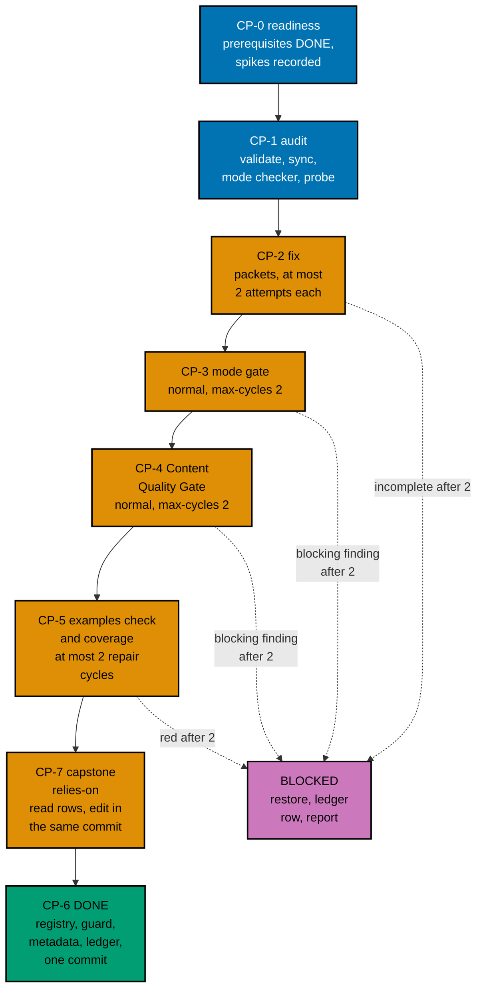
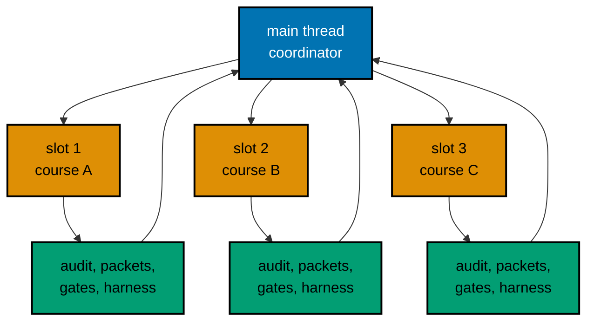

# 006 — Execution Model

Auditing 45 courses is this plan's whole work, and most of it is authoring (about 487,871 words and 1,007
new unit folders). This page says in what order the courses are done, who works on each one, how every loop is
bounded, what happens to a course that cannot pass, where the record of it all lives, and how the work reaches
`origin/main` in commits and pushes. Execution starts only after the user's command and after plans 01 to 12 have
merged (series decision 42).

## Roles and Slots

The repository runs `N+1` agents with `N = 3`: up to three background workers and one main thread that orchestrates and
stays free.

- **Main thread (the coordinator).** Starts jobs, reads their reports, runs the cheap commands, writes the ledger,
  makes every commit, edits every shared file, and talks to the user. It does not write course content.
- **Slot.** One of three background-agent places. A wave has three courses, so each course owns a slot for its whole
  stay in the wave.
- **Job.** One background agent run. A course passes through these jobs in its slot, one at a time:
  1. an **audit job** (CP-1): the mode checker over the course folder;
  2. one or more **packet jobs** (CP-2): `apps-ayokoding-www-by-example-maker` or
     `apps-ayokoding-www-annotated-concept-maker` for authoring gaps, `swe-developer` for units, `run.yaml`, expected
     files, determinism, and fixtures, and `tutorial-by-example-fixer` or `tutorial-annotated-concept-fixer` for
     findings;
  3. per gate cycle, a **checker job** and, if it finds blocking rows, a **fixer job** (the gate workflows define
     both);
  4. a **harness job** (CP-5) on the final text.
- **Spike jobs.** The thirteen Phase 1 spikes (SP1 to SP13) are run by `swe-developer` jobs and recorded by the
  coordinator ([003](./003-harness-conversion-design.md#phase-1-spikes)). They all finish before wave 1 starts.
- **Source-check jobs.** For AI and security courses, a packet owner re-verifies each fast-moving claim against its
  primary source on the day it writes it ([011](./011-ai-fixtures-and-sourcing-policy.md)). This is part of the
  packet, not a separate job, so it cannot be skipped.

Quality gates run only when someone asks for them by name. Executing this plan, once the user has given the command, is
that request. The gates' own ledgers under `local-tmp/quality/` are never committed; the plan's ledger below records
every verdict line.

The size classes ([002](./002-definition-of-done-and-targets.md#size-class-rule)) decide how a course is split into
packets. The plan makes no estimate of how long any course or wave will take; the ledger records measured time as
history only.

## Waves in Prerequisite Order

A course is audited only after every course it requires (inside these 45) is finished. The 45 courses fall into
15 waves of three, in the order below, derived from plan 02's revised prerequisites
([005](./005-prerequisites-ai-path-and-capstone-integrity.md#plan-02s-result-for-the-45-courses)). The rule that filled
each wave: take the three courses whose in-plan prerequisites are all finished and that have the longest chain of
courses waiting behind them, and never put two size-XL courses in one wave when another choice exists. 13
courses are XL; each of waves 1 and 3 to 14 holds exactly one, and waves 2 and 15 hold none.

| Wave | Courses (slot order)                                                                                                  | Planning minutes | Target units | Cumulative units | Cumulative runs | Cumulative minutes | Checkpoint                  |
| ---- | --------------------------------------------------------------------------------------------------------------------- | ---------------- | ------------ | ---------------- | --------------- | ------------------ | --------------------------- |
| 1    | 1. `backend-essentials`; 2. `frontend-essentials`; 3. `coding-interview`                                              | 29.4             | 262          | 262              | 292             | 29.4               |                             |
| 2    | 1. `api-design`; 2. `security-essentials`; 3. `advanced-frontend`                                                     | 29.7             | 267          | 529              | 589             | 59.1               |                             |
| 3    | 1. `creating-ai-powered-apps`; 2. `backend-at-scale`; 3. `behavioral-and-leadership-interviews`                       | 13.2             | 178          | 707              | 787             | 72.3               | push 1 (opens the draft PR) |
| 4    | 1. `agentic-ai`; 2. `evaluating-ai-output-essentials`; 3. `it-and-application-security`                               | 13.0             | 171          | 878              | 982             | 85.3               |                             |
| 5    | 1. `the-agent-loop`; 2. `statistics-for-evaluation`; 3. `system-design-interview`                                     | 12.4             | 135          | 1,013            | 1,134           | 97.7               |                             |
| 6    | 1. `agent-tools-and-mcp`; 2. `android-app-development`; 3. `project-management`                                       | 27.0             | 171          | 1,184            | 1,325           | 124.7              | push 2                      |
| 7    | 1. `take-home-and-live-coding`; 2. `inference-serving-and-model-deployment`; 3. `evaluating-ai-systems-in-depth`      | 19.2             | 257          | 1,441            | 1,612           | 143.9              |                             |
| 8    | 1. `agent-context-and-memory`; 2. `software-product-engineering`; 3. `detection-engineering-and-siem-operations`      | 10.6             | 141          | 1,582            | 1,770           | 154.5              |                             |
| 9    | 1. `agent-permissions-and-sandboxing`; 2. `agent-orchestration-subagents-and-observability`; 3. `ios-app-development` | 24.8             | 223          | 1,805            | 2,020           | 179.3              | push 3                      |
| 10   | 1. `offensive-security`; 2. `capstone-full-stack-app`; 3. `information-architecture-and-seo`                          | 18.6             | 197          | 2,002            | 2,241           | 197.9              |                             |
| 11   | 1. `linux-app-development`; 2. `hybrid-app-development`; 3. `capstone-first-working-software`                         | 40.1             | 225          | 2,227            | 2,493           | 238.0              |                             |
| 12   | 1. `analytics-and-experimentation`; 2. `build-your-own-reactive-ui`; 3. `it-governance-grc`                           | 16.2             | 173          | 2,400            | 2,686           | 254.2              | push 4                      |
| 13   | 1. `build-your-own-web-framework`; 2. `windows-app-development`; 3. `agentic-coding`                                  | 51.9             | 209          | 2,609            | 2,922           | 306.1              |                             |
| 14   | 1. `capstone-interview-loop`; 2. `engineering-management`; 3. `product-patterns-for-probabilistic-systems`            | 3.9              | 51           | 2,660            | 2,980           | 310.0              |                             |
| 15   | 1. `technical-communication`; 2. `fine-tuning-and-adaptation`; 3. `async-python-and-fastapi-services`                 | 16.0             | 171          | 2,831            | 3,171           | 326.0              | push 5 (final)              |

Work by wave, with the reason each course stands where it does:

- **Wave 1**: `backend-essentials` (S) needs no course of this plan; `frontend-essentials` (S) needs no course of this plan; `coding-interview` (XL) needs no course of this plan.
- **Wave 2**: `api-design` (S) needs `backend-essentials`; `security-essentials` (S) needs `backend-essentials`; `advanced-frontend` (S) needs `frontend-essentials`.
- **Wave 3**: `creating-ai-powered-apps` (XL) needs `backend-essentials`, `api-design`; `backend-at-scale` (S) needs `backend-essentials`, `security-essentials`; `behavioral-and-leadership-interviews` (L) needs no course of this plan.
- **Wave 4**: `agentic-ai` (XL) needs `creating-ai-powered-apps`; `evaluating-ai-output-essentials` (S) needs `creating-ai-powered-apps`; `it-and-application-security` (L) needs `security-essentials`, `backend-at-scale`.
- **Wave 5**: `the-agent-loop` (XL) needs `agentic-ai`; `statistics-for-evaluation` (S) needs `evaluating-ai-output-essentials`; `system-design-interview` (M) needs `backend-essentials`.
- **Wave 6**: `agent-tools-and-mcp` (XL) needs `the-agent-loop`; `android-app-development` (M) needs `frontend-essentials`, `advanced-frontend`; `project-management` (S) needs no course of this plan.
- **Wave 7**: `take-home-and-live-coding` (XL) needs `coding-interview`; `inference-serving-and-model-deployment` (S) needs `creating-ai-powered-apps`, `backend-at-scale`; `evaluating-ai-systems-in-depth` (S) needs `evaluating-ai-output-essentials`, `statistics-for-evaluation`.
- **Wave 8**: `agent-context-and-memory` (XL) needs `the-agent-loop`; `software-product-engineering` (S) needs `backend-essentials`, `frontend-essentials`; `detection-engineering-and-siem-operations` (L) needs no course of this plan.
- **Wave 9**: `agent-permissions-and-sandboxing` (XL) needs `the-agent-loop`; `agent-orchestration-subagents-and-observability` (L) needs `agent-tools-and-mcp`, `agent-context-and-memory`; `ios-app-development` (L) needs `frontend-essentials`, `android-app-development`.
- **Wave 10**: `offensive-security` (XL) needs `it-and-application-security`, `security-essentials`; `capstone-full-stack-app` (L) needs `backend-essentials`, `frontend-essentials`, `security-essentials`; `information-architecture-and-seo` (L) needs `frontend-essentials`, `advanced-frontend`.
- **Wave 11**: `linux-app-development` (XL) needs no course of this plan; `hybrid-app-development` (L) needs `frontend-essentials`; `capstone-first-working-software` (L) needs `security-essentials`, `backend-essentials`.
- **Wave 12**: `analytics-and-experimentation` (XL) needs no course of this plan; `build-your-own-reactive-ui` (M) needs `advanced-frontend`; `it-governance-grc` (M) needs `it-and-application-security`.
- **Wave 13**: `build-your-own-web-framework` (XL) needs `backend-essentials`; `windows-app-development` (S) needs no course of this plan; `agentic-coding` (M) needs no course of this plan.
- **Wave 14**: `capstone-interview-loop` (XL) needs `coding-interview`, `take-home-and-live-coding`, `system-design-interview`, `behavioral-and-leadership-interviews`; `engineering-management` (S) needs `software-product-engineering`, `project-management`; `product-patterns-for-probabilistic-systems` (S) needs `creating-ai-powered-apps`, `evaluating-ai-output-essentials`, `software-product-engineering`, `frontend-essentials`.
- **Wave 15**: `technical-communication` (S) needs `project-management`; `fine-tuning-and-adaptation` (S) needs `creating-ai-powered-apps`, `evaluating-ai-systems-in-depth`, `statistics-for-evaluation`, `inference-serving-and-model-deployment`; `async-python-and-fastapi-services` (S) needs `backend-essentials`.

The CI load by wave and the shard projection at each checkpoint are in
[004](./004-toolchain-additions-and-ci-cost.md#the-ci-budget).

Why the order is this one:

- **Waves 1 and 2** hold the courses most others need: `backend-essentials` (ten courses of this plan require it),
  `frontend-essentials` (eight), and `security-essentials` (five), then `api-design` and `advanced-frontend`. They are
  Python and TypeScript courses that need no service, so they are the first real test of the harness conversion, with
  the fewest surprises. `coding-interview` starts the interview chain early because `take-home-and-live-coding` and
  `capstone-interview-loop` wait behind it.
- **Waves 3 to 5** open the AI chain (`creating-ai-powered-apps`, then `agentic-ai`, then `the-agent-loop`) and the
  first security course after the essentials (`it-and-application-security`). Push 1 follows wave 3.
- **Wave 6** holds `agent-tools-and-mcp` and the first static course, `android-app-development`, which proves the
  `ktlint` validator (SP7) and is the first of the six filler-baseline courses. Push 2 follows it.
- **Waves 7 to 9** finish the agent chain (`agent-context-and-memory`, then `agent-permissions-and-sandboxing` and
  `agent-orchestration-subagents-and-observability`, each of which needs the earlier agent courses) and
  `ios-app-development` (static, needs the Android course's pattern). Push 3 follows wave 9.
- **Wave 10** holds `offensive-security`, the last security course with code, after `security-essentials`,
  `it-and-application-security`, and `detection-engineering-and-siem-operations` have proved the safe-lab rules; and `capstone-full-stack-app`, the first
  capstone that gains a `learning/` folder.
- **Wave 11** holds `capstone-first-working-software`, the second one, which carries the shape-3 rule
  ([005](./005-prerequisites-ai-path-and-capstone-integrity.md#capstones-that-gain-a-learning-folder)).
- **Waves 12 and 13** hold the courses with no dependents, including `windows-app-development`, the heaviest course
  for CI (42.0 planning minutes in 87 units). Putting it late means its measured minutes replace the planning figure
  last; the ladder is therefore decided in Phase 1 on the spike seconds and re-decided before every push.
- **Waves 14 and 15** hold the courses with the most prerequisites (`capstone-interview-loop` needs the four
  interview courses; `engineering-management` needs two courses of this plan; `product-patterns-for-probabilistic-systems`
  needs four courses from waves 1, 3, 4, and 8) and the courses nothing waits for. Push 5 is the final one.

A wave starts when every course in the waves it needs is **DONE** or **BLOCKED** (see below). A BLOCKED prerequisite does
not stop its dependents: their makers use the BLOCKED course's brief and the pages it has, and the ledger notes the
dependency.

## The Per-Course Pipeline

Every step is bounded. "Cycle" means one check-then-fix round. The user set the cap on 2026-10-09: every quality gate
and every maker-checker loop stops after **2 cycles** ("semua jadi 2 aja").

The checklist numbers are the same in every brief and in [../delivery.md](../delivery.md). CP-7 is numbered last because
it is the item plans 11 and 12 do not have; it runs after CP-5 and before the commit of CP-6, because a stale
relies-on row is corrected in the course's own commit.

| Step                    | Who                                                                                                                                                                                        | Done when                                                                                                                                                                                                                                                                                                                                                                                        | Cap                                                                          |
| ----------------------- | ------------------------------------------------------------------------------------------------------------------------------------------------------------------------------------------ | ------------------------------------------------------------------------------------------------------------------------------------------------------------------------------------------------------------------------------------------------------------------------------------------------------------------------------------------------------------------------------------------------ | ---------------------------------------------------------------------------- |
| CP-0 Readiness          | The coordinator                                                                                                                                                                            | Every in-plan prerequisite is DONE or BLOCKED in the ledger; the spikes the brief names are recorded; for an AI course, the `FakeModel` kit design of SP12 is recorded; for a security course, the safety scan of 012 runs on the repository and passes                                                                                                                                          | -                                                                            |
| CP-1 Audit              | The coordinator runs `EX-VALIDATE` and `EX-SYNC`; the mode checker (`tutorial-by-example-checker` or `tutorial-annotated-concept-checker`) reads the course; the completion probe runs RED | Finding counts are in the ledger; the brief's expected classes are confirmed or the brief is edited where they differ materially; the prerequisite re-check ([005](./005-prerequisites-ai-path-and-capstone-integrity.md)) is recorded; for the six filler courses the `FILLER` row is recorded; for an AI course, the claims list of [011](./011-ai-fixtures-and-sourcing-policy.md) is started | One audit; a second only if the first was interrupted                        |
| CP-2 Fix                | Makers, `swe-developer`, and mode fixers, per the size class                                                                                                                               | Every defect class of the brief is closed; `EX-VALIDATE`, `EX-SYNC`, and `EX-CHECK` exit 0 on the packet owner's own run; every recorded expected file was read; `FILLER` shows no fired rule for the course; for a security course the three safety checks of [012](./012-safe-lab-and-content-safety-rules.md#the-three-checks) pass                                                           | 2 attempts per packet. A second attempt continues from the first one's files |
| CP-3 Mode gate          | The Tutorial By Example or Annotated Concept Quality Gate                                                                                                                                  | `subject` = the course folder, `mode: normal`, `max-cycles: 2`; verdict `PASS` or `PASS_WITH_FINDINGS`, with no open `needs-decision` row                                                                                                                                                                                                                                                        | 2 cycles (the gate's own input)                                              |
| CP-4 Content gate       | The Content Quality Gate                                                                                                                                                                   | The same inputs and rule                                                                                                                                                                                                                                                                                                                                                                         | 2 cycles                                                                     |
| CP-5 Harness green      | The coordinator runs `EX-CHECK <slug>` and `EX-COVERAGE`; a repair goes back to the course's `swe-developer` packet                                                                        | `EX-CHECK` exits 0 and the course shows `covered: true`; for a no-code course, `EX-VALIDATE` reports it not applicable                                                                                                                                                                                                                                                                           | 2 repair cycles                                                              |
| CP-7 Capstone relies-on | The coordinator reads; a maker edits a stale row                                                                                                                                           | Every capstone that lists the course ([005](./005-prerequisites-ai-path-and-capstone-integrity.md#capstone-relies-on-rows-cp-7)) has an honest row; the content-shape test of plan 08 is green                                                                                                                                                                                                   | -                                                                            |
| CP-6 Record             | The coordinator                                                                                                                                                                            | `estimatedHours` recomputed; `prerequisites` re-derived (and `format` for the two corrected courses); the course's registry row added and `COMPLETION` green; `FILLER` green, with the baseline entry removed for the six owned courses; path tests green after a prerequisite change; a ledger row with every field below; one commit for the course                                            | -                                                                            |

The harness also runs inside CP-2, because a packet owner must hand over code that works. CP-5 still runs after the
gates, because the gates' fixers may edit lessons or code; it is the step decision 27 names.

A gate verdict of `FAIL` or `BLOCKED` after its second cycle, or any open `needs-decision` finding (the gate adapter
routes an example count under its floor to `needs-decision`), makes the course BLOCKED. No verdict stops the wave.

### Completion Test First

CP-1 runs the completion test ([007](./007-testing-strategy.md)) with the course as a **probe row**: the environment
variable `AUDIT_PROBE=<slug>:<format>` adds the course and its format to the registry for that run only, so nothing red
is ever written to the working tree. The probe run is **RED** for every course that does not yet meet its shape, and the
failing scenarios are recorded in the ledger. CP-2 to CP-5 make the probe **GREEN**. At CP-6 the coordinator adds the
real registry row and runs the test without the probe; it is committed together with the course, so no commit has a red
test, and a BLOCKED course leaves no row behind. This is the TDD loop for content.

For the two interview courses whose `format` is corrected (decision D3), the probe row carries the **new** format
(`annotated-concept-no-code`), and the course's `format` frontmatter changes in the same commit.

### Rules That Keep the Loop Bounded

1. **No new mode.** A maker may not switch a course's mode. The only mode-related change in this plan is the `format`
   correction of two interview courses (decision D3). A course that does not fit its mode after 2 cycles is BLOCKED and
   the question goes to the user.
2. **No loosened check.** Never retry, sleep, widen, loosen, skip, or quarantine to get green. A flaky unit is fixed at
   its root cause. A harness defect is fixed in `apps/ayokoding-cli` with a regression test first (plan 05's M11), as
   its own commit, and the CLI is rebuilt before the course continues.
3. **Gate fixers touch the course folder only.** If a fixer's change breaks a unit, CP-5 catches it; the repair cycle
   goes to a `swe-developer` packet.
4. **Order of gates is fixed.** Mode gate, then Content Quality Gate, then the harness. A text change after CP-5 (for
   example from a late finding) re-runs `EX-SYNC` and `EX-CHECK`.
5. **The filler guard binds.** The guard that plan 09 added runs in `test:quick`; a rewritten course must pass its six
   rules, and the six courses in the baseline owned by this plan are removed from it at CP-6 (see
   [007](./007-testing-strategy.md#the-filler-baseline-ratchet)).
6. **Safety has no cycle.** A safety finding (a real address, a real target, a live socket, a banned API) is never
   waived by the cap: the course is BLOCKED rather than shipped with it ([012](./012-safe-lab-and-content-safety-rules.md)).
7. **No claim without a source.** An AI or security course whose fast-moving claim has no dated primary source at the
   commit is not DONE ([011](./011-ai-fixtures-and-sourcing-policy.md)).

### Packet Template

Every packet prompt contains the same fields, so a packet can be run cold:

| Field                | Content                                                                                                                                                                                                                                   |
| -------------------- | ----------------------------------------------------------------------------------------------------------------------------------------------------------------------------------------------------------------------------------------- |
| Course and mode      | The slug, the mode, the wave and slot, the harness mode (`real`, or `static` with its reason), and the size class                                                                                                                         |
| Inputs               | The brief path in the plan, the definition of done (A1 to A10), the harness design (003), and the paths of the finished prerequisite courses; for an AI course also 011, for a security course also 012                                   |
| Task                 | The defect classes and units this packet owns (from the brief's checklist and the size class)                                                                                                                                             |
| Write set            | Files inside `apps/ayokoding-www/content/en/learn/courses/<slug>/` only; never any `_index.md` frontmatter, never `content/id/**`. An AI course's `FakeModel` kit and recorded responses live inside the course's code root               |
| Fixtures and sources | AI courses: policy AI1 to AI7, with the dated primary source for each fast-moving claim recorded in the return. Security courses: rules S1 to S7 and SL1 to SL4, with the safety scan output in the return. Other courses: not applicable |
| Commands             | The `EX-*` commands, the formatter order, and the HIPPO tier for each                                                                                                                                                                     |
| Forbidden            | Staging, committing, pushing; weakening a check; a new mode, slug, or topic; a real network call, a real model call, a real credential, or a real target; a link into `local-tmp/` or `plans/`                                            |
| Return               | The files written, the findings left open, the `EX-*` exit codes, the measured seconds of the slowest unit, and (AI and security courses) the sources checked with their dates and the scan result                                        |

## Blocked Courses

A course is **BLOCKED** when a step reaches its cap without passing. The coordinator handles it in this order and then
reports to the user. The wave does not stop: the other courses continue.

1. **Save the partial work.** Copy the course folder to `local-tmp/ayokoding-learn/blocked/<slug>/` and run `diff -r`
   between the two folders; the diff must print nothing before the next step.
2. **Restore the baseline.** `rtk git restore -- <dir>` for tracked files; then a dry run `rtk git clean -n -d -- <dir>`,
   read the listed paths, and only then `rtk git clean -f -d -- <dir>` for the untracked ones.
   `rtk git status --short -- <dir>` prints nothing. For a worktree session whose bare `git` is refused by the hook
   guard, use the absolute path `/usr/bin/git` for each of these commands.
3. **Write the ledger row**: state `BLOCKED`, the failing step, the open findings (the gate's ledger path and the
   blocking rows), the harness output, and the path of the saved partial work.
4. **Report to the user**: the course, the step that failed, the blocking findings in short, and the options below. The
   coordinator does not choose for them.
5. **The wave gate stays open** (the wave's last checklist items stay unticked) until the user decides.

Options the user can choose:

- **Retry** with a changed approach (a smaller example plan, a different design for the failing unit, or a repair of the
  cause in a shared kit). The course re-enters the pipeline with fresh budgets, and the decision is recorded in the
  ledger.
- **Defer** the course to a follow-up plan. An existing course is already usable and on its paths, so deferral does not
  break a path, and the PR stays shippable. It does mean decision 40's share for this plan is below 45 of 45 (below 37
  of 37 for the harness gate if the course has code), so the user decides explicitly whether the PR ships without the
  course, and plan 14's terminal gate must hear about it. The plan does not pre-decide. A deferred course goes into
  `DEFERRED_BY_USER` in the registry, as plan 11 defined it.
- **Stop** the plan.

The plan never narrows quietly: no lowered target recorded as done, no skipped gate, no unpublished course. A course
that depends on a BLOCKED course can still be audited (its prerequisite list is metadata). A BLOCKED course with code
leaves the series coverage gate red until it is DONE or deferred
([007](./007-testing-strategy.md#the-series-harness-coverage-gate)).

## The Execution Ledger

The ledger is the running record of the waves. It lives in the execution worktree at
`local-tmp/ayokoding-learn/execution-ledger.md` (gitignored scratch, shared by the series), under the heading
`## Plan 13 — audit product, security, and AI`. Phase 0 creates one `PENDING` row per course, in wave order.

| Course                         | Wave and slot | Mode       | Maker agent IDs | CP-1 findings        | Fix cycles | Mode gate                      | Content gate    | Harness                                    | Words / examples / diagrams | Sources checked | Status | Open findings | Commit    |
| ------------------------------ | ------------- | ---------- | --------------- | -------------------- | ---------- | ------------------------------ | --------------- | ------------------------------------------ | --------------------------- | --------------- | ------ | ------------- | --------- |
| `backend-essentials` (example) | 1.1           | by-example | agent IDs       | validate 3, sync 184 | 1          | 2 cycles, `PASS_WITH_FINDINGS` | 1 cycle, `PASS` | exit 0, units 89, runs 99, `covered: true` | 28,400 / 78 / 32            | -               | DONE   | -             | short SHA |

Row states: `PENDING`, `IN-PROGRESS` (with the step and the cycle count), `DONE`, and `BLOCKED`. The "Sources checked"
column is filled for AI and security courses only: the count of dated references added or refreshed, and the date.
A second section of the ledger holds the CI figures: the spike seconds, the ladder rungs taken, and the measured
`EX-CHECK` minutes per finished course. A third holds the `needs-decision` rows (prerequisite changes that fail rule
AI-1, a capstone row that needs a scope change). At the end the coordinator copies the tables (without scratch paths)
into `<plan>/evidence/execution-summary.md`, which is committed, so the record survives the worktree's cleanup.

### Resuming

A new session, or the same session after its context was compacted, resumes like this:

1. Read the ledger and `rtk git status --short`; reconcile them (a `DONE` row must have its commit; an `IN-PROGRESS`
   row must have an uncommitted course folder).
2. For each `IN-PROGRESS` row, read the packet owner's report if the agent ID is still readable; otherwise run
   `EX-VALIDATE`, `EX-SYNC`, and `EX-CHECK` for the slug and the completion test to see how far the course got, and
   restart from the first step that fails.
3. A course folder with an unfinished set of units is never committed: an opted-in course is all or nothing.
4. Never reset a cycle count, and never start an attempt that would exceed 2.
5. Re-read the merged workflow files and the shared kits before resuming (Phase 0 does this at the start; a new
   session does it again), because plans 11 and 12 may have changed the workflow after this plan was written.

## Commits and Checkpoint Pushes

- **Course commits.** One commit per DONE course, made by the coordinator after CP-6, with the header
  `fix(ayokoding-www): audit <slug> course`. It stages explicit paths only: the course folder, the course's `_index.md`
  (for `prerequisites`, `estimatedHours`, and `format`), the completion-test registry row, any capstone `learning/overview.md`
  whose relies-on row was corrected, and, for the six courses the filler baseline lists, the baseline entry and its cap.
  A BLOCKED course is never in a commit. Plan 07 commits once per wave; this plan commits once per course because every
  course is independent, already shipping, and may be BLOCKED or deferred on its own, so a per-course commit keeps each
  one revertible (decision D6).
- **Harness commits.** A harness or workflow change (the ladder's rungs 2b and 3, a CLI shard rule, an M11 fix) is its
  own commit, `fix(ayokoding-cli): ...` or `ci(ayokoding-www): ...`, with its regression test.
- **Test-support commits.** The new safety scenarios with their scan helper, and the tenth completion scenario, are test
  code; each is its own commit, `test(ayokoding-www): ...`, with its failing run recorded first, before the first course
  that uses it.
- **Checkpoint pushes.** After waves 3, 6, 9, 12, and 15 the branch is pushed. The first push opens a **draft** pull
  request. Each push first passes the per-commit push leak review. The current head's CI must be green before the next
  wave starts, so a harness or lockfile problem on the CI runner (for example amd64 wheel hashes for the numeric and
  crypto wheels) surfaces at wave 3 and not at the end. CI is polled every 2 minutes; `gh run watch` is not used. The
  shard projection for each push (four and eight shards, plan 05's split and the best split) is the table in
  [004](./004-toolchain-additions-and-ci-cost.md#the-ci-budget); the coordinator replaces its planning figures with
  the measured `EX-CHECK` minutes before each push.
- **Merging `origin/main`.** Before each wave, fetch and, if `origin/main` moved, read the full diff of the new commits,
  reconcile, and merge (not rebase) so pushed history is stable. The series runs plans strictly one after another, so a
  moved `origin/main` is a hotfix or a bot, not another plan.
- **PR size.** The PR will change about 9,000 to 11,000 files (a planning estimate: 2,831 units at about 3 files
  each, plus the lesson pages), far above the 3,000 files that GitHub's pull-request files view and files API list. The
  PR gate reads git base and head SHAs and formats every changed path, so the gate is not limited by that listing.
  Reviewers read commit by commit: one commit per course keeps each review small. Phase 2 probes the limits when it
  opens the draft PR at push 1 and records what the page shows. If the user prefers a split of the PR (decision D7), the
  waves are the seam, and the ledger already records every course.

## Agent Topology

- **Never shared.** Two agents never write the same file. A slot writes only inside its course folder. The coordinator
  alone edits shared files: each `_index.md`, the completion-test registry, the filler baseline, the safety scan and its scenarios, the harness workflow and CLI, the capstone relies-on rows, the ledger, and every commit.
- **Compute.** Every command runs through `rtk ./hippo run ...` with the tier in the Command Reference of
  [../delivery.md](../delivery.md). Independent compute from different slots overlaps only through HIPPO admission. The
  dependency, shared-output, byte-identity, and correctness edges stay serial: the lockfile bytes of one course, one
  environment image per lockfile, the recording of one unit's expected files, the ledger, and the course commit.
- **What the coordinator checks between waves.** Every course in the wave is DONE or BLOCKED with a ledger row; `EX-CHECK`
  still exits 0 for every DONE course of the wave; `rtk git status --short` shows only the wave's course folders and
  shared files; `rtk git status --short -- apps/ayokoding-www/content/id` is empty (restore with
  `rtk git checkout -- apps/ayokoding-www/content/id` if not); the quick suite runs at each checkpoint push.
