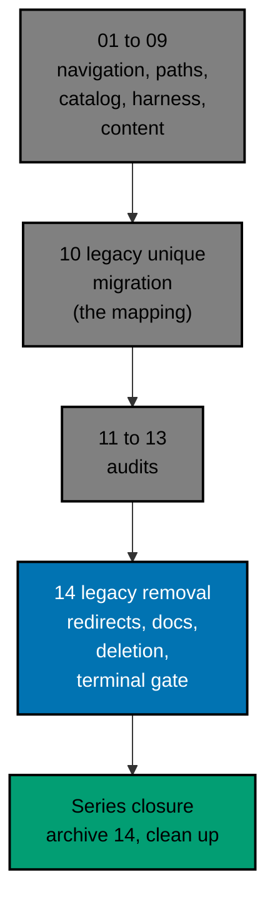

# AyoKoding Learn Revamp 14 — Legacy Removal

> **Status:** Backlog. Do not execute until both are true: the user gives an explicit execution command, and
> plans 01 to 13 of this series have merged to `origin/main` and are archived. The 14 plans run strictly one
> after another (series decision 42), so plan 13 is merged, deployed, verified, and cleaned up before this
> plan starts. This is the last plan of the series; nothing follows it except its own closure.
>
> **Plan quality gate:** not run yet, so no verdict exists. By the user's decision of 2026-10-09 it was not run
> while the plan was written; it runs at the start of execution, as the first item of Phase 0 in
> [delivery.md](./delivery.md#phase-0-groundwork-and-readiness), with `max-cycles` 2.

`apps/ayokoding-www/content/en/learn/legacy/` holds 1,150 Markdown files, a leftover of the site's pre-revamp
structure that the site itself describes as "kept for reference while the course library fills". By the time
this plan runs, plans 01 to 13 have filled and audited the library (229 courses), and plan 10 has recorded, for
every one of the 1,150 files, which course replaces its topic. This plan removes the tree and everything that
depends on it: it adds an HTTP 308 redirect from every old address to its course (the catalog when no course
matches), repoints the 94 `docs/` files that link into the tree, updates the specs, tests, and rules, and then
proves, with a 17-check terminal gate, that the whole series reached its end state. On failure of that gate,
nothing is archived and nothing is merged.

308 is the HTTP status code a permanent redirect returns. It is not a count of anything in this plan.

## Scope

- **Delete `apps/ayokoding-www/content/en/learn/legacy/`** (1,150 files) in one commit, only after every
  mapping row is proven resolved and every destination course exists on `origin/main`.
- **Add 308 redirects from every legacy URL** to its equivalent course root, with the catalog
  `/en/learn/courses` as the fallback, using plan 10's `syllabus/legacy-to-course-mapping.md` as the sole input.
  The mechanism is a typed table in `apps/ayokoding-www/src/redirects/legacy-removal.ts` behind one ordered
  aggregator (418 new rules, 12 removed, about 493 in total against the platform limit of 1,024). The older
  pre-IA address of each page (`/en/learn/<domain>/...`) gets the same destination in one hop. A frozen
  1,150-line inventory backs a permanent unit test (2,298 redirect assertions) and a permanent real-server crawl.
  See [tech-docs/002](./tech-docs/002-redirect-mechanism-and-url-inventory.md).
- **Repoint the 94 `docs/` files** (158 lines, 170 links, 16 groups) to the courses that replace each topic, in
  three file-disjoint batches, preserving meaning, with the link validator and two docs quality gates, and with
  the software-engineering separation convention still satisfied.
  See [tech-docs/003](./tech-docs/003-docs-repoint-and-link-validation.md).
- **Update specs, tests, step definitions, and both end-to-end projects.** The Learn landing, sidebar, path
  rail, browse index, sitemap, search data, and `learn-three-bucket.ts` lose the legacy bucket; renderer
  coverage moves to one draft fixture page; `paths/skills/e2e-fixture-*` stay. Every reference found by
  measurement is listed in [tech-docs/001](./tech-docs/001-current-state-and-evidence.md) and given an id in
  [tech-docs/004](./tech-docs/004-code-spec-and-test-migration.md).
- **Update governance, convention, skill, and README text** that mentions the legacy bucket (six changes, RC1 to
  RC6), through the nine rules-propagation steps and the Rules Quality Gate at `max-cycles` 2.
  See [tech-docs/005](./tech-docs/005-rules-and-docs-impact.md).
- **Carry the terminal series-completion gate** (series decision 40) as Phase 10: 17 checks with exact commands,
  thresholds, and expected observations. See [tech-docs/006](./tech-docs/006-series-completion-gate.md).
- **Close the series** after the merge, the deploy, and the live check: verify that plans 01 to 14 are in
  `plans/done/` with README entries, archive this plan, and clean the temporary artifacts (the execution ledger
  in `local-tmp/`, worktrees, and branches). No new plan is created. See
  [tech-docs/010](./tech-docs/010-pr-size-rollback-and-series-closure.md#series-closure).

## Non-Goals

- Implementing any of this before the user's execution command ("jangan kerjain/implement plan ini sebelum gw
  kasih perintah buat eksekusi ya"). Authoring this plan changes no content, course, doc, or app file.
- Writing or rewriting a course, or fixing a course defect that the terminal gate finds. Those belong to the
  owning earlier plan; the gate reports them and the user decides ([tech-docs/006](./tech-docs/006-series-completion-gate.md#failure-policy)).
- Any change under `apps/ayokoding-www/content/id/**` (series decision 35). The `id` locale has no learn tree and
  gets no redirect.
- Redirects at page granularity. The mapping works by topic, so every sub-page goes to its course root
  ([tech-docs/007 D3](./tech-docs/007-decision-records.md#d3-every-sub-page-redirects-to-the-course-root)).
- Retiring the callout, steps, and tabs shortcodes, and editing the stale pre-IA example paths in conventions
  (both are reported, not changed; see the flags below).
- Creating a new rule, a new plan, or a new idea artifact.

## Flags for the User

These are choices this plan made on its own authority, or facts the user should know. None needs an answer to
start, and each is easy to change before execution.

1. **No plan quality gate verdict exists yet.** It runs first in Phase 0, with `max-cycles` 2.
2. **The FP-variant convention is rescoped, not deleted (RC1, RC2).** Its scope named four folders of the legacy
   tree, and no page outside the tree uses the F# plus Clojure tab pair. After the deletion it governs no existing
   page and binds only the first one written. Whether to keep or drop the convention is the user's call; the
   plan keeps it and removes four dead links
   ([tech-docs/005](./tech-docs/005-rules-and-docs-impact.md#rc1-the-fp-variant-convention-stops-naming-the-deleted-folders)).
3. **The 2023 CliftonStrengths rant loses six links and keeps its words.** Its link targets are obsolete topics
   that would redirect to the catalog. The user can reverse this
   ([tech-docs/007 D8](./tech-docs/007-decision-records.md#d8-the-2023-rant-keeps-its-text-and-loses-six-links)).
4. **The `id` locale keeps its own CliftonStrengths section** (`content/id/belajar/manusia/peralatan/cliftonstrengths/`).
   Plan 10 classified the English topic obsolete for trademark and licensing reasons; series decision 35 forbids
   touching `content/id/**`, so the Indonesian section is left alone. Whether it should stay is the user's call.
5. **The gate adds one global word floor only.** The 1,000-word floor of decision 40 is checked for all 229
   courses. Each mode's own floor (By Example, Annotated-Concept, and so on) stays with the owning plan's suite,
   which the gate reruns once (SC-07). A single global per-mode floor is not added; say so if you want one.
6. **Stale paths are reported, not edited.** About 13 files and 60 lines under `repo-governance/` and `.agents/`
   show a pre-IA example path, and some conventions give absolute `ayokoding.com` example links. They pre-date the
   legacy bucket and still answer with one 308 after this plan. Counts are re-measured in Phase 0 and listed in
   the final report.
7. **Plan 10's mapping had three defects in its first draft** (the header promised seven columns while the table
   had six, dispositions were mixed case, and the header called "308" a count of redirects). The series
   coordinator corrected them in plan 10's text before any execution, so the as-merged file should now be clean.
   This plan still tolerates all three by parsing by position and normalizing case, and it stops if a seventh
   column disagrees or a fourth disposition word appears ([tech-docs/002](./tech-docs/002-redirect-mechanism-and-url-inventory.md#tolerating-the-known-mapping-defects)).
8. **The shortcodes become unused.** The callout, steps, and tabs shortcodes appear in 60 legacy files and in no
   file outside the tree. They stay in the renderer with their tests, and one draft fixture page keeps their
   end-to-end proof. Retiring them is a separate decision.
9. **One search-scope scenario changes its title and one feature is deleted.** The scenario "Search is scoped to
   the requested locale" asserted a page titled "Spring Security Basics" that exists only in the legacy tree; a
   surviving English title is chosen in Phase 1. The `architecture-cases-routes` feature (3 scenarios) tested
   routes into the tree and is deleted
   ([tech-docs/007 D14, D15](./tech-docs/007-decision-records.md#d14-the-architecture-cases-routes-feature-is-deleted)).
10. **Search engines may treat the many redirects to the catalog as soft 404s.** 113 of the 1,150 URLs fall back
    to the catalog (obsolete topics, navigation pages). A 410 would be more honest to crawlers but gives a reader
    nothing to click; decision 34 chose the catalog
    ([tech-docs/007 D4](./tech-docs/007-decision-records.md#d4-the-fallback-is-the-catalog-with-a-308-for-obsolete-navigation-and-unmatched-urls)).
11. **A 308 is cached by browsers.** A revert restores the pages and removes the rules, but a visitor whose browser
    already followed a redirect may keep being sent to the course until the cache entry expires. The plan prefers
    a forward fix to a rollback for a single wrong destination.
12. **Plans 12 and 13 were only a syllabus and technical notes when this plan was written.** Phase 0 reads the
    as-merged name of every test, registry, and hook the gate depends on, and a readiness probe stops execution
    early if the series is incomplete.

## Dependency and Result

The series runs strictly in order, one plan, one worktree, and one PR at a time (series decision 42), so plans 01
to 13 are all merged when this plan starts. This plan consumes plan 10's mapping as its only redirect input and
reads the products of plans 02 to 13 (path-model integrity, catalog counts, harness commands, the filler guard,
the audited-course registry, and the completion suites) in its terminal gate.

## How the Work Runs

One delivery unit (DU-14), one worktree, one PR. Eleven phases, each ending with a completion gate and a
pause-safety note. Phase 0 opens no PR; the draft PR opens at the checkpoint push after Phase 2.

| Phase | Name                                      | Outcome                                                                                                                   |
| ----- | ----------------------------------------- | ------------------------------------------------------------------------------------------------------------------------- |
| 0     | Groundwork and readiness                  | Plan quality gate verdict, worktree, preconditions, readiness probe, both censuses, redirect-total check, as-merged names |
| 1     | Decouple tests from legacy content        | Fixture page, rebound rendering and search checks, surviving search title, filler-baseline guard; all green with the tree |
| 2     | Redirects                                 | Typed table, aggregator, frozen inventory, permanent tests, both new features; old module and its tests gone              |
| 3     | Docs repoint                              | 94 files repointed in three batches; link validator and docs gates clean                                                  |
| 4     | Rules and docs propagation                | RC1 to RC6 landed through the nine steps; Rules Quality Gate passed                                                       |
| 5     | The deletion                              | Absence tests written red, then the single deletion commit; post-deletion greps and allowlist                             |
| 6     | Full suites and production build          | All suites green once, hidden-dependency sweep, production build, crawl, curl samples                                     |
| 7     | Manual verification and tester gates      | Port 3101 browser pass, UI Web Quality Gate, rule-15 triad                                                                |
| 8     | Local gates, push, PR, and CI             | Push leak review, PR body, green `Quality gate`, posted `pr-leak-review` pass                                             |
| 9     | Knowledge capture                         | Every learning routed, reported, or discarded                                                                             |
| 10    | The series-completion gate                | 17 checks pass; on failure no archival                                                                                    |
| End   | Plan archival, merge, deploy, and closure | Archive, merge, deploy, live checks, series archive verified, final report, artifacts cleaned                             |

## Series Context

This plan is row 14 of the 14-plan **AyoKoding Learn Revamp** series. Each plan is one PR delivered from its own
worktree, and the plans run strictly in numeric order. The user resolved the series decisions on 2026-10-09;
every decision this plan relies on is copied into
[brd.md](./brd.md#resolved-series-decisions-this-plan-relies-on).

| NN  | Plan suffix                   | Scope                                                                                                                        | Depends on |
| --- | ----------------------------- | ---------------------------------------------------------------------------------------------------------------------------- | ---------- |
| 01  | `navigation-and-display`      | Strip `NN ·` title prefixes; path position numbers; sidebar auto-scroll; render fixes                                        | —          |
| 02  | `path-model`                  | Phases, goals, `assumes`, outline marker, prerequisite revision, closure checks, career copy                                 | 01         |
| 03  | `catalog-and-metadata`        | Course metadata schema and backfill, categories, catalog page, course landing header                                         | 01         |
| 04  | `learning-experience`         | Browser progress, phase roadmap page, context bar, mark complete, Learn home                                                 | 02, 03     |
| 05  | `code-harness`                | `ayokoding-cli`, `run.yaml` contract, runners, Nx target, CI, quality-gate propagation                                       | —          |
| 06  | `accounting-courses`          | Write 24 accounting courses; restructure both accounting paths in the same PR                                                | 02, 03, 05 |
| 07  | `erp-courses`                 | Write 30 ERP courses; restructure both ERP paths in the same PR                                                              | 06         |
| 08  | `capstone-courses`            | Rewrite 8 skeleton capstones; give the AI Engineer path its goal                                                             | 02, 03, 05 |
| 09  | `filler-rewrites`             | Rewrite 8 templated filler courses                                                                                           | 03, 05     |
| 10  | `legacy-unique-migration`     | Inventory legacy topics vs courses; build 48 new courses for topics without equivalents; record the legacy-to-course mapping | 03, 05     |
| 11  | `audit-languages-and-tooling` | Audit and fix language and tooling courses                                                                                   | 05         |
| 12  | `audit-cs-systems-and-data`   | Audit and fix CS, systems, concurrency, distributed, database, and data courses                                              | 05         |
| 13  | `audit-product-security-ai`   | Audit and fix web, backend, mobile, security, AI, testing, architecture, product courses                                     | 05         |
| 14  | `legacy-removal` (this plan)  | Delete `learn/legacy`, add 308 redirects, repoint `docs/` links, update specs and tests, carry the series-completion gate    | 10 to 13   |

## Navigation

- [Business requirements](./brd.md)
- [Product requirements, Gherkin, and UI note](./prd.md)
- [Technical design](./tech-docs/README.md)
- [Delivery checklist](./delivery.md)
- [Execution learnings](./learnings.md)
