# Delivery Plan — AyoKoding Learn Revamp 14: Legacy Removal

> **Legend** — `[AI]`: an agent performs the step (the default; unmarked steps are `[AI]`).
> `[HUMAN]`: only a human can do it (physical action, out-of-band approval, real-secret or
> privileged-credential handling). `[AI+HUMAN]`: agent prepares, human approves or finishes.

**Do not start** until the user gives an explicit execution command for this plan. That command is the
authorization for this plan's change set (commits, pushes, PR, merge, deploy, and series closure described
below). The user said: "jangan kerjain/implement plan ini sebelum gw kasih perintah buat eksekusi ya". The 14
plans of the series run strictly one after another (series decision 42), so plans 01 to 13 must be merged,
deployed, verified, and cleaned up first (see Phase 0). This is the last plan of the series.

**Plan quality gate:** not run yet, so no verdict exists. By the user's decision of 2026-10-09 it was not run
while this plan was written; it runs at the start of execution, as the first checkbox of Phase 0, with
`max-cycles` 2. The executor records the verdict line in this section when the gate has run; until then this
section holds no verdict and none is claimed.

Authored 2026-10-09 and 2026-10-10. Measurements were taken at `origin/main` `bb7f90137`; Phase 0 re-measures
every one of them.

## Worktree

- **Execution worktree:** `worktrees/ayokoding-learn-revamp-14-legacy-removal/`
- **Provisioning status:** pending
- **Authoring-worktree exception:** this plan was authored inside the separate authoring worktree
  `.claude/worktrees/ayokoding-update` (branch `worktree-ayokoding-update`), which the user required for
  writing all plans of the AyoKoding Learn Revamp series together. That authoring worktree is removed after the
  plan-docs PR merges and is **never** used for execution. The Provisioned Worktree Identity and Delivery
  Branch Inventory are intentionally omitted until Step 0 below creates them.
- **Step 0 obligation (blocking):** the plan-execution Step 0 gate provisions the execution worktree from fresh
  `origin/main` with
  `rtk git worktree add -b ayokoding-learn-revamp-14-legacy-removal-base worktrees/ayokoding-learn-revamp-14-legacy-removal origin/main`,
  initializes it per
  [Worktree Toolchain Initialization](../../../repo-governance/development/workflow/worktree-setup.md), writes
  the immutable identity and the first inventory row into this section, replaces
  `Provisioning status: pending` with `Provisioning status: provisioned` in the same plan update, and syncs with
  `origin/main` before any delivery packet starts.
- **Cleanup:** after the PR merges, the worktree and its branches come down through
  [Dev Artifact Clean-Up](../../../repo-governance/workflows/maintenance/dev-artifact-clean-up.md) (see Plan
  Archival, Merge, Deploy, and Series Closure).
- **Worktree cap:** one worktree for this plan in this repository, reused by every phase.
- **Never leave the worktree:** every command runs from the worktree root. Do not `cd` out of it; a session
  whose working directory drifts outside its bound worktree can be disabled by the tool guard.

## Delivery Mode: worktree-to-pr

`worktree-to-pr` is mandatory in this repository. One branch and **one PR** deliver the whole plan. The PR opens
as a draft at the first checkpoint push (after Phase 2). It needs the exact current-head/base `Quality gate` from
`.github/workflows/pr-quality-gate.yml` and an exact-head posted `pr-leak-review` `pass` (`leak-review` status).
Broad semantic PR review is not run unless the user asks for it. `[AI]` merges once the hardened merge
preconditions (a) to (e) of the
[PR Merge Protocol](../../../repo-governance/development/workflow/pr-merge-protocol.md) hold. The plan folder
moves to `plans/done/` inside this same PR, before the merge (archival-in-PR), and only after the
series-completion gate (Phase 10) has passed.

### Delivery Unit

| Unit  | Phases                                          | Safe `main` state after merge                                                                                                                                                                                                                                                        | Rollback                                                                                                                                                                                                                                     |
| ----- | ----------------------------------------------- | ------------------------------------------------------------------------------------------------------------------------------------------------------------------------------------------------------------------------------------------------------------------------------------ | -------------------------------------------------------------------------------------------------------------------------------------------------------------------------------------------------------------------------------------------- |
| DU-14 | 1 to 10 and Plan Archival (Phase 0 opens no PR) | The legacy tree is gone; every old address answers 308 to a live page (1,150 legacy addresses and their 1,148 pre-IA twins); the 94 `docs/` links resolve; specs, tests, and rules name no removed page; the terminal gate passed all 17 checks; plans 01 to 14 are in `plans/done/` | Revert the merge commit in a revert PR: it restores the 1,150 pages and removes the redirect rules together ([tech-docs/010](./tech-docs/010-pr-size-rollback-and-series-closure.md#rollback), see also PR-Size Strategy and Rollback below) |

There is no feature flag ([tech-docs/007 D7](./tech-docs/007-decision-records.md#d7-one-pull-request-ordered-commits-no-feature-flag)):
a redirect table is either deployed or not, and the deletion and the redirects take effect together on deploy.
The phases are natural pauses inside the one branch; no phase is merged on its own.

### Before Phase 0: Promotion

> If the plan is still in `plans/backlog/`, run the plan quality gate first (the first checkbox of Phase 0) and
> only then promote. A gate verdict of `BLOCKED` stops execution before any promotion.

- [ ] [AI] Promote the plan per
      [Starting and Completing Work](../../../repo-governance/conventions/structure/plans/starting-and-completing-work.md):
      a pure move of `plans/backlog/ayokoding-learn-revamp-14-legacy-removal/` to
      `plans/in-progress/ayokoding-learn-revamp-14-legacy-removal/` plus the `plans/backlog/README.md` and
      `plans/in-progress/README.md` index updates, landed on `origin/main` through its own PR. Acceptance:
      `rtk git ls-tree -r --name-only origin/main plans/in-progress/ayokoding-learn-revamp-14-legacy-removal/`
      lists this plan's files. This promotion PR is separate from DU-14.

### Execution Packet Defaults

- **Plan path after promotion:** `plans/in-progress/ayokoding-learn-revamp-14-legacy-removal/` (written below as
  `<plan>/`). Evidence goes to `<plan>/evidence/`.
- **Scratch and ledger:** the execution ledger and working files live in the execution worktree's
  `local-tmp/ayokoding-learn/` (gitignored). The ledger is `local-tmp/ayokoding-learn/execution-ledger.md`; this
  plan writes only under its heading `## Plan 14 — legacy removal`, including a **file ledger** (every path
  changed, per phase) that is reconciled with `rtk git status --short` at each phase gate. The rules-propagation
  placement record is `local-tmp/ayokoding-learn/plan-14/rules-placement.md`. Never overwrite another plan's
  heading.
- **No ad-hoc scripts** for deterministic tasks (series decision 37). Counts come from the repository's own
  commands (`rtk git grep`, `find`, `wc`, the named `UNIT-*`, `INTEGRATION`, `E2E`, and `EX-*` commands) and from
  the permanent or temporary vitest tests this plan lists. Throwaway scratch edits that prove a negative control
  are restored with `rtk git checkout -- <file>` and are never committed.
- **Delete only after proof.** The legacy tree is removed only in the deletion commit of Phase 5, after the
  precondition proof checklist there passes. Nothing under `apps/ayokoding-www/content/en/learn/legacy/` is
  edited or removed in any earlier phase.
- **Evidence hygiene:** evidence files contain repository-relative paths only. Never paste an absolute
  home-directory path, a hostname other than the public site, a token, or `.env*` content (the PR leak review
  treats machine-specific values as leaks).
- **Never commit** `apps/ayokoding-www/next-env.d.ts` (the dev server and `next build` rewrite it) or
  `.serena/project.yml`. Before every commit run `rtk git status --short` and restore either file with
  `rtk git checkout -- <file>` if it shows as modified.
- **Never touch** `.env.prod` or `.env.stag`. If the dev server needs a variable, copy the key from
  `apps/ayokoding-www/.env.example` into an uncommitted `apps/ayokoding-www/.env.local`.
- **No git identity changes** and no bare `git stash`.
- **English only.** Nothing under `apps/ayokoding-www/content/id/**` changes. After every `GEN-INDEXES`,
  `rtk git status --short -- apps/ayokoding-www/content/id` prints nothing.
- **Bounded loops:** every maker-checker loop and every quality gate in this plan (the plan quality gate, the
  docs gates, the Rules Quality Gate, the UI Web Quality Gate, the rule-15 triad, and every fix loop) runs at
  **most 2 cycles**. A check still failing after the cap is recorded as `BLOCKED` in the execution ledger with
  its findings, reported to the user, and the gate stays open until the user decides. Parallelism stays at N=3
  background agents. This plan's text was grepped for the series' forbidden cap phrases (any cap above 2, and
  any rebase-order rule between plans) and contains none.
- **Failure handling:** on any unexpected failure, save the output to the phase evidence file, fix the root
  cause (never skip, retry-until-green, loosen, sleep, or delete a test), rerun the same command, and note the
  fix.
- **If `rtk git` is refused inside the worktree** with a message about session isolation (a known `rtk` defect
  up to version 0.48.0), run the same git command by absolute path (`/usr/bin/git`; find it with `which git`).
  This file writes `rtk git` for brevity.
- **Sibling plans are read-only.** This plan never edits another plan's folder. A defect in a sibling plan's
  product is reported (and recorded `BLOCKED` when it fails a gate check), never fixed here.

> **Important**: Fix ALL failures found during quality gates, not just those caused by your changes. This
> follows the root cause orientation principle — proactively fix preexisting errors encountered during work,
> except where this plan says a defect belongs to an earlier plan and must be reported instead
> ([tech-docs/006](./tech-docs/006-series-completion-gate.md#failure-policy)).

### Command Reference

Run every command from the execution worktree root. Expected results are stated at each use. Every compute
command goes through HIPPO (`rtk ./hippo run`) with a class and a tier.

| Name                    | Command                                                                                                                                                                                                                                                                                                                                       |
| ----------------------- | --------------------------------------------------------------------------------------------------------------------------------------------------------------------------------------------------------------------------------------------------------------------------------------------------------------------------------------------- |
| `UNIT-FE <file>`        | `rtk ./hippo run --class ephemeral --resource-tier standard --disk-path . --cwd apps/ayokoding-www -- npx vitest run --project unit-fe <file>`                                                                                                                                                                                                |
| `UNIT-NODE <file>`      | `rtk ./hippo run --class ephemeral --resource-tier standard --disk-path . --cwd apps/ayokoding-www -- npx vitest run --project unit <file>`                                                                                                                                                                                                   |
| `TYPECHECK`             | `rtk ./hippo run --class ephemeral --resource-tier standard --disk-path . -- npm exec nx -- run ayokoding-www:typecheck`                                                                                                                                                                                                                      |
| `LINT`                  | `rtk ./hippo run --class ephemeral --resource-tier light --disk-path . -- npm exec nx -- run ayokoding-www:lint`                                                                                                                                                                                                                              |
| `UNIT`                  | `rtk ./hippo run --class ephemeral --resource-tier standard --disk-path . -- npm exec nx -- run ayokoding-www:test:unit`                                                                                                                                                                                                                      |
| `QUICK`                 | `rtk ./hippo run --class ephemeral --resource-tier standard --disk-path . -- npm exec nx -- run ayokoding-www:test:quick`                                                                                                                                                                                                                     |
| `E2E-QUICK`             | `rtk ./hippo run --class ephemeral --resource-tier standard --disk-path . -- npm exec nx -- run ayokoding-www-fe-e2e:test:quick`                                                                                                                                                                                                              |
| `BE-E2E-QUICK`          | `rtk ./hippo run --class ephemeral --resource-tier standard --disk-path . -- npm exec nx -- run ayokoding-www-be-e2e:test:quick`                                                                                                                                                                                                              |
| `INTEGRATION`           | `rtk ./hippo run --class ephemeral --resource-tier heavy --disk-path . -- npm exec nx -- run ayokoding-www:test:integration`                                                                                                                                                                                                                  |
| `E2E`                   | `rtk ./hippo run --class ephemeral --resource-tier heavy --disk-path . -- npm exec nx -- run ayokoding-www-fe-e2e:test:e2e`                                                                                                                                                                                                                   |
| `BE-E2E`                | `rtk ./hippo run --class ephemeral --resource-tier heavy --disk-path . -- npm exec nx -- run ayokoding-www-be-e2e:test:e2e`                                                                                                                                                                                                                   |
| `E2E-ONE <feature>`     | `E2E` limited to one feature file. Expected form: `rtk ./hippo run --class ephemeral --resource-tier heavy --disk-path . -- npm exec nx -- run ayokoding-www-fe-e2e:test:e2e -- <feature>`. Phase 0 confirms the working form; if the target takes no file argument, run `E2E` instead                                                        |
| `BE-E2E-ONE <feature>`  | `BE-E2E` limited to one feature file, same rule as `E2E-ONE`                                                                                                                                                                                                                                                                                  |
| `BE-E2E-LIVE <feature>` | `BE-E2E-ONE` against the live site: the same command run as `rtk ./hippo run --class ephemeral --resource-tier standard --disk-path . -- env BASE_URL=https://www.ayokoding.com npm exec nx -- run ayokoding-www-be-e2e:test:e2e -- <feature>`. Phase 0 confirms that the project's config skips its local `webServer` when `BASE_URL` is set |
| `GEN-INDEXES`           | `rtk ./hippo run --class transactional --resource-tier standard --disk-path . -- npm exec nx -- run ayokoding-www:generate-indexes`                                                                                                                                                                                                           |
| `VALIDATE-INDEXES`      | `rtk ./hippo run --class ephemeral --resource-tier standard --disk-path . -- npm exec nx -- run ayokoding-www:validate-indexes`                                                                                                                                                                                                               |
| `GEN-SEARCH`            | `rtk ./hippo run --class transactional --resource-tier standard --disk-path . -- npm exec nx -- run ayokoding-www:generate-search-data` (writes `apps/ayokoding-www/generated/search-data.json`, gitignored, drafts excluded)                                                                                                                 |
| `DEV`                   | `rtk ./hippo run --class service --resource-tier standard --disk-path . -- npm exec nx -- dev ayokoding-www` (serves `http://localhost:3101`)                                                                                                                                                                                                 |
| `BUILD`                 | `rtk ./hippo run --class ephemeral --resource-tier heavy --disk-path . -- npm exec nx -- run ayokoding-www:build`                                                                                                                                                                                                                             |
| `START`                 | `rtk ./hippo run --class service --resource-tier standard --disk-path . -- npm exec nx -- run ayokoding-www:start` (serves port 3101)                                                                                                                                                                                                         |
| `LINK-VALIDATE`         | `rtk ./hippo run --class ephemeral --resource-tier standard --disk-path . -- ./rhino md internal-link validate` (checks that link targets exist; it does not check `#fragment` anchors)                                                                                                                                                       |
| `LINT-MD`               | `rtk ./hippo run --class ephemeral --resource-tier light --disk-path . -- npm run lint:md`                                                                                                                                                                                                                                                    |
| `FORMAT-MD <files>`     | `rtk ./hippo run --class transactional --resource-tier light --disk-path . -- npx prettier --write <files>`                                                                                                                                                                                                                                   |
| `HARNESS-GENERATE`      | `rtk ./hippo run --class transactional --resource-tier light --disk-path . -- ./rhino harness adapters generate`                                                                                                                                                                                                                              |
| `HARNESS-VALIDATE`      | `rtk ./hippo run --class ephemeral --resource-tier light --disk-path . -- ./rhino harness adapters validate`                                                                                                                                                                                                                                  |
| `AFFECTED`              | `rtk ./hippo run --class ephemeral --resource-tier heavy --disk-path . -- npm exec nx -- affected -t build,test:quick,lint`                                                                                                                                                                                                                   |
| `AFFECTED-TYPECHECK`    | `rtk ./hippo run --class ephemeral --resource-tier standard --disk-path . -- npm exec nx -- affected -t typecheck`                                                                                                                                                                                                                            |
| `AFFECTED-COVERAGE`     | `rtk ./hippo run --class ephemeral --resource-tier standard --disk-path . -- npm exec nx -- affected -t test:coverage:behaviour`                                                                                                                                                                                                              |
| `CORPUS-GUARD`          | `UNIT-NODE tests/unit/be-steps/course-metadata.steps.ts` (the real-corpus guard of plans 03 and 10: metadata, the 229 total, and the 48 migrated courses)                                                                                                                                                                                     |
| `CLI-BUILD`             | `rtk ./hippo run --class ephemeral --resource-tier standard --disk-path . -- npm exec nx -- run ayokoding-cli:build`                                                                                                                                                                                                                          |
| `EX-COVERAGE`           | `rtk ./hippo run --class ephemeral --resource-tier standard --disk-path . -- apps/ayokoding-cli/dist/ayokoding-cli examples coverage`                                                                                                                                                                                                         |
| `EX-CHECK-ALL`          | `rtk ./hippo run --class ephemeral --resource-tier heavy --disk-path . -- apps/ayokoding-cli/dist/ayokoding-cli examples check --all` (every opted-in course; needs Docker; takes hours)                                                                                                                                                      |
| `EX-CHECK-SINCE`        | `rtk ./hippo run --class ephemeral --resource-tier heavy --disk-path . -- npm exec nx -- run ayokoding-www:examples:check` (selects the opted-in courses changed since `origin/main`)                                                                                                                                                         |

Notes:

- `QUICK` runs typecheck, lint, `test:unit` (99% line threshold), and `test:coverage` (every scenario bound once
  per non-exempt adapter). Every phase from Phase 1 on ends with `QUICK` exiting 0, so every commit of this plan
  is green on its own. Absence tests are written red in the working tree and committed only together with the
  change that turns them green (Phase 5); the docs verifier is committed with an empty active-group list and
  turns groups on batch by batch (Phase 3).
- The command names follow the shape used by the other plans of the series. Phase 0 confirms each against the
  as-merged repository (a renamed Nx target, CLI subcommand, or test file changes the command, never a
  threshold) and records every difference in `<plan>/evidence/phase-0-contracts.md`.
- `E2E` builds the app with the fixture manifests in `apps/ayokoding-www-fe-e2e/fixtures/manifests/` and runs
  every scenario in three browsers. `INTEGRATION` depends on `build`, so it is heavy too. `BE-E2E` runs the
  backend features and the one listed frontend feature in a single browser project.
- `DEV` and `START` both bind port 3101: never run them at the same time, and stop each one before `E2E` or
  `BE-E2E` (their Playwright `webServer` also binds 3101).
- `EX-CHECK-ALL` runs in the background; poll every 2 minutes. It needs a running Docker daemon and a built CLI
  (`CLI-BUILD`).

### Agent Topology

The root coordinator owns the file ledger, integration, every gate, and every commit. Test and application code
goes to `swe-developer`; Gherkin goes to `specs-maker` (checked by `specs-checker`). The `docs/` repoint
(Phase 3) fans out to exactly 3 background `docs-fixer` agents, one per file-disjoint batch. The rule edits
(Phase 4) go to `rules-maker` (edits) and `rules-fixer` (findings), and README index lines to `readme-fixer`.
Phase 7 uses `swe-web-tester` and `swe-usability-tester` for the tester gates and `swe-developer` for fixes. No
broad semantic review (`swe-reviewer`) runs unless the user asks for it. Phase 10 is run by the coordinator, with
the long example run in the background.

```mermaid
%% Color Palette: Blue #0173B2, Orange #DE8F05, Teal #029E73, Purple #CC78BC
flowchart TD
  accTitle: Plan 14 execution order
  accDescr: Phase 0 runs the plan quality gate, checks preconditions and the readiness probe, and re-measures the baseline. Phase 1 decouples tests from legacy pages. Phase 2 adds the redirects and opens the draft PR. Phase 3 repoints the docs with three parallel agents. Phase 4 lands the rule changes. Phase 5 deletes the legacy tree in one commit. Phase 6 runs the full suites and the production build. Phase 7 covers manual verification and testers. Phase 8 is the push and CI. Phase 9 is knowledge capture. Phase 10 is the series-completion gate. Archival, merge, deploy, and series closure follow only when the gate passes.
  P0["Phase 0 gate,<br/>preconditions,<br/>readiness"] --> P1["1 decouple tests<br/>from legacy pages"]
  P1 --> P2["2 redirects<br/>(draft PR opens)"]
  P2 --> P3["3 docs repoint<br/>(3 agents)"]
  P3 --> P4["4 rules and<br/>docs propagation"]
  P4 --> P5["5 the deletion"]
  P5 --> P6["6 full suites,<br/>production build"]
  P6 --> P7["7 manual + testers"]
  P7 --> P8["8 push, PR, CI"]
  P8 --> P9["9 knowledge capture"]
  P9 --> P10["10 series-completion<br/>gate (17 checks)"]
  P10 --> PA["archival, merge,<br/>deploy, series<br/>closure"]

  classDef serial fill:#0173B2,stroke:#000000,color:#FFFFFF,stroke-width:2px
  classDef parallel fill:#CC78BC,stroke:#000000,color:#000000,stroke-width:2px
  classDef gate fill:#029E73,stroke:#000000,color:#000000,stroke-width:2px
  classDef default fill:#FFFFFF,stroke:#000000,color:#000000
  class P0,P1,P2,P4,P5,P6 serial
  class P3 parallel
  class P7,P8,P9,P10,PA gate
```

### Commit Guidelines

- [ ] Do not stage or commit until the user's execution command has authorized this plan's change set; do not
      extend a commit beyond it.
- [ ] Use the fewest build-valid, independently reviewable and revertible commits, one coherent purpose each,
      and keep every commit green on its own. Stage explicit paths only, never `git add -A`. Keep each change
      with its tests, specs, regenerated indexes, and generated harness routes in the same commit.
- [ ] Follow Conventional Commits: `<type>(<scope>): <description>`, imperative, no period, header at most 100
      characters. Planned messages (the numbers match
      [tech-docs/010](./tech-docs/010-pr-size-rollback-and-series-closure.md#pr-size-strategy)):
  1. `test(ayokoding-www): move rendering and search checks off legacy pages` (Phase 1)
  2. `test(specs): guard that the filler baseline stays empty` (Phase 1, only if the scenario is not already
     present)
  3. `test(ayokoding-www): extract the redirect simulator` (Phase 2)
  4. `feat(ayokoding-www): redirect legacy and pre-IA addresses to their courses` (Phase 2)
  5. `test(ayokoding-www): add the docs repoint verifier` (Phase 3)
  6. `docs(software-engineering): repoint language prerequisites to courses` (Phase 3, Batch A)
  7. `docs(software-engineering): repoint testing prerequisites to courses` (Phase 3, Batch B)
  8. `docs(software-engineering): repoint architecture prerequisites to courses` (Phase 3, Batch C)
  9. `docs(governance): retire legacy-tree wording from conventions and skills` (Phase 4)
  10. `feat(ayokoding-www): remove the legacy learn bucket` (Phase 5, the deletion commit)
  11. `fix(ayokoding-www): <finding summary>` (zero or more, Phases 6 to 8, each with its regression test)
  12. `docs(plans): record ayokoding-learn-revamp-14 evidence` (Phase 8; a second commit with the same message
      records the Phase 10 gate evidence)
  13. `docs(plans): record ayokoding-learn-revamp-14 learnings` (Phase 9, only if Knowledge Capture changed
      anything)
  14. `chore(plans): move ayokoding-learn-revamp-14-legacy-removal to done` (after the gate passes)
- [ ] Before every commit, run `rtk git status --short` and confirm `apps/ayokoding-www/next-env.d.ts` and
      `.serena/project.yml` are neither staged nor modified.

---

## PR-Size Strategy and Rollback

The full reasoning is in [tech-docs/010](./tech-docs/010-pr-size-rollback-and-series-closure.md). The rules the
executor follows:

- **Size.** The net diff is 16 new files, 137 edited files, 1,161 deleted files (1,150 legacy pages, 1
  application file, 7 test-side files, 3 features), and 3 or more regenerated files, plus evidence. GitHub's
  diff view cannot show it. The one-plan-one-PR rule stays.
- **Reviewability.** Ordered single-purpose commits (the list above); the deletion is **one commit made of
  deletions**, counted rather than read (`rtk git show --stat --format= <deletion-commit> -- apps/ayokoding-www/content/en/learn/legacy | tail -1`
  must read `1150 files changed`, and the same command with `-- . ':!apps/ayokoding-www/content/en/learn/legacy'`
  shows the roughly twenty files a person reads); checkpoint pushes after Phase 2 (the draft PR opens), Phase
  3, and Phase 5, each after a push leak review read locally with git because the range exceeds GitHub's diff
  limit; a PR body that says how to review it.
- **Rollback.** One revert pull request that reverts this PR's merge commit. The revert must restore the content
  **and** remove the redirects together: restoring the pages while the 418 new rules still run would leave the
  pages unreachable (a redirect rule is checked before the file), and removing the rules while the pages stay
  deleted would 404 every old link. The revert also moves the plan folder back to `plans/in-progress/`. The
  proof table (1,150 files back, no `legacy-removal.ts`, 158 docs lines back, old tests back, rule wording back,
  `QUICK`, `E2E-QUICK`, `BE-E2E-QUICK`, and the link validator green, and the live check that a legacy address
  answers 200 again) is in
  [tech-docs/010](./tech-docs/010-pr-size-rollback-and-series-closure.md#rollback) and is copied into the PR
  body in Phase 8.
- **What a revert cannot undo.** A 308 is cached by browsers, so a visitor who already followed a redirect may
  keep being sent to the course until the cache entry expires. For a single wrong destination, prefer a forward
  fix: change that row in `LEGACY_ROUTES` and its lines in the inventory fixture in one commit. Roll back only
  when the live checks show broad harm (a pattern of wrong destinations, a loop, or 5xx).

---

## Phase 0: Groundwork and Readiness

Phase 0 opens no PR. Its evidence rides the DU-14 PR.

- **Input:** this plan at `<plan>/`; `origin/main` with plans 01 to 13 merged and archived.
- **Outcome:** a verdict from the plan quality gate; a provisioned, initialized worktree; confirmed
  preconditions; the as-merged names of every contract this plan consumes; a passing readiness probe of the
  fast gate checks (so a failure that belongs to an earlier plan is found now, not at Phase 10); the
  re-measured baselines (legacy tree, mapping, redirect total, references, docs, censuses); a recorded green
  baseline; the ledger.
- **Proof:** `<plan>/evidence/phase-0-*.md` (named at each step).

- [ ] [AI] **Plan quality gate (deferred from authoring):** run the `plan-quality-gate` workflow on this plan
      with `max-cycles` 2 before any other step below. It was deliberately not run when this plan was written,
      to keep token use even (user decision, 2026-10-09). Acceptance: verdict `PASS` or `PASS_WITH_FINDINGS`;
      record the line `plan-quality-gate: <verdict> (<n> cycles, <k> open)` in this file's header section. If
      the plan is still in `plans/backlog/`, run the gate before the promotion PR. A `BLOCKED` verdict stops
      execution and is reported to the user.
- [ ] [AI] Run the plan-execution Step 0 gate described in [## Worktree](#worktree): provision
      `worktrees/ayokoding-learn-revamp-14-legacy-removal/` from fresh `origin/main`, record the Provisioned
      Worktree Identity and the first Delivery Branch Inventory row in this file, and set
      `Provisioning status: provisioned`. Acceptance: `rtk git worktree list --porcelain` shows the worktree on
      branch `ayokoding-learn-revamp-14-legacy-removal-base`.
- [ ] [AI] From the worktree root, run
      `rtk ./hippo run --class transactional --resource-tier standard --disk-path . -- npm install`.
      Acceptance: exit 0 and Husky hooks installed (`.husky/_` exists).
- [ ] [AI] Run `rtk npm run doctor`. Acceptance: exit 0. Only if it reports a missing or drifted toolchain, run
      `rtk ./hippo run --class transactional --resource-tier standard --disk-path . -- ./rhino toolchain provision --apply`
      and then `rtk npm run doctor` again (exit 0).
- [ ] [AI] Create the delivery branch from the synced base:
      `rtk git switch -c ayokoding-learn-revamp-14-legacy-removal` and append it to the Delivery Branch
      Inventory (`worktree-to-pr`, `active`).
- [ ] [AI] Run `rtk git rev-parse HEAD` and record it in `<plan>/evidence/phase-0-contracts.md` as the base
      commit of this plan; every later "since the plan started" comparison uses it.
- [ ] [AI] Create `<plan>/evidence/` and confirm the dev port is free (`lsof -nP -iTCP:3101 -sTCP:LISTEN`
      prints nothing).

### Preconditions

- [ ] [AI] Plans 01 to 13 merged and archived: `rtk git ls-tree -d --name-only origin/main plans/done/` lists a
      folder ending in each of `__ayokoding-learn-revamp-01-navigation-and-display`,
      `__ayokoding-learn-revamp-02-path-model`, `__ayokoding-learn-revamp-03-catalog-and-metadata`,
      `__ayokoding-learn-revamp-04-learning-experience`, `__ayokoding-learn-revamp-05-code-harness`,
      `__ayokoding-learn-revamp-06-accounting-courses`, `__ayokoding-learn-revamp-07-erp-courses`,
      `__ayokoding-learn-revamp-08-capstone-courses`, `__ayokoding-learn-revamp-09-filler-rewrites`,
      `__ayokoding-learn-revamp-10-legacy-unique-migration`,
      `__ayokoding-learn-revamp-11-audit-languages-and-tooling`,
      `__ayokoding-learn-revamp-12-audit-cs-systems-and-data`, and
      `__ayokoding-learn-revamp-13-audit-product-security-ai`. Record the thirteen folder names. Also record
      that `plans/done/` holds no folder for plan 14 and that `plans/in-progress/` and `plans/backlog/` hold no
      other `ayokoding-learn-revamp-*` folder than this one.
- [ ] [HUMAN] **Only if any check above fails:** stop and report which plan is missing. The user decides; the
      series order (decision 42) makes a missing earlier plan an unexpected state. Do not continue on an
      assumption, do not create a catch-up plan, and do not move another plan's folder.
- [ ] [AI] **Contracts: plan 10 and the mapping.** Record in `<plan>/evidence/phase-0-contracts.md`:
  - the path of `syllabus/legacy-to-course-mapping.md` inside the archived plan 10 folder (found with the
    `ls-tree` result above), its row count (expected 105), the number of columns in the real table versus what
    its header promises (known defect 1), the disposition spellings found (known defect 2), and whether the
    header still calls "308" a count (known defect 3);
  - which of the three defects still hold, and the tolerance rule that applies to each
    ([tech-docs/002](./tech-docs/002-redirect-mechanism-and-url-inventory.md#tolerating-the-known-mapping-defects));
  - that plan 10's tree-walking step file and feature exist under their planned names
    (`rtk git ls-tree -r --name-only origin/main apps/ayokoding-www/tests/unit/be-steps specs/apps/ayokoding/www/behaviours/backend/content`),
    because T17 and S9 delete them in Phase 5; record their as-merged names if they differ;
  - that `rust-in-depth`, `claude-code-for-engineers`, and `accounting-foundations` exist as course directories
    on `origin/main` (`rtk git ls-tree --name-only origin/main apps/ayokoding-www/content/en/learn/courses/<slug>`
    prints the slug's entries).
- [ ] [AI] **Contracts: plans 02, 03, and 04.** Record:
  - plan 02: the file name and test count of the path-model integrity test
    (`rtk git ls-tree -r --name-only origin/main apps/ayokoding-www/tests/unit/features/course-paths/manifests`),
    and the Outline badge's exact rendered text, i18n key, and any `data-testid` (read from
    `rtk git grep -n -i "outline" origin/main -- apps/ayokoding-www/src`);
  - plan 03: `CORPUS-GUARD`'s file name and that it asserts the 229 total;
  - plan 04: every file that holds `homeLegacyPrompt` (`rtk git grep -n "homeLegacyPrompt" origin/main -- apps/ayokoding-www`),
    which are the A8 files; `src/redirects/learn-home.ts` (A9) and the as-merged order of the modules in
    `next.config.ts`; whether `content/en/learn/overview.md` is gone
    (`rtk git ls-tree origin/main apps/ayokoding-www/content/en/learn/overview.md` prints nothing, so C2 is
    not triggered; otherwise C2 applies); the exact title of the Learn sidebar scenario and the files that bind
    it (`rtk git grep -n "Learn sidebar lists" origin/main -- specs apps`), which are S5 and T15.
- [ ] [AI] **Contracts: plans 05 to 09.** Record:
  - plan 05: the `EX-COVERAGE` and `EX-CHECK-ALL` subcommand names and the summary line each prints (run
    `CLI-BUILD` first), and the `examples:check` Nx target;
  - plan 06: `accounting-course-completion.steps.ts`, and the as-merged text of RC3's and RC4's surfaces
    (`rtk git grep -n -i "legacy" origin/main -- repo-governance/development/quality/gate-adapters/ayokoding-www.md .agents/skills/apps-ayokoding-www-developing-content/reference/canonical-content-tree-shape.md`);
  - plans 07 and 08: `erp-course-completion.steps.ts` and `capstone-course-completion.steps.ts`;
  - plan 09: the filler guard's test file, `FILLER_BASELINE`'s file and shape, FG1 to FG6, the metrics
    formatter, `filler-course-completion.steps.ts`, and whether the scenario "The filler baseline is empty"
    already exists (`rtk git grep -n -i "filler baseline is empty" origin/main -- specs apps/ayokoding-www/tests`;
    if it does, AC-4 and commit 2 are skipped with a recorded reason).
- [ ] [AI] **Contracts: plans 11 to 13.** Record the audited registry's file (expected
      `tests/unit/be-steps/audited-courses.ts` exporting `AUDITED_COURSES` and `DEFERRED_BY_USER`), the
      completion step file (expected `audited-course-completion.steps.ts`), the registry's row count (expected
      111), the contents of `DEFERRED_BY_USER` (expected empty), and any rule or skill reference that plans 11
      to 13 added that mentions the legacy tree or the course shape (feeds Phase 4).
- [ ] [AI] **Command forms.** Confirm each, and record the working form for any that differs:
  - one-feature runs for `E2E-ONE` and `BE-E2E-ONE` (run each on `learn-reorg-redirects.feature` and read the
    scenario count it executes);
  - `BE-E2E-LIVE`: read `apps/ayokoding-www-be-e2e/playwright.config.ts` and confirm that `BASE_URL` set to a
    URL disables the local `webServer`; no request is sent to the live site in Phase 0;
  - the Nx target `ayokoding-www:generate-search-data` exists (`rtk git grep -n "generate-search-data" -- apps/ayokoding-www/project.json`);
  - `AFFECTED`, `AFFECTED-TYPECHECK`, and `AFFECTED-COVERAGE` target names exist in the affected projects.
- [ ] [AI] Re-probe Vercel MCP: record in `<plan>/evidence/phase-0-baseline.md` whether any Vercel MCP tool is
      listed in this session (`present` or `absent`). Either way this plan uses no Vercel tool and records no
      Vercel identifier.
- [ ] [AI] Confirm no API-code boundary is touched: this plan's file-impact tree
      ([tech-docs/009](./tech-docs/009-file-impact.md)) touches no file under `apps/ayokoding-www/src/server`.
      Record the line `api-gate: not applicable` in `<plan>/evidence/phase-0-baseline.md` with the reason "this
      plan adds redirect rules and removes content and tests; no tRPC procedure or payload shape changes."
      Phase 7 follows that record (no wire verification; only the UI gate and the rule-15 triad run).

### Readiness Probe (fast checks of the series-completion gate)

The terminal gate (Phase 10) takes hours when it reaches `EX-CHECK-ALL`. This probe runs the fast checks now so a
failure that belongs to an earlier plan is found before any change is made. It is **not** the gate: it can never
satisfy Phase 10, and nothing here is waived. Run `CLI-BUILD` first. Save each command, exit status, and observed
value in `<plan>/evidence/phase-0-readiness.md`.

- [ ] [AI] **SC-01 course count.** `find apps/ayokoding-www/content/en/learn/courses -mindepth 2 -maxdepth 2 -name _index.md | wc -l`.
      Acceptance: `229` (or a different number that the ledger of a merged plan explains and whose catalog
      count test was updated).
- [ ] [AI] **SC-02 zero outline.** `rtk git grep -l -E "^status:[[:space:]]*[\"']?outline" -- apps/ayokoding-www/content/en/learn`.
      Acceptance: empty output and exit 1 (a match inside a `draft: true` fixture is listed, not counted).
- [ ] [AI] **SC-03 filler guard.** `UNIT-NODE tests/unit/be-steps/course-filler.steps.ts --reporter=verbose`
      (the as-merged file), and read `FILLER_BASELINE`. Acceptance: exit 0 and an empty baseline.
- [ ] [AI] **SC-04 harness coverage.** `EX-COVERAGE`. Acceptance: exit 0 and `covered` equal to `applicable`.
- [ ] [AI] **SC-06 audited registry.** `UNIT-NODE tests/unit/be-steps/audited-course-completion.steps.ts` and
      the registry row count. Acceptance: exit 0, 111 rows, `DEFERRED_BY_USER` empty (or each entry carries a
      written user decision in the ledger).
- [ ] [AI] **SC-08 path integrity.** `UNIT-NODE tests/unit/features/course-paths/manifests/path-model-integrity.unit.test.ts`
      (the as-merged file). Acceptance: exit 0.
- [ ] [HUMAN] **Only if any probe above fails:** record the failing check as `BLOCKED` in the ledger heading
      `## Plan 14 — legacy removal` with the failing course or file, the owning plan (01 to 13), and the output;
      stop, and report to the user the options without choosing among them: reopen the owning plan's work,
      authorize a named fix as a separate commit of this PR, or amend decision 40 in writing for the named item.
      Phase 1 does not start.

### Re-measurement

Each measurement below repeats a command from [tech-docs/001](./tech-docs/001-current-state-and-evidence.md) on
the as-merged tree and records the number next to the authoring value in `<plan>/evidence/phase-0-inventory.md`.
A difference is explained (which plan changed it) or it stops execution.

- [ ] [AI] **Legacy tree.** `find apps/ayokoding-www/content/en/learn/legacy -type f | wc -l` prints `1150`;
      the same with `! -name '*.md'` prints `0`; a count per domain directory (`software-engineering` 979,
      `artificial-intelligence` 55, `information-security` 51, `personal-development` 50, `it-governance` 9,
      `business` 4) and the two root files (`_index.md`, `overview.md`) add up to 1,150. A different count means
      the tree changed since authoring: stop and report; do not proceed on a stale mapping.
- [ ] [AI] **Redirect modules and total.** Read each module under `apps/ayokoding-www/src/redirects/` and count
      its rules (generated modules: count the input list). Record the table: expected `locale-entry` 13,
      `content-namespace` 5, `learn-reorg` 16, `course-rehome` 40, `learn-home` 1 (plan 04), and the 12 old
      `learn-three-bucket` rules. Compute kept + new = kept + 418. Acceptance: the total stays at or below 800;
      otherwise stop and report (the platform limit is 1,024).
- [ ] [AI] **References to the tree.** Run the three detection commands of
      [tech-docs/001](./tech-docs/001-current-state-and-evidence.md#what-references-the-legacy-tree-today-the-measured-list)
      and the two sweeps of [tech-docs/005](./tech-docs/005-rules-and-docs-impact.md#phase-0-rerun-of-the-legacy-mention-sweep).
      Acceptance: every hit is on a list in tech-docs/001, 004, or 005, or is classified (an edit this plan owns,
      added to the file ledger and the matching phase; or a content problem in a course, reported and not
      rewritten here).
- [ ] [AI] **The two censuses.** Repeat both censuses of
      [tech-docs/004](./tech-docs/004-code-spec-and-test-migration.md#the-two-censuses-that-found-hidden-dependencies):
      the URL-literal census
      (``rtk git grep -n -E "[\"'\`]/(en|id)/" -- apps/ayokoding-www/tests apps/ayokoding-www-fe-e2e/tests apps/ayokoding-www-be-e2e/tests specs/apps/ayokoding/www``)
      and the text-literal census (each assertion text checked with
      `rtk git grep -l -F "<text>" -- apps/ayokoding-www/content`, expecting only legacy paths). Acceptance:
      every URL literal into the legacy tree is on the T-list, and the only page texts found solely in the tree
      are "Legal and Ethical Notice", "Only use Gobuster on systems you own or have explicit written permission",
      and "Spring Security Basics"; any unclassified hit stops execution.
- [ ] [AI] **Docs.** `rtk git grep -l "learn/legacy" -- docs` lists 94 files (or the explained as-merged number);
      `rtk git grep -c "learn/legacy" -- docs` sums to 158 lines; `rtk git grep -n -E "learn/legacy[^)]*#" -- docs`
      shows the fragment links (11 on 5 lines in two Rust files); `rtk git grep -n -E "content/en/learn/(courses|paths)" -- docs`
      prints nothing (no docs file links to a course yet). Record any difference and its cause.
- [ ] [AI] **Shortcodes and `id`.** `rtk git grep -l -E "\{\{[<%] ?(callout|steps|tabs)" -- apps/ayokoding-www/content ':!apps/ayokoding-www/content/en/learn/legacy'`
      prints nothing (record any file: the fixture then follows what the renderer and those pages use).
      `rtk git diff --stat origin/main -- apps/ayokoding-www/content/id` prints nothing.
- [ ] [AI] **Rule surfaces.** Read RC1 to RC6's surfaces as merged
      ([tech-docs/005](./tech-docs/005-rules-and-docs-impact.md#rule-changes)) and record each surface's current
      text and revision in `<plan>/evidence/phase-0-rules.md`. For RC3 and RC4, record `Triggered` or
      `Not triggered` (the sentence or section is absent because another plan already removed it).
- [ ] [AI] **Pick the S3 course URLs.** Choose the course page and nested page of S3 (the expected choice is
      the `just-enough-lua` course root and one nested page of the same depth). Acceptance:
      `rtk git ls-tree` shows both files on `origin/main`, and they answer 200 on the Phase 0 `DEV` run below.

### Baseline

- [ ] [AI] Run `QUICK`. Acceptance: exit 0. Save the summary (exit code, test counts, line coverage) in
      `<plan>/evidence/phase-0-baseline.md`.
- [ ] [AI] Run `E2E-QUICK` and `BE-E2E-QUICK`. Acceptance: both exit 0; save the summaries.
- [ ] [AI] Run `INTEGRATION`, then `E2E`, then `BE-E2E`. Acceptance: all exit 0 with every scenario passing; save
      the pass counts. If one fails before any change, fix the root cause first per the failure-handling rule.
- [ ] [AI] Run `VALIDATE-INDEXES`, `LINK-VALIDATE`, and `LINT-MD`. Acceptance: all exit 0.
- [ ] [AI] Start `DEV` in the background. With Playwright MCP at 1280x800 open
      `http://localhost:3101/en/learn`, `http://localhost:3101/en/learn/courses`, and one legacy page
      (`/en/learn/legacy/business/accounting`). Acceptance: the Learn home shows the Legacy line and the sidebar
      lists Paths, Courses, and Legacy; the catalog shows 229 courses; the legacy page renders (this branch has
      no redirect yet). Save `<plan>/evidence/phase-0-before-learn-en-1280px.png` and the other two. Stop
      `DEV`, then run `rtk git status --short` and restore `apps/ayokoding-www/next-env.d.ts` if changed.

### Ledger

- [ ] [AI] Create `local-tmp/ayokoding-learn/execution-ledger.md` if it does not exist, and add the heading
      `## Plan 14 — legacy removal` with: a phase table (Phase 0 to Phase 10 and Archival, state `PENDING`), an
      empty file-ledger table (path, action, phase, commit), and an empty `BLOCKED` table. Never overwrite another
      plan's heading. Acceptance: 12 phase rows exist.

### Phase 0 Gate

> All checks below must pass before starting Phase 1.

- [ ] [AI] The plan quality gate verdict is `PASS` or `PASS_WITH_FINDINGS` and its line is recorded in this
      file's header section.
- [ ] [AI] All thirteen earlier plans are archived, and `<plan>/evidence/phase-0-contracts.md`,
      `phase-0-readiness.md`, `phase-0-inventory.md`, `phase-0-rules.md`, and `phase-0-baseline.md` all exist.
- [ ] [AI] The readiness probe passed (SC-01 to SC-04, SC-06, SC-08), or every failure is `BLOCKED` and reported.
- [ ] [AI] The legacy file count is `1150`, the redirect total is at most 800, and no hit in the reference
      sweeps or the two censuses is unclassified.
- [ ] [AI] `phase-0-baseline.md` records exit 0 for `QUICK`, `E2E-QUICK`, `BE-E2E-QUICK`, `INTEGRATION`, `E2E`,
      `BE-E2E`, `VALIDATE-INDEXES`, `LINK-VALIDATE`, and `LINT-MD`.
- [ ] [AI] `rtk git status --short` shows only `<plan>/` changes, and `rtk git status --short -- apps/ayokoding-www/content/id`
      prints nothing.

> **Pause Safety**: the worktree is provisioned and green, with no product change yet. Safe to stop. To resume:
> `rtk git -C worktrees/ayokoding-learn-revamp-14-legacy-removal status --short`, then rerun `QUICK`.

---

## Phase 1: Decouple Tests From Legacy Content

- **Input:** [tech-docs/004](./tech-docs/004-code-spec-and-test-migration.md) (T4, T5, T10 to T12, T15, T19, S3,
  S5, S7, N10, N11); [tech-docs/008](./tech-docs/008-testing-strategy.md); decisions
  [D11](./tech-docs/007-decision-records.md#d11-rendering-coverage-moves-to-one-draft-fixture-page-the-shortcode-components-stay)
  and [D15](./tech-docs/007-decision-records.md#d15-the-search-scope-scenario-gets-a-surviving-english-title).
- **Outcome:** no test opens a legacy page for a general reason. The seven renderer scenarios run on one draft
  fixture page, the scoped-search scenario uses a title that survives, the navigation tests use real course
  pages, the sidebar test tolerates the fixture, and a guard keeps the filler baseline empty. Every suite is
  green with the legacy tree still present, so these tests are unaffected when the redirect module replaces the
  old one in Phase 2.
- **Proof:** `<plan>/evidence/phase-1-tests.md` (RED and GREEN outputs for each AC).
- _Suggested executors: `swe-developer` (step files, fixture), `specs-maker` (Gherkin, checked by `specs-checker`)._

Every outcome below keeps RED, GREEN, and REFACTOR as separate steps, per the plan-authoring contract.

### AC-1: The renderer scenarios run on a fixture page

- **Input:** T11 (`content-rendering.steps.ts`, six `page.goto` calls), T12 (`code-block-copy.steps.ts`, the
  Mermaid case), and the fixture design of
  [tech-docs/004](./tech-docs/004-code-spec-and-test-migration.md#rendering-fixture).
- **Outcome:** `apps/ayokoding-www/content/en/learn/e2e-fixture-rendering.md` is a draft page carrying one of each
  element the seven scenarios use, and the seven scenarios open it. It never reaches the public site.
- [ ] [AI] Read the current assertions of the seven scenarios (as merged) and list the elements they use; the
      fixture carries exactly those (the renderer is the authority, not this plan's table).
- [ ] [AI] **RED:** change the seven `page.goto` calls to `/en/learn/e2e-fixture-rendering` before the page
      exists. Run `E2E-ONE` on the `content-rendering` and `code-block-copy` features. Acceptance: the
      scenarios fail because the page is missing; save the output in `<plan>/evidence/phase-1-tests.md`.
- [ ] [AI] **GREEN:** create the fixture with `draft: true`, `weight: 990`, the title `E2E Fixture Rendering`, the
      description from tech-docs/004, and a body in the order of its table (a `go` fence, a warning callout
      titled "Legal and Ethical Notice", tabs, steps, inline math, block math, a three-node Mermaid flowchart).
      Edit the two assertions that name legacy text (callout title and body) to the fixture's own words. Rerun
      the same `E2E-ONE` commands. Acceptance: exit 0.
- [ ] [AI] **Prove the fixture stays out of the public site.** (1) `GEN-INDEXES`, then
      `rtk git status --short -- apps/ayokoding-www/content/en/learn/_index.md` prints nothing and
      `VALIDATE-INDEXES` exits 0; (2) `GEN-SEARCH`, then `grep -c "e2e-fixture-rendering" apps/ayokoding-www/generated/search-data.json`
      prints `0`; (3) `rtk git grep -n "AYOKODING_WEB_SHOW_DRAFTS" -- apps/ayokoding-www apps/ayokoding-www-fe-e2e apps/ayokoding-www-be-e2e`
      lists only the reader, the fe-e2e build, and any e2e config (record the list; the unit and integration
      projects do not set it); (4) `rtk git grep -n "content/en/learn" -- apps/ayokoding-www/tests` shows that no
      test counts the direct children of `learn/` as files (the bucket test lists directories only).
- [ ] [AI] **REFACTOR:** name the page once (`FIXTURE_RENDERING_PAGE`) and use it in both step files. Rerun the
      two `E2E-ONE` commands. Acceptance: exit 0, no behaviour change.
- **Proof:** the RED and GREEN outputs and the four checks in `<plan>/evidence/phase-1-tests.md`.

### AC-2: The scoped-search scenario uses a title that survives

- **Input:** S7 (`backend/search/search-api.feature`), T19 (five files), decision D15.
- **Outcome:** the one Gherkin step text that names "Spring Security Basics" names a surviving English page title
  in the feature and in all five step or mock files, so all four layers agree.
- [ ] [AI] **Choose the title.** Candidates are English course-landing titles (after plan 01 strips the number
      prefixes). A candidate is accepted only if (a) exactly one English page outside `learn/legacy` carries it
      (`rtk git grep -l -F "title: \"<candidate>\"" -- apps/ayokoding-www/content/en`), (b) `content/id` does not
      contain it (`rtk git grep -l -F "<candidate>" -- apps/ayokoding-www/content/id` prints nothing, because the
      scenario proves an Indonesian search does not return it), and (c) the scenario's other terms
      ("goroutines", "programming") still match non-legacy content. Record the choice and the checks.
- [ ] [AI] **RED:** change the title in the feature file first. Run `UNIT-NODE tests/unit/be-steps/search-api.steps.ts`.
      Acceptance: it fails because the step text no longer matches a binding; save the output.
- [ ] [AI] **GREEN:** replace the title in the five files: unit `tests/unit/be-steps/search-api.steps.ts` and its
      mock `tests/unit/be-steps/helpers/test-service.ts` (lines 77, 269, 270), integration
      `tests/integration/be-steps/search-api.steps.ts` (the partial "Security Basics" becomes the matching
      partial), be-e2e `.../steps/search-api.steps.ts`, and fe-e2e `.../steps/backend-search-api.steps.ts`.
      Run `UNIT-NODE` on the unit file, then `INTEGRATION`, `BE-E2E-ONE` on the search feature, and `E2E-ONE` on
      the same feature if the fe-e2e project runs it (Phase 0 recorded which). Acceptance: all exit 0.
- [ ] [AI] **REFACTOR:** none expected beyond a single constant for the title per file. Rerun the unit command.
- **Proof:** the outputs and the title decision in `<plan>/evidence/phase-1-tests.md`.

### AC-3: Navigation tests use real course pages and tolerate the fixture

- **Input:** S3 (`ia-navigation-revamp.feature`), T4, T5, T10 (the page opens only), T15, S5.
- **Outcome:** the bare-URL, breadcrumb, and canonical scenarios use the S3 course pages recorded in Phase 0; the
  375 px breadcrumb wrap test uses a course path of the same length; the Learn sidebar scenario asserts relative
  order instead of an exact list. The sitemap assertions that expect a legacy URL stay until Phase 5, because the
  tree is still present.
- [ ] [AI] **RED:** change the three scenarios of S3 in the feature file to the S3 course URLs. Run
      `UNIT-FE tests/unit/fe-steps/ia-navigation-revamp.steps.tsx`. Acceptance: the three scenarios fail (the
      mock data still holds legacy slugs); save the output.
- [ ] [AI] **GREEN:** edit T4 (the mock slugs of the bare-URL, breadcrumb, canonical, and feed scenarios; the
      sitemap scenario's mock and expectation stay for Phase 5), T5 (`breadcrumb.test.tsx`: replace the crumbs with
      `Home / Learn / Courses / <course title> / <lesson title>` of the same character length so the wrap
      assertion keeps its power), T10 (the fe-e2e page opens, not the sitemap expectation), and T15 (the Learn
      sidebar binding: Paths before Courses, as relative order, with the Legacy entry still allowed). Run
      `UNIT-FE` on the two files and `E2E-ONE` on the `ia-navigation-revamp` and `navigation` features.
      Acceptance: exit 0.
- [ ] [AI] **REFACTOR:** share the two S3 URLs as constants in each binding file. Rerun the same commands.
- **Proof:** the outputs in `<plan>/evidence/phase-1-tests.md`.

### AC-4: The filler baseline stays empty (N11)

- **Input:** plan 09's documented hook for this plan; the as-merged guard feature and step names from Phase 0.
- **Outcome:** a permanent scenario "The filler baseline is empty" exists and is bound in the unit layer. It is a
  characterization test (it passes at once because Phase 0 required an empty baseline), so its failing proof is a
  scratch edit.
- [ ] [AI] If Phase 0 recorded that the scenario already exists, record "already present, AC-4 skipped" and
      skip every step of AC-4 and commit 2.
- [ ] [AI] **Gherkin first:** with `specs-maker`, add the scenario to plan 09's `course-filler-guard.feature`
      with the exemption comments and tags the feature's other scenarios carry; run `specs-checker` (at most 2
      cycles). Acceptance: no open blocking finding.
- [ ] [AI] **Characterization:** bind it in `tests/unit/be-steps/course-filler.steps.ts` (the baseline is empty
      and the real-corpus scan reports no fired rule for any non-outline course). Run `UNIT-NODE` on the file.
      Acceptance: exit 0 at once; label it a characterization test in the evidence.
- [ ] [AI] **Failing proof:** in the working tree add one dummy entry to `FILLER_BASELINE`, rerun. Acceptance: the
      new scenario fails and names the dummy entry. Restore with `rtk git checkout -- <baseline file>`, rerun
      (exit 0), and confirm `rtk git diff --stat -- <baseline file>` prints nothing. Save both outputs.
- **Proof:** the outputs in `<plan>/evidence/phase-1-tests.md`.

### Commits

- [ ] [AI] Run `TYPECHECK`, `LINT`, `FORMAT-MD` on the fixture page, and `GEN-INDEXES` (confirm no `_index.md`
      change and no `content/id` change). Acceptance: exit 0.
- [ ] [AI] Commit 1 `test(ayokoding-www): move rendering and search checks off legacy pages` (explicit paths:
      the fixture, the seven-scenario step edits, S3, S5, S7, the five search files, T4, T5, T10, T15).
      Acceptance: `QUICK` exits 0 on the commit.
- [ ] [AI] Commit 2 `test(specs): guard that the filler baseline stays empty` (only if AC-4 ran).

### Phase 1 Gate

> All checks below must pass before starting Phase 2.

- [ ] [AI] `QUICK`, `E2E-QUICK`, `BE-E2E-QUICK`, and `INTEGRATION` exit 0, and `E2E-ONE` and `BE-E2E-ONE` exit 0
      for every feature file this phase changed (`content-rendering`, `code-block-copy`, `ia-navigation-revamp`,
      `navigation`, `search-api`).
- [ ] [AI] `rtk git grep -n "learn/legacy" -- apps/ayokoding-www/tests apps/ayokoding-www-fe-e2e/tests apps/ayokoding-www-be-e2e/tests specs`
      lists only the files that Phase 2 or Phase 5 still changes (`learn-three-bucket*`, `learn-reorg-redirects*`,
      `architecture-cases-routes*`, the sitemap expectations, `page.unit.test.ts`, and plan 10's mapping test).
      Record the list; no other file opens a legacy page for a general reason.
- [ ] [AI] `VALIDATE-INDEXES` exits 0, and `rtk git status --short` shows only this phase's paths and `<plan>/`
      (neither `next-env.d.ts` nor `.serena/project.yml`); the file ledger is reconciled with it.
- [ ] [AI] `rtk git status --short -- apps/ayokoding-www/content/id` prints nothing.

> **Pause Safety**: the tree is untouched and every suite is green with the new tests, so the branch can be
> abandoned or resumed at any commit. Safe to stop. To resume: rerun `QUICK` and read
> `<plan>/evidence/phase-1-tests.md`.

---

## Phase 2: Redirects

- **Input:** [tech-docs/002](./tech-docs/002-redirect-mechanism-and-url-inventory.md);
  [tech-docs/004](./tech-docs/004-code-spec-and-test-migration.md) (A1 to A5, S1, S2, S4, S6, S8, S10, T1 to T3,
  T7, T9, T13, T14, T18, N1 to N4, N6 to N9, N12 to N14); [tech-docs/008](./tech-docs/008-testing-strategy.md);
  [prd.md](./prd.md#gherkin-acceptance-criteria); decisions D1 to D6.
- **Outcome:** every legacy address and every pre-IA address answers HTTP 308 on this branch to its course root
  or the catalog, in one hop; the typed table equals the mapping and the real tree; the frozen 1,150-line
  inventory is committed; the old three-bucket module and its tests are gone; both new features exist and are
  bound in every layer; the draft PR is open.
- **Proof:** `<plan>/evidence/phase-2-redirects.md`.
- _Suggested executors: `specs-maker` (Gherkin, checked by `specs-checker`), `swe-developer` (module and step files)._

The legacy pages still exist on disk in this phase, but they are unreachable on this branch because a redirect
rule is checked before any file (decision D10). Nothing deploys until the merge, so `main` is unaffected.

### 2.1 Gherkin first

- [ ] [AI] Create `specs/apps/ayokoding/www/behaviours/frontend/navigation/learn-legacy-removal.feature` with the
      Background and the 11 scenarios of [prd.md](./prd.md#gherkin-acceptance-criteria) other than "The learn
      section has only the paths and courses buckets" and "The Learn home links to no legacy address" (those
      two need the tree gone and are added, written red, in Phase 5), verbatim with their exemption comments and
      tags.
- [ ] [AI] Create `specs/apps/ayokoding/www/behaviours/backend/content/legacy-url-redirect-inventory.feature`
      with its 3 scenarios, verbatim (S10).
- [ ] [AI] Edit S4 `learn-reorg-redirects.feature`: retitle the platform-web scenario "platform-web redirects to
      platforms/web and on to the course catalog" and expect the end of the chain at `/en/learn/courses` in two
      hops with a final status below 400.
- [ ] [AI] Delete S1 `learn-three-bucket.feature` and S6 `architecture-cases-routes.feature` (the latter's three
      scenarios opened pre-IA addresses that now redirect; decision D14).
- [ ] [AI] With `readme-fixer`, update the index files (S8): remove the `architecture-cases-routes.feature` and
      `learn-three-bucket.feature` entries from `frontend/navigation/README.md` and `frontend/README.md`, add an
      annotated entry for `learn-legacy-removal.feature` (11 scenarios now, 13 after Phase 5), add the
      `legacy-url-redirect-inventory.feature` entry to the backend content README, and recount every other
      scenario count with `rtk git grep -c "Scenario" -- <file>`. Acceptance: `LINT-MD` exits 0 and every direct
      child of each touched folder is indexed.
- [ ] [AI] Run `specs-checker` on the two new features and the edited ones (at most 2 cycles). Acceptance: no
      open blocking finding; each exemption comment sits directly above its tag, in the exact form
      `# Exemption(<layer>): <reason>; alternative-proof: <project:target> / <scenario title>`, and names a real
      target and scenario title.

### AC-5: The shared redirect simulator is fixed and extracted (N2)

- **Input:** `applyOne` and `followRedirects` in T2 (`learn-three-bucket.steps.tsx`), and the defect described in
  [tech-docs/004](./tech-docs/004-code-spec-and-test-migration.md#fixing-the-shared-simulator-n2): a wildcard
  source with a static destination loses its last seven characters.
- **Outcome:** `tests/unit/redirects/helpers/follow-redirects.ts` holds both functions with their own tests, and
  T2 imports them.
- [ ] [AI] **RED:** create `follow-redirects.ts` with the two functions copied unchanged, and
      `follow-redirects.unit.test.ts` whose first test is the failing case (a wildcard source with a static
      destination returns the destination whole). Add a loop case (a rule pointing to itself ends unhealthy)
      and an eight-hop-limit case. Run `UNIT-NODE tests/unit/redirects/helpers/follow-redirects.unit.test.ts`.
      Acceptance: the first test fails on the copied logic; save the output in
      `<plan>/evidence/phase-2-redirects.md`.
- [ ] [AI] **GREEN:** change `applyOne`: if a rule's destination ends in `/:path*`, rebuild it from the matched
      tail (the existing behaviour, still needed by the older modules); otherwise return the destination as is.
      Make T2 import the helper. Run the helper test and `UNIT-FE tests/unit/fe-steps/learn-three-bucket.steps.tsx`.
      Acceptance: both exit 0 (the old module's rules all use `/:path*` on both sides, so its behaviour is
      unchanged).
- [ ] [AI] **REFACTOR:** none expected. Run `TYPECHECK` and `LINT`.
- [ ] [AI] Commit 3 `test(ayokoding-www): extract the redirect simulator` (explicit paths).

### AC-6: The redirect tests are written first and fail (RED)

- **Input:** the scenarios of 2.1; [tech-docs/008](./tech-docs/008-testing-strategy.md#scenario-to-test-map-learn-legacy-removalfeature-frontend-13-scenarios).
- **Outcome:** every permanent and temporary redirect test exists and fails for the right reason against a stub
  module, so the GREEN step in AC-7 is proven by them.
- [ ] [AI] **Read a real manifest first.** Run `BUILD` on the current tree and read
      `apps/ayokoding-www/.next/routes-manifest.json`. Record in the evidence how redirects are listed, which
      entries the framework marks internal, and the status field (expected `statusCode: 308` for
      `permanent: true`). N13 is written against this shape.
- [ ] [AI] Create the stub `apps/ayokoding-www/src/redirects/legacy-removal.ts`: `CATALOG_PATH`,
      `RELOCATED_DOMAINS` (copied unchanged from the old module), an empty `LEGACY_ROUTES`, and a builder that
      returns `[]`. Create `src/redirects/index.ts` exporting `redirectRules` from the as-merged modules plus the
      stub, in the as-merged order recorded in Phase 0, with `legacyRemovalRedirects` last. Do not touch
      `next.config.ts` yet.
- [ ] [AI] Write N1 `tests/unit/redirects/legacy-removal.unit.test.ts`: a file row yields one rule and a folder
      row yields an exact rule then a wildcard rule; no destination carries `:path*`; every rule is permanent; the
      rule count equals `2 x (files + 2 x folders) + 2 + 2 x |RELOCATED_DOMAINS|` computed from the table (not the
      literal 418); each group ends with its fallback pairs; no source captures `courses`, `paths`,
      `fundamentally-strong`, `/en/learn`, `/en/learn/overview`, or anything under `/id`; no source or
      destination contains `/c/`; every destination is terminal (zero hops); `redirectRules.length` stays below the
      platform limit of 1,024; and the hop table and 14 edge cases of
      [tech-docs/002](./tech-docs/002-redirect-mechanism-and-url-inventory.md#hop-budget).
- [ ] [AI] Write N4 `tests/unit/redirects/legacy-removal-parity.unit.test.ts` (temporary). It builds the expected
      inventory from two sources that do not include `LEGACY_ROUTES`: the real tree under
      `content/en/learn/legacy` and the parsed mapping (located by listing `plans/done/` for the folder ending in
      `__ayokoding-learn-revamp-10-legacy-unique-migration`; parsed by column position with the tolerances of
      tech-docs/002). It asserts: every file matches exactly one row (or the navigation complement), each row's
      file count equals a fresh walk, the total is 1,150 files and 105 rows, and the inventory has 1,150 lines
      of which 113 end at the catalog, 1,037 at a course, and 74 are distinct course destinations; every course
      destination is an existing course directory. Then it calls
      `expect(text).toMatchFileSnapshot("./fixtures/legacy-url-inventory.tsv")`, and only after that asserts that
      `LEGACY_ROUTES` equals the mapping row for row.
- [ ] [AI] Write N12 `tests/unit/be-steps/legacy-url-redirect-inventory.steps.ts` binding the three scenarios of
      S10 over the fixture with the N2 helper (2,298 redirect assertions, 2 non-capture assertions, terminal
      destinations, existing course directories, the formula count, and every rule permanent).
- [ ] [AI] Write N6 `tests/unit/fe-steps/learn-legacy-removal.steps.tsx` (the 11 scenarios; the simulator over
      `redirectRules`; the bucket scenarios come in Phase 5), N8 `apps/ayokoding-www-fe-e2e/tests/e2e/steps/learn-legacy-removal.steps.ts`
      (browser and raw-HTTP bindings that reuse the existing step phrases), N9
      `apps/ayokoding-www-be-e2e/tests/e2e/steps/learn-legacy-removal.steps.ts` (the sampled scenarios with
      `request.get(url, { maxRedirects: 0 })`), N13 `tests/integration/be-steps/legacy-url-redirect-inventory.steps.ts`
      (the compiled non-internal redirects equal `redirectRules` in count and each carries status 308), and N14
      `apps/ayokoding-www-be-e2e/tests/e2e/steps/legacy-url-redirect-inventory.steps.ts` (the crawl: each of the
      2,298 requests with redirects disabled expects 308 and the recorded `Location`; each of the 75 distinct
      destinations answers 200).
- [ ] [AI] **Observe RED.** Run `UNIT-NODE tests/unit/redirects/legacy-removal-parity.unit.test.ts -u` once (this
      writes N3; the snapshot is computed before any table assertion), then `UNIT-NODE` on N1, N4 again, and N12,
      `UNIT-FE` on N6, `E2E-ONE` on `learn-legacy-removal.feature`, `BE-E2E-ONE` on both new features, and
      `INTEGRATION`. Acceptance: every one fails for a stated reason (table rows missing; count 0 against the
      formula; 200 or a redirect to the legacy bucket where 308 to a course is expected; compiled rule count
      mismatch). Save each failing summary.
- [ ] [AI] **Read the fixture once.** `wc -l apps/ayokoding-www/tests/unit/redirects/fixtures/legacy-url-inventory.tsv`
      prints `1150`; open the three example lines of tech-docs/002 and confirm them. Do not edit the file by hand.

### AC-7: The table, the builder, the aggregator, and the config make it GREEN

- **Input:** the module design of tech-docs/002 and the RED run of AC-6.
- **Outcome:** `legacy-removal.ts` holds the 104-row table and the builder; `next.config.ts` spreads only
  `redirectRules`; the old module, its tests, and the features it served are gone; all RED tests pass.
- [ ] [AI] **GREEN, table and builder (A2).** Transcribe the 104 path rows of the mapping into `LEGACY_ROUTES`
      (sorted by path; the first-listed slug of a `Covered` or `New course` row; `null` for an `Obsolete` row),
      and implement `buildLegacyRemovalRedirects` per the pseudo-code of tech-docs/002 (file row: one rule;
      folder row: exact then wildcard; then the fallback pairs of each prefix; all `permanent: true`; no
      `:path*` in any destination). Run N4, N1, and N12. Acceptance: all exit 0. A parity failure is fixed in the
      table row, never in the test.
- [ ] [AI] **GREEN, aggregator and config (A3, A4).** Finish `src/redirects/index.ts` (the old module is not in
      it; the comment says why the legacy-removal rules are last). In `next.config.ts` replace the five module
      imports (lines 6 to 10) with `import { redirectRules } from "./src/redirects"` and the body and comment of
      `redirects()` with the new comment and `return [...redirectRules]`; do not touch the environment imports on
      lines 1 and 2. Run `TYPECHECK`.
- [ ] [AI] **GREEN, remove what the new module replaces (A1, A5, T1, T2, T7, T9, T13, T14, T3, T18).** Delete
      `src/redirects/learn-three-bucket.ts`, `tests/unit/redirects/learn-three-bucket.unit.test.ts`, the four
      `learn-three-bucket` step files (unit-fe, integration, fe-e2e, be-e2e), and
      `tests/unit/fe-steps/architecture-cases-routes.steps.tsx`. Edit `course-rehome.ts` comments (lines 9 and 92).
      Edit `learn-reorg-redirects.steps.tsx` (import `redirectRules`; the platform-web scenario now ends at
      `/en/learn/courses` in two hops). Edit the be-e2e config (T14): `playwright.config.ts` line 22 and its
      comment, `behaviour-coverage.json` lines 5 and 11, and the seven references in `project.json`, so every
      name matches the new feature and its unit step file.
- [ ] [AI] **Observe GREEN.** Rerun everything from the RED step: N1, N4, N12, N6, `E2E-ONE`, `BE-E2E-ONE`, and
      `INTEGRATION`. Acceptance: all exit 0. Then
      `rtk git grep -n -E "learn-three-bucket|learnThreeBucket" -- . ':!plans' ':!local-tmp'` prints nothing; any
      hit is classified and fixed in this phase.
- [ ] [AI] **REFACTOR:** `next.config.ts` and every test import the single `redirectRules` array; no second list
      of modules remains (`rtk git grep -n "courseRehomeRedirects" -- apps/ayokoding-www` shows the definition,
      the aggregator, and the module's own test only). Run `TYPECHECK`, `LINT`, `QUICK`.
- **Proof:** the RED and GREEN outputs, the manifest shape, and the real rule total (`redirectRules.length`,
  expected the kept rules plus 418, about 493) in `<plan>/evidence/phase-2-redirects.md`.

### AC-8: A real server agrees with the unit simulator

- [ ] [AI] Start `DEV`. For each of E1 to E14 in
      [tech-docs/002](./tech-docs/002-redirect-mechanism-and-url-inventory.md#http-checks-on-a-real-server) run
      `rtk curl -sS -o /dev/null -w "%{http_code} %{redirect_url}\n" http://localhost:3101/<url>` and, for a 308,
      request the `Location` too. For the chained cases E9 to E12 follow each `Location` and record every hop.
      Acceptance: every row matches the expected column of that table (status, destination, final 200), E13 is
      200 with no redirect, and E14 is 404 with no redirect.
- [ ] [AI] Request the every-hundredth sample: read lines 1, 101, 201, and so on up to 1101 of
      `legacy-url-inventory.tsv` (12 lines; use the Read tool with an offset, no script), request each legacy URL
      without following redirects, then its `Location`. Acceptance: all 12 answer 308 to the recorded
      destination and the destination answers 200. List the 12 line numbers used in the evidence.
- [ ] [AI] Stop `DEV`; restore `next-env.d.ts` if changed.

### Commit and checkpoint push

- [ ] [AI] Run `TYPECHECK`, `LINT`, `LINT-MD`, `FORMAT-MD` on touched Markdown, and `GEN-INDEXES` (confirm
      `rtk git status --short -- apps/ayokoding-www/content` prints nothing and `content/id` is untouched).
- [ ] [AI] Commit 4 `feat(ayokoding-www): redirect legacy and pre-IA addresses to their courses` (explicit paths:
      the table, aggregator, config, the fixture, features S2 and S10, N1, N4, N6, N8, N9, N12, N13, N14, the
      deletions of the old module, its tests, S1, S6, and the be-e2e config edits). Acceptance: `QUICK` exits 0.
- [ ] [AI] Run the push leak review for the outgoing range per
      [PR Leak Review — Push Review](../../../repo-governance/workflows/quality/pr-leak-review/002-push-review.md);
      read the commits locally with git. Acceptance: no finding.
- [ ] [AI] Push (`rtk git push -u origin ayokoding-learn-revamp-14-legacy-removal`) and open the draft PR with
      `rtk gh pr create --draft --title "feat(ayokoding-www): remove the legacy learn bucket and redirect its URLs" --body-file <file>`
      whose body is the short scope statement; Phase 8 writes the final body. Record the PR number.
- [ ] [AI] Poll `rtk gh pr checks <number>` every 2 minutes (never `gh run watch`). Acceptance: `Quality gate` is
      green for the pushed head, or each failure is read (`rtk gh run view <run-id> --log-failed`), fixed at its
      root cause, and pushed again after a push leak review.

### Phase 2 Gate

> All checks below must pass before starting Phase 3.

- [ ] [AI] N4 passes: 105 mapping rows (104 path rows and the navigation row), 1,150 files each matched exactly
      once, 113 catalog and 1,037 course lines, 74 distinct course destinations; the evidence records the numbers.
- [ ] [AI] `QUICK`, `E2E-QUICK`, `BE-E2E-QUICK`, and `INTEGRATION` exit 0; `BE-E2E` (full, including the
      2,298-request crawl) exits 0 with the tree still on disk; `E2E-ONE` exits 0 for `learn-legacy-removal`,
      `learn-reorg-redirects`, and `ia-navigation-revamp`.
- [ ] [AI] `redirectRules.length` is recorded and is at most 800; the 14 curl cases and the 12 sampled lines match.
- [ ] [AI] `rtk git status --short` shows only `<plan>/` changes, `content/id` is untouched, and the file ledger
      is reconciled; the draft PR is open with a green `Quality gate`.

> **Pause Safety**: the redirects are committed, tested, and pushed to a draft PR; `main` is unaffected, and
> the legacy pages are still in the tree. Safe to stop. To resume: `rtk gh pr checks <number>`, then `QUICK`.

---

## Phase 3: Docs Repoint

- **Input:** [tech-docs/003](./tech-docs/003-docs-repoint-and-link-validation.md); decisions
  [D9](./tech-docs/007-decision-records.md#d9-each-docs-link-is-repointed-by-its-own-longest-prefix-row-to-the-course-root)
  and [D10](./tech-docs/007-decision-records.md#d10-every-link-removing-change-lands-before-the-single-deletion-commit).
- **Outcome:** all 94 files link to the course that replaces each topic; no `docs/` file mentions
  `learn/legacy`; the link validator exits 0; the destination census matches; the software-engineering separation
  convention's prerequisite statements are intact. The legacy tree still exists, so every commit is link-clean.
- **Proof:** `<plan>/evidence/phase-3-docs.md`.
- _Suggested executors: three `docs-fixer` agents at once (one per batch); the coordinator integrates and commits._

### 3.1 Batch lists, the frozen map, and the verifier

- [ ] [AI] **Batch lists.** From `rtk git grep -l "learn/legacy" -- docs`, group the files by directory into
      Batch A (G01 to G05 and G16: Rust, F#, C#, Java, TypeScript, and `how-to/add-programming-language.md`; 45
      files), Batch B (G06 to G09: Playwright, BDD, TDD, and the development README; 22 files), and Batch C (G10
      to G15: DDD, C4, hexagonal, FSM, DDD-hexagonal, and `software-design-reference.md`; 27 files). Record the
      three lists in `<plan>/evidence/phase-3-batches.md`. Acceptance: 45 + 22 + 27 = 94, and no path appears in
      two lists.
- [ ] [AI] **Derive the map (scratch).** Create the scratch test
      `apps/ayokoding-www/tests/unit/redirects/docs-repoint-derive.unit.test.ts` (never committed): it reads the
      94 files, extracts every Markdown link whose target contains `learn/legacy/`, strips everything through
      `learn/legacy/`, any `#fragment`, any trailing `/`, and a trailing `.md`, looks the result up as a URL in
      `legacy-url-inventory.tsv`, and writes one line per file (the file path and its sorted, comma-joined set of
      destination slugs) with `toMatchFileSnapshot("./fixtures/docs-repoint-map.tsv")`. Run it once with `-u`,
      then delete the scratch file. Acceptance: `docs-repoint-map.tsv` has 94 lines; read it once against the
      group table of tech-docs/003; the files per destination match the census (`rust-in-depth` 14,
      `fsharp-in-depth` 13, `csharp-in-depth` 13, `java-in-depth` 4, `typescript-in-depth` 1, `golang-in-depth` 1,
      `playwright-end-to-end-testing` 10, `software-testing` 13, `domain-driven-design` 6,
      `technical-communication` 7, `software-architecture` 10, `object-oriented-design-and-patterns` 11) or the
      difference is explained by a change that plans 01 to 13 made to `docs/`; the map names 12 distinct
      destination courses; **no line names the catalog** (a link whose own row is `Obsolete` has no repoint
      target: stop and report instead of choosing a course).
- [ ] [AI] **RED, the verifier.** Write `tests/unit/redirects/docs-repoint.unit.test.ts`. For every file in the
      map it asserts (a) the file has no `learn/legacy`, (b) the set of distinct `learn/courses/<slug>` slugs
      it links equals the map's set, (c) no link carries a `#fragment`, and (d) every link target exists on
      disk. The test is parameterized by group through a constant `ACTIVE_GROUPS`. For the RED run, set
      `ACTIVE_GROUPS` to all 16 groups in the working tree and run
      `UNIT-NODE tests/unit/redirects/docs-repoint.unit.test.ts`. Acceptance: all 94 files fail; save the output.
- [ ] [AI] Set `ACTIVE_GROUPS` back to the empty list (the committed state, so this commit is green) and rerun.
      Acceptance: exit 0. Commit 5 `test(ayokoding-www): add the docs repoint verifier` (the verifier and the map).

### 3.2 The three batches

Start the three `docs-fixer` agents at the same time, each with: its file list, the rules of tech-docs/003
(link target by longest prefix and first-listed slug, no fragment, link text becomes the course title, the
carrying sentence changes only as far as a claim about the old tracks would be false, merge bullets that now share
a destination, check every course fact by keyword grep, change nothing else), the worked cases, and the stop rule
for an `Obsolete` row. Record the three agent IDs in the ledger. The files are disjoint, so the agents cannot
collide. The coordinator then commits the batches one after the other, so each commit is green on its own.

- [ ] [AI] **Batch A (45 files, 60 lines, 66 links).** Beyond the common rules: the two Rust files with
      fragments (`concurrency-standards.md`, `memory-management-standards.md`) lose their fragments and numbered
      example citations; the five language READMEs keep their `## Prerequisite Knowledge` heading and the
      sentence that the style guide is not a tutorial, and link the course; `rust/README.md` lines 91 to 92 merge
      into one bullet; `how-to/add-programming-language.md` line 212 repoints to
      `courses/golang-in-depth/overview.md` only if that file exists (otherwise to the course directory, with the
      text changed to match). Then: add the Batch A groups to `ACTIVE_GROUPS`, run `UNIT-NODE
tests/unit/redirects/docs-repoint.unit.test.ts` (exit 0), `FORMAT-MD` on the batch's files, `LINT-MD`, and
      `LINK-VALIDATE` (exit 0, no finding in a batch file). Commit 6
      `docs(software-engineering): repoint language prerequisites to courses` (the batch files and the
      `ACTIVE_GROUPS` edit).
- [ ] [AI] **Batch B (22 files, 32 lines, 36 links).** Beyond the common rules: the outlier links of G07 and G08
      (one each) go to `object-oriented-design-and-patterns`; the "complete the TDD and BDD learning paths"
      sentences name the Software Testing course and keep "including its TDD and BDD lessons" only if
      `rtk git grep -n -i "tdd" -- apps/ayokoding-www/content/en/learn/courses/software-testing` and the same for
      "bdd" both find lessons. Then: `ACTIVE_GROUPS`, the verifier, `FORMAT-MD`, `LINT-MD`, `LINK-VALIDATE`.
      Commit 7 `docs(software-engineering): repoint testing prerequisites to courses`.
- [ ] [AI] **Batch C (27 files, 66 lines, 68 links).** Beyond the common rules: the outlier links of G10, G11,
      G13, and G15 go to their own rows' courses; the C4 topic is named in words only if the
      `technical-communication` course teaches it (keyword grep); `software-design-reference.md` also changes
      the "Relationship Pattern" bullet (line 120), the "Content Types and Scope" list (lines 133 to 139), the
      "learning paths are complete" bullet (line 158), and the Specific Prerequisites row so that no sentence
      promises `by-example` and `in-the-field` tracks and both paths of the row exist as directories. Then:
      `ACTIVE_GROUPS`, the verifier, `FORMAT-MD`, `LINT-MD`, `LINK-VALIDATE`. Commit 8
      `docs(software-engineering): repoint architecture prerequisites to courses`.

### 3.3 Proof across all 94 files

- [ ] [AI] `ACTIVE_GROUPS` lists all 16 groups (G01 to G16), the verifier exits 0, and
      `rtk git grep -n "learn/legacy" -- docs` prints nothing.
- [ ] [AI] Run the 12 destination-census commands of
      [tech-docs/003](./tech-docs/003-docs-repoint-and-link-validation.md#destination-census-grep-no-test-needed)
      (`rtk git grep -l "learn/courses/<slug>/" -- docs`). Acceptance: each count equals the number recorded in
      the derive step; save the 12 counts.
- [ ] [AI] **Validator negative control.** In the working tree change one repointed link to a nonexistent course
      (`courses/rust-in-depthh/`), run `LINK-VALIDATE`, and see it exit non-zero naming that file and line.
      Restore with `rtk git checkout -- <file>` and run `LINK-VALIDATE` again (exit 0). Save both outputs. This
      proves the validator inspects the new links and is not passing vacuously.
- [ ] [AI] Run the `docs-quality-gate`
      ([workflow](../../../repo-governance/workflows/quality/docs-quality-gate.md)) with `subject` the revision
      range of commits 6 to 8, `mode` `normal`, and `max-cycles` 2. Triage each finding: caused by this plan
      (a wrong course name, a claim the course does not support, a broken link) is fixed in this PR; present
      before this plan (proved with `rtk git show origin/main:<path>`) is recorded in the PR body as a
      pre-existing follow-up and not fixed here. An open finding caused by this plan after cycle 2 means the
      delivery unit is not ready to merge. The software-engineering separation gate runs in Phase 4, after
      RC6 gives its fourth question the as-merged course shape.
- [ ] [AI] Run the checkpoint push: push leak review of the outgoing range (read locally), push, and poll
      `rtk gh pr checks <number>` every 2 minutes until `Quality gate` is green for the new head.

### Phase 3 Gate

> All checks below must pass before starting Phase 4.

- [ ] [AI] The verifier, `LINK-VALIDATE`, `LINT-MD`, and `QUICK` exit 0; the three batch commits exist and each
      was green on its own.
- [ ] [AI] The 12 census counts, the negative control, and the docs-quality-gate verdict are in
      `<plan>/evidence/phase-3-docs.md`; every pre-existing finding is listed for the PR body.
- [ ] [AI] `rtk git status --short` shows only `<plan>/` changes; `content/id` is untouched.

> **Pause Safety**: the documents point at courses and the legacy tree is still in place, so every link works. Safe
> to stop. To resume: `rtk git grep -n "learn/legacy" -- docs` (expect nothing), then `QUICK`.

---

## Phase 4: Rules and Docs Propagation

- **Input:** [tech-docs/005](./tech-docs/005-rules-and-docs-impact.md) (RC1 to RC6 with exact before and after
  text, the nine steps, the Rules Quality Gate, docs propagation, the C4 reconciliation, the report-only lists);
  decision [D12](./tech-docs/007-decision-records.md#d12-governance-text-is-edited-not-rewritten-no-new-rule).
- **Outcome:** the six rule-bearing texts that describe the legacy tree are edited through the repository's Rules
  Propagation route (RC3 and RC4 are recorded `Not triggered` if another plan already removed their text); the
  Rules Quality Gate and the software-engineering separation gate pass; the READMEs and the C4 document are
  reconciled; the report-only counts are recorded. No new rule is created.
- **Proof:** `<plan>/evidence/phase-4-rules.md` and `local-tmp/ayokoding-learn/plan-14/rules-placement.md`.
- _Suggested executors: `rules-maker` (edits), `rules-fixer` (findings), `readme-fixer`, `docs-fixer`._

### Automatic Rule-Impact Coverage — repository `ose-public`

The nine steps of the [Rules Propagation workflow](../../../repo-governance/workflows/quality/rules-propagation.md),
in order. RC2 must land before the tree is deleted, and RC6 must land after Batch C; this phase follows Phase 3, so
both hold.

- [ ] [AI] **1. Freeze the inputs.** In the placement record write RC1 to RC6 exactly as in tech-docs/005, the
      as-merged text of each surface at the current revision (from `<plan>/evidence/phase-0-rules.md`, re-read
      now), `rtk git rev-parse HEAD`, and `rtk git status --short`. Acceptance: six rows, each with its before
      text.
- [ ] [AI] **2. Falsifiability.** For each RC record one violating and one conforming observation (given in
      tech-docs/005) and its disposition: RC2 `covered`; RC1, RC3, RC4, RC5 `unenforced by decision`; RC6 `covered`
      for the table paths and `unenforced by decision` for the judged half. Acceptance: six rows; every
      disposition is one of the allowed words, with its reason.
- [ ] [AI] **3. Existing-rule check.** Search `repo-governance/`, `.agents/`, and `AGENTS.md` by term (`legacy`,
      `learn/legacy`, `three-bucket`, `in-fp-by-example`, `by-example/`, `in-the-field/`, `initial-setup`,
      `quick-start`, `Tree shape`) and by surface (`content/en/learn/courses`). Include everything plans 05, 06,
      and 11 to 13 added: a rule they wrote may already restate or contradict an RC. Acceptance: the record lists
      each hit; every hit is an RC target, a report-only item, or explained.
- [ ] [AI] **4. Conflict and precedence.** Check each RC against the surfaces above it (principles, conventions)
      and beside it (the four tutorial conventions, the AyoKoding gate adapter, plan 05's example-harness
      convention). A contradiction is routed per the workflow's statement-and-conflict module, not softened.
      Acceptance: the record says "no contradiction" or states the routing for each RC.
- [ ] [AI] **5. Placement.** Confirm each RC edits the surface that already binds the subject, that no new file is
      created, and that no surface exceeds its word budget (every edit shortens or equals the original; RC6 stays
      within one line of its original length). Acceptance: one home per RC.
- [ ] [AI] **6. Canonical edits.** Edit the canonical surface first (`.agents/`, `repo-governance/`), then
      regenerate routes (step 8). One checkbox per change, each with the exact before and after text of
      tech-docs/005:
  - [ ] [AI] **RC1** `repo-governance/conventions/writing/fp-variant-multi-language/scope-and-tabbed-format.md`
        lines 12 and 13: rescope to "every FP-variant by-example tutorial page under
        `apps/ayokoding-www/content/en/learn/`" (and the overview line to "the `overview.md` of a section that
        holds such pages"). Acceptance: `rtk git grep -n "learn/legacy" -- repo-governance/conventions/writing/fp-variant-multi-language/scope-and-tabbed-format.md`
        prints nothing.
  - [ ] [AI] **RC2** `references.md`: delete the heading `**In-FP-by-example overview pages:**`, its four
        bullets, and the blank line; cut the words that announce them from the front matter `description` and
        `when_to_use`; apply the same two cuts to the index annotation in
        `fp-variant-multi-language/README.md` (line 17) and the one phrase in `fp-variant-multi-language.md`
        (line 21). Acceptance: `rtk git grep -n -E "learn/legacy|In-FP-by-example overview" -- repo-governance/conventions/writing`
        prints nothing.
  - [ ] [AI] **RC3** `repo-governance/development/quality/gate-adapters/ayokoding-www.md`: remove the sentence that
        keeps the legacy tree's `<domain>/<area>/<topic>/` shape from the "Tree shape" bullet. If Phase 0 recorded
        that the sentence is absent or reworded, record `Not triggered` with the as-merged text. Acceptance:
        `rtk git grep -n -i "legacy" -- repo-governance/development/quality/gate-adapters/ayokoding-www.md` prints
        nothing.
  - [ ] [AI] **RC4** `.agents/skills/apps-ayokoding-www-developing-content/reference/canonical-content-tree-shape.md`:
        remove the "Legacy tree" heading and diagram, the rules that exist only for that shape (the three track
        names, `tools/` as an area name, "every new topic directory must have at least `overview.md`", the sentence
        about a track folder that holds only subdirectories), and the "Current top-level domains" list; keep the
        course layout and the "Redirect map" sentence. Record `Not triggered` if already removed. Acceptance:
        `rtk git grep -n -i -E "legacy|<domain>|<area>|top-level domains" -- .agents/skills/apps-ayokoding-www-developing-content/reference/canonical-content-tree-shape.md`
        prints nothing.
  - [ ] [AI] **RC5** `repo-governance/conventions/structure/learning-plan-syllabus/copy-paste-course-template.md`
        (lines 97 to 98): reword the lineage example to "an earlier narrative (cite its path and the commit that
        last held it)". Acceptance: `rtk git grep -n "legacy/<path>" -- repo-governance` prints nothing.
  - [ ] [AI] **RC6** `repo-governance/workflows/quality/docs-software-engineering-separation-quality-gate.md`
        (question 4) and `.agents/skills/docs-validating-software-engineering-separation/reference/what-to-validate-and-workflow.md`
        (item 4, retitled "AyoKoding Course Completeness"): replace the by-example and in-the-field track
        requirement by "a complete course in the shape that the content skill's canonical content tree shape
        defines, and its `_index.md` does not carry `status: outline`". Acceptance: the two texts equal the
        after-text of tech-docs/005, and `rtk git grep -n "Learning Path Completeness" -- .agents repo-governance`
        prints nothing.
- [ ] [AI] **7. Enforcement disposition.** Record `covered` for RC2 and for the table paths of RC6 (the link
      validator fails on a dead target), and `unenforced by decision` with the reason for the rest. RC2's
      two-way proof needs a dead legacy target, which exists only after the deletion, so it runs in
      [Phase 5](#phase-5-the-deletion) and is recorded there; write "pending Phase 5" in the placement record.
- [ ] [AI] **8. Binding generation.** Run `HARNESS-GENERATE`, then `HARNESS-VALIDATE`. The skill edits (RC4, RC6)
      have generated routes under the declared harness directories. Acceptance: both exit 0; record the
      generated paths from `rtk git status --short`.
- [ ] [AI] **9. Verify and close.** `LINT-MD` exits 0; read the changed text once for closure; reconcile the
      placement record with `rtk git status --short` so every changed path is accounted for. Acceptance: exit 0,
      no unexplained path, and the propagation `status` recorded (`landed`, or `not triggered` per RC3 or RC4).
- [ ] [AI] **Rules Quality Gate.** Request the
      [Rules Quality Gate](../../../repo-governance/workflows/quality/rules-quality-gate.md) with `subject`
      "RC1 to RC6 and their reasons" (kind `effective`), `mode` `normal`, and `max-cycles` 2 (its built-in limit is
      higher, so the input is always passed). Acceptance: `PASS` or `PASS_WITH_FINDINGS` with no open blocking
      row. A rule still failing after cycle 2 is `BLOCKED`: record it, report it to the user, and do not merge
      until the user decides. A finding about a surface this plan did not edit is proved pre-existing with
      `rtk git show origin/main:<path>` and reported, not fixed here.
- [ ] [AI] **Separation gate.** Request the `docs-software-engineering-separation-quality-gate`
      ([workflow](../../../repo-governance/workflows/quality/docs-software-engineering-separation-quality-gate.md))
      with `subject` `all`, `mode` `normal`, and `max-cycles` 2, now that RC6 gives its fourth question the
      as-merged course shape. Acceptance: a clean verdict for the Specific Prerequisites table's rows; a finding
      caused by this plan is fixed in this PR, a pre-existing one is recorded for the PR body.

### Docs Propagation

- [ ] [AI] Run the [Docs Propagation workflow](../../../repo-governance/workflows/quality/docs-propagation.md)
      over the surfaces of tech-docs/005: re-read `apps/ayokoding-www/README.md` and the two e2e project READMEs
      for statements about redirects, the legacy bucket, or the renamed step files
      (`rtk git grep -n -i -E "legacy|three-bucket|redirect" -- apps/ayokoding-www/README.md apps/ayokoding-www-fe-e2e/README.md apps/ayokoding-www-be-e2e/README.md`),
      and edit through `readme-fixer` only where one is found; re-read the `specs/.../behaviours/**` READMEs for
      scenario counts. Acceptance: `LINT-MD` and `LINK-VALIDATE` exit 0.
- [ ] [AI] **C4 reconciliation.** Read `specs/apps/ayokoding/www/architecture.md` against the as-built change.
      Acceptance: record "no change" (no container, component responsibility, relationship, or boundary changed;
      the redirect table is a module inside the existing web application, and the deleted pages are content).
- [ ] [AI] **Report-only counts.** Re-measure and record, for the final report and not as a gate:
      `rtk git grep -n -E "ayokoding-www/content/en/learn/(software-engineering|information-security|artificial-intelligence)" -- repo-governance .agents`
      (about 13 files and 60 lines at authoring) and
      `rtk git grep -n -E "https://(www\.)?ayokoding\.com/en/learn" -- repo-governance .agents`. Do not edit them.
- [ ] [AI] Check the scoped acceptance:
      `rtk git grep -n -i -E "learn/legacy|legacy bucket|learn-three-bucket|isLegacySlug" -- repo-governance .agents AGENTS.md CLAUDE.md docs`
      prints nothing (the repository-wide version of this check runs after the deletion, in Phase 5).
- [ ] [AI] Commit 9 `docs(governance): retire legacy-tree wording from conventions and skills` (explicit paths:
      the rule and skill edits, any README edits, and the generated harness routes). Acceptance: `QUICK` exits 0.

### Phase 4 Gate

> All checks below must pass before starting Phase 5.

- [ ] [AI] `HARNESS-VALIDATE`, `LINT-MD`, `LINK-VALIDATE`, and `QUICK` exit 0.
- [ ] [AI] The Rules Quality Gate verdict, the separation gate verdict, the propagation `status`, the C4 result,
      and the report-only counts are in `<plan>/evidence/phase-4-rules.md`.
- [ ] [AI] `rtk git status --short` shows only `<plan>/` changes; the file ledger is reconciled.

> **Pause Safety**: rules and skills no longer describe a tree that is about to go, and the tree is still in
> place, so nothing is broken. Safe to stop. To resume: `HARNESS-VALIDATE`, then `QUICK`.

---

## Phase 5: The Deletion

- **Input:** [tech-docs/004](./tech-docs/004-code-spec-and-test-migration.md#the-deletion-itself);
  [tech-docs/010](./tech-docs/010-pr-size-rollback-and-series-closure.md#what-the-last-commit-removes);
  [tech-docs/008](./tech-docs/008-testing-strategy.md).
- **Outcome:** after the precondition proof, one commit removes the 1,150 legacy pages, the temporary tests and
  fixtures, plan 10's tree-walking test and feature, and every remaining reference (A6, A7, A8, C1, C3); the
  absence scenarios that were written red are green; the Learn section has exactly two structural buckets.
- **Proof:** `<plan>/evidence/phase-5-deletion.md`.
- _Suggested executors: `swe-developer` (code and tests), `specs-maker` (Gherkin), `readme-fixer` (index lines)._

### 5.1 Precondition proof (this blocks the deletion)

Nothing in 5.2 or 5.3 starts until every item below holds. If one does not, do not delete; fix it in the phase that
owns it and rerun this list.

- [ ] [AI] Run `rtk git fetch origin`. Acceptance: `rtk git rev-list --count HEAD..origin/main` prints `0`. If it
      does not, read the full diff of the new commits (`rtk git log --stat HEAD..origin/main`), reconcile any
      change under `apps/ayokoding-www/content/en/learn`, `docs/`, or the rule surfaces, merge `origin/main` into
      the branch (never rebase a pushed branch), rerun `QUICK`, and record the reconciliation.
- [ ] [AI] The table equals the mapping and the tree, one last time: run
      `UNIT-NODE tests/unit/redirects/legacy-removal-parity.unit.test.ts`. Acceptance: exit 0 with 105 rows
      resolved (104 path rows and the navigation row), 1,150 files each matched once, and the census numbers of
      Phase 2.
- [ ] [AI] Every destination course exists on `origin/main` and this branch does not change courses or paths:
      `rtk git diff --stat origin/main...HEAD -- apps/ayokoding-www/content/en/learn/courses apps/ayokoding-www/content/en/learn/paths`
      prints nothing, and the parity test above checks all 74 course directories.
- [ ] [AI] No link into the tree remains outside the tree and the generated index:
      `rtk git grep -n "learn/legacy" -- docs repo-governance .agents AGENTS.md CLAUDE.md` prints nothing, and
      `rtk git grep -l -E "\]\([^)]*learn/legacy" -- . ':!apps/ayokoding-www/content/en/learn/legacy'` lists only
      `apps/ayokoding-www/content/en/learn/_index.md` (regenerated in 5.3).
- [ ] [AI] `find apps/ayokoding-www/content/en/learn/legacy -type f | wc -l` prints `1150`, and the redirect
      rules are in place (`BE-E2E-ONE` on the inventory feature passed in Phase 2 and the sample of Phase 2's
      curl run is recorded).
- [ ] [AI] Write "deletion permitted" with the evidence of the five items above in
      `<plan>/evidence/phase-5-deletion.md`.

### 5.2 AC-9: The absence is specified and fails first (RED)

- **Input:** scenarios 1 and 12 of the frontend feature, the flipped sitemap and sidebar scenarios, A6 to A8, T6,
  T8, T10, T15, T16.
- **Outcome:** every assertion that can only be true without the tree exists and fails with the tree present, so
  the deletion commit is proven by it. These tests are not committed until the deletion commit.
- [ ] [AI] **Gherkin first.** With `specs-maker`: add the scenarios "The learn section has only the paths and
      courses buckets" and "The Learn home links to no legacy address" to `learn-legacy-removal.feature`
      (verbatim from prd.md, with their tags and comments); flip the sitemap scenario of S3 from "contains a
      legacy URL" to "contains no legacy URL" and S5's sidebar scenario title to "The Learn sidebar lists Paths
      and Courses in that order and no Legacy entry" (use the exact as-merged titles recorded in Phase 0);
      update the scenario counts in the README index lines (13 for the new feature). Run `specs-checker` (at most
      2 cycles). Acceptance: no open blocking finding.
- [ ] [AI] **RED, write the tests.** N6 (scenarios 1 and 12: `structuralBuckets` over mock entries returns
      `["courses","paths"]`; the Learn home component renders no link containing `/learn/legacy` and no "Legacy"
      text); N7 `tests/integration/fe-steps/learn-legacy-removal.steps.ts` (the bucket scenario against the real
      `content/en/learn` directory); T8 (the integration `ia-navigation-revamp.steps.ts`: the real sitemap
      contains no URL with `/learn/legacy` and contains the S3 course URL); N8 and N9 (the bucket read, the Learn home link check `a[href*="/learn/legacy"]`, and the no-Legacy sidebar
      assertion); T4's sitemap mock and expectation (flipped); T10's sitemap expectation (flipped); T15's sidebar
      binding (Paths, then Courses, no item named Legacy); the Learn-home component test of A8 (the Legacy
      assertion becomes "no link to `learn/legacy`"). New step phrases: `its only structural buckets are paths
and courses` and `the page has no link to an address containing {string}`, bound in every layer that runs
      them.
- [ ] [AI] **Characterization tests (T16).** Add to `tests/unit/app/sitemap.unit.test.ts` a test that a content
      map without a legacy entry emits no `/learn/legacy` URL, and to `tests/unit/app/robots.unit.test.ts` a test
      that `robots()` allows `/` and no rule disallows `/en/learn`. They pass at once (they document the
      contract); their failing proof is a scratch edit (add a `disallow` for `/en/learn`, and a legacy entry to
      the content map), observed failing and then restored with `rtk git checkout -- <file>`.
- [ ] [AI] **Observe RED with the tree present.** Run `UNIT-FE` on N6, the T4 file, and the Learn-home test;
      `UNIT-NODE` on the sitemap and robots tests; `INTEGRATION`; `E2E-ONE` on `learn-legacy-removal`,
      `ia-navigation-revamp`, and `navigation`; and `BE-E2E-ONE` on `learn-legacy-removal`. Acceptance: exactly
      these fail, each for the stated reason: the bucket list holds `legacy`, the Learn home shows the Legacy
      line, the sitemap contains a legacy URL, the sidebar has a Legacy entry. Any other failure is a defect of
      the test and is fixed before continuing. Save the output.

### 5.3 The deletion commit

- [ ] [AI] Run `find apps/ayokoding-www/content/en/learn/legacy -type f | wc -l` (expect `1150`), then
      `rtk git rm -r -q apps/ayokoding-www/content/en/learn/legacy`. Acceptance: the directory no longer exists
      (`ls apps/ayokoding-www/content/en/learn` lists `courses`, `paths`, the fixture page, and the index files,
      and no `legacy`).
- [ ] [AI] Remove the temporary scaffolding: N4 `legacy-removal-parity.unit.test.ts`, N5
      `docs-repoint.unit.test.ts`, and `fixtures/docs-repoint-map.tsv` (`rtk git rm`). Keep
      `legacy-url-inventory.tsv`, the table, the aggregator, the shared simulator, and N1.
- [ ] [AI] Remove plan 10's tree-walking test and feature (T17, S9): `tests/unit/be-steps/legacy-mapping.steps.ts`
      and `specs/.../backend/content/legacy-mapping-completeness.feature`, with their index line in the backend
      content README (`readme-fixer`).
- [ ] [AI] Code and test edits: A6 (delete `isLegacySlug`, its comment, and the `robots` spread in
      `src/app/[locale]/(content)/[...slug]/page.tsx`), T6 (delete the test "noindexes a legacy-bucket slug" and
      keep "does not noindex a non-legacy slug"), A7 (the two comments), A8 (the Learn-home Legacy line, the
      `homeLegacyPrompt` key, and both language values, together).
- [ ] [AI] Content edits: C3 (the 2023 CliftonStrengths rant: remove the six link targets on lines 16 and 18 and
      keep the words), C2 (only if Phase 0 found `learn/overview.md` still present: remove the two sentences
      that describe the Legacy bucket and report the plan 04 gap), and C5 (only for the hits Phase 0 recorded: a
      Markdown link is repointed by the longest-prefix rule, plain text is reworded to name the topic without the
      address).
- [ ] [AI] Regenerate and validate: `GEN-INDEXES` (the Legacy entry and its six children leave
      `content/en/learn/_index.md`), then `VALIDATE-INDEXES` (exit 0); `GEN-SEARCH`, then
      `grep -c "learn/legacy" apps/ayokoding-www/generated/search-data.json` prints `0`;
      `rtk git status --short -- apps/ayokoding-www/content/id` prints nothing.
- [ ] [AI] **Observe GREEN.** Rerun every command of the RED step. Acceptance: all exit 0. Then `QUICK` exits 0.
- [ ] [AI] **RC2 two-way proof (moved here from Phase 4).** In the working tree re-add one legacy link to
      `repo-governance/conventions/writing/fp-variant-multi-language/references.md`; run `LINK-VALIDATE`. Acceptance:
      exit non-zero naming that file (the target is now gone). Restore with `rtk git checkout -- <file>`, rerun
      (exit 0), and confirm the file is unchanged. Save both outputs and update the placement record from
      "pending Phase 5" to `covered`.
- [ ] [AI] Commit 10 `feat(ayokoding-www): remove the legacy learn bucket` (explicit paths: the staged deletions
      and every path above). Run `rtk git show --stat --format= HEAD -- apps/ayokoding-www/content/en/learn/legacy | tail -1`.
      Acceptance: it reads `1150 files changed`. Run the same command with
      `-- . ':!apps/ayokoding-www/content/en/learn/legacy'` and record the remainder (about twenty files: this is
      what a reviewer reads).

### 5.4 After the deletion

- [ ] [AI] Run the three greps of
      [tech-docs/010](./tech-docs/010-pr-size-rollback-and-series-closure.md#what-the-last-commit-removes) and save
      them: (1) `rtk git grep -n "learn/legacy" -- docs` prints nothing; (2)
      `rtk git grep -n -E "learn-three-bucket|learnThreeBucket|isLegacySlug|homeLegacyPrompt" -- . ':!plans' ':!local-tmp'`
      prints nothing; (3) `rtk git grep -l "learn/legacy" -- . ':!plans' ':!local-tmp'` lists only the redirect
      machinery and the tests and specs that assert the redirect or the absence.
- [ ] [AI] Record the output of (3) as the **allowlist** that SC-13 uses in Phase 10: the redirect module
      (`legacy-removal.ts`), its permanent unit test, the inventory fixture, the two new features and their step
      files in every layer, and the sitemap, robots, and navigation assertions. Acceptance: every listed file
      has that purpose; an unexplained file is fixed or justified in the evidence.
- [ ] [AI] Run the checkpoint push: push leak review of the outgoing range (read locally; the range is larger than
      GitHub's diff view), push, and poll `rtk gh pr checks <number>` every 2 minutes until `Quality gate` is
      green for the new head.

### Phase 5 Gate

> All checks below must pass before starting Phase 6.

- [ ] [AI] `apps/ayokoding-www/content/en/learn/legacy` does not exist; the deletion commit reads `1150 files
changed`; `learn/` has exactly the directories `courses` and `paths`
      (`find apps/ayokoding-www/content/en/learn -mindepth 1 -maxdepth 1 -type d`).
- [ ] [AI] `QUICK`, `E2E-QUICK`, `BE-E2E-QUICK`, and `INTEGRATION` exit 0; `VALIDATE-INDEXES` and `LINK-VALIDATE`
      exit 0; the three greps and the allowlist are in `<plan>/evidence/phase-5-deletion.md`.
- [ ] [AI] `rtk git status --short` shows only `<plan>/` changes; `content/id` is untouched; the file ledger is
      reconciled with `git status`.

> **Pause Safety**: the tree is deleted on this branch only; `main` still has it and nothing deploys until the
> merge. Safe to stop. To resume: `rtk git status --short`, then rerun `QUICK` and `INTEGRATION`. To abandon the
> deletion, close the PR; no state outside the branch has changed.

---

## Phase 6: Full Suites, Hidden Dependencies, Production Build, and Crawl

- **Input:** [tech-docs/004](./tech-docs/004-code-spec-and-test-migration.md#hidden-dependencies);
  [tech-docs/002](./tech-docs/002-redirect-mechanism-and-url-inventory.md#http-checks-on-a-real-server);
  [tech-docs/008](./tech-docs/008-testing-strategy.md#quick-and-full-runs).
- **Outcome:** every suite runs green once on the tree without the legacy pages; every failure is classified; a
  production build serves the redirects, the crawl passes, and the sitemap, feed, robots file, and search data
  hold no legacy URL.
- **Proof:** `<plan>/evidence/phase-6-suites.md`.
- _Suggested executor: `swe-developer` for any fix._

### Full suites and the hidden-dependency sweep

- [ ] [AI] Run, in this order, saving each summary (exit code, counts, duration): `QUICK`, `INTEGRATION`, `E2E`,
      `BE-E2E` (record the request counts the crawl step logs: 2,298 redirect requests and 75 destination
      requests), `VALIDATE-INDEXES`, `LINK-VALIDATE`, and `LINT-MD`. Acceptance: all exit 0.
- [ ] [AI] **Classify every failure** (a measured list can miss a test that depends on the tree in a way no grep
      catches). For each failing test record one class:
  - _caused by the removal_ (it read a deleted page, or asserted the bucket): fix it in this PR with a regression
    test, as `fix(ayokoding-www): <finding summary>`; at most 2 fix cycles;
  - _unrelated and pre-existing_ (the same test failed in the Phase 0 baseline, or fails on the current
    `origin/main` CI run): record it, leave it, and list it in the PR body;
  - _a content problem in a course_ (a course page fails a content check): stop and report; courses are not this
    plan's to rewrite.
    After 2 fix cycles a failure caused by the removal still open means the delivery unit is not ready: report
    instead of continuing.
- [ ] [AI] After any fix, rerun the failing command and then `QUICK`. Acceptance: exit 0.

### Production build and the real-server checks

- [ ] [AI] Run `BUILD`, then start `START` in the background (port 3101). Run the 14 curl cases E1 to E14 and the
      12 every-hundredth lines exactly as in Phase 2 (AC-8). Acceptance: the same results as Phase 2, and the
      chained cases show every hop.
- [ ] [AI] Save `sitemap.xml`, `feed.xml`, and `robots.txt` with `rtk curl -sS http://localhost:3101/<file> -o local-tmp/ayokoding-learn/plan-14/<file>`
      and count: `grep -c "learn/legacy" local-tmp/ayokoding-learn/plan-14/sitemap.xml` and the same for
      `feed.xml` print `0`; `robots.txt` still contains `Allow: /` and no `Disallow:` line that covers
      `/en/learn`. Run `GEN-SEARCH` and confirm `grep -c "learn/legacy" apps/ayokoding-www/generated/search-data.json`
      prints `0`. Record the four results.
- [ ] [AI] Stop `START`; restore `next-env.d.ts` if changed. `rtk git diff --stat origin/main...HEAD -- apps/ayokoding-www/content/id`
      prints nothing.
- [ ] [AI] Commit each verified defect fix separately (`fix(ayokoding-www): <finding summary>` with its test), if
      any, running `QUICK` on each.

### Phase 6 Gate

> All checks below must pass before starting Phase 7.

- [ ] [AI] `QUICK`, `INTEGRATION`, `E2E`, `BE-E2E`, `VALIDATE-INDEXES`, `LINK-VALIDATE`, and `LINT-MD` exit 0 on
      the final tree, with every failure classified in `<plan>/evidence/phase-6-suites.md`.
- [ ] [AI] The curl cases, the sitemap, feed, robots, and search-data results are recorded and match.
- [ ] [AI] `rtk git status --short` shows only `<plan>/` changes; `content/id` is untouched.

> **Pause Safety**: the tree is green and committed locally. Safe to stop. To resume: rerun `QUICK` and read
> `<plan>/evidence/phase-6-suites.md`.

---

## Phase 7: Manual Verification and Tester Gates

- **Input:** [prd.md UI Design Funnel](./prd.md#ui-design-funnel) (not required: no new screen, component, route,
  or interaction); the `api-gate: not applicable` record of Phase 0;
  [tech-docs/008](./tech-docs/008-testing-strategy.md#manual-verification-list-port-3101).
- **Outcome:** old addresses land on the right pages with zero console errors; the Learn home and sidebar show no
  Legacy entry; the catalog still shows 229 courses; a sample of one link per docs destination course opens a
  matching page; `/id` is unchanged; the UI quality gate and the rule-15 triad have no open defect.
- **Proof:** screenshots in `<plan>/evidence/` named `phase-7-<what>-<locale>-<width>px.png` and notes in
  `<plan>/evidence/phase-7-manual.md`.

### Manual Browser Verification

- [ ] [AI] Confirm the locale set: `SUPPORTED_LOCALES` in `apps/ayokoding-www/src/features/i18n/core/config.ts`
      is `["en", "id"]`. Record it.
- [ ] [AI] Start `DEV` (port 3101). For every page below, take a `browser_snapshot` (confirm `html[lang]` matches
      the locale), read `browser_console_messages` (zero errors; hydration warnings count as errors), and
      capture one screenshot. Items 1 to 3 run at 375x800, 768x800, and 1280x800; the rest at 1280x800.
  1. **Redirects.** Open five legacy URLs: E1 (`/en/learn/legacy/artificial-intelligence/tools/claude-code`),
     E2 (a deep Rust by-example page), E4 (`/en/learn/legacy/business/overview`), E6 (`/en/learn/legacy`), and
     E8 (the pre-IA Rust address). Acceptance: each lands on the expected course root or on the catalog, the
     address bar shows the destination, the page renders its title, and the console is clean.
  2. **Learn home and sidebar.** `/en/learn`. Acceptance: no Legacy line and no link whose `href` contains
     `/learn/legacy` (evaluate `document.querySelectorAll('a[href*="/learn/legacy"]').length`, expect `0`); the
     sidebar lists Paths and Courses and nothing named Legacy; the layout has no gap where the line or entry used
     to be and no focus trap.
  3. **Catalog.** `/en/learn/courses`. Acceptance: 229 courses, no Outline badge anywhere on the page.
  4. **Docs-link sample.** For each of the 12 destination courses (`rust-in-depth`, `fsharp-in-depth`,
     `csharp-in-depth`, `java-in-depth`, `typescript-in-depth`, `golang-in-depth`,
     `playwright-end-to-end-testing`, `software-testing`, `domain-driven-design`, `technical-communication`,
     `software-architecture`, `object-oriented-design-and-patterns`) take the first line of the first file
     listed by that slug's census command in Phase 3, then open `/en/learn/courses/<slug>`. Acceptance: the page
     renders with a title that matches the link text written in the docs file, and the one topic word the
     rewritten sentence names (if any) appears on the course page or in its lesson list. Include the file-level
     Golang case and the two Rust files whose fragments were dropped. Record the 12 slugs and the title seen.
  5. **Browse.** `/en/browse`. Acceptance: no legacy link.
  6. **Indonesian.** `/id` and the Phase 0 Indonesian baseline page. Acceptance: `html[lang="id"]`, no layout
     regression, and `rtk git status --short -- apps/ayokoding-www/content/id` prints nothing.
  7. **Chained and stale addresses.** `/en/learn/software-engineering/overview` ends on the catalog, and
     `/en/c/learn/legacy/business/accounting` ends on `/en/learn/courses/accounting-foundations` after two hops.
- [ ] [AI] Stop `DEV`; restore `next-env.d.ts` if changed.

### Rendered Production Sign-Off (local production build)

- [ ] [AI] Run `BUILD`, then start `START` in the background (port 3101). At 375 and 1280 px open items 1 to 3
      above. Acceptance: the layout, counts, and redirects match the dev run; zero console errors. Screenshots
      `phase-7-prodbuild-<what>-en-<width>px.png`. Leave `START` running for the tester gates.

### UI Quality Gate and Rule-15 Retest

- [ ] [AI] Run the [UI Web Quality Gate](../../../repo-governance/workflows/quality/ui-web-quality-gate.md)
      against `http://localhost:3101` for `/en/learn` and `/en/learn/courses`, `mode: normal`, `max-cycles` 2.
      Append each finding as an unchecked checkbox in the follow-ups section below and fix it with a regression
      test.
- [ ] [AI] Run [UX Review Fix Planning](../../../repo-governance/workflows/quality/ux-review-fix-planning.md)
      with `output-mode: delivery` and this plan's path: `swe-web-tester` (exploratory charter),
      `swe-usability-tester`, and `swe-web-tester` (design charter) against the running site in `en` and `id`,
      each at `max-cycles` 2. Each finding is appended to
      [Rule-15 Three-Tester Retest Follow-Ups](#rule-15-three-tester-retest-follow-ups) as an unchecked
      `EWT-###`, `UWT-###`, or `DWT-###` checkbox; `SG-###` spec gaps as their own checkboxes. Fix every defect
      with a regression test.
- [ ] [AI] **Rule-16 API retest: not applicable.** Per Phase 0's `api-gate: not applicable` record, this plan
      changes no tRPC procedure or payload shape; record this line again here with the same reason.
- [ ] [AI] Stop `START`; restore `next-env.d.ts` if changed.
- [ ] [AI] After all fixes, rerun `QUICK`, `INTEGRATION`, `E2E`, and `BE-E2E`. Acceptance: exit 0. Commit each
      fix as `fix(ayokoding-www): <finding summary>` with its test.

### Phase 7 Gate

> All checks below must pass before starting Phase 8.

- [ ] [AI] Every manual acceptance above holds, and every screenshot is referenced in
      `<plan>/evidence/phase-7-manual.md` with a `` line.
- [ ] [AI] Every UI-gate, `EWT`, `UWT`, and `DWT` defect checkbox is ticked (deferral only with explicit user
      permission when a fix is genuinely impossible).

> **Pause Safety**: behaviour is verified by hand and by testers; fixes are committed locally. Safe to stop. To
> resume: rerun `QUICK` and check the follow-ups sections for open boxes.

---

## Phase 8: Local Quality Gates, Push, PR, and CI

- **Input:** the green, committed branch.
- **Outcome:** an open PR whose exact current head has a green `Quality gate` and a posted `pr-leak-review`
  `pass`, with a body that states the scope, the rollback, the cost and benefit, and how to review it.
- **Proof:** PR number, head SHA, CI run IDs, and leak-review status in `<plan>/evidence/phase-8-pr.md`.

### Local Quality Gates (Before Push)

- [ ] [AI] Run `AFFECTED-TYPECHECK`, then `AFFECTED`, then `AFFECTED-COVERAGE`. Acceptance: all exit 0.
- [ ] [AI] If anything under `apps/` or `specs/` changed since the Phase 6 head
      (`rtk git diff --stat <phase-6-head>..HEAD -- apps specs`), run `INTEGRATION`, `E2E`, `BE-E2E`, and
      `VALIDATE-INDEXES` once more on the final tree. Acceptance: exit 0.
- [ ] [AI] Run `EX-CHECK-SINCE` only if `rtk git diff --stat origin/main...HEAD -- apps/ayokoding-www/content/en/learn/courses apps/ayokoding-cli`
      shows a change (this plan changes no course and no harness file, so it is expected to print nothing and the
      run is skipped; record which case applies).
- [ ] [AI] Run `LINT-MD` and `LINK-VALIDATE`. Acceptance: exit 0.
- [ ] [AI] Fix ALL failures found, including preexisting ones the plan owns, and rerun until every check above
      exits 0.

### Push and PR

- [ ] [AI] Commit 12 `docs(plans): record ayokoding-learn-revamp-14 evidence` (explicit `<plan>/evidence/` paths for
      phases 0 to 8).
- [ ] [AI] `rtk git status --short`: confirm `apps/ayokoding-www/next-env.d.ts` and `.serena/project.yml` are
      neither staged nor modified; restore them if they are.
- [ ] [AI] Run the push leak review for the outgoing range per
      [PR Leak Review — Push Review](../../../repo-governance/workflows/quality/pr-leak-review/002-push-review.md).
      Read the commits locally with git: the range is far larger than GitHub's diff view can show. Acceptance:
      no finding (a finding blocks the push until the history is cleaned).
- [ ] [AI] Push the branch and write the PR body with `rtk gh pr edit <number> --body-file <file>`. The body
      states: the **scope** (the redirects, the deletion of 1,150 files, the 94 docs files, the test and rule
      changes, the terminal gate); the **size and how to review** (the commit list, the two-command review
      recipe for the deletion commit, the small named review surface: the redirect table, the inventory fixture,
      the feature and step files, the rule edits); the **rollback** (revert the merge commit; the proof table of
      tech-docs/010; the note that a cached 308 cannot be undone and that a forward fix is preferred for one
      wrong destination); the **new-code cost and benefit** (the new code is one redirect module of 104 data rows
      plus a builder, one aggregator, and tests; the benefit is that 1,150 old addresses keep working and the
      legacy tree can finally go; tests are exempt from the cost statement); the pre-existing findings recorded
      in Phases 3, 4, and 6; the deferred plan-quality-gate fact; and a link to this plan. Record the PR number.
- [ ] [AI] Poll the PR checks every 2 minutes with `rtk gh pr checks <number>` (never `gh run watch`).
      Acceptance: the `Quality gate` from `.github/workflows/pr-quality-gate.yml` is green for the exact current
      head and base. On failure, read the failing log (`rtk gh run view <run-id> --log-failed`), fix the root
      cause, run the push leak review, push, and poll again.
- [ ] [AI] Run [PR Leak Review](../../../repo-governance/workflows/quality/pr-leak-review.md) for the exact
      current head. Acceptance: one posted `ose-pr-leak-review:v1` `pass` and a successful `leak-review` status
      on that head. Any new push needs a new pass.

### Phase 8 Gate

> All checks below must pass before starting Phase 9.

- [ ] [AI] The PR's current head has green `Quality gate` and `leak-review` statuses (recorded with run IDs and
      head SHA), and the PR body carries the rollback proof table.

> **Pause Safety**: the PR is open and green; nothing is merged. Safe to stop. To resume:
> `rtk gh pr checks <number>`.

---

## Phase 9: Knowledge Capture

- [ ] [AI] Apply the litmus test to every `learnings.md` entry: keep only entries where a durable surface would
      catch this automatically next time; discard the rest with a one-line reason.
- [ ] [AI] Apply the **secret/sensitivity gate** to every surviving entry: sanitize to `<placeholder>` tokens or
      discard if the entry cannot be sanitized without losing its meaning.
- [ ] [AI] Apply the **repo-relevance gate** to every surviving entry: infra-private content stays private and is
      never routed into this public repo; public-governance content may route here.
- [ ] [AI] Route each surviving entry to exactly one durable home (`repo-governance/`, `docs/`,
      `.agents/agents/`, `.agents/skills/`, or another owner), landing a small non-code edit inline. Create or
      update a `plans/ideas/<slug>.md` two-pager only when the user has literally authorized that plan artifact;
      otherwise report the follow-up and record `Reported without plan authorization` with handoff evidence.
- [ ] [AI] For any entry routed to `plans/ideas/`, scan `plans/ideas/README.md` and the existing two-pagers first,
      after the user literally authorizes an idea artifact; fold into an overlapping brief instead of creating a
      duplicate.
- [ ] [AI] **Code-routing rule**: a learning whose home is `apps/`, `libs/`, or tests never lands inline in this
      PR after Phase 5; it becomes an authorized `plans/ideas/` two-pager or a report. Never create or write
      under `plans/backlog/` for it. A bug that blocks this plan's own scope is fixed inline as ordinary
      root-cause work.
- [ ] [AI] Record the terminal state of every entry (routed inline / authorized two-pager at `<path>` / reported
      without plan authorization with handoff evidence / discarded with reason) in `learnings.md`.
- [ ] [AI] If execution surfaced no generalizable learning, record
      `No generalizable learnings — <one-line reason>`.
- [ ] [AI] Report the known follow-ups to the user with handoff evidence: the stale pre-IA example paths and
      absolute `ayokoding.com` examples (counts from Phase 4); whether to retire the now-unused callout, steps,
      and tabs shortcodes; whether to keep the rescoped FP-variant convention; whether the Indonesian
      CliftonStrengths section should stay; the three defects in the mapping file as plan 10 left it; whether
      "a removed public URL keeps a 308 to its equivalent" should become a rule (considered and not created); and
      whether to monitor the catalog fallback for soft 404s.
- [ ] [AI] Commit any routed inline edits and the updated `learnings.md` (commit 13), run the push leak review,
      push, and poll CI every 2 minutes until the new head is green with a new `leak-review` `pass`.

### Phase 9 Gate

> All checks below must pass before starting Phase 10.

- [ ] [AI] Every `learnings.md` entry has a terminal state, or the explicit "none" escape is present.
- [ ] [AI] No code-homed learning landed inline.

> **Pause Safety**: all learnings are routed, reported, or discarded. Safe to stop. To resume: re-check
> `learnings.md` for any entry without a terminal-state marker.

---

## Phase 10: The Series-Completion Gate

- **Input:** [tech-docs/006](./tech-docs/006-series-completion-gate.md) (the checks, thresholds, run order,
  verdicts, and failure policy); series decision 40 ("yang penting nanti hasil akhirnya harus ada isinya"); the
  as-merged names recorded in Phase 0.
- **Outcome:** a verdict, `PASS`, `PASS with N user-deferred courses`, or `FAIL`, backed by 17 recorded checks. On
  `FAIL` nothing is archived or merged.
- **Proof:** `<plan>/evidence/phase-10-series-completion-gate.md` (head SHA and date first, then one section per
  check with the command, exit status, observed values, and verdict, then the overall verdict).

This gate re-measures; it changes no content. There is no waiver except plan 11's `DEFERRED_BY_USER` list, whose
entries must each carry the user's written decision in the ledger. A check that fails for a course, path, or
harness belongs to an earlier plan: it is reported, not fixed here.

- [ ] [AI] **Fix the measured head.** Record `rtk git rev-parse HEAD`, `rtk date +%F`, and a clean
      `rtk git status --short` at the top of the evidence file. From here the product tree (everything outside
      `plans/`) must not change; the evidence commit and the archival commit change only `plans/`. If a fix
      changes anything else, the **whole** gate starts over on the new head.
- [ ] [AI] **Start SC-05 first, in the background.** `EX-CHECK-ALL` (needs Docker; takes hours); poll every 2
      minutes. Group A checks below run while it runs.

### Group A: content end state

- [ ] [AI] **SC-01 course count.** `find apps/ayokoding-www/content/en/learn/courses -mindepth 2 -maxdepth 2 -name _index.md | wc -l`
      prints `229`. A different number passes only if a merged plan's ledger names the course added or removed
      and the catalog count test was updated in that plan.
- [ ] [AI] **SC-02 zero outline.** `rtk git grep -l -E "^status:[[:space:]]*[\"']?outline" -- apps/ayokoding-www/content/en/learn`
      prints nothing (exit 1). A match inside a `draft: true` fixture is listed, not counted.
- [ ] [AI] **SC-03 no skeleton and no filler.** `UNIT-NODE tests/unit/be-steps/course-filler.steps.ts --reporter=verbose`
      (as-merged name) exits 0, lists "The filler baseline is empty" as passed, and the printed metrics table has
      no course in its `fired` column and no total below 1,000 words. `FILLER_BASELINE` is empty.
- [ ] [AI] **SC-04 harness coverage.** `EX-COVERAGE` exits 0 with `covered` equal to `applicable` and an empty
      uncovered list.
- [ ] [AI] **SC-06 audited share.** `UNIT-NODE tests/unit/be-steps/audited-course-completion.steps.ts` exits 0, the
      registry lists 111 rows, and `DEFERRED_BY_USER` is empty (otherwise each entry has a written user decision
      in the ledger, and the verdict becomes `PASS with N user-deferred courses`).
- [ ] [AI] **SC-07 share suites.** `UNIT-NODE` exits 0 on each of `accounting-course-completion.steps.ts` (24),
      `erp-course-completion.steps.ts` (30), `capstone-course-completion.steps.ts` (8),
      `filler-course-completion.steps.ts` (8), `course-metadata.steps.ts` (the 229 total and the 48 migrated
      courses), and the audited suite of SC-06 (111), all under `tests/unit/be-steps/`. The shares add up:
      111 + 24 + 30 + 8 + 8 + 48 = 229, equal to SC-01.

### Group B: paths

- [ ] [AI] **SC-08 path integrity.** `UNIT-NODE tests/unit/features/course-paths/manifests/path-model-integrity.unit.test.ts`
      exits 0 (rules R1 to R10 hold for the 8 path manifests) with a test count at least equal to Phase 0's.
- [ ] [AI] **SC-09 no Outline badge.** This check and the server part of SC-14 share one `START` session; stop
      it before SC-11, because the `BE-E2E` web server binds the same port. Run `BUILD` first if
      `rtk git diff --stat <phase-6-head>..HEAD -- apps` shows a change since the Phase 6 build, start `START`
      from the production build that matches the measured head, then request `/en/learn/courses`,
      `/en/learn`, and the 8 path pages with `rtk curl -sS` and count the badge text or selector recorded in
      Phase 0 in each response; repeat for 13 course landing pages (the 1st, 20th, 39th, and so on, in sorted
      order of the directories under `courses/`). Acceptance: `0` in all 23 responses, recorded as a table of URL
      and count.

### Group C: this plan's own result

- [ ] [AI] **SC-10 mapping resolved, destinations exist.** `wc -l apps/ayokoding-www/tests/unit/redirects/fixtures/legacy-url-inventory.tsv`
      prints `1150`; `UNIT-NODE tests/unit/be-steps/legacy-url-redirect-inventory.steps.ts` and
      `UNIT-NODE tests/unit/redirects/legacy-removal.unit.test.ts` exit 0 (2,298 redirect assertions, 2
      non-capture assertions, 74 existing course directories); `INTEGRATION` exits 0 with "The compiled redirect
      rules equal the table" passed; the Phase 2 evidence records the parity result (105 rows).
- [ ] [AI] **SC-11 the crawl.** With `START` stopped, run `BE-E2E` (full). Acceptance: exit 0; the scenario "Every
      inventoried legacy URL redirects permanently to its destination" passed with 2,298 requests, each 308 with
      the expected `Location`; "Every redirect destination is a live page" passed for the 75 distinct
      destinations; the evidence records the logged request counts.
- [ ] [AI] **SC-12 docs repoint complete.** `rtk git grep -n "learn/legacy" -- docs` prints nothing; the 12
      census commands match Phase 3's recorded counts; `LINK-VALIDATE` exits 0.
- [ ] [AI] **SC-13 no reference outside the redirect machinery.**
      `rtk git grep -n -E "learn/legacy|learn-three-bucket|learnThreeBucket|isLegacySlug|homeLegacyPrompt" -- . ':!plans' ':!local-tmp' ':!apps/ayokoding-www/src/redirects' ':!apps/ayokoding-www/tests' ':!apps/ayokoding-www-fe-e2e/tests' ':!apps/ayokoding-www-be-e2e/tests' ':!specs'`
      prints nothing (exit 1); the same pattern with `-l` over only those five excluded paths lists exactly the
      allowlist recorded in Phase 5.
- [ ] [AI] **SC-14 sitemap, feed, search data, robots.** Run in the `START` session of SC-09, before SC-11:
      `sitemap.xml`, `feed.xml`, and `generated/search-data.json` (after `GEN-SEARCH`) each hold `0`
      occurrences of `learn/legacy`; `robots.txt` still contains `Allow: /` and no `Disallow:` that covers
      `/en/learn`. Stop `START`.
- [ ] [AI] **SC-15 `id` untouched.** `rtk git diff --stat origin/main...HEAD -- apps/ayokoding-www/content/id`
      prints nothing.

### Group D: series state

- [ ] [AI] **SC-16 plans 01 to 13 archived.** `rtk git ls-tree -d --name-only origin/main plans/done/` lists a
      folder for each of the 13 suffixes (`01-navigation-and-display` through `13-audit-product-security-ai`), and
      `rtk git grep -c "ayokoding-learn-revamp-" origin/main -- plans/done/README.md` is a hint, so read the README
      and confirm one entry per plan (13). Plan 14 is not yet archived at this point.
- [ ] [AI] **SC-05 result.** When `EX-CHECK-ALL` finishes, record exit 0, the unit count, the elapsed time, and
      zero failing or skipped-for-error units. A flaky unit is the owner's defect to fix at its root cause, never
      retried here.
- [ ] [AI] **SC-17 CI green on the exact head, last.** `rtk gh pr checks <number>` shows `Quality gate` green for
      the measured head and base, and one posted `pr-leak-review` `pass` exists for that head. Record the SHA.

### Verdict

- [ ] [AI] Compute the verdict and write it as the last line of the evidence file: `PASS` (all 17 pass), `PASS
with N user-deferred courses` (all 17 pass and `DEFERRED_BY_USER` holds N entries with recorded user
      decisions), or `FAIL` (any check failed or evidence is incomplete).
- [ ] [AI] Commit the evidence file with the message `docs(plans): record ayokoding-learn-revamp-14 evidence`
      (a second commit with the commit 12 message, covering only `<plan>/evidence/phase-10-series-completion-gate.md`
      and any earlier evidence not yet committed), run the push leak review, push, and poll CI. Before pushing,
      `rtk git diff --stat <measured-head>..HEAD -- . ':!plans'` prints nothing, which proves the evidence commit
      changed nothing the gate measured.
- [ ] [AI] **If the verdict is `FAIL`:** the plan folder stays in `plans/in-progress/`, no archival move is made,
      the PR stays open and unmerged, and the series is not closed. Per failing check, by owner:
  1. _Owned by this plan_ (SC-10 to SC-15, SC-17): fix the root cause in this PR with a regression test where
     the check is a test; at most 2 fix cycles; each fix is a new commit, a new push leak review, a new push, and a
     new CI run; then run the **whole** gate again. A check still failing after cycle 2 is recorded `BLOCKED`.
  2. _Owned by an earlier plan_ (SC-01 to SC-09, SC-16): do not rewrite courses, tests, or paths. Record the check
     as `BLOCKED` in `local-tmp/ayokoding-learn/execution-ledger.md` under `## Plan 14 — legacy removal` with the
     failing course or file, the owning plan, and the output; report to the user the options without choosing:
     reopen the owning plan's work, authorize this PR to carry a named fix as a separate commit (the user's
     explicit choice only), or amend decision 40 in writing for the named item.
  3. The gate stays open until the user decides. Keep the `EX-CHECK-ALL` evidence; rerun it only if the course,
     path, or harness trees changed since the head of the previous run.

### Phase 10 Gate

> All checks below must pass before starting Plan Archival.

- [ ] [AI] The evidence file holds all 17 sections and its last line is `PASS` or `PASS with N user-deferred
courses`. A `FAIL` or `BLOCKED` verdict ends execution here and is reported.
- [ ] [AI] Nothing outside `plans/` changed since the measured head.

> **Pause Safety**: the PR is open and green and nothing is archived or merged, so `main` is untouched. Safe to
> stop. To resume: reread the evidence file, rerun only the checks that depend on changed trees, and rerun SC-17.

---

## Plan Archival, Merge, Deploy, and Series Closure

The series ends here. After this plan's PR is merged, deployed, and checked live, two things remain and nothing
else: every plan of the series is archived, and the temporary artifacts of the series are cleaned. No new plan is
created. Reasoning in
[tech-docs/010](./tech-docs/010-pr-size-rollback-and-series-closure.md#series-closure).

### Before the merge

- [ ] Perform the **preliminary** plan-execution end-to-end delivery completeness audit: trace the approved scope
      and every functional requirement of [prd.md](./prd.md#functional-requirements) (FR1 to FR16), every
      non-functional requirement, and every Gherkin scenario through the delivery unit, the as-built artifacts,
      the automated and manual proof, the rollback evidence, and Knowledge Capture. Reopen execution at the
      earliest affected phase for every missing or unsupported row; only final-delivery proof may remain pending.
      Checked boxes alone are not proof.
- [ ] Verify ALL delivery checklist items are ticked, ALL quality gates pass (local and CI), ALL manual
      assertions pass with committed `evidence/` screenshots, and BOTH supported locales (`en`, `id`) were
      exercised in UI verification.
- [ ] Verify the rendered production sign-off (Phase 7, local production build as staging) is recorded, every
      rule-15 `EWT`/`UWT`/`DWT` defect is fixed (deferral requires explicit user permission; `SG-###` proposals may
      be triaged or deferred with written rationale), and the rule-16 retest is recorded as not applicable,
      matching Phase 0.
- [ ] Verify the Phase 10 evidence file ends with `PASS` or `PASS with N user-deferred courses`.
- [ ] Register the workflow-owned terminal audit task with its post-delivery proof fields: merge commit,
      post-merge `origin/main` CI, production deploy run, the live HTTP check, and the live visual check below.
      Do not mark it complete before merge.
- [ ] After every pre-archival gate passes, run `rtk date +%F`; record the output as `<completion-date>`.
- [ ] Move the plan via
      `rtk git mv plans/in-progress/ayokoding-learn-revamp-14-legacy-removal/ plans/done/<completion-date>__ayokoding-learn-revamp-14-legacy-removal/`
      (the `evidence/` subfolder moves with it).
- [ ] Update `plans/in-progress/README.md` (remove the plan entry) and `plans/done/README.md` (add the entry with the
      same `<completion-date>`), and any other README that references this plan.
- [ ] Commit `chore(plans): move ayokoding-learn-revamp-14-legacy-removal to done`, run the push leak review, push,
      and poll every 2 minutes until the new head has a green `Quality gate` and a new `leak-review` `pass`.
      Confirm `rtk git diff --stat <measured-head>..HEAD -- . ':!plans'` still prints nothing and record the
      final head's SHA (SC-17 holds on it).
- [ ] [AI] Flip the PR to ready (`rtk gh pr ready <number>`) and confirm the five preconditions in
      [Before Merging](../../../repo-governance/development/workflow/pr-merge-protocol/before-merging.md): (a)
      `Quality gate` green for the exact current head and base; (b) every pushed commit passed the push leak review
      and the current head has a `pass` record with `leak-review` `success`; (c) the branch is current with `main`
      and has no conflict; (d) every review conversation is resolved or dismissed by the user; (e) the UI Web and
      rule-15 gates passed (rule-16 and the API gate were recorded as not applicable). Record each.

### Merge, deploy, and live checks

- [ ] [AI] Merge the PR once (a) to (e) hold. Record the merge commit.
- [ ] [AI] Confirm post-merge CI on `origin/main` is green (poll every 2 minutes).
- [ ] [AI] Deploy: run `rtk gh workflow run ayokoding-www-test-local-deploy-prod.yml --ref main` (or wait for its
      next scheduled run) and poll it every 2 minutes until it succeeds; it moves `main` to
      `prod-ayokoding-www`, which Vercel builds.
- [ ] [AI] **Live HTTP check.** Run the 14 cases E1 to E14 of
      [tech-docs/002](./tech-docs/002-redirect-mechanism-and-url-inventory.md#http-checks-on-a-real-server) with
      `rtk curl -sS -o /dev/null -w "%{http_code} %{redirect_url}\n" https://www.ayokoding.com/<url>` (the second
      request of each at the returned `Location`). Then run `BE-E2E-LIVE` on
      `legacy-url-redirect-inventory.feature` with one worker (2,298 redirect requests and 75 destination
      requests). Acceptance: every case and every scenario passes; record the counts. A failure that harms readers
      broadly (a pattern of wrong destinations, a loop, 5xx) is a rollback decision for the user (see
      [PR-Size Strategy and Rollback](#pr-size-strategy-and-rollback)); a single wrong destination is a forward fix.
- [ ] [AI] **Live visual check.** With Playwright MCP open `https://www.ayokoding.com/en/learn`,
      `https://www.ayokoding.com/en/learn/courses`, one legacy URL followed to its course, and one `/id` page at
      375 and 1280 px; compare with the Phase 7 screenshots; read the console. Record the result in the final
      report (the plan folder is already archived). A mismatch reopens the work per rule 14 as a new fix delivery.

### Series closure

- [ ] [AI] **Verify the series archive** on the updated `origin/main` (`rtk git fetch origin` first):
  - `rtk git ls-tree -d --name-only origin/main plans/done/` lists a folder ending in each of the 14 suffixes
    (`01-navigation-and-display` through `14-legacy-removal`);
  - `rtk git show origin/main:plans/done/README.md` has an entry for each of the 14 (a count of
    `rtk git grep -c "ayokoding-learn-revamp-" origin/main -- plans/done/README.md` is a hint; read the entries);
  - `rtk git ls-tree -d --name-only origin/main plans/in-progress/ plans/backlog/` shows no
    `ayokoding-learn-revamp-*` folder, and `rtk git grep -n "ayokoding-learn-revamp" origin/main -- plans/in-progress/README.md plans/backlog/README.md`
    prints nothing.
  - **If any of plans 01 to 13 is missing from `plans/done/`, stop and report which one.** Do not create a
    catch-up plan and do not move another plan's folder: that plan's own PR owns its archival, and a gap
    contradicts the strict order of decision 42, so the user decides.
- [ ] [AI] **Final report** to the user, in this order: the gate verdict (and any user-deferred courses), the
      live check results, the unresolved flags of [README.md](./README.md#flags-for-the-user), the report-only
      stale-path counts, any `BLOCKED` history from the ledger, the pre-existing findings, and the follow-ups from
      Knowledge Capture as reported-without-plan-authorization. It proposes no new plan; the user may authorize one.
- [ ] [AI] **Clean the temporary artifacts**, after the final report, because the report uses them:
  - the execution ledger `local-tmp/ayokoding-learn/execution-ledger.md` and the rest of
    `local-tmp/ayokoding-learn/` (`blocked/`, `probe-content/`, `plan-14/`), per
    [Dev Artifact Clean-Up](../../../repo-governance/workflows/maintenance/dev-artifact-clean-up.md): summarize
    any `BLOCKED` history in the report first; these are working files, regenerated if ever needed, never
    protected;
  - classify every Delivery Branch Inventory entry as delivered, unused, or retained/escalated;
  - remove the execution worktree after the checks in
    [Mandatory Pre-Removal Checks](../../../repo-governance/development/workflow/worktree-and-artifact-cleanup/mandatory-pre-removal-checks.md):
    `rtk git worktree remove worktrees/ayokoding-learn-revamp-14-legacy-removal`;
  - remove this plan's branches, local and remote, per
    [Branch Cleanup](../../../repo-governance/development/workflow/worktree-and-artifact-cleanup/branch-cleanup.md),
    then `rtk git worktree prune`;
  - verify the series left nothing behind: `rtk git worktree list --porcelain` shows no worktree named
    `ayokoding-learn-revamp-*` and `rtk git branch --list` shows no branch whose name contains
    `ayokoding-learn-revamp`. The authoring worktree `.claude/worktrees/ayokoding-update` is removed after the
    plans PR merges (it was never an execution worktree); if it is still listed, report it to the user rather
    than removing it;
  - reconcile local `main` until `rtk git rev-list --left-right --count HEAD...origin/main` reads `0 0`.

Stopping rule for the whole closure: any step that cannot complete (a missing earlier plan, a failed live check, a
worktree that will not remove) is reported with its output, and the closure waits for the user.

### If a rollback is decided (procedure, not a checklist)

A rollback is the user's decision after a failed live check. The steps, in order:

1. Open a revert PR that reverts this PR's merge commit; it also moves the plan folder back to
   `plans/in-progress/`.
2. On the revert branch run the proof table of
   [tech-docs/010](./tech-docs/010-pr-size-rollback-and-series-closure.md#rollback): 1,150 legacy files exist
   again, `legacy-removal.ts` and `redirects/index.ts` do not exist while `learn-three-bucket.ts` does, the docs
   hold 158 legacy lines in 94 files again, the old tests and features exist, the rule wording is back, and
   `QUICK`, `E2E-QUICK`, `BE-E2E-QUICK`, and `LINK-VALIDATE` exit 0.
3. Merge the revert, deploy, and check that a legacy address answers 200 again and that
   `/en/learn/software-engineering/overview` redirects once to the legacy address as it did before.
4. Tell the user that browsers may keep following a cached 308 until the entry expires.

---

## Rule-15 Three-Tester Retest Follow-Ups

Findings from the UI Web Quality Gate and the rule-15 triad (`swe-web-tester` exploratory,
`swe-usability-tester`, `swe-web-tester` design) across `/en/` and `/id/` are appended here during Phase 7, one
unchecked checkbox each, in the form `- [ ] EWT-001: <defect> (source: <tester>, <locale>, <page>) — fix before
archival`. Every defect is fixed with a regression test and ticked before archival. `SG-###` spec gaps are
appended as their own checkboxes and folded into the `specs/` steps.

- [ ] Rule-15 triad has run in `en` and `id` and every finding is listed above this line (replace this line with
      "No findings" if none).

## Rule-16 API Exploratory-Test Retest Follow-Ups

Not applicable: Phase 0 recorded `api-gate: not applicable` (this plan changes no tRPC procedure or payload
shape), and Phase 7 recorded the same determination again before the tester gates ran. No `AET-###` finding is
expected; if the determination is later found wrong, reopen Phase 7 and run the full API HTTP Quality Gate and
rule-16 retest before archival.

- [ ] Confirmed not applicable in both Phase 0 and Phase 7; no `AET-###` finding is open.
