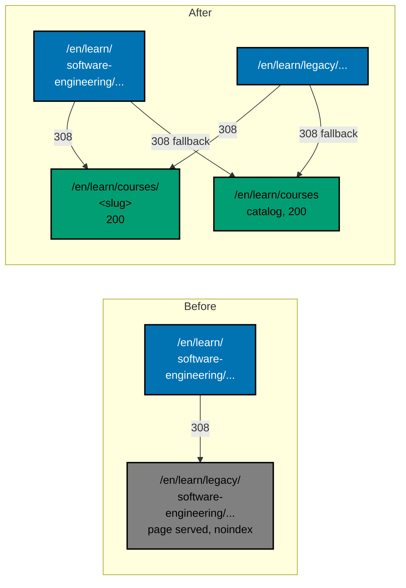

# 001 — Current State and Evidence

This page records what exists today, how each number was measured, and which commands re-measure it.
Every figure was measured on 2026-10-09 and 2026-10-10 against `origin/main` `bb7f90137` (the base the
whole series was authored on). Plans 01 to 13 change `main` before this plan runs, so Phase 0 of
[../delivery.md](../delivery.md) re-runs every command below and records any difference before it
trusts a number here. Commands are plain (no shell globs, loops, or here-documents) so they run under
the repository's command guard. `rtk` is the repository's token-saving command wrapper.

## The legacy tree

`apps/ayokoding-www/content/en/learn/legacy/` is a section of the English learning site. Its own
`_index.md` and `overview.md` call it "kept for reference while the course library fills".

| Fact                                                                    | Value                                                                                                                               | Command                                                                                                                                           |
| ----------------------------------------------------------------------- | ----------------------------------------------------------------------------------------------------------------------------------- | ------------------------------------------------------------------------------------------------------------------------------------------------- |
| Files under `learn/legacy/`                                             | 1,150, every one a `.md` file; there is no image, data file, or other asset                                                         | `find apps/ayokoding-www/content/en/learn/legacy -type f \| wc -l` and the same with `-name '*.md'`                                               |
| Words                                                                   | about 6.65 million (plan 10's measurement; whitespace tokens, front matter excluded)                                                | recorded in plan 10's mapping; not re-measured here                                                                                               |
| Public URLs                                                             | 1,150: one per file. `_index.md` is the directory URL, every other file is its path without `.md`                                   | `deriveSlug` in `src/features/content/shell/reader.ts` is the whole rule (no `slug:` override)                                                    |
| Top-level domains inside it                                             | six: `software-engineering`, `information-security`, `artificial-intelligence`, `it-governance`, `business`, `personal-development` | `ls apps/ayokoding-www/content/en/learn/legacy`                                                                                                   |
| Other children of `learn/`                                              | `courses/` (229 courses once plan 10 merges; 181 at authoring), `paths/` (8 path landings plus fixtures)                            | `ls apps/ayokoding-www/content/en/learn`                                                                                                          |
| Static assets that point into it (`public/`, `vercel.json`, Dockerfile) | none                                                                                                                                | `rtk git grep -n "learn/legacy" -- apps/ayokoding-www/public apps/ayokoding-www/vercel.json apps/ayokoding-www/Dockerfile .github` prints nothing |

The `id` locale has no `learn` section. Its library is `content/id/belajar/` (125 files, 22 folders). It
holds an Indonesian CliftonStrengths section at `belajar/manusia/peralatan/cliftonstrengths/`. Series
decision 35 says `content/id/**` stays untouched, so this plan adds no `/id/**` redirect and edits
nothing there. The `id` section is flagged to the user in [../README.md](../README.md#flags-for-the-user).

## The mapping this plan consumes

Plan 10 wrote `syllabus/legacy-to-course-mapping.md` and archived with its PR, so at execution time it
lives at `plans/done/<date>__ayokoding-learn-revamp-10-legacy-unique-migration/syllabus/legacy-to-course-mapping.md`.
It is this plan's only input for redirects and for the `docs/` repoint (series decision 34).

| Measure                           | Value                                                                                                                                                                                                   |
| --------------------------------- | ------------------------------------------------------------------------------------------------------------------------------------------------------------------------------------------------------- |
| Rows                              | 105: 104 path rows (98 directories, 6 single files) plus one row for 65 pure navigation files that has no path                                                                                          |
| Files per disposition             | `Covered` 43 rows and 394 files; `New course` 58 rows and 643 files; `Obsolete` 4 rows and 113 files (46 CliftonStrengths, 1 `business/overview.md`, 1 `infrastructure/by-concept` stub, 65 navigation) |
| Destinations                      | 74 distinct course slugs when only the first-listed slug of each row is used; the catalog `/en/learn/courses` for the 113 obsolete files                                                                |
| Prefix property                   | no row path is a segment-prefix of another, so at most one row matches any file (the redirect rules rely on it)                                                                                         |
| The 94-file `docs/` repoint table | 16 groups at the end of the same file                                                                                                                                                                   |

Plan 10 wrote a consumption rule that this plan restates: a `Covered` or `New course`
row redirects to `/en/learn/courses/<first-listed-slug>`; an `Obsolete` row, the navigation bucket, and
anything unmatched redirect to the catalog `/en/learn/courses`. Three defects were found in plan 10's first
draft of the mapping and corrected in plan 10's text before any execution. This plan still tolerates all three.
[002](./002-redirect-mechanism-and-url-inventory.md#tolerating-the-known-mapping-defects)
says how this plan tolerates each one and when it stops instead:

1. The header promises a seventh column, "Redirect destination for plan 14". The table has six. This
   plan computes the destination from the first-listed slug instead of reading a column.
2. The header says dispositions are lower case (`covered`, `new`, `obsolete`). The table writes
   `Covered`, `New course`, `Obsolete`. The parser normalizes the three words and fails on a fourth.
3. The header says "the series estimate of 308 redirects". 308 is the HTTP status code that
   `permanent: true` produces, not a count. The real count is derived in
   [002](./002-redirect-mechanism-and-url-inventory.md#rule-count).

Plan 10's executor may have corrected any of these when it ran. Phase 0 reads the as-merged file and
records which of the three still hold.

## How redirects work here

Next.js applies the `redirects()` array of `apps/ayokoding-www/next.config.ts` before it looks at any
page or file. Terms used throughout this plan:

- **Rule**: an object `{ source, destination, permanent }`. `permanent: true` makes Next.js answer
  with HTTP status **308 Permanent Redirect**, which clients and search engines cache. (Next.js docs,
  redirects, accessed 2026-10-10: "`permanent` `true` or `false` - if `true` will use the 308 status
  code which instructs clients/search engines to cache the redirect forever".)
- **First match wins**: rules are tried in array order and the first matching rule answers. Order is
  therefore part of the design.
- **Wildcard**: `/base/:path*` matches `/base` and everything below it. (Next.js docs: "`/blog/:slug*`
  matches `/blog`, `/blog/a`, and `/blog/a/b/c`".)
- **Hop**: one redirect response. A browser that follows `A -> B -> C` took two hops.
- **Trailing slash**: the site sets `trailingSlash: false`, so a request that ends in `/` gets one
  extra normalizing hop before the redirect rule applies.
- **`caseSensitiveRoutes: true`** is set, so `/EN/...` does not match `/en/...` rules; the locale-entry
  module lowercases it in a separate hop.

The array today is built from five modules in `src/redirects/` (rule counts measured by reading each
module; two of them generate their rules from a list):

| Module                  | Rules | Does                                                                                                                                                  | Fate in this plan                                                              |
| ----------------------- | ----- | ----------------------------------------------------------------------------------------------------------------------------------------------------- | ------------------------------------------------------------------------------ |
| `locale-entry.ts`       | 13    | `/` to `/en`; mixed-case `/EN`, `/En`, `/ID` forms to lower case                                                                                      | unchanged                                                                      |
| `content-namespace.ts`  | 5     | strips the retired `/c/` namespace: `/en/c/learn/x` to `/en/learn/x`                                                                                  | unchanged                                                                      |
| `learn-reorg.ts`        | 16    | historical renames inside `/en/learn/` (`human` to `personal-development`, `platform-web` to `platforms/web`, ...); the first few are temporary (307) | unchanged; its destinations are pre-IA addresses that the new rules then catch |
| `course-rehome.ts`      | 40    | generated from 37 `fundamentally-strong/software-engineer/<slug>` courses plus 3 retired roots (to `/en/learn/courses[/<slug>]`)                      | unchanged except one comment that names `learn-three-bucket.ts`                |
| `learn-three-bucket.ts` | 12    | generated from the six relocated domains: `/en/learn/<domain>[/...]` to `/en/learn/legacy/<domain>[/...]`                                             | **deleted** and replaced                                                       |

Plan 04 adds one more module, `learn-home.ts` (`/en/learn/overview` to `/en/learn`), and deletes
`content/en/learn/overview.md`. So `next.config.ts` spreads the modules in this order:
`localeEntryRedirects`, `contentNamespaceRedirects`, `learnReorgRedirects`, `courseRehomeRedirects`,
`learnHomeRedirects` (plan 04), `learnThreeBucketRedirects`. The last one is the module this plan
replaces, in the same last position. Today's total is 86 rules (74 kept plus 12 replaced); with plan 04
it is 75 kept.

Platform limit, measured 2026-10-10: the Next.js redirecting guide says "redirects may have a limit on
platforms. For example, on Vercel, there's a limit of 1,024 redirects" (a `vercel.json` array allows
2,048, per Vercel's knowledge-base article on redirect limits). The design in
[002](./002-redirect-mechanism-and-url-inventory.md#rule-count) adds 418 rules and removes 12, so the
total is about 493 (75 kept plus 418 new) and stays at roughly half the limit. Phase 0 recomputes the total from the as-merged
modules and stops if it would exceed 800.

## What references the legacy tree today (the measured list)

This is the complete list found by measurement, so nothing is discovered late. The detection commands
are chosen to match the legacy bucket and nothing else: the word "legacy" also appears in unrelated
code (plan 02's frozen `legacy-membership.ts` for old path manifests, comments about `fundamentally-strong`
courses and a "legacy model" benchmark label, the calculator's "legacy/standalone behaviour" comments),
and this plan leaves those alone.

Detection commands, all run from the repository root:

```text
rtk git grep -n -E "learn/legacy|learn-three-bucket|learnThreeBucket|isLegacySlug|legacy bucket|legacy-bucket" -- . ':!plans' ':!apps/ayokoding-www/content/en/learn/legacy' ':!local-tmp'
rtk git grep -n -E "structuralBuckets|\"legacy\"" -- apps/ayokoding-www apps/ayokoding-www-fe-e2e apps/ayokoding-www-be-e2e
rtk git grep -l "learn/legacy" -- docs
```

### Application source (6 files: one deleted, two code edits, three comment-only edits)

| File                                                                                                | What it holds                                                                     | Action                                                                      |
| --------------------------------------------------------------------------------------------------- | --------------------------------------------------------------------------------- | --------------------------------------------------------------------------- |
| `src/redirects/learn-three-bucket.ts`                                                               | the 12 pre-IA to legacy rules and `RELOCATED_DOMAINS`                             | delete; `RELOCATED_DOMAINS` moves into the new module                       |
| `next.config.ts`                                                                                    | the import (line 9), the order comment (lines 63 to 68), the spread (line 74)     | edit: use the new aggregator; rewrite the comment                           |
| `src/redirects/course-rehome.ts`                                                                    | doc comment names `learn-three-bucket.ts` (lines 9 and 92)                        | edit comment                                                                |
| `src/app/[locale]/(content)/[...slug]/page.tsx`                                                     | `isLegacySlug` (lines 78 to 86) and a `noindex` metadata branch (line 115)        | remove the function, the branch, and its comment: the pages no longer exist |
| `src/features/course-paths/shell/course-library.ts`, `src/features/navigation/shell/breadcrumb.tsx` | one comment each that mentions "legacy" pages and mockups (lines 16 and 89 to 91) | edit the comment text only                                                  |

Everything else the reader sees about the bucket is **content-driven**, so deleting the tree removes it
without a code change: the sidebar, the Learn landing and `_index.md` link lists, the browse index, the
breadcrumb trail, `sitemap.xml` (`src/app/sitemap.ts` reads the content index), `feed.xml`, the search
data (`src/features/search/shell/generate-search-data.ts` reads the content repository), and
`robots.ts` (allows everything and must keep doing so). No file under `src/` other than the four above
names the bucket. The search data and `_index.md` files are generated, so they are regenerated rather than
edited.

Plan 04 also leaves a Legacy hook that this plan removes: the Learn home shows the line "Looking for
older material? Legacy" (i18n key `homeLegacyPrompt`, English and Indonesian values) "until plan 14
removes it". Phase 0 locates the as-merged component and message files.

### Tests, step files, and specs (16 existing test-side files and 4 features, plus hidden dependencies)

| Layer         | File                                                                                                                 | What it does with the bucket                                                                                               | Action                                                                                    |
| ------------- | -------------------------------------------------------------------------------------------------------------------- | -------------------------------------------------------------------------------------------------------------------------- | ----------------------------------------------------------------------------------------- |
| unit (node)   | `tests/unit/redirects/learn-three-bucket.unit.test.ts`                                                               | 9 tests of the 12 rules                                                                                                    | delete; replaced by the new redirect unit test                                            |
| unit-fe       | `tests/unit/fe-steps/learn-three-bucket.steps.tsx`                                                                   | binds the whole feature; holds the `applyOne`/`followRedirects` simulator                                                  | delete; simulator moves to a shared helper                                                |
| unit-fe       | `tests/unit/fe-steps/learn-reorg-redirects.steps.tsx`                                                                | expects `platform-web` to end at `/en/learn/legacy/software-engineering/platforms/web` (lines 25 to 41)                    | edit expectation (ends at the catalog)                                                    |
| unit-fe       | `tests/unit/fe-steps/ia-navigation-revamp.steps.tsx`                                                                 | uses `learn/legacy/software-engineering[/data]` slugs for bare-URL, breadcrumb, canonical, and feed scenarios (13 lines)   | edit: use a real course slug                                                              |
| unit-fe       | `tests/unit/features/navigation/shell/breadcrumb.test.tsx`                                                           | a 375 px wrap test whose crumbs are `Home / Learn / Software Engineering / Legacy / Data Structures` (lines 120 to 200)    | edit: use a course path of the same length                                                |
| unit (node)   | `tests/unit/app/[locale]/(content)/[...slug]/page.unit.test.ts`                                                      | "noindexes a legacy-bucket slug" (lines 65 to 74)                                                                          | delete that test; keep the non-legacy one                                                 |
| integration   | `tests/integration/fe-steps/learn-three-bucket.steps.ts`                                                             | reads the real `content/en/learn` directory and expects `["courses","legacy","paths"]`                                     | delete; its bucket scenario moves                                                         |
| integration   | `tests/integration/fe-steps/ia-navigation-revamp.steps.ts`                                                           | expects the sitemap to contain `/en/learn/legacy/software-engineering` (line 49)                                           | flip to "sitemap lists no legacy URL"                                                     |
| fe-e2e        | `apps/ayokoding-www-fe-e2e/tests/e2e/steps/learn-three-bucket.steps.ts`                                              | the same bucket check against the real directory                                                                           | delete                                                                                    |
| fe-e2e        | `.../steps/ia-navigation-revamp.steps.ts`                                                                            | opens a legacy page, expects the sitemap to hold a legacy URL (lines 46, 125 to 127)                                       | edit                                                                                      |
| fe-e2e        | `.../steps/content-rendering.steps.ts`                                                                               | six scenarios open legacy pages for code highlighting, callout, tabs, steps, inline math, and block math (lines 62 to 183) | rebind to a fixture page ([004](./004-code-spec-and-test-migration.md#rendering-fixture)) |
| fe-e2e        | `.../steps/code-block-copy.steps.ts`                                                                                 | the Mermaid copy-button scenario opens a legacy page (line 41)                                                             | rebind to the same fixture page                                                           |
| be-e2e        | `apps/ayokoding-www-be-e2e/tests/e2e/steps/learn-three-bucket.steps.ts`                                              | the same bucket check plus the redirect steps                                                                              | delete; its redirect steps move to the new step file                                      |
| be-e2e config | `apps/ayokoding-www-be-e2e/behaviour-coverage.json`, `project.json` (7 references), `playwright.config.ts` (line 22) | list `learn-three-bucket.feature` and its unit step file by name                                                           | edit: name the new feature and steps                                                      |
| spec          | `specs/.../frontend/navigation/learn-three-bucket.feature`                                                           | 87 lines, 10 scenarios                                                                                                     | delete; replaced by `learn-legacy-removal.feature`                                        |
| spec          | `.../navigation/ia-navigation-revamp.feature`                                                                        | three scenarios use legacy URLs (lines 13, 75, 103)                                                                        | edit                                                                                      |
| spec          | `.../navigation/learn-reorg-redirects.feature`                                                                       | one scenario ends at a legacy address (14 lines)                                                                           | edit                                                                                      |
| spec          | `.../navigation/navigation.feature`                                                                                  | plan 04's scenario "The Learn sidebar lists Paths, Courses, and Legacy in that order"                                      | edit: Paths and Courses only                                                              |

Plan 10 adds one more file that this plan retires: `tests/unit/be-steps/legacy-mapping.steps.ts` with
its feature `backend/content/legacy-mapping-completeness.feature`. It walks the real legacy tree, so it
cannot survive the deletion. Plan 10's other new tests (course completion, catalog counts) do not touch
the tree and stay. The unrelated `tests/unit/be-steps/reader.unit.test.ts` uses a legacy-looking path
only as a string for `deriveSlug` and needs no change.

**Hidden dependencies, found by two further censuses** (measured 2026-10-10; method in
[004](./004-code-spec-and-test-migration.md#the-two-censuses-that-found-hidden-dependencies)). The bucket
grep above cannot see a test that depends on legacy content without naming the bucket. Two more
dependencies exist, adding 6 test-side files and 2 features to the 16 and 4 above:

| Layer                                   | File                                                                                                                                                                                                                                                                                             | Dependency                                                                                                                                                                        |
| --------------------------------------- | ------------------------------------------------------------------------------------------------------------------------------------------------------------------------------------------------------------------------------------------------------------------------------------------------ | --------------------------------------------------------------------------------------------------------------------------------------------------------------------------------- |
| spec and unit-fe                        | `.../navigation/architecture-cases-routes.feature` (3 scenarios) and `tests/unit/fe-steps/architecture-cases-routes.steps.tsx`                                                                                                                                                                   | opens the pre-IA addresses of the legacy "cases" pages and expects HTTP 200 plus three legacy-only headings; the fe-e2e project runs it against the real server                   |
| spec, unit, integration, be-e2e, fe-e2e | `specs/.../backend/search/search-api.feature` (scenario "Search is scoped to the requested locale") and five step or mock files: unit `search-api.steps.ts` and `helpers/test-service.ts`, integration `search-api.steps.ts`, be-e2e `search-api.steps.ts`, fe-e2e `backend-search-api.steps.ts` | asserts an English page titled "Spring Security Basics", which exists only at `legacy/software-engineering/platforms/web/tools/jvm-spring/in-the-field/spring-security-basics.md` |

Also found, and fine: the search terms "goroutines" and "programming" used by the same scenarios still
match non-legacy content (`courses/csp-style-concurrency` and others); the title "Beginner Examples"
appears on 79 course pages.

### Content outside the tree (3 files)

| File                                                                                                                         | What                                                                                                           | Action                                                                                                                            |
| ---------------------------------------------------------------------------------------------------------------------------- | -------------------------------------------------------------------------------------------------------------- | --------------------------------------------------------------------------------------------------------------------------------- |
| `content/en/learn/_index.md`                                                                                                 | generated link list; lines 193 to 200 hold the Legacy entry and six children                                   | regenerate (`generate-indexes`); never hand-edit                                                                                  |
| `content/en/learn/overview.md`                                                                                               | line 15 and 17 describe the Legacy bucket                                                                      | plan 04 deletes this file; Phase 0 confirms it is gone, else edit                                                                 |
| `content/en/rants/2023/04/my-cliftonstrengths-journey-it-makes-me-more-confident-to-take-the-engineering-management-path.md` | six links (lines 16 and 18) to `/en/learn/personal-development/tools/cliftonstrengths/...` pages, now obsolete | unlink the six anchors and keep their text ([007](./007-decision-records.md#d8-the-2023-rant-keeps-its-text-and-loses-six-links)) |

### `docs/` (94 files, 158 occurrences)

`rtk git grep -l "learn/legacy" -- docs` lists 94 files and `rtk git grep -c "learn/legacy" -- docs`
sums to 158 occurrences. Every link is a relative repository path of the form
`../../../../../../apps/ayokoding-www/content/en/learn/legacy/...`, which is the form the linking
convention requires. They fall into the 16 groups of the mapping's repoint table, written out in
[003](./003-docs-repoint-and-link-validation.md#the-sixteen-groups).

### Rules, skills, and conventions

| Surface                                                                                                             | What it says                                                                                                                                   | Action                                                                              |
| ------------------------------------------------------------------------------------------------------------------- | ---------------------------------------------------------------------------------------------------------------------------------------------- | ----------------------------------------------------------------------------------- |
| `repo-governance/conventions/writing/fp-variant-multi-language/scope-and-tabbed-format.md` (line 12)                | scope is "all FP-variant by-example files under `.../learn/legacy/software-engineering/software-architecture/*/in-fp-by-example/`" (4 folders) | rescope                                                                             |
| `repo-governance/conventions/writing/fp-variant-multi-language/references.md` (lines 24 to 27)                      | four links to those folders' overview pages                                                                                                    | remove the four links                                                               |
| `repo-governance/development/quality/gate-adapters/ayokoding-www.md` ("Tree shape" bullet)                          | after plan 06's correction: a sentence keeping the legacy tree's `<domain>/<area>/<topic>/` shape                                              | remove the legacy sentence                                                          |
| `.agents/skills/apps-ayokoding-www-developing-content/reference/canonical-content-tree-shape.md`                    | after plan 06: the old four-layer diagram kept under a "Legacy tree" heading plus the "Current top-level domains" list                         | remove both                                                                         |
| `repo-governance/conventions/structure/learning-plan-syllabus/copy-paste-course-template.md` (line 98)              | a lineage example that says "a prior narrative in `legacy/<path>`"                                                                             | reword the example                                                                  |
| `repo-governance/conventions/linking/internal-ayokoding-references/*`, `.../programming-language-docs-separation/*` | many examples with the pre-IA address shape (`learn/software-engineering/programming-languages/...`) and absolute `ayokoding.com` URLs         | **reported, not edited** (they pre-date the legacy bucket and are not caused by it) |

About 13 files and 60 lines of such older example paths exist (`rtk git grep -n -E "ayokoding-www/content/en/learn/(software-engineering|information-security|artificial-intelligence)" -- repo-governance .agents`).
They are stale before this plan and removing the legacy bucket does not change their correctness
(they show the shape of a path, not a live link), so this plan lists them in its final report and does
not edit them. See [005](./005-rules-and-docs-impact.md).

## Current and target flow


