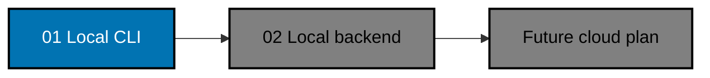

# FERRET Init 01 — Standalone Local CLI

> **Status:** Backlog — first delivery in the FERRET initialization chain.

Build a fail-open, local-first telemetry client for Claude Code, Codex, and OpenCode. The client records
strict lifecycle metadata in one per-user SQLite database, remains useful without any server, and exposes
only the most recent 30 days. Physical bytes are reclaimed on the next FERRET operation, so an inactive
machine can retain expired bytes until FERRET runs again. This slice creates no network client, backend, frontend, cloud resource, or
semantic quality score.

FERRET means **Framework for Evaluation, Regression, Reliability & Experiment Tracking**. In this first
slice, FERRET answers which observable agents, skills, and tools run, how often they finish, and how long
they take. It does not decide whether an answer was good or whether a skill caused an outcome.

## Dependency Chain

## Scope

- `apps/ferret-cli`: Python 3.14 command-line application with a standard-library-only runtime.
- `apps/ferret-cli-e2e`: Python subprocess E2E project against the built CLI artifact.
- One machine-global SQLite store per operating-system user, shared across repositories and harnesses.
- Strict metadata-only lifecycle envelope and privacy validation.
- Local status, filtering, JSON Lines export, usage summaries, and operational outcome summaries.
- Best-available fail-open capture adapters for Claude Code, Codex, and OpenCode on macOS/Linux POSIX.
- Windows-portable local initialization, storage, queries, exports, analytics, and maintenance; Windows harness
  adapters are deferred until a supported harness exposes/test infrastructure proves an equivalent launcher.
- Thirty-day logical retention, opportunity-based physical reclamation, storage measurement, and explicit
  field-level visibility gaps.
- Python/Nx, BDD coverage, harness-binding, and rules-governance updates required by these projects.

## Non-Goals

- `ferret-be`, PostgreSQL, HTTP, OpenAPI, GraphQL, MCP, remote delivery, or authentication.
- A frontend or dashboard.
- Prompt, response, transcript, tool-argument, tool-result, environment-value, or secret collection.
- Human ratings, semantic grading, causal attribution, benchmark suites, or experiment orchestration.
- Cloud deployment or CI policy enforcement.

## Resulting Main State

Developers can install `ferret`, capture lifecycle metadata from supported harness surfaces, inspect and
export the last 30 days locally, and remove FERRET without affecting harness execution. Backend state is
neither required nor assumed. The later backend plan consumes this stable event contract and preserves all
standalone behavior.

## Navigation

- [Business requirements](brd.md)
- [Product requirements and Gherkin acceptance criteria](prd.md)
- [Technical design](tech-docs/README.md)
- [Execution checklist](delivery.md)
- [Execution learnings](learnings.md)
- [Next plan](../ferret-init-02-local-backend/README.md)
