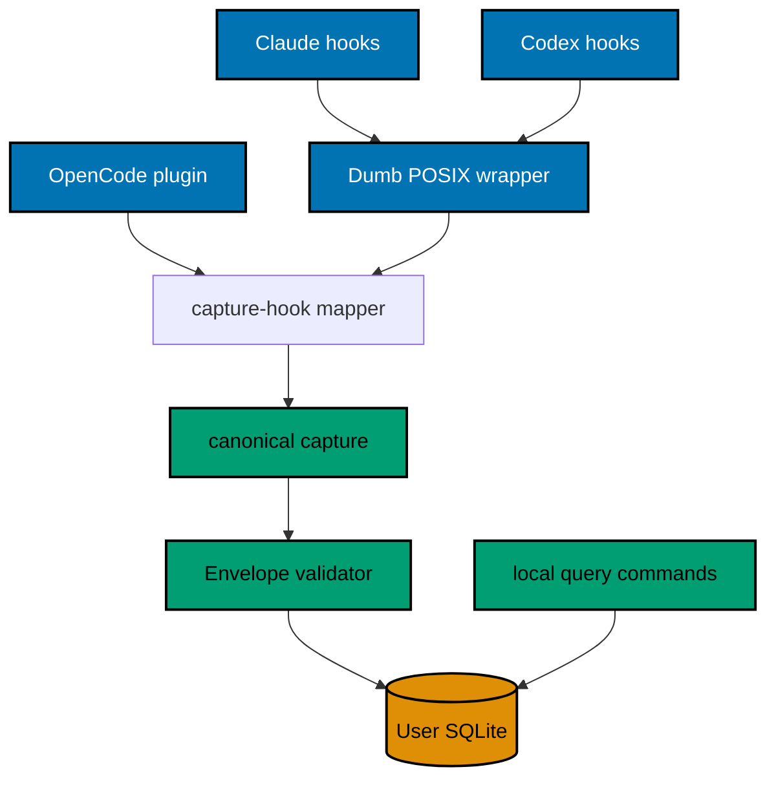

# Architecture and Harness Contracts

## Context

FERRET sits beside coding-agent harnesses, not inside their correctness path. Each adapter passes one bounded
raw vendor payload to a short-lived Python `capture-hook` process. Only Python allowlists, maps,
pseudonymizes, canonicalizes, and hashes it. The CLI commits to SQLite before returning. Query commands read the same store. Nothing in
this plan opens a socket.

## Project Boundaries

### `apps/ferret-cli`

- Owns command parsing, strict metadata types, privacy validation, identity derivation, SQLite migrations,
  repositories, retention, analytics, formatting, and the zipapp build.
- Runtime dependencies are empty. It uses `argparse`, `dataclasses`, `datetime`, `hashlib`, `hmac`, `json`,
  `os`, `pathlib`, `secrets`, `sqlite3`, `statistics`, `sys`, `uuid`, and other standard-library modules only.
- Development dependencies are locked with `uv`: pytest, pytest-bdd, coverage.py, Pyright, and Ruff.
- **[Web-cited]** Requires Python `>=3.14,<3.15`; `.python-version` pins `3.14.7`. The official
  [Python 3.14.7 release](https://www.python.org/downloads/release/python-3147/) (accessed 2026-09-18) states
  release date 2026-08-05. Phase 0 amends the plan if repository compatibility or availability changes.

### `apps/ferret-cli-e2e`

- Owns only the public-process E2E adapter for the CLI owner's Gherkin corpus.
- Builds/installs the real Plan 01 artifact in an isolated temporary environment and invokes it by subprocess.
- Has no independent feature corpus, Unit target, or Integration target.

## CLI Boundary

The executable name is `ferret`. The build produces `dist/ferret.pyz`. Canonical Nx `install` runs
`uv sync --locked` for both Python projects; `run` invokes the built artifact. The distinct command
`python dist/ferret.pyz self install --target user` places the launcher/artifact in the per-user executable
directory. Installation/removal never edits shell startup files automatically.

### Command behavior

- `init` is idempotent. It creates private directories, an installation UUIDv4, a 32-byte secret, config,
  and the current schema inside one exclusive initialization transaction.
- `capture` accepts one canonical UTF-8 event, maximum 16 KiB. `capture-hook` accepts one raw harness JSON
  object, maximum 256 KiB, and delegates to a harness-specific Python allowlist mapper before canonical capture.
  Exact grammar, invariants, hashes, JSON outputs, errors, and examples are in the CLI contract companion.
- `events list` and `events export` accept `--from`, `--to`, `--harness`, `--workspace`, `--event-type`,
  `--agent`, `--skill`, `--tool`, and `--outcome`. Local pagination uses an opaque base64url cursor encoding
  the last `(occurred_at, event_id)` pair and is not promised compatible with Plan 02's HTTP cursor.
- `usage` and `outcomes` accept the frozen closed filters and dimensions. Duration statistics include only
  observed/derived non-negative values and use the exact fields fixed in the CLI contract.
- `status --json` is the machine-readable operational surface. Human output derives from the same result type.
- Every read logically excludes expired telemetry. When maintenance is due, the first subsequent operation
  first attempts a foreground prune in its own transaction before the main operation. It deletes at most 100
  rows and runs for at most 100 ms measured by a monotonic clock, stopping at the first limit. Lock acquisition
  consumes that budget; lock/timeout skips pruning without advancing the maintenance marker. Explicit
  `maintenance` repeats those transactions, checkpoints WAL only when safe, and uses a threshold rather than
  `VACUUM` on every run. There is no scheduler.

Direct commands use exit `0` for success, `2` for CLI/validation errors, `3` for unavailable/unsafe storage,
and `4` for integrity failure. They never put a rejected value in diagnostics. The adapter boundary ignores
these codes and always returns `0`.

## Capture Transaction

Canonical `capture` performs this sequence:

1. Read and size-check stdin before opening SQLite.
2. Parse a JSON object with duplicate-key rejection.
3. Reject unknown fields and validate every scalar/enumeration/length.
4. Validate the already opaque installation/workspace/session identifiers; never derive them again.
5. Canonicalize the event, recompute its SHA-256 hash, and set the 30-day expiry.
6. If maintenance is due, open a prune connection and attempt a separate `BEGIN IMMEDIATE`. Delete stable-key
   rows until 100 rows or 100 monotonic milliseconds, whichever occurs first, then commit and close. If the
   lock cannot be obtained within the remaining prune budget or the prune times out, roll back/close, do not
   advance `last_completed_at`, and continue. If a limit is reached with expired rows remaining, commit the
   deleted rows but leave the marker unchanged so the next operation continues.
7. Open a fresh capture connection with the normal 250 ms busy timeout and required PRAGMAs.
8. Start a separate `BEGIN IMMEDIATE`, insert by unique `event_id`, commit immediately, and close.

Before step 1, `capture-hook` alone reads the larger raw payload, applies its harness-specific Python allowlist,
derives opaque IDs, constructs the canonical Event, discards raw bytes, and enters this sequence. Successful
hook return is therefore synchronous with durable commit. Reconfiguration takes the same exclusive lock as
capture: a process observes either the complete old registration/config snapshot or the complete new one,
never a mixture. Prune failure never prevents the capture transaction from being attempted within the existing
1,000 ms hook deadline; logical expiry remains authoritative even when no physical row is deleted.

The CLI performs no filesystem scan, network request, export, summary, checkpoint, or cleanup inside the write
transaction. The direct command returns an error for an ID collision with different content and idempotent
success for the same ID/hash pair.

## Harness Adapter Contract

### Shared shell wrapper

`.claude/hooks/ferret-capture.sh` is the dumb POSIX wrapper consumed by macOS/Linux Claude Code and Codex
bindings. It locates `FERRET_BIN` or `PATH`, forwards stdin byte-for-byte to `ferret capture-hook` with static
registration arguments, redirects both streams, supervises/terminates the child, and exits zero. It never
parses JSON, interpolates payload text, or writes raw input. Harness-specific Python mappers own privacy-safe
projection in memory. OpenCode also forwards its bounded raw plugin JSON to that Python command; its TypeScript
plugin does not parse into the canonical envelope, pseudonymize, hash, or open SQLite.

Frequent events use the harness/plugin asynchronous registration and must return control within 50 ms; their
child still has a one-second total lifetime. Session-end/terminal events wait for the local commit for at most
1,000 ms. SQLite busy timeout is 250 ms. The POSIX wrapper starts a watchdog, sends TERM at 900 ms and KILL at
1,000 ms, reaps both child/watchdog, suppresses streams, and exits zero. OpenCode uses an equivalent
`AbortController`/child TERM→KILL policy. Missing-binary resolution must finish within 50 ms. Normal-operation
p95 target is 150 ms; all paths have 1,000 ms absolute maximum. Timeout can lose telemetry and never retries in
the hook. Windows has no lifecycle adapter in v1.

### Capability matrix

`observed` means an official, stable lifecycle event supplies the value. `derived` means a documented,
deterministic mapping from another official signal. `unknown` means the harness does not expose a verified
signal. Phase 0 records the exact current versions and payload evidence before editing bindings.

| Capability                    | Claude Code                                                           | Codex                                              | OpenCode                                                               |
| ----------------------------- | --------------------------------------------------------------------- | -------------------------------------------------- | ---------------------------------------------------------------------- |
| Session start/end             | Expected observed from lifecycle hooks                                | Expected observed where registered hooks expose it | Start expected; end remains probe-gated                                |
| Agent/subagent start/end      | Expected observed                                                     | Expected observed where current hooks expose it    | Parent/child relation remains probe-gated                              |
| Tool start/completion/failure | Expected observed                                                     | Expected observed                                  | Expected observed from plugin tool events                              |
| Skill invocation              | Observed only through verified skill hook/tool signal                 | **Unknown**; no implicit-skill inference           | Observed only when the payload identifies the skill tool unambiguously |
| Outcome/duration              | Observed when terminal payload supplies it; otherwise derived/unknown | Same                                               | Same                                                                   |

The implementation stores independent subject, outcome, and duration visibility on each event and documents unobserved
surfaces in `status`. It never stores a synthetic "zero invocations" row.

### Platform support

macOS and Linux POSIX own lifecycle adapter/E2E support. Windows owns only Python CLI-local init, SQLite,
query/export/analytics, retention, and JSON contracts. Windows hook/plugin launchers, deadline semantics, and
harness E2E are out of scope. Revisit when a supported Windows harness lifecycle surface and repository Windows
CI runner can prove equivalent fail-open/no-output/deadline/privacy behavior; until then status reports adapter
state `unsupported_platform`, not zero usage.

### Exact binding surfaces

- `.claude/settings.json`: hand-authored source registrations for verified events.
- `.codex/hooks.json`: hand-authored source registrations pointing to the canonical wrapper.
- `.opencode/plugins/ferret.ts`: hand-authored OpenCode project plugin; the plural `plugins` location is
  verified against the installed/current OpenCode contract in Phase 0.
- `repo-config.yml`: ownership, harness parity, generated-binding, and project/tag declarations.
- `.claude/skills/harness-compatibility-protocol/` and its generated `.agents/skills/` mirror plus the platform
  catalog: durable capability/parity rules, regenerated through the canonical binding workflow. OpenCode reads
  the canonical skill natively; this plan creates no `.opencode/skills/` or `.opencode/agents/` change.

## Failure Semantics

- Missing executable: adapter exits `0`; no event exists.
- Invalid/oversized raw or canonical payload: adapter exits `0`; direct capture returns `2` with a value-free
  diagnostic; raw bytes are never spooled/logged.
- Busy timeout, disk full, permissions, or corruption: adapter exits `0`; no claim of losslessness is made.
- Duplicate event ID and identical hash: idempotent success.
- Duplicate event ID and different hash: rejected conflict; original row preserved.
- Unsupported lifecycle: adapter emits nothing and capability remains `unknown`.
- Unexpected adapter exception: suppress output, return `0`, and do not mutate harness payload/response.

Fail-open protects the coding workflow, not telemetry completeness. `status` explains that disk, permission,
corruption, process termination, and the retention limit can lose observations.
