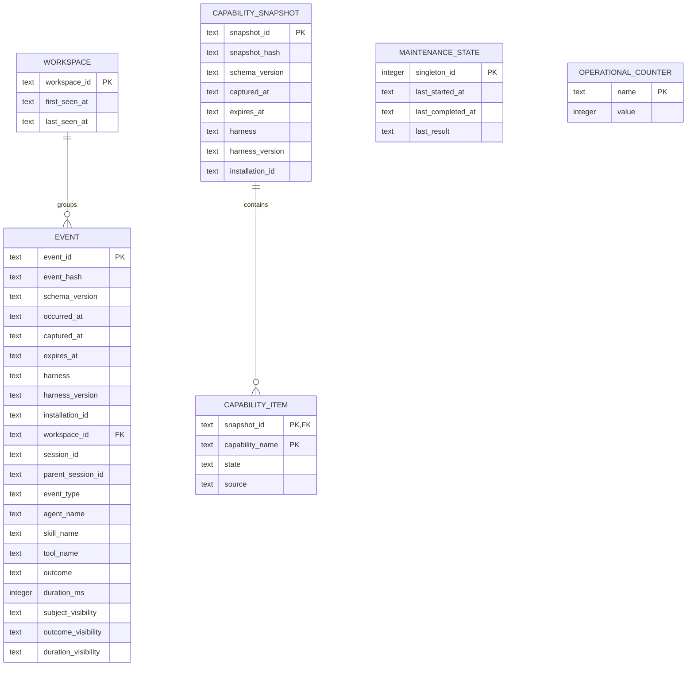

# SQLite Schema, Privacy, and Retention

## Data Model



The HMAC key is never stored in SQLite; exact data-home files are fixed in the CLI contract. `WORKSPACE` has no
human/path label. Capability items cascade when their snapshot expires. `CAPABILITY_ITEM` has composite primary
key `(snapshot_id, capability_name)`, so the same name may appear in multiple snapshots but not twice in one
snapshot. `MAINTENANCE_STATE` keeps only the latest run and is operational state, not history.
`OPERATIONAL_COUNTER` contains lifetime scalar counts with no
timestamp/identity. Plan 01 increments `expired_local_total` when an Event or capability snapshot that has never
had a delivery state is physically removed after expiry and keeps `expired_before_ack_total` exactly zero. Plan 02 gives the latter its only meaning: events or capability snapshots deleted while
`pending`, `leased`, or `rejected` and therefore never acknowledged. Migration never reclassifies prior local
expiry as before-ack expiry.

## Event Field Contract

| Field                 | Type and constraint                         | Meaning and privacy                                 | Lifecycle                       |
| --------------------- | ------------------------------------------- | --------------------------------------------------- | ------------------------------- |
| `schema_version`      | text, enum `1.0`                            | Canonical envelope contract                         | Immutable                       |
| `event_id`            | lowercase UUIDv4 text, primary key          | Producer-generated idempotency key                  | Immutable; deleted at retention |
| `event_hash`          | 64 lowercase hex, not independently unique  | SHA-256 over canonical allowed fields except itself | Immutable                       |
| `occurred_at`         | RFC 3339 UTC with millisecond precision     | Harness event time; no local timezone               | Immutable                       |
| `captured_at`         | RFC 3339 UTC with millisecond precision     | CLI receipt time                                    | Immutable                       |
| `expires_at`          | `captured_at + 30 days`                     | Logical retention boundary                          | Immutable                       |
| `harness`             | enum `claude_code`, `codex`, `opencode`     | Source product, not a user identity                 | Immutable                       |
| `harness_version`     | nullable text, 1–64 safe characters         | Version only when exposed                           | Immutable                       |
| `installation_id`     | opaque UUIDv4 text matching `identity.json` | FERRET installation, not OS username                | Immutable                       |
| `workspace_id`        | `ws_` + 32 lowercase hex                    | HMAC of normalized root; raw path never persists    | Immutable                       |
| `session_id`          | `ss_` + 32 lowercase hex                    | HMAC of harness-native value                        | Immutable                       |
| `parent_session_id`   | nullable same format                        | Parent relationship only when observed              | Immutable                       |
| `event_type`          | closed enum from PRD                        | Lifecycle fact                                      | Immutable                       |
| `agent_name`          | nullable normalized text, max 128           | Catalog/custom name; no path or content             | Immutable                       |
| `skill_name`          | nullable normalized text, max 128           | Skill identifier when observed                      | Immutable                       |
| `tool_name`           | nullable normalized text, max 128           | Tool identifier when observed                       | Immutable                       |
| `outcome`             | closed enum                                 | Operational terminal state                          | Immutable                       |
| `duration_ms`         | nullable integer, 0–86,400,000              | Observed/derived duration only                      | Immutable                       |
| `subject_visibility`  | closed visibility enum                      | Provenance/availability of agent/skill/tool subject | Immutable                       |
| `outcome_visibility`  | closed visibility enum                      | Provenance/availability of operational outcome      | Immutable                       |
| `duration_visibility` | closed visibility enum                      | Provenance/availability of duration                 | Immutable                       |

Names allow Unicode letters/numbers plus `-`, `_`, `.`, `:`, `/` only when `/` is part of a logical tool
identifier; reject absolute paths, `..` segments, control characters, line breaks, shell metacharacters, and
URI credentials. The event-type-specific validator requires only relevant name fields and requires all
irrelevant subject fields null. Additional JSON properties are forbidden at every object level. The exact
event/capability schemas and canonical hash algorithm are in
[the shared data contract](005-cli-and-shared-data-contract.md).

## Indexes and Query Bounds

- Primary key on `event_id`.
- No independent hash uniqueness exists. Conflict logic reads by primary-key `event_id`, then compares the
  recomputed hash in constant time; different event IDs may never be deduplicated by hash alone.
- Ordered indexes on `(occurred_at, event_id)`, `(harness, occurred_at, event_id)`,
  `(workspace_id, occurred_at, event_id)`, `(event_type, occurred_at, event_id)`, and
  `(expires_at, event_id)`.
- Do not add separate agent/skill/tool indexes before the final benchmark proves a real query need. Filtered
  local reports remain bounded by a default seven-day interval and 200-row page; `--all-time` is explicit.

Every query names projected columns and uses bound parameters. No string interpolation or `SELECT *` enters
runtime code.

## SQLite Runtime Contract

Every connection applies and verifies:

```sql
PRAGMA journal_mode = WAL;

PRAGMA synchronous = FULL;

PRAGMA foreign_keys = ON;

PRAGMA busy_timeout = 250;
```

**[Web-cited]** SQLite WAL permits concurrent readers but serializes writers, so capture transactions remain
short. The official [WAL documentation](https://sqlite.org/wal.html) (accessed 2026-09-18) states that all
processes must be on the same host and WAL does not work over a network filesystem.
The override validator rejects relative paths, URL-like paths, Windows UNC paths, and mount types the platform
probe identifies as remote. If the platform cannot establish a local filesystem, initialization refuses the
override and tells the user to choose the default or a verified local path.

**[Web-cited]** The official [synchronous PRAGMA](https://sqlite.org/pragma.html#pragma_synchronous) (accessed
2026-09-18) describes `FULL` as using additional WAL synchronization for durability. The official
[Python 3.14 sqlite3 documentation](https://docs.python.org/3.14/library/sqlite3.html) (accessed 2026-09-18)
documents `sqlite3` as the DB-API interface to SQLite; it is the runtime dependency used here.

## Schema Creation and Evolution

The empty old contract is "no FERRET data home." Plan 01 creates schema version `1` through numbered,
transactional SQL migrations packaged in the zipapp. Initialization uses an exclusive application lock plus
SQLite transaction so concurrent `init` calls converge. The migration table records version, checksum, and UTC
application time.

Plan 01 has no earlier reader/writer compatibility obligation. Within this delivery, new code must open an
older schema only by applying all known forward migrations; it refuses a newer unknown schema without writing.
Plan 02 must use `expand → migrate → verify → contract` for delivery columns and preserve Plan 01 reads during
its migration.

Rollback does not delete user data. Reverting application code leaves the last schema intact; a compatible
older binary either reads it or refuses safely. Destructive downgrade is never automatic. Recovery exports
valid rows from a copied database after an integrity failure; it never mutates the only copy.

## Retention and Space Reclamation

Logical expiry is exactly `expires_at <= injected_now`. Every reader applies `expires_at > injected_now` before
ordering, pagination, export, or aggregation, including while physical maintenance is inactive. There is no
daemon or scheduler, so an inactive installation may retain expired physical bytes. On the first subsequent
FERRET operation after maintenance becomes due, the command attempts a separate prune transaction before its
main operation. It deletes at most 100 rows and consumes at most 100 ms measured by a monotonic clock, stopping
at the first limit. Lock acquisition consumes the same budget. Lock failure or timeout rolls back, skips
physical pruning, leaves `last_completed_at` unchanged, and does not block the main operation. If 100 rows or
100 ms is reached with expired rows remaining, the partial batch commits but the marker remains unchanged.
Explicit maintenance repeats the same transactions until none remain.

Maintenance deletes expired `EVENT` and `CAPABILITY_SNAPSHOT` rows (cascading items), then deletes every
`WORKSPACE` with no retained event, all in primary-key-stable bounded transactions. Every bounded prune
transaction increments `expired_local_total` by exactly the number of Events plus capability snapshots it
deletes, atomically in that same commit; workspace/item cascades do not add counts. A rollback changes neither
rows nor counter. Only a final transaction that observes no expired Event/snapshot advances
`last_completed_at`; partial commits never do. Schema migration rows,
`config.json`, `identity.json`, and `identity.key` are durable non-telemetry installation state. The two
lifetime expiry counters are deliberately retained aggregate health state: they contain no time, identity,
subject, or usage dimension. `expired_local_total` increments for each local-only Event or snapshot removed;
`expired_before_ack_total` stays zero in Plan 01.

Maintenance commits each batch and stops at its numeric boundary. The foreground operation remains valid if
page reclamation cannot complete: logical exclusion is authoritative, while status reports unreclaimed bytes.
It then performs `wal_checkpoint(TRUNCATE)` only when no active writer/read transaction blocks it. Physical
database compaction runs only when free pages exceed both an absolute and proportional threshold determined by
the final benchmark; it uses the safest SQLite strategy supported by the delivered version and enough free
disk. A failed compaction preserves the readable original.

Status separately reports logical rows, database bytes, WAL bytes, free pages, last maintenance result,
oldest capture, near-expiry rows within 72 hours, `expired_local_total`, and `expired_before_ack_total`. Unit,
Integration, and E2E proof first queries every read surface before pruning, then inspects every usage-derived
table after pruning. It fails if an expired Event or snapshot is observable, or if a physically pruned Event,
capability snapshot/item, or orphan workspace association survives. The E2E benchmark stores only synthetic
aggregate results, not the generated database.

The crash fixture commits one partial prune, terminates before the next/final transaction, then restarts. It
proves the committed deletion count already equals the `expired_local_total` increment, restart counts only
newly deleted rows, the final total equals all deleted Events/snapshots exactly once, `last_completed_at` moves
only after no expired row remains, and `expired_before_ack_total` stays zero.

The cross-plan migration fixture begins with nonzero `expired_local_total` and zero
`expired_before_ack_total`. Adding delivery state preserves both values; only later expiry of a `pending`,
`leased`, or `rejected` row can increment `expired_before_ack_total`.

## Storage Benchmark Contract

Generate deterministic event mixes matching the capability distribution and lengths at 100,000 rows. Measure:

1. empty schema bytes;
2. database/WAL bytes after insertion but before checkpoint;
3. database/index/WAL bytes after checkpoint;
4. bytes per row and index share;
5. elapsed capture distribution under single and bounded concurrent writers;
6. bytes after expiring 50% of rows;
7. bytes after the documented reclamation action.

Project 5,000, 20,000, and 100,000 events/day for 30 days. A result outside 0.7–1.5 KiB/event or a peak that
would surprise the status estimate blocks completion until the schema/index policy or documented budget is
corrected.
