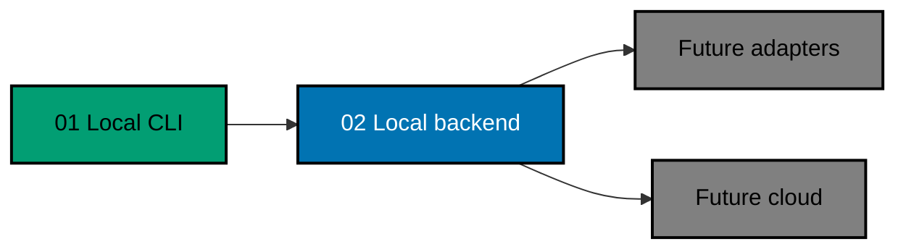

# FERRET Init 02 — Protocol-Independent Local Backend

**Evidence scope:** Existing repository and Plan 01 facts are **[Repo-grounded]**; every Plan 02 path, interface,
limit, and target is an approved **[Judgment call — new artifact]** unless marked otherwise.

> **Status:** Backlog — blocked until FERRET Init 01 is merged and archived on `origin/main`, its terminal audit
> passes, and its canonical cleanup proves the Plan 01 worktree plus local/remote delivery branch absent.

Add a local FastAPI/PostgreSQL backend and reliable optional synchronization to the standalone FERRET CLI.
The backend uses hexagonal ports-and-adapters architecture so REST/OpenAPI is the first inbound adapter while
future GraphQL and MCP adapters can reuse the same application/domain services without replacing persistence or
ingestion logic.

This slice remains local-only. It provides raw-event and aggregate query APIs for scripts; it creates no
frontend, GraphQL endpoint, MCP server, subscription transport, pub/sub infrastructure, or cloud deployment.

## Dependency Chain

## Scope

- `apps/ferret-be`: Python FastAPI application, protocol-independent application/domain core, SQLAlchemy 2,
  Alembic, psycopg, and PostgreSQL.
- `apps/ferret-be-e2e`: TypeScript/Playwright API E2E project consuming the backend owner corpus.
- Contract-first OpenAPI 3.1 REST adapter for batch ingestion, raw queries, usage/outcome analytics, and
  capability queries.
- Loopback bearer-token authentication for every data endpoint.
- CLI configuration, durable lease/outbox state, manual sync, and five-minute opportunistic detached sync.
- At-least-once delivery with per-event acknowledgement and backend idempotency.
- Explicit backend pruning command and measured PostgreSQL storage/WAL/index growth.
- Hexagonal architecture and post-commit change-publisher port that make later GraphQL/MCP adapters additive.

## Non-Goals

- GraphQL schema, query, mutation, subscription, WebSocket, SSE, Strawberry, or pub/sub implementation.
- MCP tools/resources/prompts, JSON-RPC endpoint, MCP SDK, stdio, or Streamable HTTP implementation.
- A dashboard/frontend, cloud deployment, multi-user internet authentication, semantic grading, human ratings,
  experiments, regression baselines, or CI enforcement.
- Replacing automatic hook → CLI → REST synchronization with an agent-invoked MCP tool.

## Resulting Main State

The delivered Plan 01 CLI remains fully functional with backend synchronization disabled. A developer may
start a loopback PostgreSQL/FastAPI stack, generate a private local token, configure the CLI, synchronize
durable batches, and query raw or aggregate data through REST. Domain/application code is independent of REST,
FastAPI, SQLAlchemy, GraphQL, and MCP, so later protocol adapters attach through tested ports.

## Navigation

- [Business requirements](brd.md)
- [Product requirements and Gherkin acceptance criteria](prd.md)
- [Technical design](tech-docs/README.md)
- [Execution checklist](delivery.md)
- [Execution learnings](learnings.md)
- Prerequisite plan: [2026-09-21: ferret-init-01-local-cli](../../done/2026-09-21__ferret-init-01-local-cli/README.md). Plan 01 is archived, so Plan 02 is
  no longer blocked on it.
