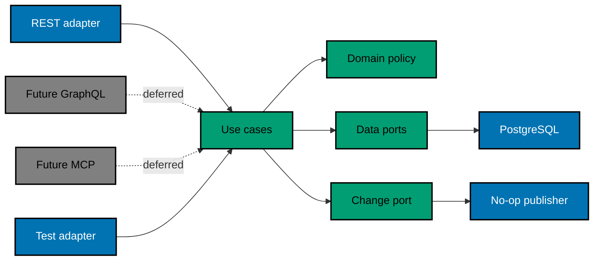

# Hexagonal Architecture and Protocol Extension

> **Evidence scope:** Inspected repository boundaries are **[Repo-grounded]**. Every FERRET module, port, type,
> symbol, and fitness-test path is an approved **[Judgment call — new artifact]**.

## Context and Dependency Rule

FERRET needs a simple REST path now and may need GraphQL dashboard queries/subscriptions and MCP tools/resources
later. The stable product behaviour is ingestion, querying, analytics, capability interpretation, authorization,
and retention—not any transport. Protocols are inbound adapters; PostgreSQL and change publication are outbound
adapters.



The source dependency rule is absolute:

```text
adapters/inbound/*  ─┐
adapters/outbound/* ─┴─> application/* ─> domain/*
```

Domain and application modules may import only Python standard library and their inward dependencies. They may
not import FastAPI, Starlette, Pydantic transport models, SQLAlchemy, Alembic, psycopg, Strawberry, GraphQL, an
MCP SDK, HTTP status codes, JSON-RPC codes, or database row models. Architecture fitness tests parse imports and
exercise package boundaries; Pyright enforces type contracts.

## Application Model

Use frozen dataclasses and enums for internal commands/results. Do not reuse OpenAPI/Pydantic models.

### Inbound use cases

| Use case               | Command/query                                                                                           | Result                                               |
| ---------------------- | ------------------------------------------------------------------------------------------------------- | ---------------------------------------------------- |
| `IngestTelemetryBatch` | authenticated principal, request ID, tuple of canonical events, tuple of versioned capability snapshots | ordered event/snapshot statuses and aggregate counts |
| `ListEvents`           | principal, immutable filter, page size, decoded cursor                                                  | immutable event page and next cursor state           |
| `SummarizeUsage`       | principal, time/filter/group selection                                                                  | grouped counts plus subject-visibility totals        |
| `SummarizeOutcomes`    | principal, time/filter/group selection                                                                  | outcome/duration aggregates plus disclaimer code     |
| `ListCapabilities`     | principal, optional harness/version filter                                                              | capability states/evidence timestamps                |
| `PruneEvents`          | operator principal, cutoff, execute flag                                                                | eligible/deleted counts and storage estimate         |

REST handlers construct these inputs, call exactly one use case, and serialize the result. They do not issue SQL,
commit, calculate analytics, interpret idempotency, or publish changes.

### Internal principal and authorization

`Principal` contains only `subject_id`, `authentication_method`, and closed scopes. Plan 02 has one local
principal derived from the matching token and scopes `events:write`, `events:read`, `analytics:read`, and
`capabilities:read`. The management CLI creates an operator principal for pruning. Adapters extract credentials;
application policy checks scope. Later GraphQL/MCP adapters must map credentials to the same principal and cannot
bypass policy by calling repositories directly.

### Typed errors

Application errors use closed codes: `unauthorized`, `forbidden`, `invalid_filter`, `invalid_cursor`,
`invalid_event`, `event_id_conflict`, `batch_too_large`, `not_ready`, `storage_unavailable`, and
`concurrency_conflict`. They contain safe field names/indices and retryability, never tokens, raw event payloads,
SQL, or exception strings. REST maps these to the problem schema; future GraphQL/MCP adapters own their own wire
mapping.

## Outbound Ports

Use `typing.Protocol` interfaces:

- `EventRepository`: lookup IDs/hashes, insert immutable events, list a bounded ordered page, aggregate
  usage/outcomes, list capabilities, count/delete before cutoff.
- `UnitOfWork`: async context manager exposing repositories, `commit`, and `rollback`; use cases never assume a
  global session.
- `Clock`: UTC `now` for deterministic retention/readiness/tests.
- `RequestIdFactory`: UUID generation for safe correlation.
- `ChangePublisher`: publish a tuple of typed notices only after commit.

The SQLAlchemy adapter implements repository/unit-of-work ports with explicit projections, bound values,
finite timeouts, and transactions. Core tests use in-memory fakes, not SQLite; PostgreSQL behaviour belongs to
Integration tests.

## Commit and Change Publication

`IngestTelemetryBatch` validates pure domain invariants and recomputes every event/snapshot hash before starting
a transaction, resolves all IDs/hashes in bounded queries, inserts valid new rows, persists capability
snapshots, commits, then publishes:

- `TelemetryAccepted(event_ids, snapshot_ids, occurred_min, occurred_max)` with IDs only;
- `AnalyticsInvalidated(occurred_min, occurred_max, dimensions)` with closed dimensions only.

Plan 02's production publisher is no-op. Tests use an in-memory recorder and prove no notice on validation
failure, rollback, or commit error. Publication failure after commit is logged as a safe operational error and
does not roll back committed data or alter the HTTP ACK; future durable realtime delivery must introduce an
outbox in its own plan.

This seam prevents later GraphQL subscriptions/MCP notifications from coupling to FastAPI handlers. It is not a
claim of durable notification delivery.

## REST Adapter

The FastAPI adapter owns:

- bearer extraction and constant-time token comparison;
- request size/media type/JSON parsing and OpenAPI-local Pydantic models;
- UTC/query/cursor parsing;
- call into one application use case;
- application error → HTTP problem mapping;
- response headers, JSON serialization, and OpenAPI exposure.

The canonical OpenAPI 3.1 document is contract-first. A deterministic comparison normalizes the checked-in
contract and FastAPI-generated schema, then fails on operation/schema/security drift. CLI request/response
fixtures validate against the same JSON Schema components. No generated Python model/client is committed.

## Deferred GraphQL Adapter

A future plan may add Strawberry because FastAPI officially supports combining ASGI-compatible GraphQL
libraries and recommends Strawberry as a typed option. Resolvers call application use cases; they do not call
REST or repositories. GraphQL owns SDL, field authorization, complexity/depth limits, batching, pagination,
errors, and evolution.

Subscriptions are not implemented now. Official GraphQL guidance notes that subscriptions use long-lived
requests, commonly need pub/sub, reconnect/race handling, and more complicated scaling. A future dashboard must
demonstrate frequent incremental updates that justify this cost; otherwise polling/refetch remains simpler.

Authoritative references (accessed 2026-09-18):

- [FastAPI GraphQL integration](https://fastapi.tiangolo.com/how-to/graphql/) — FastAPI can mount a compatible
  GraphQL library and identifies Strawberry as a typed option.
- [GraphQL subscriptions](https://graphql.org/learn/subscriptions/) — subscriptions are long-lived operations
  and commonly depend on a publish/subscribe source.

## Deferred MCP Adapter

A future MCP server maps analytics/search to tools and safe summaries/capabilities to resources. Optional batch
ingestion may exist, but automatic lifecycle capture remains CLI → REST because MCP tool invocation depends on
the host/agent choosing the tool. MCP is a JSON-RPC, capability-negotiated protocol with tools/resources and
notifications, not an alternate REST media type. The adapter owns discovery, tool/resource schemas, consent/
authorization, protocol errors, and stdio versus Streamable HTTP transport.

Plan 02 imports no MCP SDK and defines no `/mcp` endpoint. The future plan re-verifies the then-current stable MCP
specification rather than pinning this plan's authoring-era version.

Authoritative references (accessed 2026-09-18):

- [MCP July 2026 release](https://blog.modelcontextprotocol.io/posts/2026-07-28/) — the release keeps the
  protocol core stateless while extending capabilities around it. A future adapter must recheck the then-current
  normative specification rather than treating this release post as the wire contract.

## Fitness and Conformance Proof

1. Import rule tests scan `domain/` and `application/` and fail on framework/adapter dependencies.
2. Core Unit tests run with fake repository/unit-of-work/clock/publisher only.
3. A framework-free fake inbound adapter maps a neutral mapping to each application input and result.
4. REST and fake-adapter conformance fixtures assert equivalent authorization decisions, filters, pagination
   semantics, idempotency results, aggregates, and stable application error codes.
5. Adding a future adapter must pass the same conformance suite without modifying core expected results.
