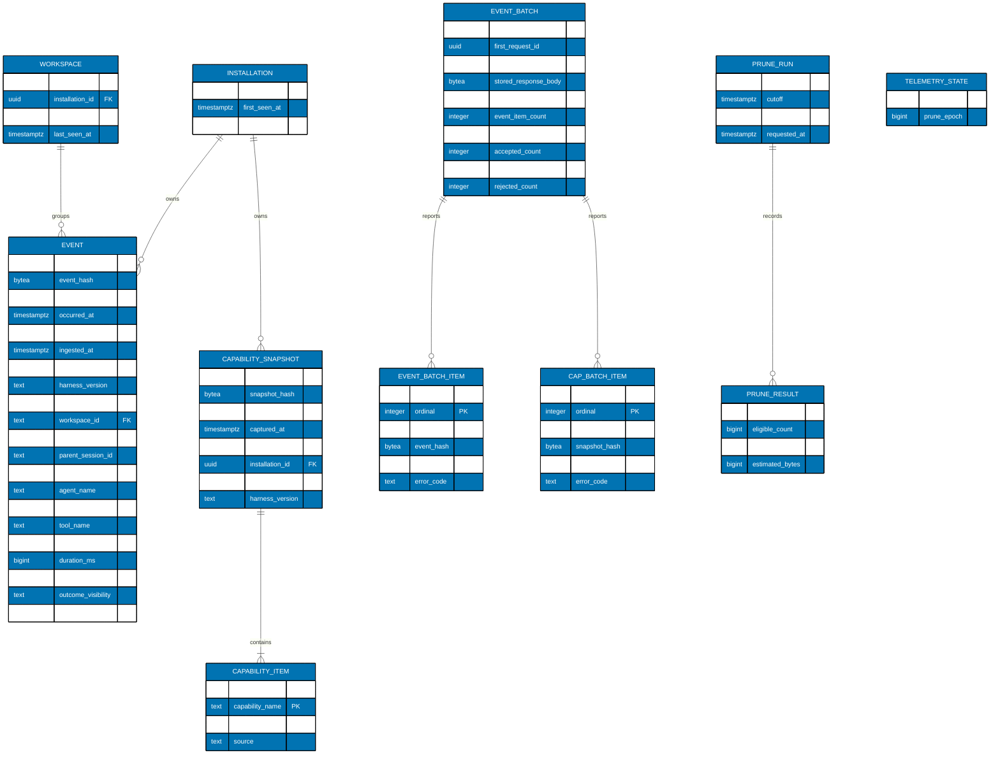
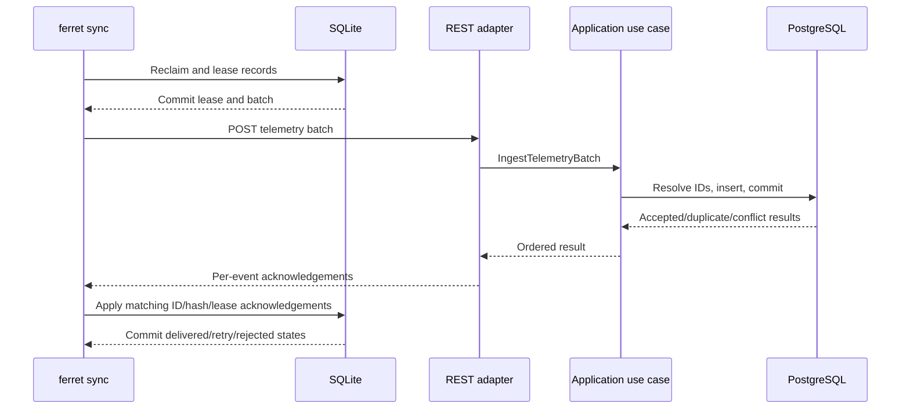

# Persistence, Synchronization, Migration, and Recovery

**Evidence scope:** Existing Plan 01 contracts and repository patterns are **[Repo-grounded]**. Every table,
column, constraint, migration, cursor field, and command introduced here is an approved **[Judgment call — new
artifact]** until implementation evidence replaces that label. Storage envelopes remain **[Unverified]** until
the Phase 2 benchmark records measured values.

## PostgreSQL Data Model

Diagram-only abbreviations: `CAP_BATCH_ITEM` is the `CAPABILITY_BATCH_ITEM` table and `cap_item_count` is `EVENT_BATCH.capability_item_count`.

`EVENT_BATCH.stored_response_body` contains the canonical UTF-8 bytes of only the closed acknowledgement response, never the request, token, or event
content. Batch item event/snapshot ID/hash columns are response evidence, not foreign keys, because a rejected item
has no event row. An event row is immutable after insert. Workspace/
installation timestamps may advance on successful ingestion. Capability snapshots are immutable. The latest
capability view is selected by descending `(captured_at,snapshot_id)` for each installation/harness/version/name;
the server never invents provenance or silently rewrites one snapshot into another.

## PostgreSQL Field and Constraint Contract

- `event_id`: UUID primary key; producer-owned. `event_hash`: `bytea`, exactly 32 bytes; same-ID/different-hash
  is conflict. The database does not declare the digest globally unique; idempotency always resolves the
  producer-owned ID and compares its recomputed digest.
- The lossless Event mapping is exact: `schema_version text`, `event_id uuid`, `event_hash bytea(32)`,
  `occurred_at timestamptz`, `captured_at timestamptz`, `harness text`, `harness_version text`,
  `installation_id uuid`, `workspace_id text`, `session_id text`, nullable `parent_session_id text`,
  `event_type text`, nullable `agent_name text`, nullable `skill_name text`, nullable `tool_name text`,
  `outcome text`, nullable `duration_ms bigint`, `subject_visibility text`, `outcome_visibility text`,
  `duration_visibility text`, and server-only `ingested_at timestamptz`.
  JSON→domain→PostgreSQL→domain→JSON must reproduce every client field and the exact RFC 3339 millisecond
  values. PostgreSQL preserves instants internally; the adapter emits UTC with exactly three fractional digits.
- Closed values, bounds, nullability, and event-specific invariants are those in Plan 01
  `005-cli-and-shared-data-contract.md`; duplicate definitions are forbidden. The server recomputes the
  language-neutral canonical hash and constant-time compares it before any lookup/insert. Python and TypeScript
  execute the Plan 01 fixed vectors, including expected Event digest
  `199aa6c2a595c64fe8603f860e4480d71a7888cd4f54c49c5f4fbc79fb060a3c` and CapabilitySnapshot digest
  `6d3ccc88afa715385e7b04aa0056e1455ae679906354d18bc5d0113c474a6590`.
- Capability snapshot columns map every Plan 01 field; items have composite primary key
  `(snapshot_id,capability_name)`. `capability_name`, `state`, and `source` use Plan 01's exact closed vocabulary.
  Event rows independently preserve Plan 01's `subject_visibility`, `outcome_visibility`, and
  `duration_visibility` fields with the four-state visibility enum. Same snapshot ID/same recomputed hash is
  duplicate; same ID/different hash is conflict. No server-owned documentation provenance replaces the client
  `source` value.
- `event_batch.batch_id` is the only replay identity. It is unique, carries a 32-byte canonical `request_hash`,
  stores the exact closed acknowledgement response bytes, and records the first request ID only for safe correlation.
  The HTTP `X-Request-ID` is not an idempotency key and is not unique. Same batch ID plus the same recomputed hash
  returns the byte-equivalent stored JSON response (apart from transport headers); same batch ID plus a different
  hash returns `409 batch_id_conflict` without changing stored rows.
- `event_batch_item` primary key is `(batch_id,ordinal)` and unique key is `(batch_id,event_id)`;
  `capability_batch_item` primary key is `(batch_id,ordinal)` and unique key is `(batch_id,snapshot_id)`. Both
  cascade on batch deletion. Ordinals are zero-based, non-negative, and strictly lower than their corresponding
  batch count. Status is exactly `accepted`, `duplicate`, or `rejected`; `error_code` is non-null only for
  `rejected`. Batch counts are non-negative, event plus capability count is 1–500, and acknowledgement counts sum
  to that total. A deferred constraint trigger verifies the two child-row counts, contiguous ordinals, and stored
  response counts before commit, so replay can never reconstruct a partial result.
- `ingested_at`: server clock; never supplied by client.
- Foreign keys use explicit deletion behaviour. Batch-item IDs/hashes are intentionally not event/snapshot
  foreign keys and Plan 02 pruning retains batch replay rows plus `stored_response`; an identical replay after
  prune returns the historical stored acknowledgement and does not resurrect telemetry. Storage measurements
  report replay-audit bytes separately. Deleting replay history needs a future explicit retention contract.
- `telemetry_state` has exactly the row `singleton_id=1`, `prune_epoch >= 0`; every successful execute-prune locks
  it and increments `prune_epoch` in the same transaction as deletion. Dry runs do not increment it.
- Indexes begin with `(occurred_at DESC, event_id DESC)`, filter prefixes proven by query plans, and the unique
  batch key. Do not index every optional dimension blindly; the storage/query benchmark decides.
- Every runtime query uses explicit projection, bound parameters, cancellation, finite statement/lock timeout,
  and bounded page/group dimensions. No `SELECT *`, string-interpolated SQL, N+1 event lookup, or unbounded
  grouping.

## Cursor Watermark and Prune-Epoch Contract

The first page of every raw-event or aggregate traversal reads one transactionally consistent pair: current
`telemetry_state.prune_epoch` and event watermark `MAX(ingested_at,event_id)`. Its HMAC-protected cursor contains
`version`, `endpoint`, `filterDigest`, `limit`, `pruneEpoch`, `watermark.ingestedAt`, `watermark.eventId`, and the
endpoint's complete last-result key. Every later page first compares the encoded epoch with the current row. A
mismatch returns stable HTTP `409` code `cursor_invalidated`; it never silently continues against pruned data.
If the epoch matches, every page applies `(ingested_at,event_id) <= watermark` plus the endpoint keyset. Records
committed after page one—including backdated events—remain outside that traversal. This is insert-stable, not a
promise that rows survive explicit prune.

Capability traversal uses its own first-page watermark `MAX(ingested_at,snapshot_id)` and the same prune epoch.
The eligible relation is restricted to snapshots at or below that watermark _before_ ranking. For each
`(installation_id,harness,harness_version,capability_name)`, select the latest item by
`(captured_at DESC,snapshot_id DESC)`, then order the response uniquely by
`(installation_id ASC,harness ASC,harness_version ASC,capability_name ASC)`. The signed cursor contains that full
last key plus `watermark.ingestedAt` and `watermark.snapshotId`. Thus a later snapshot cannot replace a row
mid-traversal, and two installations with otherwise identical capability keys cannot skip or duplicate rows.

Cursor decoding rejects a changed filter, limit, endpoint, unknown version, invalid signature, malformed key, or
future watermark as `400 invalid_cursor`; only a valid cursor whose prune epoch is stale returns
`409 cursor_invalidated`. Real-PostgreSQL tests pause between pages to cover recent/backdated inserts, two
installations with identical capability keys, later capability snapshots, and execute-prune races for raw and
aggregate endpoints. No traversal holds a database transaction open between HTTP requests.

## CLI SQLite Expansion

Plan 02 adds an additive `backend` table and delivery columns/indexes to Plan 01:

The singleton backend row uses ID `local`, `enabled` boolean, loopback `base_url`, absolute private
`token_file_path`, fixed `sync_interval_seconds=300`, `next_opportunity_at`, nullable
`automatic_auth_disabled_at`, monotonically increasing `config_revision`, and created/updated UTC timestamps.
It stores no bearer value. The absolute token path is local configuration and never enters an event, export,
HTTP payload, log, metric, or evidence artifact.

| Field              | Type/constraint                                       | Purpose                       | Clearing/retention                     |
| ------------------ | ----------------------------------------------------- | ----------------------------- | -------------------------------------- |
| `backend_id`       | text, closed local ID                                 | Separates future destinations | config removal retains row state       |
| `delivery_state`   | `local`, `pending`, `leased`, `delivered`, `rejected` | Durable state machine         | row still expires at 30 days           |
| `attempt_count`    | non-negative integer                                  | Backoff/status                | deleted with event                     |
| `last_attempt_at`  | nullable UTC text                                     | Diagnostics                   | deleted with event                     |
| `next_attempt_at`  | nullable UTC text                                     | Eligibility                   | cleared on delivery/reconfigure policy |
| `lease_id`         | nullable UUID text                                    | ACK ownership                 | cleared on release/delivery            |
| `lease_expires_at` | nullable UTC text                                     | Crash recovery                | expired lease reclaimable              |
| `last_error_code`  | nullable closed safe code                             | Local diagnosis               | never stores exception/body/token      |
| `acknowledged_at`  | nullable UTC text                                     | Delivery proof                | immutable after delivered              |

Existing Plan 01 rows and capability snapshots start `local`. Delivery metadata applies to both record kinds.
Enabling a backend moves eligible retained `local` records to `pending` in bounded transactions; disabling the
backend preserves states and stops automatic attempts. Delivered/rejected records remain locally queryable
until the same 30-day cutoff.

Capture and backend reconfiguration use one atomic state rule. Every capture begins `BEGIN IMMEDIATE`, reads
the singleton backend `enabled` and `config_revision`, and inserts the event plus any new capability snapshot in
that same transaction: disabled means `local` with null delivery revision; enabled means `pending` with the
observed revision. Enable/reconfigure also takes `BEGIN IMMEDIATE`, increments `config_revision`, and converts
retained `local` records to `pending` before commit. It refuses while a non-expired lease exists; the operator
must wait for expiry or run the documented lease-reclaim path. Pending records are relabelled to the new
revision; delivered records are never resent; rejected records stay rejected. Token-only rotation increments
the revision without changing record states. Disable preserves pending/leased/rejected records but makes all
new captures local. These serialized transactions eliminate an enabled-but-local race.

SQLite counter `expired_local_total` (status field `expiredLocalTotal`) is incremented for any `local` event or
capability snapshot removed by retention. SQLite counter `expired_before_ack_total` (status field
`expiredBeforeAckTotal`) is never retroactively populated: it starts at zero during Plan 02 migration and is
incremented only when a `pending`, `leased`, or `rejected` event or capability snapshot is deleted without an
accepted/duplicate ACK. Delivered records do not increment either counter. This is the sole meaning in both
plans and status output.

## Lease and Sync Algorithm

Rules:

1. Reclaim leases whose expiry is strictly before the injected clock.
2. Select at most 500 total pending events plus capability snapshots whose `next_attempt_at` is due, oldest
   first; generate one lease ID with a
   two-minute expiry, update them atomically, and commit.
3. Build a request not exceeding 1 MiB. If 500 rows exceed it, choose the largest prefix that fits; a single
   oversized canonical event is a local permanent rejection (the Plan 01 16 KiB limit normally prevents it).
4. Perform HTTP outside SQLite with a ten-second socket/attempt deadline enforced by the standard-library
   transport boundary; use no automatic library retry.
5. For a 2xx batch response, validate that the response `X-Request-ID` header equals the current HTTP exchange's
   request ID. Validate the body `requestId` as a UUID, but do not require it to equal that current header: an
   identical `batchId`/request-hash replay returns the stored original body request ID. Apply an ACK only after
   the response batch ID, request hash identity, complete event and snapshot item cardinality/order, record IDs,
   hashes, and status enums match the leased batch. Retry acceptance never keys on either request ID.
   Malformed/incomplete ACK is retryable for the whole unresolved lease.
6. In one transaction, apply only rows still holding the same lease. Accepted/duplicate → delivered;
   permanent validation/conflict → rejected; retryable item → pending with next attempt.
7. Network timeout/refusal, HTTP 429, and 5xx release the lease to pending. Backoff starts at five seconds,
   doubles per attempt to a one-hour ceiling, and adds deterministic-per-event jitter in the 0–20% range. Honor
   a valid `Retry-After` only up to one hour. A 401 disables automatic sync until config/token changes.
8. Process crash anywhere is safe: pre-lease leaves pending; post-lease reclaims; post-backend-commit resends and
   receives duplicate; post-ACK commit is delivered.

Capture only commits a new local event and, when due, launches detached `ferret sync --once`. It neither leases
nor performs HTTP in the capture process.

## Schema Migration and Compatibility

### SQLite: expand → migrate → verify → contract

1. **Expand:** add nullable delivery columns, backend table, indexes, and new schema version while Plan 01 query
   code still reads event columns.
2. **Migrate:** set existing rows to `local`; create default disabled backend config; initialize counters.
3. **Verify:** reconcile total rows, IDs/hashes, cutoff timestamps, state counts, indexes, and old local command
   output against a copied fixture and fresh database.
4. **Contract:** make delivery columns non-null/defaulted where SQLite rebuild semantics require it only after
   the new reader/writer is exclusive. Preserve downgrade refusal rather than destructive rollback.

### PostgreSQL: initial Alembic contract

Apply migrations with a dedicated migration role; runtime receives only required DML rights. Fresh upgrade,
current upgrade, downgrade of an empty Test database, and upgrade-after-downgrade all pass. A populated rollback
never destroys the only copy. Because this is the first backend schema, mixed old backend versions do not exist;
CLI compatibility is the contract-first `/api/v1` wire version.

Migration observability records version/checksum/timing and sanitized errors. Readiness is false while schema is
missing, ahead, migrating, or inaccessible. Liveness remains process-only.

## Retention, Pruning, and Storage

PostgreSQL has no automatic age retention in Plan 02. `events prune --before` uses application/management ports,
is dry-run by default, reports eligible rows and estimated heap/index bytes, and requires `--execute`. Execution
deletes in bounded transactions with exact cutoff semantics, writes a safe prune audit, runs `ANALYZE`, and
reports that physical disk reclamation may require normal vacuum or separately authorized maintenance.

Benchmark deterministic 100,000- and 1,000,000-event mixes and report:

- heap, TOAST, each index, sequences/catalog attributable bytes;
- WAL bytes generated for batch sizes 1, 100, and 500;
- insert/duplicate/conflict latency and query latency at p50/p95/max;
- `EXPLAIN (ANALYZE, BUFFERS)` only on isolated synthetic data for every query family;
- bytes/event and monthly projections for 5k/20k/100k events/day;
- dry-run estimate, bounded delete duration, dead tuples, vacuum effect, and reclaimed filesystem bytes when
  the safe local procedure explicitly performs compaction.

The provisional 1–2 KiB/event is a reservation estimate, not an acceptance truth. Actual measured results and
indexes become the operational contract.

## Recovery and Rollback

- Backend outage: CLI retains/retries within its 30-day hard limit.
- Token loss: generate a new token, restart BE, reconfigure CLI; never recover/print the old token.
- PostgreSQL corruption/loss: stop writes, preserve volume, restore through repository-standard backup/restore
  procedure if one exists; local pending rows can resend, but delivered rows older than the local window may be
  unrecoverable. Do not claim complete disaster recovery in this local-only plan.
- Bad migration: readiness stays false; revert application, restore a copied/Test database, or apply a forward
  fix. Never auto-downgrade populated production-like data.
- Source rollback: disable CLI backend first, remove REST listener/runner, then revert backend/migration code.
  Keep SQLite delivery columns and PostgreSQL volume unless the user explicitly authorizes data deletion.
