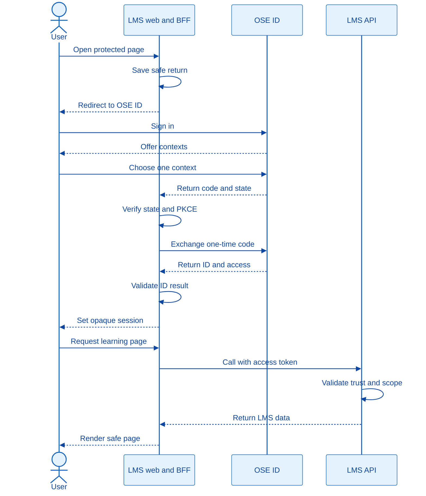
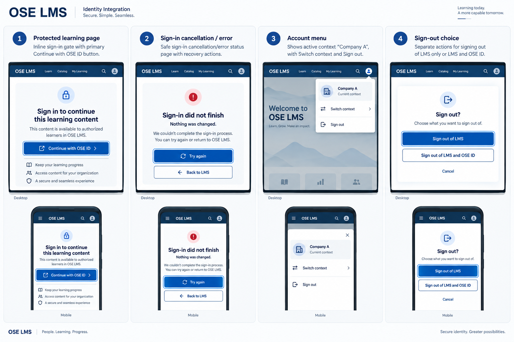
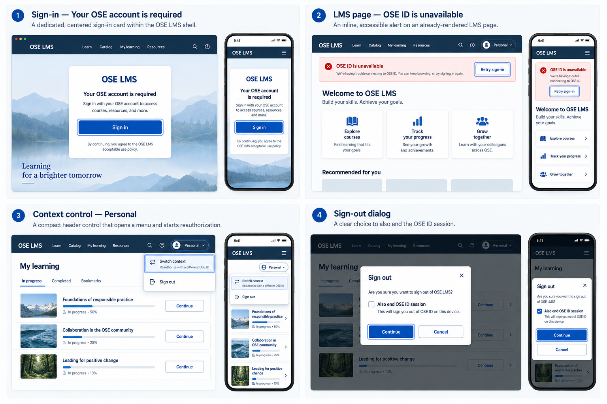

# Product Requirements — LMS User Identity Integration

## Product Overview

OSE LMS becomes the first consuming application of OSE ID. A browser starts sign-in from LMS, OSE ID
authenticates the person and confirms an entitled personal or company context, and LMS establishes its
own secure application session. The LMS API validates an access token intended for its audience before
applying LMS-local roles.

The browser owner is concrete: `ose-lms-app-web`, a Next.js BFF/UI at local port 3400. It is separate
from the GRC-focused `ose-app-web`. This plan also creates `ose-lms-app-web-e2e` and the canonical
`specs/apps/ose/lms-app-web/` owner corpus.

## Personas

- **Personal LMS user:** enters the product without belonging to a company.
- **LMS user:** enters the product through the shared OSE sign-in experience.
- **Multi-company member:** selects the company whose LMS tenant they intend to use.
- **LMS product administrator:** manages learning roles inside LMS, not identity membership.
- **Developer/tester:** starts a full authenticated local stack from one command.

## User Stories

- As an entitled person, I can sign into LMS in personal context without a fake company.
- As an entitled company member, I can sign into LMS through OSE ID and return to the original safe page.
- As a member of multiple companies, I can select one LMS-entitled company and later switch by
  reauthorizing.
- As a logged-in user, I can sign out of LMS and choose whether to end only LMS or the upstream OSE ID
  session where supported.
- As an LMS developer, I can run the app with OSE ID locally without real Google credentials.
- As an LMS API, I reject tokens that are not issued for me or no longer carry valid context.

## Public Contract

- LMS uses OIDC Authorization Code with PKCE S256 and exact registered redirect/logout URIs.
- The local client ID is `ose-lms-app-web-local`; redirect URI is
  `http://127.0.0.1:3400/auth/oidc/callback`; post-logout URI is
  `http://127.0.0.1:3400/auth/signed-out`.
- The API audience is `urn:ose:lms-api`; requested scopes are
  `openid profile ose.context ose.lms`; required product-entry entitlement is `lms.access`.
- The principal key is `(iss, sub)`. Email/name are mutable display attributes.
- The resource-server access token requires the OSE LMS audience, LMS scope/entitlement, approved
  algorithm/signature, valid time claims, and exactly one recognized context shape:
  `context_type=personal` with no `company_id`, or `context_type=company` with exactly one active
  `company_id`.
- LMS domain roles are loaded locally after external identity and tenant validation; identity claims do
  not directly grant instructor, learner, course-owner, or grading permission.
- Browser tokens remain server-side; the browser receives an opaque Secure/HttpOnly/SameSite session.
- Direct API clients do not obtain passwords or tokens from LMS; they use the upstream issuer's
  supported flows.

## User, LMS, and OSE ID Sequence

The browser crosses the OSE ID boundary only through redirects. LMS keeps protocol artifacts in its
BFF, creates its own opaque browser session after validation, and calls the LMS API with an access
token whose audience and context are revalidated by the resource server.



## UI Design Funnel

### Grounding and prior-art evidence

Before implementation, inventory the delivered OSE ID sign-in/context/error pages, the current
`ose-app-web` shell, and relevant `libs/web-ui` stories. Record component names, spacing/type tokens,
focus/error patterns, and supported breakpoints in `evidence/phase-1-ui-inventory.md`; reuse does not
mean importing application code from another app.

Record a web-researcher evidence note in `evidence/phase-1-prior-art.md` with access date, short supporting
excerpts, and direct sources for: OIDC relying-party initiation/callback safety, GOV.UK-style explicit
problem recovery, and WAI guidance for status/error communication. External products inform interaction
patterns only; OSE ID contracts remain authoritative.

### Screen 1 — protected-page entry

Low-fidelity alternative A, inline gate:

```text
+----------------------------------+
| OSE LMS                          |
| Sign in to continue learning     |
| [ Continue with OSE ID ]         |
| Return: /learning                |
+----------------------------------+
```

Low-fidelity alternative B, dedicated sign-in card:

```text
+----------------------------------+
| OSE LMS                          |
| +------------------------------+ |
| | Your OSE account is required | |
| | [ Sign in ]                  | |
| +------------------------------+ |
+----------------------------------+
```

High-fidelity finalist A keeps the entry inline in the requested protected page shell with one primary
button and a plain explanation. High-fidelity finalist B uses a centered card with the same content and
more visual separation. Select A: it preserves user orientation and makes the safe return destination
obvious. On mobile both become a one-column block with a full-width primary button.

### Screen 2 — callback cancellation, denial, or dependency failure

Low-fidelity alternative A, recoverable status panel:

```text
+----------------------------------+
| Sign-in did not finish           |
| Nothing was changed.             |
| [ Try again ] [ Back to LMS ]    |
+----------------------------------+
```

Low-fidelity alternative B, inline page alert:

```text
+----------------------------------+
| OSE LMS                          |
| ! OSE ID is unavailable          |
| [ Retry sign-in ]                |
+----------------------------------+
```

High-fidelity finalist A is a dedicated status page with stable heading, short safe reason category,
primary retry, secondary return, and support correlation ID when present. Finalist B retains the LMS
shell and uses an assertive alert above the protected-page gate. Select A for callback/cancel failures;
use B only for an already-rendered page whose OSE ID discovery later becomes unavailable. Neither screen
shows raw protocol parameters. Buttons stack at 320px and retain logical focus order.

### Screen 3 — active context and switching

Low-fidelity alternative A, header context button:

```text
+----------------------------------+
| OSE LMS       [Personal   v]     |
| Learning content                |
+----------------------------------+
```

Low-fidelity alternative B, account menu row:

```text
+----------------------------------+
| Account                          |
| Context: Company A               |
| [ Switch context ]               |
| [ Sign out ]                     |
+----------------------------------+
```

High-fidelity finalist A exposes the current context as a labeled header control and starts fresh OSE ID
authorization when activated. Finalist B keeps context switching inside the account menu, with context
name and consequence text. Select B for this initial slice: it avoids implying that a menu locally
changes tenants. On narrow screens the account menu becomes a modal sheet; it never displays companies
before OSE ID reauthorization.

### Screen 4 — sign-out choice

Low-fidelity alternative A, two explicit actions:

```text
+----------------------------------+
| Sign out                         |
| [ Sign out of LMS ]              |
| [ Sign out of LMS and OSE ID ]   |
+----------------------------------+
```

Low-fidelity alternative B, primary action plus checkbox:

```text
+----------------------------------+
| Sign out                         |
| [ ] Also end OSE ID session      |
| [ Continue ] [ Cancel ]          |
+----------------------------------+
```

High-fidelity finalist A uses two verb-first buttons and explains the difference below each. Finalist B
uses one primary button and an optional checkbox. Select A because the consequences are clearer and the
upstream capability may be unavailable, in which case the second action is omitted with explanatory
text. On mobile actions stack; cancellation returns focus to the invoking control.

### Selected responsive system

All selected screens use the existing OSE product shell, a single content column capped for readable
line length, text labels in addition to icons/color, 44px-equivalent hit targets, visible focus, live
status for asynchronous transitions, 200% zoom without horizontal page scroll, and explicit loading,
empty, cancel, unavailable, stale-session, and generic failure states. High-fidelity implementation must
produce screenshots at 320, 768, and 1280 CSS px for every screen above before code is considered final.

Two high-fidelity finalists make the trade-off reviewable rather than leaving it to implementation.
Option A keeps the user oriented in the protected-page shell, uses a dedicated recovery page, moves
context switching into the account menu, and gives the two sign-out consequences separate actions:



Option B uses a dedicated sign-in card, an inline dependency alert, a header context control, and one
sign-out action modified by a checkbox:



Select Option A. It preserves the original protected-page location, separates callback failure from a
healthy rendered page, avoids implying that a header dropdown changes tenant locally, and makes the
scope of each sign-out action explicit. Option B remains viable if usability evidence later shows that
users miss the inline gate or need faster context discovery. Phase 4 records screenshots at 320, 768,
and 1280 CSS px and compares completion, error recovery, keyboard order, and comprehension against this
selection; a different winner requires a PRD amendment before UI implementation changes.

## Acceptance Criteria

### AC-LMS-OIDC-01 — Sign in an entitled member

```gherkin
Scenario: An entitled company member signs into LMS through OSE ID
  Given OSE ID has an active person with an LMS entitlement in Company A
  And LMS is registered with exact redirect URIs and PKCE S256
  When the person starts sign-in from a safe LMS return path and authorizes Company A
  Then LMS validates the authorization response and establishes an opaque browser session
  And the LMS principal is keyed by the OSE ID issuer and subject
  And the active LMS tenant is Company A
  And no OSE ID access, refresh, or provider token is stored by browser JavaScript
```

### AC-LMS-OIDC-02 — Reject invalid protocol artifacts

```gherkin
Scenario Outline: LMS rejects a token outside its trust contract
  Given a presented access token has <fault>
  When it is used on a protected LMS endpoint
  Then LMS denies access with a generic standards-compatible response
  And creates no local principal, tenant, or application session

Examples:
  | fault                                 |
  | the wrong issuer                      |
  | the wrong audience                    |
  | an invalid or unknown-key signature   |
  | an expired validity window            |
  | no LMS entitlement                    |
  | an unknown context type               |
  | a personal context with a company ID  |
  | a company context with no company ID  |
  | two active-company claims             |
```

### AC-LMS-PERSONAL-01 — Support a user without a company

```gherkin
Scenario: An entitled person opens LMS in personal context
  Given an active verified OSE person has an LMS personal entitlement
  And the person has no company membership
  When the person authorizes LMS in personal context
  Then LMS accepts a token with context type personal and no company ID
  And maps personal LMS data to the issuer and subject
  And does not create or infer a company or tenant membership
```

### AC-LMS-TENANT-01 — Preserve company isolation

```gherkin
Scenario: A user switches from Company A to Company B
  Given one OSE subject is entitled to LMS in Company A and Company B
  And the current LMS session is bound to Company A
  When the user chooses Company B
  Then LMS starts a fresh OSE ID authorization for Company B
  And the resulting LMS session is bound only to Company B
  And no Company A data or LMS role is carried into Company B
```

### AC-LMS-PROFILE-01 — Keep identity mapping stable

```gherkin
Scenario: A person's verified email changes upstream
  Given LMS has already accepted an OSE issuer and subject as a request principal
  When a later valid authorization reports a different verified email
Then LMS derives the same request principal from issuer and subject
And treats the changed email only as a mutable display claim
And creates no duplicate principal or company context
```

### AC-LMS-AUTHZ-01 — Keep learning roles local

```gherkin
Scenario: An identity token contains an unrecognized role-like claim
  Given the user has no LMS instructor role in Company A
  When a valid identity token includes a claim named "instructor"
  Then LMS ignores that claim for domain authorization
  And denies an instructor-only operation using its local role policy
```

### AC-LMS-LOGOUT-01 — End the LMS session

```gherkin
Scenario: A user signs out of LMS
  Given the browser has an active LMS session established through OSE ID
  When the user chooses LMS sign-out
  Then LMS invalidates its local session and performs the registered upstream logout behavior
  And a protected page requires a new authorization
```

### AC-LMS-SESSION-01 — Retain an auditable session tombstone

```gherkin
Scenario: Retire an expired LMS browser session without physical deletion
  Given an expired LMS browser session is eligible for retention cleanup
  When the bounded LMS session-retention command processes that session
  Then the session is absent from active behavior and cannot authorize an LMS request
  And the retained row records deleted_at and deleted_by while secret material is unusable
  And the application database role cannot physically delete the row

Scenario: Protect LMS migration history from application deletion
  Given an LMS web migration version has been applied successfully
  When the serving application inspects or attempts to remove its migration metadata
  Then it can read only the active migration version and checksum
  And it has no command or database privilege that can physically delete the metadata row
```

### AC-LMS-LOCAL-01 — Start every local dependency

```gherkin
Scenario: A developer starts the authenticated LMS stack
  Given no LMS, OSE ID, Mailpit, fake provider, or identity database process is running
  When the developer runs the documented LMS authenticated-stack target
  Then the runner starts ose-lms-app-web, ose-lms-be, LMS session PostgreSQL, ose-id-web, ose-id-be, OSE ID PostgreSQL, Mailpit, and the fake provider
  And waits for explicit readiness without sleeps or retries
  And a synthetic entitled member can sign in and reach a protected LMS page
  And cleanup removes every process, container, network, volume, temporary key, and fixture it owns
```

### AC-LMS-LOCAL-02 — Never fall back when OSE ID is absent

```gherkin
Scenario: App-only LMS cannot reach its configured issuer
  Given LMS is started without the OSE ID local stack
  When a user attempts an authenticated journey
  Then LMS reports that OSE ID is unavailable
  And does not accept a local password, debug user, trusted header, unsigned token, or fallback issuer
```

### AC-LMS-ABSENCE-01 — Own no credential authority

```gherkin
Scenario: The LMS delivery is inspected for identity-provider behavior
  When project code, configuration, contracts, schemas, and generated artifacts are scanned
  Then LMS has no registration or password-recovery endpoint
  And has no password hash, provider-token, auth signing-key, refresh-family, or local issuer storage
```

## Product Boundaries

### In scope

OIDC client behavior, resource-server validation, personal/company context mapping, concrete
`ose-lms-app-web` BFF/UI, LMS-local authorization boundary, logout/error UI, and deterministic composition
with the OSE ID local stack.

### Out of scope

Credential/MFA/social lifecycle, company membership administration, company-admin UI, production
identity infrastructure, other app adoption, and LMS learning features beyond an authorization seam.

## Product Risks

- The upstream contract may evolve before this blocked plan starts; Phase 0 must bind to the delivered,
  archived OSE ID evidence rather than assumptions in its current backlog plan.
- Offline JWT validation bounds, but does not eliminate, stale membership/entitlement access. Sensitive
  LMS operations need the revocation/freshness policy delivered by OSE ID.
- A BFF/session implementation can accidentally expose tokens; storage, logs, cache, error, and browser
  inspection are explicit negative evidence.
