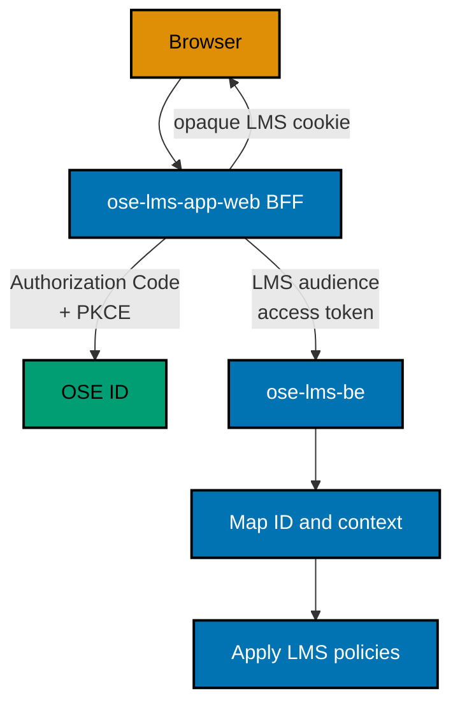
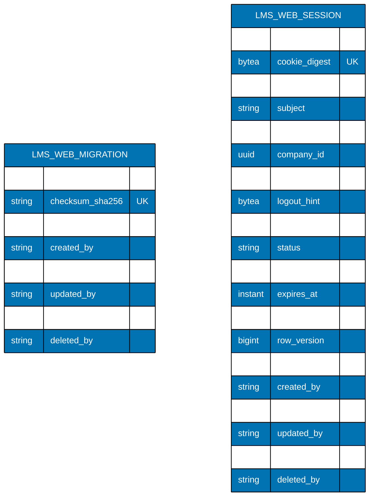

# Architecture, BDD, and File Impact — LMS User Identity Integration

## 1. Dependency and Current State

This plan is blocked until OSE ID is merged and terminally verified. At planning time, `ose-lms-be` is
a Java/Spring Boot service without implemented authentication. Therefore removing the previous local-
credential design has no data migration or backward-compatibility burden.

Phase 0 must resolve the archived OSE ID plan, actual discovery document, registered client/resource
model, local-stack entrypoint, token format, logout/revocation behavior, and evidence. Delivered behavior
overrides provisional details in this document; a material incompatibility returns this plan to planning.

## 2. Target Architecture



Arrow labels state the security artifact; color is supplementary.

This plan creates the missing browser owner as `apps/ose-lms-app-web` and its runtime test owner as
`apps/ose-lms-app-web-e2e`. The app is a Next.js BFF/UI, listens on local port `3400`, resolves
`OSE_LMS_APP_WEB_PORT`, and follows the existing `*-app-web` project topology. It is not folded into
`ose-app-web`, which is the independently deployable GRC product. Its canonical behavior owner is
`specs/apps/ose/lms-app-web/`; `specs/apps/ose/lms-be/` remains the API owner.

The LMS BFF session PostgreSQL publishes local host port `5439` through
`OSE_LMS_APP_WEB_POSTGRES_PORT`; the in-network container port remains 5432. OSE ID retains its owned
defaults: web 3500, backend 8501, PostgreSQL 5438, Mailpit SMTP 1026/UI 8026, and fake Google 8502.
Phase 0 verifies that these defaults are still registered and unclaimed; a conflicting new registry
entry requires a plan amendment, not an undocumented runtime choice.

The OSE ID provider plan freezes the local relying-party contract. `ose-lms-app-web` sends client ID
`ose-lms-app-web-local`, redirect URI `http://127.0.0.1:3400/auth/oidc/callback`, post-logout URI
`http://127.0.0.1:3400/auth/signed-out`, and scopes `openid profile ose.context ose.lms`. The Java
resource server accepts only audience `urn:ose:lms-api` plus entitlement `lms.access`. Phase 0 confirms
the delivered registration matches these values byte-for-byte; a mismatch returns this blocked plan to
planning rather than creating a second client or compatibility alias.

### 2.1 Backend Transport Seam

`ose-lms-be` remains a REST resource server in this plan, but token validation and transport mapping
must be an inbound adapter rather than the home of LMS authorization. After the Java security adapter
validates signature, issuer, audience, time, scope, entitlement, and context shape, it creates a typed
request identity/context for application use cases. LMS policy and domain logic must not depend on HTTP,
Spring controller, JWT library, GraphQL, or Model Context Protocol types. Persistence and external calls
remain outbound adapters.

This lets a separately planned GraphQL resolver or Model Context Protocol tool reuse the same LMS use
case and policy without creating a second identity or tenant path. A future adapter still validates its
own transport, maps into the same typed context, and may not trust a GraphQL/MCP argument as subject,
company, entitlement, or role. This plan adds no GraphQL schema/runtime and no MCP server/tool/resource;
each would require its own API contract delta, threat/privacy review, machine-readable contract,
Unit/Integration/E2E adapter map, and manual wire recipes. OSE ID itself follows its delivered backend
hexagonal/DDD contract and is consumed only through the published OIDC/OAuth surface.

## 3. Identity and Authorization Mapping

- Validate metadata/JWKS from the exact configured HTTPS issuer in production-capable code; local mode
  accepts only the delivered localhost issuer under explicit local configuration.
- Pin allowed algorithms and validate signature, `iss`, API `aud`, time claims, required LMS scope/
  entitlement, a recognized `context_type`, its matching optional/required `company_id` shape, and any
  delivered authorized-party/client binding.
- Derive the immutable request principal from `(issuer, subject)`. Email/name are display claims and
  never drive merge, lookup, authorization, or tenant selection. This integration slice creates no LMS
  profile or domain-role table; the first learning-domain plan that needs persistence must key its
  mapping by `(issuer, subject)`.
- For personal context, key request-local LMS data access to `(issuer, subject)` and keep `company_id`
  absent; never create a synthetic tenant. For company context, map opaque `company_id` to the LMS
  tenant boundary. A context
  switch destroys/rotates the old LMS session and runs fresh upstream authorization; never accept a
  query/header-only switch.
- Load LMS roles/permissions from LMS-owned data after identity and context validation. Ignore role-like
  token claims unless a later explicit contract assigns them a non-domain purpose.
- Use generic 401/403 behavior without revealing company membership or entitlement details.

## 4. Session and Logout

The `ose-lms-app-web` BFF holds upstream protocol artifacts server-side and sends only an opaque Secure, HttpOnly,
SameSite cookie. Rotate it at login and company switch; protect mutations with CSRF controls; set no-store
where auth artifacts or errors occur. Safe return paths are same-origin/allowlisted to prevent open
redirects. Logout invalidates the local session before attempting the delivered OSE ID logout flow.

No LMS table stores passwords, password hashes, verification/recovery tokens, provider tokens, refresh
tokens, private signing keys, or authorization-grant records. The delivered OSE ID client contract
issues no refresh token; discovering one during Phase 0 is an upstream contract mismatch that blocks
execution rather than authorizing a new LMS field.

## 5. BFF Session Persistence and Migration

The Next.js server uses Kysely + `pg` as a server-only query-builder adapter; no ORM or browser import is
allowed. A repository-owned TypeScript runner executes immutable numbered SQL under one PostgreSQL
advisory lock/transaction and records SHA-256 checksums in `lms_web_schema_migrations`. Its exact command
is `rtk ./hippo run --class transactional --resource-tier standard --disk-path . -- npm exec nx -- run ose-lms-app-web:migrate:local`.
The migration role runs it before readiness; checksum drift, partial application, or lock failure fails
closed. Both metadata and session tables obey the repository audit/no-hard-delete rule.

The current repository has no LMS database, LMS web project, or LMS session table. This plan adds one
PostgreSQL database owned only by `ose-lms-app-web`; `ose-lms-be` does not read that database. The first
migration creates exactly two tables: immutable checksum metadata plus the session lifecycle table:



Diagram-only abbreviation: `LMS_WEB_MIGRATION` is the `lms_web_schema_migrations` table.

| Table/column                                | PostgreSQL definition                                                 | Purpose and lifecycle                                                                              |
| ------------------------------------------- | --------------------------------------------------------------------- | -------------------------------------------------------------------------------------------------- |
| `lms_web_schema_migrations.version`         | `VARCHAR(150) PRIMARY KEY`                                            | Immutable numbered SQL filename; paired with globally unique SHA-256 checksum.                     |
| `lms_web_schema_migrations.checksum_sha256` | `CHAR(64) NOT NULL UNIQUE`                                            | Detects changed bytes after application.                                                           |
| `lms_web_sessions.session_id`               | `UUID PRIMARY KEY`                                                    | Application-generated opaque row identity; never used as the browser cookie.                       |
| `cookie_digest`                             | `BYTEA NOT NULL UNIQUE`                                               | Keyed digest of the random browser cookie; raw cookie is never persisted.                          |
| `issuer`                                    | `VARCHAR(512) NOT NULL`                                               | Exact validated OSE ID issuer; immutable with subject.                                             |
| `subject`                                   | `VARCHAR(255) NOT NULL`                                               | Immutable OSE ID subject; paired with issuer.                                                      |
| `context_type`                              | `VARCHAR(16) NOT NULL CHECK (context_type IN ('personal','company'))` | Closed authorization-context discriminator.                                                        |
| `company_id`                                | `UUID NULL` plus named shape check                                    | Null exactly for personal and non-null exactly for company context.                                |
| `access_token_ciphertext`                   | `BYTEA NULL`                                                          | Required only while active; authenticated envelope encryption erased on every terminal transition. |
| `id_token_hint_ciphertext`                  | `BYTEA NULL`                                                          | Optional server-only upstream logout hint; never returned to browser JavaScript.                   |
| `csrf_secret_digest`                        | `BYTEA NULL`                                                          | Required only while active; keyed digest erased on every terminal transition.                      |
| `status`                                    | `VARCHAR(16) NOT NULL DEFAULT 'active'`                               | `active`, `revoked`, or `expired`; terminal states never reactivate.                               |
| `last_seen_at`                              | `TIMESTAMPTZ NOT NULL DEFAULT CURRENT_TIMESTAMP`                      | Monotonic bounded-write observation, not every asset request.                                      |
| `absolute_expires_at`                       | `TIMESTAMPTZ NOT NULL`                                                | Hard deadline strictly after creation.                                                             |
| `revoked_at`                                | `TIMESTAMPTZ NULL`                                                    | Present exactly for revoked state and set before logout redirect.                                  |
| `row_version`                               | `BIGINT NOT NULL DEFAULT 0`                                           | Non-negative compare-and-swap token; increases on every update.                                    |
| six audit columns                           | existing repository audit-column contract                             | `created_at`, `created_by`, `updated_at`, `updated_by`, `deleted_at`, `deleted_by` in exact order. |

The six columns expand exactly to `created_at TIMESTAMPTZ NOT NULL DEFAULT CURRENT_TIMESTAMP`,
`created_by VARCHAR(255) NOT NULL DEFAULT 'system'`, `updated_at TIMESTAMPTZ NOT NULL DEFAULT
CURRENT_TIMESTAMP`, `updated_by VARCHAR(255) NOT NULL DEFAULT 'system'`, `deleted_at TIMESTAMPTZ NULL`,
and `deleted_by VARCHAR(255) NULL`, in that order.

Both tables contain the exact six-column envelope above. Add
`ck_lms_web_schema_migrations_soft_delete_pair`, `ck_lms_web_schema_migrations_update_time`,
`ck_lms_web_schema_migrations_delete_time`, and `trg_lms_web_schema_migrations_reject_hard_delete`.
Add exact constraints `ck_lms_web_sessions_context_shape`, `ck_lms_web_sessions_status`,
`ck_lms_web_sessions_expiry`, `ck_lms_web_sessions_revoked_state`,
`ck_lms_web_sessions_active_material`,
`ck_lms_web_sessions_row_version_nonnegative`, `ck_lms_web_sessions_soft_delete_pair`,
`ck_lms_web_sessions_update_time`, and `ck_lms_web_sessions_delete_time`; install
`trg_lms_web_sessions_reject_hard_delete`; add indexes
`ix_lms_web_sessions_subject(issuer, subject)`,
`ix_lms_web_sessions_active_expiry(absolute_expires_at) WHERE status = 'active' AND deleted_at IS NULL`,
and `ux_lms_web_sessions_cookie_digest(cookie_digest) UNIQUE`. The migration role owns every object;
`PUBLIC` has no table privilege. The application role may only `SELECT, INSERT, UPDATE`; it receives no
hard-delete, truncate, DDL, ownership, reference, or trigger privilege. It receives active-row `SELECT`
on migration metadata only. Integration inventories both tables and attempts a real application-role
physical delete against each.

The context-shape check is `(context_type = 'personal' AND company_id IS NULL) OR (context_type =
'company' AND company_id IS NOT NULL)`. The active-material check requires access-token ciphertext and
CSRF digest only for `active`, and requires access-token and ID-token-hint ciphertext plus CSRF digest
all null for terminal status. The revoked-state check requires `revoked_at` exactly for `revoked`; expiry is
represented by status/time without fabricating revocation. The soft-delete check requires
`(deleted_at IS NULL) = (deleted_by IS NULL)`; `row_version >= 0`; and every update changes
`updated_at`/`updated_by` together while `created_at`/`created_by` remain immutable.

Migration order is expand → verify → contract: create the audited checksum-history table first, then
create extension support only when the repository's
PostgreSQL baseline does not already provide UUID generation; create the table, checks, indexes, and
grants in one transactional migration; inspect exact catalog definitions; run fresh and already-migrated startup; then
enable BFF session writes. There is no backfill because both the web app and table are new. Old code
ignores the new database, while new code refuses to start if the migration or encryption key is absent.
Rollback reverts the new app/config while retaining rows; logout/expiry transitions active rows to a
terminal state and atomically nulls access-token and ID-token-hint ciphertext plus the CSRF digest. Retention
cleanup may later soft-delete terminal rows but never hard-deletes them. Every active query includes
`deleted_at IS NULL`; cookie digests stay globally unique across tombstones to prevent reuse. Once a migration checksum has been observed,
schema repair is a forward migration. No-loss proof records pre/post row counts and non-secret stable
digests plus session state across web instance A→B; destructive table removal is outside this plan.

The exact bounded cleanup entry point is
`rtk ./hippo run --class transactional --resource-tier standard --disk-path . -- npm exec nx -- run ose-lms-app-web:session-retention:local`.
It selects a fixed batch of terminal, retention-eligible rows with an explicit order and timeout, stamps
`deleted_at`/`deleted_by`, increments `row_version`, and nulls every remaining secret-bearing field in
one compare-and-swap transaction. Repeated or concurrent runs are idempotent. It never executes SQL
`DELETE`, never touches migration metadata, and reports counts only—no subject, cookie digest, or token.

## 6. Local Stack

Add an LMS authenticated-stack target that invokes OSE ID's public local-stack lifecycle with explicit
ports and synthetic LMS client/user/personal entitlement/company entitlement, including the owned
Mailpit service, then starts `ose-lms-be`, the LMS session PostgreSQL, and `ose-lms-app-web`. The outer runner owns failure
propagation and final cleanup; the OSE ID runner owns its named inner resources. Composition must be
idempotent, readiness-driven, and collision-safe.

App-only targets remain useful. Their authenticated routes expose a clear dependency-unavailable state
when discovery/authorization cannot be reached. They never enable a local credential endpoint, debug
principal, trusted identity header, unsigned token, or fallback issuer.

## 7. Test Architecture

- Gherkin first in the existing LMS specs; remove/replace all local registration/login/refresh scenarios.
- Unit: claim/principal mapping, authorization policies, return-path validation, errors, fixed-clock time
  handling, and absence guards at 99% authored-line coverage.
- Integration: Spring security/wiring in process plus separate BFF session-repository tests against the
  real PostgreSQL schema, including constraints, encryption, restart, and instance switching.
- E2E: built LMS processes plus the delivered OSE ID/PostgreSQL/Mailpit/fake-provider stack; positive
  and negative protocol/personal/company journeys and complete cleanup.
- Manual: real browser login/company switch/logout, storage/cookie inspection, unavailable issuer, API
  token faults, responsive/a11y/error behavior.

## 8. BDD Spec Delta and Adapter Map

This table is the execution contract for canonical specs. PRD Gherkin expresses product intent; Phase 1
performs these exact mutations in `specs/`. A test name or checklist in `delivery.md` is not a substitute
for a canonical scenario binding.

| Action | Canonical feature and scenario                                                                                                               | Source                                | Unit                                              | Integration                                                                                                              | E2E                                                                         |
| ------ | -------------------------------------------------------------------------------------------------------------------------------------------- | ------------------------------------- | ------------------------------------------------- | ------------------------------------------------------------------------------------------------------------------------ | --------------------------------------------------------------------------- |
| UPDATE | `specs/apps/ose/lms-be/behaviours/hello/hello.feature` — protect hello with the LMS audience                                                 | AC-LMS-OIDC-02                        | Required: filter/policy cases                     | Required: Spring security and discovery/JWKS wiring                                                                      | Required: built API accepts valid fixture and rejects invalid token         |
| ADD    | `specs/apps/ose/lms-be/behaviours/security/resource-server.feature` — invalid issuer/audience/signature/key/time/entitlement/context matrix  | AC-LMS-OIDC-02                        | Required: every matrix row                        | Required: actual Spring filter plus controlled OSE ID metadata/JWKS                                                      | Required: every matrix row at the built public boundary                     |
| ADD    | `specs/apps/ose/lms-be/behaviours/security/principal-context.feature` — personal/company mapping and mutable email                           | AC-LMS-PERSONAL-01, AC-LMS-PROFILE-01 | Required: typed mapper                            | Required: Spring filter and request-context mapping, including changed-email input                                       | Required: personal, company, switch, and changed-email journeys             |
| ADD    | `specs/apps/ose/lms-be/behaviours/security/domain-authorization-boundary.feature` — ignore role-like identity claims                         | AC-LMS-AUTHZ-01                       | Required: local policy denial                     | Required: Spring policy wiring                                                                                           | Required: built API denial                                                  |
| ADD    | `specs/apps/ose/lms-app-web/behaviours/authentication/sign-in.feature` — start, callback, cancel, safe return, and unavailable issuer        | AC-LMS-OIDC-01, AC-LMS-LOCAL-02       | Required: route/BFF/session behavior              | Required: real `lms_web_sessions` repository and callback transaction                                                    | Required: browser and built services                                        |
| ADD    | `specs/apps/ose/lms-app-web/behaviours/authentication/context-switch.feature` — personal, Company A→B reauthorization, stale entitlement     | AC-LMS-PERSONAL-01, AC-LMS-TENANT-01  | Required: state/view mapping                      | Required: session rotation and database constraints                                                                      | Required: full browser/OSE ID/API journey                                   |
| ADD    | `specs/apps/ose/lms-app-web/behaviours/authentication/logout.feature` — LMS-only and upstream logout                                         | AC-LMS-LOGOUT-01                      | Required: ordering/cookie state                   | Required: revoke-before-redirect persistence                                                                             | Required: both browser choices                                              |
| ADD    | `specs/apps/ose/lms-app-web/behaviours/session/session-retirement.feature` — audited expiry cleanup and immutable migration metadata         | AC-LMS-SESSION-01                     | Required: bounded command and command-absence     | Required: both tables' catalog, grants, guards, real `DELETE` denial, and soft-delete transaction                        | Required for session lifecycle; metadata scenario has exact local exemption |
| ADD    | `specs/apps/ose/lms-app-web/behaviours/local-stack/composition.feature` — start/readiness/failure/cleanup                                    | AC-LMS-LOCAL-01                       | Required: manifest/parser/lifecycle state machine | Exempt per scenario with `@integration-exempt`: ownership is cross-process and has no in-process local-resource adapter. | Required: twice from clean state plus injected failure                      |
| ADD    | `specs/apps/ose/lms-be/behaviours/security/credential-authority-absence.feature` — LMS-local credential attempts fail at the public boundary | AC-LMS-ABSENCE-01                     | Required: route/policy manifest denial            | Required: real application router denies the bounded credential-operation catalog                                        | Required: HTTP route-negative matrix on the built stack                     |
| RETAIN | Existing LMS health and port-resolution features                                                                                             | Existing contract                     | Retain existing Unit bindings and 99% gate        | Retain their current explicit exemptions where the documented boundary is still true                                     | Retain existing bindings/exemptions; authentication must not weaken them    |

### Copy-ready scenario packets

#### Resource-server trust matrix

**Action/path:** UPDATE the existing protected-hello scenario and ADD
`specs/apps/ose/lms-be/behaviours/security/resource-server.feature`.

**Bindings:** Unit, Integration, and E2E are required for every matrix row. The built boundary can
express each rejection case, so reducing repetition is not a valid exemption reason.

```gherkin
Feature: OSE ID token validation for LMS
  LMS accepts only OSE ID access tokens intended for its API and a valid authorization context.

  Scenario: Use a valid LMS audience token
    Given OSE ID issued an access token for the OSE LMS API
    And the token carries one active entitled company context for Company A
    When the client requests GET /api/v1/hello with that token
    Then the response status is 200
    And the LMS request context contains the exact issuer, subject, and Company A

  Scenario Outline: Reject an artifact outside the LMS trust contract
    Given the presented OSE ID access token has <fault>
    When it is used on GET /api/v1/hello
    Then LMS responds 401 with the generic invalid-token problem
    And creates no session, principal record, or tenant mapping
    And the response reveals no company or entitlement detail

    Examples:
      | fault                                |
      | the wrong issuer                     |
      | the wrong audience                   |
      | an unapproved algorithm              |
      | an invalid or unknown-key signature  |
      | an expired validity window           |
      | a not-yet-valid window               |
      | an unknown context type              |
      | personal context with a company ID   |
      | company context without a company ID |
      | more than one company ID             |

  Scenario: Reject a valid token without LMS entry authorization
    Given OSE ID issued a structurally valid token for the OSE LMS API
    And the token lacks the required LMS scope or entitlement
    When the client requests GET /api/v1/hello with that token
    Then LMS responds 403 with the generic insufficient-access problem
    And the response reveals no company or entitlement detail
```

#### Principal and context mapping

**Action/path:** ADD
`specs/apps/ose/lms-be/behaviours/security/principal-context.feature`.

**Bindings:** Unit, Integration, and E2E are required for every scenario. The changed-email case crosses
the real Spring filter and request-context mapper even though this slice owns no profile persistence, so
an Integration exemption would be invalid.

```gherkin
Feature: Map OSE identity to an LMS request context
  LMS keys identity by issuer and subject and treats personal and company contexts as distinct shapes.

  Scenario: Use LMS without a company
    Given an active verified OSE person has an LMS personal entitlement
    And the person has no company membership
    When the person authorizes LMS in personal context
    Then LMS accepts context type personal with no company ID
    And derives the request principal from issuer and subject
    And does not create or infer a company or tenant membership

  Scenario: Use one selected company
    Given one OSE subject is entitled to LMS in Company A and Company B
    When the subject authorizes LMS for Company A
    Then the request context contains only Company A
    And no Company B role or data is available

  Scenario: Keep the principal stable when email changes
    Given LMS has accepted an OSE issuer and subject as a request principal
    When a later valid token reports a different verified email for that issuer and subject
    Then LMS derives the same request principal
    And treats the new email only as a mutable display claim
    And creates no duplicate principal or company context
```

#### LMS-local domain authorization

**Action/path:** ADD
`specs/apps/ose/lms-be/behaviours/security/domain-authorization-boundary.feature`.

**Bindings:** Unit, Integration, and E2E required.

```gherkin
Feature: Keep learning-domain authority inside LMS

  Scenario: Ignore a role-like identity claim
    Given the authenticated subject has no LMS instructor role in Company A
    And a valid OSE ID token contains a claim named "instructor"
    When the subject requests an instructor-only LMS operation
    Then LMS ignores that claim for domain authorization
    And denies the operation using its LMS-local role policy
```

#### Browser sign-in and recovery

**Action/path:** ADD
`specs/apps/ose/lms-app-web/behaviours/authentication/sign-in.feature`.

**Bindings:** Unit, Integration, and E2E required. Integration exercises the real BFF session repository;
E2E uses the built web, OSE ID, and LMS API processes.

```gherkin
Feature: Enter LMS through OSE ID

  Scenario: Sign in an entitled company member
    Given OSE ID has an active person with an LMS entitlement in Company A
    And LMS is registered with its exact callback and PKCE S256
    When the person starts sign-in from /learning and authorizes Company A
    Then the browser returns to /learning with an opaque LMS session
    And LMS keys the principal by OSE ID issuer and subject
    And browser JavaScript stores no access, refresh, ID, or provider token

  Scenario: Cancel OSE ID authorization
    Given a person started LMS sign-in from /learning
    When the person cancels at OSE ID
    Then LMS shows the heading "Sign-in did not finish"
    And offers "Try again" and "Back to LMS"
    And creates no LMS session

  Scenario: Report an unavailable issuer without fallback
    Given LMS is running without the configured OSE ID service
    When a person starts an authenticated LMS journey
    Then LMS shows that OSE ID is unavailable
    And accepts no local password, debug principal, trusted identity header, unsigned token, or fallback issuer
```

#### Context switching

**Action/path:** ADD
`specs/apps/ose/lms-app-web/behaviours/authentication/context-switch.feature`.

**Bindings:** Unit, Integration, and E2E required.

```gherkin
Feature: Change the LMS authorization context through OSE ID

  Scenario: Switch from Company A to Company B
    Given one OSE subject is entitled to LMS in Company A and Company B
    And the current opaque LMS session is bound to Company A
    When the user chooses Switch context and authorizes Company B at OSE ID
    Then LMS rotates the session and binds it only to Company B
    And no Company A data or LMS role is carried into Company B

  Scenario: Reject a context that lost entitlement
    Given an LMS session is bound to Company A
    And OSE ID removes the subject's Company A LMS entitlement
    When LMS requires fresh authorization for a protected transition
    Then the stale LMS session cannot establish Company A access
    And the denial reveals no membership detail
```

#### Logout choices

**Action/path:** ADD
`specs/apps/ose/lms-app-web/behaviours/authentication/logout.feature`.

**Bindings:** Unit, Integration, and E2E required.

```gherkin
Feature: End LMS sessions safely

  Scenario: Sign out of LMS only
    Given the browser has an active LMS session established through OSE ID
    When the user chooses Sign out of LMS
    Then LMS revokes the local session before redirecting
    And the upstream OSE ID session is not deliberately ended
    And a protected LMS page requires authorization again

  Scenario: Sign out of LMS and OSE ID
    Given the browser has an active LMS session and the provider supports end-session
    When the user chooses Sign out of LMS and OSE ID
    Then LMS revokes the local session before starting registered upstream logout
    And a protected LMS page requires authorization again
```

#### Audited session retirement

**Action/path:** ADD
`specs/apps/ose/lms-app-web/behaviours/session/session-retirement.feature`.

**Bindings:** Unit and Integration are required for both scenarios. E2E is required for the session
lifecycle. Migration metadata has no public lifecycle, so only that scenario carries the precise E2E
exemption and names the exhaustive PostgreSQL proof used instead.

```gherkin
Feature: Retain auditable LMS web persistence
  LMS retires session credentials without erasing accountability or migration history.

  Scenario: Retire an expired LMS browser session without physical deletion
    Given an expired LMS browser session is eligible for retention cleanup
    When the bounded LMS session-retention command processes that session
    Then the session is absent from active behavior and cannot authorize an LMS request
    And the retained row records deleted_at and deleted_by while secret material is unusable
    And the application database role cannot physically delete the row

  # Exemption(e2e): migration metadata has no public product lifecycle; alternative-proof: ose-lms-app-web:test:integration / Protect LMS migration history from application deletion
  @e2e-exempt
  Scenario: Protect LMS migration history from application deletion
    Given an LMS web migration version has been applied successfully
    When the serving application inspects or attempts to remove its migration metadata
    Then it can read only the active migration version and checksum
    And it has no command or database privilege that can physically delete the metadata row
```

#### Owned local composition

**Action/path:** ADD
`specs/apps/ose/lms-app-web/behaviours/local-stack/composition.feature`.

**Bindings:** Unit and E2E required. Each scenario carries its own `@integration-exempt` because the
owned boundary is a multi-process lifecycle, not an in-process local resource; the named E2E case is the
stronger applicable adapter.

```gherkin
Feature: Run LMS with every OSE ID dependency locally

  # Exemption(integration): start and hold spans the external OSE ID process tree rather than an in-process local resource; alternative-proof: ose-lms-app-web-e2e:test:e2e / Start OSE ID through its public runner
  @integration-exempt
  Scenario: Start OSE ID through its public runner
    Given the LMS authenticated-stack runner has a valid OSE ID input manifest
    When the runner starts the dependent identity stack through the public versioned target
    Then OSE ID holds until the owning LMS runner requests cleanup
    And never copies OSE ID scripts reads its private state or kills its inner resources directly

  # Exemption(integration): readiness crosses the inherited control descriptor and external OSE ID process tree; alternative-proof: ose-lms-app-web-e2e:test:e2e / Accept one complete OSE ID ready message
  @integration-exempt
  Scenario: Accept one complete OSE ID ready message
    Given the LMS runner started OSE ID with an inherited control descriptor
    When OSE ID reports readiness
    Then LMS accepts exactly one schema-valid complete ready message and public descriptor
    And rejects a mismatched duplicate partial or private-value-bearing message before LMS starts

  # Exemption(integration): version admission belongs to the external OSE ID runner boundary; alternative-proof: ose-lms-app-web-e2e:test:e2e / Reject an unsupported runner contract before mutation
  @integration-exempt
  Scenario: Reject an unsupported runner contract before mutation
    Given the LMS runner provides an unknown major version or security-sensitive unknown field
    When OSE ID validates the local-stack input contract
    Then OSE ID returns the stable unsupported-contract result before creating a process file network or container
    And LMS creates no outer application resource

  # Exemption(integration): cleanup owns an external process container network and volume manifest; alternative-proof: ose-lms-app-web-e2e:test:e2e / Clean only the owned OSE ID stack
  @integration-exempt
  Scenario: Clean only the owned OSE ID stack
    Given LMS has stopped its resources and holds the exact OSE ID cleanup handle
    When LMS invokes the public OSE ID cleanup operation twice
    Then both calls preserve the primary status and remove only resources in that ownership manifest
    And no owned process port container network volume or temporary artifact remains

  # Exemption(integration): nested failure cleanup spans both external process trees; alternative-proof: ose-lms-app-web-e2e:test:e2e / A nested-stack failure preserves cause and complete cleanup
  @integration-exempt
  Scenario: A nested-stack failure preserves cause and complete cleanup
    Given one required OSE ID or LMS child fails readiness
    When the authenticated-stack runner unwinds
    Then it preserves the earliest causal exit status
    And attempts cleanup for every resource recorded in both ownership manifests
    And reports cleanup failures separately without exposing secrets or retaining owned resources
```

#### Absence of credential authority

**Action/path:** ADD
`specs/apps/ose/lms-be/behaviours/security/credential-authority-absence.feature`.

**Bindings:** Unit, Integration, and E2E are required. Unit proves the bounded route/policy catalog,
Integration starts the real application router and submits every catalog entry, and E2E repeats the
same matrix against the built public service. Source/config/schema absence remains a delivery audit and
does not replace observable application behavior.

```gherkin
Feature: Keep identity-provider behavior out of LMS

  Scenario Outline: Reject an LMS-local credential operation
    Given the LMS service is running with OSE ID as its only identity authority
    When a client attempts <method> <path> without an OSE ID authorization result
    Then LMS returns the same route-not-found or method-not-allowed response
    And returns no access token refresh token verification token recovery token or session cookie
    And does not make the protected learning resource available

    Examples:
      | method | path |
      | POST | /api/v1/auth/register |
      | POST | /api/v1/auth/password/login |
      | POST | /api/v1/auth/password/recover |
      | POST | /api/v1/auth/password/reset |
      | POST | /api/v1/auth/email/verify |
      | POST | /api/v1/auth/token |
      | POST | /api/v1/auth/token/refresh |
```

#### Retained scenarios

RETAIN all existing health, Actuator exposure, and port-resolution scenarios with their existing exact
feature paths and adapter dispositions. UPDATE the existing hello scenario only to supply a valid
LMS-audience token; do not delete its response contract. No canonical local-password/JWT scenario exists
in the current repository, so the execution action for those superseded plan-only drafts is **DELETE from
the active plan language only**, not delete from `specs/`.

Every changed app enforces at least 99% authored production-line Unit coverage. Static behavior coverage
must prove exactly one Unit binding per scenario and either a binding or a reviewed per-scenario exemption
for Integration and E2E. Exemptions identify the absent boundary and the stronger adapter that still
proves observable behavior; feature-wide/project-wide convenience exemptions are forbidden.

The following remain plan-only evidence and do not enter product Gherkin: dependency/archived-plan
resolution, worktree identity, branch inventory, dependency installation, source/license citation audit,
raw migration catalog/row-count evidence, formatting and pre-push commands, PR/head/leak-review records,
learning disposition, archival, terminal audit, and worktree/branch cleanup. Migration failure,
dependency unavailability, and cleanup behavior do enter specs only where an application/runner exposes
an observable result, as mapped above.

## 9. Alternatives

- **LMS-local password/JWT service:** rejected because it duplicates the shared authority and was never
  implemented.
- **Trust email or forwarded identity headers:** rejected because neither is a verifiable immutable
  principal and both enable confusion/spoofing.
- **Put LMS roles in OSE ID:** rejected because product-domain authorization changes independently and
  increases central blast radius.
- **Require developers to start ID manually:** rejected as the only path because it is easy to
  misconfigure and cannot prove lifecycle cleanup; app-only mode still exists for focused work.
- **Reuse `ose-app-web`:** rejected because it is the GRC product and would couple two independent
  deployables, routes, contracts, and local lifecycles.
- **Create `ose-lms-web` without the `app` qualifier:** rejected in favor of `ose-lms-app-web`, matching
  the repository distinction between product applications and public `*-www` sites.

## File-Impact Analysis

```text
.
├── plans/in-progress/
│   ├── README.md [E] — preserve dependency status until archival
│   └── lms-user/{README.md,brd.md,prd.md,tech-docs/,delivery.md,learnings.md} [E] — execution record and archival
├── specs/apps/ose/lms-be/ [E] — README, architecture, contracts, and Gherkin auth replacement
│   └── contracts/openapi.yaml [E] — bearer security and protected-resource responses
├── apps/
│   ├── ose-lms-be/ [E] — project config, source/tests, README, and env example
│   ├── ose-lms-be-e2e/ [E] — source, scripts, project config, and README
│   ├── ose-lms-app-web/ [N] — Next.js BFF/UI, Kysely/pg session repository, audited SQL runner/migrations, tests, README, env example
│   └── ose-lms-app-web-e2e/ [N] — Playwright journeys and owned stack adapter
├── specs/apps/ose/lms-app-web/ [N] — architecture and browser/BFF Gherkin
│   ├── behaviours/session/session-retirement.feature [N] — session tombstone and migration-history protection
│   └── contracts/authentication.openapi.yaml [N] — running BFF/callback contract
├── infra/dev/ose-lms/ [N] — local-only LMS session PostgreSQL composition
├── docs/reference/web-sites.md [E] — `ose-lms-app-web`, port 3400, `OSE_LMS_APP_WEB_PORT`
├── repo-config.yml [E] — only when delivered target/test-boundary registry requires it
├── apps/ose-lms-be/behaviour-coverage.json [E] — hand-authored adapter map validated by the coverage tool
├── apps/ose-lms-app-web/behaviour-coverage.json [N] — hand-authored adapter map validated by the coverage tool
└── apps/ose-lms-app-web-e2e/behaviour-coverage.json [N] — hand-authored adapter map validated by the coverage tool
```

### More Detail

Delete or replace every planned local-auth contract before implementation; there is no compatibility
endpoint. Exact OSE ID client IDs, issuer URLs, scopes, claims, ports, and runner commands must come from
the delivered upstream artifacts, not be guessed here. `[E]` does not authorize unrelated LMS changes.
The plan folder itself is edited at `plans/in-progress/lms-user/` until the pre-merge archival move, then
at `plans/done/<completion-date>__lms-user/`; both are moves/edits of existing plan material, not new
product owners.
