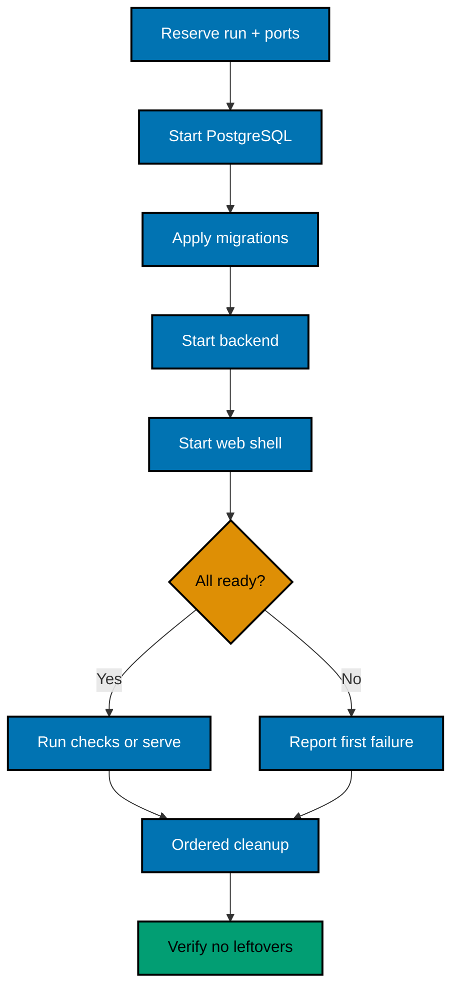
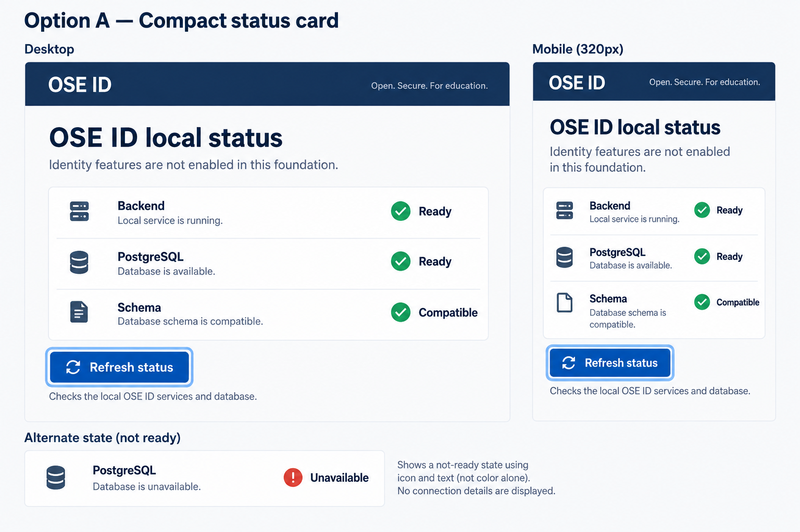
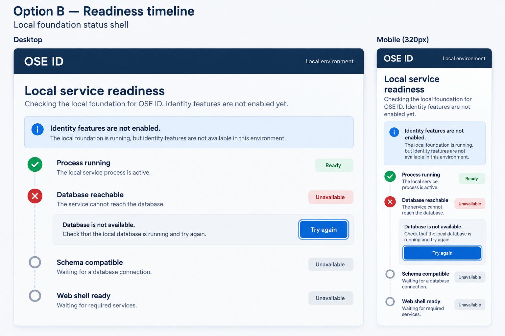
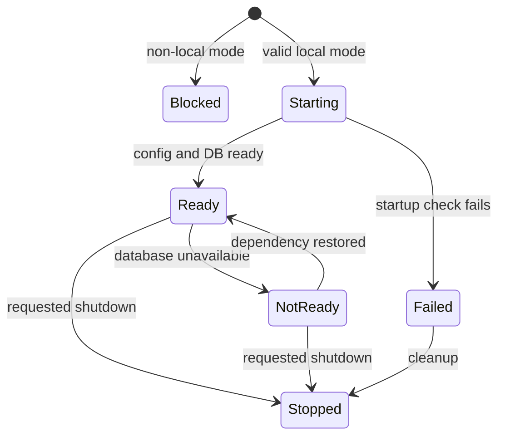

# Product Requirements — OSE ID Init 01 Local Foundation

## Product Overview

This delivery creates a local-only platform skeleton that future OSE ID features can safely extend.
Its user is a developer or automated test runner, not an end customer. The observable product surface
is project discoverability, process startup, diagnostics, migration behavior, and deterministic cleanup.

## Personas

- **Local developer:** starts OSE ID and reads actionable readiness output.
- **Plan executor:** adds later behavior without changing foundation contracts casually.
- **Automated test runner:** owns isolated dependencies and always tears them down.
- **Security reviewer:** proves unfinished behavior cannot run in production mode.

## Functional Scope

### Four projects

| Project          | Responsibility in this slice                                                                  |
| ---------------- | --------------------------------------------------------------------------------------------- |
| `ose-id-be`      | ASP.NET Core host, health/readiness, runtime guard, migration assembly, SqlKata/Npgsql access |
| `ose-id-be-e2e`  | Built-process, PostgreSQL, migration, privilege, failure, multi-instance, and cleanup tests   |
| `ose-id-web`     | Next.js shell with an “identity service not enabled” local page and backend readiness display |
| `ose-id-web-e2e` | Built-browser shell/accessibility and outer stack lifecycle tests                             |

### Backend extension boundary

`ose-id-be` uses pragmatic hexagonal architecture with DDD where identity invariants warrant it.
Domain/Application code contains no ASP.NET, EF, OpenIddict, REST, GraphQL, or Model Context Protocol
types. Plan 01 REST health and Plan 04 framework-native OIDC/OAuth are planned inbound adapters;
PostgreSQL, notifications,
keys, and external providers are outbound adapters. Architecture tests make the inward dependency rule
observable. A future GraphQL resolver or MCP tool can invoke the same use cases and verified
person/company policy only through a separately planned adapter; it cannot create another
authentication, authorization, tenant, transaction, idempotency, or audit path.

OSE-owned runtime persistence uses SqlKata queries compiled for PostgreSQL and executed through
`SqlKata.Execution`/Npgsql with explicit result projections. EF Core is not the application runtime ORM:
no change tracking, LINQ-to-entities, `DbContext`, or EF Identity store may implement account/company or
OpenIddict store use cases. EF remains migration-time tooling. Plan 04 implements the resolved
OpenIddict store interfaces behind the same audited SqlKata/Npgsql boundary.

### Database auditability

Every persisted table has the exact six-column audit envelope defined in
[Database audit and soft-delete contract](tech-docs/007-database-audit-and-soft-delete-contract.md).
The service never physically deletes a row. A removal, revocation, unlink, or cleanup command makes the
row inactive, records who and when, destroys usable secret material where applicable, and retains safe
audit evidence. Ordinary product queries cannot see tombstones; only an explicitly authorized audit
path may include them.

### Runtime modes

The host recognizes explicit `Local`, `Test`, `Staging`, and `Production` modes. Only Local/Test may
start in this slice. Staging/Production fail before externally useful listeners or background jobs are
available. A missing or unknown mode also fails closed.

### Diagnostics

- `/health/live` proves the process event loop is responsive and does not query PostgreSQL.
- `/health/ready` proves required configuration is valid, PostgreSQL is reachable, and the schema
  migration level is compatible.
- Responses use a versioned, non-secret JSON shape with overall status, component code, and correlation ID.
- Detailed exception text, connection strings, host paths, usernames, and credentials never appear.

### Local lifecycle



## Status-Shell UI Design Funnel

The foundation has one deliberately inert user-facing surface: a local status shell. It must help a
developer distinguish process, database, and schema readiness without resembling a sign-in page or
exposing infrastructure details. The implementation reuses repository tokens and primitives confirmed
in Phase 0; no identity action, account data, provider, or secret is rendered.

### Grounding and prior art

Repository inspection on 2026-09-15 found reusable `Button`, `Card`, `Alert`, `Badge`, and token/dark-mode
foundations under `libs/web-ui/src/components/` and `libs/web-ui-token/src/ose.css`, but no reusable
service-status shell, readiness-row, or sanitized component-code presenter. Reuse those primitives and
keep `ServiceStatusPanel`/`ReadinessRow` feature-local in `ose-id-web`; create no new shared component
unless Phase 0 proves a second current consumer. The current OSE app shells do not own identity-service
readiness UI.

Official prior art was checked on 2026-09-15. W3C's
[status-message guidance](https://www.w3.org/WAI/WCAG21/Understanding/status-messages) requires dynamic
status to be programmatically determinable without unnecessary focus movement, and its
[`role=status` technique](https://www.w3.org/WAI/WCAG21/Techniques/aria/ARIA22) documents polite live
announcement. Those sources support a stable named region and restrained refresh announcement; they do
not prescribe the visual layout. The plan therefore compares the two repository-grounded compositions
below and validates the selection with the live testers.

### Diverge — low-fidelity alternatives

#### Low-fi Option A — compact status card

```text
Desktop bounded card / mobile full width
┌──────────────────────────────┐
│ OSE ID service status        │
│ Identity features disabled   │
│ Backend       Ready          │
│ PostgreSQL    Ready          │
│ Schema        Compatible     │
│ [ Refresh status ]           │
└──────────────────────────────┘
```

#### Low-fi Option B — readiness timeline

```text
Desktop horizontal / mobile stacked
┌──────────────────────────────┐
│ OSE ID readiness             │
│ 1 Backend       Complete     │
│ 2 PostgreSQL    Unavailable  │
│ 3 Schema        Waiting      │
│ [ Try again ]                 │
└──────────────────────────────┘
```

### Narrow — high-fidelity finalists

| Criterion      | Option A — compact status card                               | Option B — readiness timeline                          |
| -------------- | ------------------------------------------------------------ | ------------------------------------------------------ |
| Primary task   | Scans three current component states immediately             | Explains startup order and transition history          |
| Failure state  | Keeps the failed component beside healthy components         | Emphasizes the failed step and next action             |
| Small viewport | Short, stable single-column card                             | Longer vertical path and more repeated labels          |
| Accessibility  | One heading, named status region, and textual status per row | Ordered-list semantics plus current-step announcement  |
| Scope risk     | Clearly an inert diagnostic shell                            | Can imply an operational control plane if overextended |

#### Option A — compact status card



#### Option B — readiness timeline



### Select — Option A

Option A is selected because it exposes the required current state with the shortest reading and focus
path. Option B remains a rejected finalist: its sequence is useful during startup, but the persistent
timeline adds history that the foundation does not own and can be mistaken for an operations console.

The selected shell covers loading, fully ready, PostgreSQL unavailable, schema incompatible, backend
unreachable, unknown/sanitized failure, retry in progress, and restored states. Each state preserves one
descriptive `h1`, one named live status region, stable row labels, textual status independent of color,
and a keyboard-operable refresh action. At 320, 375, 768, 1024, 1280, and 1440 CSS pixels and 200% zoom,
content must not clip, overlap, or require horizontal scrolling. Dark mode must retain repository-token
contrast. Errors may expose only stable component codes and a correlation ID; they never expose a host,
port, connection string, exception, username, path, or credential.

## State and Failure Contract



`Blocked` and `Failed` never expose account or authorization behavior. Liveness can remain healthy in
`NotReady`; callers must use readiness before sending work.

## Acceptance Criteria

### AC-FND-01 — Clean local startup and cleanup

```gherkin
Scenario: Start OSE ID from a clean checkout
  Given the documented local prerequisites are available and no OSE ID resources are running
  When the developer starts OSE ID locally
  Then PostgreSQL, the migrated backend, and the web shell become ready in dependency order
  And stopping the runner leaves no owned process, container, network, volume, or port reservation
```

### AC-FND-02 — Health states are truthful

```gherkin
Scenario: Report PostgreSQL becoming unavailable after startup
  Given the local backend is live and ready
  When its owned PostgreSQL dependency is stopped
  Then liveness remains successful
  And readiness becomes unsuccessful with a stable database component code
  And no secret or connection detail is returned
```

### AC-FND-03 — Schema privilege separation

```gherkin
Scenario: Deny a schema change attempted by the application role
  Given the migration role has applied the current empty OSE ID schema
  When the application role attempts to create or alter a table
  Then PostgreSQL denies the operation
  And the application role can execute only the granted runtime health query
```

### AC-FND-04 — Production remains disabled

```gherkin
Scenario Outline: Reject an unsupported backend runtime mode
  Given the runtime mode is <mode>
  When the backend process starts
  Then startup exits non-zero before serving the application
  And the diagnostic returns the stable runtime-mode-disabled code

Examples:
  | mode |
  | Staging |
  | Production |
  | missing |
  | unknown |

Scenario Outline: Reject an unsupported web runtime mode
  Given the runtime mode is <mode>
  When the web process starts
  Then startup exits non-zero before serving the application
  And the diagnostic returns the stable runtime-mode-disabled code

Examples:
  | mode |
  | Staging |
  | Production |
  | missing |
  | unknown |
```

### AC-FND-05 — Instances do not require affinity

```gherkin
Scenario: Alternate requests between backend instances
  Given two backend instances share the same PostgreSQL schema and immutable configuration
  When health and database-backed diagnostic requests alternate between the instances
  Then every response is consistent with the shared dependency state
  And stopping either instance does not change the surviving instance's correctness
```

### AC-FND-06 — Disabled identity capabilities fail closed

```gherkin
Scenario Outline: Reject a disabled identity capability
  Given OSE ID is ready with <capability> disabled
  When a client requests <method> <path>
  Then the response status is 404 with the stable capability-disabled problem code
  And no identity or authorization record is created

Examples:
  | capability | method | path |
  | OIDC authorization | GET | /connect/authorize |
  | OAuth token issuance | POST | /connect/token |
  | external-provider sign-in | GET | /external/google/challenge |
  | SCIM user provisioning | POST | /scim/v2/Users |
  | platform administration | GET | /platform/admin/companies |
```

### AC-FND-07 — Accessible web shell

```gherkin
Scenario: Read service status without a mouse
  Given the OSE ID web shell is running at a 320 pixel viewport
  When a keyboard and screen-reader user reviews its status
  Then the page has one descriptive heading and named status region
  And status is conveyed by text rather than color alone
```

### AC-FND-08 — Database history rejects physical deletion

```gherkin
Scenario: Reject physical deletion of migration history
  Given the migrated OSE ID database contains an active migration-history record
  When the serving role attempts to physically delete that record
  Then PostgreSQL rejects the operation
  And the record remains stored with all six audit columns
  And an ordinary readiness check still sees the active migration state
```

## Product Risks

- Future slices may try to treat the local-only feature guard as production configuration. The guard
  must be named for incompleteness, tested in both allowed and denied modes, and removed only by a later
  production-readiness plan.
- Health endpoints can leak infrastructure. The response schema is allowlisted and tested against
  connection-string and host-path patterns.
- A web shell may be mistaken for a sign-in UI. Copy must explicitly state that authentication is not enabled.
- Audit metadata can accidentally retain personal or secret values. Actor fields use opaque identifiers,
  security-event payloads are allowlisted, and terminal transitions make credential material unusable.

## Out of Scope

All human account and organization journeys, product integration, real provider/email access, and
deployment are outside this plan. GraphQL schemas/runtime and Model Context Protocol
servers/tools/resources/prompts are also outside the full Init 01–09 sequence; only the backend extension
seam and dependency tests are delivered now.
