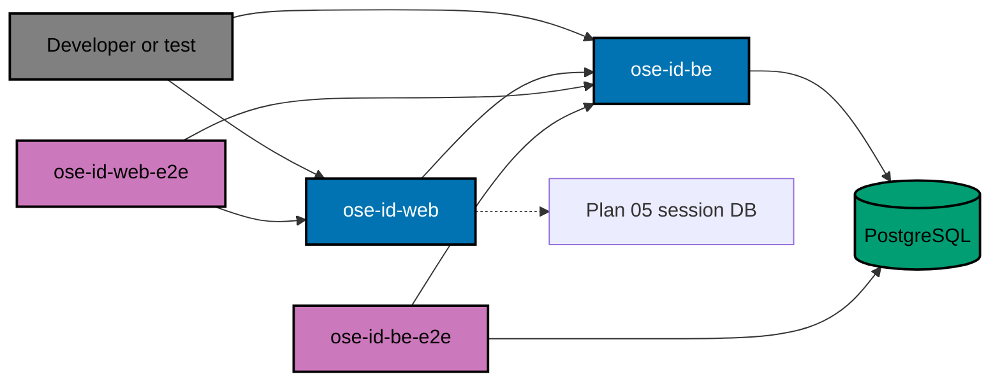
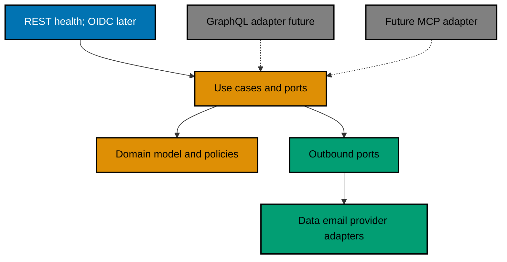

# System Boundaries and Project Topology

## Context

OSE ID will eventually be an identity provider, but this delivery creates only its executable
boundary. Keeping account behavior out makes the first merge easy to reason about: project wiring,
runtime safety, diagnostics, persistence ownership, and lifecycle cleanup can be proven independently.



## Project Responsibilities

### `ose-id-be`

Owns the ASP.NET Core host, dependency injection boundary, runtime-mode gate, health/readiness
handlers, migration-time EF Core assembly, SqlKata/Npgsql runtime configuration, sanitized structured
logging, and graceful shutdown. It contains no account endpoint or OpenIddict server configuration yet.

Use a conventional layered layout that matches the nearest current C# application after Phase 0
inspection. Framework-specific types stay in infrastructure/host projects; application abstractions do
not expose `DbContext`, `IQueryable`, HTTP types, or Npgsql connections.

### `ose-id-be-e2e`

Owns processes and network resources needed for built-backend proof: PostgreSQL container lifecycle,
migration execution, runtime-role privilege probes, outage/recovery, two-instance routing, and cleanup.
These are E2E tests because they cross process/network/container boundaries. Unit or Integration targets
must not silently acquire Docker.

### `ose-id-web`

Owns a Next.js shell, OSE design tokens/components, a server-side backend-health adapter, accessible
status presentation, configuration validation, and non-local startup guard. It contains no sign-in
form, browser token store, identity cookie, or BFF protocol behavior.

### `ose-id-web-e2e`

Owns built-browser verification, 320px/responsive checks, keyboard/accessibility assertions, backend
dependency failure presentation, and the outer local stack lifecycle. It may delegate backend-owned
resource startup to a documented inner runner rather than reimplementing it.

## Dependency Direction

```text
ose-id-web-e2e -> ose-id-web -> typed health client
        |                         |
        +-------------------------+-> ose-id-be -> application ports -> infrastructure

ose-id-be-e2e -----------------------------------> built backend + PostgreSQL
```

Nx tags and enforce-module-boundaries rules must prevent production projects from depending on E2E
projects. The web project may consume versioned HTTP types through the repository's existing generated
contract mechanism if one exists; it must not import backend assemblies or EF entities.

## Backend Architecture: Pragmatic Hexagonal DDD

`ose-id-be` is a modular monolith with domain-centered dependency direction. “Hexagonal” means inbound
protocol code and outbound technology code depend on application/domain contracts; it does not require
one deployable, package, interface, command bus, or repository abstraction per diagram box.
“Domain-Driven Design (DDD)” means the security-sensitive identity language, invariants, aggregate
boundaries, and bounded contexts live in the model; it does not justify framework-free wrappers around
code that has no domain behavior.



The dashed adapters are extension seams, not scope. Init 01–09 add no GraphQL schema/runtime/package and
no Model Context Protocol server, tool, resource, prompt, or transport. A separately authorized plan must
justify either surface and pass its own API, security, privacy, testing, and operational gates.

### Logical backend rings

| Ring              | Owns                                                                                                                                                                                                     | Must not own or expose                                                                                          |
| ----------------- | -------------------------------------------------------------------------------------------------------------------------------------------------------------------------------------------------------- | --------------------------------------------------------------------------------------------------------------- |
| Domain            | Aggregates, value objects, domain services, lifecycle transitions, and invariants for account, tenancy, authorization, authenticators, and federation                                                    | ASP.NET, OpenAPI, GraphQL, MCP, EF Core, Npgsql, SMTP, provider SDK, JSON, or HTTP types                        |
| Application       | One use-case boundary per command/query, orchestration, transaction intent, authorization policy calls, typed caller/tenant context, ports, and transport-neutral result/error types                     | Route/status/header decisions, resolver fields, MCP result envelopes, `DbContext`, `IQueryable`, or vendor DTOs |
| Inbound adapters  | Plan 01 ASP.NET REST health handlers, followed by Plan 04 framework-native OIDC/OAuth endpoints; authentication, bounded transport validation, DTO mapping, and response mapping                         | Business/tenant decisions, direct persistence, or copied use-case logic                                         |
| Outbound adapters | SqlKata + `SqlKata.Execution`/Npgsql for all runtime data including later custom OpenIddict stores, migration-time EF tooling, notification, Google, cryptography/key storage, and clock implementations | Calling inbound adapters, exposing SQL/framework entities, or redefining domain policy                          |
| Host/composition  | Configuration validation, dependency registration, middleware ordering, observability, health, and process lifecycle                                                                                     | Service-location from domain/application code or runtime selection by caller input                              |

Use repository-consistent C# projects/namespaces discovered in Phase 0. The logical rings may be separate
assemblies when the nearest C# precedent and Nx targets support that cleanly; otherwise enforce them by
namespaces, internal visibility, dependency tests, and architecture tests inside `ose-id-be`. Do not invent
empty projects or placeholder adapters just to mirror the diagram.

### Build, typecheck, and lint contract

Every registered OSE ID project exposes real `lint` and `test:quick` Nx targets. Every C# or TypeScript
project exposes a real `typecheck` target, and every compiled/bundled app exposes `build`; no target may be
an echo, no-op, alias that skips its boundary, or success sentinel. Contract code generation, when added,
is an explicit dependency of `typecheck` and `build` so stale generated types fail both gates.

For C#, enable nullable reference types and treat compiler/analyzer warnings as errors. The `typecheck`
target performs the repository-standard Release compiler pass; `lint` performs the repository-standard
format/analyzer policy; `build` produces the declared deployable output. For TypeScript/Next.js,
`typecheck` runs the repository-standard no-emit compiler check, `lint` runs ESLint, and `build` produces
the production bundle. Each change-producing phase runs all applicable targets for the touched projects;
the final affected gate reruns `build,typecheck,lint,test:quick` from the exact delivery HEAD.

### Bounded contexts and dependency rules

The initial modules are Foundation, Accounts, Companies, Authorization Server, Authenticators, and
Federation. Each owns its model and persistence mapping. Stable typed identifiers such as `PersonId` and
`CompanyId` may cross an application contract; EF entities, navigation graphs, OpenIddict entities,
provider claims, and database queries may not. Cross-module work enters an explicit application use case
and transaction boundary. Introduce an internal domain event only for a real invariant or side effect;
do not add a speculative message bus, generic repository, generic command envelope, or separate read
database for future GraphQL/MCP support.

Runtime tables never use EF change tracking, LINQ-to-entities, an EF Identity store, `UserManager`
persistence, or a generic repository. Query-specific outbound ports use SqlKata's PostgreSQL compiler
and execute through `SqlKata.Execution`/Npgsql. Plan 04 implements version-pinned custom OpenIddict
stores through the supported replacement seam so protocol deletion/pruning becomes audited soft-delete
rather than physical removal. EF remains migration-time tooling only.

### One use case, multiple inbound adapters

Every inbound adapter follows the same sequence:

1. Validate protocol syntax, size, authentication material, and declared media/schema at the edge.
2. Derive a typed verified caller context from server-validated credentials/session—not request fields.
3. Invoke one application command/query with typed values and cancellation/deadline information.
4. Recheck person, company membership, entitlement, freshness, and tenant policy inside the application
   boundary; set PostgreSQL RLS context transaction-locally where company data is accessed.
5. Commit the state change, idempotency/replay outcome, and audit event atomically where the use case
   requires it.
6. Map the transport-neutral result to REST status/problem details, OIDC protocol output, a future
   GraphQL payload/error, or a future MCP tool/resource result. Unknown results fail closed.

The application never trusts a REST path value, GraphQL argument, or MCP tool argument as tenant or role
authority. Rate/abuse policy, transactionality, idempotency, audit, privacy filtering, and domain
validation stay behind the inbound boundary so a later adapter cannot bypass them.

### Future GraphQL and Model Context Protocol adapters

A future GraphQL adapter may add resolvers over the same application ports, but must define an explicit
SDL, field-level authorization, bounded pagination, query depth/complexity, batching/N+1 policy,
error/nullability mapping, and persisted-query decision. A resolver must never expose `IQueryable`, EF
entities, OpenIddict entities, or arbitrary object graphs.

Here, MCP means **Model Context Protocol**, not the browser/test automation connector mentioned by
verification workflows. A future MCP server adapter must explicitly allowlist tools/resources/prompts,
map authenticated OAuth/OIDC identity and audience/scopes into the same verified caller context, preserve
company isolation, minimize tool output, treat model-supplied content as untrusted, and require explicit
confirmation for consequential mutations. Credential secrets, recovery capabilities, tokens, raw audit
payloads, and cross-company discovery are not exposed merely because an MCP adapter exists.

Each future transport requires a new plan and API-contract delta, a machine-readable contract appropriate
to that protocol, exact scenario-to-Unit/Integration/E2E mapping, adapter contract tests, and manual wire
recipes. HTTP-accessible GraphQL or MCP operations use literal `rtk curl` proof; a non-HTTP transport uses
its protocol-native client under the same success/failure evidence standard. The existing application
Unit scenarios remain canonical; adapter Integration/E2E tests prove transport mapping and security.

## Health Contract

Use two public local endpoints:

| Endpoint            | Meaning                         | Dependencies                          | Expected use          |
| ------------------- | ------------------------------- | ------------------------------------- | --------------------- |
| `GET /health/live`  | Host can process a request      | None beyond host runtime              | Diagnose/restart only |
| `GET /health/ready` | Host may receive supported work | Config, PostgreSQL, compatible schema | Runner admission      |

The response body is versioned and allowlisted:

```json
{
  "schemaVersion": 1,
  "status": "ready",
  "components": [{ "name": "postgresql", "code": "ready" }],
  "correlationId": "opaque-value"
}
```

Do not serialize exceptions or arbitrary health-check data. HTTP status plus `status` expresses success;
component codes are stable enough for runner diagnostics but are not a public production SLA.

## Production-Disabled Feature Gate

This is not a release feature flag controlled by a browser or request. It is a startup invariant:

1. Parse and validate an explicit runtime mode before building the serving pipeline.
2. Permit only Local and Test.
3. Reject missing, unknown, Staging, and Production modes with a sanitized non-zero exit.
4. Test allowed and denied branches for both backend and web.
5. Keep the guard until a separate production-readiness/deployment plan supplies infrastructure,
   threat review, external configuration, and an explicit removal step.

No environment variable named “allow insecure production” exists. Tests cannot make a non-local mode
start by adding a second bypass.

## API Surface Inventory

After this slice the route inventory contains only health/readiness and framework-required static
assets. Test a denylist of likely future paths (`/connect`, `/api/account`, `/api/company`, `/admin`) to
prove they remain absent. This negative inventory guards against template/sample endpoints accidentally
becoming a security surface.

## Alternatives

### One ASP.NET-rendered application

This reduces process count but diverges from OSE's Next.js UI ecosystem and later makes shared web
components harder to reuse. The requested four-project topology is selected.

### Add a reusable identity library first

No consumer contract exists yet; a library would encode guesses and invite products to bypass the IdP.
Protocol sharing happens through HTTP standards/contracts, not a credential runtime library.

### Scaffold only the backend

This is smaller, but later UI work would reopen project/port/runner/rules changes. Creating an inert web
shell now establishes the complete topology while keeping behavior disabled.
