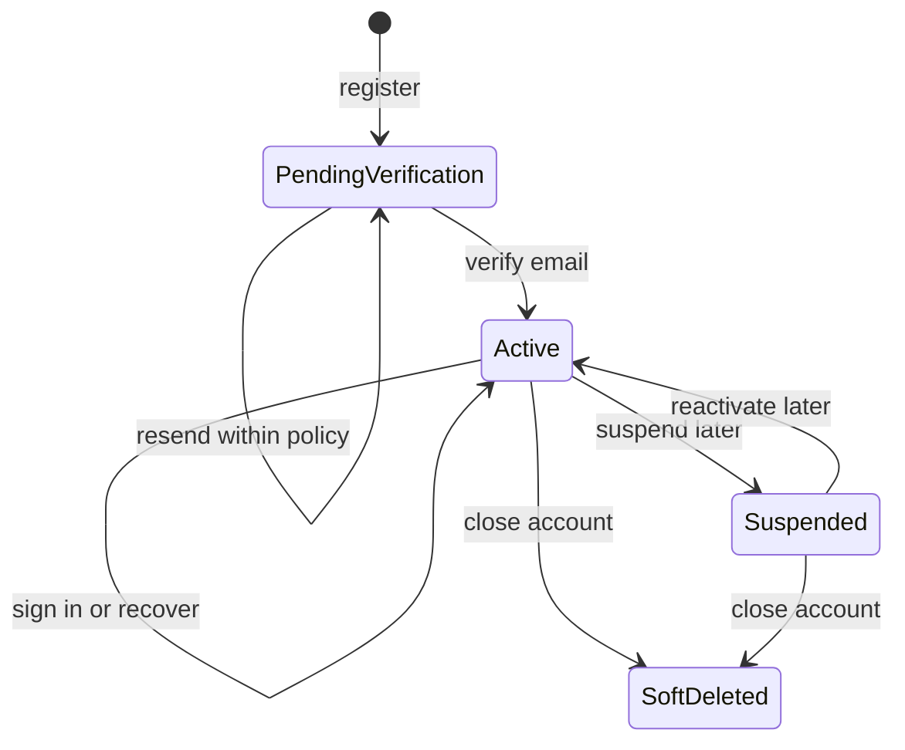
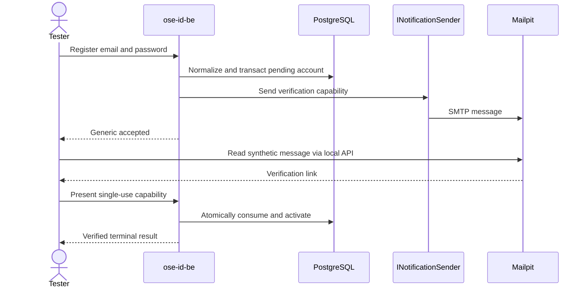
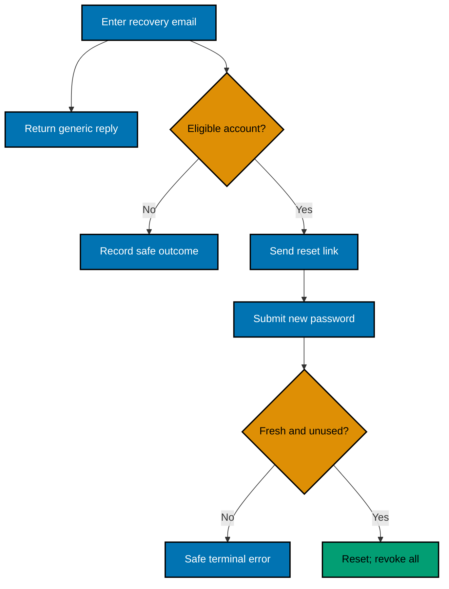

# Product Requirements — OSE ID Init 02 Local Email Account

## Product Overview

This backend-only slice provides a local API for the first OSE identity account lifecycle. It uses an
opaque immutable Person ID; email is a mutable login/contact attribute, never the cross-product subject
key. Verification and recovery messages are locally captured in Mailpit. No browser UI or relying-party
protocol is enabled.

## Personas

- **Individual account holder:** owns an account with no company membership.
- **Local API tester:** drives journeys through HTTP and inspects Mailpit.
- **Security reviewer:** tests generic errors, races, capability misuse, cookie policy, and audit redaction.
- **Later OSE ID web/BFF:** will consume application behavior without direct database/framework access.

## Account Lifecycle



Suspension/closure transitions are modeled so session policy is not painted into a corner, but their
operator/self-service endpoints are not implemented here. Tests may seed states through owned fixtures.

## API Contract

The exact version prefix follows current repository API conventions discovered in Phase 0. The logical
operations are:

| Operation               | Authentication               | Public result                                                 |
| ----------------------- | ---------------------------- | ------------------------------------------------------------- |
| Register email/password | Anonymous + anti-abuse       | Generic accepted; sends only when policy allows               |
| Resend verification     | Anonymous + anti-abuse       | Same generic accepted result                                  |
| Verify email capability | Single-use capability        | Verified, already-terminal, expired, or generic invalid       |
| Password sign-in        | Anonymous + anti-abuse       | Opaque OSE ID session cookie or generic failure               |
| Request recovery        | Anonymous + anti-abuse       | Same generic accepted result for all emails                   |
| Reset password          | Single-use capability        | Success or generic invalid/expired; revokes affected sessions |
| Get current account     | OSE ID session               | Immutable Person ID, safe profile/status only                 |
| List sessions           | Recent authenticated session | Safe session metadata, never cookie/handle                    |
| Revoke session(s)       | Recent authenticated session | Idempotent terminal result                                    |
| Sign out                | Current session              | Cookie cleared and server record invalidated                  |

No response emits password hash fields, normalized lookup values, raw capability handles, session
secrets, or account-existence differences.

## Persistence Product Contract

All account state is OSE-owned PostgreSQL data accessed through SqlKata's PostgreSQL compiler and
`SqlKata.Execution`/Npgsql. Queries project only named response/use-case fields, bind external values,
honor cancellation and finite timeouts, and run each state change plus audit outcome in one explicit
transaction. ASP.NET Core Identity contributes password hashing/validation and rehash signaling only;
its EF stores and `UserManager` persistence are not used. EF remains migration-time tooling, not the
runtime account ORM.

The account policy permits at most 20 active/revocable sessions per Person, so the unpaginated session
list reads at most 20 rows. Point lookups return at most one row. Query-contract and real-PostgreSQL
tests prove these bounds, explicit projections, parameter shapes, intended indexes, and safe query plans
against 10,000-row synthetic fixtures.

## Registration and Verification Flow



The message link contains a high-entropy opaque capability. Store only a safe derived representation
when the framework contract permits. Logs and evidence retain neither the link nor its secret value.

## Recovery Flow



## Acceptance Criteria

### AC-ACC-01 — Register without a company

```gherkin
Scenario: Register a new personal account
  Given no account exists for a synthetic test email
  When a caller submits a policy-compliant email and password
  Then a pending Person is stored without a company or membership
  And the public response is the generic accepted response
  And one verification message is captured by the owned Mailpit instance
```

### AC-ACC-02 — Verify once

```gherkin
Scenario: Consume a valid verification capability
  Given a pending Person has an unexpired verification capability
  When the capability is submitted concurrently twice
  Then exactly one request activates the account
  And the other receives the documented safe terminal result
  And neither response nor log exposes the capability value
```

### AC-ACC-03 — Sign in only after verification

```gherkin
Scenario Outline: Attempt password sign-in
  Given the email account is <state>
  When the correct password is submitted
  Then sign-in is <result>

Examples:
  | state | result |
  | pending verification | rejected generically |
  | active and verified | accepted with a rotated opaque session |
  | suspended | rejected generically |
```

### AC-ACC-04 — Resist account enumeration

```gherkin
Scenario Outline: Request a public account action
  Given the submitted email is <kind>
  When a caller requests verification resend or password recovery
  Then the status and response schema equal the generic accepted contract
  And no account existence detail appears in logs, metrics labels, or audit visible to the caller

Examples:
  | kind |
  | unknown |
  | pending |
  | verified |
  | suspended |
```

### AC-ACC-05 — Recover once and revoke

```gherkin
Scenario: Reset a forgotten password
  Given an active account has an unexpired unused recovery capability and two active sessions
  When the capability sets a policy-compliant new password
  Then the capability becomes unusable
  And the previous password no longer signs in
  And every prior session is revoked
  And the new password can establish a fresh session
```

### AC-ACC-06 — Manage sessions

```gherkin
Scenario: Revoke another session
  Given an active Person has a current session and another active session
  When the current session revokes the other session
  Then the other opaque cookie is rejected on its next request
  And revoking that session again returns the same safe terminal result
  And the current session remains active
```

### AC-ACC-07 — Cross-instance continuity

```gherkin
Scenario: Complete account actions through different instances
  Given two backend instances share PostgreSQL and no sticky routing
  When registration starts on instance A and verification and sign-in complete on instance B
  Then one Person and one current account state exist
  And session validation and revocation have identical results on either instance
```

### AC-ACC-08 — Local email remains local

```gherkin
Scenario: Capture and clean verification mail
  Given the owned local stack uses the Mailpit notification adapter with no relay
  When registration and recovery send messages
  Then messages are visible only through the loopback Mailpit inbox and API
  And stack cleanup removes the messages and all owned Mailpit resources
  And Production or Staging mode rejects the adapter before serving
```

### AC-ACC-09 — Secrets stay out of observability

```gherkin
Scenario Outline: Emit only allowlisted account-operation observability
  Given an account operation receives a synthetic <secret kind>
  When the operation completes with <outcome>
  Then its response contains no submitted secret or stored authentication material
  And its application log event trace attributes and metric labels contain only allowlisted operation outcome timing bucket and correlation fields
  And no plaintext password, password hash, capability, cookie, SMTP body, or connection secret is emitted

  Examples:
    | secret kind             | outcome                         |
    | registration password   | generic registration acceptance |
    | verification capability | successful capability use       |
    | sign-in password        | invalid credentials             |
    | account session cookie  | authenticated account read      |
    | recovery capability     | unavailable capability          |
```

### AC-ACC-10 — Terminal account records remain auditable

```gherkin
Scenario: Retire an expired account capability without erasing it
  Given an expired terminal account capability has complete audit metadata
  When the account cleanup worker retires the capability
  Then ordinary capability lookup no longer returns it
  And the row remains stored with matching deletion and update actor and time fields
  And the capability digest cannot authorize an account action
  And a physical delete through the serving role is rejected
```

## Product Constraints

- Password policy and hashing use supported ASP.NET Core Identity primitives; no custom hashing/crypto.
- Email comparison/normalization follows one invariant culture-aware framework policy and a database
  uniqueness constraint; email remains mutable and is not emitted as immutable identity.
- Rate-limit counters and sessions are shared authoritative records, not process-local caches.
- Mailpit is Local/Test only, loopback-bound, pinned, relay-disabled, and contains synthetic data.
- The web shell remains disabled; testers use backend E2E/API tooling, not an unreviewed browser form.

## Out of Scope

Product authorization and all company/provider/UI/deployment behavior remain outside this delivery.
