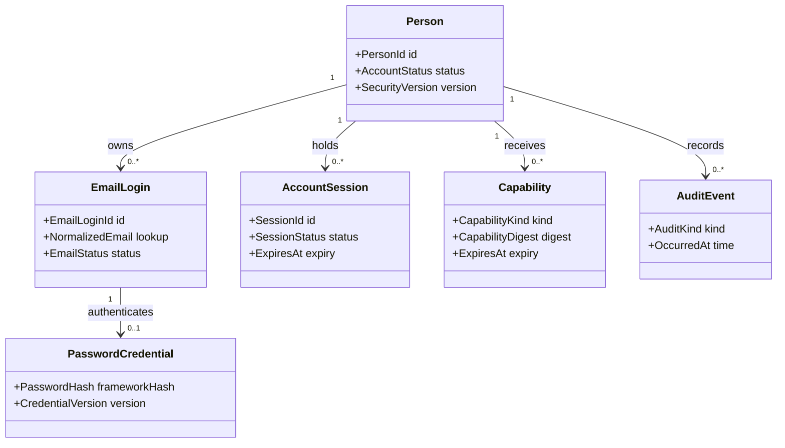

# Account Domain and API Contract

## Domain Boundary

`Person` is the stable global identity aggregate. It may exist with zero login methods while a
registration transaction is pending or an account is being closed, and it always exists independently
of Company. Plans must never create a “personal company” to make an individual fit tenant-shaped data.

These concepts use OSE-owned tables and explicit projections. ASP.NET Core Identity entity/store shapes
must not implement or leak through application ports or HTTP contracts.

## Hexagonal Placement

Account registration, verification, authentication, recovery, session, and closure are application
use cases over the Person aggregate and narrow outbound ports. ASP.NET REST handlers are inbound
adapters: they validate and map the wire request, build only server-verified caller context, invoke one
use case, and map its typed outcome. They never call `UserManager`, `DbContext`, SMTP, or token stores
directly. SqlKata + `SqlKata.Execution`/Npgsql implement OSE-owned persistence ports; ASP.NET Core
Identity password hashing/validation, Mailpit/SMTP, clock, and capability storage are separate outbound
adapter concerns. EF is migration-time tooling only in this slice.

This preserves the Init 01
[transport extension seam](../../../in-progress/ose-id-init-01-foundation/tech-docs/001-system-boundaries-and-project-topology.md#one-use-case-multiple-inbound-adapters):
a future GraphQL resolver or Model Context Protocol tool may invoke the same account use case, but cannot
reuse REST DTOs, bypass enumeration/privacy policy, or receive password/capability material in a generic
result. This plan adds only REST operations and their OpenAPI contract; it adds no GraphQL or MCP surface.

## Identifiers and State

- `PersonId` is opaque, non-semantic, immutable, and never recycled.
- Email is stored in display/original and normalized lookup forms. It can change later and is not `sub`.
- Active normalized email uniqueness is enforced by PostgreSQL, not only a preflight query.
- Account states needed now: pending verification, active, suspended fixture state, and soft-deleted fixture state.
- A monotonic security/credential version invalidates sessions after password reset or security change.
- Timestamps are UTC instants from an injected clock; tests never sleep to cross expiry.

## Transaction Boundaries

Registration must handle concurrent duplicate submissions safely. A uniqueness conflict is translated
to the same generic public result while producing an internal audit disposition. Verification and reset
consume capabilities atomically with the corresponding state change. A transaction cannot mark a
capability used and then fail to activate/update the account, or vice versa.

## HTTP Contract Principles

- Versioned JSON schema, explicit content types, bounded body sizes, and strict validation.
- Generic anonymous responses where account existence is sensitive.
- Correlation ID returned; internal Person/email identifiers excluded unless the session is authorized.
- Stable error codes distinguish caller-actionable invalid input from intentionally generic identity state.
- `Cache-Control: no-store` for credential, capability, current-account, and session responses.
- CORS is not broadened; backend-only E2E uses loopback direct calls.
- CSRF protection applies to cookie-authenticated mutations even before UI exists.

## Route Ownership

Keep account routes in a coherent endpoint/application module under the path convention resolved in
Phase 0. Endpoint handlers validate transport, invoke application commands/queries, and map results.
No EF/Identity store is registered; endpoint and application code cannot call one directly or indirectly.

Persistence ports are operation-specific rather than generic repositories. Their adapters name every
selected column, return immutable projections, and keep SQL/driver types outside Domain/Application.
`SELECT *`, `IQueryable`, EF change tracking, lazy loading, LINQ-to-entities, EF Identity stores, and
`UserManager` persistence are forbidden.

The API is temporary only in the sense that no public production client uses it yet; its application
contract is durable enough for a later BFF. Do not mark insecure debug endpoints as acceptable because
the runner is local.

## Audit Contract

Record registration disposition, verification sent/consumed/expired, sign-in success/failure class,
lockout/rate-limit state, recovery requested/consumed, password changed, session created/revoked/expired,
and configuration rejection. Audit payloads use opaque IDs and safe reason enums. They exclude raw email
where an opaque subject/correlation suffices and always exclude passwords, hashes, capabilities, cookies,
message bodies, headers, and connection data.

## Rollback Compatibility

Additive account migrations remain when code rolls back. The foundation host must still start/readiness
check against a newer compatible schema. Any destructive column/table reversal requires a later data
retention/migration plan; do not down-migrate a database containing accounts merely to revert code.
