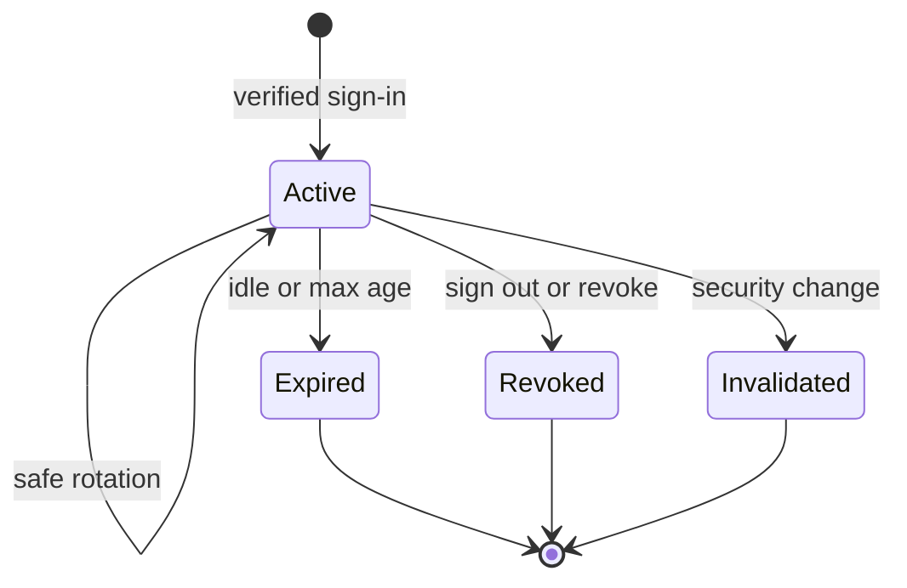
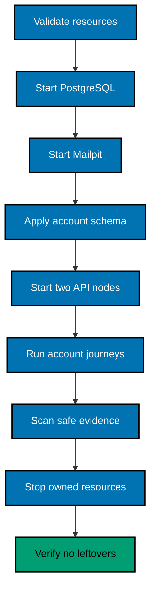

# Sessions, Statelessness, and Local Verification

## Session Model

The backend issues an opaque cookie whose random value identifies a server-side `AccountSession` only
through a safe digest/index representation. The cookie is not a JWT and does not carry authorization
claims. A database lookup evaluates status, Person/account status, security version, idle/absolute
expiry, and revocation on every protected account request or through a cache that can never authorize
beyond the authoritative bound.

Cookie attributes in Local/Test follow the closest safe browser contract: HttpOnly, appropriate
SameSite, narrow path/domain, and Secure when HTTPS is used. If loopback HTTP requires a test-specific
Secure exception, keep it explicit to Test tooling and prove Production cannot select it.

## Session Lifecycle

Do not introduce OIDC authorization grants, client sessions, access tokens, ID tokens, or refresh
tokens. Those are different artifacts for a later protocol slice.

## Stateless Multi-Instance Contract

All instances share Person, login, capability, session, rate-limit, audit, and any cryptographic key
ring state. Registration may begin on A, notification issue on B, verification consume on A, sign-in on
B, and revocation on A. Stop either process at every boundary and confirm the remaining process has the
same result. No runner affinity header exists.

## Local Stack Extension

Plan 02 extends, never copies, Plan 01's runner:

Use Mailpit SMTP `127.0.0.1:1026` through `OSE_ID_MAILPIT_SMTP_PORT=1026` and inbox/API
`http://127.0.0.1:8026` through `OSE_ID_MAILPIT_UI_PORT=8026`. Preserve inherited web/backend/PostgreSQL
defaults 3500/8501/5438. Phase 0 verifies all five registry/host reservations remain free; a collision
stops and amends the plan rather than selecting another default. Parallel automated runs may use owned
ephemeral overrides without changing the documented manual defaults.

## E2E Fixture Rules

- Unique `.test` email per scenario; no personal data.
- Fixed/injected clock for expiry without sleeps.
- Cryptographic randomness in built runtime; tests capture returned message only through Mailpit.
- Concurrency coordinated with barriers and observed database results, not timing sleeps.
- Database reset/migration runs through owned tooling; never reuse developer data.
- Mailbox assertions select the unique recipient and message kind, not “latest message.”
- Raw cookies/capabilities live only in an ignored temporary directory and are deleted at cleanup.

## Manual API Runbook

Use the delivered stack and an HTTP client cookie jar outside the repository:

1. Register a synthetic account and confirm generic response.
2. Inspect exactly one Mailpit verification message, follow its capability, then prove reuse is terminal.
3. Sign in with wrong/correct credentials and inspect cookie attributes without recording cookie value.
4. List current sessions, establish a second session, revoke it, and prove denial on either backend.
5. Request recovery for unknown and known emails; compare safe response schema/status.
6. Reset through Mailpit, prove old password and all old sessions fail, then establish a fresh session.
7. Scan responses/logs/evidence for forbidden secret patterns.
8. Stop and confirm PostgreSQL/Mailpit/process/network/volume/message inventory is empty.

## Failure Semantics

Notification delivery failure does not activate an account or reveal existence. A pending account may
request resend within policy. Mailpit outage makes the notification component not ready for account
actions while liveness remains available. Database outage makes account readiness fail. Cleanup reports
Mailpit deletion failure separately from the journey's primary failure.
