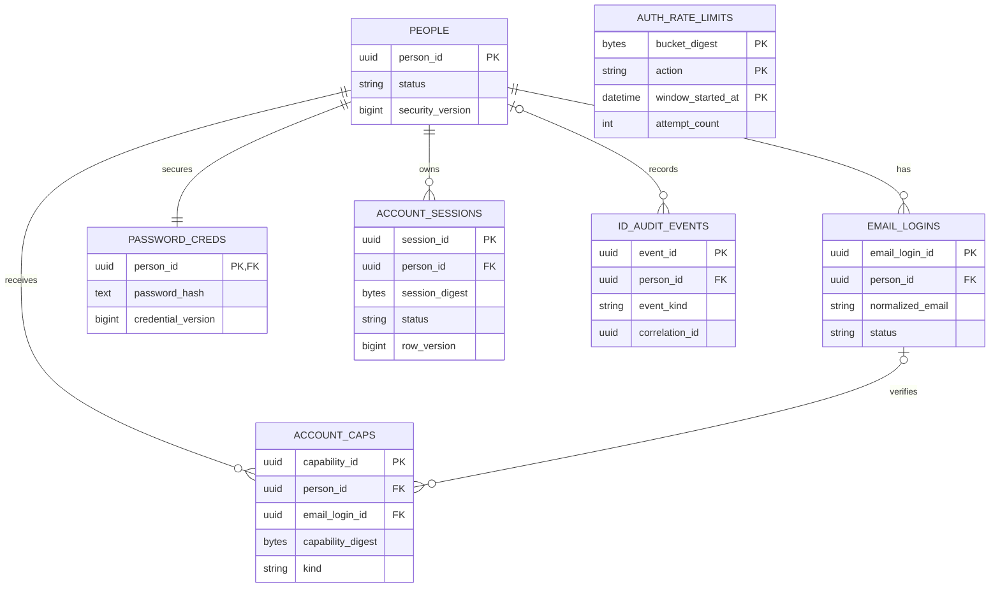

# Physical Schema and Migration Contract

## Old Physical State

The only OSE ID table is Plan 01's migration-role-owned `ose_id.__EFMigrationsHistory`. It contains
`MigrationId varchar(150) NOT NULL PRIMARY KEY`, `ProductVersion varchar(32) NOT NULL`, all six canonical
audit columns, lifecycle checks, and the named hard-delete guard. The application role has schema
`USAGE` plus active history-table `SELECT`, never `DELETE`. There are no Person, login, password,
capability, session, rate-limit, or identity-audit rows to backfill.

## Common Audit Columns

Every new table below appends these six columns in this exact order, as required by the repository
[`database-audit-trail`](../../../../repo-governance/development/pattern/database-audit-trail.md) and
the inherited OSE ID
[audit/soft-delete profile](../../../done/2026-09-17__ose-id-init-01-foundation/tech-docs/007-database-audit-and-soft-delete-contract.md).
The migration role owns tables; the serving role receives only explicitly required `SELECT`, `INSERT`,
and `UPDATE` privileges. There is no framework-metadata exception.

| Column       | PostgreSQL type            | Nullability / default                | Lifecycle                                              |
| ------------ | -------------------------- | ------------------------------------ | ------------------------------------------------------ |
| `created_at` | `timestamp with time zone` | `NOT NULL DEFAULT CURRENT_TIMESTAMP` | Immutable creation instant                             |
| `created_by` | `character varying(255)`   | `NOT NULL DEFAULT 'system'`          | Immutable creator/correlation actor                    |
| `updated_at` | `timestamp with time zone` | `NOT NULL DEFAULT CURRENT_TIMESTAMP` | Changed on every mutation                              |
| `updated_by` | `character varying(255)`   | `NOT NULL DEFAULT 'system'`          | Changed with `updated_at`                              |
| `deleted_at` | `timestamp with time zone` | nullable; no default                 | `NULL` means active; soft-delete instant otherwise     |
| `deleted_by` | `character varying(255)`   | nullable; no default                 | Must be non-null exactly when `deleted_at` is non-null |

Each table has `CHECK ((deleted_at IS NULL) = (deleted_by IS NULL))`, the inherited time-order checks,
an active-row partial index for every normal query path, and a named `BEFORE DELETE` guard. All foreign
keys use `ON DELETE RESTRICT`; runtime roles receive no `DELETE`. Hard delete is forbidden for every table.

## New Physical Tables

`AUTH_RATE_LIMITS` deliberately has no Person foreign key: its digest hides raw email and network
inputs, so enumeration-defense state does not become an identity directory.

### `ose_id.people`

| Column             | Type                        | Null / default                    | Constraint or index                                                      |
| ------------------ | --------------------------- | --------------------------------- | ------------------------------------------------------------------------ |
| `person_id`        | `uuid`                      | `NOT NULL`; application-generated | Primary key `pk_people`                                                  |
| `status`           | `character varying(32)`     | `NOT NULL`                        | Check in `pending_verification`, `active`, `suspended`, `soft_deleted`   |
| `security_version` | `bigint`                    | `NOT NULL DEFAULT 0`              | Check `security_version >= 0`; optimistic/security invalidation value    |
| six audit columns  | exact common contract above | exact common contract above       | Partial index `ix_people_active` on `person_id WHERE deleted_at IS NULL` |

### `ose_id.email_logins`

| Column             | Type                        | Null / default                    | Constraint or index                                                                 |
| ------------------ | --------------------------- | --------------------------------- | ----------------------------------------------------------------------------------- |
| `email_login_id`   | `uuid`                      | `NOT NULL`; application-generated | Primary key `pk_email_logins`                                                       |
| `person_id`        | `uuid`                      | `NOT NULL`                        | FK `fk_email_logins_people` to `people(person_id)` with `ON DELETE RESTRICT`        |
| `email_display`    | `character varying(320)`    | `NOT NULL`                        | User-facing verified contact value; mutable only through a later email-change flow  |
| `normalized_email` | `character varying(320)`    | `NOT NULL`                        | Partial unique index `ux_email_logins_normalized_active` where `deleted_at IS NULL` |
| `status`           | `character varying(32)`     | `NOT NULL`                        | Check in `pending`, `verified`, `disabled`                                          |
| `verified_at`      | `timestamp with time zone`  | nullable; no default              | Check: non-null exactly for `verified` status                                       |
| six audit columns  | exact common contract above | exact common contract above       | Index `ix_email_logins_person_active(person_id)` where active                       |

### `ose_id.password_credentials`

| Column               | Type                        | Null / default                       | Constraint or index                                                   |
| -------------------- | --------------------------- | ------------------------------------ | --------------------------------------------------------------------- |
| `person_id`          | `uuid`                      | `NOT NULL`                           | Primary key and FK to `people(person_id)` with `ON DELETE RESTRICT`   |
| `password_hash`      | `text`                      | `NOT NULL`; no default               | Framework-generated opaque hash; never selected into public DTO/audit |
| `credential_version` | `bigint`                    | `NOT NULL DEFAULT 0`                 | Check `>= 0`; increment on hash/password replacement                  |
| `changed_at`         | `timestamp with time zone`  | `NOT NULL DEFAULT CURRENT_TIMESTAMP` | Last password establishment/change instant                            |
| six audit columns    | exact common contract above | exact common contract above          | No hash index                                                         |

### `ose_id.account_capabilities`

| Column              | Type                        | Null / default                    | Constraint or index                                                                                          |
| ------------------- | --------------------------- | --------------------------------- | ------------------------------------------------------------------------------------------------------------ |
| `capability_id`     | `uuid`                      | `NOT NULL`; application-generated | Primary key                                                                                                  |
| `person_id`         | `uuid`                      | `NOT NULL`                        | FK to `people` with `ON DELETE RESTRICT`                                                                     |
| `email_login_id`    | `uuid`                      | nullable; no default              | FK to `email_logins` with `ON DELETE RESTRICT`; required for verification                                    |
| `kind`              | `character varying(32)`     | `NOT NULL`                        | Check in `verify_email`, `reset_password` only                                                               |
| `capability_digest` | `bytea`                     | `NOT NULL`                        | Unique `ux_account_capabilities_digest`; raw capability is never stored                                      |
| `security_version`  | `bigint`                    | `NOT NULL`                        | Check `>= 0`; binds issuance state                                                                           |
| `expires_at`        | `timestamp with time zone`  | `NOT NULL`                        | Check `expires_at > created_at`                                                                              |
| `consumed_at`       | `timestamp with time zone`  | nullable; no default              | Single-use terminal instant; check not before `created_at`                                                   |
| six audit columns   | exact common contract above | exact common contract above       | Index `ix_account_capabilities_person_kind_active(person_id, kind, expires_at)` where unconsumed/not deleted |

### `ose_id.account_sessions`

| Column                | Type                        | Null / default                       | Constraint or index                                                               |
| --------------------- | --------------------------- | ------------------------------------ | --------------------------------------------------------------------------------- |
| `session_id`          | `uuid`                      | `NOT NULL`; application-generated    | Primary key                                                                       |
| `person_id`           | `uuid`                      | `NOT NULL`                           | FK to `people` with `ON DELETE RESTRICT`                                          |
| `session_digest`      | `bytea`                     | `NOT NULL`                           | Unique `ux_account_sessions_digest`; raw cookie is never stored                   |
| `security_version`    | `bigint`                    | `NOT NULL`                           | Check `>= 0`; compared with Person                                                |
| `status`              | `character varying(24)`     | `NOT NULL DEFAULT 'active'`          | Check in `active`, `revoked`, `expired`, `invalidated`                            |
| `last_seen_at`        | `timestamp with time zone`  | `NOT NULL DEFAULT CURRENT_TIMESTAMP` | Monotonic observed-use instant                                                    |
| `idle_expires_at`     | `timestamp with time zone`  | `NOT NULL`                           | Idle bound                                                                        |
| `absolute_expires_at` | `timestamp with time zone`  | `NOT NULL`                           | Check later than/equal idle bound                                                 |
| `revoked_at`          | `timestamp with time zone`  | nullable; no default                 | Non-null for revoked/invalidated terminal state                                   |
| `row_version`         | `bigint`                    | `NOT NULL DEFAULT 0`                 | Check `>= 0`; optimistic concurrency                                              |
| six audit columns     | exact common contract above | exact common contract above          | Index `ix_account_sessions_person_status(person_id, status, absolute_expires_at)` |

### `ose_id.auth_rate_limits`

| Column              | Type                        | Null / default              | Constraint or index                                                                         |
| ------------------- | --------------------------- | --------------------------- | ------------------------------------------------------------------------------------------- |
| `bucket_digest`     | `bytea`                     | `NOT NULL`                  | Composite primary key with `action` and `window_started_at`; raw email/network value absent |
| `action`            | `character varying(32)`     | `NOT NULL`                  | Check in exact account action set below                                                     |
| `window_started_at` | `timestamp with time zone`  | `NOT NULL`                  | Composite primary key                                                                       |
| `attempt_count`     | `integer`                   | `NOT NULL DEFAULT 0`        | Check `attempt_count >= 0`                                                                  |
| `blocked_until`     | `timestamp with time zone`  | nullable; no default        | Shared block boundary                                                                       |
| six audit columns   | exact common contract above | exact common contract above | Index `ix_auth_rate_limits_blocked_until` on non-null `blocked_until`                       |

### `ose_id.identity_audit_events`

| Column            | Type                        | Null / default                       | Constraint or index                                                               |
| ----------------- | --------------------------- | ------------------------------------ | --------------------------------------------------------------------------------- |
| `event_id`        | `uuid`                      | `NOT NULL`; application-generated    | Primary key                                                                       |
| `person_id`       | `uuid`                      | nullable; no default                 | FK to `people` with `ON DELETE RESTRICT`; null for unknown-account public actions |
| `event_kind`      | `character varying(64)`     | `NOT NULL`                           | Check against exact event set below                                               |
| `result_code`     | `character varying(48)`     | `NOT NULL`                           | Check against exact result set below                                              |
| `correlation_id`  | `uuid`                      | `NOT NULL`                           | Index `ix_identity_audit_events_correlation`                                      |
| `safe_payload`    | `jsonb`                     | `NOT NULL DEFAULT '{}'::jsonb`       | Allowlisted keys; no passwords, hashes, email, capability, cookie, SMTP body      |
| `occurred_at`     | `timestamp with time zone`  | `NOT NULL DEFAULT CURRENT_TIMESTAMP` | Index with `person_id` for authorized review                                      |
| six audit columns | exact common contract above | exact common contract above          | Append-only application policy; soft-delete fields remain null                    |

## Exact Constraint, Index, and Ownership Manifest

Every named object below is created by the single additive migration. `ck_<table>_soft_delete_pair`
means `CHECK ((deleted_at IS NULL) = (deleted_by IS NULL))`; it is repeated on every application table,
not inherited or application-only.

| Table                   | Exact constraints                                                                                                                                                                                                                                                                                                                                                                                                                                                                                                                                                                                                                                                                                                    | Exact non-PK indexes                                                                                                                                                                   |
| ----------------------- | -------------------------------------------------------------------------------------------------------------------------------------------------------------------------------------------------------------------------------------------------------------------------------------------------------------------------------------------------------------------------------------------------------------------------------------------------------------------------------------------------------------------------------------------------------------------------------------------------------------------------------------------------------------------------------------------------------------------- | -------------------------------------------------------------------------------------------------------------------------------------------------------------------------------------- |
| `people`                | `pk_people(person_id)`; `ck_people_status` permits `pending_verification`, `active`, `suspended`, `soft_deleted`; `ck_people_security_version_nonnegative(security_version >= 0)`; `ck_people_soft_delete_pair`                                                                                                                                                                                                                                                                                                                                                                                                                                                                                                      | `ix_people_active(person_id) WHERE deleted_at IS NULL`                                                                                                                                 |
| `email_logins`          | `pk_email_logins(email_login_id)`; `fk_email_logins_people(person_id) REFERENCES people(person_id) ON DELETE RESTRICT`; `ck_email_logins_status` permits `pending`, `verified`, `disabled`; `ck_email_logins_verified_state((status = 'verified' AND verified_at IS NOT NULL) OR (status = 'pending' AND verified_at IS NULL) OR status = 'disabled')`; `ck_email_logins_soft_delete_pair`                                                                                                                                                                                                                                                                                                                           | `ux_email_logins_normalized_active(normalized_email) UNIQUE WHERE deleted_at IS NULL`; `ix_email_logins_person_active(person_id) WHERE deleted_at IS NULL`                             |
| `password_credentials`  | `pk_password_credentials(person_id)`; `fk_password_credentials_people(person_id) REFERENCES people(person_id) ON DELETE RESTRICT`; `ck_password_credentials_version_nonnegative(credential_version >= 0)`; `ck_password_credentials_soft_delete_pair`                                                                                                                                                                                                                                                                                                                                                                                                                                                                | none                                                                                                                                                                                   |
| `account_capabilities`  | `pk_account_capabilities(capability_id)`; `fk_account_capabilities_people(person_id) REFERENCES people(person_id) ON DELETE RESTRICT`; `fk_account_capabilities_email_logins(email_login_id) REFERENCES email_logins(email_login_id) ON DELETE RESTRICT`; `ck_account_capabilities_kind` permits `verify_email`, `reset_password`; `ck_account_capabilities_verification_email(kind <> 'verify_email' OR email_login_id IS NOT NULL)`; `ck_account_capabilities_security_version_nonnegative(security_version >= 0)`; `ck_account_capabilities_expiry(expires_at > created_at)`; `ck_account_capabilities_consumption(consumed_at IS NULL OR consumed_at >= created_at)`; `ck_account_capabilities_soft_delete_pair` | `ux_account_capabilities_digest(capability_digest) UNIQUE`; `ix_account_capabilities_person_kind_active(person_id, kind, expires_at) WHERE consumed_at IS NULL AND deleted_at IS NULL` |
| `account_sessions`      | `pk_account_sessions(session_id)`; `fk_account_sessions_people(person_id) REFERENCES people(person_id) ON DELETE RESTRICT`; `ck_account_sessions_security_version_nonnegative(security_version >= 0)`; `ck_account_sessions_status` permits `active`, `revoked`, `expired`, `invalidated`; `ck_account_sessions_expiry(idle_expires_at <= absolute_expires_at)`; `ck_account_sessions_revoked_state((status IN ('revoked','invalidated')) = (revoked_at IS NOT NULL))`; `ck_account_sessions_row_version_nonnegative(row_version >= 0)`; `ck_account_sessions_soft_delete_pair`                                                                                                                                      | `ux_account_sessions_digest(session_digest) UNIQUE`; `ix_account_sessions_person_status(person_id, status, absolute_expires_at)`                                                       |
| `auth_rate_limits`      | `pk_auth_rate_limits(bucket_digest, action, window_started_at)`; `ck_auth_rate_limits_action` permits `register_email`, `resend_verification`, `verify_email`, `sign_in`, `request_password_reset`, `reset_password`; `ck_auth_rate_limits_attempt_count_nonnegative(attempt_count >= 0)`; `ck_auth_rate_limits_block_window(blocked_until IS NULL OR blocked_until >= window_started_at)`; `ck_auth_rate_limits_soft_delete_pair`                                                                                                                                                                                                                                                                                   | `ix_auth_rate_limits_blocked_until(blocked_until) WHERE blocked_until IS NOT NULL`                                                                                                     |
| `identity_audit_events` | `pk_identity_audit_events(event_id)`; `fk_identity_audit_events_people(person_id) REFERENCES people(person_id) ON DELETE RESTRICT`; `ck_identity_audit_events_kind` permits `registration_requested`, `email_verification_sent`, `email_verified`, `sign_in_succeeded`, `sign_in_failed`, `password_reset_requested`, `password_reset_completed`, `session_revoked`, `session_invalidated`, `rate_limited`; `ck_identity_audit_events_result` permits `accepted`, `succeeded`, `failed`, `denied`, `not_found`, `idempotent`; `ck_identity_audit_events_payload_object(jsonb_typeof(safe_payload) = 'object')`; `ck_identity_audit_events_soft_delete_pair`                                                          | `ix_identity_audit_events_correlation(correlation_id)`; `ix_identity_audit_events_person_occurred(person_id, occurred_at DESC)`                                                        |

All seven tables are owned exactly by `ose_id_migrator`; `PUBLIC` has no table privilege. `ose_id_app`
gets `SELECT, INSERT, UPDATE` on the first six tables and `SELECT, INSERT` only on
`identity_audit_events`. It receives no `DELETE`, `TRUNCATE`, `REFERENCES`, `TRIGGER`, ownership, DDL,
or sequence privilege. UUIDs are application-generated, so this schema creates no sequence. This grant
manifest is part of catalog verification and prevents the append-only audit table from being mutated.

## Runtime Query and Plan Manifest

Application runtime access to the exact schema above uses SqlKata `Query` plus `PostgresCompiler`,
executed by `SqlKata.Execution` on an explicit Npgsql connection/transaction. EF migration classes and
`__EFMigrationsHistory` remain schema-evolution tooling; serving code registers no application
`DbContext`, EF Identity store, or `UserManager` persistence. Every query names its projection, binds
values, accepts `CancellationToken`, and uses the foundation five-second command timeout. Identifiers
come only from centralized code-owned table/column/order allowlists because SqlKata string identifiers
do not provide compile-time schema safety.

The implementation creates a query manifest covering every account use case. For each entry, Unit tests
snapshot normalized compiled PostgreSQL SQL and parameter names/types; Integration tests compare named
projections/mappings with live catalogs and execute under the real application role; E2E proves the HTTP
behavior. The manifest fails on `SELECT *`, literal request values, unlisted identifiers, missing
soft-delete/status predicates, an unbounded result, or an affected-row count outside its declared bound.

| Query class                                                           | Exact fetch/affected-row budget                                                                           | Required access path                                                   |
| --------------------------------------------------------------------- | --------------------------------------------------------------------------------------------------------- | ---------------------------------------------------------------------- |
| Person, email, credential, capability, or session point lookup        | At most one returned row                                                                                  | Named PK, unique digest, or `ux_email_logins_normalized_active` lookup |
| Account session list                                                  | At most 20 returned rows, matching the active/revocable session cap                                       | `ix_account_sessions_person_status`, deterministic expiry/ID order     |
| Capability consume or session revoke                                  | Exactly zero or one affected row per conditional statement                                                | PK/digest predicate plus status/version/expiry guard                   |
| Registration, verification, sign-in, reset, or rate-limit transaction | Each statement declares an exact zero/one affected-row expectation; one audit insert per recorded outcome | Named unique/partial indexes and one explicit transaction              |

Performance evidence uses 10,000-row synthetic tables with target, expired/deleted, and unrelated-person
rows. Read-only paths record `EXPLAIN (ANALYZE, BUFFERS, FORMAT JSON)`; mutations record `EXPLAIN
(FORMAT JSON)` or use `ANALYZE` only inside an always-rolled-back transaction. Point/session paths must
use the named index above, return within their table budget, and avoid a sequential scan. This is a
query-shape regression gate, not a blanket claim that SqlKata is faster than EF.

## Field Lifecycle

- All primary identifiers, foreign-key ownership fields, normalized email, capability/session digests,
  capability kind/expiry/security version, session absolute expiry, rate-limit composite-key fields,
  and audit-event business fields are immutable after insert.
- `people.status` moves `pending_verification -> active`, `active <-> suspended`, or from a non-deleted
  state to `soft_deleted`; `security_version` increases, never decreases, on a security-affecting change.
- `email_logins.status` moves `pending -> verified` or any non-disabled state to `disabled`;
  `verified_at` moves from null to one immutable instant in the same transaction as verification.
  Changing an email address is not authorized in this plan.
- `password_hash`, `credential_version`, and `changed_at` change together only on successful password
  establishment/reset; the version increases exactly once and the old hash is overwritten, never audited.
- `account_capabilities.consumed_at` moves from null to one immutable instant by an atomic conditional
  update. A consumed, expired, deleted, wrong-kind, or wrong-version capability never becomes usable again.
- `account_sessions.status` moves from `active` to one terminal state; `last_seen_at` is monotonic,
  `idle_expires_at` may only move forward without exceeding `absolute_expires_at`, `revoked_at` is set once
  for revoked/invalidated state, and `row_version` increases on each mutation.
- `auth_rate_limits.attempt_count` increases within its immutable window; `blocked_until` is null or moves
  forward. Rotation to a new window creates a new row. Audit events are insert-only in every field.
- `created_at`/`created_by` never change; `updated_at`/`updated_by` change together on every permitted
  update; `deleted_at`/`deleted_by` move together from null once. No field is physically deleted here.

## Migration Artifacts and Ownership

Generate one additive migration pair matching
`apps/ose-id-be/src/OseId.Infrastructure/Persistence/Migrations/*_AddLocalEmailAccount.cs` and its
`.Designer.cs`, plus the exact model snapshot. Database-role/grant fixtures live under the existing
`apps/ose-id-be-e2e/` database fixture path. No migration or serving configuration contains real secrets.
EF executes only this explicit migration workflow; its generated model is not the application runtime
model, and no serving use case accesses the OSE tables through EF.

## Expand, Verify, Contract, and No-Loss

1. **Expand:** create all tables, FKs, checks, unique/partial indexes, and application DML grants in one
   forward migration; do not change/drop Plan 01 columns or grants.
2. **Backfill:** none. The old schema has zero domain rows and no source columns. Record the explicit
   `not applicable — no predecessor data` row in the migration manifest rather than inventing fixtures.
3. **Verify:** compare catalog output to every physical row above, migrate empty and current databases,
   seed synthetic records, and record per-table active/deleted counts plus stable non-secret digests.
4. **Contract:** none. All changes are additive; no old object becomes obsolete in this slice.
5. **Old code/new schema:** Plan 01 ignores new tables and continues health/readiness because its compiled
   migration set is configured to accept this additive successor. Prove it in E2E before merge.
6. **New code/old schema:** readiness returns `schema_incompatible`; account endpoints admit no work until
   the migration stage completes.
7. **Rollback:** redeploy Plan 01 code while retaining every new table/row. Disable account routes through
   the inherited runtime guard; never down-migrate stored account data.
8. **Forward-fix:** repair a schema/index/constraint/grant defect with a new migration. Never edit an
   applied migration, drop unknown data, or weaken a constraint/policy to make tests pass.
