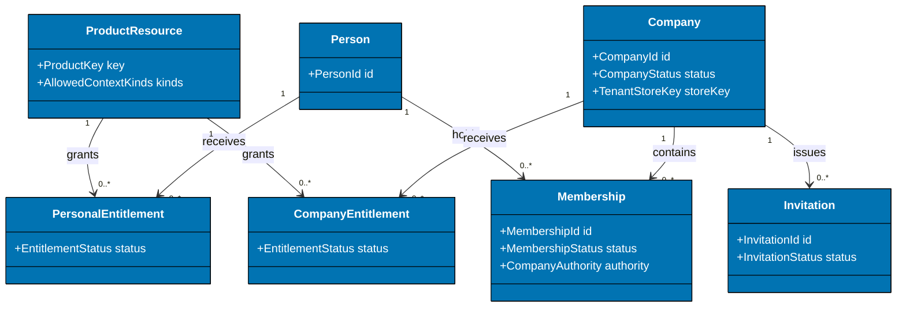
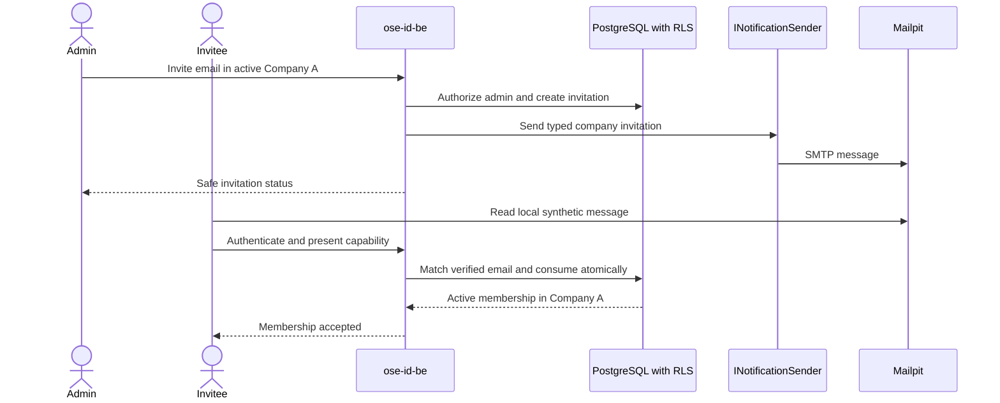
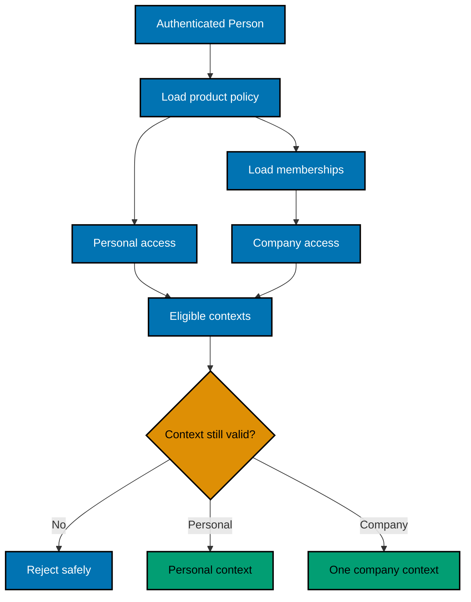

# Product Requirements — OSE ID Init 03 Company Tenancy Core

## Product Overview

This backend-only slice models companies as tenant boundaries around membership, delegated identity
administration, and product entitlement. It preserves global Person/account state and introduces a
discriminated authorization context for later OIDC issuance. The observable interface is a local API
and E2E contract; no company UI or product token exists.

## Plain-Language Terms

| Term                  | Meaning here                                                                                    |
| --------------------- | ----------------------------------------------------------------------------------------------- |
| Company               | Organization/tenant boundary; not a personal account, LMS course, or arbitrary team             |
| Membership            | Relationship between one Person and one Company, with state and narrow identity-admin authority |
| MembershipAdmin       | May manage membership/invitation/product-entry facts inside one active company only             |
| Product entitlement   | Fact that a Person or Company may enter a product; never an LMS/domain role                     |
| Personal context      | `context_type=personal`; identified by authenticated Person and contains no company ID          |
| Company context       | `context_type=company`; exactly one current active company/membership                           |
| RLS                   | PostgreSQL row-level security that filters/denies tenant rows inside the database               |
| Tenant-store resolver | Narrow mapping from stable Company ID/store key to the current shared store                     |

## Personas

- **Personal user:** belongs to no company but can receive personal entitlement.
- **Company member:** belongs to one or many companies with independent state.
- **Membership administrator:** manages identity membership/entry facts in one active company.
- **Product integrator:** later consumes a single evaluated authorization context and owns domain roles.
- **Security tester:** probes API and RLS with missing/wrong/stale/guessed contexts.

## Domain Map



## Membership and Invitation Flow



A new invitee completes Plan 02 registration/verification first. An existing account signs in. The
invitation address proves intended contact, while immutable membership ownership uses Person ID.

## Authorization Context Resolution



The core returns an application result for future consent/token issuance. It does not issue JWTs or
persist an OIDC grant. A company ID from the caller is only a requested selector and is re-resolved from
current server state.

## Backend API Scope

Authenticated local API operations cover membership list/current contexts, invitation create/list/
resend/revoke/accept, member list, suspend/reactivate, leave, authority transfer required for last-admin
safety, product entitlement list/grant/revoke, and context evaluation. Company creation and product
registration are deterministic E2E fixture/bootstrap commands in this slice, not public self-service APIs.

Every operation calls a transport-neutral use case whose OSE-owned persistence adapter uses SqlKata's
PostgreSQL compiler and `SqlKata.Execution`/Npgsql. The use case owns one explicit connection/transaction,
sets RLS context transaction-locally, projects named fields only, binds all external values, propagates
cancellation, and applies a finite timeout. EF runtime tracking, LINQ-to-entities, `DbContext`, EF Identity
stores, and `UserManager` persistence are outside this product contract; EF remains migration-time tooling.

All company-admin requests carry a requested Company ID but authorize through the current authenticated
Person plus fresh MembershipAdmin state and transaction-local RLS context. Cross-company existence is
not disclosed through result differences.

An authorized same-company member directory returns opaque IDs, membership state/authority/version,
and the member's current verified contact email. An authorized invitation directory returns its safe
lifecycle fields and recipient email. These contact fields let an admin distinguish people and pending
invitations; provider subjects, login IDs, credentials, session state, capability material, private
global fields, and foreign-company contacts remain excluded. Contact email is never copied into logs,
traces, metrics, or audit payloads.

The member directory accepts an optional bounded literal verified-email-prefix filter and deterministic
keyset pagination. Results sort by normalized email and Membership ID. Every opaque cursor is bound to
the active company, normalized filter, ordering version, and last tuple; changing the company/filter or
replaying a malformed cursor fails without disclosing another company. This is tenant-local roster
filtering, never cross-company search. Invitation filtering is not added because this slice's consumer
requires deterministic invitation pagination and lifecycle actions, not repository-wide invitation search.

Authorization-context enumeration returns at most 100 eligible contexts plus no continuation in this
slice; a Person exceeding that bound receives a stable `context_limit_exceeded` failure rather than a
truncated authorization decision. Member, invitation, and entitlement pages fetch at most requested
`limit + 1` rows (maximum 101) to determine `nextCursor`; point operations return at most one row.

## Acceptance Criteria

### AC-TEN-01 — A Person may have no company

```gherkin
Scenario: Evaluate a personal-only eligible user
  Given a verified active Person has no memberships and has an active personal LMS fixture entitlement
  When the Person requests eligible contexts for the LMS fixture resource
  Then exactly one personal context is returned
  And the context has no company identifier
  And no Company or Membership row is created
```

### AC-TEN-02 — A company-required resource rejects personal access

```gherkin
Scenario: Evaluate a company-required resource for a companyless Person
  Given a verified active Person has no memberships
  And the resource allows only company context
  When eligible contexts are evaluated
  Then no eligible context is returned with the documented safe reason
  And the system does not create a synthetic company
```

### AC-TEN-03 — One Person belongs to multiple companies

```gherkin
Scenario: Resolve separate company contexts
  Given a Person is an active entitled member of Company A and Company B
  When eligible contexts are evaluated for a resource that accepts company context
  Then Company A and Company B appear as separate eligible choices
  And selecting Company A returns only Company A context
  And no result represents both companies
```

### AC-TEN-04 — Invitation administration and acceptance are safe

```gherkin
Scenario: Manage a company invitation lifecycle without exposing capabilities
  Given a Person is MembershipAdmin in Company A
  When the Person creates, lists, resends, and revokes an invitation for "invitee@example.test"
  Then every administrative result identifies the invitation by recipient email
  And the resend invalidates the previous capability
  And the revoke prevents either capability from creating a membership
  And no result contains a capability, provider subject, login identifier, or credential field
  And the same Person cannot manage invitations from an unauthorized company

Scenario: Accept a company invitation concurrently
  Given an unexpired invitation targets an email verified by the authenticated Person
  When the invitation capability is submitted concurrently twice
  Then exactly one active Membership is created in the intended company
  And the other request receives the documented idempotent terminal result
  And the capability cannot create membership for another Person or Company
```

### AC-TEN-05 — Company admin directory is recognizable and tenant-bound

```gherkin
Scenario: Filter and page recognizable members within one company
  Given a Person is MembershipAdmin in Company A
  And Company A and Company B have distinct members with the same verified-email prefix
  When the Person pages Company A members with that prefix and a limit of one
  Then only matching Company A members appear in normalized-email and membership-ID order
  And every next cursor continues that exact company, prefix, and order
  And reusing a cursor with Company B or another prefix is rejected without disclosure

Scenario: List and update recognizable members without exposing private identity fields
  Given a Person is MembershipAdmin in Company A
  And Company A has an active member with verified email "member@example.test"
  When the Person lists, suspends, and reactivates that Company A member
  Then the result identifies the member by verified contact email
  And the result contains no provider subject, login identifier, credential, or session field
  And the verified contact email is absent from logs, traces, metrics, and audit payloads

Scenario: Leave one company without affecting another membership
  Given a Person has active memberships in Company A and Company B
  When the Person leaves the Company A membership with its current row version
  Then the Company A membership is left
  And the Company B membership remains active
  And no administrator can use the leave operation for another Person

Scenario: Reject a Company A administrator using a Company B member identifier
  Given a Person is MembershipAdmin in Company A and an ordinary member in Company B
  When the Person uses Company A context to read or mutate the Company B member identifier
  Then the operation is denied without disclosing Company B ownership
  And no Company B row or audit payload is changed
```

### AC-TEN-06 — Last active admin is protected

```gherkin
Scenario: Concurrently attempt to remove the final membership administrator
  Given a company has exactly one active MembershipAdmin
  When concurrent requests suspend that membership and downgrade its authority
  Then both operations cannot commit a state with zero active MembershipAdmin
  And at least one safe conflict result identifies the required transfer action
```

### AC-TEN-07 — Entitlement is not a product role

```gherkin
Scenario: List company product-entry entitlements
  Given a MembershipAdmin acts in Company A
  And Company A has an active LMS fixture product entitlement
  When the admin lists Company A product entitlements
  Then the LMS fixture entry entitlement is returned for Company A only
  And no learner, instructor, course, or product-domain role is returned

Scenario: Grant company access to the LMS fixture
  Given a MembershipAdmin acts in Company A
  When the admin grants the LMS fixture product entitlement
  Then active Company A members may become eligible for Company A LMS context
  And no learner, instructor, course, or product-domain role is stored or returned by OSE ID

Scenario: Revoke company access to the LMS fixture
  Given Company A has an active LMS fixture product entitlement
  And a MembershipAdmin acts in Company A
  When the admin revokes the LMS fixture product entitlement
  Then active Company A members are no longer eligible for Company A LMS context
  And repeating the revoke changes no additional state
```

### AC-TEN-08 — RLS denies wrong and missing context

```gherkin
Scenario Outline: Query a tenant-owned table with an invalid database context
  Given Company A and Company B contain distinct rows
  And the unprivileged runtime role uses <context>
  When a query attempts to read, write, join, or soft-delete Company B rows
  Then PostgreSQL returns no Company B data and performs no Company B mutation

Examples:
  | context |
  | Company A |
  | no company |
  | stale Company B membership |
```

### AC-TEN-09 — Pooled connections do not retain tenant state

```gherkin
Scenario: Reuse one pooled connection across companies
  Given one connection serves a Company A transaction and returns to the pool
  When the same physical connection next serves Company B and then a personal request
  Then each transaction observes only its explicitly set context
  And no Company A or Company B context survives transaction completion
```

### AC-TEN-10 — Revocation affects fresh authorization

```gherkin
Scenario Outline: Re-evaluate after access is revoked
  Given a Person previously had an eligible Company A context
  When <change> occurs before the next evaluation
  Then Company A is no longer eligible
  And the stored security or authorization version signals later sessions and grants to reauthorize

Examples:
  | change |
  | membership is suspended |
  | company is suspended |
  | product entitlement is revoked |
```

### AC-TEN-11 — Stateless concurrent evaluation

```gherkin
Scenario: Evaluate and select through different backend instances
  Given two instances share PostgreSQL without affinity
  When instance A lists eligible personal and company contexts and instance B validates one selection
  Then instance B uses current database state rather than instance A memory
  And stopping instance A cannot preserve a stale or unauthorized context
```

### AC-TEN-12 — Expired invitations remain auditable

```gherkin
Scenario: Retire an expired company invitation without erasing it
  Given an expired terminal invitation belongs to a company and has complete audit metadata
  When the invitation cleanup worker retires it as an identified system actor
  Then ordinary invitation lookup no longer returns it
  And the retained row records matching deletion and update actor and time fields
  And its capability digest cannot create a membership
  And the serving role cannot physically delete it
```

## Product Constraints

- Company authority is `Member` or `MembershipAdmin`; arbitrary permission bags are forbidden.
- Tenant mutation and audit use the same transaction where practical; durable outbox work requires a
  separate justified mechanism if atomicity cannot be achieved.
- Company/product bootstrap endpoints are Test/Local E2E fixtures only and unreachable in normal serving.
- Responses minimize membership/company details and never expose another tenant through pagination/counts/errors.
- Existing account/session/notification security from Plan 02 remains unchanged.

## Out of Scope

UI, OIDC/token claims, production deployment/email, platform operator powers, product roles, public
company onboarding, and dedicated databases remain outside this delivery.
