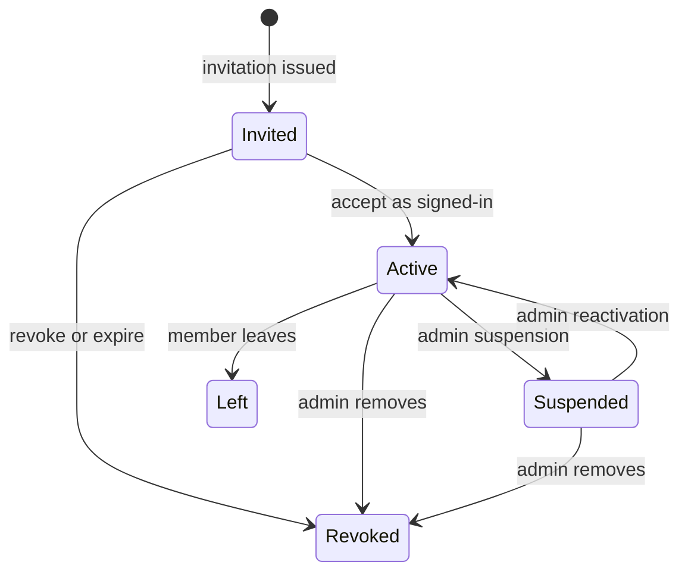

# Company, Membership, and Invitation Domain

## Aggregate Ownership

Person/account remains global. Company owns tenant lifecycle. Membership connects stable IDs and has
its own lifecycle; deleting/suspending a company never deletes the Person. Invitation is a short-lived
intent that may predate a Person and becomes a Membership only through explicit acceptance.

## Hexagonal Placement and Tenant Context

Company, membership, invitation, entitlement, and context-selection behavior lives in Domain/Application,
not in ASP.NET endpoint filters or persistence query helpers. The current REST adapter accepts only opaque request
values and a server-validated identity/session. The application resolves eligible Company and Membership,
rechecks authority, opens the transaction, sets the PostgreSQL RLS context transaction-locally, evaluates
the invariant, persists, and audits before returning a transport-neutral result.

A future GraphQL resolver or Model Context Protocol tool adapter must call these same use cases. Neither a
GraphQL argument nor an MCP tool argument may become trusted `CompanyId`, role, entitlement, or RLS state.
Adapters cannot expose `IQueryable`, EF navigation graphs, cross-company counts, or generic object lookup.
The Init 01
[transport rules](../../ose-id-init-01-foundation/tech-docs/001-system-boundaries-and-project-topology.md#future-graphql-and-model-context-protocol-adapters)
remain binding; this plan delivers REST only.

Persistence ports are use-case-shaped and transport-neutral. SqlKata + `SqlKata.Execution`/Npgsql
adapters return explicit immutable projections and never expose SQL/driver types inward. `SELECT *`,
generic repositories, EF change tracking, lazy loading, LINQ-to-entities, EF Identity stores, and
`UserManager` persistence are forbidden. EF remains migration-time tooling; Plan 04's custom
OpenIddict stores use the same query-builder/Npgsql boundary and cannot access company/domain tables.

## Company

Fields include opaque immutable `CompanyId`, status, display name, mutable slug if needed for display,
`TenantStoreKey`, concurrency/version token, and standard audit columns. Slug/domain never authorizes.
States needed for proof: active and suspended, with pending/closing/soft-deleted represented only if an
actual transition is implemented. A suspended company cannot produce new eligible contexts or admin mutations.

Public self-service company creation is deferred because onboarding, ownership proof, naming policy,
billing, and abuse controls are unresolved. E2E creates companies through a compile/runtime-isolated
fixture command that cannot be registered in normal serving.

## Membership

Membership states:

An active-row uniqueness constraint prevents simultaneous duplicate Membership for one
`(PersonId, CompanyId)`. History uses status/audit rather than recycling the same identity. Concurrent
acceptance relies on the constraint as final arbiter.

## Authority

- `Member`: can discover/select their own eligible company context and leave when policy permits.
- `MembershipAdmin`: also list members/invitations, invite/resend/revoke, suspend/reactivate membership,
  transfer authority, and manage product entry entitlements within the active company.

Neither authority grants a product-domain action. No Owner, BillingAdmin, SecurityAdmin, custom role,
global support, impersonation, account recovery, key operation, or cross-company search exists.

Last-admin safety is transactional. A mutation that could leave zero active admins locks/checks the
relevant active-admin set or uses a database invariant/serialized use case. The API returns a stable
“transfer required” conflict. Concurrent requests cannot both pass a stale pre-check.

## Invitation

An invitation stores Company ID, normalized intended email, desired narrow authority, issuer Person ID,
status, expiry, capability digest/version, resend state, and audit metadata. It never stores a future
Person as fact until acceptance.

Acceptance requires:

1. active authenticated Person session from Plan 02;
2. active verified email login matching the intended normalized address;
3. active company and invitation;
4. correct purpose-bound, unexpired, unused capability;
5. no conflicting active Membership;
6. atomic membership creation and invitation consumption;
7. last/current state audit without raw capability/message data.

Matching email is not silent identity linking: the Person has already authenticated and proves a
verified login method. Membership uses Person ID after the ceremony.

## Invitation Notification

Reuse `INotificationSender` with a typed company-invitation message and Plan 02 Mailpit adapter. Resend
always creates a fresh purpose-bound capability/invitation row and atomically changes the earlier
pending row to `revoked` with its consumption instant. A framework that cannot support this lifecycle
behind the application port fails Phase 0 compatibility; it does not change the policy. The public/admin
response never includes the link.

## Audit and Privacy

Company audit events include actor Person, active Company, affected opaque ID, action, safe outcome,
security/context version, and correlation/time. Do not include password/session/capability, raw SMTP
content, another tenant's display data, or guessed foreign identifier. List APIs apply tenant scope
before filters/pagination/counts.

## Rollback

Additive company/membership/invitation migrations remain. Rolling code back to Plan 02 must tolerate the
newer schema without exposing company routes. Data removal is not an automatic rollback; it requires a
later retention/export/deletion decision.
