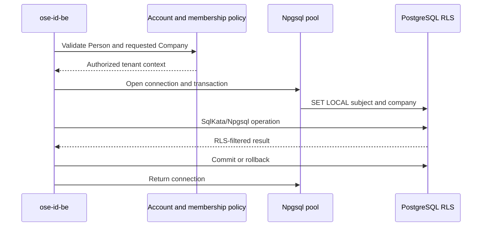

# PostgreSQL RLS and Tenant-Store Seam

## Data Classification

| Data                         | Scope                             | Protection approach                                                          |
| ---------------------------- | --------------------------------- | ---------------------------------------------------------------------------- |
| Person/account/login/session | Global person                     | Existing application authorization; no fake tenant                           |
| Company catalog              | Global with authorized visibility | Person membership lookup or fixture/admin use case                           |
| Membership directory         | Person/company relationship       | Subject visibility for own memberships; company context for admin operations |
| Invitation                   | Company tenant                    | Company RLS; capability acceptance resolves intended company safely          |
| Company entitlement          | Company tenant                    | Company RLS                                                                  |
| Personal entitlement         | Global person                     | Subject-scoped policy, never company RLS                                     |
| Company audit                | Company tenant                    | Company RLS and redacted payload                                             |

The exact table split follows query and isolation needs, not a rule that every row with `CompanyId` is
identical. Every tenant-owned row has non-null stable `company_id`, standard audit columns in the
repository-required order, constraints/indexes, and explicit RLS policies.

## Transaction Context

The application opens one Npgsql connection and transaction, validates authenticated Person/membership
through authorized global/person-scoped paths, and sets transaction-local values such as subject and
company identifiers. Use parameterized `set_config(..., true)` or an equivalently parameterized
transaction-local operation so values disappear at transaction end and cannot survive pooled connection
reuse. Never concatenate a value into `SET LOCAL`, use session-level mutable tenant state, or return the
connection before commit/rollback.

Use-case-shaped persistence ports require an explicit typed tenant execution context; methods do not
accept a free-floating company string while relying on callers to remember filters. SqlKata/Npgsql
adapters receive the already-open connection/transaction capability and cannot open an unscoped tenant
query. A query outside an authorized transaction fails closed.

## SqlKata/Npgsql Execution Rules

- Compile SqlKata `Query` objects with `PostgresCompiler`; execute through `SqlKata.Execution` on the
  use-case-owned Npgsql transaction. Do not use EF runtime tracking or LINQ-to-entities for OSE data.
- Name every selected column and map an explicit projection. `SELECT *`, navigation loading, generic
  repositories, and exposing `IQueryable` are forbidden.
- Centralize schema/table/column/order identifiers in closed code-owned allowlists. Bind company,
  person, cursor, filter, status, version, and other external values as parameters.
- Propagate cancellation and the foundation five-second runtime command timeout through every command.
- Conditional writes include company/status/version predicates and assert their exact affected-row
  budget before the same transaction records the safe audit outcome.

## RLS Policy Requirements

- Runtime role is not table owner, superuser, or `BYPASSRLS`.
- Migration/maintenance roles are never supplied to serving processes.
- Apply and test RLS for SELECT, INSERT, UPDATE-based soft-delete, joins, aggregates, pagination,
  guessed identifiers, and direct `DELETE` denial.
- Use `WITH CHECK` as well as `USING` so rows cannot be inserted/moved into another company.
- Use `FORCE ROW LEVEL SECURITY` where appropriate and verify behavior under the actual runtime role.
- Missing/malformed/stale context yields zero rows or denied mutation, never global access.
- Repository/application authorization remains defense in depth; RLS is not a replacement for use-case policy.

## Request Sequence

## Connection-Pool Verification

E2E forces one physical connection through Company A, Company B, and personal/no-company transactions.
It queries a safe context-inspection function if needed and proves no prior value survives. Tests run
concurrently with barriers to expose async context leakage. Process `AsyncLocal` alone cannot be the
database authority.

## Tenant-Store Resolver

`ITenantStoreResolver` accepts stable Company ID/store key and returns an opaque execution target used
only at transaction boundaries. The first implementation maps every company to the one shared
PostgreSQL store. It does not implement routing caches, dynamic connection strings, cross-database
queries, fleet migrations, copying, dual writes, or fallback.

The seam exists because future dedicated-company storage would otherwise leak connection selection
through every use case. Revisit only when a real company requires dedicated isolation and a later plan
defines copy, verification, cutover, rollback, backups, and migration fleet operations.

## Migration and Rollback

Apply additive schema then policies/grants with migration role. E2E captures table/policy/role manifests
and tests old Plan 02 code against retained schema. Never edit applied migrations or down-migrate account/
company data as routine rollback. A policy defect is repaired forward and, if it risks isolation,
blocks all tenant endpoints through the inherited local feature gate until proof passes.
