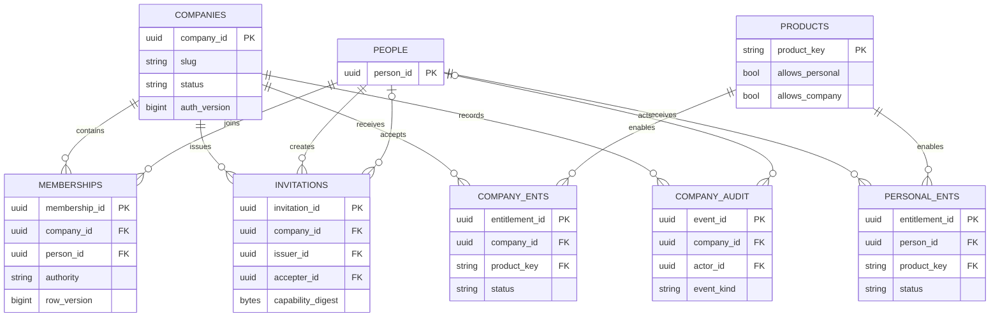

# Physical Schema and Migration Contract

## Old Physical State

The old schema is the complete delivered Plan 02 schema: `__EFMigrationsHistory`, `people`,
`email_logins`, `password_credentials`, `account_capabilities`, `account_sessions`, `auth_rate_limits`,
and `identity_audit_events` under `ose_id`, with the exact constraints/indexes/grants recorded by Plan 02.
This plan does not alter or backfill any old column/row. It adds one migration-owned, compatible partial
index to `email_logins` for bounded tenant-member email-prefix filtering; old account code ignores it.

### Tenant-Safe Directory Projection Across Old and New Tables

No display-name/profile column or duplicate member-email column is added. For an authorized
same-company MembershipAdmin request, the membership read model joins `memberships.person_id` to exactly
one active `email_logins` row with `status = 'verified'` and projects its `email_display` as API field
`verifiedEmailAddress`. Invitation read models project `company_invitations.invited_normalized_email` as API
field `recipientEmail`. RLS first restricts the membership/invitation rows to the selected company; the
application then allowlists these two contact fields. Provider subject, login row ID, normalized member
email, credential/session state, capability digest, and foreign-company contact never enter the DTO.
This is a read projection only: it adds no column, data backfill, dual write, or trigger. The supporting
index is an additive expand step, and old account code remains compatible with the tenancy schema.

The supporting index is exactly
`ix_email_logins_verified_normalized_person ON ose_id.email_logins
(normalized_email varchar_pattern_ops, person_id) WHERE status = 'verified' AND deleted_at IS NULL`.
It is owned with the table by `ose_id_migrator`; `ose_id_app` needs no new privilege. A roster query
first establishes and authorizes one company/RLS context, then joins that company's memberships to the
verified-email index. The literal normalized prefix is escaped before `LIKE '<prefix>%'`; query plans
must use bounded keyset pages and may not scan or return cross-company memberships.

## Runtime Query Manifest

SqlKata `Query` + `PostgresCompiler`, executed through `SqlKata.Execution`/Npgsql, is the only runtime
access path for these OSE-owned old/new tables. EF migration classes remain schema-evolution tooling;
the serving application registers no domain `DbContext`, EF Identity store, or `UserManager` persistence.
Every query uses explicit named projections, parameterized values, centralized code-owned identifiers,
the foundation five-second command timeout/cancellation, and the use-case-owned Npgsql transaction.

| Operation class                                                                   | Exact result/fetch or affected-row budget                                           | Required index/transaction proof                                                                                                                            |
| --------------------------------------------------------------------------------- | ----------------------------------------------------------------------------------- | ----------------------------------------------------------------------------------------------------------------------------------------------------------- |
| Company, membership, invitation, product, entitlement, or capability point lookup | At most one row                                                                     | Named PK/unique index under the correct person/company transaction                                                                                          |
| Member directory                                                                  | At most `limit + 1`, maximum 101                                                    | `ux_memberships_company_person`/membership company index plus `ix_email_logins_verified_normalized_person`; normalized-email and Membership-ID keyset order |
| Invitation or entitlement page                                                    | At most `limit + 1`, maximum 101                                                    | Named company/status/product index and deterministic keyset order                                                                                           |
| Eligible authorization contexts                                                   | At most 100 contexts; overflow is `context_limit_exceeded`, never silent truncation | Person membership/entitlement indexes; each company is revalidated in its own company-scoped transaction                                                    |
| Conditional invitation, membership, or entitlement mutation                       | Zero or one business row per statement, plus exactly the declared audit insert      | Company/status/version predicate, RLS `WITH CHECK`, atomic commit/rollback                                                                                  |

Unit tests snapshot normalized compiled SQL and parameter names/types. Catalog Integration tests verify
every projection and allowlisted identifier against this physical manifest, then execute with the actual
runtime role. With at least 10,000 synthetic rows per exercised table across target/foreign/deleted/
terminal states, read-only queries record `EXPLAIN (ANALYZE, BUFFERS, FORMAT JSON)` and must use the
named index without a sequential scan; mutations use `EXPLAIN (FORMAT JSON)` unless safely analyzed in
an always-rolled-back transaction. A wildcard projection, interpolated value, missing RLS transaction,
wrong index, or row-budget excess fails the plan. These gates provide SQL visibility/predictability and
do not assert that SqlKata is inherently faster than an ORM.

## Common Audit Columns

Every new table appends, in order: `created_at timestamp with time zone NOT NULL DEFAULT
CURRENT_TIMESTAMP`, `created_by varchar(255) NOT NULL DEFAULT 'system'`, `updated_at timestamp with time
zone NOT NULL DEFAULT CURRENT_TIMESTAMP`, `updated_by varchar(255) NOT NULL DEFAULT 'system'`,
`deleted_at timestamp with time zone NULL`, and `deleted_by varchar(255) NULL`. Each has
`CHECK ((deleted_at IS NULL) = (deleted_by IS NULL))`. All tables inherit the OSE ID
[audit/soft-delete profile](../../ose-id-init-01-foundation/tech-docs/007-database-audit-and-soft-delete-contract.md):
named update/delete time checks, `BEFORE DELETE` guard, only `ON DELETE RESTRICT`, actor stamping,
active-row predicates, and no runtime `DELETE`/`TRUNCATE`/DDL privilege. The migration role owns every
table; the non-owner/non-superuser/`NOBYPASSRLS` application role receives only named DML privileges.

## New Global and Tenant Tables

The diagram shows ownership and foreign-key direction only. RLS remains authoritative for every
tenant-owned row; a relationship line does not grant traversal or authorization.

### `ose_id.companies`

| Column                  | Type                        | Null / default                      | Constraint or index                                                                           |
| ----------------------- | --------------------------- | ----------------------------------- | --------------------------------------------------------------------------------------------- |
| `company_id`            | `uuid`                      | `NOT NULL`; application-generated   | Primary key `pk_companies`                                                                    |
| `display_name`          | `character varying(200)`    | `NOT NULL`                          | Non-empty/trimmed application invariant; never authorizes                                     |
| `slug`                  | `character varying(100)`    | `NOT NULL`                          | Partial unique `ux_companies_slug_active` where `deleted_at IS NULL`; mutable display locator |
| `status`                | `character varying(24)`     | `NOT NULL DEFAULT 'active'`         | Check in `active`, `suspended`, `closing`, `soft_deleted`                                     |
| `tenant_store_key`      | `character varying(128)`    | `NOT NULL DEFAULT 'shared-primary'` | Index `ix_companies_tenant_store_key`; routing value never enters token/DTO                   |
| `authorization_version` | `bigint`                    | `NOT NULL DEFAULT 0`                | Check `>= 0`; increments on access-affecting state                                            |
| `row_version`           | `bigint`                    | `NOT NULL DEFAULT 0`                | Check `>= 0`; optimistic concurrency                                                          |
| six audit columns       | exact common contract above | exact common contract above         | RLS isolates selected `company_id`                                                            |

### `ose_id.memberships`

| Column                  | Type                        | Null / default                    | Constraint or index                                                                                                             |
| ----------------------- | --------------------------- | --------------------------------- | ------------------------------------------------------------------------------------------------------------------------------- |
| `membership_id`         | `uuid`                      | `NOT NULL`; application-generated | Primary key `pk_memberships`                                                                                                    |
| `company_id`            | `uuid`                      | `NOT NULL`                        | FK to `companies` `ON DELETE RESTRICT`                                                                                          |
| `person_id`             | `uuid`                      | `NOT NULL`                        | FK to `people` `ON DELETE RESTRICT`                                                                                             |
| `status`                | `character varying(24)`     | `NOT NULL`                        | Check in `active`, `suspended`, `left`, `revoked`                                                                               |
| `authority`             | `character varying(32)`     | `NOT NULL DEFAULT 'member'`       | Check in `member`, `membership_admin`                                                                                           |
| `authorization_version` | `bigint`                    | `NOT NULL DEFAULT 0`              | Check `>= 0`; increments on status/authority change                                                                             |
| `row_version`           | `bigint`                    | `NOT NULL DEFAULT 0`              | Check `>= 0`; last-admin/concurrency guard                                                                                      |
| six audit columns       | exact common contract above | exact common contract above       | Unique `ux_memberships_company_person(company_id, person_id)`; indexes `(person_id,status)` and `(company_id,status,authority)` |

### `ose_id.company_invitations`

| Column                     | Type                        | Null / default                    | Constraint or index                                                                  |
| -------------------------- | --------------------------- | --------------------------------- | ------------------------------------------------------------------------------------ |
| `invitation_id`            | `uuid`                      | `NOT NULL`; application-generated | Primary key                                                                          |
| `company_id`               | `uuid`                      | `NOT NULL`                        | FK to `companies` `ON DELETE RESTRICT`; RLS tenant key                               |
| `invited_normalized_email` | `character varying(320)`    | `NOT NULL`                        | Partial unique `(company_id, invited_normalized_email)` for pending/non-deleted rows |
| `intended_authority`       | `character varying(32)`     | `NOT NULL DEFAULT 'member'`       | Check in `member`, `membership_admin`                                                |
| `status`                   | `character varying(24)`     | `NOT NULL DEFAULT 'pending'`      | Check in `pending`, `accepted`, `revoked`, `expired`                                 |
| `capability_digest`        | `bytea`                     | `NOT NULL`                        | Unique `ux_company_invitations_digest`; raw link never stored                        |
| `issued_by_person_id`      | `uuid`                      | `NOT NULL`                        | FK to `people` `ON DELETE RESTRICT`                                                  |
| `accepted_by_person_id`    | `uuid`                      | nullable; no default              | FK to `people` `ON DELETE RESTRICT`; required only for accepted state                |
| `expires_at`               | `timestamp with time zone`  | `NOT NULL`                        | Check later than `created_at`; expiry worker is out of scope                         |
| `consumed_at`              | `timestamp with time zone`  | nullable; no default              | Check requires value exactly for accepted/revoked states                             |
| `row_version`              | `bigint`                    | `NOT NULL DEFAULT 0`              | Check `>= 0`; resend/accept race guard                                               |
| six audit columns          | exact common contract above | exact common contract above       | Index `(company_id,status,expires_at)`                                               |

### `ose_id.product_resources`

| Column                  | Type                        | Null / default              | Constraint or index                                         |
| ----------------------- | --------------------------- | --------------------------- | ----------------------------------------------------------- |
| `product_key`           | `character varying(64)`     | `NOT NULL`                  | Primary key; immutable fixture/protocol resource identifier |
| `display_name`          | `character varying(120)`    | `NOT NULL`                  | Display only                                                |
| `allows_personal`       | `boolean`                   | `NOT NULL DEFAULT false`    | Combined check requires personal or company true            |
| `allows_company`        | `boolean`                   | `NOT NULL DEFAULT false`    | Combined check requires personal or company true            |
| `status`                | `character varying(16)`     | `NOT NULL DEFAULT 'active'` | Check in `active`, `disabled`                               |
| `authorization_version` | `bigint`                    | `NOT NULL DEFAULT 0`        | Check `>= 0`                                                |
| six audit columns       | exact common contract above | exact common contract above | Global fixture-owned table; no company RLS                  |

### `ose_id.personal_product_entitlements`

| Column                    | Type                        | Null / default                    | Constraint or index                                       |
| ------------------------- | --------------------------- | --------------------------------- | --------------------------------------------------------- |
| `personal_entitlement_id` | `uuid`                      | `NOT NULL`; application-generated | Primary key                                               |
| `person_id`               | `uuid`                      | `NOT NULL`                        | FK to `people` `ON DELETE RESTRICT`; person-scope RLS key |
| `product_key`             | `character varying(64)`     | `NOT NULL`                        | FK to `product_resources` `ON DELETE RESTRICT`            |
| `status`                  | `character varying(16)`     | `NOT NULL DEFAULT 'active'`       | Check in `active`, `revoked`                              |
| `authorization_version`   | `bigint`                    | `NOT NULL DEFAULT 0`              | Check `>= 0`                                              |
| `row_version`             | `bigint`                    | `NOT NULL DEFAULT 0`              | Check `>= 0`                                              |
| six audit columns         | exact common contract above | exact common contract above       | Unique `(person_id,product_key)`; person-scope RLS        |

### `ose_id.company_product_entitlements`

| Column                   | Type                        | Null / default                    | Constraint or index                                                          |
| ------------------------ | --------------------------- | --------------------------------- | ---------------------------------------------------------------------------- |
| `company_entitlement_id` | `uuid`                      | `NOT NULL`; application-generated | Primary key                                                                  |
| `company_id`             | `uuid`                      | `NOT NULL`                        | FK to `companies` `ON DELETE RESTRICT`; RLS tenant key                       |
| `product_key`            | `character varying(64)`     | `NOT NULL`                        | FK to `product_resources` `ON DELETE RESTRICT`                               |
| `status`                 | `character varying(16)`     | `NOT NULL DEFAULT 'active'`       | Check in `active`, `revoked`                                                 |
| `authorization_version`  | `bigint`                    | `NOT NULL DEFAULT 0`              | Check `>= 0`                                                                 |
| `row_version`            | `bigint`                    | `NOT NULL DEFAULT 0`              | Check `>= 0`                                                                 |
| six audit columns        | exact common contract above | exact common contract above       | Unique `(company_id,product_key)`; index `(product_key,status)`; company RLS |

### `ose_id.company_audit_events`

| Column                 | Type                        | Null / default                       | Constraint or index                                         |
| ---------------------- | --------------------------- | ------------------------------------ | ----------------------------------------------------------- |
| `event_id`             | `uuid`                      | `NOT NULL`; application-generated    | Primary key                                                 |
| `company_id`           | `uuid`                      | `NOT NULL`                           | FK to `companies` `ON DELETE RESTRICT`; RLS tenant key      |
| `actor_person_id`      | `uuid`                      | nullable; no default                 | FK to `people` `ON DELETE RESTRICT`; null for system action |
| `affected_entity_type` | `character varying(48)`     | `NOT NULL`                           | Check against exact entity set below                        |
| `affected_entity_id`   | `uuid`                      | nullable; no default                 | Opaque ID only; no cross-tenant display data                |
| `event_kind`           | `character varying(64)`     | `NOT NULL`                           | Check against exact event set below                         |
| `result_code`          | `character varying(48)`     | `NOT NULL`                           | Check against exact safe-result set below                   |
| `correlation_id`       | `uuid`                      | `NOT NULL`                           | Index `(company_id,correlation_id)`                         |
| `safe_payload`         | `jsonb`                     | `NOT NULL DEFAULT '{}'::jsonb`       | Allowlisted keys only                                       |
| `occurred_at`          | `timestamp with time zone`  | `NOT NULL DEFAULT CURRENT_TIMESTAMP` | Index `(company_id,occurred_at DESC)`                       |
| six audit columns      | exact common contract above | exact common contract above          | Append-only application policy; company RLS                 |

## Exact Constraint, Index, and Ownership Manifest

Every new table has `ck_<table>_soft_delete_pair`, `ck_<table>_update_time`,
`ck_<table>_delete_time`, and `trg_<table>_reject_hard_delete`. The table below is the complete
domain-specific constraint/index manifest in addition to those universal audit objects; a
migration-generated name is not accepted as a substitute. Integration compares constraints, indexes,
triggers, FK actions, and grants and attempts a real serving-role physical delete per table.

| Table                           | Exact constraints                                                                                                                                                                                                                                                                                                                                                                                                                                                                                                                                                                                                                                                                                                                                                                                                                                                                                               | Exact non-PK indexes                                                                                                                                                                                                                                                     |
| ------------------------------- | --------------------------------------------------------------------------------------------------------------------------------------------------------------------------------------------------------------------------------------------------------------------------------------------------------------------------------------------------------------------------------------------------------------------------------------------------------------------------------------------------------------------------------------------------------------------------------------------------------------------------------------------------------------------------------------------------------------------------------------------------------------------------------------------------------------------------------------------------------------------------------------------------------------- | ------------------------------------------------------------------------------------------------------------------------------------------------------------------------------------------------------------------------------------------------------------------------ |
| `companies`                     | `pk_companies(company_id)`; `ck_companies_display_name(btrim(display_name) <> '')`; `ck_companies_slug(slug ~ '^[a-z0-9]+(-[a-z0-9]+)*$')`; `ck_companies_status` permits `active`, `suspended`, `closing`, `soft_deleted`; `ck_companies_authorization_version_nonnegative(authorization_version >= 0)`; `ck_companies_row_version_nonnegative(row_version >= 0)`; `ck_companies_soft_delete_pair`                                                                                                                                                                                                                                                                                                                                                                                                                                                                                                             | `ux_companies_slug_active(slug) UNIQUE WHERE deleted_at IS NULL`; `ix_companies_tenant_store_key(tenant_store_key)`                                                                                                                                                      |
| `memberships`                   | `pk_memberships(membership_id)`; `fk_memberships_companies(company_id) REFERENCES companies(company_id) ON DELETE RESTRICT`; `fk_memberships_people(person_id) REFERENCES people(person_id) ON DELETE RESTRICT`; `ck_memberships_status` permits `active`, `suspended`, `left`, `revoked`; `ck_memberships_authority` permits `member`, `membership_admin`; `ck_memberships_authorization_version_nonnegative(authorization_version >= 0)`; `ck_memberships_row_version_nonnegative(row_version >= 0)`; `ck_memberships_soft_delete_pair`; `ux_memberships_company_person(company_id, person_id)`                                                                                                                                                                                                                                                                                                               | `ix_memberships_person_status(person_id, status)`; `ix_memberships_company_status_authority(company_id, status, authority)`                                                                                                                                              |
| `company_invitations`           | `pk_company_invitations(invitation_id)`; `fk_company_invitations_companies(company_id) REFERENCES companies(company_id) ON DELETE RESTRICT`; `fk_company_invitations_issuer(issued_by_person_id) REFERENCES people(person_id) ON DELETE RESTRICT`; `fk_company_invitations_acceptor(accepted_by_person_id) REFERENCES people(person_id) ON DELETE RESTRICT`; `ck_company_invitations_authority` permits `member`, `membership_admin`; `ck_company_invitations_status` permits `pending`, `accepted`, `revoked`, `expired`; `ck_company_invitations_acceptor((status = 'accepted') = (accepted_by_person_id IS NOT NULL))`; `ck_company_invitations_expiry(expires_at > created_at)`; `ck_company_invitations_consumption((status IN ('accepted','revoked')) = (consumed_at IS NOT NULL))`; `ck_company_invitations_row_version_nonnegative(row_version >= 0)`; `ck_company_invitations_soft_delete_pair`        | `ux_company_invitations_pending(company_id, invited_normalized_email) UNIQUE WHERE status = 'pending' AND deleted_at IS NULL`; `ux_company_invitations_digest(capability_digest) UNIQUE`; `ix_company_invitations_company_status_expiry(company_id, status, expires_at)` |
| `product_resources`             | `pk_product_resources(product_key)`; `ck_product_resources_display_name(btrim(display_name) <> '')`; `ck_product_resources_context(allows_personal OR allows_company)`; `ck_product_resources_status` permits `active`, `disabled`; `ck_product_resources_authorization_version_nonnegative(authorization_version >= 0)`; `ck_product_resources_soft_delete_pair`                                                                                                                                                                                                                                                                                                                                                                                                                                                                                                                                               | none                                                                                                                                                                                                                                                                     |
| `personal_product_entitlements` | `pk_personal_product_entitlements(personal_entitlement_id)`; `fk_personal_product_entitlements_people(person_id) REFERENCES people(person_id) ON DELETE RESTRICT`; `fk_personal_product_entitlements_resources(product_key) REFERENCES product_resources(product_key) ON DELETE RESTRICT`; `ck_personal_product_entitlements_status` permits `active`, `revoked`; `ck_personal_product_entitlements_authorization_version_nonnegative(authorization_version >= 0)`; `ck_personal_product_entitlements_row_version_nonnegative(row_version >= 0)`; `ck_personal_product_entitlements_soft_delete_pair`; `ux_personal_product_entitlements_person_product(person_id, product_key)`                                                                                                                                                                                                                                | none                                                                                                                                                                                                                                                                     |
| `company_product_entitlements`  | `pk_company_product_entitlements(company_entitlement_id)`; `fk_company_product_entitlements_companies(company_id) REFERENCES companies(company_id) ON DELETE RESTRICT`; `fk_company_product_entitlements_resources(product_key) REFERENCES product_resources(product_key) ON DELETE RESTRICT`; `ck_company_product_entitlements_status` permits `active`, `revoked`; `ck_company_product_entitlements_authorization_version_nonnegative(authorization_version >= 0)`; `ck_company_product_entitlements_row_version_nonnegative(row_version >= 0)`; `ck_company_product_entitlements_soft_delete_pair`; `ux_company_product_entitlements_company_product(company_id, product_key)`                                                                                                                                                                                                                               | `ix_company_product_entitlements_product_status(product_key, status)`                                                                                                                                                                                                    |
| `company_audit_events`          | `pk_company_audit_events(event_id)`; `fk_company_audit_events_companies(company_id) REFERENCES companies(company_id) ON DELETE RESTRICT`; `fk_company_audit_events_actor(actor_person_id) REFERENCES people(person_id) ON DELETE RESTRICT`; `ck_company_audit_events_entity_type` permits `company`, `membership`, `company_invitation`, `company_product_entitlement`; `ck_company_audit_events_kind` permits `invitation_created`, `invitation_resent`, `invitation_revoked`, `invitation_accepted`, `membership_suspended`, `membership_reactivated`, `membership_left`, `membership_authority_transferred`, `company_entitlement_granted`, `company_entitlement_revoked`; `ck_company_audit_events_result` permits `accepted`, `succeeded`, `denied`, `conflict`, `idempotent`; `ck_company_audit_events_payload_object(jsonb_typeof(safe_payload) = 'object')`; `ck_company_audit_events_soft_delete_pair` | `ix_company_audit_events_correlation(company_id, correlation_id)`; `ix_company_audit_events_occurred(company_id, occurred_at DESC)`                                                                                                                                      |

The complete additive old-table index manifest is:

| Existing table | Exact additional index                                                                                                                         | Owner and lifecycle                                                                                                                            |
| -------------- | ---------------------------------------------------------------------------------------------------------------------------------------------- | ---------------------------------------------------------------------------------------------------------------------------------------------- |
| `email_logins` | `ix_email_logins_verified_normalized_person(normalized_email varchar_pattern_ops, person_id) WHERE status = 'verified' AND deleted_at IS NULL` | table/migration owner `ose_id_migrator`; created during expand, retained on code rollback, removed only by a later reviewed contract migration |

All seven tables are owned by `ose_id_migrator`; `PUBLIC` has no table privilege and `ose_id_app`
remains non-owner, non-superuser, `NOBYPASSRLS`. The application role receives `SELECT, UPDATE` on
`companies`; `SELECT, INSERT, UPDATE` on `memberships`, `company_invitations`,
`personal_product_entitlements`, and `company_product_entitlements`; `SELECT` on `product_resources`;
and `SELECT, INSERT` on append-only `company_audit_events`. It has no `DELETE`, `TRUNCATE`,
`REFERENCES`, `TRIGGER`, DDL, or sequence privilege. UUIDs are application-generated. Test fixture
creation uses the separately scoped E2E bootstrap role, never `ose_id_app`.

## Field Lifecycle

- Every primary identifier, foreign key, `product_key`, capability digest, `tenant_store_key`, creation
  audit field, and audit-event business field is immutable after insert. A later storage-migration plan
  may change `tenant_store_key`; this slice deliberately has no such transition.
- `companies.status` moves `active <-> suspended`, `active|suspended -> closing -> soft_deleted`;
  `authorization_version` increases on status/entitlement effects and `row_version` on every update.
  `display_name` and `slug` may change without changing identity, subject to checks/uniqueness.
- `memberships.status` moves `active <-> suspended`, or `active|suspended -> left|revoked`; terminal states
  never reactivate. `authority` changes only while active and cannot leave zero active administrators.
  Both changes increase `authorization_version` and `row_version` atomically.
- Invitation identity/company/email/intended authority/digest/issuer/expiry never change. `pending` moves
  once to `accepted`, `revoked`, or `expired`; acceptance sets acceptor and consumption together,
  revocation sets consumption, and `row_version` increases. Resend creates a replacement invitation and
  revokes the prior row rather than replacing its digest.
- Product resource key/context-kind flags are immutable in this slice; display/status may change through
  bootstrap governance and increase `authorization_version`. Entitlement status moves `active -> revoked`
  and never reactivates; a new grant requires a later explicit lifecycle decision because uniqueness
  deliberately preserves one durable relationship row.
- Company audit events are insert-only. `created_at`/`created_by` never change; `updated_at`/`updated_by`
  change together on permitted updates; `deleted_at`/`deleted_by` move together from null once. No old or
  new field is dropped, renamed, recast, backfilled, or hard-deleted in this plan. The additive
  verified-email prefix index follows the old `email_logins` row lifecycle automatically and owns no data.

## Exact RLS Policy Contract

- Set `ose.person_id` and optional `ose.company_id` with transaction-local configuration only.
- `companies`, `company_invitations`, `company_product_entitlements`, and `company_audit_events` use
  `USING/WITH CHECK (company_id = nullif(current_setting('ose.company_id', true), '')::uuid)`.
- `memberships` permits own-person SELECT with the current `ose.person_id`, or selected-company access
  with current `ose.company_id`; INSERT/UPDATE uses only the selected-company `WITH CHECK` branch.
- `personal_product_entitlements` uses matching current `ose.person_id` for `USING` and `WITH CHECK`.
- `product_resources` is global read-only to the application role; fixture mutation uses the migration/
  E2E bootstrap role outside serving.
- Enumeration first reads own memberships, then revalidates each Company in a separate company-scoped
  transaction. It does not disable RLS for a cross-company join.

The migration enables and forces RLS on all tenant/person-scoped tables. Exact policies are:

| Table                           | Policy and command                                   | Exact `USING` / `WITH CHECK` predicate                                                                    |
| ------------------------------- | ---------------------------------------------------- | --------------------------------------------------------------------------------------------------------- |
| `companies`                     | `pol_companies_company_scope FOR ALL`                | `company_id = nullif(current_setting('ose.company_id', true), '')::uuid` for both clauses                 |
| `memberships`                   | `pol_memberships_self_select FOR SELECT`             | `person_id = nullif(current_setting('ose.person_id', true), '')::uuid`                                    |
| `memberships`                   | `pol_memberships_company_select FOR SELECT`          | `company_id = nullif(current_setting('ose.company_id', true), '')::uuid`                                  |
| `memberships`                   | `pol_memberships_company_insert FOR INSERT`          | selected-company predicate for `WITH CHECK`; application code separately proves MembershipAdmin authority |
| `memberships`                   | `pol_memberships_company_update FOR UPDATE`          | selected-company predicate for both clauses; application code separately proves MembershipAdmin authority |
| `company_invitations`           | `pol_company_invitations_company_scope FOR ALL`      | selected-company predicate for both clauses                                                               |
| `personal_product_entitlements` | `pol_personal_entitlements_person_scope FOR ALL`     | `person_id = nullif(current_setting('ose.person_id', true), '')::uuid` for both clauses                   |
| `company_product_entitlements`  | `pol_company_entitlements_company_scope FOR ALL`     | selected-company predicate for both clauses                                                               |
| `company_audit_events`          | `pol_company_audit_events_company_select FOR SELECT` | selected-company predicate for `USING`                                                                    |
| `company_audit_events`          | `pol_company_audit_events_company_insert FOR INSERT` | selected-company predicate for `WITH CHECK`                                                               |

Here, **selected-company predicate** means exactly
`company_id = nullif(current_setting('ose.company_id', true), '')::uuid`. `product_resources` is the
only new table without RLS because it has no tenant/person-owned row and is read-only to `ose_id_app`.

## Migration, Backfill, Compatibility, and Recovery

Generate one additive migration pair matching
`apps/ose-id-be/src/OseId.Infrastructure/Persistence/Migrations/*_AddCompanyTenancyCore.cs` and its
`.Designer.cs`, plus the model snapshot. RLS/role fixtures reside only in the existing
`apps/ose-id-be-e2e/` database fixture path.
EF executes only that explicit migration workflow. The migration model is not the runtime domain model,
and serving use cases never access company/application rows through EF.

1. **Expand:** create all seven tables, constraints, indexes, policies, `FORCE ROW LEVEL SECURITY`, exact
   application grants, and the one exact partial prefix index on the existing `email_logins` table. Do
   not alter any Plan 02 column, constraint, row, or privilege.
2. **Backfill:** no data backfill. No predecessor company/entitlement source exists. PostgreSQL builds the
   additive email index from existing rows without changing them; record before/after row counts and
   stable non-secret digests plus the index catalog definition. Fixture rows are post-migration test data.
3. **Verify:** compare catalog rows with every column/type/null/default/PK/FK/check/index/owner/grant/
   policy above; record per-table active/deleted counts and stable non-secret digests before/after tests.
4. **Contract:** none; changes are additive. No old object is removed or renamed.
5. **Old Plan 02 code/new schema:** it ignores new tables and remains fully functional; prove complete
   Plan 02 account E2E against the retained Plan 03 schema.
6. **New code/old schema:** readiness returns `schema_incompatible`; all tenancy routes remain unserved
   until migration succeeds.
7. **Rollback:** redeploy Plan 02 code and retain company data/schema/policies plus the compatible email
   index. The inherited runtime guard keeps tenancy unavailable; never down-migrate, drop the index as
   emergency rollback, or hard-delete tenant data.
8. **Forward-fix:** repair any table, constraint, owner, grant, or policy defect with a new migration.
   Isolation uncertainty disables tenant endpoints and blocks delivery; never weaken RLS to pass tests.
