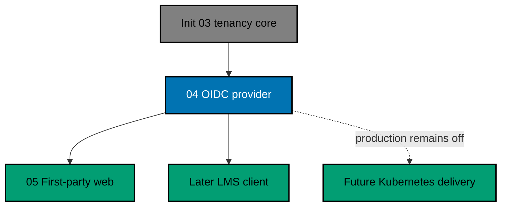

# OSE ID Init 04 — OIDC and OAuth Provider

> **Status:** Backlog — execute only after `ose-id-init-03-company-tenancy-core` is complete and this plan has
> moved to `plans/in-progress/` through a plan-only PR merged to `origin/main`.

Turn the verified local identity from Init 03 into a standards-based local identity provider. This
slice configures OpenIddict on `ose-id-be`, registers explicit clients and resources, implements
Authorization Code with PKCE S256, produces purpose-separated ID and access tokens, persists consent,
and proves signing-key rotation. It does not build the polished first-party web experience; Init 05
will render the backend-owned authorization transaction.

## Scope

- OpenID Connect discovery, authorization, token, end-session, revocation, and JWKS endpoints in the
  C# backend. UserInfo and refresh-token issuance are not enabled in this milestone.
- Authorization Code only, with mandatory PKCE `S256`, exact redirect URIs, OIDC nonce, and client
  state/correlation expectations.
- One local synthetic OSE LMS BFF client, one LMS API resource, exact scopes, and audience-restricted
  access tokens.
- Minimal claims for either `personal` or exactly one `company` authorization context.
- Backend consent and context-selection contracts that Init 05 can render without owning policy.
- Asymmetric local signing keys with active/verify-only overlap and negative key tests.
- Stateless backend instances: authorization codes, grants, consent, and keys live in shared stores,
  never process memory or local disk.
- OSE ID source/docs inherit the repository root MIT license; third-party components retain their own
  licenses.

## Non-Goals

- Production deployment, DNS, Kubernetes, cloud key custody, production certificates, or production
  client registrations. Those wait for the Kubernetes platform planned in the private sibling.
- Next.js sign-in, consent, context, or account-security UI; Init 05 owns those screens. This slice
  owns only the backend-rendered `GET /connect/logout` confirmation/cancellation surface required to
  prevent logout-by-GET.
- Google, Facebook, or another upstream provider. This slice creates only the provider seam.
- Passkeys, TOTP, or recovery codes; Init 06 owns them.
- Product-domain roles or LMS implementation.

## Dependency and Result

Every arrow is a dependency, not an instruction to deploy. After this plan, `main` contains a complete
localhost issuer that fails closed outside explicit local/test mode.

## Navigation

- [Business requirements](brd.md)
- [Product requirements and acceptance criteria](prd.md)
- [Technical design](tech-docs/README.md)
- [Delivery checklist](delivery.md)
- [Execution learnings](learnings.md)

## Related Milestones

- Successor: [first-party web](../ose-id-init-05-first-party-web/README.md).
- Production deployment remains blocked at minimum on
  `private-sibling/plans/backlog/start-infra-04-deploy-tencent-lighthouse-k3s-cluster` and then-current
  platform handoff gates.
