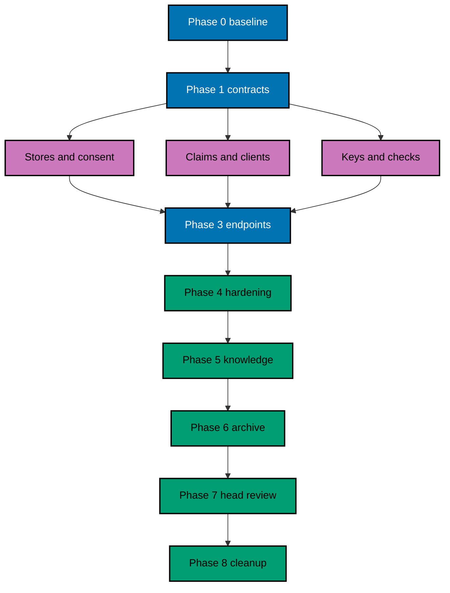

# Delivery Plan — OSE ID Init 04

> **Legend** — `[AI]`: an agent performs the step (the default; unmarked steps are `[AI]`).
> `[HUMAN]`: only a human can do it. `[AI+HUMAN]`: an agent prepares and a human performs the
> privileged or real-credential action.

## Delivery Mode

**Mode:** `worktree-to-pr`. This plan is one delivery unit, one branch, and one PR into `main`. The
unit ends only when the local protocol trust boundary is complete and production remains fail-closed.
No deployment, production secret, DNS, Kubernetes, or infrastructure change belongs in this PR.

## Delivery Unit

| Delivery unit                         | Included phases | Safe `main` state                                                           | Explicitly excluded                                              |
| ------------------------------------- | --------------- | --------------------------------------------------------------------------- | ---------------------------------------------------------------- |
| DU-04 — Local protocol trust boundary | 0–8             | One complete local OIDC/OAuth issuer; production startup still fails closed | Web UI, providers, passkeys/MFA, LMS code, Kubernetes/deployment |

The unit boundary is architectural, not a phase count: metadata, authorization, token exchange, consent,
claims, keys, revocation, specs, evidence, and in-PR archival land together because each validates the
same issuer trust boundary.

No phase or agent lane is merged independently. If execution must split this unit, amend the plan into
new delivery units first; every resulting `main` state must build, keep new endpoints inert until their
complete contract is present, and preserve production fail-closed behavior.

## Worktree

- **Execution worktree:** `worktrees/ose-id-init-04-oidc-oauth-provider/`
- **Provisioning status:** pending until Phase 0.
- **Authoring exception:** this plan was authored in the user-required `ose-id` worktree because it
  depends on unlanded identity-plan restructuring there. Phase 0 must not begin until that plan-only PR
  and Init 03 have landed on `origin/main`.
- **Worktree cap:** reuse this one worktree for every phase and delivery activity in this repository.
- **Identity/inventory:** record branch, path, base SHA, head SHA, and dirty-state inventory during
  Phase 0; do not infer them now.

## Lifecycle Prerequisite

Phase 0 resolves the predecessor's archived path and confirms
`ose-id-init-03-company-tenancy-core` is complete on `origin/main`; the merged
identity/session/tenancy contracts must match this plan. This backlog plan must then be promoted by a
pure move to `plans/in-progress/ose-id-init-04-oidc-oauth-provider/` on `origin/main` before execution.
Production deployment remains outside scope and blocked at minimum by
`private-sibling/plans/backlog/start-infra-04-deploy-tencent-lighthouse-k3s-cluster` plus the then-current
platform handoff gates.

## Parallelization Model

### Delivery Boundaries

| Unit  | Change phases | Worktree and branch                                                                                                                   | Delivery opportunity                                                                  | Cohesive seam                                                                                                          | Resulting `main`, rollback, and flag evidence                                                                                                                                                                                                                                                                                                                                                                     |
| ----- | ------------- | ------------------------------------------------------------------------------------------------------------------------------------- | ------------------------------------------------------------------------------------- | ---------------------------------------------------------------------------------------------------------------------- | ----------------------------------------------------------------------------------------------------------------------------------------------------------------------------------------------------------------------------------------------------------------------------------------------------------------------------------------------------------------------------------------------------------------- |
| DU-04 | 0–8           | `worktrees/ose-id-init-04-oidc-oauth-provider/`; observed Phase-0 execution branch based on `ose-id-init-04-oidc-oauth-provider-base` | One PR after Phase 8 only; no lane or intermediate phase is independently deliverable | Metadata, clients, authorization, context, consent, code/token exchange, claims, keys, revocation, specs, and evidence | `main` has one complete local issuer while production startup remains fail-closed. Before activation, rollback removes the inert local feature; after any issued artifact, rollback disables new starts, preserves key/revocation overlap until expiry, and proves discovery has no dead endpoint. Gate evidence includes enabled/disabled runtime tests and the final absence of temporary implementation flags. |

No protocol, persistence, key, consent, or claims lane may merge independently. An execution agent may
not edit outside its frozen ownership without root reassignment and ledger reconciliation.

### Agent Topology

N=3 execution agents plus one root coordinator. The root owns the frozen file ledger, merges work, and
runs gates. Agents may parallelize only after Phase 1 freezes contracts:



Ownership must not overlap: Agent 1 owns the version-pinned custom OpenIddict stores, their audit/
soft-delete contract, and migrations; Agent 2 owns client,
resource, consent-view, and claims policies; Agent 3 owns key provider/rotation and validator fixtures.
All agents are told they are not alone, must preserve others' edits, and must stop on a frozen-ledger
collision.

## Execution Packet Defaults

Every checkbox inherits the phase-local packet below unless it states a stricter owner, path, command,
or evidence destination. A checkbox is incomplete until its evidence records the exact command, exit
code, observed result, and changed paths. A path discovered during Phase 0 must be written to
`plans/in-progress/ose-id-init-04-oidc-oauth-provider/evidence/phase-0-path-inventory.md` before later work uses it. On any mismatch, preserve sanitized
output, stop the phase gate, fix the root cause without weakening tests or contracts, rerun the same
command, and append the disposition to that phase's evidence.

| Phase | Owner                                          | Authorized path or bounded pattern                                                                                | Copyable verification command                                                                                                                                                                                                                                                                       | Observable result and evidence                                                                                                                                                   |
| ----- | ---------------------------------------------- | ----------------------------------------------------------------------------------------------------------------- | --------------------------------------------------------------------------------------------------------------------------------------------------------------------------------------------------------------------------------------------------------------------------------------------------- | -------------------------------------------------------------------------------------------------------------------------------------------------------------------------------- |
| 0     | Root coordinator                               | repository inventory, predecessor artifacts, and execution worktree only                                          | `rtk ./hippo run --class transactional --resource-tier standard --disk-path . -- npm exec nx -- run ose-id-be:build` then `rtk ./hippo run --class transactional --resource-tier standard --disk-path . -- npm exec nx -- run-many -t typecheck,lint,test:quick --projects=ose-id-be,ose-id-be-e2e` | Exit `0`; baseline and resolved paths in `plans/in-progress/ose-id-init-04-oidc-oauth-provider/evidence/phase-0-baseline.md`                                                     |
| 1     | Root coordinator                               | `specs/apps/ose/id-be/**`, `apps/ose-id-be{,-e2e}/**/behaviour-coverage.json`, and this plan's numbered tech docs | Green predecessor baseline, then `rtk ./hippo run --class transactional --resource-tier standard --disk-path . -- npm exec nx -- run-many -t test:coverage:behaviour --projects=ose-id-be,ose-id-be-e2e`                                                                                            | Only the recorded missing Plan 04 bindings may be RED; all other mapping checks exit `0` in `plans/in-progress/ose-id-init-04-oidc-oauth-provider/evidence/phase-1-contracts.md` |
| 2     | Agents 1–3 within frozen ownership             | `apps/ose-id-be/**`, `apps/ose-id-be-e2e/**`, and the resolved migration project                                  | `rtk ./hippo run --class transactional --resource-tier standard --disk-path . -- npm exec nx -- run-many -t test:unit,test:integration -p ose-id-be`                                                                                                                                                | Exit `0`; RED/GREEN/REFACTOR trace and migration proof in `plans/in-progress/ose-id-init-04-oidc-oauth-provider/evidence/phase-2-core.md`                                        |
| 3     | Root coordinator after lane convergence        | same backend/E2E paths plus canonical specs                                                                       | `rtk ./hippo run --class transactional --resource-tier standard --disk-path . -- npm exec nx -- run ose-id-be-e2e:test:e2e`                                                                                                                                                                         | Exit `0`; protocol, replay, and multi-instance results in `plans/in-progress/ose-id-init-04-oidc-oauth-provider/evidence/phase-3-protocol.md`                                    |
| 4     | Root coordinator and named quality-gate agents | frozen delivery ledger only                                                                                       | `rtk npm run check:pre-push`                                                                                                                                                                                                                                                                        | Exit `0`; delegated gate IDs and reports in `plans/in-progress/ose-id-init-04-oidc-oauth-provider/evidence/phase-4-quality-gates.md`                                             |
| 5     | Root coordinator                               | this plan's `learnings.md` and bounded durable-doc destinations                                                   | `rtk ./hippo run --class transactional --resource-tier standard --disk-path . -- npm exec markdownlint-cli2 -- plans/in-progress/ose-id-init-04-oidc-oauth-provider/learnings.md`                                                                                                                   | Exit `0`; promoted/deferred knowledge in `plans/in-progress/ose-id-init-04-oidc-oauth-provider/evidence/phase-5-knowledge.md`                                                    |
| 6     | Root coordinator                               | this plan directory and annotated plan indexes                                                                    | `rtk npm run check:pre-push`                                                                                                                                                                                                                                                                        | Exit `0`; archive/index validation in `plans/in-progress/ose-id-init-04-oidc-oauth-provider/evidence/phase-6-archive.md`                                                         |
| 7     | Root coordinator and review agents             | current-head diff only                                                                                            | `rtk npm run check:pre-push`                                                                                                                                                                                                                                                                        | Exit `0`; current-head/base and review dispositions in `plans/in-progress/ose-id-init-04-oidc-oauth-provider/evidence/phase-7-head-review.md`                                    |
| 8     | Root coordinator                               | execution worktree metadata only                                                                                  | `rtk git -C worktrees/ose-id-init-04-oidc-oauth-provider status --short`                                                                                                                                                                                                                            | Empty output after merge; cleanup record in `plans/in-progress/ose-id-init-04-oidc-oauth-provider/evidence/phase-8-cleanup.md`                                                   |

### PostgreSQL Persistence and OpenIddict Store Contract

All identity, tenancy, and protocol data uses the Npgsql + SqlKata PostgreSQL compiler and
`SqlKata.Execution` default: explicit projections, bound parameters, cancellation, bounded timeouts,
explicit transactions, no `SELECT *`, and no EF change tracking or LINQ-to-database runtime path.
EF Core otherwise remains migration tooling only, and ASP.NET Core Identity remains limited to
hashing/validation primitives rather than Identity EF stores or `UserManager` persistence.

Plan 04 implements the complete version-resolved OpenIddict application, authorization, scope, and token
store interfaces as infrastructure adapters. `DeleteAsync`, pruning, and expiry cleanup perform bounded
actor-attributed soft-delete updates and secret scrubbing, never SQL `DELETE`. Phase 2 runs backend
Unit/Integration and built-process E2E through HIPPO, captures compiled SQL with values redacted, query counts,
PostgreSQL catalog/index evidence, and safe synthetic `EXPLAIN` plans (use `EXPLAIN ANALYZE` only for
isolated safe synthetic fixtures) at `plans/in-progress/ose-id-init-04-oidc-oauth-provider/evidence/phase-2-openiddict-store/`. Snapshot/contract tests
must detect interface drift, table drift, N+1 behavior, unbounded rows, missing actor/tombstone filters,
bound parameters/timeouts/cancellation, UUID/text mapping faults, or hard-delete syntax. A failure reopens
the store/migration TDD packet; it cannot be waived.

### Mandatory Nx Quality Matrix

The full green matrix below is mandatory as the completion gate of the first implementation phase
(Phase 2) and for every later implementation, final local-quality, exact-head delivery/PR, and
post-merge gate. It is not a Phase 0 or Phase 1 success criterion. Before creating any Plan 04
scenario, binding, or test, Phase 0 and Phase 1 each run this exact predecessor-green baseline:

```bash
rtk ./hippo run --class transactional --resource-tier standard --disk-path . -- npm exec nx -- run ose-id-be:build
rtk ./hippo run --class transactional --resource-tier standard --disk-path . -- npm exec nx -- run-many -t typecheck,lint,test:quick --projects=ose-id-be,ose-id-be-e2e
```

Then run the static predecessor behavior baseline:

```bash
rtk ./hippo run --class transactional --resource-tier standard --disk-path . -- npm exec nx -- run-many -t test:coverage:behaviour --projects=ose-id-be,ose-id-be-e2e
```

Phase 0 verifies the commands resolve to real targets in `apps/ose-id-be/project.json` and
`apps/ose-id-be-e2e/project.json`, not echo, no-op, success-sentinel, or duplicate aliases. The C#
backend requires `<Nullable>enable</Nullable>`; its Nx `typecheck` runs the .NET compiler with
`/p:TreatWarningsAsErrors=true`, while Nx `lint` runs Roslyn analyzer verification plus
`dotnet format --verify-no-changes`.
The TypeScript E2E project's typecheck runs `tsc --noEmit` and its real repository-standard lint
target; it intentionally omits `build` because it has no deployable artifact. Each Phase 2-and-later
matrix gate writes exit codes and the inspected target/configuration evidence to its phase evidence
file under the key `nx-quality`; any failure reopens that gate and blocks progression. Phase 1 records
the green predecessor baseline first, then runs only its explicitly named static-coverage and RED
commands. A nonzero result is nonblocking only when its recorded RED ledger names the missing Plan 04
behavior; any baseline, target/configuration, or unrelated failure blocks Phase 2.

## Phase 0: Environment, Inventory, and Baseline

**Input:** merged plan, completed Init 03, repository instructions, and clean `origin/main`.

**Outcome:** one initialized worktree, exact file/contract inventory, current external API evidence, and
a trustworthy clean baseline.

**Proof:** worktree record, dependency/version record, baseline commands, and sanitized outputs under
`plans/in-progress/ose-id-init-04-oidc-oauth-provider/evidence/phase-0-*`.

- [ ] [AI] From the repository root, fetch and provision
      `worktrees/ose-id-init-04-oidc-oauth-provider/` by running `rtk git fetch origin main` then
      `rtk git worktree add -b ose-id-init-04-oidc-oauth-provider-base worktrees/ose-id-init-04-oidc-oauth-provider origin/main`;
      if the branch exists, use
      `rtk git worktree add worktrees/ose-id-init-04-oidc-oauth-provider ose-id-init-04-oidc-oauth-provider-base`.
      On failure run `rtk git worktree prune` and retry once; a second failure preserves all artifacts
      and stops for diagnosis rather than provisioning another worktree. Then
      verify with `rtk git -C worktrees/ose-id-init-04-oidc-oauth-provider status --short`; create the
      execution identity and branch inventory with exact path, branch,
      base/head SHAs, dirty-state classification, PR field, delivery status, cleanup status, and
      disposition field.
- [ ] [AI] Enter the worktree; read root `AGENTS.md`, `RTK.md`, affected nested instructions, Init 03
      as-built docs, this numbered OSE ID plan family, C# rules, specs conventions, Nx target rules, and
      worktree-to-PR workflow before editing.
- [ ] [AI] Initialize tools with
      `rtk ./hippo run --class transactional --resource-tier standard --disk-path . -- npm install` and
      `rtk npm run doctor -- --fix`; acceptance:
      lockfile/tooling converge without hidden host writes.
- [ ] [AI] Inventory exact `ose-id-be`, `ose-id-be-e2e`, specs, project config, migrations, ports,
      namespaces, target names, generated files, and uncommitted state. Freeze the authorized ledger in
      the plan execution record; stop on unexpected overlap.
- [ ] [AI] Verify that the pinned local endpoints are unclaimed with
      `rtk lsof -nP -iTCP:8501 -iTCP:5438 -sTCP:LISTEN`. The required result is no listener. If either
      port is occupied, stop the owning local process or amend this plan and every dependent contract;
      do not silently select another port. Reserve backend `http://127.0.0.1:8501`, PostgreSQL `5438`,
      and discovery `http://127.0.0.1:8501/.well-known/openid-configuration`.
- [ ] [AI] Verify current OpenIddict/.NET 10 APIs, supported endpoint/pass-through/storage/key methods,
      resolved licenses, and protocol requirements against official sources. Record versions and
      confidence; do not paste source material or secrets.
- [ ] [AI] Run the existing project build, typecheck, lint, Unit, Integration, backend E2E, behavior coverage, and
      spec gates through HIPPO. Fix baseline defects at root cause before plan work and record the clean
      observations.

### Phase 0 Gate

- [ ] [AI] `rtk git status --short` matches the recorded ledger; Init 03 tests are green; current tool
      and API facts are recorded; no execution blocker remains.

> **Pause Safety:** no product file has changed and the baseline is reproducible. Safe to stop. To
> resume, rerun the recorded Init 03 quick-test command through HIPPO.

## Phase 1: Freeze Specs, Threats, and Protocol Contracts

**Input:** Phase 0 inventory and `prd.md` AC-04-01 through AC-04-08.

**Outcome:** canonical Gherkin/OpenAPI-protocol metadata contracts and threat coverage exist before
implementation.

**Proof:** specs structure/contract checks pass; only bindings for missing Init 04 behavior are RED.

- [ ] [AI] Copy, without paraphrase, every `ADD` scenario from
      `tech-docs/004-bdd-spec-delta-and-adapter-map.md` into its exact
      `specs/apps/ose/id-be/behaviours/{authorization,tokens,sessions,keys,runtime,config,providers}/**/*.feature`
      destination. Run
      `rtk ./hippo run --class ephemeral --resource-tier standard --disk-path . -- npm exec nx -- run-many -t test:coverage:behaviour --projects=ose-id-be,ose-id-be-e2e`;
      acceptance is valid, unique scenario discovery with only missing implementation adapters RED.
      Save the copied-file list and command output to `plans/in-progress/ose-id-init-04-oidc-oauth-provider/evidence/phase-1-gherkin-red.md`; on any wording,
      action, or destination mismatch, revert only the attempted copy, preserve output, and block Phase 1.
- [ ] [AI] Add one named Unit, Integration, and E2E adapter entry per copied scenario to
      `apps/ose-id-be/behaviour-coverage.json` and `apps/ose-id-be-e2e/behaviour-coverage.json`. Run the
      same two-project `test:coverage:behaviour` command; acceptance is zero missing/duplicate/unowned
      mappings and zero exemptions. Save the adapter inventory to `plans/in-progress/ose-id-init-04-oidc-oauth-provider/evidence/phase-1-adapter-map.md`; an
      exemption request stops execution for a plan amendment.
- [ ] [AI] Materialize the internal JSON operations from
      `tech-docs/005-api-contract-delta.md` in `specs/apps/ose/id-be/contracts/openapi.yaml`, while
      recording discovery/authorize/token/JWKS/revocation/logout as standards endpoints excluded from
      OpenAPI in `specs/apps/ose/id-be/README.md`. Run
      `rtk ./hippo run --class ephemeral --resource-tier standard --disk-path . -- npm exec nx -- run ose-id-be:test:integration`;
      acceptance is exact request/status/header/problem examples and no invented REST representation for
      protocol endpoints. Save output to `plans/in-progress/ose-id-init-04-oidc-oauth-provider/evidence/phase-1-api-contract-red.md`; contract drift blocks
      implementation and requires amending tech doc 005 first.
- [ ] [AI] Add the Init 04 redirect, code-replay, consent/context-substitution, token-confusion,
      excessive-claim, key-exposure, algorithm-confusion, stale-authorization, and malicious-local-config
      rows to `docs/explanation/security/ose-id-threat-model.md`, each with owner, automated/manual proof,
      and residual risk. Run
      `rtk ./hippo run --class ephemeral --resource-tier standard --disk-path . -- npm exec markdownlint-cli2 -- docs/explanation/security/ose-id-threat-model.md`;
      acceptance is exit `0` and every threat has a proof owner. Save the row IDs to
      `plans/in-progress/ose-id-init-04-oidc-oauth-provider/evidence/phase-1-threat-map.md`; an unowned threat blocks Phase 1.
- [ ] [AI] Run
      `rtk ./hippo run --class ephemeral --resource-tier standard --disk-path . -- npm exec nx -- run-many -t test:coverage:behaviour,test:integration --projects=ose-id-be,ose-id-be-e2e`
      and `rtk ./hippo run --class ephemeral --resource-tier standard --disk-path . -- npm exec markdownlint-cli2 -- plans/in-progress/ose-id-init-04-oidc-oauth-provider/tech-docs/*.md specs/apps/ose/id-be/README.md`.
      Acceptance is valid specs/contracts/links/headings plus an explicit RED ledger containing only
      missing production bindings; save commands, exit codes, and missing symbols to
      `plans/in-progress/ose-id-init-04-oidc-oauth-provider/evidence/phase-1-contract-gate.md`. Any other failure is fixed at source before Phase 2.
- [ ] [AI] Configure the canonical coverage target in `apps/ose-id-be/project.json` and its discovered
      test settings to enforce at least 99% Unit line coverage for authored production code, retaining
      only repository-approved generated/migration exclusions. Run
      `rtk ./hippo run --class ephemeral --resource-tier standard --disk-path . -- npm exec nx -- run ose-id-be:test:unit`;
      acceptance is an expected RED only for unimplemented Init 04 code and a report that exposes the
      denominator/exclusions. Save it to `plans/in-progress/ose-id-init-04-oidc-oauth-provider/evidence/phase-1-unit-coverage-red.md`; any ad hoc exclusion
      blocks the phase.

### Phase 1 Gate

- [ ] [AI] Verify `plans/in-progress/ose-id-init-04-oidc-oauth-provider/evidence/phase-1-*` contains the immediately preceding green predecessor baseline and
      its command/target records before the first Plan 04 scenario, binding, or test. Inspect the isolated
      RED ledger: only named absent Plan 04 behavior may be nonzero; a baseline, target/configuration, or
      unrelated failure blocks Phase 2. Do not require the full green matrix until Phase 2 completes.
- [ ] [AI] Every AC and threat maps to Unit plus applicable Integration/E2E proof, every exemption is
      explicit/indexed/static-valid, and at least 99% Unit line coverage for authored production code
      is enforced with only canonical exclusions. No contract permits implicit,
      password grant, wildcard redirect, universal audience, email subject, client-authored company, or
      provider login.

> **Pause Safety:** contracts are reviewable while implementation remains absent. Safe to stop. To
> resume, rerun the exact spec and static-coverage commands captured in Phase 1 evidence.

## Phase 2: Stores, Policy, Claims, and Signing Keys

**Input:** frozen contracts and clean Init 03 persistence/session boundaries.

**Outcome:** internal primitives are complete before public protocol endpoints are enabled.

**Proof:** separate Unit/Integration RED→GREEN→REFACTOR evidence for each outcome.

### AC-04-01/03/08 — Atomic authorization, consent, code, and audited cleanup stores

- [ ] [AI] **RED:** add focused Unit/Integration cases in the discovered `ose-id-be` test locations for
      transaction expiry, context recheck, consent identity, single code consumption, concurrent
      redemption, and revocation. Freeze every resolved OpenIddict store-interface member, then add
      contracts for compiled SQL, UUID/text round trips, audit actor stamping, soft-delete/prune,
      active-row filtering, bounded query counts, and synthetic query plans so an unbounded scan,
      hard delete, missing member, or N+1 access fails before implementation. Run the focused Nx test targets; acceptance: failures
      name missing Init 04 stores/policy and query proof, not setup faults. Save sanitized output in
      `plans/in-progress/ose-id-init-04-oidc-oauth-provider/evidence/phase-2-stores-red.txt`; an unrelated failure is fixed before GREEN.
- [ ] [AI] **GREEN:** implement and register version-pinned custom OpenIddict stores for application,
      authorization, scope, and token records over SqlKata/Npgsql. Implement every interface member,
      `ON DELETE RESTRICT`, six audit fields, guard triggers, actor-attributed soft-delete/prune, active
      filters, UUID/text conversion, and terminal secret scrubbing. Implement versioned consent and
      render-safe transaction policies using shared PostgreSQL and optimistic/transactional guards;
      rerun focused tests plus compiled-SQL, query-plan, bounded-row, and N+1 contracts. Acceptance: one
      concurrent claimant consumes a code and no runtime EF model/context exists.
- [ ] [AI] **REFACTOR:** keep OpenIddict entities inside infrastructure, remove duplicated transaction
      mapping, and commit generated-SQL snapshots, catalog ownership assertions, synthetic `EXPLAIN`
      evidence, and bounded N+1/query-count assertions. Use `EXPLAIN ANALYZE` only for safe synthetic
      data. Run the Phase 2 Mandatory Nx Quality Matrix plus backend Integration and migration-upgrade
      tests; acceptance: Init 03 data is preserved, every protocol table has the audit envelope/guard,
      runtime roles lack `DELETE`, all active queries exclude tombstones, row/query bounds hold, and
      public contracts contain no infrastructure entity. A real delete attempt fails in PostgreSQL.

- [ ] [AI] **AC-04-08 audit gate:** Unit tests prove actor/time stamping, explicit tombstone predicates,
      and every custom-store delete/prune member compiles only to soft-delete; Integration inventories all
      six columns, constraints, `ON DELETE RESTRICT` FKs, guards, grants, and performs a failed real
      `DELETE`; built E2E retires an expired token, proves it is unusable and absent from ordinary lookup,
      then observes its sanitized audit metadata. No layer exemption is permitted.

### AC-04-01/02 — Client, resource, context, and claims policy

- [ ] [AI] **RED:** add table-driven policy tests for exact local callbacks, grant/response type, PKCE
      method, scopes/resources, personal/company eligibility, claim destinations, and excess-claim
      rejection. Capture the expected missing-policy failure.
- [ ] [AI] **GREEN:** implement the synthetic LMS client/resource catalog and allowlisted claims policy;
      acceptance: personal and company token projections match PRD exactly and unsupported entries fail.
- [ ] [AI] **REFACTOR:** isolate catalog validation, context resolution, entitlement evaluation, and
      claim destinations behind narrow application interfaces; rerun focused and regression suites.

### AC-04-04/05 — Shared asymmetric key lifecycle

- [ ] [AI] **RED:** add key-state, JWKS-public-only, overlap, unknown-`kid`, wrong-algorithm, production
      startup, and instance-handoff tests; capture missing behavior.
- [ ] [AI] **GREEN:** implement the local shared key provider and pending→active→verify-only→retired
      lifecycle with stable `kid`, overlap derived from token lifetime, and production-mode rejection.
- [ ] [AI] **REFACTOR:** separate signing from metadata/publication, remove local-file/process-state
      dependencies, and rerun key, startup, and backend regression targets.

### Phase 2 Gate

- [ ] [AI] Migration upgrade, stores, policies, claims, key lifecycle, and production guards pass under
      Unit/Integration tests; `plans/in-progress/ose-id-init-04-oidc-oauth-provider/evidence/phase-2-openiddict-store/` proves generated SQL, catalog/index,
      safe synthetic query plans, bounded rows/query counts, no N+1, complete custom-store interface
      coverage, UUID/text round trips, audit/soft-delete proof, and zero runtime EF access; no protocol
      endpoint has been partially enabled.

> **Pause Safety:** internal primitives are complete but externally inert. Safe to stop. To resume,
> rerun `rtk ./hippo run --class ephemeral --resource-tier standard --disk-path . -- npm exec nx -- run ose-id-be:test:quick`.

## Phase 3: OpenIddict Endpoint Integration

**Input:** Phase 2 primitives and canonical protocol specs.

**Outcome:** the complete local issuer surface works for the synthetic LMS client.

**Proof:** backend E2E RED→GREEN→REFACTOR evidence, sanitized metadata, and negative matrix.

### AC-04-01/02/03/06 — Authorization and token profile

- [ ] [AI] **RED:** add real-process backend E2E cases under `apps/ose-id-be-e2e/` for discovery, JWKS,
      authorization, allow/cancel consent, token exchange, absent UserInfo/refresh-token surfaces,
      revocation, logout,
      invalid redirect, missing/plain PKCE, wrong verifier, nonce/audience/issuer/signature/time faults,
      replay, context substitution, unsupported grants, and absent providers. Save red output.
- [ ] [AI] **GREEN:** configure OpenIddict server endpoints and handlers, map the backend authorization
      transaction, issue the exact ID/access artifacts, and enable only the synthetic local registrations.
      Acceptance: the complete positive flow passes and every negative case is denied safely.
- [ ] [AI] **REFACTOR:** separate endpoint orchestration from domain/policy code, normalize safe protocol
      errors and secret redaction, then rerun full backend Unit/Integration/E2E and coverage gates.

### Manual API Verification

- [ ] [AI] In terminal A, start the exact stack and retain its HIPPO service handle:
      `OSE_ID_BE_PORT=8501 OSE_ID_POSTGRES_PORT=5438 rtk ./hippo run --class service --resource-tier standard --disk-path . -- npm exec nx -- run ose-id-be-e2e:serve-local`.
- [ ] [AI] Seed a synthetic, disposable protocol state by running
      `rtk ./hippo run --class transactional --resource-tier standard --disk-path . -- npm exec nx -- run ose-id-be-e2e:seed-manual -- --profile=oidc --output=local-tmp/ose-id-init-04/seed.env`.
      The committed fixture must create distinct success/error sessions, transactions, authorization
      code, access token, PKCE verifier/challenge, CSRF value, and synthetic BFF capability; write only
      opaque/redacted values to the mode-`0600` file, and record the seed row counts (not values) in
      `plans/in-progress/ose-id-init-04-oidc-oauth-provider/evidence/phase-3-api-seed.md`. Load it with
      `set -a; source local-tmp/ose-id-init-04/seed.env; set +a`, then create
      `plans/in-progress/ose-id-init-04-oidc-oauth-provider/evidence/phase-3-api/`. Missing variables or non-synthetic rows fail the phase and route to the
      cleanup command below.

#### Copyable protocol operation recipes

Run every literal operation pair below in order. Each `--dump-header` file must begin with the stated
status, each body must match the stable schema/code in `tech-docs/005-api-contract-delta.md`, and no
captured file may contain a cookie, code, verifier, token, CSRF value, state, nonce, email, or private
key. Secret-bearing bodies remain under `local-tmp/ose-id-init-04/`; the committed sanitizer target
must write only status, required header names, stable error codes, and schema field names to
`plans/in-progress/ose-id-init-04-oidc-oauth-provider/evidence/phase-3-api-contract.md`.

```bash
rtk curl --silent --show-error --dump-header plans/in-progress/ose-id-init-04-oidc-oauth-provider/evidence/phase-3-api/discovery-ok.headers --output plans/in-progress/ose-id-init-04-oidc-oauth-provider/evidence/phase-3-api/discovery-ok.json http://127.0.0.1:8501/.well-known/openid-configuration
rtk curl --silent --show-error --request POST --dump-header plans/in-progress/ose-id-init-04-oidc-oauth-provider/evidence/phase-3-api/discovery-error.headers --output plans/in-progress/ose-id-init-04-oidc-oauth-provider/evidence/phase-3-api/discovery-error.json http://127.0.0.1:8501/.well-known/openid-configuration
rtk curl --silent --show-error --get --cookie "ose_id_session=${OSE_ID_AUTHORIZE_COOKIE}" --data-urlencode client_id=ose-lms-app-web-local --data-urlencode redirect_uri=http://127.0.0.1:3400/auth/oidc/callback --data-urlencode response_type=code --data-urlencode 'scope=openid profile ose.context ose.lms' --data-urlencode resource=urn:ose:lms-api --data-urlencode state="${OSE_ID_STATE}" --data-urlencode nonce="${OSE_ID_NONCE}" --data-urlencode code_challenge="${OSE_ID_CODE_CHALLENGE}" --data-urlencode code_challenge_method=S256 --dump-header local-tmp/ose-id-init-04/authorize-ok.headers --output /dev/null http://127.0.0.1:8501/connect/authorize
rtk curl --silent --show-error --get --cookie "ose_id_session=${OSE_ID_AUTHORIZE_ERROR_COOKIE}" --data-urlencode client_id=ose-lms-app-web-local --data-urlencode redirect_uri=https://attacker.invalid/callback --data-urlencode response_type=code --data-urlencode scope=openid --data-urlencode state=synthetic-invalid-state --data-urlencode nonce=synthetic-invalid-nonce --data-urlencode code_challenge="${OSE_ID_CODE_CHALLENGE}" --data-urlencode code_challenge_method=S256 --dump-header plans/in-progress/ose-id-init-04-oidc-oauth-provider/evidence/phase-3-api/authorize-error.headers --output plans/in-progress/ose-id-init-04-oidc-oauth-provider/evidence/phase-3-api/authorize-error.json http://127.0.0.1:8501/connect/authorize
rtk curl --silent --show-error --user "ose-lms-app-web-local:${OSE_ID_CLIENT_SECRET}" --header 'Content-Type: application/x-www-form-urlencoded' --data-urlencode grant_type=authorization_code --data-urlencode code="${OSE_ID_AUTHORIZATION_CODE}" --data-urlencode redirect_uri=http://127.0.0.1:3400/auth/oidc/callback --data-urlencode code_verifier="${OSE_ID_CODE_VERIFIER}" --dump-header local-tmp/ose-id-init-04/token-ok.headers --output local-tmp/ose-id-init-04/token-ok.json http://127.0.0.1:8501/connect/token
rtk curl --silent --show-error --user "ose-lms-app-web-local:${OSE_ID_CLIENT_SECRET}" --header 'Content-Type: application/x-www-form-urlencoded' --data-urlencode grant_type=authorization_code --data-urlencode code="${OSE_ID_AUTHORIZATION_CODE}" --data-urlencode redirect_uri=http://127.0.0.1:3400/auth/oidc/callback --data-urlencode code_verifier="${OSE_ID_CODE_VERIFIER}" --dump-header plans/in-progress/ose-id-init-04-oidc-oauth-provider/evidence/phase-3-api/token-replay.headers --output plans/in-progress/ose-id-init-04-oidc-oauth-provider/evidence/phase-3-api/token-replay.json http://127.0.0.1:8501/connect/token
rtk curl --silent --show-error --dump-header plans/in-progress/ose-id-init-04-oidc-oauth-provider/evidence/phase-3-api/jwks-ok.headers --output plans/in-progress/ose-id-init-04-oidc-oauth-provider/evidence/phase-3-api/jwks-ok.json http://127.0.0.1:8501/connect/jwks
rtk curl --silent --show-error --request POST --dump-header plans/in-progress/ose-id-init-04-oidc-oauth-provider/evidence/phase-3-api/jwks-error.headers --output plans/in-progress/ose-id-init-04-oidc-oauth-provider/evidence/phase-3-api/jwks-error.json http://127.0.0.1:8501/connect/jwks
rtk curl --silent --show-error --user "ose-lms-app-web-local:${OSE_ID_CLIENT_SECRET}" --header 'Content-Type: application/x-www-form-urlencoded' --data-urlencode token="${OSE_ID_REVOCABLE_ACCESS_TOKEN}" --data-urlencode token_type_hint=access_token --dump-header plans/in-progress/ose-id-init-04-oidc-oauth-provider/evidence/phase-3-api/revocation-ok.headers --output plans/in-progress/ose-id-init-04-oidc-oauth-provider/evidence/phase-3-api/revocation-ok.body http://127.0.0.1:8501/connect/revocation
rtk curl --silent --show-error --user 'ose-lms-app-web-local:wrong-synthetic-secret' --header 'Content-Type: application/x-www-form-urlencoded' --data-urlencode token=synthetic-unknown-token --dump-header plans/in-progress/ose-id-init-04-oidc-oauth-provider/evidence/phase-3-api/revocation-error.headers --output plans/in-progress/ose-id-init-04-oidc-oauth-provider/evidence/phase-3-api/revocation-error.json http://127.0.0.1:8501/connect/revocation
rtk curl --silent --show-error --get --cookie "ose_id_session=${OSE_ID_LOGOUT_COOKIE}" --data-urlencode post_logout_redirect_uri=http://127.0.0.1:3400/auth/signed-out --data-urlencode state=synthetic-logout-state --dump-header plans/in-progress/ose-id-init-04-oidc-oauth-provider/evidence/phase-3-api/logout-get-ok.headers --output plans/in-progress/ose-id-init-04-oidc-oauth-provider/evidence/phase-3-api/logout-get-ok.html http://127.0.0.1:8501/connect/logout
rtk curl --silent --show-error --get --cookie "ose_id_session=${OSE_ID_LOGOUT_ERROR_COOKIE}" --data-urlencode post_logout_redirect_uri=https://attacker.invalid/signed-out --dump-header plans/in-progress/ose-id-init-04-oidc-oauth-provider/evidence/phase-3-api/logout-get-error.headers --output plans/in-progress/ose-id-init-04-oidc-oauth-provider/evidence/phase-3-api/logout-get-error.body http://127.0.0.1:8501/connect/logout
rtk curl --silent --show-error --request POST --cookie "ose_id_session=${OSE_ID_LOGOUT_COOKIE}" --header 'Origin: http://127.0.0.1:8501' --header 'Content-Type: application/x-www-form-urlencoded' --data-urlencode confirm=true --data-urlencode csrf="${OSE_ID_LOGOUT_CSRF}" --data-urlencode state=synthetic-logout-state --dump-header local-tmp/ose-id-init-04/logout-post-ok.headers --output /dev/null http://127.0.0.1:8501/connect/logout
rtk curl --silent --show-error --request POST --cookie "ose_id_session=${OSE_ID_LOGOUT_ERROR_COOKIE}" --header 'Origin: http://127.0.0.1:8501' --header 'Content-Type: application/x-www-form-urlencoded' --data 'confirm=true&csrf=wrong-synthetic-csrf' --dump-header plans/in-progress/ose-id-init-04-oidc-oauth-provider/evidence/phase-3-api/logout-post-error.headers --output plans/in-progress/ose-id-init-04-oidc-oauth-provider/evidence/phase-3-api/logout-post-error.json http://127.0.0.1:8501/connect/logout
rtk curl --silent --show-error --header "Authorization: Bearer ${OSE_ID_BFF_CAPABILITY}" --cookie "ose_id_session=${OSE_ID_TRANSACTION_COOKIE}" --dump-header plans/in-progress/ose-id-init-04-oidc-oauth-provider/evidence/phase-3-api/transaction-get-ok.headers --output plans/in-progress/ose-id-init-04-oidc-oauth-provider/evidence/phase-3-api/transaction-get-ok.json "http://127.0.0.1:8501/internal/authorization-transactions/${OSE_ID_TRANSACTION_ID}"
rtk curl --silent --show-error --header "Authorization: Bearer ${OSE_ID_BFF_CAPABILITY}" --cookie "ose_id_session=${OSE_ID_TRANSACTION_COOKIE}" --dump-header plans/in-progress/ose-id-init-04-oidc-oauth-provider/evidence/phase-3-api/transaction-get-error.headers --output plans/in-progress/ose-id-init-04-oidc-oauth-provider/evidence/phase-3-api/transaction-get-error.json http://127.0.0.1:8501/internal/authorization-transactions/txn_synthetic_missing
rtk curl --silent --show-error --request POST --header "Authorization: Bearer ${OSE_ID_BFF_CAPABILITY}" --cookie "ose_id_session=${OSE_ID_CONTEXT_COOKIE}" --header 'Content-Type: application/json' --data "{\"choiceId\":\"${OSE_ID_CONTEXT_CHOICE}\",\"expectedVersion\":${OSE_ID_CONTEXT_VERSION}}" --dump-header plans/in-progress/ose-id-init-04-oidc-oauth-provider/evidence/phase-3-api/context-ok.headers --output plans/in-progress/ose-id-init-04-oidc-oauth-provider/evidence/phase-3-api/context-ok.json "http://127.0.0.1:8501/internal/authorization-transactions/${OSE_ID_CONTEXT_TRANSACTION_ID}/context"
rtk curl --silent --show-error --request POST --header "Authorization: Bearer ${OSE_ID_BFF_CAPABILITY}" --cookie "ose_id_session=${OSE_ID_CONTEXT_COOKIE}" --header 'Content-Type: application/json' --data "{\"choiceId\":\"${OSE_ID_CONTEXT_CHOICE}\",\"expectedVersion\":${OSE_ID_CONTEXT_VERSION}}" --dump-header plans/in-progress/ose-id-init-04-oidc-oauth-provider/evidence/phase-3-api/context-stale.headers --output plans/in-progress/ose-id-init-04-oidc-oauth-provider/evidence/phase-3-api/context-stale.json "http://127.0.0.1:8501/internal/authorization-transactions/${OSE_ID_CONTEXT_TRANSACTION_ID}/context"
rtk curl --silent --show-error --request POST --header "Authorization: Bearer ${OSE_ID_BFF_CAPABILITY}" --cookie "ose_id_session=${OSE_ID_DECISION_COOKIE}" --header 'Content-Type: application/json' --data "{\"decision\":\"allow\",\"expectedVersion\":${OSE_ID_DECISION_VERSION}}" --dump-header plans/in-progress/ose-id-init-04-oidc-oauth-provider/evidence/phase-3-api/decision-ok.headers --output plans/in-progress/ose-id-init-04-oidc-oauth-provider/evidence/phase-3-api/decision-ok.json "http://127.0.0.1:8501/internal/authorization-transactions/${OSE_ID_DECISION_TRANSACTION_ID}/decision"
rtk curl --silent --show-error --request POST --header "Authorization: Bearer ${OSE_ID_BFF_CAPABILITY}" --cookie "ose_id_session=${OSE_ID_DECISION_COOKIE}" --header 'Content-Type: application/json' --data "{\"decision\":\"allow\",\"expectedVersion\":${OSE_ID_DECISION_VERSION}}" --dump-header plans/in-progress/ose-id-init-04-oidc-oauth-provider/evidence/phase-3-api/decision-replay.headers --output plans/in-progress/ose-id-init-04-oidc-oauth-provider/evidence/phase-3-api/decision-replay.json "http://127.0.0.1:8501/internal/authorization-transactions/${OSE_ID_DECISION_TRANSACTION_ID}/decision"
rtk ./hippo run --class transactional --resource-tier standard --disk-path . -- npm exec nx -- run ose-id-be-e2e:sanitize-manual-api -- --input=local-tmp/ose-id-init-04 --output=plans/in-progress/ose-id-init-04-oidc-oauth-provider/evidence/phase-3-api-contract.md
```

Required observations are: discovery/JWKS `200` with bounded cache and their documented fields;
unsupported methods `405` with no route mutation; authorize `302` with exact registered
`Location` and `no-store`, versus untrusted redirect `400 invalid_request` with no attacker
`Location`; token `200` with `no-store`/`Pragma: no-cache` and no refresh token, then replay `400
invalid_grant`; revocation `200` empty/`no-store`, versus `401 invalid_client` plus standards
challenge; logout GET `200` HTML/`no-store`, versus safe `400 invalid_request`; logout POST `302`
registered `Location`, cookie deletion, and `no-store`, versus `403 invalid_csrf`; transaction GET
`200`/`no-store`, versus `404 authorization_transaction_not_found`; context `200` incremented
version, then `409 authorization_transaction_stale`; decision `200` authorized continuation,
then `409 authorization_transaction_terminal`. Any status/header/body divergence blocks Phase 3.

- [ ] [AI] Record the sanitized outcome for every operation pair above in
      `plans/in-progress/ose-id-init-04-oidc-oauth-provider/evidence/phase-3-api-contract.md`; the root coordinator owns disposition and invokes cleanup on
      the first mismatch.

- [ ] [AI] In terminal B, run
      `rtk curl --fail-with-body --silent --show-error --dump-header plans/in-progress/ose-id-init-04-oidc-oauth-provider/evidence/phase-3-live.headers --output plans/in-progress/ose-id-init-04-oidc-oauth-provider/evidence/phase-3-live.json http://127.0.0.1:8501/health/live`,
      `rtk curl --fail-with-body --silent --show-error --dump-header plans/in-progress/ose-id-init-04-oidc-oauth-provider/evidence/phase-3-ready.headers --output plans/in-progress/ose-id-init-04-oidc-oauth-provider/evidence/phase-3-ready.json http://127.0.0.1:8501/health/ready`, and
      `rtk curl --fail-with-body --silent --show-error --dump-header plans/in-progress/ose-id-init-04-oidc-oauth-provider/evidence/phase-3-discovery.headers --output plans/in-progress/ose-id-init-04-oidc-oauth-provider/evidence/phase-3-discovery.json http://127.0.0.1:8501/.well-known/openid-configuration`.
      Acceptance is exact `200 application/json` responses: liveness contains only
      `{"status":"live","service":"ose-id-be"}`, readiness reports PostgreSQL/schema ready without
      secrets, and discovery has issuer `http://127.0.0.1:8501`, Authorization Code endpoints, and
      `S256`. A legacy `/health` request is not accepted as proof. Any non-200, extra identity/tenant
      field, missing dependency, or discovery mismatch blocks Phase 3 and follows the cleanup route.
- [ ] [AI] Run the committed synthetic driver exactly as
      `rtk ./hippo run --class transactional --resource-tier standard --disk-path . -- npm exec nx -- run ose-id-be-e2e:manual-authorization -- --base-url=http://127.0.0.1:8501 --client=ose-lms-app-web-local --user=person.personal@example.test --context=personal --decision=allow`;
      repeat with `--decision=cancel`, `--context=company:acme-learning`, and
      `--fault=wrong-audience`. Expect one allowed code exchange, protocol-safe cancellation, one
      company only, and denial before domain authorization. Store only redacted summaries at
      `plans/in-progress/ose-id-init-04-oidc-oauth-provider/evidence/phase-3-authorization-runbook.md`; never persist codes, tokens, cookies, verifiers,
      secrets, or private keys.
- [ ] [AI] On failure, capture sanitized service logs, stop terminal A with `Ctrl-C`, then run
      `rtk ./hippo run --class transactional --resource-tier standard --disk-path . -- npm exec nx -- run ose-id-be-e2e:assert-clean -- --ports=8501,5438`.
      Fix the root cause and restart from the first command; never retry around a failure.

### Phase 3 Gate

- [ ] [AI] AC-04-01 through AC-04-08 pass at all applicable layers; discovery advertises
      only supported features; production remains disabled.

> **Pause Safety:** localhost OIDC/OAuth works as one complete surface and fails closed elsewhere. Safe
> to stop. To resume, rerun the recorded `ose-id-be-e2e:test:e2e` protocol command through HIPPO.

## Phase 4: Statelessness, Security Review, and Pre-Delivery Gates

**Input:** complete local issuer.

**Outcome:** multi-instance behavior, quality, documentation, rules, and pre-delivery review evidence
are green without merging or archiving yet.

**Proof:** cross-instance E2E, independent security findings disposition, affected gates, exact-head CI.

- [ ] [AI] **RED:** add an E2E that starts authorization on backend A, confirms/redeems on B, stops A
      before completion, rotates active signing key, and validates old/new tokens without affinity.
- [ ] [AI] **GREEN:** remove any discovered process-local correctness state and route both instances to
      shared stores/key material; acceptance: the test passes with A unavailable.
- [ ] [AI] **REFACTOR:** inspect singleton caches, temp files, static mutable state, and background jobs;
      retain only rebuildable optimizations and rerun concurrent/restart tests.
- [ ] [AI] Run an independent security review against the Phase 1 threat model. Fix every validated high
      or medium finding through its own regression-first cycle; record rejected findings with evidence.
- [ ] [AI] Update OSE ID/spec/reference docs for the delivered local issuer and MIT source inheritance.
      Preserve dependency license notices; make no production/deployment claim.
- [ ] [AI] If any registry, port, target, boundary, rule, or enforcement must change, execute the full
      repository-local rules-propagation workflow: intake, inventory, conflict/precedence analysis,
      narrow placement, enforcement disposition, binding generation when canonical sources change,
      verification, rules-quality-gate, manifest, final status, and sibling obligation.
- [ ] [AI] Run mandatory semantic review under the repository BDD contract plus independent security
      review of protocol, claims, keys, consent, and statelessness. Resolve every validated finding
      through regression-first changes before local gates.

### Local Quality Gates Before Push

- [ ] [AI] Run the Mandatory Nx Quality Matrix, then run formatting, Markdown lint,
      link/heading/Mermaid validation, backend Unit/Integration/E2E, behavior coverage, dependency boundaries,
      migration verification, secret scan, rules-quality gate, and `rtk git diff --check` through HIPPO.
      Save the exact matrix commands/exits under `plans/in-progress/ose-id-init-04-oidc-oauth-provider/evidence/phase-4-quality-gates.md`; any failure
      reopens its owning implementation packet.
- [ ] [AI] **Important:** fix all failures encountered at root cause, including preexisting failures;
      update proof after every fix and do not narrow, skip, retry, or loosen a gate.
- [ ] [AI] Reconcile `git diff`, frozen ledger, file-impact tree, generated-file ownership, licenses,
      plan checklist, and evidence. No unowned or deployment file may remain.
- [ ] [AI] Before every authorized push, run the canonical registry exactly:
      `rtk ./hippo run --class transactional --resource-tier standard --disk-path . -- ./rhino gate run --surface=pre-push`.

### Manual Retests and Trace Reconciliation

- [ ] [AI] Repeat the API assertions from Phase 3 against the final build, then execute the complete
      [UI Quality Gate](../../../repo-governance/workflows/ui/ui-quality-gate.md) in `strict` mode for
      the backend-rendered `GET /connect/logout` confirmation and cancellation surface. Its immutable
      scope is PRD Option A, the HTML/form contract in `tech-docs/005-api-contract-delta.md`, and
      `ID04-LOGOUT-001/002`. Invoke `.claude/agents/swe/swe-ui-checker.md`; route each validated finding
      through the workflow's one bounded `.claude/agents/swe/swe-ui-fixer.md` pass, rebuild, rerun the
      affected Unit/Integration/E2E checks, and invoke the checker once for scoped verification. Save
      the request, report, fixes, retest, and final status under `plans/in-progress/ose-id-init-04-oidc-oauth-provider/evidence/phase-4-ui-quality-gate/`.
- [ ] [AI] Run the built local stack with
      `OSE_ID_E2E_SEED_PROFILE=logout-ui OSE_ID_BE_PORT=8501 OSE_ID_POSTGRES_PORT=5438 rtk ./hippo run --class service --resource-tier standard --disk-path . -- npm exec nx -- run ose-id-be-e2e:serve-local`;
      acceptance: its bounded seed output returns a synthetic browser storage-state path and registered
      logout URL without printing cookie/token values. Load that storage state in the browser driver and
      perform the Rule-9 pass at `http://127.0.0.1:8501/connect/logout`. Use `browser_navigate`,
      `browser_snapshot`, `browser_console_messages` at `warning` and above, and
      `browser_take_screenshot` for default, keyboard-focus, cancel, confirmation-error, invalid-return,
      and backend-unavailable states at 320, 375, 768, 1024, 1280, and 1440 CSS pixels, light/dark mode,
      200% zoom, and supported default plus pseudo/long-string locales. Acceptance: no clipping,
      horizontal scroll, console error, secret/identity/provider value, logout-by-GET, or open redirect;
      use `browser_click` on `Cancel` and prove the bound session remains active, then reload the fixture,
      use `browser_click` on `Sign out`, and prove the session ends exactly once at its registered
      continuation. Heading/description/status/action names and focus order match the selected asset. Store run ID,
      build SHA, viewport/locale/state metadata, snapshots, screenshots, and console transcript under
      `plans/in-progress/ose-id-init-04-oidc-oauth-provider/evidence/phase-4/manual-browser/`.
- [ ] [AI] Against that same build and state matrix, run
      `.claude/agents/web/web-exploratory-tester.md`, then
      `.claude/agents/web/web-usability-tester.md`, then
      `.claude/agents/web/web-design-tester.md` via the
      [Web UX Test-Fixing Planning workflow](../../../repo-governance/workflows/web/web-ux-test-fixing-planning.md).
      Give each `output-mode: delivery`, this executing plan's `plan-path`, and the immutable logout
      scope above. Append every `EWT-###`, `UWT-###`, and `DWT-###` defect as an unchecked delivery task;
      route one bounded source-fix pass to the owning C# UI adapter or `swe-ui-fixer`, rebuild, and rerun
      the affected state plus full smoke. Store reports and retests under `plans/in-progress/ose-id-init-04-oidc-oauth-provider/evidence/phase-4/web-live-gates/`.
      Any unchecked defect, undisposed suggestion, technical failure, `partial`, regression, or missing
      selected-asset sign-off blocks the phase and reopens the earliest responsible implementation step.
- [ ] [AI] Reconcile the evolving trace ledger for every AC, threat, file, test, manual assertion,
      rollback/recovery rule, and delivery-boundary promise. The formal preliminary audit occurs only
      after Knowledge Capture in Phase 6.

### Mandatory API Quality Gate and Rule-16 Protocol Session

Run this section after local gates and final manual API assertions, and before the Phase 4 gate. Follow
the [API Quality Gate workflow](../../../repo-governance/workflows/api/api-quality-gate.md), including
its [discovery](../../../repo-governance/workflows/api/api-quality-gate/step-1-discovery.md),
[fix](../../../repo-governance/workflows/api/api-quality-gate/step-3-fix.md), and
[verification](../../../repo-governance/workflows/api/api-quality-gate/step-4-verification.md) bounds.
The API gate applies only to the three internal JSON REST operations backed by OpenAPI. The standards
endpoints are OIDC/OAuth protocol operations, not generic REST, so a separate protocol-conformance
session below uses discovery and the protocol packets as ground truth and does not claim API-gate
coverage.

- [ ] [AI] Start the final built local stack with the Phase 3 command and prove
      `http://127.0.0.1:8501/.well-known/openid-configuration` is reachable. Use only synthetic people,
      companies, clients, codes, and tokens; restore the seeded database after destructive probes.
- [ ] [AI] Invoke
      [`api-exploratory-tester`](../../../.claude/agents/general/api-exploratory-tester.md) once with
      `quality-gate-phase: discovery`, `output-mode: delivery`, this executing plan's `plan-path`,
      `mode: strict`, and `max-concurrency: 3`. Pass this exact REST scope: base URL
      `http://127.0.0.1:8501`; only the three `/internal/authorization-transactions/**` operations;
      contract document
      `tech-docs/005-api-contract-delta.md`; OpenAPI owner
      `specs/apps/ose/id-be/contracts/openapi.yaml`; and all mapped features under
      `specs/apps/ose/id-be/`.
- [ ] [AI] Require the API discovery pass to enumerate transaction reads, personal/company offers,
      allow/cancel decisions, auth/service/context boundaries, schema/status/problem conformance,
      stale/expired/replay/concurrency, limits, safe errors, and instance-A-to-B behavior. Append all
      REST findings as `AET-###`; save the sanitized request/status/response transcript and matrix at
      `plans/in-progress/ose-id-init-04-oidc-oauth-provider/evidence/phase-4-api-quality-gate.md` with no code, token, verifier, cookie, key, or PII value.
- [ ] [AI] Separately run an OIDC/OAuth protocol exploratory session through the built synthetic LMS BFF
      and resource against discovery plus every protocol ADD packet in
      `tech-docs/005-api-contract-delta.md`. Enumerate authorization-code + PKCE S256,
      wrong redirect/client/scope/resource/audience/verifier, allow/cancel, personal/company, code
      replay/concurrency, JWKS overlap/retirement, revocation, GET/POST logout, discovery truthfulness,
      rate limits, cache headers, and instance A-to-B. Record sanitized commands/statuses/semantic
      response assertions and `PROTO-###` findings in `plans/in-progress/ose-id-init-04-oidc-oauth-provider/evidence/phase-4-protocol-conformance.md`; do not
      represent this as an OpenAPI/API-gate run.
- [ ] [AI] For every protocol finding, add a lowest-layer failing regression, fix with
      [`swe-csharp-dev`](../../../.claude/agents/swe/swe-csharp-dev.md), rebuild/restart, and rerun the
      exact protocol reproduction plus affected protocol matrix. Any unresolved protocol defect blocks
      Phase 4; deferral requires explicit user permission.
- [ ] [AI] If discovery has no strict-threshold finding, record `final-status: pass` and do not invoke a
      fixer. If it has an in-threshold finding, run exactly one bounded fix pass with
      [`swe-csharp-dev`](../../../.claude/agents/swe/swe-csharp-dev.md): revalidate the finding, add a
      failing regression at the lowest applicable layer, implement the root-cause fix, and rerun its
      Unit/Integration/E2E and contract checks. A correct-but-unspecified observation becomes an
      app-scoped `specs/**` scenario before the fix; it is not dismissed as a false positive.
- [ ] [AI] After that one fix pass, rebuild and restart the stack once, then invoke the same tester once
      with `quality-gate-phase: verification`, original in-threshold finding IDs/reproduction steps,
      affected operations, the same lifecycle handoff, and the same delivery output. Verify originals
      and affected authorization/error/security behavior only; do not begin another discovery or fix
      loop inside this run.
- [ ] [AI] Record `final-status` and independent `lifecycle-status` in
      `plans/in-progress/ose-id-init-04-oidc-oauth-provider/evidence/phase-4-api-quality-gate.md`. Only `pass` plus `verified` or `not-applicable` may cross
      the Phase 4 gate. `partial`, `fail`, or `pending` blocks delivery: stop, diagnose at root cause,
      and start a new explicitly authorized bounded API-gate run after correction. A defect may be
      deferred only with explicit user permission when genuinely impossible; an `SG-###` proposal is
      triaged separately.

### Phase 4 Gate

- [ ] [AI] Local/manual/security/pre-delivery gates and the mandatory API Quality Gate pass; the
      API report has `final-status: pass` and lifecycle `verified` or `not-applicable`; protocol
      conformance has no unresolved `PROTO-###`; the UI Quality Gate reports `final-status: pass` and
      `lifecycle-status: verified`; selected-asset browser evidence is complete; no unchecked
      `EWT-###`, `UWT-###`, or `DWT-###` remains; every Gherkin scenario has Unit plus
      applicable Integration and E2E proof, all explicit exemptions pass static adapter-map
      validation, Unit line coverage for authored production code is at least 99% with only canonical
      exclusions, and no high/medium security
      finding, secret, provider implementation, deployment mutation, or production enablement remains.

> **Pause Safety:** implementation is complete and locally proven on the delivery branch; nothing has
> merged. Safe to stop. To resume, rerun the recorded affected and manual gates.

## Phase 5: Knowledge Capture

**Input:** locally complete unmerged implementation and the running `learnings.md` log.

**Outcome:** reusable observations move to durable authorities; plan-specific notes stay with the plan.

**Proof:** every learning has a linked disposition or the explicit “no generalizable learnings” record.

- [ ] [AI] Review each learning against the repository litmus test. Move reusable protocol, C#, testing,
      or workflow knowledge to the narrowest durable docs/rules/spec authority; route rule changes
      through rules propagation and add regression/enforcement where required.
- [ ] [AI] Mark duplicates and plan-only observations explicitly. Run applicable docs/rules gates after
      durable edits and record an explicit none disposition if the log has no generalizable entry.

### Phase 5 Gate

- [ ] [AI] Every `learnings.md` entry is triaged and every durable edit passes its owner gate.

> **Pause Safety:** knowledge is reconciled; preliminary audit and in-PR archival remain. Safe to stop.
> To resume, inspect `learnings.md` and rerun the documented owner gates.

## Phase 6: Preliminary Audit and In-PR Archival

**Input:** locally complete implementation and reconciled knowledge.

**Outcome:** the delivering PR contains the completed plan, index/reference updates, and preliminary
audit evidence before the exact-head review.

**Proof:** preliminary audit, resolved completion date, archived plan diff, and pushed PR head.

- [ ] [AI] Perform the preliminary plan-execution audit. Trace every AC, threat, file, migration,
      adapter binding/exemption, test, manual assertion, recovery rule, and delivery-boundary promise;
      reopen the earliest incomplete phase rather than marking speculative completion.
- [ ] [AI] After completion proof exists, run `rtk date +%F` and record the returned date as
      `<completion-date>`; do not predict it.
- [ ] [AI] In the delivering branch run
      `rtk git mv plans/in-progress/ose-id-init-04-oidc-oauth-provider plans/done/<completion-date>__ose-id-init-04-oidc-oauth-provider`.
      Update `plans/in-progress/README.md`, `plans/done/README.md`, and every exact numbered-plan
      dependency/reference affected by the move. No archive or index edit is deferred until after merge.
- [ ] [AI] Do not stage or commit until the user explicitly authorizes the named change set. Then use
      the fewest build-valid, reviewable Conventional Commits, including
      `chore(plans): move ose-id-init-04-oidc-oauth-provider to done` for the archival slice.
- [ ] [AI] Run all docs/plan/link gates and the canonical pre-push registry exactly:
      `rtk ./hippo run --class transactional --resource-tier standard --disk-path . -- ./rhino gate run --surface=pre-push`;
      push and open or update the PR to `main`.

### Phase 6 Gate

- [ ] [AI] The PR head contains implementation, proof, Knowledge Capture, archive, indexes, and
      references; preliminary audit is green and the working tree matches the ledger.

> **Pause Safety:** the complete delivery is pushed but unmerged. Safe to stop. To resume, fetch the PR
> head and verify it matches the recorded SHA.

## Phase 7: Final Exact-Head Review and Merge

**Input:** one pushed PR head containing the completed and archived plan.

**Outcome:** that exact head is reviewed, checked, and merged once.

**Proof:** current-head/base checks, semantic/security review, and merge-head equivalence.

- [ ] [AI] Run exact-current-head/base `pr-quality-gate.yml`, one current-head `pr-leak-review`, all
      applicable API/security surface gates, and mandatory semantic review under the repository BDD
      contract. Poll CI every two minutes; root-cause fixes return to Phase 4 or 6 and require a new
      exact-head review.
- [ ] [AI] Immediately before any follow-up push, rerun the exact canonical pre-push command from Phase 6. Never merge a head different from the reviewed head.
- [ ] [AI] Merge `[AI]` only after hardened preconditions and all required checks are green. Confirm the
      merge commit contains the exact reviewed head and production remains fail-closed.

### Phase 7 Gate

- [ ] [AI] The reviewed PR head is merged to `main`; no provider, deployment, or production enablement
      entered the delivery.

> **Pause Safety:** merge is complete; only workflow-owned post-merge finalization remains. Retain the
> worktree until containment and terminal audit succeed.

## Phase 8: Post-Merge Finalization

**Input:** the exact reviewed head merged to `main`.

**Outcome:** containment and terminal audit are proven, then the worktree/branch are safely cleaned.

**Proof:** delivered-head audit, inventory dispositions, and cleanup record.

- [ ] [AI] Confirm containment: `origin/main` contains the exact reviewed head, the plan is already in
      `plans/done/<completion-date>__ose-id-init-04-oidc-oauth-provider/`, production still fails closed,
      and no deployment surface changed.
- [ ] [AI] Run the workflow-owned terminal audit against the delivered head. This item is never checked
      before merge. If it fails, retain the worktree and reopen the earliest affected execution packet.
- [ ] [AI] Classify every Phase 0 branch/inventory row as delivered, unused, or retained/escalated with
      owner and evidence; ambiguity is escalated, never deleted.
- [ ] [AI] From the repository root, complete mandatory pre-removal checks, then remove non-force with
      `rtk git worktree remove worktrees/ose-id-init-04-oidc-oauth-provider`; clean the delivered branch
      by convention and run `rtk git worktree prune`.

### Phase 8 Gate

- [ ] [AI] Containment and terminal audit pass against the merged head; inventory and cleanup records
      are complete; no live delivery worktree remains.

> **Pause Safety:** delivery and cleanup are terminally complete. Any later defect starts a new
> regression-first delivery rather than reopening this worktree.
