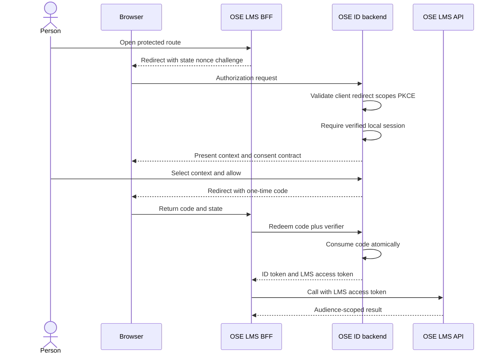
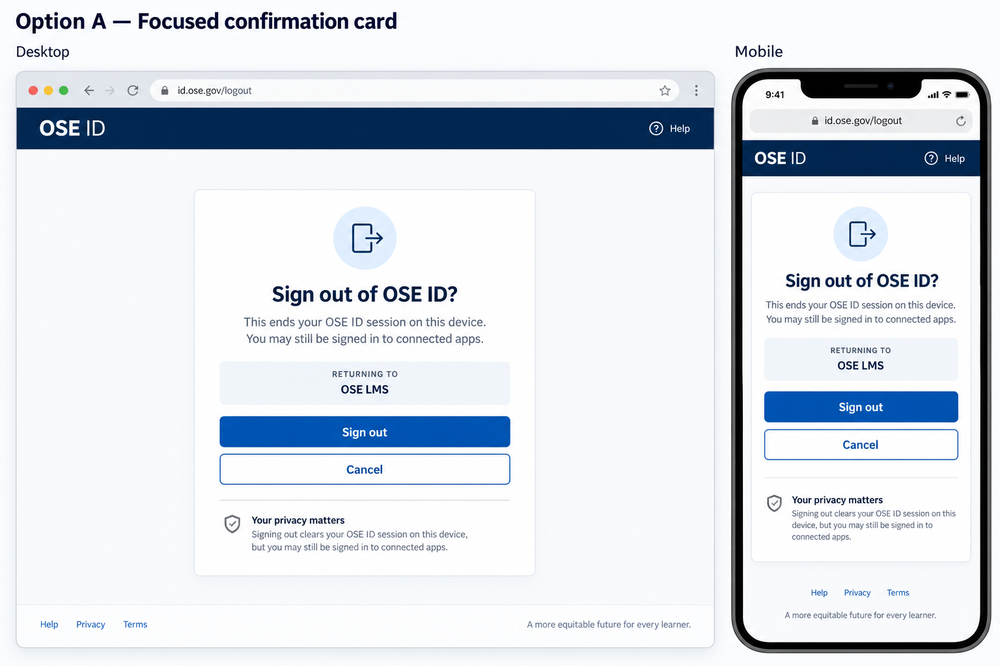
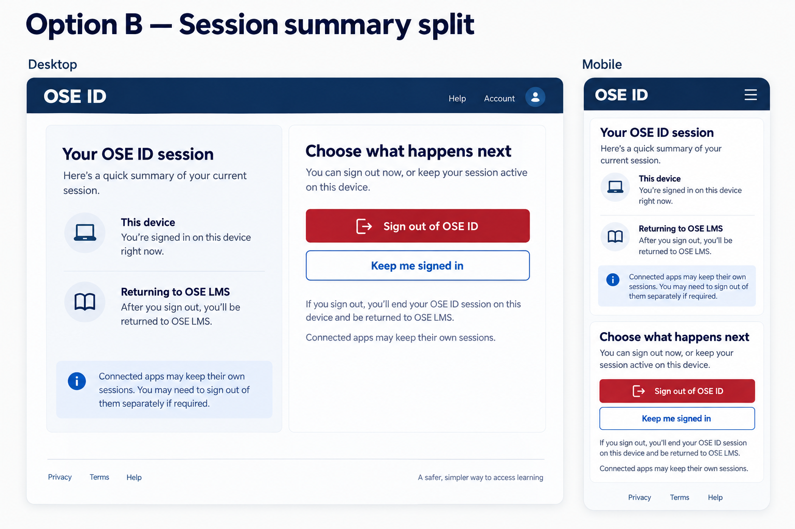

# Product Requirements — OSE ID Init 04

## Product Overview

This milestone makes `ose-id-be` an OpenID Provider and OAuth authorization server for local OSE
clients. OIDC answers “who signed in?” through an ID token. OAuth answers “which API may this client
call?” through an access token. Those artifacts share an authorization flow but are not interchangeable.

## Plain-Language Glossary

| Term                              | Meaning here                                                                                                                                   | Why it matters to OSE apps                                                                                            |
| --------------------------------- | ---------------------------------------------------------------------------------------------------------------------------------------------- | --------------------------------------------------------------------------------------------------------------------- |
| CIAM                              | Customer Identity and Access Management: accounts, sign-in methods, recovery, sessions, and access context for external product users          | OSE ID is the shared CIAM capability instead of every product storing credentials                                     |
| IdP / OpenID Provider             | The service that authenticates a person and issues verifiable identity proof; OSE ID is the IdP                                                | LMS and later apps redirect to one trusted authority instead of implementing login                                    |
| OIDC                              | OpenID Connect, the identity layer used by a client to learn who authenticated                                                                 | It defines the ID token, issuer/subject identity, nonce, discovery, and login contract                                |
| OAuth                             | The authorization framework used to let a client call a specific API with bounded access                                                       | It defines authorization grants, scopes, resource audiences, and access tokens; it is not itself the user-login proof |
| Client / relying party            | An application that asks OSE ID to authenticate and authorize a person, such as an LMS BFF                                                     | Each client gets exact callbacks, allowed flows, contexts, scopes, and resources                                      |
| Resource server                   | The API that receives and validates an access token, such as the LMS API                                                                       | It accepts only a token whose issuer, signature, audience, time, context, and scope match                             |
| Authorization Code                | A short-lived, one-time value returned through the browser and redeemed by the client                                                          | The browser carries no reusable password or API token during the redirect                                             |
| PKCE                              | Proof Key for Code Exchange: the client sends a hash challenge first and the matching secret verifier when redeeming the code                  | A stolen redirect code is useless without the verifier; OSE requires the `S256` method                                |
| BFF                               | Backend for Frontend: a server-side component that performs OIDC and holds tokens while the browser receives only an opaque app-session cookie | It reduces token exposure to browser JavaScript and centralizes callback/session security                             |
| ID token                          | Signed OIDC proof about the authentication event and subject, intended for the client                                                          | The client validates it for sign-in; APIs must not treat it as their bearer access token                              |
| Access token                      | OAuth credential for one resource audience and approved scopes/context                                                                         | The LMS API accepts only its own access token, never a universal OSE bearer token                                     |
| Issuer and subject (`iss`, `sub`) | Together, the immutable external identity key                                                                                                  | Email may change and is never the LMS principal key                                                                   |
| Audience (`aud`)                  | The API/resource for which a token was minted                                                                                                  | It prevents a token for one OSE API from being substituted at another                                                 |
| Scope                             | A named category of access requested by a client                                                                                               | Consent displays human-readable scope purpose; a scope does not directly grant LMS domain roles                       |
| JWKS                              | The public signing-key set clients/resources use to verify tokens                                                                              | It enables asymmetric validation and safe key overlap without publishing private keys                                 |
| Consent                           | The person's allow/cancel decision for the displayed client, scopes, and authorization context                                                 | OSE ID rechecks all authority at confirmation time and issues nothing on cancel                                       |

## Personas

- **Person:** authorizes one client using an existing verified local identity.
- **Client/BFF:** redirects for authorization and redeems a one-time code server-side.
- **Resource API:** validates a bearer token for its exact audience and scopes.
- **Local developer:** runs the issuer and synthetic client without external providers.

## User Stories

- As a person, I can authorize or cancel access for a clearly identified local client.
- As an individual, I can authorize a personal-capable client without a company.
- As a company member, I can authorize exactly one eligible company context.
- As a client, I receive standards-based login proof without handling a password.
- As a resource API, I reject a token intended for another OSE product.
- As a maintainer, I can rotate a local signing key without breaking unexpired tokens.

## Authorization Flow



The browser never receives a refresh token or persists an ID/access token. Cancellation returns a
standards-compatible error to the exact registered callback and creates no grant.

This milestone proves that interaction with a synthetic local LMS client/resource harness. The later
`lms-user` plan owns real LMS integration only after Init 09 completes; it consumes this protocol rather
than changing OSE ID's role in the sequence.

## Logout Confirmation UI Funnel

`GET /connect/logout` is a deliberately small rendered OSE ID surface, not an invisible protocol-only
operation. It lets a person confirm or cancel before `POST /connect/logout` mutates the bound session.
Both candidates below are executable high-fidelity inputs; neither authorizes extra navigation,
identity data, or provider behaviour.

### Grounding and prior art

Repository inspection on 2026-09-15 found reusable `Button`, `Card`, `Alert`, and OSE token/dark-mode
foundations under `libs/web-ui/src/components/` and `libs/web-ui-token/src/ose.css`, but no reusable
protocol logout-confirmation view. Because this page is rendered by ASP.NET Core before the Next.js
identity shell exists, implement a backend-local `LogoutConfirmationView` using the same token values;
do not introduce a cross-runtime shared UI package or a generic modal component. Phase 0 rechecks the
delivered repository before freezing paths.

Official prior art was checked on 2026-09-15. The OpenID Foundation's
[RP-Initiated Logout specification](https://openid.net/specs/openid-connect-rpinitiated-1_0.html)
defines the relying-party logout request and registered post-logout continuation. W3C's
[modal-dialog pattern](https://www.w3.org/WAI/ARIA/apg/patterns/dialog-modal/) documents focus containment
and Escape behavior, but this plan intentionally selects a standalone page rather than a modal because
there is no underlying account shell. The standards ground protocol validation, registered returns,
visible focus, and safe cancel; they do not prescribe the visual composition.

### Diverge — low-fidelity alternatives

#### Low-fi Option A — focused confirmation

```text
Desktop bounded card / mobile full width
┌──────────────────────────────┐
│ Sign out of OSE ID?          │
│ Returning to OSE LMS         │
│ This ends this OSE ID session│
│ [ Sign out ] [ Cancel ]      │
└──────────────────────────────┘
```

#### Low-fi Option B — session summary split

```text
Desktop split / mobile stacked
┌──────────────┬───────────────┐
│ This device  │ Sign out?     │
│ OSE ID active│ OSE LMS return│
│              │ [Out] [Cancel]│
└──────────────┴───────────────┘
```

### Narrow — high-fidelity finalists

| Criterion          | Option A — focused card                                 | Option B — session split                                  |
| ------------------ | ------------------------------------------------------- | --------------------------------------------------------- |
| Decision speed     | One question and two actions dominate                   | More explanatory content precedes actions                 |
| Small viewport     | Short single-column reading order                       | Stacked panels create more vertical travel                |
| Privacy            | Only safe client label and device-local consequence     | Adds a safe session summary but no identity values        |
| Implementation     | Minimal protocol view and error boundary                | Additional layout and responsive states                   |
| Accessibility risk | Lower; simple heading, description, status, and actions | Higher; panel landmarks and repeated context need testing |

### Option A — focused confirmation card



### Option B — session summary split



### Selected direction

Select **Option A**. It exposes the fewest fields, creates the shortest keyboard/screen-reader path, and
fits the backend-owned protocol surface without inventing a broader OSE ID account shell before Init 05.
Option B remains a recorded rejected finalist; revisit it only if validated usability testing shows
that people cannot understand the connected-app consequence from Option A.

The implementation must use repository UI tokens/primitives where available, render one `h1`, associate
the consequence copy with the decision, put `Sign out` before `Cancel` in DOM and visual order, show a
visible focus indicator, preserve logical focus after an error, and announce a server failure through a
status/error region. At 320, 375, 768, 1024, 1280, and 1440 CSS px and 200% zoom, text and actions must
not clip, overlap, or require horizontal scrolling. Colour cannot be the only signal. Cancel performs no
session/grant mutation and returns only to the validated local or registered continuation. No client
secret, cookie, logout hint, state, token, email, Person/company identifier, or provider fact enters
HTML, RSC/browser storage, URL beyond the validated opaque protocol values, analytics, logs, screenshot,
or accessibility name.

## Functional Contract

### Protocol profile

- Publish discovery metadata and JWKS suitable for local client validation.
- Support Authorization Code only. Require PKCE `S256`; reject missing PKCE and `plain`.
- Require exact registered redirect and post-logout URIs. Wildcards and prefix matches are invalid.
- Bind the code to client, callback, PKCE challenge, subject, nonce, scopes, resources, selected
  context, consent, and session; consume it atomically once.
- Do not implement implicit, hybrid, resource-owner password, device, dynamic registration, or machine
  client grants in this milestone.
- Provide revocation and end-session behavior. Do not add UserInfo in this milestone; the registered
  confidential BFF receives the approved sign-in claims in its validated ID token, and APIs receive only
  the audience-scoped access-token contract.

### Registration and claims

- Seed one synthetic confidential LMS BFF client and one LMS API resource for localhost only.
- Declare exact client ID, display name, authentication method, callbacks, grants, scopes, resources,
  consent policy, token lifetime profile, and accepted `personal`/`company` context kinds.
- ID tokens carry protocol-required identity claims and nonce where requested.
- LMS access tokens carry `iss`, opaque `sub`, exact LMS `aud`, time bounds, `jti`, scopes, and client
  binding. Personal tokens carry `context_type=personal` and no `company_id`. Company tokens carry
  `context_type=company`, exactly one `company_id`, and the LMS entitlement signal.
- Never include password, provider, passkey, database routing, company list, company-admin data, or LMS
  domain roles.

### Consent and context contract

- The backend returns a versioned render-safe transaction containing client display name, human-readable
  scopes, eligible context summaries, prior-consent state, expiry, and an opaque transaction ID.
- The confirmation command accepts only the opaque transaction ID, selected context ID/type, and
  allow/cancel decision. The backend re-resolves identity, membership, entitlement, client, scopes, and
  expiry before issuing a code.
- Cancellation, expired transaction, removed entitlement, suspended membership, altered scopes, and a
  context kind disallowed by the client produce safe deterministic outcomes.

### Keys and statelessness

- Use asymmetric signing and publish public validation material only.
- Model key lifecycle as pending, active, verify-only, then retired. A previous public key remains
  available until all tokens it signed have expired plus allowed clock skew.
- Local/test keys are generated or loaded from an explicitly local shared provider outside source
  control. Production mode rejects them and rejects missing production key configuration.
- All correctness state is shared. No authorization flow depends on instance memory, sticky sessions,
  mutable singleton caches, or instance-local files.

## Acceptance Criteria

### AC-04-01 — Complete secure authorization

```gherkin
Scenario: A personal user authorizes the LMS client
  Given a verified user with a personal LMS entitlement and an active OSE ID session
  When the LMS BFF completes Authorization Code with PKCE S256 and consent
  Then OSE ID returns an ID token and an LMS-audience access token
  And the access token has personal context without a company identifier
```

```gherkin
Scenario: A company member authorizes one company
  Given a verified user entitled to LMS through two active companies
  When the user authorizes LMS for one selected company
  Then the access token contains that one company and no other company
  And the backend recorded consent for the selected context and scopes
```

### AC-04-02 — Reject unsafe requests

```gherkin
Scenario Outline: OSE ID rejects an unsafe authorization request
  Given a registered local LMS client
  When the request contains <fault>
  Then OSE ID returns the protocol-safe failure for that request
  And no authorization grant or token is created

  Examples:
    | fault |
    | an unregistered redirect URI |
    | a missing PKCE challenge |
    | the plain PKCE method |
    | an unsupported response type |
    | an unregistered scope or resource |
```

### AC-04-03 — Prevent token and code replay

```gherkin
Scenario: An authorization code is consumed once
  Given a valid authorization code has already been redeemed
  When any instance receives the code again
  Then token issuance is denied
  And the denial reveals no token or verifier value
```

```gherkin
Scenario: A resource receives a token for another audience
  Given a valid token was issued for a different OSE resource
  When the LMS API validates that token
  Then access is denied before LMS domain authorization runs
```

### AC-04-04 — Rotate signing keys safely

```gherkin
Scenario: Tokens remain verifiable during key overlap
  Given one key is verify-only and another key is active
  When a client validates an unexpired token signed by either key
  Then the matching public key is available from JWKS
  And new tokens use only the active key
```

### AC-04-05 — Remain stateless and local-only

```gherkin
Scenario: Another instance completes the transaction
  Given backend instance A created an authorization transaction
  When instance B confirms consent and redeems its code after instance A stops
  Then the authorization completes without session affinity
  And the audit trail contains one completed transaction
```

```gherkin
Scenario: Production mode receives local identity configuration
  Given OSE ID is configured for production mode
  When startup finds a localhost client or local signing key provider
  Then startup fails before listening on a network port
```

### AC-04-06 — Preserve the provider seam without a provider

```gherkin
Scenario: No upstream provider is enabled
  Given OSE ID is running in its supported local configuration
  When a client reads discovery and completes local email authorization
  Then no Google or Facebook handler is registered
  And no social-provider environment variable is required
```

### AC-04-07 — Confirm or cancel logout accessibly

```gherkin
Scenario: A keyboard user cancels OSE ID logout
  Given a signed-in user opens logout for a registered client
  When the user reviews the consequence and activates Cancel with the keyboard
  Then the OSE ID session and related grants remain active
  And focus and continuation return through the validated safe path
  And no identity token session or provider value is rendered or stored by the browser
```

### AC-04-08 — Expired protocol records remain auditable

```gherkin
Scenario: Retire an expired authorization token without erasing it
  Given an expired terminal protocol token has complete audit metadata
  When the protocol cleanup worker prunes it as an identified system actor
  Then ordinary token lookup no longer returns it
  And the retained row records matching deletion and update actor and time fields
  And its reference and protected payload cannot redeem or authorize
  And the serving role cannot physically delete it
```

## Product Risks

- Protocol errors are easy to make invisible behind happy-path libraries; negative tests are product
  requirements, not optional implementation detail.
- JWT validation remains offline until expiry. Short lifetime and explicit revocation-sensitive policy
  bound stale access; this milestone does not pretend logout instantly invalidates every issued JWT.
- A polished consent screen is deferred, so only automated/API proof may invoke the transaction contract
  until Init 05 lands.
