# Protocol Architecture and Contracts

## Boundary Model

`ose-id-be` is the issuer and authorization server. The synthetic LMS BFF is a confidential local
client that can protect its client credential and PKCE verifier server-side. The browser is an
untrusted redirect carrier. The LMS API is a resource server; it validates the access token but does
not call OSE ID on every request.

The backend may expose render-safe authorization-transaction endpoints for the future Next.js BFF.
Those endpoints are not a second authorization server. They operate on an opaque transaction created
by OpenIddict and cannot accept client, redirect, scope, subject, entitlement, or company authority
from browser input.

## Protocol Adapter Placement

OIDC/OAuth endpoints are framework-native inbound adapters around OpenIddict and application use cases,
not arbitrary REST replacements and not domain services. Protocol validation and response production stay
in the adapter/OpenIddict integration. Client, person, context, consent, entitlement, replay, transaction,
claims-destination, and audit policy stay in Application/Domain and are reused by render-safe REST adapter
operations. Persistence and keys remain outbound adapters.

Future GraphQL or Model Context Protocol adapters do not mint tokens, redeem codes, change consent, or
select a tenant through a parallel implementation. They may expose separately authorized use cases only
through the Init 01
[transport-neutral boundary](../../../done/2026-09-17__ose-id-init-01-foundation/tech-docs/001-system-boundaries-and-project-topology.md#backend-architecture-pragmatic-hexagonal-ddd).
OIDC discovery, authorization, token, revocation, and end-session contracts remain OIDC/OAuth HTTP
protocol surfaces rather than being translated into GraphQL fields or MCP tools. This plan installs no
GraphQL/MCP runtime.

## Endpoint Profile

| Endpoint family | Purpose                                                 | Key constraint                                               |
| --------------- | ------------------------------------------------------- | ------------------------------------------------------------ |
| Discovery       | Advertise issuer, endpoints, algorithms, grants, scopes | Generated from the actual enabled profile                    |
| Authorization   | Validate request and create/continue a user transaction | Code response only; exact redirect; PKCE S256                |
| Token           | Atomically redeem a one-time code                       | Client, redirect, verifier, code, and transaction must match |
| JWKS            | Publish current validation keys                         | Never includes private/symmetric key material                |
| Revocation      | Revoke supported token/grant material                   | Generic outcome prevents token-oracle behavior               |
| End session     | End OSE ID session and validate return target           | Exact registered post-logout redirect                        |

OpenIddict protocol endpoints must use framework-native request/response handling. Do not describe or
test them as arbitrary REST JSON endpoints. Contract tests compare discovery metadata and externally
observable protocol behavior. UserInfo is intentionally absent: the confidential BFF validates the ID
token for sign-in, and the LMS API receives only its audience-scoped access token. Discovery must not
advertise a UserInfo endpoint.

## Client and Resource Catalog

The initial catalog is controlled seed/configuration data. It contains one synthetic local LMS BFF and
one LMS API resource. Each client record declares:

- stable client ID and human-readable name;
- confidential/public type and allowed authentication method;
- exact local redirect and post-logout URIs;
- allowed grant and response types;
- allowed scopes and explicit API resources;
- accepted context types: `personal`, `company`, or both;
- entitlement key and consent policy;
- ID/access token lifetime profile;
- allowed browser origins only if a proven direct browser call exists.

Validation rejects duplicate IDs, unknown scope/resource references, wildcard callbacks, insecure
production callbacks, unsupported algorithms, or a client that requests a context its resource cannot
interpret. Dynamic registration is intentionally absent.

### Exact initial registration

These are contract values, not Phase 0 choices. `lms-user` and later local-composition plans consume
them unchanged; changing one requires a numbered-plan amendment and synchronized consumer update.

| Field                                  | Exact local value                                                          |
| -------------------------------------- | -------------------------------------------------------------------------- |
| Client ID / display name               | `ose-lms-app-web-local` / `OSE LMS Local`                                  |
| Client type/authentication             | confidential / `client_secret_basic`; secret stays outside source/evidence |
| Grant / response                       | `authorization_code` / `code` only                                         |
| PKCE                                   | required, `S256` only                                                      |
| Redirect URI                           | `http://127.0.0.1:3400/auth/oidc/callback`                                 |
| Post-logout redirect URI               | `http://127.0.0.1:3400/auth/signed-out`                                    |
| Resource identifier and token audience | `urn:ose:lms-api`                                                          |
| Scopes                                 | `openid`, `profile`, `ose.context`, `ose.lms`                              |
| Accepted contexts                      | `personal`, `company`                                                      |
| Entitlement key                        | `lms.access`                                                               |
| Consent                                | explicit for exact client, resource, scopes, and selected context          |

`openid` enables OIDC and an ID token. `profile` permits only opaque subject and intentionally selected
display-profile claims. `ose.context` permits `context_type` and, only for company context, one opaque
`company_id`. `ose.lms` permits `lms.access` and the LMS audience. No scope permits company lists,
provider identifiers, credentials, or LMS domain roles.

The ID-token allowlist is `iss`, opaque `sub`, `aud`, `exp`, `iat`, `auth_time`, `nonce`, and only the
scope-approved display profile. The LMS access-token allowlist is `iss`, opaque `sub`, exact
`aud=urn:ose:lms-api`, `exp`, `iat`, `jti`, `client_id`, `scope`, `context_type`, `lms.access`, and
`company_id` only for `context_type=company`. Personal tokens omit `company_id`; both token types omit
email as an identity key and all provider/factor metadata.

## Authorization Transaction State Machine

```mermaid
%% Color Palette: Blue #0173B2, Orange #DE8F05, Teal #029E73, Gray #808080
stateDiagram-v2
  accTitle: Authorization transaction states
  accDescr: A valid request becomes pending authentication, then pending context and consent. Allow creates one redeemable code; cancel, expiry, or changed authority ends safely. A redeemed code is terminal and cannot be reused.
  [*] --> RequestValidated
  RequestValidated --> AwaitingIdentity: no fresh session
  RequestValidated --> AwaitingContext: fresh session
  AwaitingIdentity --> AwaitingContext: identity verified
  AwaitingContext --> AwaitingConsent: context rechecked
  AwaitingConsent --> CodeReady: allow
  AwaitingConsent --> Cancelled: cancel
  RequestValidated --> Expired: deadline reached
  AwaitingIdentity --> Expired: deadline reached
  AwaitingContext --> Rejected: authority changed
  AwaitingConsent --> Rejected: request changed
  CodeReady --> Redeemed: exact token exchange
  CodeReady --> Rejected: mismatch or replay
  Redeemed --> [*]
  Cancelled --> [*]
  Expired --> [*]
  Rejected --> [*]
```

Every transition is atomic or protected by optimistic concurrency. Confirmation reloads the client,
identity, session freshness, membership, entitlement, context, scope, and expiry. The opaque transaction
ID is a lookup capability, not authority to edit the request.

## PKCE, State, and Nonce

PKCE protects code redemption. The BFF creates a high-entropy verifier, sends its SHA-256-derived
challenge, retains the verifier server-side, and presents it at token exchange. OSE ID accepts only the
`S256` method. A stolen code without the original verifier is unusable.

The client owns `state` to bind the browser callback to its initiating session and return path. OSE ID
must preserve it but must not treat it as trusted application data. OIDC `nonce` binds the ID token to
the authorization request; the client verifies the returned claim. Correlation/session cookies use
narrow lifetimes, safe SameSite behavior tested against redirects, and no token payload.

## Claims Destinations

Claims are explicitly allowlisted per token destination. The ID token receives only protocol identity
claims plus scope-approved profile and authentication context. The access token receives only resource
authorization claims. A claim in the Identity principal does not automatically enter every token.

For personal context, the access token includes `context_type=personal`, LMS entitlement, and no
`company_id`. For company context it includes `context_type=company`, one opaque `company_id`, and the
relevant entitlement. Lists of companies, provider identities, credential metadata, and product-domain
roles never enter either token.

## Consent Contract

The read model is safe to render: client name, scope names/descriptions, eligible context labels,
whether matching consent already exists, and an expiry. It contains no raw token, secret, verifier,
provider subject, database identifier beyond opaque public IDs, or membership list beyond eligible
choices.

The write contract is an allow/cancel decision plus selected context. Increased scopes, a different
resource, a different company, expired freshness, or changed entitlement cannot reuse old consent.
First-party preauthorization is permitted only as explicit client policy with tests; it must never
silently broaden scopes.
