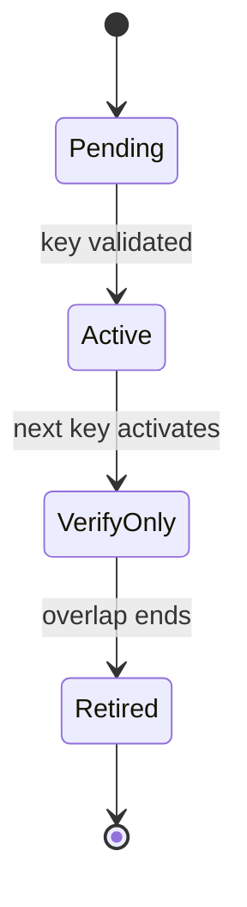

# Persistence, Keys, and Verification

## Persistence Ownership

Implement the exact version-resolved OpenIddict application, authorization, scope, and token store
interfaces as infrastructure adapters over SqlKata's PostgreSQL compiler and Npgsql. Register them
through OpenIddict's supported `Replace*Store` seams. This is required because every protocol row must
obey the inherited
[database audit and soft-delete contract](../../../done/2026-09-17__ose-id-init-01-foundation/tech-docs/007-database-audit-and-soft-delete-contract.md),
including delete/prune operations. EF Core remains migration-time tooling only; no runtime `DbContext`,
change tracker, `IQueryable`, LINQ-to-database, or generic repository exists. OpenIddict-facing models
remain infrastructure details rather than Domain, Application, or public API contracts.

Freeze the complete store-interface member inventory from the resolved OpenIddict package before RED,
including cancellation, concurrency, delete, prune, instantiate, count/list, and lookup methods. A
package upgrade that adds a member must fail compilation until its semantics and tests are added. Capture
compiled SQL and synthetic PostgreSQL query plans for authorization-code lookup/
consumption, token lookup/revocation, client lookup, expiry cleanup, and authorization listing. Verify
bounded result shapes, expected indexes, statement timeouts/cancellation, no lazy loading, and no N+1
query loop. If a measured protocol hot path cannot meet its budget or the store cannot preserve the
required atomic/RLS boundary, stop and amend the plan rather than weakening the contract.

Database operations that consume a code, revoke supported grant/token state, or confirm a consent must
use one transaction and concurrency guard. A second request observes “already used/revoked” and cannot
issue another valid artifact. Refresh-token issuance/rotation is absent from this milestone. Clean
migrations work on an empty database and upgrade the Init 03 schema without dropping identity data.

## Physical PostgreSQL Contract

Use the predecessor-owned PostgreSQL schema `ose_id`. OpenIddict adapters may require exact framework property names, but the
migration must produce the following physical meaning and constraints. Phase 0 may adjust only identifier
lengths proven necessary by the resolved OpenIddict version; any semantic/type change requires a plan
amendment.

Every new table appends the repository-standard six audit columns: `created_at timestamptz NOT NULL DEFAULT
CURRENT_TIMESTAMP`, `created_by varchar(255) NOT NULL DEFAULT 'system'`, `updated_at timestamptz NOT
NULL DEFAULT CURRENT_TIMESTAMP`, `updated_by varchar(255) NOT NULL DEFAULT 'system'`, `deleted_at
timestamptz NULL`, and `deleted_by varchar(255) NULL`. Check
`(deleted_at IS NULL) = (deleted_by IS NULL)`. It also inherits time-order constraints, a named
`BEFORE DELETE` guard, `ON DELETE RESTRICT`, active-row query/index predicates, actor stamping, and
runtime-role prohibition of `DELETE`. “Six audit columns” below means this exact contract.

### `ose_id.oidc_applications`

| Column                      | PostgreSQL type             | Null                        | Contract                                                     |
| --------------------------- | --------------------------- | --------------------------- | ------------------------------------------------------------ |
| `id`                        | `uuid`                      | no                          | primary key; generated server-side                           |
| `client_id`                 | `varchar(100)`              | no                          | unique immutable public identifier                           |
| `client_secret`             | `text`                      | yes                         | framework-protected/hash form only; never plaintext evidence |
| `client_type`               | `varchar(24)`               | no                          | check: `confidential` or `public`                            |
| `display_name`              | `varchar(200)`              | no                          | render-safe client name                                      |
| `consent_type`              | `varchar(24)`               | no                          | allowlisted OpenIddict consent policy                        |
| `redirect_uris`             | `jsonb`                     | no                          | JSON array; exact URI values; default `[]`                   |
| `post_logout_redirect_uris` | `jsonb`                     | no                          | JSON array; default `[]`                                     |
| `permissions`               | `jsonb`                     | no                          | grants, endpoints, scopes, resources; default `[]`           |
| `requirements`              | `jsonb`                     | no                          | includes PKCE S256 requirement; default `[]`                 |
| `properties`                | `jsonb`                     | no                          | accepted context types and entitlement key; default `{}`     |
| `concurrency_token`         | `uuid`                      | no                          | regenerated on update                                        |
| six audit columns           | exact common contract above | exact common contract above | lifecycle/audit ownership                                    |

Indexes: globally unique `ux_oidc_applications_client_id (client_id)` prevents retired client-ID reuse;
an active-row index on `(client_type, consent_type) WHERE deleted_at IS NULL` serves ordinary lookup.
JSON values are not queried by ad hoc broad GIN indexes in this slice.

### `ose_id.oidc_scopes`

| Column              | PostgreSQL type             | Null                        | Contract                                 |
| ------------------- | --------------------------- | --------------------------- | ---------------------------------------- |
| `id`                | `uuid`                      | no                          | primary key                              |
| `name`              | `varchar(100)`              | no                          | unique immutable scope name              |
| `display_name`      | `varchar(200)`              | no                          | consent copy key/name                    |
| `description`       | `varchar(500)`              | yes                         | render-safe scope explanation            |
| `resources`         | `jsonb`                     | no                          | exact resource identifiers; default `[]` |
| `properties`        | `jsonb`                     | no                          | versioned metadata; default `{}`         |
| `concurrency_token` | `uuid`                      | no                          | optimistic concurrency                   |
| six audit columns   | exact common contract above | exact common contract above | lifecycle/audit ownership                |

Indexes: globally unique `ux_oidc_scopes_name (name)` prevents ambiguous retired scope-name reuse.

### `ose_id.oidc_authorizations`

| Column               | PostgreSQL type             | Null                        | Contract                                                            |
| -------------------- | --------------------------- | --------------------------- | ------------------------------------------------------------------- |
| `id`                 | `uuid`                      | no                          | primary key                                                         |
| `application_id`     | `uuid`                      | no                          | FK to applications, `ON DELETE RESTRICT`                            |
| `subject`            | `uuid`                      | no                          | FK to `ose_id.people(person_id)`, `ON DELETE RESTRICT`; never email |
| `authorization_type` | `varchar(24)`               | no                          | check: `ad_hoc` or `permanent`                                      |
| `status`             | `varchar(24)`               | no                          | OpenIddict valid/revoked state                                      |
| `scopes`             | `jsonb`                     | no                          | approved scope-name array                                           |
| `properties`         | `jsonb`                     | no                          | resource and consent-version metadata                               |
| `context_type`       | `varchar(16)`               | no                          | check: `personal` or `company`                                      |
| `company_id`         | `uuid`                      | yes                         | FK to `ose_id.companies(company_id)`, `ON DELETE RESTRICT`          |
| `entitlement_key`    | `varchar(100)`              | no                          | product-entry decision used at grant time                           |
| `concurrency_token`  | `uuid`                      | no                          | optimistic concurrency                                              |
| six audit columns    | exact common contract above | exact common contract above | lifecycle/audit ownership                                           |

Constraint `ck_oidc_authorization_context` requires `company_id IS NULL` for personal and non-null for
company. Indexes: `(application_id, subject, status)`, `(subject, context_type, company_id)`, and a
partial active-consent index on `(application_id, subject)` where `status='valid' AND deleted_at IS NULL`.

### `ose_id.oidc_tokens`

| Column                              | PostgreSQL type             | Null                        | Contract                                                                         |
| ----------------------------------- | --------------------------- | --------------------------- | -------------------------------------------------------------------------------- |
| `id`                                | `uuid`                      | no                          | primary key                                                                      |
| `application_id`                    | `uuid`                      | yes                         | FK to applications, `ON DELETE RESTRICT`                                         |
| `authorization_id`                  | `uuid`                      | yes                         | FK to authorizations, `ON DELETE RESTRICT`                                       |
| `subject`                           | `uuid`                      | yes                         | FK to `ose_id.people(person_id)`, `ON DELETE RESTRICT`, for user-bound artifacts |
| `token_type`                        | `varchar(32)`               | no                          | authorization code/access/identity/refresh type                                  |
| `status`                            | `varchar(24)`               | no                          | valid/redeemed/revoked state                                                     |
| `reference_id`                      | `varchar(100)`              | yes                         | unique protected lookup when framework uses one                                  |
| `payload`                           | `text`                      | yes                         | framework-protected payload, never logged                                        |
| `properties`                        | `jsonb`                     | no                          | default `{}`; no private key or password                                         |
| `creation_date` / `expiration_date` | `timestamptz`               | no                          | bounded validity                                                                 |
| `redemption_date`                   | `timestamptz`               | yes                         | set once by atomic redemption                                                    |
| `concurrency_token`                 | `uuid`                      | no                          | compare-and-swap guard                                                           |
| six audit columns                   | exact common contract above | exact common contract above | lifecycle/audit ownership                                                        |

Constraints require expiration after creation and redemption only for a terminal status. Indexes:
globally unique partial `reference_id` where non-null prevents security-token reference reuse across
tombstones, plus active-row indexes on
`(authorization_id, status)`, `(subject, status)`, and `(expiration_date)` for bounded soft-delete cleanup.

### `ose_id.authorization_transactions`

| Column                                     | PostgreSQL type             | Null                        | Contract                                                                                    |
| ------------------------------------------ | --------------------------- | --------------------------- | ------------------------------------------------------------------------------------------- |
| `id`                                       | `uuid`                      | no                          | primary opaque browser reference                                                            |
| `application_id`                           | `uuid`                      | no                          | FK to applications, restrict delete                                                         |
| `session_id`                               | `uuid`                      | yes                         | FK to `ose_id.account_sessions(session_id)`, `ON DELETE RESTRICT`; set after authentication |
| `request_payload`                          | `bytea`                     | no                          | protected canonical OpenIddict request state                                                |
| `requested_scopes` / `requested_resources` | `jsonb`                     | no                          | immutable arrays                                                                            |
| `context_type`                             | `varchar(16)`               | yes                         | set only after backend validation                                                           |
| `company_id`                               | `uuid`                      | yes                         | FK to `ose_id.companies(company_id)`, `ON DELETE RESTRICT`; company context only            |
| `decision`                                 | `varchar(16)`               | yes                         | check: `allow` or `cancel`                                                                  |
| `expires_at`                               | `timestamptz`               | no                          | short hard deadline                                                                         |
| `completed_at`                             | `timestamptz`               | yes                         | set once                                                                                    |
| `version`                                  | `bigint`                    | no                          | starts 1; optimistic concurrency                                                            |
| six audit columns                          | exact common contract above | exact common contract above | lifecycle/audit ownership                                                                   |

Constraints mirror personal/company discrimination when context is set and prohibit a decision before a
session exists. Indexes: `(session_id, expires_at)`, `(application_id, expires_at)`, and
`(expires_at) WHERE completed_at IS NULL AND deleted_at IS NULL` for soft-delete cleanup.

### `ose_id.oidc_signing_keys`

| Column                   | PostgreSQL type             | Null                        | Contract                                                 |
| ------------------------ | --------------------------- | --------------------------- | -------------------------------------------------------- |
| `id`                     | `uuid`                      | no                          | primary key                                              |
| `key_id`                 | `varchar(100)`              | no                          | unique public `kid`                                      |
| `algorithm`              | `varchar(32)`               | no                          | allowlisted asymmetric signing algorithm                 |
| `state`                  | `varchar(16)`               | no                          | pending/active/verify-only/retired                       |
| `public_jwk`             | `jsonb`                     | no                          | public material only                                     |
| `private_key_ciphertext` | `bytea`                     | yes                         | local-only envelope-protected key; null after retirement |
| `activates_at`           | `timestamptz`               | yes                         | required for active/verify-only                          |
| `verify_until`           | `timestamptz`               | yes                         | required for verify-only; after activation               |
| `retired_at`             | `timestamptz`               | yes                         | required only for retired                                |
| `version`                | `bigint`                    | no                          | optimistic concurrency                                   |
| six audit columns        | exact common contract above | exact common contract above | lifecycle/audit ownership                                |

Indexes: globally unique `ux_oidc_signing_keys_key_id` prevents retired `kid` reuse, and a partial unique
index allows exactly one row with `state='active' AND deleted_at IS NULL`. The local wrapping key is
injected into all instances and never stored in this table.
Production mode rejects this local key provider; future Kubernetes custody replaces the provider without
changing table-independent token contracts.

## Named Constraint and Index Manifest

Migration snapshots and database assertions use these stable physical names; Phase 0 may replace one
only with an already-delivered equivalent and must record the equivalence.

| Table                        | Primary/foreign/check constraints                                                                                                                                                                                                                                                                                                           | Indexes                                                                                                                                            |
| ---------------------------- | ------------------------------------------------------------------------------------------------------------------------------------------------------------------------------------------------------------------------------------------------------------------------------------------------------------------------------------------- | -------------------------------------------------------------------------------------------------------------------------------------------------- |
| `oidc_applications`          | `pk_oidc_applications`; `ck_oidc_applications_client_type`; `ck_oidc_applications_json_arrays`                                                                                                                                                                                                                                              | `ux_oidc_applications_client_id`; `ix_oidc_applications_type_consent`                                                                              |
| `oidc_scopes`                | `pk_oidc_scopes`; `ck_oidc_scopes_resources_array`                                                                                                                                                                                                                                                                                          | `ux_oidc_scopes_name`                                                                                                                              |
| `oidc_authorizations`        | `pk_oidc_authorizations`; `fk_oidc_authorizations_application`; `fk_oidc_authorizations_person`; `fk_oidc_authorizations_company`; `ck_oidc_authorizations_type`; `ck_oidc_authorization_context`                                                                                                                                           | `ix_oidc_authorizations_application_subject_status`; `ix_oidc_authorizations_subject_context`; `ix_oidc_authorizations_active_consent`             |
| `oidc_tokens`                | `pk_oidc_tokens`; `fk_oidc_tokens_application`; `fk_oidc_tokens_authorization`; `fk_oidc_tokens_person`; `ck_oidc_tokens_expiry`; `ck_oidc_tokens_redemption_state`                                                                                                                                                                         | `ux_oidc_tokens_reference_id`; `ix_oidc_tokens_authorization_status`; `ix_oidc_tokens_subject_status`; `ix_oidc_tokens_expiration`                 |
| `authorization_transactions` | `pk_authorization_transactions`; `fk_authorization_transactions_application`; `fk_authorization_transactions_session`; `fk_authorization_transactions_company`; `ck_authorization_transactions_context`; `ck_authorization_transactions_decision`; `ck_authorization_transactions_session_decision`; `ck_authorization_transactions_expiry` | `ix_authorization_transactions_session_expiry`; `ix_authorization_transactions_application_expiry`; `ix_authorization_transactions_pending_expiry` |
| `oidc_signing_keys`          | `pk_oidc_signing_keys`; `ck_oidc_signing_keys_algorithm`; `ck_oidc_signing_keys_state`; `ck_oidc_signing_keys_lifecycle`                                                                                                                                                                                                                    | `ux_oidc_signing_keys_key_id`; `ux_oidc_signing_keys_one_active`                                                                                   |

Every table also has its audit-pair/time checks and `trg_<table>_reject_hard_delete` guard. Migration tests
compare this manifest with `pg_constraint`, `pg_indexes`, `pg_trigger`, and role grants; an absent,
renamed, or weaker item fails the gate. Every ordinary lookup and listed index excludes tombstones.

## OpenIddict String-to-UUID Mapping

The selected physical identifiers, subjects, and concurrency tokens remain PostgreSQL `uuid`, while the
resolved OpenIddict store interfaces expose their textual representations. Each custom store parses only
canonical UUID text at its infrastructure boundary, formats returned values as lower-case hyphenated
UUID text, rejects null/empty/malformed input with the version-resolved OpenIddict exception contract,
and never uses email as a subject. Unit property/edge tests cover round trips and invalid values;
Integration tests cover parameter types and optimistic-concurrency failures against PostgreSQL; E2E
proves issued `sub` and protocol references round-trip across instances. A package version whose store
interface cannot preserve this mapping blocks execution and requires a plan amendment.

## Migration and Compatibility Contract

The first migration is additive: create the six tables, constraints, and indexes in one transaction,
then seed the synthetic client/resource/scope by stable identifiers through an idempotent migration or
controlled seeder. Init 03 binaries ignore the new tables, so old code remains compatible while the new
schema is present. New code must tolerate an empty OIDC catalog by failing readiness, not by inventing
unsafe defaults.

Field lifecycle is expand→backfill→verify→constrain. A new required field first lands nullable or with a
semantically safe default, is backfilled in bounded batches, is verified for zero invalid rows, then
receives `NOT NULL`/check/index in a later forward migration. Do not rename/drop a field in the same
delivery that stops writing its predecessor.

No-loss proof records pre/post row counts and stable non-secret digests for all Init 01–03 tables,
foreign-key/check violations, catalog IDs, and migration history. Run empty, seeded, and concurrent
upgrade paths twice. Rollback means deploy the prior code against the retained additive schema; never
down-migrate, drop OIDC tables, delete grants, or regenerate keys to recover from an application defect.
A corrective forward migration owns schema defects.

## Shared-State Contract

The following state is shared across healthy instances:

- identity sessions and security-stamp/freshness information;
- authorization transactions, codes, grants, and revocation state;
- client/resource/scope catalog or deterministic seeded identifiers;
- consent records and selected context bindings;
- signing-key metadata and access to the active private key;
- audit events and rate-limit state when it affects security correctness.

An in-memory cache may optimize immutable discovery data, but it cannot be authoritative. Cache loss or
instance replacement must not change authorization outcomes. Redis is not introduced without a measured
need; PostgreSQL is the first source of truth.

## Signing-Key Lifecycle

Only one key signs new tokens. JWKS publishes active and still-valid verify-only public keys with stable
opaque `kid` values. Unknown `kid`, altered signature, wrong algorithm, wrong key use, or retired key
fails closed. The overlap is derived from the longest signed-token lifetime plus maximum configured
clock skew, not a magic date.

Local keys are test material, excluded from source control and production. The provider abstraction
must later support Kubernetes-backed custody without changing token claims or key-state semantics.

## Token Lifetime and Revocation Model

Authorization codes are short-lived and single-use. Access tokens are short-lived to bound offline
staleness. ID tokens exist only long enough for client validation. This milestone does not enable refresh
tokens or `offline_access`; adding them later requires a separate contract covering server-side rotation,
family reuse detection, absolute session bounds, revocation, compatibility, and complete proof.

Logout ends the local OSE ID session and related server-side grants according to policy. It cannot erase
an already issued offline-valid JWT from a resource's cache. Product copy and tests must not claim
instant global logout. Security-sensitive resources can later select reference tokens/introspection
through a separately justified profile.

## Verification Matrix

| Layer          | Positive proof                                                              | Negative proof                                                                           |
| -------------- | --------------------------------------------------------------------------- | ---------------------------------------------------------------------------------------- |
| Unit           | claims policy, client policy, context discrimination, key-state transitions | excess claims, invalid context, unsafe callback, unsupported grant                       |
| Integration    | custom stores, atomic consumption, consent concurrency, seeded catalog      | code replay, stale consent, physical delete, missing audit actor, duplicate registration |
| Backend E2E    | discovery, PKCE flow, token validation, revocation/logout, key overlap      | wrong verifier, nonce, issuer, audience, signature, time, client, scope, `kid`           |
| Multi-instance | start on A and finish on B                                                  | stop A mid-flow; no affinity or local-file dependency                                    |
| Startup        | explicit local/test profile starts                                          | production with localhost client, fake adapter, or local key fails before listen         |

Use a fixed clock only in the test composition root. Production code obtains time from an injectable
system abstraction. Evidence must redact codes, tokens, verifiers, client secrets, cookies, and private
keys; store stable digests or decoded allowlisted claim names when proof needs identity.

## Failure and Recovery

- A migration failure rolls forward with a corrective migration; never drop/recreate a user's database.
- A bad active local key can be replaced only after invalidating artifacts it signed or retaining its
  public key through their expiry. Never edit `kid` history to hide the incident.
- A seeded-client mismatch fails startup/migration rather than mutating an established client silently.
- If OpenIddict configuration cannot satisfy the threat model, stop this plan and reconsider Keycloak;
  do not implement protocol endpoints from scratch.
