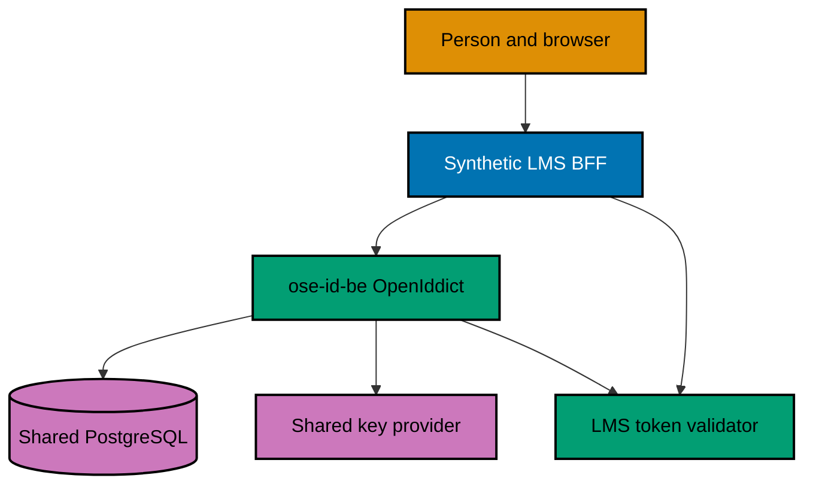

# Technical Design — OSE ID Init 04

Read these documents in order. They separate protocol behavior, persistence/security mechanics, and
execution impact so an engineer can change one concern without silently changing another.

## Document Map

1. [Protocol architecture and contracts](001-protocol-architecture-and-contracts.md) — endpoints,
   authorization transaction, registrations, claims, and browser/BFF/resource boundaries.
2. [Persistence, keys, and verification](002-persistence-keys-and-verification.md) — OpenIddict stores,
   atomic use, consent, key overlap, statelessness, negative tests, and local runtime safeguards.
3. [Decisions, sources, and file impact](003-decisions-sources-and-file-impact.md) — selected design,
   alternatives, licensing, revisit triggers, dependencies, and exact affected files.
4. [BDD spec delta and adapter map](004-bdd-spec-delta-and-adapter-map.md) — copy-ready durable behavior,
   exact spec targets, and Unit/Integration/E2E obligations.
5. [API and protocol contract delta](005-api-contract-delta.md) — per-operation OIDC and
   internal API request/response/error packets, compatibility, code generation, and proof obligations.

## Architecture at a Glance

The process instance is stateless even though the system is not: PostgreSQL and the key provider own
all state needed to continue a request on another instance.

## Technology Baseline

| Concern              | Selected implementation                                                   | Constraint                                                                   |
| -------------------- | ------------------------------------------------------------------------- | ---------------------------------------------------------------------------- |
| Server               | ASP.NET Core 10 / C# 14                                                   | Nullable, warnings as errors, standard Nx targets                            |
| Account integration  | ASP.NET Core Identity                                                     | Reuse Init 03 person/session identifiers                                     |
| Authorization server | OpenIddict                                                                | OSE owns configuration, consent contract, claims, and operations             |
| Storage              | SqlKata + Npgsql for all runtime data, including custom OpenIddict stores | Explicit queries; audited soft delete; shared PostgreSQL transactional state |
| Tokens               | Signed asymmetric artifacts                                               | Explicit issuer, audience, scopes, lifetime, and `kid`                       |
| Runtime              | Local/test only                                                           | Production startup rejects local clients, keys, and adapters                 |

## Non-Negotiable Invariants

- OSE applications identify a person by `(iss, sub)`, never email.
- An ID token establishes client login; an access token authorizes its exact resource.
- A personal token has no `company_id`; a company token has exactly one server-resolved `company_id`.
- Consent and context are revalidated when the transaction is confirmed and when the code is redeemed.
- Authorization codes are never browser-storage values. Refresh tokens are not enabled here; any future
  refresh-token contract must keep them server-side and prove rotation/reuse handling separately.
- No Google or Facebook implementation/configuration enters this milestone.
- OSE ID source remains MIT-licensed. OpenIddict and other dependencies retain their own notices.
- At least 99% Unit line coverage is required for authored production code, with only canonical
  repository exclusions. Every Gherkin scenario has a Unit adapter and
  applicable Integration/E2E adapters; each higher-layer exemption is scenario-specific,
  boundary-justified, indexed in behavior coverage, and statically validated.
