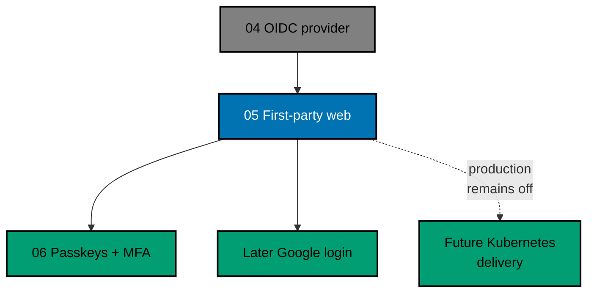

# OSE ID Init 05 — First-Party Web

> **Status:** Backlog — execute only after `ose-id-init-04-oidc-oauth-provider` is complete and this
> plan's pure promotion move has landed on `origin/main`.

Build the first human-facing OSE ID experience as `ose-id-web`: a Next.js backend-for-frontend and
responsive UI for verified email sign-in, authorization context selection, consent, and the account
security surface available at this milestone. It renders the backend-owned contracts from Init 03 and
Init 04; it never becomes a second identity or authorization authority.

## Scope

- The selected calm, identifier-first sign-in flow for verified email/password.
- Next.js BFF boundaries, opaque web sessions, CSRF/origin checks, safe return paths, no-store/referrer
  headers, and no token persistence in browser JavaScript.
- Personal or company context selection followed by client/scope consent.
- Account security for password/recovery-email state, current sessions, and connected clients already
  supported by the backend.
- Accessibility and responsive proof at 320, 768, and 1280 CSS pixels.
- Stateless web instances backed by shared session/transaction state and cross-instance handoff tests.
- Local-run-only composition. Production startup remains fail-closed and deployment remains deferred.
- OSE ID source/docs inherit the root MIT license; dependencies keep their upstream licenses.
- Production deployment waits at minimum for
  `private-sibling/plans/backlog/start-infra-04-deploy-tencent-lighthouse-k3s-cluster` and the then-current
  platform handoff gates.

## Non-Goals

- Google or another external provider. The UI contains no inactive social button; Google arrives in a
  later provider plan. Facebook is explicitly excluded.
- Passkeys, TOTP, or recovery codes; Init 06 adds them.
- Company-member administration or a platform operator console.
- LMS source changes or production deployment.
- Client-side token storage or UI-owned authorization policy.

## Dependency and Result

## Navigation

- [Business requirements](brd.md)
- [Product requirements and UI design funnel](prd.md)
- [Technical design](tech-docs/README.md)
- [Delivery checklist](delivery.md)
- [Execution learnings](learnings.md)

## Related Milestones

- Predecessor: `ose-id-init-04-oidc-oauth-provider`; Phase 0 resolves its archived path.
- Successor: [passkeys and MFA](../ose-id-init-06-passkeys-and-mfa/README.md).
