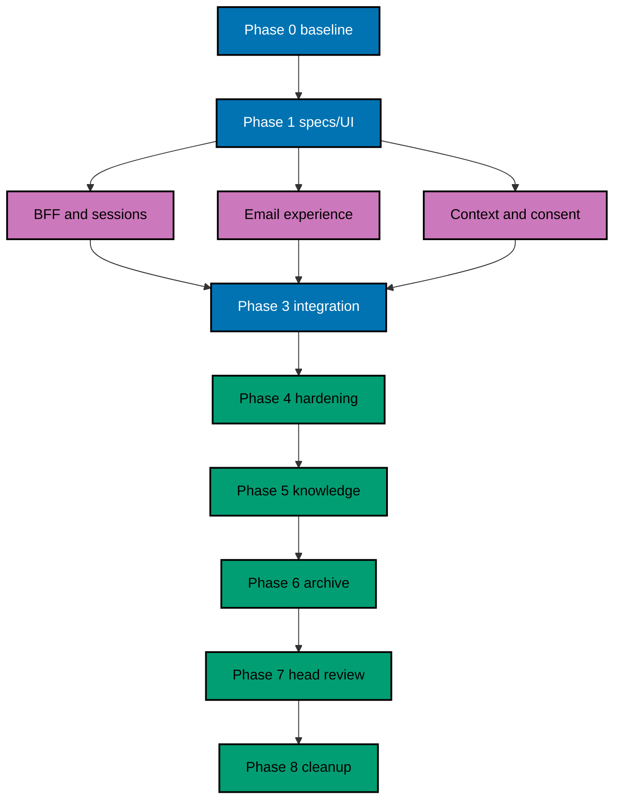

# Delivery Plan — OSE ID Init 05

> **Legend** — `[AI]`: an agent performs the step (the default; unmarked steps are `[AI]`).
> `[HUMAN]`: only a human can do it. `[AI+HUMAN]`: an agent prepares and a human performs the
> privileged or real-credential action.

## Delivery Mode

**Mode:** `worktree-to-pr`. One branch and one PR deliver the complete local email web/BFF journey.
Production deployment is outside scope. A temporary local/test-only feature gate keeps the new routes
inert until the PR's final gate; production startup stays fail-closed after gate removal.

## Delivery Unit

| Delivery unit                       | Included phases | Safe `main` state                                                      | Explicitly excluded                                          |
| ----------------------------------- | --------------- | ---------------------------------------------------------------------- | ------------------------------------------------------------ |
| DU-05 — Local first-party email web | 0–8             | Complete email/BFF/context/consent/account UI; production fails closed | Passkeys/MFA, providers, company admin, LMS code, deployment |

The shell, BFF security, email flow, context, consent, account pages, specs, evidence, and in-PR archival
land together because a reachable partial redirect loop is not a safe `main` state.

No phase or agent lane is merged independently. Any required split first amends the plan into new
delivery units; every resulting `main` state must build, keep incomplete routes inert behind the
temporary local/test gate, and preserve production fail-closed behavior.

## Worktree

- **Execution worktree:** `worktrees/ose-id-init-05-first-party-web/`
- **Provisioning status:** pending until Phase 0.
- **Authoring exception:** this plan was authored inside the user-required `ose-id` worktree while the
  numbered plan family was unlanded. Do not record execution identity or branch inventory before Phase 0.
- **Worktree cap:** reuse one worktree for every phase in this repository.

## Lifecycle Prerequisite

Phase 0 resolves the archived predecessor path and proves `ose-id-init-04-oidc-oauth-provider` is
complete on `origin/main` with the expected transaction, client, context, consent, and startup-guard
contracts. This plan's pure backlog→in-progress promotion must be on `origin/main` before execution.
Production deployment remains outside scope and blocked at minimum by
`private-sibling/plans/backlog/start-infra-04-deploy-tencent-lighthouse-k3s-cluster`, followed by the
then-current platform handoff gates. This plan does not modify the private sibling.

## Parallelization Model

### Delivery Boundaries

| Unit  | Change phases | Worktree and branch                                                                                                           | Delivery opportunity                                                    | Cohesive seam                                                                                                                    | Resulting `main`, rollback, and flag evidence                                                                                                                                                                                                                                                                                                                                              |
| ----- | ------------- | ----------------------------------------------------------------------------------------------------------------------------- | ----------------------------------------------------------------------- | -------------------------------------------------------------------------------------------------------------------------------- | ------------------------------------------------------------------------------------------------------------------------------------------------------------------------------------------------------------------------------------------------------------------------------------------------------------------------------------------------------------------------------------------ |
| DU-05 | 0–8           | `worktrees/ose-id-init-05-first-party-web/`; observed Phase-0 execution branch based on `ose-id-init-05-first-party-web-base` | One PR after Phase 8 only; no BFF, page, or session lane can ship alone | Durable BFF sessions, email sign-in/verification/recovery, context, consent, account/security/session pages, specs, and evidence | `main` exposes a complete local first-party journey while production remains fail-closed. Rollback first disables the local route gate, then removes web/BFF artifacts without changing verified identities or backend sessions. Evidence proves disabled/enabled paths, no redirect loop, PostgreSQL session handoff/no-loss, and removal of the temporary integration flag before merge. |

Shared files remain root-owned until the complete slice is green. A lane that cannot satisfy this seam
stops and triggers a plan amendment instead of creating a partial delivery unit.

### Agent Topology

N=3 execution agents plus one root coordinator. The root freezes the file ledger, owns integration,
and runs gates. After Phase 1 contracts freeze:



Agent 1 owns session/BFF/security boundaries; Agent 2 owns sign-in/recovery pages; Agent 3 owns context,
consent, and account-security pages. Shared components require coordinator ownership. Every agent must
preserve others' edits and stop on a frozen-ledger collision.

## Execution Packet Defaults

Every checkbox inherits the phase-local packet below unless it states a stricter owner, path, command,
or evidence destination. A checkbox is incomplete until its evidence records the exact command, exit
code, observed result, and changed paths. A path discovered during Phase 0 must be written to
`plans/in-progress/ose-id-init-05-first-party-web/evidence/phase-0-path-inventory.md` before later work uses it. On any mismatch, preserve sanitized
output, stop the phase gate, fix the root cause without weakening tests or contracts, rerun the same
command, and append the disposition to that phase's evidence.

| Phase | Owner                                          | Authorized path or bounded pattern                                                                                                                                    | Copyable verification command                                                                                                                                                                                                                          | Observable result and evidence                                                                                                                                           |
| ----- | ---------------------------------------------- | --------------------------------------------------------------------------------------------------------------------------------------------------------------------- | ------------------------------------------------------------------------------------------------------------------------------------------------------------------------------------------------------------------------------------------------------ | ------------------------------------------------------------------------------------------------------------------------------------------------------------------------ |
| 0     | Root coordinator                               | repository inventory, predecessor artifacts, and execution worktree only                                                                                              | Run the Phase 0 predecessor-green baseline commands from this section; separately run `rtk ./hippo run --class transactional --resource-tier standard --disk-path . -- npm exec nx -- run ose-id-be:test:quick` for the unchanged protocol dependency. | Exit `0`; baseline and resolved paths in `plans/in-progress/ose-id-init-05-first-party-web/evidence/phase-0-baseline.md`                                                 |
| 1     | Root coordinator                               | `specs/apps/ose/id-be/**`, `specs/apps/ose/id-web/**`, `apps/ose-id-web{,-e2e}/**/behaviour-coverage.json`, this plan's numbered tech docs, and UI contract artifacts | Green predecessor baseline, then `rtk ./hippo run --class transactional --resource-tier standard --disk-path . -- npm exec nx -- run-many -t test:coverage:behaviour --projects=ose-id-web,ose-id-web-e2e`                                             | Only recorded missing Plan 05 bindings may be RED; all other mapping checks exit `0` in `plans/in-progress/ose-id-init-05-first-party-web/evidence/phase-1-contracts.md` |
| 2     | Agents 1–3 within frozen ownership             | `apps/ose-id-web/**`, `apps/ose-id-web-e2e/**`, and generated client/session seams                                                                                    | `rtk ./hippo run --class transactional --resource-tier standard --disk-path . -- npm exec nx -- run-many -t test:unit,test:integration -p ose-id-web ose-id-be`                                                                                        | Exit `0`; ordered RED/GREEN/REFACTOR trace in `plans/in-progress/ose-id-init-05-first-party-web/evidence/phase-2-web-core.md`                                            |
| 3     | Root coordinator after lane convergence        | same web/backend paths plus canonical specs                                                                                                                           | `rtk ./hippo run --class transactional --resource-tier standard --disk-path . -- npm exec nx -- run ose-id-web-e2e:test:e2e`                                                                                                                           | Exit `0`; browser/API/session evidence in `plans/in-progress/ose-id-init-05-first-party-web/evidence/phase-3-journeys.md`                                                |
| 4     | Root coordinator and named quality-gate agents | frozen delivery ledger only                                                                                                                                           | `rtk npm run check:pre-push`                                                                                                                                                                                                                           | Exit `0`; API, UI, accessibility, usability, and security reports in `plans/in-progress/ose-id-init-05-first-party-web/evidence/phase-4-quality-gates.md`                |
| 5     | Root coordinator                               | this plan's `learnings.md` and bounded durable-doc destinations                                                                                                       | `rtk ./hippo run --class transactional --resource-tier standard --disk-path . -- npm exec markdownlint-cli2 -- plans/in-progress/ose-id-init-05-first-party-web/learnings.md`                                                                          | Exit `0`; promoted/deferred knowledge in `plans/in-progress/ose-id-init-05-first-party-web/evidence/phase-5-knowledge.md`                                                |
| 6     | Root coordinator                               | this plan directory and annotated plan indexes                                                                                                                        | `rtk npm run check:pre-push`                                                                                                                                                                                                                           | Exit `0`; archive/index validation in `plans/in-progress/ose-id-init-05-first-party-web/evidence/phase-6-archive.md`                                                     |
| 7     | Root coordinator and review agents             | current-head diff only                                                                                                                                                | `rtk npm run check:pre-push`                                                                                                                                                                                                                           | Exit `0`; current-head/base and review dispositions in `plans/in-progress/ose-id-init-05-first-party-web/evidence/phase-7-head-review.md`                                |
| 8     | Root coordinator                               | execution worktree metadata only                                                                                                                                      | `rtk git -C worktrees/ose-id-init-05-first-party-web status --short`                                                                                                                                                                                   | Empty output after merge; cleanup record in `plans/in-progress/ose-id-init-05-first-party-web/evidence/phase-8-cleanup.md`                                               |

### PostgreSQL Persistence Boundary

The Next.js server owns only `ose_id_web.web_session` through server-only Kysely + `pg`; browser/client
bundles cannot import the driver, query builder, database credential, or persistence module. No ORM is
allowed. All identity, authorization, consent, account, and security-domain mutations still travel
through the typed C# backend contract. The web runtime role receives only bounded `SELECT`/`INSERT`/
`UPDATE` on its table, never `DELETE` or identity-schema access. Every explicit query uses bound values,
named projections, timeout/cancellation, `deleted_at IS NULL`, and an explicit transaction where needed.
Phase 2–3 tests inspect dependency boundaries, compiled SQL, query counts/plans, all six audit columns,
guard trigger/grants, actor stamping, soft-delete cleanup, real hard-delete rejection, and multi-instance
handoff. Store evidence under `plans/in-progress/ose-id-init-05-first-party-web/evidence/phase-{2,3}-persistence/`; drift reopens its owning packet.

### Mandatory Nx Quality Matrix

The full green matrix below is mandatory as the completion gate of the first implementation phase
(Phase 2) and for every later implementation, final local-quality, exact-head delivery/PR, and
post-merge gate. It is not a Phase 0 or Phase 1 success criterion. Before creating any Plan 05
scenario, binding, or test, Phase 0 and Phase 1 each run this exact predecessor-green baseline:

```bash
rtk ./hippo run --class transactional --resource-tier standard --disk-path . -- npm exec nx -- run-many -t build --projects=ose-id-be,ose-id-web
rtk ./hippo run --class transactional --resource-tier standard --disk-path . -- npm exec nx -- run-many -t typecheck,lint,test:quick --projects=ose-id-be,ose-id-be-e2e,ose-id-web,ose-id-web-e2e
```

Then run the static predecessor behavior baseline:

```bash
rtk ./hippo run --class transactional --resource-tier standard --disk-path . -- npm exec nx -- run-many -t test:coverage:behaviour --projects=ose-id-be,ose-id-be-e2e,ose-id-web,ose-id-web-e2e
```

Phase 0 verifies the commands resolve to real targets in all four OSE ID `project.json` files, not
echo, no-op, success-sentinel, or duplicate aliases. The C# backend requires
`<Nullable>enable</Nullable>`; its Nx `typecheck` runs the .NET compiler with
`/p:TreatWarningsAsErrors=true`, while Nx `lint` runs Roslyn analyzer verification plus
`dotnet format --verify-no-changes`. The Next.js owner uses strict TypeScript;
`typecheck` runs `tsc --noEmit` and `lint` runs ESLint (it may
also run the repository's faster companion linter). The TypeScript E2E project also has a no-emit
typecheck and a real repository-standard lint target, but intentionally omits `build` because it
produces no deployable bundle. Each Phase 2-and-later matrix gate writes exit codes and inspected
target/configuration proof to its phase evidence file under the key `nx-quality`; any failure reopens
that gate and blocks progression. Phase 1 records the green predecessor baseline first, then runs only
its explicitly named static-coverage and RED commands. A nonzero result is nonblocking only when its
recorded RED ledger names the missing Plan 05 behavior; any baseline, target/configuration, or unrelated
failure blocks Phase 2.

## Phase 0: Environment, Inventory, and Baseline

**Input:** complete Init 04 on current `origin/main` and the promoted plan.

**Outcome:** one initialized worktree, exact predecessor/file/UI/locale inventory, and clean baseline.

**Proof:** newly created branch inventory, source/version records, screenshots of existing local UI only
where safe, and baseline outputs under `plans/in-progress/ose-id-init-05-first-party-web/evidence/phase-0-*`.

- [ ] [AI] Fetch, provision, and enter `worktrees/ose-id-init-05-first-party-web/` from current
      `origin/main` by running `rtk git fetch origin main` then
      `rtk git worktree add -b ose-id-init-05-first-party-web-base worktrees/ose-id-init-05-first-party-web origin/main`;
      if the branch exists, use
      `rtk git worktree add worktrees/ose-id-init-05-first-party-web ose-id-init-05-first-party-web-base`.
      On failure run `rtk git worktree prune` and retry once; a second failure preserves all artifacts
      and stops for diagnosis rather than provisioning another worktree. Then
      verify with `rtk git -C worktrees/ose-id-init-05-first-party-web status --short`; create the
      execution branch inventory with path, branch, base/head SHAs, dirty-state
      classification, PR field, delivery status, and cleanup status.
- [ ] [AI] Read root/nested instructions, RTK, predecessor as-built docs at its resolved archived path,
      plan/spec/UI/accessibility/i18n/TDD rules, Next.js precedent, and worktree-to-PR workflow.
- [ ] [AI] Initialize with `rtk ./hippo run --class transactional --resource-tier standard --disk-path . -- npm install` and
      `rtk npm run doctor` (read-only; only if it reports drift, run
      `rtk ./hippo run --class transactional --resource-tier standard --disk-path . -- ./rhino toolchain provision --apply`
      and repeat Doctor); record the
      final clean Doctor.
- [ ] [AI] Inventory exact `ose-id-web`, `ose-id-web-e2e`, backend contract, generated client, session
      mechanism, specs, project configuration, port, env prefix, locale set, `libs/web-ui`, OSE tokens,
      Storybook, sibling identity/form patterns, and generated ownership. Freeze the file ledger.
- [ ] [AI] Verify all pinned local ports are unclaimed with
      `rtk lsof -nP -iTCP:3500 -iTCP:8501 -iTCP:5438 -iTCP:1026 -iTCP:8026 -sTCP:LISTEN`.
      The required result is no listener. If any is occupied, stop the owning local process or amend
      this plan and dependent contracts; do not choose a different port. Pin web
      `http://127.0.0.1:3500`, backend `http://127.0.0.1:8501`, PostgreSQL `5438`, Mailpit SMTP `1026`,
      and Mailpit UI `http://127.0.0.1:8026`.
- [ ] [AI] Recheck Next.js security APIs, WCAG 2.2 requirements, repository dependencies/licenses, and
      asset content. Record that OSE-authored source/docs inherit MIT and dependencies retain licenses.
- [ ] [AI] Run predecessor backend and existing web project build/typecheck/lint/Unit/Integration/E2E,
      behavior coverage, spec, Markdown, and boundary gates through HIPPO. Fix baseline failures at root
      cause before plan changes.

### Phase 0 Gate

- [ ] [AI] Worktree identity/inventory and frozen ledger exist; Init 04 is green; UI/locale/component
      evidence is current; no blocker remains.

> **Pause Safety:** no product behavior has changed. Safe to stop. To resume, rerun the exact baseline
> quick-test commands captured in Phase 0 evidence.

## Phase 1: Freeze Web Specs, UI Contract, and Threat Model

**Input:** PRD AC-05-01 through AC-05-08, current component inventory, and selected assets.

**Outcome:** canonical web Gherkin, responsive/a11y specifications, backend contract fixtures, and threat
coverage exist before routes become reachable.

**Proof:** specs/contract/Mermaid/funnel gates pass and missing bindings form the RED ledger.

- [ ] [AI] Copy, without paraphrase, each `ADD` scenario from
      `tech-docs/005-bdd-spec-delta-and-adapter-map.md` to its exact
      `specs/apps/ose/id-web/behaviours/{sign-in,authorization,security,accessibility,runtime,account,config}/**/*.feature`
      destination. Run
      `rtk ./hippo run --class ephemeral --resource-tier standard --disk-path . -- npm exec nx -- run-many -t test:coverage:behaviour --projects=ose-id-web,ose-id-web-e2e`;
      acceptance is unique valid scenarios with only missing code adapters RED. Save copied paths and
      output to `plans/in-progress/ose-id-init-05-first-party-web/evidence/phase-1-gherkin-red.md`; wording/action/path drift blocks Phase 1.
- [ ] [AI] Add named Unit, Integration, and E2E bindings to
      `apps/ose-id-web/behaviour-coverage.json` and `apps/ose-id-web-e2e/behaviour-coverage.json`, then
      rerun `rtk ./hippo run --class ephemeral --resource-tier standard --disk-path . -- npm exec nx -- run-many -t test:coverage:behaviour --projects=ose-id-web,ose-id-web-e2e`.
      Acceptance is zero missing/duplicate/unowned mappings and zero exemptions; save the adapter list
      to `plans/in-progress/ose-id-init-05-first-party-web/evidence/phase-1-adapter-map.md`. Any proposed exemption requires a plan amendment.
- [ ] [AI] Materialize the page/BFF contract from `tech-docs/006-api-contract-delta.md` in
      `specs/apps/ose/id-web/contracts/openapi.yaml` and typed fixtures under the Phase-0-resolved
      `apps/ose-id-web/tests/contracts/**`; run
      `rtk ./hippo run --class ephemeral --resource-tier standard --disk-path . -- npm exec nx -- run ose-id-web:test:integration`.
      Acceptance is exact methods, status/header/body/problem examples and opaque-only backend choices;
      save expected missing-handler RED output to `plans/in-progress/ose-id-init-05-first-party-web/evidence/phase-1-api-contract-red.md`. Any implicit
      backend operation or UPDATE/DELETE drift blocks implementation.
- [ ] [AI] Encode the PRD funnel's page states, component reuse/new-component list, breakpoints, locales,
      focus targets, announcements, copy, errors, and asset disposition in
      `specs/apps/ose/id-web/README.md` and the exact feature files above. Run
      `rtk ./hippo run --class ephemeral --resource-tier standard --disk-path . -- npm exec markdownlint-cli2 -- specs/apps/ose/id-web/README.md`;
      acceptance is exit `0` and an explicit assertion that Google/passkey controls are absent. Save the
      state matrix to `plans/in-progress/ose-id-init-05-first-party-web/evidence/phase-1-ui-contract.md`; an unspecified state blocks Phase 2.
- [ ] [AI] Add CSRF/login-CSRF, open-redirect, fixation, RSC/URL/storage/analytics leakage,
      clickjacking, enumeration, context/consent substitution, stale-cache, backend-target, and
      process-local-session rows to `docs/explanation/security/ose-id-threat-model.md`. Run
      `rtk ./hippo run --class ephemeral --resource-tier standard --disk-path . -- npm exec markdownlint-cli2 -- docs/explanation/security/ose-id-threat-model.md`;
      acceptance is exit `0` with owner/proof/residual risk per row. Save IDs to
      `plans/in-progress/ose-id-init-05-first-party-web/evidence/phase-1-threat-map.md`; an unowned threat blocks Phase 1.
- [ ] [AI] Run
      `rtk ./hippo run --class ephemeral --resource-tier standard --disk-path . -- npm exec nx -- run-many -t test:coverage:behaviour,test:integration --projects=ose-id-web,ose-id-web-e2e`
      and `rtk ./hippo run --class ephemeral --resource-tier standard --disk-path . -- npm exec markdownlint-cli2 -- plans/in-progress/ose-id-init-05-first-party-web/tech-docs/*.md specs/apps/ose/id-web/README.md`.
      Acceptance is valid specs/contracts/funnel/docs and a RED ledger limited to absent handlers; save
      commands, exits, and symbols to `plans/in-progress/ose-id-init-05-first-party-web/evidence/phase-1-contract-gate.md`. Any other failure is fixed at
      source before Phase 2.
- [ ] [AI] Configure `apps/ose-id-web/project.json` and its discovered test settings to enforce at least
      99% Unit line coverage for authored TypeScript, plus any accepted backend edit, using only canonical
      exclusions. Run `rtk ./hippo run --class ephemeral --resource-tier standard --disk-path . -- npm exec nx -- run ose-id-web:test:unit`;
      acceptance is expected missing-feature RED plus a visible denominator/exclusion report. Save it to
      `plans/in-progress/ose-id-init-05-first-party-web/evidence/phase-1-unit-coverage-red.md`; an ad hoc exclusion blocks the phase.

### Phase 1 Gate

- [ ] [AI] Verify `plans/in-progress/ose-id-init-05-first-party-web/evidence/phase-1-*` contains the immediately preceding green predecessor baseline and
      its command/target records before the first Plan 05 scenario, binding, or test. Inspect the isolated
      RED ledger: only named absent Plan 05 behavior may be nonzero; a baseline, target/configuration, or
      unrelated failure blocks Phase 2. Do not require the full green matrix until Phase 2 completes.
- [ ] [AI] Every page state, AC, threat, locale, breakpoint, manual assertion, and backend contract maps
      to Unit plus applicable Integration/E2E proof; exemptions are explicit/indexed/static-valid; at
      least 99% Unit line coverage for authored production code is enforced with only canonical
      exclusions; future methods and deployment are absent.

> **Pause Safety:** complete specifications exist while routes remain inert. Safe to stop. To resume,
> rerun the Phase 1 specs/static-coverage command recorded in evidence.

## Phase 2: Secure Web/BFF Shell and Email Journey

**Input:** frozen contracts and existing scaffold from earlier init milestones.

**Outcome:** the secure web process and identifier-first email journey work behind the temporary local
feature gate.

**Proof:** Unit/contract/component RED→GREEN→REFACTOR cycles and built-process smoke evidence.

### AC-05-04/06/07 — BFF, session, startup, and statelessness

- [ ] [AI] **RED:** add focused tests in `apps/ose-id-web/` and `apps/ose-id-web-e2e/` for opaque cookie
      attributes, CSRF/origin, safe return, no-store/referrer headers, unknown backend response, local
      feature gate, production-invalid configuration, shared-session continuation, compiled Kysely SQL,
      audit actor stamping, active-row filtering, soft-delete cleanup, and hard-delete denial. Confirm missing
      behavior and save `plans/in-progress/ose-id-init-05-first-party-web/evidence/phase-2-bff-red.txt`.
- [ ] [AI] **GREEN:** implement the BFF backend client, render-safe mapper, shared session adapter, cookie
      rotation, safe-return policy, headers, local feature gate, and fail-closed startup validation.
      Implement the server-only Kysely + `pg` session adapter and repository-owned numbered-SQL runner
      with PostgreSQL advisory lock, SHA-256 checksum history, `migrate:local` Nx target, restricted role,
      universal six-column audit envelope, hard-delete guard, active-row predicates, and actor-attributed
      soft-delete cleanup. Route identity-domain calls through the generated backend client. Acceptance:
      browser bundles contain no database/runtime secret or protocol artifact, a real SQL `DELETE` fails,
      and any web instance can resolve a committed active session. Running `migrate:local` twice is
      idempotent; altered applied bytes fail checksum validation; both metadata and session tables pass
      the universal audit/guard catalog manifest.
- [ ] [AI] **REFACTOR:** isolate server-only modules, remove mutable module state/local files, centralize
      safe problem mapping and redaction, and rerun focused plus existing web/backend contract tests.

### AC-05-01/07 — Identifier-first email, password, verification, and recovery UI

- [ ] [AI] **RED:** add component/browser cases for email and password happy/error/loading states,
      account-enumeration parity, verification/recovery through Mailpit delivered by
      `ose-id-init-02-local-email-account`, paste/autocomplete, Caps Lock
      guidance where reliable, focus/error/live status, 320/768/1280 layout, and absent Google/Facebook/
      passkey/MFA controls. Save expected missing-page failures.
- [ ] [AI] **GREEN:** implement `IdentityShell`, email/password forms, verification/recovery notices, and
      safe backend command handling with existing UI primitives and OSE tokens. Render only delivered
      methods and preserve the selected identifier-first hierarchy.
- [ ] [AI] **REFACTOR:** extract feature-level form/status composition without hiding security steps;
      add a shared primitive only when the Phase 0 inventory proves reuse. Run component, story, visual,
      a11y, and focused browser regressions.

### Phase 2 Gate

- [ ] [AI] Email sign-in/recovery works behind the local gate; BFF/session/startup tests pass; build,
      typecheck, lint, Unit, component, and contract targets are green.

> **Pause Safety:** a complete local email screen exists behind a disabled-by-default gate; production
> remains inert. Safe to stop. To resume, rerun the focused `ose-id-web:test:quick` command.

## Phase 3: Context, Consent, Account Security, and Full Journeys

**Input:** secure email/BFF shell and Init 04 authorization transactions.

**Outcome:** complete local email authorization and current-method account security are reachable.

**Proof:** full-stack RED→GREEN→REFACTOR, accessibility, leak, and multi-instance evidence.

### AC-05-02/03 — Personal/company context and consent

- [ ] [AI] **RED:** add component/contract/E2E cases for personal, one/many/no company, suspended/stale
      choices, client-disallowed context, changed entitlement, scope expansion, allow/cancel, expired
      transaction, double submit, and malicious opaque-choice substitution. Save expected failures.
- [ ] [AI] **GREEN:** implement the context picker and consent summary using only backend-provided safe
      models and narrow commands; acceptance: cancellation is equally reachable and stale/altered
      authority restarts safely.
- [ ] [AI] **REFACTOR:** share choice/error/status primitives without moving policy into TypeScript;
      rerun backend contract, component, and full browser suites.

### AC-05-04/05 — Account security, accessibility, and leak-free full stack

- [ ] [AI] **RED:** add browser cases for current sessions/connected clients/password state, revoke/
      logout outcomes supported by backend, keyboard-only flow, focus recovery, live status, 200% zoom,
      text spacing, axe, each locale and breakpoint, storage/RSC/URL/network/log/analytics leakage, and
      open redirect/CSRF negatives.
- [ ] [AI] **GREEN:** implement account-security/session/client pages for delivered capabilities and
      correct all responsive/a11y/security behavior. Do not render passkey, MFA, Google, or Facebook.
- [ ] [AI] **REFACTOR:** simplify page view models/styles, retain semantic DOM/focus order, and run built
      production-process web E2E plus backend regression and behavior coverage.

### No-Affinity E2E

- [ ] [AI] **RED:** begin on web A, stop A after email authentication, route context/consent to web B,
      and issue a concurrent duplicate command; confirm the absent shared-state guarantee fails first.
- [ ] [AI] **GREEN:** ensure both web instances use shared sessions and backend transactions; acceptance:
      B continues and exactly one command advances.
- [ ] [AI] **REFACTOR:** remove affinity assumptions and rebuildable cache authority; rerun restart,
      concurrency, and ordinary single-instance flows.

### Manual UI Verification — All Locales and Breakpoints

- [ ] [AI] In terminal A start the exact built stack and retain its HIPPO service handle:
      `OSE_ID_WEB_PORT=3500 OSE_ID_BE_PORT=8501 OSE_ID_POSTGRES_PORT=5438 OSE_ID_MAILPIT_SMTP_PORT=1026 OSE_ID_MAILPIT_UI_PORT=8026 rtk ./hippo run --class service --resource-tier standard --disk-path . -- npm exec nx -- run ose-id-web-e2e:serve-local`.
- [ ] [AI] Seed disposable web/BFF state with
      `rtk ./hippo run --class transactional --resource-tier standard --disk-path . -- npm exec nx -- run ose-id-web-e2e:seed-manual -- --profile=first-party-web --output=local-tmp/ose-id-init-05/seed.env`.
      The committed fixture must create separate success/error browser sessions, sign-in attempts,
      verification/recovery capabilities, authorization transactions, CSRF values, and revocable
      sessions. It writes mode-`0600` synthetic values only; evidence records counts and labels, never
      values. Load it using `set -a; source local-tmp/ose-id-init-05/seed.env; set +a`, then create
      `plans/in-progress/ose-id-init-05-first-party-web/evidence/phase-3-api/`. A missing variable, real address, or non-synthetic row fails the phase
      and invokes the cleanup route below.

#### Copyable page and BFF operation recipes

Exercise every added page and BFF operation with the literal success/error pairs below. Capture only
stable status, response schema/code, and required header names. Cookie- or capability-bearing output
stays in `local-tmp/ose-id-init-05/` until the sanitizer produces
`plans/in-progress/ose-id-init-05-first-party-web/evidence/phase-3-api-contract.md`; no cookie, password, capability, transaction/session ref, email,
or protocol artifact may enter committed evidence.

```bash
rtk curl --silent --show-error --header 'Accept: text/html' --dump-header plans/in-progress/ose-id-init-05-first-party-web/evidence/phase-3-api/sign-in-ok.headers --output plans/in-progress/ose-id-init-05-first-party-web/evidence/phase-3-api/sign-in-ok.html http://127.0.0.1:3500/sign-in
rtk curl --silent --show-error --request DELETE --dump-header plans/in-progress/ose-id-init-05-first-party-web/evidence/phase-3-api/sign-in-error.headers --output plans/in-progress/ose-id-init-05-first-party-web/evidence/phase-3-api/sign-in-error.body http://127.0.0.1:3500/sign-in
rtk curl --silent --show-error --get --data-urlencode capability="${OSE_ID_VERIFICATION_CAPABILITY}" --dump-header local-tmp/ose-id-init-05/verify-ok.headers --output local-tmp/ose-id-init-05/verify-ok.html http://127.0.0.1:3500/verify-email
rtk curl --silent --show-error --get --data-urlencode capability=malformed-synthetic-capability --dump-header plans/in-progress/ose-id-init-05-first-party-web/evidence/phase-3-api/verify-error.headers --output plans/in-progress/ose-id-init-05-first-party-web/evidence/phase-3-api/verify-error.html http://127.0.0.1:3500/verify-email
rtk curl --silent --show-error --dump-header plans/in-progress/ose-id-init-05-first-party-web/evidence/phase-3-api/recover-ok.headers --output plans/in-progress/ose-id-init-05-first-party-web/evidence/phase-3-api/recover-ok.html http://127.0.0.1:3500/recover
rtk curl --silent --show-error --get --data-urlencode capability=malformed-synthetic-capability --dump-header plans/in-progress/ose-id-init-05-first-party-web/evidence/phase-3-api/recover-error.headers --output plans/in-progress/ose-id-init-05-first-party-web/evidence/phase-3-api/recover-error.html http://127.0.0.1:3500/recover
rtk curl --silent --show-error --cookie "ose_id_session=${OSE_ID_CONTEXT_PAGE_COOKIE}" --dump-header plans/in-progress/ose-id-init-05-first-party-web/evidence/phase-3-api/context-page-ok.headers --output plans/in-progress/ose-id-init-05-first-party-web/evidence/phase-3-api/context-page-ok.html http://127.0.0.1:3500/authorize/context
rtk curl --silent --show-error --dump-header plans/in-progress/ose-id-init-05-first-party-web/evidence/phase-3-api/context-page-error.headers --output plans/in-progress/ose-id-init-05-first-party-web/evidence/phase-3-api/context-page-error.body http://127.0.0.1:3500/authorize/context
rtk curl --silent --show-error --cookie "ose_id_session=${OSE_ID_CONSENT_PAGE_COOKIE}" --dump-header plans/in-progress/ose-id-init-05-first-party-web/evidence/phase-3-api/consent-page-ok.headers --output plans/in-progress/ose-id-init-05-first-party-web/evidence/phase-3-api/consent-page-ok.html http://127.0.0.1:3500/authorize/consent
rtk curl --silent --show-error --dump-header plans/in-progress/ose-id-init-05-first-party-web/evidence/phase-3-api/consent-page-error.headers --output plans/in-progress/ose-id-init-05-first-party-web/evidence/phase-3-api/consent-page-error.body http://127.0.0.1:3500/authorize/consent
rtk curl --silent --show-error --cookie "ose_id_session=${OSE_ID_ACCOUNT_COOKIE}" --dump-header plans/in-progress/ose-id-init-05-first-party-web/evidence/phase-3-api/security-page-ok.headers --output plans/in-progress/ose-id-init-05-first-party-web/evidence/phase-3-api/security-page-ok.html http://127.0.0.1:3500/account/security
rtk curl --silent --show-error --dump-header plans/in-progress/ose-id-init-05-first-party-web/evidence/phase-3-api/security-page-error.headers --output plans/in-progress/ose-id-init-05-first-party-web/evidence/phase-3-api/security-page-error.body http://127.0.0.1:3500/account/security
rtk curl --silent --show-error --cookie "ose_id_session=${OSE_ID_ACCOUNT_COOKIE}" --dump-header local-tmp/ose-id-init-05/sessions-page-ok.headers --output local-tmp/ose-id-init-05/sessions-page-ok.html http://127.0.0.1:3500/account/sessions
rtk curl --silent --show-error --dump-header plans/in-progress/ose-id-init-05-first-party-web/evidence/phase-3-api/sessions-page-error.headers --output plans/in-progress/ose-id-init-05-first-party-web/evidence/phase-3-api/sessions-page-error.body http://127.0.0.1:3500/account/sessions
rtk curl --silent --show-error --request POST --cookie "ose_id_session=${OSE_ID_PUBLIC_FORM_COOKIE}" --header 'Origin: http://127.0.0.1:3500' --header "X-CSRF-Token: ${OSE_ID_PUBLIC_FORM_CSRF}" --header 'Content-Type: application/json' --data '{"email":"person.personal@example.test"}' --dump-header plans/in-progress/ose-id-init-05-first-party-web/evidence/phase-3-api/identify-ok.headers --output plans/in-progress/ose-id-init-05-first-party-web/evidence/phase-3-api/identify-ok.json http://127.0.0.1:3500/api/bff/sign-in/identify
rtk curl --silent --show-error --request POST --cookie "ose_id_session=${OSE_ID_PUBLIC_FORM_ERROR_COOKIE}" --header 'Origin: http://127.0.0.1:3500' --header "X-CSRF-Token: ${OSE_ID_PUBLIC_FORM_ERROR_CSRF}" --header 'Content-Type: application/json' --data '{"email":"not-an-email"}' --dump-header plans/in-progress/ose-id-init-05-first-party-web/evidence/phase-3-api/identify-error.headers --output plans/in-progress/ose-id-init-05-first-party-web/evidence/phase-3-api/identify-error.json http://127.0.0.1:3500/api/bff/sign-in/identify
rtk curl --silent --show-error --request POST --cookie "ose_id_session=${OSE_ID_PASSWORD_ATTEMPT_COOKIE}" --header 'Origin: http://127.0.0.1:3500' --header "X-CSRF-Token: ${OSE_ID_PASSWORD_CSRF}" --header 'Content-Type: application/json' --data '{"password":"Correct-Horse-Battery-9!"}' --dump-header local-tmp/ose-id-init-05/password-ok.headers --output plans/in-progress/ose-id-init-05-first-party-web/evidence/phase-3-api/password-ok.json http://127.0.0.1:3500/api/bff/sign-in/password
rtk curl --silent --show-error --request POST --cookie "ose_id_session=${OSE_ID_PASSWORD_ERROR_COOKIE}" --header 'Origin: http://127.0.0.1:3500' --header "X-CSRF-Token: ${OSE_ID_PASSWORD_ERROR_CSRF}" --header 'Content-Type: application/json' --data '{"password":"wrong-synthetic-password"}' --dump-header plans/in-progress/ose-id-init-05-first-party-web/evidence/phase-3-api/password-error.headers --output plans/in-progress/ose-id-init-05-first-party-web/evidence/phase-3-api/password-error.json http://127.0.0.1:3500/api/bff/sign-in/password
rtk curl --silent --show-error --request POST --cookie "ose_id_session=${OSE_ID_RECOVERY_FORM_COOKIE}" --header 'Origin: http://127.0.0.1:3500' --header "X-CSRF-Token: ${OSE_ID_RECOVERY_FORM_CSRF}" --header 'Content-Type: application/json' --data '{"email":"person.personal@example.test"}' --dump-header plans/in-progress/ose-id-init-05-first-party-web/evidence/phase-3-api/recovery-request-ok.headers --output plans/in-progress/ose-id-init-05-first-party-web/evidence/phase-3-api/recovery-request-ok.json http://127.0.0.1:3500/api/bff/recovery/request
rtk curl --silent --show-error --request POST --cookie "ose_id_session=${OSE_ID_RECOVERY_ERROR_COOKIE}" --header 'Origin: http://127.0.0.1:3500' --header "X-CSRF-Token: ${OSE_ID_RECOVERY_ERROR_CSRF}" --header 'Content-Type: application/json' --data '{"email":"invalid"}' --dump-header plans/in-progress/ose-id-init-05-first-party-web/evidence/phase-3-api/recovery-request-error.headers --output plans/in-progress/ose-id-init-05-first-party-web/evidence/phase-3-api/recovery-request-error.json http://127.0.0.1:3500/api/bff/recovery/request
rtk curl --silent --show-error --request POST --cookie "ose_id_session=${OSE_ID_CONTEXT_COMMAND_COOKIE}" --header 'Origin: http://127.0.0.1:3500' --header "X-CSRF-Token: ${OSE_ID_CONTEXT_COMMAND_CSRF}" --header 'Content-Type: application/json' --data "{\"transactionId\":\"${OSE_ID_CONTEXT_TRANSACTION_ID}\",\"choiceId\":\"${OSE_ID_CONTEXT_CHOICE}\",\"expectedVersion\":${OSE_ID_CONTEXT_VERSION}}" --dump-header plans/in-progress/ose-id-init-05-first-party-web/evidence/phase-3-api/context-command-ok.headers --output plans/in-progress/ose-id-init-05-first-party-web/evidence/phase-3-api/context-command-ok.json http://127.0.0.1:3500/api/bff/authorization/context
rtk curl --silent --show-error --request POST --cookie "ose_id_session=${OSE_ID_CONTEXT_COMMAND_COOKIE}" --header 'Origin: http://127.0.0.1:3500' --header "X-CSRF-Token: ${OSE_ID_CONTEXT_COMMAND_CSRF}" --header 'Content-Type: application/json' --data "{\"transactionId\":\"${OSE_ID_CONTEXT_TRANSACTION_ID}\",\"choiceId\":\"${OSE_ID_CONTEXT_CHOICE}\",\"expectedVersion\":${OSE_ID_CONTEXT_VERSION}}" --dump-header plans/in-progress/ose-id-init-05-first-party-web/evidence/phase-3-api/context-command-stale.headers --output plans/in-progress/ose-id-init-05-first-party-web/evidence/phase-3-api/context-command-stale.json http://127.0.0.1:3500/api/bff/authorization/context
rtk curl --silent --show-error --request POST --cookie "ose_id_session=${OSE_ID_DECISION_COOKIE}" --header 'Origin: http://127.0.0.1:3500' --header "X-CSRF-Token: ${OSE_ID_DECISION_CSRF}" --header 'Content-Type: application/json' --data "{\"transactionId\":\"${OSE_ID_DECISION_TRANSACTION_ID}\",\"decision\":\"allow\",\"expectedVersion\":${OSE_ID_DECISION_VERSION}}" --dump-header local-tmp/ose-id-init-05/decision-ok.headers --output plans/in-progress/ose-id-init-05-first-party-web/evidence/phase-3-api/decision-ok.json http://127.0.0.1:3500/api/bff/authorization/decision
rtk curl --silent --show-error --request POST --cookie "ose_id_session=${OSE_ID_DECISION_COOKIE}" --header 'Origin: http://127.0.0.1:3500' --header "X-CSRF-Token: ${OSE_ID_DECISION_CSRF}" --header 'Content-Type: application/json' --data "{\"transactionId\":\"${OSE_ID_DECISION_TRANSACTION_ID}\",\"decision\":\"allow\",\"expectedVersion\":${OSE_ID_DECISION_VERSION}}" --dump-header plans/in-progress/ose-id-init-05-first-party-web/evidence/phase-3-api/decision-replay.headers --output plans/in-progress/ose-id-init-05-first-party-web/evidence/phase-3-api/decision-replay.json http://127.0.0.1:3500/api/bff/authorization/decision
rtk curl --silent --show-error --request POST --cookie "ose_id_session=${OSE_ID_REVOKE_COOKIE}" --header 'Origin: http://127.0.0.1:3500' --header "X-CSRF-Token: ${OSE_ID_REVOKE_CSRF}" --header 'Content-Type: application/json' --data '{}' --dump-header local-tmp/ose-id-init-05/revoke-ok.headers --output /dev/null "http://127.0.0.1:3500/api/bff/sessions/${OSE_ID_REVOCABLE_SESSION_REF}/revoke"
rtk curl --silent --show-error --request POST --header 'Origin: http://127.0.0.1:3500' --header 'X-CSRF-Token: synthetic-no-session' --header 'Content-Type: application/json' --data '{}' --dump-header plans/in-progress/ose-id-init-05-first-party-web/evidence/phase-3-api/revoke-error.headers --output plans/in-progress/ose-id-init-05-first-party-web/evidence/phase-3-api/revoke-error.json "http://127.0.0.1:3500/api/bff/sessions/${OSE_ID_REVOCABLE_SESSION_REF}/revoke"
rtk ./hippo run --class transactional --resource-tier standard --disk-path . -- npm exec nx -- run ose-id-web-e2e:sanitize-manual-api -- --input=local-tmp/ose-id-init-05 --output=plans/in-progress/ose-id-init-05-first-party-web/evidence/phase-3-api-contract.md
```

Required observations are: public pages `200 text/html` and `no-store`; unsupported sign-in
method `405`; malformed verification/recovery capability renders the contract's stable safe error
without reflecting the value; authenticated context/consent/security/sessions pages return `200`
and their documented bounded models, while no-session requests return the documented `401`
problem or safe sign-in redirect. BFF successes are identify/recovery `202`, password/context/
decision `200`, and revoke `204`; all include `no-store`, password rotates an HttpOnly cookie,
and decision exposes only its allowlisted location. Error bodies are respectively `400
invalid_request`, `401 invalid_credentials`, `400 invalid_request`, `409 authorization_stale`,
`409 authorization_stale` or terminal, and `401 session_required`. Any different status, body,
header, redirect authority, or mutation blocks Phase 3 and follows the failure route below.

- [ ] [AI] Record the sanitized outcome for every operation pair above in
      `plans/in-progress/ose-id-init-05-first-party-web/evidence/phase-3-api-contract.md`; the root coordinator owns disposition and invokes cleanup on
      the first mismatch.

- [ ] [AI] Use synthetic user `person.personal@example.test`, password
      `Correct-Horse-Battery-9!`, companies `Acme Learning Company` and `Example Foundation`, and client
      `OSE LMS Local`. For every supported locale at 320, 768, and 1280 CSS pixels, perform the named
      browser actions `browser_navigate` to `http://127.0.0.1:3500/sign-in`, `browser_snapshot`,
      `browser_fill_form`, `browser_click`, then `browser_snapshot` after each transition. Cover safe
      unknown-email guidance, password, Mailpit verification/recovery via
      `http://127.0.0.1:8026`, personal and two-company context, consent allow/cancel, session/account
      security, loading, and recoverable failure.
- [ ] [AI] At each terminal state run `browser_console_messages`, `browser_network_requests`, and
      `browser_evaluate` to inspect local storage, session storage, IndexedDB names, URL/history, and
      readable cookies; expect no token/code/verifier/recovery secret in URL, RSC payload,
      console, local/session storage, IndexedDB, or readable cookies. Expect one opaque `HttpOnly`,
      `Secure`-in-production, `SameSite`-scoped session cookie; predictable focus/status announcements;
      no clipping or horizontal scroll; and no Google, Facebook, passkey, TOTP, or recovery-code action.
- [ ] [AI] Run `browser_take_screenshot` with descriptive evidence names
      `plans/in-progress/ose-id-init-05-first-party-web/evidence/phase-3-<state>-<locale>-<width>px.png`; record the action log and expected/observed
      states in `plans/in-progress/ose-id-init-05-first-party-web/evidence/phase-3-browser-runbook.md`. On failure, save sanitized console/network proof,
      stop terminal A with `Ctrl-C`, and run
      `rtk ./hippo run --class transactional --resource-tier standard --disk-path . -- npm exec nx -- run ose-id-web-e2e:assert-clean -- --ports=3500,8501,5438,1026,8026`;
      fix the root cause and restart from the first command.

### Phase 3 Gate

- [ ] [AI] AC-05-01 through AC-05-08 pass at applicable layers; the local gate can be removed without
      exposing partial behavior, and production continues to fail closed.

> **Pause Safety:** the complete local email web experience works; later methods remain absent. Safe to
> stop. To resume, rerun the recorded `ose-id-web-e2e:test:e2e` command through HIPPO.

## Phase 4: Quality, Review, and Pre-Delivery Hardening

**Input:** complete local feature and evidence.

**Outcome:** code, contracts, docs, rules, security, accessibility, and pre-delivery review are green on
the delivery branch without merge or archival yet.

**Proof:** final local gates, mandatory semantic review, exact-head/base PR gates, and merged-head audit.

- [ ] [AI] Remove the temporary local feature gate and its dead branches only after enabled/disabled
      tests prove complete behavior and production fail-closed startup. Record rollback as reverting the
      delivery unit, not leaving a permanent flag.
- [ ] [AI] Reconcile specs, architecture/UI docs, app READMEs, local-run docs, MIT inheritance, and
      dependency notices. Do not claim deployment readiness.
- [ ] [AI] If a project/port/locale/test boundary or repository rule/enforcement changes, execute the
      full repository-local rules-propagation workflow and save its manifest/final status.
- [ ] [AI] Run mandatory semantic review for the security- and behavior-affecting changes under the BDD
      contract; resolve every validated finding with regression-first fixes.

### Local Quality Gates Before Push

- [ ] [AI] Run the Mandatory Nx Quality Matrix, then through HIPPO run
      Prettier/Markdown/link/heading/Mermaid, Unit/component/story/a11y, backend contract/regression, built-process web E2E,
      behavior coverage, dependency/test boundaries, secret/leak scans, rules quality, and
      `rtk git diff --check`. Save the exact matrix commands/exits under
      `plans/in-progress/ose-id-init-05-first-party-web/evidence/phase-4-quality-gates.md`; any failure reopens its owning implementation packet.
- [ ] [AI] **Important:** fix all failures at root cause, including preexisting issues; never retry,
      skip, narrow, loosen, or quarantine a failing gate.
- [ ] [AI] Reconcile final diff, file ledger, generated ownership, evidence, licenses, assets, and plan
      scope. Verify no provider/MFA/deployment file or production configuration was added.
- [ ] [AI] Before every authorized push, run the canonical registry exactly:
      `rtk ./hippo run --class transactional --resource-tier standard --disk-path . -- ./rhino gate run --surface=pre-push`.

### Manual Retests and Trace Reconciliation

- [ ] [AI] Repeat final manual UI and API assertions for all supported locales and the 375/768/1280 px
      breakpoints. Run the mandatory API, UI, and three live-web gates below against the same final
      build; do not replace those bounded workflows with this smoke step.
- [ ] [AI] Trace every AC, threat, screenshot, browser leak check, file, rollback/recovery rule, and
      delivery promise to as-built proof. Reopen the earliest incomplete packet. The formal preliminary
      audit occurs only after Knowledge Capture in Phase 6.

### Mandatory API Quality Gate and Rule-16 Session

Run the [API Quality Gate workflow](../../../repo-governance/workflows/api/api-quality-gate.md) after
local gates and before any live-web pass so the UI testers do not diagnose a known backend defect as UI
friction.

- [ ] [AI] Keep the Phase 3 stack running at web `http://127.0.0.1:3500`, backend
      `http://127.0.0.1:8501`, PostgreSQL `127.0.0.1:5438`, Mailpit SMTP `127.0.0.1:1026`, and Mailpit
      UI `http://127.0.0.1:8026`. Reset to synthetic fixtures before the session.
- [ ] [AI] Invoke
      [`api-exploratory-tester`](../../../.claude/agents/general/api-exploratory-tester.md) for one
      backend discovery run with `quality-gate-phase: discovery`, `output-mode: delivery`, this plan
      path, `mode: strict`, and `max-concurrency: 3`. Pass base `http://127.0.0.1:8501`, only the REST
      authorization/account/session operations consumed by the web, machine contract
      `specs/apps/ose/id-be/contracts/openapi.yaml`, and mapped `specs/apps/ose/id-be/**` features.
- [ ] [AI] Invoke the tester for a separate BFF discovery run with the same control inputs, base
      `http://127.0.0.1:3500`, every `/api/bff/**` operation in
      `tech-docs/006-api-contract-delta.md`, machine contract
      `specs/apps/ose/id-web/contracts/openapi.yaml`, and mapped `specs/apps/ose/id-web/**` features.
      Exercise enumeration parity, CSRF/origin, cookie/session rotation, context/consent versions,
      stale/expired/concurrent decisions, dependency problems, safe redirects, rate limits, and secret
      non-disclosure. OIDC discovery/authorize/token regression runs through the accepted protocol
      harness outside these REST-gate invocations.
- [ ] [AI] Append all `AET-###` findings and save distinct sanitized matrices/transcripts at
      `plans/in-progress/ose-id-init-05-first-party-web/evidence/phase-4-api-quality-gate-backend.md` and
      `plans/in-progress/ose-id-init-05-first-party-web/evidence/phase-4-api-quality-gate-bff.md`. For each run, clean discovery records `pass` and skips
      fixing. Otherwise invoke [`swe-csharp-dev`](../../../.claude/agents/swe/swe-csharp-dev.md) for
      backend findings or [`swe-typescript-dev`](../../../.claude/agents/swe/swe-typescript-dev.md) for
      BFF findings once, with a failing regression before the root-cause fix.
- [ ] [AI] Rebuild/restart the affected service once and invoke that scope's tester once in
      `quality-gate-phase: verification` with original IDs/reproduction and affected operations. Both
      bounded runs must report `pass` plus lifecycle `verified`/`not-applicable`. `partial`, `fail`, or
      `pending` blocks Phase 4; start a new bounded run only after root-cause correction. Deferral needs
      explicit user permission; `SG-###` proposals are reconciled separately.

### Mandatory UI Quality Gate

Run the [UI Quality Gate workflow](../../../repo-governance/workflows/ui/ui-quality-gate.md) after the
API gate and before browser sessions. This is a static source audit; the live design tester below is its
runtime complement, not a substitute.

- [ ] [AI] Invoke
      [`swe-ui-checker`](../../../.claude/agents/swe/swe-ui-checker.md) with
      `quality-gate-phase: discovery`, `mode: strict`, `max-concurrency: 3`, the lifecycle handoff, and
      scope `apps/ose-id-web/` plus every changed shared component under `libs/web-ui/`. Require all
      seven dimensions: tokens, accessibility, contrast, component patterns, dark mode, responsive
      design, and anti-patterns. Preserve the emitted
      `local-tmp/swe-ui/swe-ui__*__audit.md` path and its sanitized outcome in
      `plans/in-progress/ose-id-init-05-first-party-web/evidence/phase-4-ui-quality-gate.md`.
- [ ] [AI] If no strict-threshold finding exists, record `final-status: pass` and do not fix. Otherwise
      invoke [`swe-ui-fixer`](../../../.claude/agents/swe/swe-ui-fixer.md) exactly once with the original
      IDs and lifecycle handoff. It must revalidate, fix only supported findings, and invalidate only
      intersecting lifecycle evidence.
- [ ] [AI] Invoke `swe-ui-checker` exactly once in `quality-gate-phase: verification`, passing original
      in-threshold IDs and affected components. It must reproduce each original and smoke affected
      interactions without expanding scope. `partial`, `fail`, or pending lifecycle evidence blocks
      Phase 4; stop and start a fresh bounded run only after root-cause correction.

### Mandatory Rule-15 Live-Web Sessions

Use the in-flight delivery variant documented by the
[Web UX Test-Fixing Planning workflow](../../../repo-governance/workflows/web/web-ux-test-fixing-planning.md#contents):
invoke its three testers directly with `output-mode: delivery` and this plan path. Do not create a
second plan. Run them sequentially as required by the
[exploratory](../../../repo-governance/workflows/web/web-ux-test-fixing-planning/phase-1-exploratory-pass-and-integrate.md),
[usability](../../../repo-governance/workflows/web/web-ux-test-fixing-planning/phase-2-usability-pass-and-integrate.md),
and [design](../../../repo-governance/workflows/web/web-ux-test-fixing-planning/phase-3-design-pass-and-completeness-critic.md)
passes.

- [ ] [AI] Give all three testers the same inputs: target routes at `http://127.0.0.1:3500` listed in
      `tech-docs/006-api-contract-delta.md`; goal “complete first-party email sign-in,
      verification, recovery, personal/company context, consent, security, and sessions safely and
      accessibly”; all repository-discovered locales; breakpoints `375,768,1280`; changed-surface and
      recurrence lists; synthetic `person.personal@example.test` fixtures; and non-destructive scope.
- [ ] [AI] First invoke
      [`web-exploratory-tester`](../../../.claude/agents/web/web-exploratory-tester.md). It must compare
      every route/state/control against mapped `specs/apps/ose/id-web/**`, enumerate happy/error/empty/
      stale/dependency/responsive/a11y/security states, and append `EWT-###` plus `SG-###`. Save its
      coverage map, snapshots, console/network/storage observations, and screenshots under
      `plans/in-progress/ose-id-init-05-first-party-web/evidence/phase-4-web-exploratory.*`.
- [ ] [AI] Revalidate each EWT finding, add a failing regression, fix with the matching TypeScript or
      C# executor, rebuild, and retest the finding plus affected journey. Unresolved defects block the
      next tester; only explicit user permission can defer a genuinely impossible fix. Reconcile
      correct-but-unspecified `SG-###` proposals with the app-scoped specs.
- [ ] [AI] Next invoke
      [`web-usability-tester`](../../../.claude/agents/web/web-usability-tester.md) spec-blind with the
      same URLs/goal/locales/breakpoints. Require a first-time cognitive walkthrough and all loading,
      error, recovery, cancel, context, consent, and session states. Append `UWT-###`/`USS-###`; save
      evidence under `plans/in-progress/ose-id-init-05-first-party-web/evidence/phase-4-web-usability.*`. Apply the same regression-first fix, rebuild,
      and affected-journey retest loop before proceeding.
- [ ] [AI] Finally invoke
      [`web-design-tester`](../../../.claude/agents/web/web-design-tester.md) with the same inputs plus
      the Plan 05 high-fidelity PNGs, runtime theme/tokens, `libs/web-ui`, and cited prior art in the UI
      funnel as design sources. Enumerate visual hierarchy, spacing, typography, focus, errors,
      responsive reflow, dark mode, and cross-screen consistency. Append `DWT-###`/design `SG-###` and
      save evidence under `plans/in-progress/ose-id-init-05-first-party-web/evidence/phase-4-web-design.*`; apply the same fix/rebuild/retest loop.
- [ ] [AI] Run the workflow's cross-tester completeness critic over route × control × state × locale ×
      breakpoint × prior-finding matrices. Save `plans/in-progress/ose-id-init-05-first-party-web/evidence/phase-4-web-completeness.md`; fill every gap
      with a targeted owning-tester rerun or record why it is not coverable. All three sessions must be
      complete with zero unresolved defects before Phase 4 passes; proposals remain separately triaged.

### Phase 4 Gate

- [ ] [AI] All local/manual/semantic/security/accessibility/pre-delivery evidence passes; both REST API
      Quality Gate runs and the UI Quality Gate report `pass` with lifecycle
      `verified`/`not-applicable`; the sequential EWT, UWT,
      and DWT sessions plus completeness critic have no unresolved defect; every
      Gherkin scenario has Unit plus applicable Integration/E2E proof; explicit exemptions pass static
      adapter-map validation; Unit line coverage for authored production code is at least 99% with only
      canonical exclusions; and production
      remains disabled with no deployment mutation.

> **Pause Safety:** the local first-party email experience is locally complete but unmerged. Safe to
> stop. To resume, rerun the final affected and browser gates recorded here.

## Phase 5: Knowledge Capture

**Input:** locally complete unmerged implementation and running `learnings.md`.

**Outcome:** generalizable knowledge is placed in durable authorities before archival.

**Proof:** every entry has a linked disposition or explicit no-generalizable-learning record.

- [ ] [AI] Triage each learning using the repository litmus test. Move reusable UI, BFF, accessibility,
      testing, or workflow knowledge to the narrowest durable docs/rules/spec surface; route rule changes
      through propagation and add enforcement/regression where required.
- [ ] [AI] Mark duplicate/plan-specific entries, run owner gates for durable edits, and record explicit
      none when appropriate.

### Phase 5 Gate

- [ ] [AI] Every learning is triaged and each durable edit passes its owner gate.

> **Pause Safety:** knowledge is reconciled; preliminary audit and in-PR archival remain. Safe to stop.
> To resume, inspect `learnings.md` and rerun its owner gates.

## Phase 6: Preliminary Audit and In-PR Archival

**Input:** locally complete implementation and reconciled knowledge.

**Outcome:** the delivering PR contains proof, archived plan, indexes, and references before exact-head
review.

**Proof:** preliminary audit, resolved completion date, archived-plan diff, and pushed PR head.

- [ ] [AI] Perform the preliminary plan-execution audit. Trace every AC, threat, screen/state,
      breakpoint/locale, adapter binding/exemption, browser assertion, file, recovery rule, and delivery
      promise. Reopen the earliest incomplete phase instead of marking speculative completion.
- [ ] [AI] After completion proof exists, run `rtk date +%F` and record the returned date as
      `<completion-date>`; do not predict it.
- [ ] [AI] In the delivering branch run
      `rtk git mv plans/in-progress/ose-id-init-05-first-party-web plans/done/<completion-date>__ose-id-init-05-first-party-web`.
      Update `plans/in-progress/README.md`, `plans/done/README.md`, and every exact numbered-plan
      dependency/reference affected by the move. Do not defer archive/index/reference changes until
      after merge.
- [ ] [AI] Do not stage or commit until explicit user authorization. Then use the fewest build-valid,
      reviewable Conventional Commits, including
      `chore(plans): move ose-id-init-05-first-party-web to done` for archival.
- [ ] [AI] Run docs/plan/link gates and the exact canonical pre-push registry:
      `rtk ./hippo run --class transactional --resource-tier standard --disk-path . -- ./rhino gate run --surface=pre-push`;
      push and open or update the PR to `main`.

### Phase 6 Gate

- [ ] [AI] The PR head contains implementation, proof, Knowledge Capture, archive, indexes, and
      references; preliminary audit is green and the worktree matches the ledger.

> **Pause Safety:** the complete delivery is pushed but unmerged. Safe to stop. To resume, fetch the PR
> head and verify it matches the recorded SHA.

## Phase 7: Final Exact-Head Review and Merge

**Input:** one pushed PR head containing the completed and archived plan.

**Outcome:** that exact head is reviewed, checked, and merged once.

**Proof:** current-head/base checks, semantic/security/UI review, and merge-head equivalence.

- [ ] [AI] Run exact-current-head/base `pr-quality-gate.yml`, one current-head `pr-leak-review`, all
      applicable UI/API/accessibility/security surface gates, and mandatory semantic review under the
      repository BDD contract. Poll CI every two minutes. Any root-cause fix returns to Phase 4 or 6 and
      requires a fresh exact-head review.
- [ ] [AI] Immediately before any follow-up push, rerun the exact canonical pre-push registry from Phase 6. Never merge a different head from the one reviewed.
- [ ] [AI] Merge `[AI]` only after hardened preconditions and all required checks pass. Confirm the merge
      commit contains the exact reviewed head and production remains fail-closed.

### Phase 7 Gate

- [ ] [AI] The reviewed PR head is merged to `main`; no provider, MFA, deployment, or production
      enablement entered the delivery.

> **Pause Safety:** merge is complete; retain the worktree until workflow-owned finalization succeeds.

## Phase 8: Post-Merge Finalization

**Input:** the exact reviewed head merged to `main`.

**Outcome:** containment and terminal audit are proven, then the worktree/branch are safely cleaned.

**Proof:** delivered-head audit, inventory dispositions, and cleanup record.

- [ ] [AI] Confirm containment: `origin/main` contains the exact reviewed head, the plan already resides
      at `plans/done/<completion-date>__ose-id-init-05-first-party-web/`, production still fails closed,
      and no deployment surface changed.
- [ ] [AI] Run the workflow-owned terminal audit against the delivered head. Never pre-check this item;
      on failure retain the worktree and reopen the earliest affected execution packet.
- [ ] [AI] Classify every Phase 0 branch/inventory row as delivered, unused, or retained/escalated with
      owner and evidence; ambiguity is escalated, never deleted.
- [ ] [AI] From the repository root complete mandatory pre-removal checks, then run
      `rtk git worktree remove worktrees/ose-id-init-05-first-party-web`; clean the delivered branch by
      convention and run `rtk git worktree prune`.

### Phase 8 Gate

- [ ] [AI] Containment and terminal audit pass against the merged head; inventory and cleanup records
      are complete; no live delivery worktree remains.

> **Pause Safety:** delivery and cleanup are terminally complete. Any later defect starts a new
> regression-first delivery rather than reopening this worktree.
