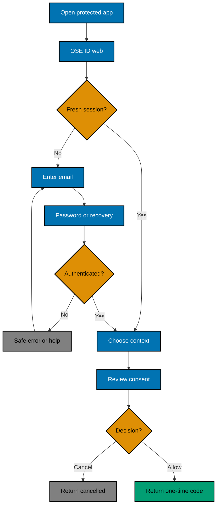
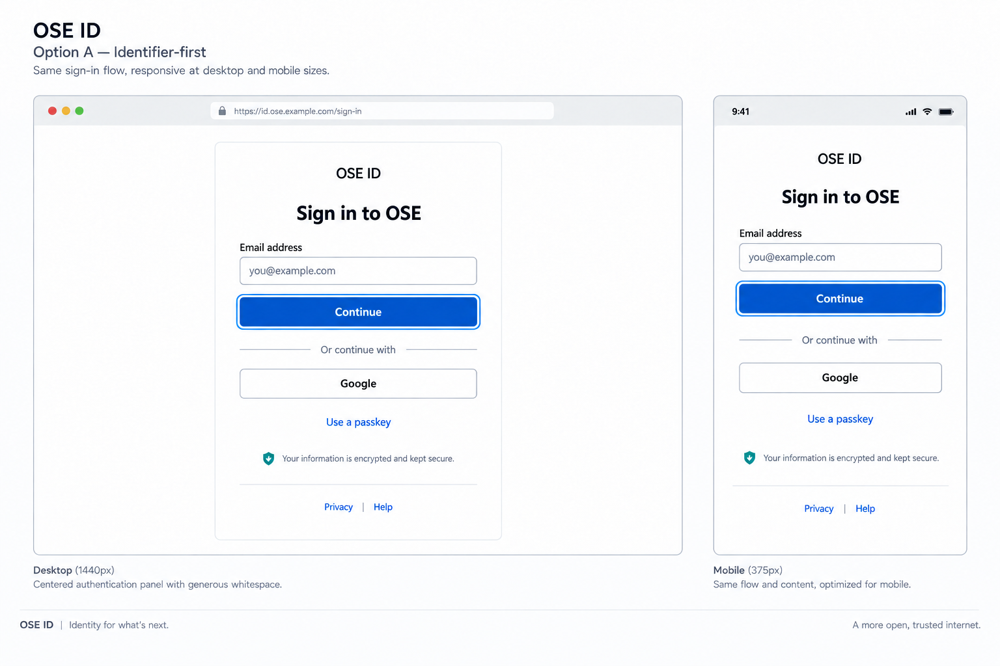
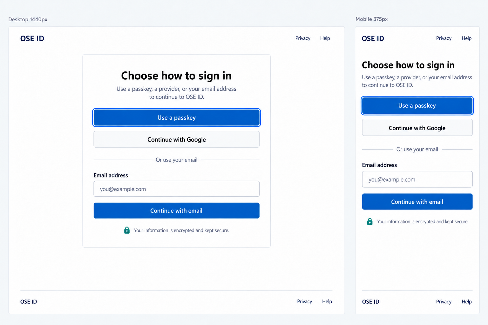
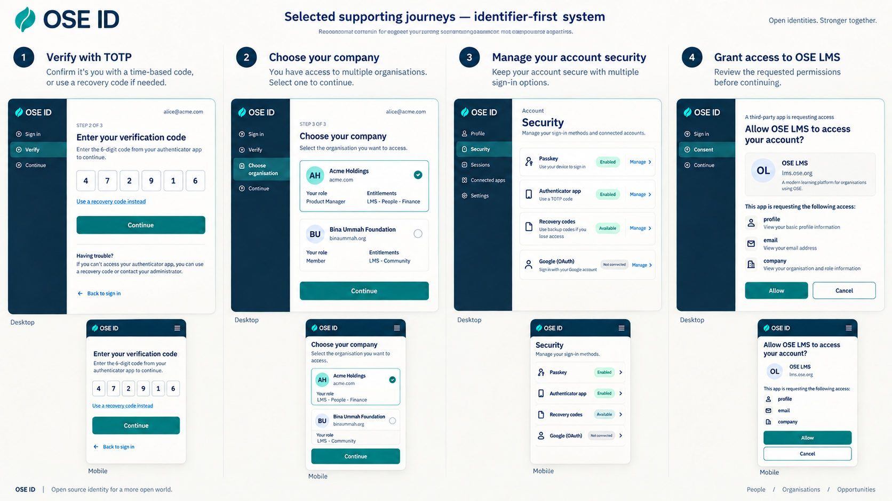
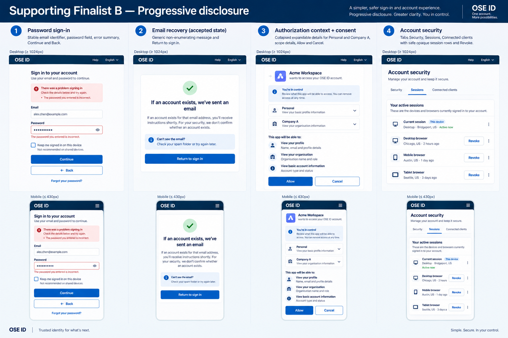

# Product Requirements — OSE ID Init 05

## Product Overview

`ose-id-web` is OSE ID's first-party Next.js UI and browser-facing BFF. It explains the requesting
client, gathers user intent, calls `ose-id-be`, and renders safe outcomes. It never validates passwords,
creates token claims, decides company eligibility, or issues tokens itself.

## Personas and Stories

- As an individual, I can sign in and authorize personal access without joining a company.
- As a company member, I can choose one eligible company and understand which product context opens.
- As a user, I can review a client's requested access and allow or cancel it.
- As a user, I can inspect current sessions/connected clients and reach email recovery/security actions.
- As a keyboard or screen-reader user, I can complete every journey without a mouse or color cues.
- As a developer, I can run web, backend, PostgreSQL, and Mailpit through one owned local stack.

## General Journey



## UI Design Funnel

### Grounding and prior art

Implementation must re-inventory `libs/web-ui`, `libs/web-ui-token/src/ose.css`, current OSE app
shells, Storybook, form/error/dialog primitives, and supported locales during Phase 0. Prefer existing
components. Expected page-level compositions are `IdentityShell`, `IdentifierForm`,
`AuthorizationContextPicker`, `ConsentSummary`, `SecurityMethodList`, and shared error/status behavior;
only proven cross-app primitives belong in `libs/web-ui`.

The alternatives are grounded in established identifier-first and method-first identity patterns and
the OSE ID series' prior-art research. They preserve password-manager/autofill support, avoid early
company discovery, and keep authentication choices understandable. The high-fidelity boards show the
longer product trajectory; this plan must remove/hide passkey and Google actions until later plans make
them functional. Facebook is absent.

Repository inspection on 2026-09-15 found reusable `Button`, `Input`, `Label`, `Card`, `Alert`,
`Dialog`, `Sheet`, `Badge`, `Textarea`, and `TabBar` components under `libs/web-ui/src/components/`, the
OSE token import at `libs/web-ui-token/src/ose.css`, and the import precedent in
`apps/ose-app-web/src/app/globals.css`. It found no shared RadioGroup, error-summary, live-region, or
identity-shell component. Those remain feature-local unless Phase 0 proves a repository-wide need. The
current OSE app shell has no reusable authentication page. Phase 0 revalidates this inventory against
the delivered predecessor before implementation.

External prior art was also checked on 2026-09-15: Microsoft Entra documents identifier-driven realm
discovery from the username entered, GOV.UK One Login exposes one place to change sign-in details, and
W3C accessible-authentication guidance calls out password-manager and paste support. The exact official
links, excerpts, and confidence labels are in
`tech-docs/004-decisions-sources-and-file-impact.md`.

### Diverge — low-fidelity alternatives

#### Option A — Identifier first

```text
Mobile and desktop centered panel
┌──────────────────────────────┐
│ OSE ID                       │
│ Sign in to <client>          │
│                              │
│ Email                        │
│ [ name@example.com         ] │
│ [ Continue                  ] │
│                              │
│ Recovery help                │
└──────────────────────────────┘
```

Email first limits the initial decision, works with password managers, and leaves room for later
home-realm logic without revealing a company list.

#### Option B — Method first

```text
Mobile stacked / desktop centered
┌──────────────────────────────┐
│ OSE ID                       │
│ Choose how to continue       │
│ [ Email and password        ]│
│                              │
│ More methods appear only     │
│ after their milestone ships  │
└──────────────────────────────┘
```

Method-first makes alternatives explicit, but with email as the only delivered method it adds a
redundant step and becomes visually noisy as providers grow.

#### Option C — Company first

```text
Mobile stacked / desktop split panel
┌──────────────────────────────┐
│ OSE ID                       │
│ Company or workspace         │
│ [ company name             ] │
│ [ Continue                  ] │
│ Use a personal account       │
└──────────────────────────────┘
```

Company-first can support enterprise home-realm discovery, but it asks for information before identity
is known, complicates companyless access, and creates discovery/privacy risk.

#### Password, verification, and recovery states

**Option P-A — Focused step pages**

```text
┌──────────────────────────────┐
│ Enter your password          │
│ [ password                 ] │
│ [ Continue ]                 │
│ Forgot password?             │
│ Error summary appears above  │
└──────────────────────────────┘
```

**Option P-B — One expanding credential card**

```text
┌──────────────────────────────┐
│ Email: person@example.test   │
│ Password [                 ] │
│ Recovery panel expands here  │
│ [ Sign in ]                  │
└──────────────────────────────┘
```

P-A is selected: a focused step gives verification, password, recovery-accepted, expired-link, and
backend-unavailable states stable headings/URLs and simpler focus restoration. P-B is denser but makes
enumeration-safe transitions and browser history harder to explain.

#### Personal/company context states

**Option C-A — Radio cards from offered contexts**

```text
┌──────────────────────────────┐
│ Continue as                  │
│ ( ) Personal                 │
│ ( ) Acme Learning Company    │
│ ( ) Example Foundation       │
│ [ Continue ] [ Cancel ]      │
└──────────────────────────────┘
```

**Option C-B — Select then summary**

```text
┌──────────────────────────────┐
│ Context [ Choose...       v] │
│ Selected details appear here │
│ [ Continue ] [ Cancel ]      │
└──────────────────────────────┘
```

C-A is selected because all eligible choices and the personal/company distinction remain visible. C-B
uses less space but hides comparison and status in a collapsed control. The no-context, one-context,
stale-context, and service-error states reuse the selected panel with a textual status and safe exit.

#### Consent states

**Option O-A — Client, context, and scopes together**

```text
┌──────────────────────────────┐
│ LMS requests access          │
│ As: Personal                 │
│ • Basic profile              │
│ • LMS access                 │
│ [ Allow ] [ Cancel ]         │
└──────────────────────────────┘
```

**Option O-B — Summary with details disclosure**

```text
┌──────────────────────────────┐
│ LMS requests access          │
│ As: Personal                 │
│ [ Show requested details ]   │
│ [ Allow ] [ Cancel ]         │
└──────────────────────────────┘
```

O-A is selected so no scope is hidden before consent. O-B is shorter but increases the chance that a
user permits undisclosed detail. Expanded-scope, expired, allow-loading, cancelled, and backend-error
states preserve the same visible scope list and stable cancel path.

#### Account security, sessions, and connected clients

**Option S-A — Grouped cards**

```text
┌──────────────────────────────┐
│ Account security             │
│ Email and password [ Manage ]│
│ Sessions           [ Review ]│
│ Connected clients  [ Review ]│
└──────────────────────────────┘
```

**Option S-B — Tabbed detail surface**

```text
┌──────────────────────────────┐
│ Security | Sessions | Clients│
│ Current tab rows and actions │
│                              │
└──────────────────────────────┘
```

S-A is selected for the security overview; dedicated session/client pages use labelled responsive
rows/cards. S-B reduces navigation depth but hides categories and creates more tab/focus state.

#### Cross-screen loading and failure treatment

**Option X-A — In-place status with stable heading** keeps the page structure, disables only duplicate
submission, and links the error summary to fields. **Option X-B — Blocking modal/status page** replaces
the page while loading or failing. X-A is selected for recoverable loading/validation/backend failures;
X-B is retained only for terminal expired/unavailable transactions that require a safe restart.

#### Funnel coverage ledger

This ledger makes the two-alternative obligation explicit for every shipped screen/state. A slash
means both named alternatives were evaluated; it is not permission to improvise a third design.

| Shipped screen or state                                       | Low-fi alternatives      | High-fi finalists                             |
| ------------------------------------------------------------- | ------------------------ | --------------------------------------------- |
| Identifier entry, unknown-email-safe continuation             | A / B                    | Identifier Finalist A / Method Finalist B     |
| Password entry, invalid password, loading                     | P-A / P-B                | Supporting Finalist A / Supporting Finalist B |
| Verification notice, recovery request/accepted, expired link  | P-A / P-B                | Supporting Finalist A / Supporting Finalist B |
| Personal-only, one-company, multi-company selection           | C-A / C-B                | Supporting Finalist A / Supporting Finalist B |
| No eligible context, stale choice, context backend error      | C-A / C-B plus X-A / X-B | Supporting Finalist A / Supporting Finalist B |
| Consent default, expanded scopes, allow loading, cancel       | O-A / O-B plus X-A / X-B | Supporting Finalist A / Supporting Finalist B |
| Expired consent and backend failure                           | O-A / O-B plus X-A / X-B | Supporting Finalist A / Supporting Finalist B |
| Account-security home                                         | S-A / S-B                | Supporting Finalist A / Supporting Finalist B |
| Sessions and connected-client list/detail/action              | S-A / S-B plus X-A / X-B | Supporting Finalist A / Supporting Finalist B |
| Recoverable validation/loading and terminal unavailable state | X-A / X-B                | Supporting Finalist A / Supporting Finalist B |

### Narrow — high-fidelity finalists

#### Finalist A — Identifier first



#### Finalist B — Method first



For password/recovery, context, consent, account-security, and terminal-state screens, the two high-fi
finalists are:

- **Supporting Finalist A — Focused panels and visible choices:** the generated supporting-journeys
  board below supplies exact hierarchy, spacing, desktop/mobile composition, and calm status treatment.
- **Supporting Finalist B — Progressive disclosure:** the second generated board uses the same OSE
  typography/tokens, expandable context/scope details, tabbed security content, inline alerts, and
  responsive stacked actions.





Supporting Finalist A wins: it exposes context/scopes, reduces hidden focus state, and makes errors and
cancel paths visible. Finalist B loses on disclosure and keyboard-state complexity.

Option C was cut because company-first contradicts personal access and can disclose or infer company
membership before authentication.

### Select — Option A, identifier first

Option A is selected. Init 05 implements only the email/password path shown by its structure. Passkey
and Google controls visible in the trajectory board are not rendered until their own milestones.

### Justify and responsive strategy

| Criterion            | Option A                                        | Option B                             | Decision                           |
| -------------------- | ----------------------------------------------- | ------------------------------------ | ---------------------------------- |
| Email-only milestone | Direct first action                             | Redundant method step                | A                                  |
| Future method growth | Adds visible alternatives later                 | Scales choices but increases density | A now; revisit if methods dominate |
| Company privacy      | Selects context after identity                  | Selects context after identity       | Tie                                |
| Mobile               | One full-width panel with 16–24 px safe padding | Stacked actions fit but grow tall    | A                                  |
| Tablet               | Bounded centered panel                          | Same, with extra choice density      | A                                  |
| Desktop              | Bounded centered panel; decoration nonessential | Bounded choice panel                 | A                                  |

Use one semantic/focus order at all breakpoints. Below `sm`, the panel uses available width and actions
stack. At `md` (768 px) and `lg` (1024 px and above), center a readable max-width panel; context cards
may use two columns only when DOM/focus order stays logical. No required information lives in decoration.

## Page and Behavior Contract

### Sign-in and recovery

- The page names OSE ID and the requesting client when the authorization transaction supplies it.
- Email fields use labels and correct autocomplete/input modes; password fields allow paste,
  password managers, reveal controls with accessible names, and Caps Lock guidance where reliable.
- Continue responses do not disclose whether an email exists. Recovery starts through the same generic
  accepted outcome and Mailpit from `ose-id-init-02-local-email-account` delivers local
  verification/reset links.
- Loading prevents duplicate submission without erasing content. Errors receive summary focus, link to
  fields, and use non-color-only text. Status messages announce without unexpected focus theft.

### Context and consent

- Personal appears only when the client accepts it and the backend reports entitlement; it never uses a
  fake company.
- Each company choice names the company and relevant entitlement. Selection uses radio semantics plus
  text/border/icon rather than color alone.
- The web posts only transaction ID, choice, and decision. It cannot synthesize a company or scope.
- Consent names client, selected context, and human-readable scopes. Allow and cancel have equal keyboard
  reachability. Cancellation preserves the prior product session and returns safely.

### BFF and browser security

- Browser JavaScript receives render-safe view models and an opaque Secure/HttpOnly/SameSite session
  cookie only. It stores no ID/access/refresh/provider/recovery token.
- Server actions/handlers validate origin/CSRF, safe return paths, session, and backend response shape.
- Sensitive routes use `Cache-Control: no-store` and an appropriate referrer policy. Analytics never
  include identifier fields, capabilities, transaction IDs, or token material.
- Shared storage makes the web process stateless; any healthy instance may continue the session.

## Acceptance Criteria

### AC-05-01 — Sign in with email

```gherkin
Scenario: A verified user signs in through OSE ID web
  Given the local client redirected a signed-out verified user to OSE ID
  When the user completes the identifier-first email and password journey
  Then OSE ID continues to context selection without revealing protocol tokens to browser storage
  And the page announces success and moves focus predictably
```

```gherkin
Scenario: Sign-in guidance does not enumerate an account
  Given two syntactically valid emails where only one is registered
  When each email starts sign-in or recovery
  Then the public page presents the same safe accepted guidance
  And neither response identifies which account exists
```

### AC-05-02 — Select authorization context

```gherkin
Scenario: A companyless user selects personal access
  Given the backend offers personal context for the requesting client
  When the user selects personal and continues
  Then the consent page names the personal context
  And no synthetic company is displayed or submitted
```

```gherkin
Scenario: A multi-company user selects one company
  Given the backend offers two eligible company contexts
  When the user chooses one company
  Then the web submits only the opaque offered choice
  And the consent page names exactly that company
```

### AC-05-03 — Allow or cancel consent

```gherkin
Scenario Outline: A user decides a consent request
  Given the consent page names the client context and requested scopes
  When the user chooses <decision>
  Then the exact registered client callback receives <result>

  Examples:
    | decision | result |
    | Allow | a one-time authorization code |
    | Cancel | a safe access-denied result |
```

### AC-05-04 — Keep protocol artifacts server-side

```gherkin
Scenario: Browser inspection finds no token material
  Given a user completed email authorization through the BFF
  When the tester inspects storage cookies URLs RSC payloads logs and analytics
  Then only an opaque protected session cookie is present in the browser
  And no access ID refresh authorization or recovery token is exposed
```

### AC-05-05 — Work accessibly across breakpoints

```gherkin
Scenario Outline: Complete authorization without visual or pointer dependence
  Given the sign-in page is shown at <width> CSS pixels
  When the user completes sign-in context and consent using only the keyboard
  Then focus labels errors and status remain understandable
  And the page has no clipped control or horizontal scrolling

  Examples:
    | width |
    | 320 |
    | 768 |
    | 1280 |
```

### AC-05-06 — Continue on another web instance

```gherkin
Scenario: The web journey survives instance replacement
  Given web instance A started an email authorization journey
  When instance A stops and instance B receives the next request
  Then the user continues without signing in again because of instance loss
  And no sticky-session routing is required
```

### AC-05-07 — Stay local-only and method-honest

```gherkin
Scenario: Only delivered sign-in methods are shown
  Given OSE ID is running in local mode
  When a signed-out person opens the sign-in page
  Then email and recovery actions are available
  And Google Facebook passkey TOTP and recovery-code actions are absent
```

### AC-05-08 — Expired web sessions remain auditable

```gherkin
Scenario: Retire an expired web session without erasing it
  Given an expired terminal web session has complete audit metadata
  When the web-session cleanup worker retires it as an identified system actor
  Then ordinary session lookup no longer returns it
  And the retained row records matching deletion and update actor and time fields
  And its handle and protected continuation cannot authorize or resume a request
  And the web runtime role cannot physically delete it
```

```gherkin
Scenario: Production mode rejects local web configuration
  Given the web is configured for production mode with a localhost backend or local session key
  When the process starts
  Then startup fails before serving a page
```

## Product Risks

- The high-fidelity boards depict future methods; tests must assert that undelivered actions are absent.
- Accessibility automation cannot prove usability alone; keyboard, zoom, focus, and screen-reader
  assertions remain manual delivery evidence.
- A UI can accidentally reimplement backend policy; contract tests must prove all choices originate
  from and are rechecked by `ose-id-be`.
