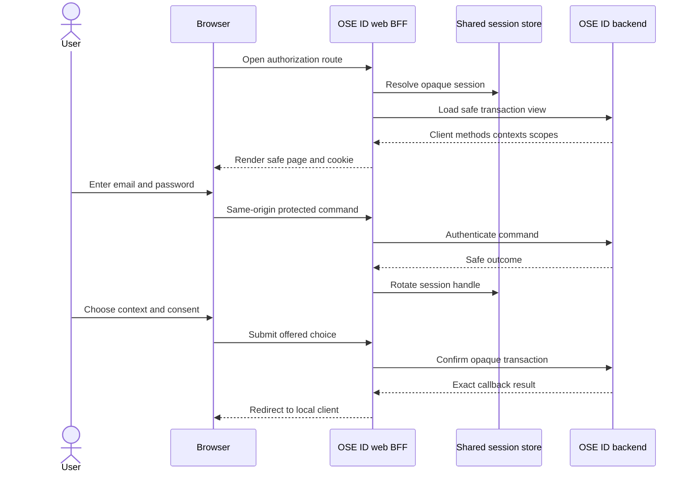

# Web and BFF Architecture

## Responsibilities

`ose-id-web` is a Next.js App Router application. Server components may load render-safe models. Server
actions or route handlers validate request intent and call `ose-id-be`. Client components handle only
interactive presentation that requires browser state. The split must never serialize backend tokens,
passwords, reset/verification capabilities, or raw authorization transactions into RSC payloads.

The BFF is useful because a browser cannot safely hold client secrets, long-lived tokens, or server-side
session state. It narrows the browser to an opaque cookie and same-origin commands while retaining the
repository's shared TypeScript UI system. A pure SPA is rejected because it increases token exposure;
backend-rendered ASP.NET pages are viable but duplicate OSE web conventions and selected assets.

## Backend Transport Boundary

The BFF consumes the versioned REST/render-safe operations delivered by `ose-id-be`; it does not define
the backend application boundary. Backend handlers map BFF requests into the same transport-neutral use
cases described by the Init 01
[hexagonal architecture](../../ose-id-init-01-foundation/tech-docs/001-system-boundaries-and-project-topology.md#one-use-case-multiple-inbound-adapters).
Consequently, BFF response models must not become Domain/Application types, and the backend must not
encode Next.js route or component concerns.

If a later plan adds GraphQL or Model Context Protocol, it adds a peer backend inbound adapter with its
own contract and security tests; it does not make the browser speak MCP, bypass the BFF session, or cause
this plan to ship speculative GraphQL/MCP packages. The BFF continues to use its authorized contract until
a consumer migration is explicitly planned.

## Route Model

Representative route groups, adjusted in Phase 0 to current repository naming:

```text
/(auth)/sign-in
/(auth)/password
/(auth)/verify-email
/(auth)/recover
/(authorize)/context
/(authorize)/consent
/(account)/security
/(account)/sessions
/(account)/connected-apps
```

Route groups are organizational, not authorization boundaries. Every server operation loads the
session, validates freshness and CSRF/origin, and lets the backend re-evaluate authority. Middleware may
redirect for usability but cannot be the only guard.

## Browser/BFF Sequence



## Session Contract

The cookie is random, opaque, host-only, `HttpOnly`, `Secure` outside explicit localhost accommodation,
and uses the narrow path/domain and SameSite policy validated for authorization redirects. Rotate it
after authentication, recovery, privilege/factor change, context switch, and suspicious reuse. Enforce
idle and absolute expiry.

The shared session record holds only references and server-required state. Store it in the dedicated
`ose_id_web.web_session` PostgreSQL table through the restricted `ose_id_web_runtime` role defined in
[the physical session contract](./007-session-persistence-and-no-loss-contract.md). Do not add Redis or
an in-memory fallback. PostgreSQL is authoritative across instances; cache loss cannot alter
authorization or require sticky routing. Phase 0 verifies this contract remains unclaimed—it does not
choose a different store. Any delivered predecessor collision stops execution for a plan amendment.

## Backend Contract Mapping

Use generated or typed contracts where repository precedent supports them. A render model contains
allowlisted client name, instructions, method availability, eligible context labels/opaque values,
scope descriptions, consent status, error/status code, and expiry. Never forward arbitrary backend JSON
to client components.

Commands contain an opaque session/transaction reference plus the minimum entered value or offered
choice. Backend problem codes map to stable non-disclosing content. Unexpected codes fail closed and
emit a correlation ID safe for support, not raw exception or user data.

## Safe Return and Error Handling

The authorization transaction owns the exact client callback. Generic `returnTo` query values are not
trusted. Account routes accept only same-origin allowlisted destinations and normalize them before use.
Errors must not redirect to attacker origins or reflect secrets/identifiers.

If the backend is unavailable, render a retryable service-unavailable page that preserves no password
and creates no local fallback identity. If shared session state is unavailable, fail closed and explain
that the flow must restart. Do not continue with cached entitlement or company authority.

## Security Headers and Observability

Sensitive responses use no-store caching, restrictive referrer policy, content security policy aligned
with actual local assets, frame protection, MIME protections, and permissions policy. Logs use structured
reason codes and synthetic correlation IDs. They exclude email field values, passwords, cookies,
transactions, codes, tokens, scope-bearing URLs, and recovery links. Metrics count outcomes without
high-cardinality person/client/company labels.
