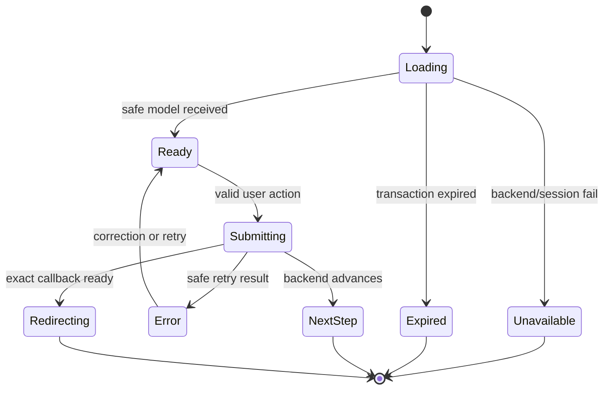

# User Experience and Accessibility

## Selected Experience

Use the PRD's Option A identifier-first direction. The first page contains brand, requesting-client
context when available, email, Continue, and safe recovery/help. It does not show disabled or
coming-soon controls. The high-fidelity boards guide spacing, hierarchy, and future trajectory; they are
not exact copy or permission to ship Google/passkey controls early.

## Component Boundaries

Expected page-level compositions:

- `IdentityShell`: landmark, H1, client context, bounded responsive panel, support link;
- `IdentifierForm` and `PasswordForm`: labels, autocomplete, validation, loading, reveal action;
- `VerificationNotice` and `RecoveryRequestForm`: generic state and the Mailpit-local workflow delivered
  by `ose-id-init-02-local-email-account`;
- `AuthorizationContextPicker`: personal/company radio-group choices from backend only;
- `ConsentSummary`: client, context, human-readable scopes, equal allow/cancel paths;
- `SecurityMethodList`: email/password and existing session/connected-client facts only;
- `AuthErrorSummary` and `LiveStatus`: linked validation and nonintrusive announcements.

These are feature-level components unless reuse across apps is proven. Do not create a shared primitive
that merely hides one page's domain state. Existing `libs/web-ui` controls, dialogs, typography, focus,
and tokens take priority.

## Page State Model

Duplicate submission is disabled while the command is pending, but cancel remains available where
safe. A network retry must not duplicate consent or password/recovery actions; idempotency belongs to
the backend transaction.

## Accessibility Contract

- One descriptive H1 and semantic landmark structure per page.
- Programmatic labels, instructions before input, correct autocomplete/input modes, and paste/password
  manager support. Do not impose cognitive tests.
- Keyboard operation with visible focus, logical DOM order, and predictable focus after navigation,
  error, dialog close, and status change.
- Error summary receives focus after failed submission and links to invalid fields. Live regions announce
  progress/outcomes without repeatedly interrupting the user.
- State never relies on color. Selected context uses text, radio semantics, border/icon, and accessible
  name. Consent scopes are a semantic list.
- At 200% zoom and text-spacing overrides, controls remain operable without overlap or loss.
- Session and connected-client lists have headings/captions and become labelled cards on narrow screens.
- Timeouts explain consequences and allow extension where policy permits.

Meet WCAG 2.2 AA and the repository's stricter component conventions. Automated axe checks supplement
manual keyboard, zoom, focus, and screen-reader inspection.

## Responsive Behavior

At 320 px, use full available width with safe padding and stacked actions. At 768 px, center a bounded
panel; context choices may form two columns only if each card remains readable and DOM order is linear.
At 1280 px, keep the readable panel rather than stretching fields. Decorative space cannot carry client,
context, recovery, consent, or error information. No core journey has horizontal scrolling.

## Content and Privacy

Use plain action language: “Continue,” “Use this company,” “Allow,” and “Cancel.” Explain personal
versus company context without internal terms. Never say whether an email exists, identify another
company membership, expose provider/credential metadata, or display raw transaction/subject IDs.

Account security names only actions supported now. It may show password status, verified email status,
current sessions, and connected OSE clients if the backend contract exists. Passkey, MFA, Google, and
Facebook sections are absent—not disabled, previewed, or marked coming soon.

## Localization

Phase 0 discovers the app's locale contract. If OSE ID is multi-locale, every string uses the existing
i18n mechanism and every supported locale is tested at each breakpoint. If it is explicitly English-only
for this milestone, record that contract and do not invent a partial Indonesian path. Error/status IDs
remain stable across translations.
