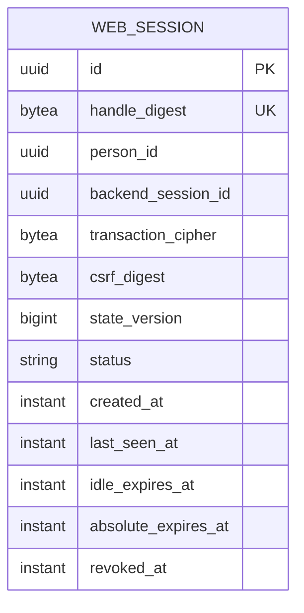

# Session Persistence and No-Loss Contract

## Decision

`ose-id-web` uses PostgreSQL as its only authoritative session store. Every web process remains
disposable: it holds connection pools but no authoritative session, CSRF, continuation, or
authorization state in process memory or local files. Redis, encrypted self-contained session cookies,
and instance-local stores are not fallback paths. A failed store lookup fails closed and asks the user
to restart safely.

The database schema is `ose_id_web`; the table is `web_session`; the runtime role is
`ose_id_web_runtime`. These names are contractual unless Phase 0 finds a repository naming collision,
in which case execution stops and records an amendment before RED. The role connects through the
local-only secret mechanism established by the foundation plan; no real value enters Git.

## Physical Schema



The repository-owned TypeScript migration runner executes immutable numbered SQL files through `pg`
under one PostgreSQL advisory lock and transaction, then records the filename plus SHA-256 checksum in
`ose_id_web.schema_migrations`. Its exact Nx entry point is
`rtk ./hippo run --class transactional --disk-path . -- npm exec nx -- run ose-id-web:migrate:local`.
It runs with the migration role before readiness; the web runtime never applies DDL. A checksum mismatch,
duplicate version with different bytes, lock failure, or partial application fails closed.

The migration expresses the closed shapes below; no field, check, uniqueness rule, or grant may be weakened.

```sql
CREATE SCHEMA ose_id_web;

CREATE TABLE ose_id_web.schema_migrations (
  version varchar(150) PRIMARY KEY,
  checksum_sha256 char(64) NOT NULL UNIQUE,
  created_at timestamptz NOT NULL DEFAULT CURRENT_TIMESTAMP,
  created_by varchar(255) NOT NULL DEFAULT 'system',
  updated_at timestamptz NOT NULL DEFAULT CURRENT_TIMESTAMP,
  updated_by varchar(255) NOT NULL DEFAULT 'system',
  deleted_at timestamptz NULL,
  deleted_by varchar(255) NULL,
  CONSTRAINT schema_migrations_soft_delete_pair CHECK ((deleted_at IS NULL) = (deleted_by IS NULL)),
  CONSTRAINT schema_migrations_update_time CHECK (updated_at >= created_at),
  CONSTRAINT schema_migrations_delete_time CHECK (
    deleted_at IS NULL
    OR deleted_at >= created_at
  )
);

CREATE TABLE ose_id_web.web_session (
  id uuid PRIMARY KEY,
  handle_digest bytea NOT NULL UNIQUE,
  person_id uuid NOT NULL,
  backend_session_id uuid NOT NULL,
  transaction_cipher bytea NULL,
  csrf_digest bytea NOT NULL,
  state_version bigint NOT NULL DEFAULT 0 CHECK (state_version >= 0),
  status varchar(16) NOT NULL DEFAULT 'active' CHECK (status IN ('active', 'revoked', 'expired')),
  created_at timestamptz NOT NULL DEFAULT CURRENT_TIMESTAMP,
  created_by varchar(255) NOT NULL DEFAULT 'system',
  updated_at timestamptz NOT NULL DEFAULT CURRENT_TIMESTAMP,
  updated_by varchar(255) NOT NULL DEFAULT 'system',
  deleted_at timestamptz NULL,
  deleted_by varchar(255) NULL,
  last_seen_at timestamptz NOT NULL,
  idle_expires_at timestamptz NOT NULL,
  absolute_expires_at timestamptz NOT NULL,
  revoked_at timestamptz NULL,
  CONSTRAINT web_session_time_order CHECK (
    created_at <= last_seen_at
    AND last_seen_at <= idle_expires_at
    AND idle_expires_at <= absolute_expires_at
  ),
  CONSTRAINT web_session_terminal_time CHECK (
    (
      status = 'active'
      AND revoked_at IS NULL
    )
    OR (
      status <> 'active'
      AND revoked_at IS NOT NULL
    )
  ),
  CONSTRAINT web_session_soft_delete_pair CHECK ((deleted_at IS NULL) = (deleted_by IS NULL)),
  CONSTRAINT web_session_update_time CHECK (updated_at >= created_at),
  CONSTRAINT web_session_delete_time CHECK (
    deleted_at IS NULL
    OR deleted_at >= created_at
  )
);
```

Global uniqueness of migration version/checksum and `handle_digest` prevents reuse after soft delete.
The migration installs `trg_schema_migrations_reject_hard_delete` and
`trg_web_session_reject_hard_delete` as `BEFORE DELETE` guards and applies the inherited
[audit/soft-delete profile](../../../in-progress/ose-id-init-01-foundation/tech-docs/007-database-audit-and-soft-delete-contract.md).
Every request/worker mutation supplies a safe actor; the `system` default is migration/bootstrap only.

The cookie contains a random 256-bit handle. Only its keyed digest is stored. `transaction_cipher`
uses authenticated envelope encryption because the authorization transaction is a lookup capability;
keys come from the local secret provider, never the database or source. The table stores no password,
email, provider subject/token, authorization code, client secret, PKCE verifier, access token, ID token,
or recovery/verification capability.

## Runtime Authority

- `ose_id_web_runtime` receives `USAGE` on `ose_id_web`, active-row `SELECT` on `schema_migrations`, and
  only `SELECT`, `INSERT`, and `UPDATE` on `web_session`; it cannot `DELETE`, create/alter/drop schema objects, read identity tables, bypass
  RLS, or assume the migration role.
- The migration role alone creates the schema/table/indexes and grants the minimum privileges. Startup
  never performs DDL.
- Every lookup uses `handle_digest`, requires `deleted_at IS NULL`, checks `status`, both expiry instants, and backend-session validity,
  then conditionally advances `last_seen_at`/`state_version`. It never trusts cookie fields as identity.
- Cleanup soft-deletes only terminal/expired rows older than the configured retention window, stamps all
  update/delete actor/time fields, and nulls `transaction_cipher`/`csrf_digest` in the same transaction;
  request paths do not depend on cleanup completing. Physical deletion remains blocked after retention.

## Rotation, Concurrency, and Instance Handoff

Authentication, recovery, privilege/factor change, context switch, and suspicious reuse rotate in one
database transaction: insert the new row, mark the old row terminal with a compare-and-swap on
`state_version`, then commit before returning the cookie. Exactly one concurrent rotation wins. A loser
reloads the terminal state and returns the stable restart/session-changed response; it never revives the
old handle or creates two usable successors.

Instance A may create/rotate a session and instance B must immediately resolve the committed digest,
CSRF proof, context continuation, and expiry without affinity or replication delay. A process crash
before commit exposes no successor; a crash after commit leaves one usable successor and a terminal old
row. No request acknowledges success before commit.

## Migration, Compatibility, Rollback, and No-Loss Proof

The migration is additive and runs before any route is enabled. Readiness reports schema incompatibility
until the exact table/check/grants exist. The temporary local/test-only web feature remains disabled
during migration and both enabled/disabled paths are tested.

Rollback disables web routes first, waits for in-flight handlers to drain, and reverts application code
without dropping or rewriting `web_session`. Forward repair may add nullable fields/indexes and backfill
under an explicit invariant; it may not reinterpret a digest/ciphertext/status. Destructive down-
migration is forbidden in this delivery. The eventual schema-removal plan must prove every row terminal
and beyond retention before drop.

No-loss verification uses synthetic sessions only:

```gherkin
Feature: OSE ID web session persistence
  Rule: Disposable web instances share one authoritative session state

    Scenario: Another web instance resumes a committed session
      Given web instance A committed an active opaque session in PostgreSQL
      When the next request reaches web instance B without affinity
      Then instance B resolves the same person and safe continuation
      And no browser-visible protocol artifact or process-local state is required

    Scenario: Concurrent session rotation has one usable successor
      Given two web instances load the same active session version
      When both rotate the session concurrently
      Then exactly one successor handle becomes active
      And the predecessor and losing successor are unusable

    Scenario: Rollback preserves session records
      Given session rows exist after the web feature was enabled locally
      When the web code is rolled back and the feature is disabled
      Then the session table and encrypted records remain unchanged
      And no older code treats them as another schema or credential type
```

Unit proof covers migration ordering/checksum/locking plus state/expiry/rotation/audit-actor decisions and
active-row query snapshots with injected ports. Integration proof applies the real migration twice, both
tables' six columns, constraints, guards, and no-`DELETE`
role grants to isolated PostgreSQL; it proves a soft-delete succeeds, a real delete fails, and races
conditional updates. E2E proof routes a
browser from instance A to B, kills A after commit, and observes continuity without sticky routing.
There is no higher-layer exemption.
