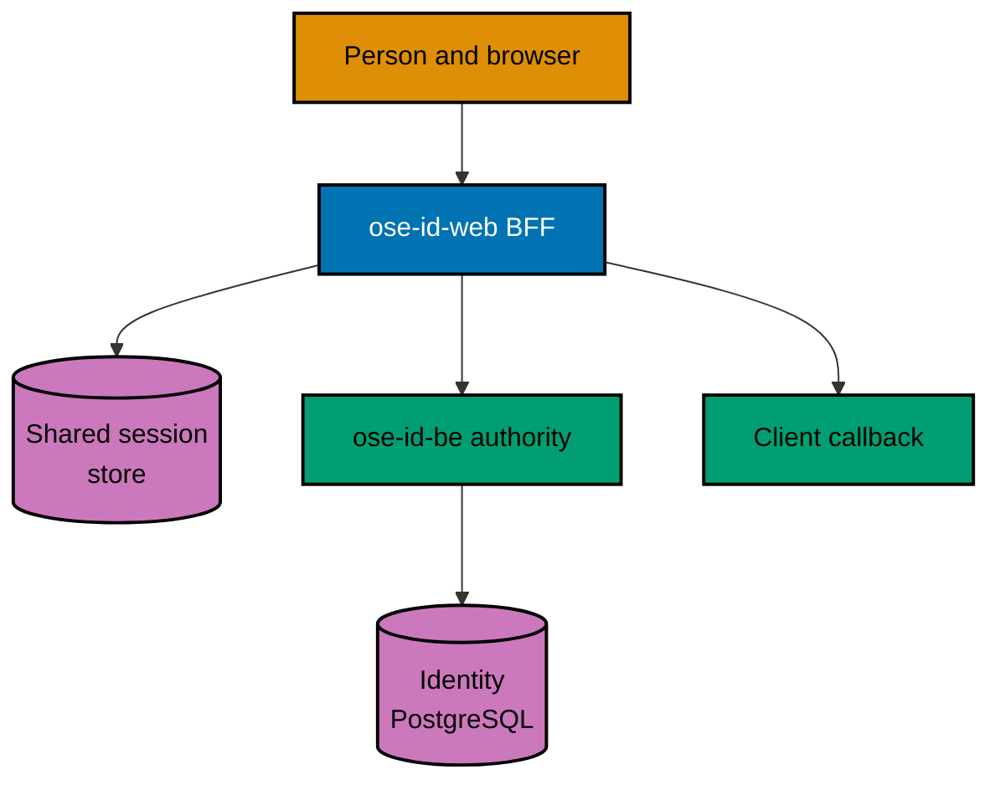

# Technical Design — OSE ID Init 05

## Document Map

1. [Web and BFF architecture](001-web-and-bff-architecture.md) — process boundaries, routes, contracts,
   opaque sessions, statelessness, and failure behavior.
2. [User experience and accessibility](002-user-experience-and-accessibility.md) — selected page model,
   responsive behavior, content, focus, components, context, consent, and account security.
3. [Local verification and security](003-local-verification-and-security.md) — test layers, local stack,
   browser leak checks, multi-instance proof, startup guards, and recovery.
4. [Decisions, sources, and file impact](004-decisions-sources-and-file-impact.md) — tradeoffs, licensing,
   deployment dependency, revisit triggers, and exact affected files.
5. [BDD spec delta and adapter map](005-bdd-spec-delta-and-adapter-map.md) — copy-ready web behavior,
   exact spec targets, and Unit/Integration/E2E obligations.
6. [API and protocol contract delta](006-api-contract-delta.md) — per-operation browser/
   BFF request/render/error packets, inherited OIDC compatibility, code generation, and proof.
7. [Session persistence and no-loss contract](007-session-persistence-and-no-loss-contract.md) — exact
   PostgreSQL schema, runtime role, rotation/concurrency, migration, rollback, and instance-handoff proof.

## Architecture

## Invariants

The inherited backend remains ASP.NET Core 10 / C# 14 with ASP.NET Core Identity primitives,
query-builder-first SqlKata/Npgsql persistence, custom OpenIddict stores, and PostgreSQL. This plan
adds a Next.js App Router BFF/UI on the repository-pinned
TypeScript/React stack; identity and authorization policy do not move into JavaScript.

- The backend owns identity, authorization transaction, eligible context, entitlement, consent, and code.
- The browser owns only user interaction and an opaque protected session cookie.
- The BFF owns CSRF/origin checks, safe-return handling, backend calls, view-model mapping, and token
  exchange needed by its own OSE ID web session; it does not mint claims.
- No inactive Google, Facebook, passkey, or MFA control appears in this milestone.
- Web processes are stateless; no request depends on local disk, mutable process memory, or affinity.
- Local/test mode is explicit. Production fails before listen until a future deploy plan, blocked at
  minimum on `private-sibling/plans/backlog/start-infra-04-deploy-tencent-lighthouse-k3s-cluster` and its
  then-current platform handoff gates.
- OSE-authored source/docs inherit the root MIT license; dependencies keep their own licenses.
- At least 99% Unit line coverage is required for authored production code, with only canonical
  repository exclusions. Every Gherkin scenario maps to Unit and
  applicable Integration/E2E adapters; each higher-layer exemption is explicit per scenario/adapter,
  boundary-justified, indexed in behavior coverage, and statically validated.
