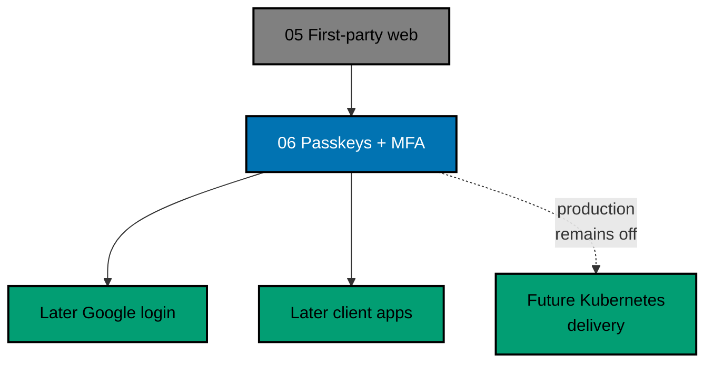

# OSE ID Init 06 — Passkeys and MFA

> **Status:** Backlog — execute only after `ose-id-init-05-first-party-web` is complete and this plan's
> pure promotion move has landed on `origin/main`.

Add phishing-resistant passkeys and optional TOTP multi-factor authentication with one-time recovery
codes to the local OSE ID backend and first-party web. This milestone extends the existing email journey
and account-security UI; it does not add a social provider or change the OIDC/client contract except for
truthful authentication-method/freshness claims.

## Scope

- Register, name, list, use, and safely remove multiple passkeys for an authenticated person.
- Passkey sign-in from the identifier-first UI with an accessible email/password fallback.
- Enroll, confirm, challenge, disable, and reset TOTP after recent authentication.
- Generate, display/download once, hash, consume once, and regenerate recovery codes.
- Protect the last usable sign-in/recovery path and revoke/rotate affected sessions after security changes.
- Record truthful `amr`, authentication time/freshness, and step-up result for OIDC policy.
- Local origin/RP configuration, deterministic browser/backend tests, and no-affinity multi-instance proof.
- Local-run-only delivery; production startup rejects localhost/test authenticator configuration.
- OSE ID source/docs inherit the repository MIT license; dependencies retain their own licenses.
- Production deployment waits at minimum for
  `private-sibling/plans/backlog/start-infra-04-deploy-tencent-lighthouse-k3s-cluster` and the then-current
  platform handoff gates.

## Non-Goals

- Google or another provider; Google arrives in a later provider-specific plan. Facebook is excluded.
- SMS, email OTP as MFA, security questions, biometrics stored by OSE ID, device attestation inventory,
  passwordless-only mandates, or account-recovery override by a platform operator.
- Production deployment, WebAuthn production RP/domain ceremony, hardware-key procurement, or operations.
- Company administration, LMS implementation, or product-domain roles.

## Dependency and Result

## Navigation

- [Business requirements](brd.md)
- [Product requirements and acceptance criteria](prd.md)
- [Technical design](tech-docs/README.md)
- [Delivery checklist](delivery.md)
- [Execution learnings](learnings.md)

## Related Milestones

- Immediate predecessor: `ose-id-init-05-first-party-web`; Phase 0 resolves its archived path.
- Protocol predecessor: `ose-id-init-04-oidc-oauth-provider`; Phase 0 resolves its archived path.
