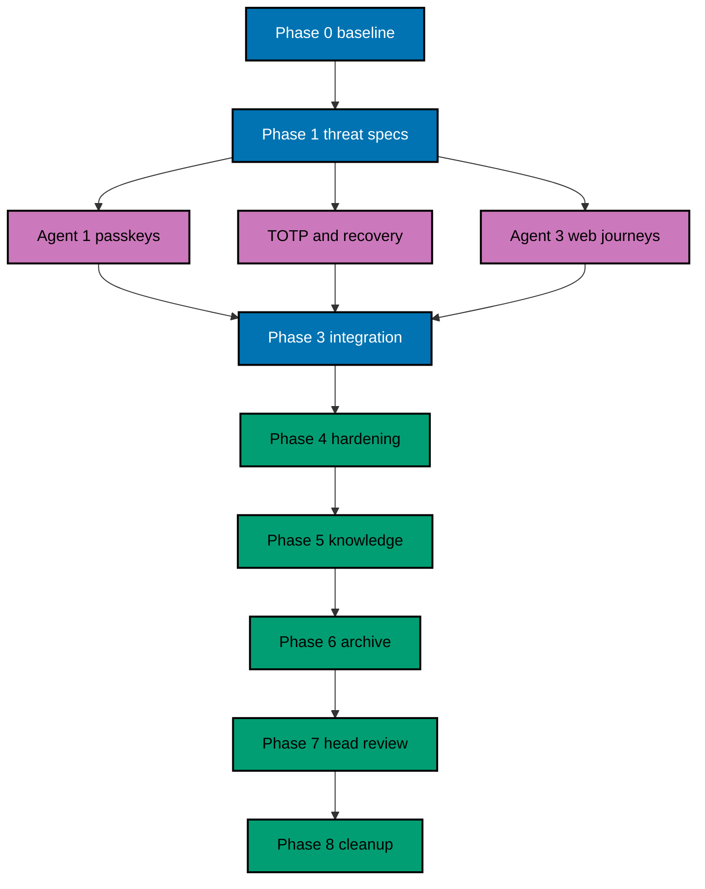

# Delivery Plan — OSE ID Init 06

> **Legend** — `[AI]`: an agent performs the step (the default; unmarked steps are `[AI]`).
> `[HUMAN]`: only a human can do it. `[AI+HUMAN]`: an agent prepares and a human performs the
> privileged or real-credential action.

## Delivery Mode

**Mode:** `worktree-to-pr`. One delivery unit/branch/PR completes backend and web passkey, TOTP,
recovery, and session/claim consequences. A temporary local/test-only gate keeps partial factor routes
unreachable until final proof; production remains fail-closed. Deployment is not authorized.

## Delivery Unit

| Delivery unit                  | Included phases | Safe `main` state                                                                    | Explicitly excluded                                       |
| ------------------------------ | --------------- | ------------------------------------------------------------------------------------ | --------------------------------------------------------- |
| DU-06 — Local passkeys and MFA | 0–8             | Complete passkey/TOTP/recovery behavior with email fallback; production fails closed | Google/Facebook, SMS, company admin, LMS code, deployment |

No phase or agent lane is merged independently. Any required split first amends the plan into new
delivery units; every resulting `main` state must build, keep incomplete factor routes inert behind the
temporary local/test gate, and preserve email fallback plus production fail-closed behavior.

Backend factors, web journeys, recovery, session/claim effects, migrations, specs, evidence, and in-PR
archival land together because partial factor enrollment or recovery is unsafe.

## Worktree

- **Execution worktree:** `worktrees/ose-id-init-06-passkeys-and-mfa/`
- **Provisioning status:** pending until Phase 0.
- **Authoring exception:** this plan was authored in the user-required `ose-id` worktree while the
  numbered plan family was unlanded. Omit execution identity and branch inventory until Phase 0.
- **Worktree cap:** use exactly one worktree for all repository phases.

## Lifecycle Prerequisite

Phase 0 resolves the predecessor's archived path and proves `ose-id-init-05-first-party-web` is complete
on current `origin/main`, including secure BFF, account-security shell, locales, and UI contracts. This
plan's pure backlog→in-progress promotion must be on `origin/main` before execution. Production
deployment remains outside scope and blocked at minimum on
`ose-private/plans/backlog/start-infra-04-deploy-tencent-lighthouse-k3s-cluster` plus then-current
platform handoff gates; this plan does not edit `ose-private`.

## Parallelization Model

### Delivery Boundaries

| Unit  | Change phases | Worktree and branch                                                                                                             | Delivery opportunity                                                               | Cohesive seam                                                                                                                                         | Resulting `main`, rollback, and flag evidence                                                                                                                                                                                                                                                                                                                                                                                         |
| ----- | ------------- | ------------------------------------------------------------------------------------------------------------------------------- | ---------------------------------------------------------------------------------- | ----------------------------------------------------------------------------------------------------------------------------------------------------- | ------------------------------------------------------------------------------------------------------------------------------------------------------------------------------------------------------------------------------------------------------------------------------------------------------------------------------------------------------------------------------------------------------------------------------------- |
| DU-06 | 0–8           | `worktrees/ose-id-init-06-passkeys-and-mfa/`; observed Phase-0 execution branch based on `ose-id-init-06-passkeys-and-mfa-base` | One PR after Phase 8 only; factors, recovery, UI, and policy never ship separately | Passkey registration/authentication, TOTP enrollment/challenge, recovery codes, fallback/recent-auth policy, session effects, UI, specs, and evidence | `main` has complete local factor lifecycle with email fallback and production fail-closed. Rollback disables unfinished factor entry points, preserves already-created credential/recovery records for safe removal or later reuse, and never weakens the last-authentication-path rule. Evidence covers enabled/disabled flags, cross-instance challenge state, replay, recovery, and final removal of temporary reachability flags. |

An agent may not widen its ownership to another lane implicitly. Every lane converges before merge.

### Agent Topology

N=3 execution agents plus one root coordinator. After Phase 1 freezes contracts, Agent 1 owns passkey
backend/storage, Agent 2 owns TOTP/recovery backend/storage, and Agent 3 owns web UI/E2E scaffolding.
The coordinator owns shared session/auth-evidence policies, migrations, file ledger, and integration.



Agents must preserve concurrent edits and stop on ledger collisions. No agent may weaken RP/origin,
challenge, recent-auth, replay, last-path, or secret-handling rules to simplify tests.

## Execution Packet Defaults

Every checkbox inherits the phase-local packet below unless it states a stricter owner, path, command,
or evidence destination. A checkbox is incomplete until its evidence records the exact command, exit
code, observed result, and changed paths. A path discovered during Phase 0 must be written to
`plans/in-progress/ose-id-init-06-passkeys-and-mfa/evidence/phase-0-path-inventory.md` before later work uses it. On any mismatch, preserve sanitized
output, stop the phase gate, fix the root cause without weakening tests or contracts, rerun the same
command, and append the disposition to that phase's evidence.

| Phase | Owner                                          | Authorized path or bounded pattern                                                                                                                                     | Copyable verification command                                                                                                                                                                             | Observable result and evidence                                                                                                                                            |
| ----- | ---------------------------------------------- | ---------------------------------------------------------------------------------------------------------------------------------------------------------------------- | --------------------------------------------------------------------------------------------------------------------------------------------------------------------------------------------------------- | ------------------------------------------------------------------------------------------------------------------------------------------------------------------------- |
| 0     | Root coordinator                               | repository inventory, predecessor artifacts, and execution worktree only                                                                                               | Run the Phase 0 predecessor-green baseline commands from this section.                                                                                                                                    | Exit `0`; baseline and resolved paths in `plans/in-progress/ose-id-init-06-passkeys-and-mfa/evidence/phase-0-baseline.md`                                                 |
| 1     | Root coordinator                               | `specs/apps/ose/id-be/**`, `specs/apps/ose/id-web/**`, all four OSE ID `behaviour-coverage.json` files, this plan's numbered tech docs, and authenticator UI contracts | Green predecessor baseline, then `rtk ./hippo run --class transactional --disk-path . -- npm exec nx -- run-many -t test:coverage:behaviour --projects=ose-id-be,ose-id-be-e2e,ose-id-web,ose-id-web-e2e` | Only recorded missing Plan 06 bindings may be RED; all other mapping checks exit `0` in `plans/in-progress/ose-id-init-06-passkeys-and-mfa/evidence/phase-1-contracts.md` |
| 2     | Agents 1–3 within frozen ownership             | `apps/ose-id-be/**`, `apps/ose-id-web/**`, their E2E projects, and resolved migrations                                                                                 | `rtk ./hippo run --class transactional --disk-path . -- npm exec nx -- run-many -t test:unit,test:integration -p ose-id-be ose-id-web`                                                                    | Exit `0`; ordered RED/GREEN/REFACTOR trace in `plans/in-progress/ose-id-init-06-passkeys-and-mfa/evidence/phase-2-authenticators.md`                                      |
| 3     | Root coordinator after lane convergence        | same backend/web/E2E paths plus canonical specs                                                                                                                        | `rtk ./hippo run --class transactional --disk-path . -- npm exec nx -- run ose-id-web-e2e:test:e2e`                                                                                                       | Exit `0`; virtual-authenticator, API, replay, and step-up evidence in `plans/in-progress/ose-id-init-06-passkeys-and-mfa/evidence/phase-3-journeys.md`                    |
| 4     | Root coordinator and named quality-gate agents | frozen delivery ledger only                                                                                                                                            | `rtk ./hippo run --class transactional --disk-path . -- npm run check:pre-push`                                                                                                                           | Exit `0`; API, UI, accessibility, usability, and security reports in `plans/in-progress/ose-id-init-06-passkeys-and-mfa/evidence/phase-4-quality-gates.md`                |
| 5     | Root coordinator                               | this plan's `learnings.md` and bounded durable-doc destinations                                                                                                        | `rtk ./hippo run --class transactional --disk-path . -- npm exec markdownlint-cli2 -- plans/in-progress/ose-id-init-06-passkeys-and-mfa/learnings.md`                                                     | Exit `0`; promoted/deferred knowledge in `plans/in-progress/ose-id-init-06-passkeys-and-mfa/evidence/phase-5-knowledge.md`                                                |
| 6     | Root coordinator                               | this plan directory and annotated plan indexes                                                                                                                         | `rtk ./hippo run --class transactional --disk-path . -- npm run check:pre-push`                                                                                                                           | Exit `0`; archive/index validation in `plans/in-progress/ose-id-init-06-passkeys-and-mfa/evidence/phase-6-archive.md`                                                     |
| 7     | Root coordinator and review agents             | current-head diff only                                                                                                                                                 | `rtk ./hippo run --class transactional --disk-path . -- npm run check:pre-push`                                                                                                                           | Exit `0`; current-head/base and review dispositions in `plans/in-progress/ose-id-init-06-passkeys-and-mfa/evidence/phase-7-head-review.md`                                |
| 8     | Root coordinator                               | execution worktree metadata only                                                                                                                                       | `rtk git -C worktrees/ose-id-init-06-passkeys-and-mfa status --short`                                                                                                                                     | Empty output after merge; cleanup record in `plans/in-progress/ose-id-init-06-passkeys-and-mfa/evidence/phase-8-cleanup.md`                                               |

### PostgreSQL Persistence Contract

Every credential, authenticator, challenge, TOTP, recovery, recent-auth, audit, and session row
written by this plan uses Npgsql connections/transactions through SqlKata's PostgreSQL compiler and
`SqlKata.Execution`. Repositories require explicit projections, bound parameters, cancellation,
bounded command timeouts, and explicit transactions for challenge consumption and every multi-write
invariant; production runtime paths forbid EF change tracking, LINQ-to-database, and `SELECT *`. EF
Core otherwise stays migration tooling; the inherited custom OpenIddict stores remain the only runtime
protocol persistence path. ASP.NET Core Identity supplies supported hashing, validation,
TOTP, and related cryptographic primitives only—not Identity EF stores or `UserManager`
persistence. Phase 2–3 gates run backend Unit/Integration and built-process E2E through HIPPO and
store compiled-SQL snapshots/contracts, redacted parameter shapes, catalog/index rows,
synthetic-fixture `EXPLAIN` plans, query counts, and bounded row counts under
`plans/in-progress/ose-id-init-06-passkeys-and-mfa/evidence/phase-{2,3}-persistence/`; `EXPLAIN ANALYZE` is permitted only for isolated safe synthetic
fixtures. Any interpolation, missing timeout/cancellation/transaction, table-wide projection,
unbounded/N+1 plan, Identity persistence, EF runtime query, or custom-store audit/soft-delete drift
reopens its owning TDD packet.

### Mandatory Nx Quality Matrix

The full green matrix below is mandatory as the completion gate of the first implementation phase
(Phase 2) and for every later implementation, final local-quality, exact-head delivery/PR, and
post-merge gate. It is not a Phase 0 or Phase 1 success criterion. Before creating any Plan 06
scenario, binding, or test, Phase 0 and Phase 1 each run this exact predecessor-green baseline:

```bash
rtk ./hippo run --class transactional --disk-path . -- npm exec nx -- run-many -t build --projects=ose-id-be,ose-id-web
rtk ./hippo run --class transactional --disk-path . -- npm exec nx -- run-many -t typecheck,lint,test:quick --projects=ose-id-be,ose-id-be-e2e,ose-id-web,ose-id-web-e2e
```

Then run the static predecessor behavior baseline:

```bash
rtk ./hippo run --class transactional --disk-path . -- npm exec nx -- run-many -t test:coverage:behaviour --projects=ose-id-be,ose-id-be-e2e,ose-id-web,ose-id-web-e2e
```

Phase 0 proves every named target is real, not echo, no-op, a success sentinel, or a duplicate alias.
The C# backend requires `<Nullable>enable</Nullable>`; its Nx `typecheck` runs the .NET compiler with
`/p:TreatWarningsAsErrors=true`, while Nx `lint` runs Roslyn analyzer verification plus
`dotnet format --verify-no-changes`.
The Next.js owner uses strict TypeScript, `tsc --noEmit`, and ESLint. Both TypeScript E2E projects
use no-emit typechecks and their real repository-standard lint targets, but omit `build` because
they produce no deployable artifacts. Each Phase 2-and-later matrix gate writes both command transcripts
and the inspected target/configuration proof to its phase evidence file under the key `nx-quality`; any
failure reopens that gate and blocks progression. Phase 1 records the green predecessor baseline first,
then runs only its explicitly named static-coverage and RED commands. A nonzero result is nonblocking
only when its recorded RED ledger names the missing Plan 06 behavior; any baseline,
target/configuration, or unrelated failure blocks Phase 2.

## Phase 0: Environment, Inventory, and Baseline

**Input:** complete Init 05, promoted plan, current repository instructions, clean `origin/main`.

**Outcome:** one initialized worktree, exact API/browser/UI/data inventory, and green predecessor baseline.

**Proof:** Phase 0 creates execution identity/branch inventory and captures sanitized research/baseline
evidence under `plans/in-progress/ose-id-init-06-passkeys-and-mfa/evidence/phase-0-*`.

- [ ] [AI] Fetch, provision, and enter `worktrees/ose-id-init-06-passkeys-and-mfa/` from current
      `origin/main` by running `rtk git fetch origin main` then
      `rtk git worktree add -b ose-id-init-06-passkeys-and-mfa-base worktrees/ose-id-init-06-passkeys-and-mfa origin/main`;
      if the branch exists, use
      `rtk git worktree add worktrees/ose-id-init-06-passkeys-and-mfa ose-id-init-06-passkeys-and-mfa-base`.
      On failure run `rtk git worktree prune` and retry once; a second failure preserves all artifacts
      and stops for diagnosis rather than provisioning another worktree. Then
      verify with `rtk git -C worktrees/ose-id-init-06-passkeys-and-mfa status --short`; create the branch
      inventory with path, branch, base/head, dirty-state classification,
      PR field, delivery status, cleanup status, and disposition field.
- [ ] [AI] Read root/nested instructions, RTK, resolved Init 05 as-built plan/docs, C#/TypeScript/UI/E2E/
      accessibility/TDD/BDD/spec rules, worktree workflow, and existing identity/session/key policies.
- [ ] [AI] Initialize tools via `rtk ./hippo run --class ephemeral --disk-path . -- npm install` and
      `rtk ./hippo run --class transactional --disk-path . -- npm run doctor -- --fix`; acceptance:
      deterministic convergence.
- [ ] [AI] Inventory exact backend/web/test/spec paths, identity entities, migrations, data protection,
      session/recent-auth policies, OIDC claims policy, UI components/assets/locales, browser/E2E versions,
      virtual-authenticator support, ports, env prefixes, and generated ownership. Freeze file ledger.
- [ ] [AI] Verify pinned local ports are unclaimed with
      `rtk lsof -nP -iTCP:3500 -iTCP:8501 -iTCP:5438 -iTCP:1026 -iTCP:8026 -sTCP:LISTEN`.
      The required result is no listener. If any is occupied, stop the owning local process or amend
      this plan and dependent contracts; do not silently choose another port. Pin web
      `http://127.0.0.1:3500`, backend `http://127.0.0.1:8501`, PostgreSQL `5438`, Mailpit SMTP `1026`,
      and Mailpit UI `http://127.0.0.1:8026`.
- [ ] [AI] Verify current .NET 10 passkey/Identity/TOTP APIs, WebAuthn Level 3 guidance, supported browser
      automation, dependency versions/licenses, and repository MIT inheritance. Record exact confidence
      and reject stale/unsupported API assumptions.
- [ ] [AI] Run complete predecessor build/typecheck/lint/Unit/Integration/backend E2E/web E2E/behavior
      coverage/spec/Markdown/boundary gates through HIPPO. Fix baseline defects at root cause.

### Phase 0 Gate

- [ ] [AI] Worktree identity/inventory and frozen ledger exist; predecessor behavior is green; current
      authenticator/browser APIs and support matrix are recorded; all blockers are closed.

> **Pause Safety:** repository behavior is unchanged with a trusted baseline. Safe to stop. To resume,
> rerun the exact Init 05 quick-test commands recorded in evidence.

## Phase 1: Freeze Authenticator Specs, Threats, and UI Contract

**Input:** PRD AC-06-01 through AC-06-09 and Phase 0 evidence.

**Outcome:** canonical backend/web scenarios, persistence/policy contracts, UI funnel, and threat mapping
exist before code.

**Proof:** specs/funnel/Mermaid/contracts pass and missing bindings form the RED ledger.

- [ ] [AI] Copy each `ADD`/`UPDATE` packet from
      `tech-docs/005-bdd-spec-delta-and-adapter-map.md`, without paraphrase, into its exact
      `specs/apps/ose/id-{be,web}/behaviours/{passkeys,mfa,recovery,runtime,accessibility,account-security,sign-in,config}/**/*.feature`
      destination; verify RETAIN wording against Init 05 and keep DELETE empty. Run
      `rtk ./hippo run --class ephemeral --disk-path . -- npm exec nx -- run-many -t test:coverage:behaviour --projects=ose-id-be,ose-id-be-e2e,ose-id-web,ose-id-web-e2e`;
      acceptance is unique valid scenarios with only missing code adapters RED. Save paths/output to
      `plans/in-progress/ose-id-init-06-passkeys-and-mfa/evidence/phase-1-gherkin-red.md`; any action/path/wording drift blocks the phase.
- [ ] [AI] Add named Unit, Integration, and E2E bindings to
      `apps/ose-id-be/behaviour-coverage.json`, `apps/ose-id-be-e2e/behaviour-coverage.json`,
      `apps/ose-id-web/behaviour-coverage.json`, and `apps/ose-id-web-e2e/behaviour-coverage.json`; rerun
      the same `test:coverage:behaviour` command. Acceptance is zero missing/duplicate/unowned mappings
      and zero exemptions; save the adapter list to `plans/in-progress/ose-id-init-06-passkeys-and-mfa/evidence/phase-1-adapter-map.md`. Any proposed
      exemption requires a plan amendment.
- [ ] [AI] Materialize backend and BFF operations from `tech-docs/006-api-contract-delta.md` in
      `specs/apps/ose/id-be/contracts/openapi.yaml` and `specs/apps/ose/id-web/contracts/openapi.yaml`,
      plus typed fixtures under the Phase-0-resolved backend/web contract-test roots. Run
      `rtk ./hippo run --class ephemeral --disk-path . -- npm exec nx -- run-many -t test:integration -p ose-id-be ose-id-web`;
      acceptance is exact WebAuthn/TOTP/recovery request/status/header/problem/replay behavior and only
      expected missing-handler RED. Save output to `plans/in-progress/ose-id-init-06-passkeys-and-mfa/evidence/phase-1-api-contract-red.md`; operation or
      DELETE drift requires a plan amendment before code.
- [ ] [AI] Encode DB/version/challenge/factor/recovery lifecycle, session/grant consequences,
      `amr`/`auth_time`, RP/origin, safe-problem, responsive/focus/status/fallback/reduced-motion/locale
      invariants in the exact feature files and `specs/apps/ose/id-{be,web}/README.md` indexes. Run
      `rtk ./hippo run --class ephemeral --disk-path . -- npm exec markdownlint-cli2 -- specs/apps/ose/id-be/README.md specs/apps/ose/id-web/README.md`;
      acceptance is exit `0` and every invariant maps to a scenario. Save the matrix to
      `plans/in-progress/ose-id-init-06-passkeys-and-mfa/evidence/phase-1-domain-ui-contract.md`; an unmapped invariant blocks Phase 2.
- [ ] [AI] Add WebAuthn trust/counter, CSRF/fixation/label, TOTP brute-force/replay/skew,
      QR/recovery leakage, concurrent-removal, stale-auth, browser-extension, and test-adapter escape rows
      to `docs/explanation/security/ose-id-threat-model.md`. Run
      `rtk ./hippo run --class ephemeral --disk-path . -- npm exec markdownlint-cli2 -- docs/explanation/security/ose-id-threat-model.md`;
      acceptance is exit `0` with owner/proof/residual risk per row. Save IDs to
      `plans/in-progress/ose-id-init-06-passkeys-and-mfa/evidence/phase-1-threat-map.md`; an unowned threat blocks Phase 1.
- [ ] [AI] Run
      `rtk ./hippo run --class ephemeral --disk-path . -- npm exec nx -- run-many -t test:coverage:behaviour,test:integration --projects=ose-id-be,ose-id-be-e2e,ose-id-web,ose-id-web-e2e`
      and `rtk ./hippo run --class ephemeral --disk-path . -- npm exec markdownlint-cli2 -- plans/in-progress/ose-id-init-06-passkeys-and-mfa/tech-docs/*.md specs/apps/ose/id-be/README.md specs/apps/ose/id-web/README.md`.
      Acceptance is valid specs/contracts/UI docs and a RED ledger limited to absent implementation;
      save commands, exits, and missing symbols to `plans/in-progress/ose-id-init-06-passkeys-and-mfa/evidence/phase-1-contract-gate.md`. Any other failure
      is fixed at source before Phase 2.
- [ ] [AI] Configure the backend/web `project.json` and discovered test settings to enforce at least 99%
      Unit line coverage independently for authored C# and TypeScript with canonical exclusions only.
      Run `rtk ./hippo run --class ephemeral --disk-path . -- npm exec nx -- run-many -t test:unit -p ose-id-be ose-id-web`;
      acceptance is expected missing-feature RED plus visible denominators/exclusions. Save it to
      `plans/in-progress/ose-id-init-06-passkeys-and-mfa/evidence/phase-1-unit-coverage-red.md`; any ad hoc exclusion blocks the phase.

### Phase 1 Gate

- [ ] [AI] Verify `plans/in-progress/ose-id-init-06-passkeys-and-mfa/evidence/phase-1-*` contains the immediately preceding green predecessor baseline and
      its command/target records before the first Plan 06 scenario, binding, or test. Inspect the isolated
      RED ledger: only named absent Plan 06 behavior may be nonzero; a baseline, target/configuration, or
      unrelated failure blocks Phase 2. Do not require the full green matrix until Phase 2 completes.
- [ ] [AI] Every AC, threat, state transition, browser/platform boundary, locale/breakpoint, and manual
      assertion maps to Unit plus applicable Integration/E2E proof; exemptions are explicit/indexed/
      static-valid; at least 99% Unit line coverage for authored production code is enforced with only
      canonical exclusions; no social/deployment scope entered.

> **Pause Safety:** complete reviewable contracts exist while factor routes remain inert. Safe to stop.
> To resume, rerun the recorded Phase 1 specs/static-coverage command.

## Phase 2: Backend Authenticator Primitives

**Input:** frozen contracts and existing identity/session/PostgreSQL/OIDC boundaries.

**Outcome:** passkey, TOTP, recovery, recent-auth, and last-path behavior pass Unit/Integration tests
before public routes are enabled.

**Proof:** separate RED→GREEN→REFACTOR evidence per cohesive behavior.

### AC-06-01/02/07/09 — Passkey options, verification, ownership, replay, and audited cleanup

- [ ] [AI] **RED:** add backend Unit/Integration cases in discovered `ose-id-be` test paths for register/
      assert options, challenge binding/expiry/atomic use, RP/origin/type/UV/algorithm/signature/owner,
      multiple credentials, labels, duplicate IDs, counter guidance, cancellation, and cross-instance
      replay, plus compiled-SQL/projection/parameter/timeout/cancellation and query-count/row-bound
      contracts. Save `plans/in-progress/ose-id-init-06-passkeys-and-mfa/evidence/phase-2-passkey-red.txt` showing missing behavior and unsafe query shape.
- [ ] [AI] **GREEN:** implement a narrow passkey service using current supported ASP.NET/WebAuthn
      primitives, forward migrations, and SqlKata/Npgsql shared-challenge and public-credential
      repositories under the PostgreSQL Persistence Contract. Acceptance: positive ceremonies pass,
      compiled SQL uses bounded explicit projections/parameters/timeouts/cancellation, and every negative
      fault creates no session.
- [ ] [AI] **REFACTOR:** isolate framework adapters from domain policy, centralize challenge consumption/
      redaction, sanitize labels, and rerun migration, Unit, Integration, concurrency, and predecessor tests.

- [ ] [AI] **AC-06-09 audit gate:** Unit snapshots prove explicit tombstone predicates and actor/time
      stamping; Integration inventories all authenticator tables' six columns, constraints, guards,
      `ON DELETE RESTRICT` FKs, grants, and executes a rejected real `DELETE`; built E2E soft-deletes a
      terminal challenge, destroys usable verifier/payload material, and retains safe audit attribution.
      No layer exemption is permitted.

### AC-06-03/04 — TOTP enrollment and recovery-code generations

- [ ] [AI] **RED:** add tests for pending→confirmed TOTP, abandoned/restarted setup, configured skew,
      invalid/replayed/rate-limited codes, recovery generation/show-once/verifier storage/atomic use,
      regeneration, old-set denial, concurrent consumption, compiled-SQL snapshots, and bounded query
      counts/rows. Save expected missing behavior.
- [ ] [AI] **GREEN:** implement protected TOTP factor service and recovery-code generator/verifier with
      SqlKata/Npgsql stores; activation requires current-code proof, plaintext returns once, and an
      explicit transaction atomically replaces a generation. Acceptance: raw secret/code never reaches
      logs/audit/database evidence and no Identity/EF persistence path exists.
- [ ] [AI] **REFACTOR:** share rate-limit/recent-auth/audit primitives without merging authenticator
      semantics; rerun focused plus full backend regression and migration tests.

### AC-06-05/06 — Last-path, recent-auth, session, and OIDC evidence

- [ ] [AI] **RED:** add table/concurrency tests for password/passkey/TOTP/recovery combinations, stale
      auth, concurrent removals, security-stamp/session/grant consequences, completed-versus-requested
      methods, and forbidden credential claims.
- [ ] [AI] **GREEN:** implement transactional safe-access-path policy, recent-auth transactions, session/
      grant consequences, and allowlisted actual `amr`/`auth_time` projection.
- [ ] [AI] **REFACTOR:** keep credential policy centralized and independent of personal/company context;
      rerun all identity, authorization, claims, and multi-company regression targets.

### Phase 2 Gate

- [ ] [AI] All backend Unit/Integration/migration/concurrency behavior passes behind a disabled local
      feature gate; `plans/in-progress/ose-id-init-06-passkeys-and-mfa/evidence/phase-2-persistence/` proves compiled SQL/catalog/index/safe synthetic
      plans, bounded query counts/rows, and no EF/Identity persistence path; no endpoint/UI is partially
      reachable and production rejects test settings.

> **Pause Safety:** backend primitives are complete but externally inert. Safe to stop. To resume,
> rerun `rtk ./hippo run --class ephemeral --disk-path . -- npm exec nx -- run ose-id-be:test:quick`.

## Phase 3: Web Journeys and Full-Stack Integration

**Input:** Phase 2 backend and Init 05 selected shell/account security.

**Outcome:** passkey, TOTP, and recovery flows work accessibly end to end in local mode.

**Proof:** component/contract/web E2E RED→GREEN→REFACTOR evidence and sanitized manual artifacts.

### AC-06-01/02/08 — Passkey sign-in and management

- [ ] [AI] **RED:** add component/web E2E cases in `ose-id-web`/`ose-id-web-e2e` for explicit passkey
      action, register/name/list/remove, multiple keys, recent auth, platform success/cancel/unsupported,
      wrong ceremony outcomes, email fallback, focus/status, and each locale/breakpoint. Save red output.
- [ ] [AI] **GREEN:** implement passkey sign-in and method cards through server-only backend calls and
      browser WebAuthn invocation. Acceptance: platform data is serialized only as required by WebAuthn,
      and email fallback always remains reachable.
- [ ] [AI] **REFACTOR:** centralize ceremony presentation and safe problem mapping, retain clear native
      prompt boundaries, and rerun component/story/a11y/full-stack regressions.

### AC-06-03/04/05/08 — TOTP and recovery experience

- [ ] [AI] **RED:** add UI/E2E cases for QR plus manual/copy path, current-code confirmation, abandoned
      setup, code paste/autocomplete, recovery show-once/copy/download/confirmation, regenerate/remove,
      last-path refusal, stale auth, focus/live status, zoom/text spacing, and secret-leak inspection.
- [ ] [AI] **GREEN:** implement selected security method cards and accessible TOTP/recovery wizards using
      existing Init 05 components; ensure one-time plaintext never re-enters RSC, URL, analytics, trace,
      screenshot, log, or subsequent render.
- [ ] [AI] **REFACTOR:** simplify form/dialog state without hiding lifecycle/security steps; rerun backend
      contract, component, story, a11y, and built-process E2E suites.

### AC-06-06/07 — Step-up and no-affinity

- [ ] [AI] **RED:** start a challenge on backend/web A, stop A, complete on B, race a replay, then exercise
      password→TOTP step-up through OIDC; confirm missing shared/policy integration fails.
- [ ] [AI] **GREEN:** route all challenge/factor/session state through shared stores and derive OIDC
      evidence from completed factors. Acceptance: B succeeds once, replay fails, consent waits for
      required step-up, and no affinity exists.
- [ ] [AI] **REFACTOR:** remove mutable singleton/temp-file/cache authority and rerun restart, concurrency,
      OIDC, personal/company, and ordinary email flows.

### Manual UI and API Verification

- [ ] [AI] In terminal A start the exact built stack and retain its HIPPO service handle:
      `OSE_ID_WEB_PORT=3500 OSE_ID_BE_PORT=8501 OSE_ID_POSTGRES_PORT=5438 OSE_ID_MAILPIT_SMTP_PORT=1026 OSE_ID_MAILPIT_UI_PORT=8026 rtk ./hippo run --class service --disk-path . -- npm exec nx -- run ose-id-web-e2e:serve-local`.
- [ ] [AI] Seed isolated authenticator state with
      `rtk ./hippo run --class transactional --disk-path . -- npm exec nx -- run ose-id-web-e2e:seed-manual -- --profile=passkeys-mfa --output=local-tmp/ose-id-init-06/seed.env --requests=local-tmp/ose-id-init-06/requests`.
      The committed fixture must create separate one-use backend and BFF sessions, recent-auth proofs,
      passkey/TOTP/recovery challenges, removable methods, OIDC step-up state, CSRF values, and exact
      synthetic request JSON files. It writes mode-`0600` local-only values; evidence contains only
      fixture labels and row counts. Load with
      `set -a; source local-tmp/ose-id-init-06/seed.env; set +a`, then create
      `plans/in-progress/ose-id-init-06-passkeys-and-mfa/evidence/phase-3-api/`. Missing inputs, real identities, or shared success/error state fail the
      phase and invoke cleanup.

#### Copyable backend operation recipes

Run the backend operation pairs below in order. Each success uses its own fixture; its paired error
proves malformed, unauthenticated, not-found, or replay behavior without reusing another operation's
mutable state.

```bash
rtk curl -sS -D plans/in-progress/ose-id-init-06-passkeys-and-mfa/evidence/phase-3-api/security-methods-ok.headers -o plans/in-progress/ose-id-init-06-passkeys-and-mfa/evidence/phase-3-api/security-methods-ok.json -H "Authorization: Bearer ${OSE_ID_BFF_CAPABILITY}" -b "ose_id_session=${OSE_ID_ACCOUNT_COOKIE}" http://127.0.0.1:8501/api/account/security-methods
rtk curl -sS -D plans/in-progress/ose-id-init-06-passkeys-and-mfa/evidence/phase-3-api/security-methods-error.headers -o plans/in-progress/ose-id-init-06-passkeys-and-mfa/evidence/phase-3-api/security-methods-error.json http://127.0.0.1:8501/api/account/security-methods
rtk curl -sS -D local-tmp/ose-id-init-06/be-reg-options-ok.headers -o local-tmp/ose-id-init-06/be-reg-options-ok.json -X POST -H "Authorization: Bearer ${OSE_ID_BFF_CAPABILITY}" -b "ose_id_session=${OSE_ID_BE_REG_COOKIE}" -H 'Content-Type: application/json' --data-binary @local-tmp/ose-id-init-06/requests/be-registration-options.json http://127.0.0.1:8501/api/passkeys/registration/options
rtk curl -sS -D plans/in-progress/ose-id-init-06-passkeys-and-mfa/evidence/phase-3-api/be-reg-options-error.headers -o plans/in-progress/ose-id-init-06-passkeys-and-mfa/evidence/phase-3-api/be-reg-options-error.json -X POST -H 'Content-Type: application/json' --data '{}' http://127.0.0.1:8501/api/passkeys/registration/options
rtk curl -sS -D plans/in-progress/ose-id-init-06-passkeys-and-mfa/evidence/phase-3-api/be-reg-verify-ok.headers -o plans/in-progress/ose-id-init-06-passkeys-and-mfa/evidence/phase-3-api/be-reg-verify-ok.json -X POST -H "Authorization: Bearer ${OSE_ID_BFF_CAPABILITY}" -b "ose_id_session=${OSE_ID_BE_REG_COOKIE}" -H 'Content-Type: application/json' --data-binary @local-tmp/ose-id-init-06/requests/be-registration-verify.json http://127.0.0.1:8501/api/passkeys/registration/verify
rtk curl -sS -D plans/in-progress/ose-id-init-06-passkeys-and-mfa/evidence/phase-3-api/be-reg-verify-replay.headers -o plans/in-progress/ose-id-init-06-passkeys-and-mfa/evidence/phase-3-api/be-reg-verify-replay.json -X POST -H "Authorization: Bearer ${OSE_ID_BFF_CAPABILITY}" -b "ose_id_session=${OSE_ID_BE_REG_COOKIE}" -H 'Content-Type: application/json' --data-binary @local-tmp/ose-id-init-06/requests/be-registration-verify.json http://127.0.0.1:8501/api/passkeys/registration/verify
rtk curl -sS -D local-tmp/ose-id-init-06/be-auth-options-ok.headers -o local-tmp/ose-id-init-06/be-auth-options-ok.json -X POST -H "Authorization: Bearer ${OSE_ID_BFF_CAPABILITY}" -H 'Content-Type: application/json' --data-binary @local-tmp/ose-id-init-06/requests/be-authentication-options.json http://127.0.0.1:8501/api/passkeys/authentication/options
rtk curl -sS -D plans/in-progress/ose-id-init-06-passkeys-and-mfa/evidence/phase-3-api/be-auth-options-error.headers -o plans/in-progress/ose-id-init-06-passkeys-and-mfa/evidence/phase-3-api/be-auth-options-error.json -X POST -H "Authorization: Bearer ${OSE_ID_BFF_CAPABILITY}" -H 'Content-Type: application/json' --data '{}' http://127.0.0.1:8501/api/passkeys/authentication/options
rtk curl -sS -D local-tmp/ose-id-init-06/be-auth-verify-ok.headers -o plans/in-progress/ose-id-init-06-passkeys-and-mfa/evidence/phase-3-api/be-auth-verify-ok.json -X POST -H "Authorization: Bearer ${OSE_ID_BFF_CAPABILITY}" -H 'Content-Type: application/json' --data-binary @local-tmp/ose-id-init-06/requests/be-authentication-verify.json http://127.0.0.1:8501/api/passkeys/authentication/verify
rtk curl -sS -D plans/in-progress/ose-id-init-06-passkeys-and-mfa/evidence/phase-3-api/be-auth-verify-replay.headers -o plans/in-progress/ose-id-init-06-passkeys-and-mfa/evidence/phase-3-api/be-auth-verify-replay.json -X POST -H "Authorization: Bearer ${OSE_ID_BFF_CAPABILITY}" -H 'Content-Type: application/json' --data-binary @local-tmp/ose-id-init-06/requests/be-authentication-verify.json http://127.0.0.1:8501/api/passkeys/authentication/verify
rtk curl -sS -D local-tmp/ose-id-init-06/be-passkey-delete-ok.headers -o /dev/null -X DELETE -H "Authorization: Bearer ${OSE_ID_BFF_CAPABILITY}" -b "ose_id_session=${OSE_ID_BE_REMOVE_COOKIE}" "http://127.0.0.1:8501/api/passkeys/${OSE_ID_BE_REMOVABLE_CREDENTIAL_ID}"
rtk curl -sS -D plans/in-progress/ose-id-init-06-passkeys-and-mfa/evidence/phase-3-api/be-passkey-delete-error.headers -o plans/in-progress/ose-id-init-06-passkeys-and-mfa/evidence/phase-3-api/be-passkey-delete-error.json -X DELETE -H "Authorization: Bearer ${OSE_ID_BFF_CAPABILITY}" -b "ose_id_session=${OSE_ID_BE_REMOVE_COOKIE}" http://127.0.0.1:8501/api/passkeys/pk_synthetic_missing
rtk curl -sS -D local-tmp/ose-id-init-06/be-totp-start-ok.headers -o local-tmp/ose-id-init-06/be-totp-start-ok.json -X POST -H "Authorization: Bearer ${OSE_ID_BFF_CAPABILITY}" -b "ose_id_session=${OSE_ID_BE_TOTP_START_COOKIE}" -H 'Content-Type: application/json' --data '{}' http://127.0.0.1:8501/api/totp/enrollments
rtk curl -sS -D plans/in-progress/ose-id-init-06-passkeys-and-mfa/evidence/phase-3-api/be-totp-start-error.headers -o plans/in-progress/ose-id-init-06-passkeys-and-mfa/evidence/phase-3-api/be-totp-start-error.json -X POST -H 'Content-Type: application/json' --data '{}' http://127.0.0.1:8501/api/totp/enrollments
rtk curl -sS -D local-tmp/ose-id-init-06/be-totp-confirm-ok.headers -o local-tmp/ose-id-init-06/be-totp-confirm-ok.json -X POST -H "Authorization: Bearer ${OSE_ID_BFF_CAPABILITY}" -b "ose_id_session=${OSE_ID_BE_TOTP_CONFIRM_COOKIE}" -H 'Content-Type: application/json' --data-binary @local-tmp/ose-id-init-06/requests/be-totp-confirm.json "http://127.0.0.1:8501/api/totp/enrollments/${OSE_ID_BE_TOTP_ENROLLMENT_ID}/confirm"
rtk curl -sS -D plans/in-progress/ose-id-init-06-passkeys-and-mfa/evidence/phase-3-api/be-totp-confirm-replay.headers -o plans/in-progress/ose-id-init-06-passkeys-and-mfa/evidence/phase-3-api/be-totp-confirm-replay.json -X POST -H "Authorization: Bearer ${OSE_ID_BFF_CAPABILITY}" -b "ose_id_session=${OSE_ID_BE_TOTP_CONFIRM_COOKIE}" -H 'Content-Type: application/json' --data-binary @local-tmp/ose-id-init-06/requests/be-totp-confirm.json "http://127.0.0.1:8501/api/totp/enrollments/${OSE_ID_BE_TOTP_ENROLLMENT_ID}/confirm"
rtk curl -sS -D local-tmp/ose-id-init-06/be-totp-verify-ok.headers -o /dev/null -X POST -H "Authorization: Bearer ${OSE_ID_BFF_CAPABILITY}" -b "ose_id_session=${OSE_ID_BE_TOTP_VERIFY_COOKIE}" -H 'Content-Type: application/json' --data-binary @local-tmp/ose-id-init-06/requests/be-totp-verify.json "http://127.0.0.1:8501/api/totp/challenges/${OSE_ID_BE_TOTP_CHALLENGE_ID}/verify"
rtk curl -sS -D plans/in-progress/ose-id-init-06-passkeys-and-mfa/evidence/phase-3-api/be-totp-verify-replay.headers -o plans/in-progress/ose-id-init-06-passkeys-and-mfa/evidence/phase-3-api/be-totp-verify-replay.json -X POST -H "Authorization: Bearer ${OSE_ID_BFF_CAPABILITY}" -b "ose_id_session=${OSE_ID_BE_TOTP_VERIFY_COOKIE}" -H 'Content-Type: application/json' --data-binary @local-tmp/ose-id-init-06/requests/be-totp-verify.json "http://127.0.0.1:8501/api/totp/challenges/${OSE_ID_BE_TOTP_CHALLENGE_ID}/verify"
rtk curl -sS -D local-tmp/ose-id-init-06/be-totp-delete-ok.headers -o /dev/null -X DELETE -H "Authorization: Bearer ${OSE_ID_BFF_CAPABILITY}" -b "ose_id_session=${OSE_ID_BE_TOTP_DELETE_COOKIE}" http://127.0.0.1:8501/api/totp
rtk curl -sS -D plans/in-progress/ose-id-init-06-passkeys-and-mfa/evidence/phase-3-api/be-totp-delete-error.headers -o plans/in-progress/ose-id-init-06-passkeys-and-mfa/evidence/phase-3-api/be-totp-delete-error.json -X DELETE http://127.0.0.1:8501/api/totp
rtk curl -sS -D local-tmp/ose-id-init-06/be-recovery-regenerate-ok.headers -o local-tmp/ose-id-init-06/be-recovery-regenerate-ok.json -X POST -H "Authorization: Bearer ${OSE_ID_BFF_CAPABILITY}" -b "ose_id_session=${OSE_ID_BE_RECOVERY_REGEN_COOKIE}" -H 'Content-Type: application/json' --data '{}' http://127.0.0.1:8501/api/recovery-codes/regenerate
rtk curl -sS -D plans/in-progress/ose-id-init-06-passkeys-and-mfa/evidence/phase-3-api/be-recovery-regenerate-error.headers -o plans/in-progress/ose-id-init-06-passkeys-and-mfa/evidence/phase-3-api/be-recovery-regenerate-error.json -X POST -H 'Content-Type: application/json' --data '{}' http://127.0.0.1:8501/api/recovery-codes/regenerate
rtk curl -sS -D local-tmp/ose-id-init-06/be-recovery-verify-ok.headers -o /dev/null -X POST -H "Authorization: Bearer ${OSE_ID_BFF_CAPABILITY}" -b "ose_id_session=${OSE_ID_BE_RECOVERY_VERIFY_COOKIE}" -H 'Content-Type: application/json' --data-binary @local-tmp/ose-id-init-06/requests/be-recovery-verify.json http://127.0.0.1:8501/api/recovery-codes/verify
rtk curl -sS -D plans/in-progress/ose-id-init-06-passkeys-and-mfa/evidence/phase-3-api/be-recovery-verify-replay.headers -o plans/in-progress/ose-id-init-06-passkeys-and-mfa/evidence/phase-3-api/be-recovery-verify-replay.json -X POST -H "Authorization: Bearer ${OSE_ID_BFF_CAPABILITY}" -b "ose_id_session=${OSE_ID_BE_RECOVERY_VERIFY_COOKIE}" -H 'Content-Type: application/json' --data-binary @local-tmp/ose-id-init-06/requests/be-recovery-verify.json http://127.0.0.1:8501/api/recovery-codes/verify
```

Required backend outcomes are, in operation order: `200/401 session_required`, `200/401`,
`201/409 challenge_consumed`, `200/400 invalid_request`, `200/409 challenge_consumed`,
`204/404 passkey_not_found`, `201/401`, `200/409 enrollment_stale`, `204/409 challenge_stale`,
`204/401`, `200/401`, and `204/401 recovery_code_invalid`. JSON/problem responses require the
documented content type and `no-store`; empty `204` responses have no body. One-time setup,
recovery, challenge, credential, and session material remains local-only.

#### Copyable page, BFF, and protocol operation recipes

Run every added/updated page and BFF operation pair below. The seed profile supplies an independent
cookie/CSRF/request file for each mutation so a success cannot mask its paired error.

```bash
rtk curl -sS -D plans/in-progress/ose-id-init-06-passkeys-and-mfa/evidence/phase-3-api/passkey-page-ok.headers -o plans/in-progress/ose-id-init-06-passkeys-and-mfa/evidence/phase-3-api/passkey-page-ok.html -b "ose_id_session=${OSE_ID_PASSKEY_PAGE_COOKIE}" http://127.0.0.1:3500/sign-in/passkey
rtk curl -sS -D plans/in-progress/ose-id-init-06-passkeys-and-mfa/evidence/phase-3-api/passkey-page-error.headers -o plans/in-progress/ose-id-init-06-passkeys-and-mfa/evidence/phase-3-api/passkey-page-error.html -b 'ose_id_session=synthetic-stale-attempt' http://127.0.0.1:3500/sign-in/passkey
rtk curl -sS -D plans/in-progress/ose-id-init-06-passkeys-and-mfa/evidence/phase-3-api/passkey-add-page-ok.headers -o plans/in-progress/ose-id-init-06-passkeys-and-mfa/evidence/phase-3-api/passkey-add-page-ok.html -b "ose_id_session=${OSE_ID_PASSKEY_ADD_COOKIE}" http://127.0.0.1:3500/account/security/passkeys/add
rtk curl -sS -D plans/in-progress/ose-id-init-06-passkeys-and-mfa/evidence/phase-3-api/passkey-add-page-error.headers -o plans/in-progress/ose-id-init-06-passkeys-and-mfa/evidence/phase-3-api/passkey-add-page-error.body http://127.0.0.1:3500/account/security/passkeys/add
rtk curl -sS -D local-tmp/ose-id-init-06/totp-page-ok.headers -o local-tmp/ose-id-init-06/totp-page-ok.html -b "ose_id_session=${OSE_ID_TOTP_PAGE_COOKIE}" http://127.0.0.1:3500/account/security/totp/setup
rtk curl -sS -D plans/in-progress/ose-id-init-06-passkeys-and-mfa/evidence/phase-3-api/totp-page-error.headers -o plans/in-progress/ose-id-init-06-passkeys-and-mfa/evidence/phase-3-api/totp-page-error.body http://127.0.0.1:3500/account/security/totp/setup
rtk curl -sS -D plans/in-progress/ose-id-init-06-passkeys-and-mfa/evidence/phase-3-api/mfa-page-ok.headers -o plans/in-progress/ose-id-init-06-passkeys-and-mfa/evidence/phase-3-api/mfa-page-ok.html -b "ose_id_session=${OSE_ID_MFA_PAGE_COOKIE}" http://127.0.0.1:3500/challenge/mfa
rtk curl -sS -D plans/in-progress/ose-id-init-06-passkeys-and-mfa/evidence/phase-3-api/mfa-page-error.headers -o plans/in-progress/ose-id-init-06-passkeys-and-mfa/evidence/phase-3-api/mfa-page-error.body http://127.0.0.1:3500/challenge/mfa
rtk curl -sS -D plans/in-progress/ose-id-init-06-passkeys-and-mfa/evidence/phase-3-api/recovery-page-ok.headers -o plans/in-progress/ose-id-init-06-passkeys-and-mfa/evidence/phase-3-api/recovery-page-ok.html -b "ose_id_session=${OSE_ID_RECOVERY_PAGE_COOKIE}" http://127.0.0.1:3500/account/security/recovery-codes
rtk curl -sS -D plans/in-progress/ose-id-init-06-passkeys-and-mfa/evidence/phase-3-api/recovery-page-error.headers -o plans/in-progress/ose-id-init-06-passkeys-and-mfa/evidence/phase-3-api/recovery-page-error.body http://127.0.0.1:3500/account/security/recovery-codes
rtk curl -sS -D local-tmp/ose-id-init-06/bff-reg-options-ok.headers -o local-tmp/ose-id-init-06/bff-reg-options-ok.json -X POST -b "ose_id_session=${OSE_ID_BFF_REG_COOKIE}" -H 'Origin: http://127.0.0.1:3500' -H "X-CSRF-Token: ${OSE_ID_BFF_REG_CSRF}" -H 'Content-Type: application/json' --data-binary @local-tmp/ose-id-init-06/requests/bff-registration-options.json http://127.0.0.1:3500/api/bff/passkeys/registration-options
rtk curl -sS -D plans/in-progress/ose-id-init-06-passkeys-and-mfa/evidence/phase-3-api/bff-reg-options-error.headers -o plans/in-progress/ose-id-init-06-passkeys-and-mfa/evidence/phase-3-api/bff-reg-options-error.json -X POST -b "ose_id_session=${OSE_ID_BFF_REG_ERROR_COOKIE}" -H 'Origin: http://127.0.0.1:3500' -H 'Content-Type: application/json' --data '{}' http://127.0.0.1:3500/api/bff/passkeys/registration-options
rtk curl -sS -D plans/in-progress/ose-id-init-06-passkeys-and-mfa/evidence/phase-3-api/bff-reg-verify-ok.headers -o plans/in-progress/ose-id-init-06-passkeys-and-mfa/evidence/phase-3-api/bff-reg-verify-ok.json -X POST -b "ose_id_session=${OSE_ID_BFF_REG_COOKIE}" -H 'Origin: http://127.0.0.1:3500' -H "X-CSRF-Token: ${OSE_ID_BFF_REG_CSRF}" -H 'Content-Type: application/json' --data-binary @local-tmp/ose-id-init-06/requests/bff-registration-verify.json http://127.0.0.1:3500/api/bff/passkeys/registration-verify
rtk curl -sS -D plans/in-progress/ose-id-init-06-passkeys-and-mfa/evidence/phase-3-api/bff-reg-verify-replay.headers -o plans/in-progress/ose-id-init-06-passkeys-and-mfa/evidence/phase-3-api/bff-reg-verify-replay.json -X POST -b "ose_id_session=${OSE_ID_BFF_REG_COOKIE}" -H 'Origin: http://127.0.0.1:3500' -H "X-CSRF-Token: ${OSE_ID_BFF_REG_CSRF}" -H 'Content-Type: application/json' --data-binary @local-tmp/ose-id-init-06/requests/bff-registration-verify.json http://127.0.0.1:3500/api/bff/passkeys/registration-verify
rtk curl -sS -D local-tmp/ose-id-init-06/bff-auth-options-ok.headers -o local-tmp/ose-id-init-06/bff-auth-options-ok.json -X POST -b "ose_id_session=${OSE_ID_BFF_AUTH_COOKIE}" -H 'Origin: http://127.0.0.1:3500' -H "X-CSRF-Token: ${OSE_ID_BFF_AUTH_CSRF}" -H 'Content-Type: application/json' --data-binary @local-tmp/ose-id-init-06/requests/bff-authentication-options.json http://127.0.0.1:3500/api/bff/passkeys/authentication-options
rtk curl -sS -D plans/in-progress/ose-id-init-06-passkeys-and-mfa/evidence/phase-3-api/bff-auth-options-error.headers -o plans/in-progress/ose-id-init-06-passkeys-and-mfa/evidence/phase-3-api/bff-auth-options-error.json -X POST -b "ose_id_session=${OSE_ID_BFF_AUTH_ERROR_COOKIE}" -H 'Origin: http://127.0.0.1:3500' -H 'Content-Type: application/json' --data '{}' http://127.0.0.1:3500/api/bff/passkeys/authentication-options
rtk curl -sS -D local-tmp/ose-id-init-06/bff-auth-verify-ok.headers -o plans/in-progress/ose-id-init-06-passkeys-and-mfa/evidence/phase-3-api/bff-auth-verify-ok.json -X POST -b "ose_id_session=${OSE_ID_BFF_AUTH_COOKIE}" -H 'Origin: http://127.0.0.1:3500' -H "X-CSRF-Token: ${OSE_ID_BFF_AUTH_CSRF}" -H 'Content-Type: application/json' --data-binary @local-tmp/ose-id-init-06/requests/bff-authentication-verify.json http://127.0.0.1:3500/api/bff/passkeys/authentication-verify
rtk curl -sS -D plans/in-progress/ose-id-init-06-passkeys-and-mfa/evidence/phase-3-api/bff-auth-verify-replay.headers -o plans/in-progress/ose-id-init-06-passkeys-and-mfa/evidence/phase-3-api/bff-auth-verify-replay.json -X POST -b "ose_id_session=${OSE_ID_BFF_AUTH_COOKIE}" -H 'Origin: http://127.0.0.1:3500' -H "X-CSRF-Token: ${OSE_ID_BFF_AUTH_CSRF}" -H 'Content-Type: application/json' --data-binary @local-tmp/ose-id-init-06/requests/bff-authentication-verify.json http://127.0.0.1:3500/api/bff/passkeys/authentication-verify
rtk curl -sS -D local-tmp/ose-id-init-06/bff-passkey-remove-ok.headers -o /dev/null -X POST -b "ose_id_session=${OSE_ID_BFF_REMOVE_COOKIE}" -H 'Origin: http://127.0.0.1:3500' -H "X-CSRF-Token: ${OSE_ID_BFF_REMOVE_CSRF}" -H 'Content-Type: application/json' --data-binary @local-tmp/ose-id-init-06/requests/bff-passkey-remove.json http://127.0.0.1:3500/api/bff/passkeys/remove
rtk curl -sS -D plans/in-progress/ose-id-init-06-passkeys-and-mfa/evidence/phase-3-api/bff-passkey-remove-error.headers -o plans/in-progress/ose-id-init-06-passkeys-and-mfa/evidence/phase-3-api/bff-passkey-remove-error.json -X POST -b "ose_id_session=${OSE_ID_BFF_REMOVE_COOKIE}" -H 'Origin: http://127.0.0.1:3500' -H "X-CSRF-Token: ${OSE_ID_BFF_REMOVE_CSRF}" -H 'Content-Type: application/json' --data '{"credentialId":"pk_synthetic_missing"}' http://127.0.0.1:3500/api/bff/passkeys/remove
rtk curl -sS -D local-tmp/ose-id-init-06/bff-totp-start-ok.headers -o local-tmp/ose-id-init-06/bff-totp-start-ok.json -X POST -b "ose_id_session=${OSE_ID_BFF_TOTP_START_COOKIE}" -H 'Origin: http://127.0.0.1:3500' -H "X-CSRF-Token: ${OSE_ID_BFF_TOTP_START_CSRF}" -H 'Content-Type: application/json' --data '{}' http://127.0.0.1:3500/api/bff/totp/start
rtk curl -sS -D plans/in-progress/ose-id-init-06-passkeys-and-mfa/evidence/phase-3-api/bff-totp-start-error.headers -o plans/in-progress/ose-id-init-06-passkeys-and-mfa/evidence/phase-3-api/bff-totp-start-error.json -X POST -b "ose_id_session=${OSE_ID_BFF_TOTP_START_ERROR_COOKIE}" -H 'Origin: http://127.0.0.1:3500' -H 'Content-Type: application/json' --data '{}' http://127.0.0.1:3500/api/bff/totp/start
rtk curl -sS -D local-tmp/ose-id-init-06/bff-totp-confirm-ok.headers -o local-tmp/ose-id-init-06/bff-totp-confirm-ok.json -X POST -b "ose_id_session=${OSE_ID_BFF_TOTP_CONFIRM_COOKIE}" -H 'Origin: http://127.0.0.1:3500' -H "X-CSRF-Token: ${OSE_ID_BFF_TOTP_CONFIRM_CSRF}" -H 'Content-Type: application/json' --data-binary @local-tmp/ose-id-init-06/requests/bff-totp-confirm.json http://127.0.0.1:3500/api/bff/totp/confirm
rtk curl -sS -D plans/in-progress/ose-id-init-06-passkeys-and-mfa/evidence/phase-3-api/bff-totp-confirm-replay.headers -o plans/in-progress/ose-id-init-06-passkeys-and-mfa/evidence/phase-3-api/bff-totp-confirm-replay.json -X POST -b "ose_id_session=${OSE_ID_BFF_TOTP_CONFIRM_COOKIE}" -H 'Origin: http://127.0.0.1:3500' -H "X-CSRF-Token: ${OSE_ID_BFF_TOTP_CONFIRM_CSRF}" -H 'Content-Type: application/json' --data-binary @local-tmp/ose-id-init-06/requests/bff-totp-confirm.json http://127.0.0.1:3500/api/bff/totp/confirm
rtk curl -sS -D local-tmp/ose-id-init-06/bff-totp-verify-ok.headers -o /dev/null -X POST -b "ose_id_session=${OSE_ID_BFF_TOTP_VERIFY_COOKIE}" -H 'Origin: http://127.0.0.1:3500' -H "X-CSRF-Token: ${OSE_ID_BFF_TOTP_VERIFY_CSRF}" -H 'Content-Type: application/json' --data-binary @local-tmp/ose-id-init-06/requests/bff-totp-verify.json http://127.0.0.1:3500/api/bff/totp/verify
rtk curl -sS -D plans/in-progress/ose-id-init-06-passkeys-and-mfa/evidence/phase-3-api/bff-totp-verify-replay.headers -o plans/in-progress/ose-id-init-06-passkeys-and-mfa/evidence/phase-3-api/bff-totp-verify-replay.json -X POST -b "ose_id_session=${OSE_ID_BFF_TOTP_VERIFY_COOKIE}" -H 'Origin: http://127.0.0.1:3500' -H "X-CSRF-Token: ${OSE_ID_BFF_TOTP_VERIFY_CSRF}" -H 'Content-Type: application/json' --data-binary @local-tmp/ose-id-init-06/requests/bff-totp-verify.json http://127.0.0.1:3500/api/bff/totp/verify
rtk curl -sS -D local-tmp/ose-id-init-06/bff-totp-disable-ok.headers -o /dev/null -X POST -b "ose_id_session=${OSE_ID_BFF_TOTP_DISABLE_COOKIE}" -H 'Origin: http://127.0.0.1:3500' -H "X-CSRF-Token: ${OSE_ID_BFF_TOTP_DISABLE_CSRF}" -H 'Content-Type: application/json' --data '{}' http://127.0.0.1:3500/api/bff/totp/disable
rtk curl -sS -D plans/in-progress/ose-id-init-06-passkeys-and-mfa/evidence/phase-3-api/bff-totp-disable-error.headers -o plans/in-progress/ose-id-init-06-passkeys-and-mfa/evidence/phase-3-api/bff-totp-disable-error.json -X POST -b "ose_id_session=${OSE_ID_BFF_TOTP_DISABLED_COOKIE}" -H 'Origin: http://127.0.0.1:3500' -H "X-CSRF-Token: ${OSE_ID_BFF_TOTP_DISABLED_CSRF}" -H 'Content-Type: application/json' --data '{}' http://127.0.0.1:3500/api/bff/totp/disable
rtk curl -sS -D local-tmp/ose-id-init-06/bff-recovery-regenerate-ok.headers -o local-tmp/ose-id-init-06/bff-recovery-regenerate-ok.json -X POST -b "ose_id_session=${OSE_ID_BFF_RECOVERY_REGEN_COOKIE}" -H 'Origin: http://127.0.0.1:3500' -H "X-CSRF-Token: ${OSE_ID_BFF_RECOVERY_REGEN_CSRF}" -H 'Content-Type: application/json' --data '{}' http://127.0.0.1:3500/api/bff/recovery-codes/regenerate
rtk curl -sS -D plans/in-progress/ose-id-init-06-passkeys-and-mfa/evidence/phase-3-api/bff-recovery-regenerate-error.headers -o plans/in-progress/ose-id-init-06-passkeys-and-mfa/evidence/phase-3-api/bff-recovery-regenerate-error.json -X POST -b "ose_id_session=${OSE_ID_BFF_RECOVERY_REGEN_ERROR_COOKIE}" -H 'Origin: http://127.0.0.1:3500' -H 'Content-Type: application/json' --data '{}' http://127.0.0.1:3500/api/bff/recovery-codes/regenerate
rtk curl -sS -D local-tmp/ose-id-init-06/bff-recovery-verify-ok.headers -o /dev/null -X POST -b "ose_id_session=${OSE_ID_BFF_RECOVERY_VERIFY_COOKIE}" -H 'Origin: http://127.0.0.1:3500' -H "X-CSRF-Token: ${OSE_ID_BFF_RECOVERY_VERIFY_CSRF}" -H 'Content-Type: application/json' --data-binary @local-tmp/ose-id-init-06/requests/bff-recovery-verify.json http://127.0.0.1:3500/api/bff/recovery-codes/verify
rtk curl -sS -D plans/in-progress/ose-id-init-06-passkeys-and-mfa/evidence/phase-3-api/bff-recovery-verify-replay.headers -o plans/in-progress/ose-id-init-06-passkeys-and-mfa/evidence/phase-3-api/bff-recovery-verify-replay.json -X POST -b "ose_id_session=${OSE_ID_BFF_RECOVERY_VERIFY_COOKIE}" -H 'Origin: http://127.0.0.1:3500' -H "X-CSRF-Token: ${OSE_ID_BFF_RECOVERY_VERIFY_CSRF}" -H 'Content-Type: application/json' --data-binary @local-tmp/ose-id-init-06/requests/bff-recovery-verify.json http://127.0.0.1:3500/api/bff/recovery-codes/verify
rtk curl -sS -D plans/in-progress/ose-id-init-06-passkeys-and-mfa/evidence/phase-3-api/security-page-update-ok.headers -o plans/in-progress/ose-id-init-06-passkeys-and-mfa/evidence/phase-3-api/security-page-update-ok.html -b "ose_id_session=${OSE_ID_SECURITY_PAGE_COOKIE}" http://127.0.0.1:3500/account/security
rtk curl -sS -D plans/in-progress/ose-id-init-06-passkeys-and-mfa/evidence/phase-3-api/security-page-update-error.headers -o plans/in-progress/ose-id-init-06-passkeys-and-mfa/evidence/phase-3-api/security-page-update-error.body http://127.0.0.1:3500/account/security
rtk curl -sS -D plans/in-progress/ose-id-init-06-passkeys-and-mfa/evidence/phase-3-api/sign-in-update-ok.headers -o plans/in-progress/ose-id-init-06-passkeys-and-mfa/evidence/phase-3-api/sign-in-update-ok.html http://127.0.0.1:3500/sign-in
rtk curl -sS -D plans/in-progress/ose-id-init-06-passkeys-and-mfa/evidence/phase-3-api/sign-in-update-error.headers -o plans/in-progress/ose-id-init-06-passkeys-and-mfa/evidence/phase-3-api/sign-in-update-error.body -X DELETE http://127.0.0.1:3500/sign-in
rtk curl -sS -D local-tmp/ose-id-init-06/authorize-update-ok.headers -o /dev/null -G -b "ose_id_session=${OSE_ID_STEPUP_COOKIE}" --data-urlencode client_id=ose-lms-app-web-local --data-urlencode redirect_uri=http://127.0.0.1:3400/auth/oidc/callback --data-urlencode response_type=code --data-urlencode 'scope=openid profile ose.context ose.lms' --data-urlencode resource=urn:ose:lms-api --data-urlencode state="${OSE_ID_STATE}" --data-urlencode nonce="${OSE_ID_NONCE}" --data-urlencode code_challenge="${OSE_ID_CODE_CHALLENGE}" --data-urlencode code_challenge_method=S256 http://127.0.0.1:8501/connect/authorize
rtk curl -sS -D plans/in-progress/ose-id-init-06-passkeys-and-mfa/evidence/phase-3-api/authorize-update-error.headers -o plans/in-progress/ose-id-init-06-passkeys-and-mfa/evidence/phase-3-api/authorize-update-error.json -G -b "ose_id_session=${OSE_ID_STEPUP_ERROR_COOKIE}" --data-urlencode client_id=ose-lms-app-web-local --data-urlencode redirect_uri=https://attacker.invalid/callback --data-urlencode response_type=code --data-urlencode scope=openid --data-urlencode code_challenge="${OSE_ID_CODE_CHALLENGE}" --data-urlencode code_challenge_method=S256 http://127.0.0.1:8501/connect/authorize
rtk curl -sS -D local-tmp/ose-id-init-06/token-update-ok.headers -o local-tmp/ose-id-init-06/token-update-ok.json -u "ose-lms-app-web-local:${OSE_ID_CLIENT_SECRET}" -H 'Content-Type: application/x-www-form-urlencoded' --data-binary @local-tmp/ose-id-init-06/requests/token-step-up.form http://127.0.0.1:8501/connect/token
rtk curl -sS -D plans/in-progress/ose-id-init-06-passkeys-and-mfa/evidence/phase-3-api/token-update-replay.headers -o plans/in-progress/ose-id-init-06-passkeys-and-mfa/evidence/phase-3-api/token-update-replay.json -u "ose-lms-app-web-local:${OSE_ID_CLIENT_SECRET}" -H 'Content-Type: application/x-www-form-urlencoded' --data-binary @local-tmp/ose-id-init-06/requests/token-step-up.form http://127.0.0.1:8501/connect/token
rtk ./hippo run --class transactional --disk-path . -- npm exec nx -- run ose-id-web-e2e:sanitize-manual-api -- --input=local-tmp/ose-id-init-06 --output=plans/in-progress/ose-id-init-06-passkeys-and-mfa/evidence/phase-3-api-contract.md
```

Required page outcomes are `200 text/html`/`no-store`; paired failures are passkey `409
attempt_stale`, protected pages `401 session_required`, and unsupported sign-in method `405`.
Required BFF successes are, in route order, `200`, `201`, `200`, `200`, `204`, `201`, `200`,
`204`, `204`, `200`, and `204`; paired errors are `403 csrf_invalid`, `409
challenge_consumed`, `403 csrf_invalid`, `409 challenge_consumed`, `404 passkey_not_found`, `403
csrf_invalid`, `409 enrollment_stale`, `409 challenge_stale`, `404 totp_not_enabled`, `403
csrf_invalid`, and `409 recovery_code_replayed`. All require the documented JSON/problem content
type and `no-store`; successful authentication rotates only an opaque HttpOnly cookie. Updated
authorize remains `302` to the registered callback versus direct `400 invalid_request`; updated
token remains `200`/`no-store`/`Pragma: no-cache` with server-derived `amr` and integer
`auth_time`, versus replay `400 invalid_grant`. Any mismatch, secret-bearing evidence, or second
successful one-time mutation blocks Phase 3 and follows cleanup.

- [ ] [AI] Record the sanitized outcome for every backend, page, BFF, and protocol operation pair above
      in `plans/in-progress/ose-id-init-06-passkeys-and-mfa/evidence/phase-3-api-contract.md`; the root coordinator owns disposition and invokes cleanup
      on the first mismatch.

- [ ] [AI] Use synthetic user `person.personal@example.test`, password
      `Correct-Horse-Battery-9!`, passkey label `Local Laptop`, seeded test TOTP `123456`, recovery code
      `TEST-RECOVERY-01`, and client `OSE LMS Local`. For every supported locale at 320, 768, and 1280
      CSS pixels perform `browser_navigate` to `http://127.0.0.1:3500/sign-in`, `browser_snapshot`,
      `browser_fill_form`, and `browser_click`, with a new `browser_snapshot` after every transition.
      Cover passkey sign-in/add/cancel/unsupported/success/remove, TOTP QR/manual/confirm/error, recovery
      display/copy/download/confirm/regenerate/use, final-path refusal, step-up, loading, and failure.
- [ ] [AI] At each terminal state run `browser_console_messages`, `browser_network_requests`, and
      `browser_evaluate` to inspect local storage, session storage, IndexedDB names, URL/history, and
      readable cookies. Expect no credential private material, TOTP seed, recovery code, token, code,
      or verifier in URL/history, RSC, console, storage, analytics, logs, or readable cookies; expect
      predictable focus/live status, keyboard and assistive-technology operation, reduced-motion
      behavior, no clipping/scroll, truthful completed-factor evidence, and no Google/Facebook action.
- [ ] [AI] Run `browser_take_screenshot` with
      `plans/in-progress/ose-id-init-06-passkeys-and-mfa/evidence/phase-3-<state>-<locale>-<width>px.png`, and record actions and observed states in
      `plans/in-progress/ose-id-init-06-passkeys-and-mfa/evidence/phase-3-browser-api-runbook.md`. Verify safe backend errors and the `amr`/`auth_time`
      name allowlist using the committed synthetic helper:
      `rtk ./hippo run --class transactional --disk-path . -- npm exec nx -- run ose-id-be-e2e:manual-authenticator -- --base-url=http://127.0.0.1:8501 --user=person.personal@example.test --case=replay-and-step-up`.
      Save only redacted status/claim names.
- [ ] [AI] On failure save sanitized console/network/service proof, stop terminal A with `Ctrl-C`, and run
      `rtk ./hippo run --class transactional --disk-path . -- npm exec nx -- run ose-id-web-e2e:assert-clean -- --ports=3500,8501,5438,1026,8026`;
      fix the root cause and restart from the first command rather than retrying around failure.

### Phase 3 Gate

- [ ] [AI] AC-06-01 through AC-06-09 pass at all applicable layers; no authenticator/recovery secret is
      in evidence; `plans/in-progress/ose-id-init-06-passkeys-and-mfa/evidence/phase-3-persistence/` proves transactional challenge consumption across
      instances without N+1/unbounded queries; the feature gate can be removed while production remains disabled.

> **Pause Safety:** complete local passkey/MFA behavior works with email fallback; no social provider or
> deployment exists. Safe to stop. To resume, rerun the recorded full-stack E2E target through HIPPO.

## Phase 4: Hardening, Quality, Review, and Pre-Delivery Gates

**Input:** complete local feature and full-stack proof.

**Outcome:** security/accessibility/code/spec/docs/rules and pre-delivery review gates pass on the
delivery branch without merge or archival yet.

**Proof:** gate outputs, mandatory semantic/security review, exact-head/base CI, and merged-head audit.

- [ ] [AI] Remove the temporary feature gate and dead branches only after enabled/disabled/startup tests
      prove complete local behavior and production fail-closed state. Rollback is delivery-unit revert.
- [ ] [AI] Reconcile architecture, API/UI/spec/app/local-run docs, MIT source inheritance, dependency
      notices, recovery behavior, and production non-readiness. Do not add deployment instructions.
- [ ] [AI] If any project/test/network/port/rule/enforcement surface changes, execute the full repository-
      local rules-propagation workflow and save intake, manifest, owner gates, final status, and sibling
      obligation.
- [ ] [AI] Run mandatory semantic review under the BDD contract plus independent security review of
      WebAuthn, MFA, recovery, sessions, claims, and secret handling. Fix every validated finding with a
      regression-first cycle; stop/reconsider the chosen library if high/medium risk cannot close.

### Local Quality Gates Before Push

- [ ] [AI] Run the Mandatory Nx Quality Matrix, then through HIPPO run
      format/Markdown/link/heading/Mermaid, Unit/component/story, Integration, backend/web built-process
      E2E, behavior coverage, migration, dependency/test boundaries, a11y, secret/leak, rules quality,
      and `rtk git diff --check`. Save the exact matrix commands/exits under
      `plans/in-progress/ose-id-init-06-passkeys-and-mfa/evidence/phase-4-quality-gates.md`; any failure reopens its owning implementation packet.
- [ ] [AI] **Important:** fix every failure at root cause, including preexisting failures; never retry,
      skip, narrow, loosen, or quarantine a gate.
- [ ] [AI] Reconcile final diff, frozen ledger, generated ownership, evidence, licenses, assets, and plan
      scope. Verify no provider/deployment/production-secret file exists.
- [ ] [AI] Before every authorized push run the canonical registry exactly:
      `rtk ./hippo run --class transactional --disk-path . -- apps/rhino-cli/scripts/rhino-bin.sh gate run --surface=pre-push`.

### Manual Retests and Trace Reconciliation

- [ ] [AI] Repeat manual UI/API/security evidence on the final build across all supported locales and
      375/768/1280 px. Run the mandatory API, UI, and three live-web gates below; smoke evidence does
      not replace their bounded discovery/fix/verification contracts.
- [ ] [AI] Trace every AC, threat, state, file, test, screenshot, leak assertion, recovery/rollback rule,
      and delivery promise to as-built evidence; reopen the earliest incomplete packet. The formal
      preliminary audit occurs only after Knowledge Capture in Phase 6.

### Mandatory API Quality Gate and Rule-16 Session

Run the [API Quality Gate workflow](../../../repo-governance/workflows/api/api-quality-gate.md) after
local gates and before live-web testing.

- [ ] [AI] Keep the final Phase 3 stack running at web `http://127.0.0.1:3500`, backend
      `http://127.0.0.1:8501`, PostgreSQL `127.0.0.1:5438`, Mailpit SMTP `127.0.0.1:1026`, and Mailpit
      UI `http://127.0.0.1:8026`; reset to synthetic passkey/TOTP/recovery fixtures.
- [ ] [AI] Invoke
      [`api-exploratory-tester`](../../../.claude/agents/general/api-exploratory-tester.md) for one
      backend discovery run with `quality-gate-phase: discovery`, `output-mode: delivery`, this plan
      path, `mode: strict`, and `max-concurrency: 3`. Pass base `http://127.0.0.1:8501`, every backend
      operation in `tech-docs/006-api-contract-delta.md`, machine contract
      `specs/apps/ose/id-be/contracts/openapi.yaml`, and mapped `specs/apps/ose/id-be/**` features.
- [ ] [AI] Invoke the tester for a separate BFF discovery run with the same controls, base
      `http://127.0.0.1:3500`, every `/api/bff/**` operation in the delta, machine contract
      `specs/apps/ose/id-web/contracts/openapi.yaml`, and mapped `specs/apps/ose/id-web/**` features.
      Across both runs enumerate WebAuthn origin/RP/challenge/type/signature/counter/owner failures,
      TOTP skew/replay, recovery-code replay/regeneration, recent-auth/last-safe-path, concurrency,
      limits, cross-instance use, safe errors, and one-time-secret non-disclosure. Updated OIDC
      authorize/token and `amr`/`auth_time` run through the accepted protocol harness outside the REST
      API gate.
- [ ] [AI] Append `AET-###` findings and save secret-free matrices at
      `plans/in-progress/ose-id-init-06-passkeys-and-mfa/evidence/phase-4-api-quality-gate-backend.md` and
      `plans/in-progress/ose-id-init-06-passkeys-and-mfa/evidence/phase-4-api-quality-gate-bff.md`. Per run, clean discovery records `pass` without a
      fixer. Otherwise invoke [`swe-csharp-dev`](../../../.claude/agents/swe/swe-csharp-dev.md) for
      backend findings or [`swe-typescript-dev`](../../../.claude/agents/swe/swe-typescript-dev.md) for
      BFF findings once, with a failing regression before each root-cause fix.
- [ ] [AI] Rebuild/restart the affected service once, then invoke that scope's tester once in
      `quality-gate-phase: verification` with original IDs/reproduction and affected operations. Both
      runs require `pass` plus lifecycle `verified`/`not-applicable`. `partial`, `fail`, or `pending`
      blocks Phase 4; start a fresh bounded run only after correction. Deferral requires explicit user
      permission; `SG-###` remains separately reconciled.

### Mandatory UI Quality Gate

Run the [UI Quality Gate workflow](../../../repo-governance/workflows/ui/ui-quality-gate.md) after the
API gate and before live browser sessions.

- [ ] [AI] Invoke
      [`swe-ui-checker`](../../../.claude/agents/swe/swe-ui-checker.md) with
      `quality-gate-phase: discovery`, `mode: strict`, `max-concurrency: 3`, lifecycle handoff, and scope
      `apps/ose-id-web/` plus changed `libs/web-ui/` components. Require token, accessibility, contrast,
      component-pattern, dark-mode, responsive, and anti-pattern coverage, including authenticator
      prompts, unsupported/cancel/error/fallback states, QR/manual-key equivalence, recovery-code
      controls, status announcements, focus recovery, and reduced motion. Record the emitted
      `local-tmp/swe-ui/swe-ui__*__audit.md` path and sanitized result in
      `plans/in-progress/ose-id-init-06-passkeys-and-mfa/evidence/phase-4-ui-quality-gate.md`.
- [ ] [AI] Clean discovery records `pass` without fixing. Otherwise invoke
      [`swe-ui-fixer`](../../../.claude/agents/swe/swe-ui-fixer.md) once with original in-threshold IDs and
      lifecycle evidence, then invoke `swe-ui-checker` once in verification mode with those IDs and
      affected components. `partial`, `fail`, or pending lifecycle evidence blocks; correct the root
      cause and start a fresh bounded run rather than recursively invoking the workflow.

### Mandatory Rule-15 Live-Web Sessions

Use the in-flight delivery variant of the
[Web UX Test-Fixing Planning workflow](../../../repo-governance/workflows/web/web-ux-test-fixing-planning.md#contents):
invoke the [exploratory](../../../repo-governance/workflows/web/web-ux-test-fixing-planning/phase-1-exploratory-pass-and-integrate.md),
[usability](../../../repo-governance/workflows/web/web-ux-test-fixing-planning/phase-2-usability-pass-and-integrate.md),
and [design](../../../repo-governance/workflows/web/web-ux-test-fixing-planning/phase-3-design-pass-and-completeness-critic.md)
testers sequentially with `output-mode: delivery` and this plan path. Do not create another plan.

- [ ] [AI] Give all testers the routes in `tech-docs/006-api-contract-delta.md`, goal
      “complete passkey, TOTP, recovery-code, step-up, fallback, and security-management journeys
      safely and accessibly,” every repository-discovered locale, breakpoints `375,768,1280`, changed-
      surface/recurrence lists, and synthetic fixtures. Use a clean browser profile and virtual
      authenticator; never capture a TOTP seed, live TOTP, recovery code, credential response, cookie,
      token, or personal data.
- [ ] [AI] Invoke
      [`web-exploratory-tester`](../../../.claude/agents/web/web-exploratory-tester.md) first. Compare
      every route/state/control to `specs/apps/ose/id-web/**`; enumerate add/sign-in/cancel/unsupported/
      fallback/remove, setup/invalid/expired/replay, recovery display/use/regenerate, step-up/consent,
      cross-instance, reload/back, console/network/storage, responsive, keyboard, and screen-reader
      states. Append `EWT-###`/`SG-###`; save coverage, snapshots, and sanitized screenshots under
      `plans/in-progress/ose-id-init-06-passkeys-and-mfa/evidence/phase-4-web-exploratory.*`.
- [ ] [AI] Revalidate each EWT defect, add a failing regression, fix through the matching TypeScript or
      C# executor, rebuild, and retest the defect plus affected journey before continuing. Unresolved
      defects block; explicit user permission is required for genuinely impossible deferral. Reconcile
      correct-but-unspecified `SG-###` with app-scoped specs.
- [ ] [AI] Invoke
      [`web-usability-tester`](../../../.claude/agents/web/web-usability-tester.md) second and spec-blind
      with the same URLs/goal/locales/breakpoints. Require a first-time walkthrough of native prompt
      initiation/cancel/fallback, authenticator naming/removal, QR/manual setup, one-time recovery-code
      custody, last-safe-path denial, and recovery from every error. Append `UWT-###`/`USS-###`; save
      evidence under `plans/in-progress/ose-id-init-06-passkeys-and-mfa/evidence/phase-4-web-usability.*`; run the same fix/rebuild/retest loop.
- [ ] [AI] Invoke
      [`web-design-tester`](../../../.claude/agents/web/web-design-tester.md) last with the Plan 06
      high-fidelity PNGs, runtime tokens/theme, `libs/web-ui`, and cited UI-funnel prior art as design
      sources. Check hierarchy, spacing, focus, status/error differentiation without color alone,
      readable QR/manual/recovery alternatives, responsive reflow, dark mode, reduced motion, and
      consistency across authenticator states. Append `DWT-###`/design `SG-###`; save evidence under
      `plans/in-progress/ose-id-init-06-passkeys-and-mfa/evidence/phase-4-web-design.*`; run the same fix/rebuild/retest loop.
- [ ] [AI] Run the workflow's completeness critic across route × control × authenticator state ×
      locale × breakpoint × accessibility mode × recurrence matrices. Save
      `plans/in-progress/ose-id-init-06-passkeys-and-mfa/evidence/phase-4-web-completeness.md`; fill gaps with a targeted owning-tester rerun or an exact
      not-coverable reason. All three sessions must finish with no unresolved defect before Phase 4.

### Phase 4 Gate

- [ ] [AI] All local/manual/semantic/security/a11y/pre-delivery proof passes; both REST API Quality Gate
      runs and the UI Quality Gate report `pass` with lifecycle `verified`/`not-applicable`;
      EWT/UWT/DWT plus the completeness critic
      have no unresolved defect; every Gherkin
      scenario has Unit plus applicable Integration/E2E proof; explicit exemptions pass static
      adapter-map validation; Unit line coverage for authored production code is at least 99% with only
      canonical exclusions; and no
      high/medium finding, secret, social provider, deployment change, or production enablement remains.

> **Pause Safety:** local account hardening is complete but unmerged; production remains unavailable.
> Safe to stop. To resume, rerun the final affected and browser/API gates recorded here.

## Phase 5: Knowledge Capture

**Input:** locally complete unmerged implementation and running `learnings.md`.

**Outcome:** reusable knowledge moves to durable owners before archival.

**Proof:** each entry has a linked disposition or explicit no-generalizable-learning record.

- [ ] [AI] Triage each learning. Move reusable authenticator, C#, UI, accessibility, testing, security,
      or workflow knowledge to the narrowest durable docs/rules/spec owner; route rules through full
      propagation and add enforcement/regression where required.
- [ ] [AI] Mark duplicates/plan-only notes, run owner gates for durable edits, and record explicit none
      when no learning generalizes.

### Phase 5 Gate

- [ ] [AI] Every learning is triaged and every durable edit passes its owner gate.

> **Pause Safety:** knowledge is reconciled; preliminary audit and in-PR archival remain. Safe to stop.
> To resume, inspect `learnings.md` and rerun its owner gates.

## Phase 6: Preliminary Audit and In-PR Archival

**Input:** locally complete implementation and reconciled knowledge.

**Outcome:** the delivering PR contains proof, archived plan, indexes, and references before exact-head
review.

**Proof:** preliminary audit, resolved completion date, archived-plan diff, and pushed PR head.

- [ ] [AI] Perform the preliminary plan-execution audit. Trace every AC, threat, screen/state,
      locale/breakpoint, migration/no-loss proof, adapter binding/exemption, browser/API assertion,
      recovery rule, and delivery promise. Reopen the earliest incomplete phase instead of marking it.
- [ ] [AI] After completion proof exists, run `rtk date +%F`, record the returned date as
      `<completion-date>`, and never predict it.
- [ ] [AI] In the delivering branch run
      `rtk git mv plans/in-progress/ose-id-init-06-passkeys-and-mfa plans/done/<completion-date>__ose-id-init-06-passkeys-and-mfa`.
      Update `plans/in-progress/README.md`, `plans/done/README.md`, and every exact numbered-plan
      dependency/reference affected by the move. Do not defer archive/index/reference edits until after
      merge.
- [ ] [AI] Do not stage or commit without explicit user authorization. Once authorized, use the fewest
      build-valid, reviewable Conventional Commits, including
      `chore(plans): move ose-id-init-06-passkeys-and-mfa to done` for archival.
- [ ] [AI] Run docs/plan/link gates and the exact canonical pre-push registry:
      `rtk ./hippo run --class transactional --disk-path . -- apps/rhino-cli/scripts/rhino-bin.sh gate run --surface=pre-push`;
      push and open or update the PR to `main`.

### Phase 6 Gate

- [ ] [AI] The PR head contains implementation, proof, Knowledge Capture, archive, indexes, and
      references; preliminary audit is green and the worktree matches the ledger.

> **Pause Safety:** the complete delivery is pushed but unmerged. Safe to stop. To resume, fetch the PR
> head and verify it matches the recorded SHA.

## Phase 7: Final Exact-Head Review and Merge

**Input:** one pushed PR head containing the completed and archived plan.

**Outcome:** that exact head is reviewed, checked, and merged once.

**Proof:** current-head/base checks, semantic/security/UI review, and merge-head equivalence.

- [ ] [AI] Run exact-current-head/base `pr-quality-gate.yml`, one current-head `pr-leak-review`, all
      applicable UI/API/accessibility/security gates, and mandatory semantic review under the BDD
      contract. Poll CI every two minutes. Any root-cause fix returns to Phase 4 or 6 and requires a
      fresh exact-head review.
- [ ] [AI] Immediately before any follow-up push, rerun the exact canonical pre-push registry from Phase 6. Never merge a different head from the one reviewed.
- [ ] [AI] Merge `[AI]` only after hardened preconditions and all required checks pass. Confirm the merge
      commit contains the exact reviewed head and production remains fail-closed.

### Phase 7 Gate

- [ ] [AI] The reviewed PR head is merged to `main`; no social provider, deployment, production secret,
      or production enablement entered the delivery.

> **Pause Safety:** merge is complete; retain the worktree until workflow-owned finalization succeeds.

## Phase 8: Post-Merge Finalization

**Input:** the exact reviewed head merged to `main`.

**Outcome:** containment and terminal audit are proven, then the worktree/branch are safely cleaned.

**Proof:** delivered-head audit, inventory dispositions, and cleanup record.

- [ ] [AI] Confirm containment: `origin/main` contains the exact reviewed head, the plan already resides
      at `plans/done/<completion-date>__ose-id-init-06-passkeys-and-mfa/`, production still fails closed,
      and no deployment surface changed.
- [ ] [AI] Run the workflow-owned terminal audit against the delivered head. Never pre-check it; on
      failure retain the worktree and reopen the earliest affected execution packet.
- [ ] [AI] Classify every Phase 0 branch/inventory row as delivered, unused, or retained/escalated with
      owner and evidence; ambiguity is escalated, never deleted.
- [ ] [AI] From the repository root complete mandatory pre-removal checks, then run
      `rtk git worktree remove worktrees/ose-id-init-06-passkeys-and-mfa`; clean the delivered branch by
      convention and run `rtk git worktree prune`.

### Phase 8 Gate

- [ ] [AI] Containment and terminal audit pass against the merged head; inventory and cleanup records
      are complete; no live delivery worktree remains.

> **Pause Safety:** delivery and cleanup are terminally complete. Any later defect starts a new
> regression-first delivery rather than reopening this worktree.
